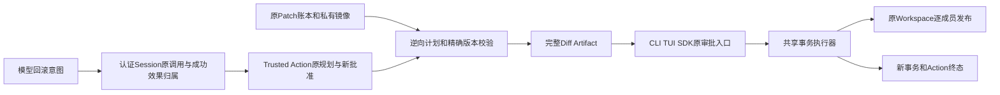
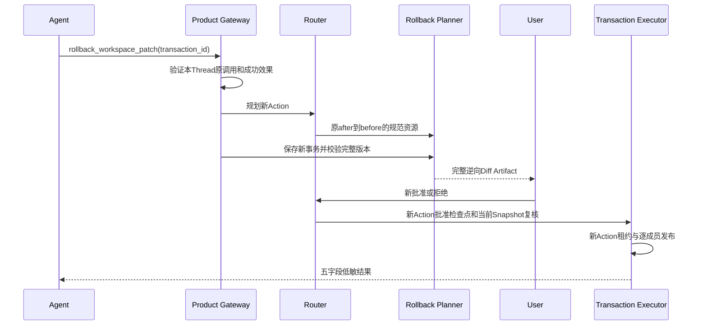
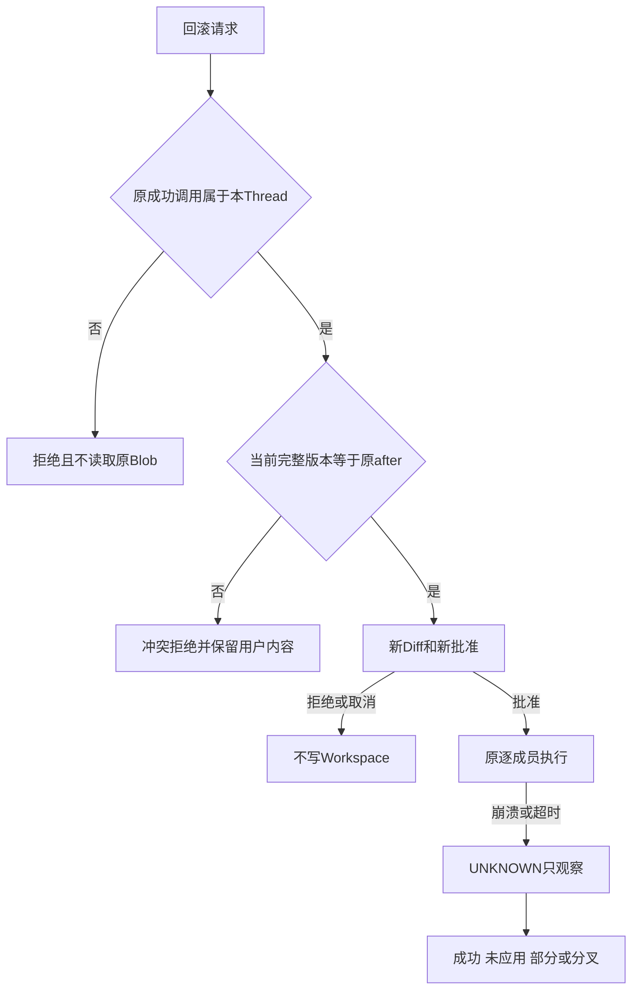

# 正式产品Patch回滚总体与详细设计

## 1. 需求背景与源码研究

多文件Patch已进入默认产品，用户需要撤销一次已成功发布的修改，而不是自行拼装逆向文件正文。
原`WorkspaceTransactionRuntime.build_rollback`是宿主组件：它读取当前状态重新规划，允许把第三内容纳入新计划；
没有Agent会话归属、模型Tool、产品目录和公开结果接线。因此不能直接将组件接口广告给模型。

[固定源码研究](../research/trusted-execution-and-delivery.md)区分Git tree恢复与Workspace事务。
本设计复用私有before/after镜像、现有Trusted Action批准与逐成员执行，不复用Git reset、原批准或独立服务。
产品回滚采用冲突拒绝语义；底层宿主组件的现行语义保持，不把两者混写。

## 2. 设计目标、非目标与决策

目标：当前会话成功Patch可用`rollback_workspace_patch`生成完整逆向Diff，经新批准后执行；
文件字节、存在性和模式全部匹配原after；会话重开、取消、超时和响应丢失沿原正式机制恢复。
原事务、批准及效果不改写，新事务使用新Action身份，原Key与完整产品备份布局不新增数据库。

非目标：任意历史事务、其他会话、Fork继承来源的回滚、部分Patch自动补偿、强制覆盖第三内容、
Git Commit/Checkpoint、重做、公网Push及自动合入。任务Worktree接线仍是独立未完成工作。
禁用`workspace_patch_enabled`同时禁用产品回滚；不新增浮动配置或独立权限体系。

取舍：把回滚作为独立高风险Tool而非扩展原Patch v1输入，保持原合同与旧调用可读。
同会话归属在产品Gateway构造规划上下文时验证，Router/Executor仍是可信宿主组件，不把其库调用视为终端用户接口。

## 3. 总体架构、模块边界与数据流



模型只提交原事务UUID。产品从当前已认证Thread查找原Patch ToolCall及成功ToolResult，
以Thread/Turn/Call确定性Action ID核对，继而核对原Router成功状态与Binding。
授权失败发生在原Blob读取和新Route保存之前；只持有同一Workspace不是跨会话批准。
Planner由原before构造逆向目标，由原after构造前置条件，Router捕获当前资源并冻结完整执行计划。
Review物化同身份新事务且验证版本，然后发布Session绑定Diff；答复只落批准，不立即写文件。

## 4. 核心流程、时序与伪代码



```text
authorize(thread, original_id):
  找到同Thread原Patch调用，确定性ID必须为original_id
  原配对ToolResult必须成功，原Router计划和结果必须一致
prepare(route, original_id):
  查询优先：已保存的新事务只校验，不重新规划
  原事务必须published、原Workspace身份必须一致
  原before -> 逆向目标；原after -> 当前前置条件
  独立Planner捕获当前来源
  每个新before == 原after；每个新after == 原before
  来源Snapshot必须等于原Route；保存新事务
execute:
  新批准消费 -> 租约 -> 原publish_next -> 新低敏结果
recover:
  原reconcile只观察；不重新准备、不续写、不复用原批准
```

## 5. 接口设计、类、数据结构与重点字段

| 符号 | 职责与合同 |
|---|---|
| `WorkspaceRollbackInput` | v1严格输入，唯一业务参数`transaction_id`；不得提交文件正文、根路径、批准或模式 |
| `WorkspaceRollbackTransactionPlanner` | 查询原成功账本，构造并核对完整逆向计划；不是执行授权来源 |
| `WorkspaceTransactionActionExecutor` | 抽取原Patch执行/只观察恢复逻辑；Patch与Rollback共用同一实现 |
| `WorkspaceRollbackReviewProvider` | 完整逆向Diff与原Session同归属发布；不写Workspace |
| 产品上下文归属验证 | 使用原认证Thread，拒绝跨Thread、Fork、未成功原调用和纯宿主事务 |

新Action `plan_id`同时是新Transaction ID；`request_id=action:<plan_id>`保持原事务幂等约定。
原事务ID只进入新调用参数，不替代新批准身份。资源摘要绑定逆向目标SHA、原after SHA及模式。
公开结果复用五字段：新`transaction_id`、`files`、`state`、`origin`、`diff_sha256`；成功时`state=published`。
成功投影另核对新ID和规范写资源数，不把任意Executor JSON作为公开成功正文。

### 5.1 正式输入、资源和完整版本

独立输入Schema为[`workspace-patch-rollback-input-v1.schema.json`](../../spec/workspace-patch-rollback-input-v1.schema.json)。
Descriptor版本为`harnessix.workspace-patch-rollback/v1`，唯一字段为原事务UUID；输入不另加版本字段，
版本由宿主捕获的Tool Binding与Schema摘要确定。额外字段、路径、正文或批准参数都由严格解码器拒绝。

```json
{"transaction_id": "00000000-0000-4000-8000-000000000001"}
```

该UUID示例不是已有可执行事务。实际UUID来自本Thread成功`apply_patch_batch`的五字段结果。
`resolve_workspace_rollback`只从原File Version推导资源：`expected_sha256=original.after.sha256`、
`after_sha256=original.before.sha256`、`mode=original.before.mode`，并收集文件写资源及父目录读资源。
不存在状态以`presence=absent`和空摘要表示，不把空文件与不存在混同。
Review才从私有Blob读取原字节，构造`DesiredWorkspaceFile`并沿原Planner独立捕获当前版本。

Blob允许原8 MiB单文件上限内的二进制和大文本；回滚不把原正文重新放入模型Patch输入，
因此不受原Patch文本输入长度和UTF-8限制。Diff Artifact仍受原完整预览预算约束，不能截断后批准。
新事务每个成员必须精确等于`(path, original.after, original.before)`，包括SHA、大小、模式与存在性。

### 5.2 调用链与类职责

```text
AgentRuntime → RouterBackedAgentActionGateway.prepare
  → ProductCallContext → authorize_workspace_rollback
  → TrustedActionRouter.plan → resolve_workspace_rollback
  → WorkspaceRollbackReviewProvider.review
  → WorkspaceRollbackTransactionPlanner.prepare → publish_workspace_review
  → 原Session Approval/CLI/TUI/SDK响应
  → Router批准Checkpoint和Claim
  → WorkspaceTransactionActionExecutor.execute → publish_next
```

`WorkspacePatchActionExecutor`保留原构造签名，仅向共享执行器提供原Patch加载器；
Rollback提供自己的加载器，不复制租约、成员发布、取消或对账状态机。
共享执行器继续使用新Plan ID形成`workspace-patch:<plan_id>`租约Owner，默认TTL 300秒，
合法范围大于0且不超过3600秒；模型不能控制TTL或Owner。

## 6. 持久化、一致性与兼容

不增加Session事件、Schema迁移或数据库；使用现有Action Audit、Execution Plan、Workspace Transaction及Artifact。
原事务保持append-only且published不变。新事务保存后崩溃可查询复用，Artifact发布后沿原持久审批恢复。
保存计划和Session投影并非同库事务：使用现有稳定ID与查询优先恢复，不虚构跨库ACID。
旧Patch v1输入、结果及配置保持；新Tool存在必须由当前能力报告证明。完整备份包含同一原事务库和Blob。

## 7. 失败、恢复、取消、超时与幂等



计划前及批准后漂移均拒绝；原after SHA相同但模式不同仍冲突。原创建文件逆向删除，原删除文件逆向创建。
拒绝审批、等待取消不写文件；执行取消只在成员边界生效，已写成员不假报回滚。
Router保留原Execute/Reconcile期限。成员同步文件IO仍不能被协作取消瞬间打断，离散观察不等于OS原子CAS。
响应丢失重开只观察新事务before/after，部分或第三内容保持人工处理，不自动重复写入。
对同一原事务发出新的调用，若文件已经回滚则前置条件不满足；原稳定调用可复用自身结果。

### 7.1 明确拒绝与未决效果分离

| 阶段/条件 | 持久事实与公开语义 | Workspace处理 |
|---|---|---|
| 上下文归属失败 | `workspace_rollback_not_owned`，failed，无新Route/虚构效果 | 不读取原Blob、不写文件 |
| 上下文参数失败 | `workspace_rollback_arguments_invalid`，failed | 无新执行授权 |
| Review版本冲突 | 以`system.validation`拒绝尚未批准Route，Route为denied；`workspace_rollback_conflict`，failed | 不保存逆向事务、不写文件 |
| 原修改已撤销后再次新调用 | 原Planner的`delivery_no_change`仅在本逆向规划中转为版本冲突 | 不伪装UNKNOWN、不遗留可批准Route |
| 等待未批准时取消 | CANCELLING且Route仍pending_approval，持久拒绝为denied；普通cancelled ToolResult | 无TrustedActionEffect，原Runtime关闭未决审批项 |
| 已批准ready、running或效果不确定 | 不适用上述确定未执行捷径，沿原保守恢复 | 不凭取消意图假报零效果 |

已知拒绝仅匹配正式builtin/product/rollback Binding的上下文或Review阶段，
不把自定义Resolver/Review异常及执行异常普遍当作确定未执行。
普通拒绝不投影伪造的成功/失败效果，也不冒充Session已完成批准；公开消息仍由固定码表重建。

### 7.2 默认产品硬退出时序

默认产品经原SDK批准三文件逆向事务后，在原发布器故障点由独立子进程`os._exit(73)`硬退出。
`member_recorded:0`已有一个成员持久完成；重开只观察，事务保留interrupted/cursor=1，
Agent继续路径以`uncertain_effect`拒绝，不请求模型、不自动执行剩余成员。
`effect_applied:2`已完成全部文件效果但最后Cursor尚未确认；重开通过原reconcile证明全部after，
仅完成账本对账并得到published/cursor=3。两种情况下重开前后的文件字节、存在性完全相同。
这是进程硬退出及原产品恢复证据，不是断电、全文件系统原子性或Windows11消费者验收。

## 8. 安全、公开错误与可观测性

授权先于Blob读取；不允许路径、Secret、批准或工具版本由模型覆盖。原事务必须属于正式产品Patch，
来源Workspace与原Action Snapshot一致。正文只走原Artifact保护；公开错误使用有限固定码与消息。
失败记录不包含文件正文、完整绝对路径或供应商凭据；原Action/Session ID用于关联，不新增日志内容出口。
同UID恶意宿主或直接私有库修改不在产品模型权限边界保证内，认证Session及原Store拒绝策略不放宽。

## 9. 部署、验证与回退

随唯一产品Wheel安装，CLI/TUI/SDK使用已有模型Tool与审批入口，不新增独立命令服务。
Windows只在原本机NTFS Patch端口验证时广告；macOS跳过不能证明Windows验收完成。
测试覆盖原创建/替换/删除逆向、完整Diff、新批准、同会话、跨会话、Fork、未知来源、第三内容/模式漂移、
重复新调用拒绝、等待取消、原事务不变、大文本/二进制、重开不重写、公开结果绑定、禁用与Doctor目录一致。
关联回归包含原Patch、Action、产品启动、协议/SDK、Artifact、维护备份及恢复。
回退可禁用Patch配置；旧版本缺新Tool Binding时拒绝未决恢复，不静默丢弃账本或补造批准。

## 10. 源码映射、风险与完成边界

| 源码/测试 | 阅读重点 |
|---|---|
| [`rollback_action.py`](../../src/harnessix/delivery/rollback_action.py) | 输入、Descriptor/Binding、纯资源解析、查询优先逆向Planner及版本冲突 |
| [`workspace_rollback.py`](../../src/harnessix/product_config/workspace_rollback.py) | 回滚归属入口、原错误映射与Review |
| [`workspace_patch_source.py`](../../src/harnessix/product_config/workspace_patch_source.py) | 共用认证Thread成功Patch、原Route和published事务Reader |
| [`action_composition.py`](../../src/harnessix/product_config/action_composition.py) / [`action_diagnostics.py`](../../src/harnessix/product_config/action_diagnostics.py) | 同能力门、不同Binding、唯一产品组合及无状态Doctor |
| [`workspace_patch_review.py`](../../src/harnessix/product_config/workspace_patch_review.py) | 唯一完整Diff Artifact发布、稳定ID和Session序列 |
| [`transaction_action_executor.py`](../../src/harnessix/delivery/transaction_action_executor.py) | 原租约、逐成员发布、finally释放、只观察对账 |
| [`agent_gateway_invocation.py`](../../src/harnessix/trusted_actions/agent_gateway_invocation.py) | 提取但不改变原确定性Invocation/幂等算法 |
| [`preparation_rejection.py`](../../src/harnessix/trusted_actions/preparation_rejection.py) | 已知执行前冲突与未批准取消的正式拒绝 |
| [`builtin_success.py`](../../src/harnessix/trusted_actions/builtin_success.py) | 五字段结果、新Plan ID及冻结写资源数绑定 |
| [`专项产品测试`](../../tests/product_config/test_product_patch_rollback.py) | Agent、原SQLite/文件端口、完整Diff和拒绝负例 |
| [`默认SDK与硬退出测试`](../../tests/product_config/test_product_rollback_sdk.py) / [`硬退出子进程`](../../tests/product_config/rollback_exit_worker.py) | 原Key、Sealed Session、产品重开及六库备份恢复，不替换执行器 |

专项证据及源码字节身份见[验证报告](../validation/product-patch-rollback-2026-09-30-v1/README.md)。
测试中的ScriptedProvider仅代替网络模型；产品、SDK、Key、Session、Artifact、事务与文件执行器均使用正式实现。
该切片不关闭R1～R6，不替代真实20 Trial、消费者Windows11、独立Beta或Git Commit/Checkpoint产品接线。
原宿主`build_rollback`允许第三内容进入新Diff的行为仍存在，但不被默认模型Tool广告；
产品Tool明确冲突拒绝，不把两种语义混同。三平台功能结果必须按同候选实际取得。


## 共用来源Reader的当前实现

回滚归属入口委托`load_owned_workspace_patch`核对本Thread原Call、配对成功Result、
稳定Invocation ID、原成功Route指纹/参数及published Transaction。
`workspace_patch_source_not_owned`映射为原`workspace_rollback_not_owned`；
非published来源映射为原`workspace_rollback_source_invalid`。其他原正式Reader错误保持原链路处理。

该Reader同时支撑[产品Git来源前置切片](m09-r4-product-git-delivery-source.md)，
不将Git来源Digest转为回滚批准，不改变逆向Diff、精确after前置条件、执行器、六库备份或恢复规则。
原专项历史材料仍固定原候选；当前回归与安装包身份见
[后继专项交付](../validation/git-delivery-source-2026-09-30-v1/README.md)。
