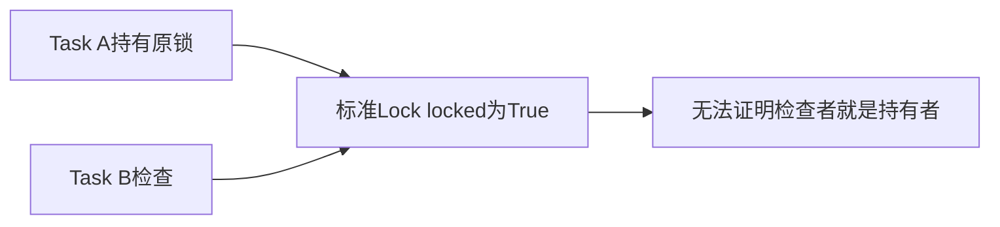
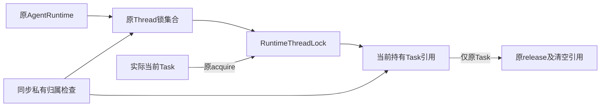
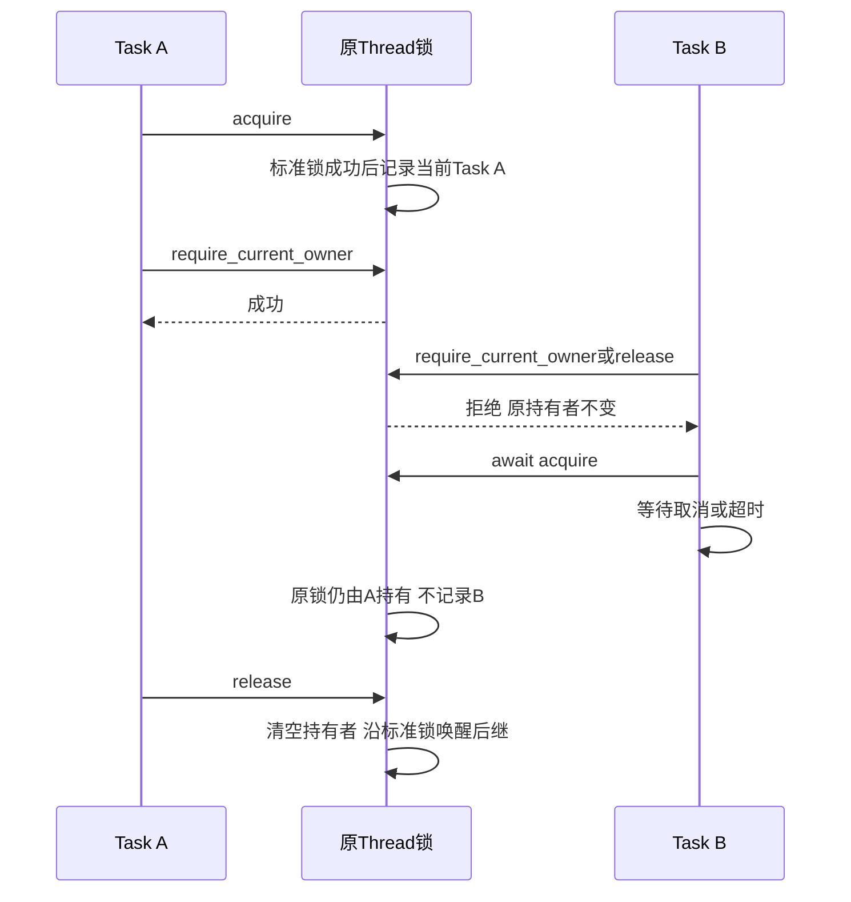
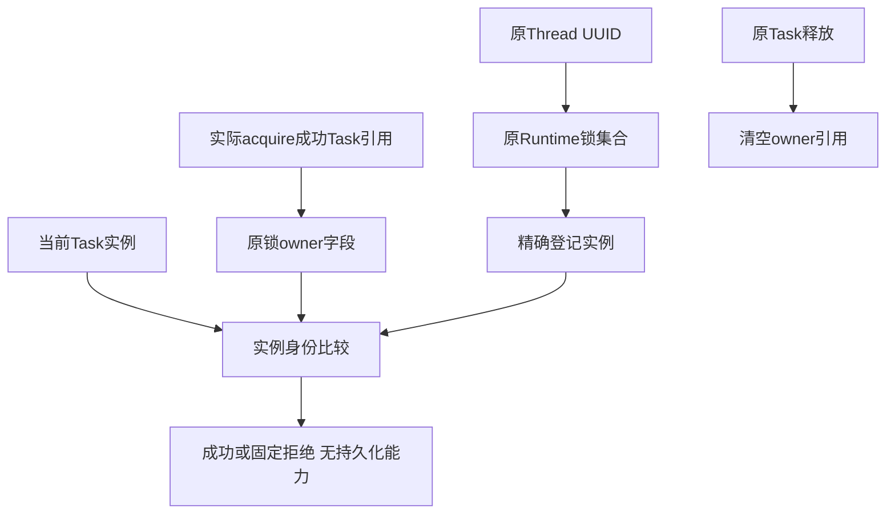

# 原 Agent Runtime Thread 锁的 Task 归属总体与详细设计

## 1. 变更摘要

本切片为原 Runtime 的进程内 Thread 锁记录实际持有 Task，提供同步私有归属检查。
不新增执行权限或持久字段，不装配默认 Git Writer，不把该原语称为完整 B7 关闭。
原 `_lock(thread_id)` 返回类型与异步上下文调用方式保持兼容；锁仍属于同一 Runtime 的同一 Thread。
`observe_owner()`另提供同次持锁的只读观察：仅当前持有者可以签发，冻结原 Task 和每次 acquire 的独立代际。
它允许受管验证子 Task 观察父 Task 仍持原锁，不授予当前 Task 持有者权限或 SQL 能力；
释放后同 Task 重新 acquire 也永久撤销旧观察。实际消费者见
[Git 原 Runtime Thread 绑定](m09-r4-git-runtime-thread-scope.md)。

## 2. 需求背景与源码研究

[原 Git 宿主要求](m09-r4-git-approved-link.md#131-真实阻塞及关闭条件)要求借用实际 Runtime 锁，
而非另建同名锁。标准 `asyncio.Lock.locked()`只表示某个 Task 持有锁：另一个 Task 同样得到 True，
不能证明当前 Task 正在原锁的临界区内。
原 Runtime 的 `_locks` 保存 `asyncio.Lock`，审批、Session CAS 和关闭流程均复用该集合；
缺口是持有者来源，不是缺少互斥或应当再新增一个 Git 锁。

## 3. 设计目标、非目标与验收标准

在成功 acquire 后记录实际当前 Task；只有该 Task 可以通过归属检查或 release。
等待取消／超时不得记录等待者为持有者，不改变原锁竞争与唤醒规则。
释放后清空引用，避免已结束 Task 被锁长期保留。未登记 Thread 的检查拒绝且不能创建新锁。
验收覆盖真实 Runtime、多 Thread、另一 Task、未锁、取消等待、超时、后继竞争和关闭兼容。

不承诺所有 Runtime 分派全程持锁，不证明 SQLite 实际 FD、跨进程互斥、Git Ref／配置终端一致性，
不签发可复制持有者 Token，不向 SDK／模型暴露内部锁。

## 4. 当前实现与根因



给定同一个 Lock，`locked()`在持有者和其他观察者中没有差别。Thread UUID、Runtime 引用、
检查布尔值或新建锁都不能补出实际 acquire 的 Task 来源。
因此记录必须位于原 acquire／release 生命周期，而不能放在业务 Reader 的猜测分支里。

## 5. 总体架构与模块边界



组件沿标准异步锁的互斥与公平等待机制，仅补实际持有者事实。Runtime 集合是锁身份所有者；
业务模块不能提交一个外来 Lock 或布尔值。检查只返回成功或有限错误，不返回执行能力。

## 6. 正常、失败与恢复时序



锁归属为进程内事实，不做跨进程重放或持久恢复。Runtime 重启后使用新锁集合；
旧审批和 Session 的持久恢复规则不改变，历史批准不能通过此原语变成新执行权。

## 7. 接口设计

| 接口 | 正式语义 |
|---|---|
| `RuntimeThreadLock.acquire()` | 等待标准 Lock；成功后绑定实际 `asyncio.current_task()` |
| `require_current_owner()` | 原锁必须被持有且当前 Task 就是记录的原持有者，否则拒绝 |
| `observe_owner()` | 原持有者签发只读闭包，冻结原 Task 和本次独立 acquire 代际；不授予持锁权限 |
| `release()` | 先核对当前持有者，再释放原锁并清空 Task 引用 |
| `AgentRuntime._lock(thread_id)` | 复用或建立 Runtime 原集合成员；保留原 `asyncio.Lock` 返回类型 |
| `AgentRuntime._require_thread_lock(thread_id)` | 只检查该 Runtime 已登记的实际成员，不建立锁、不消费外来证明 |

原 `async with runtime._lock(thread_id)`入口不变。不提供管理、强行解锁或跨 Task 转交选项。

## 8. 数据结构、重点字段与数据流程

`_locks: dict[UUID, RuntimeThreadLock]`将 Thread 身份绑定到原实例。
每个锁保存当前 Task 引用及 `_owner_generation: object | None`。
每次成功 acquire 新建独立对象代际；等待取消不改写它，release 同时清空两字段。
空值表示没有成功持有者，不能解释为“任意 Task 可以释放”。
Task 比较为实例身份，不使用 Task 名称、整数 ID、ContextVar 字符串或调用方声明。
状态流为未持有→标准 acquire 成功／原 Task 记录→检查→原 Task release／引用清空。
等待者不进入该状态机的持有者字段，不能通过等待或取消改变原持有者。



Thread身份只用于取原集合成员；实际Task引用来自成功获取，不来自调用方输入。
检查沿这两份原事实比较，不复制、序列化或长期保存结果；释放流只清理当前锁中的Task引用。

## 9. 核心逻辑与持久化、事务、并发

```text
acquire:
  沿标准asyncio.Lock等待
  成功后读取实际current_task并记录
require_current_owner:
  locked为真 且 当前Task非空 且 当前Task is 记录Task
  否则固定拒绝；不改变任何锁状态
release:
  原持有者检查通过
  清空引用并沿标准Lock释放
Runtime检查:
  只取原字典已登记成员；不存在或非精确组件均拒绝
  在该实例执行当前Task检查
```

无 DDL、事务日志、Key、Lease 或新锁集合。异步 acquire 是唯一等待点，
成功记录与 release 内不额外 await，不在二者之间调用外部回调。

## 10. 失败、恢复、取消与超时

错误持有者、未锁、未登记或外来成员失败时不得释放原锁、改写归属或创建成员。
固定错误码为 `runtime_thread_lock_unowned`，不输出内部对象。
标准等待取消和 `asyncio.timeout`清理沿原实现，保证被取消的等待者不影响已有持有者。
上下文内原异常仍由原 `async with`退出传播；检查错误不转换业务错误，也不屏蔽原取消。
无重复执行、超时续期或“历史锁重新有效”的恢复机制。

## 11. 安全、权限及可观测性

归属检查只是精确原 Task 事实，不是批准、执行 claim 或可序列化能力。
不得把独立子 Task 中的检查结果转交原 Task 使用；确需受控子任务观察的 Git 端口须另按其既有合同设计。
错误输出只保留有限错误码和正式提示，不输出 Task、Thread 正文或内部对象地址。
同一进程中的任意恶意 Python 私有字段修改不是该原语的隔离边界；对公开客户端的安全仍靠原协议及受信组合根。

## 12. 测试验证与源码映射

阅读顺序为[新锁原语](../../src/harnessix/agent/runtime_thread_lock.py)、
[Runtime 组合](../../src/harnessix/agent/runtime.py)、
[实际 Task 与 Runtime 用例](../../tests/agent/test_runtime_thread_lock.py)、
[原审批链](../../tests/agent/test_trusted_action_runtime.py)和
[审批恢复](../../tests/agent/test_approval_crash_recovery.py)。
原 Task 归属、现有 Runtime 行为、安装候选一致性各自验证，不相互替代。
终态结果及候选绑定见[切片交付报告](../validation/r3-budget-v2-runtime-lock-2026-10-08-v1/README.md)。

## 13. 部署、兼容、升级与回退

无新依赖、平台服务或公共协议版本。标准 asyncio 原语不引入 POSIX 专属端口；
本机测试不能外推为 Windows／Linux 实际产品验收。
 `_lock`的返回类型及原上下文消费保持；跨 Task 强行 release 不属于原 Runtime 的合法用法。
回退替换完整匹配的产品候选，不能把已返回的归属检查当成长期有效证明。

## 14. 风险、取舍与 R4 开放门禁

复用原锁而非新增锁，避免双临界区或扩大公开合同。
本切片为 B7 的必要基础，实际 Git 调用仍需绑定原 Runtime、正确原 Task 及整个要求的临界区。
SQLite 实际 FD、全部分派覆盖、B4 末端 Ref／配置保护、P1 响应性、正式决定 Writer、
默认 Checkpoint／Commit、Backup2 及三平台完整编码仍分别开放。默认 Git 写工具保持不装配。
