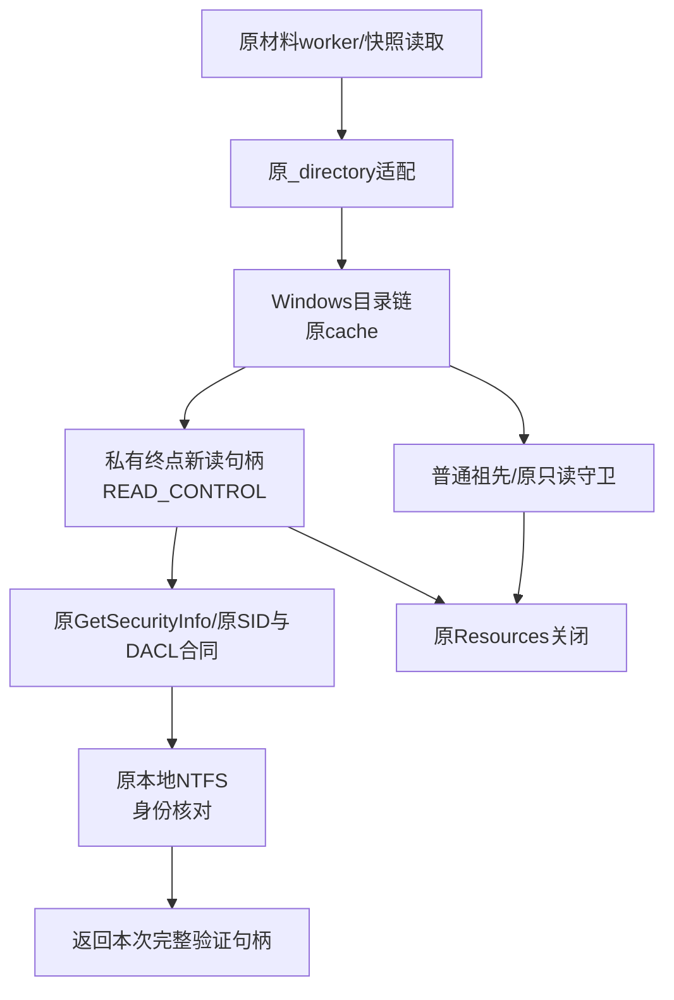
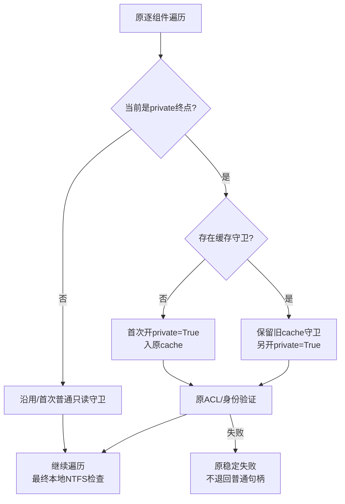
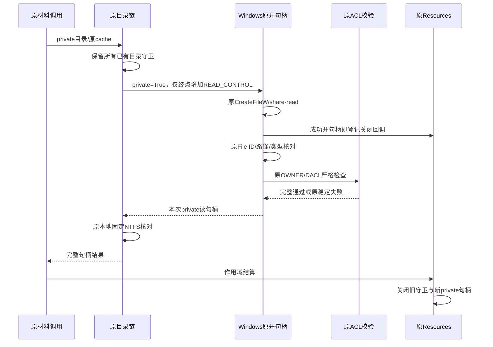
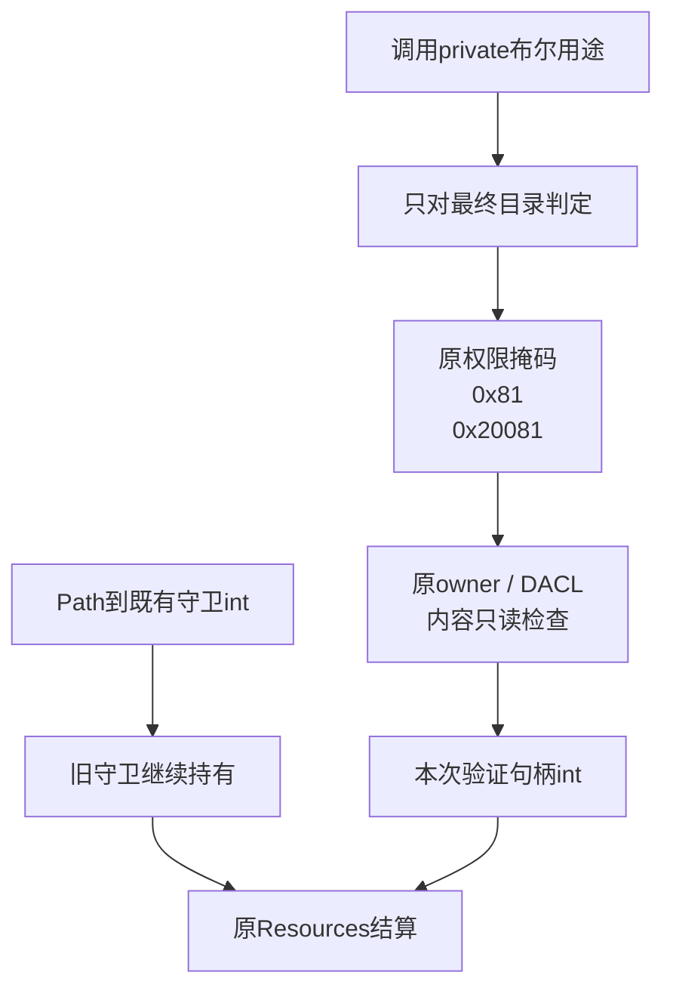

# Windows材料目录链：私有安全信息读取权限总体与详细设计

## 1. 需求背景与实际失败

固定6daff31的[CI 36812510928](https://github.com/carrie1988/Harnessix/actions/runs/36812510928)
已取得原NTFS组128通过/2跳过、原Git读取组成功。后继原认证raw及Git基准组25失败、1260通过/6跳过，
并达到原五分钟期限。材料首次写入、完整对象回读及实际快照故障屏障未全部通过，不能当作商用支持。

上层在控制输入可能送达后将失败严格归类为`git_material_effect_unknown`，不公开任意子程序错误正文。
这一保护不能被绕过来制造成功。源码检查发现目录链开句柄缺少私有ACL查询所需的READ_CONTROL，
随后却用该句柄读取OWNER/DACL；这是一项确定缺陷，但尚不能独立解释原25项全部失败。

## 2. 源码研究与设计目标

[Microsoft GetSecurityInfo合同](https://learn.microsoft.com/en-us/windows/win32/api/aclapi/nf-aclapi-getsecurityinfo)
明确要求查询owner/group/DACL时，在开句柄时获得READ_CONTROL。身份属于当前用户并不替代句柄授予权限。

原`_Windows.open`仅在`private=True`时请求`0x20000`，由`_held_access`形成`0x20081`；
`_chain`原先无条件按普通目录开缓存，再在private终点调用`api.private`，因此终点句柄只有`0x81`。

设计目标为按实际用途请求查询权限、保留目录真实读访问共享保护、重验原ACL，并保持缓存兼容。
非目标：升级文件写/删除权限、放宽ACL、修改批准/Owner/预算、改变材料容量、重试未知效果或修改原CI期限。

## 3. 总体架构与模块边界



`_directory`仍是唯一跨平台适配，POSIX路径不变。Windows `_chain`负责目录组件/缓存和最终本地NTFS核对，
`_open`负责真实路径身份、属性及按需私有ACL；不新增权限平台或业务执行入口。

## 4. 源码对应、接口设计与重点字段

| 符号 | 位置 | 实际职责 |
| --- | --- | --- |
| `_directory` | [git_material_native.py](../../src/harnessix/delivery/git_material_native.py) | 把private要求传给原Windows链；POSIX合同保持 |
| `_held_access` | [git_material_native_windows.py](../../src/harnessix/delivery/git_material_native_windows.py) | 普通`0x81`；private额外READ_CONTROL；不增加写/删除 |
| `_open` | 同文件 | CreateFileW、实际数据读取及share-read、原身份检查、按需ACL验证 |
| `_chain` | 同文件 | 首开private终点或缓存情况下另开private终点，始终保留原守卫 |
| `_private` | 同文件 | OWNER/DACL、保护位、两ACE、用户/SYSTEM与原完整掩码，不改校验条件 |
| `_Resources` | [git_material_native.py](../../src/harnessix/delivery/git_material_native.py) | 持有目录/文件句柄，结算关闭整个作用域 |

签名不变：`_chain(api, path, resources, cache, *, private=False) -> int`。
`cache: dict[Path, int]`仍保存既有目录守卫，不改为可序列化授权或ACL通过标记。
`private_target = private and current == path`只决定终点用途，祖先不自动获得READ_CONTROL。
返回值为本次完成ACL与NTFS核对的句柄；它可能不同于缓存旧普通句柄。

## 5. 核心流程、接口失败与伪代码



```text
for 原路径每一组件:
    old = cache.get(current)
    private_target = private and current == path
    if old不存在:
        handle = api.open(current, resources, directory=True, private=private_target)
        cache[current] = handle
    elif private_target:
        保留old及全部祖先守卫
        handle = api.open(current, resources, directory=True, private=True)
    else:
        handle = old
按原DriveType和GetVolumeInformation验证本地NTFS
返回本次handle
```

新private开句柄内先比较实际File ID/路径/类型，再执行原ACL校验。缓存命中不代表ACL仍可信，
后续private观察仍显式重验；失败不回退到旧普通句柄，也不补签旧状态。

## 6. 调用时序与资源生命周期



不能为补权限先关闭旧守卫；该动作会重新打开路径替换窗口。新句柄仍只共享读取，
不共享写/删除；全部句柄由原Resources结算，不增加跨调用Lease或持久授权。

## 7. 数据结构、数据流程与持久化



权限授予和ACL校验是本次内存/内核状态，不写数据库、对象正文、工作树或Ref。
Manifest、implementation_digest、保护扫描及worker证明保持原合同；实现摘要随实际源字节变化，
不声称修复前后摘要恒定，也不使旧计划重新获得执行权。

## 8. 异常、安全边界与恢复

开句柄失败、Root身份/路径漂移、ACL异常或卷类型不符仍由原稳定错误拒绝。
READ_CONTROL只允许查询安全描述符，不包含WRITE_DAC/WRITE_OWNER/FILE_WRITE_DATA/DELETE。
原READ_DATA及FILE_SHARE_READ语义保持，不能退回metadata-only来避免共享冲突。

取消/期限、真实Root/Owner、输入上限8MiB和原32MiB镜像限制均未修改。
UNKNOWN仍不能自动重放。本切片没有半份持久状态需要恢复，不修改实际账本或业务备份范围。

## 9. 可观测性、诊断与错误码

只传播原`git_material_private_invalid`、`git_material_binding_changed`和平台拒绝等固定码。
正式Owner的MAC、PID、EOF及结果结算检查保持；不公开stdout/stderr正文来推断成功。
原native失败和源码红测试分别保存，实际结果绑定源字节和固定CI Job。

## 10. 部署、兼容性与方案取舍

无新增依赖、DB迁移、公共API、产品配置或默认权限模式。
普通目录访问仍请求最小`0x81`；需要private时按用途请求`0x20081`。
缓存旧普通句柄保留，再开私有句柄的成本是少量额外句柄/ACL读取；
收益是避免假设旧句柄拥有READ_CONTROL，同时保留原路径保护和每次ACL重验。

原材料raw组仅新增六项新回归选择器，全部原选择器、顺序和五分钟保持；原首NTFS组三分钟不变。
本机模拟权限检查不等于Windows系统授予，必须执行两个原生测试及原25项真实关联后才能收口原生缺陷。

## 11. 完整测试与失败恢复矩阵

| 场景 | 断言 | 当前证据边界 |
| --- | --- | --- |
| 首次private终点 | 请求READ_CONTROL，原ACL检查成功，祖先无额外查询权 | 模拟正控；不是NTFS |
| 已缓存普通终点 | 原守卫不断开，另开private读句柄，cache结构不变 | 模拟正控 |
| 普通目录 | 全部原最小掩码，无private查询 | 模拟正控 |
| 重复private观察 | 每次重验ACL，全部作用域资源关闭 | 模拟正控 |
| 两种缓存状态真实NTFS | 正式私有目录及实际GetSecurityInfo完整通过 | Windows执行待取得 |
| 原材料/8MiB/快照/Owner/CAS | 原字节、PID、MAC、EOF、UNKNOWN、取消/超时合同 | 本机关联不替代原生 |

前修负对照3失败/1通过/2原生跳过；后修六文件关联98通过/4原生跳过。
原CI25项失败与五分钟终态保持，不由这组本机通过改写。

## 12. 风险、验收与后继

该缺陷具有官方权限前置和确定性红测试依据，但原生失败可能还有其他根因。
修复候选须完成完整输入冻结、静态/治理/文档、实际Wheel/源码外相关验证、独立审查及原生CI。
正式结果以[统一验证包](../validation/windows-material-directory-access-2026-10-01-v1/README.md)为准。

不关闭完整R3、默认Commit/Checkpoint、完整Git业务备份、Windows11消费者或独立Beta。
本设计是安全链修复，不把局部回归或单次原生步骤成功当作商用发布。

## 13. 关联Git差分夹具整改与完整回归边界

同一固定CI的macOS、Python3.12及Python3.13三个任务各有两项失败，均位于
[`test_git_tree_projection.py`](../../tests/delivery/test_git_tree_projection.py)：
运行Git为2.55.0，夹具却要求输出精确等于2.53.0。macOS记录5835通过/112跳过/2失败，
两个Python任务各7861通过/140跳过/2失败；这些原失败保留，不改写为成功。

整改目标是把研究版本与执行能力分开，不在生产代码增加版本兼容分支。
差分测试复用[`native_repo`](../../tests/delivery/test_git_object_references.py)既有夹具，
删除重复的本地命令包装和版本断言，并把测试函数名中的研究版本后缀移除。
夹具仍要求PATH中的Git真实存在，关闭系统/用户配置、交互及自动补取，记录实际版本，
每条真实命令仍以check=True和20秒期限执行；不支持SHA256、命令失败或超时均失败，不转为跳过。

两种对象格式的完整场景保持：原CAS读取旧/新blob，真实hash-object验证blob OID，
mktree构建空目录、可执行子目录和完整根，cat-file逐项对比完整root及新增tree正文。
测试创建bare合成仓库，不执行用户仓库命令、生产Checkpoint或Commit。
原夹具已有2.53.0、2.55.0及Windows版本字符串记录回归和缺失Git拒绝；这里只复用，不复制第二套实现。

本机两个文件430项全部通过并记录实际2.53.0；这不是实际2.55.0执行证明。
新候选须以CI真实Git重新执行全部原差分。本节只修复测试环境假设，不能替代Windows权限、
R3真实编码、完整Git产品交付或商用门禁。
