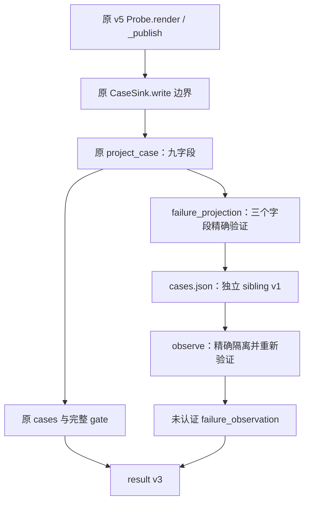

# Windows 材料有限失败投影详细设计

## 1. 需求背景、设计目标与当前范围

原 v5 探针已经发布 `post_stderr_signals`、`post_worker_failure_status`、
`post_git_trace2`，但定点观察器只保留九字段案例。新增纯内存有限投影接缝，
把这三项观察经 `run_cases` 传到未认证结果，不改变 Git 操作生命周期或效果认证。

兼容源码基线为上述 `code_revision`，不是增量实现的提交身份。实现身份由验证包的
逐文件 SHA256 表达；不能把基线提交、原生执行提交或旧脚本摘要
当作本候选身份。固定原生 Run `37080708999` 的 revision 为
`10d58c597f08d81e4201879e1b9c70fd37454aa6`：A/B Git 返回 128、Worker 返回 2，
三个 marker 语法计数均为 0、Root 为 `UNKNOWN`。有限失败接缝没有新的原生执行证据。

当前实现只是脚本诊断模块，不是默认产品功能、认证通道、故障修复或自动恢复方案。
Git 操作生命周期、完整产品验收、唯一根因确认均不属于该接缝。

## 2. 总体架构与模块边界

| 模块 | 当前责任 | 明确不承担的责任 |
|---|---|---|
| 原 v5 probe | 原 13 hook、原结束后观察与一次完整帧发布 | 新增 hook、额外 raw 读取 |
| `projection.py` | 原 `project_case` 九字段、原 marker 见证 | 失败诊断新字段 |
| `failure_projection.py` | 三项有限字段的精确验证、重建与 sibling 隔离 | 解析 raw、认证 MAC、解释 errno、推断 Git 效果 |
| `run_cases.py` | 保留 CaseSink 边界，追加有界 sibling 案例 | 修补坏帧、放宽 parser、改变 pytest 参数 |
| `observe.py` | 原 result 与完整 gate，独立未认证 sibling | 用诊断阳性替代完整 gate 或 SDK 验收 |

调用关系：



新增 helper 不依赖生产 Git 生命周期，不回调 probe，不打开文件或网络。
`project_failure_case` 只在同一帧通过原 `project_case` 后调用，复用其已通过的
v5 版本、A/B、win32、13 hook、唯一 write 与原 outcomes 前置条件。
同一内存 JSON 再次采用原 `unique_object` 解码，重复键仍由原异常路径拒绝。

## 3. 接口设计与固定领域契约

### 3.1 数据结构与传递封装

`cases.json` 的原三键 `pytest_exit / cases / invalid` 保持；只允许精确新增一键
`unverified_failure_observation`。其 schema 为
`harnessix.git-native-failure-observation/v1`，assurance 始终为
`UNAUTHENTICATED_DIAGNOSTIC_ONLY`。

Sibling 对象精确四键：`schema / assurance / case_shape_state / cases`。
结果默认 `NOT_AVAILABLE`；发送端状态为 `FINITE_AB / EMPTY / REJECTED`。
`FINITE_AB` 只表示严格有界的 A/B 结构，不表示三个字段都可用，更不表示认证成功。
两案例必须各一条且顺序 A、B；列表超过二、重复案例、额外键或错误类型均拒绝。
`EMPTY` 只允许同时不存在原案例；坏 sibling 不隐藏原案例或改变原完整 gate。

每行精确五键：`case / field_states` 加上述三个原字段。
`field_states` 精确包含三项，每项为：

| 状态 | 载荷 | 含义 |
|---|---|---|
| `FINITE` | 通过精确合同的原值 | 合法有限观察；未独立认证 |
| `NOT_AVAILABLE` | `null` | 原发布帧没有此字段；不补成 false 或 not_observed |
| `REJECTED` | `null` | 字段存在但违反合同；不修补、不发布坏载荷 |

### 3.2 原九项 bool

`post_stderr_signals` 的键集合必须恰好为：

```text
worker_failure_literal
git_temp_create_prefix
git_object_db_permission_prefix
git_malformed_object_literal
READ_ERROR
SHORT_READ
HASH_FD
LOOSE_WRITE
LOOSE_CLOSE
```

所有值必须是实际 `bool`，不接受整数 0/1、null、字符串或容器。
缺键、增键、重复 JSON 键与类型错误不能透传。信号阳性不是唯一 caller、errno 或根因；
阴性也不能证明未进入某分支。

### 3.3 原失败状态

`post_worker_failure_status` 必须是实际字符串且等于
`not_observed / invalid / valid` 之一。其中 `invalid` 是原有限失败帧解析的观察状态，
不是 sibling 自身 schema 错误；`valid` 也不是业务效果或 MAC 已认证。
不输出 `post_worker_failure` 帧内容，不添加阶段、错误链、PID 或 errno 字段。

### 3.4 原 Trace2 七字段

只消费已发布的 `post_git_trace2`，不再次解释原 stderr 或 Trace2 事件。

| 字段 | 精确范围 |
|---|---|
| `profile_status` | `OFF / UNAVAILABLE / MATCHED / MISMATCH` |
| `completeness` | `KNOWN / UNKNOWN` |
| `reason` | `NONE / RAW_UNAVAILABLE / LIMIT / PROFILE_MISMATCH / STREAM_BINDING_MISMATCH / UNKNOWN_EVENT_OR_SCHEMA / UNEXPECTED_EXECUTION_EVENT / UNCLASSIFIED_FORMAT / RETURN_UNAVAILABLE / MISSING_EVENTS / RETURN_MISMATCH / MALFORMED_FRAME / UNCLASSIFIED_STDERR` |
| `stage_witnesses` | 原固定顺序的有序子集；上限 3，禁止重复 |
| `error_format_ids` | 原固定六项 ID 的排序子集；上限 6，禁止重复 |
| `return_consistency` | `UNAVAILABLE / MISMATCH / MATCHED_ZERO / MATCHED_128` |
| `source_profile_id` | `null` 或固定 `harnessix.git-material-trace2-profile/v1` |

三个阶段为 `ENTRY_START_MATCHED / DISPATCH_HASH_OBJECT / REPO_EVENT_SEEN`。
六项格式为 `SETUP_EXPLICIT_NOT_REPOSITORY / SETUP_GITDIR_ENV_BOUND /
HASH_OBJECT_ADD_AGGREGATE / HASH_OBJECT_HASH_AGGREGATE / OBJECT_FORMAT_MALFORMED /
GENERIC_DYNAMIC_FORMAT`。格式目录与原实际投影由测试交叉核对。
固定 Profile ID 只是目录标签，不代表本候选重新验证 PE/PDB 或复用旧脚本执行身份。

## 4. 核心处理流程

```text
CaseSink 收到原完整协议行：
  保持原 write / pending / UTF-8 / 两帧上限
  原 project_case 先验证并生成九字段案例
  新 helper 读取同一内存行的唯一 write：
    对每项固定字段：缺席 -> NOT_AVAILABLE
    类型或固定键/枚举不符 -> REJECTED、null
    合法 -> FINITE、只重建固定键和有限列表
  run_cases 原三键报告加精确 sibling

observe 原文件存在且 <=8192 字节：
  原 unique_object 解码
  恰好原三键加 sibling -> 精确分离
  sibling 严格复验；只重建固定字段，不共享可变列表/字典
  原完整 gate 使用原三键和原九字段，不消费 sibling
  新数据放入 unverified_execution_observation.failure_observation
```

Sibling 的存在不改变原 `invalid`、`pytest_exit`、marker 计数、`branch_witness`、
`branch_gate_passed`、原状态机和退出值。外层报告还有任何未知额外键时不隔离，
保持原三键观察分支的拒绝行为；旧 gate 的既有算法不改。

### 4.1 数据流程与持久化边界

原Probe帧经原CaseSink内存边界形成`cases.json`；原观察器读取该固定文件后，将
重建的有限投影存入`result.json`未认证命名空间。没有数据库迁移或业务状态事务，
诊断文件缺失、字段被拒绝或写入失败不能生成成功效果。结果摘要回执只绑定结果字节，
不认证Git来源、执行授权或唯一根因；旧有限结果未保存的字段不回填。

## 5. 异常、安全、失败恢复、取消、超时与风险取舍

- 原 CaseSink 单次 write 和 pending 上限 65536 字符、原投影 65536 UTF-8 字节门不改。
- 原 `cases.json` 8192 字节门和私有 debugger 日志 16 MiB 门不改；新载荷仅二行固定数据。
- 未完协议、额外第三帧、重复 JSON 键、坏 UTF-8 和原异常类型保持。
- `F + 完整帧` 分别 write 时沿用原同步逻辑；同一 write 内噪声加 prefix 仍不恢复。
- 原 source 16 项、原 13 hook、PE/PDB/PATH 检查、预算 20/45/300/240 均保持。
- 不发布正文、动态操作路径、SID、PID、errno、MAC、环境或异常文本，不访问 Keychain 或模型。
- 原 raw 验真标签仍只表示已观察原 probe 结果；本接缝不独立验签，不能提升 assurance。
- 缺失、被拒绝和实际有限阴性分开，避免把未知故障错误编码为“没有信号”。
- 独立 sibling 比扩展九字段更容易保持旧门和历史解释；重复解析同一有界内存帧的成本
  小于改变原 `project_case` 接口、扩大 probe 或引入通用透传的兼容风险。
- 数据从固定集合重建，避免原字典/列表别名在有限字段核验后注入动态内容。

## 6. 验证与部署维护

专项测试覆盖原实际 `Probe.render / _publish` 的单次 write，穿透
`CaseSink / run_cases.main / observe.observation_result`；pytest 出口仍为非零。
missing、wrongtype、extra、重复、overlimit、有限列表顺序、同写噪声、分段帧、
未完 EOF、旧完整 gate、原结果与原异常型均设负例。

兼容差分从固定 `b812332` Git 对象内存加载原 observer，不读取其他工作树，
不复制或修改旧冻结验证包。原 235 项观察器用例必须单独保持通过。
本机真实 Git 的 SHA256 Completion 附加用例要求宿主支持 `--object-format=sha256`；
Apple Git 2.24.3会在仓库初始化前置处失败，该失败保持原件；支持SHA256的固定Git
环境须单独登记身份和验证结果，不更改生产代码、夹具断言或历史失败。

部署没有数据库迁移、产品注册或调度变更。候选只在完整文件摘要、专项回归与评审完成后
进入源码发布候选；源码合入不等于原生Run成功。现有历史有限结果不能回填未保存
的三个字段，应显示 `NOT_AVAILABLE`。原生根因仍为 `UNKNOWN`，不能用离线 GREEN
关闭 Windows Git128 或 SDK 验收。

### 6.1 可观测性与错误分类

每项字段区分`FINITE / NOT_AVAILABLE / REJECTED`，案例封装另区分有限A/B、空和拒绝；
未认证标签恒定。原`pytest_exit / invalid`、marker计数、完整gate和SDK结论原样保持。
坏字段不携带原载荷，诊断阳性不能关闭Root UNKNOWN；诊断缺席也不证明没有Git进程。
取消、超时和日志上限继续由原执行载体负责，新增纯投影无重试、后台任务或续写能力。

## 7. 源码导航

- [独立有限投影](../../scripts/windows_git_native_branch_observation/failure_projection.py)
- [原两例发布接缝](../../scripts/windows_git_native_branch_observation/run_cases.py)
- [结果有限投影](../../scripts/windows_git_native_branch_observation/observe.py)
- [专项接缝与差分测试](../../tests/governance/test_windows_git_native_failure_projection.py)
- [当前模块说明](../modules/windows-git-native-observation.md)
- [既有正式 v3 架构](m09-r4-git-native-execution-envelope-v3.md)
