# Windows最低SHA256 Commit单次原生诊断：总体与详细设计

## 1. 需求背景与设计目标

固定554618c的原生材料组仍有两个最低SHA256 Commit场景失败，1289项通过、6项跳过，
303.12秒达到原五分钟期限。原对外git_material_effect_unknown是保守效果分类，不证明Git开始或写入。
此前READ_CONTROL缺陷的修复不等于剩余两个用例具有相同根因。需要把原调用内阶段与原退出后有限只读证据区分，
在不修改原业务断言、20秒命令、45秒操作或五分钟验证期限的条件下定位失败位置。

本变更提供显式加载的pytest侧车与仅手动工作流。目标是保留原执行结果、取得有界低敏观察、明确观察缺口。
不修改任何生产代码、原测试、默认pytest插件、Owner合同、权限／共享标志、评分、任务包或恢复策略。
不修复未定位缺陷，不承诺零测量开销，也不把本机成功解释成Windows成功。
输入、原失败和各验证范围见[统一验证包](../validation/windows-minimum-commit-probe-2026-10-01-v1/README.md)。

## 2. 总体架构与边界

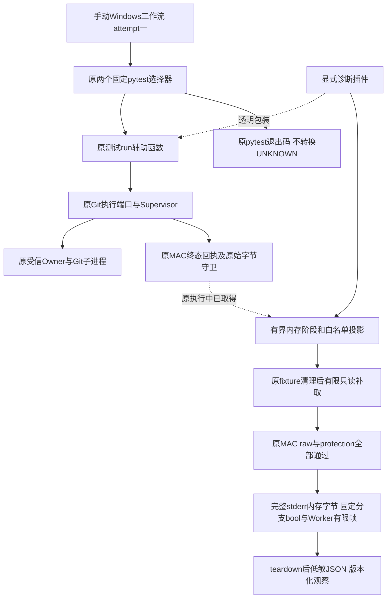

插件只观察原对象，并在同一进程的测试域使用ContextVar。未显式-p加载时不存在副作用。
工作流仅两个原节点，不增加全量重试，不自动触发，也不更改正式CI的测试范围。
同一Run attempt大于一直接拒绝；fresh basetemp预存在或无法核查即拒绝，不删除／复用已有fixture。

## 3. 源码研究、决策与模块映射

| 责任 | 实际源码／符号 | 约束与取舍 |
| --- | --- | --- |
| 显式插件、投影和包装 | [git_minimum_commit_probe.py](../../tests/product_config/git_minimum_commit_probe.py)：`Probe`、`Operation`、`_async_wrapper`、`_sync_wrapper` | 非test_模块，不注册全局pytest_plugins；同步内存采集不是零成本 |
| 原测试作用域 | [test_git_delivery_process.py](../../tests/product_config/test_git_delivery_process.py)：`_run`；`_operation_wrapper` | 原两个用例均经module._run调用，不漏改导入别名；task／线程沿原Context传播 |
| 原执行及验真 | [git_delivery_process.py](../../src/harnessix/product_config/git_delivery_process.py)：`_complete_process`、`_require_exit`、`_require_raw_bytes`、`decode_proof` | decoder包装实际端口的导入别名；不以新增解析器取代原严格合同 |
| 准备及清理 | [git_material_process.py](../../src/harnessix/product_config/git_material_process.py)：`prepare_material_stdin`、`StagedGitMaterial.remove` | 包装原调用，不添加或重复cleanup |
| 生命周期／回执 | [supervisor.py](../../src/harnessix/processes/supervisor.py)：`start`、`send_stdin`、`close_stdin`、`wait`、`_terminal_owner_receipt`、`__aexit__` | Windows继承原公共实现；缓存Lease与原MAC回执必须分开 |
| 原终态数据 | [owner_receipt.py](../../src/harnessix/processes/owner_receipt.py)：`ProcessOwnerReceiptV2` | receipt只在原API验真后投影，不输出MAC／nonce／token |
| 运行载体 | [windows-git-minimum-commit-probe.yml](../../.github/workflows/windows-git-minimum-commit-probe.yml) | pinned actions、contents:read、Python3.12、锁定依赖、原五分钟、不上传raw／JUnit |
| 负对照 | [test_git_minimum_commit_probe.py](../../tests/governance/test_git_minimum_commit_probe.py) | 次数、返回／异常原对象、取消、采集失败、输出隐私、上限、选择器及工作流限制 |
| 有限stderr信号 | [git_minimum_commit_probe.py](../../tests/product_config/git_minimum_commit_probe.py)：`_STDERR_LITERALS`、`_stderr_signals` | 仅处理既有完整bytes，固定bool，不读取、解码或保存动态后缀；原四信号及后继分支信号分开版本登记 |

13接点由一个显式fixture安装和恢复：外层_run、start、准备stdin、send、close、wait、complete、exit gate、
receipt、raw guard、proof、outer exit、staged remove。不另建Owner／Store，不改变业务I/O／等待／预算调用次数。

## 4. 类、接口设计与数据结构

### 4.1 生命周期对象

`Probe(selector)`拥有相对时间起点、RLock、最多两个Operation、阶段事件、三个pytest outcome、源码摘要和完整性标志。
`Operation`持有原Prepared／handle／protection，原_run结束标志及一次补取标志；fixture退出后全部释放引用。
`_ACTIVE`是ContextVar，外层包装finally恢复原token，不能把A的阶段归到B。
`_PROBES`是pytest节点Stash，不依赖全局正在运行节点名。

### 4.2 接口及重点字段

| 接口／字段 | 语义 | 禁止推论 |
| --- | --- | --- |
| `_async_wrapper(original, phase)`／`_sync_wrapper` | 原参数调用一次，返回原对象；原异常bare raise | 记录一次enter不证明子进程已启动 |
| `_safe(probe, callback, ...)` | 普通采集异常只记incomplete；不掩盖原业务结果 | 不能把采集失败当作原业务失败原因 |
| `Probe.post_settlement()`／`_post_once` | 原清理后，仅必要write、finished且缓存exited时，原handle最多一次只读补取 | 不能用补取结果覆写原UNKNOWN或执行重试 |
| `source_sha256` | 十个实际模块的完整源码SHA，含测试模块及侧车 | 不是十个生产模块、整个候选或制品身份，后者由验证包目录冻结 |
| `lease.provenance` | cached_lease_snapshot、state／stop_reason／pid／returncode／sequence | 缓存exited不等于回执MAC或完整raw通过 |
| `receipt.provenance` | terminal_receipt_authenticated及原V2流长度／SHA／EOF | 不是Git内部errno或操作业务成功 |
| `raw.full_raw_verified` | 原守卫已验证实际完整bytes、长度／SHA／EOF | 不暴露stdout／stderr正文，不替代proof |
| `proof.contract_valid` | 原decode_proof已成功，有限类型／长度／EOF／PID比对投影 | 不替代outer exit或全部清理成功 |
| `original_completion_authenticated` | 原complete函数返回 | 不代表外层_run返回 |
| `original_operation_returned` | 原_run正常返回 | 独立readback仍由原用例断言 |
| `post_status` | not_needed／unavailable／raw_verified_only | 非success，不自动把缺proof变成完成 |
| `post_stderr_signals` | 全部原后验检查通过后才存在的固定bool；v2／v3为原四字段 | 缺席不能默认False；命中不是errno、根因、消息来源或已知效果 |
| `outcomes`／`diagnostic_incomplete` | 原setup／call／teardown结果及观察完整性 | skipped／缺call不当作通过，pytest退出码不改 |

MAX_EVENTS=64、MAX_CHAIN=8、MAX_RECORD_BYTES=64KiB。以上限制只约束诊断，不截断材料、
缩减完整Git容量或取消原业务检查。超过事件／记录预算记truncated／incomplete，不隐式补取或重试。

## 5. 核心流程与业务伪代码

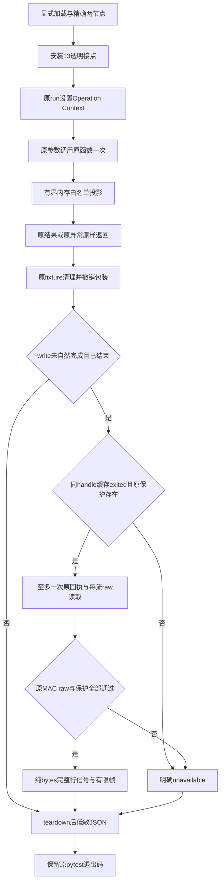

```text
wrapped(original, original_args):
    if no active operation: return original(original_args)
    safe_record(enter)
    try: result = original(original_args)  # 恰好一次
    except original_error:
        safe_project_fixed_error_chain_and_cached_lease()
        raise  # 原对象，不替换
    safe_project_original_result(); safe_record(return)
    return result

post_settlement:
    after original test/fixture cleanup, restore wrappers
    if finished write lacks natural authenticated complete:
        mark post_attempted before any read
        if no original handle/protection or cached state != exited: unavailable
        else once original receipt; once each original raw stream
             original complete-byte guard and original protection
             project versioned fixed booleans from existing complete stderr bytes
             nonempty stdout uses original strict proof decoder
        keep original outcomes and UNKNOWN, never repeat execution or cleanup
    release retained prepared/handle/protection
```

## 6. 时序与数据流

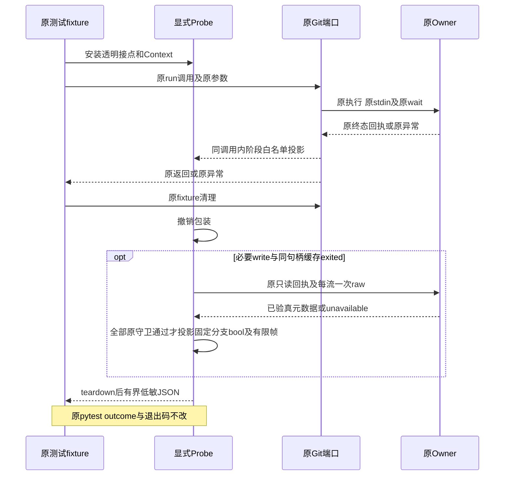

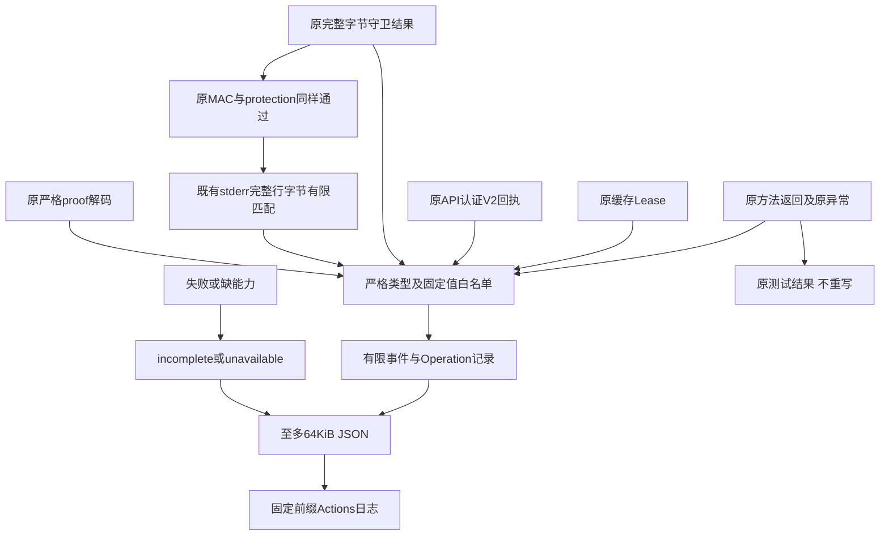

## 7. 失败、取消、恢复与持久化边界

原业务Cancel／父Task取消／UNKNOWN／Owner失联／MAC／raw／proof错误仍按原路径抛出。
异常投影最多八层context，只读取受信类型的有限code／errno／winerror；未知类型固定替代，不读取str／args／getter。
普通采集、序列化、短写／write／flush异常不重试，不遮盖原业务结果；外部KeyboardInterrupt／SystemExit不吞掉。
RLock保护内存快照，不引入新增线程任务或新的等待预算。

插件没有生产状态持久化、迁移、恢复命令或新的Key。唯一记录是原teardown后的白名单JSON。
已关闭handle缺少读取能力，补取明确unavailable；不重新打开Store或重新构造Supervisor恢复观察。
原原始回执方法自己的有限等待仍存在，侧车不添加retry／sleep／新的refresh循环；不能承诺补取绝对零等待。
失败后的唯一安全后继是分析现有记录，不自动重跑最低Commit或覆写旧日志。

## 8. 安全与可观测性

不输出正文、stdout／stderr内容、运行路径、环境、locals／traceback、异常字符串、nonce、token、Key或MAC。
有限PID、固定SHA、EOF、长度和类型只描述测试fixture的观察。cached、authenticated receipt、raw、proof和整体完成
使用不同标志，禁止合并为单个“成功”。原worker内部errno／Git内部阶段不可由透明宿主观察完整证明，保留能见边界。

手动运行contents:read、checkout禁持久凭据；不新增付费模型、凭据读取、Docker、公网Git认证、任意shell输入或ref参数。
平台checkout／依赖安装日志不是插件可控制的输出；每次实际Run仍须单独核对两记录与精确Revision。
日志是诊断证据，不是产品防篡改MAC审计账本。

## 9. 测试、部署、兼容与风险

治理负对照覆盖单次原调用、返回／异常身份、取消、collector故障、清理次数、post一次、关闭能力、
context循环／截断、禁止字段、输出故障、全部接点恢复、默认不加载、严格选择器及manual guard／pins／期限。
原两个实际本机用例保留真正Plan／独立批准／Owner／认证回执／完整raw／proof／readback，无伪造Windows成功。
当前固定本机59治理与2真实用例通过，Windows实际Run及底层因果保持开放，最终结果由验证包更新。

只在显式手动Windows载体安装现有锁定测试依赖并加载-p；产品Wheel、默认入口及原CI均不改变。
不会因诊断成功发布新的产品能力，也不会通过延长五分钟、宽松共享、移除MAC／PID／EOF或跳过用例修复失败。
业务缺陷修复必须由新的定位证据、真实红例、最小生产变更及完整受影响回归另行交付。
消费者Windows11、完整Git产品接线、R3质量、独立Beta及同候选商用门禁继续开放。

## 10. 原生执行状态增补

固定d0ca482的单次Run36836260240取得两个真实FAIL和两条完整诊断记录，
原受管材料执行进程返回二，在exit gate拒绝；原V2回执／完整raw后置验真通过，成功proof为空。
实际阶段并非等待超时，不能推出Git已写入或未写入，worker／Git内部错误原因仍需后继有限观察。
实际Windows源文件七模块的CRLF字节逐件求证，不混同canonical LF或整个目录完整验证。
执行前SHA ref的HTTP422拒绝与固定named ref的一次实际Run分别保留，未重复原效果。
原v1记录及其消费语义保留，具体低敏原件、源码及结果见统一验证包第5节。

## 11. v2有限stderr信号与兼容设计

### 11.1 背景、来源与取舍

v1只证明原worker退出二及完整stderr验真，不能解释内部错误。本增量不增加读取或执行，
仅在`_post_once`已经取得的完整stderr内存bytes上进行纯计算。接入点在原V2/MAC回执、
两次完整raw长度／SHA／EOF守卫与原`protection.require_unmatched`全部通过之后。
不能在MAC或raw拒绝之前使用未认证正文，也不能为取得信号重复Git效果。

worker固定失败行由[git_material_worker.py](../../src/harnessix/delivery/git_material_worker.py)：`main`求证。
Git消息由[Git v2.53.0 object-file.c](https://raw.githubusercontent.com/git/git/v2.53.0/object-file.c)、
[Git for Windows v2.55.0.windows.5 object-file.c](https://raw.githubusercontent.com/git-for-windows/git/v2.55.0.windows.5/object-file.c)
及对应[usage.c](https://raw.githubusercontent.com/git-for-windows/git/v2.55.0.windows.5/usage.c)的错误格式求证。
固定英文消息可能受版本、locale或其他输出影响，因此不匹配不能排除任何根因，命中也不是可信错误来源证明。

### 11.2 字段与算法

| bool字段 | 固定字节消息 | 完整行匹配方式 |
| --- | --- | --- |
| `worker_failure_literal` | `git_material_worker_failed` | 整行精确相等 |
| `git_temp_create_prefix` | `error: unable to create temporary file: ` | 行首前缀，必须有非空动态后缀 |
| `git_object_db_permission_prefix` | `error: insufficient permission for adding an object to repository database ` | 行首前缀，必须有非空动态后缀 |
| `git_malformed_object_literal` | `fatal: refusing to create malformed object` | 整行精确相等；不是Commit专用类别 |

```text
stderr_signals(already_verified_complete_bytes):
    create exactly four false booleans
    scan each LF-terminated complete line using bytes offsets
    exact literal: accept only literal plus LF or explicit CRLF
    prefix literal: require line start and a nonempty suffix
    ignore unfinished last line; never decode, normalize or extract suffix
    return fixed booleans, never raw text, match count or dynamic fields
```

算法使用固定空间和单次行扫描；计算成本非零，输入仍受原raw容量约束，不增加裁剪或新上限。
普通投影异常继续标记原观察不完整；原异常对象、Lease、returncode、UNKNOWN与pytest退出码不改变。
不新增线程、await、IO、刷新、重试、等待、清理、数据库或业务Schema。

### 11.3 版本与失败语义

record schema升级为`harnessix.minimum-commit-probe/v2`，原v1日志不补字段或改写。
v1缺少信号表示未支持；v2缺少字段表示前置检查或投影未完成／不可用。
字段存在且全部False只表示未匹配四个有限完整行字面量，不能解释为没有错误。
True只表示已认证字节命中，禁止作为权限、批准、自动恢复或效果已知的依据。
原PREFIX、13接点、64事件、8层context、64KiB日志与两个固定节点保持。

新增治理用例覆盖LF／CRLF、部分前缀、无LF末行、大小写、无效UTF-8、敏感假正文、
receipt／stdout raw／stderr EOF／protection拒绝，以及投影异常。次数负对照保留原receipt一次、
每流一次、raw守卫两次、保护一次，信号只能在全部通过之后计算一次。
完整验证身份与原件见统一验证包第6节；本机通过不证明新的Windows结果。

### 11.4 单次v2原生结果与剩余能见边界

固定96aa63c、named ref的Run36841600538仅dispatch一次，attempt一；两个原用例均FAIL，
零通过／跳过，两个v2观察完整。A／B约1.609秒／1.187秒在原exit gate拒绝，原worker返回二，
原强UNKNOWN保持；原MAC、完整raw与protection后验通过，stderr各289字节且成功proof为空。
两条记录均仅命中`worker_failure_literal`，三个Git消息均未匹配；这不证明没有Git错误，
也不能由有限False排除权限、对象格式或其他原因。没有输出或保存stderr正文。

七模块原生CRLF身份再次逐件核对；原v1失败与日志不改写，两个Run不是同fixture重放。
现有观察只证实进入原worker有限异常收口，不区分`run_worker`内部namespace、snapshot或Git阶段。
后继须在原调用链研究有限结构性失败观测，不能根据本次字面量结果放宽共享、审批、材料或期限。

## 12. Git128固定分支低敏观察设计

### 12.1 需求背景与源码证据

固定4c855c4的[原生Run36853423485](https://github.com/carrie1988/Harnessix/actions/runs/36853423485)
取得两条完整v3观察：首失败均在git_validate，原Git wait返回128，而Worker返回二。
成功proof缺失，原UNKNOWN及两项FAIL保持。原非零检查短路后的complete／expected没有求值，
不能将它们的None解释为stdin或stdout损坏。完整记录见
[Worker有限首失败统一包](../validation/git-worker-failure-observation-2026-10-01-v1/README.md#7-新一次原生windows实际结果)。

两例原正文都是184字节最小SHA256 Commit，不是空正文；两例完整正文摘要和预期OID相同。
对照固定[fsck.c](https://raw.githubusercontent.com/git-for-windows/git/v2.55.0.windows.5/fsck.c)，
未发现双LF、空message、单author／committer及零时间符合原格式时必须被拒绝的规则。
该静态判断不证明实际Git的输入字节、算法或具体分支，不能作为修改夹具的依据。

固定[object-file.c](https://raw.githubusercontent.com/git-for-windows/git/v2.55.0.windows.5/object-file.c)
的正规小文件分支使用read_in_full，不是mmap；
[hash-object.c](https://raw.githubusercontent.com/git-for-windows/git/v2.55.0.windows.5/builtin/hash-object.c)
对fstat／index_fd非零具有共同fatal收口。当前RO快照保留读数据／读属性权限并转交O_BINARY；
固定[mingw.c](https://raw.githubusercontent.com/git-for-windows/git/v2.55.0.windows.5/compat/mingw.c)
的fstat通过已有句柄查询，没有发现必须追加写权限的接口矛盾。
这些证据只收敛下一观察范围，不证明唯一根因，也不支持放宽sharing或DELETE_ON_CLOSE生命周期。

### 12.2 领域合同、接口与有限数据字段

观察合同`harnessix.minimum-commit-probe/v4`保留v3原四个bool和完整Worker有限帧，新增五个固定分支bool：

| 分支用途 | 原固定源码入口 | 阳性含义与禁止推论 |
| --- | --- | --- |
| HASH_FD | hash-object.c：`fatal: Unable to add (null) to database`，完整精确行 | 支持共同收口，不区分fstat／index_fd内部原因；只识别NULL路径的`(null)`表现，不推断其他CRT表现 |
| READ_ERROR | object-file.c：`error: read error while indexing <unknown>: `，完整行且后缀非空 | 支持该读失败报文，不输出errno、不认定sharing原因 |
| SHORT_READ | object-file.c：`error: short read while indexing <unknown>`，完整精确行 | 支持短读报文，不证明传入正文已损坏 |
| LOOSE_WRITE | object-file.c：`fatal: unable to write loose object file: `，完整行且后缀非空 | 支持该写失败报文；失败仍可能已有外部效果 |
| LOOSE_CLOSE | object-file.c：`fatal: error when closing loose object file: `，完整行且后缀非空 | 支持关闭失败报文；不自动重写或判定未写入 |

固定字段与字节模板由`_STDERR_LITERALS`登记，原四字段不变，新增字段只接受上表模板。
`MAX_STDERR_SIGNAL_BYTES`与原完整stderr守卫同为1MiB；原守卫拒绝超限后不能进入投影。
纯函数超限输入返回全False仅用于防御，不是已通过原后验的有效操作观察。
不增加自由code、动态后缀、errno文字、文件名、路径、句柄、argv、消息正文或通用异常字符串。
原FSCK拒绝信号仍保留；False不排除某类错误，未知缺口不补“未发生”结论。
即使原流已通过MAC，也没有证明stderr每一行的消息作者；信号不是授权或业务proof。

### 12.3 核心流程、失败与恢复

接口仍为原 `_stderr_signals(already_verified_complete_stderr)`，只能在原receipt／MAC、
stdout raw、stderr raw／EOF及protection全部通过之后计算一次。
每流只使用已经取得的完整bytes，不为分支信号追加读取、Git调用或效果重试。
匹配从行首开始，完整LF／CRLF结束；相似前缀、嵌入文字、缺换行或动态截断均须拒绝。
只返回固定bool集合，不把原stderr解码、规范化、保存或打印。

观察格式必须明确升级；旧v1／v2／v3原件和FAIL不重写、不补字段。
投影失败沿原采集故障语义登记incomplete，原测试结果和UNKNOWN不变；外部取消不被吞掉。
原工作流仍为manual-only、attempt一、fresh fixture、原两个精确节点、原20／45秒和五分钟上限。
新的观察必须绑定新候选与新一次原生结果，不以本机阳性fake或静态研究替代实际Windows证据。

```text
原fixture清理完成：
    使用原Owner端口核对唯一终态回执及MAC
    取得原stdout／stderr各一次，逐流核对完整raw、长度、摘要和EOF
    原protection检查通过后，仅在内存计算九个固定bool与有限Worker帧
    每行必须从固定模板开始并完整结束；精确行不接受后缀
    对动态后缀仅判断是否非空，不解码、保存或输出
    投影异常 → diagnostic_incomplete；原异常、取消及UNKNOWN保持
    固定字段进入原有界版本化记录，不重试Git、不重放效果
```

### 12.4 测试、安装部署与退出边界

必须保留原四字段正反例，新增五分支真实模板／相似／嵌入／截断／CRLF／重复／敏感噪声负对照，
并确认receipt一次、每流一次、raw两次、protection一次、纯信号一次且顺序不变。
固定官方源码原字节身份与模板位置分别归档；来源tag不是原生Git二进制构建验真。
增量只有显式测试侧车，无生产Wheel、数据库、依赖、默认插件或正式CI范围变更。
没有新字段的历史记录仍按原版本解释，不能把缺字段默认为False。

若分支仍不可辨别，保持原失败，继续取得Git内部真实分支证据；不得重复Python阶段标记、
猜测stderr长度、缩减材料、放宽权限或修改最低Commit正文以刷绿。
Windows根因、完整Git产品交付、真实R3、消费者平台、Beta及商用门禁仍需独立验收。

实际新增95项先取得78FAIL／17PASS；与原95项合并190项通过，原两个本机业务场景通过。
完整输入身份、静态、治理、文档及新原生结果分别登记于
[固定分支统一验证包](../validation/windows-git-stderr-branches-2026-10-01-v1/README.md)，不累加为全仓或Windows验收。

## 13. 真实快照输入与对象写入的单变量对照

### 13.1 需求背景、目标和非目标

固定0b1e16a的Windows Run37118277852中，原两SDK场景均已启动Git，在git_validate阶段观察到
Git128；原stdout两个谓词因短路而未求值。现有有限观察不足以区分只读普通文件输入与对象库写入。
父进程能读取快照不证明Git接收端能读取；目录持有不等于递归拒绝新增对象。不能据此放宽句柄访问权、
共享模式、命令、Owner、材料容量或成功判据。c48b22f的FD归属修复发生在Popen前，也不能解释此历史故障。

本增量用同一正式快照实现和最低合法SHA256 Commit执行四格真实对照。仅改变两个测试变量：
是否使用原_namespace持有对象库，以及是否保留原hash-object的-w参数。单边比较只改变一个变量。
不新增采集器、错误分类器、平台或生产端口；复用原_git的有界stdout和等待／清理实现。
SDK两场景仍独立执行并保留原失败，四格结果不能产生业务Proof、完成批准或开启默认Git产品。

### 13.2 总体架构与源码位置

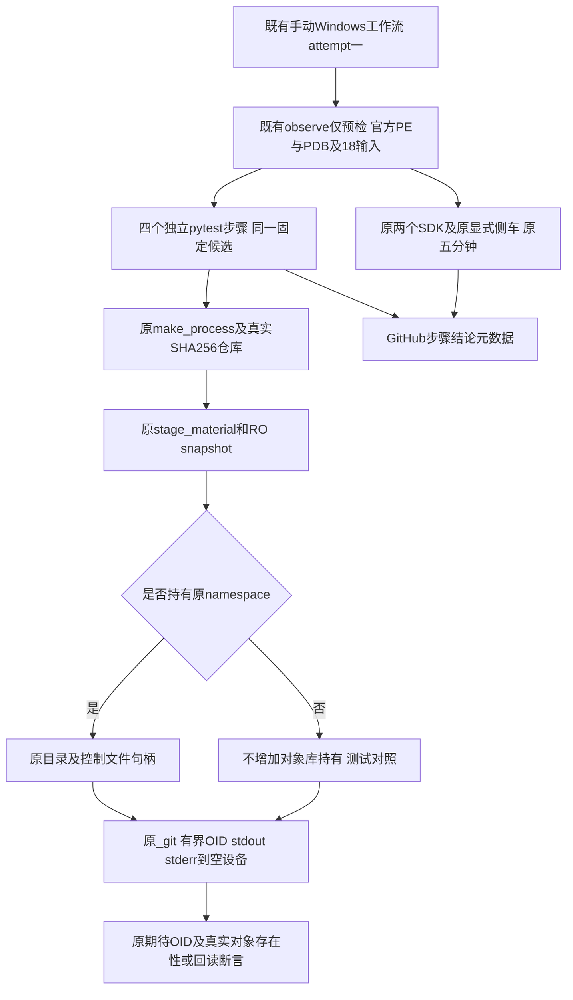

| 职责 | 实际接口／源码 | 设计约束 |
| --- | --- | --- |
| 真实仓库、正文和准备 | [原材料测试](../../tests/product_config/test_git_material_input.py)：make_process、_repository、_body、_material、_prepare | 每格fresh仓库；沿用相同最低合法Commit算法，不手工伪造绑定 |
| 正式快照与持有 | [git_material_native.py](../../src/harnessix/delivery/git_material_native.py)：_Resources、_namespace、_snapshot | 两轴都使用完整RO regular快照；不重开路径、PIPE或提升权限 |
| 固定命令及实际启动 | [git_material_worker.py](../../src/harnessix/delivery/git_material_worker.py)：_command、_git | 原命令先验；仅测试无写臂删除唯一-w；原66字节stdout上限和完整OID断言保持 |
| 真实对照 | [test_git_material_snapshot_differential.py](../../tests/product_config/test_git_material_snapshot_differential.py)：test_real_snapshot_hash_and_write | stderr在调用范围内重定向空设备，原_git读取sys.stderr.buffer；不读取错误正文 |
| 官方身份 | [preflight.py](../../scripts/windows_git_native_branch_observation/preflight.py)：selected_paths；[identity.py](../../scripts/windows_git_native_branch_observation/identity.py)：check_pair | 每格复核实际选中PE、两个PDB和18输入；不是只检查Git版本字符串 |
| 原生承载 | [既有workflow](../../.github/workflows/windows-git-minimum-commit-probe.yml) | 先运行既有observe默认仅预检，不启动CDB；不下载替代Git或改变依赖 |
| 防退化 | [治理测试](../../tests/governance/test_git_material_snapshot_differential.py) | 四步、条件、期限、stderr关闭、原SDK选择器及单变量命令差分 |

此测试直接调用既有Git helper，不进入Supervisor批准／MAC回执链；这是所有对照共同的测试边界，
不是产品执行方式。直接helper成功只能证明此控制环境中输入／写入可行，不能外推受信Owner链或历史失败唯一原因。
固定同版本官方[launcher源码825～867行](https://github.com/git-for-windows/MINGW-packages/blob/a2e0e11dce73735202e71f2ae60e1bd4082589ae/mingw-w64-git/git-wrapper.c#L825-L867)
按allocate_console选择HANDLE继承和STARTUPINFO分支，没有显式读取或seek stdin；
固定[core初始化4301～4468行](https://github.com/git-for-windows/git/blob/32c4f7689275d233577576630e1ac5b7eb354eb0/compat/mingw.c#L4301-L4468)
包含重定向环境分支和未验证返回值的binary切换。源码未证明选中PE的CRT入口行为，不能把“未见seek”当作现场位置未变。

### 13.3 对照数据、接口和关键字段

| 固定case ID | 保留-w | 持有_namespace | 通过所需事实 |
| --- | --- | --- | --- |
| hash-direct | 否 | 否 | 完整期待OID，目标及既有对象字节未改变 |
| hash-held | 否 | 是 | 相同无写断言，原持有持续至Git退出 |
| write-direct | 是 | 否 | 完整期待OID，新增目标普通对象，独立cat-file回读正文一致 |
| write-held | 是 | 是 | 相同写入回读断言，原持有持续至Git退出 |

四格只用原SHA256 Commit正文；正文包含相同baseline tree、固定作者／提交者和空消息。
每格不同私有根、nonce、时间期限、baseline Commit时间及句柄身份是隔离所需字段，不宣称四份manifest逐字相同。
对应材料OID、命令尾部和配置语义相同；目标事先必须不存在。对象库初始清单包含每个普通文件的相对位置与SHA256，
仅用于断言无写臂没有改变既有内容，不作为业务清单、来源认证或新增持久化格式。

_diagnostic_request(request, write)只为本地真实Git helper派生临时测试参数：写臂沿用完整argv，
无写臂删除唯一-w；expiry取原45秒操作绝对期限和当前时刻加20秒的较早者。
不修改原prepared、原批准摘要或发送任何伪造worker握手。正式命令先由原_command校验，派生参数不经过或替代批准门。
测试域_GitInvocation只含git_argv、repo_path、git_environment、expiry_monotonic_ns和expected_oid，
对应原_git实际读取的五项参数；它不是GitMaterialInput，不持有purpose_digest、nonce、PID、MAC或Proof。
原正式GitMaterialInput构造器会拒绝未重新认证的命令／期限变更；此拒绝必须保留，不能关闭校验或伪造新的批准摘要。
首次真实本机四格执行暴露了以dataclasses.replace派生正式请求会被此守卫拒绝，原失败保留；
后继只修正测试调用描述，不修改生产构造器或业务合同。

Windows只有显式HARNESSIX_GIT_NATIVE_DIFFERENTIAL=1时运行该诊断；缺失时默认测试矩阵跳过，不计算为通过。
显式运行后，符号根缺失、实际PE／PDB不符、18输入漂移或Git不符均失败，不能降级为跳过或换用另一个Git。
符号仅复用同Run既有仅预检的私有目录；候选checkout SHA另外绑定新增测试，不把18输入宣称为整个候选身份。
非Windows使用实际已安装且支持SHA256的Git，结果独立记录，不替代Windows现场。

### 13.4 核心流程、时序、数据流与伪代码

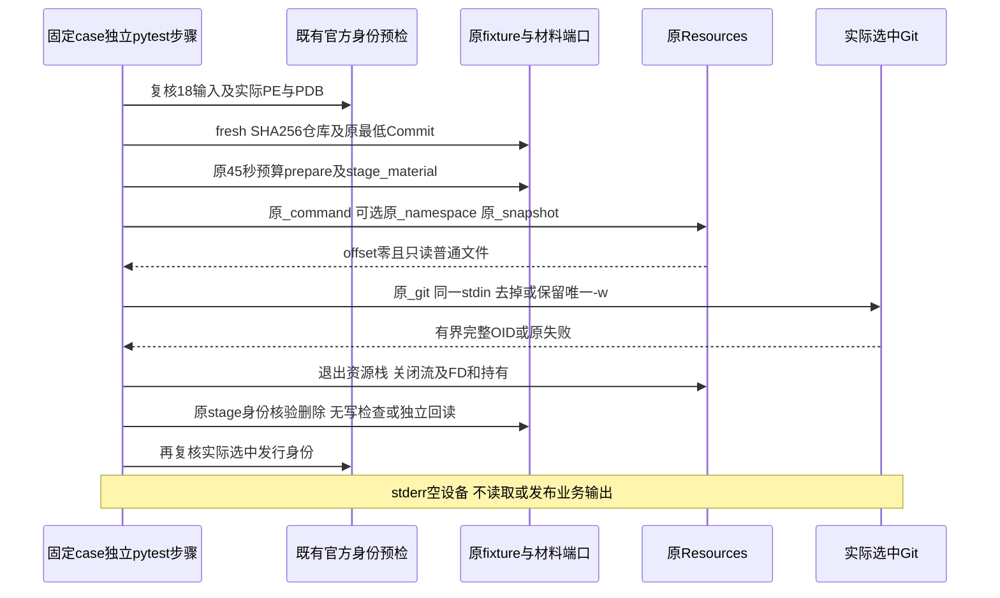

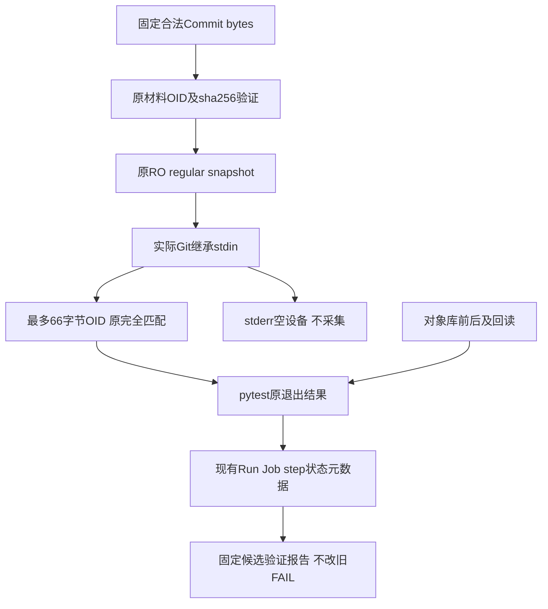

```text
for explicit case selected by pytest:
    verify current source and selected official executable on Windows
    construct original fresh repository, original minimum material and 45s prepared request
    require target OID absent; freeze original object-file bytes digests
    staged = original stage_material
    try:
        with original Resources:
            original command validation
            if held: original namespace holding
            snapshot = original snapshot
            require regular, correct size, offset zero, actual write rejected
            derived = original argv or delete only -w; deadline = min(original, now + 20s)
            with stderr redirected to open null device:
                original _git(derived, snapshot, fresh finite observation)
        require no named snapshot left
    finally:
        original staged.remove by physical identity
    original budget remaining before effects
    if write: require actual target and independently read exact original body
    else: require target absent and original object-file digests unchanged
    original budget remaining after effects
    verify selected official executable and original inputs again
    original budget remaining before reporting success
```

### 13.5 失败、取消、持久化、安全和部署

原_git非零、输出超限／不完整、OID不符和等待超时都保留失败；不捕获转换为成功，不读stderr定位。
等待期限不超过20秒，整个准备后操作不超过原45秒；每个新增CI步骤限定一分钟，原SDK步骤仍五分钟。
超时使用原_git kill／wait与fixture清理，不另建进程树平台。直接helper测试没有Supervisor的完整子树回执，
超时情况下不能据此声明产品进程树已安全回收；CI取消与孤儿风险仍由原Runner生命周期约束。
stage删除始终走原物理身份检查。回读占用同一剩余操作预算，不重新获得20／45秒。
效果检查前后及最终发行身份复核后再次检查同一预算。真实短预算负例证明，原尾部若不检查，
效果清单或身份复核耗尽期限后仍能返回成功；必须拒绝而不是用一分钟步骤上限替代45秒合同。

无业务数据库迁移、Wheel／Schema变化、Secret读取、模型调用或预算修改。仅测试隔离仓库写臂新增一个可丢弃对象。
不上传原stdout、stderr、CDB日志、pytest日志或JUnit。只使用现有GitHub API步骤结论做四格判别，
本地测试证据和固定输入另按0700／0600验证目录归档；不新建投影Schema或收集服务。
后继Run仅新候选attempt1，不重跑历史失败。新增步骤即使前一对照失败仍在原预检成功且未取消时执行；
原SDK也同条件执行。没有continue-on-error，任一对照或原SDK失败仍使整体失败。
符号根必须放在每个测试步骤的env中，不能在job env使用runner.temp。
[GitHub上下文可用性](https://docs.github.com/en/actions/reference/workflows-and-actions/contexts#context-availability)
只在步骤阶段提供runner。首次dispatch的HTTP422语法拒绝原件保留，未创建新Run，不作为原生Git失败；
步骤级配置整改和对应YAML结构负例通过后，后继必须使用新的候选SHA。

### 13.6 解释规则、完备测试与退出条件

| 实际组合 | 允许的下一步判断 | 不允许的推论 |
| --- | --- | --- |
| 无写臂也失败 | 此控制环境下尚不能完成输入／对象解析，优先检查接收端链 | 不凭退出码认定唯一stdin或CRT原因 |
| 两无写通过，write-direct通过而write-held失败 | 支持原namespace持有与此写入不兼容的控制证据 | 不直接放宽生产共享标志或认定全部历史失败同因 |
| 两无写通过，两个写臂均失败 | 此控制环境写入路径需要进一步核验 | 不说明只是权限，更不能省略回读或容量 |
| 四格通过而原SDK失败 | 直接helper可行，继续核验原Owner／worker运行上下文 | 不把直接调用替代正式产品或关闭Windows验收 |
| 四格及原SDK均通过 | 仅关闭本固定候选、此最低材料范围的实测缺口 | 不外推8MiB全部类型、Windows11、完整Git／Backup v2或1.0 |
| 预检失败／步骤缺失／skip | 观察不完整，保持旧失败 | 不以缺失当False或四格通过 |

测试覆盖四格真实Git、只读普通文件、offset零、无写字节不变、写入完整回读；治理覆盖唯一-w差分、
原期限取min、显式Windows准入、原PE／PDB及输入复核、四步骤条件和原两SDK／13接点不变。
额外覆盖真实Git完成后效果／发行身份复核实际等待跨过原期限的两个负例，不mock快照或Git输出。
新增测试对照必须先通过非Windows实际运行及离线治理，再执行一次固定Windows候选。
固定源码、RED／GREEN、静态、文档图示、原生步骤元数据和各观察缺口分别保存；未取得现场结果不预先写PASS。
R1～R6、真实R3及费用未决、完整Git交付和Backup v2、消费者Windows11及独立Beta仍按原门槛验收。

### 13.7 固定Windows现场结果与后继故障路径

固定9dc4647的Run37125374856／attempt1／Job111209499069已终态failure。
原官方身份预检成功；hash-direct、hash-held、write-direct步骤success，write-held和原SDK步骤failure。
[原生验证记录](../validation/windows-git-snapshot-differential-2026-10-03-v1/README.md)
保留实际API元数据和各自范围，不读取业务日志，也不重跑此候选。

该结果支持优先核查namespace持有后的写入路径；输入继承／无写hash及直接写入在此控制步骤已成功。
但是元数据没有具体失败调用，四格初始Commit时间及其对象目录形状可能不同；不能据此确认唯一共享权限缺陷。
后继应在同一初始对象集合下，以真实Win32／Git控制分辨目录和既有文件持有、对象创建、链接／重命名的访问需要，
保留目录不可替换、控制文件不可写、单链接与独立回读反例。没有此证据不放宽FILE_SHARE标志或删除原_namespace。
原SDK只取得步骤failure，不补写两case的退出码、PID、Proof或Git128。消费者平台和完整Git／Backup v2仍未验收。

## 14. 既有fanout目录与单对象持有的同源控制

### 14.1 需求背景、目标与源码证据

原四格结果已支持优先检查持有后的写入，但其初始Commit时间和目录形状不同，不能断言具体系统调用。
固定baseline正文baseline换行的SHA256 blob为9146b06f8e631a1f5715af2da44e3eba3a50cf2631d4db952c0eedfc87aa9b5f，
原最低SHA256 Commit为91bd7f83eff4af0890282b4c4de217e73d86a892cde4728cbaa54ddbc2f36215，
**两者共用既有91目录**。同fixture的SHA1 blob前缀18、最低Commit前缀7b不同。
这些值由原Git对象头和实际fixture正文计算，不是未知错误正文或根因见证。

固定Git[create_tmpfile613～640行](https://github.com/git-for-windows/git/blob/32c4f7689275d233577576630e1ac5b7eb354eb0/object-file.c#L613-L640)
在目标fanout存在时直接创建tmp，缺失时另走mkdir、权限调整和重试。
[最终发布408～471行](https://github.com/git-for-windows/git/blob/32c4f7689275d233577576630e1ac5b7eb354eb0/object-file.c#L408-L471)
可能执行链接／重命名。父目录持有并不等于递归禁写；现有静态分析没有证实这些调用与原持有必然冲突。
本增量先证明实际差异，不修改生产FILE_SHARE、权限、命令、材料、Owner或成功门。

目标：用同一个seed仓库的完整复制消除初始对象差异，分辨只持有目标91目录、只持有既有blob文件，
并用真实Windows子文件创建／硬链接控制定位操作需求。只沿用既有pytest和CI步骤结论，不增加采集器或投影协议。

### 14.2 总体架构、模块和接口

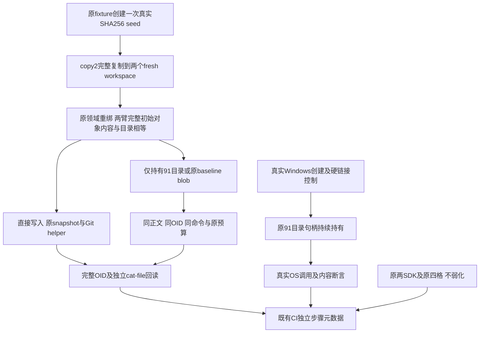

| 责任 | 源码／接口 | 限定职责 |
| --- | --- | --- |
| 对照操作复用 | [真实对照模块](../../tests/product_config/test_git_material_snapshot_differential.py)：_run_diagnostic | 从原四格抽出实际操作；保持原节点、调用顺序、RO普通文件、有界输出和末端预算 |
| seed与两臂重绑 | 同模块：test_same_seed_repository_with_single_hold | 原make_process和_repository，copy2不使用硬链接，原_repository_binding_existing产生新路径身份 |
| 单个持有 | 同模块：_hold_object_target | Windows沿原api.open；POSIX沿原_directory／_descriptor，不改共享掩码 |
| Win32操作控制 | 同模块：test_real_windows_child_operation_under_fanout_hold | 真实本地NTFS、原91目录持有；创建使用CRT os.open，链接使用真实CreateHardLinkW |
| SDK及原调用 | [git_material_worker.py](../../src/harnessix/delivery/git_material_worker.py)：_command／_git | 原argv、读取上限、错误／清理；不创建新的Owner或批准 |
| 防退化 | [治理测试](../../tests/governance/test_git_material_snapshot_differential.py) | 原四格委托到真实操作、初始集合／前缀、单目标保护、原SDK期限与selector保持 |

_run_diagnostic接受实际case、binding、material和显式write／held／extra_hold测试参数；extra_hold只能为fanout或blob。
full namespace和单目标持有互斥。派生_GitInvocation仍只有五个helper参数，不能作为正式请求。
返回的原GitOperationBudget用于调用者发行身份复核后的最终期限检查，不重置45秒。

### 14.3 数据、流程、时序与伪代码

seed只有一次实际baseline Commit，目录／文件全部复制后重取实际绑定；两个目录有独立物理身份和Store，
不伪造identity、Head、control hash或source读取。复制使用copy2保留原模式／时间，不使用同inode硬链接。
两臂开始前比较完整对象文件的相对路径及SHA256、全部相对目录名；每个既有文件链接数必须为一。
目标OID在两臂事先都不存在，两个操作各使用原45秒绝对期限。不同物理根、SID读取、nonce和句柄是隔离必需字段，
不把同内容等同于相同FILE_OBJECT，也不宣称相同完整manifest。

fanout定位由目标OID前两位决定；blob定位由原baseline正文计算的实际OID决定。
必须验证两者91前缀相同、目标不是该blob、目录与blob都已存在；缺失条件失败，不降级为缺失fanout实验。
创建控制在两臂同形目录内用O_CREAT／O_EXCL／O_RDWR和0444建临时文件，写满、fsync、关闭及独立读取；
硬链接控制在原持有之后创建新的源文件，再调用真实CreateHardLinkW建立目标，核对两名同inode和完整正文。
源和目标都是本测试新文件，不以既有受保护blob作为硬链接源，不绕过原单链接保护。

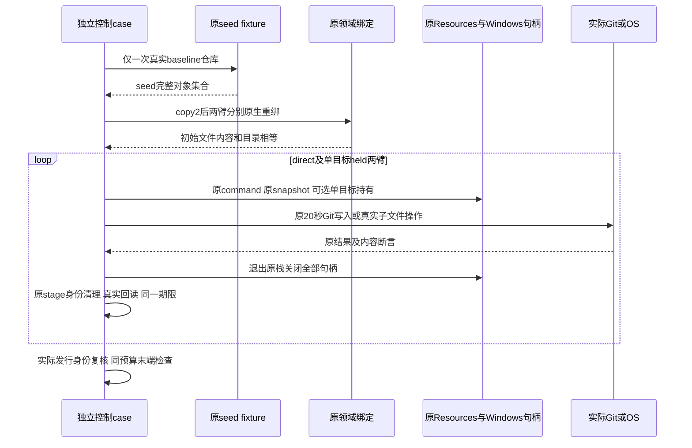

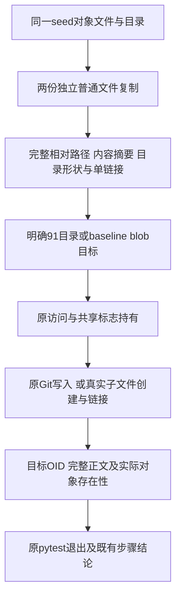

```text
same_seed_single_hold(scope):
    original fixture creates seed repository once
    copy2 to direct and held fresh original process workspaces
    original domain rebinds each actual repository
    require initial object bytes, directory shape and single links identical
    for direct, held:
        original prepare, stage, command, RO snapshot, Git invocation
        held arm adds only original open on existing target fanout or baseline blob
        require original OID, actual new target and independent exact cat-file body
        preserve original resources cleanup and shared operation deadline
    require selected official identity unchanged and original remaining budgets
```

### 14.4 失败、取消、持久化、安全与测试

任何copy、绑定、形状、RO快照、Git／OS调用或回读失败都保留pytest失败；不捕获失败继续写同一目标。
两个Git臂各一次，目标始终由独立fresh复制保证不存在；不对UNKNOWN原业务重放。
原_command／_git及20秒命令、45秒操作不改；新配对步骤二分钟，只承载两份独立操作及setup，
不是延长原业务期限或原五分钟SDK。原四格一分钟步骤、13接点和240秒外围合同不改。
Win32控制只有真实Windows且显式诊断才执行；POSIX跳过不计通过。API调用为本地NTFS，末端预算和一分钟CI限制保持，
不宣称可中断任意同步内核调用或已取得Supervisor进程树回执。

stderr仍由被测Git空设备吸收，不读取业务／CDB／Job日志；原fixture和独立回读的既有Runner内部捕获不对外输出。
不新增DB、保存业务Proof、读取模型Key或修改费用。复制的测试根与新链接只在fresh tmp内，句柄退出后按fixture回收；
不得用这些控制开放正式CLI高风险入口或标记完整Git产品完成。

必须覆盖：两个OID前缀关系、同seed复制不是别名、两臂初始集合相等、单持有目标、合法写入及完整回读，
原四格和末端到期负例、原SDK节点和权限／目录不可替换反例。新的workflow参数和18输入只更新必要身份行。
现场结果只解释具体步骤：单目录／文件持有配对失败不自动等于某系统调用失败；创建／链接独立控制可进一步定位操作。
若这些控制仍不足，继续保留UNKNOWN，不凭新相关性放宽共享标志、删除源保护或减少材料容量。

### 14.5 真实链接的共享标志因果反例

新增test_real_windows_link_sharing_counterfactual只在显式Windows诊断执行。该测试不替代原正向链接控制，
而是验证一个可证伪假设：同一目录路径／身份的两个独立真实打开，是否仅因共享标志不同导致新增链接拒绝。
固定Git源码没有显式另开fanout，但Windows
[FileLinkInformation规范](https://learn.microsoft.com/en-us/openspecs/windows_protocols/ms-fsa/891bb8eb-89f8-46ca-80b7-9f5d4e8b5583)
包含目标目录打开与共享检查；该来源仅支持实验假设，不能替代本机调用结果。

| 阶段 | 访问／共享和断言 | 失败解释 |
| --- | --- | --- |
| 无持有控制 | 实际CreateHardLinkW成功，完整内容及同inode验证，移除本测试链接 | 失败则基本前提未建立 |
| 原目录持有 | 原api.open访问0x81、share1及flags保持；实际链接必须返回0且Win32错误32，目标不存在 | 任一条件不符即假设未证明，不更新生产共享 |
| 仅补目录写共享 | 测试局部包装该api实例的CreateFileW，仅把同目录share1改为3；访问、打开方式、flags及原路径／inode验证保持 | 真实调用不成功即该最小变化不足 |
| 完整后验 | 两个名字同inode、正文完整；原句柄关闭，原45秒预算及官方身份复核 | 不充当Owner、业务Proof或SDK通过 |

包装器调用原真实CreateFileW，不替代DLL或模拟系统结果；只允许一次预期目录打开并断言全部参数。
原目录持有退出后才开始新持有，源文件均在fresh目录内创建，不操作受保护baseline blob。
拒绝阶段必须读取紧邻失败调用的线程Win32 last-error；只用于固定测试断言，不打印、持久化或新增错误投影。
该测试在既有workflow单列一分钟步骤；原链接正向步骤失败仍为失败，因果反例成功不能抹除它。
只有真实反例与原SDK／保护负例后续共同支持时，才评估生产目录兼容修复；文件共享、禁止删除与单链接检查不自动改变。

## 15. Windows目录写共享兼容与原保护保留

### 15.1 需求背景、实际证据与目标

固定ffc653e的Run37130015232、attempt1、Job111223091633已终态failure。
同源目录持有配对失败、同源blob配对成功；子文件创建成功、正向硬链接失败。
真实共享因果反例成功，结合固定测试源码证明无持有链接成功、原目录share1持有时链接返回错误32，
只把同一目录的共享改为3后链接成功，原访问0x81、flags、原路径和inode验权保持。
这证明该固定NTFS链接调用的目录共享冲突，不声明所有历史Git128都是同一根因。
原两SDK步骤仍失败，必须由新修复候选完整验证，不能从反例成功推定业务修复。

目标是兼容正式Git对象插入，同时保留目录不能替换／删除、既有文件不能写／替换／删除、
链接／reparse／类型／路径／inode及私有DACL守卫。最小改动限定原_windows._open一个共享选择点。
不改材料、OID、命令、读取、Supervisor、Owner、批准、数据库、Key或费用。

### 15.2 架构、接口、字段与安全边界

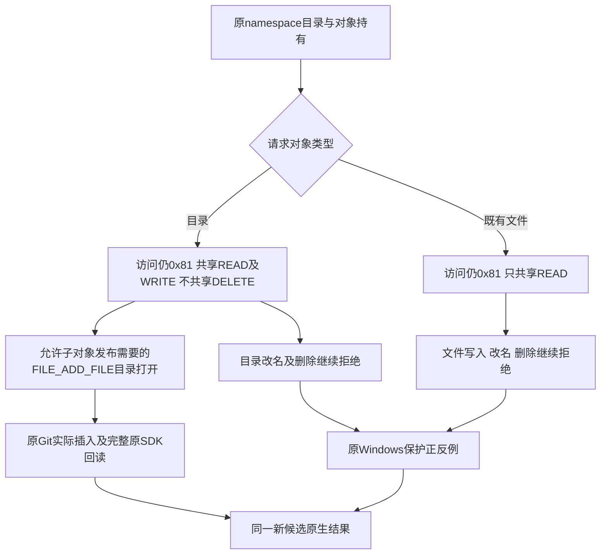

| 字段／接口 | 实际变化与不变量 | 源码 |
| --- | --- | --- |
| directory | 原调用者明确声明并由实际attributes核验；只影响共享选择 | [Windows_open](../../src/harnessix/delivery/git_material_native_windows.py#L241) |
| share | _held_share目录3即FILE_SHARE_READ加FILE_SHARE_WRITE；文件继续1；两者均不含FILE_SHARE_DELETE | [_held_share](../../src/harnessix/delivery/git_material_native_windows.py#L236) |
| access | _held_access不变，真实READ_DATA／LIST_DIRECTORY及READ_ATTRIBUTES；私有／删除关闭模式仍沿原额外位 | [_held_access](../../src/harnessix/delivery/git_material_native_windows.py#L231) |
| flags／disposition | 原reparse与backup semantics、OPEN_EXISTING及delete-on-close语义不变 | 同上 |
| 验权及清理 | 原GetFileInformation、单链接、实际类型、inode、完整最终路径、私有DACL及Resources关闭不变 | [_open与_chain](../../src/harnessix/delivery/git_material_native_windows.py#L241) |
| 后验 | worker完成Git后再次验证snapshot、command和namespace，不跳过证明 | [run_worker](../../src/harnessix/delivery/git_material_worker.py#L251) |

FILE_SHARE_WRITE不是给当前句柄增加写权限，也不是给任何用户授予NTFS ACL。
目录持有不承诺递归封锁所有子文件修改：修复前的真实os.open创建控制已经成功。
允许目录对象的写共享用于子对象新增路径；目录本身DELETE共享仍拒绝，已有对象文件继续原share1。
同UID任意外部写者的不可变OS封印并非本组件承诺；前后namespace验证与正式Workspace Lease继续约束业务证明。

### 15.3 实际流程、时序、数据流及伪代码

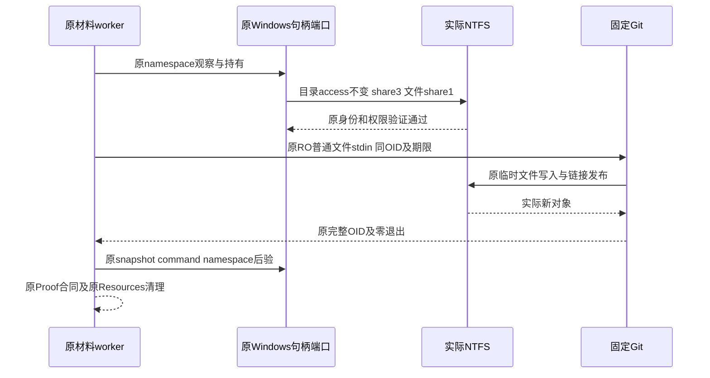

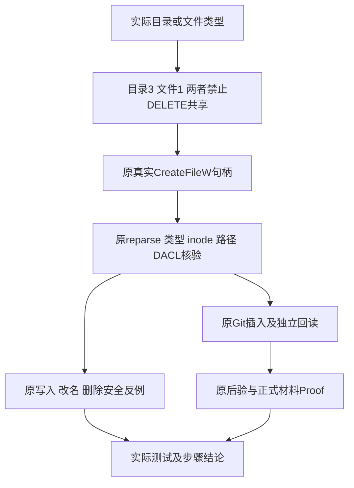

```text
open_existing_guard(path, expected_directory):
    before = original lstat
    access = original held_access
    share = READ | WRITE if expected_directory else READ
    handle = original CreateFileW(path, access, share, original flags)
    require original type, reparse, single-link, inode, final-path and private ACL
    register original close callback
    return handle
```

### 15.4 失败、恢复、测试与发布

任何实际打开／验权失败沿原固定错误拒绝；不创建宽权限替代对象，不以metadata-only访问避开共享检查。
取消、20秒命令及45秒操作、240秒外围和原SDK五分钟合同保持。句柄由原栈关闭，失败效果按原Owner契约保留。
新共享反例将历史share1明确构造成测试局部的实际目录控制，再用修复后的自然share3正向验证；
其包装只把原真实CreateFileW的共享位改回1，不模拟DLL，历史错误32及真实链接成功仍须同时成立。

保持原四格及同源两臂、原Windows写／改名／删除保护负例、原两SDK；新增纯函数检查目录／文件共享选择。
手动workflow另加一分钟原保护步骤，执行原test_windows_data_read_guard_rejects_write_rename_delete_with_metadata_control两参数；
原selector、预算及失败判据不变。只更新18输入中的Windows实现和workflow两行及必要整体摘要锚点，其余16行／全部其他字段保持。
固定新候选只跑一次attempt1；不重跑原失败，不读取业务日志，结果只取Run／Job／step元数据。
本机静态和POSIX回归不代替原生；SDK步骤或原保护任一失败继续NO-GO。通过本专项也不关闭完整Git／Backup v2、R3、Beta或R1～R6。

### 15.5 限定独立审查后的证明加固

初始窄审查未发现P0／P1，识别三个P2证明缺口，不将其描述为生产漏洞：
逐臂stat会跟随cross-arm符号链接、last-error使能依赖未自包含、设计把两次打开误称同句柄。
后继在测试域补充一次复制／重绑后的集合收敛检查：seed与两臂的根、所有目录及文件都以lstat核对类型，
拒绝reparse／符号链接、文件多链接，并要求三方对应节点身份不同；完整内容／目录形状再次相等。
新增实际跨臂文件和目录符号链接反例，POSIX反例不能充作Windows成绩。

_link_result用显式use_last_error=True的真实WINFUNCTYPE绑定原kernel32的CreateHardLinkW，
地址须等于原DLL函数地址；不模拟系统结果，也不依赖私有错误副本的偶然旧值。
同一目录的两个独立打开在前后再次核对原目录身份；只共享参数变化，时间及HANDLE数值不是相同字段。
这些测试域加固不改变生产共享政策、错误投影或业务契约，需与原控制和安全负例一起复验。
