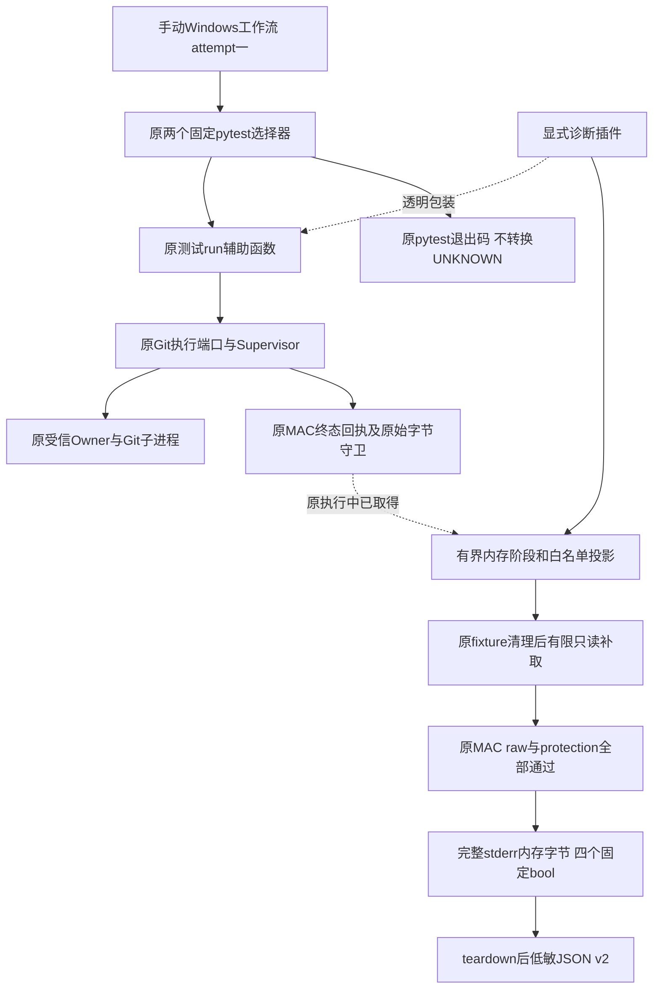
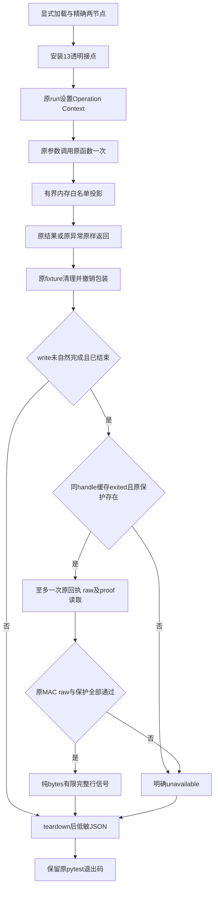
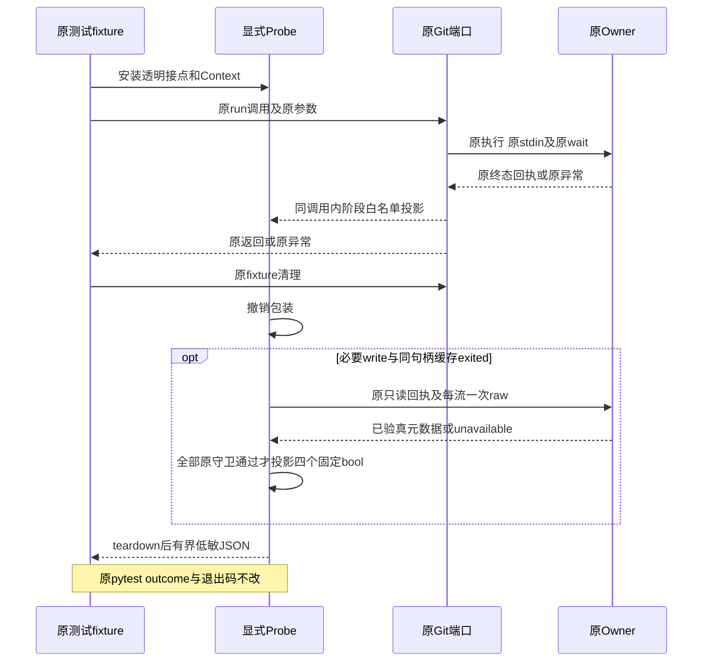
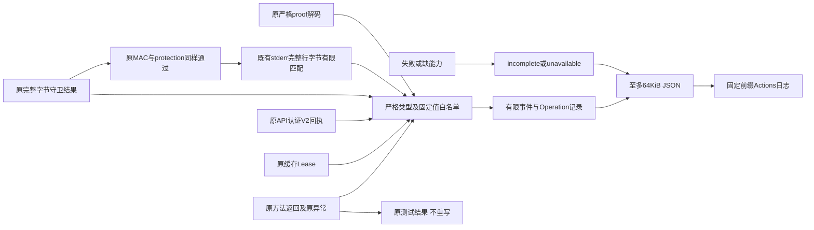

# Windows最低SHA256 Commit单次原生诊断：总体与详细设计

## 1. 需求背景与设计目标

固定554618c的原生材料组仍有两个最低SHA256 Commit场景失败，1289项通过、6项跳过，
303.12秒达到原五分钟期限。原对外git_material_effect_unknown是保守效果分类，不证明Git开始或写入。
此前READ_CONTROL缺陷的修复不等于剩余两个用例具有相同根因。需要把原调用内阶段与原退出后有限只读证据区分，
在不修改原业务断言、20秒命令、45秒操作或五分钟验证期限的条件下定位失败位置。

本变更提供显式加载的pytest侧车与仅手动工作流。目标是保留原执行结果、取得有界低敏观察、明确观察缺口。
不修改任何生产代码、原测试、默认pytest插件、Owner合同、权限／共享标志、评分、任务包或恢复策略。
不修复未定位缺陷，不承诺零测量开销，也不把本机成功解释成Windows成功。
输入、原失败和各验证范围见[统一验证包](../validation/windows-minimum-commit-probe-2026-10-01-v1/README.md)。

## 2. 总体架构与边界



插件只观察原对象，并在同一进程的测试域使用ContextVar。未显式-p加载时不存在副作用。
工作流仅两个原节点，不增加全量重试，不自动触发，也不更改正式CI的测试范围。
同一Run attempt大于一直接拒绝；fresh basetemp预存在或无法核查即拒绝，不删除／复用已有fixture。

## 3. 源码研究、决策与模块映射

| 责任 | 实际源码／符号 | 约束与取舍 |
| --- | --- | --- |
| 显式插件、投影和包装 | [git_minimum_commit_probe.py](../../tests/product_config/git_minimum_commit_probe.py)：`Probe`、`Operation`、`_async_wrapper`、`_sync_wrapper` | 非test_模块，不注册全局pytest_plugins；同步内存采集不是零成本 |
| 原测试作用域 | [test_git_delivery_process.py](../../tests/product_config/test_git_delivery_process.py)：`_run`；`_operation_wrapper` | 原两个用例均经module._run调用，不漏改导入别名；task／线程沿原Context传播 |
| 原执行及验真 | [git_delivery_process.py](../../src/harnessix/product_config/git_delivery_process.py)：`_complete_process`、`_require_exit`、`_require_raw_bytes`、`decode_proof` | decoder包装实际端口的导入别名；不以新增解析器取代原严格合同 |
| 准备及清理 | [git_material_process.py](../../src/harnessix/product_config/git_material_process.py)：`prepare_material_stdin`、`StagedGitMaterial.remove` | 包装原调用，不添加或重复cleanup |
| 生命周期／回执 | [supervisor.py](../../src/harnessix/processes/supervisor.py)：`start`、`send_stdin`、`close_stdin`、`wait`、`_terminal_owner_receipt`、`__aexit__` | Windows继承原公共实现；缓存Lease与原MAC回执必须分开 |
| 原终态数据 | [owner_receipt.py](../../src/harnessix/processes/owner_receipt.py)：`ProcessOwnerReceiptV2` | receipt只在原API验真后投影，不输出MAC／nonce／token |
| 运行载体 | [windows-git-minimum-commit-probe.yml](../../.github/workflows/windows-git-minimum-commit-probe.yml) | pinned actions、contents:read、Python3.12、锁定依赖、原五分钟、不上传raw／JUnit |
| 负对照 | [test_git_minimum_commit_probe.py](../../tests/governance/test_git_minimum_commit_probe.py) | 次数、返回／异常原对象、取消、采集失败、输出隐私、上限、选择器及工作流限制 |
| 有限stderr信号 | [git_minimum_commit_probe.py](../../tests/product_config/git_minimum_commit_probe.py)：`_STDERR_LITERALS`、`_stderr_signals` | 仅处理既有完整bytes，四个固定bool，不读取、解码或保存动态后缀 |

13接点由一个显式fixture安装和恢复：外层_run、start、准备stdin、send、close、wait、complete、exit gate、
receipt、raw guard、proof、outer exit、staged remove。不另建Owner／Store，不改变业务I/O／等待／预算调用次数。

## 4. 类、接口设计与数据结构

### 4.1 生命周期对象

`Probe(selector)`拥有相对时间起点、RLock、最多两个Operation、阶段事件、三个pytest outcome、源码摘要和完整性标志。
`Operation`持有原Prepared／handle／protection，原_run结束标志及一次补取标志；fixture退出后全部释放引用。
`_ACTIVE`是ContextVar，外层包装finally恢复原token，不能把A的阶段归到B。
`_PROBES`是pytest节点Stash，不依赖全局正在运行节点名。

### 4.2 接口及重点字段

| 接口／字段 | 语义 | 禁止推论 |
| --- | --- | --- |
| `_async_wrapper(original, phase)`／`_sync_wrapper` | 原参数调用一次，返回原对象；原异常bare raise | 记录一次enter不证明子进程已启动 |
| `_safe(probe, callback, ...)` | 普通采集异常只记incomplete；不掩盖原业务结果 | 不能把采集失败当作原业务失败原因 |
| `Probe.post_settlement()`／`_post_once` | 原清理后，仅必要write、finished且缓存exited时，原handle最多一次只读补取 | 不能用补取结果覆写原UNKNOWN或执行重试 |
| `source_sha256` | 七个实际模块的完整源码SHA | 不是整个候选／制品身份，后者由验证包目录冻结 |
| `lease.provenance` | cached_lease_snapshot、state／stop_reason／pid／returncode／sequence | 缓存exited不等于回执MAC或完整raw通过 |
| `receipt.provenance` | terminal_receipt_authenticated及原V2流长度／SHA／EOF | 不是Git内部errno或操作业务成功 |
| `raw.full_raw_verified` | 原守卫已验证实际完整bytes、长度／SHA／EOF | 不暴露stdout／stderr正文，不替代proof |
| `proof.contract_valid` | 原decode_proof已成功，有限类型／长度／EOF／PID比对投影 | 不替代outer exit或全部清理成功 |
| `original_completion_authenticated` | 原complete函数返回 | 不代表外层_run返回 |
| `original_operation_returned` | 原_run正常返回 | 独立readback仍由原用例断言 |
| `post_status` | not_needed／unavailable／raw_verified_only | 非success，不自动把缺proof变成完成 |
| `post_stderr_signals` | v2中全部原后验检查通过后才存在的四个固定bool | 缺席不能默认False；命中不是errno、根因、消息来源或已知效果 |
| `outcomes`／`diagnostic_incomplete` | 原setup／call／teardown结果及观察完整性 | skipped／缺call不当作通过，pytest退出码不改 |

MAX_EVENTS=64、MAX_CHAIN=8、MAX_RECORD_BYTES=64KiB。以上限制只约束诊断，不截断材料、
缩减完整Git容量或取消原业务检查。超过事件／记录预算记truncated／incomplete，不隐式补取或重试。

## 5. 核心流程与业务伪代码



```text
wrapped(original, original_args):
    if no active operation: return original(original_args)
    safe_record(enter)
    try: result = original(original_args)  # 恰好一次
    except original_error:
        safe_project_fixed_error_chain_and_cached_lease()
        raise  # 原对象，不替换
    safe_project_original_result(); safe_record(return)
    return result

post_settlement:
    after original test/fixture cleanup, restore wrappers
    if finished write lacks natural authenticated complete:
        mark post_attempted before any read
        if no original handle/protection or cached state != exited: unavailable
        else once original receipt; once each original raw stream
             original complete-byte guard and original protection
             project four fixed booleans from existing complete stderr bytes
             nonempty stdout uses original strict proof decoder
        keep original outcomes and UNKNOWN, never repeat execution or cleanup
    release retained prepared/handle/protection
```

## 6. 时序与数据流





## 7. 失败、取消、恢复与持久化边界

原业务Cancel／父Task取消／UNKNOWN／Owner失联／MAC／raw／proof错误仍按原路径抛出。
异常投影最多八层context，只读取受信类型的有限code／errno／winerror；未知类型固定替代，不读取str／args／getter。
普通采集、序列化、短写／write／flush异常不重试，不遮盖原业务结果；外部KeyboardInterrupt／SystemExit不吞掉。
RLock保护内存快照，不引入新增线程任务或新的等待预算。

插件没有生产状态持久化、迁移、恢复命令或新的Key。唯一记录是原teardown后的白名单JSON。
已关闭handle缺少读取能力，补取明确unavailable；不重新打开Store或重新构造Supervisor恢复观察。
原原始回执方法自己的有限等待仍存在，侧车不添加retry／sleep／新的refresh循环；不能承诺补取绝对零等待。
失败后的唯一安全后继是分析现有记录，不自动重跑最低Commit或覆写旧日志。

## 8. 安全与可观测性

不输出正文、stdout／stderr内容、运行路径、环境、locals／traceback、异常字符串、nonce、token、Key或MAC。
有限PID、固定SHA、EOF、长度和类型只描述测试fixture的观察。cached、authenticated receipt、raw、proof和整体完成
使用不同标志，禁止合并为单个“成功”。原worker内部errno／Git内部阶段不可由透明宿主观察完整证明，保留能见边界。

手动运行contents:read、checkout禁持久凭据；不新增付费模型、凭据读取、Docker、公网Git认证、任意shell输入或ref参数。
平台checkout／依赖安装日志不是插件可控制的输出；每次实际Run仍须单独核对两记录与精确Revision。
日志是诊断证据，不是产品防篡改MAC审计账本。

## 9. 测试、部署、兼容与风险

治理负对照覆盖单次原调用、返回／异常身份、取消、collector故障、清理次数、post一次、关闭能力、
context循环／截断、禁止字段、输出故障、全部接点恢复、默认不加载、严格选择器及manual guard／pins／期限。
原两个实际本机用例保留真正Plan／独立批准／Owner／认证回执／完整raw／proof／readback，无伪造Windows成功。
当前固定本机59治理与2真实用例通过，Windows实际Run及底层因果保持开放，最终结果由验证包更新。

只在显式手动Windows载体安装现有锁定测试依赖并加载-p；产品Wheel、默认入口及原CI均不改变。
不会因诊断成功发布新的产品能力，也不会通过延长五分钟、宽松共享、移除MAC／PID／EOF或跳过用例修复失败。
业务缺陷修复必须由新的定位证据、真实红例、最小生产变更及完整受影响回归另行交付。
消费者Windows11、完整Git产品接线、R3质量、独立Beta及同候选商用门禁继续开放。

## 10. 原生执行状态增补

固定d0ca482的单次Run36836260240取得两个真实FAIL和两条完整诊断记录，
原受管材料执行进程返回二，在exit gate拒绝；原V2回执／完整raw后置验真通过，成功proof为空。
实际阶段并非等待超时，不能推出Git已写入或未写入，worker／Git内部错误原因仍需后继有限观察。
实际Windows源文件七模块的CRLF字节逐件求证，不混同canonical LF或整个目录完整验证。
执行前SHA ref的HTTP422拒绝与固定named ref的一次实际Run分别保留，未重复原效果。
原v1记录及其消费语义保留，具体低敏原件、源码及结果见统一验证包第5节。

## 11. v2有限stderr信号与兼容设计

### 11.1 背景、来源与取舍

v1只证明原worker退出二及完整stderr验真，不能解释内部错误。本增量不增加读取或执行，
仅在`_post_once`已经取得的完整stderr内存bytes上进行纯计算。接入点在原V2/MAC回执、
两次完整raw长度／SHA／EOF守卫与原`protection.require_unmatched`全部通过之后。
不能在MAC或raw拒绝之前使用未认证正文，也不能为取得信号重复Git效果。

worker固定失败行由[git_material_worker.py](../../src/harnessix/delivery/git_material_worker.py)：`main`求证。
Git消息由[Git v2.53.0 object-file.c](https://raw.githubusercontent.com/git/git/v2.53.0/object-file.c)、
[Git for Windows v2.55.0.windows.5 object-file.c](https://raw.githubusercontent.com/git-for-windows/git/v2.55.0.windows.5/object-file.c)
及对应[usage.c](https://raw.githubusercontent.com/git-for-windows/git/v2.55.0.windows.5/usage.c)的错误格式求证。
固定英文消息可能受版本、locale或其他输出影响，因此不匹配不能排除任何根因，命中也不是可信错误来源证明。

### 11.2 字段与算法

| bool字段 | 固定字节消息 | 完整行匹配方式 |
| --- | --- | --- |
| `worker_failure_literal` | `git_material_worker_failed` | 整行精确相等 |
| `git_temp_create_prefix` | `error: unable to create temporary file: ` | 行首前缀，必须有非空动态后缀 |
| `git_object_db_permission_prefix` | `error: insufficient permission for adding an object to repository database ` | 行首前缀，必须有非空动态后缀 |
| `git_malformed_object_literal` | `fatal: refusing to create malformed object` | 整行精确相等；不是Commit专用类别 |

```text
stderr_signals(already_verified_complete_bytes):
    create exactly four false booleans
    scan each LF-terminated complete line using bytes offsets
    exact literal: accept only literal plus LF or explicit CRLF
    prefix literal: require line start and a nonempty suffix
    ignore unfinished last line; never decode, normalize or extract suffix
    return fixed booleans, never raw text, match count or dynamic fields
```

算法使用固定空间和单次行扫描；计算成本非零，输入仍受原raw容量约束，不增加裁剪或新上限。
普通投影异常继续标记原观察不完整；原异常对象、Lease、returncode、UNKNOWN与pytest退出码不改变。
不新增线程、await、IO、刷新、重试、等待、清理、数据库或业务Schema。

### 11.3 版本与失败语义

record schema升级为`harnessix.minimum-commit-probe/v2`，原v1日志不补字段或改写。
v1缺少信号表示未支持；v2缺少字段表示前置检查或投影未完成／不可用。
字段存在且全部False只表示未匹配四个有限完整行字面量，不能解释为没有错误。
True只表示已认证字节命中，禁止作为权限、批准、自动恢复或效果已知的依据。
原PREFIX、13接点、64事件、8层context、64KiB日志与两个固定节点保持。

新增治理用例覆盖LF／CRLF、部分前缀、无LF末行、大小写、无效UTF-8、敏感假正文、
receipt／stdout raw／stderr EOF／protection拒绝，以及投影异常。次数负对照保留原receipt一次、
每流一次、raw守卫两次、保护一次，信号只能在全部通过之后计算一次。
完整验证身份与原件见统一验证包第6节；本机通过不证明新的Windows结果。

### 11.4 单次v2原生结果与剩余能见边界

固定96aa63c、named ref的Run36841600538仅dispatch一次，attempt一；两个原用例均FAIL，
零通过／跳过，两个v2观察完整。A／B约1.609秒／1.187秒在原exit gate拒绝，原worker返回二，
原强UNKNOWN保持；原MAC、完整raw与protection后验通过，stderr各289字节且成功proof为空。
两条记录均仅命中`worker_failure_literal`，三个Git消息均未匹配；这不证明没有Git错误，
也不能由有限False排除权限、对象格式或其他原因。没有输出或保存stderr正文。

七模块原生CRLF身份再次逐件核对；原v1失败与日志不改写，两个Run不是同fixture重放。
现有观察只证实进入原worker有限异常收口，不区分`run_worker`内部namespace、snapshot或Git阶段。
后继须在原调用链研究有限结构性失败观测，不能根据本次字面量结果放宽共享、审批、材料或期限。
