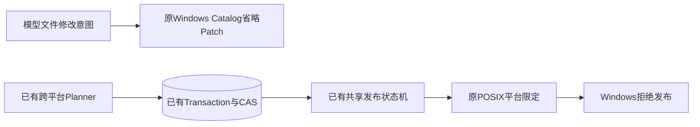
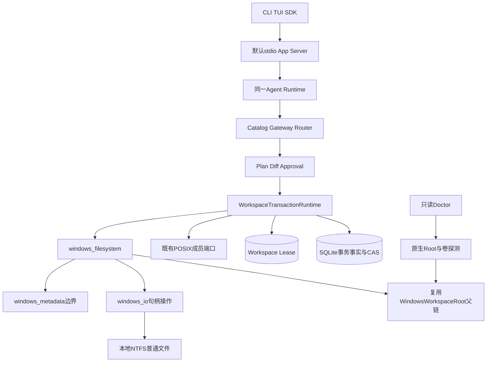
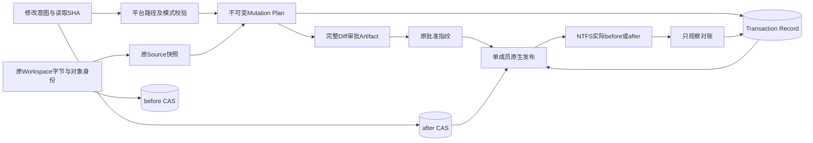
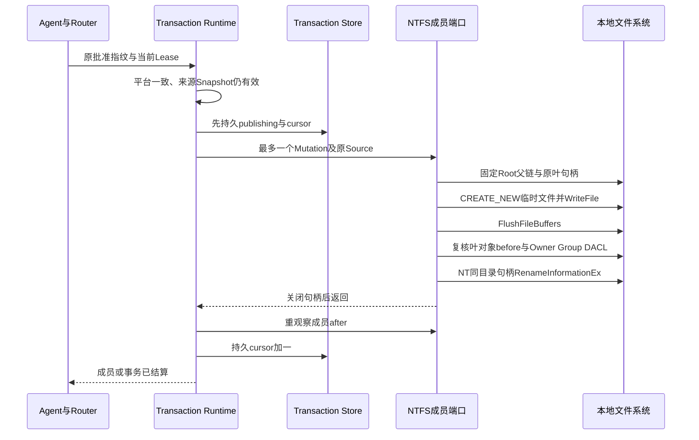
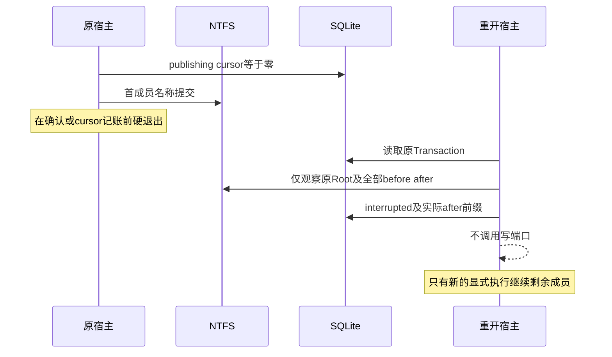

# R4：Windows原生NTFS文件事务与默认审批写链

## 1. 变更摘要

| 项目 | 内容 |
|---|---|
| 需求 | Windows用户通过同一Coding Agent读取、审查、批准和修改真实工程文件，并能处理取消及宿主崩溃 |
| 原缺口 | 已有Windows安全读取、Snapshot、Job Object与SQLite账本；普通文件发布仅POSIX，默认Windows产品省略`apply_patch_batch` |
| 本切片 | 在共享Workspace事务状态机下增加原生NTFS成员端口，接入默认Catalog与只读Doctor探测 |
| 数据变化 | 不新增数据库、状态机或Schema；沿用Transaction v1、before/after CAS、Workspace Snapshot及Lease |
| 当前证据 | 固定源码双Python受影响回归各1119通过/50跳过；原生专项成功，完整平台发布边界见验证报告 |
| 发布单元 | Python Wheel内三个Windows端口模块及共享装配；不是第二服务或Sidecar |

实现候选不等于R4完成。原生Git读取/交付产品装配、受管测试命令、脱离源码安装、升级、状态恢复和真实Beta仍需独立验证。
该端口用于编码工作区内的普通工程文件，不扩大首发到共享文件系统、任意特殊元数据或通用目录维护平台。

## 2. 需求背景与源码研究

Windows只读能力不能满足“修改代码→运行检查→审查→交付”。把POSIX平台拒绝直接删除、调用`Path.replace`
或把WSL视为原生支持，又会丢失既有路径、审批、并发和恢复边界。
本变更因此只扩展最底层的**单文件成员操作**，不重建Agent、审批或Effect Journal。

### 2.1 固定研究证据

- Harnessix基线：`01fa983ffcdcaf45f7604487a4852b3844a11dee`；
  [`filesystem.py`](../../src/harnessix/delivery/filesystem.py)原平台分支只接受POSIX，
  [`planner.py`](../../src/harnessix/delivery/planner.py)已经能捕获Windows快照，
  [`workspace/windows.py`](../../src/harnessix/workspace/windows.py)已经提供完整父句柄链。
- 本地Codex研究提交：`a0dcfe2ada3f5bbd5059a34c0fc6fac244741a67`；
  [`apply_hunks_to_files`](https://github.com/openai/codex/blob/a0dcfe2ada3f5bbd5059a34c0fc6fac244741a67/codex-rs/apply-patch/src/lib.rs#L470-L531)
  明确记录失败写入也可能已经改变目标，因此失败时不能继续把累计Delta视为精确事实。
  Harnessix采用既有耐久意图加实际before/after观察；没有复制参考项目代码，也不把其文件系统抽象视为本项目安全证明。
- Win32原始接口：
  [FILE_INFO_BY_HANDLE_CLASS](https://learn.microsoft.com/en-us/windows/win32/api/minwinbase/ne-minwinbase-file_info_by_handle_class)、
  [FILE_RENAME_INFO](https://learn.microsoft.com/en-us/windows/win32/api/winbase/ns-winbase-file_rename_info)、
  [Rename扩展标志](https://learn.microsoft.com/en-us/windows-hardware/drivers/ddi/ntifs/ns-ntifs-_file_rename_information)、
  [Disposition扩展语义](https://learn.microsoft.com/en-us/windows-hardware/drivers/ddi/ntddk/ns-ntddk-_file_disposition_information_ex)、
  [GetSecurityInfo](https://learn.microsoft.com/en-us/windows/win32/api/aclapi/nf-aclapi-getsecurityinfo)。
  Win32枚举`FileRenameInfoEx=22`、`FileDispositionInfoEx=21`不是NT内部的同名枚举值；
  变长文件名按UTF-16LE字节长度和ABI字段偏移编码，不能用macOS的`c_wchar`宽度推断Windows结构。
- 原生名称提交采用
  [NtSetInformationFile](https://learn.microsoft.com/en-us/windows-hardware/drivers/ddi/ntifs/nf-ntifs-ntsetinformationfile)
  与[FileRenameInformationEx=65](https://learn.microsoft.com/en-us/windows-hardware/drivers/ddi/wdm/ne-wdm-_file_information_class)。
  同目录改名使用`RootDirectory=NULL`和单个叶名称，由源临时句柄确定父目录；不经过进程当前目录解析，
  不使用`BypassAccessCheck`信息类，不存在字符串路径或另一API的自动降级。
  同步句柄要求返回状态及`IO_STATUS_BLOCK`完成状态均成功；PENDING不视为已确认。
- [CreateFile共享语义](https://learn.microsoft.com/en-us/windows/win32/api/fileapi/nf-fileapi-createfilew)
  约束每一个打开句柄。替换源须允许内核Delete访问，故只有替换读取句柄设置`ShareRead|ShareDelete`；
  观察、删除与临时文件仍只共享Read，任何端口均不共享Write。替换前重新检查当前名称的File ID和内容。

参考接口支持方案选择，只有真实NTFS上的失败与恢复测试才能证明本实现行为。

## 3. 设计目标、非目标与验收标准

| ID | 不变量 | 验收 |
|---|---|---|
| WFT-1 | 共享批准、Source、Lease、CAS和发布游标，不存在绕过Router的默认入口 | 默认产品SDK审批测试与Action绑定测试 |
| WFT-2 | 父链拒绝Reparse/Junction，并在成员操作期间禁止父目录改名 | Junction拒绝、持有父句柄期间改名失败 |
| WFT-3 | 逐成员复核原Root路径摘要与Volume/File ID摘要，不追认复制到另一个Root的内容 | 两成员之间替换Root测试 |
| WFT-4 | create采用不覆盖Rename；replace复核叶对象身份、内容和权限 | 外来目标出现、原对象双观测、权限拒绝 |
| WFT-5 | 同目录排他临时写、部分WriteFile循环、内容Flush先于名称提交 | 有界部分写入单测、二进制/空文件原生测试 |
| WFT-6 | 只支持普通单链接、默认数据流、普通属性及权限一致文件；不模拟0755 | ADS、只读、隐藏、硬链接、自定义DACL、模式拒绝 |
| WFT-7 | 对账无写入，取消不开始下一成员，确认丢失不重复效果 | 真实硬退出、取消、Rename确认丢失与幂等测试 |
| WFT-8 | Rollback是重新规划及批准的新事务；原账本不被改写 | create/replace/delete联合回滚 |
| WFT-9 | Doctor只探测Root、卷与API，不创建探针文件、Key或Store | 原生能力入口及既有只读Preflight回归 |

非目标：多文件内核原子性、自动继续未决效果、目录创建/改名、0755/Git Index模式模拟、共享盘/FAT/ReFS、
EFS/压缩/附加数据流无损迁移、任意自定义权限重写、专用SACL审计策略迁移、硬件掉电证明或同用户恶意内核调用隔离。
这些非目标不取消Windows完整编码产品的后续发布要求。

## 4. 当前实现与根因



根因是发布端口缺失，而非Provider、模型规划、Policy或SQLite不能运行。
复用Windows读取代码只解决对象观察；写入还必须定义名称提交、权限保留、失败确认与崩溃处理。

原生CI进一步定位了初始候选的接口兼容失败：提交`a5d42ab164ac277e9fac957f957b522e22dd4b08`
中，相对父句柄的Win32 Rename返回87；增加尾部空间仍返回87；绝对名称转换后返回32。
因此该候选不能作为Windows可用性证明。修正选用有正式同目录语义的NT句柄调用，
不关闭父链或原叶句柄来回避冲突；其可用性仍必须由修正候选的原生全部场景证明。
提交`a0d51e5c588b5cf49076c4d93e09164d1948b434`已通过原生创建、空/二进制文件和同目录API验证，
但替换原叶句柄不共享Delete导致32，原生专项为41通过、11失败。后继候选仅对替换源启用Delete共享，
保留禁止Write、父链固定、当前名称重新核对和权限相同要求，并增加名称漂移反例。
提交`b0e4102a31c4c9bf4a273917fbfbd9349bf0fc33`原生专项为57通过、1失败；
剩余失败发生在新增漂移夹具的普通路径Rename操作，未到达期望的漂移核对断言。
反例改用同目录原生句柄模拟外部名称变化，仍要求原文件和外来目标不被覆盖；没有删除或跳过该断言。

## 5. 方案、总体架构与变更边界



### 5.1 模块、类与接口设计

| 模块/符号 | 职责、入出参与所有权 |
|---|---|
| `WorkspaceTransactionRuntime` | 仍拥有六态FSM、durable cursor、批准指纹及Lease；按本机平台选择成员端口 |
| `observe_windows_file(root, path, source=...)` | 返回不可变`WorkspaceFileVersion`；在已知Source下同时检查Root身份；从不写入 |
| `apply_windows_mutation(store, root, transaction_id, index, mutation, source, checkpoint)` | 最多一个成员；正文来自CAS；checkpoint仅供受管故障测试 |
| `WindowsWorkspaceRoot` | 固定根与所有父段、检查Volume/File ID和最终路径、拒绝Reparse；退出关闭全部句柄 |
| `WindowsFileOperations` | 配置最小Win32/NT ABI；排他临时创建、部分写、Flush、NT同目录句柄Rename与句柄删除 |
| `WindowsFileSecurity` | 短期读取Owner/Group/DACL为比较摘要；`LocalFree`释放系统分配；不改ACL、不提权 |
| `windows_workspace_transaction_supported(root)` | 无写入探测Windows构建、本地固定卷、NTFS及Root绑定；失败则Catalog省略 |
| `workspace_patch_executor_evidence()` | Windows使用独立执行语义标识；POSIX原标识保持不变 |

`delivery`只依赖既有`workspace/execution`等底层模块，不反向依赖`product_config`密钥ACL实现。
CLI、Doctor和默认App Server通过同一能力函数收敛，不复制Windows写策略。

### 5.2 数据流与权威事实



模型提供意图，不提供IO句柄、Lease、账本位置或恢复决策。原字节与Source由宿主读取并冻结；
before/after正文由CAS保存，公开Plan只持摘要。审批Artifact绑定计划，不能替换CAS内容。
恢复同时使用原started事实和真实文件状态，不能单凭临时文件、目标正文或API返回值推进账本。

### 5.3 替代方案与取舍

| 方案 | 问题/收益 | 结论 |
|---|---|---|
| 删除平台拒绝并复用POSIX API | Windows缺少dir_fd/no-follow等价实现，不能成立 | 拒绝 |
| 普通字符串`replace/unlink` | 简单但不提供成员期间父链固定及叶句柄归属 | 拒绝 |
| 新Windows事务Runtime | 产生第二套审批、账本、取消和UNKNOWN语义 | 拒绝 |
| WSL执行POSIX后端 | 可用于明确隔离后端，但不证明原生文件工作流 | 不替代本切片 |
| 共享FSM加Windows原生成员端口 | 保留既有契约，把复杂性限制在三个底层模块 | 采用 |

## 6. 正常、失败与恢复时序

### 6.1 正常替换



批准和Lease先于成员效果；`publishing`先于临时写及名称提交；实际after先于游标确认。
Windows叶读取不共享写访问，创建时不覆盖既有目标；替换使用`REPLACE_IF_EXISTS|POSIX_SEMANTICS`，
但只有经核对的before才可进入该调用。名称提交不是多文件原子事务。

### 6.2 硬退出或确认丢失



`reconcile()`保留既有顺序规则：全部after且没有原started事实不能追认；不是有序after前缀则diverged；
无法可靠观察则错误/人工处置，不根据上一API是否返回成功盲重放。
调用Rename前若失败，清理只比较自有临时句柄的最终名称；一旦请求名称提交，就不再调用清理删除。
因此Rename已生效而确认丢失时，不依赖最终名称查询是否及时更新来决定删除，不能误删发布目标。
Rename请求失败但效果未确定时，也保留可能的自有临时文件作为诊断事实，不用清理覆盖歧义。
临时Flush后硬退出的孤立临时文件保留，不通过扫描`.harnessix-*`进行泛路径GC。

### 6.3 取消与超时

沿用`WorkspacePatchActionExecutor.execute()`成员间`await asyncio.sleep(0)`取消检查点。
同步成员已经开始时先完成有限IO及账本结算，再允许Task取消；未开始成员不得继续。
Router取消/期限后进入既有UNKNOWN和只观察恢复，Lease在Executor的`finally`释放。
本端口不增加后台线程、无Owner异步写入或自动超时重试；单文件上限8 MiB仍有效。
硬件阻塞IO不被描述为Python协作取消可强制中止。

## 7. 契约、数据结构与重点字段

| 结构/字段 | 含义与Windows限制 | 持久化 |
|---|---|---|
| `source.platform` | 必须等于本机Windows；未决跨平台历史不进入另一端口 | 原Plan |
| `source.root_path_digest/root_identity` | 原规范路径摘要和Volume/File ID摘要；每次成员/对账核对 | 原Snapshot |
| `before/after.presence` | `absent/file`；不支持目录Mutation | 原Mutation |
| `sha256/size` | 精确正文与有界字节数，不用文本换行归一化代替字节证明 | 原Mutation与CAS |
| `mode` | Windows普通文件逻辑0644；不是POSIX chmod；0755明确拒绝 | 原Mutation |
| `cursor` | 已确认after的成员前缀，不表示多文件原子提交 | 原Record |
| `started_at/state` | 原意图确已开始的证据；不能据全after补签旧prepared | 原Record |
| `owner_id/fencing_token/expires_at` | 仍使用原Workspace Lease；过期不能开始下一成员 | 原Lease DB |
| `RenameInfo.flags/root/name_bytes` | 创建flags=0，替换flags=3；Root为NULL表示源句柄同目录改名；名称只含叶名，长度为UTF-16LE字节且不含终止字符 | 临时内存 |
| `IO_STATUS_BLOCK` | 原生返回状态及完成状态都必须确认成功；PENDING或失败进入原事务观察结算 | 临时内存 |
| `executor_evidence_digest` | Windows采用`windows-ntfs-v2`并绑定NT同目录Rename、替换源共享模式与提交后禁止清理；初始候选摘要不复用，POSIX证明不变 | 原执行计划与Capability证明 |
| `security digest` | Owner/Group/DACL与继承控制比较，完整SID/SDDL不进入公开输出或持久记录 | 临时内存 |

普通属性只接受Archive/Normal，拒绝Readonly、Reparse、Directory、隐藏、压缩及加密等未支持属性。
只接受单个`::$DATA`默认流；`Zone.Identifier`等ADS不能被整体替换丢失。
替换源与同目录默认临时文件的Owner/Group/DACL不一致时，保留原文件并返回明确错误；不自动重写自定义权限。
此比较不等于读取或迁移完整SACL、审计策略和资源属性，不承诺专用安全元数据无损替换。

现有SQLite Schema、Event、Tool输入Schema与Transaction版本不变。POSIX的0644/0755行为和执行语义证明不变。
历史Windows0755计划原本没有可执行端口，仍可存储历史，但本原生端口不执行或模拟其模式。

## 8. 状态、事务、并发与幂等

复用`prepared → publishing → interrupted/published/diverged/unknown`。
临时文件不是事务状态权威；CAS和原Record才是意图来源，实际普通文件是效果对账来源。
源Root改名/重建后即使正文与计划镜像完全相同，也不能推进原事务。

SQLite的成员cursor与NTFS名称效果没有跨介质ACID；崩溃窗口通过原意图与实际前后版本闭合。
Flush确认内容已提交给操作系统；真实测试覆盖宿主进程硬退出，不以此宣称所有驱动、硬件掉电和目录日志持久性已证明。
重复已发布请求只返回历史结果，不重新写当前工作区；Rollback生成新Plan并重新批准。

## 9. 安全、隐私与可观测性

- Windows 11对应构建边界及之后的原生宿主、本地固定NTFS卷；不以WSL或远端共享卷替代。
- 父链来自既有`WindowsWorkspaceRoot`，所有父段拒绝Reparse且不共享Delete；不创建缺失父目录。
- 既有叶对象只开放所需Read/ReadControl及删除操作的Delete；替换源共享Delete但不共享Write，
  普通观察、删除和排他临时文件不共享Write/Delete。
- 创建不覆盖；替换前重新按名称核对原File ID；原文件版本、权限不满足时停止。
- 不使用`IGNORE_READONLY_ATTRIBUTE`、不提权、不注入Provider Secret、不运行模型提供的Shell。
- 公开错误只用固定Kernel代码和正式提示，不输出Win32完整错误正文、宿主绝对路径、SID或DACL。
- 复用Action Audit、Transaction state/cursor/error、Operation/Plan身份；不新增高基数指标或第二日志系统。
- 同一用户可绕过协作Lease直接调用原生API仍在既有Host Guarded信任边界之外，不宣称恶意同用户进程完全隔离。
  ShareDelete允许外部改名，因此重新核对File ID可以拒绝提交前可观察的名称漂移；
  最后检查与Rename之间不构成针对不合作写者的原子Compare-and-Swap，不扩大既有信任边界。

## 10. 核心业务伪代码

```text
publish_next(original_plan, approval, current_lease):
    assert platform, approval, lease and executable state
    if prepared:
        verify full original snapshot
        durably record publishing before any effect
    observe member in original Root
    if member == after: record progress without writing
    elif member != before: stop as divergence
    else:
        pin original Root and every parent segment
        open and verify original leaf or confirm absent
        if delete:
            mark original handle for deletion; close it
        else:
            exclusively create same-parent temporary handle
            write bounded CAS bytes, handling partial writes
            FlushFileBuffers
            recheck original leaf name, File ID and before
            require equal Owner Group DACL for replacement
            request NT same-directory rename of temporary handle
            never clean up a handle after rename has been requested
            before request: clean up only its verified temporary name
        verify actual after; durably record cursor
    between members: check cancellation and lease again

reconcile(original_record):
    assert native platform and original Root identity
    observe all members without writing
    retain original started-fact and prefix rules
    publish fact only when provable; never replay an UNKNOWN effect
```

## 11. 实施切片

| 顺序 | 交付 | 验证/发布边界 |
|---|---|---|
| 1 | Win32 ABI、内容IO、元数据边界 | 跨平台单元测试不能替代Windows内核结果 |
| 2 | 原生observe/apply与共享FSM分派 | 实际创建/替换/删除、硬退出、Root替换、租约失败 |
| 3 | Catalog/Doctor/默认SDK审批链 | 不仅直接调用文件端口；检验真实读SHA到批准到发布 |
| 4 | 固定Source独立回归、原生候选、中文设计及证据封存 | 原生失败时先修该端口，不放宽断言；R4其他工作不被自动关闭 |

## 12. 源码与测试映射

| 变更点 | 源码及关键符号 | 测试 |
|---|---|---|
| 共享FSM分派 | [`filesystem.py`](../../src/harnessix/delivery/filesystem.py)：`_observe/_apply/_prepare_publication/reconcile` | [`test_filesystem.py`](../../tests/delivery/test_filesystem.py)、原生文件测试 |
| 原生父链与版本 | [`windows_filesystem.py`](../../src/harnessix/delivery/windows_filesystem.py)：`_parent/_version/_check_current_target` | [`test_windows_filesystem.py`](../../tests/delivery/test_windows_filesystem.py)：Root替换、Junction、原生pin竞争 |
| ABI和句柄IO | [`workspace/windows_file_io.py`](../../src/harnessix/workspace/windows_file_io.py)：`_RenameInfo/WindowsFileOperations`；[`windows_io.py`](../../src/harnessix/delivery/windows_io.py)保留兼容导入 | [`test_windows_io_contracts.py`](../../tests/delivery/test_windows_io_contracts.py)：UTF-16、部分写、零进展、构建边界 |
| 元数据 | [`windows_metadata.py`](../../src/harnessix/delivery/windows_metadata.py)：`check_regular_file/WindowsFileSecurity` | 原生只读、ADS、硬链接、隐藏、自定义权限拒绝 |
| 规划及Mode | [`planner.py`](../../src/harnessix/delivery/planner.py)：`prepare_workspace_transaction/_read_existing`；[`trusted_action.py`](../../src/harnessix/delivery/trusted_action.py)：`_normalized_files` | Mode拒绝、来源漂移与完整SHA前置条件 |
| 默认装配 | [`action_composition.py`](../../src/harnessix/product_config/action_composition.py)：`_workspace_patch_component` | [`test_server_and_cli.py`](../../tests/product_config/test_server_and_cli.py)：`test_product_server_sdk_approves_review_and_applies_workspace_patch` |
| 只读诊断 | [`action_diagnostics.py`](../../src/harnessix/product_config/action_diagnostics.py)、[`preflight_actions.py`](../../src/harnessix/product_config/preflight_actions.py) | [`test_preflight.py`](../../tests/product_config/test_preflight.py)及原生能力探测 |
| 审批与取消 | [`trusted_action.py`](../../src/harnessix/delivery/trusted_action.py)：`WorkspacePatchActionExecutor` | [`test_trusted_action_patch.py`](../../tests/delivery/test_trusted_action_patch.py)：完整Review、Owner争用、成员间取消、只对账 |

## 13. 风险、部署、发布兼容与回退

真实Windows测试在CI原生runner运行，不能把macOS的skip计为通过，也不以单元模拟证明Win32 Rename行为。
CI先运行本端口和默认审批写链的精确测试，便于快速定位，再保留既有Windows全量模块回归。
失败时停止商用支持声明；不退回字符串路径写入、伪chmod、忽略权限检查或修改旧Source。

仅代码回退不重写已发生效果；未决Windows事务的原DB、CAS与Workspace必须保留。
重新安装不含该端口的候选后，历史记录不得落入POSIX端口或盲重放；恢复使用支持该Source的固定候选及明确批准。

## 14. 实现偏差与最终结论

为保持权限边界，首发采用“继承权限必须相同，否则拒绝”，而非扩展为通用ACL复制器。
因此受保护自定义DACL文件不在本端口可写范围；该约束有明确原生反例，不能把失败关闭描述成支持。
当前未增加独立ADR、服务、Store或Windows FSM；现行Delivery和产品装配资料同步说明该切片与R4完整商用支持的区别。
固定Source、测试计数、原生证据及未关闭边界在[本切片验证目录](../validation/windows-native-file-transactions-2026-09-28-v1/README.md)登记。
文件事务专项不等于完整Windows产品验收；没有R4其余安装、Git和恢复证据不能标记为生产完成。
