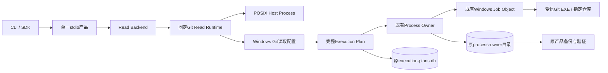
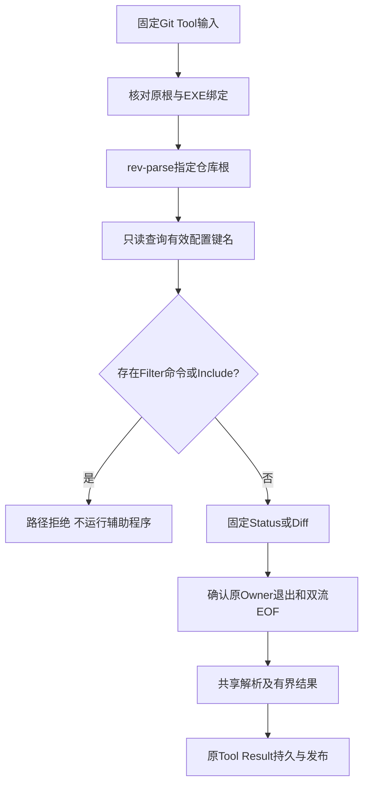
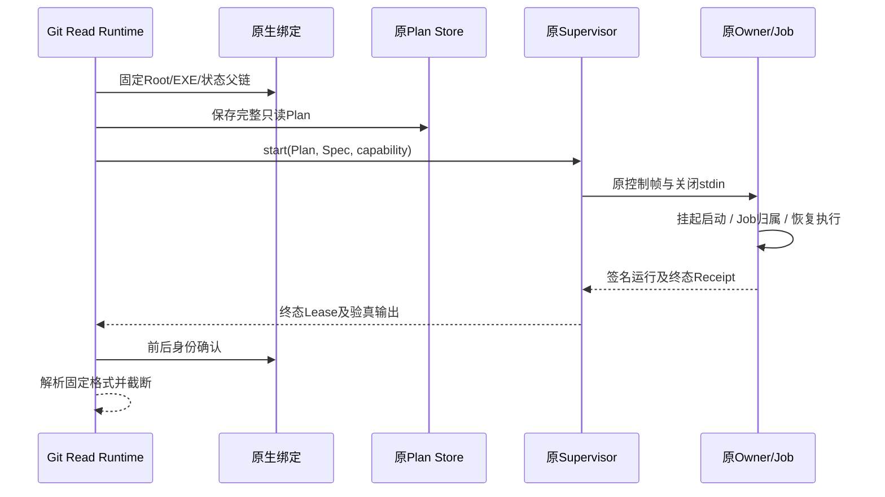
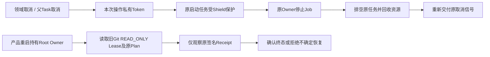
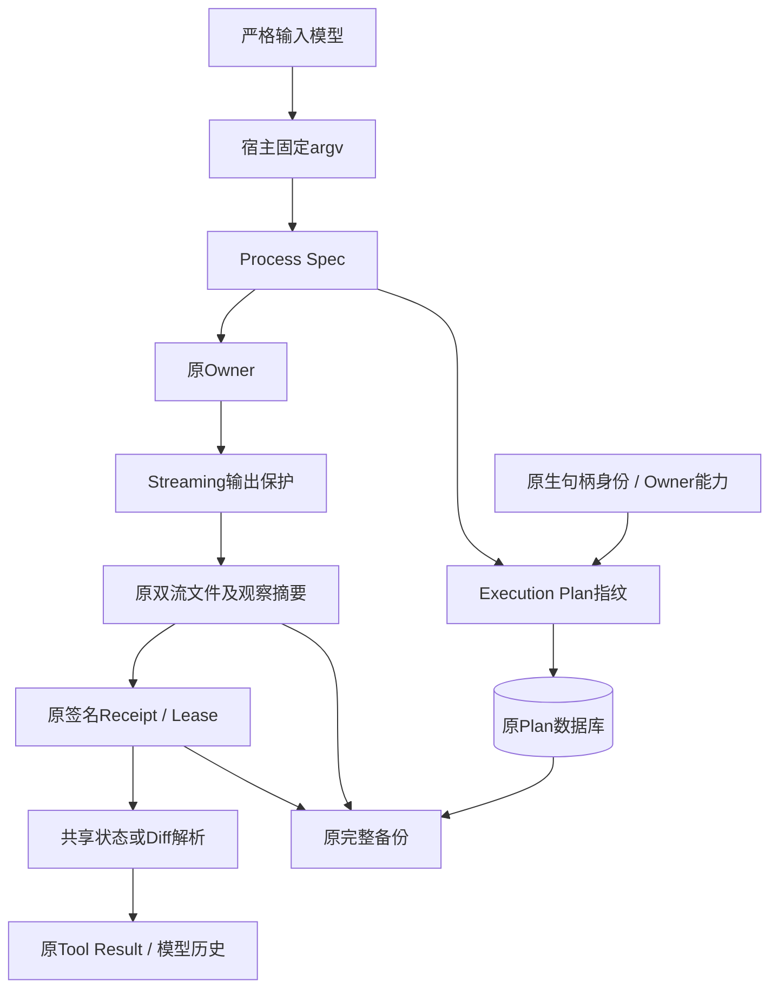

# R4：Windows原生Git读取、受监督回收与现有状态融合

## 1. 变更摘要与需求背景

Coding Agent需要知道实际分支、工作区变更和暂存区差异。Windows文件读取与NTFS事务已经有原生实现，
但显式Git开关仍被产品和只读运行时拒绝，无法构成与POSIX一致的代码审查体验。
简单删除平台判断不能解决Windows进程树、EXE身份、命令行、取消、状态落盘和重启观察问题。

| 项目 | 本切片范围 |
|---|---|
| 功能 | Windows `git_status`、`git_diff`；同一SDK/stdio目录和结果Schema |
| 进程 | 原有Windows Process Owner与Job Object，不新增服务、Shell工具或进程状态机 |
| 安全修复 | 所有平台查询前拒绝可执行Filter和外部配置Include；固定禁用子模块辅助查询 |
| 持久化 | 原`execution-plans.db`和`process-owner/`；不新建孤立的Git状态拓扑 |
| 恢复 | 产品启动在Root Owner下只观察旧Git查询原Receipt；不重新执行查询 |
| 明确不含 | Git写入/Commit/Push产品装配、任意Git参数、安装程序、WSL替代原生验收 |
| 当前状态 | 实现候选；本机非Windows测试不能证明原生实现或R4正式完成 |

## 2. 设计目标、约束及源码研究

1. 保持既有文件读根、只读并发和Git输出合同；参数只来自宿主固定命令或严格的`GitDiffInput`。
2. 正常退出、取消、超时均回收原Owner及其Job，不以数据库中的数字PID作为恢复权限。
3. 查询必须留下完整Plan和签名进程事实，备份不能因新增未知目录失败，也不能漏掉实际进程事实。
4. 拒绝危险仓库配置而不是运行辅助程序后再过滤输出；错误不回显配置值、路径和原始stderr。
5. 保留POSIX受信宿主实现，不放宽其平台检查，不以直接`subprocess.run`替代有界监督。

### 2.1 研究证据与取舍

- Harnessix研究基线`2425c8b`：[`tools/git.py`](../../src/harnessix/tools/git.py)已有固定查询、NUL解析和输出截断，
  [`processes/supervisor.py`](../../src/harnessix/processes/supervisor.py)已有Windows Owner、签名Receipt及恢复。
  [`state_backup_records.py`](../../src/harnessix/product_config/state_backup_records.py)要求每个Lease关联原完整Plan；
  因此新读取不能只把Lease摘要放进另一个目录。
- 本地Codex提交`a0dcfe2ada3f5bbd5059a34c0fc6fac244741a67`：
  [Git进程与Job守卫](https://github.com/openai/codex/blob/a0dcfe2ada3f5bbd5059a34c0fc6fac244741a67/codex-rs/git-utils/src/git_process.rs)
  将超时与进程树治理绑定；[Fsmonitor策略](https://github.com/openai/codex/blob/a0dcfe2ada3f5bbd5059a34c0fc6fac244741a67/codex-rs/git-utils/src/fsmonitor.rs)
  区分内建Daemon与仓库可执行Helper。Harnessix本切片统一关闭Fsmonitor，不增加Daemon能力探测或保留后台子进程。
  研究用于职责与取舍分析，没有复制参考项目实现。
- [Git环境与配置文档](https://git-scm.com/docs/git)、[Diff辅助程序控制](https://git-scm.com/docs/git-diff)：
  `--no-ext-diff/--no-textconv`不能代替Filter检查。固定配置查询使用
  `config --no-includes --null --name-only --list`，只捕获键名，不落盘凭据Header等配置值。
- [Windows Job Object](https://learn.microsoft.com/en-us/windows/win32/procthread/job-objects)：
  复用已有挂起启动、Job归属和整树回收端口，不增加另一套Win32调用。

## 3. 总体架构与模块边界



- [`read_backend.py`](../../src/harnessix/tools/read_backend.py)只选择原生文件/Git后端；不做查询和权限决策。
- [`tools/git.py`](../../src/harnessix/tools/git.py)持有仓库根验证、辅助程序拒绝和共享状态/差异解析。
- [`git_windows_binding.py`](../../src/harnessix/workspace/git_windows_binding.py)复用Windows原生句柄链，固定根、EXE和状态父链。
- [`git_read_windows.py`](../../src/harnessix/processes/git_read_windows.py)只负责固定宿主查询的Plan/Owner装配及观察；不提供模型Shell。
- [`server.py`](../../src/harnessix/product_config/server.py)注入原私有产品Root和公开输出保护材料。
- `GitContextSource`可通过显式状态参数使用同一读取端口；默认产品本切片没有新增自动Git Context Source，
  模型仍通过已注册的`git_status/git_diff`主动检查。

## 4. 领域契约与数据结构设计

### 4.1 公开输入和输出

沿用[`git_contracts.py`](../../src/harnessix/tools/git_contracts.py)：

| 合同 | 重点字段与语义 |
|---|---|
| `GitStatusInput` | `limit`限制结构化条目，不接收命令、路径或配置 |
| `GitStatusOutput` | branch/OID/upstream、NUL格式解析条目、总条目数、截断、原观察revision |
| `GitDiffInput` | `target=worktree/staged`；`context_lines`严格整数，布尔值不代替整数 |
| `GitDiffOutput` | 有界UTF-8前缀、实际前缀字节数、完整观察字节数及摘要；前缀不等于完整Diff |
| 目录绑定 | POSIX `git-read/v1`、Windows `git-read/windows-job-v1`；规则变化进入Tool指纹 |

新规则明确`executable_filters/configuration_includes/submodule_queries=false`。
原公开Schema、`__all__`及数据库Schema均不变化；旧Git工具指纹不得冒充新目录规则。

### 4.2 内部结构与持久化位置

| 类型/文件 | 重点字段 | 不变量 |
|---|---|---|
| `WindowsGitBinding` | root、EXE父根/句柄、fingerprint | 命令期间保留自己打开的句柄，操作前后核对原身份 |
| `_GitReadConfiguration` | root、executable、state、capability、fingerprint、output_redaction | 不可变宿主配置；不接收模型配置 |
| `ProcessSpec` | 固定argv、UUID、关闭stdin、pipe、前台、期限、输出预算 | 不接受Shell Source，进程ID不重用 |
| `ExecutionPlanV2` | source=`builtin`、source_id=`harnessix.git_read`、tool=`git.read`、READ_ONLY/LOW、Workspace快照 | 固定宿主只读授权；不是一般Process写动作的审批替代 |
| `execution-plans.db` | 原完整Plan及fingerprint | Owner启动前保存；Lease必须能回查同一Plan |
| `process-owner/process-leases.db` | 原Process Lease及CAS事件 | 原Store v2，不另建Lease状态机 |
| `process-owner/runs/<UUID>/` | receipt.json、stdout.bin、stderr.bin | 签名原Receipt与输出摘要绑定，原备份白名单直接覆盖 |

Windows输出先执行宿主提供的既有Streaming保护，再由同一Owner计量和落盘。
单流结果前缀限制为stdout 1 MiB、stderr 16 KiB；原Owner总输出预算为8 MiB。
模型可见Diff文本仍最多48 KiB，JSON结果仍受60,000字节边界约束。

## 5. 核心流程与失败边界



每个Tool正常执行三个固定查询，分别生成自己的Process UUID和完整Plan。
Status使用porcelain v2、NUL分隔和明确条目上限；Diff显式指定工作区/暂存区，关闭外部Diff/textconv。
两个查询均关闭子模块辅助读取；不会替用户刷新索引、执行Hook或自动提交代码。
Windows接受Git规范化的正斜杠及大小写表示，只移除一个行结束符；父仓库、控制字符和多余换行不匹配。

### 5.1 正常执行时序



### 5.2 取消、超时和恢复



父Task不能取消已交给线程的CreateProcess操作后直接离开。私有Token先请求停机，再排空原启动任务；
禁止生成第二个UUID重发命令来掩盖启动结果。超时沿用原Spec期限，不刷新为新的五秒。
重启通过原source_id、tool、READ_ONLY及Plan指纹识别查询，只调用原`reconcile`，不调用`start/run`。
签名或终态不确定时拒绝产品启动；该过程不是仓库副作用恢复或任意PID清理器。

### 5.3 可观测性与错误分类

| 场景 | 处理 | 原事实 |
|---|---|---|
| 相对路径、非EXE、Junction、多硬链接EXE | `product_git_invalid` | 不启动Owner |
| 原生端口在其他宿主探测 | `product_git_platform_unsupported` | 不把模拟平台当实际能力 |
| 缺少Windows私有状态 | `product_git_state_required` | 不临时选取全局目录 |
| 状态与Workspace互相包含 | `product_state_overlap` | 不向仓库写私有状态 |
| Catalog后Root/EXE绑定变化 | `process_binding_changed` | 不启动变化后的程序 |
| 非仓库 / 父仓库 | `tool_not_found` / `tool_path_denied` | 不回显根路径 |
| Filter命令或Include键 | `tool_path_denied` | 不执行辅助程序，不捕获配置值 |
| 领域取消 / 父Task取消 | 原取消信号 | 原Owner及完整Job先回收 |
| 超时 | `tool_timeout` | 保留原期限、Lease和Receipt |
| 非零退出 / EOF不完整 | 固定失败 | 不将截断或不确定输出当成功 |
| 配置/Status捕获截断 | `tool_limit_exceeded` | 不把前缀当完整列表 |
| 旧查询恢复不确定 | `product_git_recovery_uncertain` | 不重放、无数字PID权限 |

## 6. 数据流和核心逻辑伪代码



```text
execute_git(input):
    确认本次目录绑定仍与Catalog一致
    固定查询仓库顶层；比较原根，拒绝父仓库
    固定查询配置键名；拒绝Include和可执行Filter
    fixed_status_or_diff = 从严格输入生成固定命令
    对该命令：固定原生Root/EXE/状态父链
        构造原ProcessSpec和READ_ONLY ExecutionPlan
        先将完整Plan写入原Plan Store
        通过原Supervisor启动唯一Owner
        等待原终态、双流EOF与输出摘要
        核对前后句柄身份
    用共享解析器生成有界结果

on_cancel:
    取消本次操作Token，不丢弃启动线程
    先排空原Owner/Job，再重新交付原取消

on_product_startup:
    在产品Root Owner内读取旧只读Git Lease及原完整Plan
    只核对原签名Receipt，不启动进程、不重放查询
    无法确认终态则拒绝启动
```

## 7. 类与接口设计、源码阅读路径

| 阅读次序 | 源码与重点 |
|---|---|
| 1 | [`server._serve_product_stdio`](../../src/harnessix/product_config/server.py)：原私有Root、保护材料与启动恢复顺序 |
| 2 | [`read_backend.build_read_backend`](../../src/harnessix/tools/read_backend.py)：先校验Git，再构造唯一文件根 |
| 3 | [`CodingToolRuntime`](../../src/harnessix/tools/runtime.py)：仍复用既有信号量、Scope和Tool指纹 |
| 4 | [`GitReadRuntime.execute/_run_git_process`](../../src/harnessix/tools/git.py)：固定三查询、错误映射与共享解析 |
| 5 | [`WindowsGitReadProcess.run/_execute_git`](../../src/harnessix/processes/git_read_windows.py)：Shield、原Plan/Owner及输出适配 |
| 6 | [`WindowsGitBinding/pin_windows_git`](../../src/harnessix/workspace/git_windows_binding.py)：复用原生根/叶句柄链 |
| 7 | [`WindowsProcessSupervisor/SupervisedProcess`](../../src/harnessix/processes/supervisor.py)：原CAS、控制与Receipt权限 |
| 8 | [`reconcile_windows_git_reads`](../../src/harnessix/processes/git_read_windows.py)：产品启动只观察旧查询，不重发 |
| 9 | [`state_backup_records._processes`](../../src/harnessix/product_config/state_backup_records.py)：原Plan/Lease/双流事实校验 |

## 8. 测试矩阵和验证口径

| 用例 | 证据位置 | 证明边界 |
|---|---|---|
| 平台路径、Unicode、CRLF、多换行及父根 | `test_git_platform_contracts.py` | 纯合同，不是Windows API证明 |
| POSIX EXE替换 | 同上 | 目录后换程序在启动前拒绝 |
| Filter/Include | 同上及`test_windows_git.py` | clean正向对照真实执行；正式查询拒绝，不删除失败夹具 |
| Native Unicode Status、暂存/工作区Diff、索引不变 | `test_windows_git.py` | 原生Git+Job，九份查询Plan/Lease/双流EOF |
| Native 取消/超时/启动期间取消 | 同上 | 原PID及子进程均退出，原Lease终结 |
| Native 原Receipt恢复 | 同上 | 丢失Controller最后观察后只收敛原事实，不追加Run |
| Native Doctor | `test_preflight.py` | 实际EXE与Owner能力；探测不创建进程状态 |
| Native 默认SDK、输出保护及正式备份 | `test_server_and_cli.py` | 单一产品端口、实际私有捕获保护、原备份合同兼容 |
| 共享模块回归 | tools/processes/context/workspace/execution/product_config | 不代替真实模型任务、脱离源码安装或独立Beta |

Windows焦点CI先运行本切片，不等待许可证检查或全量回归完成才提供反馈。
焦点期限三分钟；完整Windows模块回归三十分钟，并启用阻塞线程诊断。超时保留为失败，不能计作验收成功。

## 9. 安全、部署、兼容与发布边界

Windows宿主显式提供Git for Windows绝对普通EXE。stdio产品沿用现有`--git-executable`，
从既有产品状态Root派生Plan/Process路径，不增加中间件。独立SDK需显式传入外部私有`git_state_directory`，
宿主负责该Root的私有权限与唯一产品所有权；不能与源码根互相包含，不能借Junction绕过。
POSIX保持原Host Process，原无Git参数的调用不变。

这是**Host Guarded**固定读取，不是OS强Sandbox、网络断网证明或防恶意同UID宿主的原子配置CAS。
Config检查与后续Git查询之间仍可能被恶意同UID外部进程篡改；句柄、关闭Helper和有界监督不应被宣传为强隔离。
明确关闭的是Git交互/可执行辅助程序选择与远程协议，不将这些配置宣称为OS网络隔离。

本切片不关闭R1整体恢复、R3真实任务质量、R4三平台脱离源码安装升级或R5真实用户Beta。
许可证及分发材料保持低优先级并行工作，不占用功能研发主线；正式分发前仍需完成发行条件核对。
