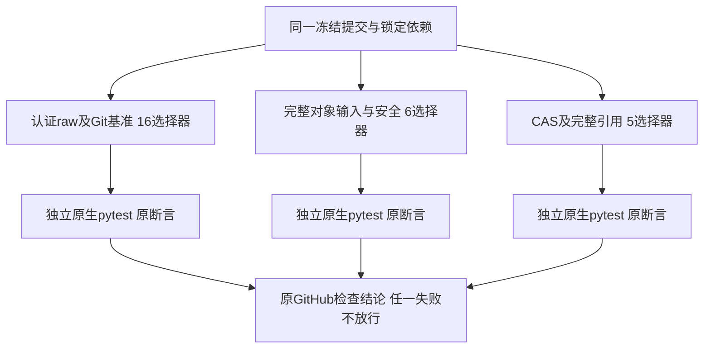
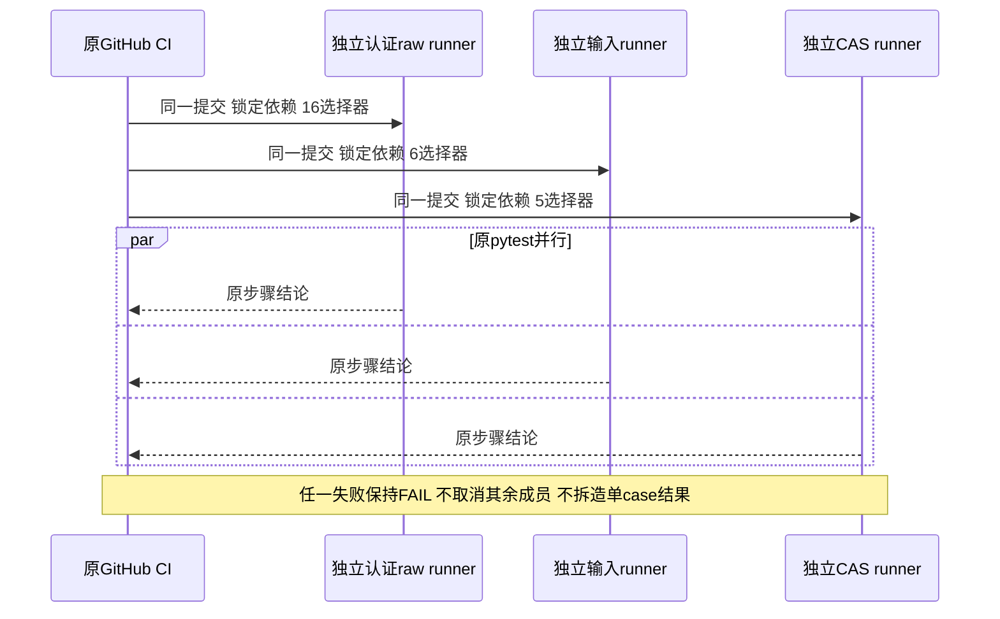

# Windows完整Git材料的并行原生验收：总体与详细设计

## 1. 需求背景与现有证据

固定0583b53的最低SHA256 Commit专项Run37134072312已经通过；它不能替代完整材料容量与认证回执矩阵。
同候选常规CI Run37134036729的Windows Job111234779832仍失败：前置NTFS写链、Git读取与取消步骤成功，
认证raw／Git基准聚合步骤failure。该步骤运行308秒，配置五分钟；时间接近上限不能证明每个case失败或唯一超时根因。
未读取原始CI业务日志、stderr或CDB日志，现有事实只能定位到合并的27个选择器，而非具体断言。

原合并组同时包含认证输出、完整对象输入、CAS及树引用验真。重新执行相同失败合并组不会提供分组结果；
新的CI候选将原选择器按现有模块拆为三个独立Windows矩阵成员，沿用普通pytest及原步骤结论。

## 2. 设计目标、非目标及取舍

- 27个原选择器完整保留、恰好一次；不删除失败、缩减8MiB容量、对象种类或SHA1／SHA256覆盖。
- 在互不共享工作区的原生Windows runner上并行执行，某成员失败不得取消其他成员。
- 任何成员失败仍使其检查失败；没有continue-on-error或替换Grader。
- 原NTFS、读取、重启、备份、恢复及后继广泛回归步骤保持，只迁出原聚合步骤。
- 不新增采集器、日志格式、诊断插件、PE／PDB下载或模型请求；最低Commit专项及18输入完全不改。

非目标：没有生产源码修复、默认Git产品装配、Backup v2、消费者Windows11或R3质量验收。
拆分是CI调度与验收边界变更，不将它称为业务故障已修复。

每成员保留原测试步骤五分钟上限；由一个合并五分钟改为三个可并行五分钟成员。
因此总runner分钟与最坏资源占用可能增加，不能声称总CI预算未变。实际pytest选择器总量保持，
额外开销来自三份隔离checkout／依赖准备；不提高原20秒命令、45秒材料操作或最低专项240／300秒期限。
选择并行而非串行三组，避免正常执行等待时间按三个上限累加；实际排队和耗时以新Run为准。

## 3. 总体架构、模块边界与源码映射



矩阵只改变[CI调度](../../.github/workflows/ci.yml)。每个runner的fixture、Workspace、SQLite、Owner及临时Git
仓库独立生成，不在成员之间传递PID、Proof、批准、CAS或会话。生产代码仍走原宿主、Supervisor及Worker：

| 模块与源码 | 已有职责 | 本次变化 |
| --- | --- | --- |
| [git_material_process](../../src/harnessix/product_config/git_material_process.py) | 完整输入准备、批准、staging和原Process宿主 | 无 |
| [git_material_worker](../../src/harnessix/delivery/git_material_worker.py) | 原命令、只读快照、namespace后验及完整回读 | 无 |
| [Windows原生端口](../../src/harnessix/delivery/git_material_native_windows.py) | 原真实句柄、DACL、类型、身份及共享保护 | 无 |
| [材料输入测试](../../tests/product_config/test_git_material_input.py) | 各对象、格式、容量、独立批准回读及失败保护 | 全文件保留 |
| [CAS集成测试](../../tests/product_config/test_git_material_cas_integration.py) | 原CAS完整字节到原Owner及独立回读 | 全文件保留 |
| [调度治理测试](../../tests/governance/test_windows_native_material_acceptance.py) | 对冻结原选择器多重集合及其他步骤作精确比较 | 新增测试域守卫 |

没有新增生产类、端口或数据结构。治理函数仅解析已有YAML、命令token与Counter，不承担执行授权。

## 4. 接口设计、字段与数据结构

| 字段／接口 | 契约及重点解释 |
| --- | --- |
| job windows-git-native-material | windows-latest；与原核心Windows job独立，不使用其临时状态 |
| matrix.group | authenticated-raw、object-input、cas-reference三个静态值，作为简短检查名称 |
| matrix.selectors | 版本库内固定pytest选择器字符串；不是外部工作流输入或用户命令 |
| strategy.fail-fast | false；一个成员失败不取消另外两个成员 |
| timeout-minutes | 原pytest步骤每成员5；不是业务单次操作预算 |
| pytest参数 | 原uv run pytest及-vv、-o faulthandler_timeout=60，保留原断言和错误退出 |
| 原选择器多重集合 | 固定8162953原聚合27项；Counter同时检测遗漏、重复及替换 |
| 其他步骤完整列表 | 删除原聚合一步后应逐对象等于旧列表；禁止顺带改安装、备份、恢复或安全门 |

完整六件输入组为git_object_material、git_material_input、snapshot_lifecycle、native、directory_access及owner_exit。
CAS五件为git_material_cas、cas_write_authority、git_object_references、git_tree_closure及cas_integration。
其余原16项属于认证raw及Git基准，包括原容量基准的两个精确测试；选择器按旧顺序分配。

## 5. 核心流程、时序、数据流与伪代码




```text
read original CI step at fixed 8162953
parse original pytest selectors and trailing arguments
partition by the existing input and CAS file sets; all others remain raw/baseline
require Counter(all matrix selectors) == Counter(original selectors)
require every other Windows core step unchanged
checkout the same candidate independently for each matrix member
run the unchanged pytest command arguments with the original per-step timeout
retain every failure; read only existing Run/Job/step conclusion metadata
do not promote group success to full product or commercial acceptance
```

## 6. 失败、取消、恢复与持久化

失败、异常、超时均保留原pytest非零状态；矩阵fail-fast=false只保障其他成员可继续，不将FAIL转换为PASS。
工作流取消仍取消各runner；每个测试中的原CancelToken、进程回收、Lease及UNKNOWN语义不改。
不是业务恢复实现，不能以重启runner替代持久化或重放未知副作用。

测试使用各自临时数据库和仓库，原业务持久化仍由现有Store负责；不创建新的共享CI数据库。
证据仅保存现有元数据、设计前置、精确源码摘要、本机回归与图示，不发布临时目录、正文、批准或凭据。
旧FAIL不可覆盖；观察超时只继续核对同一活跃Job，不重新dispatch或重跑旧失败候选。

## 7. 安全与可观测性

新job沿用固定checkout／setup-uv及uv sync --locked --all-extras --dev，没有新增secret、网络执行入口或权限。
选择器全部来自受评审源码，禁止外部matrix输入。原contents: read全局权限保持。
仅使用原pytest与GitHub检查结论，不读取业务日志，不新增stderr解释或采集格式。
最低专项通过不能提升历史Root UNKNOWN；各成员PASS也不证明消费者Windows11或完整产品交付。

## 8. 测试、发布与回退

先以旧YAML运行新守卫，确认缺少矩阵时RED；按上述唯一迁移实现后GREEN。
守卫覆盖选择器Counter、静态分组、fail-fast、runner、原参数／期限、无失败忽略以及其他原生步骤不变。
另以collect-only列出同一27选择器的当前参数化节点并冻结清单；本机执行三组关联回归只证明POSIX范围，
Windows-only跳过单列，不能计为原生通过。原最低专项18输入必须仍一致。

新源码与文档静态、精确Secret及三个图示渲染通过后正常推送一次新候选，使用该候选自动CI取得各成员结论。
不额外手动重跑最低专项或旧失败合并组。若某成员仍失败，保留实际范围并针对该成员继续闭环，不放宽门槛。
回退只还原CI分组和测试域守卫，不修改公共Schema或持久状态；旧失败证据仍保留。

## 9. 当前范围与商用退出条件

本设计是原完整验收范围的并行调度，不增加产品特性，不删除历史代码或更改业务安全契约。
实施及新原生结果未取得前不标记分组通过。完整Git／Backup v2、真实R3质量与费用未决、消费者三平台、
独立Beta及同候选R1～R6继续按原完整目标验收，不以CI分组替代商用结果。

当前实现已按上述分组迁移，治理7项通过。collect-only的固定清单实际1306节点，
认证raw386、对象输入303、CAS引用617；三组节点多重集合与原合并组完整相等。
本机和新原生候选结果另行记录，不以收集成功视为业务或原生通过。

新治理显式以UTF-8读取当前YAML与冻结Git源码，防止Windows默认locale影响中文步骤名称；
对应读取守卫通过。三组本机关联实际1283通过／23 Windows相关跳过、零失败／错误；治理7项单列。
首次文档检查发现三个语义章节标题未匹配规范，内容已具备但规范命名不完整；修正标题后重新检查，原发现保留。
