# Windows Git Trace2角色、静态错误格式与精确发行输入设计

## 1. 文档摘要和实现边界

本设计修正内部Windows材料诊断将wrapper的Trace2 `start.argv[0]`错误地与启动器完整路径比较的问题。
角色必须来自既有固定PE/PDB完整验真，再与实际命令和请求的物理身份关联；
不得通过basename或原始事件自行推断角色。完整实际Worker命令不变，只调整诊断解释器的预期表示。

发布输入基线为`5265fdf2d1755b15491f41b770b2d718bab98d2c`，不是本变更后继原生运行的revision。
新的两件诊断源码和基线已经改变的两件生产源码纳入原16件精确字节合同；
执行时仍必须使用包含全部变更的完整固定提交，不能用基线、旧摘要或仅语义相等的源码运行。

当前限定离线验证为六件治理测试文件共767项通过，507件实际输入前后零漂移。
该结果属于已发布角色接线阶段；后继静态格式增量及当前18件发行输入见第12节，不能继承旧成绩。
507件中包括479件受版本管理的生产成员，其中438件为Python源码；不是507件Python源码或全仓测试。
测试不执行Windows、调试器、供应商请求或真实SDK。
原Run `37089114490` 的Git128/Worker2、input proof缺失、SDK未通过和Root未知保持原结果。
角色接线修复不证明Git128的业务根因，不关闭R1、R3、R4、独立Beta或商用门禁。

## 2. 需求背景和问题归因

固定现场失败的有限Trace2记录显示`STREAM_BINDING_MISMATCH`。
源码与固定发行资料证明：经验真的wrapper可将Trace2首项表示为字面量`git.exe`，
而Worker实际启动参数首项仍为原启动器完整路径；core的DIRECT表示保持原首项。
该差异足以解释一种诊断误拒绝，但SID不一致等情况也可产生相同有限记录，不能认定唯一现场根因。

原预检在外层Python进程验证PE/PDB，随后CDB启动独立Python进程执行两个固定案例。
两者不共享内存，不能声称已有角色结果自动传入探针。
解决方案是在探针原fixture安装hook前，复用既有验真算法只读复核原预检准备的符号文件，
将完整验真的角色关联保存在当前探针内存，结算后清空。

## 3. 设计目标、非目标与取舍

- 只有实际PE/PDB和物理身份都匹配时，wrapper采用`("git.exe", *argv[1:])`，core采用原argv。
- 后21个参数、原ProcessSpec、Plan、批准、Owner、Job及Worker完全不改。
- 全部角色来源成功后一次性发布，不暴露部分绑定；失败不能猜测或回退成DIRECT。
- 原完整raw/MAC/EOF/protection前置、SID、profile、重复start及有限字节/事件预算保持。
- 不增加公开诊断字段、执行权限、自动下载、后台服务或数据库。
- 已知源码变化必须重新固定身份，原冻结拒绝和历史原生失败完整保留。

不选择basename宽松匹配，因为它无法证明当前可执行文件是固定官方wrapper。
不解析未验真事件反推角色，因为输入流不能为自身的来源授信。
不将角色写到环境变量或文件，因为诊断无需新增跨进程身份传输面。
额外PE/PDB只读复核仍消耗原总期限，未实测其Windows现场耗时，不增加期限。

## 4. 总体架构、模块边界与源码映射

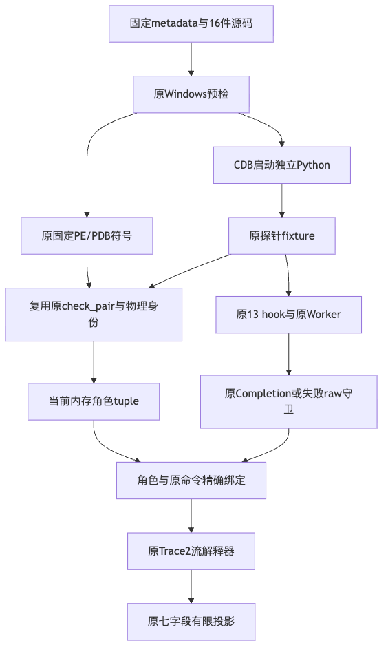

| 模块 | 责任 | 明确不承担的责任 |
|---|---|---|
| [`contract.py`](../../scripts/windows_git_native_branch_observation/contract.py) | 验证固定metadata及16件源码精确字节 | 不自动刷新，不授予执行权限 |
| [`preflight.py`](../../scripts/windows_git_native_branch_observation/preflight.py) | 定位原选中Git及固定布局，准备符号 | 不以目录名授角色 |
| [`identity.py`](../../scripts/windows_git_native_branch_observation/identity.py) | 原PE/PDB大小、SHA、GUID/age、RVA和分支字节验真 | 不改变诊断或业务成绩 |
| [`git_minimum_commit_probe.py`](../../tests/product_config/git_minimum_commit_probe.py) | 当前fixture只读复核、角色生命周期、原13 hook和结算 | 不新开Owner，不写业务状态 |
| [`git_trace2_projection.py`](../../tests/product_config/git_trace2_projection.py) | 绑定原命令/请求与角色，调用原封闭流解释器 | 不执行Git，不输出动态身份 |

## 5. 核心流程、时序与数据流

### 5.1 角色来源流程

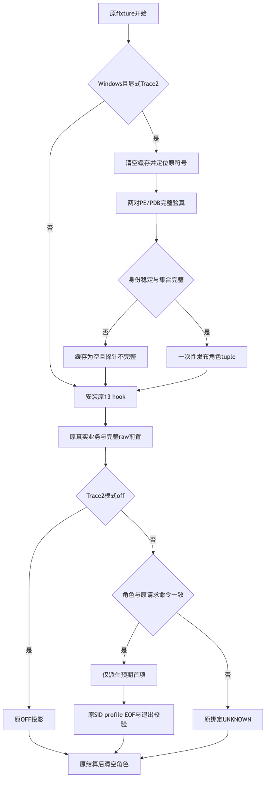

模式为`off`或非Windows时不触发角色复核。
Windows显式`stderr-event-v1`在原fixture安装hook前调用`_bind_trace2_roles`：
先清空缓存；要求原绝对basetemp；从其父目录只读定位原`symbols/{wrapper,core}/git.pdb`；
使用原`selected_paths`定位程序，符号真实路径不得逃出原私有输出目录。
每一对验真前后物理身份必须一致，两对角色、路径及选中程序均符合固定集合后才发布tuple。
任何来源异常被原`_safe`隔离，探针标记不完整，不吞掉实际业务异常或修改其状态。

### 5.2 生命周期时序

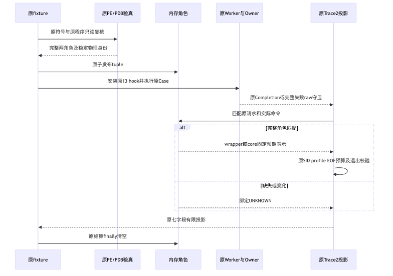

正常路径在原完整Completion之后消费其`input_proof`和已验真stderr。
失败观察仅在原receipt/raw/protection守卫之后消费原字节，未满足前置不得投影。
投影采用已认证角色，但仍执行原profile、SID、start唯一性、完整EOF与返回码一致性判断。
关闭原hook和完成结算后，在`finally`清空角色以及prepared/handle/protection引用；
诊断绑定不能跨Case、Turn或重开复用。

### 5.3 数据流程与持久化

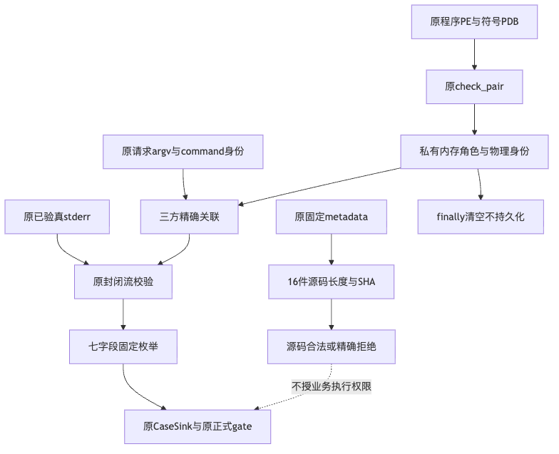

程序真实路径和物理摘要只在当前内存关联，`repr=False`隐藏动态字段。
公开输出继续只有原七字段固定枚举；不输出路径、SID、PID、argv、stderr正文、PDB或凭据。
既有`Probe.render`、CaseSink和正式gate不改。
本设计没有Session迁移、MAC补签、业务数据库写入或新恢复账本。
固定合同是版本管理的发行输入，不是在线自动再绑定机制。

## 6. 类设计、接口设计、数据结构和重点字段

| 类型/接口 | 入参与出参 | 核心不变量 |
|---|---|---|
| `_Trace2RoleBinding` | frozen、slots数据类：`executable`、`identity`、`role` | 前两字段不进入repr；角色仅wrapper/core；不是权限 |
| `Probe.trace2_roles` | 当前探针只读tuple，初始为空 | 全部验证成功后发布；失败和结算清空 |
| `_bind_trace2_roles(probe, basetemp)` | 原探针、原fixture私有目录；无公开结果 | 完整官方配对，符号不逃逸，程序身份前后相同 |
| `_operation_start_argv(operation)` | 原Operation；返回预期tuple或None | 22项参数，唯一完整路径匹配，真实request/command身份及argv全等 |
| `project_operation_trace2(operation, stderr, git_returncode)` | 原已认证内存结果 | 缺角色保持`STREAM_BINDING_MISMATCH/UNKNOWN`，不能fallback成功 |
| `source_checks(repository, contract)` | 原16件真实文件；完整结果列表 | 长度和SHA同时匹配LF或唯一完整LF→CRLF转换 |

`identity`来自原`_executable_identity`，并非basename、随意SHA或Trace2事件字段。
`command.executable_identity`、`request.git_executable_identity`与角色身份必须相同；
`command.argv`必须等于原`request.git_argv`。
角色只影响Trace2预期首项，不改变请求、批准指纹、Worker执行或退出证明。

## 7. 核心业务伪代码

```text
原fixture开始：
    清空旧角色
    若Windows且显式Trace2：
        读取固定合同与原selected_paths
        对原wrapper/core两对：
            定位原符号并检查真实路径边界
            记录原物理身份，复用原完整check_pair，再复核物理身份
            任一失败 -> 原探针incomplete，不发布部分结果
        验证恰好两角色、不同路径、选中程序属于原集合
        一次性发布不可变角色tuple
    安装原13 hook，执行原两个固定案例

原完整Completion或原失败raw守卫之后：
    验证原22项argv、角色类型、唯一完整程序路径和三方物理身份
    验证原command.argv与request.argv全等
    wrapper -> 仅预期首项使用git.exe；core -> 原argv
    未知 -> 原STREAM_BINDING_MISMATCH/UNKNOWN
    已知 -> 原_Stream校验profile、SID、唯一start、EOF、预算及退出一致性

原结算finally：
    清空角色和Operation内部引用；不持久化，不重放
```

## 8. 精确发行输入与历史冻结门禁

原16件输入成员和顺序不变，只更新下列四行的长度、SHA及完整CRLF长度/SHA：

1. [`git_delivery_process.py`](../../src/harnessix/product_config/git_delivery_process.py)：基线已发布共享宿主实现。
2. [`git_material_process.py`](../../src/harnessix/product_config/git_material_process.py)：基线已发布实现摘要绑定。
3. [`git_minimum_commit_probe.py`](../../tests/product_config/git_minimum_commit_probe.py)：新角色来源和生命周期。
4. [`git_trace2_projection.py`](../../tests/product_config/git_trace2_projection.py)：新角色与原命令绑定。

`base_revision`固定为5265发布输入基线；将上述17个叶字段恢复后，metadata与基线完整深比较相同。
`contract.py`仅替换`CONTRACT_SHA256`字面量，其他字节完全相同。
资产、官方发行、两对PE/PDB、selector、历史结果和20/45/300/240秒预算不改。
最终metadata SHA为`902dbdf1f7e837fff3102c1006984b0e4dd177e364e88a2162f21070a179026c`。

原九件整体字节门禁没有删除：五件未变模块继续与原历史Git对象全文比较；
四件合法变化模块改用新的固定整体长度和SHA，任何后继未知变化继续失败。
新增18件原源码片段逐字保护覆盖原hook、raw前置、流解析、异常透明性和`Probe.render`。
旧合同在当前源码上仍真实拒绝，旧失败、旧冻结包和旧提交不改写。
metadata差分采用类型敏感的JSON Pointer集合，恰为17个允许叶值；
整数、浮点数和布尔值不能因Python相等而被视为同一合同类型。
校验通过只证明声明的源码输入合法，不证明整个仓库或实际Windows业务执行成功。

## 9. 失败、取消、恢复和安全边界

- 未知角色、类型错误、身份漂移、重复绑定或参数不符：固定未知，不猜测。
- 符号缺失、逃逸、配对失败或选中程序改变：缓存清空，不发布半份角色。
- MAC、raw、EOF、protection或原Completion缺失：不得通过角色信息升级完整性。
- 原业务取消、超时和Owner结算路径不变，诊断没有新增进程或取消任务。
- 原240秒watchdog、300秒工作流期限不变，不因符号复核延长。
- 模式off保持默认行为；原生修复仍需固定新提交的独立运行。
- 本地/CI观察超时不是终态；只能查询原句柄，不能重启未知运行。
- 已知源码变化必须先重新评审固定身份；不得删除检查、跳过失败或自动接受新摘要。

## 10. 部署、验证与可观测性

该模块仅为内部Windows固定原生观察探针，不新增用户产品配置、服务、中间件或网络访问。
正式运行复用[`windows-git-native-branch-observation.yml`](../../.github/workflows/windows-git-native-branch-observation.yml)，
固定实际提交、`execute=true`、`expected_revision`一致及`GITHUB_RUN_ATTEMPT=1`。
原预检准备符号，探针只读复核；不能将未准备符号的普通目录当作正式角色来源。
公开artifact仍只上传`result.json`与`result-sha256.json`，原私有日志不上传。

| 验证阶段 | 结果与覆盖 |
|---|---|
| 角色候选原完整集合 | 610通过、1旧冻结身份失败；保留，不冒充全通过 |
| 身份接合前RED | 4项真实失败：当前来源、metadata边界、parser常量及原整体冻结 |
| 新测试初次整合 | 742通过、17测试夹具失败；修正实际API返回字段及目录已存在处理，未改产品断言 |
| 格式化后原完整集合 | 759通过，原阶段保留 |
| 独立审查发现的类型差分缺口 | 8项新增负例先全部失败，只修测试逻辑，不改metadata或产品 |
| 类型敏感修复后最终完整集合 | 767通过，0失败/错误/跳过，无排除旧失败测试 |
| 精确输入 | 507件前后零漂移，原16件逐项接受，新未知单字节逐项拒绝 |
| 静态门禁 | 7件变更Python Ruff check和format通过；没有生产Python行为变化 |

有限独立审查及最终身份详见[验证资料](../validation/windows-trace2-input-binding-2026-10-03-v1/README.md)。
不累计旧611/767结果，不以离线synthetic PE/PDB或memory模型冒充官方现场验真。
Windows现场耗时、实际Git效果、完整SDK成功和消费者平台验收继续开放。


## 11. 固定原生运行结果与后继边界

9a0d84a的Run37099316276、attempt1实际终态failure，原两SDK Case均Git128/Worker2，
input proof仍ABSENT、Root仍UNKNOWN，原分支gate及SDK均未通过。
有限观察首次两Case均有ENTRY_START_MATCHED、DISPATCH_HASH_OBJECT、REPO_EVENT_SEEN，
profile及128返回一致，但仍有UNCLASSIFIED_FORMAT；已知HASH_OBJECT_ADD_AGGREGATE不是唯一根因。
CDB arm/branch标记均0，不以Trace2阶段信号代替原生独立见证。
原件、摘要、实际Run身份和失败语义见
[固定原生结果](../validation/windows-trace2-role-native-2026-10-03-v1/README.md)。
该阶段变化不改变UNKNOWN或商用门禁，后继从固定官方源码求证格式及对象插入链。

## 12. 精确静态错误目录与失败发布接合

### 12.1 背景、目标和非目标

角色接线后的Run37099316276已匹配入口、hash-object分派与仓库事件，但返回128，有限错误
分类仍为UNKNOWN。固定官方源码证明三个普通`error`模板可能在返回错误后到达聚合失败；
目录缺失只能解释一种诊断覆盖不足，不能证明这三个模板在该现场触发或是唯一故障根因。

本增量只增加精确模板和有限enum，同步失败Sibling封闭白名单，并将两件诊断源码追加到
原精确发行输入。它不修复底层对象操作，不解析动态errno、不变更原安全前置或成功门禁。

### 12.2 源码、接口和字段

固定Git for Windows tag `v2.55.0.windows.5`、commit
`32c4f7689275d233577576630e1ac5b7eb354eb0`的`object-file.c`原字节SHA256为
`d79dbe915c778016f896ddf61dcc3ff48b75d5356856a97c06f36017afc406cc`。
三个调用使用普通`error`；`error_errno`经过`usage.c`追加动态错误文本，不能按纯静态模板处理。

| 原精确模板 | 有限ID | 固定官方行号 |
| --- | --- | --- |
| `short read while indexing %s` | `OBJECT_INDEX_SHORT_READ` | 1086–1087 |
| `insufficient permission for adding an object to repository database %s` | `OBJECT_DATABASE_ADD_PERMISSION` | 672–674 |
| `unable to set permission to '%s'` | `OBJECT_FINALIZE_PERMISSION` | 469–470 |

[git_material_trace2_profile.py](../../src/harnessix/delivery/git_material_trace2_profile.py)
的`TRACE2_ERROR_FORMATS`由6项增至9项，仍是深只读固定表，每项携带原`Trace2Source`。
旧六项、event schema及规则的规范字节保持。源码SHA和规范profile SHA随真实字节改变，
旧profile摘要不能被新观察器接受；Profile版本ID不表示相同目录字节。

原[git_trace2_projection.py](../../tests/product_config/git_trace2_projection.py)算法不改，
只按精确完整`fmt`相等匹配，输出原`error_format_ids`有序去重集合；没有新增正文或公开字段。
[失败发布器](../../scripts/windows_git_native_branch_observation/failure_projection.py)的
`FORMAT_IDS`同步三个固定ID，`_trace_valid`仍拒绝未知值、错类型、重复及乱序，不采用通配符。

### 12.3 总体结构、流程和数据流

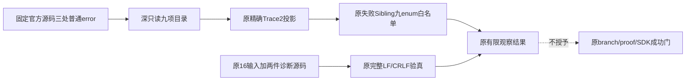

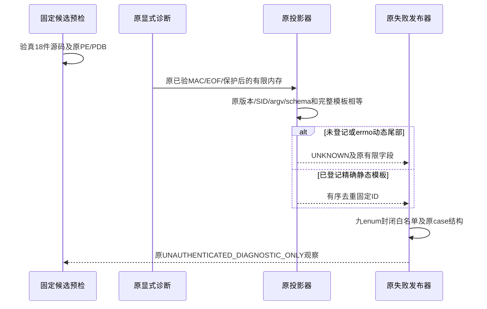

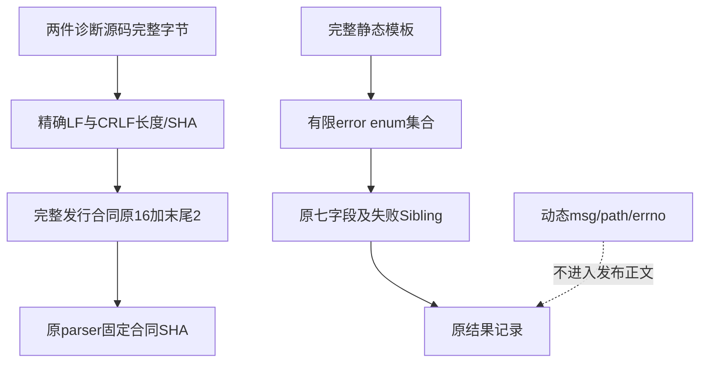

核心伪代码：

```text
分类事件：
    先执行原完整来源、安全、版本、结构及终止一致性检查
    完整fmt精确命中固定表 -> 增加该有限ID
    未命中 -> UNKNOWN，不截取前缀、不展开参数、不解析尾部
发布失败Sibling：
    字段集合及类型必须与原合同一致
    ID只能来自固定九项，按固定顺序无重复
    否则拒绝Sibling，不能影响原案例、branch gate或proof
预检：
    原16件输入保持原顺序、完整LF/CRLF身份
    末尾只追加profile和failure_projection两件源码完整身份
    原所有源成员逐件验真后才继续原执行
```

### 12.4 发行身份、持久化、失败与恢复

基线为`5306c7134c1301dd10bee682be5ce1e61e120c46`。
[contract.json](../../scripts/windows_git_native_branch_observation/contract.json)
只更新基线并末尾追加两行；原16行、assets、PE/PDB/分支字节、selector、历史结果及预算均不改。
[contract.py](../../scripts/windows_git_native_branch_observation/contract.py)只修改真实合同SHA常量。
原九件整体字节guard保留，其中五件历史原字节不改；四件已批准锚点只更新两件合同的实际摘要。
新增诊断源码另由完整发行合同拒绝任何未评审字节，而不是仅比较目录语义。

[输入身份回归](../../tests/governance/test_windows_git_trace2_input_binding.py)保留9a0d角色合同
相对原5265基线的17叶类型敏感差分，再独立验证当前合同只追加两件诊断成员。
18件来源均验证新字节拒绝和精确CRLF表示接受。增加诊断输入不缩减原16件或原预算。

无新数据库、配置、后台服务或持久权威。实际操作期限、取消、清理、MAC/raw/EOF/protection、
13 hooks及Owner不变。`KNOWN`仅表示给定有限流在当前目录下分类完整，不能升级proof、
caller、根因或业务结果。多个ID可共存，集合不携带同次调用归属或事件先后顺序。
旧合同、旧拒绝、两份现场失败及合成发布兼容性FAIL均保留，不能重跑覆盖或自动恢复写入。

### 12.5 验证与部署边界

[test_git_material_trace2_static_errors.py](../../tests/delivery/test_git_material_trace2_static_errors.py)
覆盖三个精确静态来源/ID、旧六项规范字节、42个近似变体、24个errno家族负例、profile漂移、
多ID并存及不发布合成私有字段。原失败发布回归新增三个ID实际经过有限Sibling的正例，
以及未知、重复、乱序和非字符串负例；原完整门禁逐项差分不变。

候选初验392通过、1失败：原Sibling白名单未同步新增ID。首整合929通过、10项测试合同失败，
修正旧数量断言和类型负例的当前选择器后943通过。独立审查发现原catalog selector漏掉五种正向
validator检查，新增真实退化反例先1失败；仅恢复原测试位置后9项定向通过，最终八件文件944项
完整通过、811件执行输入前后零漂移。原九件整体guard和原成功标准未放宽。
全部失败、943阶段和独立审查资料保留，不累加旧结果，也不将修复方复验称第二次独立审查。
实际结果与摘要见[正式验证资料](../validation/windows-trace2-static-formats-2026-10-03-v1/README.md)。
离线分类与发行身份验证不构成Windows业务验收。

实际原生运行必须固定包含本增量的候选revision，保持原两个Case、期限和成功标准。
只有新原生结果才可判断是否观察到这些ID；未观测字段继续UNKNOWN。底层Windows故障、
完整Git产品交付、R3真实质量、独立Beta及R1～R6商用门禁均保持开放。

### 12.6 固定候选实际原生结果

9b9e52f的Run37103867851、attempt1终态failure，没有超时、重跑或新模型请求。
18件声明输入与官方PE/PDB均合法；两个原SDK Case仍Git128/Worker2、proof ABSENT、SDKfalse、RootUNKNOWN。
新三个静态ID均未观测，已知集合仍仅HASH_OBJECT_ADD_AGGREGATE；profile匹配但完整性保持UNKNOWN。
入口/分派/仓库阶段见证存在，CDB arm/branch均0。目录覆盖不足不等于本实际故障的唯一或已证实原因。
原件和摘要见[固定原生验证](../validation/windows-trace2-static-native-2026-10-03-v1/README.md)。
后继从实际Windows受控对象操作和原进程见证定位，不猜测errno、不扩大UNKNOWN为成功。

## 13. 首失败九字段有限发布与固定输入接合

### 13.1 增量身份、需求与非目标

本节实现基线为`f07263ce3d4ddb304b2ff054044f86f26d5267c6`，该值表示工作树增量的
源码基线，不表示包含本节实现的已提交、已发布或已执行候选。第1至12节的历史成绩、
SHA、失败运行及发行身份保持原阶段事实，不能用本节覆盖旧结果。

原Worker已在资源清理前冻结首失败，原探针在同一write操作内完成原receipt、raw、
EOF、SHA及protection守卫后解码。`Probe.render`已携带封闭九字段`post_worker_failure`，
但原失败Sibling只发布signals、worker status和Trace2，导致首失败边界与最终handler差异丢失。
本增量仅补齐既有发布接缝，不改变生成失败记录或底层业务执行的模块。

不修改Windows句柄、Git输入、对象读取/写入、Worker短路顺序、Trace2 formats、13 hooks、
Owner、Root、proof、SDK或branch gate。不新增采集器、异常正文、网络端点、配置、数据库、
恢复账本、CI任务或自动重跑；Run37103867851已丢弃的字段不能恢复，旧Git128/Worker2仍失败。

### 13.2 模块边界、总体架构与调用链

| 模块 | 原责任与本节增量 | 保持不变的边界 |
| --- | --- | --- |
| [`git_material_failure.py`](../../src/harnessix/delivery/git_material_failure.py) | 原清理前冻结、编码、解码及严格`_valid`；发布器直接复用该校验器 | 生产源码、九键、stage/code白名单及数值/一致性约束不改 |
| [`git_minimum_commit_probe.py`](../../tests/product_config/git_minimum_commit_probe.py) | 原`_post_once → Operation.data → Probe.render → _publish` | 原raw守卫、生命周期、EOF/SHA、限制及发布次数不改 |
| [`failure_projection.py`](../../scripts/windows_git_native_branch_observation/failure_projection.py) | 同帧字段投影、显式v2、关联检查、严格v1读取与拷贝隔离 | 不读实际raw，不产生首失败，不授予认证或执行权限 |
| [`run_cases.py`](../../scripts/windows_git_native_branch_observation/run_cases.py) | 原`CaseSink → failure_report → cases.json`，调用接口不变 | 原两例、帧预算、重复键/EOF异常及pytest入口不改 |
| [`observe.py`](../../scripts/windows_git_native_branch_observation/observe.py) | 原`isolate_failure_report → result`消费新Sibling | 原九字段案例、branch/proof/SDK及异常路径不改 |
| [`contract.json`](../../scripts/windows_git_native_branch_observation/contract.json) / [`contract.py`](../../scripts/windows_git_native_branch_observation/contract.py) | 第18件完整源码的四叶身份与唯一metadata摘要接合 | 前17件、原基线、PE/PDB、guards、selectors及预算不改 |

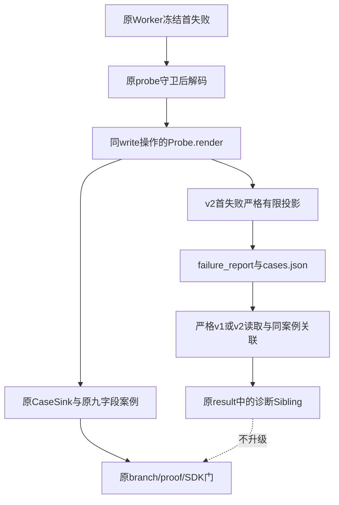

**图示说明与源码映射：** Worker 和 probe 是原首失败来源，CaseSink 仍先执行原
`project_case`，再由 `project_failure_case` 投影同一个内存帧。`failure_report` 只保存有限
Sibling，`isolate_failure_report` 再核验版本和原 A/B 案例；诊断结果不改变原成功门。

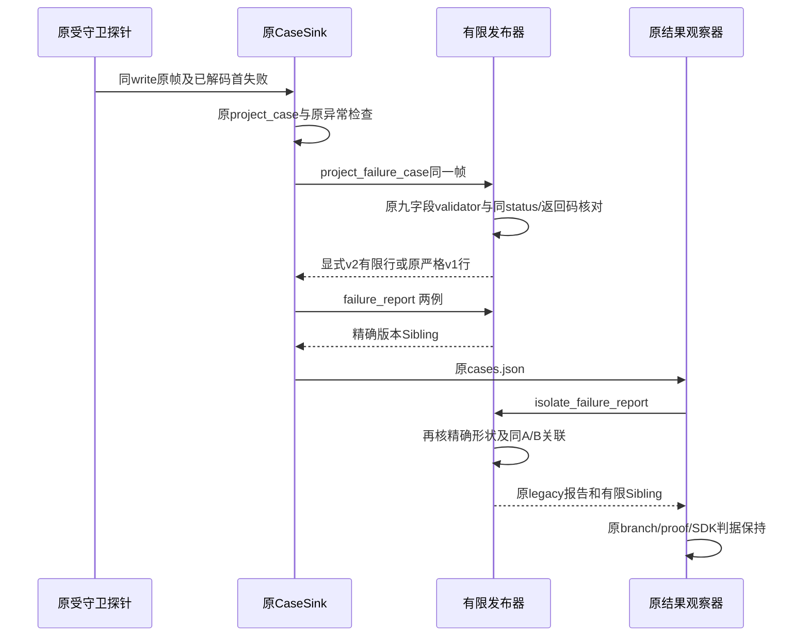

**图示说明与源码映射：** 时序对应原 `Probe._publish`、`CaseSink`、
`project_failure_case/failure_report/isolate_failure_report` 与 `observation_result`。
这是源码调用链及离线接缝验证范围，不是新的 Windows 现场运行证明。九字段首失败早已由
原探针解码，发布器不重读 raw、补做短路谓词或签发新的执行事实。

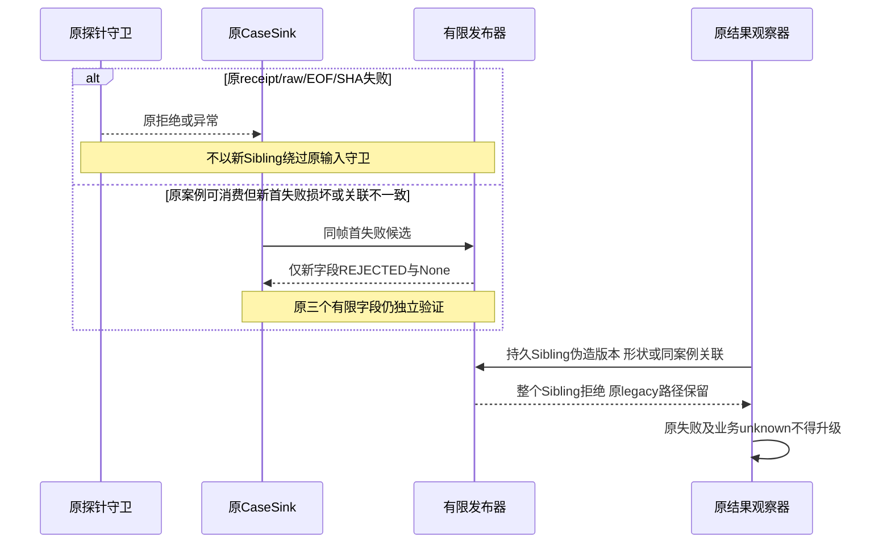

**图示说明与源码映射：** 原输入失败仍由未修改的 probe 和 `project_case` 处理。
源投影的局部拒绝对应 `project_failure_case`；读侧伪造拒绝对应 `isolate_failure_report`。
`REJECTED/None` 不等于首失败未发生，诊断未知也不能变成 Root、proof 或 SDK 成功。

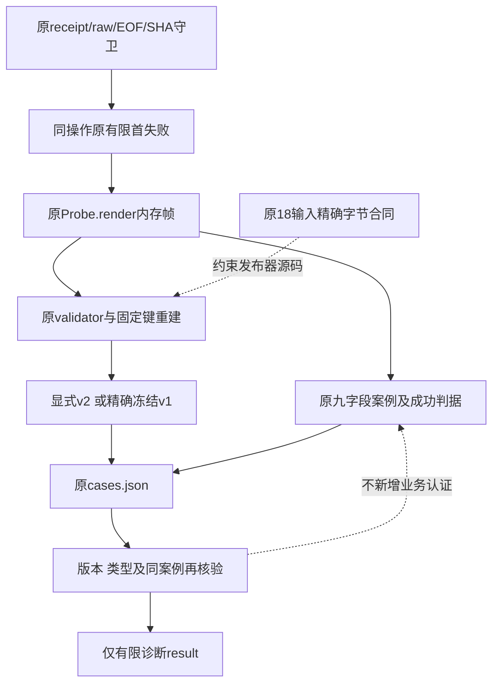

**图示说明与源码映射：** 业务正文停留在原守卫路径，不随新增字段流入报告。
`contract.source_checks` 固定发布器完整字节，不能将摘要相同等同原 raw 的执行认证。
没有新增数据库或持久权威；唯一耐久输出仍是原 `cases.json/result`，恢复和重放行为不变。

### 13.3 外层合同与版本隔离

外层v1仍为`harnessix.git-native-failure-observation/v1`，`SCHEMA`与`FAILURE_FIELDS`
继续指向原三个字段。新增`SCHEMA_V2`为`harnessix.git-native-failure-observation/v2`，
`FAILURE_FIELDS_V2`只追加`post_worker_failure`。外层仍只有
`schema/assurance/case_shape_state/cases`四键，assurance始终为
`UNAUTHENTICATED_DIAGNOSTIC_ONLY`。

v2每行恰有`case/field_states`及四个固定载荷键；`field_states`恰有对应四键，
每键只允许`FINITE/NOT_AVAILABLE/REJECTED`。后两态载荷只能为`None`。
内层Worker schema仍为原`harnessix.git-material-worker-failure/v1`，不是Worker v2。

`project_failure_case(line, *, schema=None)`支持显式选择v1/v2；其他版本或错类型抛出
固定`failure_schema_invalid`。未改调用接口的原CaseSink自动选择规则如下：

1. 源操作缺少`post_worker_failure`，或该值恰为单键`git_returncode`字典且值为原合法
   整数/`None`：保留旧v1表示，不把单返回码升级为合法九字段。
2. 其他候选一律进入v2，包括完整帧、空字典、错类型、额外键或损坏字段；损坏不回退为
   可用首失败。原CaseSink仍先调用原`project_case`，其原有拒绝不会被新Sibling吞掉。
3. `failure_report`两行均旧形状时输出v1；任一行为v2时，仅将已通过精确v1行校验的
   另一行补为v2的`post_worker_failure=NOT_AVAILABLE/None`。这是新报告构建，不是旧数据恢复。
4. `isolate_failure_report`严格按声明版本校验精确形状，读取时不补键、不升级v1、不推断
   首失败。只改版本标签或混用行形状必须拒绝；合法冻结v1返回值与基线读取器一致。

### 13.4 九字段、实际类型与原约束复用

| 内层字段 | 实际类型及来源 | 语义 |
| --- | --- | --- |
| `schema` | 原生`str`，固定Worker v1 | 内层有限帧身份 |
| `stage` | 原生`str`，原`STAGES`集合 | 原冻结时阶段，不从Git128猜测 |
| `origin` | 原生`str`，`pre_cleanup/handler` | 首次清理前冻结或最终handler观察 |
| `error_code` | 原生`str`，原固定有限码表 | 首失败类别；`unclassified`仍是未知 |
| `handler_error_code` | 原生`str`，同一原码表 | 最终捕获类别，可不同于首失败 |
| `git_popen_returned` | 原生`bool` | 原Popen是否返回，不证明外部效果 |
| `git_returncode` | 原生`int`或`None`，`[-2^31, 2^32)` | 原wait结果；不把bool当int |
| `git_stdout_complete` | 原生`bool`或`None` | 原短路谓词是否实际求值及其结果 |
| `git_stdout_expected` | 原生`bool`或`None` | 原长度完成后才可能执行的内容谓词 |

发布器直接导入`git_material_failure._valid`，不重建白名单或宽松字典。额外/缺失键、
标量子类、bool-as-int、非白名单码、坏stage/schema/origin及越界数值均由同一原校验器拒绝。
`origin=handler`必须首失败码与handler码相等；`pre_cleanup`允许清理二次错误使handler码不同。
Popen未返回时，其余Git观察必须为`None`；complete求值要求已有返回码；expected求值要求
complete为`True`且返回码为0。原`False`和`None`均保留，不补做谓词或归一化。

### 13.5 同操作关联、失败关闭与拷贝

新首失败为`FINITE`还要求同一行status为`FINITE/valid`，且内层`git_returncode`与原
九字段案例的`git_return`实际类型和值全等。原案例必须保留已观察的完整raw验真状态且
`diagnostic_truncated=False`；不要求失败探针的`diagnostic_incomplete=False`。
源投影复用同内存帧的原`project_case`，读取侧按同A/B行再次检查，防止持久化Sibling与原
status/returncode不一致。没有重读现场raw或新增认证。

源字段缺席为`NOT_AVAILABLE/None`；损坏或关联失败为`REJECTED/None`，只丢新首失败载荷，
原三个有限字段分别保留其合法值或原拒绝态。读取侧遇到伪造关联拒绝整个Sibling，原legacy
报告、异常类型、案例和完整门仍沿旧路径消费。`not_observed/invalid/valid`不是认证状态。

所有通过校验的九字段都是不可变原生标量，重建字典即可隔离全部可变层；原signals、
Trace2列表、field_states、rows在构建和读取两侧均重建。返回值不能因输入后续修改而变化。
首失败为`git_validate/pre_cleanup/git_material_git_failed`而handler为`value_error`时，
仅表示原首次类别与后续捕获类别不同，不证明Git内部caller、errno或Windows根因。

核心伪代码：

```text
原CaseSink先执行project_case，同帧再投影Sibling：
    按严格旧表示或显式版本选择v1/v2固定字段
    各字段精确验证，首失败直接调用原Worker _valid
    若首失败候选合法：
        同status=valid、原git_return实际类型/值、原raw完整事实必须一致
        否则仅首失败REJECTED/None
    按固定键重建，不保留原对象别名
构建报告：
    任一v2则只提升严格合法旧行为NOT_AVAILABLE，保留A/B形状
读取报告：
    声明版本、精确行形状、状态和原案例关联必须全部成立
    否则拒绝Sibling，不修改legacy或原成功门
```

### 13.6 精确发行输入、部署与恢复边界

以`f07263c`原metadata作类型敏感比较，仅四个JSON Pointer变化：
`/source_inputs/17/{bytes,sha256,crlf_bytes,crlf_sha256}`。
第18行仍是原发布器路径；`base_revision`仍为`5306c7134c1301dd10bee682be5ce1e61e120c46`，
前17行完整记录、18总数、PE/PDB、分支guards、selectors、预算、historical_run及其他字段不变。
`contract.py`仅替换唯一`CONTRACT_SHA256`字面量，其余字节与`f07263c`全等。

| 精确身份 | 长度 | SHA256 |
| --- | ---: | --- |
| `failure_projection.py`完整LF | 11528 | `2f720528c0009ebef3b82cbbc48adfc668d8bebbdc3ff396b638c4339b0136ed` |
| 同源码唯一完整LF→CRLF表示 | 11828 | `893255b46a4272ff7c532a0dcda48062d64c43e520d4f3e505ac2775372f3f24` |
| `contract.json` | 8291 | `b07e5b8b9d5ba66b83892a6816b48b02d9ec9ce6ab22a00c3bd46ef20dfcf544` |
| `contract.py` | 3937 | `ec01176f0124d43272d172dab047b71634d8c7a1b5a51ee5a6471a10b4148f8d` |

旧metadata必须拒绝新发布器字节；当前18输入与历史前16关系的原断言继续成立，不放宽
每件来源的新未知字节拒绝及精确CRLF接受条件。原
`test_legacy_case_fields_and_full_gate_sources_are_unchanged`中contract.py/json的旧批准整体
摘要在初验中保持不变，故产生真实FAIL并保留。实现和精确四叶差分审查后，只更新这两件
合同的完整长度/SHA批准身份；旧测试与基线逐字比较，除这三个字面量替换外完全一致。
原五件历史字节、原四件guard结构、其他两件probe/Trace2摘要和全部断言均保留。

本节不执行CI或现场Windows部署。后续候选仍须固定包含本增量的完整revision，执行既有
授权、完整来源及原成功标准，不能使用旧合同或仅语义相同的输入。取消、期限、清理、原
Worker2与业务unknown语义不改；无自动恢复、重放或旧验证目录重写。

### 13.7 离线验证方案与未证明项

新治理测试使用原有限帧编码/解码及原清理前冻结，覆盖原guarded decoder、同操作
`Probe._publish → CaseSink → cases.json → observation_result`接缝，九字段逐键负例、
额外msg/path/argv/PID、实际类型/数值/有限码/一致性、清理二次错误、False/None、深拷贝、
原status/returncode/raw不一致失败关闭、冻结v1读取、v1/v2隔离及末行四叶固定身份。
合成回执和空合成分支流只验证源码接缝，不是现场Owner/MAC、Git或CDB见证。

相关旧测试原样复用，有限选择不重复旧完整结果大矩阵；硬编码guard真实FAIL必须与通过项
一起披露，不以跳过该guard形成“总通过”。执行使用指定Python、`PYTHONPATH=src:.`、
`PYTHONDONTWRITEBYTECODE=1`、pytest umask022和全新`/private/tmp` basetemp，禁用cacheprovider
及外部插件自动加载；只对变更Python做Ruff/格式检查。交付证据保存实际命令、源SHA、
各阶段退出码、精确合同差分和未证明项，私有目录0700、文件0600。

离线通过不证明底层Git/Worker修复、实际输入读取、独立分支、对象持久化、Root、SDK、
Windows验收或商用门禁；所有观察保持`UNAUTHENTICATED_DIAGNOSTIC_ONLY`。

本增量有限离线执行结果：当前固定输入及历史关系检查86项通过；新首失败与原有限发布
集合246项通过、1项真实FAIL，140项既有完整结果大矩阵未重复；Worker清理/失败及原probe
守卫定向回归76项通过。发布集合包含新文件全部90项；这些集合存在3项固定输入测试交集，
不得直接相加称为唯一用例总数。唯一FAIL为上述原整体批准guard，其他旧断言未改。
三件变更Python的Ruff check及format check通过，限定差分检查通过。全部成绩是有限选择器
的离线结果，不是全仓、独立审查或最终新候选整合总通过。

上述初验及旧批准锚点FAIL仍保留。后继主线程审查精确字节与版本/关联边界后，九件原相关
测试文件实际1034项通过、0失败/错误/跳过，2.860秒；462件执行输入前后零漂移。
1034包含新文件90项及原八件944项，不与初验集合相加。新增四幅图已真实渲染并视检；
结果、源SHA、原件摘要和未证明项见
[正式验证](../validation/windows-first-failure-projection-2026-10-03-v1/README.md)。
上述整合本身仍为本机离线合同验收；后继单次现场结果见第14节，不关闭原Git128/Worker2故障。

## 14. v2首失败接合的单次Windows实际结果

固定`0b1e16a`的[Run37118277852](https://github.com/carrie1988/Harnessix/actions/runs/37118277852)
仅执行attempt1并终态failure，result为EXECUTION_INCOMPLETE。十八输入及官方选中PE/PDB匹配，
实际执行已启动；无超时或日志上限停止。仅下载原两个有限JSON，GitHub artifact摘要与ZIP、
原result字节与声明摘要相符；没有读取raw、stderr、CDB或Job业务日志，旧Run不重跑。
身份、九字段、原门、源码映射及字节摘要见
[单次原生验证](../validation/windows-first-failure-native-2026-10-03-v1/README.md)。

新增failure sibling实际为v2/FINITE_AB，两例post_worker_failure均FINITE/valid，九字段全同。

| 字段 | A/B实际值 | 分层解释 |
|---|---|---|
| schema | harnessix.git-material-worker-failure/v1 | 原内层合同，不是新业务证明 |
| origin | pre_cleanup | 有限帧声明为原清理前冻结，非独立MAC/PID验真 |
| stage | git_validate | 原Worker验证子进程结果的阶段 |
| error_code / handler_error_code | git_material_git_failed / git_material_git_failed | 首记录与最终handler一致，不能据此证明Git内部原因 |
| git_popen_returned | true | 原有限记录声明Popen已返回 |
| git_returncode | 128 | 与对应原案例git_return精确类型和值一致 |
| git_stdout_complete / git_stdout_expected | null / null | 实测null；按原短路保留未求值，不能解释为没有输出 |

源码求证：[`git_material_worker.py::_git`](../../src/harnessix/delivery/git_material_worker.py)的
git_validate分支先判断reader存活/错误，再判断code非零，然后才计算stdout完整和OID匹配。
128与两个null符合其原短路顺序；这属于基于固定源码的条件性解释，不是Git128根因已经确认。
handler和pre_cleanup字段不是来自事后补造值，也不提供独立Worker MAC。

SDK仍false，A/B均call failed、Worker2、Git128、proof ABSENT及操作未返回；branch_gate仍false，
两个独立PID分支见证不存在，ARM/branch计数均0。零计数不能证明没有Git进程或回调未发生。
Trace2只有ENTRY/DISPATCH/REPO与HASH_OBJECT_ADD_AGGREGATE，completeness UNKNOWN、UNCLASSIFIED_FORMAT；
原历史FAIL_RETAINED/UNKNOWN保持。所有新诊断仍为UNAUTHENTICATED_DIAGNOSTIC_ONLY。

本结果只把首失败记录定位到原git_validate/Git128接缝，不证明对象库写入、真实stdin读取、
完整分支见证、Owner身份或业务成功。后继围绕原数据供给、Git对象库与调试布防边界作有限源码及
独立反例求证；不重放同一失败候选，不凭更多相同Run改绿，不改变首发Git/恢复/备份范围或原门。
默认完整Git、消费者Windows、R3真实质量、Beta与商用R1～R6继续开放。

## 15. 历史精确差分与当前发行输入的独立验证

### 15.1 需求、根因与目标

完整离线回归确认三个历史断言失败。独立逐提交核验表明后来六次源码及身份刷新已有对应设计，
每次只同步原bytes/sha256/crlf_bytes/crlf_sha256；18个最低成员及字段、路径顺序与预算没有放宽。
旧断言误把历史单次差分扩展成“当前源码永久不变”，本范围未发现未登记身份漂移。

历史两件追加只比较5306c71与实际引入提交9b9e52f；首失败四叶只比较f07263c与0b1e16a。
当前目录身份固定于0583b53，与当前真实18成员独立完整比较。
目标是同时保留历史精确事实与当前严格验真，不增加allowedSet、不降低最低输入或删除旧拒绝。
这些提交说明可核验变更，不以Git提交代替额外人类授权凭证。

### 15.2 架构、流程与数据流

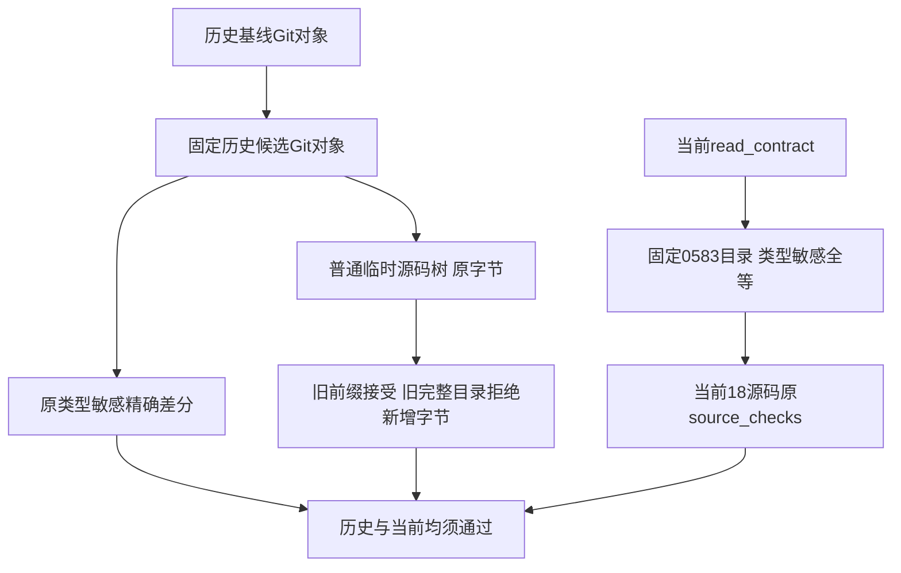

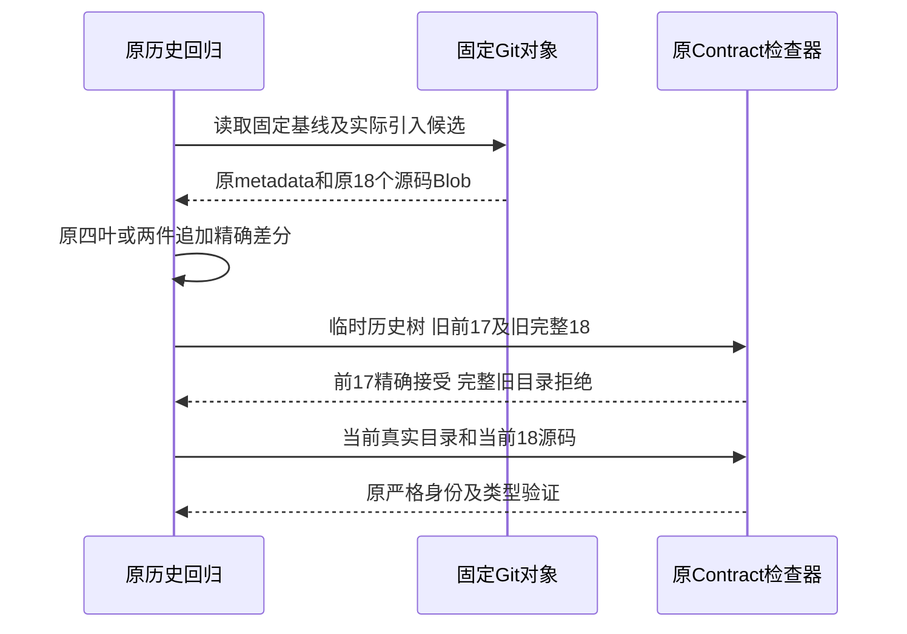

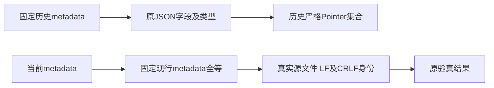

### 15.3 接口、字段与源码追踪

| 责任 | 精确位置 | 合同 |
|---|---|---|
| 首失败四叶历史断言 | [`test_windows_git_first_failure_projection.py`](../../tests/governance/test_windows_git_first_failure_projection.py) | 候选固定0b1e16a；第17索引四Pointer、18总数、前17全等及末成员LF/CRLF完整身份保留 |
| 原17字节及旧拒绝 | 同上原拒绝测试 | 普通tmp_path写实际历史候选18件Blob；前17等于旧基线，旧完整18拒绝该候选；当前旧拒绝及当前18严格接受继续独立保留 |
| 诊断两成员追加 | [`test_windows_git_trace2_input_binding.py`](../../tests/governance/test_windows_git_trace2_input_binding.py) | 候选固定9b9e52f；原16全等、仅末尾两件及完整恢复后零差分保留 |
| 当前发行与类型突变 | 同上原追加测试及12个原类型负例 | read_contract与0583固定metadata类型敏感全等；原source_checks完整18件，不能只换历史读取丢掉当前守卫 |
| 原完整验真 | [`contract.py`](../../scripts/windows_git_native_branch_observation/contract.py) | 生产/脚本实现、metadata及固定摘要本轮均不修改 |

原测试辅助Git Blob读取只扩展显式固定revision参数，默认历史基线保持；不读取非版本化文件。
临时历史树是有限离线夹具，不是管理worktree，不执行任何SDK、下载或新Collector。

### 15.4 核心逻辑、失败、安全与验证

```text
固定历史基线和历史候选 -> 原严格历史差分
用历史候选的完整18个原Blob构造临时树
旧前17验真必须成功；旧完整18必须因真正末成员变化拒绝
当前read_contract -> 固定现行目录类型敏感全等
当前完整18源文件 -> 原source_checks
12个原等值但异类型突变仍必须被拒绝
```

独立只读分析先取得原173项170通过/3失败；三个建议函数仅内存替换后173通过，
不是正式磁盘修复结果。原失败、初次模块别名绑定失败及完整逐字段证据保留。
实现后须精确两个原文件正式173项通过，并保留12个类型、18件未知字节、18件精确CRLF及表示/配对负例。
不以无关历史差分造成的正例失败，冒充类型负例覆盖。
任何固定现行目录或当前源文件漂移均按原合同失败；后继批准刷新须显式同步固定现行身份及设计。
不修改18输入、27选择器、PE/PDB、13Hook、20/45/240/300预算，不改变历史FAIL、R3或商用判定。

两个原文件的正式磁盘整改已取得173项通过，零失败、错误或跳过；12项现行等值异类型拒绝仍执行。
原初次Ruff行宽失败及后继格式通过分开留存。生产检查器和固定目录字节均未修改，
该结果只关闭上述历史断言混用，不证明Windows原生NTFS、完整Git交付或商用门禁通过。
