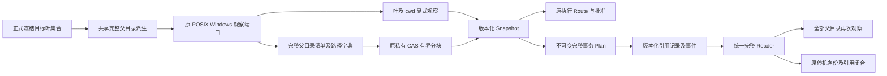
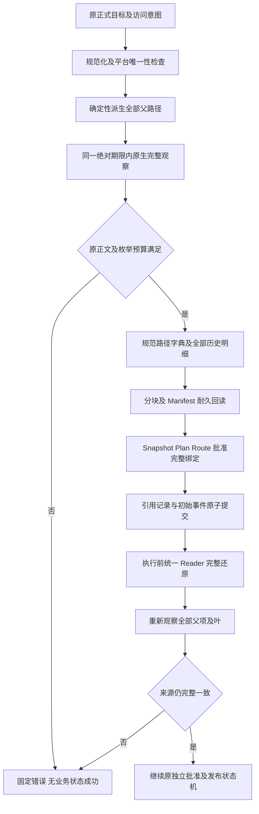
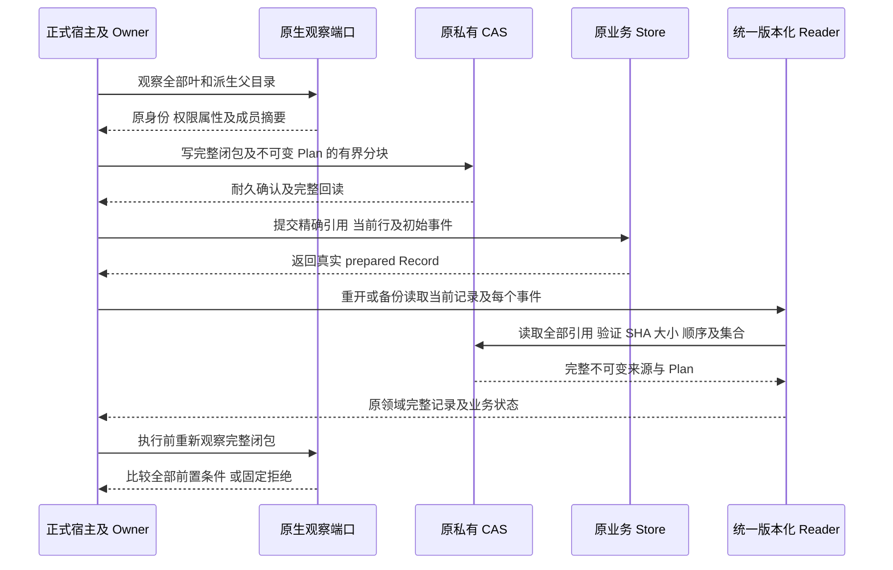
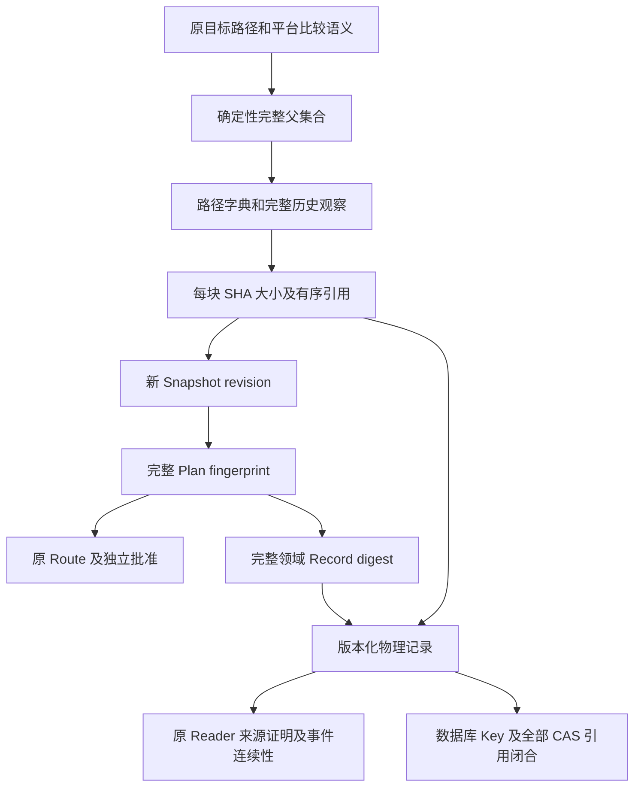

# Workspace 父目录完整闭包与引用记录：总体和详细设计候选

## 1. 需求背景与已确认缺陷

完整 Git 产品交付必须在一个事务中准备全部批准文件，同时冻结来源目录前置条件。
[已有容量实测](m09-r4-git-projection-ordering.md#11-完整资源容量核验与-snapshot-错误准入)显示：
128 个不同单层父目录的叶文件生成 128 个 write 观察及 129 个 read 父目录观察，
共 257 项，超过原 Snapshot 的 256 项限额。正文只有 1664 字节，也会发生这一失败。

原 [`prepare_workspace_transaction`](../../src/harnessix/delivery/planner.py) 和
[`resolve_workspace_patch`](../../src/harnessix/delivery/trusted_action.py) 都显式扩张父目录。
仅修改 Planner 不解决审批 Route 的同类限制，还会破坏 Route 与事务 Snapshot 的完整相等要求。
父目录观察绑定目录身份、权限属性及直接成员摘要；根目录观察不等于递归子树观察。
原生无跟随句柄链也不能代替已经冻结的父目录历史。

另外，原 [`SQLiteWorkspaceTransactionStore._decode`](../../src/harnessix/delivery/store.py)
要求完整记录 JSON 不超过 512 KiB，但 `save`、`transition` 和 `_validate` 没有相同的写前字节准入。
长路径在 Snapshot 和 mutation 中重复编码，存在“保存后重开被拒绝”的合同风险。
这一结论来自实际代码和静态长度分析，**不是已完成的长路径运行时复现**。
每个事件重复保存完整 Plan，还受正式备份的 payload 列累计 64 MiB 限制。

**当前没有满足全部旧表示约束的现成开关。** 本文提出内部版本化完整闭包及引用编码，
尚未实施或形成新的运行时验收结果。派生 T／Bridge 的阶段语义由
[独立顺序设计](m09-r4-git-projection-ordering.md#5-待确认整改方案数据结构与领域契约)约束，不在本文改写。

## 2. 设计目标、非目标与不变量

1. 完整保留每个派生父目录的历史观察和重新观察，不只保存聚合摘要，不裁剪父目录。
2. 一份完整 Plan、一个 transaction_id、一个原批准指纹；存储分块不拆业务事务。
3. 保持叶文件 8 MiB、before／after 总镜像 32 MiB、256 mutation 模型上限及原审批、Owner、Scope、Lease 保护。
4. 显式 Resource 保持最多 256 项，派生父目录进入独立闭包。**这是计数表示的语义变更，不冒充旧合同无变化。**
5. 保持原原生观察器、每目录 10000 直接成员限制及 32 MiB 捕获正文预算；目录枚举正文仍计入预算。
6. 不改变 Action 输入 Schema；被导出的 Snapshot／Plan 及存储编码仍必须正式版本化。
7. 保存成功的记录必须可由同代 Reader 重开、验证、备份及恢复；写入和读取采用同一编码限额。

非目标：新增云服务、第二观察器、新许可平台、扩大 Git 正文或期限、自动补签旧历史、
替代 T／Bridge 顺序决策、上线未知模型请求。不得降低原 20／45／240／300 秒期限或重置父操作绝对截止时间。

### 2.1 必须区分的容量承诺

当前 Git 来源合并在 [`git_delivery_source.py`](../../src/harnessix/product_config/git_delivery_source.py)
明确限制 255 个不同叶；旧 Snapshot 还必须保存 cwd/read，所以 256 叶加 cwd 已超过原资源上限。
事务模型允许 256 mutations，并不证明当前来源链已支持 256 个不同叶。
本方案最低要求是闭合全部原来源可表示的叶集合，不能新增父目录数量导致的业务拒绝。
若发布承诺进一步要求 256 个不同叶，必须另行明确 cwd 的内部承载方式；不得将两种容量混称为通过。

## 3. 总体架构与模块边界



**图示说明：** 此图是候选架构，不是当前已实施流程。Route 和 Planner 使用相同派生算法；
全部目录仍由原端口真实观察。CAS 只存证据，不授予目录写权限，也不证明文件已发布。
Reader 先完整还原并核验闭包，随后执行原来源、批准及业务验证，不能只验证 CAS 字节未损坏。

| 模块 | 现有源码与拟议职责 |
|---|---|
| 路径／观察 | [`workspace/paths.py`](../../src/harnessix/workspace/paths.py)、[`snapshot.py`](../../src/harnessix/workspace/snapshot.py)、[`windows.py`](../../src/harnessix/workspace/windows.py)：复用规范化、平台比较、无跟随及原目录身份。 |
| 闭包领域合同 | [`workspace/contracts.py`](../../src/harnessix/workspace/contracts.py)：新增版本化完整闭包引用及集合约束，旧 v1 字段与算法不改。 |
| 事务与批准 | [`planner.py`](../../src/harnessix/delivery/planner.py)、[`trusted_action.py`](../../src/harnessix/delivery/trusted_action.py)、[`execution/contracts.py`](../../src/harnessix/execution/contracts.py)：共享捕获规则，保持 Route／事务来源相等及批准绑定。 |
| 完整记录 | [`delivery/contracts.py`](../../src/harnessix/delivery/contracts.py)、[`store.py`](../../src/harnessix/delivery/store.py)：版本化 Plan 与记录引用，统一当前行及事件读取。 |
| 原 CAS | [`workspace_cas_io.py`](../../src/harnessix/delivery/workspace_cas_io.py)：复用私有文件、摘要寻址和耐久机制；并无现成父目录清单协议。 |
| 备份／恢复 | [`state_backup_records.py`](../../src/harnessix/product_config/state_backup_records.py)、[`state_backup_validation.py`](../../src/harnessix/product_config/state_backup_validation.py)：核验全部新增引用，不直接假设 payload 仍为完整 v1 Record。 |

## 4. 核心流程、时序与数据流程

### 4.1 完整捕获与发布前验证流程



**图示说明：** 预算判断保留原失败条件；CAS 写入必须先于业务引用提交。
孤立证据 Blob 不构成成功事务。父目录、目标叶或根漂移均拒绝，不刷新 Snapshot 后复用旧批准。
父目录 kind 和缺失资源处理沿用原端口的合法语义，不能为了聚合强制禁止原来合法的缺失路径。

### 4.2 持久化及恢复时序



**图示说明：** `prepared` 表示耐久准备，不表示 Workspace 或 Git 文件已发布。
没有未知效果自动重放；恢复读取与获得新执行授权是两个不同流程。

### 4.3 认证数据流



**图示说明：** 摘要链必须覆盖目标集合、父闭包、平台与根，不只覆盖一个可替换 CAS 文件名。
现有 MAC／来源认证端口需要接入同一正式 Reader；不能让认证端口继续按旧 JSON 分支误读新格式。

## 5. 接口设计、领域契约、数据结构与源码追踪

以下名称为拟议内部领域概念，不是当前可调用 API；最终 wire 版本号在实现前固定。

| 概念／重点字段 | 必须满足的合同 |
|---|---|
| ParentClosure `version` | 明确新表示；旧 Snapshot v1 和 selected-resources-sha256/v1 保留原算法，不静默改变含义。 |
| `platform / workspace_id / root_path_digest / root_identity / cwd` | 与原 Snapshot 根绑定全等，不以内容相同接受另一根。 |
| `target_set_digest` | 绑定原规范化目标叶及 access；父集合只能由该正式集合确定性派生。 |
| `path_dictionary` | 每节点保存父节点引用及原 UTF-8 组件，消除完整长前缀重复；规范排序、唯一性及重建后的完整路径仍按原平台规则校验。 |
| `parent_observations` | 全部原 location、path、read、kind、identity、content_sha256、size；不是递归写授权或完整 ACL 新承诺。 |
| `chunks` | 精确有序 SHA、字节数及完整集合摘要；每块不超过原 CAS 8 MiB。不得重复、遗漏、错序、引用其他 Manifest 或包含未知版本。 |
| Snapshot 闭包引用 | 显式 resources 保留叶及 cwd；revision 额外覆盖完整闭包范围、算法与引用。原捕获正文预算不因分块重复重置。 |
| ImmutablePlan 引用 | 保存完整 Plan 一次，不裁剪 before／after 或 mutations；还原后校验原 Plan 规范性、完整覆盖及 fingerprint。 |
| PhysicalRecord 编码 | 保存不可变 Plan 精确引用及原 Record 的全部可变状态字段；还原的完整领域 Record 仍核验原 digest 和 SQL 索引。 |
| Event 编码 | 每次状态／sequence 绑定同一不可变 Plan，不重复内嵌大 Plan；保留原事件数量、连续性及当前行／尾事件一致性。 |

### 5.1 编码与资源预算

新增闭包数量必须由原目标上限、路径 128 段上限及去重后的真实父集合推导，不能接受任意调用方数量。
集合派生、规范编码、CAS 读写和完整复核共同使用同一原绝对截止时间及取消检查。
当前代码不存在可注入的 `SnapshotLimits` 类型，不应在实现中猜测一个已有配置接口。

物理记录仍在原 512 KiB 读取边界内；写入必须以相同编码器校验 UTF-8 字节数，随后再提交。
该边界不能拿来截断完整业务 Plan，完整 Plan 和闭包改由受限 CAS 载入。
Plan／闭包编码必须验证最深路径、不同父链及完整叶容量；不得仅证明常见浅目录可压缩。
事件列累计 64 MiB、备份单文件 256 MiB、总量 2 GiB 等现行限制不自动提高。

### 5.2 对外契约与消费方

[`generate_specs.py`](../../scripts/generate_specs.py) 已导出 Workspace Snapshot 与 Execution Plan，
故“不改 Action 输入”不等于所有外部契约无变化。新 Snapshot、Plan、Reader／存储编码及其导出 Schema
必须共同版本化，测试验证旧 v1 输入、历史字节及摘要保持不变。
所有直接调用 `WorkspaceTransactionRecord.model_validate_json(payload)` 的备份或认证路径，
必须改用正式的版本化事件 Reader；不得各自复制解引用和验证逻辑。
实际消费方清单、wire 版本和旧格式读取矩阵是编码开始前的必需产出，不在未核验时宣布兼容完成。

## 6. 核心逻辑伪代码

```text
捕获正式事务来源(正式目标, 原控制):
    按原平台规则规范化和冻结目标
    派生全部父目录并验证完整覆盖
    在原根与同一绝对期限下观察叶、cwd 和全部父目录
    按原规则累计目录枚举及文件正文预算
    规范编码全部父目录历史；分块但不拆事务
    先写 CAS、耐久确认、完整回读，再形成闭包引用
    构造版本化 Snapshot；完整 revision 绑定根、叶与闭包
    Route 和 Planner 使用同一规则并要求来源完整相等

保存完整记录(正式准备结果):
    验证 mutation 叶与闭包覆盖一致、镜像和 Plan 指纹
    写完整不可变 Plan，逐引用耐久回读
    使用同一编码器构造物理记录并检查原 512 KiB 边界
    原子提交当前行及初始事件；返回真实领域 Record

读取或执行(当前行及完整事件):
    按版本选择原 v1 Reader 或新引用 Reader；未知版本拒绝
    完整载入并核验全部引用、字段、范围、根及摘要
    还原完整领域记录，验证 SQL 索引及原事件连续性
    执行前再次真实观察每个父项及目标叶
    保留原批准、父认领、Lease、Scope 和截止时间验证
```

## 7. 失败、恢复、持久化与事务、安全和历史兼容

- 缺失、篡改、错序或越权引用：固定错误拒绝，不返回部分闭包，不降级为叶观察。
- 原父路径置换、权限属性变化、成员变化及 Windows Junction/Reparse：继续由原端口及完整复核拒绝。
- 中断于 CAS 写入与数据库引用提交之间：没有成功事务；孤立 Blob 保留，不恢复延期的通用 GC。
- 中断于状态推进：原事件连续性、尾事实及效果核对仍适用，不按引用存在推断发布成功。
- 磁盘满、取消或超时：不发布不完整 Manifest，不重置任何预算，Owner 及句柄由原生命周期释放。
- 旧 v1 记录可用原 Reader 原字节读取；不转换旧批准、不重签旧 MAC、不猜测缺失父目录。
- 老程序遇到新编码必须正式拒绝，不能将其误读为空 Plan；回退须先使用匹配旧版本和旧备份。
- 新根恢复仍要求原根重绑及新执行批准；历史可读不授予执行权。
- 备份校验还原全部 Plan 和闭包，验证每个引用位于私有树、摘要与大小正确、字段及当前／历史事件全等。

## 8. 部署、测试与验收方案

本候选未改变当前安装、数据库或产品装配。实施时先完成格式与读取矩阵，再准备迁移／拒绝回退策略，
不得在默认产品中提前写出旧 Reader 无法恢复的数据。

| 验证层 | 必需正反例及通过条件 |
|---|---|
| 原业务容量 | 原 127／128 分散父目录、255 来源叶、共享深父链、最长合法路径，完整准备／保存／重开；原 8 MiB 正文和 32 MiB 镜像限额不变。 |
| 全父目录安全 | 任一父目录对象置换、权限属性变化、成员增删及同名替换拒绝；完整闭包缺项、额外项、重复、平台等价重名和错序拒绝。 |
| Store 编码 | 512 KiB 精确 UTF-8 边界、完整 Plan 大于旧内嵌容量、每个状态和事件重读；不能出现 save 成功而同代 load 失败。 |
| CAS 完整性 | 私有权限、错误 SHA／大小、缺块、重排、非耐久写入、只读写入拒绝；分块仍绑定一个事务和批准。 |
| 审批及恢复 | Route／Transaction Snapshot 完整相等；原输入 Schema 不变；过期／换代 Lease、错 Root、错 Scope、旧批准拒绝。 |
| 备份与升级 | 新旧记录及全部事件、Plan／父闭包引用闭合；完整恢复重开；同机 Key、Owner、错备份及版本拒绝矩阵不减。 |
| 三平台 | 原 POSIX 身份／权限与 Windows 名称比较／对象身份／Reparse 负对照；Windows11 消费者验收另行执行。 |

关联回归首先复用 frontmatter 中现有测试，不建立另一评测平台。
最长路径与完整记录风险目前只完成源码／静态分析，以上新增验证均未执行。
必须取得实际新候选结果，不能以本设计、CAS 基础机制或旧材料 CI success 标记完成。

## 9. 可观测性、错误分类、风险与取舍

现行快照超限继续为 `workspace_snapshot_limit`，现行账本损坏继续为 `delivery_store_corrupt`。
新版本、引用和编码错误需要在正式合同中固定分类，不能输出目录内容、CAS 正文、原异常或凭据。
取消／超时优先遵循原控制语义，不将其转换为成功的空闭包。

仅保存聚合摘要虽较简单，但丢失逐父目录历史明细，因此不作为本候选方案。
完整闭包引用保留可审阅历史并减少重复编码，代价是 Snapshot／Record／Reader／备份的联合版本化。
不能只提高一个解码常数，不能删父目录保护，也不能把新格式解释为既有兼容开关。

实施前必须批准完整父目录从逐项 Resource 计数中分离的表示边界，并明确 255 来源叶与
256 mutation／不同叶承诺的区别；完成实际消费方与版本矩阵。T／Bridge 的独立阶段方案另行确认。
本候选及对应源码核验不关闭完整 Git 产品、Backup v2、R3、消费者平台、Beta 或 R1～R6 商用门禁。
