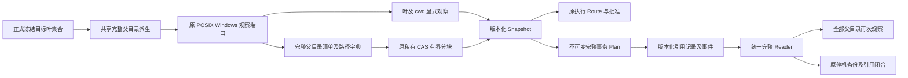
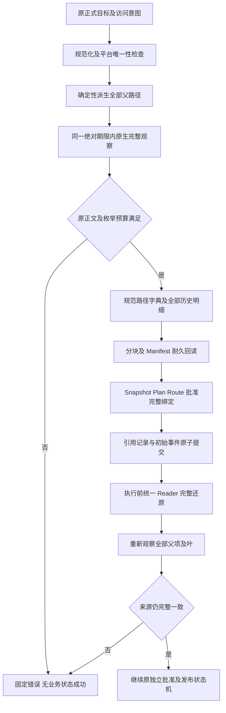
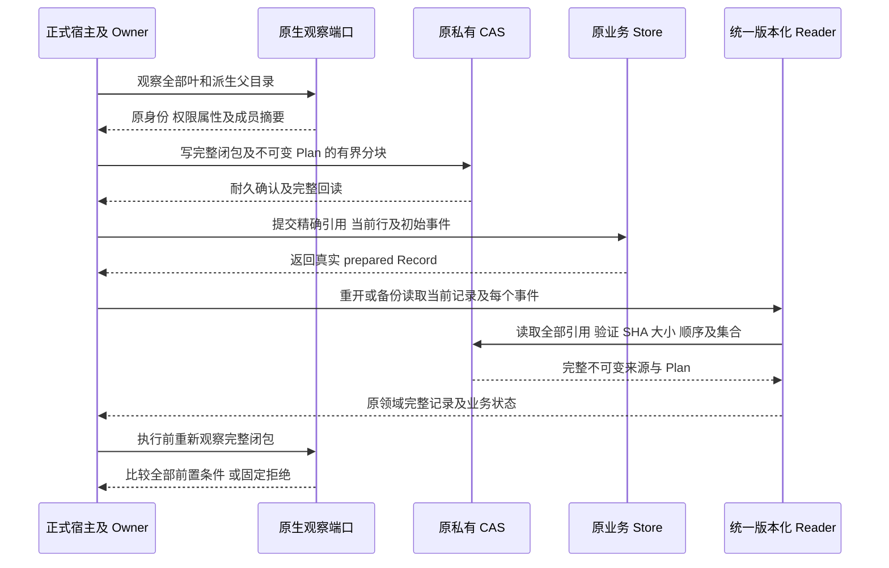
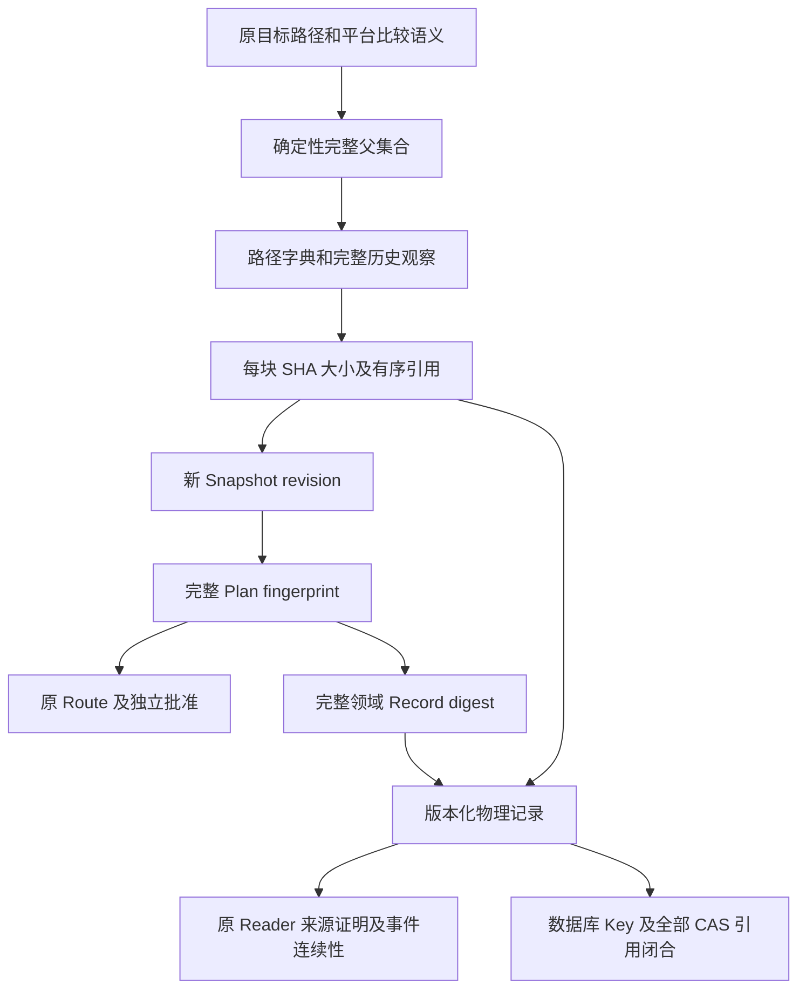
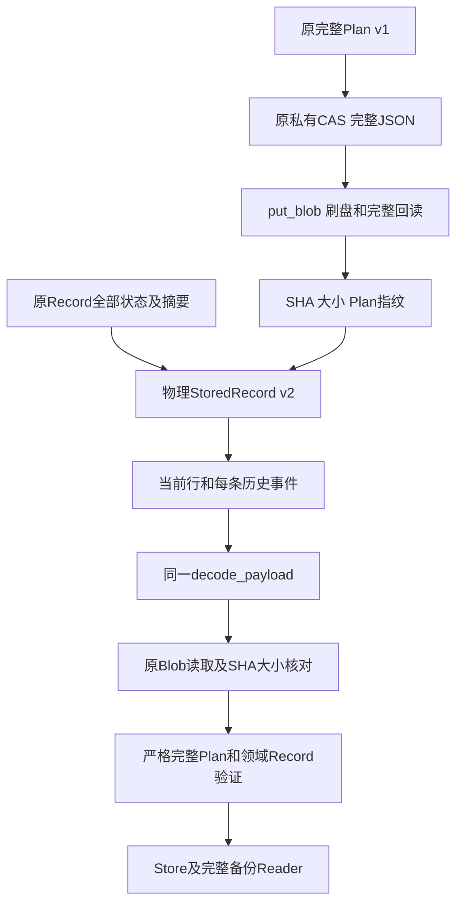
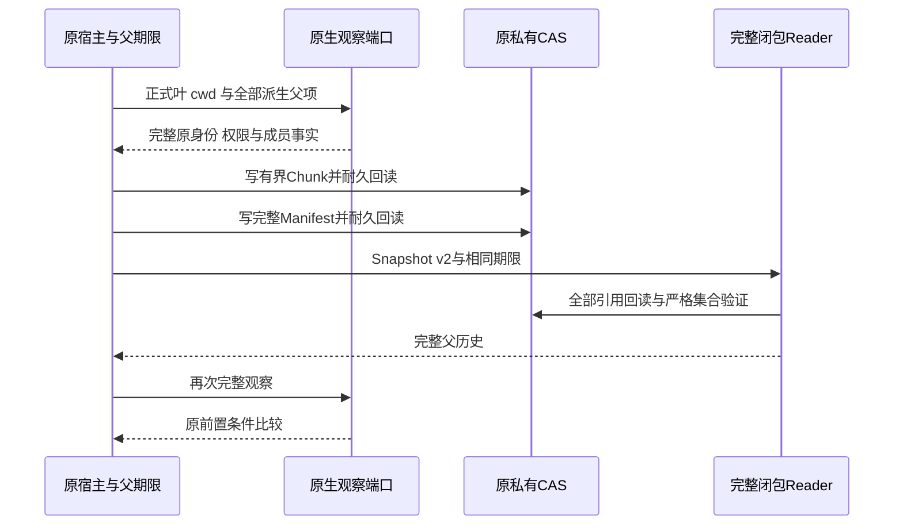
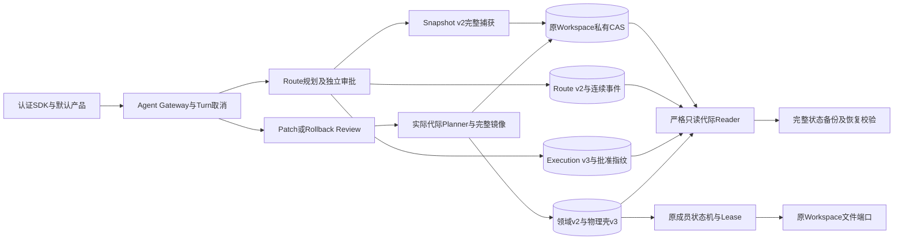
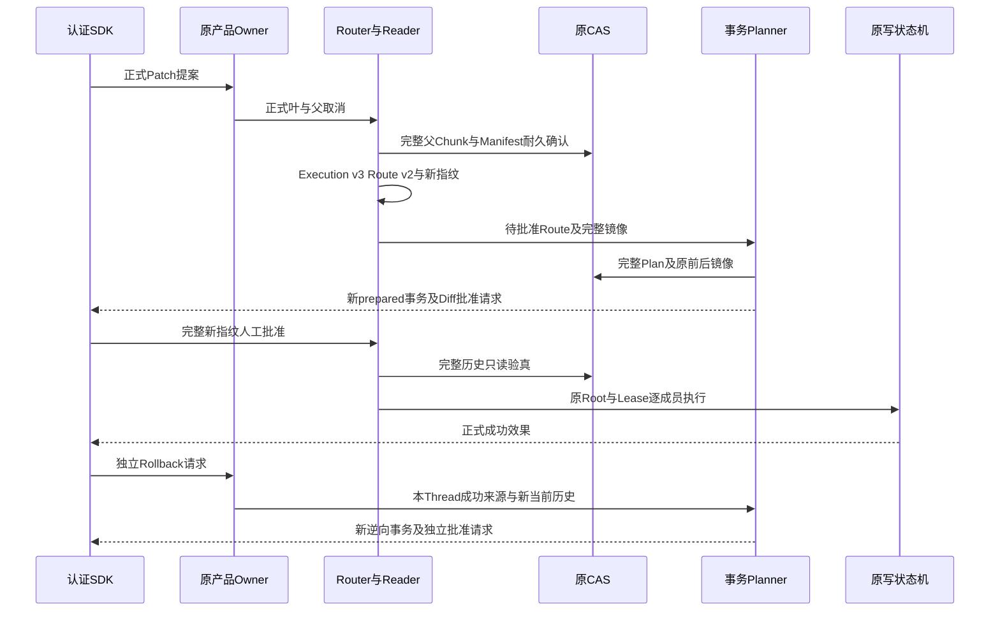

# Workspace 父目录完整闭包与引用记录：总体和详细设计

## 1. 需求背景与已确认缺陷

完整 Git 产品交付必须在一个事务中准备全部批准文件，同时冻结来源目录前置条件。
[已有容量实测](m09-r4-git-projection-ordering.md#11-完整资源容量核验与-snapshot-错误准入)显示：
128 个不同单层父目录的叶文件生成 128 个 write 观察及 129 个 read 父目录观察，
共 257 项，超过原 Snapshot 的 256 项限额。正文只有 1664 字节，也会发生这一失败。

原 [`prepare_workspace_transaction`](../../src/harnessix/delivery/planner.py) 和
[`resolve_workspace_patch`](../../src/harnessix/delivery/trusted_action.py) 都显式扩张父目录。
仅修改 Planner 不解决审批 Route 的同类限制，还会破坏 Route 与事务 Snapshot 的完整相等要求。
父目录观察绑定目录身份、权限属性及直接成员摘要；根目录观察不等于递归子树观察。
原生无跟随句柄链也不能代替已经冻结的父目录历史。

另外，原 [`SQLiteWorkspaceTransactionStore._decode`](../../src/harnessix/delivery/store.py)
要求完整记录 JSON 不超过 512 KiB，但 `save`、`transition` 和 `_validate` 没有相同的写前字节准入。
长路径在 Snapshot 和 mutation 中重复编码，存在“保存后重开被拒绝”的合同风险。
后继[真实长路径复现](../validation/workspace-record-long-path-2026-10-04-v1/README.md)已将此风险证明为
实际缺陷：200个叶、209个资源、2600字节镜像的原正式Plan保存成功，但691196字节记录随后由同代Reader拒绝；
同规模短路径147549字节记录可完整重开。原生Snapshot复核通过，未用替代观察或修改序列化制造失败。
每个事件重复保存完整 Plan，还受正式备份的 payload 列累计 64 MiB 限制。

**没有满足全部旧表示约束的现成开关。** 第10节实现版本化物理记录；第11节实现独立Snapshot v2的
完整父闭包捕获、原CAS读取及原生再验证。默认执行／审批／事务消费者的联合代际仍待接入。派生 T／Bridge 的阶段语义由
[独立顺序设计](m09-r4-git-projection-ordering.md#5-待确认整改方案数据结构与领域契约)约束，不在本文改写。

## 2. 设计目标、非目标与不变量

1. 完整保留每个派生父目录的历史观察和重新观察，不只保存聚合摘要，不裁剪父目录。
2. 一份完整 Plan、一个 transaction_id、一个原批准指纹；存储分块不拆业务事务。
3. 保持叶文件 8 MiB、before／after 总镜像 32 MiB、256 mutation 模型上限及原审批、Owner、Scope、Lease 保护。
4. 显式 Resource 保持最多 256 项，派生父目录进入独立闭包。**这是计数表示的语义变更，不冒充旧合同无变化。**
5. 保持原原生观察器、每目录 10000 直接成员限制及 32 MiB 捕获正文预算；目录枚举正文仍计入预算。
6. 不改变 Action 输入 Schema；被导出的 Snapshot／Plan 及存储编码仍必须正式版本化。
7. 保存成功的记录必须可由同代 Reader 重开、验证、备份及恢复；写入和读取采用同一编码限额。

非目标：新增云服务、第二观察器、新许可平台、扩大 Git 正文或期限、自动补签旧历史、
替代 T／Bridge 顺序决策、上线未知模型请求。不得降低原 20／45／240／300 秒期限或重置父操作绝对截止时间。

### 2.1 必须区分的容量承诺

当前 Git 来源合并在 [`git_delivery_source.py`](../../src/harnessix/product_config/git_delivery_source.py)
明确限制 255 个不同叶；旧 Snapshot 还必须保存 cwd/read，所以 256 叶加 cwd 已超过原资源上限。
事务模型允许 256 mutations，并不证明当前来源链已支持 256 个不同叶。
本方案最低要求是闭合全部原来源可表示的叶集合，不能新增父目录数量导致的业务拒绝。
若发布承诺进一步要求 256 个不同叶，必须另行明确 cwd 的内部承载方式；不得将两种容量混称为通过。

## 3. 总体架构与模块边界



**图示说明：** 此图是候选架构，不是当前已实施流程。Route 和 Planner 使用相同派生算法；
全部目录仍由原端口真实观察。CAS 只存证据，不授予目录写权限，也不证明文件已发布。
Reader 先完整还原并核验闭包，随后执行原来源、批准及业务验证，不能只验证 CAS 字节未损坏。

| 模块 | 现有源码与拟议职责 |
|---|---|
| 路径／观察 | [`workspace/paths.py`](../../src/harnessix/workspace/paths.py)、[`snapshot.py`](../../src/harnessix/workspace/snapshot.py)、[`windows.py`](../../src/harnessix/workspace/windows.py)：复用规范化、平台比较、无跟随及原目录身份。 |
| 闭包领域合同 | [`workspace/contracts.py`](../../src/harnessix/workspace/contracts.py)：新增版本化完整闭包引用及集合约束，旧 v1 字段与算法不改。 |
| 事务与批准 | [`planner.py`](../../src/harnessix/delivery/planner.py)、[`trusted_action.py`](../../src/harnessix/delivery/trusted_action.py)、[`execution/contracts.py`](../../src/harnessix/execution/contracts.py)：共享捕获规则，保持 Route／事务来源相等及批准绑定。 |
| 完整记录 | [`delivery/contracts.py`](../../src/harnessix/delivery/contracts.py)、[`store.py`](../../src/harnessix/delivery/store.py)：版本化 Plan 与记录引用，统一当前行及事件读取。 |
| 原 CAS | [`workspace_cas_io.py`](../../src/harnessix/delivery/workspace_cas_io.py)：复用私有文件、摘要寻址和耐久机制；并无现成父目录清单协议。 |
| 备份／恢复 | [`state_backup_records.py`](../../src/harnessix/product_config/state_backup_records.py)、[`state_backup_validation.py`](../../src/harnessix/product_config/state_backup_validation.py)：核验全部新增引用，不直接假设 payload 仍为完整 v1 Record。 |

## 4. 核心流程、时序与数据流程

### 4.1 完整捕获与发布前验证流程



**图示说明：** 预算判断保留原失败条件；CAS 写入必须先于业务引用提交。
孤立证据 Blob 不构成成功事务。父目录、目标叶或根漂移均拒绝，不刷新 Snapshot 后复用旧批准。
父目录 kind 和缺失资源处理沿用原端口的合法语义，不能为了聚合强制禁止原来合法的缺失路径。

### 4.2 持久化及恢复时序



**图示说明：** `prepared` 表示耐久准备，不表示 Workspace 或 Git 文件已发布。
没有未知效果自动重放；恢复读取与获得新执行授权是两个不同流程。

### 4.3 认证数据流



**图示说明：** 摘要链必须覆盖目标集合、父闭包、平台与根，不只覆盖一个可替换 CAS 文件名。
现有 MAC／来源认证端口需要接入同一正式 Reader；不能让认证端口继续按旧 JSON 分支误读新格式。

## 5. 接口设计、领域契约、数据结构与源码追踪

以下名称为拟议内部领域概念，不是当前可调用 API；最终 wire 版本号在实现前固定。

| 概念／重点字段 | 必须满足的合同 |
|---|---|
| ParentClosure `version` | 明确新表示；旧 Snapshot v1 和 selected-resources-sha256/v1 保留原算法，不静默改变含义。 |
| `platform / workspace_id / root_path_digest / root_identity / cwd` | 与原 Snapshot 根绑定全等，不以内容相同接受另一根。 |
| `target_set_digest` | 绑定原规范化目标叶及 access；父集合只能由该正式集合确定性派生。 |
| `path_dictionary` | 每节点保存父节点引用及原 UTF-8 组件，消除完整长前缀重复；规范排序、唯一性及重建后的完整路径仍按原平台规则校验。 |
| `parent_observations` | 全部原 location、path、read、kind、identity、content_sha256、size；不是递归写授权或完整 ACL 新承诺。 |
| `chunks` | 精确有序 SHA、字节数及完整集合摘要；每块不超过原 CAS 8 MiB。不得重复、遗漏、错序、引用其他 Manifest 或包含未知版本。 |
| Snapshot 闭包引用 | 显式 resources 保留叶及 cwd；revision 额外覆盖完整闭包范围、算法与引用。原捕获正文预算不因分块重复重置。 |
| ImmutablePlan 引用 | 保存完整 Plan 一次，不裁剪 before／after 或 mutations；还原后校验原 Plan 规范性、完整覆盖及 fingerprint。 |
| PhysicalRecord 编码 | 保存不可变 Plan 精确引用及原 Record 的全部可变状态字段；还原的完整领域 Record 仍核验原 digest 和 SQL 索引。 |
| Event 编码 | 每次状态／sequence 绑定同一不可变 Plan，不重复内嵌大 Plan；保留原事件数量、连续性及当前行／尾事件一致性。 |

### 5.1 编码与资源预算

新增闭包数量必须由原目标上限、路径 128 段上限及去重后的真实父集合推导，不能接受任意调用方数量。
集合派生、规范编码、CAS 读写和完整复核共同使用同一原绝对截止时间及取消检查。
当前代码不存在可注入的 `SnapshotLimits` 类型，不应在实现中猜测一个已有配置接口。

历史 Reader 与 `verify_workspace_snapshot_v2` 现接受可选 `WorkspacePureProgressFactory`，仅为已验真块展开／摘要及捕获后编码提供宿主局部检查点；完整 CAS、规范正文、索引及原容量仍逐项验证。默认 `None` 与旧完整轨迹一致，控制异常不转换成历史损坏；不改变捕获写入 API、任何持久格式或授权。实际边界、流程和失败语义统一见[纯计算端口详设](m09-r4-git-checkpoint-preparation.md#17-已验真父历史与-snapshot-重编码的纯计算端口)，不另复制设计。

物理记录仍在原 512 KiB 读取边界内；写入必须以相同编码器校验 UTF-8 字节数，随后再提交。
该边界不能拿来截断完整业务 Plan，完整 Plan 和闭包改由受限 CAS 载入。
Plan／闭包编码必须验证最深路径、不同父链及完整叶容量；不得仅证明常见浅目录可压缩。
事件列累计 64 MiB、备份单文件 256 MiB、总量 2 GiB 等现行限制不自动提高。

### 5.2 对外契约与消费方

[`generate_specs.py`](../../scripts/generate_specs.py) 已导出 Workspace Snapshot 与 Execution Plan，
故“不改 Action 输入”不等于所有外部契约无变化。新 Snapshot、Plan、Reader／存储编码及其导出 Schema
必须共同版本化，测试验证旧 v1 输入、历史字节及摘要保持不变。
所有直接调用 `WorkspaceTransactionRecord.model_validate_json(payload)` 的备份或认证路径，
必须改用正式的版本化事件 Reader；不得各自复制解引用和验证逻辑。
实际消费方清单、wire 版本和旧格式读取矩阵是编码开始前的必需产出，不在未核验时宣布兼容完成。

### 5.3 当前实际消费入口与联合适配矩阵

下表来自固定007d2bd基线源码核验，不是新格式实现结果。解析入口包括直接 Record JSON，也包括嵌套 Snapshot 的模型；
只改 Store 的 `_decode` 不构成联合兼容。

| 实际入口及源码位置 | 当前合同 | 新格式必须联动的责任 |
|---|---|---|
| [Workspace contracts:64～156](../../src/harnessix/workspace/contracts.py) | Snapshot v1；revision 排除 `spec_version` 和自身 revision，算法字段仍参与摘要。 | 保留原 v1 算法；新算法域及完整闭包进入新 revision，不能只换版本标签。 |
| [Delivery contracts:70～157](../../src/harnessix/delivery/contracts.py) | Plan／Record v1；Plan fingerprint 和 Record digest 覆盖自身版本及完整嵌套事实。 | 解引用后恢复完整领域对象；物理壳摘要不能代替完整领域 digest。 |
| [Store save／transition:102～200](../../src/harnessix/delivery/store.py) | 当前行和每事件完整 JSON；并发比较旧 payload 原字符串，幂等核对原完整 Plan。 | 当前行、历史事件、幂等、并发比较共用同一版本化编码器和 Reader。 |
| [Store decode／validate:292～327](../../src/harnessix/delivery/store.py) | 两处直接严格解析 Record；decode 核验当前行、尾事件及事件总数，但不逐条解析完整历史。 | 全事件 Reader 不能以当前行通过替代；领域验证与物理解码分责。 |
| [Backup delivery:115～155](../../src/harnessix/product_config/state_backup_records.py) | 第137行直接解析每个事件；当前引用闭合只遍历 mutation 镜像。 | 统一读取每个事件，新增 Plan／闭包引用进入完整备份闭合。 |
| [Execution verify:190～216、268～294](../../src/harnessix/execution/planner.py) | 分别直接解析 Execution v1/v2，再重建并全等核验；两代当前均内嵌 Snapshot v1。 | 两代旧合同保留，新代模型及解析分派明确；已有 Execution v2 不代表已支持新 Snapshot。 |
| [Execution Store:113～177](../../src/harnessix/execution/store.py) | Plan union JSON 解析；批准登记前还会重读完整 Plan。 | 新代读取分派不能遗漏批准入口。 |
| [Action Store:36～40、195～240](../../src/harnessix/trusted_actions/store.py) | 直接解析 Route v1，嵌套 Execution v2 和 Snapshot，核对索引及尾事件。 | Route、Execution、Snapshot 的版本化必须一致，禁止局部 Reader 降级。 |
| [Git material approval:226～243](../../src/harnessix/product_config/git_material_process.py) | 独立直接解析 ExecutionPlanV2 和 ApprovalCheckpoint。 | 正式受管进程的批准重校验必须接入新代分派，不能绕过该入口。 |
| [Owned Patch source:68～105](../../src/harnessix/product_config/workspace_patch_source.py) | 直接解析 Patch 输入，随后正式加载真实 Route／Record。 | 输入 Schema 保持；领域加载及 fingerprint 绑定使用完整 Reader 结果。 |
| [Workspace Patch:194～231、341～356](../../src/harnessix/delivery/trusted_action.py) | 事务来源必须与 Route Execution Workspace 全等。 | 不忽略闭包、刷新来源或转换旧 Snapshot 达到表面相等。 |
| [Rollback:111～147、234～250](../../src/harnessix/delivery/rollback_action.py) | 逆向事务重新捕获，来源也须与 Route Snapshot 全等。 | 同步新捕获规则；原批准不能替代逆向批准。 |
| [Planning retry:179～192](../../src/harnessix/trusted_actions/planning.py) | 精确 invocation／binding 重试直接返回旧 Route，不重新捕获 Snapshot。 | 旧记录可读与旧计划可执行分别定义；新 Reader 不会自动升级或废止旧批准。 |
| [Router:197～232、306～331](../../src/harnessix/trusted_actions/router.py) | 核验两库 Plan 全等、Snapshot 新鲜度、批准和 trusted binding。 | 新完整指纹不得复制旧批准；如禁用旧计划，需明确实现绑定或版本准入，不静默重解释。 |
| [Git source:32～80](../../src/harnessix/product_config/workspace_patch_source_contracts.py) | 从 resources 取叶，source digest 覆盖完整嵌套 Snapshot。 | 保留逐叶查询及完整摘要，闭包核验归正式 Reader，不复制第二套逻辑。 |
| [Checkpoint:37～71](../../src/harnessix/delivery/git_checkpoint.py) | 保存 transaction_id、完整事务 fingerprint、mutations_digest。 | 使用还原后的完整领域 Plan，不改绑旧 Checkpoint。 |

目前直接 `WorkspaceTransactionRecord.model_validate_json` 只有上述 Store 两处和备份一处；
这一结论不表示嵌套 Execution／Route 模型或批准复核不受影响。
Workspace Patch Review JSONL仅绑定事务 fingerprint 和 Workspace revision，
见[Review接口](../../src/harnessix/delivery/trusted_action_contracts.py)；Review 解析成功也不能证明闭包已经核验。

### 5.4 数据库、原字节认证和公开 Schema 矩阵

| 层级 | 当前实际版本／行为 | 兼容约束 |
|---|---|---|
| Workspace DB | `delivery_metadata.schema_version=1`；事件没有独立 wire 版本。 | 新 payload 编码和 DB 准入的关系需固定；旧程序必须拒绝新格式，不能静默读空。 |
| Execution DB | DB版本1，wire已支持 Execution v1/v2。 | DB版本不能代替嵌套 Snapshot 的版本分派。 |
| Action audit DB | 当前版本2，可接收既有版本1初始化；Route wire仍v1。 | 既有迁移不是新闭包支持；新模型不得冒充旧 Route。 |
| 备份 Schema | [`_schemas`](../../src/harnessix/product_config/state_backup_validation.py) 固定接受 Workspace 1、Execution 1、Action audit 2。 | DB若改变必须同步；仅复制文件成功不能证明格式可恢复。 |
| Workspace digest | 当前 Snapshot／Plan／Record为规范 JSON SHA-256。 | **不是 Workspace Record MAC**；不能将完整性摘要表述为既有来源认证。 |
| Git publication MAC | [原记录类型](../../src/harnessix/session/git_publication_contracts.py)只含object_inventory、product_link、worktree_event、checkpoint、commit_event；[Verifier](../../src/harnessix/session/store_publication.py)绑定域分离HMAC及原字节SHA／大小。 | 不包含 Workspace Record，不是现成引用 Reader；不得重编码、补签或复用旧证明冒充新来源。 |

当前 Workspace 模型仅接受 v1；省略版本的既有合法输入按原默认 v1 处理，未知版本及字段拒绝。
新格式应新增独立模型／导出，不修改旧 v1 的定义或摘要算法。实际递归导出影响为以下九件：

- [Snapshot v1](../../spec/workspace-snapshot-v1.schema.json)、[Transaction Plan v1](../../spec/workspace-transaction-plan-v1.schema.json)、[Transaction Record v1](../../spec/workspace-transaction-record-v1.schema.json)；
- [Execution Plan v1](../../spec/execution-plan-v1.schema.json)、[Execution Plan v2](../../spec/execution-plan-v2.schema.json)；
- [Action Route Plan v1](../../spec/action-route-plan-v1.schema.json)、[Action Route Snapshot v1](../../spec/action-route-snapshot-v1.schema.json)；
- [Product Git Delivery Source v1](../../spec/product-git-delivery-source-v1.schema.json)、[Product Git Baseline v1](../../spec/product-git-baseline-v1.schema.json)。

这些是现有受影响消费方，不表示应覆盖同名文件。新代版本号及迁移策略仍需固定。
Patch／Rollback 输入、ApprovalCheckpoint、只引用摘要的 Review 及 Git 记录不因 CAS 引用自动改变结构，
但必须验证新的指纹绑定。不能把新实现绑定改变后旧调用的拒绝与历史记录不可读取混为同一事项。

对应原回归重点包括：
[精确旧 Route 重试与批准](../../tests/trusted_actions/test_router.py)、
[旧 Patch 批准不可重绑](../../tests/delivery/test_trusted_action_patch.py)、
[Rollback独立批准](../../tests/delivery/test_rollback_binding.py)、
[Git材料独立批准解析](../../tests/product_config/test_git_material_trace2_binding.py)、
[同语义不同原字节证明拒绝](../../tests/session/test_git_publication.py)、
[生成契约一致性](../../tests/governance/test_generated_specs.py)。
本消费方调查没有执行这些测试，不能用于证明新格式兼容性已通过。

## 6. 核心逻辑伪代码

```text
捕获正式事务来源(正式目标, 原控制):
    按原平台规则规范化和冻结目标
    派生全部父目录并验证完整覆盖
    在原根与同一绝对期限下观察叶、cwd 和全部父目录
    按原规则累计目录枚举及文件正文预算
    规范编码全部父目录历史；分块但不拆事务
    先写 CAS、耐久确认、完整回读，再形成闭包引用
    构造版本化 Snapshot；完整 revision 绑定根、叶与闭包
    Route 和 Planner 使用同一规则并要求来源完整相等

保存完整记录(正式准备结果):
    验证 mutation 叶与闭包覆盖一致、镜像和 Plan 指纹
    写完整不可变 Plan，逐引用耐久回读
    使用同一编码器构造物理记录并检查原 512 KiB 边界
    原子提交当前行及初始事件；返回真实领域 Record

读取或执行(当前行及完整事件):
    按版本选择原 v1 Reader 或新引用 Reader；未知版本拒绝
    完整载入并核验全部引用、字段、范围、根及摘要
    还原完整领域记录，验证 SQL 索引及原事件连续性
    执行前再次真实观察每个父项及目标叶
    保留原批准、父认领、Lease、Scope 和截止时间验证
```

## 7. 失败、恢复、持久化与事务、安全和历史兼容

- 缺失、篡改、错序或越权引用：固定错误拒绝，不返回部分闭包，不降级为叶观察。
- 原父路径置换、权限属性变化、成员变化及 Windows Junction/Reparse：继续由原端口及完整复核拒绝。
- 中断于 CAS 写入与数据库引用提交之间：没有成功事务；孤立 Blob 保留，不恢复延期的通用 GC。
- 中断于状态推进：原事件连续性、尾事实及效果核对仍适用，不按引用存在推断发布成功。
- 磁盘满、取消或超时：不发布不完整 Manifest，不重置任何预算，Owner 及句柄由原生命周期释放。
- 旧 v1 记录可用原 Reader 原字节读取；不转换旧批准、不重签旧 MAC、不猜测缺失父目录。
- 老程序遇到新编码必须正式拒绝，不能将其误读为空 Plan；回退须先使用匹配旧版本和旧备份。
- 新根恢复仍要求原根重绑及新执行批准；历史可读不授予执行权。
- 备份校验还原全部 Plan 和闭包，验证每个引用位于私有树、摘要与大小正确、字段及当前／历史事件全等。

## 8. 部署、测试与验收方案

本层实现保留当前安装和产品装配，Workspace数据库与物理记录已分别新增Schema 2与wire v2。
新Reader支持旧内嵌记录；旧程序对新Schema拒绝打开。完整父闭包的联合版本与部署切换仍须另行完成，
不得将旧程序拒绝读取的新格式宣称为向后兼容。

| 验证层 | 必需正反例及通过条件 |
|---|---|
| 原业务容量 | 原 127／128 分散父目录、255 来源叶、共享深父链、最长合法路径，完整准备／保存／重开；原 8 MiB 正文和 32 MiB 镜像限额不变。 |
| 全父目录安全 | 任一父目录对象置换、权限属性变化、成员增删及同名替换拒绝；完整闭包缺项、额外项、重复、平台等价重名和错序拒绝。 |
| Store 编码 | 512 KiB 精确 UTF-8 边界、完整 Plan 大于旧内嵌容量、每个状态和事件重读；不能出现 save 成功而同代 load 失败。 |
| CAS 完整性 | 私有权限、错误 SHA／大小、缺块、重排、非耐久写入、只读写入拒绝；分块仍绑定一个事务和批准。 |
| 审批及恢复 | Route／Transaction Snapshot 完整相等；原输入 Schema 不变；过期／换代 Lease、错 Root、错 Scope、旧批准拒绝。 |
| 备份与升级 | 新旧记录及全部事件、Plan／父闭包引用闭合；完整恢复重开；同机 Key、Owner、错备份及版本拒绝矩阵不减。 |
| 三平台 | 原 POSIX 身份／权限与 Windows 名称比较／对象身份／Reparse 负对照；Windows11 消费者验收另行执行。 |

关联回归首先复用 frontmatter 中现有测试，不建立另一评测平台。
长路径原实现复现2项中1通过、1失败，原失败完整保留；当前新增真实长路径记录回归要求完整重开成功。
物理记录、历史Reader、备份恢复与错根镜像读取顺序已执行本地正反例，完整父闭包与对应新版批准尚未验收。
必须取得实际新候选三平台结果，不能以本设计、CAS基础机制或旧材料CI success标记完成。

## 9. 可观测性、错误分类、风险与取舍

现行快照超限继续为 `workspace_snapshot_limit`，现行账本损坏继续为 `delivery_store_corrupt`。
新版本、引用和编码错误需要在正式合同中固定分类，不能输出目录内容、CAS 正文、原异常或凭据。
取消／超时优先遵循原控制语义，不将其转换为成功的空闭包。

仅保存聚合摘要虽较简单，但丢失逐父目录历史明细，因此不作为本候选方案。
完整闭包引用保留可审阅历史并减少重复编码，代价是 Snapshot／Record／Reader／备份的联合版本化。

## 10. 架构决策与正式实施合同

完整父目录历史及版本化引用方案纳入实现范围，不采用丢弃父项、拆分事务或扩大原读取限额的替代方案。
以下第一层实施合同固定物理记录、读取和备份边界；后继父闭包及 Snapshot 联合版本仍须完成，
单独关闭长路径记录缺陷不代表完整闭包、Git 产品或商用验收完成。

### 10.1 物理记录与不可变 Plan

[`WorkspaceStoredRecord`](../../src/harnessix/delivery/workspace_record_contracts.py)新增
`harnessix.workspace-stored-record/v2`，与领域
`harnessix.workspace-transaction-record/v1` 分别命名。物理壳保存 `transaction_id`、`state`、
`sequence`、`cursor`、`started_at`、`finished_at`、`error_code`、完整领域 `record_digest`，
以及 `plan_ref.sha256 / size / fingerprint`；不将领域摘要改成物理壳摘要。
`domain_spec_version` 固定为原领域 Record v1，未知领域版本拒绝。

Plan 使用原严格领域模型生成的完整 UTF-8 JSON，按原 CAS 摘要地址持久化一次；
`sha256` 绑定原字节，`size` 绑定完整字节数，`fingerprint` 绑定原领域 Plan。
每个 Plan Blob 不超过原 8 MiB，物理壳与旧内嵌 Record 共用原 512 KiB 读限额。
当前 Snapshot v1 的256资源和256 Mutation路径均受原规范路径限额约束，完整合法 Plan 可在原 Blob 边界内表示；
未来父闭包的历史分块另由第5节合同承载，不能把其全量历史重新内嵌到 Plan。

| 数据字段 | 含义与验证责任 |
|---|---|
| `spec_version` | 物理记录代际；未知值拒绝，不能按缺省v1解读未知v2字段。 |
| `domain_spec_version` | 解引用后恢复的完整领域Record代际；本层固定v1。 |
| `transaction_id` | 原UUID业务身份；必须与SQL主键、完整Plan及每条历史事件一致。 |
| `plan_ref.sha256` | 完整Plan UTF-8原字节SHA-256及原CAS固定文件名，不是批准令牌。 |
| `plan_ref.size` | 完整Plan实际字节数；严格正整数且不超过8 MiB，不能用前缀读取满足验证。 |
| `plan_ref.fingerprint` | 完整领域Plan原指纹；与还原后Plan及SQL索引核对。 |
| `state / sequence / cursor` | 原状态机事实、事件序号及成员进度；壳模型限制取值，完整Record继续校验关联条件。 |
| `started_at / finished_at / error_code` | 原有时刻与固定错误分类；不因引用编码改写成功或失败事实。 |
| `record_digest` | 原完整Record摘要；重新还原领域模型后核验，不能仅核对壳本身。 |

核心接口分别为`encode_workspace_record(record, write_blob) -> str`、
`decode_workspace_record(payload, read_blob) -> DecodedWorkspaceRecord`；后者包含完整`record`和
实际核验的`references`，旧内嵌记录的引用集合为空。写入回调是宿主原`put_blob`，
读取回调是原CAS底层IO，均不接受模型选择的路径或存储配置。

```text
保存或推进：
  完整验证领域Record → 编码完整Plan → 构造严格引用与物理壳
  检查壳UTF-8不超过512 KiB → 原put_blob耐久回读 → 原SQL事务提交行和事件
读取或备份历史：
  检查原UTF-8上限 → 严格识别版本
  v1：验证原完整Record
  v2：验证壳 → 完整读取Plan → 核对SHA、大小、指纹 → 还原并验证原完整Record
  再执行SQL索引、当前尾事件、序号或备份跨Store事实校验
```

编码前验证完整领域记录并构造、检查物理壳；原`put_blob`完成耐久回读之后，才能原子提交SQL当前行与事件。
解码先检查原 UTF-8 大小与严格物理模型，再读取 CAS、核对大小和 SHA、严格解析完整 Plan、核对 fingerprint，
最后还原原领域 Record并验证其摘要、状态及原 SQL 索引。任何缺项、篡改或未知版本均固定拒绝。
限额内的恶意深层JSON预解析递归异常也转换为`delivery_store_corrupt`，
当前行和仅历史事件均不能逸出未分类异常；拒绝过程不推进SQL或发布备份。

### 10.2 数据库及旧记录兼容

新 Workspace 数据库使用 Schema 2。可写打开 Schema 1 时，仅在独占 SQL 事务内将元数据升级为2，
既有当前行、事件及原 JSON 字节不重写；只读打开接受1或2且不迁移。
当前行和事件允许保留原合法内嵌 v1，新的保存与状态推进写物理 v2。
旧事件的原始字节保留，推进 CAS 比较直接使用实际旧 SQL 字符串；不能用重新编码的 v2 代替旧字符串比较。
新 Reader 不修复过去已经超过512 KiB的非法旧行，不将旧失败改写为通过。
旧程序打开新 Schema 或解析新 wire 必须拒绝，回退需要匹配的旧发行物及旧备份。
格式准入和升级的单一职责实现位于
[`workspace_store_schema.py`](../../src/harnessix/delivery/workspace_store_schema.py)，
Store仅负责连接生命周期和调用；不通过扩大既有类热点或治理白名单承载新增职责。

### 10.3 统一 Reader 与备份

[`workspace_record_codec.py`](../../src/harnessix/delivery/workspace_record_codec.py)提供唯一版本化编码与解码；
Store提供共享的 `decode_payload(payload)`，返回完整领域 Record及已验证物理引用；
当前行、尾事件、状态推进和备份历史都复用同一解码实现，不复制另一套 JSON 分支。
备份继续逐条核对全部历史的 sequence、state、transaction_id、完整 Plan和当前行，
并确认每个物理 Plan 引用及原 mutation镜像都存在于私有树清单、大小和摘要正确。
`_schemas` 只为 Workspace 明确接受1／2，其他 Store、原64 MiB列累计及256 MiB／2 GiB备份限制不变。
引用完整性不是 MAC来源认证，不允许转换或补签旧 Git证明。

### 10.4 实施与验收边界

首先执行真实200叶长路径负对照，要求领域记录仍完整、SQL物理壳不超过512 KiB、只读重开和每个状态推进可读。
补齐旧 v1原字节保留／推进、只读无迁移、未知版本、错 SHA／大小／fingerprint、缺 Blob、跨事务替换、
只读拒写、确认丢失、完整备份／恢复及 Plan只存一次的正反例。
父闭包128分散叶、完整T／Bridge／D及Backup v2尚未闭合时必须继续保持相应产品和发布门禁开放。

#### 10.4.1 Plan元数据与文件镜像的读取顺序

原回滚流程必须先读取并验证完整事务元数据，再比较原Workspace根身份，最后才能读取文件before镜像。
旧记录的Plan来自SQL内嵌JSON；新记录的同一Plan来自私有CAS。Plan只包含来源观察、版本摘要及状态，
不包含文件正文，不能因物理介质变化将元数据读取混入文件镜像端口。

Store的私有`_read_blob`复用原有完整CAS IO和摘要准入；`decode_payload`通过该底层读取Plan元数据，
公开`blob`继续承载文件镜像读取。两个入口使用同一个私有目录、8 MiB限额、权限检查和完整SHA校验，
不建立第二CAS、不缓存未验证Plan，也不新增根身份提示或信任未经认证的物理字段。
[`_build_rollback`](../../src/harnessix/delivery/filesystem.py)仍在完整Record验证之后、before镜像读取之前
检查原根身份，并保留Planner重新捕获后的第二次根身份比较。

集成回归已发现新Reader误用镜像端口，导致原错根负对照在根校验之前触发镜像读取。
整改必须保持原测试不变，并新增“Plan读取不打开镜像端口”“合法根确实读取原镜像”正反例；
Plan CAS损坏仍须在执行授权之前拒绝。不得通过忽略错根、补签批准或放宽测试关闭缺陷。

### 10.5 当前物理记录的实现数据流



**图示说明：** 本图仅描述已经编码的物理记录层；第11节另述独立父闭包，默认联合消费者尚未接入。
`record_digest`仍覆盖完整领域事实，引用不能代替原批准或MAC。
新物理Schema见[StoredRecord v2](../../spec/workspace-stored-record-v2.schema.json)，旧领域v1 Schema保持原字节。
不能只提高一个解码常数，不能删父目录保护，也不能把新格式解释为既有兼容开关。

完整父目录从逐项Resource计数中分离、完整历史私有CAS引用和prepared T语义已固定为实施方向。
后继仍须完成实际消费方与版本矩阵，明确255来源叶与256mutation／不同叶承诺的区别。
本候选及对应源码核验不关闭完整 Git 产品、Backup v2、R3、消费者平台、Beta 或 R1～R6 商用门禁。

## 11. Snapshot v2完整父闭包的实施合同

物理Plan引用层已由9eff41b实现。本层新增独立Snapshot v2及完整父历史生产、读取和原生再验证端口，
不扩大旧Snapshot v1模型，不在新版Execution／Delivery及批准联合适配前装配默认产品。
旧v1模型的资源字段校验可以提取为共享纯校验，但字段、算法和旧Schema必须原字节保持。

### 11.1 类型、字段与编码

| 正式类型 | 字段及不变量 |
|---|---|
| `WorkspaceSnapshotV2` | `spec_version=harnessix.workspace-snapshot/v2`，算法域`selected-resources-parent-closure-sha256/v2`；保留原根、cwd、外部根及最多256显式资源，新增`parent_closure`引用。revision覆盖原完整事实与引用。 |
| `WorkspaceParentClosureReference` | `sha256 / size / parent_count / target_set_digest`；绑定完整Manifest原字节，不构成来源MAC。 |
| `WorkspaceParentClosureManifest` | `harnessix.workspace-parent-closure/v1`；绑定platform、workspace_id、根路径／对象身份、cwd、全部外部根及授权、正式目标摘要、完整路径字典、有序分块引用和完整观察集合摘要。 |
| `WorkspaceParentPathNode` | 根节点保存location及`.`；子节点保存严格较小parent索引与单个原组件，location为空。重建后仍满足原4096字节／128段和平台等价规则。 |
| `WorkspaceParentObservationChunk` | `harnessix.workspace-parent-observations/v1`，起始索引及完整观察条目；条目保存kind、identity、content_sha256、size，location／path／read由对应字典节点完整还原。 |
| 分块引用 | SHA、原字节大小、起始索引及count；顺序连续、不可重排／重复／遗漏，总数与完整字典及父集合严格相等。 |

正式目标集合包含补齐后的cwd/read与原显式请求，不含自动派生父项。按原平台比较语义排序、拒绝重复，
目标摘要覆盖全部location、原规范路径和access。全部严格祖先及每个使用根确定性派生，
共享路径按平台语义去重。Windows等价父组件按UTF-8长度、原拼写依次选最小值，
再由字典父节点重建一致前缀；不改变原叶路径，也不因混合大小写组件增加原路径字节长度。
每个location根节点先于其他路径，其余按平台比较键排序，名称以`!`等标点开头也不会产生前向父引用。
数量上界由原256资源×128路径段推导为32768，不接受任意调用方父数量。
字典须等于该精确集合，不能藏入额外节点或省略父路径；原缺失kind语义保留。

每个Chunk和Manifest均不超过原CAS 8 MiB；闭包编码总量不超过32 MiB，
原生叶正文与目录枚举仍共用原32 MiB捕获预算，不按分块重置。
共享的cwd或显式父read观察可复用同次原生事实并只计一次正文预算，但历史须完整保留，
同一显式与父观察若不相等则拒绝。完整观察集合摘要采用规范JSON流式计算，避免拼接全部长前缀正文。

### 11.2 宿主接口与模块边界

- `capture_workspace_snapshot_v2`：调用方必须传入同一父操作`checkpoint`、原私有CAS耐久写入及完整回读端口。
  完整观察／编码后先逐块耐久回读，再提交Manifest，最后完整Reader验真才返回Snapshot；无业务SQL提交。
- `read_workspace_parent_closure`：完整解引用、固定字节／数量准入、SHA／大小／规范编码、根／目标集合、字典／顺序及集合摘要验真；返回全部原领域观察。
- `verify_workspace_snapshot_v2`：先完整读取原历史，再通过同一原生端口重新观察完整集合；纯内存编码比较，**不写CAS、不迁移或补签**。
- 新模型与闭包Codec独立于Delivery；宿主注入原`Store.put_blob`和底层完整CAS读取，不引入workspace→delivery／session依赖环或第二CAS。

现有POSIX原生观察增加可选上游checkpoint，Windows复用已有checkpoint参数。
POSIX文件读取、句柄链和逐目录成员枚举共同检查原父期限／取消；保留原局部读取上限，
不为每个父项重新创建父绝对截止时间。原v1无参数调用的字节事实与原期限不变。
必要的IO辅助拆分必须保持原policy，不通过热点白名单增长容纳实现。
外部根显式目标与派生父read分别检查原授权；write-only外部根不能借闭包派生获得read。
检查是协作式的，不能抢占已经进入的单个系统调用；原绝对根初始化段仍保留原实现。

### 11.3 流程与失败语义



**图示说明：** CAS写入只准备证据；途中失败可遗留无引用私有Blob，不产生成功业务事务。
Reader与再验证消费同一checkpoint。取消或超时保持原控制异常，不包装成`workspace_closure_corrupt`；
未知版本、损坏／缺失／非规范块、错根／目标绑定、字典缺项和额外项固定拒绝为`workspace_closure_corrupt`。
真实根或父目录变化仍由重新观察报`execution_plan_stale`，敏感路径／平台拒绝继续使用原固定错误。

### 11.4 测试、部署及后继责任

本层必须验证真实127／128／255分散叶、共享深父链、原v1失败对照与v2完整父历史，
同输入确定性编码、关闭重开／只读原CAS读取、任一父对象／权限／成员变化拒绝、symlink与错根拒绝。
补齐字典缺失／额外／重复／错序、路径逃逸／Windows折叠、块缺失／错SHA／大小／目标／根／代际、
耐久确认丢失、各写入和读取边界取消／超时、读取无写入及原32 MiB共同预算反例。
每件旧Schema由原生成器逐件原字节核对；新增Schema分别导出，不覆盖旧名称。
完整Execution／Route／Delivery新代际、全部批准和备份消费者必须在后继联合切片接入，
本层不宣称旧默认Planner已经支持128分散叶，不把新域端口或Schema作为完整商用完成。

### 11.5 已实现模块、接口及调用链

| 源码 | 单一职责与关键接口 |
|---|---|
| [`snapshot_contracts.py`](../../src/harnessix/workspace/snapshot_contracts.py) | `WorkspaceSnapshotV2`；复用原显式资源不变量，另验根身份、精确父数量、正式目标摘要和新revision。 |
| [`snapshot_fields.py`](../../src/harnessix/workspace/snapshot_fields.py) | 两代原资源事实共享校验；只校验根排序、规范路径、平台去重、授权和cwd，不改旧摘要算法。 |
| [`parent_closure_paths.py`](../../src/harnessix/workspace/parent_closure_paths.py) | `parent_paths / path_node_payloads / decode_path_nodes`：精确派生全部严格父集合及用到的根，组件字典压缩与完整重建。 |
| [`parent_closure_contracts.py`](../../src/harnessix/workspace/parent_closure_contracts.py) | 独立引用、Manifest、节点、分块合同；节点／块数量固定，块连续且覆盖全部字典。 |
| [`snapshot_capture.py`](../../src/harnessix/workspace/snapshot_capture.py) | `capture_snapshot_facts`管理原生根生命周期；`_Observations`同次缓存等价read并累计叶／目录正文原32 MiB预算。 |
| [`native_observation_io.py`](../../src/harnessix/workspace/native_observation_io.py) | `NativeReadOperation`组合原局部期限与同一父checkpoint；`observe_directory`保留原直接成员排序和身份编码。 |
| [`parent_closure_wire.py`](../../src/harnessix/workspace/parent_closure_wire.py) | 规范JSON及流式完整观察摘要；不进行宿主IO、不累积全部长路径JSON数组。 |
| [`parent_closure_codec.py`](../../src/harnessix/workspace/parent_closure_codec.py) | `encode_parent_closure`纯编码；`read_workspace_parent_closure`完整验证，`read_verified_body`共用原CAS回读边界。 |
| [`snapshot_v2.py`](../../src/harnessix/workspace/snapshot_v2.py) | `capture_workspace_snapshot_v2 / verify_workspace_snapshot_v2`：宿主显式写入／只读再验证入口，无业务批准或SQL状态推进。 |

所有CAS端口均为宿主注入的原`put_blob / _read_blob`，workspace包不导入delivery、session或product_config。
Snapshot v2、Manifest v1、Chunk v1分别导出独立[Schema](../../spec/workspace-snapshot-v2.schema.json)，
原Snapshot、Execution、Route、Plan和StoredRecord格式不在本层偷偷换型。

```text
capture_workspace_snapshot_v2(root, checkpoint, write_blob, read_blob)
  capture_snapshot_facts
    规范完整显式请求并补齐cwd/read；不合并不同access
    绑定原Root／ExternalRoot；ExitStack关闭全部原生根
    _Observations：先cwd、全部正式目标、全部派生父目录
      原observe(checkpoint)；正文累计限额；只复用同次等价read
  _encode_snapshot → encode_parent_closure
    全部父路径字典 → 完整观察分块 → 全集流式摘要 → Manifest → 新revision
  每块原put_blob耐久写入及完整回读 → Manifest同样确认
  read_workspace_parent_closure：完整解引用且与原捕获父历史全等
  返回正式Snapshot v2；不新增事务行、历史事件或批准

verify_workspace_snapshot_v2(expected, root, checkpoint, read_blob)
  严格重验Snapshot字段（含model_copy绕过构造的对象）
  完整读取历史、精确字典和全部块；不返回任何已读前缀
  原生重新捕获 → 纯编码 → 完整Snapshot与全部父历史比较
  相等才返回；差异execution_plan_stale；没有任何write_blob端口
```

取消／超时在上游checkpoint及CAS回调边界原异常实例传播。POSIX IO会把上游控制异常暂存于内部
`UpstreamCheckpointError`以跨越原IO错误转换边界，退出原句柄上下文后再抛出原实例；
局部IO错误仍使用原固定workspace类别。错误分类不包含CAS正文、逻辑路径、Token或授权材料。
全部写入成功但最终确认失败仍不返回Snapshot；允许遗留未被业务行引用的私有证据，不能将其记作成功事务。

### 11.6 部署与默认产品边界

本层可由受信宿主显式调用；仍使用原私有状态权限、原CAS及原SQLite Store，不新增中间件或独立服务。
`capture`只需原可写Store，`verify`／完整Reader可使用原只读Store关闭后重开；只读入口不迁移、补签或写入。
截至Snapshot独立切片，默认`prepare_workspace_transaction`、Execution／Route、Patch批准及产品Bridge使用旧合同。
后继Patch与Rollback联合实现以第13节为当前事实源，旧Process及Git Bridge边界保持。
只有后继联合新代际及其全部历史／备份消费者闭合后，才能将默认装配切到新Snapshot；
独立端口容量通过不等于默认产品容量通过，也不等于R3、Windows原生或商用1.0通过。

### 11.7 独立负对照与缺陷闭环

完整Reader独立复审以真实已捕获父历史重新寻址，重算规范块SHA、完整观察集合摘要和合法Snapshot revision。
workspace及cache的根观察被替换为`missing/size=0`后，原Reader仍接受，两项实际FAIL保留。
根类型检查原先只位于生产编码边界，不能证明读取来自合法Producer。整改在完整Reader的父观察一致性边界
也要求每个使用根为directory，不依赖同代写入器已校验；原篡改用例和其正式摘要重算方法不改。
该类根因适用于任何引用历史：字节完整、版本正确和摘要相等不等于领域结构合法，读取必须独立检验。

全量回归发现原可读性生成报告未同步的单项FAIL；保留原报告与失败，以原生成器重新计算统计及符号位置。
原policy、阈值、依赖边和公共API不变；修正后完整治理1413项通过。
专项与全量及治理为互相包含范围，不累加；完整证据及当前默认产品边界见
[正式验证报告](../validation/workspace-parent-closure-2026-10-05-v1/README.md)。

## 12. 默认产品联合接入的正式实施合同

本节固定后继领域、物理格式及宿主装配；完成前不能将默认产品声明为已切换。
原Snapshot v1、Execution Plan v1/v2、Route v1和领域事务v1全部保留独立Schema，不能原名扩张。

### 12.1 类型与代际

| 新类型 | 绑定及旧不变量 |
|---|---|
| WorkspaceTransactionPlanV2 | spec为workspace-transaction-plan/v2；source仅Snapshot v2。原Mutation、时间、request、路径保护、256项／32 MiB及完整fingerprint不变。 |
| WorkspaceTransactionRecordV2 | spec为workspace-transaction-record/v2；plan仅Plan v2。原prepared／publishing／interrupted／published／diverged／unknown、全部游标和时间及record_digest不变。 |
| WorkspaceStoredRecordV3 | 物理stored-record/v3，领域版本固定record/v2；原有界Plan引用及全部状态，完整解引用Plan和父闭包后才返回Record。 |
| ExecutionPlanV3 | spec为execution-plan/v3；保留现有v2 Sandbox／Capability，workspace改为Snapshot v2。不得复用已用于Sandbox证明的Execution v2代际。 |
| ActionRoutePlanV2 / ActionRouteSnapshotV2 | 独立route-plan/v2与route-snapshot/v2，Execution只接受v3；原调用、Binding、资源、Policy、审批与状态摘要校验全部保留。 |

新领域可以复用旧校验器，但序列化必须使用实际新模型，不能把新父引用按旧类型丢弃。
完整Plan fingerprint包含新spec和Snapshot revision；旧批准不会因新Reader支持而转换为新批准。
仅承载plan_id／完整fingerprint的原批准Checkpoint及无嵌套Plan事件保持原合同，不重复定义相同字段。

### 12.2 CAS、数据库与完整读取

统一使用原Workspace事务CAS。新事务Reader返回的实际引用必须包括完整Plan、父Manifest及每个父块，
供备份逐件清单闭合；Root／SHA／长度／领域摘要及全部历史仍独立检查。
Workspace数据库新增Schema3准入；原Schema1/2历史字节不重写，首次写新领域v2时在原业务SQL事务内提升元数据。
仅旧领域写入仍采用原Schema2和wire v2。只读接受1/2/3但不迁移；旧程序打开Schema3拒绝。
Execution原Schema1首次新Plan提升为2；Audit原Schema2首次新Route提升为3。
首次新Plan／Route与元数据同事务提交，原有历史payload不重写；旧Schema1到Audit2的既有Owner迁移不变。
新Execution／Audit Reader必须通过宿主注入的同一CAS端口完整验真父历史，缺端口或损坏不能降级读取；
宿主参数不是模型可提交字段，不增加execution／workspace向delivery的依赖环。

### 12.3 规划、执行、回滚与恢复

共同正式目标只包含叶访问和cwd；全部父项由Snapshot v2精确派生，不继续扩张显式资源。
Planner v2调用原规范目标及文件镜像读端口，同一checkpoint贯穿捕获、正文、CAS和复核，
完整父历史耐久确认在原Record prepared事务之前。
原Runtime按实际Record代际分派Snapshot复核，成员提交／故障窗口／Lease状态机保持；
恢复只观察已认证成员事实，不将prepared的外部效果改记published，不自动重放。
Rollback仍先完整Record及来源根身份，再读before正文；新逆向规划保留v2和全部父历史，独立批准且不刷新旧授权。

### 12.4 默认装配与验证

产品宿主为默认Root的Patch／Rollback配置唯一Workspace CAS读写端口；旧Process及外部构造无端口保留原v1，
但不能允许新默认路径缺失端口时退回旧容量表示。Router每次规划／验真使用同一父操作checkpoint，
不在每叶／每父／每块重新创建父期限。旧无参数调用及原期限／字段不变。
备份只读Store在相同MaintenanceIOControl下验证Execution、Route、事务当前与全部事件的完整父引用，
缺历史专属父块、跨根替换、错批准、Lease丢失、确认丢失均拒绝；不联网、不补签、不启动业务Executor。

验收须涵盖真实128／255分散叶事务保存、发布及独立Rollback、关闭后重开、全部历史备份，
以及默认产品16叶深父链的正式审批、原SDK、取消／恢复、Root／Owner／Scope／Lease负对照。
原260加上新3件共263既有Schema原字节不变，新代际另导出。
新产品默认路径、源码外安装及新三平台必须以各自实际证据验收；本节不宣称已完成，也不关闭R1～R6。


## 13. 联合接入的实现与源码阅读入口

### 13.1 当前边界与需求目标

本增量解决完整父历史在默认编码修改链路中尚未生效的问题，不以增加公开工具限额替代表示治理。
默认产品通过原装配函数启用Patch／Rollback的版本化CAS端口；原Process Supervisor及Git产品Bridge
仍采用旧合同，必须在后继联合适配中分别验证。领域255叶容量不等于公开Patch新增255文件能力。

旧构造入口无端口时继续生成原Snapshot v1；携带v2的执行／路由／事务若缺少CAS端口或历史损坏则拒绝，
不退回旧表示、不重新观察生成替代历史、不补签。CAS和数据库路径、Root Owner、同机认证Key、
公开Policy及人工批准、16文件上限和原平台写入端口均不替换。

### 13.2 总体架构与数据流



**图示说明：** 图中存在唯一原CAS，Snapshot和事务完整Plan均由它保存，不新增远程服务。
Router记录的是冻结意图，Review仅生成prepared事务及完整Diff；批准之前不执行文件写入。
Runtime仍在原Lease保护下逐成员提交，成员与SQL之间故障由原前后镜像恢复，只观察prepared外部效果时
不能追认成功。Backup只读所有当前及历史引用，不装配业务Executor或模型。

### 13.3 类、接口与字段设计

| 源码及类／接口 | 数据与职责 | 核心不变量 |
|---|---|---|
| [`workspace_v2_contracts.py`](../../src/harnessix/delivery/workspace_v2_contracts.py)：`WorkspaceTransactionPlanV2 / WorkspaceTransactionRecordV2` | 实际source为Snapshot v2；Record持有完整新Plan、原状态、cursor、sequence与记录摘要。 | 原路径保护、Mutation排序、镜像额度和完整指纹校验继承；序列化不能用旧基类截断parent_closure。 |
| [`workspace_record_v3_contracts.py`](../../src/harnessix/delivery/workspace_record_v3_contracts.py)：`WorkspaceStoredRecordV3` | 领域代际2的物理壳，使用原PlanReference；Plan正文不放SQL。 | 原512 KiB壳和8 MiB引用上限保持，未知wire／domain组合拒绝。 |
| [`workspace_record_codec.py`](../../src/harnessix/delivery/workspace_record_codec.py)：`DecodedWorkspaceRecord.references` | 完整解引用Plan、Manifest和全部Chunk，供Reader及历史备份共用。 | references包含实际验证的全部引用，不只列当前Manifest；控制异常原样传播。 |
| [`planner_v2.py`](../../src/harnessix/delivery/planner_v2.py)：`prepare_workspace_transaction_v2` | 目标、request_id、transaction_id、时间、宿主CAS端口及同一checkpoint；返回严格Plan与镜像集合。 | 只把正式叶及cwd计入显式资源；所有父观察由闭包完整派生；捕获与最终只读验证共享操作控制。 |
| [`planner.py`](../../src/harnessix/delivery/planner.py)：`_prepare_mutations / _read_existing` | 两代共享原前后镜像、0644／0755或Windows逻辑0644及摘要一致性。 | 原8 MiB单镜像、32 MiB领域限额与安全读取不变；取消覆盖新镜像块读取。 |
| [`execution/versioned_contracts.py`](../../src/harnessix/execution/versioned_contracts.py)：`ExecutionPlanV3` | 使用Snapshot v2，仍保留原SandboxBindingV2及CapabilityEvidenceV2。 | 新spec与全部绑定进入Fingerprint；原ApprovalCheckpoint只绑定Plan ID及完整新指纹。 |
| [`trusted_actions/versioned_contracts.py`](../../src/harnessix/trusted_actions/versioned_contracts.py)：`ActionRoutePlanV2 / ActionRouteSnapshotV2` | 实际嵌套Execution v3；调用、Binding、资源、状态及连续事件保持。 | 严格按spec_version分派，不通过接受旧模型额外字段实现迁移。 |
| [`snapshot_ports.py`](../../src/harnessix/workspace/snapshot_ports.py)：`WorkspaceSnapshotPorts` | 原宿主耐久写入与完整回读两个Callable，不进入公开JSON。 | 不包含批准、来源迁移或业务SQL权限，不引入workspace到delivery的依赖环。 |
| [`snapshot_verification.py`](../../src/harnessix/workspace/snapshot_verification.py)：`verify_host_workspace_snapshot` | 根据实际代际和原Root Resolver选择复核，v2必须完整旧历史与原生事实相等。 | 新历史缺端口固定拒绝；每次读取期限只创建一次，不按叶或父项重置。 |
| [`action_transaction_planning.py`](../../src/harnessix/delivery/action_transaction_planning.py) | Patch与独立逆向动作复用相同来源代际分派及CAS，接收Review的父取消检查。 | 调用者仍核对完整Route与Mutation； helper不授予执行权限。 |
| [`filesystem.py`](../../src/harnessix/delivery/filesystem.py)：`WorkspaceTransactionRuntime` | 实际记录代际验证、逐成员提交、只观察恢复及独立逆向规划。 | prepared不得追认外部效果；逆向重新规划且不能复用原事务指纹；不把原5秒读取期限错误应用为整次发布期限。 |
| [`action_runtime.py`](../../src/harnessix/product_config/action_runtime.py)：`_product_router / _open_action_dependencies` | 同一Root Owner内先持有唯一Workspace Store，再向Execution、Audit和Router注入同一CAS。 | 恢复和候选Router复用相同端口；逆序关闭资源，不增建第二Store或第二CAS。 |
| [`action_composition.py`](../../src/harnessix/product_config/action_composition.py)：`_product_call_context` | 仅默认Patch／Rollback启用新端口，原Process保留原Profile／Supervisor合同。 | 回滚仍先认证Thread成功归属，不凭相同Root读取他人来源。 |
| [`state_backup_records.py`](../../src/harnessix/product_config/state_backup_records.py) | 对Execution、Route、Process引用和全部事务事件注入同一只读Workspace Store及MaintenanceIOControl。 | 任一读取引用都必须已在inventory中且大小／SHA相符；旧历史、同机Key和跨Store绑定不省略。 |

### 13.4 运行顺序与业务逻辑



**时序说明：** SDK不持有CAS或Lease，批准只能对应冻结的新指纹。Rollback不是重新执行原Patch，
而是在当前来源仍与原after匹配时生成独立before目标；另一次批准和写阶段持有自己的原期限／租约。
重新打开或恢复只复核认证历史，不触发额外模型请求或自动执行未批准事务。

```text
plan_action(invocation, context)
  严格调用解码及绑定 → Policy
  有宿主端口：正式叶与cwd → 原Native完整父捕获 → CAS全量耐久回读
  新Snapshot → Execution v3 → Route v2 → Audit与Execution各不可变保存

prepare_action_workspace_transaction(route, root, desired, store, checkpoint)
  实际Snapshot代际决定Planner；v2使用同一CAS和父检查
  完整来源捕获 → 共用原镜像读取 → 完整旧历史及当前Native再验证
  完整新指纹严格Plan → Store.save → 原prepared记录及物理壳
  Review只发布完整Diff，不写Workspace

publish_next(record, approved_fingerprint, lease)
  完整Reader → 精确批准 → 原平台及Lease
  prepared：完整来源复核后进入publishing
  原成员前置／原子写／后镜像复核 → 原SQL CAS及连续历史
  interrupted：只观察原效果再沿既有状态机处理，不补写prepared外部效果

backup(state, same_control)
  独占原Root Owner → 安静状态检查 → 全部原认证Session与跨Store事实
  每件当前及历史Plan／Manifest／Chunk通过原只读Reader和inventory共同验真
  原备份Manifest与同机认证证明 → 原恢复流程；零业务执行
```

### 13.5 异常、安全、兼容升级及测试

新Record、Execution和Route均保留原状态与连续摘要校验。缺引用、错SHA／大小／代际／作用域、
批准不一致、Lease失效、父对象／权限／成员或叶变化均失败关闭。上游取消／超时不转换为历史损坏，
原子成员已进入后仍按原效果与记账规则结算，不引入半写成功返回。

新SQLite metadata与首次新记录在同一个原SQL事务中提交：Execution 1→2、Audit 2→3、Workspace 2→3。
只使用旧记录的新库保持旧metadata，新只读Reader兼容规定的旧代际且不迁移；旧程序不应打开包含新记录的库。
发布升级应先由原工具创建完整认证备份，再升级整个安装包，不单独替换某个Reader；恢复仍由原独占Owner与同机Key控制。
所有既有263件Schema原字节保持，新增六件Schema独立导出。完整共享32 MiB捕获、8 MiB CAS／镜像、
512 KiB物理记录及原64 MiB列累计／256 MiB和2 GiB备份上限不改变。

验证入口：
- [`test_workspace_record_v3.py`](../../tests/delivery/test_workspace_record_v3.py)：新旧字节、完整引用、readonly、SQL未知确认与控制负例。
- [`test_parent_closure_runtime.py`](../../tests/delivery/test_parent_closure_runtime.py)：真实128／255分散叶、发布与独立逆向、父漂移、原取消、故障效果与重开；原v1容量失败对照保留。
- [`test_parent_closure_store.py`](../../tests/execution/test_parent_closure_store.py)：Execution严格代际、完整历史与批准拒绝。
- [`test_parent_closure_store.py`](../../tests/trusted_actions/test_parent_closure_store.py)：Route新投影与连续历史、不隐式补签或替换缺失来源。
- [`test_state_backup_parent_closure.py`](../../tests/product_config/test_state_backup_parent_closure.py)：准确metadata准入、独立计划及历史专属引用缺失／损坏、同一维护取消。
- [`test_parent_closure_product_sdk.py`](../../tests/product_config/test_parent_closure_product_sdk.py)：默认认证产品16叶／401父、人工批准、独立逆向、重启、全备份恢复及再开、等待取消和父成员改变拒绝。

测试证明范围只覆盖各自实际环境。单平台领域、脚本Provider或源码内SDK结果不得外推真实模型编码质量、
Windows新候选原生成功、消费者部署或商用1.0完成；prepared T／Bridge MAC／A／D与独立Commit仍需联合实现及验收。


### 13.6 宿主控制组合与旧历史缺省标签

Gateway必须保留宿主`ActionPlanningContext.checkpoint`，与当前`CancelToken.checkpoint`
及原父Task取消检查组合；不能直接替换宿主回调。组合在原Route规划入口传入，Snapshot捕获、CAS及镜像
共用该控制链。宿主取消、超时或自定义控制错误按原异常身份传播，不包装成父历史损坏；
没有宿主回调时仍保留原Turn及父Task取消规则。源码见
[`prepare_action`](../../src/harnessix/trusted_actions/agent_gateway_support.py)。

旧Execution1／2和Route1的`spec_version`本来有默认值，旧Reader可以接受仅省略该顶层字段、
其余内容与完整原指纹仍合法的历史正文。新增discriminator不能追溯收紧这项旧读取合同：
缺省标签只调用原旧模型／旧Union Reader；有明确标签按准确代际分派，显式未知标签固定拒绝。
缺标签的Execution3或Route2不能借旧默认值进入新合同，也不能改写原payload或重算、补签原历史指纹。
各SQLite原索引、完整领域校验及连续事件验证仍继续执行。

```text
read_persisted_plan(original_payload)
  仅解析顶层字段是否存在
  标签缺省：原Execution1／2或Route1 Reader完整校验
  标签存在：准确代际Reader完整校验，未知值拒绝
  新代际：完整父Manifest与全部Chunk严格回读
  原索引与批准／事件一致性继续校验
  返回实际模型；不更新原SQL正文
```

JSON预解析也必须保持原错误分类：非法深度、语法或类型归类为原存储损坏，
不能让Python递归错误越过业务错误边界；数据错误保护不能捕获上游取消或控制异常。
真实数据库缺省标签、只读重开、原批准与事件、显式未知／新代际缺标签和原Gateway控制回归见
[`test_parent_closure_integration_review.py`](../../tests/trusted_actions/test_parent_closure_integration_review.py)。
初次独立评审的两项问题和实际红例保留，后继结果须单独结算；不同代码身份的完整范围不能冒充最终同候选全量。
