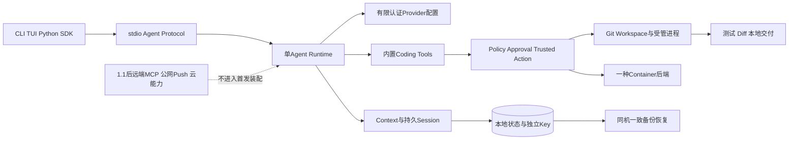
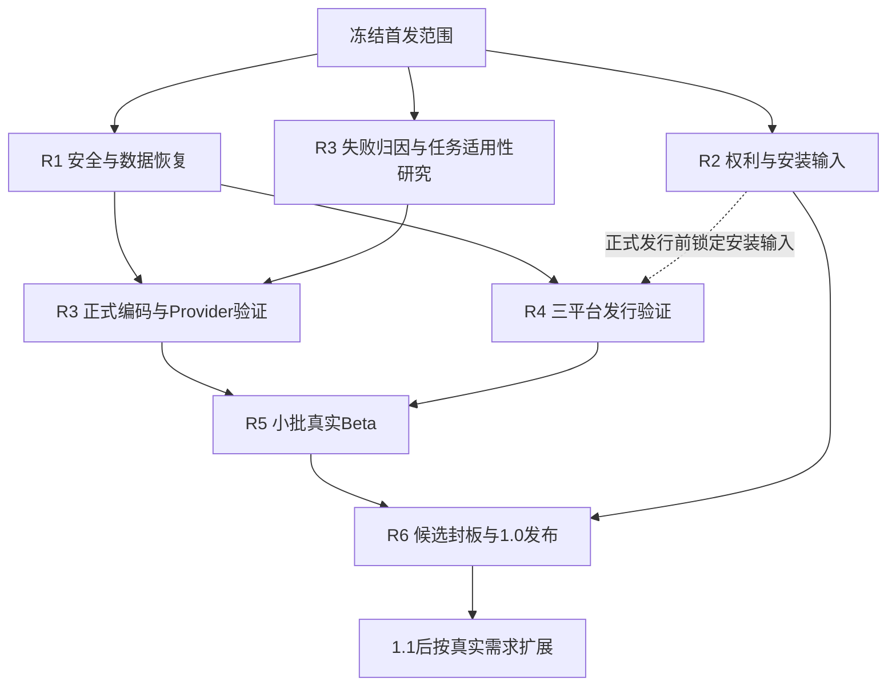
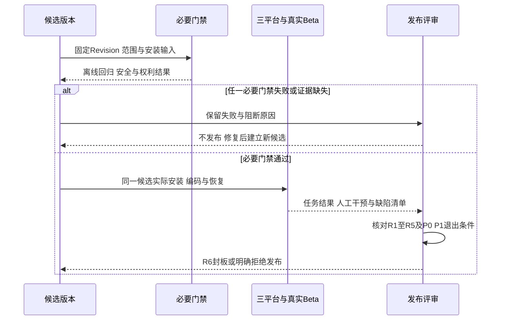

# 0.9～1.0 商用发布范围收敛与执行计划

## 1. 文档摘要与需求背景

本计划修订尚未关闭的0.9.4、0.9.5、0.9.6及1.0发布范围，不重开已关闭的0.9.0～0.9.3，
不改写历史失败报告，不把延期任务记作已完成。产品总体目标和简体中文文档规范保持不变。

前置范围同时包含本地Coding Agent发布、远端扩展平台、全部模型认证、自动更新和全面维护工具。
其中部分能力并非首发编码闭环所必需，却增加凭据、网络、兼容和发布验证的组合数量。
收敛方式是减少首发承诺和实际可达的功能面，保留所发布能力的安全、恢复和真实质量要求。

### 1.1 固定现状

| 事实 | 证据与判定 |
|---|---|
| 核心实现及可靠性 | 路线图0.9.0～0.9.3已关闭，0.9.3d三平台Soak不因本计划自动重开。 |
| 默认持久认证 | [托管Key](m09-4a-managed-session-key-and-root.md)及[新Artifact认证](m09-4a-authenticated-artifact-body.md)已实现；不能推导备份、旧历史导入或所有公开出口已关闭。 |
| 真实编码基线 | [现有3仓10 Case/20 Trial](../validation/provider-engineering-2026-09-20-v1/README.md)严格任务成功及测试通过均为0/20；流程终结不是任务成功。 |
| 最近已推送代码的CI | `ffdc641`的[CI 36359755491](https://github.com/carrie1988/Harnessix/actions/runs/36359755491)中macOS、Container、文档成功；Python 3.12许可失败、3.13取消；Windows认证Artifact测试失败。不是全矩阵PASS。 |
| 许可复核 | [pywin32 12件Archive](m09-4b-archive-license-evidence.md)仍被现行策略拒绝；是待处置的复核阻断，不自动等同于违法结论。 |
| 发行成熟度 | 当前包版本及源码/Wheel验证不等于三平台正式商用安装、升级和Beta已通过。 |

## 2. 设计目标、非目标与必要性规则

1. 只保留六个有明确退出条件的发布工作包R1～R6，不再无限扩展子切片。
2. 优先证明真实编码任务可用，再围绕固定候选版本完成发行与Beta。
3. 不降低数据保护、授权、取消、超时、恢复、许可证和回归标准。
4. 已有机制优先复用；不为了首发重新建设维护平台、扫描器或评测平台。

一项剩余工作只有满足以下任一条件才进入1.0阻断集：

- 缺失会使首发编码闭环、安装或恢复不能正常运行；
- 首发入口可达，且存在凭据泄漏、越权、数据破坏、不可控进程或重复副作用风险；
- 属于首发发行物、依赖及商业授权必须满足的权利或来源要求；
- 属于已经保留的明确产品承诺，例如Windows原生核心流程；
- 缺失会使真实质量、版本兼容或发布声明没有可核验依据。

仅为扩大生态、自动化便利、更多组合、更漂亮界面或未来规模准备的工作，进入1.1+。
**“默认关闭”或“实验性”不是已知可达漏洞的豁免**：延期高风险能力必须在正式产品入口拒绝或不装配，
并有拒绝回归；若仍可启用，其基础安全要求仍进入R1。

## 3. 首发产品边界与总体架构

| 维度 | 1.0保留范围 | 不作为首发前置条件 |
|---|---|---|
| 产品 | 本地、单Agent、单Workspace；CLI/TUI、stdio App Server、现有Python SDK | 云端控制面、独立Action服务、Web/IDE、Subagent |
| 平台 | macOS、Linux、Windows原生核心编码流程 | 所有OS版本、CPU架构、远程/共享文件系统 |
| 首批安装目标 | 经验证的Python 3.12补丁；macOS ARM64、Ubuntu x86_64、Windows 11 x86_64 | 其他架构及Python版本的额外正式支持承诺 |
| Workspace | Git仓库内完整修改、测试、Diff、本地提交及回滚 | 首发新增非Git目录的全部事务后端 |
| 模型 | 保留OpenAI-compatible和Anthropic Adapter及契约；至少一份真实认证配置 | 两家全部模型、地域、Thinking、缓存和服务等级矩阵 |
| 模型支持声明 | 按Provider/模型/地域/模式登记认证白名单；未认证组合不承诺商用支持 | 把协议兼容或离线SDK测试当作线上模型认证 |
| 执行 | 既有审批、Host等级、进程树监督及一种受管Container后端 | 多种容器引擎、远端执行池、新Sandbox实现 |
| Git | 本地工作树、变更审查、Commit；公网Push由用户在Agent外执行 | Agent内公网HTTPS/SSH认证、OAuth和自动Push |
| 扩展 | 现有受控本地stdio MCP、项目指令、Skills/Hooks | 远端HTTP MCP、OAuth、扩展市场和自动安装 |
| 数据 | 当前认证状态、跨重启、同机同用户完整备份恢复、受控删除及低敏诊断 | 无Key自动恢复、旧无证明历史补签、跨机Key迁移 |
| 发行 | 一个Python Wheel发布通道、锁定安装输入、校验、通知和手动升级说明 | MSI/DMG、多包管理器、自动更新及正式Agent容器镜像 |

这些是目标范围，不是当前支持已通过的声明。Windows不能仅凭WSL2或只读Tool测试获得产品支持等级；
原生核心写入/测试/进程/恢复必须验证，强隔离可以依赖明确声明的Docker Desktop或WSL2后端。



协议与运行时分层不变；不为了延期功能提前引入新领域接口、数据库表或第二服务。

## 4. 未完成工作逐项处置

| 原工作项 | 处置 | 保留的最低正式要求或后置原因 |
|---|---|---|
| 0.9.4a内置主链公开错误、输出、活跃凭据保护 | **必需，R1** | 默认产品、SDK/Protocol、模型历史、Session、Audit和诊断上的实际可达路径必须安全。 |
| 当前Session/Artifact跨重启和原Key归属 | **必需，R1** | 复用已实现认证；修复实际恢复缺口，不增加第二套证明体系。 |
| 取消、超时、Owner释放及进程清理缺口 | **必需，R1** | 发布能力不得遗留后台写入者或孤儿进程，未知效果不重放。 |
| 全部将来Provider/自定义Owner/任意嵌入式出口 | **缩范围，R1/1.1+** | 正式装配可达路径必须审查；未承诺扩展不为首发实现全面新能力。 |
| 旧无证明历史自动导入、重签、全部早期版本无损迁移 | **延期** | 保留原字节、隔离和固定错误；认证候选升级正常，不能追认未知历史。 |
| Key跨机器导出、换用户恢复、轮换平台、外部KMS/Keyring | **延期** | 同机同用户数据库及独立Key一致备份仍必须完成。 |
| Plan-first清理、批量GC、通用维护CLI和完整保留引擎 | **延期** | 首发保留容量诊断、明确磁盘满失败和停机备份/受控删除；危险入口拒绝。 |
| 0.9.4b许可证、版权、商业授权及贡献权利 | **必需，R2** | 12件复核闭环，不能通过放宽白名单把失败改成成功。 |
| 锁定安装输入、实际发行物Secret/依赖检查、SBOM与通知 | **必需，R2** | 复用现有扫描器和已采集库存，只补发布输入及证据缺口。 |
| 反复采集所有777件未变化Archive、额外供应链平台 | **剔除重复工作** | 已冻结库存继续校验；只对真实依赖/来源变化增量复核，不改当前拒绝策略。 |
| 0.9.4c首发可达威胁的攻击/故障回归 | **必需，R1** | 复用分散在现有模块的测试，补真正缺失用例并建立TM映射。 |
| 为每个TM另建一套重复测试、覆盖尚未装配的新威胁面 | **剔除/延期** | 不重复现有控制；延期功能将来启用前补安全验收。 |
| 0.9.4d远端MCP Streamable HTTP/OAuth | **延期1.1+** | 本地stdio MCP足够首发；正式入口须拒绝未支持远端配置。 |
| 公网Git认证、known-hosts、凭据Helper装配与自动Push | **延期1.1+** | 用户审查后用自身Git客户端推送；本地Commit/回滚不删。 |
| 三平台核心写入、进程、终端、持久Key与发行安装 | **必需，R4** | 不以只读模式或WSL2替代原生Windows核心承诺。 |
| MSI/DMG/Homebrew/winget及更多安装通道 | **延期** | 首发统一Wheel通道与可复现安装说明。 |
| 多OS版本、多CPU架构及Python 3.13正式发行矩阵 | **延期扩大** | 保留现有回归；首批正式目标有限且明确。 |
| 自动更新、滚动升级、无人值守回退、在线一致性快照 | **延期** | 停机、备份、迁移、验收和人工回退必须有正式可运行流程。 |
| 用户数据删除、恢复、诊断脱敏和安装/卸载说明 | **必需，R4/R5** | 删除必须显式确认；卸载默认不删除用户代码、凭据和会话。 |
| 新诊断平台、自动上传、遥测后台和一键修复 | **延期** | 使用现有Doctor及低敏导出；不主动上传业务正文。 |
| 受控真实用户Beta及阻塞缺陷闭环 | **必需，R5** | 小批真实用户验证，不能由Fake Provider或开发者单次自测代替。 |
| 长期大规模Beta、全部生态Dogfooding、全场景Soak重建 | **延期/剔除重复** | 复用0.9.3d；只重跑受改动影响场景，不追求首发统计规模声明。 |
| 真实编码质量及原0/20失败归因 | **必需，R3** | 优先分辨配置、评测适用性、工具可发现性、Prompt及Agent策略问题，再固定运行。 |
| 0.9.6有限真实Provider、Usage、取消和工具验收 | **必需，R3** | 至少一份正式认证配置，功能Smoke与工程任务验收分开。 |
| 0.4.3c所有计价组合、供应商账单对账、实时人民币硬预算 | **延期扩大** | 首发Token/尝试统计真实、价格适用性显式、未知不报零；估算不冒充账单或硬上限。 |
| 更大评测集、更多语言、模型排行榜和策略优化平台 | **延期** | 使用现有固定Task Pack，不新建评测平台。 |
| 首发之外SDK语言、Protocol传输、LSP与索引优化 | **延期** | 现有Python SDK和stdio保持兼容，不增加客户端家族。 |
| 已退役Action HTTP/Worker、PostgreSQL产品部署与其发行验证 | **剔除** | 不恢复独立服务；历史数据归档资料保留，不作为首发验收。 |
| 多Agent、云任务、多租户、计费控制面、IDE/Web | **继续排除** | 1.x按真实需求评估，不进入1.0关键路径。 |
| 每个小修复新建ADR/全套证明包并重复六实例等待 | **剔除重复流程** | 重大语义变更仍需完整设计；小修复同步原设计和回归，候选版本统一验收。 |

延期不等于实现已删除。能力限制、配置拒绝、Schema支持声明及文档必须一致，相关控制落地前R1仍开放。

## 5. 六个发布工作包与退出条件

| ID | 范围及交付 | 退出条件 | 依赖 |
|---|---|---|---|
| **R1 核心安全与恢复收口** | 正式装配面清单；已复现关键缺口；当前状态/Key同机备份；暂停危险维护入口；TM测试映射 | 凭据及高风险副作用主链通过正反例；取消/超时收敛；错误Key/坏备份拒绝且原状态不变；恢复后引用可读；延期危险入口拒绝 | 当前实现 |
| **R2 权利与发布输入** | 自有权利链、12件许可处置、锁定安装输入、实际Wheel/依赖SBOM、Secret扫描、第三方通知 | 发布件与来源/通知一致；许可门禁通过且不掩盖现有失败；发行物无凭据；商业授权渠道和范围可用 | 可与R1并行 |
| **R3 编码质量与有限Provider认证** | 原0/20归因；有限策略整改；现有Task Pack新固定运行；至少一份线上认证配置；Usage与估算边界 | 运行前冻结任务适用性/阈值/费用；严格任务及必需测试达到门槛；失败全保留；Smoke不代替真实任务；模型/地域/模式明确 | 安全主链可用；研究可先行 |
| **R4 三平台发行与手动升级** | 统一Wheel通道、有限目标平台安装、原生编码闭环、认证候选→1.0迁移、同机恢复、卸载及元数据诊断 | 脱离源码目录安装并完成任务；三平台原生核心链及失败恢复通过；Key不随卸载丢失；安装输入与版本一致 | R1、R2；安装准备可并行 |
| **R5 小批Beta与文档** | 3～5名独立开发者、至少15个真实任务，三平台均有实际使用；P0/P1清单；安装/恢复/支持文档 | 无未处置P0/P1；真实用户可独立完成核心流程；所有失败、人工干预及限制登记；不可用降级明确且不破坏闭环 | R3、R4候选 |
| **R6 1.0发布封板** | 版本/Tag、最终发行物、校验、SBOM、Changelog、迁移说明、支持矩阵及商业授权说明 | 同一候选Revision必要门禁通过；所有发行声明有证据；R1～R5退出条件满足；不临时塞入新功能 | R1～R5 |

R3规划目标使用现有3仓10 Case/20 Trial，严格任务成功和必需检查通过均至少12/20；
每个仓库均须有严格成功，禁止未授权改动、数据损坏及重复高风险副作用。
开工时先复核Case可执行性并预注册完整清单、Grader、重复次数和阈值；不得依据新成绩删Case、挑Trial或降低门槛。
历史0/20始终保留。该门槛证明有限范围具备可用性，不承诺任意软件任务成功率或生产SLA。
若归因证明Task Pack或Grader存在独立缺陷，先版本化修正任务合同及回归并保留旧Pack/成绩；
不得按模型失败结果放宽评分或悄然删除失败任务，新的完整清单仍须在正式运行前冻结。

P0包括可复现凭据泄漏、越权、用户数据破坏和不可控副作用；P1包括常规核心任务、安装、恢复或取消不可用。
仅视觉、便利性及未承诺组合的P2/P3可登记后置，不能用改名分类掩盖核心缺陷。



R1高风险缺口、R3真实编码质量和R4原生编码/安装升级是功能主线。
许可证、权利链与不直接影响能力的治理工作低优先并行，不能成为功能开发或内部验证的串行前置；
R2必要处置仍在正式发行前完成。治理工作复用现有实现，不建设额外平台。

## 6. 接口设计、领域契约、数据结构与源码映射

本修订不修改公共Schema、数据库或产品实现。后续范围控制复用以下现有边界，不新增“发布平面”。

| 控制点 | 对应源码/设计 | 必须满足的语义 |
|---|---|---|
| 产品装配 | [`product_config/server.py`](../../src/harnessix/product_config/server.py)、[配置设计](../modules/product-config.md) | 延期能力不装配；不是只隐藏菜单。 |
| 平台与配置预检 | [`preflight.py`](../../src/harnessix/product_config/preflight.py)、[平台](../operations/platforms.md) | 能力缺失固定拒绝；错误不能泄漏凭据。 |
| Session/Artifact与Key | [`session/sqlite.py`](../../src/harnessix/session/sqlite.py)、[`session_key.py`](../../src/harnessix/product_config/session_key.py)、[恢复](../operations/recovery.md) | 原身份、来源认证与当前保护保持；备份原子性单独验证。 |
| Git与效果 | [Delivery](../modules/delivery.md)、[Trusted Action](../modules/trusted-actions.md) | 本地提交/回滚保留；Agent公网Push不能因延期继续以未验收方式开放。 |
| 模型/评测 | [Models](../modules/models.md)、[Eval](../modules/evals.md)、[真实Suite手册](../operations/provider-suite-baseline.md) | 线上认证按有限配置；严格任务结果与基础设施完成分开。 |
| 发布输入 | [`pyproject.toml`](../../pyproject.toml)、[`uv.lock`](../../uv.lock)、[制品手册](../operations/installation.md) | 版本与实际依赖集合一致；不从浮动main安装正式产品。 |
| 扫描与门禁 | [`license_scan.py`](../../scripts/license_scan.py)、[`secret_scan.py`](../../scripts/secret_scan.py)、[CI](../../.github/workflows/ci.yml) | 已有策略保留；边界修改必须评审，不通过关闭失败Job发布。 |

后续发布清单至少记录：候选Revision、产品版本、平台/架构/Python、安装输入摘要、认证模型配置、
R1～R6状态、必要门禁及证据、延期能力拒绝证据、已知限制、P0/P1处置和支持渠道。
`deferred`不得映射为`passed`，`not_supported`必须与正式入口行为一致。

### 6.1 数据持久化与事务边界

发布计划与门禁状态是版本化文档/候选清单，不是Session、审批或效果账本的业务事实。
本修订不新增表、不迁移用户数据、不签发旧历史的新证明。后续备份须在静默窗口组合完整受管状态和原Key；
恢复候选先在私有副本核对身份、完整性、Schema及来源，拒绝时不能先覆盖现行状态。
跨数据库一致性不能从单文件SHA推导，升级回退也不能仅替换程序后让旧Reader读取新Schema。

## 7. 核心发布流程与失败恢复语义



```text
登记剩余项：
    首发闭环、可达高风险、权利义务或既定支持承诺 -> R1～R6
    非首发必要 -> 1.1+，记录启用前门禁
    已删除产品或重复实现/验证 -> 从活动队列删除

候选发布：
    冻结范围、Revision、安装输入、模型配置与评测阈值
    执行必要门禁；复用身份与影响范围仍成立的既有证据
    任一必要门禁失败/缺失 -> 不发布，修复根因或正式缩范围
    R1～R5通过且P0/P1处置完毕 -> R6封板
```

- Key丢失、备份错配及未证明旧历史：失败关闭，保留原数据，不自动补签或换Key。
- 恢复/执行确认丢失：核对持久状态，不因为客户端没收到结果而重新执行高风险动作。
- 安装/迁移失败：旧状态和完整备份可保留；停机恢复整个匹配状态单元，不保证旧Reader读取新Schema。
- 预算、费用或用量未知：保留未知状态；不报零费用，不继续未经预算约束的真实运行。
- 已关闭Soak场景若相关代码或负载身份变化：只重跑受影响场景；不能拿旧PASS证明新行为。

### 7.1 错误分类与可观测性

发布清单分别记录`passed`、`failed`、`blocked`、`deferred`与`not_supported`，并绑定具体候选和门禁范围。
安全、权利、核心安装/恢复、真实质量或Beta缺失均保持阻断，不把缺失证据转成成功。
运行时继续复用现有固定公开错误，不新增可携带原始异常、Key、Token、argv或业务正文的发布错误接口。
Release Packet仅索引脱敏测试、任务、故障和制品证据；原始业务数据和认证Key不得进入公开诊断包。

## 8. 安全、部署、测试与交付效率

### 8.1 分层验证

- **开发批次**：受影响的单元/契约/故障回归、Ruff/Mypy、Schema及变化文档检查；不逐提交等待六实例CI。
- **候选版本**：一次固定Revision全量离线回归、三平台核心纵向链、必要Container及变化图真实渲染；后台CI跟踪。
- **正式发布**：同一候选必要门禁全部通过才发布。普通开发可继续，已知失败不得被“后台检查”忽略。
- 无变更范围的Soak、许可库存、参考源码研究和已冻结事实只做适用性检查，不重新生成整套证据。

### 8.2 文档与证据

重大状态、安全、接口或数据变化仍执行[文档规范](../governance/documentation-standard.md)：
需求背景、总体/详细设计、必要图示、源码和测试映射、失败及恢复说明必须完整。
局部修复优先更新原设计和现行模块资料，不为同一职责反复建立ADR或复制完整设计。
固定候选版本集中交付一份Release Packet和测试/运行证据索引；需要独立取证的缺陷保持独立记录。
不修改既有不可变验证目录，不以降低检查频率代替降低发布标准。

## 9. 风险、外部决策与停止条件

| 风险或依赖 | 处理 |
|---|---|
| Windows原生核心流程未达到门禁 | 继续属于R4阻断；若将Windows移出1.0，必须单独修订产品承诺，不能默默只提供只读模式。 |
| 12件许可及商业权利 | 需要明确义务/来源复核、依赖替换或合法范围处置；不能自动批准未知权利。 |
| 实际编码结果仍低于阈值 | 不发布商业可用声明，优先修复主链；不以安全测试数量代替任务成功。 |
| Beta用户及真实运行环境 | 需要实际开发者和各平台使用环境；没有参与者时只能完成开发验收，不能伪称受控Beta。 |
| 新增功能重入首发 | 必须证明属于必要性规则，否则进入1.1+；R6不承担新功能开发。 |

完成时间由这些工作包的实际退出结果决定；不在尚未完成R3归因、权利决策和原生验证时给出无依据的日期。

## 10. 变更记录

| 版本 | 日期 | 内容 |
|---|---|---|
| 1 | 2026-09-28 | 重审0.9～1.0未完成范围，形成六个发布工作包、逐项处置、有限支持矩阵和风险分层门禁；未宣称生产实现或发布完成。 |
