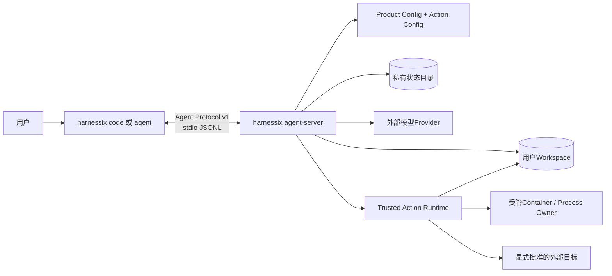

# Harnessix Code部署与运维

## 1. 文档定位

本文是当前安装、配置、启动、升级、恢复、诊断和平台资料的统一入口。Harnessix Code 1.0只有一套本地优先
Coding Agent产品拓扑；历史`harnessix serve`、`harnessix worker`和Action HTTP API不再是产品部署方式。
0.1～0.8时期的旧命令和队列运维证据冻结在[部署里程碑历史](deployment-milestone-history.md)，不得作为当前手册。

具体操作分别由以下资料维护：

| 主题 | 当前事实源 |
|---|---|
| 安装与制品 | [安装与制品](operations/installation.md) |
| Product Config、Profile与Secret | [配置参考](operations/configuration.md) |
| 升级、备份与回退 | [升级与回退](operations/upgrade-and-rollback.md) |
| Session、Action、Process与Delivery恢复 | [故障恢复](operations/recovery.md) |
| Doctor、日志、Trace与Metric | [诊断与可观测性](operations/diagnostics.md) |
| macOS、Linux、Windows与Container | [平台与运行环境](operations/platforms.md) |
| 受控真实Provider完整Suite | [真实Provider Suite运维手册](operations/provider-suite-baseline.md) |

## 2. 当前能力与非目标

| 能力 | 当前状态 | 生产解释 |
|---|---|---|
| 源码开发安装 | 可用 | Python 3.12+，使用锁定`uv.lock`安装 |
| `harnessix code` | 已实现 | TUI、配置向导、Doctor、Client State和stdio子进程监督 |
| `harnessix agent` | 已实现 | Agent Protocol薄CLI，适合自动化和无TUI使用 |
| `harnessix agent-server` | 已实现 | 本地Headless App Server；stdout仅传输Agent Protocol JSONL；stdio执行协商背压并在Writer故障时唤醒主循环 |
| Agent Python SDK | 已实现 | `AgentClient`及进程内/子进程Transport；Pending与取消后迟到Response共享容量，Close由Transport拥有；不包含Action HTTP Client |
| Session共库维护 | 内部能力已实现、产品命令未发布 | 低敏容量、不可变Plan、强制备份、批次续跑和显式Restore；必须在静默维护窗口调用，不是独立服务 |
| 默认Workspace读取 | macOS/Linux/Windows已实现 | 启动前按平台能力证明，失败时不开放协议 |
| 默认Workspace Patch | POSIX已实现 | 经Trusted Action、Review Artifact、审批和Delivery事务执行 |
| 固定Container Process | e4执行链与e5配置/恢复均已验收 | 只有显式Action Config且镜像、Sandbox、Owner、Secret和恢复能力全部证明后才广告 |
| Wheel与三平台安装器 | 未完成 | 0.9.5形成正式发行物、签名、SBOM与升级证据 |
| 远程多租户服务 | 非1.0范围 | 不开放网络Agent Server、远程Worker池或集中控制面 |

独立Action HTTP/Worker已经退出产品面，旧`ActionService/ActionWorker`及其Journal、SDK和Adapter已从当前源码物理删除。
历史数据库只允许按[归档手册](operations/legacy-action-archive.md)离线检查和保存；收敛决策见
[ADR 0081](adr/0081-single-coding-agent-product-boundary.md)。

## 3. 当前部署拓扑



### 3.1 进程与生命周期

- `harnessix code`持有TUI、客户端状态和子进程Transport；
- `harnessix agent-server`持有双配置Store、Session Store、Artifact Store、Coding Tool、Agent Runtime和
  `ProductActionRuntimeOwner`；
- stdio EOF、协议错误、Writer故障或出站Timeout触发Server关闭，组件按组合根逆序释放；同步I/O守护线程允许主协程有界退出，但不强制中断底层系统调用；
- Container进程由Process Owner负责启动、输出、超时和进程树清理，它是执行后端，不是第二个产品服务；
- Provider是外部网络边界，Workspace和状态目录是两个必须互不包含的本地信任域。

### 3.2 单一入口约束

产品用户和上层应用不得直接访问Session数据库、Action Audit或Executor。所有命令经Agent Protocol进入Application
Service，再由Agent Runtime和Trusted Action Gateway执行。不存在用户到Action HTTP API的旁路，也不存在从数据库队列
直接构造高风险调用的运维入口。

## 4. 安装与开发验收

```bash
uv sync --locked --all-extras --dev
uv run python scripts/generate_specs.py --check
uv run python scripts/documentation_check.py
uv run ruff format --check .
uv run ruff check .
uv run mypy src
uv run pytest
```

`Dockerfile`仅用于构造包含`harnessix`命令的开发镜像，默认执行`--help`，不监听端口、不声明Action API、
不构成正式发行物。1.0容器或安装器必须在0.9.5重新设计并通过平台门禁。

## 5. 产品配置与启动

### 5.1 生成不含Secret正文的配置

```bash
uv run harnessix code configure \
  --config ./private/product-config.json \
  --provider-kind openai_chat \
  --base-url https://example.invalid/v1 \
  --model example-model \
  --api-key-env MODEL_API_KEY \
  --non-interactive
```

配置只保存Secret环境变量名称与版本。API Key正文必须由启动环境提供，不得写入配置、Workspace、Session或日志。

### 5.2 离线Doctor

```bash
uv run harnessix code doctor ./workspace \
  --config ./private/product-config.json \
  --action-config ./private/product-actions.json \
  --state-directory ./private/state
```

Doctor检查配置、Profile、Secret引用、Workspace、状态目录、平台原生读取端口、可选Git、TUI和Action能力。
Doctor成功不是网络Provider调用证明；单次模型连通性由受控Smoke负责，完整工程Task Pack真实Provider基线由默认禁网的`coding-eval-suite`及[专项运维手册](operations/provider-suite-baseline.md)负责。0.9.2e已完成20 Trial真实运行并[冻结低敏证据](validation/provider-engineering-2026-09-20-v1/README.md)，其0/20严格质量结果不能外推为模型已达生产可用。

### 5.3 启动TUI

```bash
export MODEL_API_KEY='由安全环境注入'
uv run harnessix code ./workspace \
  --config ./private/product-config.json \
  --action-config ./private/product-actions.json \
  --state-directory ./private/state
```

### 5.4 Headless Server

```bash
uv run harnessix agent-server \
  --config ./private/product-config.json \
  --action-config ./private/product-actions.json \
  --workspace ./workspace \
  --state-directory ./private/state
```

`agent-server`的stdin/stdout是协议通道。普通日志、Shell提示、进度条或异常Traceback不得写入stdout；调用方负责
子进程监督、连接代际和客户端实例身份。

## 6. 私有状态布局

状态目录必须由当前用户独占，不能是符号链接或Junction，不能与Workspace互相包含。当前或逐步接入的状态包括：

| 状态 | Owner | 事实用途 |
|---|---|---|
| `product-config.db` | Product Runtime Config Store | Product/Action配置快照、两条审计链、恢复报告和双活动指针原子CAS |
| `sessions.db` | Session/Protocol/Artifact Store | Thread、Turn、Item、请求幂等、Artifact元数据/内容，以及Maintenance Plan/Item/Progress |
| `execution-plans.db` | Execution Plan Store | 不可变计划与批准检查点 |
| `action-audit.db` | Trusted Action Audit Store | Route投影和摘要化Hash链事件 |
| `workspace-leases.db` | Workspace Lease Store | Workspace执行所有权和Fencing |
| `workspace-transactions/` | Delivery Store | 多文件计划、Blob、游标和效果恢复 |
| Process状态文件 | Process Supervisor/Owner | Process Lease、输出观察、停止原因和恢复证据 |

旧Action Plane的SQLite/PostgreSQL Journal不属于新状态布局。已有旧数据库由原版本或归档工具只读处理，
新产品不会自动导入、执行或删除其中的READY/RUNNING记录。

## 7. 启动顺序与失败关闭

```text
resolve product/action config, workspace and state paths
reject overlap, links, invalid ownership or permissions
run shared offline preflight
strictly reload Product/Action Config and compare preflight digests
select profile and resolve Secret references without persisting material
build and enter Provider bundle
initialize Session, Protocol Request and Artifact stores
load previous active Action snapshot
build exact recovery router and reconcile unknown routes once; never execute
build candidate catalog from currently verified executors
enter Agent Runtime
atomically CAS activate Product + Action snapshots
open stdio protocol
on any failure: close entered components in reverse order; never open partial protocol
```

启动过程中不得为了保持工具目录稳定而降级到字符串Path、不受管Shell、Host Process或未固定镜像。能力探测失败应形成
稳定Doctor省略原因，并从模型目录和Router注册表同时移除。

## 8. 安全硬约束

1. 配置文件、状态目录和Workspace身份在启动期间必须稳定；
2. Secret正文只在Provider或Executor最小使用窗口存在，不进入argv、数据库、日志或Artifact；
3. 只读工具使用原生安全文件端口并复核漂移；写操作必须经Trusted Action和完整Review；
4. Process只接受宿主固定Profile，不接受模型提供程序、Shell、任意环境或Secret；
5. Container不可用时高风险Process不广告，不回退Host执行；
6. Agent Protocol是本地边界，不等于公网认证协议；
7. 不确定外部效果进入`unknown`并只对账，不自动重放；
8. 备份或恢复不得复制活动锁后让两个Runtime同时操作同一Workspace。
9. 待恢复的Trusted Action Route必须用上一活动配置的精确Binding恢复；候选配置不得继承不相等的旧批准。

## 9. 升级、备份与回滚

升级前至少备份Product Config、Session数据库、Artifact内容、Execution Plan、Action Audit、Delivery、Workspace Lease和
Process状态。升级先在副本运行Schema/Doctor检查，再停止旧Server并启动新版本；不得在两个版本之间共享可写状态目录。

回滚只能由能够读取当前数据版本的旧版本执行。新事件或迁移已写入后，旧Reader若不认识必须失败关闭，不能跳过字段继续。
旧Action数据库不参与新产品启动；其归档步骤见[旧Action Plane状态检查与归档手册](operations/legacy-action-archive.md)。

### 9.1 Session共库维护窗口

0.9.3b提供[`SQLiteStoreMaintenance`](../src/harnessix/session/maintenance.py)内部端口，但尚未发布最终用户CLI。生产宿主接入时
必须遵循以下顺序：

```text
stop accepting new Agent Protocol commands
drain active Turn, Action route and Artifact publication
acquire the Session runtime owner
capture a low-sensitive capacity snapshot
persist and review an immutable retention plan
choose a private backup path with sufficient free space
execute with bounded batches and the same backup on resume
verify after-capacity and stable progress counts
resume normal product traffic
```

- Plan、Execute和Restore必须在没有同进程业务写入的静默窗口运行；Runtime Owner只排除第二进程；
- Execute强制创建并验证包含当前Plan的完整SQLite备份，不能关闭该门禁；
- 进程退出后必须使用同一Plan ID、同一Backup和持久`next_ordinal`继续，不能重新扫描后猜测；
- 完整回滚使用`restore()`原子替换整个Session数据库，会丢弃备份时点后的新事实，不是在线合并；
- 备份包含Prompt、源码、Tool正文和协议结果，必须按高敏状态文件保管；SHA-256不等于加密；
- 逻辑清理不会自动缩小SQLite文件；当前禁止在启动、Turn热路径或Maintenance中隐式Vacuum；
- Migration 26向前增加Artifact发布时间和维护表，升级本身不创建Plan、不清理数据。

完整禁删集合、故障窗口和Restore流程见
[0.9.3b详细设计](changes/m09-3b-persistent-capacity-and-retention.md)与
[ADR 0090](adr/0090-plan-first-store-maintenance-and-backup.md)。正式CLI确认、磁盘空间Preflight、备份保留和三平台升级体验属于0.9.5。

## 10. 诊断与可观测性

当前产品没有HTTP `/healthz`或`/readyz`。就绪事实来自：

- `harnessix code doctor`的离线报告；
- Agent Protocol初始化握手及协商能力；
- Session、Action Audit、Delivery和Process的持久状态；
- 结构化错误码、Thread/Turn/Plan身份和低基数Telemetry。

诊断包不得包含Prompt全文、代码正文、Patch正文、argv、绝对路径、环境值、Secret、Provider响应正文或未脱敏stderr。
历史`harnessix.api.*`和`harnessix.worker.*`信号不会由当前源码产生，不能作为当前产品SLO。

## 11. 平台边界

- macOS/Linux使用POSIX安全文件语义；Workspace Patch只有在no-follow能力成立时广告；
- Windows只读链使用原生Handle，写入在抗Reparse事务端口完成前失败关闭；
- Container Process依赖Docker或Podman能力、固定镜像Digest、网络策略、资源限制和Process Owner；
- WSL2可作为强隔离后端候选，但不能替代Windows原生Workspace、Git、Process和CLI支持声明；
- PostgreSQL不是1.0产品运行依赖；旧Journal归档使用数据库原生工具，不在当前Python运行时重新引入驱动。

## 12. 源码与测试映射

| 设计元素 | 源码 | 关键符号 | 测试 |
|---|---|---|---|
| 顶层产品命令 | [`cli.py`](../src/harnessix/cli.py) | `_parser`、`main` | [`test_cli.py`](../tests/smoke/test_cli.py) |
| TUI与子进程启动 | [`product_ui/cli.py`](../src/harnessix/product_ui/cli.py) | `code_main`、`_server_command` | [`product_ui测试`](../tests/product_ui/) |
| 产品组合根 | [`product_config/server.py`](../src/harnessix/product_config/server.py) | `run_product_stdio`、`_serve_product_stdio` | [`test_server_and_cli.py`](../tests/product_config/test_server_and_cli.py) |
| Action配置与双CAS | [`product_config/action_codec.py`](../src/harnessix/product_config/action_codec.py)、[`product_config/action_store.py`](../src/harnessix/product_config/action_store.py) | `load_product_action_config`、`SQLiteProductRuntimeConfigStore` | [`test_action_config_runtime.py`](../tests/product_config/test_action_config_runtime.py) |
| Agent协议服务 | [`app_server/stdio.py`](../src/harnessix/app_server/stdio.py) | `_StdioReader`、`_StdioWriter`、`run_stdio` | [`test_server_sdk.py`](../tests/app_server/test_server_sdk.py) |
| Agent SDK Transport | [`sdk/subprocess.py`](../src/harnessix/sdk/subprocess.py) | `_RequestCapacity`、`_ResponseRouter`、`_ChildProcess`、`SubprocessAgentTransport` | [`test_server_sdk.py`](../tests/app_server/test_server_sdk.py) |
| Session共库维护 | [`session/maintenance.py`](../src/harnessix/session/maintenance.py)、[`session/maintenance_backup.py`](../src/harnessix/session/maintenance_backup.py) | `SQLiteStoreMaintenance`、`create_or_reuse_backup`、`restore_database` | [`test_store_maintenance.py`](../tests/agent/test_store_maintenance.py) |
| Trusted Action产品组合 | [`product_config/action_runtime.py`](../src/harnessix/product_config/action_runtime.py) | `ProductActionRuntimeOwner`、`open_default_product_action_runtime` | [`test_action_runtime.py`](../tests/product_config/test_action_runtime.py)、[真实Profile测试](../tests/integration/test_product_process_profile.py) |
| 单一产品面门禁 | 生产源码树 | 旧内核Import精确集合 | [`test_product_runtime_convergence.py`](../tests/governance/test_product_runtime_convergence.py) |
| 显式Git Push能力 | [`delivery/git_push.py`](../src/harnessix/delivery/git_push.py) | `build_git_push_definition`、`GitPushActionExecutor` | [`test_git_push.py`](../tests/delivery/test_git_push.py) |

## 13. 当前限制与后续工作

- 0.9.1e4固定Container Process产品链与e5外部Action Config、Doctor、双配置CAS及统一启动恢复Owner已分别通过七任务CI；
- 0.9.1f固定Container Process、直接Trusted Git Push和历史Eval迁移均已由七任务CI关闭；f3物理删除、历史Session只读兼容及旧库归档由[CI 35453082992](https://github.com/carrie1988/Harnessix/actions/runs/35453082992)完成六实例全矩阵验收；
- 0.9.3a本地传输容量、Writer故障唤醒和取消安全关闭已由[CI 35494960166](https://github.com/carrie1988/Harnessix/actions/runs/35494960166)完成六实例验收；0.9.3b持久容量、Plan-first保留、备份恢复实现和本地全仓门禁已完成，全矩阵CI待关闭；0.9.3c～d效果恢复和完整Soak尚未完成；
- 0.9.4尚未完成完整供应链、安全攻击和远端MCP边界；
- 0.9.5尚未形成签名发行物、升级/卸载和Beta证据；
- 1.0不提供网络Agent Server、远程Worker池、多租户身份、计费或服务SLO。
