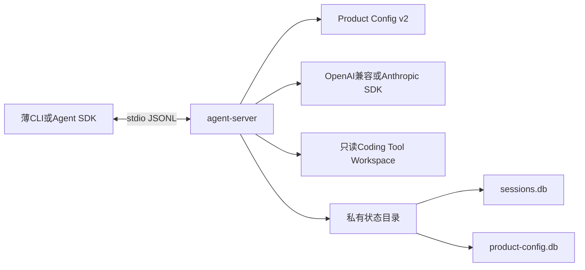
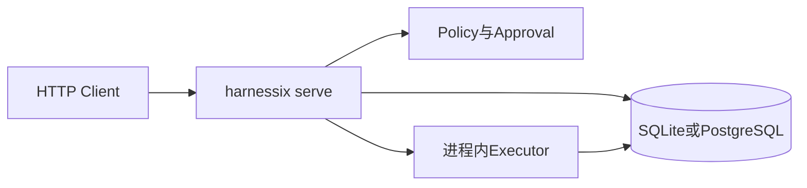
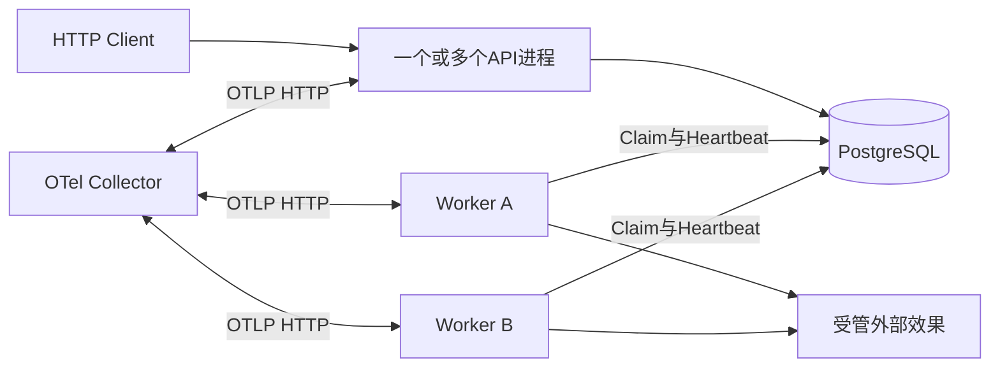

# Harnessix Code部署与运维

## 1. 文档定位

本文是当前安装、配置、升级、恢复、诊断和平台资料的统一入口，只维护部署拓扑、文档职责和跨组件硬约束。
具体操作步骤已拆分到`docs/operations/`，历史上按0.3～0.8里程碑追加的命令和验收数字冻结在
[部署里程碑历史](deployment-milestone-history.md)，不得作为当前版本运行手册。

当前仓库同时包含两个不同部署面：

1. **Harnessix Code本地Agent进程**：`harnessix agent-server`通过stdio提供Agent Protocol，使用产品配置、
   本地Workspace和私有状态目录；
2. **Harnessix Action Plane服务**：`harnessix serve`提供HTTP API，`inline`模式进程内执行，`queued`
   模式由独立`harnessix worker`消费SQLite或PostgreSQL Journal。

二者尚未合并成统一安装器或守护进程。Action Plane HTTP服务只注册`system.echo`和`demo.issue.create`示例工具，
不是完整Coding Agent产品入口。

## 2. 当前能力边界

| 能力 | 当前状态 | 生产解释 |
|---|---|---|
| 源码开发安装 | 可用 | Python 3.12+与`uv sync --locked --all-extras --dev` |
| Python Wheel构建 | 项目元数据已具备 | 尚无受签名、带SBOM的正式Release制品 |
| Action Plane SQLite/inline | 可用 | 单机开发和受控部署；默认监听`127.0.0.1` |
| Action Plane PostgreSQL/queued | 可用 | API与Worker共享数据库；仍需外置认证、TLS和编排 |
| Coding Agent stdio Server | macOS/Linux候选 | 启动前严格诊断Provider、Workspace、状态目录和平台 |
| Windows底层端口 | 部分可用 | 当前产品`agent-server`主动拒绝Windows Coding Tool装配 |
| 容器Action Plane | 可构建 | 当前`Dockerfile`不包含模型Provider可选依赖，不是Agent镜像 |
| 完整TUI与三平台安装器 | 未实现 | 属于0.9.1及后续发布切片 |
| 远程多租户Agent服务 | 非1.0范围 | 当前本地优先，不开放公共网络Agent Server |

平台承诺的完整矩阵见[平台与运行环境](operations/platforms.md)。

## 3. 部署拓扑

### 3.1 本地Coding Agent



启动顺序为：安全读取配置→选择Profile→离线诊断依赖和Secret→校验Workspace与状态目录不重叠→
校验平台→打开配置审计和Session→装配Provider、Tool及Runtime→CAS发布活动配置→开放stdio。
任一步失败都不得先开放协议。

### 3.2 Action Plane inline



`inline`适用于开发或受控单进程部署。API进程拥有执行权，不需要独立Worker，但仍必须处理审批、幂等、
Journal和`UNKNOWN`。

### 3.3 Action Plane queued



生产队列形态推荐PostgreSQL。Worker通过租约Claim，租约过期的`RUNNING`动作转入`UNKNOWN`，不能自动重发
可能产生副作用的调用。HTTP身份认证、TLS、速率限制和多租户鉴权当前不由应用内实现，API不得直接暴露公网。

## 4. 运维资料职责

| 主题 | 当前事实源 | 主要问题 |
|---|---|---|
| 安装 | [安装与制品](operations/installation.md) | 前置依赖、源码安装、容器、验收、卸载和制品缺口 |
| 配置 | [配置参考](operations/configuration.md) | 环境变量、Product Config v2、Secret、Profile和启动优先级 |
| 升级 | [升级与回退](operations/upgrade-and-rollback.md) | 备份集、Migration、配置CAS、兼容检查和回退边界 |
| 恢复 | [故障恢复](operations/recovery.md) | Action、Agent、Process、Patch、Delivery与配置恢复责任 |
| 诊断 | [诊断与可观测性](operations/diagnostics.md) | Health、Readiness、日志、Trace、Metric、错误码和证据采集 |
| 平台 | [平台与运行环境](operations/platforms.md) | macOS/Linux/Windows/Container/PostgreSQL支持等级 |
| 历史 | [部署里程碑历史](deployment-milestone-history.md) | 旧版本命令、升级切片和当时验收记录 |

模块内部部署参数仍以对应[模块详细设计](README.md#3-当前事实源)为准；本目录不复制全部类、字段和测试清单。

## 5. 最小启动路径

### 5.1 开发环境

```bash
uv sync --locked --all-extras --dev
make spec
make check
uv run harnessix license
```

### 5.2 Action Plane本地服务

```bash
export HARNESSIX_DATABASE_PATH='.harnessix/harnessix.db'
export HARNESSIX_EXECUTION_MODE='inline'
uv run harnessix serve --host 127.0.0.1 --port 8787
```

另一个终端执行：

```bash
curl --fail http://127.0.0.1:8787/healthz
curl --fail http://127.0.0.1:8787/readyz
```

### 5.3 Coding Agent stdio Server

先按[配置参考](operations/configuration.md#4-product-config-v2)创建私有Product Config v2并完成离线诊断，再由
SDK或薄CLI启动：

```bash
uv run harnessix config diagnose \
  --config ./private/product-config.json

uv run harnessix agent-server \
  --config ./private/product-config.json \
  --workspace ./workspace \
  --state-directory ./private/state
```

`agent-server`的stdout是Agent Protocol数据通道，不得混入普通日志或Shell提示。调用方负责进程监督、stdin/stdout
生命周期和重连身份。

## 6. 持久状态清单

| 部署面 | 路径或后端 | 权威内容 | 一致性要求 |
|---|---|---|---|
| Action Plane SQLite | `HARNESSIX_DATABASE_PATH` | Action Snapshot、Event、Approval、Lease | 备份数据库及活动WAL状态，恢复后先Readiness检查 |
| Action Plane PostgreSQL | `HARNESSIX_DATABASE_URL` | 同上，可供多Worker共享 | 使用数据库一致性备份；Schema由事务与Advisory Lock升级 |
| 演示外部效果 | `HARNESSIX_DEMO_DATABASE_PATH` | `demo.issue.create`幂等效果 | 与Effect Journal不是单事务，故障后必须对账 |
| Agent产品状态 | `--state-directory/sessions.db` | Thread、Turn、Item、Event、Artifact与协议请求 | 单Runtime Owner；SQLite WAL；Migration带Checksum |
| 配置审计 | `--state-directory/product-config.db` | 配置快照、活动指针、Fallback和迁移审计 | 与配置源文件摘要绑定；活动切换使用CAS |
| Product Config源 | `--config`文件 | Provider、Profile、Secret引用和预算 | POSIX要求当前用户拥有、单硬链接、无组/其他权限 |
| Workspace | `--workspace` | 用户仓库 | 不得与配置或状态目录互相包含 |

显式装配的Patch、Process、Workspace Transaction、Git Delivery、MCP、Skill和Hook还会创建各自账本或私有目录；
具体路径由宿主装配决定，不能假设全部位于`--state-directory`。

## 7. 安全硬约束

1. HTTP Action Plane默认仅绑定回环地址；未实现应用内认证前不得直接监听公网；
2. PostgreSQL与OTel Collector只开放到受控私网或本机，并由外部TLS/mTLS和访问控制保护；
3. API Key只通过环境Secret来源解析，不进入Product Config正文、命令参数、日志、Session或验证报告；
4. Product Config和状态目录放在Workspace外；POSIX上分别使用`0600`和`0700`；
5. 不把配置、Session、Patch账本和效果数据库拆成彼此不一致的备份时间点；
6. `UNKNOWN`、`interrupted`和`diverged`必须先对账，不得通过重启或重复提交“碰运气”；
7. 迁移失败、配置诊断失败、活动配置CAS冲突或平台不支持时保持失败关闭；
8. 当前容器镜像以非Root UID 10001运行，但未提供完整只读根文件系统、Capability、Seccomp和签名策略。

## 8. 发布前部署门禁

| 门禁 | 最低证据 |
|---|---|
| 制品身份 | 源码Revision、版本、锁文件、构建日志和Artifact摘要一致 |
| 安装 | 目标平台全新环境安装、`harnessix --help`和许可证命令通过 |
| 配置 | 严格解析、Secret可用、依赖存在、Profile能力与活动CAS通过 |
| 数据 | 升级前备份、Migration、重开、旧Reader拒绝和回退演练通过 |
| 运行 | Health/Readiness、一次只读请求、审批、取消、恢复和资源关闭通过 |
| 安全 | 监听地址、文件权限、Secret Canary、Sandbox和网络边界通过 |
| 可观测 | 日志、Trace、Metric、错误分类和红action拒绝均可定位 |
| 平台 | 对应OS、文件系统、进程、终端、Git和安装器矩阵通过 |

当前仓库尚未完成正式安装器、签名、SBOM、升级编排和全平台Dogfooding，因此不能据此声明1.0可商用发布。

## 9. 源码与测试映射

| 部署职责 | 源码 | 关键符号 | 测试 |
|---|---|---|---|
| 顶层命令 | [`src/harnessix/cli.py`](../src/harnessix/cli.py) | `_parser`、`main`、`_run_worker` | [`tests/unit/test_cli_license.py`](../tests/unit/test_cli_license.py)、[`tests/product_config/test_server_and_cli.py`](../tests/product_config/test_server_and_cli.py) |
| Action服务装配 | [`src/harnessix/bootstrap.py`](../src/harnessix/bootstrap.py) | `build_journal`、`build_service` | [`tests/integration/test_action_service.py`](../tests/integration/test_action_service.py) |
| HTTP生命周期 | [`src/harnessix/api/app.py`](../src/harnessix/api/app.py) | `create_app`、`health`、`readiness` | [`tests/integration/test_api.py`](../tests/integration/test_api.py) |
| 队列Worker | [`src/harnessix/worker.py`](../src/harnessix/worker.py) | `ActionWorker.run_forever`、`_execute_with_heartbeat` | [`tests/integration/test_worker.py`](../tests/integration/test_worker.py) |
| Agent产品启动 | [`src/harnessix/product_config/server.py`](../src/harnessix/product_config/server.py) | `run_product_stdio` | [`tests/product_config/test_server_and_cli.py`](../tests/product_config/test_server_and_cli.py) |
| 配置CLI | [`src/harnessix/product_config/cli.py`](../src/harnessix/product_config/cli.py) | `config_main`、`agent_server_main` | [`tests/product_config/test_server_and_cli.py`](../tests/product_config/test_server_and_cli.py) |
| 进程级设置 | [`src/harnessix/settings.py`](../src/harnessix/settings.py) | `Settings.from_environment` | [`tests/integration/test_api.py`](../tests/integration/test_api.py)、[`tests/integration/test_worker.py`](../tests/integration/test_worker.py) |
| 镜像 | [`Dockerfile`](../Dockerfile) | 非Root用户、`/data`卷和`serve`入口 | [`tests/integration/test_api.py`](../tests/integration/test_api.py) |

## 10. 已知限制

- 项目包版本仍为`0.1.0`，路线图完成度与发布包语义版本尚未统一；
- 没有官方macOS/Linux/Windows安装器、自动更新器、签名、来源证明和SBOM；
- `agent-server`仅支持当前POSIX Coding Tool入口，Windows产品入口失败关闭；
- Action Plane HTTP API没有内置认证、授权、TLS、速率限制或租户来源绑定；
- 当前容器只覆盖Action Plane基础依赖，不包含OpenAI、Anthropic或完整Coding Tool环境；
- 没有统一`doctor`、在线备份、数据库修复或自动回滚命令；
- 各扩展和Delivery能力不是默认产品装配，部署前必须核对对应模块的“当前/显式/规划”边界；
- 生产SLO、容量阈值、告警阈值、长时间Soak和灾难恢复目标尚待0.9后续切片固化。
