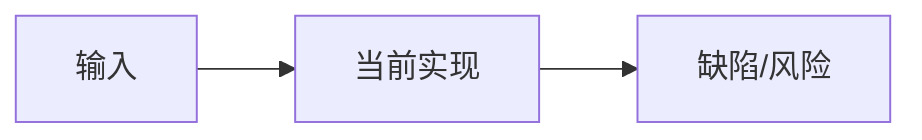
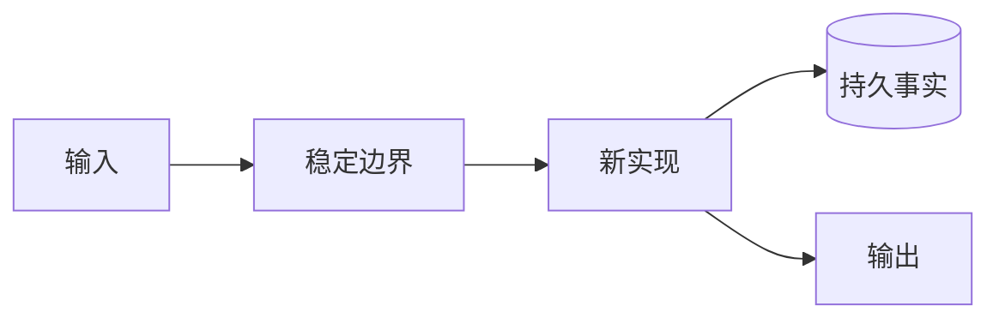

# 重大变更设计模板

> 使用范围：满足[重大变更判定](../documentation-standard.md#5-重大变更判定)的增量。设计阶段`code_revision`为`pending`；实现关闭后替换为提交号并将状态改为`historical`。

## 1. 变更摘要

| 项目 | 内容 |
|---|---|
| 需求/缺陷 | 待填写 |
| 当前问题 | 待填写 |
| 目标结果 | 待填写 |
| 影响模块 | 待填写 |
| 兼容级别 | 待填写 |
| 发布/回滚单元 | 待填写 |

## 2. 需求背景与证据

记录可复现问题、用户影响、生产风险、源码研究和基线指标。

## 3. 目标、非目标与验收标准

每项目标绑定可执行测试、指标或验证证据。明确本次不解决的事项。

## 4. 当前实现与根因



说明当前调用链、状态所有权、故障点及根因，不只描述表象。

## 5. 方案与变更后架构



### 5.1 替代方案

| 方案 | 优点 | 缺点 | 风险 | 结论 |
|---|---|---|---|---|
| 待填写 | 待填写 | 待填写 | 待填写 | 待填写 |

长期决策链接ADR；局部取舍在本文完整解释。

## 6. 正常、失败与恢复时序

分别提供正常流程和至少一个关键失败/恢复时序图，并逐消息说明持久化、取消、超时和对外可见顺序。

## 7. 契约与数据变更

| 契约/结构/字段 | 变更前 | 变更后 | 兼容策略 | 迁移/回滚 |
|---|---|---|---|---|
| 待填写 | 待填写 | 待填写 | 待填写 | 待填写 |

## 8. 状态、事务、并发与幂等

给出状态转换、事务边界、锁/CAS/租约、重复请求和`UNKNOWN`处理。若不适用，解释原因。

## 9. 安全、隐私与可观测性

说明信任边界变化、权限和Secret处理、新增Trace/Metric/Log/Event及基数限制。

## 10. 核心伪代码

```text
validate_old_and_new_contracts()
persist_migration_or_intent()
execute_new_path_once()
on_failure:
    preserve_authoritative_fact()
    recover_or_rollback()
publish_only_after_commit()
```

## 11. 实施切片

| 顺序 | 代码/数据改动 | 行为保持或新契约 | 测试 | 可独立回滚 |
|---|---|---|---|---|
| 1 | 待填写 | 待填写 | 待填写 | 待填写 |

## 12. 源码与测试映射

| 变更点 | 源码文件链接 | 关键符号 | 测试文件链接 | 测试符号/证据 |
|---|---|---|---|---|
| 待填写 | 待填写 | 待填写 | 待填写 | 待填写 |

## 13. 风险、发布和回滚

列出灰度、升级、跨平台、数据回滚、不可逆步骤、失败停止条件和恢复负责人。

## 14. 实现偏差与最终结论

实现完成后记录与原方案的差异、原因、最终代码版本和被更新的现行模块设计。无偏差也必须明确记录。
