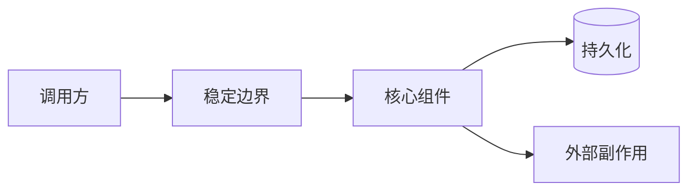
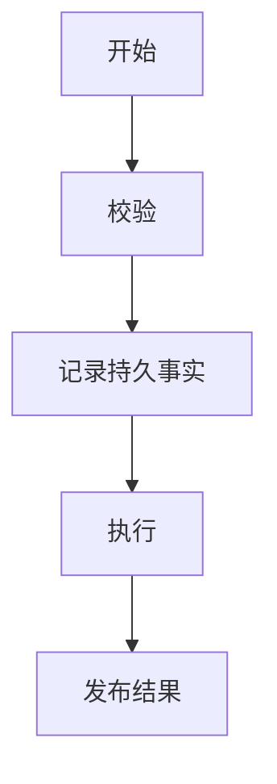
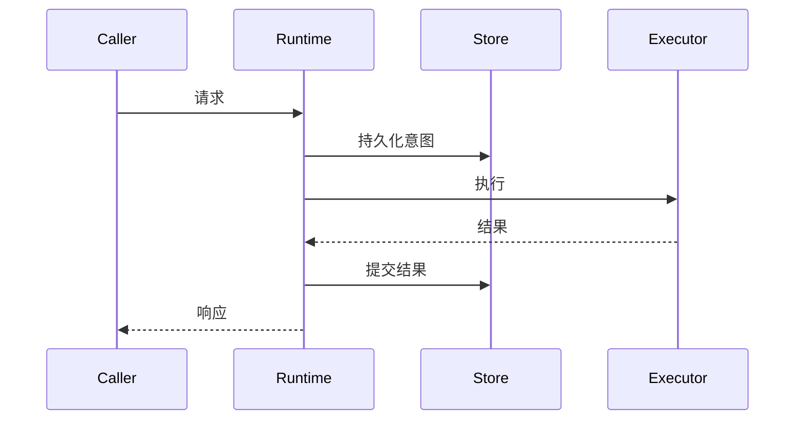
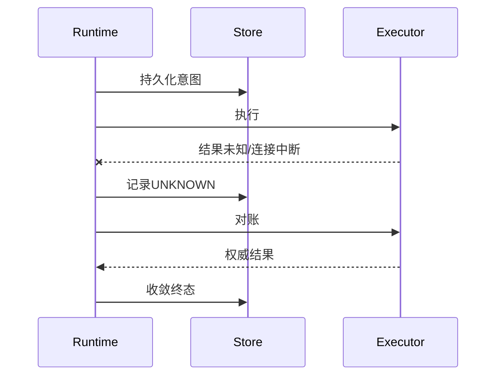
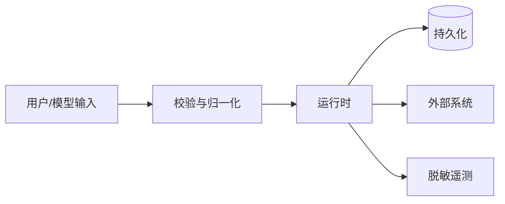
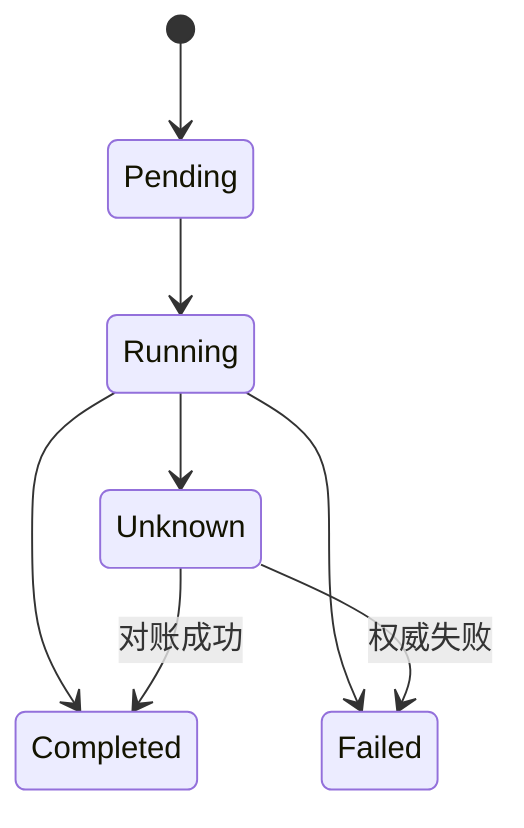
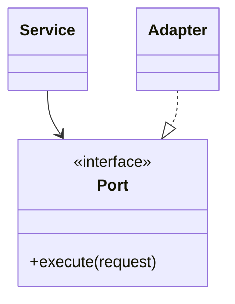

# 详细设计文档模板

> 使用范围：系统级能力、跨模块纵向切片或需要完整评审的复杂子系统。填写时删除本提示，并遵循[文档工程规范](../documentation-standard.md)。不适用章节必须说明原因。

## 1. 文档摘要

| 项目 | 内容 |
|---|---|
| 当前能力 | 待填写 |
| 本文设计状态 | 待填写：当前实现或目标设计 |
| 代码版本 | 待填写：40位Git提交 |
| 影响模块 | 待填写 |
| 关键ADR | 待填写 |
| 关键测试/证据 | 待填写 |

## 2. 需求背景

说明用户问题、生产故障或能力缺口；给出可复现事实、约束和为什么现在需要解决。

## 3. 设计目标与非目标

### 3.1 目标

1. 待填写可验证目标。

### 3.2 非目标

1. 待填写明确排除项及其后续归属。

## 4. 约束、假设与术语

| 项目 | 定义 | 影响 |
|---|---|---|
| 待填写 | 待填写 | 待填写 |

## 5. 总体架构



### 5.1 图示说明

逐箭头说明调用方向、同步/异步属性、协议和失败返回。

### 5.2 变更前后边界

说明保留、替换和新增组件，禁止把规划组件写成当前实现。

## 6. 模块职责与依赖

| 模块 | 职责 | 允许依赖 | 禁止依赖 | 生命周期 |
|---|---|---|---|---|
| 待填写 | 待填写 | 待填写 | 待填写 | 待填写 |

## 7. 核心流程

### 7.1 正常流程图



逐步说明输入、输出、状态变化和持久化边界。

### 7.2 正常时序图



### 7.3 失败与恢复时序图



分别说明取消、超时、崩溃、安全拒绝、重试耗尽和对账失败。

## 8. 数据流



说明每类数据的来源、信任级别、持久化位置、保留周期和脱敏方式。

## 9. 状态机



| 当前状态 | 事件/条件 | 下一状态 | 写入者 | 持久事实 | 非法转换处理 |
|---|---|---|---|---|---|
| 待填写 | 待填写 | 待填写 | 待填写 | 待填写 | 待填写 |

## 10. 类与组件设计



| 类/组件 | 职责 | 状态所有权 | 线程/进程安全 | 直接依赖 | 扩展点 |
|---|---|---|---|---|---|
| 待填写 | 待填写 | 待填写 | 待填写 | 待填写 | 待填写 |

## 11. 接口设计

| 接口/方法 | 调用者 | 输入/输出 | 前置/后置条件 | 错误与重试 | 取消/超时 | 幂等/顺序 | 权限 |
|---|---|---|---|---|---|---|---|
| 待填写 | 待填写 | 待填写 | 待填写 | 待填写 | 待填写 | 待填写 | 待填写 |

公共Schema、错误码和事件字段应另给出版本化契约并链接。

## 12. 数据结构与重点字段

| 结构/字段 | 类型 | 必填 | 来源 | 语义/约束 | 默认值 | 敏感级别 | 持久化 | 兼容规则 |
|---|---|---|---|---|---|---|---|---|
| 待填写 | 待填写 | 待填写 | 待填写 | 待填写 | 待填写 | 待填写 | 待填写 | 待填写 |

## 13. 持久化、事务与迁移

说明Schema、事务边界、提交顺序、唯一约束、迁移/回滚、损坏检测和备份恢复。涉及关系数据时补充`erDiagram`。

## 14. 并发、幂等与一致性

说明并发所有权、锁/CAS/租约、幂等键作用域、重复请求、乱序事件、至少一次交付及最终一致性边界。

## 15. 失败语义与恢复矩阵

| 故障点 | 可观测事实 | 对外错误 | 是否重试 | 恢复动作 | 最终状态 | 防重复证明 |
|---|---|---|---|---|---|---|
| 待填写 | 待填写 | 待填写 | 待填写 | 待填写 | 待填写 | 待填写 |

## 16. 安全与隐私

说明资产、主体、信任边界、权限检查、Sandbox/网络/Secret策略、日志脱敏和审计事实。链接对应威胁模型条目。

## 17. 可观测性

| 信号 | 名称 | 触发点 | 关键属性 | 基数限制 | 敏感数据处理 | 告警/诊断用途 |
|---|---|---|---|---|---|---|
| Trace/Metric/Log/Event | 待填写 | 待填写 | 待填写 | 待填写 | 待填写 | 待填写 |

## 18. 兼容性与发布

说明跨版本读取、协议兼容、三平台差异、灰度、升级、回滚和降级行为。

## 19. 核心业务逻辑伪代码

```text
validate(request)
authorize(request.principal)
intent = persist_intent(request)
try:
    result = execute_once(intent)
except cancellation_or_timeout:
    persist_interrupted(intent)
    reconcile_or_mark_unknown(intent)
else:
    persist_result_before_publish(result)
publish_durable_result()
```

按实际语义改写，并将每个关键步骤映射到源码符号。

## 20. 源码与测试映射

| 设计元素 | 源码文件链接 | 关键符号 | 测试文件链接 | 测试函数/合同 | 说明 |
|---|---|---|---|---|---|
| 待填写 | 待填写 | 待填写 | 待填写 | 待填写 | 待填写 |

## 21. 测试设计与验收标准

覆盖单元、合同、集成、真实进程/数据库故障注入、安全、迁移、平台和真实场景。每条验收标准必须可由命令、测试或证据验证。

## 22. 风险、限制与后续工作

| 项目 | 影响 | 缓解 | 所属里程碑 |
|---|---|---|---|
| 待填写 | 待填写 | 待填写 | 待填写 |

## 23. 变更记录

| 文档版本 | 代码版本 | 日期 | 变更摘要 |
|---|---|---|---|
| 1 | 待填写 | YYYY-MM-DD | 初版 |
