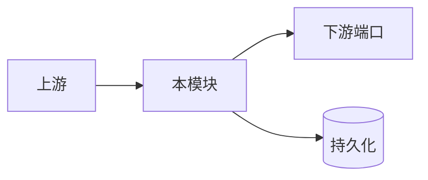
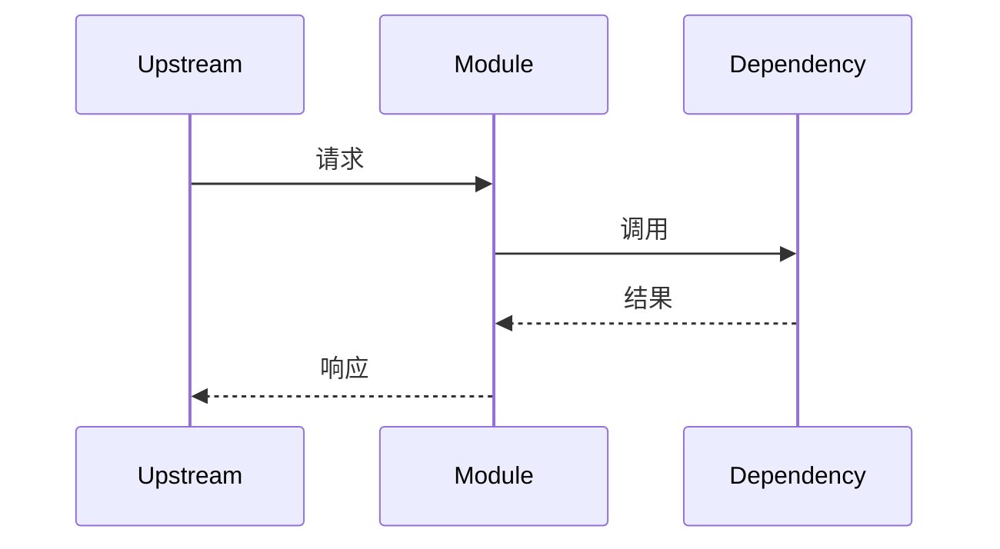
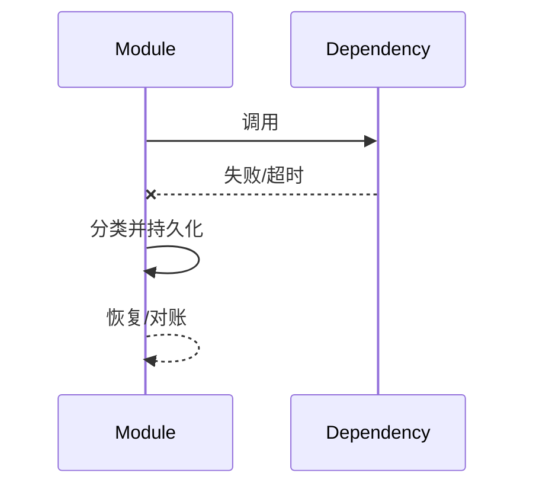

# 模块设计文档模板

> 使用范围：`src/harnessix/<package>/`当前实现的单一事实源。填写时删除本提示，并遵循[文档工程规范](../documentation-standard.md)。

## 1. 模块摘要

| 项目 | 内容 |
|---|---|
| 源码包 | 待填写 |
| 当前职责 | 待填写 |
| 非职责 | 待填写 |
| 上游调用者 | 待填写 |
| 下游端口 | 待填写 |
| 代码版本 | 待填写 |

## 2. 需求背景、目标与非目标

说明模块存在的原因、生产约束、目标及明确排除项。

## 3. 模块上下文与边界



逐条解释允许依赖、禁止旁路、数据所有权和生命周期。

## 4. 包结构与阅读顺序

| 顺序 | 文件/目录链接 | 关键符号 | 阅读目的 |
|---|---|---|---|
| 1 | 待填写 | 待填写 | 待填写 |

## 5. 核心流程

### 5.1 正常时序



### 5.2 失败与恢复时序



文字说明取消、超时、异常退出、重试耗尽和未知结果。

## 6. 状态、数据流与持久化

如有状态，提供状态图和转换表；如无持久状态，说明状态所有者位于何处。说明输入、派生数据、持久化和对外输出的流向。

## 7. 类、接口与数据结构

### 7.1 重点类/函数

| 符号 | 职责 | 输入/输出 | 不变量 | 副作用 | 错误/取消 |
|---|---|---|---|---|---|
| 待填写 | 待填写 | 待填写 | 待填写 | 待填写 | 待填写 |

### 7.2 接口

| 端口/方法 | 调用者/实现者 | 契约 | 超时/重试 | 幂等/顺序 | 权限 |
|---|---|---|---|---|---|
| 待填写 | 待填写 | 待填写 | 待填写 | 待填写 | 待填写 |

### 7.3 重点字段

| 结构/字段 | 类型 | 来源 | 语义与约束 | 持久化 | 兼容性 | 敏感级别 |
|---|---|---|---|---|---|---|
| 待填写 | 待填写 | 待填写 | 待填写 | 待填写 | 待填写 | 待填写 |

## 8. 核心业务逻辑伪代码

```text
receive(input)
validate_and_authorize(input)
load_authoritative_state()
apply_state_transition()
persist_before_side_effect_or_publish()
handle_failure_and_recovery()
```

## 9. 失败、安全与可观测性

| 场景 | 错误/状态 | 恢复 | 安全控制 | Trace/Metric/Log |
|---|---|---|---|---|
| 待填写 | 待填写 | 待填写 | 待填写 | 待填写 |

## 10. 源码与测试映射

| 设计元素 | 源码文件链接 | 关键符号 | 测试文件链接 | 测试符号 |
|---|---|---|---|---|
| 待填写 | 待填写 | 待填写 | 待填写 | 待填写 |

## 11. 验收标准与已知限制

列出可执行验收标准、未覆盖平台/场景、技术债和后续里程碑。

## 12. 变更记录

| 文档版本 | 代码版本 | 日期 | 变更摘要 |
|---|---|---|---|
| 1 | 待填写 | YYYY-MM-DD | 初版 |
