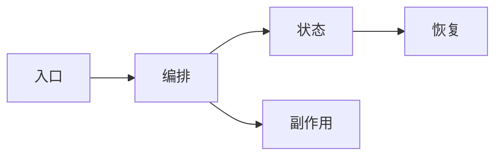

# 源码研究与阅读指南模板

> 使用范围：研究参考项目或解释Harnessix复杂源码主链。外部研究必须固定仓库、提交/产品版本、许可证和访问日期。

## 1. 研究问题与边界

| 项目 | 内容 |
|---|---|
| 要回答的问题 | 待填写 |
| 包含范围 | 待填写 |
| 排除范围 | 待填写 |
| 参考仓库/版本 | 待填写 |
| 访问日期 | YYYY-MM-DD |
| 许可证/复用边界 | 待填写 |

## 2. 结论摘要

区分：源码事实、行为验证、合理推断和Harnessix独立决策。不得把推断写成源码事实。

## 3. 系统上下文与调用链

逐箭头给出文件、符号、调用条件和失败返回。

## 4. 推荐阅读顺序

| 顺序 | 文件永久链接/相对链接 | 关键符号 | 阅读问题 | 前置知识 |
|---|---|---|---|---|
| 1 | 待填写 | 待填写 | 待填写 | 待填写 |

## 5. 正常与失败时序

至少覆盖正常完成、取消/超时和崩溃/恢复；产品行为不可见源码时明确标记为行为观察。

## 6. 状态、接口与数据结构

| 类型 | 名称/符号 | 关键字段或状态 | 不变量 | 来源链接 |
|---|---|---|---|---|
| 待填写 | 待填写 | 待填写 | 待填写 | 待填写 |

## 7. 核心逻辑伪代码

使用跨函数伪代码表达关键分支，并映射回源码符号。

## 8. 失败语义、安全和可观测性

记录错误分类、取消传播、重试、防重复、Secret/权限边界以及可观测事实。未找到证据时明确写“未求证”，不得猜测。

## 9. Harnessix差距与独立决策

| 主题 | 参考实现事实 | Harnessix当前实现 | 差距 | 采用/不采用及理由 | 进入的ADR/设计 |
|---|---|---|---|---|---|
| 待填写 | 待填写 | 待填写 | 待填写 | 待填写 | 待填写 |

## 10. 验证记录

列出运行命令、测试、样本、环境限制和结果；不得记录Secret或不可公开的本机路径。

## 11. 未决问题

只保留确实未求证的问题，并给出下一步证据来源。
