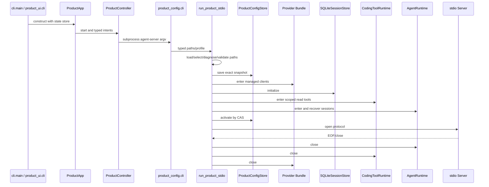
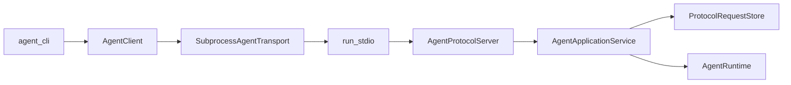
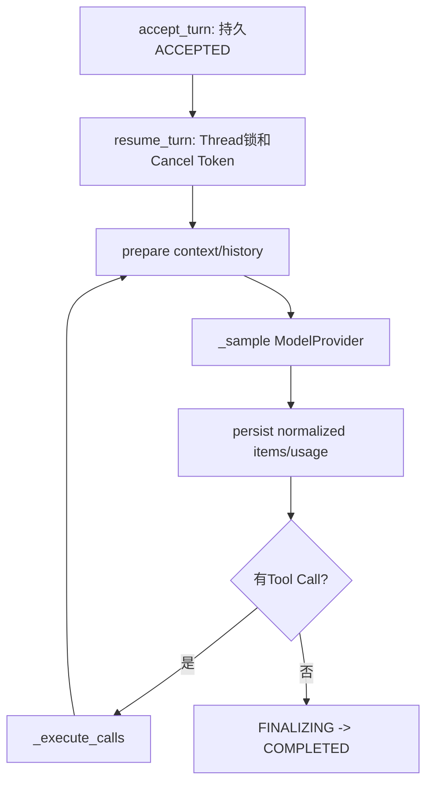
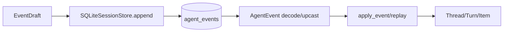
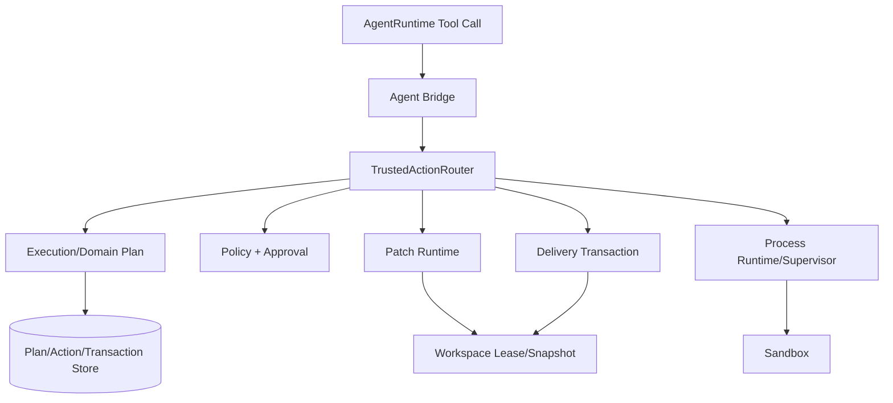
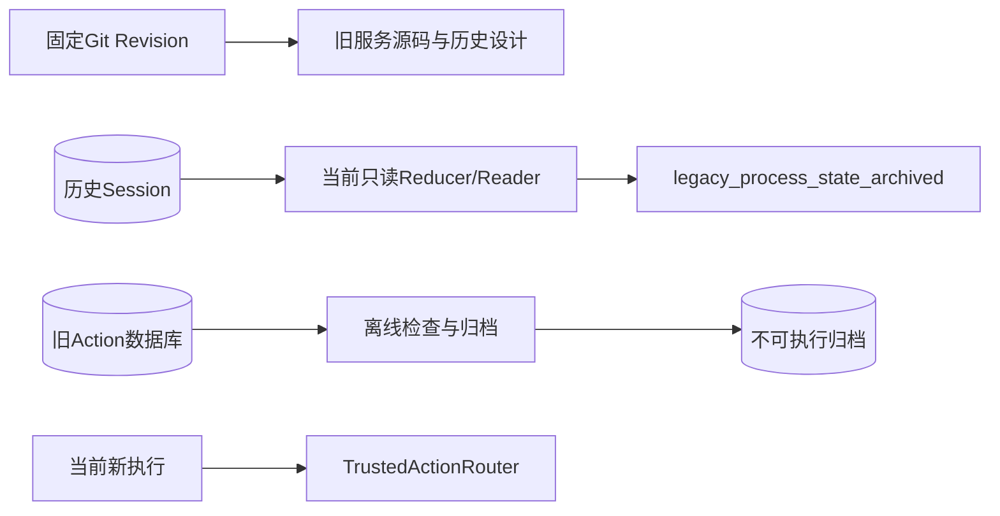

# Harnessix Code 源码阅读地图

## 1. 阅读目标

本文把产品入口、Agent Loop、可信执行和历史兼容边界还原为可跟踪的源码调用链。读者应先理解稳定契约和持久事实，再进入具体Provider、数据库或平台实现，避免从最大文件随机阅读。

阅读完成后应能回答：

1. `harnessix code`如何装配Textual、Controller和`agent-server`并完成协议握手；
2. `turn/start`为什么先返回`ACCEPTED`再执行模型；
3. Thread、Turn、Item和Event如何通过Reducer重建；
4. Model、Context、Tool、Approval和Session的边界在哪里；
5. 写文件、启动进程和交付为何不能直接复用只读Tool路径；
6. 崩溃、取消、超时和外部效果不确定时由谁决定下一步；
7. 旧Action Plane为何被物理删除、哪些历史数据仍只读兼容；
8. 26个生产包各自从哪里开始读、用哪些测试验证。

## 2. 阅读前提与事实边界

- 本文对应已关闭的0.9.1f3架构收敛：独立Action HTTP/Worker源码已删除，并由[CI 35453082992](https://github.com/carrie1988/Harnessix/actions/runs/35453082992)完成六实例全矩阵验收；
- Agent Protocol当前为`1.0`；Agent Event当前为`schema_version=20`；Session迁移当前到25；
- 默认`agent-server`装配Provider、Session、协议服务、只读`CodingToolRuntime`及POSIX能力证明后的`apply_patch_batch`；
- Patch、Process、Sandbox、Delivery、MCP、Skill、Hook和Trusted Action已实现为可组合库，但不是默认产品能力；
- Windows默认产品已装配原生List/Read/Glob/Grep安全端口并明确省略Patch；Git、写入和Process仍未进入默认能力；
- [总体架构](../architecture.md)是系统事实入口，[里程碑设计](../README.md#4-里程碑设计)只解释历史增量。

## 3. 仓库地图

```text
src/harnessix/
├── cli.py, __main__.py, agent_cli.py      # 顶层命令与协议薄客户端
├── product_config/, product_ui/           # 配置、能力证明、TUI和产品组合根
├── app_server/, protocol/, sdk/           # Headless服务、协议与Agent客户端
├── agent/, session/, models/, context/    # Agent内核、持久会话与模型上下文
├── tools/, artifacts/                     # 只读工具和有界证据
├── execution/, trusted_actions/           # 持久计划与统一高风险Action
├── patches/, processes/, sandbox/         # Patch、进程监督与隔离
├── workspace/, delivery/                  # 路径/租约与事务性交付
├── mcp/, skills/, hooks/                   # 显式扩展能力
├── evals/, smoke/                         # 评测与真实Provider验证
├── observability/, secrets/, domain/      # 横切能力和共享合同
└── file_lock.py, licensing.py             # 基础设施
```

测试目录基本按生产包镜像组织。遇到复杂实现时，先找同名测试文件中的最小成功路径，再找`crash/recovery/boundaries`测试理解失败语义。

## 4. 产品启动与装配主链

### 4.1 推荐顺序

1. [pyproject.toml](../../pyproject.toml)：确认控制台入口是`harnessix.cli:main`；
2. [src/harnessix/__main__.py](../../src/harnessix/__main__.py)：确认`python -m harnessix`只委托顶层CLI；
3. [src/harnessix/cli.py](../../src/harnessix/cli.py)：读`_parser`、`_delegate_special_command`和`main`的子命令分派；
4. [src/harnessix/product_ui/cli.py](../../src/harnessix/product_ui/cli.py)：追踪Workspace、配置/状态默认值、当前解释器子进程argv和TUI延迟导入；
5. [src/harnessix/product_ui/app.py](../../src/harnessix/product_ui/app.py)：理解Textual事件如何只产生类型化Intent；
6. [src/harnessix/product_ui/controller.py](../../src/harnessix/product_ui/controller.py)：理解单Actor、轮询、快照和有界关闭；
7. [src/harnessix/product_config/cli.py](../../src/harnessix/product_config/cli.py)：读子进程`agent_server_main`如何解析产品参数；
8. [src/harnessix/product_config/server.py](../../src/harnessix/product_config/server.py)：逐行跟踪`run_product_stdio`及默认Patch状态Owner；
9. [src/harnessix/product_config/action_composition.py](../../src/harnessix/product_config/action_composition.py)与[action_runtime.py](../../src/harnessix/product_config/action_runtime.py)：理解POSIX能力证明、Catalog、Router与Store生命周期；
10. [src/harnessix/product_config/workspace_patch_review.py](../../src/harnessix/product_config/workspace_patch_review.py)：理解Delivery计划、完整Diff和Review Artifact；
11. [Product Config模块设计](../modules/product-config.md)：理解双摘要、严格合同、迁移、审计和零暴露Fallback；
12. [tests/product_ui/test_stdio_product.py](../../tests/product_ui/test_stdio_product.py)：从真实JSONL子进程关闭、重开和完整Replay反证产品链；
13. [tests/product_config/test_server_and_cli.py](../../tests/product_config/test_server_and_cli.py)：从启动成功、失败关闭、路径隔离和生命周期测试反证组合根。

### 4.2 调用链



### 4.3 阅读检查点

- 配置为什么必须先迁移到v2；
- 配置文件、状态目录和Workspace为什么不能重叠；
- 为什么Provider必须先进入生命周期，活动配置却在全部组件就绪后才CAS发布；
- `create_secure_workspace_reader`如何在POSIX FD与Windows原生Handle之间选择只读端口，并使未证明能力失败关闭；
- 为什么Patch必须同时通过平台能力、Catalog Binding、Router、Review、Delivery和Lease，且Windows必须省略；
- 当前装配代码仍没有哪些Process/Sandbox与启动恢复构造参数，因此哪些库能力实际上未开放。

### 4.4 可恢复终端产品链

0.9.1a建立客户端恢复内核，0.9.1b在其上加入Textual、Controller和正式`harnessix code`入口：

1. [Product UI终端产品模块设计](../modules/product-ui.md)：先理解View、Controller、Session与服务端事实的分界；
2. [product_ui/contracts.py](../../src/harnessix/product_ui/contracts.py)：读取Client State字段、摘要和Command ID规则；
3. [product_ui/state_store.py](../../src/harnessix/product_ui/state_store.py)：追踪锁、重读、原子替换和单调Cursor；
4. [product_ui/projection.py](../../src/harnessix/product_ui/projection.py)：对照Replay重叠、Delta Gap和终态覆盖；
5. [product_ui/session.py](../../src/harnessix/product_ui/session.py)：追踪Generation、冷启动从0和暖重连续传；
6. [product_ui/controller.py](../../src/harnessix/product_ui/controller.py)：检查五类Intent、Actor循环、活动/空闲轮询和关闭报告；
7. [product_ui/rendering.py](../../src/harnessix/product_ui/rendering.py)：检查持久Item、临时流、Gap和标签的框架中立转换；
8. [product_ui/app.py](../../src/harnessix/product_ui/app.py)：检查Widget不接触SDK、Composer防重与Textual卸载关闭；
9. [product_ui/cli.py](../../src/harnessix/product_ui/cli.py)：检查用户级状态布局和固定`agent-server`命令；
10. [tests/product_ui](../../tests/product_ui/)：从权限、崩溃、取消、关闭、无头UI和真实子进程恢复反证设计。

关键检查点：Client State为何不保存Transcript；已保存Cursor为何不能作为冷启动Replay起点；Prepared Command为何在
连接失败后复用原ID；Reducer为何先产出候选视图、Cursor落盘成功后才发布到Session内存；调用者取消等待为何不取消
已接纳Intent；关闭超时为何必须报告未知而不能回退Command序列。

## 5. Coding Turn主链

### 5.1 从客户端到应用服务

先通读[Protocol模块设计](../modules/protocol.md)、[App Server模块设计](../modules/app-server.md)和
[SDK模块设计](../modules/sdk.md)，建立线上合同、连接状态、客户端传输、应用编排与领域事实的分层，
再按以下顺序进入源码：

按以下顺序阅读：

1. [agent_cli.py](../../src/harnessix/agent_cli.py)：薄CLI只解析命令并调用SDK；
2. [sdk/agent_client.py](../../src/harnessix/sdk/agent_client.py)：`SubprocessAgentTransport`、`AgentClient.initialize`、Thread/Turn方法和事件消费；
3. [protocol/contracts.py](../../src/harnessix/protocol/contracts.py)：协议版本、请求、结果和通知Schema；
4. [protocol/codec.py](../../src/harnessix/protocol/codec.py)：JSONL/JSON-RPC帧的解码边界；
5. [app_server/stdio.py](../../src/harnessix/app_server/stdio.py)：有界pending、outbox、Writer和关闭；
6. [app_server/server.py](../../src/harnessix/app_server/server.py)：连接状态机、`initialize`和方法路由；
7. [app_server/service.py](../../src/harnessix/app_server/service.py)：`_command`、`start_turn`、`_spawn`和事件读取；
8. [protocol/requests.py](../../src/harnessix/protocol/requests.py)：`claim/complete/fail`如何把协议重试变成持久幂等。



先运行或阅读[app server端到端测试](../../tests/app_server/test_server_sdk.py)，再阅读[协议请求测试](../../tests/protocol/test_requests.py)。重点观察：相同`request_id`如何重放结果，不同Payload为何报告`idempotency_conflict`。

### 5.2 从接受到完成

1. [agent/runtime.py](../../src/harnessix/agent/runtime.py) `accept_turn`：验证请求并持久化`ACCEPTED`；
2. 同文件`resume_turn`：获取Thread锁并创建Cancel Token；
3. 同文件`_drive`：Context、模型尝试、Tool执行和最终回答主循环；
4. 同文件`_sample`：消费规范化Provider事件；
5. 同文件`_execute_calls`：按效果类别和Provider顺序调度；
6. 同文件`_execute_tool`：分派只读Tool、Patch、Process、Question等专用端口；
7. [agent/execution.py](../../src/harnessix/agent/execution.py)：pending call、结果和执行辅助规则；
8. [agent/telemetry.py](../../src/harnessix/agent/telemetry.py)：Turn操作如何关联Trace与Metric。



建议先看[基础Runtime测试](../../tests/agent/test_runtime.py)，再看[多Tool调度测试](../../tests/agent/test_tool_scheduling.py)、[存储失败测试](../../tests/agent/test_storage_failures.py)和[模型尝试测试](../../tests/agent/test_model_attempts.py)。

### 5.3 关键不变量

- `start_turn`完成协议请求账本后才调用`_spawn`，所以`ACCEPTED`是恢复边界；
- 一个Thread同一时间只有一个活动Turn；
- 只读调用可有限并行，写调用串行，Tool Result按Provider顺序写入；
- 每个状态变化都由Event驱动，不能只改内存对象；
- Provider流失败、持久化失败和Tool失败是不同错误边界；
- 预算检查贯穿步骤、Token、时间、输出和单步调用数。

## 6. 领域事件、Reducer与Session

### 6.1 先契约、后实现

1. [agent/models.py](../../src/harnessix/agent/models.py)：先读`Budget`、`TurnStatus`、`ItemStatus`；
2. 同文件继续读`Thread`、`Turn`、`Item`与所有`EventDraft` Payload；
3. [agent/reducer.py](../../src/harnessix/agent/reducer.py)：读`apply_event`和`replay`；
4. [agent/turn_reducer.py](../../src/harnessix/agent/turn_reducer.py)与[item_reducer.py](../../src/harnessix/agent/item_reducer.py)：理解职责拆分；
5. [session/ports.py](../../src/harnessix/session/ports.py)：读`SessionStore`端口；
6. [session/sqlite.py](../../src/harnessix/session/sqlite.py)：读初始化、Migration、Owner、`append`、`fork`和`events`；
7. [session/migrations](../../src/harnessix/session/migrations/)：按版本查看数据库演化，不应反向推导当前领域语义。



### 6.2 用测试建立直觉

- [test_session_contract.py](../../tests/agent/test_session_contract.py)：内存/SQLite实现应遵守的共同合同；
- [test_store.py](../../tests/agent/test_store.py)：append、CAS、回放和并发；
- [test_session_upgrade.py](../../tests/agent/test_session_upgrade.py)：旧Schema升级；
- [test_wal_initialization.py](../../tests/agent/test_wal_initialization.py)：SQLite WAL初始化；
- [test_crash_recovery.py](../../tests/agent/test_crash_recovery.py)：活动Turn重开语义。

阅读时区分三类对象：`EventDraft`是待提交事实，`AgentEvent`是带序列号的已提交事实，`Thread/Turn/Item`是Reducer投影，不是另一份独立真相。

## 7. Model、Context、Tool与Artifact

### 7.1 Model Runtime

1. [models/contracts.py](../../src/harnessix/models/contracts.py)：`ModelRequest`、规范化`ProviderEvent`和`ModelProvider.stream`；
2. [models/config.py](../../src/harnessix/models/config.py)：Provider配置和Bundle选择；
3. [models/openai_chat.py](../../src/harnessix/models/openai_chat.py)与[models/anthropic.py](../../src/harnessix/models/anthropic.py)：外部协议适配器；
4. `_chat_mapping.py/_chat_stream.py`和`_anthropic_mapping.py/_anthropic_stream.py`：传输对象到规范化事件的映射；
5. [models/_history.py](../../src/harnessix/models/_history.py)：Provider中立历史如何变成具体请求；
6. [models/billing.py](../../src/harnessix/models/billing.py)、[pricing.py](../../src/harnessix/models/pricing.py)和[costs.py](../../src/harnessix/models/costs.py)：用量、价格事实和成本计算。

从[OpenAI合同测试](../../tests/models/test_openai_contract.py)和[Anthropic合同测试](../../tests/models/test_anthropic_contract.py)比较两个Provider，再看[尝试崩溃恢复](../../tests/models/test_attempt_crash_recovery.py)理解“请求是否已发出”与“结果是否已持久”的边界。

### 7.2 Context Runtime

1. [context/contracts.py](../../src/harnessix/context/contracts.py)：Fragment、预算和准备结果；
2. [context/ports.py](../../src/harnessix/context/ports.py)：Context Source端口；
3. [context/engine.py](../../src/harnessix/context/engine.py)：`ContextEngine`如何排序、裁剪和渲染；
4. [context/sources.py](../../src/harnessix/context/sources.py)：Workspace、Git等来源；
5. [context/compaction.py](../../src/harnessix/context/compaction.py)和[compaction_window.py](../../src/harnessix/context/compaction_window.py)：长会话压缩；
6. [context/tool_result_view.py](../../src/harnessix/context/tool_result_view.py)：大Tool结果如何进入上下文。

用[Context Engine测试](../../tests/context/test_engine.py)、[长会话恢复](../../tests/context/test_long_session_recovery.py)和[Compaction恢复](../../tests/context/test_compaction_runtime_recovery.py)核对正常与失败路径。

### 7.3 只读Coding Tool

1. [tools/contracts.py](../../src/harnessix/tools/contracts.py)：工具请求、结果和Scoped Runtime；
2. [tools/runtime.py](../../src/harnessix/tools/runtime.py)：`CodingToolRuntime`注册、生命周期和调用分派；
3. [tools/workspace.py](../../src/harnessix/tools/workspace.py)：Workspace Scope；
4. [tools/files.py](../../src/harnessix/tools/files.py)：安全读取；
5. [tools/search.py](../../src/harnessix/tools/search.py)和[patterns.py](../../src/harnessix/tools/patterns.py)：搜索与Pattern边界；
6. [tools/git.py](../../src/harnessix/tools/git.py)：固定可执行文件的只读Git查询。

先看[Kernel工具测试](../../tests/tools/test_kernel.py)，再看[边界测试](../../tests/tools/test_search_boundaries.py)、[恢复测试](../../tests/tools/test_recovery.py)和[Scope测试](../../tests/tools/test_scoped_runtime.py)。不要把`tools`包误解为完整Shell或文件写入层。

### 7.4 Artifact

1. [artifacts/contracts.py](../../src/harnessix/artifacts/contracts.py)与[ports.py](../../src/harnessix/artifacts/ports.py)：Artifact身份和读写端口；
2. [artifacts/sqlite.py](../../src/harnessix/artifacts/sqlite.py)：持久化与恢复；
3. [artifacts/batch_diff.py](../../src/harnessix/artifacts/batch_diff.py)和[action_output_store.py](../../src/harnessix/artifacts/action_output_store.py)：Patch与Trusted Process专用证据；
4. [processes/output_artifact.py](../../src/harnessix/processes/output_artifact.py)：仅用于读取历史`process_output`正文，不存在当前发布器；
5. [app_server/artifacts.py](../../src/harnessix/app_server/artifacts.py)：Thread授权下的协议分页读取。

测试从[Artifact合同](../../tests/artifacts/test_contracts.py)、[Store](../../tests/artifacts/test_store.py)、[恢复](../../tests/artifacts/test_recovery.py)到[SDK读取](../../tests/artifacts/test_sdk.py)依次阅读。

## 8. 可信写入、进程与交付主链

本节能力是“已实现/显式装配”，不是默认产品入口。阅读时始终问：计划在哪里持久化、审批绑定什么指纹、提交边界在哪里、崩溃后如何证明可重放。

### 8.1 总体关系



### 8.2 Patch

阅读顺序：

1. [patches/contracts.py](../../src/harnessix/patches/contracts.py)定义Patch输入、计划和结果；
2. [patches/planner.py](../../src/harnessix/patches/planner.py)生成稳定计划与指纹；
3. [patches/ledger.py](../../src/harnessix/patches/ledger.py)保存生命周期；
4. [patches/managed.py](../../src/harnessix/patches/managed.py)和[agent_bridge.py](../../src/harnessix/patches/agent_bridge.py)连接Agent；
5. Batch从[batch_contracts.py](../../src/harnessix/patches/batch_contracts.py)、[batches.py](../../src/harnessix/patches/batches.py)到[batch_execution.py](../../src/harnessix/patches/batch_execution.py)；
6. Diff展示从[diff_document.py](../../src/harnessix/patches/diff_document.py)进入Artifact或SDK。

关键测试：[边界](../../tests/patches/test_boundaries.py)、[审批取消](../../tests/patches/test_bridge_cancel.py)、[崩溃](../../tests/patches/test_bridge_crash.py)、[Kernel Patch](../../tests/patches/test_kernel_patch.py)和[Batch崩溃](../../tests/patches/test_batch_crash.py)。

### 8.3 Process与Sandbox

Process顺序：

1. [processes/contracts.py](../../src/harnessix/processes/contracts.py)；
2. [processes/runtime.py](../../src/harnessix/processes/runtime.py)；
3. [processes/supervision_planner.py](../../src/harnessix/processes/supervision_planner.py)和[supervision_store.py](../../src/harnessix/processes/supervision_store.py)；
4. [processes/supervisor.py](../../src/harnessix/processes/supervisor.py)；
5. POSIX读取[posix_owner.py](../../src/harnessix/processes/posix_owner.py)，Windows读取[windows_owner.py](../../src/harnessix/processes/windows_owner.py)、[windows_job.py](../../src/harnessix/processes/windows_job.py)和[windows_conpty.py](../../src/harnessix/processes/windows_conpty.py)；
6. [product_config/process_action.py](../../src/harnessix/product_config/process_action.py)把固定Profile装配为Trusted Action Definition/Executor；
7. [agent/trusted_action_runtime.py](../../src/harnessix/agent/trusted_action_runtime.py)负责Session与Router双账本编排。

Sandbox顺序：

1. [sandbox/contracts.py](../../src/harnessix/sandbox/contracts.py)；
2. [sandbox/capabilities.py](../../src/harnessix/sandbox/capabilities.py)探测宿主能力；
3. [sandbox/planner.py](../../src/harnessix/sandbox/planner.py)形成执行计划；
4. [sandbox/container.py](../../src/harnessix/sandbox/container.py)、[network_isolation.py](../../src/harnessix/sandbox/network_isolation.py)和[egress.py](../../src/harnessix/sandbox/egress.py)执行隔离策略；
5. [sandbox/store.py](../../src/harnessix/sandbox/store.py)保存Profile事实。

关键测试：[Process生命周期](../../tests/processes/test_lifecycle.py)、[Process崩溃边界](../../tests/processes/test_crash_boundary.py)、[Windows Supervisor](../../tests/processes/test_windows_supervisor.py)、[Sandbox能力](../../tests/sandbox/test_capabilities.py)和[网络隔离](../../tests/sandbox/test_network_isolation.py)。能力探测结果只是“可用能力”，不等于隔离已经强制生效。

### 8.4 Workspace与Delivery

1. [workspace/contracts.py](../../src/harnessix/workspace/contracts.py)：路径、Snapshot与Lease契约；
2. [workspace/paths.py](../../src/harnessix/workspace/paths.py)：跨平台路径身份；
3. [workspace/snapshot.py](../../src/harnessix/workspace/snapshot.py)：并发修改检测；
4. [workspace/leases.py](../../src/harnessix/workspace/leases.py)：单一写入所有者；
5. [delivery/contracts.py](../../src/harnessix/delivery/contracts.py)：事务记录；
6. [delivery/planner.py](../../src/harnessix/delivery/planner.py)：Prepared事务；
7. [delivery/store.py](../../src/harnessix/delivery/store.py)：计划和正文Blob；
8. [delivery/filesystem.py](../../src/harnessix/delivery/filesystem.py)：文件提交；
9. [delivery/trusted_action_contracts.py](../../src/harnessix/delivery/trusted_action_contracts.py)：默认Workspace Patch输入和Review JSONL合同；
10. [delivery/trusted_action.py](../../src/harnessix/delivery/trusted_action.py)：Action资源、事务同身份、Executor与Reconcile；
11. [product_config/workspace_patch_review.py](../../src/harnessix/product_config/workspace_patch_review.py)：Review Artifact编排；
12. [delivery/git.py](../../src/harnessix/delivery/git.py)与[git_push.py](../../src/harnessix/delivery/git_push.py)：Git交付。

关键测试：[路径](../../tests/workspace/test_paths.py)、[Snapshot](../../tests/workspace/test_snapshot.py)、[Lease](../../tests/workspace/test_leases.py)、[文件事务](../../tests/delivery/test_filesystem.py)、[默认Patch纵向链](../../tests/delivery/test_trusted_action_patch.py)、[Git](../../tests/delivery/test_git.py)和[Push](../../tests/delivery/test_git_push.py)。

### 8.5 Trusted Action与Execution Plan

1. [execution/contracts.py](../../src/harnessix/execution/contracts.py)和[planner.py](../../src/harnessix/execution/planner.py)：可持久执行计划；
2. [execution/store.py](../../src/harnessix/execution/store.py)：计划Store；
3. [trusted_actions/contracts.py](../../src/harnessix/trusted_actions/contracts.py)：统一工具绑定、计划和审计事件；
4. [trusted_actions/policy.py](../../src/harnessix/trusted_actions/policy.py)：可信执行策略；
5. [trusted_actions/router.py](../../src/harnessix/trusted_actions/router.py)：`plan → decide → execute/reconcile`；
6. [trusted_actions/agent_gateway.py](../../src/harnessix/trusted_actions/agent_gateway.py)：把Agent调用稳定映射到Router身份和状态；
7. [agent/trusted_action_contracts.py](../../src/harnessix/agent/trusted_action_contracts.py)与[trusted_action_runtime.py](../../src/harnessix/agent/trusted_action_runtime.py)：Gateway端口和Session双账本编排；
8. [trusted_actions/store.py](../../src/harnessix/trusted_actions/store.py)：路由事实；
9. [product_config/action_composition.py](../../src/harnessix/product_config/action_composition.py)：默认POSIX Patch的能力报告、目录和环境；
10. `ExtensionActionPort`：MCP/Skill/Hook只能看到的受限能力面。

对应[Execution Plan测试](../../tests/execution/test_plans.py)、[Store测试](../../tests/execution/test_store.py)、[Agent Gateway测试](../../tests/trusted_actions/test_agent_gateway.py)、[Agent集成恢复测试](../../tests/agent/test_trusted_action_runtime.py)、[默认Patch纵向测试](../../tests/delivery/test_trusted_action_patch.py)和[Trusted Action Router测试](../../tests/trusted_actions/test_router.py)。

## 9. 已删除Action Plane的历史阅读与兼容边界

独立Action HTTP API、Worker Queue、Effect Journal、Policy、样例Executor、HTTP SDK和LangGraph Adapter已经从当前
源码树删除。需要研究原始设计时，使用固定Revision
[`3f37fe8`](https://github.com/carrie1988/Harnessix/tree/3f37fe8ae0646d3327254ce9677110b94f7c5e80)及
[Action Plane历史设计](../subsystems/action-plane.md)，不要从当前`domain`或`processes`包推断旧服务仍可运行。

当前只保留两类兼容能力：

1. [agent/runtime.py](../../src/harnessix/agent/runtime.py)和
   [runtime_configuration.py](../../src/harnessix/agent/runtime_configuration.py)可读取历史Process等待状态；启动不改写，
   批准或恢复固定返回`legacy_process_state_archived`；
2. [artifacts/sqlite.py](../../src/harnessix/artifacts/sqlite.py)与
   [processes/output_artifact.py](../../src/harnessix/processes/output_artifact.py)可验证历史`process_output`正文；
   当前运行只发布`action_output`。

对应测试是[历史Process Session兼容](../../tests/agent/test_legacy_process_compatibility.py)、
[Session升级](../../tests/agent/test_process_session_upgrade.py)和[旧库归档](../../tests/governance/test_legacy_action_archive.py)。
旧SQLite/PostgreSQL Journal只按[归档手册](../operations/legacy-action-archive.md)离线保存，不进入产品Runtime。



## 10. 扩展、适配和评测

### 10.1 MCP

先通读[MCP模块设计](../modules/mcp.md)，区分当前显式库能力、默认产品尚未装配和远端HTTP目标。再依次阅读[MCP契约](../../src/harnessix/mcp/contracts.py)、[Schema转换](../../src/harnessix/mcp/schema.py)、[目录Store](../../src/harnessix/mcp/store.py)、[客户端Runtime](../../src/harnessix/mcp/runtime.py)、[stdio Server](../../src/harnessix/mcp/server.py)和[统一Action绑定](../../src/harnessix/mcp/actions.py)。用[Schema测试](../../tests/mcp/test_schema.py)、[stdio故障测试](../../tests/mcp/test_stdio_faults.py)和[Runtime Action测试](../../tests/mcp/test_runtime_actions.py)核对不可信边界。

### 10.2 Skill

先通读[Skill模块设计](../modules/skills.md)，明确Skill是不可信、不可执行内容包，默认产品也尚未装配。
再按[contracts.py](../../src/harnessix/skills/contracts.py) →
[runtime.py](../../src/harnessix/skills/runtime.py) →
[workspace/snapshot.py](../../src/harnessix/workspace/snapshot.py)的`SecureWorkspaceReader` →
[store.py](../../src/harnessix/skills/store.py) →
[actions.py](../../src/harnessix/skills/actions.py)顺序阅读。重点跟踪Root身份、Manifest/Catalog摘要、
跨来源冲突、正文/资源重核、访问事件先于Secret Guard提交的窗口，以及Router不能原子替换旧Definition的限制。
用[Skill Runtime](../../tests/skills/test_runtime.py)和[Skill Schema](../../tests/skills/test_schemas.py)核对现有证明，
同时对照模块设计中的未覆盖测试清单，不能把14个测试解释为产品完成。

### 10.3 Hook

先通读[Hook模块设计](../modules/hooks.md)，明确当前能力是受信宿主显式装配的声明式生命周期绑定，默认产品尚未接线。
再按[contracts.py](../../src/harnessix/hooks/contracts.py) → [store.py](../../src/harnessix/hooks/store.py) →
[runtime.py](../../src/harnessix/hooks/runtime.py)阅读，并用[Hook Runtime](../../tests/hooks/test_runtime.py)和
[Hook Schema](../../tests/hooks/test_schemas.py)验证。重点跟踪Definition/Grant/Registry、Matcher、确定Run、Hook与Action
双账本、Action执行Timeout和Interrupted恢复。Hook Executor是宿主预注册的受信代码，`READ_ONLY`是Binding声明而非
静态副作用证明；Hook `allow`也不产生目标Action授权。

### 10.4 外部框架集成边界

旧LangGraph/LangChain `StructuredTool` Adapter已随Action HTTP Client删除。当前唯一公共程序化入口是
[Agent Protocol](../modules/protocol.md)和[Agent Python SDK](../modules/sdk.md)。外部框架需要持有Thread/Turn，
通过`AgentClient`发送消息、审批、问题回答、取消和Artifact读取；不得绕过Agent Runtime直接构造Trusted Action。
远程或多租户集成不属于1.0范围。

### 10.5 Eval与Smoke

- Eval契约从[evals/contracts.py](../../src/harnessix/evals/contracts.py)开始；
- 单任务执行读[runner.py](../../src/harnessix/evals/runner.py)和[grader.py](../../src/harnessix/evals/grader.py)；
- Campaign读[campaign_contracts.py](../../src/harnessix/evals/campaign_contracts.py)、[campaign.py](../../src/harnessix/evals/campaign.py)和[campaign_execution.py](../../src/harnessix/evals/campaign_execution.py)；
- 报告读[report.py](../../src/harnessix/evals/report.py)；
- 真实Provider最小验证读[smoke/contracts.py](../../src/harnessix/smoke/contracts.py)和[smoke/runner.py](../../src/harnessix/smoke/runner.py)。

对应测试入口为[tests/evals](../../tests/evals/)和[tests/smoke](../../tests/smoke/)。Smoke默认不应联网，必须显式启用并受预算约束。

## 11. 横切能力

### 11.1 Secret

[secrets/provider.py](../../src/harnessix/secrets/provider.py)解析引用，[guard.py](../../src/harnessix/secrets/guard.py)控制使用点，[redaction.py](../../src/harnessix/secrets/redaction.py)负责脱敏。用[Secret Provider测试](../../tests/secrets/test_provider.py)理解“配置存引用、运行时短暂解析、持久事实不存正文”。

### 11.2 Observability

[observability/core.py](../../src/harnessix/observability/core.py)定义门面，[logging.py](../../src/harnessix/observability/logging.py)配置结构化日志，[opentelemetry.py](../../src/harnessix/observability/opentelemetry.py)连接OTel。再看[单元测试](../../tests/unit/test_observability_core.py)、[Agent遥测测试](../../tests/agent/test_telemetry.py)和[OTLP导出测试](../../tests/integration/test_otlp_export.py)。

### 11.3 基础根模块

- [__main__.py](../../src/harnessix/__main__.py)：`python -m harnessix`入口；
- [cli.py](../../src/harnessix/cli.py)：Coding Agent命令分派；
- [agent_cli.py](../../src/harnessix/agent_cli.py)：薄Agent Protocol客户端；
- [file_lock.py](../../src/harnessix/file_lock.py)：跨平台本地文件锁；
- [licensing.py](../../src/harnessix/licensing.py)：许可信息输出；
- [__init__.py](../../src/harnessix/__init__.py)：空公共导出面，防止重新暴露第二套SDK。

这些模块不应承载Agent Loop或副作用业务逻辑。

## 12. 26个生产包快速索引

| 包 | 第一阅读文件 | 核心问题 | 测试入口 |
|---|---|---|---|
| [agent](../../src/harnessix/agent/) | `models.py`、`runtime.py` | Turn如何持久运行和恢复 | [agent](../../tests/agent/) |
| [app_server](../../src/harnessix/app_server/) | [server.py](../../src/harnessix/app_server/server.py)、[service.py](../../src/harnessix/app_server/service.py)；[模块设计](../modules/app-server.md) | 协议连接与应用命令如何分层 | [app_server](../../tests/app_server/) |
| [artifacts](../../src/harnessix/artifacts/) | `contracts.py`、`sqlite.py` | 大对象如何持久化并授权读取 | [artifacts](../../tests/artifacts/) |
| [context](../../src/harnessix/context/) | `contracts.py`、`engine.py` | Context如何预算和压缩 | [context](../../tests/context/) |
| [delivery](../../src/harnessix/delivery/) | `contracts.py`、`planner.py` | 文件/Git交付如何形成事务 | [delivery](../../tests/delivery/) |
| [domain](../../src/harnessix/domain/) | `models.py`、`errors.py` | 跨模块共享枚举和历史状态只读边界是什么 | [治理](../../tests/governance/test_product_runtime_convergence.py) |
| [evals](../../src/harnessix/evals/) | `contracts.py`、`runner.py` | 真实任务结果如何分级 | [evals](../../tests/evals/) |
| [execution](../../src/harnessix/execution/) | `contracts.py`、`planner.py` | 执行意图如何先持久化 | [execution](../../tests/execution/) |
| [hooks](../../src/harnessix/hooks/) | [`contracts.py`](../../src/harnessix/hooks/contracts.py)、[`store.py`](../../src/harnessix/hooks/store.py)、[`runtime.py`](../../src/harnessix/hooks/runtime.py)；[模块设计](../modules/hooks.md) | Definition/Grant、Matcher、状态、双账本和恢复如何约束Hook执行 | [hooks](../../tests/hooks/) |
| [mcp](../../src/harnessix/mcp/) | [`contracts.py`](../../src/harnessix/mcp/contracts.py)、[`store.py`](../../src/harnessix/mcp/store.py)、[`runtime.py`](../../src/harnessix/mcp/runtime.py)、[`actions.py`](../../src/harnessix/mcp/actions.py)；[模块设计](../modules/mcp.md) | Target、目录、Schema、连接状态与Trusted Action如何共同约束MCP调用 | [mcp](../../tests/mcp/) |
| [models](../../src/harnessix/models/) | `contracts.py`、`config.py` | Provider如何被规范化 | [models](../../tests/models/) |
| [observability](../../src/harnessix/observability/) | `core.py` | 业务身份如何进入观测 | [integration](../../tests/integration/) |
| [patches](../../src/harnessix/patches/) | `contracts.py`、`planner.py` | Patch如何指纹、审批和恢复 | [patches](../../tests/patches/) |
| [processes](../../src/harnessix/processes/) | `contracts.py`、`runtime.py` | 进程如何拥有、监督和恢复 | [processes](../../tests/processes/) |
| [product_config](../../src/harnessix/product_config/) | [`contracts.py`](../../src/harnessix/product_config/contracts.py)、[`server.py`](../../src/harnessix/product_config/server.py)；[模块设计](../modules/product-config.md) | 产品如何诊断、迁移、审计并安全装配 | [product_config](../../tests/product_config/) |
| [product_ui](../../src/harnessix/product_ui/) | `contracts.py`、`controller.py` | TUI状态如何持久、投影和冷恢复 | [product_ui](../../tests/product_ui/) |
| [protocol](../../src/harnessix/protocol/) | `contracts.py`、`requests.py` | 版本、投影和命令幂等如何工作 | [protocol](../../tests/protocol/) |
| [sandbox](../../src/harnessix/sandbox/) | `contracts.py`、`planner.py` | 能力和强制隔离如何区分 | [sandbox](../../tests/sandbox/) |
| [sdk](../../src/harnessix/sdk/) | [agent_client.py](../../src/harnessix/sdk/agent_client.py)；[模块设计](../modules/sdk.md) | Agent双Transport如何处理并发、取消和错误 | [app_server](../../tests/app_server/) |
| [secrets](../../src/harnessix/secrets/) | `provider.py`、`redaction.py` | Secret如何不进入持久层 | [secrets](../../tests/secrets/) |
| [session](../../src/harnessix/session/) | `ports.py`、`sqlite.py` | Event如何CAS提交和重放 | [agent](../../tests/agent/) |
| [skills](../../src/harnessix/skills/) | `contracts.py`、`runtime.py` | Skill如何快照和渐进加载 | [skills](../../tests/skills/) |
| [smoke](../../src/harnessix/smoke/) | [Smoke模块设计](../modules/smoke.md)；`contracts.py → runner.py → cli.py` | 真实Provider验证如何显式启用、受预算约束、重开Replay并生成白名单报告 | [smoke](../../tests/smoke/) |
| [tools](../../src/harnessix/tools/) | `contracts.py`、`runtime.py` | 只读工具如何受Workspace约束 | [tools](../../tests/tools/) |
| [trusted_actions](../../src/harnessix/trusted_actions/) | `contracts.py`、`router.py` | 扩展如何被统一计划和审批 | [trusted_actions](../../tests/trusted_actions/) |
| [workspace](../../src/harnessix/workspace/) | `contracts.py`、`paths.py` | 路径、Snapshot与Lease如何建模 | [workspace](../../tests/workspace/) |

包的所有权、依赖方向和禁止旁路规则见[总体架构第16节](../architecture.md#16-源码包边界26个)，文档覆盖状态见[追踪矩阵](../governance/documentation-traceability.md)。

## 13. 根级模块快速索引

| 文件 | 阅读重点 | 归属测试 |
|---|---|---|
| [__init__.py](../../src/harnessix/__init__.py) | 公共导出，不从此推断内部架构 | Import/API合同相关测试 |
| [__main__.py](../../src/harnessix/__main__.py) | 委托`cli.main` | CLI测试 |
| [agent_cli.py](../../src/harnessix/agent_cli.py) | 薄交互层、无领域持久化 | [test_agent_cli.py](../../tests/app_server/test_agent_cli.py) |
| [cli.py](../../src/harnessix/cli.py) | Coding Agent子命令分派 | [test_cli.py](../../tests/smoke/test_cli.py) |
| [file_lock.py](../../src/harnessix/file_lock.py) | 本地锁的能力和限制 | [test_file_lock.py](../../tests/unit/test_file_lock.py) |
| [licensing.py](../../src/harnessix/licensing.py) | 许可提示事实 | [test_cli_license.py](../../tests/unit/test_cli_license.py) |

## 14. 五条故障导向阅读路线

### 14.1 “客户端重试后为什么没有创建两个Turn”

`AgentClient`请求ID → `AgentProtocolServer`路由 → `AgentApplicationService._command` → `SQLiteProtocolRequestStore.claim` → `AgentRuntime.accept_turn`。测试落点是[protocol request](../../tests/protocol/test_requests.py)和[server SDK](../../tests/app_server/test_server_sdk.py)。

### 14.2 “Server在返回ACCEPTED后立即崩溃会怎样”

`start_turn`持久结果 → `_spawn`尚未执行/执行中 → Runtime重新进入 → `SQLiteSessionStore`重放 → `AgentRuntime._recover`保留deferred `ACCEPTED` → 显式resume。测试落点是[Agent恢复](../../tests/agent/test_crash_recovery.py)和App Server恢复场景。

### 14.3 “审批对象被替换能否继续执行”

`ApprovalContent.request_fingerprint` → `approval/respond` → `AgentRuntime._reply_approval`同时校验ID与指纹 → 唯一决定写入同一Session事务。测试落点是[approvals](../../tests/agent/test_approvals.py)与[approval crash recovery](../../tests/agent/test_approval_crash_recovery.py)。

### 14.4 “Trusted Action执行完成但响应丢失会怎样”

`TrustedActionRouter.execute`先持久化`running`，Executor效果完成但终态响应丢失时Route进入`unknown`；重开后只能按
稳定资源身份调用`reconcile`，不得再次`execute`。测试落点是[Router响应丢失](../../tests/trusted_actions/test_router.py)、
[Git Push硬崩溃](../../tests/delivery/test_git_push.py)和[产品恢复](../../tests/product_config/test_action_runtime.py)。

### 14.5 “写文件后宿主崩溃能否自动重试”

先定位Patch/Delivery计划和Snapshot，再找提交边界与Ledger记录。如果外部效果不确定，不把普通异常当作“未执行”，而应观察Digest、Snapshot、Action/Transaction身份后对账。测试落点是[Patch崩溃](../../tests/patches/test_bridge_crash.py)、[Batch崩溃](../../tests/patches/test_batch_execution_crash.py)和[Delivery Store](../../tests/delivery/test_store.py)。

### 14.6 “Smoke通过能否证明费用、安全和全部Provider兼容”

从[Smoke模块设计](../modules/smoke.md)的Config、网络门禁和Report不变量开始，再追踪`provider_config → ModelProvider → AgentRuntime → SQLite → replay`。`passed`只证明当前固定场景的内容、次数、完整Usage和Replay；当前Config会跟随符号链接、允许任意合法HTTPS端点，且没有金额硬预算或认证矩阵。测试落点是[Smoke Runner](../../tests/smoke/test_runner.py)、[Smoke CLI](../../tests/smoke/test_cli.py)和[真实SIGINT](../../tests/smoke/test_interrupt.py)。

## 15. 建议的源码学习练习

1. **最小协议追踪**：从`turn/start`请求开始，记录每个函数、数据库表和Event；用`test_server_sdk.py`验证；
2. **Reducer重放**：手工构造ThreadCreated、TurnStarted、ItemStarted/Finished和TurnStateChanged，调用`replay`验证投影；
3. **多Tool顺序**：阅读`test_tool_scheduling.py`，解释并行执行与持久顺序为何可以同时成立；
4. **审批冲突**：定位重复相同决定和重复不同决定走向的不同分支；
5. **崩溃分类**：把`ACCEPTED/WAITING_APPROVAL/WAITING_ACTION/CALLING_MODEL`分别代入恢复协调器，并区分Session投影与Router副作用权威；
6. **Action恢复**：从Router的`running → unknown → reconcile`追踪到专用效果Owner，标记所有禁止重放点；
7. **产品能力核验**：只看`run_product_stdio`构造参数，列出默认开放和未开放工具，避免依据“仓库里有源码”做结论；
8. **跨平台核验**：对比`_require_coding_tool_platform`、Workspace Windows规则和Process Windows测试，解释底层支持与产品支持的差别。

每项练习都应输出“源码符号—持久事实—失败语义—验证测试”四列笔记，而不是只画调用关系。

## 16. 避免的阅读误区

- 不从旧ADR的版本号推断当前Schema；直接检查当前契约和Migration目录；
- 不把里程碑文档中的“已实现库”理解为默认产品已装配；
- 不从`__init__.py`导出推断完整内部依赖；
- 不把内存中的Thread对象当作持久真相；
- 不把能力探测通过当作Sandbox隔离已经强制；
- 不把Python支持Windows等同于`agent-server`已支持Windows；
- 不只看成功测试；崩溃、恢复、边界、取消和升级测试通常更接近生产语义；
- 不绕过协议或领域端口直接读写SQLite表来理解“业务捷径”。

## 17. 后续文档入口

- [总体架构](../architecture.md)：组件、状态、五条时序、数据与安全边界；
- [Protocol模块设计](../modules/protocol.md)、[App Server模块设计](../modules/app-server.md)、[SDK模块设计](../modules/sdk.md)、[MCP模块设计](../modules/mcp.md)、[Skill模块设计](../modules/skills.md)、[Hook模块设计](../modules/hooks.md)与[Smoke模块设计](../modules/smoke.md)：公共协议、连接、客户端传输、应用编排、扩展目录、调用、内容包、生命周期Hook、受控Provider验证和关闭的现行事实；
- [文档—源码—测试追踪矩阵](../governance/documentation-traceability.md)：每个包的当前资料和迁移目标；
- [Action Contract](../action-contract.md)与[Action生命周期](../action-lifecycle.md)：已退役Action Plane的冻结历史契约；当前执行治理见[Trusted Actions模块设计](../modules/trusted-actions.md)；
- [测试与Eval规范](../testing-and-evals.md)：测试分层和发布证据；
- [文档整改待办](../governance/documentation-remediation-backlog.md)：模块级黄金样例与后续迁移顺序。
