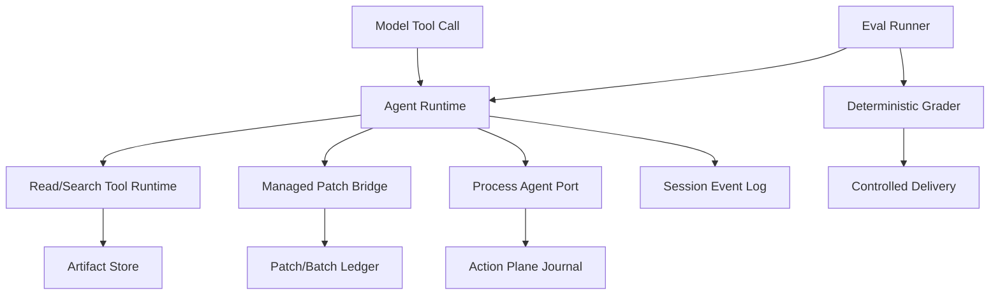

# Harnessix Code 0.5 Coding Tool Runtime里程碑索引

## 1. 文档定位

本文只索引0.5阶段从只读Workspace工具演进到受控变更交付的历史增量。完整当时设计、命令、测试数字和
逐分片结论冻结在[0.5完整里程碑历史](m05-coding-tools-milestone-history.md)。当前源码行为必须阅读对应
[模块详细设计](README.md#3-当前事实源)，不得从0.5“当时未实现”或“当时已完成”的文字推导当前产品能力。

## 2. 里程碑目标

0.5解决的核心问题是：模型如何在受限Workspace中获取可验证上下文，形成精确修改计划，在持久审批和副作用治理下
执行Patch/Process/Git，并以确定性检查和Eval证据判断交付质量。

0.5没有完成OS级Sandbox、统一Execution Plan、跨平台Process Owner、Workspace Transaction、Agent Protocol、产品配置、
完整TUI或发行物；这些分别在0.7、0.8和0.9继续演进。

## 3. 历史切片索引

| 切片 | 历史交付 | 完整记录 |
|---|---|---|
| 0.5.1 | Workspace绑定、`list_files`、`read_file`、分页Revision与路径安全 | [第12节](m05-coding-tools-milestone-history.md#12-051-当前交付与使用) |
| 0.5.2a | 有界`glob`与字面量`grep`，固定忽略和截断语义 | [第13节](m05-coding-tools-milestone-history.md#13-052a-当前交付与使用) |
| 0.5.2b1 | 显式可信执行Scope与旧端口兼容 | [第14节](m05-coding-tools-milestone-history.md#14-052b1-当前交付与使用) |
| 0.5.2b2 | Session内事务Artifact、分页、配额和回收 | [第15节](m05-coding-tools-milestone-history.md#15-052b2-当前交付与使用) |
| 0.5.3a | 只读Patch计划、Baseline与精确编辑复核 | [第16节](m05-coding-tools-milestone-history.md#16-053a-当前交付只读准备与复核) |
| 0.5.3b1 | 私有受管副本、单文件效果账本和宿主执行 | [第17节](m05-coding-tools-milestone-history.md#17-053b1-当前交付受管单文件执行) |
| 0.5.3b2 | 调用绑定桥接、Kernel审批、模型写工具与双账本恢复 | [第18～20节](m05-coding-tools-milestone-history.md#18-053b2a-当前交付宿主调用绑定桥接) |
| 0.5.3c | 批次计划、顺序部分效果、整组审批、Diff报告和Artifact | [第21～27节](m05-coding-tools-milestone-history.md#21-053c1-当前交付只读整组计划与结构化-diff) |
| 0.5.4a/b | 受信宿主Process、Action Plane准入、Agent/Process Saga与恢复 | [第28～36节](m05-coding-tools-milestone-history.md#28-054a受信宿主进程运行层) |
| 0.5.4c | 固定Git只读反馈和受控测试Profile | [第37节](m05-coding-tools-milestone-history.md#37-054cgit与受控测试反馈闭环) |
| 0.5.5a/b | Eval Task、物化、隐藏检查、正式Runtime和Grader | [第38～40节](m05-coding-tools-milestone-history.md#38-055acoding-eval任务证据与评分基线) |
| 0.5.5c | Campaign、预算、真实Provider基线和证据聚合 | [第41～49节](m05-coding-tools-milestone-history.md#41-055c1多试验计划与可重算质量成本证据) |
| 0.5.5d | 通过结果形成受控变更包并显式合入精确工作树 | [第50节](m05-coding-tools-milestone-history.md#50-055d受控变更包与显式工作树合入) |
| 0.5.6 | Tool能力、连续只读并发、写屏障和错误分类 | [第51节](m05-coding-tools-milestone-history.md#51-056tool-contract调度与错误语义收口) |

## 4. 当前事实源映射

| 0.5关注点 | 当前事实源 | 当前源码包 | 责任边界 |
|---|---|---|---|
| 文件、搜索和Git只读工具 | [Tools模块](modules/tools.md) | [`src/harnessix/tools`](../src/harnessix/tools/) | Workspace读取、Revision、范围、并发和错误 |
| 大对象和模型历史引用 | [Artifacts模块](modules/artifacts.md) | [`src/harnessix/artifacts`](../src/harnessix/artifacts/) | 原子发布、分页、完整性、TTL和访问范围 |
| Patch和批次 | [Patches模块](modules/patches.md) | [`src/harnessix/patches`](../src/harnessix/patches/) | 计划、受管副本、审批、效果、恢复和Diff |
| Process与测试Profile | [Processes模块](modules/processes.md) | [`src/harnessix/processes`](../src/harnessix/processes/) | 命令合同、Owner、Lease、PTY、输出和恢复 |
| Workspace安全 | [Workspace模块](modules/workspace.md) | [`src/harnessix/workspace`](../src/harnessix/workspace/) | 逻辑路径、对象Snapshot、Secure Reader和租约 |
| 执行准入 | [Execution模块](modules/execution.md) | [`src/harnessix/execution`](../src/harnessix/execution/) | 不可变计划、环境/Secret/Sandbox和审批绑定 |
| 统一Action路由 | [Trusted Actions模块](modules/trusted-actions.md) | [`src/harnessix/trusted_actions`](../src/harnessix/trusted_actions/) | Binding、资源、Policy、审计和Reconcile |
| 文件与Git交付 | [Delivery模块](modules/delivery.md) | [`src/harnessix/delivery`](../src/harnessix/delivery/) | Workspace Transaction、Git Commit和Push |
| Coding Eval | [Evals模块](modules/evals.md) | [`src/harnessix/evals`](../src/harnessix/evals/) | Task、物化、Agent Run、Grader、Campaign和成本 |
| 测试方法与证据 | [测试与Eval规范](testing-and-evals.md)、[验证证据索引](validation/README.md) | 跨模块 | 当前门禁、指标、证据生命周期与真实结果 |

## 5. 历史架构关系

该图是0.5结束时的职责关系，不是当前完整部署图。0.7后来引入Execution Plan、Sandbox、Secret、Workspace Transaction和
统一Trusted Action，0.8再引入Agent Protocol、App Server、SDK和扩展。

## 6. 核心历史决策

1. Tool能力由受信Registry声明，不由模型参数自报；
2. 文件结果必须带范围、Revision和截断信息，不能把部分读取表述为完整文件；
3. 写入先形成不可变计划和Baseline，再进行精确审批；
4. 受管副本效果不等于源Workspace发布，二者必须分离；
5. 批次按成员顺序执行，部分效果可恢复，但不宣称跨文件原子；
6. 任意Shell字符串不开放，命令必须来自结构化受信Profile；
7. Git/测试反馈按固定顺序进入模型，不允许模型伪造通过；
8. Eval失败区分Provider、Runtime、预算、Task、Grader和交付，不只记录成功率；
9. 真实Provider Campaign固定Task、模型、预算、尝试和脱敏证据；
10. 读取可在受信能力声明下有界并发，写入、审批和未知能力形成顺序屏障。

这些决策的长期状态以相关ADR和当前模块设计为准。

## 7. 失败与恢复演进

| 边界 | 0.5建立的历史语义 | 当前阅读入口 |
|---|---|---|
| 读取期间文件变化 | Revision或对象漂移拒绝 | [Tools](modules/tools.md)、[Workspace](modules/workspace.md) |
| Artifact发布中断 | 正文、Manifest和Session结果原子提交 | [Artifacts](modules/artifacts.md) |
| 单文件Patch结果丢失 | 观察Pre/Post与账本，不盲目重放 | [Patches](modules/patches.md) |
| 批次部分效果 | 保存成员游标与已知结果，恢复只核对 | [Patches](modules/patches.md) |
| Process宿主退出 | Action Journal为执行事实，Agent显式观察 | [Processes](modules/processes.md)、[Agent](modules/agent.md) |
| Eval中断 | Run/Campaign持久状态和预算决定是否继续 | [Evals](modules/evals.md) |
| 交付来源漂移 | 精确Source Commit、Clean Tree和计划摘要不匹配即拒绝 | [Delivery](modules/delivery.md) |

## 8. 当前与0.5结束状态的差异

- 当前默认`agent-server`仍只装配受限只读Coding Tool，不默认开放Patch、Process、Delivery、MCP或Git Push；
- 0.7已把0.5分散的执行准入提升为Execution Plan、Sandbox、Secret和统一Action Plane；
- 0.8已把Runtime开放为版本化stdio协议、SDK和薄CLI；
- Session Migration、事件版本和公开投影均已继续演进，0.5文档中的版本号只能用于历史升级验证；
- 0.5真实Eval只覆盖一个固定历史缺陷，不能代表当前产品在任意仓库的成功率；
- Windows底层能力后来增加，但当前产品Coding Tool入口仍失败关闭；
- 生产安装器、完整TUI、供应链、Soak和多仓库Eval仍未完成。

## 9. 历史验证入口

- [测试里程碑历史第14～53节](testing-and-evals-milestone-history.md#14-051-只读编码工具验收2026-09-03)；
- [真实Provider验证证据](validation/README.md)；
- [`tests/tools`](../tests/tools/)、[`tests/artifacts`](../tests/artifacts/)、[`tests/patches`](../tests/patches/)；
- [`tests/processes`](../tests/processes/)、[`tests/evals`](../tests/evals/)、[`tests/delivery`](../tests/delivery/)；
- 当前全量策略见[测试与Eval规范](testing-and-evals.md)。

历史测试数量只描述对应提交。当前版本必须重新执行`make spec`与`make check`。

## 10. 阅读规则

1. 需要理解当前源码时，从第4节模块设计进入，不从完整历史顺序阅读；
2. 需要追溯某个Schema、Migration或失败语义形成过程时，再进入第3节对应历史切片；
3. 需要判断产品默认是否装配某项能力时，读取[总体架构](architecture.md)和[部署与运维](deployment.md)；
4. 需要引用真实模型结果时，引用日期化验证证据，不引用里程碑中的摘要数字；
5. 新功能不得继续追加到本文或完整历史文件，而应创建重大变更设计并同步当前模块文档。
