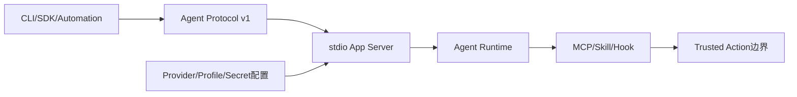
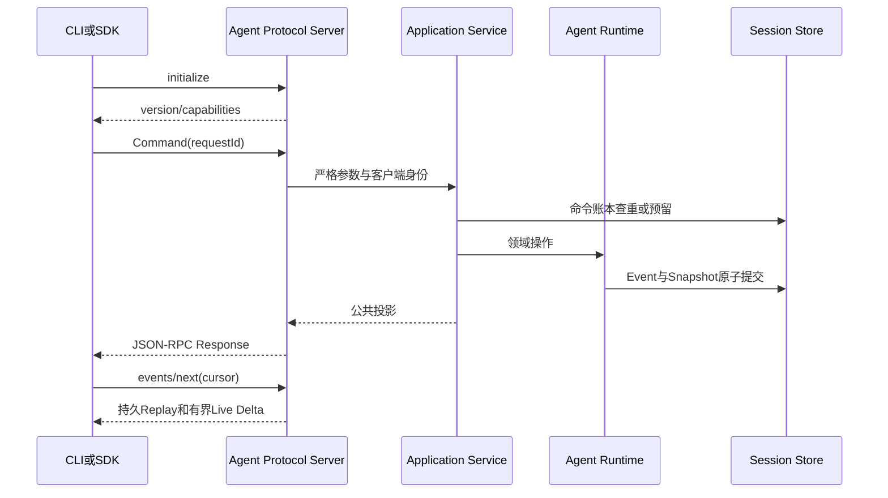

# Harnessix Code 0.8产品运行时与扩展里程碑索引

## 1. 文档定位

本文索引0.8阶段把Agent Runtime开放为本地产品协议并引入MCP、Skill、Hook和Provider配置的历史增量。完整当时设计、
状态表、命令和验收数字冻结在[0.8完整里程碑历史](m08-product-runtime-and-extensions-milestone-history.md)。
当前实现以Protocol、App Server、SDK、MCP、Skills、Hooks和Product Config模块设计为事实源。

## 2. 里程碑目标与边界

0.8的目标是让0.7可信执行能力可被薄客户端通过版本化本地协议使用，同时确保扩展不获得旁路执行权限。

0.8明确不包含完整TUI、网络Agent Server、IDE/Web、多租户控制面、安装器、签名制品、自动更新和规模化Eval。
扩展的实现存在不等于默认产品已经装配。

## 3. 历史切片索引

| 切片 | 历史交付 | 完整记录 |
|---|---|---|
| 0.8.1 | Agent Protocol v1、严格JSON-RPC帧、初始化协商、公共投影和命令幂等 | [第4节](m08-product-runtime-and-extensions-milestone-history.md#4-081-agent-protocol-v1详细设计) |
| 0.8.2 | stdio Headless App Server、应用服务、进程内/子进程Python SDK和断连恢复责任 | [第5节](m08-product-runtime-and-extensions-milestone-history.md#5-082-headless-app-server与agent-sdk详细设计) |
| 0.8.3 | 薄CLI、持久提问、审批、Steering、Pull-Live和Scoped Diff读取 | [第6节](m08-product-runtime-and-extensions-milestone-history.md#6-083-薄cli与双向交互详细设计) |
| 0.8.4 | MCP Client目录、连接状态、Schema绑定、Trusted Action与可选只读Server | [第7节](m08-product-runtime-and-extensions-milestone-history.md#7-084-mcp详细设计) |
| 0.8.5 | Skill Snapshot、渐进加载、Hook Definition/Grant、生命周期触发与双账本恢复 | [第8节](m08-product-runtime-and-extensions-milestone-history.md#8-085-skills与hooks详细设计) |
| 0.8.6 | Product Config v2、Profile、Secret引用、离线诊断、安全Fallback和产品启动装配 | [第9节](m08-product-runtime-and-extensions-milestone-history.md#9-086-provider与配置产品化详细设计) |

## 4. 当前事实源映射

| 0.8关注点 | 当前事实源 | 当前源码包 | 责任边界 |
|---|---|---|---|
| Agent Protocol | [Protocol模块](modules/protocol.md) | [`src/harnessix/protocol`](../src/harnessix/protocol/) | JSON-RPC合同、严格编解码、投影、Replay/Delta和请求账本 |
| App Server | [App Server模块](modules/app-server.md) | [`src/harnessix/app_server`](../src/harnessix/app_server/) | stdio连接、分派、应用服务、后台Turn和关闭 |
| Python SDK | [SDK模块](modules/sdk.md) | [`src/harnessix/sdk`](../src/harnessix/sdk/) | 进程内/子进程传输、响应归并、取消与重连 |
| 薄CLI | [App Server模块](modules/app-server.md)、[SDK模块](modules/sdk.md) | [`src/harnessix/agent_cli.py`](../src/harnessix/agent_cli.py) | 创建、运行、跟随、恢复、重试、交互和取消 |
| MCP | [MCP模块](modules/mcp.md) | [`src/harnessix/mcp`](../src/harnessix/mcp/) | Target、连接、目录、Schema、调用、UNKNOWN和Server |
| Skills | [Skills模块](modules/skills.md) | [`src/harnessix/skills`](../src/harnessix/skills/) | 来源、Catalog、渐进加载、资源安全和Action Gateway |
| Hooks | [Hooks模块](modules/hooks.md) | [`src/harnessix/hooks`](../src/harnessix/hooks/) | Definition、Grant、Matcher、Run、Action和恢复 |
| Provider配置 | [Product Config模块](modules/product-config.md)、[配置参考](operations/configuration.md) | [`src/harnessix/product_config`](../src/harnessix/product_config/) | 严格JSON、Secret、Profile、诊断、Fallback、Migration和启动 |
| Agent生命周期 | [Agent模块](modules/agent.md) | [`src/harnessix/agent`](../src/harnessix/agent/) | 持久提问、审批、Steering、取消、Retry和恢复 |
| 扩展执行权限 | [Trusted Actions模块](modules/trusted-actions.md) | [`src/harnessix/trusted_actions`](../src/harnessix/trusted_actions/) | 扩展统一Plan/Execute/Reconcile边界 |

## 5. 协议与产品主链

连接级JSON-RPC `id`只用于响应归并，持久`requestId`用于跨重连命令幂等。stdout只传协议帧；客户端断开不等于
取消Turn。持久事实通过Replay恢复，Live Delta出现Gap时回退读取完整Item。

## 6. 扩展安全边界

### 6.1 MCP

- Target、协议、环境、Sandbox和网络策略形成不可变身份；
- Tool目录与Schema摘要在调用前复核；
- Pre-send失败可确定失败，After-send不确定时进入`UNKNOWN`；
- stdio目标默认强Container与网络关闭；
- 远程HTTP/OAuth、自定义Header和公网Token生命周期未实现；
- 当前默认`agent-server`未装配MCP。

### 6.2 Skills

- Skill是不可执行内容包，不获得代码执行权限；
- Bundled/User/Workspace Root生成不可变Catalog，冲突要求限定名；
- 正文和资源按需安全读取并复核摘要；
- Workspace来源天然不受信，不能因“只是Markdown”绕过提示注入防御；
- 远程安装、自动更新和Marketplace未实现。

### 6.3 Hooks

- Hook只能引用宿主预注册Action，不能携带任意Shell；
- 非Bundled定义在Registry捕获时绑定Grant和摘要；
- `before_action`失败关闭，其他事件按Advisory策略记录；
- Hook Run和Trusted Action分别持久化，重启后保守恢复；
- 当前默认产品未接线Hook。

## 7. Product Config与Fallback历史决策

1. 配置使用严格JSON v2，拒绝未知字段、重复Key、非有限数和不安全文件；
2. Provider定义与Model Profile分离，Profile显式声明能力、Timeout、尝试和字节预算；
3. 配置只保存Secret名称、版本和环境变量映射，不保存Key；
4. `config diagnose`只做离线合同、依赖和Secret检查，不发网络请求；
5. v1→v2迁移使用源摘要CAS、备份和原子替换；
6. 活动配置通过配置审计库CAS切换；
7. Fallback只在零响应暴露、允许错误类别且审计成功时切换；
8. 任意文本、Tool Call或未来未知事件都关闭Fallback窗口。

当前完整字段和启动命令见[配置参考](operations/configuration.md)，历史0.8.6实现过程见
[完整历史第9节](m08-product-runtime-and-extensions-milestone-history.md#9-086-provider与配置产品化详细设计)。

## 8. 当前与0.8结束状态的差异

- 0.9.0已增加代码可读性、公共行为说明、复杂度和依赖门禁，不改变0.8协议行为；
- DOC-1已为Protocol、App Server、SDK、MCP、Skills、Hooks和Product Config建立独立现行模块设计；
- 当前部署资料已按安装、配置、升级、恢复、诊断和平台分层；
- 默认`agent-server`仍只装配Provider、Session、协议和只读Coding Tool，不装配MCP、Skill、Hook、Process或Delivery；
- Windows底层能力存在，但产品Coding Tool平台门仍拒绝Windows；
- HTTP Action API与stdio Agent Protocol仍是不同入口，没有统一网络产品服务；
- 完整TUI、安装器、供应链、远程扩展认证和长期Dogfooding仍属于0.9后续。

## 9. 失败与恢复索引

| 场景 | 历史语义 | 当前入口 |
|---|---|---|
| 重复命令/重连 | `clientInstanceId + requestId`返回同一结果，冲突载荷拒绝 | [Protocol](modules/protocol.md) |
| stdio断连 | 不等于取消；后台Turn继续，客户端恢复读取 | [App Server](modules/app-server.md)、[SDK](modules/sdk.md) |
| 提问/审批重启 | 请求与答复持久化，原身份和Deadline继续生效 | [Agent](modules/agent.md) |
| Live Delta丢失 | 报告`liveGap`并读取完整Item | [Protocol](modules/protocol.md) |
| MCP响应丢失 | After-send进入`UNKNOWN`，由Target专用Reconcile处理 | [MCP](modules/mcp.md) |
| Skill资源漂移 | 摘要或对象不符即拒绝，不发送变化后的正文 | [Skills](modules/skills.md) |
| Hook中断 | Blocking/Advisory按事件类型收敛，外部效果不盲目重放 | [Hooks](modules/hooks.md) |
| 配置激活冲突 | 新组件逆序关闭，不开放stdio，不覆盖活动指针 | [Product Config](modules/product-config.md) |

系统级恢复手册见[故障恢复](operations/recovery.md)。

## 10. 验证与证据入口

- [测试里程碑历史第73～78节](testing-and-evals-milestone-history.md#73-081-agent-protocol-v1候选验收2026-09-09)；
- [`tests/protocol`](../tests/protocol/)、[`tests/app_server`](../tests/app_server/)、[`tests/unit/test_sdk.py`](../tests/unit/test_sdk.py)；
- [`tests/mcp`](../tests/mcp/)、[`tests/skills`](../tests/skills/)、[`tests/hooks`](../tests/hooks/)；
- [`tests/product_config`](../tests/product_config/)；
- 当前跨模块策略见[测试与Eval规范](testing-and-evals.md)。

历史CI和测试数量只对当时提交成立。当前版本必须使用当前锁文件重新执行完整门禁。

## 11. 阅读规则

1. 理解当前代码从第4节模块设计进入；
2. 追溯某项协议或安全决策的形成过程，再进入第3节完整历史；
3. 判断默认产品能力时，读取[总体架构](architecture.md)和[部署与运维](deployment.md)；
4. 新的0.9产品实现使用重大变更设计，不继续追加本文；
5. ADR解释取舍，模块设计定义当前事实，验证证据记录固定环境结果，三者不得互相替代。
