# Adapter模块设计

## 1. 模块摘要

| 项目 | 内容 |
|---|---|
| 源码包 | [`src/harnessix/adapters`](../../src/harnessix/adapters/) |
| 当前实现 | 单个基于LangChain `StructuredTool`的Action Tool工厂，文件名为`langgraph.py` |
| 当前职责 | 把经`args_schema`验证的关键字参数映射为Harnessix `ActionRequest`，调用同步或异步Action Client，并把完整`ActionSnapshot`序列化为JSON字符串 |
| 非职责 | 不实现LangGraph Graph/State/Checkpoint/Interrupt/Command/ToolNode，不拥有Action状态机、Policy、Approval、Journal、Worker、Executor、Sandbox或Agent Loop |
| 直接上游 | LangChain Tool调用者；按类型设计可供LangGraph `ToolNode`消费，但仓库当前没有真实ToolNode验证 |
| 直接下游 | 满足`SyncActionClient`或`AsyncActionClient`结构协议的Client；默认可使用Action HTTP SDK |
| 公共入口 | `HarnessixToolContext`、`create_harnessix_tool`；仅能从`harnessix.adapters.langgraph`显式导入 |
| 外部依赖 | 可选Extra `langgraph`实际只安装`langchain-core>=1.0,<2`；锁定验证版本为1.6.1 |
| 持久化 | Adapter自身不持久化；Action事实由下游Journal保存，LangGraph Tool Call与Action ID之间没有绑定存储 |
| 代码版本 | `12f49ce60cbba09726f27ec2e9039c7c9159d67c` |
| 当前完成度 | 单次同步/异步Submit映射已实现；真实LangGraph图运行、恢复、审批中断、终态等待、身份注入、结果投影、安全预算和系统性测试未完成 |

本文是[`adapters/langgraph.py`](../../src/harnessix/adapters/langgraph.py)与
[`adapters/__init__.py`](../../src/harnessix/adapters/__init__.py)的现行事实源。Action状态、HTTP Client及下游
执行语义分别见[Action Plane子系统设计](../subsystems/action-plane.md)、[SDK模块设计](sdk.md)和
[API模块设计](api.md)。

## 2. 需求背景

Harnessix Action Plane需要允许LangGraph、其他Agent框架和普通业务代码复用同一Action Contract，而不是让每个
框架复制Policy、Approval、幂等、Effect Journal和`UNKNOWN`对账。当前Adapter以最小包装验证了这条依赖方向：
上游框架提供参数和调用上下文，Harnessix生成领域请求并把治理后的Snapshot返回上游。

该包装同时存在容易被名称掩盖的边界：

1. 文件名和Extra名使用`langgraph`，实际生产依赖及源码只引用`langchain-core`；
2. 返回值是标准`BaseTool`，但没有导入或启动LangGraph；
3. 当前唯一测试直接调用`tool.ainvoke`，没有构造Graph或`ToolNode`；
4. Adapter只提交一次，不等待Queued执行，不处理Approval Interrupt，不恢复断线调用；
5. LangChain Tool Call ID、Runnable Config和Checkpoint身份没有进入`ActionRequest`；
6. 完整Snapshot被作为Tool内容返回，LangChain层无法根据内部Action状态设置ToolMessage成功或失败；
7. Principal和Action Context在Tool构造时固定，不能安全支持共享Tool实例上的动态多租户调用。

因此当前模块应定义为“LangChain StructuredTool到Action Plane的薄适配”，不能宣称为生产级LangGraph持久集成。

## 3. 当前能力、兼容意图与规划能力

| 层级 | 能力 | 结论 |
|---|---|---|
| 当前已实现 | Pydantic参数Schema、Tool名称归一化、同步/异步Submit、Action请求映射、JSON Snapshot返回 | 可由源码和单元测试证明 |
| 当前外部库行为 | 带Tool Call ID调用时，LangChain Core 1.6.1把字符串包装为`ToolMessage`；Sync-only Tool的`ainvoke`转线程执行 | 由锁定依赖和受控探针证明，不是Harnessix稳定合同 |
| 类型兼容意图 | 返回`BaseTool`，理论上可被接受LangChain Tool的LangGraph组件消费 | 尚无真实`langgraph`依赖或图执行证据 |
| 未实现 | Graph State、Checkpoint、Interrupt、Command、动态Config注入、Tool Call恢复绑定、流式进度 | 不能作为当前能力 |
| 未实现 | OpenAI Agents SDK、Claude Agent SDK或其他Framework Adapter | 只有架构扩展方向，没有源码 |
| 未实现 | 公网多租户认证、可信Principal构造、跨租户授权 | 必须由后续身份边界和Journal查询共同实现 |

## 4. 设计目标、非目标与不变量

### 4.1 当前设计目标

1. 上游参数只通过一个`ActionRequest`进入Action Plane；
2. Adapter不复制Action状态转换、风险分类或审批规则；
3. 调用者可选择同步Client、异步Client或同时提供两者；
4. Framework Tool名称可与Action注册名称分离；
5. 可选Effect Hint、Secret Ref、Metadata和幂等键进入统一领域合同；
6. 返回完整Snapshot，使最小调用者可以读取Action ID和当前状态；
7. `langchain-core`保持可选依赖，不阻断Harnessix基础包导入。

### 4.2 明确非目标

1. 不以LangGraph替代Harnessix自研Agent Runtime；
2. 不在Adapter内执行Policy、Approval、Tool副作用或Reconcile；
3. 不在Adapter内轮询Action直到终态；
4. 不实现LangGraph Checkpointer、Store、State Reducer或Human-in-the-loop Node；
5. 不负责Client创建、关闭、连接池、重试、TLS或认证；
6. 不从`args_schema`推导运行时权威Tool Descriptor；
7. 不保证同一Tool的同步Client和异步Client指向相同后端；
8. 不把`Principal.framework`或Metadata来源标签视为授权事实；
9. 不提供Tool Catalog批量转换、名称冲突注册或Schema漂移检查；
10. 不支持Tool响应流、进度事件、Artifact分离或有界公开投影。

### 4.3 当前关键不变量

- `client`与`async_client`至少一个非空；
- 每次调用创建一个新的`ActionRequest.action_id`；
- Tool实参先由LangChain使用`args_schema`处理，再传入闭包；
- Adapter只调用一次所选Client的`submit`；
- Snapshot不经状态重解释，直接使用`model_dump_json(exclude_none=True)`；
- Adapter不直接接触Journal和Executor；
- Action权威Effect仍来自下游Tool Registry，`effect_hint`只是一致性提示；
- Adapter没有持久状态，进程重启后无法自行关联旧Tool Call和Action。

## 5. 关键术语

| 术语 | 本文含义 |
|---|---|
| Framework Adapter | 把外部框架调用形状映射为Harnessix稳定领域合同的边界层 |
| LangChain Tool | `langchain_core.tools.BaseTool`/`StructuredTool`，不等同于完整LangGraph |
| LangGraph ToolNode | LangGraph中执行Tool Call的图节点；当前仓库不依赖、不测试 |
| Tool Call ID | 上游模型或框架的一次Tool调用身份；当前未映射到Action |
| Action ID | `ActionRequest.action_id`，每次Adapter调用由默认工厂新建UUID |
| Business Idempotency Key | 租户内业务幂等身份，由可选同步Factory仅基于Arguments计算 |
| Tool Content | 返回模型/图的可见内容；当前是完整Snapshot JSON字符串 |
| Nonterminal Snapshot | `pending_approval`、`ready`、`leased`、`running`、`unknown`或`reconciling` |
| Tool Success | LangChain Tool执行未抛异常；不等同于Action领域成功 |

## 6. 外部依赖与版本求证

### 6.1 声明与锁定版本

[`pyproject.toml`](../../pyproject.toml)声明：

```toml
[project.optional-dependencies]
langgraph = ["langchain-core>=1.0,<2"]
```

[`uv.lock`](../../uv.lock)在本文代码版本锁定`langchain-core==1.6.1`，没有`langgraph`包。模块导入的是：

```text
langchain_core.tools.BaseTool
langchain_core.tools.StructuredTool
```

由此可得：

1. Extra名称表达目标生态，而不是依赖内容；
2. 安装`harnessix[langgraph]`只保证LangChain Core Tool类型存在；
3. 使用真实LangGraph Graph/ToolNode的应用必须自行安装并锁定LangGraph；
4. CI使用`uv sync --locked --all-extras --dev`，仍没有真实LangGraph包；
5. 当前兼容证据只覆盖LangChain Core 1.6.1，不能泛化到整个`>=1.0,<2`窗口。

### 6.2 锁定外部行为

在LangChain Core 1.6.1中：

- `StructuredTool.from_function`接受可选`func`和`coroutine`；
- Async-only Tool同步调用时抛`NotImplementedError`；
- Sync-only Tool的`ainvoke`通过基类在线程中调用同步函数；
- 输入是标准Tool Call且带ID时，成功字符串会被包装为`ToolMessage(status="success")`；
- 普通字典输入没有Tool Call ID时，返回原始字符串；
- 普通异常默认传播，只有特定Validation/ToolException配置才会转换为错误内容；
- Adapter闭包没有接收Runnable Config或Tool Call ID参数，因此这些上下文不会映射到Action。

这些是锁定依赖的被观察行为。升级`langchain-core`时必须重新执行合同测试，不得仅依赖版本范围。

## 7. 系统上下文与信任边界

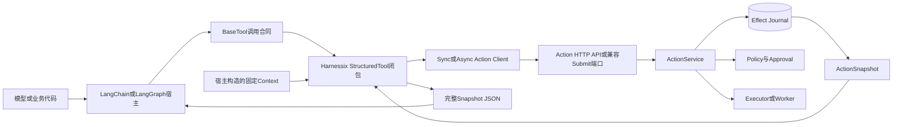

### 7.1 图示说明

- Framework先依据`args_schema`校验Tool参数，再调用Adapter闭包；
- Context不是从当前Runnable动态解析，而是在Tool创建时由宿主固定；
- Client可以是HTTP SDK，也可以是任何满足结构协议的进程内对象；
- Action Service及Journal拥有状态和持久事实，Adapter不能直接迁移状态；
- 返回链把完整Snapshot投影为字符串，未按模型可见内容做最小化；
- Framework的Checkpoint不与Journal形成原子事务或持久绑定。

### 7.2 信任边界

| 边界 | 输入信任 | 当前校验 | 未解决问题 |
|---|---|---|---|
| 模型/业务代码→LangChain | 不可信Arguments | `args_schema` | 回调可能先记录原始输入；无总字节/深度预算 |
| 宿主→Tool Context | 受信装配假设 | Domain字段形状 | Principal、Roles、Framework不认证；Metadata可覆盖来源标签 |
| Adapter→Client | 进程内结构协议 | Python调用 | 不验证Client目标、所有权、TLS或租户一致性 |
| Client→API | 默认Loopback HTTP | SDK/Server Pydantic | 当前无认证、Tenant授权或请求预算 |
| Snapshot→Framework/模型 | 高敏业务数据 | Pydantic序列化 | 完整Request、Principal、Secret Ref标识和结果可进入模型历史/Trace |

## 8. 模块边界与依赖方向

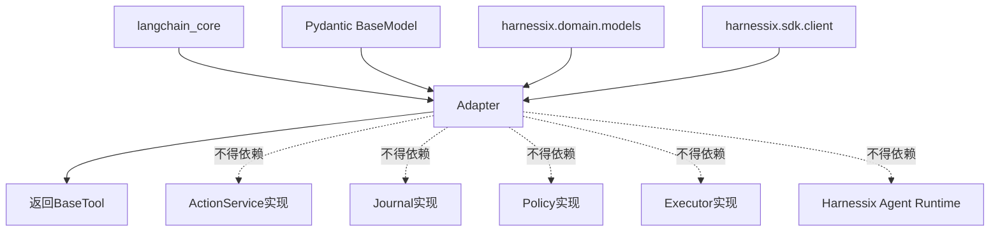

允许依赖只有外部Tool合同、Pydantic Schema、Action Domain模型和Client类型。虽然类型标注显式列出
`HarnessixClient`/`HarnessixAsyncClient`，运行时接受任何实现`submit`方法的对象。Adapter不得：

- 根据Framework自行放宽Action校验；
- 根据Tool描述自行决定Effect或Approval；
- 直接访问Action数据库；
- 在Client异常后自动重放副作用；
- 把LangGraph State写入Action Metadata代替正式持久契约；
- 把Adapter来源标签当作身份或权限。

## 9. 包结构与推荐阅读顺序

| 顺序 | 文件 | 行数 | 阅读重点 |
|---:|---|---:|---|
| 1 | [`adapters/__init__.py`](../../src/harnessix/adapters/__init__.py) | 1 | 包不重导出任何公共符号 |
| 2 | [`adapters/langgraph.py`](../../src/harnessix/adapters/langgraph.py) | 96 | 两个Client协议、Context、Factory、请求闭包和名称归一化 |
| 3 | [`domain/models.py`](../../src/harnessix/domain/models.py) | 下游合同 | `ActionRequest`、`ActionSnapshot`、Status与字段限制 |
| 4 | [`sdk/client.py`](../../src/harnessix/sdk/client.py) | 默认Client | 同步/异步Submit、2xx解析和HTTP错误 |
| 5 | [`test_langgraph_adapter.py`](../../tests/unit/test_langgraph_adapter.py) | 72 | 唯一直接用例及其证明边界 |
| 6 | [`test_sdk.py`](../../tests/unit/test_sdk.py) | 间接 | Async HTTP Submit合同 |
| 7 | [`test_api.py`](../../tests/integration/test_api.py) | 间接 | Server状态投影和Queued行为 |

## 10. 公共导出与安装边界

[`adapters/__init__.py`](../../src/harnessix/adapters/__init__.py)只有模块说明，没有`__all__`或重导出。因此正式
导入路径是：

```python
from harnessix.adapters.langgraph import HarnessixToolContext, create_harnessix_tool
```

根包[`harnessix.__init__`](../../src/harnessix/__init__.py)也不导出Adapter类型。这样可避免基础包导入时强制加载
`langchain-core`，但产生以下兼容责任：

1. 用户必须安装可选Extra或自行提供兼容版本；
2. 缺依赖时导入子模块直接失败为`ModuleNotFoundError`，没有Harnessix专用诊断；
3. `HarnessixToolContext`和Factory尚无明确SemVer稳定承诺；
4. 不存在自动发现、Entry Point或Plugin Registry；
5. 模块名表达LangGraph，但返回类型来自LangChain Core。

## 11. Client结构协议

### 11.1 `SyncActionClient`

```python
class SyncActionClient(Protocol):
    def submit(self, request: ActionRequest) -> ActionSnapshot: ...
```

### 11.2 `AsyncActionClient`

```python
class AsyncActionClient(Protocol):
    async def submit(self, request: ActionRequest) -> ActionSnapshot: ...
```

| 属性 | 当前语义 |
|---|---|
| 类型方式 | 静态结构协议，没有`runtime_checkable` |
| 方法数量 | 仅Submit；不能查询、批准、对账或读取Event |
| 错误合同 | 未定义专用异常；底层异常原样传播 |
| 超时 | 协议无Deadline参数，由Client内部决定 |
| 取消 | Async调用可被任务取消；协议未规定Action后续状态 |
| 重试 | Adapter不重试；Framework和Client是否重试不受约束 |
| 生命周期 | Adapter不创建、不关闭Client |
| 身份 | 协议不携带认证或动态调用主体 |

显式联合类型中的`HarnessixClient`与`HarnessixAsyncClient`已经满足对应协议，功能上是文档提示而非额外能力。

## 12. `HarnessixToolContext`设计

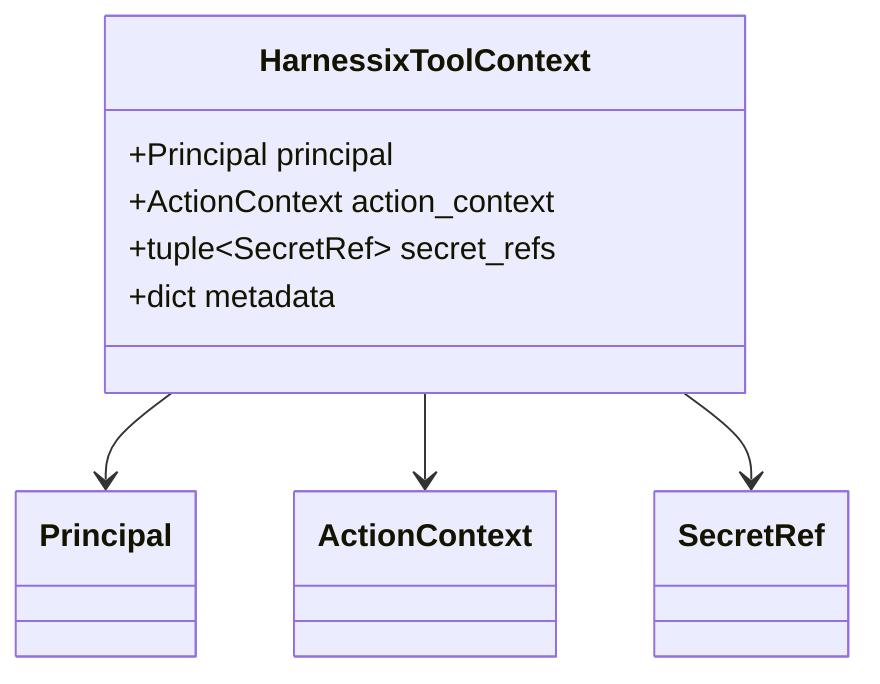

该类型是`@dataclass(frozen=True, slots=True)`：顶层属性不能重新赋值且没有动态属性，但这不是深不可变。

| 字段 | 类型 | 必填 | 来源 | 语义 | 默认值 | 敏感级别 | 持久位置 | 当前风险 |
|---|---|---|---|---|---|---|---|---|
| `principal` | `Principal` | 是 | 宿主 | Tenant、Subject、Framework、Roles | 无 | 中/身份 | 复制进每个Action Request | 不认证；共享Tool时固定 |
| `action_context` | `ActionContext` | 是 | 宿主 | Session、Run、业务Trace关联 | 无 | 中 | 复制进Request | 不从Runnable动态解析 |
| `secret_refs` | `tuple[SecretRef,...]` | 否 | 宿主 | Secret名称/版本引用 | 空Tuple | 高标识 | Request与指纹 | 每次调用固定；完整返回模型 |
| `metadata` | `dict[str,Any]` | 否 | 宿主 | 声明为非敏感扩展信息 | 新空Dict | 可变/未分类 | Request | Frozen Dataclass内仍可修改；可覆盖`adapter` |

`Principal`、`ActionContext`和`SecretRef`是冻结Pydantic模型，但Metadata是可变字典。创建Tool后继续修改原
Metadata，会影响后续请求；并发修改没有锁或快照保证。

## 13. Factory接口设计

`create_harnessix_tool`的参数合同如下：

| 参数 | 类型 | 必填 | 当前用途 | 校验位置 | 失败 |
|---|---|---|---|---|---|
| `action_name` | `str` | 是 | `ActionRequest.tool`及默认Tool名来源 | 默认Tool名只做字符替换；Action正则到调用时才验证 | ValueError或Pydantic ValidationError |
| `description` | `str` | 是 | LangChain Tool描述，通常暴露给模型 | Adapter无长度/内容校验 | 外部库校验或接受 |
| `args_schema` | `type[BaseModel]` | 是 | Tool输入Schema | `StructuredTool`/LangChain | 外部ValidationError |
| `context` | `HarnessixToolContext` | 是 | 固定Principal、Run、Secret Ref和Metadata | 构造Dataclass/Domain模型 | 类型或Pydantic错误 |
| `client` | Sync协议/SDK/None | 否 | 同步`invoke` | 仅检查至少一个Client | 调用时底层异常 |
| `async_client` | Async协议/SDK/None | 否 | 异步`ainvoke` | 同上 | 调用时底层异常 |
| `tool_name` | `str/None` | 否 | Framework可见名称 | 非空时不经过`_safe_tool_name` | 外部库行为 |
| `effect_hint` | `EffectClass/None` | 否 | 复制到Action一致性提示 | ActionRequest及Service | 类型错误或下游Action失败 |
| `idempotency_key` | 同步Callable/None | 否 | 仅依据Arguments产生业务键 | 返回值由ActionRequest验证 | Factory异常或ValidationError |

返回类型标注为`BaseTool`，实际对象由`StructuredTool.from_function`创建。Factory没有网络或持久化副作用。

## 14. Factory构造流程

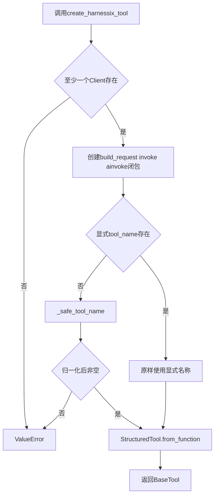

构造阶段不验证：

- `action_name`是否满足Action Contract正则；
- Tool名称是否与其他Tool冲突；
- `args_schema`是否等于Action Plane注册Schema；
- `effect_hint`是否等于Tool Descriptor；
- Client是否可用、是否同租户、是否指向同一环境；
- Context是否适合当前LangGraph Run；
- 幂等Factory是否确定、无副作用或线程安全。

因此“Tool对象构造成功”只证明包装对象可建立，不证明第一次调用会被Action Plane接收。

## 15. Tool名称归一化

`_safe_tool_name`按以下步骤处理默认名称：

```text
把非ASCII字母、数字、下划线和连字符替换为下划线
去掉首尾下划线
若结果为空，抛ValueError
若首字符是数字，前缀action_
返回结果
```

| Action名称输入 | 默认Framework Tool名 | Action Contract是否接受原Action名 |
|---|---|---|
| `demo.issue.create` | `demo_issue_create` | 是 |
| `a/b` | `a_b` | 否；到调用时失败 |
| `a.b` | `a_b` | 是 |
| `123` | `action_123` | 否；Action名必须以字母开头 |
| `...` | 无 | 构造时ValueError |

两个不同Action名称可能归一化为同一个Tool名，例如`a/b`和`a.b`。当前没有Catalog级冲突检查。显式
`tool_name`完全绕过该函数，Adapter不检查空值、保留字、长度或框架限制。

## 16. Action Request映射

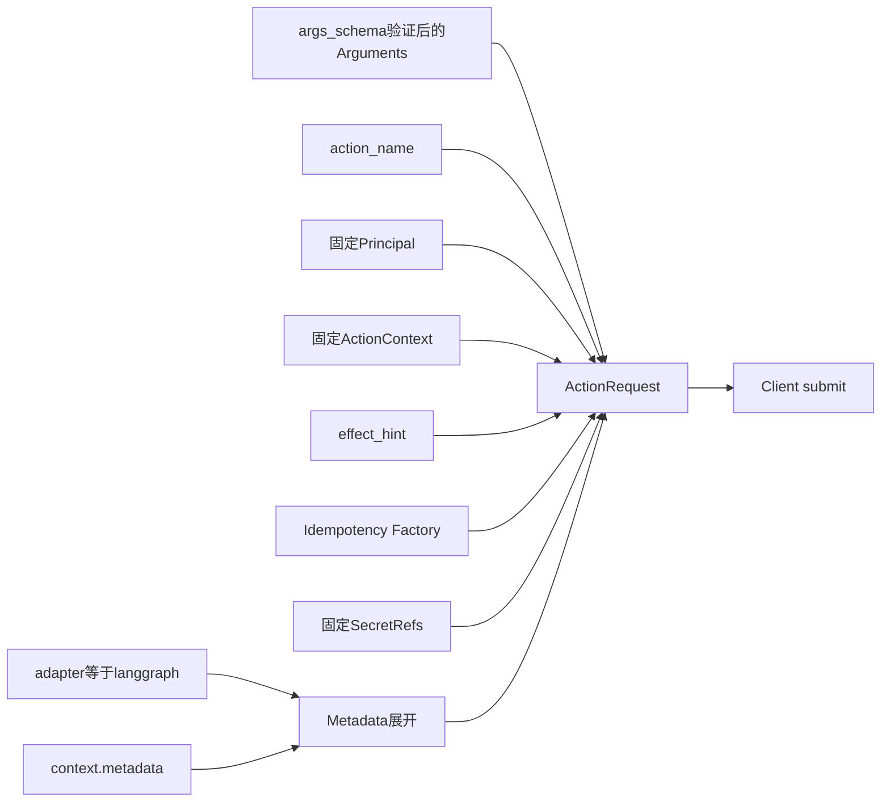

字段映射为：

| Action字段 | 来源 | 每次调用是否变化 | 说明 |
|---|---|---|---|
| `spec_version` | Domain默认值 | 否 | 当前`harnessix.action/v1` |
| `action_id` | Domain `uuid4`默认工厂 | 是 | 上游Tool Call ID未参与 |
| `tool` | `action_name` | 否 | 与Framework可见`tool_name`可不同 |
| `arguments` | Tool关键字参数 | 是 | 由LangChain Schema先校验，Service按注册Tool模型再次校验 |
| `principal` | `context.principal` | 否 | 固定在Tool实例生命周期 |
| `context` | `context.action_context` | 否 | Session/Run不能按调用动态变化 |
| `effect_hint` | Factory参数 | 否 | 不是权威Effect |
| `idempotency_key` | Factory对Arguments的返回 | 依Arguments | 无Tool Call/Run/Principal参数 |
| `secret_refs` | `context.secret_refs` | 否 | 不含值，但标识会进入返回JSON |
| `metadata` | 固定标签与Context Metadata合并 | 可受外部字典后续修改 | Context中的同名键后写覆盖 |

## 17. Metadata优先级与来源真实性

源码使用：

```python
metadata = {"adapter": "langgraph", **context.metadata}
```

Python字典展开的后写值优先，因此`context.metadata["adapter"]`可以覆盖固定标签。实际不变量是：

```text
request.metadata["adapter"] == context.metadata.get("adapter", "langgraph")
```

而不是“始终等于langgraph”。此外`Principal.framework`直接取宿主输入，Adapter没有改写或核对。两者都只能作为
调用方声明，不能用于认证、授权、计费归因或安全审计。当前唯一测试只覆盖没有冲突键的正常情况，没有发现该优先级。

## 18. 参数Schema与权威Tool Schema

调用存在两次不同校验：

1. LangChain使用Adapter传入的`args_schema`校验Framework输入；
2. Action Service根据Runtime Registry中的Tool Input Model再次校验`ActionRequest.arguments`。

这两份Schema没有版本或摘要绑定，可能发生：

- Adapter较旧：拒绝Runtime已经接受的新字段；
- Adapter较新：允许Runtime不认识的字段，Action创建后失败；
- 类型转换不同：LangChain归一化后的值与模型原始输入不同；
- 描述与权威Tool Descriptor不一致，模型生成错误参数；
- Framework Tool名与Action名映射冲突。

当前Adapter没有调用`client.tools()`，结构协议也不暴露该方法，不能在启动时进行Schema一致性检查。

## 19. 同步调用时序

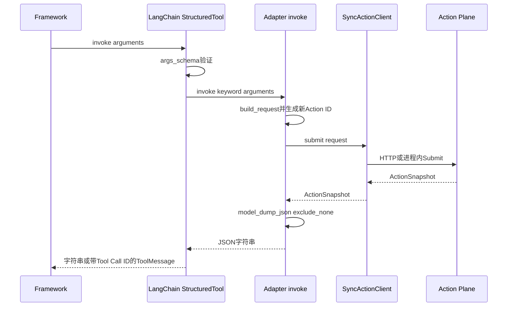

同步闭包在没有`client`时抛`RuntimeError`。正常Factory不会把该闭包注册为`func`，所以Async-only Tool同步调用在
LangChain层先抛`NotImplementedError`。Adapter不阻止在异步事件循环中直接调用同步`invoke`造成阻塞。

## 20. 异步调用时序

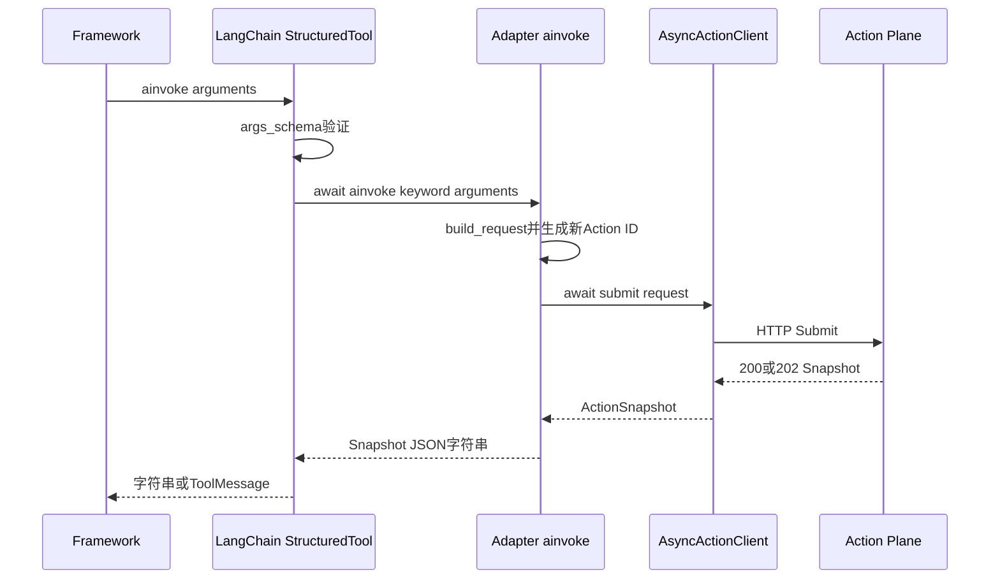

若只提供同步Client，当前LangChain Core会将同步函数放入线程以实现`ainvoke`。该线程化行为属于外部依赖，Adapter
没有控制线程池、ContextVar传播、排队上限或关闭。若提供异步Client，取消等待会传播到HTTP调用，但不能证明服务端Action
没有创建或执行。

## 21. Tool Call与输出包装

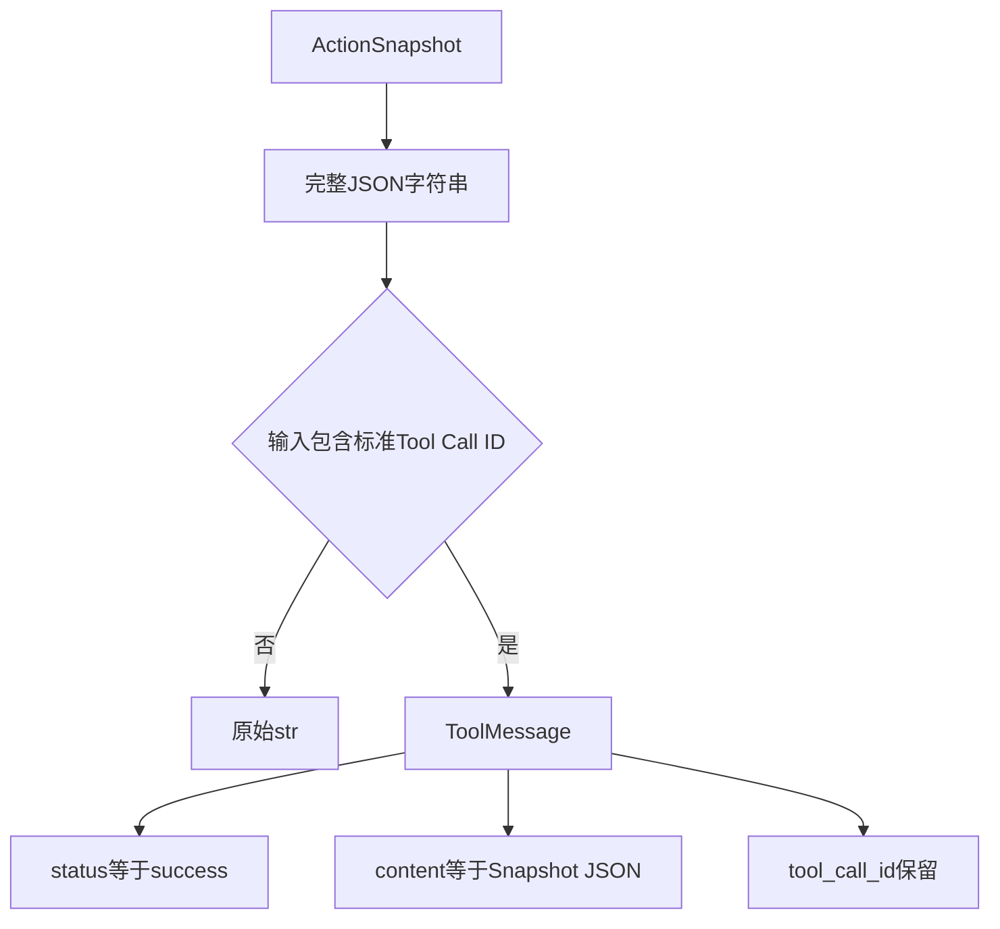

当前Adapter不知道LangChain的Tool Call ID。该ID只由外部`BaseTool`包装层用于返回`ToolMessage`，不会进入：

- `ActionRequest.action_id`；
- `idempotency_key`；
- `ActionContext`；
- `metadata`；
- Journal索引。

普通字典调用返回`str`；标准Tool Call调用返回`ToolMessage`。这是调用形状导致的返回类型变化，Factory返回类型没有
表达该联合。Adapter也未设置`response_format="content_and_artifact"`，因此没有把模型可见摘要与完整审计Artifact分离。

## 22. Framework状态与Action状态不等价

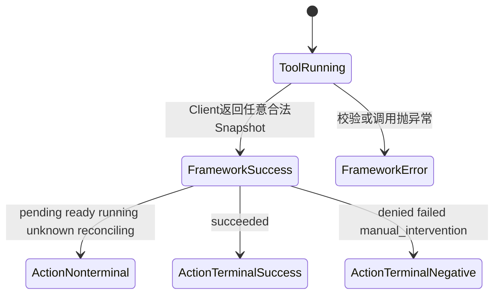

只要Client返回可序列化Snapshot，LangChain Tool调用就被视为成功。以下Action状态都会成为正常Tool Content：

| Action状态 | 是否Action终态 | 当前Framework Tool状态 | 调用者责任 |
|---|---:|---|---|
| `pending_approval` | 否 | success | 发起独立审批并恢复，不得让模型误判已执行 |
| `ready`/`leased`/`running` | 否 | success | 保存Action ID并查询终态 |
| `unknown`/`reconciling` | 否 | success | 对账或人工处理，不得重放原Tool |
| `succeeded` | 是 | success | 消费有界业务结果 |
| `denied` | 是 | success | 解析内部状态；Tool层不会标为error |
| `failed` | 是 | success | 解析`result.error`；Tool层不会标为error |
| `manual_intervention` | 是 | success | 停止自动执行并提示人工处置 |

因此Framework的`ToolMessage.status`只能表示包装调用是否抛异常，不能代替Action状态机。

## 23. 完整Snapshot输出与数据流

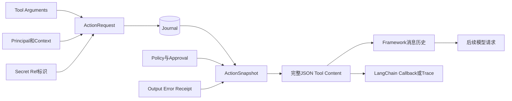

Snapshot可能包含：

- 完整Arguments与Metadata；
- Tenant、Subject、Roles、Session和Run；
- Secret Ref名称与版本；
- Tool Descriptor及完整输入Schema；
- Policy理由、Approval Actor/Reason；
- Result Output、Error、Receipt；
- Lease Owner、Trace Context、时间和版本。

这些字段中只有部分需要模型理解。Adapter没有字段白名单、大小限制、Artifact引用、Secret最终Guard或Trace脱敏。即使
Secret值按合同不应进入Request，Secret名称、资源ID、审批说明和业务输出仍可能属于敏感信息。LangChain Callback还可能在
Adapter运行前记录原始Tool输入，在运行后记录完整输出。

## 24. 幂等、重试与Action身份

### 24.1 当前身份生成

每次`build_request`都让Domain默认工厂生成新Action ID。可选`idempotency_key`只接受Arguments：

```python
Callable[[dict[str, Any]], str | None]
```

它无法直接访问Tool Call ID、Runnable Run ID、Checkpoint Namespace、Principal或调用序号。

### 24.2 重放矩阵

| 场景 | Action ID | 幂等键 | 可能结果 |
|---|---|---|---|
| Framework重试且未配置Factory | 新ID | 空 | 只读可重复；要求幂等的写Action在下游失败，但失败前已创建Action |
| Framework重试且Factory确定 | 新ID | 同键 | 相同指纹可返回首次Action；参数或Hint变化则冲突 |
| 两个合法业务操作参数相同 | 两个新ID | 可能同键 | 参数型Factory可能错误合并两个意图 |
| Factory含随机值/时间 | 新ID | 不同键 | 重试无法去重 |
| Client超时后Framework自动重试 | 新ID | 取决于Factory | 原Action可能已经执行；无本地绑定无法先按ID查询 |
| Tool Call恢复后再次执行Node | 新ID | 取决于Factory | Checkpoint无法直接关联旧Action |

### 24.3 当前无法证明的Exactly-once

Adapter没有持久化`tool_call_id → action_id`映射，也无法向Factory传递Tool Call ID。即使使用业务幂等键，下游只能在
相同Tenant、Key和Fingerprint条件下去重。上游必须自行保存第一次返回的Action ID；但若网络在返回前断开，当前Adapter
没有先写绑定再提交的恢复协议。

## 25. Approval、Queued与恢复链

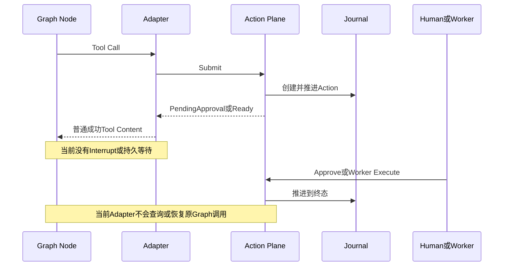

当前Factory生成的Tool只暴露Submit，不能调用Client的`get`、`decide_approval`、`reconcile`或`events`。因此：

1. 中风险写入返回`pending_approval`后，图不会自动Suspended；
2. Queued返回`ready`后，图不会等待Worker；
3. `unknown`返回后，图不会触发Reconcile；
4. 宿主若继续让模型运行，模型必须自行解析完整JSON并避免重复调用；
5. 进程重启后Adapter没有Checkpoint绑定可恢复；
6. 人工审批身份不与原Framework Principal绑定。

生产集成必须把这些状态建模为显式图状态与恢复命令，不能用Prompt约定替代。

## 26. 失败语义矩阵

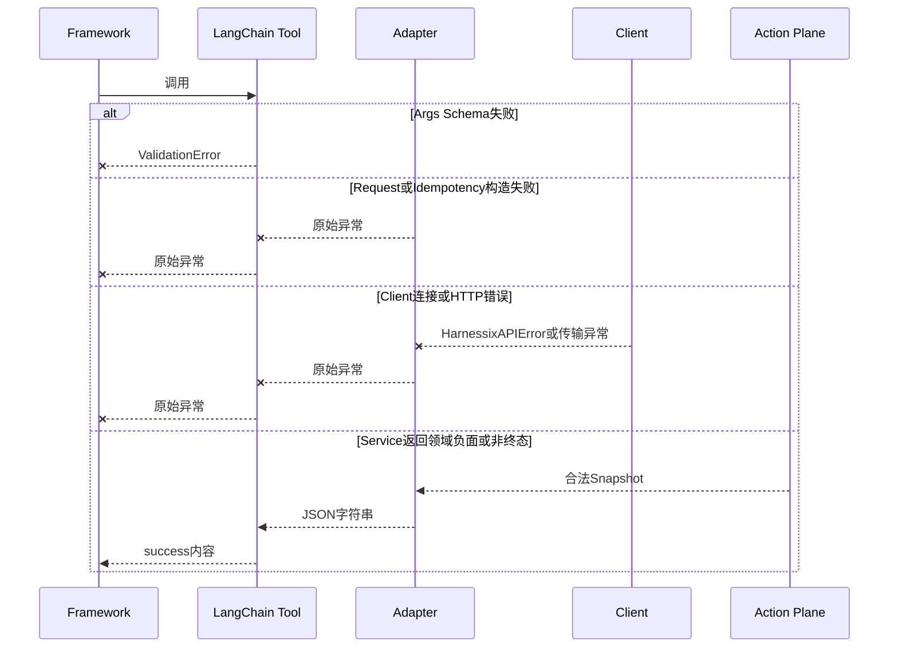

| 故障点 | 已知事实 | Tool外观 | 自动重试 | 正确恢复 |
|---|---|---|---|---|
| 两个Client都为空 | 未创建Tool | `ValueError` | 否 | 提供至少一个Client |
| 默认Tool名归一化为空 | 未创建Tool | `ValueError` | 否 | 使用合法Action名或显式Tool名 |
| Action名不符合合同 | 尚未提交 | Pydantic ValidationError | 否 | 修复装配；构造期验证是后续项 |
| Args Schema失败 | 未调用Adapter Client | ValidationError | 否 | 让模型修正参数或宿主拒绝 |
| Idempotency Factory抛错 | 未创建Action | 原异常 | 取决于Framework | 修复Factory；不得盲目重试有副作用Factory |
| Client建连失败 | 服务端可能未收到 | HTTPX异常 | Adapter否 | 依据持久绑定/幂等策略判断；当前绑定缺失 |
| Client超时/取消 | Action可能已创建或执行 | Timeout/Cancelled | Adapter否 | 查询原Action ID；返回前断线时当前无法可靠定位 |
| API非2xx | 取决于服务端错误 | `HarnessixAPIError` | Adapter否 | 按稳定Error Code处理；不要一律重放 |
| Snapshot序列化异常 | Action可能已持久 | Pydantic/序列化异常 | 否 | 用已知Action ID查询；当前调用者可能未获得ID |
| `denied/failed` Snapshot | 领域已终态 | Tool success | 否 | 解析状态并停止 |
| `unknown` Snapshot | 效果不确定 | Tool success | 禁止重执行 | Reconcile或人工处置 |
| Callback在业务返回后抛错 | Action可能已提交 | 外部库异常 | 不确定 | 先恢复Action，不能按Tool错误判断未执行 |

## 27. 取消、超时与断连

### 27.1 同步路径

- Adapter没有Cancel Token或Deadline参数；
- `HarnessixClient`默认30秒HTTP超时，其他Client可有不同语义；
- Sync-only Tool通过`ainvoke`运行在线程时，取消等待不保证同步线程和HTTP请求停止；
- Framework取消后下游Action可继续运行；
- Adapter没有取消Action的领域接口。

### 27.2 异步路径

- `CancelledError`可以中断`await async_client.submit`；
- 网络取消不等于服务端事务回滚；
- 请求在服务端创建后、响应返回前取消时，Action ID只存在于本地Request闭包和服务端，Adapter不将其预先交给宿主；
- Queued执行独立于原HTTP连接；
- `UNKNOWN`不能由取消自动推导，必须以Journal事实为准。

### 27.3 Framework Checkpoint

当前没有“先稳定绑定Tool Call和Action ID，再提交Action”的本地事务。Graph Checkpoint与Action Journal分别提交，
任一侧崩溃都可能留下孤立记录。恢复实现必须先查询绑定和Action，不得直接重新调用Tool。

## 28. 持久化、事务与迁移

Adapter没有数据库、事件、文件或Schema Migration。它依赖两类外部持久状态：

| 状态 | 所有者 | 当前关联方式 | 原子性 |
|---|---|---|---|
| Graph/Framework State | 外部框架Checkpointer | 无正式接口 | 与Action Journal不原子 |
| Action Snapshot/Event | Harnessix Effect Journal | Action ID、Tenant幂等键 | 由Action Plane内部事务保证 |

缺失的桥接事实至少应包含Framework Namespace、Thread/Run、Tool Call ID、Action ID、请求指纹、绑定版本和创建状态。
在定义该Schema前，不应把任意这些值塞入非权威Metadata并宣称可恢复。

当前Adapter合同本身没有版本字段；兼容性由Python API签名、Action Contract v1和外部LangChain Core共同决定。未来新增
持久绑定需要独立Migration、崩溃切点和双写/回滚策略。

## 29. 并发、线程与生命周期

| 对象 | 生命周期 | 可变状态 | 并发边界 |
|---|---|---|---|
| `HarnessixToolContext` | Tool创建前到最后一次调用 | Metadata字典可变 | 无锁；应由宿主视为只读 |
| `StructuredTool` | Framework注册到卸载 | 外部库Callback/配置状态 | 由LangChain定义 |
| Sync Client | 宿主拥有 | 连接池 | Adapter不关闭；线程安全取决于实现 |
| Async Client | 宿主拥有 | 连接池/事件循环 | 不应跨不兼容事件循环；Adapter不关闭 |
| Idempotency Factory | Tool生命周期 | 未约束 | 并发调用时必须自行线程安全和确定 |
| Request/Snapshot | 单次调用 | Pydantic顶层冻结但嵌套值未必深冻结 | 不应在提交后修改 |

同时提供同步和异步Client时，Factory把两者分别绑定到同一个Tool，但不验证Base URL、Tenant、Registry版本或环境一致。
不同调用方式可能把同名Tool发送到不同Action Plane。生产装配应共享明确的Client配置身份并在启动时核对。

## 30. 身份、认证与授权

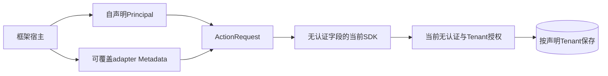

当前链路没有可信身份根：

- `Principal`由Tool构造者直接提供；
- `Principal.framework`不强制为`langgraph`；
- Metadata来源标签可被同名键覆盖；
- Client协议没有Credential或Security Context；
- 当前HTTP SDK没有Authorization参数；
- 当前API没有认证、Tenant资源过滤或审批授权；
- Adapter返回完整Principal，使身份信息进入模型历史。

Policy只能消费身份声明，不能证明声明真实性。多租户产品不得共享固定Context Tool实例，也不得把模型可控输入用于
Principal、Roles、Secret Ref或Adapter Metadata构造。

## 31. Secret、隐私与内容安全

### 31.1 输入

Secret值不得作为Tool Arguments或Metadata传入；只允许宿主装配`SecretRef`。但当前安全门存在跨层缺口：

1. LangChain Callback可能在Harnessix校验前观察原始Arguments；
2. Adapter本身不扫描敏感键；
3. Action Service的敏感键守卫发生在首次Journal持久化之后；
4. 值型、编码或派生Secret可能绕过键名检测；
5. `context.metadata`声明非敏感但没有类型、字节或深度预算。

### 31.2 输出

完整Snapshot会返回Secret Ref名称/版本、Arguments、Metadata、Principal、Approval和Result。Adapter不调用
`StreamingSecretRedactor`、`ArtifactFinalGuard`或公开Projection。模型历史、LangSmith/其他Callback、应用日志和
Checkpoint可能复制这些数据。

### 31.3 最低部署边界

- 只由受信宿主构造Context；
- 不把模型输入合并进Principal、Roles、Secret Ref或Metadata；
- 禁止在LangChain Callback记录未脱敏Tool输入和完整输出；
- 只连接Loopback或受控私网Action API；
- 对非终态和负面终态由宿主解析，不把完整JSON直接当最终用户文本；
- 对模型可见输出执行字段白名单、字节预算与最终Secret Guard。

## 32. 可观测性与Trace传播

Adapter没有自己的Logger、Metric或Span，也没有调用Harnessix Observability端口。外部LangChain可以围绕Tool调用产生
Callback/Trace，但这些Trace没有自动进入Action的持久`TraceContext`。

| 信号 | 当前来源 | 关联键 | 缺口 |
|---|---|---|---|
| LangChain Callback | 外部BaseTool | Tool名、外部Run/Tool Call ID | 未绑定Action ID；可能记录内容 |
| Action API Span | HTTP Middleware | 运行时Trace Context | Client不注入外部W3C Header |
| Action Event/Metric | Service/Worker | Action ID、状态、Tool | 不知道LangGraph Tool Call ID |
| ActionContext Trace ID | 固定Context字段 | 调用方字符串 | 不等同W3C Trace Context，不动态更新 |

要形成端到端关联，需要可信地把Framework Run/Tool Call与Action ID绑定，并由Client传播W3C Header；不能把
任意`ActionContext.trace_id`字符串当成已验证Trace。

## 33. Tool Schema、描述与模型暴露面

`description`和`args_schema`由宿主传给`StructuredTool.from_function`，通常进入模型的Tool定义。当前没有：

- 描述长度、Prompt Injection或Unicode控制字符校验；
- Schema节点/字节/递归深度预算；
- 与Runtime Tool Descriptor的Version/Digest绑定；
- Tool目录签名或来源证明；
- 多Tool名称冲突检查；
- 对模型能力和Provider Tool Schema限制的适配；
- 动态可见性或按Principal过滤。

Action Plane仍会做权威输入校验和Policy，但模型侧Schema漂移会浪费Token、生成失败Action，且失败请求当前可能已进入Journal。

## 34. 安装、版本与发布兼容

### 34.1 当前安装

开发和全量CI使用：

```bash
uv sync --locked --all-extras --dev
```

库用户至少需要安装包含`langchain-core`的Extra。若要运行真实LangGraph，还需自行安装并锁定兼容的LangGraph版本。

### 34.2 兼容矩阵

| 维度 | 当前声明 | 当前证据 | 结论 |
|---|---|---|---|
| Python | 3.12+ | CI Python 3.12/3.13全量测试含直接Adapter用例 | 基础Factory有跨版本证据 |
| langchain-core | `>=1.0,<2` | 锁定1.6.1单元测试与受控探针 | 不能证明整个范围 |
| langgraph | 未依赖 | 无安装、无ToolNode测试 | 未验证 |
| Action Contract | v1 | Domain/Service/Adapter测试 | 基础映射已验证 |
| HTTP API | v1 | SDK/API间接测试 | Adapter只有Fake Client直接测试 |
| OpenAI Agents/Claude SDK | 无 | 无代码/测试 | 不支持 |

### 34.3 升级门禁

升级LangChain Core或增加LangGraph依赖时，至少要固定：Tool构造、Args验证、普通调用返回、标准Tool Call返回、
Sync-only异步桥接、Async-only同步拒绝、异常包装、Callback、取消及ToolNode集成行为。

## 35. 平台与部署

Adapter源码只使用Python、Regex、Dataclass、Pydantic和HTTP Client抽象，没有直接POSIX/Windows系统调用。因此Factory
本身可在macOS、Linux和Windows运行；但端到端能力取决于：

- 目标Action API是否可达并受认证保护；
- SDK传输与证书是否受支持；
- 下游Executor/Sandbox是否支持目标平台；
- Framework宿主的事件循环、线程池和Shutdown是否正确；
- Client是否在Tool最后一次调用后关闭。

容器、Serverless和多进程部署没有专项Adapter证据。无状态不等于可随意重试：Action效果和Framework绑定仍是持久问题。

## 36. 类与函数设计

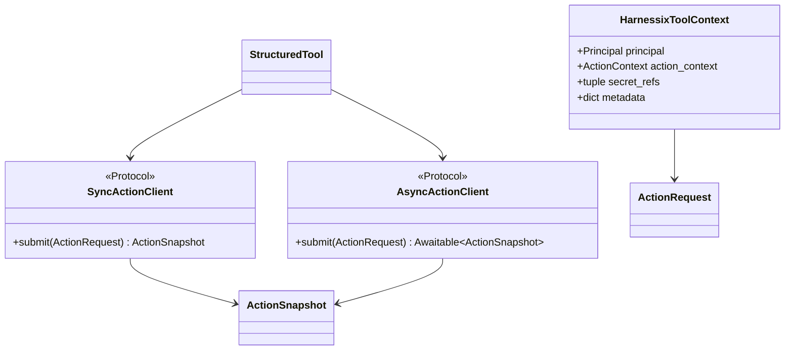

| 符号 | 职责 | 拥有状态 | 错误边界 | 扩展点 |
|---|---|---|---|---|
| `IdempotencyKeyFactory` | 从Arguments计算业务键 | 由调用实现决定 | 异常原样传播 | 当前仅同步单参数Callable |
| `SyncActionClient` | 最小同步Submit端口 | 无定义 | 实现自定 | 可由HTTP或进程内Client实现 |
| `AsyncActionClient` | 最小异步Submit端口 | 无定义 | 实现自定 | 同上 |
| `HarnessixToolContext` | 固定调用身份与关联上下文 | Metadata可变 | 构造期Domain校验 | 后续应改为可信动态Context Provider |
| `create_harnessix_tool` | 组装闭包和StructuredTool | 捕获全部参数/Client | 至少一个Client校验 | 后续版本化Factory |
| `build_request` | 映射单次Arguments | 新Action ID | Factory/Pydantic错误 | 当前是内部闭包 |
| `invoke` | 同步Submit并序列化 | 无 | Client/序列化异常 | 无状态投影策略 |
| `ainvoke` | 异步Submit并序列化 | 无 | Cancel/Client/序列化异常 | 无状态投影策略 |
| `_safe_tool_name` | 默认Tool名称归一化 | 无 | 空结果ValueError | 无Catalog冲突输入 |

## 37. 核心业务逻辑伪代码

### 37.1 构造Tool

```text
create_tool(config):
    if sync_client is absent and async_client is absent:
        fail ValueError

    define build_request(arguments):
        key = idempotency_factory(arguments) if configured else absent
        metadata = {adapter: "langgraph"}
        metadata.overlay(context.metadata)  # 宿主值当前可以覆盖adapter
        return ActionRequest(
            new random action_id by domain default,
            fixed action_name,
            arguments,
            fixed principal and action_context,
            fixed effect_hint and secret_refs,
            key,
            metadata,
        )

    framework_name = explicit tool_name
                     or normalize action_name
    return StructuredTool(
        sync function if sync client exists,
        async function if async client exists,
        framework_name,
        description,
        args_schema,
    )
```

### 37.2 单次调用

```text
framework validates arguments with args_schema
request = build_request(validated arguments)

try:
    snapshot = selected_client.submit(request)
except cancellation, timeout, transport or API error:
    propagate error unchanged
    # 不得推断Action不存在，也没有Adapter持久绑定可恢复

content = serialize the entire snapshot as JSON excluding null fields
return content
# 带Tool Call ID时，外部LangChain再包装ToolMessage(status=success)
```

### 37.3 当前缺失的生产恢复算法

```text
desired future invocation(tool_call_identity, dynamic trusted context):
    atomically find_or_create durable binding(tool_call_identity, action_id)
    if action already exists:
        read it instead of resubmitting
    else:
        admit safe request and submit with stable action_id

    if status requires approval:
        persist graph interrupt and expose minimal approval projection
    elif status is queued or running:
        persist wait cursor and resume from events or bounded polling
    elif status is unknown:
        require reconcile, never re-execute
    else:
        map terminal status to typed framework outcome

    publish only bounded redacted content; keep full snapshot as protected artifact
```

该算法是后续设计约束，不是当前实现。

## 38. 源码、测试与决策映射

| 设计元素 | 源码 | 关键符号 | 测试/证据 | 当前证明 |
|---|---|---|---|---|
| Client最小端口 | [`langgraph.py`](../../src/harnessix/adapters/langgraph.py) | `SyncActionClient`、`AsyncActionClient` | [`test_langgraph_adapter.py`](../../tests/unit/test_langgraph_adapter.py) | Fake Async Client结构兼容 |
| 固定上下文 | [`langgraph.py`](../../src/harnessix/adapters/langgraph.py) | `HarnessixToolContext` | 同上`test_langgraph_tool_builds_framework_neutral_action` | Principal/Context正常复制；不覆盖变异/多租户 |
| Tool构造 | [`langgraph.py`](../../src/harnessix/adapters/langgraph.py) | `create_harnessix_tool` | 同上 | Async-only正常路径 |
| Request映射 | [`langgraph.py`](../../src/harnessix/adapters/langgraph.py) | 内部`build_request` | 同上 | Tool、Effect Hint、幂等键及默认Metadata |
| Async调用 | [`langgraph.py`](../../src/harnessix/adapters/langgraph.py) | 内部`ainvoke` | 同上 | Snapshot JSON可解析 |
| 名称归一化 | [`langgraph.py`](../../src/harnessix/adapters/langgraph.py) | `_safe_tool_name` | 无自动测试；受控探针 | 点/斜线冲突、数字前缀、空结果 |
| Action合同 | [`models.py`](../../src/harnessix/domain/models.py) | `ActionRequest`、`ActionSnapshot` | [`test_models.py`](../../tests/unit/test_models.py) | Domain字段与指纹；不证明Framework桥接 |
| HTTP Client | [`client.py`](../../src/harnessix/sdk/client.py) | `HarnessixClient`、`HarnessixAsyncClient` | [`test_sdk.py`](../../tests/unit/test_sdk.py) `test_async_sdk_preserves_action_contract` | Async Submit；非Adapter端到端 |
| API状态 | [`app.py`](../../src/harnessix/api/app.py) | `create_app`、`_apply_action_status` | [`test_api.py`](../../tests/integration/test_api.py) | Inline/Queued Server行为；无Framework |
| Service治理 | [`runtime.py`](../../src/harnessix/runtime.py) | `ActionService.submit` | [`test_action_service.py`](../../tests/integration/test_action_service.py) | Policy/Approval/幂等/Unknown；无Adapter恢复 |
| Python-first | [ADR 0001](../adr/0001-python-first-runtime.md) | 适配主流Python生态 | 决策记录 | 选择原因 |
| 自研Agent Loop | [ADR 0005](../adr/0005-evolve-to-harnessix-code.md) | LangGraph不作为核心Loop | 决策记录 | 产品边界 |

## 39. 直接测试证据

[`tests/unit/test_langgraph_adapter.py`](../../tests/unit/test_langgraph_adapter.py)当前只有一个测试函数：

| 测试 | 证明 | 不证明 |
|---|---|---|
| [`test_langgraph_tool_builds_framework_neutral_action`](../../tests/unit/test_langgraph_adapter.py) | Async-only Factory创建；Pydantic参数传递；Action名；Principal Framework原样；Effect Hint；参数型幂等键；无冲突Metadata默认标签；Pending Snapshot JSON | 真实LangGraph/ToolNode；同步路径；Tool Call包装；所有状态；错误/取消/超时；名称；Client生命周期；Schema漂移；动态身份；输出安全；重试/恢复 |

Fake Client不调用HTTP、Service、Journal、Policy、Executor或Worker。测试返回`pending_approval`但只检查JSON内部状态，
没有验证Framework是否Suspend或如何继续。

## 40. 受控行为探针

在本文代码版本和锁定`langchain-core==1.6.1`上执行纯内存探针，结果为：

1. 普通字典`ainvoke`返回`str`；
2. 标准Tool Call输入返回`ToolMessage`，保留Tool Call ID且`status="success"`；
3. `pending_approval`仍被包装为Framework success；
4. Async-only Tool同步`invoke`抛`NotImplementedError`；
5. Sync-only Tool的`ainvoke`可在线程桥接后返回；
6. Context Metadata中的`adapter="spoofed"`覆盖固定`langgraph`；
7. Tool创建后修改原Metadata，后续请求可看到新增字段；
8. 两次调用产生不同Action ID；确定Factory可产生相同幂等键；
9. 完整返回JSON包含Principal和Secret Ref标识；
10. `a/b`与`a.b`归一化为相同Tool名，`123`成为`action_123`但原Action名调用时不满足合同。

该探针用于固定当前外部库交互事实，不代替自动回归。所有发现均进入第41节风险和第42节演进约束。

## 41. 测试缺口

### 41.1 Factory与名称

- Client全空、Sync-only、Async-only、双Client；
- 默认名称、显式名称、Unicode、空结果、冲突和非法Action名；
- Args Schema、描述和Tool Descriptor漂移；
- Context Metadata变异、保留键覆盖和深层对象修改。

### 41.2 调用与状态

- 普通字典与标准Tool Call返回类型；
- 所有Action状态到Framework结果的映射；
- Sync/Async Client目标一致性；
- SDK/API真实ASGI端到端；
- Queued Worker完成、Approval、Denied、Failed、Unknown/Reconcile；
- Snapshot格式错误和超大输出。

### 41.3 失败与恢复

- Args/Request/Idempotency异常；
- 建连、超时、取消、响应后Callback异常；
- 返回前断线与重复Framework Node执行；
- 稳定Tool Call ID到Action ID绑定；
- Checkpoint写前/后与Action创建前/后崩溃矩阵；
- 禁止`UNKNOWN`重执行。

### 41.4 安全与兼容

- 真实LangGraph ToolNode、Graph Checkpoint、Interrupt/Resume；
- 动态可信Principal和Tenant负向访问；
- 原始Secret、Secret Ref、Approval/Result输出白名单；
- Callback/Trace不记录敏感输入输出；
- LangChain Core支持窗口或精确版本矩阵；
- Python 3.12/3.13及macOS/Linux/Windows端到端Framework运行。

## 42. 已确认限制与风险

| 优先级 | 限制 | 影响 | 后续归属 |
|---|---|---|---|
| P0 | 无Tool Call ID→Action ID持久绑定 | Framework重试/崩溃可能新建Action，返回前断线无法可靠查询原Action | 0.9.3恢复/Adapter v2 |
| P0 | 固定Principal且无可信身份注入 | 共享Tool实例可串Tenant/Run，身份声明可伪造 | 0.9.4身份与授权 |
| P0 | 完整Snapshot作为模型可见内容 | Arguments、身份、Secret Ref、审批和结果进入历史/Trace，缺少最终Guard | 0.9.4数据安全 |
| P1 | 非终态及负面终态均映射Tool success | Graph可能把等待审批、失败或Unknown误判为工具已成功完成 | 0.9.1产品交互/Adapter v2 |
| P1 | 没有Approval Interrupt、Queued Wait或Reconcile恢复 | 当前适配仅能Submit，不能完成生产闭环 | 0.9.1/0.9.3 |
| P1 | Extra不安装LangGraph且没有ToolNode测试 | README“直接交给ToolNode”缺少可执行证据 | DOC纠偏/0.9.5发行 |
| P1 | Metadata可覆盖`adapter`且Framework字段不规范化 | 来源审计可被调用方污染 | 0.9.4审计可信度 |
| P1 | Context Metadata浅可变 | 创建后行为变化、并发竞态、审计不可复现 | Adapter合同v2 |
| P1 | Args Schema与Runtime Tool Schema无Digest绑定 | 调用期失败、行为漂移、错误Action增长 | Tool Catalog版本合同 |
| P1 | 无输入/输出/Schema预算 | 大对象放大模型历史、Callback、网络和Journal | 0.9.3容量 |
| P1 | Client Timeout/Cancel不返回稳定恢复句柄 | 下游可能继续执行，上游无法安全重连 | 0.9.3 |
| P2 | Sync-only异步路径依赖外部线程桥接 | 无线程池预算，取消不能停止底层同步请求 | Adapter并发治理 |
| P2 | 双Client不核对同一目标 | 同一Tool因调用方式产生不同后端行为 | 装配诊断 |
| P2 | 默认名称非单射，显式名称无本地校验 | Tool注册冲突或晚期失败 | Catalog构建器 |
| P2 | Idempotency Factory只看Arguments | 无法表达Framework调用身份；相同参数的合法操作可能误合并 | Adapter v2身份合同 |
| P2 | 异常原样传播且未分类为Framework Tool错误 | 图可能整体失败，或外层盲目重试 | 类型化Outcome |
| P2 | 无Adapter Trace/Metric | 难以关联Framework Run、Tool Call与Action | Observability桥接 |
| P2 | 公共符号不从包导出且缺专用缺依赖诊断 | 可发现性和安装体验弱 | 0.9.5发行 |
| P2 | 只有一个直接测试 | 生产回归覆盖不足 | 0.9.2 Eval与Transcript基线 |

## 43. 生产演进约束

### 43.1 Adapter v2必须先定义持久身份

稳定身份至少需要：Framework类型、Checkpoint Namespace、Thread/Run、Tool Call ID、Action ID、Tenant、请求指纹和
版本。绑定的创建、Action Submit和Graph Checkpoint无法天然跨数据库原子提交，必须设计可重入状态机与崩溃恢复测试。

### 43.2 动态Context必须来自受信宿主

未来Factory应从LangGraph Runnable Config或专用Runtime Context读取当前调用身份，但只能消费宿主注入的受信字段。
模型Arguments不得决定Tenant、Roles、Secret Ref、Approval Actor、Workspace或网络能力。

### 43.3 状态投影必须类型化

不能继续让模型解析完整Snapshot字符串来判断：

- `succeeded`：返回有界、脱敏的业务内容；
- `denied/failed`：返回明确Framework错误Outcome，但保留Action ID；
- `pending_approval`：建立持久Interrupt和Approval Resume；
- `ready/running`：建立有界Wait/Event Cursor；
- `unknown/reconciling/manual_intervention`：停止自动重试并要求对账或人工处理。

### 43.4 内容与审计分离

模型可见Content应是版本化白名单投影；完整Snapshot只进入受保护Artifact或宿主状态。所有路径在发布前执行大小预算、
结构限制、Redactor和最终Secret Guard，并对Callback/Checkpoint进行同样约束。

### 43.5 真实Framework门禁

只有加入锁定LangGraph依赖并通过真实ToolNode、Graph、Checkpoint、Interrupt/Resume、取消、断线和崩溃测试后，才能把
“LangGraph可直接集成”标记为已验证。类型兼容或Mock Client不能替代该门禁。

## 44. 当前集成指南

### 44.1 适用场景

当前Factory只适合：

- 受信本地宿主；
- 已由宿主固定单Tenant、单Session/Run上下文；
- 调用方显式解析Snapshot状态；
- 只读Action，或具有经过评审的确定业务幂等键；
- 可接受单次Submit后由宿主自行查询/审批/对账；
- 禁止把完整输出直接暴露给不可信模型/用户。

### 44.2 最小使用原则

1. 使用合法且唯一的`action_name`与Framework Tool名；
2. 启动时从Action Tool Catalog核对Schema、Effect和版本，当前需宿主自行实现；
3. 每个Tenant/Run构造独立可信Context，不复用可变Metadata；
4. 写Action提供业务稳定且不会误合并独立意图的幂等键；
5. Client由宿主使用上下文管理器创建和关闭；
6. 收到JSON后先解析`ActionSnapshot.status`，不只看Tool调用是否成功；
7. 非终态保存Action ID并走SDK查询/审批/对账；
8. `unknown`禁止重放原Action；
9. 返回模型前生成最小脱敏投影；
10. 不启用会记录原始Tool输入/完整Snapshot的外部Trace。

## 45. 文档完成与验收条件

Adapter包现行设计满足以下条件时可判定DOC-1.4中的本模块文档完成：

- [x] 两个源码文件、四个公共/关键类型、三个内部闭包和名称函数全部纳入设计；
- [x] LangChain StructuredTool当前事实与LangGraph未验证边界明确区分；
- [x] 构造、同步、异步、状态投影、失败、恢复和数据流均有图文说明；
- [x] Context、Factory参数、Action字段、返回类型和重点不变量完整；
- [x] 幂等、Tool Call ID、Checkpoint、取消、超时、断连和Client生命周期已说明；
- [x] 身份、Metadata来源、Secret、完整Snapshot与Callback风险已登记；
- [x] 唯一直接测试与受控外部库探针分别说明证明和不证明内容；
- [x] Domain、SDK、Action Plane、威胁模型、README、总体架构、追踪矩阵和路线图同步；
- [x] 相对链接、源码/测试符号、Mermaid、专项回归和全量`make check`完成验证。

## 46. 验证记录

| 日期 | 验证项 | 结果 |
|---|---|---|
| 2026-09-12 | 全库Markdown相对链接 | 3,497条，缺失0条 |
| 2026-09-12 | 本文引用直接测试符号 | 1个可在对应测试文件中定位 |
| 2026-09-12 | `adapters/langgraph.py`核心源码符号 | 8个均可通过Python AST定位，包含三个内部闭包 |
| 2026-09-12 | Mermaid语法与渲染 | 14/14通过`mmdc`渲染 |
| 2026-09-12 | Adapter、Domain、Registry、SDK与API专项回归 | 21个用例全部通过 |
| 2026-09-12 | `make spec` | OpenAPI及其余生成规格无漂移 |
| 2026-09-12 | `make check` | Ruff Format、Ruff、Readability、Mypy通过；3,326个测试通过，13个跳过 |

验证基于代码提交`12f49ce60cbba09726f27ec2e9039c7c9159d67c`和锁定`langchain-core==1.6.1`。
纯内存行为探针没有连接网络或真实Action API，且未安装LangGraph；因此不得从本记录推断ToolNode、Checkpoint、
Interrupt、远程认证或真实副作用链已经验收。

## 47. 变更触发清单

以下变化必须同步更新本文：

1. Adapter包新增Framework、文件、导出或Entry Point；
2. `HarnessixToolContext`字段、可变性或动态解析方式变化；
3. Client协议、Factory签名、Tool返回类型或异常映射变化；
4. Action ID、Tool Call ID、幂等键、Checkpoint绑定或恢复流程变化；
5. Action状态到Framework Outcome/Interrupt/Command的投影变化；
6. Args Schema、Tool Catalog、名称归一化或冲突规则变化；
7. Snapshot公开字段、Artifact、结果预算、Redactor或Final Guard变化；
8. Principal、Tenant、Roles、Framework、Metadata或认证授权变化；
9. Sync/Async并发、取消、Deadline、Client所有权或关闭变化；
10. LangChain Core/LangGraph版本范围、锁定版本或ToolNode行为变化；
11. Callback、Trace、Metric、Log及内容采集策略变化；
12. macOS、Linux、Windows、Container或远程部署证据变化；
13. Approval、Queued Wait、Event Cursor、Reconcile或人工恢复接入；
14. 直接/合同/集成测试矩阵及发布声明变化。

## 48. 相关文档

- [文档中心](../README.md)
- [总体架构](../architecture.md)
- [源码阅读地图](../guides/source-reading-map.md)
- [Action Plane子系统设计](../subsystems/action-plane.md)
- [Domain模块设计](domain.md)
- [API模块设计](api.md)
- [SDK模块设计](sdk.md)
- [Action Contract](../action-contract.md)
- [Action生命周期](../action-lifecycle.md)
- [威胁模型](../threat-model.md)
- [部署与运行](../deployment.md)
- [0.8产品运行时与扩展设计](../m08-product-runtime-and-extensions.md)
- [ADR 0001：Python-first Runtime](../adr/0001-python-first-runtime.md)
- [ADR 0002：UNKNOWN一等状态](../adr/0002-unknown-first-class.md)
- [ADR 0004：持久Trace Context](../adr/0004-durable-trace-context.md)
- [ADR 0005：演进为Harnessix Code](../adr/0005-evolve-to-harnessix-code.md)

## 49. 变更记录

| 文档版本 | 代码版本 | 日期 | 变更摘要 |
|---|---|---|---|
| 2 | `991b6f267671f5a86870672e9c97a5fbb3991a39` | 2026-09-13 | DOC-1.6完成后修正Adapter测试缺口的路线图归属；运行合同不变 |
| 1 | `12f49ce60cbba09726f27ec2e9039c7c9159d67c` | 2026-09-12 | 建立Adapter现行模块设计，覆盖LangChain StructuredTool映射、Client端口、上下文与请求字段、状态投影、Tool Call身份、幂等恢复、身份与输出安全、依赖兼容、源码测试证据和生产差距 |
