# Agent Runtime模块设计

## 1. 文档摘要

| 项目 | 内容 |
|---|---|
| 当前能力 | Provider中立的Thread/Turn Agent Loop、事件溯源Session、Context准备、Tool调度、审批、提问、Steering、取消、Retry、崩溃恢复，以及可显式装配的统一Trusted Action Gateway |
| 本文状态 | 当前实现；本文是`agent`包现行实现的事实源 |
| 代码版本 | f2c恢复候选基于`c67f48dfffb683d61c3a91d813c0add25596202f`，待全量与CI关闭 |
| 默认产品装配 | Provider、SQLite Session、只读Coding Tool、POSIX Trusted Workspace Patch、经证明的固定Container Process、外部Action Config、启动恢复和App Server |
| 稳定版本 | Agent Protocol `1.0`；新Agent Event写`schema_version=20`；SQLite Session迁移连续到25 |
| 关键入口 | [`AgentRuntime`](../../src/harnessix/agent/runtime.py)、[`apply_event`](../../src/harnessix/agent/reducer.py)、[`SQLiteSessionStore`](../../src/harnessix/session/sqlite.py) |

本文把“已实现”和“默认已装配”分开描述。代码库中存在的Patch、Patch Batch、Process、Artifact和
Compaction端口，不等于薄CLI当前默认启用了对应写能力；默认产品边界以
[`product_config/server.py`](../../src/harnessix/product_config/server.py)的装配为准。

## 2. 需求背景

真实Coding Agent的执行跨度远大于一次模型请求。模型可能分多步产生文本和Tool Call；工具可能要求
审批、等待用户回答或在执行中被取消；宿主可能在模型响应、审批提交或外部效果边界崩溃。若Agent
Loop只保存在内存中，重启后无法区分“尚未执行”和“已经执行但结果未提交”，也无法向客户端提供稳定
的历史、错误和恢复结果。

Agent Runtime因此解决五类核心问题：

1. 用Provider中立事件把模型差异隔离在Adapter之外；
2. 用Thread/Turn/Item/Event表达可重放的会话事实，而不是保存易损的内存对象；
3. 在模型调用、Tool执行和用户交互前后规定持久事实顺序；
4. 把取消、预算、审批、提问、Retry和崩溃恢复变成显式状态；
5. 通过端口约束让Agent编排不直接拥有文件系统、进程、网络或数据库副作用权限。

## 3. 设计目标与非目标

### 3.1 目标

1. 同一事件流在在线处理和离线重放时得到等价`Thread`投影；
2. 对同一Thread实行单写者串行化，同时受控并行执行显式声明可并行的只读Tool；
3. Tool Call必须先持久化再执行，结果必须先持久化再进入下一次模型请求；
4. 取消、超时、Provider失败、Tool失败和未知副作用都收敛为稳定公开错误；
5. 重启恢复不依赖丢失的Future，并且不能自动重放无法证明安全的副作用；
6. Retry创建新Turn并保留原失败事实，不修改历史Turn；
7. Model、Context、Tool、Patch、Process和Session均通过稳定端口替换实现。

### 3.2 非目标

1. 本模块不实现LLM HTTP协议、鉴权或计价；这些属于`models`及Provider Adapter；
2. 本模块不直接解释路径、执行Shell或提交Git；这些属于Tool、Process和Delivery边界；
3. 本模块不提供跨主机分布式Thread所有权；当前Session Runtime Owner是本地单宿主边界；
4. 本模块不提供多Agent/Subagent调度；1.0当前目标仍是本地单Agent；
5. 本模块不保证任意非幂等外部效果自动恢复；无法证明时必须中断或进入专用对账状态；
6. 本文不把尚未进入默认装配的写工具描述为已面向最终用户开放。

## 4. 约束、假设与术语

| 术语/约束 | 定义 | 设计影响 |
|---|---|---|
| Thread | 一个工作区内可持续、可Fork和可归档的会话 | 同一时刻最多一个`active_turn_id` |
| Turn | 一次用户输入触发的有预算Agent执行 | 可含多个Model Attempt和多个Item |
| Item | 用户消息、模型文本、Tool Call/Result、审批、问题、计划或错误等语义单元 | Item ID在Thread及Fork历史内唯一 |
| Agent Event | 带严格递增`sequence`的持久事实 | 在线投影与重放共享Reducer |
| Item Delta | 面向实时UI的瞬时增量 | 不作为Session权威事实 |
| Model Attempt | 一次Provider流式调用及其用量/失败 | 一个Turn可有多次；语义输出暴露后不透明重试 |
| Provider中立历史 | 只由Harnessix领域Item构造的历史 | 禁止把上游SDK响应对象写入Session |
| Runtime Owner | SQLite Session数据库的单宿主所有权 | 两个Agent Runtime不能同时驱动同一库 |
| CAS | `expected_sequence`条件追加 | 防止并发更新静默覆盖 |
| 安全恢复 | 能根据持久事实证明不会重复危险效果的恢复 | 证明不足时不自动重放 |

预算由[`Budget`](../../src/harnessix/agent/models.py)定义：默认最多16步、100,000 Token、120秒、
65,536输出字符和每步32个Tool Call；字段都有上限，不能使用无限预算绕开状态机。

## 5. 模块上下文与信任边界

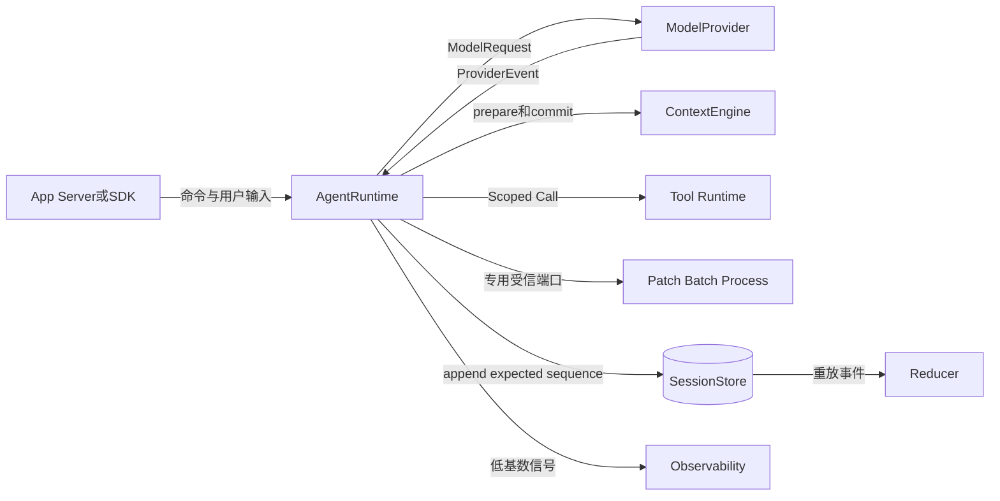

### 5.1 图示说明

- Client只能通过Runtime命令改变会话，不能直接修改`Thread`投影；
- Provider只接收归一化`ModelRequest`，返回归一化`ProviderEvent`，没有Workspace权限；
- Context负责预算内上下文选择和检查事实，Runtime决定何时准备及提交；
- 普通Tool通过`ToolRuntime`或`ScopedToolRuntime`二选一注入；Patch、Batch和Process使用更严格的专用端口；
- Session先保存`EventDraft`，再由Reducer生成权威投影；
- Observability失败不能改变领域结果，敏感正文不进入低基数标签。

### 5.2 源码映射

Runtime入口见[`agent/runtime.py`](../../src/harnessix/agent/runtime.py)的`AgentRuntime`；端口见
[`agent/ports.py`](../../src/harnessix/agent/ports.py)；Provider合同见
[`models/contracts.py`](../../src/harnessix/models/contracts.py)；Session端口见
[`session/ports.py`](../../src/harnessix/session/ports.py)；投影入口见
[`agent/reducer.py`](../../src/harnessix/agent/reducer.py)的`apply_event`和`replay`。

## 6. 职责、依赖与禁止边界

| 组件 | 核心职责 | 允许依赖 | 禁止事项 | 生命周期/所有权 |
|---|---|---|---|---|
| `AgentRuntime` | Agent Loop、命令、锁、预算、交互与恢复编排 | 领域模型和注入端口 | 直接打开文件、启动进程、调用Provider SDK | Async context拥有Session；每Thread一把内存锁 |
| `models.py` | 持久领域对象、状态、事件Schema | 稳定跨包合同 | 保存SDK响应、Exception或Secret值 | 事件版本兼容期内稳定 |
| `reducer.py` | Thread级顺序、身份和生命周期守卫 | Item/Turn Reducer | I/O、网络、时钟或随机副作用 | 纯函数，可在线/重放复用 |
| `turn_reducer.py` | Turn状态、预算和终态不变量 | 领域事件 | 跳过非法状态或容忍悬空Item | 每个Event纯投影 |
| `item_reducer.py` | Item创建、完成和关联约束 | Item合同 | 跨Turn修改Item | 每个Event纯投影 |
| `CancelToken` | 领域取消协作和子Task回收 | `asyncio` | 仅取消父Task而不持久化意图 | 每活动Turn一个Token |
| `ToolExecutionScope` | 绑定Thread/Turn/Call/Workspace/请求指纹 | Agent模型 | 充当文件系统能力或凭据容器 | 每次Tool Call新建 |
| `SQLiteSessionStore` | 事件追加、快照、迁移、Owner和重放 | SQLite、Reducer | 绕过Reducer写入投影 | 数据库生命周期 |

依赖方向固定为“Runtime依赖Port，Adapter实现Port”。任何Tool都不能通过持有`AgentRuntime`回调来
修改Turn；它只能返回合同结果，由Runtime按序提交事件。

## 7. 领域对象与重点字段

### 7.1 Thread、Turn与Item

| 结构/字段 | 类型/必填 | 来源 | 语义与约束 | 敏感级别 | 持久化/兼容 |
|---|---|---|---|---|---|
| `Thread.thread_id` | UUID/是 | Runtime生成 | Session范围唯一身份 | 低 | Event与快照；Fork使用新ID |
| `Thread.workspace` | 绝对路径字符串/是 | 创建请求 | Thread绑定的工作区；拒绝NUL和相对路径 | 中 | Thread创建事实；读取时校验 |
| `Thread.sequence` | int/是 | Store分配 | 最后持久事件序号，必须连续 | 低 | CAS依据，不可回退 |
| `Thread.active_turn_id` | UUID或空 | Reducer | 非终态Turn唯一所有者 | 低 | 终态Event后清空 |
| `Turn.request_id` | string/是 | Client/App Service | 同一Thread命令幂等身份，长度1～256 | 低 | 重复同请求返回原Turn；变体冲突 |
| `Turn.request_fingerprint` | 64位摘要/是 | Runtime | 绑定用户输入、预算等请求事实 | 低 | Retry和交互关联依据 |
| `Turn.execution_mode` | immediate/deferred | 调用方 | deferred只先接受，稍后显式`resume_turn` | 低 | `TurnStarted`事实 |
| `Turn.status` | `TurnStatus`/是 | Reducer | 当前生命周期状态 | 低 | 只能按合法转换改变 |
| `Turn.budget` | `Budget`/是 | 请求或默认 | 步数、Token、时间、输出和Tool数上限 | 低 | 开始后不可变 |
| `Turn.model_attempts` | tuple/是 | Provider事件 | 每次调用开始、暴露和终止账本 | 中 | 用于恢复与禁止不安全重试 |
| `Turn.items` | tuple/是 | 领域事件 | 顺序语义历史 | 高 | 用户/模型内容需按数据策略保护 |
| `Item.item_id` | UUID/是 | Runtime | Thread及Fork历史内唯一 | 低 | Reducer拒绝重复 |
| `Item.status` | started/completed/failed/cancelled | Reducer | Item生命周期 | 低 | 终止后不可重新打开 |
| `ToolCallContent.call_id` | UUID/是 | Runtime归一化 | Harnessix Tool Call身份 | 低 | Tool Result必须匹配 |
| `provider_call_id` | string/是 | Provider Adapter | 上游调用关联，不作为内部主键 | 中 | 最大256字符 |
| `tool_fingerprint` | 64位摘要/可空 | Tool定义快照 | 防止定义漂移后误执行 | 低 | 有值时严格格式校验 |

### 7.2 Event与Delta

`EventDraft`携带版本、`event_id`、可选`turn_id`、发生时间和Payload；Store在持久化时补充
`thread_id`与严格递增`sequence`形成`AgentEvent`。当前写版本是19，可读取1至19并在加载时Upcast。`ItemDelta`只用于当前连接的流式
体验，权威文本以持久Item完成事实为准；断线客户端通过Protocol Event重放而不是依赖丢失Delta。

## 8. Turn状态机与不变量

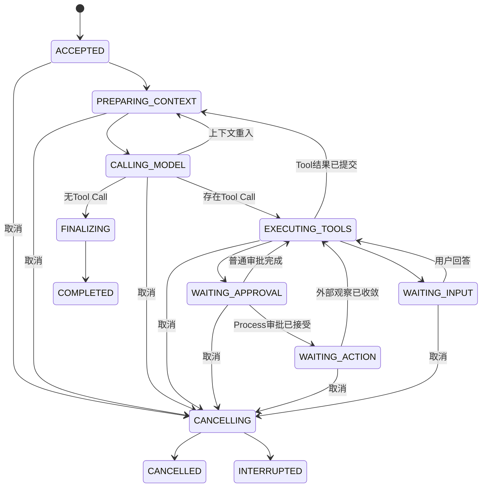

图中未逐条绘制的通用失败边：任何非终态且非`CANCELLING`状态可在记录公开`ErrorItem`后进入
`FAILED`或`INTERRUPTED`。`COMPLETED`、`FAILED`、`CANCELLED`和`INTERRUPTED`是终态，不可重开。

关键不变量由[`turn_reducer.py`](../../src/harnessix/agent/turn_reducer.py)执行：

1. `CALLING_MODEL`前检查步数和Token预算并记录Model Attempt；
2. `WAITING_APPROVAL`必须存在已开始的Approval Item及对应待处理Tool Call；
3. `WAITING_INPUT`只接受Event v19及以上，且必须绑定`ask_user` Call和已完成Question Request；
4. `WAITING_ACTION`必须有已决定的Process审批，不能伪造为普通Tool等待；
5. 终态前不能存在运行中的Model Attempt、开放Compaction、`STARTED` Item或待处理Call；
6. `COMPLETED`不能携带错误、未知Tool结果、恢复副作用或未完成Batch；
7. 非成功终态必须有与最终失败一致的Error Item；
8. Steering只在Model Step边界触发重入，不中断当前Provider Attempt。

## 9. Reducer、事件顺序与持久化模型

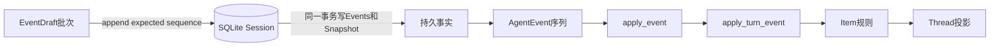

`apply_event`同时服务在线追加和`replay`。它拒绝首事件不是Thread创建/Fork、序号不连续、重复
Thread创建、活动Turn之外的修改、归档活动Thread和终态重开。`replay`额外拒绝重复Event ID、空
Transcript和序列缺口。SQLite Store在同一事务中追加一组事件并更新Snapshot；调用方通过
`expected_sequence`进行CAS。进程重启后可从Event Log重建并校验Snapshot，不信任单独的缓存投影。

## 10. 公共端口与方法合同

| 接口/方法 | 调用者与实现者 | 输入/输出 | 前置与后置 | 错误、取消、超时 | 幂等与顺序 | 权限边界 |
|---|---|---|---|---|---|---|
| `AgentRuntime.run_turn` | App Service/SDK → Runtime | Thread、输入、预算 → 终态或等待态Turn | Thread无活动Turn；先持久化接受 | `KernelError`公开；Cancel Token协作；受Turn deadline约束 | `request_id + fingerprint`幂等；每Thread串行 | 不授予Tool权限 |
| `accept_turn` | App Service → Runtime | 同上 → `ACCEPTED` Turn | 仅持久接受，不打开Provider流 | 存储失败不返回已接受 | 同请求重放安全 | 用于先响应后后台驱动 |
| `resume_turn` | App Service/恢复器 → Runtime | Thread/Turn → 推进结果 | Turn必须处于可驱动等待边界 | 非法状态失败关闭 | 同Thread锁内执行 | 不绕过审批/提问 |
| `retry_turn` | Client → Runtime | 失败Turn、新请求身份 → 新Turn | 仅最后一个失败/取消/中断Turn；无未知效果 | `turn_retry_not_latest`、`retry_unsafe_effect` | 新Turn身份；原Turn不变 | 不重用旧审批授权 |
| `cancel` | Client/关闭流程 → Runtime | Thread/Turn → 取消结果 | 必须为当前活动Turn | 先持久取消意图，再通知Token；无法安全停止则中断 | 重复取消读取已有状态 | 不等于操作系统强杀副作用 |
| `steer_turn` | Client → Runtime | Steering消息 → Turn | 当前Turn活动且边界允许 | 当前Attempt不被透明中断 | 用户消息持久化一次 | 内容仍是不可信输入 |
| `reply_question` | Client → Runtime | Question ID、Call ID、答案 | 精确匹配当前等待问题 | 过期/错配拒绝 | 相同事实幂等，不同答案冲突 | 只解除绑定问题 |
| `reply_approval` | Client → Runtime | Approval ID、请求指纹、决定 | ID与原请求指纹匹配 | 过期、关闭、错配拒绝 | 相同决定幂等；不同决定冲突 | 授权仅限绑定Call |
| `ModelProvider.stream` | Runtime → Adapter | `ModelRequest` → 事件流 | 历史已归一化 | 关闭流响应取消/超时；Provider错误分类 | Attempt身份稳定 | Provider无Workspace权限 |
| `ScopedToolRuntime.execute_scoped` | Runtime → Tool | Call、Scope、Token → Result | Call已持久且状态为执行中 | 输出有界；异常转稳定Tool失败 | Scope绑定请求指纹；结果按Call关联 | Scope不是FS能力或Secret |
| `SessionStore.append` | Runtime → Store | EventDraft批次、期望序号 → Thread | Thread存在且序号一致 | 存储/投影错误关闭 | 单事务、严格顺序 | Store不替Runtime授权 |

## 11. 正常Agent Loop

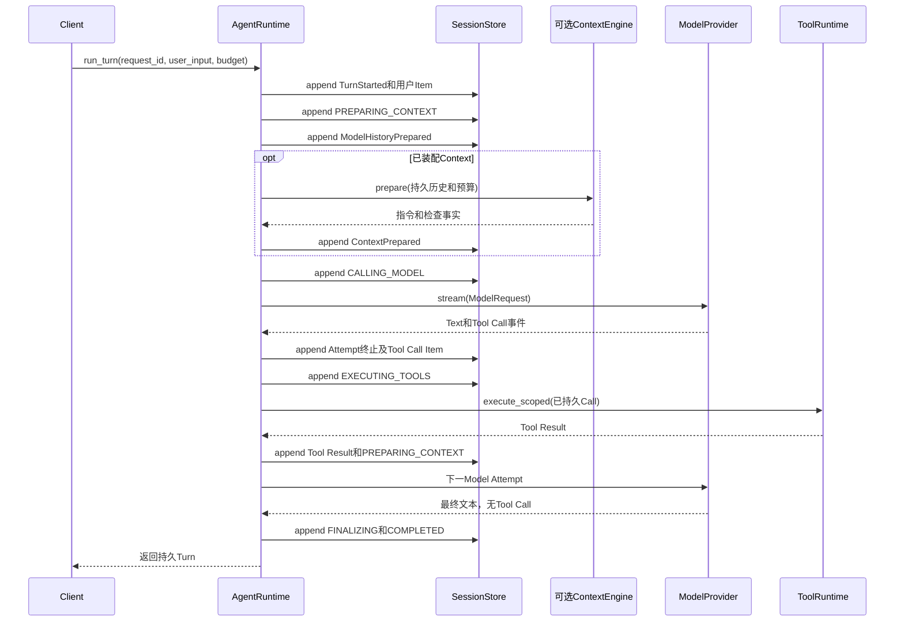

关键顺序是“意图先于副作用，结果先于下一决策”。Context准备结果、Model Attempt、Tool Call、Tool
Result和终态均先进入Session，再向后推进。流式Delta可提前显示，但不能替代完成后的持久文本。

## 12. 多Tool调度

Runtime只并行一个连续的、全部声明`READ_ONLY`且`supports_parallel_calls=True`的前缀，并受
`max_parallel_tools`限制；写Tool、未选择并行的只读Tool和专用Patch/Process形成串行屏障。多个并行
结果即使实际完成顺序不同，也按Provider给出的Call顺序持久化。任一并行兄弟失败时，Runtime取消并
完整回收其余Task，避免孤儿执行跨越下一Model Step。

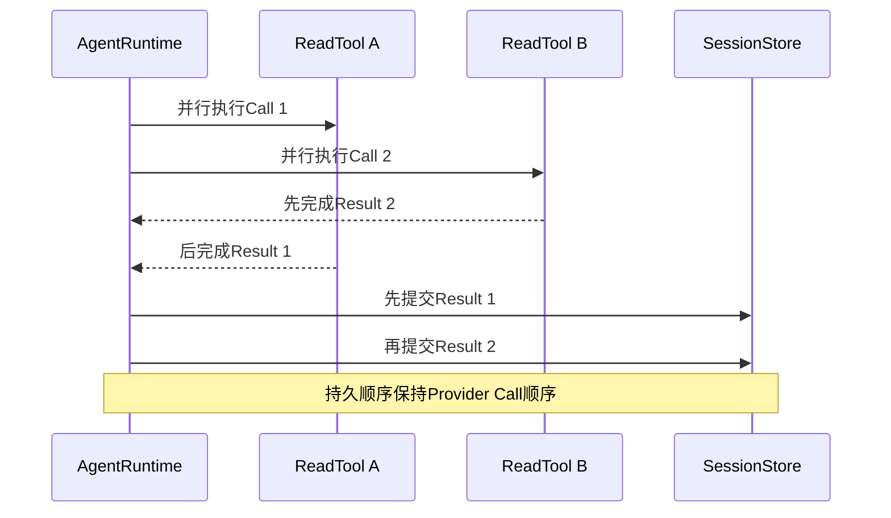

## 13. 审批、提问与Steering

### 13.1 审批

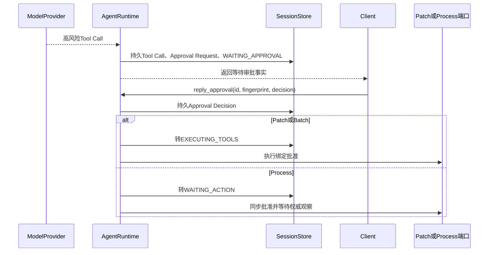

审批ID和请求指纹共同绑定当次请求；相同决定可重复读取，不同决定形成冲突。批准不是会话级权限提升。
Process在批准后进入`WAITING_ACTION`，因为宿主进程可能继续存在，不能把“批准已提交”等同于“效果已完成”。

### 13.2 提问

内置`ask_user` Call先产生Question Request并转`WAITING_INPUT`；`reply_question`必须同时匹配
Question和Call。答案持久化后转回`EXECUTING_TOOLS`，生成对应Tool Result，再进入Context准备。宿主
重启时，未过期问题保持等待；已回答且尚未继续的安全边界可继续推进。

### 13.3 Steering

Steering作为新的用户消息持久化。它不粗暴终止正在消费的Provider流，而是在当前Attempt完成且没有
待处理Tool Call时，通过Event v19允许`CALLING_MODEL`边界重入，使下一步模型看到新指令。这样既保留
当前Attempt的用量和输出事实，也避免把半个Provider响应静默丢弃。

Steering也允许发生在首个模型步骤的历史准备期间。历史准备包含“读取Session、生成模型视图、验证Artifact、
持久化`ModelHistoryPrepared`”多个步骤，不能假定其间Session不变。实际实现把该并发边界提取到
[`model_history_runtime.py`](../../src/harnessix/agent/model_history_runtime.py)：验证完成后在Thread锁内重新
从最新Session事实生成同一`PreparedModelHistory`；若与已验证快照不同，则丢弃旧准备结果并重新执行准备和
Artifact验证，不提交过期检查记录。若最新状态已经是`CANCELLING/CANCELLED`，则转入`TurnCancelled`收敛路径。

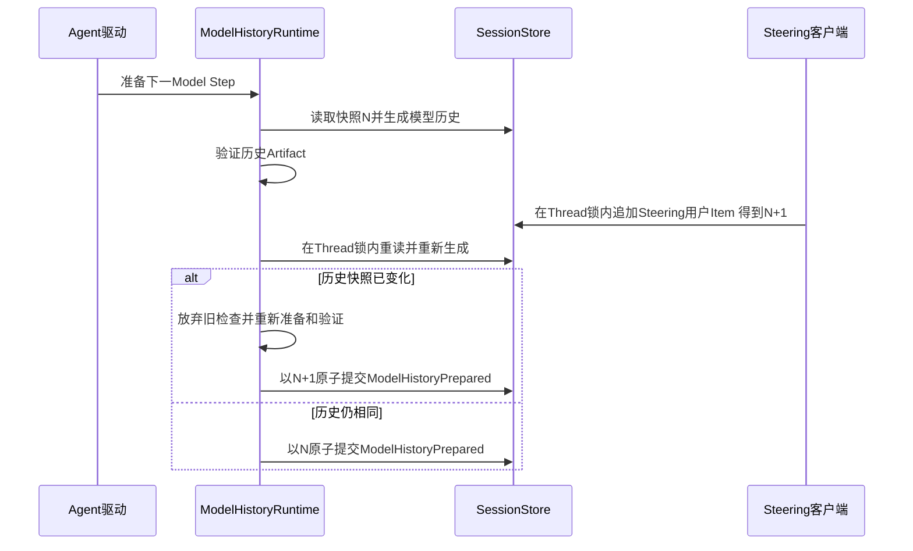

这不是对`invalid_event`的事后重试：旧准备结果在进入Reducer前就完成确定性比较，因此真实合同损坏仍按
`invalid_event`失败，只有可证明由并发Session变化造成的快照失效才重新准备。

## 14. 取消、超时和关闭

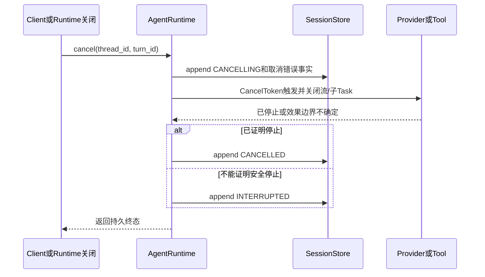

用户取消由领域`CancelToken`表达；父`asyncio.Task`被取消属于宿主中断，两者不能混同。Token的
`run`无论成功、失败或取消都会取消并等待子Task及等待器。Turn deadline在打开Provider流和派发Tool
前检查，超时关闭流并记录`time_budget_exceeded`。Runtime退出时先取消活动Token，回收Task，再等待
Thread锁并释放Session Owner；关闭不能留下仍可提交事件的后台执行。

## 15. Retry与崩溃恢复

### 15.1 Retry

Retry不是把旧Turn改回活动态，而是创建一个引用`retry_source_turn_id`的新Turn。仅同一Thread中紧邻
当前、状态为`FAILED`、`CANCELLED`或`INTERRUPTED`的Turn可重试；若旧Turn包含未知Tool效果则拒绝。
新Turn重新计算请求指纹和预算，旧错误、用量和Items保持审计可见。

### 15.2 重启恢复

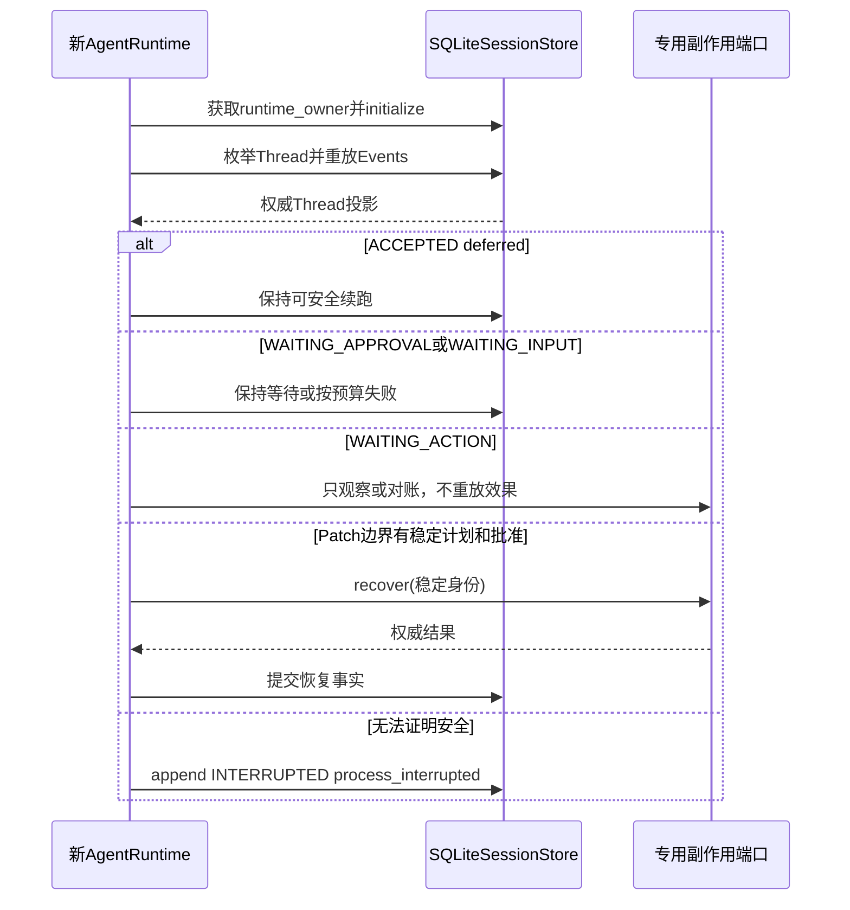

| 崩溃时状态/边界 | 恢复行为 | 防重复依据 |
|---|---|---|
| deferred `ACCEPTED` | 保留并允许显式`resume_turn` | Provider从未打开 |
| `WAITING_APPROVAL` | 预算内保持等待；过期则失败 | 高风险效果尚未获得批准 |
| `WAITING_INPUT` | 未回答保持等待；已回答安全边界继续 | Answer与Call均已持久化 |
| Process批准提交边界 | 可从稳定Action身份重建；无Process端口则保持等待 | 不重新创建新Action |
| `WAITING_ACTION` | 等待显式观察后继续 | 不自动重放宿主效果 |
| Patch/Batch稳定计划边界 | 调用专用`recover`对账 | Plan、Approval、Fingerprint已持久化 |
| 普通活动调用且安全性不明 | 转`INTERRUPTED` | 宁可中断，不猜测执行结果 |

## 16. Provider中立历史、Context与Compaction

Runtime根据持久Item构造Provider中立历史，再由Adapter翻译为上游格式。Provider事件必须先通过流式
协议校验：开始、文本、Tool Call、完成和失败顺序不合法时，Runtime记录`invalid_provider_output`，且
不得派发其中任何Tool。Context Engine在每个Model Step前选择Source、执行预算和生成检查记录；Runtime
提交这些事实后才调用模型。

长会话可通过Compaction创建摘要和活动窗口。Compaction有独立Attempt Ledger，开放尝试不能与终态
并存；重启仅激活已经完整持久化的摘要窗口。Tool结果面向模型的视图可被有界压缩或替换为Artifact
引用，但审计层保留原始领域结果或稳定引用。相关实现见
[`context/engine.py`](../../src/harnessix/context/engine.py)、
[`context/compaction_ledger_contracts.py`](../../src/harnessix/context/compaction_ledger_contracts.py)和
[`context/tool_result_contracts.py`](../../src/harnessix/context/tool_result_contracts.py)。

## 17. 持久化、事务、并发与迁移

### 17.1 Session持久化

SQLite Session Store初始化时校验22个迁移及校验和，启用WAL，并获取数据库旁路Owner锁。每次
`append`冻结输入Draft，在事务内校验期望序号、追加事件、应用Reducer并更新Snapshot。读取时解析及
Upcast旧Event；`rebuild`从完整Event Log重新投影，可发现快照与历史不一致。

### 17.2 并发和一致性

- Runtime内每个Thread一把锁，所有状态命令串行；不同Thread可并行；
- `_active`记录活动Turn的Token和Task，关闭和取消必须完整回收；
- Session `expected_sequence`提供跨调用CAS，冲突不会静默覆盖；
- 模型历史Artifact验证后必须在Thread锁内重建并比较最新模型视图；并发Steering导致差异时重新准备，不能把
  过期`ModelHistoryPrepared`提交给Reducer；
- 单数据库Runtime Owner防止两个本地Agent宿主并发驱动同一Session；
- 并行只读Tool的完成顺序不影响持久顺序；写效果不进入并行组；
- App Service先持久`ACCEPTED`再启动后台Task，崩溃不会形成“已响应但无接受事实”的空洞。

## 18. 错误、未知结果与安全

### 18.1 错误分类

[`agent/errors.py`](../../src/harnessix/agent/errors.py)将稳定错误映射为`input`、`provider`、`tool`、
`approval`、`budget`、`cancelled`、`interrupted`、`storage`、`conflict`和`internal`。`KernelError`
只携带可公开code、message和retryable；第三方异常原文、请求头、Token或SDK对象不得写入Session。

### 18.2 未知结果

普通Tool结果若是`unknown`或携带不可信恢复结果，Agent Loop停止而不是继续让模型决策。Patch、Batch和
Process必须通过专用端口用稳定计划/Action身份恢复。Retry也拒绝跨越未知效果，防止用户重试造成第二次
副作用。

### 18.3 数据流与信任

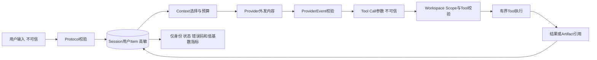

用户文本、模型文本、Tool参数和Tool输出均可能包含源码或敏感业务数据，应按Session数据保护。Secret值
不属于Agent Event合同；只允许受控边界传递`SecretRef`。`ToolExecutionScope`绑定身份但不直接授予
文件能力；路径安全、Sandbox和网络策略由具体执行模块负责。模型输出永远是不可信建议，不能绕过Tool
Registry、Effect Class或审批。

## 19. 可观测性

| 信号 | 触发点 | 关键属性 | 基数与敏感规则 | 用途 |
|---|---|---|---|---|
| Trace | Turn接受、Model Step、Tool、审批、恢复、取消 | thread/turn/call、状态、公开错误码 | 不记录Prompt、Tool正文、Secret；身份字段按策略采样 | 跨组件定位延迟和失败 |
| Metric | Turn终态、Provider用量、Tool结果、恢复 | 状态、类别、Tool稳定名 | 禁止request_id等无界标签 | 成功率、预算和故障趋势 |
| Log | 生命周期和异常边界 | 操作、状态、公开错误 | 异常原文仅经清洗后记录；Session正文不进入结构化字段 | 运维诊断 |
| Agent Event | 所有权威领域变化 | sequence、event_type、领域数据 | 属于持久审计，不等同遥测 | 重放、恢复和客户端Replay |

观测实现通过注入端口进入Runtime；观测失败不能回滚已提交领域事实，也不能改变Tool结果。

## 20. 核心业务逻辑伪代码

```text
run_turn(thread, request):
    acquire thread_lock
    validate no active turn
    if request_id exists:
        require same request_fingerprint
        return existing turn
    append atomically: TurnStarted(initial status ACCEPTED) + UserItem start/finish
    create CancelToken and managed Task
    return drive(turn)

drive(turn):
    while turn is active:
        checkpoint cancellation and deadline
        append PREPARING_CONTEXT
        repeat:
            prepared_history = prepare_from_durable_history()
            verify_all_artifact_references(prepared_history)
            under thread_lock:
                current_history = prepare_from_latest_session()
                if current_history differs from prepared_history:
                    continue repeat
                append ModelHistoryPrepared atomically
        context = build_from_committed_history()
        append ContextPrepared and CALLING_MODEL
        events = consume_and_validate_provider_stream(context)
        append ModelAttempt terminal facts and completed Items
        if no tool calls:
            append FINALIZING then COMPLETED
            return durable turn
        append EXECUTING_TOOLS
        for each serial barrier or bounded parallel read prefix:
            require call already persisted
            if approval or input required:
                append request fact and waiting state
                return durable waiting turn
            execute through injected port with scope and CancelToken
            append results in provider call order
        continue with next context preparation

on cancellation_or_timeout:
    append CANCELLING before signalling children
    cancel and drain provider/tool tasks
    append CANCELLED when stopped, otherwise INTERRUPTED

recover(thread):
    rebuild only from durable events
    preserve explicit waiting boundaries
    reconcile only through a stable dedicated effect identity
    never replay an effect whose non-execution cannot be proven
    otherwise append INTERRUPTED with a public failure
```

## 21. 源码与测试双向映射

| 设计元素 | 源码文件 | 关键符号 | 测试文件 | 测试函数/合同 | 证明内容 |
|---|---|---|---|---|---|
| Runtime生命周期 | [`runtime.py`](../../src/harnessix/agent/runtime.py) | `AgentRuntime.__aenter__`、`__aexit__` | [`test_runtime.py`](../../tests/agent/test_runtime.py) | `test_only_one_runtime_host_and_lock_released`、`test_shutdown_cancels_managed_turn` | 单Owner和有界关闭 |
| Turn接受与驱动 | [`runtime.py`](../../src/harnessix/agent/runtime.py) | `accept_turn`、`run_turn`、`_drive` | [`test_runtime.py`](../../tests/agent/test_runtime.py) | `test_cancellation_at_admission_commit_does_not_leave_active_turn` | 接受提交边界 |
| Thread投影 | [`reducer.py`](../../src/harnessix/agent/reducer.py) | `apply_event`、`replay` | [`test_store.py`](../../tests/agent/test_store.py) | `test_replay_and_projection_rebuild`、`test_terminal_cannot_reopen` | 在线/重放同一规则 |
| Turn状态 | [`turn_reducer.py`](../../src/harnessix/agent/turn_reducer.py) | `_change_state`、`_model_attempt` | [`test_runtime.py`](../../tests/agent/test_runtime.py) | `test_step_budget`、`test_token_budget_prevents_tool_dispatch` | 状态和预算守卫 |
| Item状态 | [`item_reducer.py`](../../src/harnessix/agent/item_reducer.py) | `_start_item`、`_finish_item` | [`test_store.py`](../../tests/agent/test_store.py) | `test_tool_result_pairing_and_order_in_reducer` | Item不可错配/重开 |
| Provider流 | [`runtime.py`](../../src/harnessix/agent/runtime.py) | `_sample` | [`test_runtime.py`](../../tests/agent/test_runtime.py) | `test_invalid_provider_stream_never_dispatches_tools`、`test_text_deltas_idempotency_and_trace_context` | 协议校验和Delta |
| Tool调度 | [`runtime.py`](../../src/harnessix/agent/runtime.py) | `_execute_calls`、`_execute_tool` | [`test_tool_scheduling.py`](../../tests/agent/test_tool_scheduling.py) | `test_parallel_read_results_commit_in_provider_order`、`test_non_opt_in_reads_remain_serial_barrier` | 有界并行和稳定顺序 |
| 取消 | [`cancellation.py`](../../src/harnessix/agent/cancellation.py) | `CancelToken`、`TurnCancelled` | [`test_runtime.py`](../../tests/agent/test_runtime.py) | `test_user_cancel_during_provider_and_active_turn_conflict`、`test_cancel_during_tool_stops_follow_up_model` | 取消和子Task回收 |
| Retry | [`runtime.py`](../../src/harnessix/agent/runtime.py) | `retry_turn` | [`test_runtime.py`](../../tests/agent/test_runtime.py) | `test_terminal_turn_retry_creates_new_turn_and_is_idempotent`、`test_retry_rejects_completed_and_non_latest_turns` | 新Turn与安全限制 |
| 审批 | [`runtime.py`](../../src/harnessix/agent/runtime.py) | `reply_approval` | [`test_approval_crash_recovery.py`](../../tests/agent/test_approval_crash_recovery.py) | `test_approval_crash_boundaries` | 各提交边界恢复 |
| 交互与历史并发 | [`runtime.py`](../../src/harnessix/agent/runtime.py)、[`model_history_runtime.py`](../../src/harnessix/agent/model_history_runtime.py) | `steer_turn`、`prepare_and_commit_model_history` | [`test_interactions.py`](../../tests/agent/test_interactions.py) | `test_steering_during_history_verification_restarts_preparation`及Steering、Question、错配与恢复用例 | Steering在历史验证竞态中不会提交过期检查或误失败 |
| Process恢复 | [`runtime.py`](../../src/harnessix/agent/runtime.py) | `_recover` | [`test_crash_recovery.py`](../../tests/agent/test_crash_recovery.py) | `test_process_crash_recovers_without_replaying_tool` | 不重复宿主效果 |
| Patch恢复 | [`runtime.py`](../../src/harnessix/agent/runtime.py) | `_recover_patch`、`_recover_patch_batch` | [`test_kernel_patch_crash.py`](../../tests/patches/test_kernel_patch_crash.py) | Patch崩溃边界参数化用例 | 稳定计划对账 |
| Session CAS/重放 | [`sqlite.py`](../../src/harnessix/session/sqlite.py) | `SQLiteSessionStore.append`、`rebuild` | [`test_session_upgrade.py`](../../tests/agent/test_session_upgrade.py) | 旧Schema升级和重放用例 | 迁移、CAS、投影一致 |
| 公开错误 | [`errors.py`](../../src/harnessix/agent/errors.py) | `failure_category`、`KernelError` | [`test_runtime.py`](../../tests/agent/test_runtime.py) | `test_raw_exception_not_persisted`、`test_provider_failure_is_classified_without_retry` | 错误脱敏和分类 |

### 21.1 推荐源码阅读路线

1. 从[`models.py`](../../src/harnessix/agent/models.py)阅读`TurnStatus`、`Thread`、`Turn`、`Item`和
   `AgentEvent`，先建立持久领域词汇；
2. 阅读[`reducer.py`](../../src/harnessix/agent/reducer.py)，再进入
   [`turn_reducer.py`](../../src/harnessix/agent/turn_reducer.py)和
   [`item_reducer.py`](../../src/harnessix/agent/item_reducer.py)，掌握不变量；
3. 阅读[`ports.py`](../../src/harnessix/agent/ports.py)和
   [`session/ports.py`](../../src/harnessix/session/ports.py)，确认依赖倒置边界；
4. 按`run_turn` → `accept_turn` → `_drive` → `_sample` → `_execute_calls` → `_execute_tool`阅读
   [`runtime.py`](../../src/harnessix/agent/runtime.py)；
5. 在`_drive`的历史准备调用处转读
   [`model_history_runtime.py`](../../src/harnessix/agent/model_history_runtime.py)，理解Artifact验证与
   `ModelHistoryPrepared`提交之间的乐观重备边界；
6. 最后阅读`_recover`、[`runtime_recovery.py`](../../src/harnessix/agent/runtime_recovery.py)及对应崩溃测试；
7. 用本节表中的测试函数正向验证每个设计结论，而不是只阅读Happy Path。

## 22. 测试设计与验收标准

| 层级 | 必测内容 | 当前证据 |
|---|---|---|
| 领域单元 | Event序列、状态转换、身份唯一、终态不变量 | `tests/agent/test_store.py`、`tests/agent/test_semantic_items.py` |
| Runtime合同 | 多步模型、预算、Provider非法流、公开错误、取消、Retry | `tests/agent/test_runtime.py` |
| 并发 | 只读并行上限、提交顺序、兄弟Task回收、写屏障 | `tests/agent/test_tool_scheduling.py` |
| 交互 | Approval、Question、Steering、历史验证竞态、错配、过期和重复答复 | `tests/agent/test_interactions.py`、审批恢复测试 |
| 故障注入 | Provider、Session、Tool、Patch、Process、Trusted Action各提交边界崩溃 | `tests/agent/test_crash_recovery.py`、`tests/agent/test_trusted_action_runtime.py`等 |
| 兼容 | Event 1～20 Upcast、Session迁移1～25、旧Reader行为 | `tests/agent/test_session_upgrade.py` |
| 产品集成 | 接受后重启、客户端恢复、有界关闭 | [`test_server_sdk.py`](../../tests/app_server/test_server_sdk.py) |

DOC-1.2对本文执行的验收：至少反向核对`AgentRuntime`、`_drive`、`_execute_calls`、`_recover`、
`apply_event`、`replay`、`_change_state`、`CancelToken`、`ToolExecutionScope`、`SessionStore.append`、
`SQLiteSessionStore.rebuild`和`failure_category`十二个符号；至少正向定位正常循环、并行顺序、取消、
审批崩溃、Process恢复、Retry和错误脱敏七类测试。

## 23. 兼容性、限制、风险与后续工作

| 项目 | 当前边界/影响 | 后续归属 |
|---|---|---|
| 默认产品的外部Action Config、Doctor能力报告与启动全局恢复已通过全矩阵CI | Agent内Trusted Action主链已关闭；旧HTTP/Worker迁移兼容内核仍等待物理删除 | 0.9.1f2/f3 |
| Windows默认产品仅具原生四项只读Tool | Patch被明确省略，Git、写入和Process仍未开放 | 0.9.5 |
| 本地SQLite单Owner | 不支持跨主机Thread并发和云端HA | 1.x候选，不提前侵入1.0 |
| 数据保留、导出和删除策略未完成发布验收 | Session可能随长期使用增长 | 0.9.5和1.0发布门禁 |
| Provider真实能力和计价证据仍有待关闭项 | 离线合同通过不代表所有真实Provider组合 | 0.9.6 |
| Subagent与多Agent不在1.0当前范围 | 不应在Runtime中提前引入分布式调度抽象 | 1.x候选 |

本文及其接口、字段、状态机和映射表作为DOC-1.3/1.4模块迁移的黄金范式：后续模块必须保持
“当前/默认边界、图文说明、失败恢复矩阵、字段语义、伪代码、源码与测试双向映射、明确限制”结构，
不得机械复制本文内容或用空章节达标。

## 24. 统一Trusted Action Agent接入（0.9.1e2）

### 24.1 组件与职责

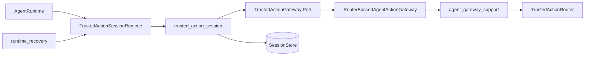

`AgentRuntime`只负责判断一个持久Tool Call是否属于统一Action、提交交互Item并继续Agent Loop。目录核对、确定性Invocation、Policy/Plan、执行与Reconcile属于Gateway和Router；Router决定向Session的CAS传播属于`trusted_action_session`；旧Patch与统一Action的终结核对集中在`runtime_recovery`。该拆分使`runtime.py`和既有热点均不超过0.9.0治理基线。

### 24.2 Session合同

| 合同 | 关键字段 | 不变量 |
|---|---|---|
| `TrustedActionApprovalRequestContent` | Call/Plan ID、三类Fingerprint、Policy、presentation、route_state、decision、Diff Ref | 请求≤16 KiB；Patch Batch必须有Diff；Process禁止Diff；决定与请求指纹及Route拒绝状态一致 |
| `TrustedActionEffect` | Plan ID/Fingerprint、state、origin、Artifact SHA | `action_id == plan_id`；效果状态与Tool Result outcome一致；只保存有界元数据 |
| `TrustedActionReview` | `diff_artifact` | Review只传递Artifact引用，不让Gateway直接依赖Artifact Store |
| `TrustedActionGateway` | `definitions/prepare/decide/sync_decision/execute/recover/close` | Router是批准与执行权威；Session对象不能直接触发Executor |

Agent Event v20首次允许上述审批和效果。v19仍专用于提问、回答、Steering与`WAITING_INPUT`，旧版本Event不能承载统一Action语义。

### 24.3 执行与决定时序

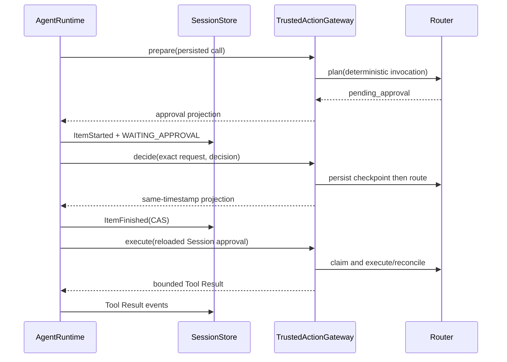

执行前由`TrustedActionSessionRuntime.execute`重新读取Session，不接受调用栈中游离的审批对象。Router已经有决定但Session尚未完成审批Item时，`sync_action_decision`读取原Checkpoint并以同一时间戳补投影；冲突决定失败关闭。

### 24.4 失败与恢复

- 参数、资源和敏感字段等可公开准备失败转换为失败Tool Result；Router/Store故障继续抛出，禁止伪装为业务失败；
- `pending_approval`和`ready`在Turn终结路径不会隐式执行；
- `running/reconciling`先进入`unknown`，之后只允许Reconcile；
- 取消已经Claim的Action会保留`unknown`事实并重抛取消；
- 未知内部恢复异常只保存稳定`trusted_action_recovery_failed`，不持久化原始异常正文；
- reducer要求恢复来源效果不能把中断Turn变成成功，未知效果不能标记完成或取消；
- Router先提交、Session后提交窗口由`sync_decision`恢复；Session已有决定、Router缺Checkpoint窗口由`execute`按原时间补写。

完整计划、状态、错误矩阵和源码映射见[0.9.1e详细设计](../changes/m09-1e-default-trusted-action-composition.md#2211-091e2实际交付边界)。

### 24.5 Trusted Action终态响应丢失恢复

当Router和专用效果Owner已经形成确定终态、但Session的Tool Result提交前宿主退出时，重开会再次进入同一Call的Trusted Action恢复。Gateway必须区分两类来源：

1. Router在本次恢复前已是`denied/succeeded/failed`：只补原执行结果，`origin=execution`；
2. Router原为`unknown/reconciling`并经只读Reconcile得到结果：保持`origin=recovery`，继续受Reducer“恢复效果不得把中断Turn伪装为正常成功”的守卫。

Session已经存在完整Trusted Action Tool Result且无Pending Call时，`EXECUTING_TOOLS`是安全的显式`resume_turn`边界；Runtime启动恢复保留该状态，调用者恢复后继续下一次模型循环。`_execute_calls`不会为了恢复再次追加非法的`executing_tools → executing_tools`转移。该规则只允许推进Session，不授权再次执行副作用。

专项测试在Router终态后分别重入`execute`与调用`recover`，均断言Executor调用次数保持1；实际UNKNOWN对账仍产生`origin=recovery`。历史Eval进一步以Process Lease计数证明响应丢失后未生成第二个进程。

## 25. 默认Workspace Patch分派（0.9.1e3）

[`AgentRuntime`](../../src/harnessix/agent/runtime.py)构造模型请求时，不再仅按内部Definition字典筛选高风险工具；名称还必须由[`TrustedActionSessionRuntime.action_name_owned`](../../src/harnessix/agent/trusted_action_runtime.py)明确持有。该约束保证模型看到的`apply_patch_batch`一定存在完整Gateway、Router和Session投影链，任意误注入Definition不能扩大模型能力面。

模型调用Patch后的Agent状态仍沿用e2统一流程：Prepare持久化Route，Review Provider物化Delivery并发布`action_review`，Reducer写入`WAITING_APPROVAL`；批准后Router执行，最终效果以同一Artifact引用投影到Tool Result。取消发生在运行中的文件效果边界后时，Session不得把恢复来源效果伪装成正常成功或已取消；`unknown/manual_intervention`保持可见终态。

真实纵向测试[`test_trusted_action_patch.py`](../../tests/delivery/test_trusted_action_patch.py)覆盖Agent→Router→Delivery→文件系统，[`test_server_and_cli.py`](../../tests/product_config/test_server_and_cli.py)覆盖真实SDK广告、Artifact读取、审批和最终回答。

## 26. 变更记录

| 文档版本 | 代码版本 | 日期 | 变更摘要 |
|---|---|---|---|
| 10 | `c67f48dfffb683d61c3a91d813c0add25596202f` | 2026-09-19 | 同步Trusted Action Router终态响应丢失只补原执行投影、EXECUTING_TOOLS安全续跑及不重放候选 |
| 9 | `e5b7a8a4072dcb0ed4992ea94e2e0a8420f24a58` | 2026-09-19 | 记录e5外部Action Config与启动恢复通过CI 35439332019并关闭 |
| 8 | `27e0b5918c6497dfe9df10e3f5a9d4c0ed08d8f7` | 2026-09-19 | 同步固定Container Process已验收事实，登记e5外部Action Config与启动恢复候选边界 |
| 5 | `71a479439edcdd29b863ec3a9bad7a52586dd1bf` | 2026-09-13 | 接入默认POSIX Workspace Patch，收紧模型工具目录所有权，记录Review、审批、执行、取消和SDK纵向链 |
| 4 | `328aa2d6c8ee85a75ab2baef51b80869dc4089a8` | 2026-09-13 | 接入Agent Event v20、统一Trusted Action审批/效果、Router先行决定恢复、Session migration23和结构化恢复模块；默认高风险产品目录仍未开放 |
| 3 | `684a17ecc013549e3472978f1c0e8c1eca4db92e` | 2026-09-13 | 记录0.9.1c Steering历史重备实现、取消协作语义、测试同步提交`84ffd59`及[CI 34727612571](https://github.com/carrie1988/Harnessix/actions/runs/34727612571)全矩阵验收 |
| 2 | `35e9e889f78534fd8866f76cfe24d936b08d345d` | 2026-09-13 | 同步0.9.1c Steering与模型历史验证/提交竞态治理，增加乐观重备算法、源码、时序和确定性回归映射 |
| 1 | `7c50a5815e3d859fcdd93176d8a5019bf419b6bc` | 2026-09-12 | DOC-1.2 Agent Runtime黄金样例初版 |
