# API模块设计

## 1. 模块摘要

| 项目 | 内容 |
|---|---|
| 源码包 | [`src/harnessix/api`](../../src/harnessix/api/) |
| 当前职责 | 把Action Plane应用服务投影为FastAPI HTTP接口，管理Service Lifespan，映射公开领域错误和非终态POST状态，接收W3C Trace Header并记录HTTP Span、Metric与Log |
| 非职责 | 不实现Action状态机、Policy、Approval规则、Executor、Worker、Journal事务、Agent Protocol、最终用户认证、租户授权、限流、请求预算、API Gateway或自动客户端重试 |
| 上游调用者 | Python HTTP SDK、LangGraph Adapter、业务服务、受信本地客户端和外层Gateway |
| 下游依赖 | `ActionService`、Domain合同、Bootstrap、Settings、Observability、FastAPI/Starlette |
| 网络协议 | HTTP/JSON；Action资源路径位于`/v1`，Health与Ready为无版本系统路径 |
| 持久化 | API自身无数据库；全部Action事实由注入Service的Effect Journal持久化 |
| 默认部署 | `harnessix serve`启动Uvicorn；默认监听`127.0.0.1:8787`，Docker镜像默认`0.0.0.0:8787` |
| 公共导出 | `harnessix.api`只导出`create_app`；模块同时定义默认全局`app`供Uvicorn导入 |
| 代码版本 | `3480ee8d15c0de0f2f182a3dceafd37cb59a32d7` |
| 当前完成度 | 基础Action资源、inline/queued状态投影、生命周期与HTTP观测已实现；身份、授权、输入输出预算、错误统一、分页、并发控制、稳定Trace校验和生产网络门禁未完成 |

本文是[`api/app.py`](../../src/harnessix/api/app.py)与
[`api/__init__.py`](../../src/harnessix/api/__init__.py)的当前事实源。Action状态机、事务与副作用恢复见
[Action Plane子系统设计](../subsystems/action-plane.md)；HTTP客户端行为见[SDK模块设计](sdk.md)；
Journal内部保证见[Storage模块设计](storage.md)。

## 2. 需求背景

Action Plane提供framework-agnostic副作用治理，但仅有Python应用服务不能形成跨进程集成边界。HTTP层需要在不复制
领域状态机的前提下回答：

1. 外部框架如何提交版本化Action并取回持久Snapshot；
2. 等待审批、等待Worker或效果不确定时，响应应表示为成功终态还是进行中资源；
3. 幂等冲突、非法状态转换和资源不存在如何形成稳定机器错误；
4. API进程启动和停止时，Journal迁移、过期Lease恢复、连接池和Telemetry由谁拥有；
5. Inline执行和Queued执行是否使用同一资源合同；
6. Trace Header如何进入同步请求Span，并随Action持久到异步Worker；
7. Health与Readiness分别证明什么，不能证明什么；
8. API可以在何种网络和身份边界下安全暴露；
9. 大请求、长执行、断连、并发审批和历史事件增长如何限制资源；
10. OpenAPI、Python SDK与运行时路由如何保持一致。

当前API是Action Plane的薄HTTP Adapter，不是完整公网产品Gateway。它把合法HTTP输入交给`ActionService`，但仍有
若干关键生产控制未实现，必须由本文明确而不能由部署者从“FastAPI可运行”推导出来。

## 3. 设计目标、非目标与术语

### 3.1 当前设计目标

1. API路由直接复用`ActionRequest`、`ApprovalDecision`、`ActionSnapshot`、`ActionEvent`和`ToolDescriptor`；
2. API不复制Action状态转换、Policy、执行或Reconcile规则；
3. FastAPI Lifespan统一初始化并关闭注入或自动构造的Service；
4. 非终态状态变更POST以202返回，确定结果以200返回；
5. 领域`HarnessixError`映射为`{"error":{"code","message"}}`；
6. Action ID在路由层解析为UUID；
7. Tool与Event列表使用显式Envelope；
8. `/readyz`调用Journal Ping，不把进程存活冒充存储就绪；
9. 有界Trace Header对象进入HTTP SERVER Span；
10. HTTP Metric只使用Method、Route和Status等低基数属性；
11. 日志不直接记录请求/响应正文；
12. Inline和Queued模式保持同一URL与Domain Schema；
13. OpenAPI由实际FastAPI应用生成并提交到`spec/openapi.json`；
14. 应用可以通过显式Service注入进行确定性测试或自定义装配。

### 3.2 明确非目标

- 不验证Bearer Token、Session Cookie、API Key、mTLS或OAuth；
- 不从可信凭据重建`Principal`，不验证请求体中的tenant、subject、framework和roles；
- 不执行tenant级Action/Events读取过滤；
- 不提供租户、用户、角色、组织或资源授权目录；
- 不提供CORS、CSRF、WAF、速率限制、配额、计费或滥用治理；
- 不限制HTTP Body字节、JSON深度、任意字段节点数或响应总字节；
- 不提供Event分页、长轮询、SSE、WebSocket或回调；
- 不提供Action取消、重试、删除、归档、批量查询或管理端点；
- 不在HTTP层自动重试提交、审批或Reconcile；
- 不保证Client断连会形成领域取消或停止已开始的外部副作用；
- 不提供TLS终止、证书轮换、Host Allowlist或反向代理配置；
- 不在Readiness中验证Worker存活、Registry、Executor、Telemetry或外部系统；
- 不把API与Agent Protocol合并为同一状态机或同一Server。

### 3.3 关键术语

| 术语 | 含义 |
|---|---|
| Action resource | 由`action_id`定位、Journal持久化的`ActionSnapshot` |
| state-changing POST | Submit、Approval或Reconcile；可能同步终结，也可能返回进行中资源 |
| 202 projection | HTTP操作被接受但返回Snapshot仍非终态；不是失败，也不保证最终成功 |
| resource GET | 查询当前Snapshot；无论当前是否终态，成功找到都返回200 |
| Harnessix error | Domain显式抛出的带Code、Message和HTTP Status的公开错误 |
| framework validation error | FastAPI/Pydantic在调用Route前生成的422默认错误，不使用Harnessix Error Envelope |
| Lifespan owner | FastAPI应用在进入时调用Service Initialize，在退出时调用Service Close |
| inline | API Service在请求内Claim并执行Action |
| queued | API只推进到Ready，独立Worker从共享Journal领取 |
| liveness | 进程能处理一个简单HTTP请求，不证明依赖健康 |
| readiness | 当前仅Journal `ping()`结果，不等于完整业务可服务证明 |

## 4. 系统上下文与信任边界

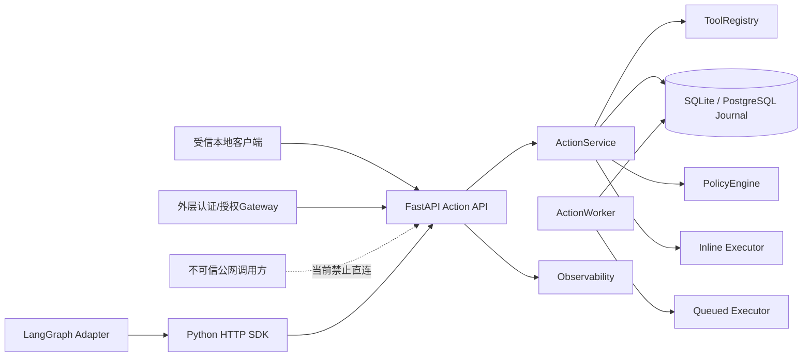

**图示说明：** API信任调用方提供的完整Action合同。当前没有代码验证Gateway已经认证，也没有签名或共享Secret证明
请求来源。Queued Worker不经API获取Action，而是直接共享Journal。HTTP响应只是持久Snapshot投影，权威状态仍在
Journal。

### 4.1 允许依赖

| 方向 | 规则 |
|---|---|
| API → Domain Models | 允许；直接作为Request/Response Model，不复制字段 |
| API → ActionService | 允许；只调用公开应用方法 |
| API → Settings/Bootstrap | 允许；仅用于默认应用装配 |
| API → Observability | 允许；通过Service已注入端口创建HTTP信号 |
| SDK/Adapter → API | 允许；使用公开HTTP资源，不访问API进程内对象 |
| API Lifespan → Service Lifecycle | 允许；应用拥有Initialize/Close调用顺序 |

### 4.2 禁止旁路

- Route不得直接调用Journal Transition、Executor或Policy；
- API不得因请求体中的roles而自行授予高风险Tool权限；
- Gateway不得只透传调用方Principal而声称完成身份注入；
- HTTP 202不得转换为Succeeded；
- GET返回200不得被SDK解释为Action已经终结；
- Client超时或断连不得被解释为Action没有创建或效果没有发生；
- 未知异常不得转换为可安全重试的公开Action错误；
- `/healthz`不得用于证明数据库、Worker或Executor就绪；
- `/readyz`不得用于证明Queued Worker正在消费；
- API日志和Metric不得展开Arguments、Metadata、Output、Header或错误正文。

## 5. 包结构与推荐阅读顺序

| 顺序 | 文件 | 规模 | 阅读目标 |
|---:|---|---:|---|
| 1 | [`api/app.py`](../../src/harnessix/api/app.py) | 239行 | 全部HTTP Schema、Middleware、Lifespan与8个业务/系统路由 |
| 2 | [`tests/integration/test_api.py`](../../tests/integration/test_api.py) | 112行 | 4个直接API用例及当前覆盖边界 |
| 3 | [Action Plane子系统设计](../subsystems/action-plane.md) | 跨包设计 | Action状态、事务、Lease、UNKNOWN和Reconcile |
| 4 | [`runtime.py`](../../src/harnessix/runtime.py) | 应用服务 | Route委托方法的真实副作用与失败语义 |
| 5 | [`domain/models.py`](../../src/harnessix/domain/models.py) | 领域合同 | HTTP请求/响应字段、状态和版本 |
| 6 | [`domain/errors.py`](../../src/harnessix/domain/errors.py) | 公开错误 | 404/409错误码和消息 |
| 7 | [`bootstrap.py`](../../src/harnessix/bootstrap.py) | 默认装配 | Journal、Registry、Policy、Executor与Observability选择 |
| 8 | [`settings.py`](../../src/harnessix/settings.py) | 进程配置 | Host、Port、Storage、执行模式和Telemetry环境变量 |
| 9 | [`sdk/client.py`](../../src/harnessix/sdk/client.py) | HTTP对端 | 2xx解析、错误Fallback和资源方法 |
| 10 | [`cli.py`](../../src/harnessix/cli.py) | 进程入口 | `harnessix serve`到Uvicorn模块导入路径 |
| 11 | [`spec/openapi.json`](../../spec/openapi.json) | 生成合同 | 路径、Schema和已声明响应 |
| 12 | [`Dockerfile`](../../Dockerfile)与[部署说明](../deployment.md) | 发布边界 | 默认网络、用户、卷和Queued拓扑 |

[`api/__init__.py`](../../src/harnessix/api/__init__.py)只重导出`create_app`。导入该符号仍会执行
`api.app`模块级`app = create_app()`，因此不仅加载函数定义，也会读取环境并构造一个默认Service对象。

## 6. 内部组件与职责

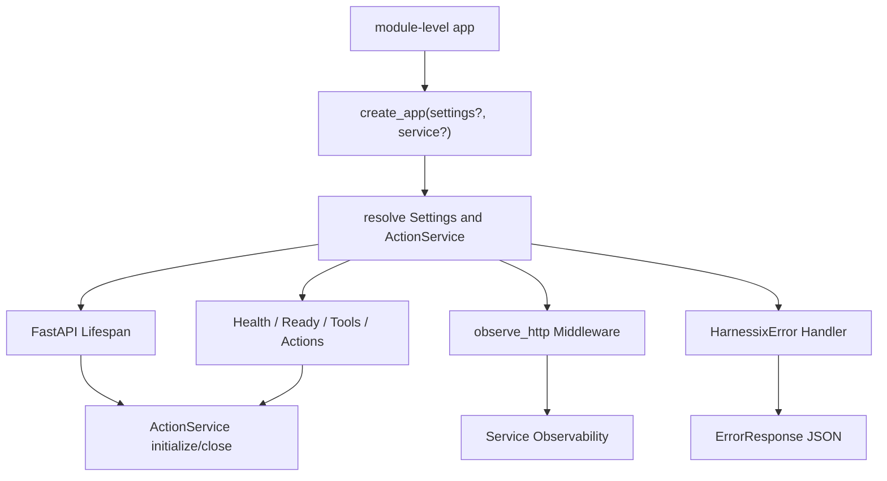

| 组件/符号 | 输入 | 输出 | 拥有的状态 | 不拥有 |
|---|---|---|---|---|
| `ErrorBody` | Code、Message | OpenAPI Error Body | 无 | Domain异常分类 |
| `ErrorResponse` | ErrorBody | `{"error":...}` Schema | 无 | 422/500默认框架错误 |
| `ToolListResponse` | Tool列表 | `{"tools":[]}` | 无 | 分页/目录版本 |
| `EventListResponse` | Event列表 | `{"events":[]}` | 无 | Cursor/分页 |
| `_service` | FastAPI Request | App State中的Service | 无 | 懒初始化/恢复 |
| `_apply_action_status` | Response、Snapshot | 可能修改HTTP Status为202 | 无 | Action状态转换 |
| `create_app` | 可选Settings/Service | FastAPI App | Closure捕获Service | Uvicorn进程 |
| `lifespan` | FastAPI App | 初始化后的请求窗口 | `app.state.action_service` | In-flight drain策略 |
| `observe_http` | Request、Next | Response | 当前Trace/Log Context | 认证/Body限制 |
| `handle_harnessix_error` | Domain Error | JSONResponse | 无 | 未知异常清洗 |

## 7. 应用工厂与依赖解析

[`create_app`](../../src/harnessix/api/app.py)签名为：

```python
create_app(settings: Settings | None = None, *, service: ActionService | None = None) -> FastAPI
```

解析顺序是：

```text
resolved_settings = settings or Settings.from_environment()
resolved_service = service or build_service(resolved_settings)
```

这带来以下真实语义：

1. 未传Settings时总会读取进程环境；
2. 即使显式传入Service，只要未传Settings，仍会先读取并校验环境；非法环境值可使App构造失败；
3. 同时传入Settings和Service时，不检查Service是否由该Settings构造；
4. 注入Service仍由App Lifespan调用`initialize()`和`close()`，不是“外部已初始化、外部关闭”模式；
5. `build_service`根据`database_url`选择PostgreSQL，否则SQLite；
6. `execution_mode == inline`时Service `auto_execute=true`，其他合法值只有queued；
7. API Service未显式传`worker_id`，由`ActionService`生成随机`worker-UUID`，用于Inline Lease/Reconcile；
8. Registry固定注册`system.echo`和`demo.issue.create`，不是动态生产Tool目录；
9. 未配置OTLP Endpoint时Observability为No-op，配置后构造OpenTelemetry实现。

自定义宿主需要不同生命周期所有权时，应自行包装或调整工厂合同，不能假设注入Service不会被关闭。

## 8. 模块级默认应用与导入副作用

[`api/app.py`](../../src/harnessix/api/app.py)末尾执行：

```python
app: Any = create_app()
```

`harnessix serve`调用Uvicorn导入字符串`harnessix.api.app:app`，因此Uvicorn目标是已经创建的App对象而不是Factory。
默认Settings和Service在模块首次导入时确定；之后修改环境不会重建同一模块实例中的Service。

[`scripts/generate_specs.py`](../../scripts/generate_specs.py)先导入`harnessix.api.create_app`，该导入会建立模块级默认App，
随后又调用一次`create_app().openapi()`生成Schema。当前构造阶段尚不打开数据库，但会解析环境、构造Registry、Journal
对象及Observability对象；不受控的环境或Telemetry配置可能影响离线Schema生成。

## 9. Lifespan与资源所有权

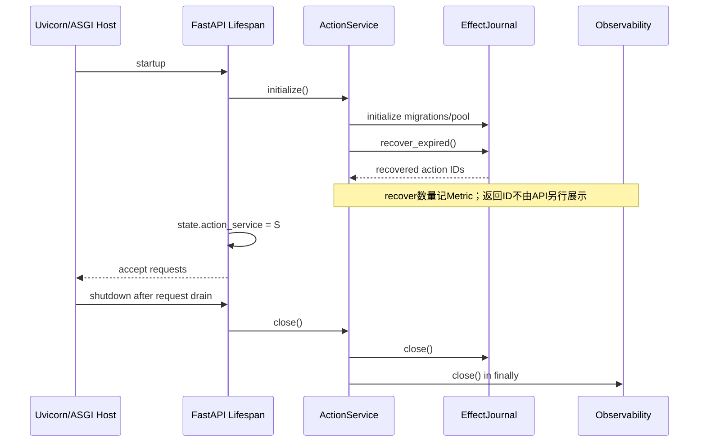

Service初始化失败时Lifespan不进入`yield`，应用不接受正常请求。成功后Service保存到`app.state`。Route通过
`_service`读取并用`assert isinstance(ActionService)`检查；绕过Lifespan直接调用Ready/Action路由时，State可能不存在，
形成框架500而非稳定业务错误。

Lifespan退出无论原因都调用Service Close。关闭先关Journal，再在`finally`关闭Observability。API自身没有额外后台Task、
请求计数器或显式Drain Gate；在途请求的排空依赖ASGI Host行为。

## 10. 路由总表

| Method | Path | Request | Success Body | 运行时Status | 直接Service调用 |
|---|---|---|---|---|---|
| GET | `/healthz` | 无 | `{"status":"ok"}` | 200 | 无 |
| GET | `/readyz` | 无 | Ready或Not Ready对象 | 200或503 | `ready()` |
| GET | `/v1/tools` | 无 | `ToolListResponse` | 200 | `tools()` |
| POST | `/v1/actions` | `ActionRequest` | `ActionSnapshot` | 200或202 | `submit()` |
| GET | `/v1/actions/{action_id}` | UUID Path | `ActionSnapshot` | 200；不存在404 | `get()` |
| GET | `/v1/actions/{action_id}/events` | UUID Path | `EventListResponse` | 200；不存在404 | `events()` |
| POST | `/v1/actions/{action_id}/approval` | UUID Path + `ApprovalDecision` | `ActionSnapshot` | 200或202；不存在404/冲突409 | `decide_approval()` |
| POST | `/v1/actions/{action_id}/reconcile` | UUID Path，无Body | `ActionSnapshot` | 200或202；不存在404/冲突409 | `reconcile()` |

FastAPI默认额外开放`/openapi.json`、`/docs`和`/redoc`。当前Settings不能关闭或改路径，也未为这些接口增加认证。

## 11. 单请求处理主链

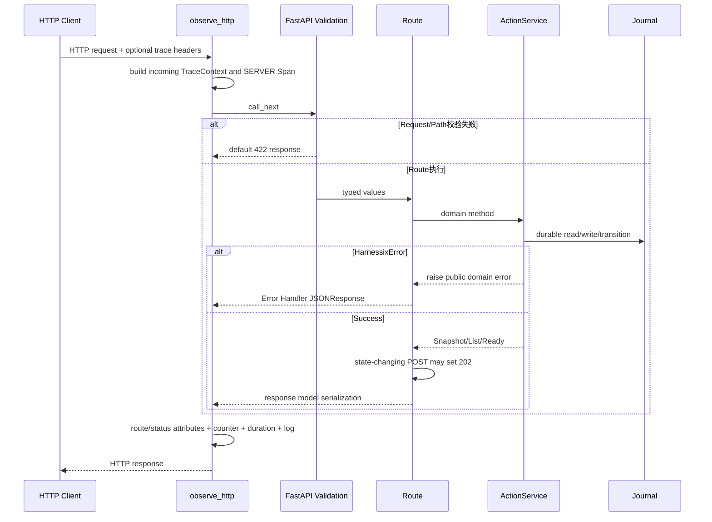

Middleware位于框架验证外层，因此422也会形成HTTP指标和日志。未知异常分支记录Counter和异常日志后重新抛出，由
FastAPI/Uvicorn默认500处理；异常路径不记录Duration、Route或响应Status属性。

## 12. HTTP状态投影

[`_apply_action_status`](../../src/harnessix/api/app.py)只由三个状态变更POST调用。以下Snapshot状态被映射为202：

- `pending_approval`；
- `ready`；
- `leased`；
- `running`；
- `unknown`；
- `reconciling`。

其余状态保留FastAPI默认200，包括`denied`、`succeeded`、`failed`和`manual_intervention`。理论上的
`received`、`validated`、`policy_evaluated`也会保留200，但当前Service公开方法不应在这些中间状态返回。

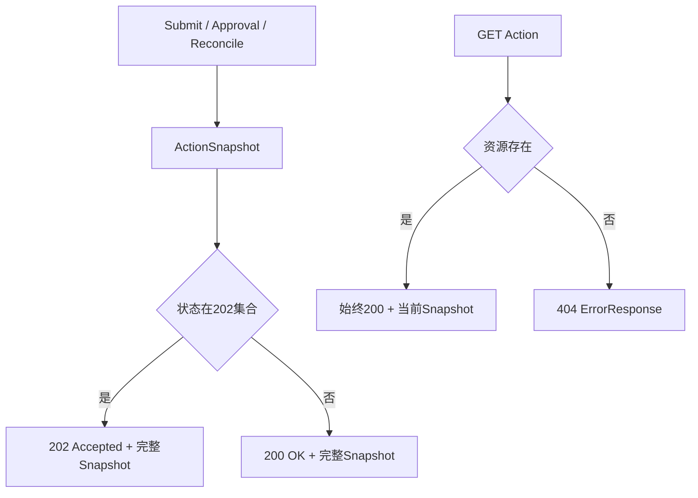

202只描述本次POST返回的资源尚未终结，不表示排队模式专属。Inline提交若需要审批或效果进入Unknown同样返回202。
GET找到同一Ready/Running/Unknown资源时返回200；客户端必须检查`ActionSnapshot.status`，不能只看HTTP状态判断终态。

## 13. Action提交接口

`POST /v1/actions`由FastAPI先建立`ActionRequest`，随后直接调用`ActionService.submit`。

### 13.1 领域顺序

1. Registry按`request.tool`查找定义；不存在抛`tool_not_found`；
2. Service计算请求指纹；
3. Journal先`create_action`持久化完整Request、Tool Descriptor、Trace与`action_received`事件；
4. 重复Action ID或租户幂等键返回原Snapshot或冲突；
5. 仅新Action继续检查Effect Hint、幂等键、敏感键名和Tool Input Model；
6. 校验失败形成`FAILED` Snapshot；
7. 校验成功执行Policy；
8. 进入Denied、Pending Approval或Ready；
9. Inline模式继续Claim/Execute，Queued模式停在Ready；
10. Route按最终返回Snapshot决定200或202。

HTTP层不设置或替换Action ID、Principal、Context与Idempotency Key，也不增加`Idempotency-Key` Header。稳定身份全部来自
请求JSON。

### 13.2 幂等恢复

Client在连接断开或超时后不能判断提交是否到达时，必须用原`action_id`和原完整请求重试，或先GET原Action；
不得生成新Action ID。写Tool还应复用原租户幂等键。相同语义返回原Snapshot，不同载荷返回409。

## 14. Action查询与Event列表

### 14.1 `GET /v1/actions/{action_id}`

Path必须由FastAPI解析为UUID。合法但不存在的ID由Journal抛`ActionNotFoundError`并映射404；格式非法在Route前返回422。
成功总是200，无ETag、`If-Match`、Cache-Control、Last-Modified或版本协商Header。

### 14.2 `GET /v1/actions/{action_id}/events`

返回`{"events":[...]}`，事件按Journal定义的Action Sequence顺序。当前没有：

- `after` Cursor；
- limit/offset；
- Server最大事件数；
- 流式传输；
- 压缩策略；
- Event总字节预算；
- 长轮询或等待终态。

SDK一次性解析全部Event到内存。长期历史可能放大数据库读取、JSON序列化、网络响应和客户端内存。

## 15. Tool目录接口

`GET /v1/tools`同步调用Registry `list_descriptors()`并返回完整Tool Descriptor列表。Descriptor包括Input JSON Schema、
Effect Class、Risk、Approval、Idempotency、Reconciliation和并行能力。

当前目录无版本号、Registry摘要、分页、缓存Header、能力过滤或租户授权。默认Bootstrap仅注册：

- `system.echo`：只读、低风险、不要求审批；
- `demo.issue.create`：幂等写、中风险、要求审批和幂等键、支持Reconcile。

它们是Action合同与故障语义验证实现，不是生产连接器目录。API无认证时Tool Schema和描述对任何可达调用方公开。

## 16. 审批接口

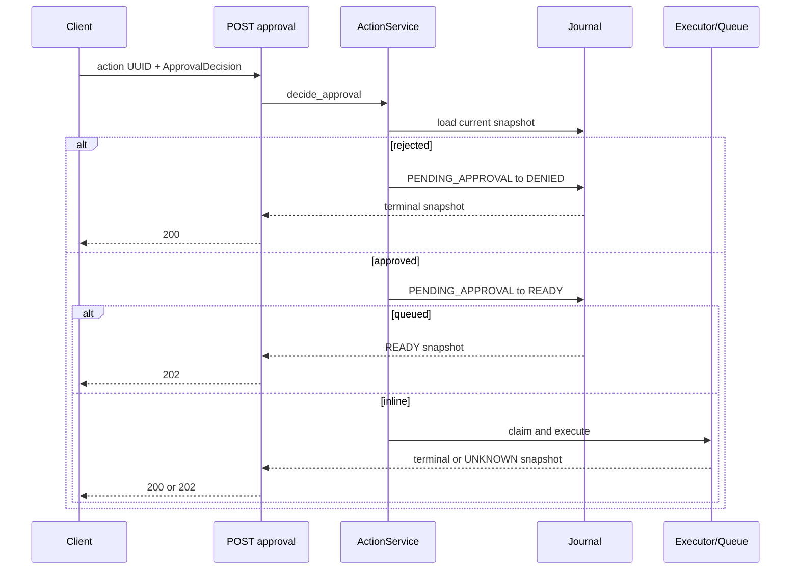

`ApprovalDecision`包含Outcome、Actor和可选Reason。API不验证Actor与网络身份一致，不验证调用者是否有审批权限，
也不要求客户端提交Request Fingerprint或Snapshot Version；Service用当前Snapshot指纹建立Approval Record。

并发决定依赖Journal期望状态守卫，首个合法转换成功，后续通常获得409。API没有审批幂等键；相同批准重试在状态已经变化
后也可能冲突，客户端应先GET并判断当前事实。

## 17. Reconcile接口

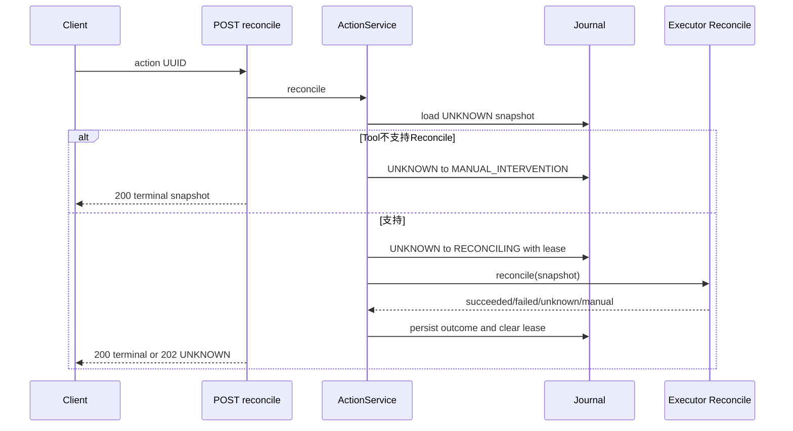

HTTP无Body，不接受预期Version、Operator说明或Reconcile幂等键。Service只允许从Unknown进入Reconcile；状态不匹配为409。
Reconcile是查询外部权威效果，不是重新执行原始请求。Client超时后先GET；若仍Unknown可以再次发起，若已终结不得重放。

## 18. Health与Readiness

### 18.1 `/healthz`

固定返回200和`{"status":"ok"}`，不读取Service。它只证明ASGI进程能执行Route；即使Journal随后不可用、Worker缺失、
OTLP失败或Registry错误，也可能健康。

### 18.2 `/readyz`

调用`ActionService.ready()`，后者只委托`journal.ping()`：

- True：200 `{"status":"ready"}`；
- False：503 `{"status":"not_ready","reason":"journal_unavailable"}`；
- Ping抛异常：没有稳定Handler，进入未知500路径。

SQLite `ping()`当前可能对缺少完整Schema的可连接文件返回True；PostgreSQL也只证明数据库查询成功。Readiness不检查：

- Schema兼容和读写事务；
- Tool Registry/Executor可用；
- Queued Worker数量、心跳或队列消费；
- 外部SaaS和Reconcile端点；
- Observability导出；
- 磁盘剩余、DB Pool容量、锁等待或Migration一致性。

## 19. 请求与响应Schema

### 19.1 Request Models

API复用：

- [`ActionRequest`](../../src/harnessix/domain/models.py)：Submit JSON；
- [`ApprovalDecision`](../../src/harnessix/domain/models.py)：Approval JSON；
- UUID Path：Action查询、Event、Approval和Reconcile。

Domain `ContractModel`拒绝额外顶层字段并冻结模型，但不是`strict=True`；JSON中的UUID和Enum字符串会按Pydantic规则解析。
`arguments`、`metadata`、`input_schema`、`output`和Event `data`仍是任意JSON形状，Domain未定义统一深度、节点或字节预算。

### 19.2 Response Models

| Envelope | 字段 | 用途 |
|---|---|---|
| `ActionSnapshot` | 完整Request、Descriptor、状态、Policy、Approval、Result、Lease、时间、Version | Submit/Get/Approval/Reconcile |
| `ToolListResponse` | `tools: list[ToolDescriptor]` | Tool目录 |
| `EventListResponse` | `events: list[ActionEvent]` | Action事件 |
| `ErrorResponse` | `error.code + error.message` | 显式HarnessixError |
| FastAPI Validation Error | `detail: [...]` | 422；不符合ErrorResponse |
| 默认500 | 框架/服务器生成 | 未知异常；不符合稳定Harnessix合同 |

完整Snapshot会回显并持久化原Request。它不是最小公开Projection，调用方能看到Principal、Context、Arguments、Metadata、
Secret Ref名称、Policy原因、Approval Actor/Reason、Result和Receipt。

## 20. OpenAPI生成与真实差异

[`spec/openapi.json`](../../spec/openapi.json)由`create_app().openapi()`生成，当前包含：

- 8条显式Route；
- Pydantic Domain和Envelope Schema；
- FastAPI自动422响应；
- Submit的200/202/409；
- Get/Event的200/404/422；
- Approval/Reconcile的200/202/409/422。

当前声明不完整：

1. Submit实际可能因未知Tool返回404，但Decorator只显式声明409；
2. Approval/Reconcile实际可能因Action不存在返回404，但Decorator未声明；
3. Readiness实际可能返回503，但没有显式Response Model/Schema；
4. 未知500没有统一Schema；
5. OpenAPI无`securitySchemes`和全局/操作Security要求，这准确反映当前无认证；
6. Tool/Event列表没有分页参数；
7. Action 202与200使用相同Snapshot Schema，不表达终态Union；
8. Server URL、反向代理前缀和版本弃用策略未定义。

`make spec`只重新生成文件；当前`make check`不自动要求生成后Git无差异，发布流程需显式执行。

## 21. 公开错误与验证错误

### 21.1 Harnessix Error Handler

[`handle_harnessix_error`](../../src/harnessix/api/app.py)把Domain Error的`status_code`、`code`和`message`
直接映射为JSON。主要错误包括：

| HTTP | Code | 场景 |
|---:|---|---|
| 404 | `action_not_found` | 合法UUID不存在 |
| 404 | `tool_not_found` | Submit使用未注册Tool |
| 409 | `action_conflict` | Action ID绑定不同请求等冲突 |
| 409 | `idempotency_conflict` | 相同租户幂等键绑定不同语义 |
| 409 | `illegal_transition` | Approval/Reconcile当前状态不允许 |

Handler不额外清洗Message。当前Domain固定错误会包含Action ID、Tool名或状态；其他`HarnessixError`实现若把敏感内容放入
Message，API会原样返回。

### 21.2 FastAPI 422

Body或Path无法建立目标Pydantic类型时，Route和Service都不会执行，FastAPI返回默认`{"detail":[...]}`。
它与`ErrorResponse`不同，SDK的错误解析会回退为`code="http_error"`并把完整响应文本作为Message。

默认Validation Error可能包含错误位置、类型和触发输入片段。API没有自定义422清洗、最大响应预算或稳定错误码，因此
调用方、代理和日志系统可能保存用户提交的原始片段。

### 21.3 未知500

Middleware捕获`Exception`后递增`harnessix.http.requests{status=exception}`、调用`logger.exception`并重新抛出。
HTTP正文由框架/Host决定，通常不是ErrorResponse。日志异常堆栈可能包含底层数据库、Policy、Executor或Observer错误消息；
当前API无统一异常脱敏层。

## 22. HTTP观测流程

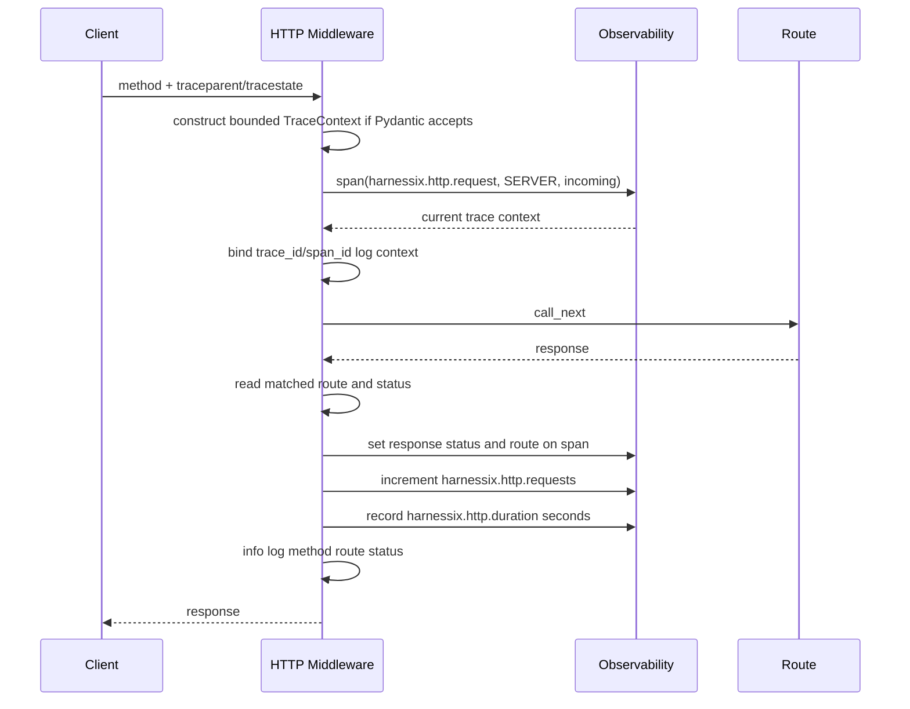

### 22.1 Span

- 名称：`harnessix.http.request`；
- Kind：SERVER；
- 初始属性：`http.request.method`；
- 成功后属性：`http.response.status_code`、`http.route`；
- Incoming Context：可选TraceContext。

API不把URL、Query、Path UUID、Tenant、Action ID、Arguments或Header写入HTTP Metric属性。Action Service内部Span会在当前
Context下创建，并把生成的Trace Context保存到新Action，Queued Worker可在另一进程继续。

### 22.2 Metric

| 名称 | 类型 | 属性 | 记录边界 |
|---|---|---|---|
| `harnessix.http.requests` | Counter | method、route、status | 正常响应；异常只有method和`status=exception` |
| `harnessix.http.duration` | Histogram，秒 | method、route、status | 仅正常返回路径 |

404/422等框架响应通常仍经过正常分支并记录匹配Route或`unmatched`。异常不记录Duration，导致延迟样本偏向成功和已形成
Response的请求。

### 22.3 Log

成功日志只包含Method、Route模板和Status；无正文。Log Context仅绑定Trace ID与Span ID，Action ID/Tenant/Tool由下游
Service自己的Scope绑定。异常日志输出完整Stack Trace，当前没有Canary Redactor。

## 23. Trace Header校验边界

Middleware读取`traceparent`和可选`tracestate`，只通过Domain `TraceContext`模型。该模型当前仅校验：

- `traceparent`长度1～128；
- `tracestate`可空、最多512。

它不验证W3C版本、分隔段、十六进制长度、全零Trace/Span ID或Flag。长度/NUL等Pydantic拒绝会记录“忽略不合法Header”
并以新Trace继续；语法错误但长度合法的值会传给Observability端口。OpenTelemetry Propagator通常会忽略无效Carrier，
但自定义Observability实现可能直接接收该无效对象。

API当前没有直接测试发送有效/无效Trace Header，也不验证响应Trace Header，因为响应根本不回传Trace Context。
跨API/Worker持久Trace测试当前直接调用Service，不经过HTTP Middleware。

## 24. 身份、认证与授权

### 24.1 当前事实

API没有任何Authentication Middleware、Dependency、Security Scheme或授权检查。`ActionRequest.principal`完全来自请求体：

- `tenant_id`决定Journal租户幂等键作用域；
- `subject_id`作为审计声明；
- `framework`作为来源标签；
- `roles`当前不构成已认证权限。

任意可达调用方可以：

1. 声明任意Tenant、Subject和Roles；
2. 列出全部Tool Schema；
3. 按已知UUID读取任何Action及完整Events；
4. 对任何Pending Action提交任意Actor的Approval；
5. 对任何Unknown Action发起Reconcile；
6. 在Inline模式触发受Registry和Policy允许的Executor；
7. 访问OpenAPI和交互文档。

Journal读取方法没有Tenant谓词，数据库也没有由API身份驱动的行级隔离。UUID不是授权Token。

### 24.2 当前安全部署边界

只允许：

- 默认Loopback且仅本机受信进程可达；或
- 受控私网中，由外层完成TLS、认证、授权、Tenant覆盖注入、请求预算和审计的Gateway之后。

仅在Gateway验证Token但继续信任请求体Tenant仍不足以形成租户隔离；Gateway必须删除/覆盖不可信Principal字段，或API
未来从受信上下文重建Principal并禁止客户端提交授权字段。

当前Docker默认绑定`0.0.0.0`并暴露8787，只适合已有网络隔离的环境；不能把容器端口直接发布到公网。

## 25. 敏感数据真实流向

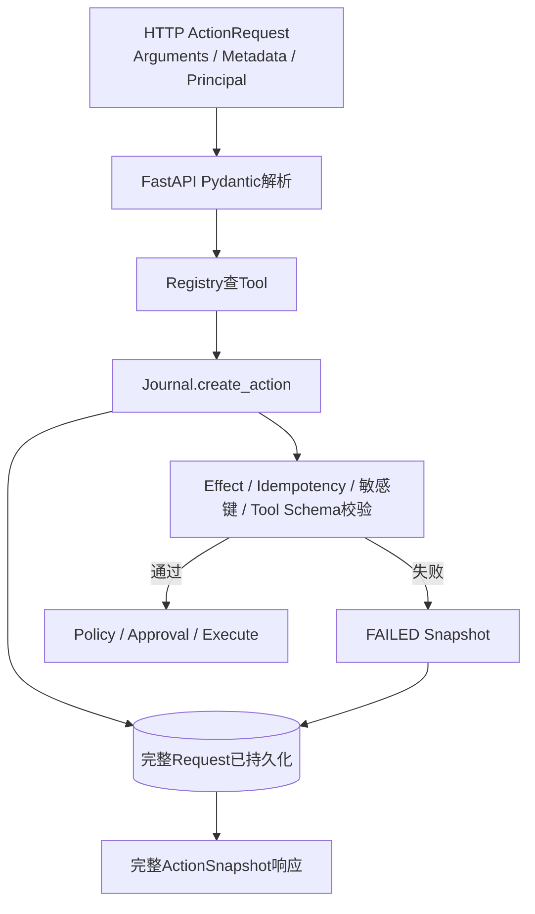

敏感键守卫发生在`create_action`之后，只能阻止Policy和Executor，不能阻止原始Request进入Journal和失败Snapshot。
受控ASGI探针以合成`api_key`字段验证：接口返回200/failed，响应仍包含该值，SQLite主文件中可以找到该值字节。

因此当前“`raw_secret_rejected`”不等于“Secret未持久化”。它只证明可疑键不会继续到Policy/Executor。其他值型、编码、
分片或普通字段中的Secret还可能绕过键名启发式。完整Snapshot、Event、Error和Tool Output也没有API级Redactor。

这是公网或多用户部署的P0阻塞项。修复不能简单把校验提前，因为Action ID/幂等冲突、失败审计、原始请求证据和历史数据
兼容都会变化；需要版本化输入安全门、拒绝事实最小化和双后端迁移/回归设计。

## 26. 输入、输出与资源预算

### 26.1 当前已有字段限制

- Tool名称、Principal字段、Context字段、幂等键和Approval Actor/Reason有长度限制；
- 额外Pydantic字段被拒绝；
- UUID和Enum受类型约束；
- Tool参数在Service中由具体Input Model验证；
- HTTP Metric属性保持低基数。

### 26.2 当前缺失的全局限制

| 资源 | 当前状态 | 风险 |
|---|---|---|
| Request Content-Length | 无上限/无必填 | Host在Pydantic前读取大Body |
| 解压后Body | API无控制 | 上游代理启用压缩时可放大 |
| JSON深度/节点/键长 | 任意JSON字段无统一上限 | CPU、递归和内存消耗 |
| Arguments/Metadata字节 | 无 | Journal、指纹和Snapshot放大 |
| Secret Ref数量 | 无显式max_length | 持久化和响应放大 |
| Roles数量/单项长度 | Tuple无单项/数量约束 | 身份元数据放大 |
| Tool Schema列表 | 无响应上限 | Registry扩展后目录放大 |
| Event列表 | 无分页和上限 | DB、Server、Network、SDK四次放大 |
| Snapshot Output/Error/Receipt | 多字段无长度/字节上限 | 外部响应或异常进入HTTP与DB |
| 服务器请求超时 | 无API层Deadline | Inline请求长期占用连接/Task |
| 并发请求 | 无Semaphore/限流 | DB Pool/SQLite锁/Executor耗尽 |
| Response写超时/慢客户端 | 依赖Uvicorn/代理 | Worker资源被慢读取占用 |

FastAPI的Schema校验不是资源预算。正式公网边界必须在ASGI/Proxy和Domain两层同时限制，并对Chunked Body、错误响应和
持久化后的Output单独测试。

## 27. Inline执行时序

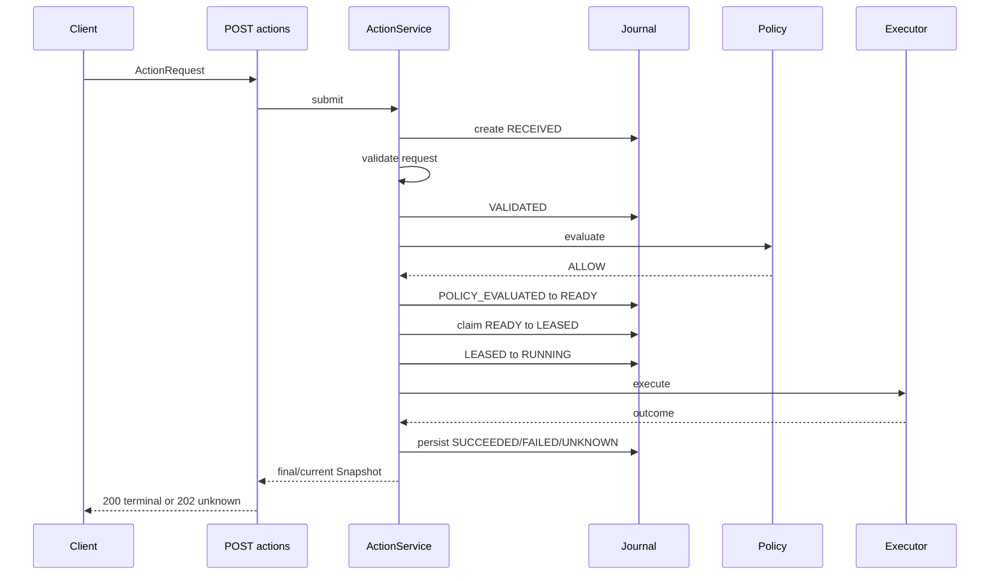

Inline模式把外部执行时延包含在单次HTTP请求内。API没有独立Deadline、Heartbeat Task或断连恢复逻辑，执行语义由
`ActionService._claim_and_execute`和Executor决定。Client超时后Action可能已经成功、失败或Unknown；恢复只能按稳定ID查询。

Policy要求审批时首个Submit停在Pending Approval并返回202；后续Approval请求可能在自己的HTTP生命周期内执行。

## 28. Queued执行时序

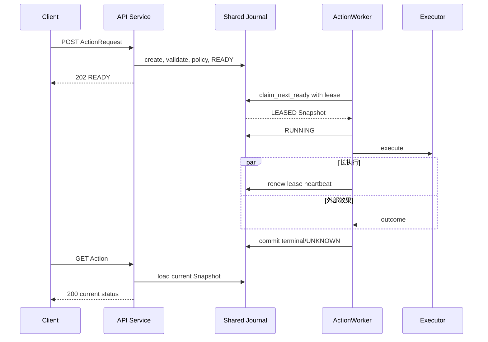

Queued API与Worker必须共享同一Journal和兼容Registry/Executor版本。API Readiness不证明Worker存在。HTTP没有等待终态或
订阅接口，客户端只能轮询GET和Events。API与Worker使用不同Observability Service Name，但Trace Context可随Action持久。

当前Bootstrap不把Tool/Executor版本摘要独立绑定到Worker启动版本；旧Ready Action可能被不同代码版本的Worker消费，属于
Action Plane升级风险，不由API消除。

## 29. 并发、一致性与幂等

| 场景 | API行为 | 权威保证 |
|---|---|---|
| 相同Action ID相同请求并发POST | 返回同一持久Action | Journal事务 |
| 相同Action ID不同请求 | 409冲突 | Journal完整Request比较 |
| 同Tenant幂等键同语义 | 返回首个Action Snapshot | Journal唯一索引/指纹 |
| 同Tenant幂等键不同语义 | 409 `idempotency_conflict` | Journal事务 |
| 同Action并发Approval | 首个合法转换成功，其他409 | 状态期望守卫 |
| 同Unknown并发Reconcile | 一个进入Reconcile，其他409/观察新状态 | 状态与Lease守卫 |
| GET与状态转换并发 | 每次GET读取某个已提交Snapshot | 数据库事务；无ETag |
| Event读取与追加并发 | 返回调用时已提交列表 | Journal后端行为；无Cursor快照合同 |
| API进程崩溃 | HTTP结果可能丢失 | Journal事实保留；Client按ID恢复 |
| Inline外部效果后崩溃 | 可能Unknown或Lease恢复 | Action Service/Journal，不由HTTP推断 |

API没有自己的锁、Request Ledger或缓存。所有跨请求幂等来自Action身份和Journal；HTTP方法本身没有通用幂等承诺。

## 30. 取消、超时、断连与恢复

| 场景 | 当前行为 | 调用方恢复 |
|---|---|---|
| Client连接前失败 | 请求可能未到Server | 使用同Action ID重试，不生成新写身份 |
| Client超时/断连 | API无领域取消；Handler/Executor是否继续取决于ASGI取消传播和下游实现 | GET原Action；写操作不盲重试 |
| API Task被取消 | 无专用Catch映射或Action取消状态 | 依赖Journal已提交事实和Lease恢复 |
| Server关闭 | Uvicorn负责停止接收与排空；Lifespan随后关Service | 重连后查询 |
| Inline RUNNING宿主死亡 | Lease过期恢复为Unknown | Reconcile或人工介入 |
| Queued API死亡 | Ready Action仍在Journal | 另一个API可查询，Worker可继续 |
| Worker死亡 | API仍可Ready但任务可能等待Lease恢复 | Worker恢复机制 |
| Observer抛异常 | API Middleware直接调用，可能把请求变成500 | 查询Action；不能假设业务未提交 |
| Journal Ping异常 | `/readyz`未知500 | 先修复Journal；不要仅重试业务写 |

Action Plane当前无Cancel端点、Deadline字段和Retry状态。新增这些能力会改变Domain、Journal、Worker、SDK和API，是重大
版本化变更，不应只增加一个Route。

## 31. Observability故障边界

API直接调用`resolved_service.observability.span/increment/record/current_trace_context`，没有Agent `KernelTelemetry`式
熔断包装。若自定义Observer在以下位置抛异常，可能改变HTTP结果：

- Span进入前：Route不执行；
- `current_trace_context`：Route不执行；
- 成功Route后的Span属性/Metric：业务可能已提交，但Client收到500或连接失败；
- Span退出：业务可能已提交但响应失败；
- Lifespan Close：可能影响进程关闭结果。

Worker只有部分Metric故障路径具备隔离测试；不能外推到API全部Observer调用。正式设计需要安全Observer Facade、错误分类、
本地熔断和“观测失败不改变业务事实”的故障注入测试。

## 32. Python SDK对接

[`HarnessixClient`](../../src/harnessix/sdk/client.py)和
[`HarnessixAsyncClient`](../../src/harnessix/sdk/client.py)提供Submit、Get、Approval、Reconcile、Events和Tools。

当前客户端：

- 接受所有2xx，包括202，并解析为`ActionSnapshot`；
- 不根据202自动轮询；
- 不判断终态；
- 不持久Action ID或幂等键；
- 非2xx优先解析ErrorResponse；
- 422/500等非标准Envelope回退为`http_error`并保留整个Response Text；
- 默认30秒总Client Timeout；
- 不发送认证或Trace Header；
- 不做自动重试、退避、分页或恢复。

因此SDK Timeout短于Inline Executor时延时，调用方必须按Action ID恢复。SDK完整边界见[SDK模块设计](sdk.md)。

## 33. 顶层CLI与配置优先级

`harnessix serve`支持：

```text
--host
--port
--database-path
--execution-mode inline|queued
```

顶层CLI先读取`Settings.from_environment()`以获得日志、默认Host/Port等；随后：

- `--host/--port`直接传给Uvicorn；
- `--database-path`写回`HARNESSIX_DATABASE_PATH`环境；
- `--execution-mode`写回`HARNESSIX_EXECUTION_MODE`环境；
- Uvicorn之后导入模块级App，App再次从更新后的环境构造Settings/Service。

CLI没有`--database-url`、TLS、认证、Proxy Header、Worker数、Request Limit、Graceful Timeout或Docs开关；这些若由Uvicorn或
外层进程参数提供，不属于Harnessix当前稳定配置合同。

环境转换错误如非法Port、Float或Log配置可在CLI初次Settings读取或App导入阶段抛出普通ValueError，顶层CLI没有统一
结构化错误输出。

## 34. 部署拓扑

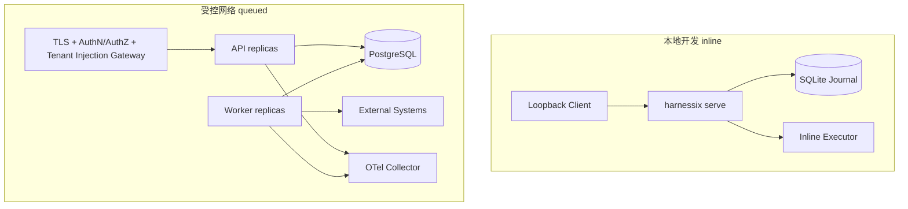

### 34.1 本地Inline

- 默认`127.0.0.1:8787`；
- SQLite和Demo外部库位于`.harnessix`相对目录；
- 适合开发、可靠性演示和单用户受信集成；
- 不适合多进程SQLite Worker或公网入口。

### 34.2 Queued

- API与Worker共享PostgreSQL；
- API设置`HARNESSIX_EXECUTION_MODE=queued`；
- 至少一个Worker独立运行；
- PostgreSQL位于私网并使用最小权限；
- API前需要真实Gateway控制；
- 当前代码本身不验证Gateway身份Header或Tenant注入。

### 34.3 容器

[`Dockerfile`](../../Dockerfile)使用非root UID 10001、`/data`卷并默认`HARNESSIX_HOST=0.0.0.0`。镜像安装
Observability可选依赖，Expose 8787，入口为`harnessix serve`。镜像没有Healthcheck、TLS、认证、只读RootFS声明、
资源限制或签名验证；这些属于编排/发布层后续门禁。

## 35. 平台与运行环境

API代码没有OS专属分支，FastAPI、Uvicorn、HTTP和PostgreSQL路径原则上可运行于Python 3.12+支持的平台。
但整体行为还取决于：

- SQLite文件权限、锁和路径；
- Executor实现及其外部依赖；
- Uvicorn事件循环与Signal处理；
- OTel SDK和Collector；
- 容器/进程运行策略。

当前CI通过Python 3.12/3.13、macOS和Windows的全仓测试，但API直接测试只使用进程内ASGITransport和SQLite，不包含真实
Socket、TLS、反向代理、Windows Service、macOS Launch Agent、多Uvicorn Worker或容器网络压力证据。

## 36. 直接测试证据

[`tests/integration/test_api.py`](../../tests/integration/test_api.py)当前只有4个测试函数：

| 测试 | 直接证明 | 不证明 |
|---|---|---|
| [`test_http_api_executes_echo`](../../tests/integration/test_api.py) | Inline Submit 200/Succeeded、Event至少6项、Tool目录两个名称 | Health、404、422、Header、Response大小 |
| [`test_http_api_returns_structured_conflict`](../../tests/integration/test_api.py) | 同租户幂等键不同载荷返回409和`idempotency_conflict` | 其他Error类型与Message清洗 |
| [`test_queued_http_api_returns_202_and_worker_completes`](../../tests/integration/test_api.py) | Queued Submit返回202/Ready，独立Worker完成 | GET轮询、Worker缺失、Lease恢复、真实PostgreSQL |
| [`test_readiness_checks_journal`](../../tests/integration/test_api.py) | Ping True为200，False为503及固定Reason | Ping抛异常、Schema/写入、Health、Worker Ready |

测试使用`httpx.ASGITransport`并显式进入App Lifespan，不打开真实TCP端口。Fixture中的Service可能已初始化，App Lifespan
会再次初始化并关闭，Fixture结束再关闭；这只证明当前SQLite实现可承受该测试顺序，不定义任意注入Service的双重生命周期合同。

## 37. 间接测试证据

| 关注点 | 测试 | 与API的关系 |
|---|---|---|
| Submit/Approval/Reconcile状态机 | [`test_action_service.py`](../../tests/integration/test_action_service.py) | 直接调用Service，证明Route下游，不证明HTTP投影 |
| Queued Claim/Heartbeat/Recover | [`test_worker.py`](../../tests/integration/test_worker.py) | 证明共享Journal Worker，不证明API Readiness或轮询 |
| 跨API角色与Worker Trace持久 | [`test_trace_context_is_durable_across_api_and_worker`](../../tests/integration/test_observability_flow.py) | “api”是Service组件名，测试不发送HTTP Header |
| HTTP SDK Submit解析 | [`test_async_sdk_preserves_action_contract`](../../tests/unit/test_sdk.py) | 使用MockTransport，不调用真实FastAPI App |
| OpenAPI提交产物 | [`generate_specs.py`](../../scripts/generate_specs.py) | 生成当前Schema；没有专用逐字比较测试 |

间接证据不能替代API直接合同测试。特别是Trace Header、404 Action、422 Envelope、未知500、Observer故障、Lifespan失败、
Body预算和慢请求当前均无直接测试。

## 38. 受控行为探针

在代码版本`3480ee8`上，以临时SQLite、Queued Service和`httpx.ASGITransport(raise_app_exceptions=False)`执行不访问网络的
受控探针，得到：

| 场景 | 结果 |
|---|---|
| `/healthz` | 200，固定ok |
| `/openapi.json`与`/docs` | 均200 |
| 空Submit Body | 422，顶层只有`detail` |
| 未注册Tool | 404，Harnessix Error Envelope |
| 含合成`api_key`键的Action | 200/failed；响应Request仍含值，SQLite字节中可检出该值 |
| Queued Submit后GET | POST为202/ready，GET为200/ready |
| `traceparent: not-w3c` | 请求200，自定义Observer收到该未验证TraceContext |

该探针用于求证现行实现，不替代提交测试。P0/P1问题必须新增自动化回归后才能宣称修复。

## 39. 尚缺的API专项测试

1. Health与未进入Lifespan的Route行为；
2. Service Initialize失败、Close失败和重复生命周期；
3. 合法/非法W3C Trace Header、Tracestate、响应关联和HTTP→Worker父子Span；
4. Observer在Span Enter/Attribute/Exit、Context、Metric和Close各点抛错；
5. Action/Tool Not Found、Action Conflict、Illegal Transition全部HTTP Envelope；
6. 非法UUID、未知字段、非法Enum、超大字段和嵌套JSON的422清洗；
7. Submit实际404、Approval/Reconcile实际404与OpenAPI声明一致；
8. GET非终态仍200、三个POST完整状态到200/202映射；
9. Approval Actor伪造、跨Tenant读写和未认证访问失败门禁；
10. 原始Secret在任何持久化、Response、Log、Trace和Validation Error前阻断；
11. Request/Response字节、JSON深度/节点、Roles/SecretRefs和Event分页上限；
12. Chunked Body、慢上传、慢下载、Client Disconnect和服务器Deadline；
13. 并发Submit/Approval/Reconcile与ETag/Expected Version策略；
14. Queued Worker缺失/滞后、Readiness、长轮询或轮询退避；
15. SQLite Busy/Disk Full/Corrupt与PostgreSQL Pool/Timeout/Failover的HTTP错误分类；
16. 真实Uvicorn Socket、Graceful Shutdown、Proxy Prefix、TLS终止和多Worker；
17. `/docs`、`/redoc`、`/openapi.json`生产开关；
18. CORS/CSRF/Host Header/Forwarded Header策略；
19. Python同步/异步SDK对所有API资源的端到端合同；
20. macOS/Linux/Windows与固定Container真实网络矩阵。

## 40. 已确认限制与风险

| 优先级 | 限制/风险 | 影响 | 建议归属 |
|---|---|---|---|
| P0 | 无认证、可信Principal注入和Tenant授权 | 任意可达调用方可伪造身份、跨租户读取/审批/对账/执行 | 0.9.4安全供应链/身份切片 |
| P0 | 敏感键守卫在`create_action`之后 | 疑似明文先进入Journal和Response，`raw_secret_rejected`不能防静态泄漏 | 0.9.4数据安全重大变更 |
| P1 | 无Request Body、JSON和Response预算 | 大请求/历史/输出可耗尽内存、DB和网络 | 0.9.3容量可靠性 |
| P1 | 无API并发、Rate Limit和Deadline | Inline长执行和恶意并发耗尽服务 | 0.9.3 |
| P1 | Observer故障未隔离 | 业务已提交后仍可能因Telemetry失败返回500 | 0.9.3可观测可靠性 |
| P1 | Event全量返回，无分页/Cursor | 长期Action历史形成O(n)放大 | 0.9.2/0.9.3 |
| P1 | Readiness只Ping，Queued不检查Worker | 流量进入不可消费或Schema不完整实例 | 0.9.3 |
| P1 | 未知异常与422不使用稳定错误合同 | SDK退化为`http_error`，正文可能含输入/异常细节 | API错误v2 |
| P1 | TraceContext只做长度校验且无HTTP测试 | 无效父上下文进入自定义Observer，跨进程关联不可证明 | Observability/API合同 |
| P1 | OpenAPI响应声明与真实404/503不完整 | 生成SDK和集成方错误处理遗漏 | 0.9.1客户端契约/0.9.4 API加固 |
| P1 | Docker默认0.0.0.0且无内建Auth/TLS | 误发布端口即可暴露全部Action能力 | 部署/发行门禁 |
| P2 | GET非终态200而POST非终态202未形成显式终态字段/Helper | 客户端只看HTTP状态会误判 | SDK/API文档与Helper |
| P2 | 注入Service仍先读取环境且由App关闭 | 自定义宿主存在意外构造失败/所有权冲突 | App Factory v2 |
| P2 | 模块导入即构造默认App/Service | 离线Schema、测试和宿主导入受环境副作用影响 | Bootstrap治理 |
| P2 | API无ETag/Expected Version | 并发审批/Reconcile只能收到晚期409，无法条件读取/写入 | API并发合同 |
| P2 | 无Docs/OpenAPI生产开关 | Schema和操作面向所有可达主体公开 | 0.9.4 |
| P2 | 无Action查询批量/过滤/归档 | 运维和用户历史体验不足 | 0.9.1产品体验 |
| P2 | 无Cancel/Retry/Delete合同 | 用户无法通过HTTP正式控制长任务生命周期 | 重大领域设计 |
| P2 | 真实Socket/Proxy/TLS/三平台网络测试缺失 | ASGI进程内通过不能证明部署稳定 | 0.9.5 Dogfooding |
| P2 | SDK只专项测试Async Submit | 六种资源和Sync Client可能漂移 | SDK/API合同套件 |

## 41. 部署安全基线

### 41.1 当前可接受

```bash
uv run harnessix serve --host 127.0.0.1 --port 8787
```

仅供同一用户的受信本机进程访问，并保护SQLite目录。若使用Queued模式，API/Worker共享私网PostgreSQL，API仍优先绑定
Loopback或受控私网地址。

### 41.2 外层Gateway最低责任

当前代码无法自行验证这些控制是否存在。若部署方必须跨主机访问，Gateway至少负责：

1. TLS/mTLS与证书轮换；
2. 强认证和Token生命周期；
3. Endpoint级授权，尤其Approval与Reconcile；
4. 从认证结果覆盖Tenant/Subject/Roles，拒绝客户端伪造；
5. Action/Events按Tenant绑定的资源授权；
6. Body字节、Header、连接、并发、速率和超时限制；
7. 禁止或认证Docs/OpenAPI；
8. CORS、CSRF、Host与Forwarded Header策略；
9. 访问日志脱敏和Response大小限制；
10. 审计Gateway身份与Action ID的关联。

外层控制不能修复“Service持久化后再执行敏感键守卫”的内部缺口，正式多用户发布仍必须修改应用流程。

## 42. 运维与故障定位

### 42.1 进程活着但提交失败

1. `/healthz`仅确认Route；
2. 检查`/readyz`和Journal连接；
3. 读取稳定Error Code，区分404、409和422；
4. Queued模式确认Worker独立存活和共享同一数据库；
5. 检查Registry/Worker版本一致；
6. 使用原Action ID查询，不生成新写请求；
7. 检查Observer或日志导出是否在业务提交后抛错；
8. 不从500推断Action未创建。

### 42.2 202长期不终结

- `pending_approval`：需要受信审批流程；
- `ready`：检查Worker存在、数据库共享和队列；
- `leased/running`：检查Lease/Heartbeat与Executor；
- `unknown`：执行Reconcile或人工处置，不重放写；
- `reconciling`：检查Reconcile Lease和外部系统；
- 读取Events确认最后持久转换，不只依赖Metric。

### 42.3 Client超时

先GET原Action ID。不存在时仍需考虑请求未到达与读取路径故障；相同原请求可用相同身份重试。存在时按Snapshot继续。
写Tool不得因SDK抛Timeout直接生成新Action和幂等键。

## 43. 设计取舍

### 43.1 薄Route而非第二套状态机

Route只做类型接入、状态码和Envelope，复杂语义保留在Service/Journal，减少HTTP与进程内Adapter漂移。代价是API错误和
身份控制不能靠领域层自动获得，需要独立网关设计。

### 43.2 202携带完整Snapshot

调用方无需额外GET即可知道Pending/Ready/Unknown上下文。代价是响应可能包含高敏Request/Result，且完整资源较大。
后续公开Projection需要版本化，不能静默删字段破坏SDK。

### 43.3 GET始终200

GET成功表示资源存在，而不是状态终结，符合资源查询语义。SDK必须读Status。若需要等待终态，应新增明确等待/订阅合同，
不改变GET状态码使客户端难以缓存和恢复。

### 43.4 Lifespan拥有Service

统一初始化/关闭避免默认部署遗漏Migration、Recover和Connection Close。代价是注入Service所有权不够灵活，测试和组合宿主
可能双重初始化/关闭。

### 43.5 API与Worker共享Journal

Queued模式用持久状态解耦HTTP连接与执行，API崩溃不丢Ready任务。代价是Registry版本、身份授权、容量和数据库可用性成为
独立生产问题。

## 44. 后续演进约束

### 44.1 身份与租户隔离

正式方案必须同时覆盖：Credential验证、Principal构造、Route授权、Journal Tenant谓词、审批Actor绑定、Reconcile权限、
Tool目录过滤、SDK认证、审计、密钥轮换和跨Tenant负向测试。只增加Middleware但保留任意UUID无Tenant读取不算完成。

### 44.2 输入安全门

原始Secret和资源预算必须在首次持久化前执行，但仍需保留可审计拒绝。可选方案包括最小拒绝事件、独立不含Body的Admission
Ledger或版本化Request Envelope。必须定义Action ID/幂等键在Admission失败后的占用语义及旧数据库兼容。

### 44.3 API v2或兼容扩展

改变Error Envelope、公开Snapshot、Pagination、ETag、Auth Header、Cancel/Retry或状态码需评估v1客户端兼容。新增字段应
明确Optional/Default；删除或收紧历史字段需要新版本和双读迁移。

### 44.4 网络与容量

需要在Host和App两层定义Body、Header、Connections、Concurrency、Deadline、Response、Slowloris和Graceful Shutdown；
并用真实Socket、代理、TLS及故障注入验证，而不是只依赖ASGITransport。

## 45. 文档完成与验收条件

API模块现行设计满足以下条件时可判定DOC-1.4中的本模块文档完成：

- [x] `api/app.py`全部类、辅助函数、Factory、Lifespan、Middleware和Route纳入设计；
- [x] 8条显式Route、默认Docs/OpenAPI和200/202/404/409/422/500语义已区分；
- [x] Inline、Queued、Approval、Reconcile、查询、观测和生命周期均有流程图及文字；
- [x] 身份、租户、敏感数据、输入输出预算、取消、超时、断连、恢复和平台边界已说明；
- [x] 4个直接API测试和间接证据逐项说明证明与不证明内容；
- [x] 受控ASGI探针固定GET/POST状态、422、Trace和原始Secret持久化事实；
- [x] 当前能力与规划能力分离，P0/P1缺口已登记；
- [x] Action Plane、Domain、威胁模型、文档中心、总体架构、追踪矩阵和路线图同步；
- [x] 相对链接、源码/测试符号、Mermaid、OpenAPI、专项回归和全量`make check`完成验证。

## 46. 验证记录

| 日期 | 验证项 | 结果 |
|---|---|---|
| 2026-09-12 | 全库Markdown相对链接 | 3,418条，缺失0条 |
| 2026-09-12 | 本文引用测试符号 | 6个均可在对应测试文件中定位 |
| 2026-09-12 | `api/app.py`核心源码符号 | 7个均可通过Python AST定位 |
| 2026-09-12 | Mermaid语法与渲染 | 12/12通过`mmdc`渲染 |
| 2026-09-12 | API、Action Service、Worker、Observability与SDK专项回归 | 29个用例全部通过 |
| 2026-09-12 | `make spec` | OpenAPI及其余生成规格无漂移 |
| 2026-09-12 | `make check` | Ruff Format、Ruff、Readability、Mypy通过；3,326个测试通过，13个跳过 |

验证基于代码提交`3480ee8d15c0de0f2f182a3dceafd37cb59a32d7`。受控ASGI探针是现行行为求证，未纳入自动
回归；其暴露的身份、敏感数据、Trace和状态投影缺口已分别进入第39～40节，不能由本次文档验收推断为产品发布通过。

## 47. 变更触发清单

以下变化必须同步更新本文：

1. Route、Method、Path、Request/Response Model或状态码变化；
2. Error Code、Envelope、422/500清洗或SDK错误映射变化；
3. Authentication、Principal、Tenant、Authorization或Security Scheme变化；
4. Body/Header/JSON/Response/并发/速率/Deadline限制变化；
5. Submit首次持久化与敏感/Tool校验顺序变化；
6. Action Status、Approval、Reconcile、Cancel或Retry语义变化；
7. Event Pagination、Cursor、Streaming或订阅变化；
8. Health/Readiness/Startup/Shutdown/Drain行为变化；
9. Service注入、Factory、模块级App或Settings优先级变化；
10. Inline/Queued、Journal/Worker拓扑或Registry版本绑定变化；
11. Trace Header、Span、Metric、Log或Observer故障隔离变化；
12. Uvicorn、TLS、Proxy、CORS、Docs和容器部署变化；
13. OpenAPI生成、发布版本、弃用窗口或跨语言SDK变化；
14. macOS/Linux/Windows/Container真实网络证据变化。

## 48. 相关文档

- [文档中心](../README.md)
- [总体架构](../architecture.md)
- [源码阅读地图](../guides/source-reading-map.md)
- [Action Plane子系统设计](../subsystems/action-plane.md)
- [Action Contract](../action-contract.md)
- [Action生命周期](../action-lifecycle.md)
- [Domain模块设计](domain.md)
- [Policy模块设计](policy.md)
- [Executors模块设计](executors.md)
- [Storage模块设计](storage.md)
- [Observability模块设计](observability.md)
- [SDK模块设计](sdk.md)
- [0.8产品运行时与扩展设计](../m08-product-runtime-and-extensions.md)
- [部署与运行](../deployment.md)
- [威胁模型](../threat-model.md)
- [ADR 0001：Python优先Runtime](../adr/0001-python-first-runtime.md)
- [ADR 0002：UNKNOWN一等状态](../adr/0002-unknown-first-class.md)
- [ADR 0003：数据库队列Worker](../adr/0003-database-backed-worker-queue.md)
- [ADR 0004：持久Trace Context](../adr/0004-durable-trace-context.md)
