# App Server模块设计

## 1. 模块摘要

| 项目 | 内容 |
|---|---|
| 源码包 | [`src/harnessix/app_server`](../../src/harnessix/app_server/) |
| 当前职责 | 把Agent Protocol连接转换为既有Agent Runtime调用；管理单连接握手、方法分派、错误清洗、写命令账本顺序、后台Turn驱动、持久Replay、Live Delta缓冲、Artifact授权分页和本地stdio JSONL生命周期 |
| 非职责 | 不定义公共协议Schema，不实现Agent Loop或Reducer，不直接执行Tool，不构造Provider/配置/Session Migration，不管理SDK子进程，不提供远程网络监听、身份认证、多租户授权或完整TUI |
| 上游调用者 | Product Config组合根、进程内SDK Transport、stdio子进程客户端和测试宿主 |
| 下游依赖 | Protocol合同/Codec/投影/请求账本、`AgentRuntime`、`SessionStore`、可选`ArtifactPageStore`与`ArtifactAccessScope` |
| 持久化 | 模块自身不拥有独立数据库；命令终态写`ProtocolRequestStore`，Agent事实写`SessionStore`，Artifact由外部Store拥有 |
| 连接模型 | 一个`AgentProtocolServer`对应一个逻辑客户端连接；当前正式传输为单客户端stdio JSONL |
| 默认产品能力 | `run_product_stdio`装配固定Workspace、Provider Bundle、Session、只读Coding Tool Runtime和Agent Runtime；当前默认不装配Artifact Reader |
| 平台 | App Server Python逻辑无显式平台分支；默认产品因Coding Tool Runtime限制仍在Windows启动前失败，三平台产品证据尚未完成 |
| 代码版本 | `608c548feb909aa5ae572bab7db35859283d3d01` |
| 当前完成度 | Headless本地闭环、断线恢复、并发长轮询、有界关闭及薄CLI协商事件页上限已实现；Server侧协商Pending/Outbox/Replay贯穿、全局Delta内存上限、出站字节门禁、远程安全、可观测性和大规模索引尚未完成 |

本文是[`server.py`](../../src/harnessix/app_server/server.py)、
[`service.py`](../../src/harnessix/app_server/service.py)、
[`stdio.py`](../../src/harnessix/app_server/stdio.py)、
[`artifacts.py`](../../src/harnessix/app_server/artifacts.py)和
[`__init__.py`](../../src/harnessix/app_server/__init__.py)的当前事实源。线上字段、严格帧、公共投影、
Replay游标和命令账本详见[Protocol模块设计](protocol.md)；Agent状态与恢复详见
[Agent Runtime模块设计](agent.md)；客户端传输、响应归并与重连责任详见[SDK模块设计](sdk.md)。

## 2. 需求背景

Coding Agent的Headless入口不能只是把JSON字段直接转发给`AgentRuntime.run_turn`。连接、请求、领域事实、
后台执行和进程退出分属不同生命周期，任意一步崩溃都可能导致响应丢失、Turn未驱动或副作用重复。
App Server存在的核心原因是建立一层薄而正式的应用边界，解决以下问题：

1. 未初始化客户端不得执行领域命令，版本和能力必须在副作用前协商；
2. 一条连接上的长轮询不能阻塞审批、提问、Steering、取消和查询；
3. 多个并发Request可以乱序完成，但stdout帧不能交错；
4. 写命令必须先Claim幂等键，再提交领域事实，再保存公开结果，最后启动后台执行；
5. 响应丢失或进程重启后，同一命令应重放原结果并恢复尚未调度的Turn；
6. 客户端断开不应丢失Session事实，也不应把Live Delta误当作恢复事实；
7. 慢客户端、输出损坏、EOF和关闭必须有界收敛，不能长期阻塞Agent状态持久化；
8. Artifact读取必须重新绑定Thread和当前Workspace能力，不能让客户端直接提交Scope或打开SQLite；
9. 产品固定Workspace与可复用库模式需要明确区分，不能把测试中的宽松装配当作默认产品权限；
10. 协议错误、领域稳定错误和未预期异常必须分层映射，避免原始异常直接进入客户端。

## 3. 设计目标、非目标与关键术语

### 3.1 当前设计目标

1. `AgentProtocolServer`只管理连接状态、协议方法和错误映射，不复制Agent状态机；
2. `AgentApplicationService`只编排协议账本、Runtime、Session投影和后台Task；
3. 写命令固定执行`claim → operation → complete → after_result`；
4. 同一服务中每个Turn最多保留一个活动后台Task；
5. `events/replay`始终读取持久Session，`events/next`优先持久事实再返回Live Delta；
6. Live Delta按Thread最多缓存1000条，溢出显式返回`liveGap`；
7. stdio在READY前串行，在READY后以Semaphore限制并发Request；
8. 所有出站协议帧经单Writer Task写入和Flush；
9. 正常解码路径中Notification不产生Response，Request产生恰好一个Response；Closing/Closed的前置分支是当前已登记例外；
10. EOF触发服务关闭，后台Turn宽限期后取消并由Runtime形成确定终态；
11. 默认产品只在配置、Provider、Session、Tool和Runtime全部成功后激活配置并开放stdio；
12. Artifact能力只在安全Reader真实装配时广告。

### 3.2 明确非目标

- 不在App Server中维护Thread/Turn/Item/Event的第二份状态；
- 不允许应用服务直接构造或追加Agent Event；
- 不让SDK或CLI直接读取Session、Protocol Request或Artifact数据库；
- 不实现Provider重试、Tool Policy、Sandbox、Secret解析或外部效果对账；
- 不在当前stdio进程中支持多个独立客户端；
- 不提供TCP、HTTP、WebSocket、SSE、TLS、OAuth或公网认证；
- 不保证Live Delta Exactly-once、持久或多订阅者广播；
- 不保证Thread列表和Replay对大规模历史具有索引级性能；
- 不提供统一业务日志、Trace、Metric、Dashboard或诊断包；
- 不把连接关闭自动等同于用户取消Turn。

### 3.3 关键术语

| 术语 | 含义 |
|---|---|
| Connection | 一个`AgentProtocolServer`实例拥有的JSON-RPC状态与客户端实例绑定 |
| Application Service | Protocol与Agent Runtime之间的薄业务编排层，不拥有领域状态机 |
| deferred Turn | 先持久接受并返回，再由后台`resume_turn`驱动的Turn |
| background drive | `_spawn`创建的按Turn去重异步Task |
| pending request | 已由stdio读取、占用Semaphore并正在执行的JSON-RPC Request |
| outbox | 单Writer消费的有界Response队列 |
| durable replay | 从Session Store读取并投影的权威事件流 |
| live delta | Runtime同步回调写入服务内存的临时文本片段 |
| fixed Workspace | Product宿主在服务构造时指定、`thread/create`必须精确匹配的真实路径 |
| scoped Artifact read | 先验证Thread归属与Workspace能力，再分页读取Artifact |

## 4. 当前能力与装配边界

| 能力 | 可复用库模式 | 默认`agent-server`产品模式 | 规划但未实现 |
|---|---|---|---|
| JSON-RPC Server | 可直接构造 | 已装配 | 多版本、多客户端、远程Gateway |
| Workspace | `workspace=None`时允许任意合同合法绝对路径 | 固定到启动参数并要求路径存在 | 状态目录与Workspace长期身份绑定 |
| Agent Runtime | 调用方注入任意合法装配 | Product Config注入Provider与只读Coding Tools | 默认写工具、Process、Delivery完整产品链 |
| Question/Approval方法 | 方法始终注册，真实结果取决于Runtime能力/状态 | 方法仍广告；默认Runtime未启用Question | 按Runtime能力细分方法广告 |
| Replay | 已实现 | 已启用 | 数据库侧Limit分页与性能索引 |
| Live Delta | 服务统一订阅；连接按`itemDeltas`决定是否下发 | SDK通常协商启用 | 全局内存预算、多订阅者或持久流 |
| Artifact Read | 注入Scoped Reader后动态开放 | 当前未装配，因此不广告 | 默认产品Artifact闭环 |
| stdio | 任意BinaryIO便于测试 | stdin/stdout JSONL | Socket/WebSocket/HTTP |
| 关闭 | 服务宽限、Task取消、Writer收敛 | EOF触发 | 信号编排、强制Kill完整分层 |
| 观测 | 依赖上层错误和持久事实 | 无App Server专用Telemetry装配 | 连接/队列/延迟/SLO |

## 5. 模块上下文、依赖方向与信任边界

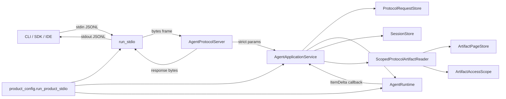

**图示说明：** stdio只负责字节和并发调度；Server只负责连接与方法；Service只负责应用编排。Runtime
仍是Turn状态和执行权所有者，Session仍是恢复事实所有者。Artifact Reader使用同一Session验证Thread，
并通过Workspace能力端口读取；客户端不提供Scope。

**源码映射：** Transport见[`run_stdio`](../../src/harnessix/app_server/stdio.py)，连接见
[`AgentProtocolServer`](../../src/harnessix/app_server/server.py)，编排见
[`AgentApplicationService`](../../src/harnessix/app_server/service.py)，Artifact边界见
[`ScopedProtocolArtifactReader`](../../src/harnessix/app_server/artifacts.py)，默认组合根见
[`run_product_stdio`](../../src/harnessix/product_config/server.py)。

### 5.1 允许依赖

| 方向 | 规则 |
|---|---|
| Product Config → App Server | 允许；在所有依赖就绪后构造Service/Server并开放stdio |
| SDK InProcess Transport → Server | 允许；用于嵌入与测试，但仍走完整Frame处理 |
| Server → Protocol + Service | 允许；不得直接调用Session或Tool |
| Service → Runtime + Session + Request Store | 允许；只调用公开端口和投影函数 |
| Service → optional Artifact Reader | 允许；只有装配后才开放方法 |
| Artifact Reader → Session + Artifact + Access Scope | 允许；重新授权每次读取 |

### 5.2 禁止旁路

- Server不得依据客户端参数直接追加Session Event；
- Service不得绕过`ProtocolRequestStore`执行带`requestId`的写命令；
- 后台Task不得在Protocol终态保存前启动；
- stdio Writer之外的协程不得直接写stdout；
- Client不得提交Artifact Workspace Scope；
- 连接能力不得仅因Schema存在而广告未装配方法；
- App Server不得拥有Provider、Tool、Sandbox或Delivery的具体实现构造逻辑；
- 远程客户端不得复用当前“本地父进程可信”的授权假设。

## 6. 包结构与推荐阅读顺序

| 顺序 | 文件 | 关键符号 | 阅读目的 |
|---:|---|---|---|
| 1 | [`server.py`](../../src/harnessix/app_server/server.py) | `SERVER_METHODS`、`ConnectionState`、`AgentProtocolServer` | 理解连接、方法与错误边界 |
| 2 | [`service.py`](../../src/harnessix/app_server/service.py) | `AgentApplicationService`、`_command`、`_spawn`、`next_events` | 理解命令顺序、后台驱动和事件读取 |
| 3 | [`stdio.py`](../../src/harnessix/app_server/stdio.py) | `run_stdio`、`_write` | 理解单Reader/Writer、并发、Queue和关闭 |
| 4 | [`artifacts.py`](../../src/harnessix/app_server/artifacts.py) | `ArtifactPageStore`、`ScopedProtocolArtifactReader` | 理解Artifact重新授权 |
| 5 | [`__init__.py`](../../src/harnessix/app_server/__init__.py) | `__all__` | 查看包级公开构造面 |
| 6 | [`protocol`](../../src/harnessix/protocol/) | Codec、Contracts、Projection、Request Store | 理解Service调用的外部合同 |
| 7 | [`product_config/server.py`](../../src/harnessix/product_config/server.py) | `run_product_stdio` | 理解默认产品实际装配和所有权 |
| 8 | [`tests/app_server/test_server_sdk.py`](../../tests/app_server/test_server_sdk.py) | 35个纵向用例 | 反向验证握手、崩溃、并发和交互 |
| 9 | [`tests/app_server/test_agent_cli.py`](../../tests/app_server/test_agent_cli.py) | 5个薄CLI用例 | 验证最终客户端只依赖SDK和公共协议 |

## 7. 内部组件架构

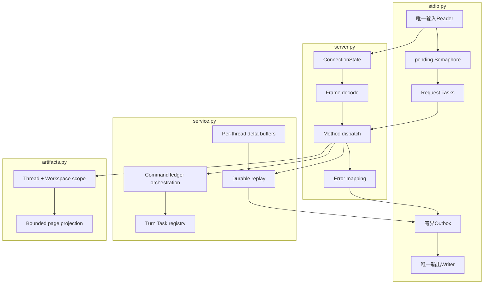

模块拆分以“字节生命周期—连接生命周期—应用生命周期—Artifact能力边界”为轴。`server.py`不创建Task
或打开数据库；`service.py`不读取stdin或编码Response；`stdio.py`不理解Thread/Turn；`artifacts.py`不
信任客户端Workspace。

## 8. 连接状态机与握手

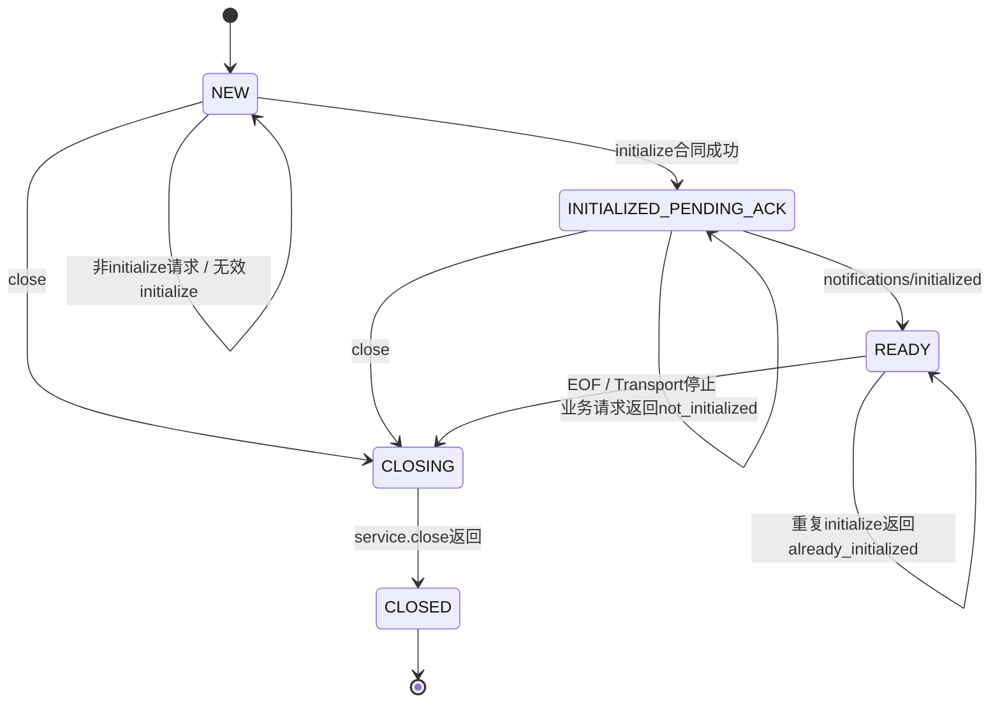

### 8.1 状态所有权

每个`AgentProtocolServer`持有：

- `state`：五态连接状态；
- `client_instance_id`：initialize成功后固定；
- `item_deltas_enabled`：只从Client Capability读取；
- `limits`：构造上限与Client声明逐字段取最小值；
- `methods`：固定方法加条件Artifact方法后稳定排序。

这些值只存于进程内，不写Session。重连创建新Server并重新握手，但客户端复用稳定
`clientInstanceId`以访问原Protocol Request幂等域。

### 8.2 握手顺序

1. `NEW`状态只允许`initialize`产生成功；其他Request返回`not_initialized`；
2. initialize严格解析Client Info、实例ID、能力和Limit；
3. 成功后Server先绑定Client和状态，再返回产品版本、能力、方法和有效Limit；
4. 客户端必须发送无Response的`notifications/initialized`；
5. 该Notification只在`INITIALIZED_PENDING_ACK`生效，参数非法则静默忽略；
6. READY后Request进入并发调度，正常解码路径中的Notification不返回任何帧。

### 8.3 当前版本错误差异

`InitializeParams.protocol_version`本身是`Literal["1.0"]`。因此非1.0值会在
`validate_protocol_input`阶段先返回`invalid_params`，`AgentProtocolServer._initialize`中计划返回
`unsupported_protocol_version`的显式分支当前实际上不可达。ADR描述的稳定版本错误码尚未由测试覆盖，
客户端当前只能可靠依赖`-32602`，不能依赖该细分`data.code`。

## 9. 方法注册、参数校验与错误映射

### 9.1 方法表

Server固定注册16个方法：初始化、6个Thread、5个Turn、2个交互和2个事件方法。只有
`service.artifact_reader is not None`时追加`artifact/read`。方法表在Server构造时冻结；运行中更换Reader
不会改变已协商能力。

问题和审批方法按协议表注册，不根据当前Runtime是否启用Question或是否存在需要审批的Tool动态移除。
因此“方法已广告”表示路由存在，不表示当前领域状态一定允许调用。

### 9.2 两级参数校验

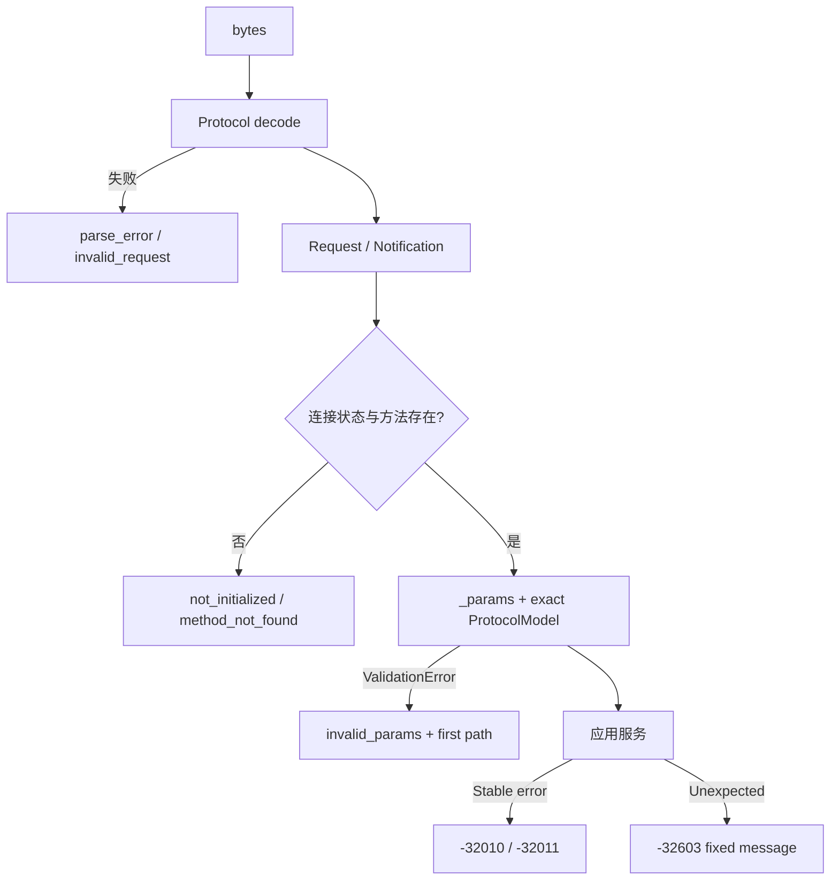

`_params`只把方法Params的`ValidationError`包装为`InvalidProtocolParams`。如果Service内部因为实现缺陷产生
`ValidationError`，它会落入通用异常分支并返回`internal_error`，不会误导客户端为输入错误。错误路径只
取第一个校验错误的位置，移除Pydantic URL和Context，并截断到64段。

### 9.3 错误映射

| 来源 | JSON-RPC码 | `data.code` | 消息策略 |
|---|---:|---|---|
| Codec | `-32700/-32600` | `parse_error/invalid_request` | 固定中文安全消息 |
| 重复initialize | `-32600` | `already_initialized` | 固定消息 |
| Params/版本合同 | `-32602` | `invalid_params`；计划分支为`unsupported_protocol_version` | 固定消息和首字段Path |
| 未初始化 | `-32012` | `not_initialized` | 固定消息 |
| 未注册方法 | `-32601` | `method_not_found` | 固定消息 |
| 幂等冲突 | `-32011` | `idempotency_conflict` | Service错误消息 |
| 其他Service/Kernel稳定错误 | `-32010` | 原稳定错误码 | `AgentServiceError.message`或`str(KernelError)` |
| 未预期异常 | `-32603` | `internal_error` | 固定“原始异常未公开”消息 |
| Closing/Closed入口 | `-32015` | `server_closing` | 固定消息，Response ID为空 |

稳定`KernelError`正文会直接进入协议，App Server没有统一Redactor；所有下游稳定错误消息必须自行保证不含
Secret、完整环境、Provider Header或不应公开的路径。未预期异常才由Server统一隐藏原文。

## 10. 方法分派与应用边界

`AgentProtocolServer._dispatch`是显式`if`分派表，不通过反射或动态插件调用方法。每个分支先把Params严格
转为具体模型，再调用`AgentApplicationService`对应方法。未命中分支抛`AgentServiceError`，但正常情况下
外层已先用`self.methods`拒绝未知方法。

| 方法族 | Server职责 | Service职责 | Runtime/Store职责 |
|---|---|---|---|
| Thread命令 | Params类型选择、Client ID传递 | 账本编排、Workspace固定、投影 | 创建/Fork/归档/恢复真实Thread |
| Thread查询 | Params校验 | 查询、过滤、分页、投影 | Session返回权威聚合 |
| Turn命令 | Params类型选择、Client ID传递 | 账本编排、预算转换、后台驱动 | 接受、Retry、Resume、Cancel、Steer |
| Approval/Question | Params校验 | 公共决定转领域类型、账本、恢复驱动 | 身份/指纹/状态验证与原子事件 |
| Replay/Next | 能力决定是否包含Delta | Session扫描、投影、等待与Buffer消费 | Session持久事件、Runtime产生Delta |
| Artifact | 仅在能力存在时路由 | 委托Scoped Reader | Thread归属、Workspace能力和Artifact读取 |

Server返回Result时重新以Protocol模型的线上别名序列化。当前`_encode`不调用
`protocol_json_size`，也不比较协商`maxMessageBytes`，因此出站字节硬门禁不是本模块已完成能力。

## 11. 写命令事务编排

### 11.1 固定顺序

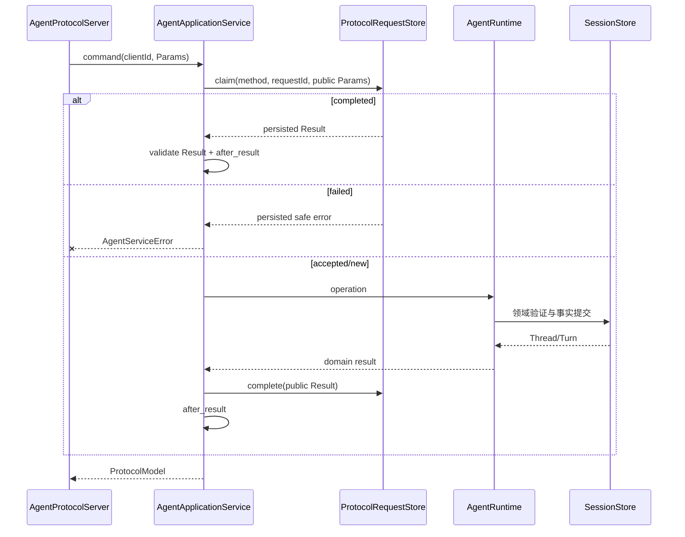

`_command`先把Params按线上别名序列化，因此指纹与客户端Wire语义一致。只有账本为accepted才执行业务
Operation。完成结果从账本重放时再次经过`validate_protocol_input(result_model, outcome)`，防止损坏或旧
错误形状绕过Result合同。

### 11.2 失败终态

`KernelError`和`ProtocolRequestError`被转换为`AgentServiceError`。除`idempotency_conflict`外，Service
会尽力把`code/message/retryable`写为failed终态；写失败被抑制，原服务错误继续返回。以下异常当前不由
`_command`写failed：

- Operation主动抛出的`AgentServiceError`；
- `aiosqlite`等不属于`ProtocolRequestError`的存储异常；
- 投影、序列化或其他未预期异常。

这些情况可能保留accepted。重试会重新进入Operation，依赖Runtime领域幂等和Session事实恢复，不能把
accepted自动解释为“业务未发生”。

### 11.3 后台驱动必须晚于账本完成

`after_result`只在Protocol `complete`成功后执行；已completed结果重放时也会执行。这样覆盖：

1. 完成前崩溃：账本accepted，重试由领域幂等重建同一结果；
2. 完成后、Task创建前崩溃：重放completed结果时再次尝试驱动；
3. Task已存在：`_spawn`按Turn ID去重；
4. Runtime已完成或不可运行：`resume_turn`根据领域状态返回或失败，不创建第二个Turn。

## 12. 后台Turn任务生命周期

### 12.1 Task Registry

`AgentApplicationService._tasks`以`turn_id`为键。`_spawn`发现同Turn已有未完成Task时直接返回，否则创建
名为`harnessix-turn-<turn-id>`的Task并调用`runtime.resume_turn(thread_id, turn_id)`。完成回调：

- 仅当Registry仍指向该Task时删除键；
- 非取消Task调用`exception()`消费异常，避免“Task exception was never retrieved”；
- 不记录日志、不向协议主动推送Task异常，客户端通过Session终态或后续查询观察。

Runtime的Delta listener会捕获Listener异常，因此Service的Delta回调失败不会破坏Provider流；但Task
Registry本身只假设在同一事件循环访问，不提供跨线程同步。

### 12.2 哪些结果触发后台驱动

| Service方法 | 驱动条件 |
|---|---|
| `start_turn` | Result状态为`accepted` |
| `retry_turn` | Result状态为`accepted` |
| `respond_approval` | Result状态为`executing_tools`或仍为`waiting_approval` |
| `respond_question` | Result状态为`executing_tools` |
| `resume_thread` | 活动Turn为`accepted`、`executing_tools`、`waiting_approval`或`waiting_action` |
| `turn/resume` | 不使用后台Task；Request内直接等待`runtime.resume_turn`返回 |
| `cancel/steer/archive` | 当前无`after_result`后台驱动 |

`waiting_input`不会由`resume_thread`自动驱动，因为必须等待用户回答；错误地恢复Provider会重复问题或破坏
Tool Call配对。`waiting_approval`可以驱动Runtime重新检查持久决定和多审批序列。

### 12.3 关闭

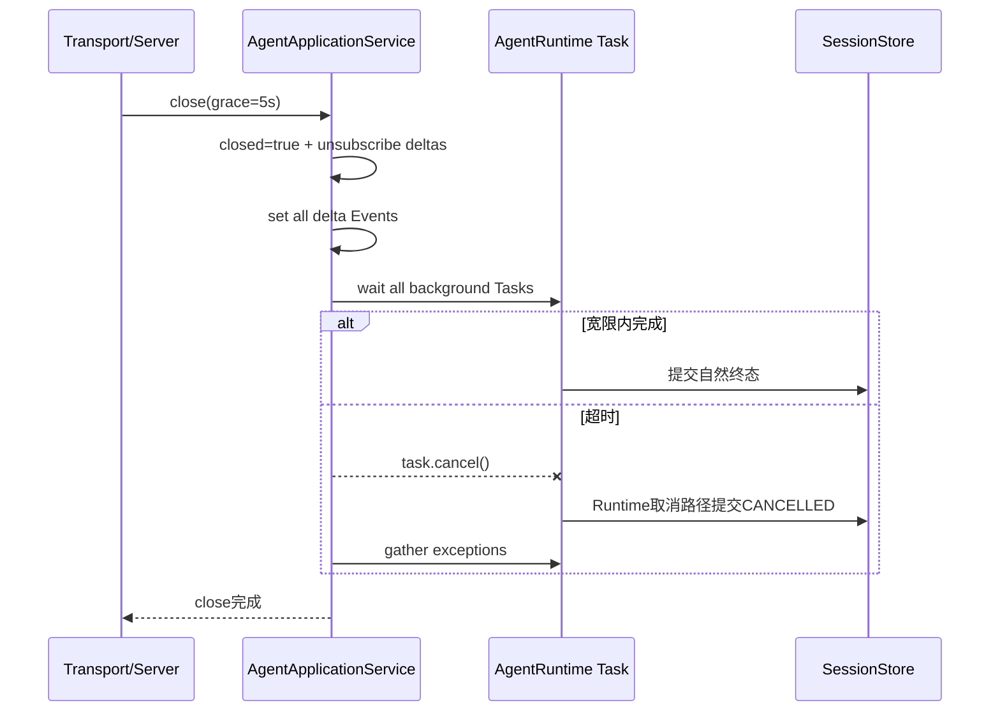

`close`幂等，关闭标志会唤醒`events/next`。它只管理Service订阅和后台Turn Task，不关闭Runtime、Session、
Provider、Tool或Artifact Store；这些组件由更外层组合根按逆序关闭。

## 13. Thread、Turn与交互方法

### 13.1 Thread Create与固定Workspace

`thread/create`在协议层已要求绝对、无NUL路径。Service按两种模式处理：

| 模式 | 行为 |
|---|---|
| `workspace=None` | 原样把协议中的绝对路径交给Runtime；不要求目录当前存在，适用于可复用测试/嵌入模式 |
| 固定Workspace | 构造Service时先`resolve(strict=True)`；每次Create再解析客户端路径并要求与固定路径相等 |

固定模式解析失败或不相等返回`workspace_not_configured`。Thread ID使用：

```text
uuid5(client_instance_id, "harnessix.protocol-thread/v1:" + request_id)
```

因此同一客户端实例和Create Request ID在崩溃重试后仍指向相同Thread。Workspace字段绑定Thread，但不单独
授予Tool或Artifact权限。

### 13.2 Thread查询与分页

`thread/get`直接从Session读取并投影。`thread/list`当前算法为：

1. 读取全部`thread_ids()`并按UUID字符串排序；
2. 若有Cursor，解析为UUID并保留字符串排序更大的ID；
3. 逐个加载剩余Thread；
4. 按归档状态过滤；
5. 取前`limit`项，并在仍有结果时用最后一项UUID作为`nextCursor`。

过滤发生在分页截取前，避免归档过滤造成空页或错误Next Cursor；但实现会加载Cursor之后的全部Thread，
大规模Session性能尚未优化。Cursor不是数据库Snapshot Token，并发创建/归档时只提供稳定UUID遍历语义。

### 13.3 Resume、Fork与Archive

- `thread/resume`不进入Protocol Request账本，调用Runtime恢复聚合，并按活动Turn状态决定后台驱动；
- `thread/fork`与`thread/archive`是带账本写命令，真实一致性由Runtime负责；
- 当前固定Workspace只限制`thread/create`，`get/list/resume/fork/archive`没有在Service层重新验证既有Thread
  Workspace是否等于本次产品固定根。

默认产品应为每个Workspace使用独立状态目录；当前数据库没有由App Server维护的长期Workspace绑定记录。
复用同一状态目录启动不同Workspace时，旧Thread仍可能被列出或查询，虽然后续Scoped Tool/Artifact能力
可能再拒绝。该边界在多Workspace产品化前必须加固。

### 13.4 Turn与交互

| 方法 | Runtime调用 | 响应含义 |
|---|---|---|
| `turn/start` | `accept_turn` | 返回已接受Turn并异步驱动，不等待完整Agent Loop |
| `turn/retry` | `accept_retry_turn` | 创建显式Retry并异步驱动 |
| `turn/resume` | `resume_turn` | 当前Request内等待恢复执行，可能长期占用一个pending slot |
| `turn/cancel` | `cancel` | 返回Runtime提交后的Turn状态 |
| `turn/steer` | `steer_turn` | 持久化用户输入；不抢占当前Provider调用 |
| `approval/respond` | `reply_approval` | 公共决定转`ApprovalDecision`；Runtime验证ID、指纹和状态 |
| `question/respond` | `reply_question` | Runtime原子提交Answer、Tool Result和状态变化 |

App Server不解析Tool参数、不判断Policy，也不自行验证Approval指纹内容；它只保证公共身份完整传递，最终
授权判断属于Agent Runtime。

## 14. 持久Replay与Pull-Live事件

### 14.1 Replay

`replay_events`调用`store.events(thread_id, after=cursor)`读取全部尾部，再在内存截取`limit`个内部事件，
以最后一个内部事件Sequence作为`scannedThrough`并投影。内部事件即使被过滤，也推进扫描位置。当前
Session端口没有在该调用中接收Limit，因此长历史且Cursor落后时会产生额外数据库读取与内存开销。

### 14.2 Delta缓冲

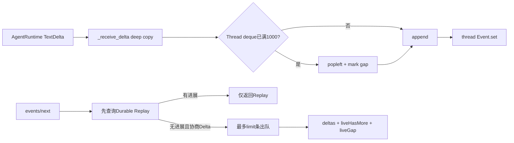

每个Thread的Deque上限为1000，写入时深拷贝Delta。溢出删除最旧项并在`_delta_gaps`登记；下一次消费返回
一次`liveGap=true`后清除标记。Buffer清空后从`_deltas`删除，但`_delta_events`中的每Thread Event不会在
运行期删除。

Service在构造时总是订阅Runtime Delta，是否协商Delta是每个Server连接的状态。因此未协商Delta的连接
不会收到Delta，但Service仍会为活动Thread缓存，最多每Thread 1000条；Thread数量没有全局上限。单Client
stdio假设下，Delta出队消费是安全的；若多个Server共享同一Service，一个连接消费会影响另一个连接，
当前不提供广播语义。

### 14.3 `events/next`等待算法

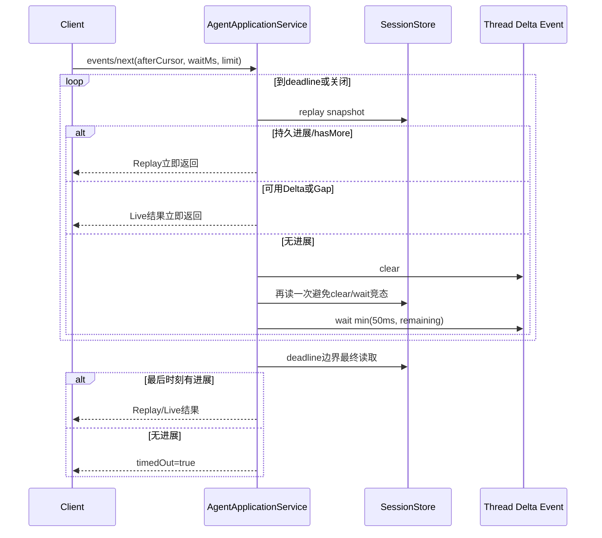

双重Snapshot避免Delta恰在`clear`与`wait`之间到达而沉睡；50毫秒轮询用于发现不产生文本Delta的审批、
Question、Tool和终态Session事件；Deadline后再读一次避免边界进展被误报为Timeout。Service关闭会Set
所有Event并使循环退出。

## 15. stdio JSONL传输

### 15.1 组件与正常流程

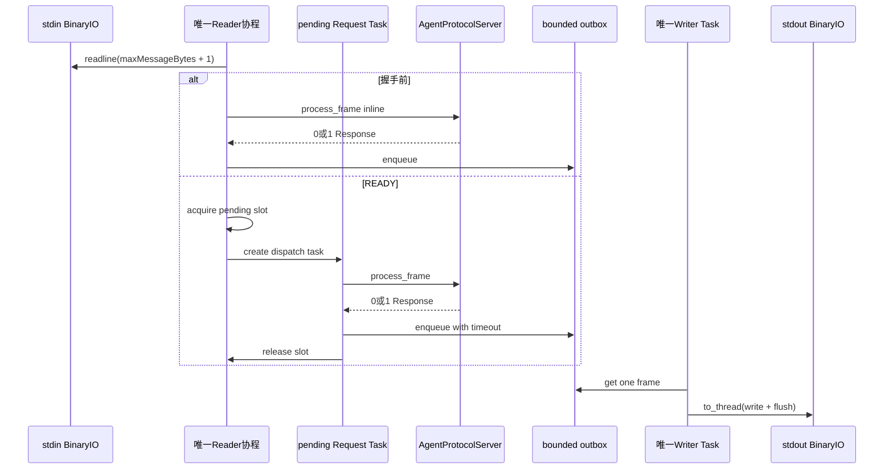

Reader在握手前同步调用Server，确保initialize与initialized通知不会被后续业务Request越过。READY后Reader
读取一帧、等待Semaphore并创建Task，因此最多有配置数量的Request并发；长轮询不会阻塞后续取消或查询。
Response进入一个Queue，由唯一Writer按入队顺序写出。业务完成顺序可以与输入顺序不同，客户端必须按
JSON-RPC ID归并。

### 15.2 背压

| 资源 | 当前边界 | 饱和行为 |
|---|---|---|
| 单帧输入 | `readline(maxMessageBytes + 1)`，Codec再校验 | 超长帧成为`invalid_request`；Reader不会读取无限行 |
| pending Request | `asyncio.Semaphore(server.limits.max_pending_requests)` | Reader停在Acquire，向OS Pipe传播背压 |
| 出站消息 | `asyncio.Queue(maxsize=max_outbound_messages)` | Dispatch等待`outbox_drained`，超过`outbound_timeout_seconds`后设置Stopping |
| 单次入队等待 | 默认5秒 | 触发Transport停止；不取消已持久领域事实 |
| Writer关闭等待 | 默认5秒 | 超时取消Writer Task并继续收敛 |

Queue和Semaphore在`run_stdio`进入时、initialize之前创建，因此使用Server初始Limit。握手后客户端声明的更小
`maxPendingRequests/maxOutboundMessages`会出现在Initialize Result，但不会缩小既有对象。这是当前协商
语义差距。

### 15.3 Writer实现边界

`_write`把`output.write(frame)`和`flush()`放入`asyncio.to_thread`，避免同步BinaryIO直接阻塞事件循环。
当前实现存在以下精确边界：

- `outbound_timeout_seconds`包围“放入Queue”，不包围实际`write + flush`；
- 关闭阶段等待Writer受同一Timeout限制，取消Task不能终止已经在线程中阻塞的底层OS写操作；
- `BinaryIO.write`返回的短写长度没有校验；
- Writer取出Queue项时立即Set `outbox_drained`，即使底层写仍未完成；
- Writer异常保存在`writer_failure`，正常退出清理后重新抛出，但没有结构化错误映射。

现有慢客户端测试证明有限内存输入结束后关闭阶段可以按Timeout返回且Session不损坏，不等于证明真实管道
在stdin长期保持打开、stdout永久阻塞时一定及时退出。

## 16. EOF、Writer故障与传输关闭

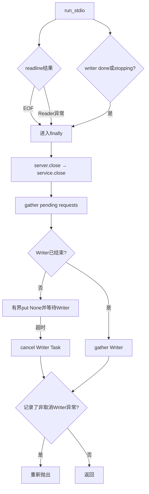

关闭先调用Server/Service，再等待已经进入的Request，最后关闭Writer。这保证Service关闭会唤醒长轮询，
Pending Response仍有机会入队，Sentinel位于它们之后。Server在CLOSING/CLOSED状态会先于解码返回
`server_closing`，因此即使输入本来是合法Notification也会得到ID为空的Error Response；这是与正常
Notification单向语义不一致的现行缺口。已经进入`process_frame`并跨`await`执行的Request不会在完成前
再次检查连接状态。

如果stdin是长期阻塞的真实Pipe，Writer在Reader的`to_thread(readline)`期间失败，Reader线程不能被
`writer_task.done()`主动唤醒；循环要等`readline`返回后才观察故障。该场景尚无真实管道故障测试。

## 17. Scoped Artifact读取

### 17.1 构造不变量

`ScopedProtocolArtifactReader(session, artifacts, access)`要求`artifacts.session is session`，使用对象身份
确保Artifact Store与App Server查询的是同一个Session端口。若不一致，构造立即失败。Service本身没有对
`runtime.store is store`或Request Store路径做同等级别校验。

### 17.2 每次读取时序

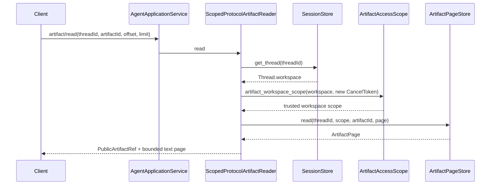

客户端不能提交Workspace Scope。Reader每次从Session加载Thread并向Access端口获取当前能力，再由Artifact
Store验证Thread、Scope和Artifact。每次读取创建新的`CancelToken`，但该Token当前未暴露给连接取消，也
没有App Server级读Timeout；底层读取慢时会占用一个pending slot。

### 17.3 能力广告

Server构造时只有Reader非空才：

- 把`artifact/read`加入`methods`；
- 返回`artifactPages=true`。

默认Product Config组合根当前没有创建Reader，所以产品模式不广告该能力。测试中的Artifact闭环属于显式
装配库能力，不能写成默认产品已具备。

## 18. 默认产品装配与所有权

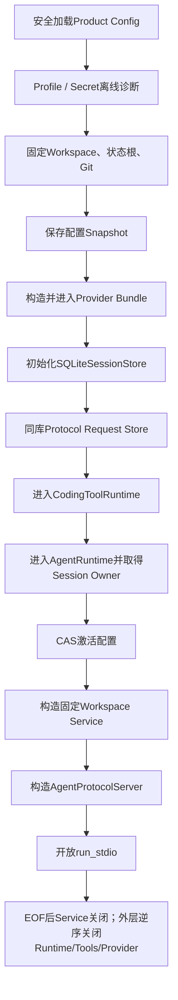

`run_product_stdio`在Windows当前于创建状态根和Provider之前通过平台门禁失败。POSIX正常路径只有全部组件
进入生命周期且配置CAS激活后才开放stdio。App Server不拥有外层对象关闭权：

| 组件 | 创建者 | 关闭者 |
|---|---|---|
| Config Store | Product Config组合根 | 同步Context Manager |
| Provider Bundle | Product Config | `async with bundle` |
| Session Store | Product Config | Agent Runtime Owner生命周期 |
| Protocol Request Store | Product Config | 无长连接，无显式Close |
| Coding Tool Runtime | Product Config | 外层`async with` |
| Agent Runtime | Product Config | 外层`async with` |
| AgentApplicationService | Product Config | `AgentProtocolServer.close` |
| AgentProtocolServer | Product Config | `run_stdio` finally |
| stdio Writer/Request Tasks | `run_stdio` | `run_stdio` finally |

默认装配把同一`SQLiteSessionStore`传给Runtime与Service，并以其路径构造Request Store；这是组合根保证，
`AgentApplicationService.__init__`当前不主动验证三者一致。

## 19. 持久事实、内存状态与恢复权威性

| 数据/状态 | 所有者 | 持久化 | 恢复角色 |
|---|---|---:|---|
| Thread/Turn/Item/Event | Session Store + Agent Runtime | 是 | 业务状态、终态和Replay的唯一权威 |
| Protocol命令Claim与Result | Protocol Request Store | 是 | 重放Command Response和发现参数冲突 |
| Artifact正文/元数据 | Artifact Store | 是 | 大结果与Diff分页恢复 |
| ConnectionState/Client绑定 | AgentProtocolServer | 否 | 仅当前连接握手 |
| 有效Limit和方法表 | AgentProtocolServer | 否 | 当前连接能力 |
| 后台Turn Task Registry | AgentApplicationService | 否 | 当前进程避免重复调度；重启靠Session恢复 |
| Delta Deque/Gap/Event | AgentApplicationService | 否 | 低延迟UI；重启或溢出后依赖持久Item |
| pending Request/Outbox | run_stdio | 否 | 传输内背压；断线后客户端重试/Replay |

App Server不会把内存Task或Delta恢复到新进程。重启时客户端重新initialize，读取Thread Snapshot，以最后
确认的`scannedThrough`继续Replay，并对响应未知的写命令使用原客户端实例、Request ID和参数重试。后台
Turn是否继续由持久Turn状态决定，不由旧连接是否存在决定。

## 20. 并发、顺序与线性化点

### 20.1 并发层次

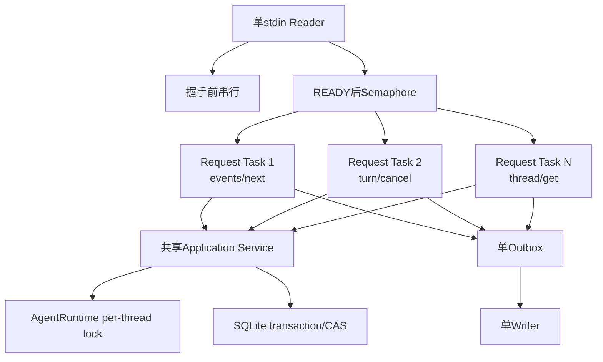

Transport并发不等于同Thread并发提交。Service可以同时处理多个Request，最终Thread一致性由
`AgentRuntime`每Thread Lock和Session CAS保证，Protocol命令冲突由Request Store事务保证。不同Thread可
并发；相同Connection Response可乱序；stdout物理帧由单Writer串行。

### 20.2 关键线性化点

| 行为 | 线性化/权威点 |
|---|---|
| 连接初始化 | `_initialize`把State设为`INITIALIZED_PENDING_ACK` |
| 连接Ready | `_notification`把State设为`READY` |
| 命令键占用 | `ProtocolRequestStore.claim`事务提交 |
| Thread/Turn业务接受 | Runtime对应Session Event事务提交 |
| 命令公开完成 | `ProtocolRequestStore.complete`事务提交 |
| 后台调度去重 | `_tasks[turn_id]`设置；仅为进程内优化 |
| Replay进度 | 返回的`scannedThrough` |
| Delta缺口 | `_receive_delta`首次因满Buffer丢弃并登记Gap |
| Response物理顺序 | 成功放入Outbox；不等于请求输入顺序 |
| 连接关闭 | Server状态最终成为`CLOSED`；业务事实仍看Session |

### 20.3 竞态处理

- Delta Event在`clear`后立即重读Snapshot，避免丢唤醒；
- Deadline后最终读取，避免边界事件被误报Timeout；
- Task完成回调只删除仍由自己占用的Registry键，避免旧Task删除新Task；
- Command完成后才Spawn，重放已完成结果仍Spawn，覆盖提交/调度崩溃窗口；
- stdout只由Writer写，避免Response字节交错；
- EOF后先关闭Service唤醒长轮询，再Gather pending，避免30秒等待拖延退出。

## 21. 失败与恢复矩阵

| 场景 | 当前结果 | 持久事实 | 恢复 |
|---|---|---|---|
| initialize前业务Request | `not_initialized` | 无 | 完成握手后重发 |
| initialize Params非法 | `invalid_params`，State保持NEW | 无 | 修正后重新initialize |
| 非1.0版本 | 当前也是`invalid_params` | 无 | 使用1.0；专用版本错误码待修复 |
| initialized Notification非法/时机错误 | 静默忽略 | 无 | 在正确时机发送合法Notification |
| 方法不存在 | `method_not_found` | 无 | 依据协商方法表 |
| 写命令参数冲突 | `idempotency_conflict` | 原账本不变 | 新意图使用新Request ID |
| 领域稳定失败 | `-32010`稳定错误 | 取决于Runtime；账本尽力failed | 按`retryable`与Snapshot处理 |
| Service稳定错误 | `-32010` | 可能保留accepted | 原键重试并联合Session判断 |
| 内部异常 | `internal_error`且不公开原文 | 可能部分提交 | 重连、Snapshot、Replay、原键重试 |
| 背景Task异常 | 无主动推送；回调消费异常 | Runtime应提交失败事实 | Replay/Thread Get观察；若仍活动则Resume |
| Delta Listener异常 | Runtime捕获并忽略 | Session执行不受影响 | 等待持久Item |
| Delta Buffer溢出 | `liveGap=true`一次 | Session事实不丢 | 放弃Delta完整性，Replay |
| 长轮询超时 | `timedOut=true` | 无变更 | 继续轮询或退避 |
| stdout Queue饱和 | 入队等待到Timeout后Stopping | 已提交领域事实不回滚 | 重连并Replay |
| Writer异常 | 停止并在清理后重抛 | Session保持 | 修复管道，重连恢复 |
| stdin EOF | 有界关闭Service、pending和Writer | Session保持 | 新进程重连 |
| Closing/Closed时收到Notification | 当前在解码前返回`server_closing` Error Response | 无 | 客户端关闭连接；服务端需修复单向语义 |
| 关闭时Provider慢 | 宽限后取消后台Task | Runtime提交CANCELLED | 读取终态；新意图显式Retry |
| Artifact无Reader | 方法不广告；直接Service调用为`artifact_not_enabled` | 无 | 正确装配Scoped Reader |
| Artifact Scope/Store失败 | 稳定或内部错误 | Artifact/Session不由App Server改写 | 修复授权或存储后重读 |

## 22. 取消、超时与关闭语义

### 22.1 不同Timeout不能混用

| Timeout/取消 | 默认/来源 | 作用对象 | 不做什么 |
|---|---|---|---|
| `events/next.waitMs` | 最多30秒，客户端参数 | 当前长轮询Request | 不取消Turn |
| stdio `outbound_timeout_seconds` | 默认5秒，宿主参数 | Outbox入队和Writer关闭等待 | 不直接限制底层阻塞Write |
| Service `grace_seconds` | 默认5秒 | 后台Turn Task关闭宽限 | 不关闭Runtime组件 |
| `turn/cancel` | 显式协议Command | 指定Thread/Turn | 不等同连接断开 |
| Artifact `CancelToken` | Reader内部新建 | 下游Scope/Read合同 | 当前客户端无法触发，且无独立Timeout |
| Agent Budget Timeout | Turn合同 | Provider/Tool/Agent执行 | 不由App Server重新定义 |

### 22.2 关闭边界

`run_stdio`的EOF或停止信号会调用`server.close`。Server先进入CLOSING，再等待`service.close`，最后进入
CLOSED。Service关闭后：

- 取消Delta订阅；
- 唤醒所有长轮询；
- 宽限等待后台Turn；
- 取消剩余Task并Gather；
- 不主动拒绝直接Service查询方法，也不清空所有Delta结构；正常调用应由Server状态阻断。

若`service.close`本身抛异常，Server可能停留在CLOSING，`run_stdio`后续Pending/Writer清理也可能被该异常
中断；当前没有关闭故障注入测试覆盖这一组合。

## 23. 资源边界与性能

### 23.1 已有边界

| 资源 | 边界 |
|---|---|
| 输入帧 | Protocol `maxMessageBytes` |
| READY并发Request | 初始`maxPendingRequests` Semaphore |
| Outbox消息数 | 初始`maxOutboundMessages` Queue |
| Replay请求Limit | Protocol 1～1000；AgentClient和薄CLI执行协商值前置门禁，Server Service当前未再次收紧 |
| 单Thread Delta | 1000条Deque |
| 单次Delta返回 | Request `limit`，最多1000 |
| 长轮询等待 | 0～30秒，50毫秒持久事件探测 |
| Thread列表页 | 1～200，但实现会加载过滤前尾部Thread |
| Artifact页 | 1～200记录、24 Ki字符公共合同 |
| Service关闭宽限 | 默认5秒 |
| Outbox等待/Writer关闭 | 默认5秒 |

### 23.2 未有全局边界

- Service跟踪过的Thread数量及`_delta_events`字典大小；
- 未消费Delta的Thread总内存；
- 后台Turn Task总数，除领域/调用量自然约束外没有Service级上限；
- Session `events`全尾部读取量；
- Thread List全量ID和聚合加载量；
- 出站Response实际UTF-8字节；
- 单Writer底层阻塞线程寿命；
- accepted Protocol Request历史数量和年龄。

面向大量本地用户的1.0仍需要每实例长会话Soak、数据库增长、内存和关闭延迟基准。当前边界证明“单个
进程不会无限放大单Thread Delta或Queue消息数”，不证明全服务内存严格有界。

## 24. 安全与隐私边界

### 24.1 已实现控制

1. 所有入站字节经过Protocol严格Codec和具体Params模型；
2. 客户端不能提交Agent Event、Tool Result或Runtime状态；
3. Method Dispatch显式，不进行任意方法反射；
4. 默认产品固定Workspace并要求Create路径真实解析后相等；
5. Artifact每次读取重新从Session获取Workspace并取得受信Scope；
6. Artifact方法仅在安全Reader装配时广告；
7. 未预期异常以固定消息清洗；
8. stdout只用于JSONL Response，产品诊断应走stderr；
9. 配置、状态目录与Workspace重叠在Product Config组合根提前拒绝；
10. Runtime、Tool、Workspace和Artifact继续执行各自授权，不把Thread路径当权限。

### 24.2 当前暴露面

App Server会向本地客户端返回Protocol允许的Workspace、用户内容、Tool参数/输出、Approval信息、错误消息
和Artifact页。稳定`KernelError`或`AgentServiceError`正文没有统一Secret Guard。内存中Service还持有：

- Delta正文；
- Thread/Turn ID；
- 后台Task与异常对象直到回调消费；
- 固定Workspace路径；
- 当前连接Client Instance ID。

模块不主动记录这些值，但上层日志和SDK若打印完整Request/Response仍可能泄漏。App Server没有DLP、加密
或日志Redactor端口。

### 24.3 授权假设

当前stdio进程信任启动它的本地父进程。同一Session数据库中的所有Thread可被知道ID或调用List的连接查询，
`clientInstanceId`只用于幂等命名空间，不是安全身份。固定Workspace也只在Create时检查。任何多租户或
远程部署必须新增：认证、Thread所有权、Tenant分区、速率限制、Origin/TLS、消息审计和状态目录隔离。

## 25. 重点类、函数与接口

### 25.1 重点符号

| 符号 | 职责 | 拥有状态 | 输入/输出 | 错误/取消 |
|---|---|---|---|---|
| `ConnectionState` | 单连接五态枚举 | 无 | 状态值 | 非法时机由Server返回错误或忽略Notification |
| `AgentProtocolServer` | Frame、状态、能力、路由和错误映射 | State、Client ID、Limits、Methods、Delta能力 | bytes → 0/1 Response frames | 清洗Codec/Params/Service/Kernel/Unexpected错误 |
| `AgentProtocolServer.process_frame` | 单帧总入口 | 读取/更新连接状态 | bytes → tuple[bytes] | Closing、Decode、Method和业务分支 |
| `AgentProtocolServer.close` | 关闭连接服务 | State | 无 → 无 | Service失败会向上传播 |
| `AgentServiceError` | 稳定应用错误 | code/message/retryable | Exception | Server映射为`-32010/-32011` |
| `AgentApplicationService` | 协议到领域的应用编排 | Tasks、Delta Buffers、Events、fixed Workspace、closed | Params → Protocol Result | Runtime/Store错误转换或传播 |
| `_command` | 写命令幂等模板 | 无独立状态 | Operation + Result模型 → Result | 尽力持久failed |
| `_spawn` | 进程内Turn驱动去重 | `_tasks` | Thread/Turn ID | Task异常消费，不主动通知 |
| `replay_events` | 持久Event页面 | 无 | Cursor/Limit → Replay | Session和投影错误 |
| `next_events` | Pull-Live长轮询 | Delta Event/Buffer | Wait/Limit → Next Result | Deadline返回Timeout，Close唤醒 |
| `ArtifactPageStore` | Artifact读取最小端口 | 实现者拥有 | Thread/Scope/Artifact/Page → `ArtifactPage` | 下游定义稳定错误 |
| `ScopedProtocolArtifactReader` | 重新授权并投影Artifact页 | Session、Store、Access | 公共读取参数 → Page Result | 无客户端取消/独立Timeout |
| `run_stdio` | 单Reader/Writer与生命周期 | Queue、Semaphore、Tasks、Stopping | BinaryIO + Server → 无 | EOF、入队Timeout、Writer异常和关闭 |
| `_write` | 阻塞BinaryIO隔离 | 无 | frame → write+flush | 底层异常传播；不校验短写 |

### 25.2 构造不变量

| 构造 | 当前验证 | 未验证 |
|---|---|---|
| `AgentProtocolServer(service, limits)` | ProtocolLimits模型保证范围；按Reader决定方法表 | Service是否已关闭、是否与Runtime一致 |
| `AgentApplicationService(runtime, store, requests, reader, workspace)` | fixed Workspace存在并规范化；立即订阅Delta | `runtime.store is store`、Request Store同库、Runtime Tool根与fixed Workspace一致 |
| `ScopedProtocolArtifactReader(session, artifacts, access)` | `artifacts.session is session` | Access是否与Runtime相同能力源 |
| `run_stdio(server, streams, timeout)` | 无显式参数模型 | Timeout正数、BinaryIO短写行为、Streams是否真正独占 |

### 25.3 包级导出

[`app_server.__init__`](../../src/harnessix/app_server/__init__.py)公开`AgentApplicationService`、
`AgentProtocolServer`、`AgentServiceError`、`ConnectionState`和`ScopedProtocolArtifactReader`。
`run_stdio`和`ArtifactPageStore`当前不在包级`__all__`，内部组合根从具体模块导入。

## 26. 重点字段与状态

### 26.1 Server字段

| 字段 | 来源 | 生命周期 | 不变量/敏感性 |
|---|---|---|---|
| `service` | 构造注入 | 整个连接 | 连接关闭时调用其Close |
| `methods` | 固定表+Reader | 构造时冻结 | 排序、唯一；公开能力 |
| `limits` | 服务端默认/注入，initialize后取Min | 当前连接 | 部分协商值未贯穿已创建Transport对象 |
| `state` | Server转换 | NEW到CLOSED | 进程内，不持久 |
| `client_instance_id` | initialize Params | 初始化后固定 | 幂等命名空间，不是授权身份 |
| `item_deltas_enabled` | Client Capability | 初始化后固定 | 控制`events/next`是否消费Delta |

### 26.2 Service字段

| 字段 | 类型 | 语义 | 边界 |
|---|---|---|---|
| `runtime` | `AgentRuntime` | 领域命令和执行所有者 | Service不关闭其生命周期 |
| `store` | `SessionStore` | 查询与Replay权威 | 构造未验证与Runtime Store一致 |
| `requests` | `ProtocolRequestStore` | 写命令幂等和结果 | 与Session非单事务 |
| `artifact_reader` | 可选Reader | Artifact能力门禁 | None时不广告方法 |
| `workspace` | `Path?` | 可选固定Create根 | 只在Thread Create重新验证 |
| `_tasks` | `dict[UUID, Task[Turn]]` | 每Turn最多一个后台Task | 无Service级总数上限 |
| `_delta_limit` | `1000` | 单Thread Deque容量 | 硬编码，不来自协商Limit |
| `_deltas` | Thread→Deque | 未消费Live Delta | 空时删除，Thread总数无上限 |
| `_delta_gaps` | Thread Set | 曾丢最旧Delta | 消费一次后清除 |
| `_delta_events` | Thread→Event | 唤醒长轮询 | 当前运行期不删除 |
| `_unsubscribe_deltas` | Callable | 解除Runtime Listener | Close时调用一次 |
| `_closed` | bool | 关闭长轮询与Close幂等 | 不被所有公开Service方法检查 |

## 27. 核心业务逻辑伪代码

### 27.1 单帧处理

```text
process_frame(frame):
    if state is CLOSING or CLOSED:
        return server_closing error

    decode strict Protocol frame
    if decode fails:
        return mapped parse/request error with id null

    if Notification:
        try handle initialized acknowledgement
        ignore invalid or unknown notification
        return no response

    if method == initialize:
        return initialize response
    require state == READY
    require method in advertised methods

    try:
        params := strict method-specific model
        result := application_service.dispatch(params)
        return success response(result)
    catch method-param validation:
        return invalid_params(first_path)
    catch stable service/kernel error:
        return bounded stable error
    catch unexpected:
        return fixed internal_error without original exception
```

### 27.2 后台接受与驱动

```text
start_turn(client, params):
    operation:
        turn := runtime.accept_turn(thread, prompt, request_id, budget)
        return public TurnResult(turn)

    after_result(result):
        if result.status == ACCEPTED:
            spawn_once(result.turn_id, runtime.resume_turn)

    return command_template(
        claim before operation,
        complete before after_result,
        replay completed result and repeat after_result
    )
```

### 27.3 stdio运行

```text
run_stdio(server, input, output):
    create bounded outbox and pending semaphore from initial server limits
    start one writer task

    while writer alive and not stopping:
        line := blocking readline in worker thread, bounded by message bytes + 1
        if EOF: break

        if server not READY:
            process line inline and enqueue any response
        else:
            acquire pending slot
            spawn request task:
                process line
                enqueue each response within outbound timeout
                always release slot

    finally:
        close server and wake/cancel background turn tasks
        await all pending request tasks
        enqueue writer sentinel and await within timeout
        if timeout: cancel writer task

    if writer failed with non-cancellation error:
        rethrow it
```

### 27.4 Artifact读取

```text
read_artifact(thread_id, artifact_id, page):
    thread := session.get_thread(thread_id)
    scope := access.artifact_workspace_scope(thread.workspace, new cancel token)
    artifact_page := artifact_store.read(thread_id, scope, artifact_id, page)
    return strict public page projection
```

## 28. 可观测性与运维诊断

App Server当前没有注入[`Observability`](observability.md)端口，也没有模块级Logger调用。运行时可见信号主要是：

- JSON-RPC错误码、`retryable`和首字段Path；
- Protocol Request记录的Method/State/时间/摘要；
- Thread Snapshot、Session Event Replay和Turn Public Failure；
- SDK Transport的EOF、Malformed Response和子进程退出错误；
- Product Config启动阶段的稳定Kernel Error。

### 28.1 建议但尚未实现的低基数信号

| 类型 | 信号 | 推荐低基数属性 |
|---|---|---|
| Counter | `app_server.requests` | method、result class |
| Histogram | `app_server.request.duration` | method，不放Thread/Request ID |
| Gauge | `app_server.pending` | service instance role |
| Gauge | `app_server.outbox.depth` | service role |
| Counter | `app_server.connection.closed` | eof/slow_writer/writer_error/shutdown |
| Counter | `app_server.delta.dropped` | reason=buffer_full |
| Histogram | `app_server.replay.lag` | 不含Thread ID的桶化值 |
| Gauge | `app_server.background_turns` | 无用户标识 |

任何信号都不得记录Prompt、Answer、Tool参数/结果、Workspace、Approval Reason、Artifact正文或完整异常。业务
恢复继续依赖Session/Protocol账本，而不是Trace或日志。

## 29. 源码、测试与决策映射

### 29.1 核心源码映射

| 设计元素 | 源码 | 关键符号 | 测试 | 测试符号 |
|---|---|---|---|---|
| 连接状态与方法 | [`server.py`](../../src/harnessix/app_server/server.py) | `SERVER_METHODS`、`ConnectionState` | [`test_server_sdk.py`](../../tests/app_server/test_server_sdk.py) | `test_handshake_enforces_state_version_and_params` |
| 帧总入口与错误清洗 | [`server.py`](../../src/harnessix/app_server/server.py) | `AgentProtocolServer.process_frame` | 同上 | `test_internal_validation_failure_is_not_reported_as_invalid_params` |
| Params分派 | [`server.py`](../../src/harnessix/app_server/server.py) | `_params`、`_dispatch` | Protocol/App Server测试 | 握手、Workspace和方法纵向测试 |
| 命令模板 | [`service.py`](../../src/harnessix/app_server/service.py) | `_command` | [`test_server_sdk.py`](../../tests/app_server/test_server_sdk.py) | `test_agent_sdk_drives_turn_replay_and_duplicate_command`、`test_same_command_key_with_different_prompt_returns_conflict` |
| 崩溃后后台驱动 | [`service.py`](../../src/harnessix/app_server/service.py) | `_spawn`、`start_turn` | 同上 | `test_completed_ledger_recovers_accepted_turn_after_restart` |
| Service关闭 | [`service.py`](../../src/harnessix/app_server/service.py) | `close` | 同上 | `test_service_shutdown_is_bounded_and_persists_cancel` |
| Thread过滤分页 | [`service.py`](../../src/harnessix/app_server/service.py) | `list_threads` | 同上 | `test_thread_list_filters_before_pagination` |
| Question恢复驱动 | [`service.py`](../../src/harnessix/app_server/service.py) | `respond_question` | 同上 | `test_sdk_question_response_resumes_background_turn`、`test_completed_question_command_recovers_before_background_spawn` |
| Approval恢复驱动 | [`service.py`](../../src/harnessix/app_server/service.py) | `respond_approval` | 同上 | `test_sdk_approval_response_drives_decided_turn` |
| Replay与长轮询 | [`service.py`](../../src/harnessix/app_server/service.py) | `replay_events`、`_next_snapshot`、`next_events` | 同上 | `test_events_next_delivers_live_delta_then_durable_replay`、`test_events_next_returns_progress_arriving_at_timeout_boundary` |
| Delta边界 | [`service.py`](../../src/harnessix/app_server/service.py) | `_receive_delta`、`_take_deltas` | 同上 | `test_events_next_marks_bounded_delta_buffer_gap`、`test_events_next_omits_deltas_when_client_did_not_negotiate_them` |
| stdio生命周期 | [`stdio.py`](../../src/harnessix/app_server/stdio.py) | `run_stdio` | 同上 | `test_stdio_uses_jsonl_and_closes_on_eof` |
| READY并发 | [`stdio.py`](../../src/harnessix/app_server/stdio.py) | `slots`、`dispatch` | 同上 | `test_stdio_long_poll_does_not_block_concurrent_request` |
| 慢输出收敛 | [`stdio.py`](../../src/harnessix/app_server/stdio.py) | `enqueue`、Writer关闭 | 同上 | `test_stdio_closes_slow_client_without_session_damage` |
| Artifact重新授权 | [`artifacts.py`](../../src/harnessix/app_server/artifacts.py) | `ScopedProtocolArtifactReader.read` | 同上 | `test_artifact_read_is_advertised_only_with_scoped_reader` |
| 默认产品装配 | [`product_config/server.py`](../../src/harnessix/product_config/server.py) | `run_product_stdio` | [`test_server_and_cli.py`](../../tests/product_config/test_server_and_cli.py) | `test_product_server_starts_and_closes_on_eof_without_model_request`、`test_fixed_workspace_rejects_other_thread_roots` |

### 29.2 客户端纵向映射

| 行为 | 测试 |
|---|---|
| Notification不等待Response | `test_subprocess_notification_does_not_wait_for_response` |
| Response乱序按ID归并 | `test_subprocess_transport_routes_out_of_order_responses` |
| Malformed Response结算全部Pending | `test_subprocess_transport_fails_all_pending_on_malformed_response` |
| 薄CLI全页列表与停滞Cursor拒绝 | [`test_agent_cli.py`](../../tests/app_server/test_agent_cli.py) `test_thin_cli_lists_all_pages_and_rejects_stalled_cursor` |
| 薄CLI使用协商事件页上限 | 同文件`test_thin_cli_uses_negotiated_event_page_limit` |
| Question驱动保持模型Transcript | 同文件`test_thin_cli_drives_question_and_preserves_model_transcript` |
| 快速终态仍回放最终文本 | 同文件`test_thin_cli_replays_final_text_when_turn_completed_before_follow` |
| 批次审批前先读取Diff | 同文件`test_thin_cli_reads_diff_before_batch_approval` |

### 29.3 ADR与研究

| 资料 | 决策范围 |
|---|---|
| [ADR 0009](../adr/0009-app-server-protocol.md) | 标准JSON-RPC与stdio JSONL初始选择 |
| [ADR 0070](../adr/0070-agent-protocol-v1-boundaries.md) | 公共投影、游标、命令身份和兼容 |
| [ADR 0071](../adr/0071-headless-app-server-and-sdk-lifecycle.md) | 命令顺序、后台驱动、单Reader/Writer和关闭 |
| [ADR 0072](../adr/0072-durable-interaction-and-pull-live-stream.md) | 持久Question/Steer与Pull-Live Delta |
| [Agent Protocol与产品运行时研究](../research/agent-protocol-product-runtime.md) | Codex、OpenCode、Claude Code固定版本证据与独立结论 |
| [0.8产品运行时设计](../m08-product-runtime-and-extensions.md) | 跨Protocol/App Server/SDK/配置/扩展的里程碑视图 |

## 30. 测试设计与证据边界

### 30.1 已证明范围

- 两步握手、未知初始化字段、READY状态和默认Delta能力；
- Service内部Validation Error不会伪装成客户端Params错误；
- Command重放、参数冲突、Protocol完成后未Spawn的重启恢复；
- Thread归档过滤先于分页；
- Service关闭宽限后Runtime提交Cancelled；
- 子进程Notification单向、Response乱序和Malformed Response错误结算；
- JSONL EOF关闭、长轮询与查询并发、有限输入下慢Writer有界收敛；
- Question和Approval响应后后台执行、已完成Question命令重放恢复；
- Delta低延迟、持久终态、Deadline边界、1000条溢出Gap和能力门禁；
- Artifact只在Scoped Reader装配时广告并按页读取；
- 薄CLI只依赖SDK完成协商上限内分页、提问、快速终态回放和Diff后审批；
- Product启动失败不会提前激活配置或开放协议，固定Workspace拒绝其他Create根。

### 30.2 尚未证明范围

- 非1.0版本返回专用`unsupported_protocol_version`；
- Server端协商后的Pending/Outbox/Replay Limit与连接级资源控制贯穿；客户端Replay已前置强制；
- 所有出站Response满足协商UTF-8字节上限；
- stdin保持打开且stdout永久阻塞/断裂时Reader能主动退出；
- BinaryIO短写、Service Close异常和Writer/Reader同时失败的优先级；
- CLOSING/CLOSED状态仍保持合法Notification不产生Response；
- Runtime/Session/Request Store错误装配在构造时失败关闭；
- 状态目录复用于不同固定Workspace时旧Thread不可见；
- 大量Thread、长Replay、数日Delta和后台Task的内存/延迟Soak；
- 多客户端、远程认证、多租户和Thread授权；
- App Server专用Trace、Metric、结构化日志和敏感字段回归。

## 31. 已知限制、风险与后续工作

| 优先级 | 限制/风险 | 影响 | 后续归属 |
|---|---|---|---|
| P0 | 非1.0版本被Literal校验提前归为`invalid_params`，显式版本错误分支不可达 | 错误合同与ADR不一致 | 0.9.1协议/客户端兼容修复 |
| P0 | 出站Response无协商字节门禁，`protocol_json_size`未使用 | 大结果可超过客户端能力并阻塞Writer | 0.9.1产品协议与Artifact外置 |
| P0 | Pending/Outbox在握手前构造，Replay未按协商Limit收紧 | 初始化返回Limit并非全部强制事实 | 0.9.1协议实现一致性 |
| P1 | stdout实际Write不受入队Timeout约束，阻塞线程不可被Task取消终止 | 真实慢/断裂客户端可能拖延线程或退出 | 0.9.3故障注入与Transport重构 |
| P1 | Reader阻塞期间不能被Writer失败主动唤醒 | stdin长期开启时故障发现延迟 | 0.9.3可靠性 |
| P1 | Delta只有单Thread上限，无Thread总数/总字节上限，未协商客户端仍缓存 | 长会话多Thread内存增长 | 0.9.3容量治理 |
| P1 | Replay读取全部事件尾部后截页，Thread List加载全部尾部聚合 | 大历史性能退化 | 0.9.2/0.9.3索引与基准 |
| P1 | fixed Workspace只限制Create，状态目录未持久绑定Workspace | 误复用状态根可暴露旧Thread元数据 | 0.9.4安全、0.9.5安装隔离 |
| P1 | Service不验证Runtime/Session/Request Store/Tool Workspace装配一致 | 自定义宿主误装配可能读写不同事实源 | Product Config/SDK模块加构造不变量 |
| P1 | 稳定Kernel/Service错误正文无统一Redactor | 下游错误若携带Secret可能持久并公开 | 0.9.4统一错误清洗 |
| P1 | Background Task异常只消费、不产生模块级信号 | 若Runtime未形成终态，故障难诊断 | 0.9.3可观测性与恢复扫描 |
| P2 | `_delta_events`按Thread增长且不删除 | 超长进程积累对象 | 0.9.3清理策略 |
| P2 | Artifact内部Cancel Token无法由客户端取消且无读Timeout | 慢Store占用pending slot | Artifact/SDK取消合同 |
| P2 | `turn/resume`在Request内等待完整Runtime恢复 | 长Turn占用一个slot且响应延迟高 | 明确异步接受/查询语义 |
| P2 | Method能力不按Runtime Question/Approval能力细分 | 客户端可能调用路由存在但领域不可用的方法 | 能力模型演进 |
| P2 | `run_stdio`不校验短写和Timeout参数 | 非标准BinaryIO行为可能截断帧 | Transport合同加固 |
| P2 | Closing/Closed分支在解码前返回错误，合法Notification也会收到Response | 与正常Notification单向合同不一致 | 调整关闭分支并增加直接Frame回归 |
| P2 | Service Close错误可中断后续Pending/Writer清理 | 复合故障收敛不完整 | 0.9.3关闭故障测试 |

## 32. 验收标准

- [x] 需求、目标、非目标、默认与显式装配边界完整；
- [x] stdio、Server、Service、Artifact四层职责和禁止依赖完整；
- [x] 连接状态、握手、方法、参数与错误映射对应实际源码；
- [x] 写命令、后台驱动、崩溃窗口和领域幂等关系完整；
- [x] Thread/Turn/Approval/Question方法及固定Workspace差异完整；
- [x] Durable Replay、Live Delta、Gap、长轮询竞态和恢复完整；
- [x] 单Reader/Writer、Semaphore、Outbox、EOF、慢客户端和关闭顺序完整；
- [x] Artifact重新授权、默认产品不装配能力和取消缺口明确；
- [x] 持久事实、内存状态、并发、线性化点和资源上限完整；
- [x] 安全、隐私、可观测性和大规模运行限制未被夸大；
- [x] 重点类、字段、伪代码、源码、测试、ADR和研究双向映射；
- [x] 链接、Mermaid、专项测试、全仓检查和文档索引同步均已通过。

## 33. 维护规则

以下变化必须在同一提交更新本文及对应Protocol/SDK/产品文档：

1. `SERVER_METHODS`、Connection State、initialize或能力广告变化；
2. Params分派、JSON-RPC错误码、稳定错误正文或异常清洗变化；
3. `_command`的Claim/Operation/Complete/Spawn顺序或失败持久化变化；
4. 后台Task触发状态、去重、异常、关闭或恢复策略变化；
5. Thread分页、Workspace固定、状态目录绑定或已有Thread授权变化；
6. Replay查询、Cursor、Delta Buffer、Gap、Deadline或轮询频率变化；
7. pending、Outbox、Writer、Reader、EOF、Timeout或关闭顺序变化；
8. Artifact Reader构造、Scope、Cancel、分页或方法广告变化；
9. Product Config组合根中的App Server装配、所有权或平台边界变化；
10. 远程传输、认证、多客户端、多租户、观测或资源预算变化。

重大语义变化先使用[重大变更设计模板](../governance/templates/change-design-template.md)评审。当前风险表中的
实现缺口不得通过只修改ADR或宣传材料关闭；必须有生产实现、失败/恢复测试、真实场景验证和文档同步。

## 34. 变更记录

| 文档版本 | 代码版本 | 日期 | 变更摘要 |
|---:|---|---|---|
| 3 | `608c548feb909aa5ae572bab7db35859283d3d01` | 2026-09-13 | 薄CLI按握手协商值限制Replay和Next事件页，避免SDK前置门禁暴露后继续发送超量请求 |
| 2 | `658e04d216d7d7efb01cd2e6a9db9788917552b9` | 2026-09-12 | 接入SDK现行模块设计，明确客户端传输、响应归并与恢复责任的后续阅读入口 |
| 1 | `8cd3358bdf0e8f550d7584ee3d81b5e5f7ae4e3e` | 2026-09-12 | 建立App Server现行模块设计，覆盖连接、应用服务、stdio、Artifact、并发背压、关闭恢复、默认装配及真实实现差距 |
