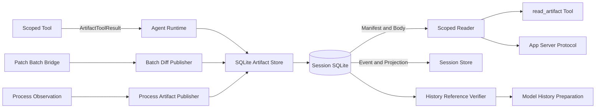
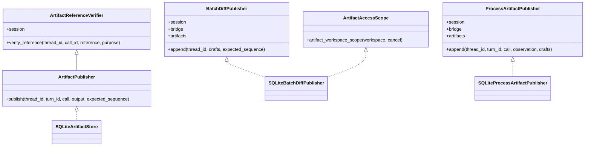
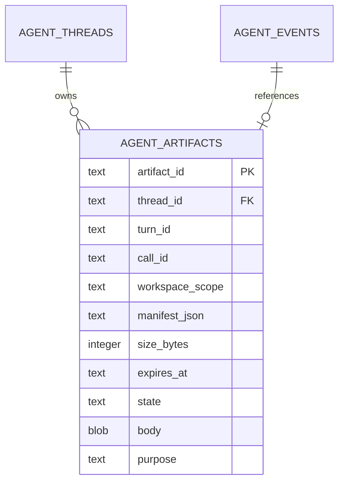
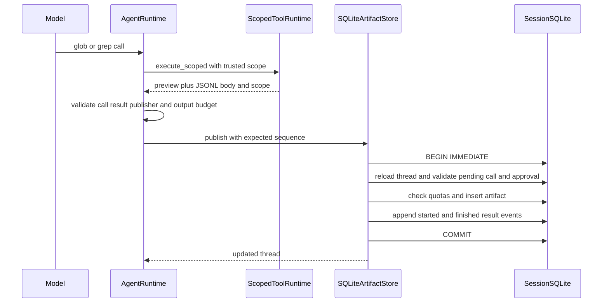
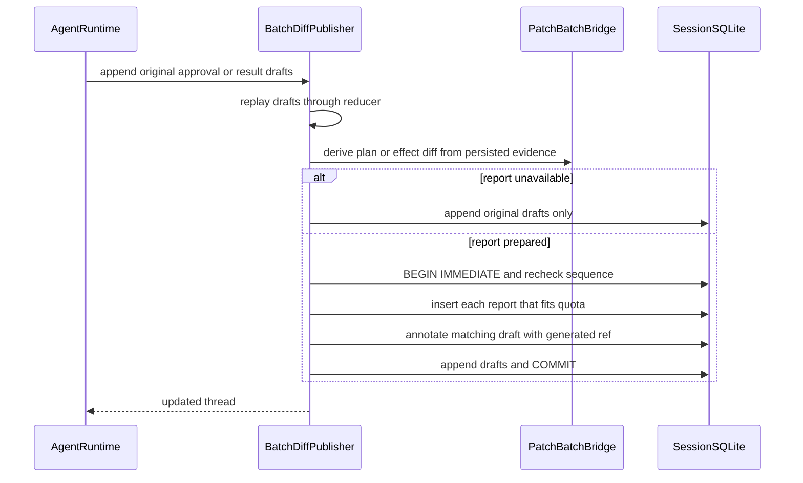
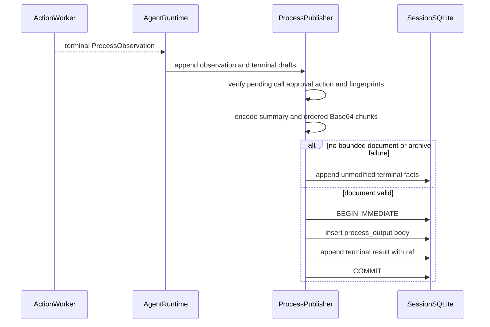
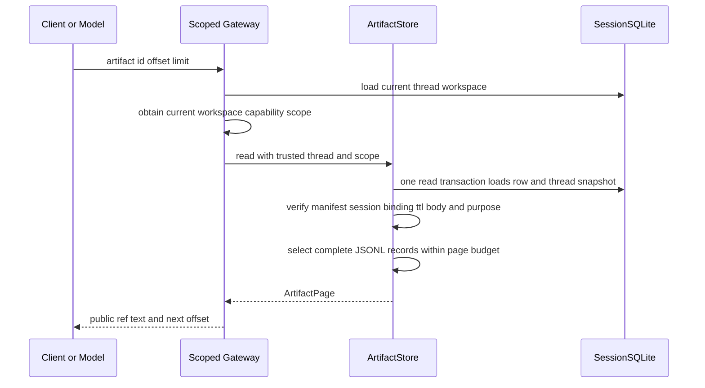
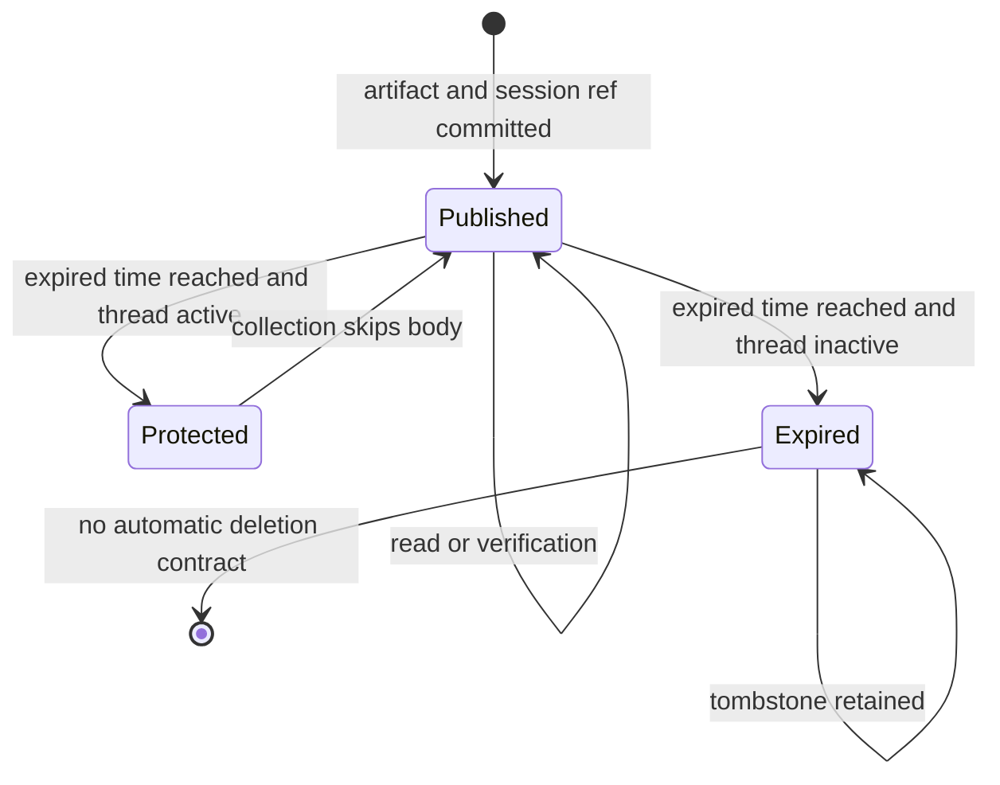
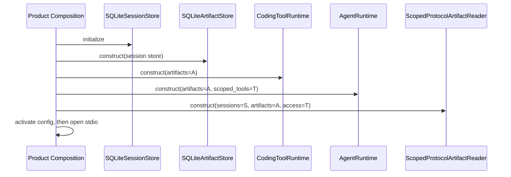

# Artifact模块设计

## 1. 文档摘要

| 项目 | 内容 |
|---|---|
| 当前能力 | 有界JSONL正文、不可变Manifest、Session同事务发布、分页读取、归属/用途/完整性验证、TTL和显式回收 |
| Artifact用途 | 只读Tool Result、Batch Plan/Effect Diff、Process Output、Action Review、Trusted Action Output；模型历史另识别Artifact Page |
| 本文状态 | 当前实现；`artifacts`包现行实现的事实源 |
| 代码版本 | `4b28fa4010bf1f9590f86a3c2e639916043894c2` |
| 当前实现 | `SQLiteArtifactStore`、`SQLiteBatchDiffPublisher`、`SQLiteProcessArtifactPublisher` |
| 默认产品装配 | `run_product_stdio`创建Session绑定Store并注入Tool、Agent和Scoped Reader；POSIX Patch Review及Verified固定Process Output均复用该Owner |
| 核心保证 | 正文、Manifest和对应Session引用同事务提交；读取时重新验证Thread、Workspace、用途、正文和Session反向引用 |

Artifact不是通用对象存储，也不是外部副作用的事实账本。它保存模型或客户端需要按页读取的有界证据；
Tool Result、Patch效果和Process Action的权威状态仍分别属于Session、Patch账本和Effect Journal。

## 2. 需求背景

搜索结果、整组Diff和进程双流可能远大于单次模型输出预算。只保留Preview会丢失证据，直接把完整正文
反复放入模型历史会持续消耗Context；把正文写入独立文件后再写Session又会产生引用与文件只完成一半的
双写窗口。崩溃、取消、配额不足和过期还可能使模型拿到无法读取的引用，或者诱发写操作重放。

Artifact模块把正文放入Session同一SQLite数据库，并将“正文存在”与“对应Item引用存在”作为同一事务
事实。读取不信任Artifact ID本身，而是同时核对当前Thread、受信Workspace Scope、用途、Manifest、正文
摘要、Session反向关联和用途特有的不变量。

## 3. 设计目标与非目标

### 3.1 目标

1. 单个Artifact正文、Manifest和Session引用原子发布或整体回滚；
2. 所有正文为有界UTF-8 JSONL，分页不截断记录、Unicode字符或JSON结构；
3. ID、SHA-256、大小、记录数、完整性和过期时间由受信宿主生成；
4. 读取使用`thread_id + workspace_scope + artifact_id`，不存在与跨归属统一返回Not Found；
5. 读取和模型发网前验证都核对Session中的双向引用，而不是只相信Manifest；
6. 搜索、Batch Diff和Process Output分别保留自身的完整性语义，禁止相互冒充；
7. 配额检查与插入串行化，跨并发发布不能透支全局或单Turn配额；
8. 写效果或Process终态优先于可选归档，归档失败不得抹去、改写或重放真实效果；
9. 提交后确认丢失时通过已提交Event识别结果，不重复发布或执行写操作；
10. 过期回收保留Tombstone，使历史引用明确失败而不是变成空成功。

### 3.2 非目标

1. 不提供任意文件、媒体、无限Blob、目录打包或远端对象存储；
2. 不把Artifact ID、UUID或SHA-256当作访问凭据；
3. 不替代Session Event、Effect Journal、Patch账本或Process Owner；
4. 不对正文执行通用Secret检测、DLP、加密或内容语义审查；
5. 不保证搜索期间Workspace是原子快照，也不保证`complete=true`代表工具或进程成功；
6. 不提供透明无限保留、自动Vacuum、跨Session复制或跨主机高可用；
7. 不允许模型或公共客户端提交`thread_id`之外的内部归属、Workspace Scope、用途或数据库路径。

## 4. 术语、硬限制与完整性语义

| 术语/限制 | 当前定义 | 语义 |
|---|---|---|
| 正文格式 | `jsonl/v1` | 每行一个可解析JSON值，以换行结束；拒绝NaN和Infinity |
| 单件大小 | 最大1 MiB | 超限整体拒绝，不截断后伪装完整 |
| 单件记录 | 最大10000条 | 空正文合法，非空正文必须以换行结束 |
| 单页正文 | 最大24 KiB、最多200条 | 按完整记录选择，`next_offset`指向下一条记录 |
| Workspace Scope | 64位小写十六进制摘要 | 由受信Workspace能力产生，不是路径字符串或授权Token |
| Published | 正文存在且长度等于`size_bytes` | 仍须通过Manifest、摘要和Session关联校验 |
| Expired | 正文已清空、Tombstone保留 | 读取固定返回`artifact_expired` |
| `complete` | 用途定义范围内的正文是否完整 | 不代表命令成功、无副作用或Workspace快照一致 |
| Preview | Session Tool Result中的有界直接视图 | 不是Artifact正文的安全摘要或授权证明 |
| Coverage | Artifact正文覆盖被模型视图省略字段的证明 | 只对完整`tool_result`及允许字段生效 |

各用途的`complete`含义不同：搜索表示在既定扫描、忽略和读取预算内是否完整收集记录；Batch Diff表示
所选Plan或Effect视图的全部可展示记录是否纳入；Process Output表示已观察双流自然EOF且没有在观察与
捕获之间丢弃字节。任何含义都不能提升为“软件任务成功”。

## 5. 模块上下文与数据流



数据流包含三种发布入口，但共享同一存储表和验证器。标准只读结果要求正文与结果一起成功；Batch和
Process正文属于附加展示证据，准备、预算或配额失败时允许只提交原审批/结果事实。该降级不改变原效果。

### 5.1 信任边界

| 边界 | 可信输入 | 不可信输入 | 失败策略 |
|---|---|---|---|
| Tool捕获 | Scoped Runtime生成的正文和Scope | 模型参数、旧路径标签 | 只接受绑定同一Publisher实例的`ArtifactToolResult` |
| Session发布 | 当前Thread、Turn、Call、批准和Sequence | 调用方自报归属 | 事务内重新读取和校验 |
| Batch报告 | Bridge从持久Patch计划/运行生成的Document | 任意Diff文本 | 无真实批次证据则不发布 |
| Process报告 | 已结算`ProcessObservation`和Action指纹 | 任意stdout/stderr字节 | 不匹配时降级为无引用终态或明确拒绝 |
| 公共读取 | Session Thread和当前Workspace能力 | 客户端Scope、用途、数据库位置 | 输入只接收Artifact ID及分页参数 |
| 模型历史 | 冻结View Decision和完整Artifact绑定 | Manifest自报完整 | Provider调用前重新验证全部引用 |

## 6. 组件职责与禁止边界

| 组件 | 主要职责 | 禁止承担 |
|---|---|---|
| `ArtifactPolicy` | TTL、单Turn、全局正文和Manifest配额 | 动态租户计费、磁盘物理上限 |
| `ArtifactRef` | 对外公开不可变Manifest | 保存Thread、Call、Scope、数据库路径 |
| `SQLiteArtifactStore` | 标准发布、读取、验证、配额、TTL回收 | 直接执行Tool、Patch或Process |
| `SQLiteBatchDiffPublisher` | 从真实批次事实生成Plan/Effect归档并原子注解事件 | 授予审批、执行Patch、Reconcile效果 |
| `SQLiteProcessArtifactPublisher` | 从已核对终态观察生成双流归档并原子注解结果 | 成为Action结果或重新运行进程 |
| `ArtifactAccessScope` | 证明当前宿主仍持有匹配Workspace能力 | 从历史路径推断访问权 |
| `ArtifactReferenceVerifier` | 发网前验证归属、用途、正文和覆盖 | 修改旧Item或补写缺失Artifact |
| `CodingToolRuntime` | 搜索捕获、分页Tool及Scope派生 | 暴露Scope给模型 |
| `ScopedProtocolArtifactReader` | 将公共请求绑定Session Thread和Workspace能力 | 接受客户端指定内部Owner或Scope |

## 7. 合同与重点字段

### 7.1 `ArtifactPolicy`

| 字段 | 类型/默认值 | 允许范围 | 计量和影响 |
|---|---|---|---|
| `ttl_seconds` | `int`/86400 | 60～604800 | Artifact创建时固定绝对过期时间 |
| `max_turn_bytes` | `int`/4 MiB | 1～32 MiB | 同Thread、Turn的`size_bytes`总和 |
| `max_turn_count` | `int`/128 | 1～1000 | 同Thread、Turn的Manifest数 |
| `max_live_bytes` | `int`/32 MiB | 1～256 MiB | 当前表中非空正文的实际字节和 |
| `max_manifests` | `int`/10000 | 1～100000 | 包含Expired Tombstone的全部行数 |

字段使用严格整数校验，布尔值不能冒充整数。策略进入Tool版本指纹，启用、关闭或改变策略会使等待中的
搜索批准失效，不能用新策略继续旧调用。

### 7.2 `ArtifactRef`

| 字段 | 类型 | 来源 | 约束与含义 | 敏感级别 |
|---|---|---|---|---|
| `artifact_id` | UUID | 宿主ID生成器 | 表主键；不是Bearer Token | 内部标识 |
| `sha256` | 64位十六进制 | 完整正文 | 读取时逐字节复算 | 摘要仍可能用于关联 |
| `size_bytes` | 0～1 MiB | 完整正文长度 | 与表索引和BLOB长度一致 | 低敏元数据 |
| `records` | 0～10000 | JSONL行数 | 与重新解析结果一致 | 低敏元数据 |
| `format` | `jsonl/v1` | 固定常量 | 未知格式失败关闭 | 公开合同 |
| `complete` | bool | 用途专用Document | 必须按用途解释 | 公开但不可泛化 |
| `expires_at` | 带时区时间 | 当前UTC加TTL | 读取和验证均执行到期判断 | 低敏元数据 |

### 7.3 读取与内部载荷

| 结构/字段 | 约束 | 持久化 | 说明 |
|---|---|---|---|
| `ReadArtifactInput.artifact_id` | UUID | Tool Call | 唯一允许客户端选择的对象身份 |
| `offset` | 0～10000，默认0 | Tool Call | JSONL记录偏移，不是字节偏移 |
| `limit` | 1～200，默认100 | Tool Call | 页面仍受24 KiB限制 |
| `ArtifactPage.text` | 完整JSONL记录，最大24 KiB | Tool Result | 非空必须以换行结束 |
| `next_offset` | 下一记录或`null` | Tool Result | 有值时必须等于`offset + 返回记录数` |
| `ArtifactToolResult.body` | bytes、最大1 MiB、有效JSONL | 不直接持久化对象 | 由Publisher写入BLOB，`repr`不暴露Publisher |
| `workspace_scope` | 64位摘要 | Artifact行 | 从受信Workspace能力取得 |
| `publisher` | 实例身份 | 不持久化 | 防止生产器和存储器错配 |

## 8. 接口与依赖倒置设计



`AgentRuntime`只依赖端口，但三个SQLite发布器必须共享同一`SessionStore`对象；Batch和Process发布器还
必须绑定Runtime实际使用的Bridge。验证器可独立注入，但不得切换到另一Session。当前具体实现会使用
`SQLiteSessionStore`私有事务能力，因此替换远端存储不是简单改连接字符串，而需重新实现原子合同。

## 9. 持久化模型与迁移



| 物理字段 | 不变量 |
|---|---|
| `artifact_id` | 全表主键，必须等于Manifest中的ID |
| `thread_id` | 外键指向Session Thread；读取归属第一维 |
| `turn_id`/`call_id` | 必须能在Thread投影中反向找到对应Item和专用证据 |
| `workspace_scope` | 长度64；读取归属第二维 |
| `manifest_json` | 严格反序列化为`ArtifactRef`并与索引字段一致 |
| `size_bytes` | 0～1048576；Published时等于BLOB长度 |
| `state` | 仅`published`或`expired` |
| `body` | Published非空；Expired必须为NULL |
| `purpose` | `tool_result`、`batch_plan`、`batch_effect`、`process_output` |

`UNIQUE(call_id, purpose)`允许同一Patch Batch调用同时拥有Plan和Effect两份证据，但禁止同一用途重复
发布。Migration 0006创建基础表；0009在事务中迁移为多用途表；0011加入`process_output`。迁移只复制
既有字节并替换表，不改写Session Event。Artifact公共Schema由`spec/artifact-*.schema.json`和
`spec/read-artifact-*.schema.json`冻结。

## 10. 标准只读Tool Result发布流程



标准入口仅接受成功、Read Only调用。Tool Result被包装为`output.preview + output.artifact`，原完整正文不
进入Event。若正文无效、超限、配额不足、调用已变化或引用加Preview超过Turn输出预算，整个结果发布
失败，不产生“只保存引用但没有正文”的状态。

## 11. Batch Diff发布流程



Plan引用绑定完整审批请求；Effect引用绑定已结算Patch Batch结果。发布器不接受调用方正文，而是调用
Bridge从原计划、批准、镜像和运行记录生成。报告不可用或配额不足时，原审批/效果事件仍然提交；部分
或Unknown效果不能伪造已应用编辑。提交后异常通过Event身份确认已提交批次，禁止重放写入。

## 12. Process Output发布流程



Process正文由唯一Summary及stdout后stderr的连续Base64 Chunk组成，单Chunk原始字节最多12 KiB。
Artifact只保存`ProcessResult`已经捕获的前缀；Effect Journal仍是外部命令效果权威。Action数据库与
Session数据库构成Saga而非跨库事务：恢复可从已结算Action重新生成展示正文，但绝不重新执行命令。

## 13. 读取、验证与模型历史



### 13.1 普通分页

存储查询同时匹配Artifact ID、Thread和Workspace Scope。未知ID、其他Thread及其他Scope均返回
`artifact_not_found`，避免用错误差异枚举归属。随后`_reference`验证Session反向引用，`_body`验证状态、
TTL、正文类型、长度、SHA-256、JSONL和记录数；Process用途再验证双流摘要与Action绑定。

### 13.2 模型历史验证

模型历史准备得到的引用在每次Provider请求前逐个调用`verify_reference`。`tool_result`可额外要求
`omitted_field`覆盖证明；`batch_effect`和`process_output`只能证明各自证据，不可替换整个通用结果。
`artifact_page`验证新的分页Tool Call参数、真实切片和结果完全一致。整组验证由Agent Runtime限制为5秒，
失败、取消或超时均发生在Provider发网前。

### 13.3 Fork所有权

Fork快照记录原Artifact Owner，模型历史验证按原Owner Thread读取，不复制正文或改写Manifest。当前
`read_artifact`执行入口仍以新调用所在Thread查询正文，没有接受或解析Fork Owner的公共字段；因此
继承历史可完成发网前证明，但子Thread主动分页父Thread正文尚未形成完整产品闭环。

## 14. TTL、回收与状态机



`collect(limit, after)`使用`BEGIN IMMEDIATE`按Artifact ID有界扫描到期Published行。所属Thread存在活跃
Turn时保守保护；否则将状态改为Expired并把BLOB置NULL。游标避免受保护前缀阻塞同批后续对象。回收
失败整体回滚，可重试；Tombstone继续占用Manifest配额，且SQLite释放页不等于数据库文件立即缩小。
图中的Protected是一次回收扫描的决策，不是数据库合法状态；持久`state`始终只有Published和Expired。

## 15. 失败语义与恢复矩阵

| 场景 | 公开错误/结果 | 是否重试效果 | 持久结果 |
|---|---|---:|---|
| 非JSONL、超1 MiB、记录/行超限 | `artifact_invalid` | 否 | 无Artifact |
| Publisher、Session或Bridge错配 | `artifact_store_mismatch` | 否 | 无旁路发布 |
| Session无活跃Runtime Owner | `artifact_runtime_required` | 否 | 无Artifact |
| Artifact能力未装配 | `artifact_not_enabled` | 否 | Turn明确失败 |
| 非Scoped入口返回Artifact | `artifact_scope_required` | 否 | 拒绝载荷 |
| Thread Sequence变化 | `sequence_conflict` | 否 | 当前事务回滚 |
| Pending Call或批准错绑 | `tool_scope_mismatch`/`approval_mismatch` | 否 | 当前事务回滚 |
| 单Turn/全局配额不足 | `artifact_quota_exceeded`或可选归档省略 | 否 | 标准结果失败；Batch/Process保留原事实 |
| 引用与Preview超过输出预算 | `tool_output_too_large`或可选归档省略 | 否 | 不发布误导引用 |
| 未知、跨Thread或跨Scope | `artifact_not_found` | 否 | 不泄露归属差异 |
| TTL到期 | `artifact_expired` | 否 | Tombstone保留 |
| Manifest、用途、Session引用或正文不一致 | `artifact_corrupt` | 否 | 不返回空页 |
| offset/limit非法或越界 | `artifact_invalid_cursor` | 否 | 无读取副作用 |
| 标准发布提交前异常/取消 | 原结构化错误或取消 | 否 | Artifact和Result一起回滚 |
| 标准发布提交后确认丢失 | 调用可能中断 | 否 | 已提交Artifact/Result保留，恢复不重跑Tool |
| Batch/Process提交后确认丢失 | 返回已匹配投影或由恢复读取 | 否 | 至多一个用途引用 |
| Process归档准备、配额或提交前失败 | 无Artifact的真实终态 | 否 | Action结果和Session终态保留 |
| 模型历史Artifact验证失败/超时 | Artifact错误或`context_artifact_timeout` | 否 | 不调用Provider |

恢复判断以Session Event身份、Sequence和Action/Patch既有事实为依据，不以“没有返回成功”推断事务未
提交。任何恢复路径都不能重新执行可能产生副作用的Patch或Process来补一份展示Artifact。

## 16. 并发、事务、取消与时间

1. 标准Tool Result由Agent每Thread锁串行进入`publish`；数据库使用`BEGIN IMMEDIATE`重新检查CAS；
2. 配额读取和正文插入位于同一写事务，并发连接不能同时基于旧总量通过；
3. 读取在一个SQLite读事务中同时取得Artifact行和Thread Snapshot，避免关联检查跨快照；
4. 回收使用单个有界写事务，任一结构损坏或故障会回滚本批全部状态修改；
5. Tool执行和分页I/O由`CancelToken.run`托管，关闭Runtime前排空受控子任务；
6. 发布与用户取消竞争同一Thread串行边界，允许“完整发布后再取消”或“取消先发生而不发布”，不允许半提交；
7. Batch和Process发布无独立后台重试队列；提交状态不明时先读Event，不盲目重发；
8. TTL使用带时区UTC墙钟；当前没有单调时钟租约或时钟漂移诊断。

## 17. 安全与隐私

| 资产/风险 | 当前控制 | 剩余风险 |
|---|---|---|
| 源码、搜索匹配和进程输出 | 私有Session数据库、Thread/Scope绑定、有界分页 | 无字段级加密或DLP，同UID进程仍可读本地文件 |
| 跨Thread枚举 | Not Found统一响应、客户端不传Scope | 直接使用内部Python存储端口不等于网络鉴权 |
| 路径逃逸 | Scope来自No Follow Workspace能力，Ref不含路径 | Artifact正文仍可能包含相对路径和源码 |
| Manifest篡改 | 严格Schema、索引一致性、Session反向引用和正文摘要 | SHA-256不提供数据库管理员对抗或加密真实性 |
| 用途降级 | 固定Purpose白名单及专用Process/Batch校验 | 新用途必须新增正式合同，不能复用`tool_result`蒙混 |
| Prompt注入 | Artifact只是低信任Tool正文，执行仍走Policy/Approval | 模型仍可能受正文内容影响 |
| Secret输出 | 不在日志或Ref暴露正文 | Tool/进程本身若输出Secret，当前Artifact层不会自动识别 |
| 数据删除 | TTL清空正文 | Tombstone、Session Preview和历史摘要仍可能保留相关信息 |

文件权限和数据库目录保护属于Session/部署职责。Ref中的摘要、大小和过期时间可公开给已授权客户端，
但不得作为Metric标签；正文、路径、Call ID和Artifact ID均不应进入通用日志。

## 18. 可观测性与运维

Artifact存储当前没有独立OTel Span或Metric。Agent Tool操作和模型历史准备会记录固定错误码、策略及数量；
`CollectionReport`提供`examined/expired/protected/collected_at/next_after`用于有界清理诊断。测试Fault Point只
用于事务和真实进程退出验证，不是生产故障注入API。

建议的低基数运维信号包括用途、状态、公开错误码、页面记录数、正文大小桶、回收计数和操作耗时；禁止
把正文、Thread/Turn/Call/Artifact ID、路径、Scope或SHA作为Metric标签。当前尚无内建GC调度、磁盘增长
指标、到期告警、Vacuum/备份命令或Artifact SLO，发布前需由0.9.3和0.9.5补齐。

## 19. 核心业务逻辑伪代码

```text
publish_read_only(thread, turn, call, captured):
    require captured.publisher is this store
    require active session runtime owner
    body = validate_bounded_jsonl(captured.body)
    require succeeded read-only result and trusted workspace scope
    ref = host_generated_manifest(body, ttl, captured.complete)
    published_result = wrap(preview=original_output, artifact=ref)
    require published_result within turn output budget
    begin immediate
    require thread.sequence == expected_sequence
    require pending call and matching approval when needed
    check quotas inside transaction
    insert published body and manifest
    append started and finished result events in same transaction
    require runtime owner unchanged
    commit

read(thread_id, trusted_scope, artifact_id, offset, limit):
    validate exact cursor types and bounds
    begin read transaction
    row = query by artifact_id + thread_id + trusted_scope
    if absent: fail artifact_not_found
    thread = validated session snapshot
    ref = verify manifest indexes purpose and reverse session reference
    lines = verify state ttl body bytes digest jsonl records and purpose details
    select complete records until count or page-byte limit
    return page with exact next_offset

publish_optional_effect_evidence(original_events):
    validate original events and durable effect identity first
    derive report only from trusted bridge or terminal observation
    if report cannot be represented safely: append original events
    else transactionally insert body and annotate matching events
    on uncertain commit: compare persisted event identities before retry
    never replay patch or process to regenerate evidence

collect(limit, after):
    begin immediate
    scan bounded expired published rows ordered after cursor
    for each row:
        verify owner and manifest
        if owner thread has active turn: protect
        else set state expired and body null
    commit and return counts plus continuation cursor
```

## 20. 源码与测试双向映射

| 设计元素 | 源码 | 关键符号 | 测试 | 关键测试函数 | 证明内容 |
|---|---|---|---|---|---|
| 合同与硬限制 | [`contracts.py`](../../src/harnessix/artifacts/contracts.py) | `ArtifactPolicy`、`ArtifactRef`、`ArtifactPage` | [`test_contracts.py`](../../tests/artifacts/test_contracts.py) | `test_frozen_artifact_schema`、`test_policy_is_strict_and_bounded`、`test_page_checks_complete_record_byte_and_cursor_bounds` | Schema、严格类型和分页不变量 |
| JSONL校验 | [`sqlite.py`](../../src/harnessix/artifacts/sqlite.py) | `records` | [`test_store.py`](../../tests/artifacts/test_store.py) | `test_invalid_or_unbounded_records_are_rejected` | UTF-8、JSON、行/件预算 |
| 标准原子发布 | [`sqlite.py`](../../src/harnessix/artifacts/sqlite.py) | `SQLiteArtifactStore.publish` | [`test_store.py`](../../tests/artifacts/test_store.py) | `test_exception_before_commit_rolls_back_everything`、`test_after_commit_error_preserves_reference_and_payload` | 正文和结果同事务 |
| 配额并发 | [`sqlite.py`](../../src/harnessix/artifacts/sqlite.py) | `_check_quota` | [`test_store.py`](../../tests/artifacts/test_store.py) | `test_concurrent_publish_cannot_overdraw_global_quota`、`test_byte_quota_failure_rolls_back_result_and_content` | 写事务内配额 |
| 读取与损坏 | [`sqlite.py`](../../src/harnessix/artifacts/sqlite.py) | `read`、`_reference`、`_body` | [`test_store.py`](../../tests/artifacts/test_store.py) | `test_archive_beyond_preview_reopen_integrity_and_replay`、`test_tampering_is_corruption_not_empty_success` | 分页、重开和反向绑定 |
| 归属隐藏 | [`sqlite.py`](../../src/harnessix/artifacts/sqlite.py) | `read` | [`test_store.py`](../../tests/artifacts/test_store.py) | `test_unknown_and_cross_owner_have_same_failure` | Thread/Scope/Missing等价失败 |
| 引用和覆盖验证 | [`sqlite.py`](../../src/harnessix/artifacts/sqlite.py) | `verify_reference`、`_verify_page`、`_verify_coverage` | [`test_model_history.py`](../../tests/artifacts/test_model_history.py) | `test_artifact_verifier_checks_every_binding_and_body`、`test_reduction_requires_actual_coverage_not_just_complete_manifest` | 发网前完整证据 |
| TTL和回收 | [`sqlite.py`](../../src/harnessix/artifacts/sqlite.py) | `collect` | [`test_runtime.py`](../../tests/artifacts/test_runtime.py) | `test_gc_protects_active_thread_and_cursor_does_not_starve_others` | Active保护、游标与Tombstone |
| Runtime装配 | [`runtime.py`](../../src/harnessix/agent/runtime.py) | `AgentRuntime.__init__`、`_record_tool_result` | [`test_runtime.py`](../../tests/artifacts/test_runtime.py) | `test_misconfigured_publisher_is_not_silently_used`、`test_default_definitions_unchanged_and_artifact_policy_is_versioned` | 同Session/Scoped绑定与工具版本 |
| 搜索捕获和读取Tool | [`runtime.py`](../../src/harnessix/tools/runtime.py) | `execute_scoped`、`_read_artifact`、`artifact_workspace_scope` | [`test_runtime.py`](../../tests/artifacts/test_runtime.py) | `test_glob_archive_and_incomplete_grep_are_truthful`、`test_read_tool_uses_actual_thread_and_rebound_workspace` | 受信Scope和真实完整性 |
| 取消线性化 | [`runtime.py`](../../src/harnessix/agent/runtime.py) | `_record_tool_result` | [`test_recovery.py`](../../tests/artifacts/test_recovery.py) | `test_cancel_linearizes_with_artifact_transaction` | 提交前回滚或提交后成对事实 |
| Batch Diff | [`batch_diff.py`](../../src/harnessix/artifacts/batch_diff.py) | `SQLiteBatchDiffPublisher.append`、`_prepare` | [`test_batch_diff.py`](../../tests/artifacts/test_batch_diff.py) | `test_real_plan_and_effect_are_distinct_atomic_refs`、`test_partial_unknown_reports_do_not_invent_edits` | 两用途、真实证据和Unknown |
| Batch崩溃恢复 | [`batch_diff.py`](../../src/harnessix/artifacts/batch_diff.py) | `append`异常确认分支 | [`test_batch_diff_crash.py`](../../tests/artifacts/test_batch_diff_crash.py) | `test_real_exit_atomic_report_and_facts_no_write_replay` | 真退出不重放写入 |
| Process发布 | [`process_output.py`](../../src/harnessix/artifacts/process_output.py) | `SQLiteProcessArtifactPublisher.append`、`_validate_owner` | [`test_process_output.py`](../../tests/artifacts/test_process_output.py) | `test_process_output_is_published_with_terminal_session_facts`、`test_quota_omits_archive_without_erasing_effect` | Action绑定和降级 |
| Process正文 | [`output_artifact.py`](../../src/harnessix/processes/output_artifact.py) | `process_output_document`、`parse_process_output_document` | [`test_process_output.py`](../../tests/artifacts/test_process_output.py) | `test_process_output_document_is_binary_safe_and_canonical`、`test_process_output_document_rejects_tampered_chunks` | Base64、顺序、摘要和完整性 |
| Process真退出 | [`process_output.py`](../../src/harnessix/artifacts/process_output.py) | `SQLiteProcessArtifactPublisher.append`恢复分支 | [`test_process_output_crash.py`](../../tests/artifacts/test_process_output_crash.py) | `test_real_exit_recovers_process_output_without_action_replay` | Session×Action Saga恢复 |
| Trusted Process终态输出 | [`action_output_store.py`](../../src/harnessix/artifacts/action_output_store.py) | `ActionOutputArtifactMixin.publish_action_output`、`validate_action_output_reference`、`validate_action_output_body` | [`test_store.py`](../../tests/artifacts/test_store.py)、[`test_process_output_upgrade.py`](../../tests/artifacts/test_process_output_upgrade.py) | Action输出发布、引用、正文和migration25回归 | 查询优先发布、Session反向授权和正文摘要一致性 |
| 模型历史顺序 | [`runtime.py`](../../src/harnessix/agent/runtime.py) | `_verify_history_artifacts` | [`test_model_history.py`](../../tests/artifacts/test_model_history.py) | `test_invalid_history_stops_before_provider`、`test_verifier_cancellation_timeout_drains_without_provider_or_decision` | 发网前验证与取消排空 |
| 协议读取 | [`artifacts.py`](../../src/harnessix/app_server/artifacts.py) | `ScopedProtocolArtifactReader.read` | [`test_sdk.py`](../../tests/artifacts/test_sdk.py) | `test_real_sdk_reads_beyond_preview_without_exposing_host_scope` | SDK分页不暴露内部Scope |
| 数据库迁移 | [`0006_artifacts.sql`](../../src/harnessix/session/migrations/0006_artifacts.sql)、[`0009_batch_diff_artifacts.sql`](../../src/harnessix/session/migrations/0009_batch_diff_artifacts.sql)、[`0011_process_output_artifacts.sql`](../../src/harnessix/session/migrations/0011_process_output_artifacts.sql) | Artifact表v6/v9/v11 | [`test_batch_diff_upgrade.py`](../../tests/artifacts/test_batch_diff_upgrade.py)、[`test_process_output_upgrade.py`](../../tests/artifacts/test_process_output_upgrade.py) | `test_real_migration9_exit_preserves_original_artifact_and_events`、`test_migration11_exit_is_atomic_and_preserves_existing_artifact` | 迁移原子性和旧字节保持 |
| Fork Owner | [`lifecycle.py`](../../src/harnessix/agent/lifecycle.py) | `_artifact_owners` | [`test_thread_lifecycle.py`](../../tests/context/test_thread_lifecycle.py) | `test_nested_fork_keeps_original_artifact_owner_and_inherited_history` | 嵌套Fork保留原归属 |

### 20.1 推荐源码阅读路线

1. 从[`contracts.py`](../../src/harnessix/artifacts/contracts.py)、冻结Schema和`test_contracts.py`理解外部合同；
2. 按`records` → `publish` → `_check_quota`阅读标准写链和同库事务；
3. 按`_reference` → `_body` → `read` → `verify_reference`阅读双向完整性；
4. 读`collect`与`test_store.py`，区分过期、清理、Tombstone和物理空间；
5. 读`batch_diff.py`及Patch Bridge，理解报告为何不能授予执行权；
6. 读`process_output.py`及`processes/output_artifact.py`，理解Effect事实与展示副本的Saga；
7. 读`action_output_store.py`，区分可信Process终态正文、Router审计摘要和Session结果引用；
8. 最后读Agent Runtime、Tool Runtime、Context模型视图和App Server读取器，建立端到端调用链。

## 21. 测试设计与验收标准

| 层级 | 必测内容 | 证据 |
|---|---|---|
| 合同 | 严格类型、大小/记录/页边界、冻结Schema | `test_contracts.py` |
| 存储 | 发布、分页、归属、TTL、损坏、配额、并发、磁盘满、GC | `test_store.py`、`test_runtime.py` |
| 取消/崩溃 | Tool捕获、事务前后、用户取消、真实进程退出 | `test_recovery.py`及Crash测试 |
| Batch Diff | Plan/Effect两用途、Unknown、预算、配额、引用错绑 | `test_batch_diff.py` |
| Process | 二进制双流、Action绑定、降级、TTL、损坏和Saga恢复 | `test_process_output*.py` |
| 模型历史 | 冻结视图、覆盖证明、全部引用验证、双Provider、发网前失败 | `test_model_history.py` |
| 升级 | Migration 9/11每个真退出切点、旧Artifact/Event原字节保持 | Upgrade测试和独立Probe |
| SDK/协议 | 多页读取、公开投影、Scope不外泄 | `test_sdk.py`、App Server测试 |

当前`tests/artifacts`包含214项测试。Artifact变更至少运行该目录；若修改Session表、Agent装配、Tool定义、
模型历史、Patch或Process合同，还必须运行对应模块测试和全量`make check`。仅验证Happy Path或内存Fake
不能证明事务、崩溃和归属边界。

## 22. 已知限制、风险与后续工作

| 项目 | 当前影响 | 后续归属 |
|---|---|---|
| 默认产品已装配Artifact，但无内建GC调度与容量指标 | 长期本地使用可能达到累计记录或磁盘上限 | 0.9.3容量基准与维护策略 |
| 仅SQLite、单件1 MiB JSONL | 不适合远端协作、大型媒体或无限构建日志 | 1.x由真实需求驱动对象存储合同 |
| Fork主动分页不解析原Owner | 子Thread可验证继承引用，但`read_artifact`不能直接取父Thread正文 | 0.9.1/0.9.4补权限安全闭环 |
| TTL可能使历史不可继续 | 过期引用会在模型发网前失败，长会话和Fork受影响 | 0.9.3保留策略与Soak |
| Tombstone不删除且计入Manifest | 长期运行最终触达累计行数上限 | 0.9.3增长基准、0.9.5维护命令 |
| 无加密、DLP和安全删除证明 | 源码、相对路径或命令输出可能留在本地数据库/空闲页 | 0.9.4安全审查与部署策略 |
| 无内建GC调度和Artifact指标 | 宿主必须自行触发回收，容量问题不易提前诊断 | 0.9.3可观测性和可靠性 |
| Batch/Process允许无归档降级 | 权威效果仍完整，但详细展示证据可能不可用 | 产品UI必须明确“无可用归档” |
| TTL依赖UTC墙钟 | 时钟跳变可能提前过期或延后回收 | 0.9.3故障注入与诊断 |
| 没有通用媒体合同 | 图片、音频及任意二进制不能伪装为字符串Artifact | 后续独立ADR和版本化MIME合同 |

Artifact字段和状态属于本文；模型历史裁剪属于[Context模块设计](context.md)，Session事务和迁移框架属于
[Session模块设计](session.md)，Batch/Process效果归属分别由后续Patch和Process模块设计维护。

## 23. 0.9.1e1默认产品所有权与分页链

默认产品在[`run_product_stdio`](../../src/harnessix/product_config/server.py)内创建一个绑定
`SQLiteSessionStore`的`SQLiteArtifactStore`，并把同一对象交给`CodingToolRuntime`、`AgentRuntime`和
`ScopedProtocolArtifactReader`。这保证Tool完整捕获、Session引用提交、模型历史校验和客户端分页读取共享同一数据库及同一
Artifact身份，而不是由三个组件各自打开不一致的存储。



初始化能力现在包含`artifact/read`与`artifactPages=true`。读取仍由Reader加载Thread并重新获得当前Workspace Scope，再调用Store
核对Thread、Scope、Artifact、用途、摘要和Session反向引用；仅知道Artifact ID不能读取正文。Reader或任一Runtime构造失败时配置
不激活、stdio不开放，已存在数据库事实保持可恢复。默认启用不等于无限存储：1 MiB单件上限、JSONL、TTL、累计行数、无调度GC和
SQLite本地边界不变。

## 24. Workspace Action Review Artifact（0.9.1e3）

`action_review`是新的持久用途，不是新的公共读取权限。[`publish_action_review`](../../src/harnessix/artifacts/action_review_store.py)采用确定性Artifact ID和查询优先语义，绑定Thread、Turn、Call、Workspace、Plan、正文摘要、manifest与原始TTL。同一完整身份重放返回原引用；正文、Scope、序列或manifest不同返回`artifact_conflict`，提交确认丢失通过查询原行恢复。

发布前必须验证Session中存在匹配的pending Patch调用。Artifact行可在Session审批引用之前提交，以避免批准先于证据；该崩溃窗口产生的孤儿对[`read`](../../src/harnessix/artifacts/sqlite.py)和[`verify_reference`](../../src/harnessix/artifacts/reference.py)统一表现为`artifact_not_found`，不会泄漏存在性。活动Turn保护结束且TTL到期后，GC可把孤儿标记为`expired`。

Review正文是最多1 MiB的规范JSONL，完整Diff摘要位于summary记录，文本按序分块且每块最多3000字符。Tool、旧Batch、Process和Action Review引用验证由用途专用函数分离，避免一种用途放宽另一种用途。migration24只扩展Artifact purpose约束并逐列复制旧行，不改写历史事件。

主要回归位于[`tests/artifacts`](../../tests/artifacts/)与[`test_trusted_action_patch.py`](../../tests/delivery/test_trusted_action_patch.py)，覆盖授权、分页、完整性、确认丢失、冲突、孤儿不可读和过期回收。

## 25. Trusted Process Action Output（0.9.1e4）

`action_output`保存Trusted Process Executor清洗后的有界JSONL终态输出，不等于Supervisor原始输出文件。
[`publish_action_output`](../../src/harnessix/artifacts/action_output_store.py)只接受已批准Process Route，验证Plan与
Process ID、Workspace Scope、记录数、正文摘要和Artifact配额，并以`call_id + purpose`保持唯一。插入提交确认丢失时
只查询并精确匹配原记录，不刷新TTL或生成新ID。

[`ActionOutputArtifactMixin`](../../src/harnessix/artifacts/action_output_store.py)只承载该用途的发布门面，通用
[`SQLiteArtifactStore`](../../src/harnessix/artifacts/sqlite.py)继续拥有数据库连接、配额和读取入口；用途专用正文校验与
引用授权均留在`action_output_store.py`，避免继续扩大通用Store的复杂度和职责。

公共读取通过[`validate_action_output_reference`](../../src/harnessix/artifacts/action_output_store.py)核对唯一Tool Call、
唯一已批准Process请求、唯一终态Tool Result、Plan ID/Fingerprint、Artifact摘要和公开输出引用。Session结果尚未提交的
正文保持不可见；不一致返回`artifact_unreferenced`或`artifact_corrupt`。migration25只扩展用途约束，不重写历史记录。

## 26. 变更记录

| 文档版本 | 代码版本 | 日期 | 变更摘要 |
|---|---|---|---|
| 7 | `4b28fa4010bf1f9590f86a3c2e639916043894c2` | 2026-09-19 | 记录固定Profile Process输出Artifact由CI 35434198163完成真实镜像及全矩阵验收 |
| 6 | `030deeb31bb9f2ff64b6ecbd8fd7c98c3419ed86` | 2026-09-19 | 将`action_output`接入默认固定Profile Process链，并验证提交确认丢失只返回原收据；等待全矩阵CI |
| 5 | `809ed2b1a10f5cb462989a12dddf44f83a9d01ab` | 2026-09-19 | 同步Action Output发布Mixin、正文校验和引用授权的职责拆分，未改变Artifact身份及失败语义 |
| 4 | `809ed2b1a10f5cb462989a12dddf44f83a9d01ab` | 2026-09-19 | 增加`action_output`用途、Trusted Process终态归档、Session反向授权和migration25兼容链 |
| 3 | `71a479439edcdd29b863ec3a9bad7a52586dd1bf` | 2026-09-13 | 增加`action_review`用途、确定性发布、Session反向授权、孤儿不可读与migration24兼容链 |
| 2 | `82e247a8d083f3f8a7d68ee091a43d59096f298d` | 2026-09-13 | 同步0.9.1e1默认产品单一Artifact Owner、协议能力广告、失败关闭及剩余容量边界；[CI 34739842959](https://github.com/carrie1988/Harnessix/actions/runs/34739842959)全矩阵通过 |
| 1 | `7a325f2ef11bb369f396c739992ea170cfcce8ac` | 2026-09-12 | DOC-1.3 Wave A Artifact模块设计初版 |
