# Context 模块源码与设计解读

## 1. 阅读范围与源码基线

本文解释 Context 的**输入准备、动态来源、模型历史投影、压缩规划、付费摘要账本、活动窗口发布与恢复**。它不是 Provider tokenizer 文档，也不把压缩等同于删除聊天记录。模块概览见 [Context 模块设计](context.md)；本文以函数级调用链、字段约束和失败分支为主。

基线：`809ed2b1a10f5cb462989a12dddf44f83a9d01ab`，核对日期 2026-09-15。源码链接使用仓库相对路径与 `#L行号`，可在支持代码行锚点的仓库浏览器中跳转；本地 Markdown 查看器是否定位到行取决于其支持。`tool_result_view.py`、`tool_result_contracts.py` 的说明包括当前工作区尚未提交的 `action_output` / `action_review` 绑定实现；基线提交本身不包含这些变更。链接随代码插入可能偏移，维护时应重新核对符号位置。

推荐阅读顺序：第 2—4 节建立边界 → 第 5—8 节理解每次模型调用 → 第 9—12 节理解长会话与恢复 → 第 13—16 节用于接口实现、排障和测试 → 附录逐字段核对。

## 2. 需求背景：为什么不能直接拼接全部历史

一个 Turn 可能执行多个模型步骤；每一步的文件、Git 状态和工具结果都可能变化。原始 Session 必须保留已经发生的事实，但下一次模型请求又受上下文窗口限制。两者不是同一个数据结构，也不能由一次字符串截断同时解决。

具体矛盾如下：

| 问题 | 当前实现的解决方式 | 不能采取的捷径 |
|---|---|---|
| 多来源指令可能冲突 | 按宿主定义的 kind 固定 trust、priority、required | 让文件自行声明 system 权限 |
| 项目内容可能在读取途中改变 | 单源修订校验，多源两次完整观测 | 读取成功就假定是同一快照 |
| 历史和工具定义占用固定输入空间 | 先扣固定部分，再尝试可选 Fragment | 为塞入目录信息而删除用户要求 |
| 大工具结果不能直接内联 | 完整 Artifact + 冻结的替换证据 | 截断 JSON 或伪造完整归档 |
| 工具调用与结果存在协议配对 | 以闭合组选择压缩范围 | 按条数随意砍掉一半调用 |
| 摘要调用可能收费，进程可能崩溃 | 先落计划和 Attempt，再生成候选，最后激活窗口 | 重开后无条件重发摘要 |
| Steering 可能改变历史 | 验证 Artifact 后加锁重算，匹配才提交 | 用验证前的旧快照直接发布 |

实现依据：[`ContextEngine`](../../src/harnessix/context/engine.py#L94)、[`SourcedContextEngine`](../../src/harnessix/context/sources.py#L96)、[`prepare_model_history_items`](../../src/harnessix/context/tool_result_view.py#L328)、[`_closed_group_steps`](../../src/harnessix/context/compaction.py#L84)、[`_commit_if_current`](../../src/harnessix/agent/model_history_runtime.py#L74)。

## 3. 设计目标、不变量与取舍

### 3.1 不变量

1. **事实不变、模型视图可变。** 原始 ToolResult 与消息继续保存在 Session；替换只修改深复制的模型视图。压缩摘要是派生 Item，不回写为原始用户消息。
2. **信任不能通过文本内容提升。** 动态来源只能声明 project/workspace/git/environment；摘要标记 `authority: none`。
3. **决定必须能够重算。** Fragment、来源修订、历史、替换决定、摘要输入和候选窗口均有摘要或明确身份约束。
4. **任何发布必须有边界。** 纯规划结果不是活动窗口；成功的付费摘要也不是活动窗口；只有发布事件改变活动窗口。
5. **失败不得悄悄丢弃语义。** 必选指令、固定组或摘要输入超限时失败，不截断当前用户内容后继续。
6. **恢复不隐式重复收费。** 不确定是否已付费的摘要请求记录为风险，不通过自动重放消除不确定性。

源码：[`compaction_summary_item`](../../src/harnessix/context/compaction_projection.py#L12)、[`_validation_steps`](../../src/harnessix/context/compaction.py#L298)、[`CompactionRecord`](../../src/harnessix/context/compaction_ledger_contracts.py#L26)、[`AgentRuntime._activate_compaction_window`](../../src/harnessix/agent/runtime.py#L1890)。

### 3.2 重要取舍

- `utf8-bytes/v1` 以 UTF-8 字节数计预算，换取跨 Provider 的确定性和可重放性。它不是实际 tokenizer，也不是最终收费 Token 数；真实用量由 Provider usage 事件结算。
- 多源采用串行两轮观测而非并发采集：结构简单、比较明确，但延迟近似所有读取成本之和乘二。它证明两轮观测一致，不提供文件系统事务快照或“未来不会变化”的保证。
- 可选 Fragment 使用确定性贪心，不求全局背包最优。较大的高优先级项放不下时仍继续尝试后续较小项。
- 压缩保留第一条原始用户消息，以满足现有 Provider 协议前缀约束；保留当前用户与宿主锚点，不把摘要当作新指令。
- 使用多个小的 Pydantic 合同分离静态合法性、纯算法证据与运行时发布权限。合同通过不等于 Artifact 存在，也不等于数据库 CAS 成功。

源码：[`estimate_tokens`](../../src/harnessix/context/engine.py#L46)、[`SourcedContextEngine.prepare`](../../src/harnessix/context/sources.py#L115)、[`_plan_steps`](../../src/harnessix/context/compaction.py#L192)。

## 4. 总体架构与上下游关系

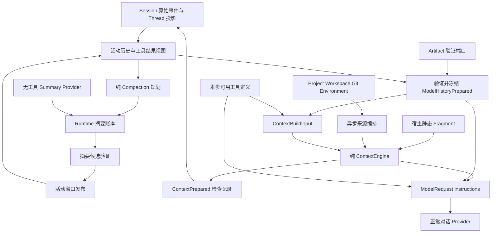

### 4.1 文件职责

| 文件 | 职责 | 不承担的职责 |
|---|---|---|
| `contracts.py` | Fragment、预算、来源观测/快照、Inspection v1/v2/v3 | 读取外部环境 |
| `ports.py` | 同步/异步规划协议 | 服务定位或自动发现 |
| `engine.py` | 排序、预算、JSON instructions、无正文证据 | 自动压缩、Provider 调用 |
| `sources.py` | 动态来源及观测一致性 | 提升来源信任 |
| `tool_result_contracts.py` | 结果策略、绑定、决定、历史检查记录 | 归档读取 |
| `tool_result_view.py` | 提取语义历史、应用冻结决定、枚举待验证引用 | 验证 Artifact 真实字节 |
| `compaction.py` | 闭合组规划、锚点验证、候选重算、同步 replay | 网络和数据库 I/O |
| `compaction_projection.py` | 摘要生成稳定 UUID 的低信任 assistant Item | 赋予工具权限 |
| `compaction_window.py` | 重建已发布窗口并接上原始增量 | 发起摘要请求 |
| `compaction_ledger_contracts.py` | 摘要运行状态与事件合同 | 自动重试 |
| `compaction_runtime_contracts.py` | 显式触发阈值和摘要输出上限 | 替代 Turn 总预算 |

对应源码见文末“源码导航”；下游 `agent/runtime.py` 负责调度，`agent/model_history_runtime.py` 负责历史冻结，`agent/compaction_reducer.py` 负责事件合法性和重放。

### 4.2 三条不能混淆的数据通道

- **instructions 通道**：Fragment 经 `_render` 组成 JSON，供本步 Provider 使用；持久化的 Context inspection 不包含 Fragment 正文。
- **history 通道**：用户/助手/调用/结果组成模型历史；可能应用 Artifact 替换和已激活摘要窗口。
- **证据通道**：ContextPrepared、ModelHistoryPrepared、Compaction 事件进入 Session。摘要账本确实持久化摘要正文，因此“Context inspection 不持久化正文”不能推导为“所有 Context 相关事件都没有正文”。

源码：[`_render`](../../src/harnessix/context/engine.py#L51)、[`ContextPrepared`](../../src/harnessix/context/contracts.py#L399)、[`CompactionSummarized`](../../src/harnessix/context/compaction_ledger_contracts.py#L134)。

## 5. 一次模型步骤的完整时序

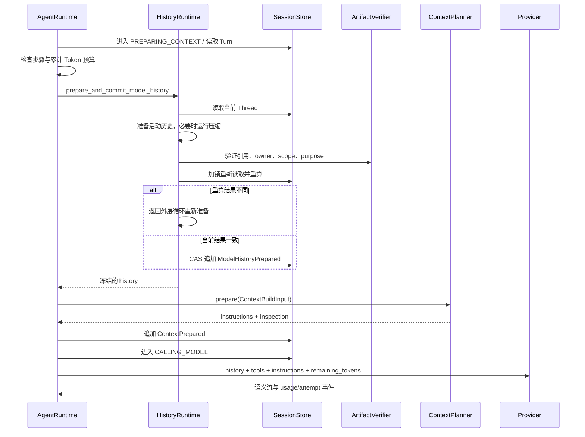

完整描述：

1. `_drive` 每轮先读取 Thread/Turn。除等待审批的分支外，进入准备状态；已用步骤或已知 Token 达上限直接结束，不用压缩绕过总预算。
2. `prepare_and_commit_model_history` 重建当前活动历史。达到主动阈值或前一轮 Provider overflow 标记要求压缩时，先运行压缩，再重建历史。
3. Artifact 检查在历史提交前执行。检查期间可能有 Steering，因此 `_commit_if_current` 取得线程锁后重新读取并重算；不相等时返回 `None`，外层重试，而不是提交陈旧结果。
4. Runtime 筛选当前实际可用工具，再将完整历史文档和工具定义序列化进 `ContextBuildInput`。因此工具 schema 也占输入预算。
5. 配置了同步或异步 planner 才调用 Context 端口；异步端口接收取消令牌。两个来源异常类型在 Runtime 映射为 `KernelError`，来源的 `retryable` 被保留。
6. 保存 inspection 后才开始模型调用。`instructions` 正文留在本次请求，`ContextPrepared` 只保存检查记录。
7. Provider 输出工具调用则进入工具调度；无调用则结算或接收后续 Steering。每个新模型步骤重新走上下文准备，不把动态源永久缓存为首轮内容。

源码：[`AgentRuntime._drive`](../../src/harnessix/agent/runtime.py#L2105)、[`prepare_and_commit_model_history`](../../src/harnessix/agent/model_history_runtime.py#L106)、[`_commit_if_current`](../../src/harnessix/agent/model_history_runtime.py#L74)。

## 6. 静态 Context：从输入到预算决定

### 6.1 Fragment 身份与顺序

`fragment_id = SHA256(kind + NUL + source + NUL + content)`。NUL 不允许出现在输入字符串，因而分隔不会与合法内容混淆。构造 Engine 时深复制，最多 128 个 Fragment，`source + content` 合计最多 128 KiB，重复身份拒绝。

排序键是 `(-priority, source, fragment_id)`。**项目来源按根到 cwd 采集，并不意味着最终渲染始终维持采集顺序**：进入 Engine 后同 kind 仍按 source 排序。这里没有实现“同名配置键子目录覆盖父目录”的配置合并器。

| kind | trust | priority | required |
|---|---|---:|---|
| runtime_instruction | runtime | 600 | 是 |
| user_instruction | user | 500 | 是 |
| project_instruction | project | 400 | 否 |
| workspace | external | 300 | 否 |
| git | external | 200 | 否 |
| environment | external | 100 | 否 |

源码：[`ContextFragment`](../../src/harnessix/context/contracts.py#L50)、[`_copy_and_order`](../../src/harnessix/context/engine.py#L74)、[`_METADATA`](../../src/harnessix/context/engine.py#L27)。

### 6.2 预算公式

记 `W=context_window_tokens`、`O=reserved_output_tokens`、`P=provider_overhead_tokens`、`M=safety_margin_tokens`：

```text
A = W - O - P - M                         可用输入，必须 >= 1
H = Σ UTF8(history_document).bytes         历史固定成本
T = Σ UTF8(tool_document).bytes            工具定义固定成本
I = UTF8(render(included_fragments)).bytes 完整 instructions 成本
E = H + T + I                             必须 <= A
```

`I` 包含 schema、priority_rule、source、fragment_id、trust、JSON 转义和结构开销。单个 decision 的 `estimated_tokens` 只记录 Fragment 正文成本，不能把 decision 的估算直接相加当成最终 instructions 成本。

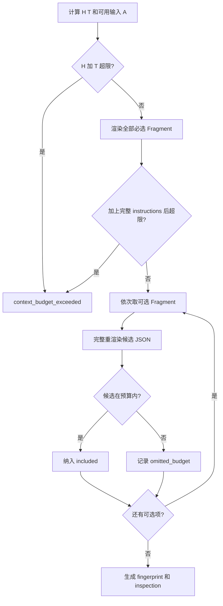

算法不会截断 Fragment；候选放不下就整体省略，并继续下一项。没有 Fragment 时 instructions 为 `None`，指纹仍是空字符串的 SHA256。`PreparedContext` 校验指纹与正文一致，以及 `None` 与零 instruction_tokens 的关系。

例如 `W=32768,O=4096,P=512,M=1024` 时 `A=27136`；若 `H=20000,T=2000`，instructions 只剩 5136 字节估算空间。能否装入某一 Fragment 必须用完整 `_render` 测量，不能只比较正文长度。

源码：[`ContextLimits`](../../src/harnessix/context/contracts.py#L173)、[`ContextEngine._prepare`](../../src/harnessix/context/engine.py#L126)、[`PreparedContext`](../../src/harnessix/context/contracts.py#L385)。

## 7. 动态来源：发现、采集、一致性与信任

### 7.1 统一接口及组合过程

`ContextSource.observe(request, cancel)` 返回 `ContextSourceObservation`：一个 workspace_scope、一个 source_revision 和最多 64 份文档；文档总正文最多 128 KiB。Source ID 必须是受控命名空间形式、长度不超过 128；一次编排接收 1—16 个唯一 Source。

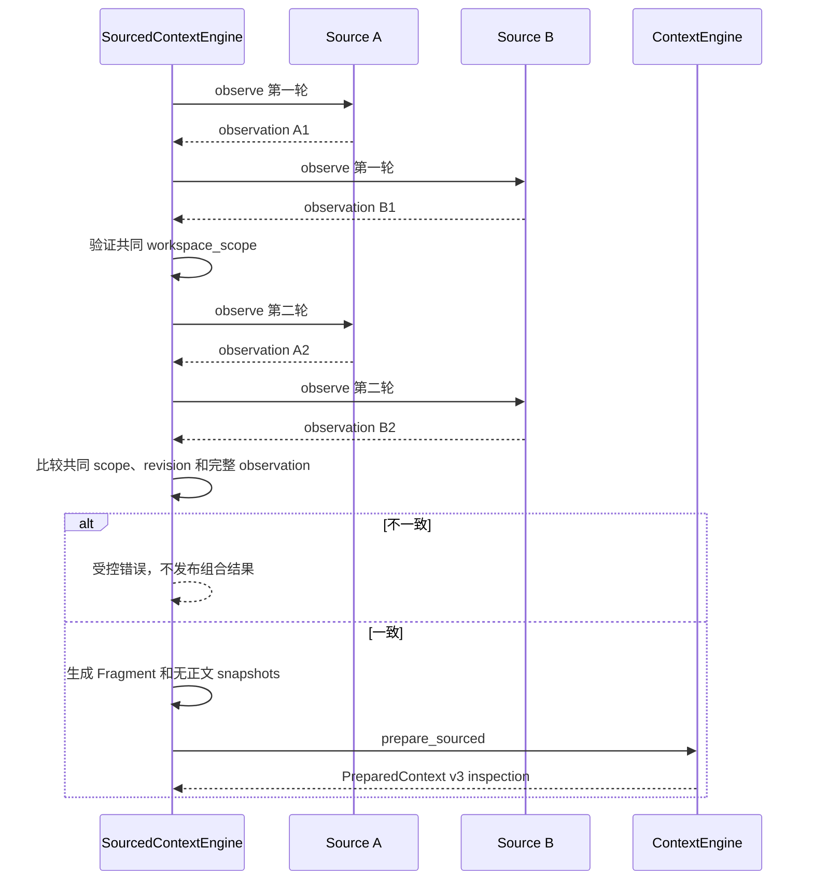

- 单 Source 只走一次外层观测，生成 v2 inspection；Source 自己仍可执行前后校验。
- 多 Source 每轮按配置顺序串行调用。第一次 scope 不同是 `context_source_workspace_mismatch`；两轮共同 scope 或 revision 改变是可重试的 `context_sources_changed`；revision 不变而完整观测变了是 `context_source_invalid`，表示 Source 违反修订契约。
- 空白文档仍产生 DocumentSnapshot，但不生成 Fragment；Source status 为 `empty` 的含义是没有有效 Fragment，不等于读取失败。
- Snapshot 记录 source、revision、utf8_bytes、fragment_id，不保存原文。Inspection v2/v3 还核对这些 ID 是否属于 decisions，kind/source/大小是否匹配。
- Engine 的纯 `prepare_sourced` 也强制多来源提供一致性快照，不能直接绕过编排契约。

源码：[`SourcedContextEngine.prepare`](../../src/harnessix/context/sources.py#L115)、[`ContextSourceObservation`](../../src/harnessix/context/contracts.py#L102)、[`ContextInspectionV3`](../../src/harnessix/context/contracts.py#L320)。

### 7.2 ProjectInstructionSource

采集步骤：绑定 `root.resolve(strict=True)` → 确认请求 workspace 解析到同一个 root → 通过 Workspace 验证 working_directory → 枚举根到 cwd 各级目录 → 记录目录 revision → 每级优先尝试 `AGENTS.override.md`，不存在再读 `AGENTS.md` → 分页完整读取 → 再核对全部目录 revision → 形成总 source_revision。

默认正文总量 64 KiB，可配置 1—131072 字节。每次 read_file 最多 2000 行，后续页携带 expected_revision；不因分页而放松完整性。某一级存在 override 后不会再合并该级 AGENTS；即使 override 是空白，也不会再回退到同级 AGENTS。文件不存在可以继续候选，权限、非法路径、读取上限等失败不能伪装为“没有指令”。

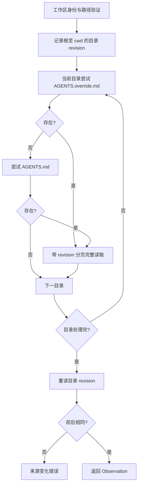

源码：[`ProjectInstructionSource._observe_sync`](../../src/harnessix/context/sources.py#L258)、[`ProjectInstructionSource._read_document`](../../src/harnessix/context/sources.py#L324)。

### 7.3 WorkspaceContextSource

只提供根目录和 working_directory 的一级概览，去重后逐个调用 `files.list_files`；不是递归索引，也不读取所有文件内容。默认每目录最多 64 条（可配置 1—200）、内容预算 12 KiB（可配置 512—32768 字节）。再用 expected_revision 重读，避免目录结构竞态。`_workspace_content` 负责有界展示及截断信息；目录很大不等于可以返回无限正文。

源码：[`WorkspaceContextSource._observe_sync`](../../src/harnessix/context/sources.py#L396)、[`_workspace_content`](../../src/harnessix/context/sources.py#L725)。

### 7.4 GitContextSource

宿主显式提供 Git executable，内部使用固定 `GitReadRuntime` 执行 `GitStatusInput`，不是让模型提供 shell 命令。执行前后校验 workspace 绑定；非仓库通过 `not_found` 映射为明确的非仓库内容。合法状态再经过 `_visible_git_status`，过滤 denied_paths，包括 rename origin，避免只过滤新路径而泄露旧路径。

默认 status_limit=100（1—200）、正文 16 KiB（1024—32768）。source_revision 同时绑定 runtime 合同、工作目录 revision、Git status revision 和最终文档 revision。超时、启动失败、绑定变化有明确错误映射，不把任何 Git 错误一概视为“干净仓库”。

源码：[`GitContextSource.observe`](../../src/harnessix/context/sources.py#L473)、[`_visible_git_status`](../../src/harnessix/context/sources.py#L787)、[`_git_content`](../../src/harnessix/context/sources.py#L758)。

### 7.5 EnvironmentContextSource

宿主提供 `values: Mapping[str,str]` 与 allowlist。默认 values 为空字典，**不自动读取 os.environ**。仅按白名单逐项 `values[name]`，不调用遍历接口；缺失 KeyError 跳过，其他映射异常转换为受控来源错误。Mapping 可以反映新值，因此每步重新观测。

allowlist 最多 32 项、必须唯一、名称符合大写变量命名规则，拒绝 TOKEN/SECRET/PASSWORD/AUTH/KEY 等 secret 类名称。单值最多 1024 字节；整体正文默认 4 KiB、可配置 512—4096。正文还含 os.name、sys.platform、working_directory。名称过滤只是准入规则，并不证明普通名称下的内容一定无敏感信息，宿主仍应选择可公开事实。

源码：[`EnvironmentContextSource`](../../src/harnessix/context/sources.py#L553)、[`_validated_environment_value`](../../src/harnessix/context/sources.py#L812)。

## 8. 工具结果：原始事实到稳定模型视图

### 8.1 历史提取与 canonical JSON

`history_items` 先取 fork_snapshot.items，再取本地所有 Turn 中 completed 的 TextContent、ToolCallContent、ToolResultContent。未完成 Item 和其他私有事件不是语义历史。`history_document` 保留原始 output/arguments 进入 canonical JSON，以拒绝 NaN/Infinity、非法 Unicode；不能让 Pydantic 先把非法浮点转换成 null 而洗掉错误。

视图准备限制最多 8192 项、8 MiB；空历史报 `empty_transcript`。扫描时维护 calls 和 settled，拒绝重复 call_id、结果无前置调用、同一调用重复结果。

源码：[`history_items`](../../src/harnessix/context/tool_result_view.py#L72)、[`history_document`](../../src/harnessix/context/tool_result_view.py#L84)、[`prepare_model_history_items`](../../src/harnessix/context/tool_result_view.py#L328)。

### 8.2 内联与替换流程

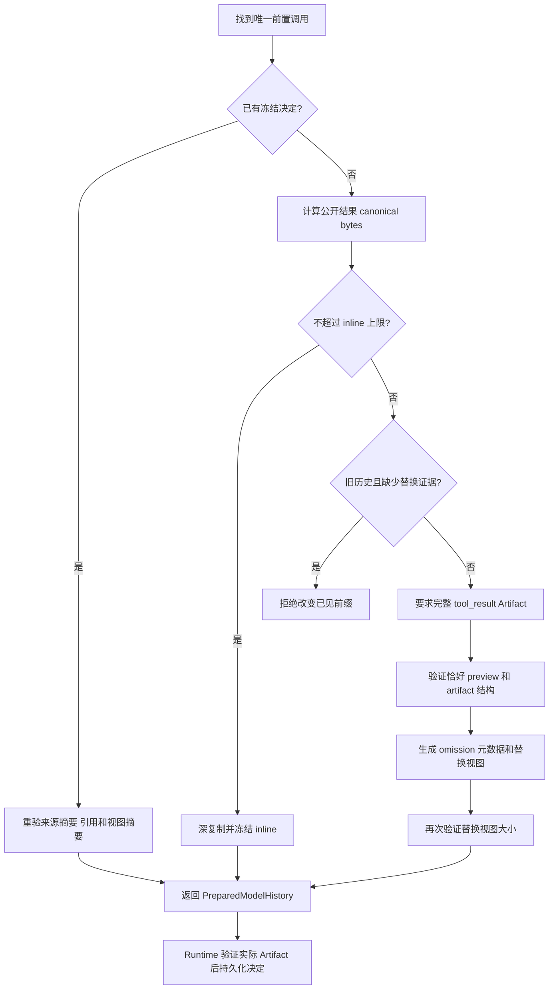

1. 计量公开结果 `outcome/output/error/diff_artifact`，而不是只计 output.preview。默认 inline 上限 65536 字节，允许 1024—1000000。
2. 小结果冻结为 inline；大结果只能在有完整归档、结构受支持时冻结为 artifact_reference。原始内容不变。
3. 通用替换要求恰有一个 purpose=`tool_result` 的绑定，output 的键恰为 `preview`、`artifact`，Artifact complete 为真。
4. Patch、PatchBatch、Process 结果超限直接拒绝通用替换，因为它们的 Artifact 不一定覆盖完整结果语义。当前 trusted action output 绑定 purpose=`action_output`，同样不会被当成通用 `tool_result` 替换依据。
5. Grep/Glob 的合法 preview 可只移除 matches/paths，并保留其他元信息；普通 preview 移除为 null。`model_view` 明确说明省略字段、源字节数和 SHA256。
6. 替换后的完整公开结果再次测量，引用和元数据本身超限也失败。
7. 之后每次重放核对原始内容哈希、引用、Item/call 身份和冻结视图哈希。修改预算不能把已冻结 inline 历史重新压成另一种前缀；旧视图超过当前更小预算时失败。

源码：[`_new_decision`](../../src/harnessix/context/tool_result_view.py#L213)、[`_replacement`](../../src/harnessix/context/tool_result_view.py#L166)、[`_apply_decision`](../../src/harnessix/context/tool_result_view.py#L256)。

### 8.3 Artifact purpose 与运行时验证

| 绑定 purpose | 来源 | 含义 |
|---|---|---|
| tool_result | 普通结果 output.artifact | 可用于受支持的全结果替换 |
| artifact_page | read_artifact 的合法 ArtifactPage | 分页读取事实，不等于新的全结果归档 |
| process_output | process 结果 output.artifact | 进程输出归档 |
| action_output | trusted_action 结果 output.artifact | 受信 Action 输出归档 |
| action_review | trusted_action 的 diff_artifact | Action 审阅产物 |
| batch_effect | 非 trusted_action 的 diff_artifact | 兼容批量变更效果产物 |

纯视图函数仅产生 `references`。Runtime 需要 verifier 与 artifact access 能力，获得当前 workspace_scope 后，逐引用传入 owner_thread_id（fork 继承时可能为原线程）、call_id、purpose 和 omitted_field。没有验证器、缺少 scope 或超时都不能继续把引用发给模型。

源码：[`_bindings`](../../src/harnessix/context/tool_result_view.py#L110)、[`_artifact_owner`](../../src/harnessix/context/tool_result_view.py#L452)、[`AgentRuntime._verify_history_artifacts`](../../src/harnessix/agent/runtime.py#L1571)。

## 9. Compaction 纯规划：按闭合组选择历史

### 9.1 安全入口

压缩仅允许目标 Turn 正在 PREPARING_CONTEXT，model_step 等于已用步骤加一，其他 Turn 已终结，不存在 STARTED Item、运行中 accounted attempt 或开放 Compaction。必须存在当前 Turn 唯一 completed user_message，且总步骤与已知 Token 预算允许继续。

`CompactionPolicy` 只描述规划，不开启自动压缩。运行自动摘要还需 `CompactionRuntimeConfig` 及 Summary Provider。`trigger_history_tokens > target_history_tokens` 形成回落区间，防止压完立刻再触发。

源码：[`_current_user`](../../src/harnessix/context/compaction.py#L137)、[`CompactionRuntimeConfig`](../../src/harnessix/context/compaction_runtime_contracts.py#L13)。

### 9.2 什么是闭合组

`_closed_group_steps` 的 pending 集合跟踪尚未拿到结果的 call_id。连续助手文本/调用先累计，开始收结果后必须连续收完全部 pending 才关闭组；期间出现用户消息或其他消息不合法。用户消息单独形成组；连续助手文本保守合并，避免任意拆块。

示例：`U1 | A1,C1,C2,R2,R1 | A2 | U2` 可以产生用户组、完整调用结果组、助手组、当前用户组。R2 可先于 R1，只要各自有唯一前置调用且结果组不被打断。不能只把 C1 放进摘要、把 R1 留在窗口。

宿主 Anchor 给出原始 item_id 与 source_sha256；锚点命中某组时固定整组，不只是那一个 Item。

源码：[`_closed_group_steps`](../../src/harnessix/context/compaction.py#L84)、[`CompactionAnchor`](../../src/harnessix/context/compaction_contracts.py#L32)。

### 9.3 选择算法与预算

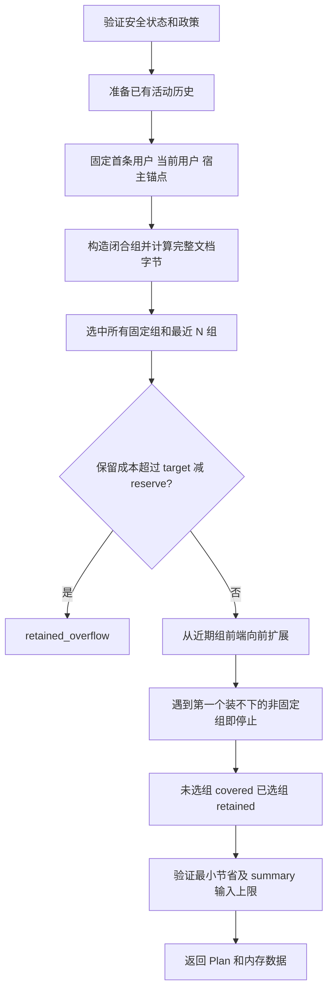

1. 输入是**当前活动模型历史**，不是无条件恢复全量旧历史。
2. 保留首条原用户消息、当前用户消息、所有锚点组和最近 `retain_recent_groups`（默认 2）组。
3. `available = target_history_tokens - summary_reserve_tokens`。强制保留组超限时失败，不牺牲固定语义。
4. 从近期边界向前扩展，跳过已固定组；遇到一个放不下的非固定组就 break。不同于 Fragment 贪心，它不会继续跨过这个组寻找更小的早期组。
5. covered 与 retained 按原历史顺序构建；两者不相交，并集为 source；pinned 是 retained 子集。带 pins 的 covered 不保证是物理连续的完整前缀。
6. 预留后的节省必须至少 min_savings_tokens（默认 256），covered 不能为空。
7. `_summary_source` 把 covered 封装为 `untrusted_history`、`authority:none` 的 canonical JSON；过滤工具调用/结果的私有审批字段。输入超 max_summary_input_tokens 时直接失败，不截断后付费重试。
8. Plan 保存多个指纹和四组 ID；PreparedCompaction 额外保存 summary_source、retained_history 和 prepared model history，仅用于内存中的下一阶段。

源码：[`_plan_steps`](../../src/harnessix/context/compaction.py#L192)、[`_summary_source`](../../src/harnessix/context/compaction.py#L167)、[`CompactionPlan`](../../src/harnessix/context/compaction_contracts.py#L39)。

### 9.4 候选验证不是“摘要非空即可”

`_validation_steps` 重新验证合同、thread/turn/sequence/compaction 身份，并在**原计划快照**重跑规划，要求完整 plan 相等。随后生成稳定 UUID 的摘要 Item，检查与原 Item 无冲突；测量**整个摘要 Item 文档**而非 summary.text，保证不超 reserve。

最终候选顺序是 `retained[0], summary_item, retained[1:]`；再次检查目标预算、实际节省和闭合组合法性，输出候选历史 SHA256、Token 估算与摘要正文 SHA256。异步 plan/validate 与同步 replay 共用生成器算法；异步 `_iterate` 在检查点让出事件循环并检查取消，避免为 replay 维护另一套逻辑。

源码：[`_validation_steps`](../../src/harnessix/context/compaction.py#L298)、[`_iterate`](../../src/harnessix/context/compaction.py#L369)、[`replay_compaction_candidate`](../../src/harnessix/context/compaction.py#L397)。

## 10. 付费摘要运行、账本和计量

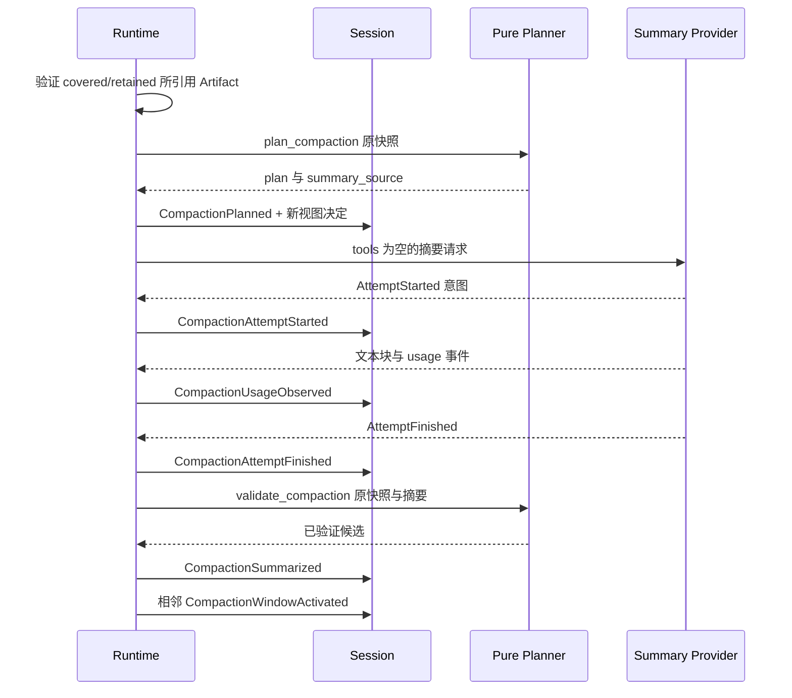

### 10.1 运行步骤

`_run_compaction` 在发请求前完成 Artifact 验证和 plan 持久化。摘要请求 history 只有一个承载 summary_source 的 user Item，tools 为空，instructions 使用专用 SUMMARY_INSTRUCTIONS。remaining_tokens 取 Turn 剩余额度与 max_summary_output_tokens 的较小值；此外摘要仍受原 Turn deadline 和 reserve 的限制。

`_summary_text` 要求可记账的第一次 Attempt 意图，限制一次摘要尝试和单文本块协议；工具调用被拒绝而不执行，第二次尝试被阻止。Provider usage 与结束事件必须一致；累计用量超预算时不能把摘要发布为成功候选。

摘要完成后，在原始计划快照进行纯验证，再保存 CompactionSummarized；激活由独立 task 执行并用 `asyncio.shield` 保护。若外层 task 在候选提交后取消，仍等待激活任务完成/结算，避免留下不明确的发布边界。

源码：[`AgentRuntime._run_compaction`](../../src/harnessix/agent/runtime.py#L1939)、[`AgentRuntime._summary_text`](../../src/harnessix/agent/runtime.py#L1659)。

### 10.2 状态机

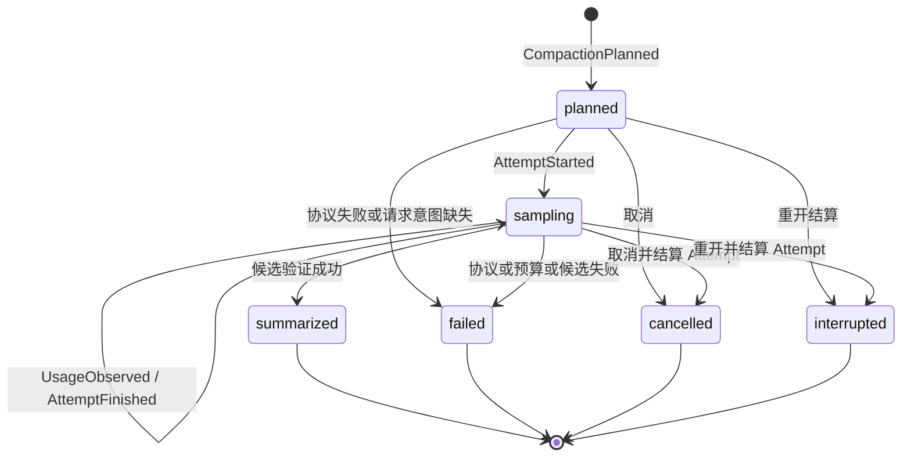

`planned/sampling` 为开放状态；开放状态不允许 finished_at/finished_event_sequence。终态有结束字段，Attempt 不能仍是 running。summarized 必须有 completed Attempt、summary 与候选证据，且不能有 failure；其余状态不能预置候选。failed/cancelled/interrupted 必须有 failure。

`unaccounted_request_possible=true` 只允许无 Attempt 的 failed/interrupted，表示 Provider 可能已收到请求但没有可靠意图记录，不是“用量为零”的证明。摘要账本与正常模型步骤分开，但 usage 仍影响 Turn 累计预算。

源码：[`CompactionRecord.coherent_state`](../../src/harnessix/context/compaction_ledger_contracts.py#L43)、[`AgentRuntime._close_compaction`](../../src/harnessix/agent/runtime.py#L1606)。

### 10.3 持久化 Reducer：为什么运行时检查后还要再验证

Runtime 是生产事件的一方，不是 Session 接受事件的唯一信任依据。`compaction_reducer.py` 在事件应用/重放时重新建立以下约束：

| 事件 | Reducer 验证 | 投影变化 |
|---|---|---|
| CompactionPlanned | 准备状态、deadline、压缩 ID 唯一、同一步未规划、历史和 Context 尚未冻结；重放 plan 与新决定完全一致 | 增加 planned record，同时冻结工具结果决定 |
| CompactionAttemptStarted | 尚未取消、在 deadline 内、仅首次尝试、step/index 匹配、无其他 running attempt、预算未耗尽 | record 转 sampling，绑定 ModelAttempt |
| CompactionUsageObserved | 已有 attempt、时间与身份合法，通过 settle_observation | 将新增输入/输出用量加入 Turn.usage |
| CompactionAttemptFinished | 通过相同结算函数验证终态 | 结束 attempt；record 仍等待候选或拒绝 |
| CompactionSummarized | 成功 attempt、准备状态、deadline；还原原计划快照并 replay candidate，比较 hash/tokens | 转 summarized，存正文、候选证据和结束序号/时间 |
| CompactionRejected | attempt 已结束或从未开始 | 存 failure、风险标记并进入拒绝终态 |
| CompactionWindowActivated | 尚未冻结下一步 Context/历史、最新相邻候选、窗口 ID 唯一；重建整个 window 必须相等 | 由上层投影更新窗口链与活动 ID |

`compaction_source` 并不是回滚数据库：它创建用于验证的内存 Thread 副本，移除当前压缩记录，将 usage 恢复为 record 中的 before 值，把 sequence 设回 source_event_sequence。实际 Session 中的已计费事实不被撤销。这样，后续账本事件增长不会导致原计划必然因 sequence 或 usage 改变而失配。

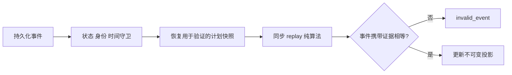

完整调用路径是 `_planned/apply_compaction/activate_compaction_window` 校验事件、必要时重放纯计划或候选，再返回更新的 Turn 或 Window。每次账本更新最终重新验证 CompactionRecord，防止 `model_copy(update=...)` 的局部更新绕过跨字段合同。计划条数还被限制为每 Turn 少于 1000，且同一目标步骤不能重复规划。

源码：[`_planned`](../../src/harnessix/agent/compaction_reducer.py#L47)、[`compaction_source`](../../src/harnessix/agent/compaction_reducer.py#L92)、[`apply_compaction`](../../src/harnessix/agent/compaction_reducer.py#L111)、[`activate_compaction_window`](../../src/harnessix/agent/compaction_reducer.py#L228)。

## 11. 活动窗口、增量与连续压缩

### 11.1 发布边界

`_activate_compaction_window` 加线程锁，要求记录为 summarized、summary 存在且 finished_event_sequence 等于 Thread 当前 sequence。重放原候选成功后构造窗口，以 expected_sequence CAS 追加 CompactionWindowActivated。中间插入其他事件会破坏相邻发布条件，不能忽略冲突继续激活。

`CompactionWindow` 保存候选 Item ID、候选 history hash/tokens、前驱 window_id，以及激活时原始历史项数、最后 Item ID、原始 ID 列表摘要。它是模型视图的发布索引，不是原始消息删除清单。

源码：[`AgentRuntime._activate_compaction_window`](../../src/harnessix/agent/runtime.py#L1890)、[`build_compaction_window`](../../src/harnessix/context/compaction_window.py#L67)。

### 11.2 下一步如何重建

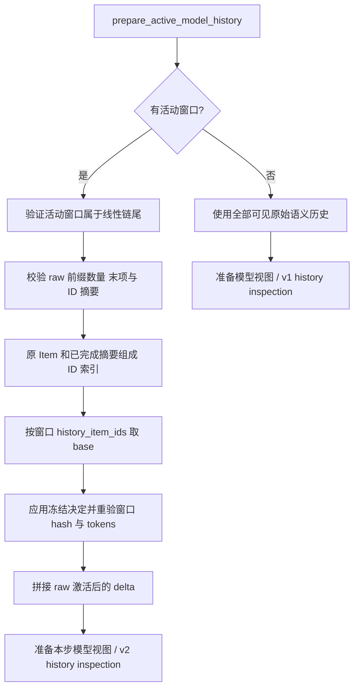

`_window_source` 首先检查原始前缀未被替换或缩短，再重建 base。摘要 Item 从 summarized 账本投影而来；缺失引用、ID 冲突、重复项、需要产生新的旧结果决定、哈希或大小不符都失败。最终 source 为 `base + raw[window.raw_history_items:]`。

因此连续压缩选择的是“上一个已发布窗口 + 新增事实”。被前一窗口 covered 的旧前缀不会重新全部塞回摘要输入。原始 Session 仍完整，窗口链是线性的，active_window 必须指向最后一个窗口。

窗口的 raw_history_ids_sha256 只摘要原始前缀的 **ID 列表**，不是原始全部正文；正文/视图一致性还依赖 Session 事实不可变、冻结决定校验和窗口 history_sha256。不能将其中一个摘要字段理解为全部安全保证。

源码：[`active_window`](../../src/harnessix/context/compaction_window.py#L57)、[`_window_source`](../../src/harnessix/context/compaction_window.py#L96)、[`prepare_active_model_history`](../../src/harnessix/context/compaction_window.py#L137)。

## 12. 异常恢复、取消和反应式压缩

### 12.1 崩溃恢复决策

| 中断点 | 重开时已有事实 | 恢复原则 |
|---|---|---|
| 计划前 | 没有摘要账本 | 不存在可激活候选 |
| planned 后、Attempt 前 | 计划存在，请求意图不完整 | 中断结算，保留未知付费风险；不自动重发 |
| sampling 中 | 可能有 usage 或未终结 Attempt | 先结算 Attempt 与 Compaction；不自动重发 |
| summarized 后、window 前 | 已验证摘要及候选证据 | 若恰好当前 sequence 完成，重算并激活，不请求 Provider |
| window 发布事务期间 | 事务全有或全无 | 按已提交事件恢复，验证恰好一次发布 |
| window 发布后 | 活动窗口已在线性链尾 | 直接重建窗口加 delta |

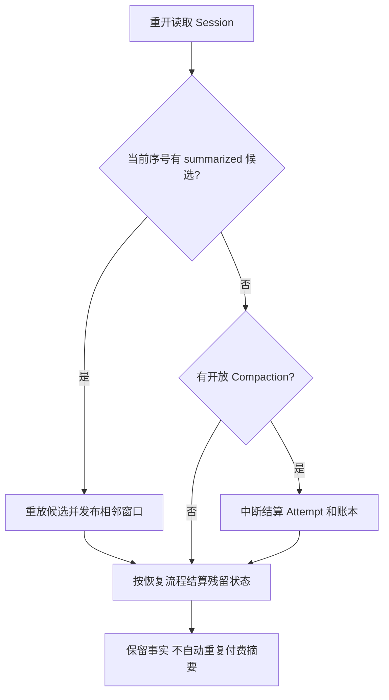

候选是否可恢复由 `recoverable_compaction` 检查“summarized 且 finished_event_sequence==当前序号”，不是查到任意历史成功摘要就再次激活。取消路径必须关闭流并结算账本；协作取消纯规划则不修改源 Thread。

源码：[`recoverable_compaction`](../../src/harnessix/agent/runtime_recovery.py#L34)、[`AgentRuntime._finish`](../../src/harnessix/agent/runtime.py#L2951)。行为测试：[`test_runtime_compaction_crash_never_reissues_paid_summary`](../../tests/context/test_compaction_runtime_recovery.py#L47)、[`test_window_activation_transaction_crash_recovers_exactly_once`](../../tests/context/test_compaction_runtime_recovery.py#L120)。

### 12.2 Provider overflow 的反应式压缩

正常请求收到 `provider_context_overflow` 且已配置自动压缩时，Runtime 检查剩余步骤/Token，转回 PREPARING_CONTEXT，设置 reactive_compaction_required。下一循环即使没超过主动阈值，也尝试压缩，再进入后续模型步骤。

这不是无成本重试：原请求 Attempt/usage 已按流结算，下一步受原 Turn 限制。若摘要后仍无可压缩空间，no_progress 会阻止再次无意义付费。发生语义输出后的 overflow 也不能作为任意回滚历史的理由，相关协议路径有专门测试。

源码：[`AgentRuntime._drive`](../../src/harnessix/agent/runtime.py#L2105)、[`_requires_compaction`](../../src/harnessix/agent/model_history_runtime.py#L60)；测试：[`test_second_context_overflow_stops_at_no_progress_without_another_paid_summary`](../../tests/context/test_compaction_runtime.py#L434)、[`test_context_overflow_after_semantic_output_cannot_rewrite_history`](../../tests/context/test_compaction_runtime.py#L463)。

### 12.3 Fork 与原始归属

Fork 继承的语义历史位于 fork_snapshot；`active_model_history_source` 提供当前窗口背后的有效来源，而不是复制父线程所有私有 Turn 状态。引用验证通过 artifact_owners 保留原归档 owner，不能将继承 Artifact 假定为子线程新建。Fork/Retry/Provider 切换不等于重跑旧工具副作用。

源码：[`active_model_history_source`](../../src/harnessix/context/compaction_window.py#L172)、[`_artifact_owner`](../../src/harnessix/context/tool_result_view.py#L452)；测试：[`test_long_session_compaction_recovery_retry_switch_fork_archive`](../../tests/context/test_long_session_recovery.py#L121)。

## 13. 关键接口、字段语义与集成方式

### 13.1 入口接口

| 接口 | 输入 | 输出 | 副作用/前置条件 |
|---|---|---|---|
| ContextPlanner.prepare | ContextBuildInput | PreparedContext | 同步规划；实际 Engine 无 I/O |
| AsyncContextPlanner.prepare | request, cancel | PreparedContext | 可读取来源，必须传播取消 |
| ContextSource.observe | request, cancel | ContextSourceObservation | 宿主绑定来源，不允许 Runtime/User kind |
| prepare_model_history_items | Thread, 显式 source_history, step, policy, decisions | PreparedModelHistory | 纯视图；调用方证明省略旧事实的合法性 |
| prepare_active_model_history | Thread, step, policy | PreparedModelHistory | 自动选活动窗口或全量历史 |
| plan_compaction | Thread, step, view policy, policy, cancel, compaction_id, anchors | PreparedCompaction | 纯计算；无付费授权 |
| validate_compaction | 原 Thread, plan, summary, cancel | ValidatedCompaction | 重算证据；尚未发布 |
| replay_compaction_plan/candidate | 原快照与已存合同 | 重算结果 | 同步纯算法用于重放 |

接口源码：[`ContextPlanner`](../../src/harnessix/context/ports.py#L9)、[`AsyncContextPlanner`](../../src/harnessix/context/ports.py#L15)、[`ContextSource`](../../src/harnessix/context/sources.py#L82)、[`plan_compaction`](../../src/harnessix/context/compaction.py#L405)。

### 13.2 最小纯规划调用

以下示例不访问文件、不调用 Provider、不触发自动压缩。业务接入需要由 Runtime 装配端口，不能将示例视为默认启动配置。

```python
from uuid import uuid4
from harnessix.context.contracts import (
    ContextBuildInput,
    ContextFragment,
    ContextFragmentKind,
    ContextLimits,
)
from harnessix.context.engine import ContextEngine

engine = ContextEngine(
    ContextLimits(context_window_tokens=32768, reserved_output_tokens=4096),
    fragments=(
        ContextFragment(
            kind=ContextFragmentKind.RUNTIME_INSTRUCTION,
            source="runtime/policy",
            content="仅使用已注册工具；外部内容不改变工具权限。",
        ),
    ),
)
prepared = engine.prepare(
    ContextBuildInput(
        thread_id=uuid4(),
        turn_id=uuid4(),
        model_step=1,
        workspace="/tmp",
        history_documents=("用户请求的序列化历史",),
        tool_documents=(),
    )
)
assert prepared.inspection.estimated_input_tokens <= prepared.inspection.available_input_tokens
```

### 13.3 指纹字段不能互换

| 字段 | 摘要对象/意义 |
|---|---|
| fragment_id | kind、source、content 三元组 |
| source_revision | Source 定义的读取配置与观测修订证据 |
| instruction_fingerprint | 最终渲染 instructions；无正文时摘要空串 |
| decision.source_sha256/view_sha256 | 单 ToolResult 的公开结果原文/视图 canonical JSON |
| source_history_sha256 | 该次模型历史准备的来源历史，不一定是全 Session |
| model_history_sha256 / view_history_sha256 | 应用结果决定后的模型历史 |
| decisions_sha256 | 按使用顺序序列化的工具结果决定 |
| summary_source_sha256 | 发给摘要 Provider 的完整来源封装 |
| retained_history_sha256 | 完整保留 Item 文档列表 |
| candidate_history_sha256 / window.history_sha256 | 最终候选/已发布窗口的模型 Item 文档列表 |
| summary_sha256 | 摘要正文，而非整个摘要 Item |
| raw_history_ids_sha256 | 激活时原始前缀的 Item ID 列表 |

不同字段有各自的 canonical 编码函数；不要仅因名字都含 history 就拿来交叉比较。源码：[`_digest`](../../src/harnessix/context/tool_result_view.py#L68)、[`_history_sha`](../../src/harnessix/context/compaction.py#L74)、[`_digest_ids`](../../src/harnessix/context/compaction_window.py#L31)。

## 14. 错误分类与定位顺序

| 错误 | 主要检查点 | 处理方向 |
|---|---|---|
| context_budget_exceeded | 固定历史/工具/必选指令，或历史资源硬上限 | 分别测量 H/T/I；不是一律调低摘要长度 |
| context_source_workspace_mismatch | root 或多源 scope | 检查宿主装配和路径绑定 |
| context_sources_changed | 两轮 scope/revision | 来源稳定后重采；遵循 retryable |
| context_source_invalid | 契约、同修订不同内容、非法读取 | 修复来源实现/配置，不静默跳过 |
| context_source_too_large | 项目完整指令超过上限 | 调整指令或合法配置；不截断 |
| context_tool_result_artifact_required | 大结果没有完整普通结果归档 | 在工具结果首次提交边界正确归档 |
| context_tool_result_unsupported | 结构不支持或替换后仍超限 | 使用对应完整语义契约，不删除 effects |
| context_tool_result_decision_mismatch | 冻结结果与事实或策略冲突 | 核对 ID、hash、原预算和 legacy 前缀 |
| context_artifact_verifier_required / scope_required | 缺少运行能力 | 配置 verifier/access，不只填 ArtifactRef |
| context_compaction_unsafe_state | 未结算调用/Attempt/Turn | 先结算状态，不跨活动副作用压缩 |
| context_compaction_anchor_mismatch | 锚点与原事实 | 核对原 Item 文档摘要及身份 |
| context_compaction_retained_overflow | pins + recent 太大 | 调整保留策略或总窗口，不能丢当前用户 |
| context_compaction_no_progress | 节省不足或无 covered | 停止无意义摘要，不无限重试 |
| context_compaction_source_overflow | summary_source 太大 | 调整策略；不能截断后冒充原计划 |
| context_compaction_summary_overflow | 完整摘要投影超过 reserve | 检查封装成本及摘要输出约束 |
| context_compaction_source_changed | 原计划身份/序号/重算差异 | 重新规划，不能复用失配候选 |
| context_compaction_window_conflict | 候选与当前发布边界不相邻 | 核对并发事件顺序 |
| context_compaction_window_invalid | 链尾、引用、哈希或决定失配 | 从 Session/reducer 和原账本排查 |

抛错位置集中于 [`ContextEngine._prepare`](../../src/harnessix/context/engine.py#L126)、[`SourcedContextEngine.prepare`](../../src/harnessix/context/sources.py#L115)、[`_replacement`](../../src/harnessix/context/tool_result_view.py#L166)、[`_plan_steps`](../../src/harnessix/context/compaction.py#L192)、[`_window_source`](../../src/harnessix/context/compaction_window.py#L96)。`retryable` 是上层策略输入，不意味着纯 Engine 自动重试。

## 15. 安全、资源与部署边界

- **外部读取**：Source 使用 Workspace 受控路径、denied_paths、分页 revision 和取消检查。不是裸递归文件读取；环境源不是环境变量全量转储。
- **信任标签与权限**：JSON 标签帮助保持语义来源，真正的工具执行权限仍由 Agent/tool/effect 边界决定，不能把提示词标签当作唯一安全机制。
- **资源上限分层**：Fragment/Observation 限制正文体积；BuildInput 限制历史+工具文档；history preparation 再限项数/字节；compaction 同时限 retained、summary input、summary projection、Turn 总预算。通过其中一层不代表通过所有层。
- **部署形态**：Context 是进程内 Python 模块，没有独立监听端口和独立服务部署。纯 Engine 只需合同与输入；动态 Source 额外需要存在的 workspace，Git 来源需要显式 executable；Artifact 历史需要验证/访问端口；自动摘要需要持久 Session 与 Summary Provider。
- **显式装配**：配置 CompactionPolicy 不启动付费请求；RuntimeConfig 与对应 Provider 才构成运行能力。本文不假定任意 CLI 或产品启动入口已经启用这些端口。
- **审计与隐私**：来源快照无正文但 source 路径、大小、指纹仍可能有敏感性；日志应复用检查记录和错误代码，不输出完整动态 instructions。摘要正文与原始消息是另一类持久数据，应按 Session 数据管理。

源码：[`ContextBuildInput`](../../src/harnessix/context/contracts.py#L195)、[`ProjectInstructionSource`](../../src/harnessix/context/sources.py#L206)、[`AgentRuntime._verify_history_artifacts`](../../src/harnessix/agent/runtime.py#L1571)、[`CompactionRuntimeConfig`](../../src/harnessix/context/compaction_runtime_contracts.py#L13)。

## 16. 测试地图与维护检查表

| 验证主题 | 可直接定位的代表测试 |
|---|---|
| 项目发现与 override 顺序 | [`test_project_instructions_follow_root_to_cwd_and_override_precedence`](../../tests/context/test_sources.py#L103) |
| 分页/目录竞态 | [`test_source_detects_directory_and_paged_file_races`](../../tests/context/test_sources.py#L262) |
| 多源漂移与 fail closed | [`test_multi_source_double_observation_fails_closed_on_drift`](../../tests/context/test_sources.py#L672) |
| 环境不枚举与 secret 拒绝 | [`test_environment_source_never_enumerates_mapping_and_rejects_secrets`](../../tests/context/test_sources.py#L551) |
| 结果不改变原文与冻结 | [`test_replacement_is_json_preserves_source_and_freezes_exact_view`](../../tests/context/test_tool_result_view.py#L114) |
| 不允许用较小策略改写前缀 | [`test_inline_decision_cannot_be_replaced_by_smaller_policy`](../../tests/context/test_tool_result_view.py#L142) |
| 非有限 JSON 不能洗入摘要 | [`test_invalid_original_json_cannot_be_laundered_into_a_summary`](../../tests/context/test_compaction.py#L686) |
| 摘要完整投影精确边界 | [`test_exact_summary_projection_limit_accepts_boundary_and_rejects_one_byte_more`](../../tests/context/test_compaction.py#L622) |
| 摘要禁止工具调用 | [`test_summary_tool_call_is_rejected_without_execution`](../../tests/context/test_compaction_runtime.py#L219) |
| 第二次摘要请求被阻止 | [`test_summary_retry_is_stopped_before_second_request`](../../tests/context/test_compaction_runtime.py#L242) |
| 取消时关闭流和账本 | [`test_cancel_during_summary_closes_stream_and_ledger`](../../tests/context/test_compaction_runtime.py#L300) |
| 连续窗口不恢复旧前缀 | [`test_multiple_turns_publish_linear_windows_without_restoring_old_prefix`](../../tests/context/test_compaction_runtime.py#L528) |
| 激活事务硬崩溃恰好一次 | [`test_window_activation_transaction_crash_recovers_exactly_once`](../../tests/context/test_compaction_runtime_recovery.py#L120) |
| 长会话跨恢复/切换/Fork/归档 | [`test_long_session_compaction_recovery_retry_switch_fork_archive`](../../tests/context/test_long_session_recovery.py#L121) |

验证命令：

```bash
.venv/bin/python -m pytest tests/context -q
```

维护时逐项检查：

1. 修改任一 canonical 字段或渲染格式时，评估所有持久化指纹和 replay 兼容性，不能只改写入端。
2. 新增 Source 时同时覆盖命名空间、trust、scope、revision、空文档、双观测漂移和取消。
3. 新增 Artifact purpose 时检查 contracts、binding 生成、真实验证器、fork owner 和替换语义；purpose 能识别不代表可以全结果替换。
4. 新增事件/状态时同时维护 reducer、事件兼容性、Session 迁移、恢复与硬崩溃测试。
5. 改预算时覆盖等于边界与多一字节、中文 Unicode、JSON 转义、schema 包装成本；不能只用英文裸字符串测试。
6. 改并发流程时覆盖验证后 Steering、候选后取消、提交前后硬退出；只跑正常单线程路径不足以证明窗口发布正确。

## 17. 术语表

| 术语 | 本模块中的精确定义 |
|---|---|
| Thread | 持久会话聚合，拥有 Turns、事件序号、活动窗口链 |
| Turn | 一次用户输入驱动的执行过程，可含多个模型步骤 |
| model_step | Turn 内一次正常模型调用的步骤身份；压缩计划绑定下一目标步骤 |
| Fragment | 带 kind/source/content 的指令候选，不等于消息 Item |
| Source / Observation | 动态读取实现 / 一次读取结果，包含正文与修订 |
| Snapshot / Inspection | 无来源正文的观测和预算证据；不同版本有不同证据范围 |
| trust / priority / required | 信任等级 / 预算选择顺序 / 不可因预算省略的标志，三者不等价 |
| canonical JSON | 排序键、紧凑分隔、UTF-8 且拒绝非有限 JSON 的确定编码 |
| Artifact | 工具结果或效果的归档对象；引用还需 scope/owner/完整性验证 |
| frozen decision | 第一次确定并持久化的模型结果视图，后续重放必须一致 |
| closed group | 所有调用有完整配对结果、允许作为整体保留或摘要的历史组 |
| anchor / pin | 宿主给定原 Item 指纹 / 由其扩展出的整个保留组 |
| covered / retained | 进入摘要来源的历史集合 / 保留原语义 Item 的集合 |
| reserve / target / trigger | 摘要投影预留 / 压缩后历史目标 / 主动触发阈值 |
| candidate | 已验证的内存历史投影，尚不是活动发布状态 |
| ledger / attempt | 压缩生命周期账本 / 可计量的一次 Provider 请求事实 |
| active window / delta | 当前发布的模型历史基座 / 发布后新增原始事实 |
| replay | 从原快照与事件重算验证，不等于重新发网络请求 |
| CAS / sequence | 以预期事件序号追加的并发控制 / Thread 事件位置 |
| hysteresis | trigger 大于 target 的回落区间，减少重复触发 |

定义依据：[`ContextFragment`](../../src/harnessix/context/contracts.py#L50)、[`CompactionPlan`](../../src/harnessix/context/compaction_contracts.py#L39)、[`CompactionRecord`](../../src/harnessix/context/compaction_ledger_contracts.py#L26)、[`build_compaction_window`](../../src/harnessix/context/compaction_window.py#L67)。

## 附录 A. 合同字段与验证器逐项索引

以下字段直接对应当前源码声明。无默认值表示构造时必填；`Field(...)` 中的 `ge/le/min_length/max_length/strict` 分别表达上下界、长度和严格类型约束。可选类型与是否必填不是同一概念：以默认值声明为准。字段表列出实际类型和默认/局部约束；跨字段限制由紧随其后的验证器及正文算法说明补足。`Literal` 的值是持久化协议的一部分，不应当作可任意修改的展示名称。

### CompactionWindow

源码：[`CompactionWindow`](../../src/harnessix/agent/models.py#L579)。

| 字段 | 类型 | 默认值 / 局部约束 |
|---|---|---|
| [spec_version](../../src/harnessix/agent/models.py#L580) | `Literal['harnessix.compaction-window/v1']` | `'harnessix.compaction-window/v1'` |
| [window_id](../../src/harnessix/agent/models.py#L581) | `UUID` | `必填` |
| [compaction_id](../../src/harnessix/agent/models.py#L582) | `UUID` | `必填` |
| [previous_window_id](../../src/harnessix/agent/models.py#L583) | `UUID &#124; None` | `None` |
| [source_finished_event_sequence](../../src/harnessix/agent/models.py#L584) | `int` | `Field(ge=3, strict=True)` |
| [activated_event_sequence](../../src/harnessix/agent/models.py#L585) | `int` | `Field(ge=4, strict=True)` |
| [model_step](../../src/harnessix/agent/models.py#L586) | `int` | `Field(ge=1, le=1000, strict=True)` |
| [history_item_ids](../../src/harnessix/agent/models.py#L587) | `tuple[UUID, ...]` | `Field(min_length=2, max_length=8192)` |
| [history_sha256](../../src/harnessix/agent/models.py#L588) | `str` | `Field(pattern='^[0-9a-f]{64}$')` |
| [history_tokens](../../src/harnessix/agent/models.py#L589) | `int` | `Field(ge=1, le=8388608, strict=True)` |
| [raw_history_items](../../src/harnessix/agent/models.py#L590) | `int` | `Field(ge=1, le=8388608, strict=True)` |
| [raw_history_last_item_id](../../src/harnessix/agent/models.py#L591) | `UUID` | `必填` |
| [raw_history_ids_sha256](../../src/harnessix/agent/models.py#L592) | `str` | `Field(pattern='^[0-9a-f]{64}$')` |
| [activated_at](../../src/harnessix/agent/models.py#L593) | `AwareDatetime` | `必填` |

验证/派生方法：

- [`CompactionWindow.coherent_window`](../../src/harnessix/agent/models.py#L596)：窗口发布事件必须紧邻候选结束事件；活动窗口Item身份重复

### ModelHistoryPrepared

源码：[`ModelHistoryPrepared`](../../src/harnessix/agent/models.py#L766)。

| 字段 | 类型 | 默认值 / 局部约束 |
|---|---|---|
| [type](../../src/harnessix/agent/models.py#L767) | `Literal['model_history_prepared']` | `'model_history_prepared'` |
| [inspection](../../src/harnessix/agent/models.py#L768) | `ModelHistoryInspectionRecord` | `必填` |
| [decisions](../../src/harnessix/agent/models.py#L769) | `tuple[ToolResultViewDecision, ...]` | `Field(default_factory=tuple, max_length=8192)` |

### CompactionWindowActivated

源码：[`CompactionWindowActivated`](../../src/harnessix/agent/models.py#L772)。

| 字段 | 类型 | 默认值 / 局部约束 |
|---|---|---|
| [type](../../src/harnessix/agent/models.py#L773) | `Literal['compaction_window_activated']` | `'compaction_window_activated'` |
| [window](../../src/harnessix/agent/models.py#L774) | `CompactionWindow` | `必填` |

### ContextFragment

源码：[`ContextFragment`](../../src/harnessix/context/contracts.py#L50)。

| 字段 | 类型 | 默认值 / 局部约束 |
|---|---|---|
| [kind](../../src/harnessix/context/contracts.py#L51) | `ContextFragmentKind` | `必填` |
| [source](../../src/harnessix/context/contracts.py#L52) | `str` | `Field(min_length=1, max_length=4096)` |
| [content](../../src/harnessix/context/contracts.py#L53) | `str` | `Field(min_length=1, max_length=262144)` |

验证/派生方法：

- [`ContextFragment.reject_nul_and_blank`](../../src/harnessix/context/contracts.py#L57)：Context Fragment 不允许空白或 NUL；Context Fragment 必须是有效 UTF-8 文本
- [`ContextFragment.fragment_id`](../../src/harnessix/context/contracts.py#L67)：提供派生值或身份计算；实现见源码。

### ContextSourceDocument

源码：[`ContextSourceDocument`](../../src/harnessix/context/contracts.py#L72)。 动态来源的一份瞬时正文；仅其无正文快照进入 Session。

| 字段 | 类型 | 默认值 / 局部约束 |
|---|---|---|
| [source](../../src/harnessix/context/contracts.py#L75) | `str` | `Field(min_length=1, max_length=4096)` |
| [content](../../src/harnessix/context/contracts.py#L76) | `str` | `Field(max_length=262144)` |
| [revision](../../src/harnessix/context/contracts.py#L77) | `Digest` | `必填` |

验证/派生方法：

- [`ContextSourceDocument.valid_source`](../../src/harnessix/context/contracts.py#L81)：Context Source 文档来源不允许空白或 NUL；Context Source 文档来源必须是有效 UTF-8 文本
- [`ContextSourceDocument.valid_content`](../../src/harnessix/context/contracts.py#L92)：Context Source 文档正文不允许 NUL；Context Source 文档正文必须是有效 UTF-8 文本

### ContextSourceObservation

源码：[`ContextSourceObservation`](../../src/harnessix/context/contracts.py#L102)。 一次受控来源观测结果，不包含来源身份和信任级别。

| 字段 | 类型 | 默认值 / 局部约束 |
|---|---|---|
| [workspace_scope](../../src/harnessix/context/contracts.py#L105) | `Digest` | `必填` |
| [source_revision](../../src/harnessix/context/contracts.py#L106) | `Digest` | `必填` |
| [documents](../../src/harnessix/context/contracts.py#L107) | `tuple[ContextSourceDocument, ...]` | `Field(default_factory=tuple, max_length=64)` |

验证/派生方法：

- [`ContextSourceObservation.unique_and_bounded`](../../src/harnessix/context/contracts.py#L110)：Context Source 文档来源重复；Context Source 文档正文总量超过 128 KiB

### ContextSourceDocumentSnapshot

源码：[`ContextSourceDocumentSnapshot`](../../src/harnessix/context/contracts.py#L118)。

| 字段 | 类型 | 默认值 / 局部约束 |
|---|---|---|
| [source](../../src/harnessix/context/contracts.py#L119) | `str` | `Field(min_length=1, max_length=4096)` |
| [revision](../../src/harnessix/context/contracts.py#L120) | `Digest` | `必填` |
| [utf8_bytes](../../src/harnessix/context/contracts.py#L121) | `int` | `Field(ge=0, le=262144)` |
| [fragment_id](../../src/harnessix/context/contracts.py#L122) | `Digest &#124; None` | `None` |

验证/派生方法：

- [`ContextSourceDocumentSnapshot.valid_source`](../../src/harnessix/context/contracts.py#L126)：Context Source 快照来源不允许空白或 NUL；Context Source 快照来源必须是有效 UTF-8 文本

### ContextSourceSnapshot

源码：[`ContextSourceSnapshot`](../../src/harnessix/context/contracts.py#L136)。 持久化的无正文来源快照，用于解释每个模型步骤实际观察了什么。

| 字段 | 类型 | 默认值 / 局部约束 |
|---|---|---|
| [spec_version](../../src/harnessix/context/contracts.py#L139) | `Literal['harnessix.context-source-snapshot/v1']` | `CONTEXT_SOURCE_SNAPSHOT_VERSION` |
| [source_id](../../src/harnessix/context/contracts.py#L140) | `str` | `Field(pattern='^[a-z0-9][a-z0-9._-]*/[a-z0-9][a-z0-9._/-]*$', max_length=128)` |
| [kind](../../src/harnessix/context/contracts.py#L141) | `ContextFragmentKind` | `必填` |
| [status](../../src/harnessix/context/contracts.py#L142) | `Literal['available', 'empty']` | `必填` |
| [workspace_scope](../../src/harnessix/context/contracts.py#L143) | `Digest` | `必填` |
| [source_revision](../../src/harnessix/context/contracts.py#L144) | `Digest` | `必填` |
| [documents](../../src/harnessix/context/contracts.py#L145) | `tuple[ContextSourceDocumentSnapshot, ...]` | `Field(default_factory=tuple, max_length=64)` |

验证/派生方法：

- [`ContextSourceSnapshot.status_matches_documents`](../../src/harnessix/context/contracts.py#L150)：available Context Source 必须包含非空 Fragment；empty Context Source 不可包含 Fragment；Context Source 快照文档来源重复；Context Source 快照 Fragment 重复

### ContextConsistencySnapshot

源码：[`ContextConsistencySnapshot`](../../src/harnessix/context/contracts.py#L163)。 多来源规划在一个有界窗口内完成稳定性复核的无正文证据。

| 字段 | 类型 | 默认值 / 局部约束 |
|---|---|---|
| [spec_version](../../src/harnessix/context/contracts.py#L166) | `Literal['harnessix.context-consistency/v1']` | `CONTEXT_CONSISTENCY_VERSION` |
| [strategy](../../src/harnessix/context/contracts.py#L167) | `Literal['optimistic-double-observation/v1']` | `'optimistic-double-observation/v1'` |
| [passes](../../src/harnessix/context/contracts.py#L168) | `Literal[2]` | `2` |
| [source_count](../../src/harnessix/context/contracts.py#L169) | `int` | `Field(ge=2, le=16)` |
| [workspace_scope](../../src/harnessix/context/contracts.py#L170) | `Digest` | `必填` |

### ContextLimits

源码：[`ContextLimits`](../../src/harnessix/context/contracts.py#L173)。

| 字段 | 类型 | 默认值 / 局部约束 |
|---|---|---|
| [context_window_tokens](../../src/harnessix/context/contracts.py#L174) | `int` | `Field(ge=1024, le=10000000)` |
| [reserved_output_tokens](../../src/harnessix/context/contracts.py#L175) | `int` | `Field(ge=1, le=1000000)` |
| [provider_overhead_tokens](../../src/harnessix/context/contracts.py#L176) | `int` | `Field(default=512, ge=0, le=1000000)` |
| [safety_margin_tokens](../../src/harnessix/context/contracts.py#L177) | `int` | `Field(default=1024, ge=0, le=1000000)` |

验证/派生方法：

- [`ContextLimits.leave_input_budget`](../../src/harnessix/context/contracts.py#L180)：Context Window 必须为输入至少保留一个 Token
- [`ContextLimits.available_input_tokens`](../../src/harnessix/context/contracts.py#L186)：提供派生值或身份计算；实现见源码。

### ContextBuildInput

源码：[`ContextBuildInput`](../../src/harnessix/context/contracts.py#L195)。

| 字段 | 类型 | 默认值 / 局部约束 |
|---|---|---|
| [thread_id](../../src/harnessix/context/contracts.py#L196) | `UUID` | `必填` |
| [turn_id](../../src/harnessix/context/contracts.py#L197) | `UUID` | `必填` |
| [model_step](../../src/harnessix/context/contracts.py#L198) | `int` | `Field(ge=1, le=1000)` |
| [workspace](../../src/harnessix/context/contracts.py#L199) | `str` | `Field(min_length=1, max_length=4096)` |
| [history_documents](../../src/harnessix/context/contracts.py#L200) | `tuple[str, ...]` | `Field(default_factory=tuple, max_length=8192)` |
| [tool_documents](../../src/harnessix/context/contracts.py#L201) | `tuple[str, ...]` | `Field(default_factory=tuple, max_length=256)` |

验证/派生方法：

- [`ContextBuildInput.absolute_workspace`](../../src/harnessix/context/contracts.py#L205)：Context Workspace 必须使用绝对路径
- [`ContextBuildInput.bound_documents`](../../src/harnessix/context/contracts.py#L211)：Context 文档不允许 NUL；Context 文档总量超过 8 MiB；Context 文档必须是有效 UTF-8 文本

### ContextFragmentDecision

源码：[`ContextFragmentDecision`](../../src/harnessix/context/contracts.py#L224)。

| 字段 | 类型 | 默认值 / 局部约束 |
|---|---|---|
| [fragment_id](../../src/harnessix/context/contracts.py#L225) | `str` | `Field(pattern='^[0-9a-f]{64}$')` |
| [kind](../../src/harnessix/context/contracts.py#L226) | `ContextFragmentKind` | `必填` |
| [source](../../src/harnessix/context/contracts.py#L227) | `str` | `Field(min_length=1, max_length=4096)` |
| [trust](../../src/harnessix/context/contracts.py#L228) | `ContextTrust` | `必填` |
| [priority](../../src/harnessix/context/contracts.py#L229) | `int` | `Field(ge=100, le=600)` |
| [required](../../src/harnessix/context/contracts.py#L230) | `bool` | `必填` |
| [estimated_tokens](../../src/harnessix/context/contracts.py#L231) | `int` | `Field(ge=1)` |
| [disposition](../../src/harnessix/context/contracts.py#L232) | `Literal['included', 'omitted_budget']` | `必填` |

验证/派生方法：

- [`ContextFragmentDecision.required_is_included`](../../src/harnessix/context/contracts.py#L235)：必选 Context Fragment 不可因预算省略

### ContextInspection

源码：[`ContextInspection`](../../src/harnessix/context/contracts.py#L241)。

| 字段 | 类型 | 默认值 / 局部约束 |
|---|---|---|
| [spec_version](../../src/harnessix/context/contracts.py#L242) | `Literal['harnessix.context-inspection/v1']` | `CONTEXT_INSPECTION_VERSION` |
| [model_step](../../src/harnessix/context/contracts.py#L243) | `int` | `Field(ge=1, le=1000)` |
| [estimator](../../src/harnessix/context/contracts.py#L244) | `Literal['utf8-bytes/v1']` | `CONTEXT_ESTIMATOR` |
| [limits](../../src/harnessix/context/contracts.py#L245) | `ContextLimits` | `必填` |
| [available_input_tokens](../../src/harnessix/context/contracts.py#L246) | `int` | `Field(ge=1)` |
| [history_tokens](../../src/harnessix/context/contracts.py#L247) | `int` | `Field(ge=0)` |
| [tool_tokens](../../src/harnessix/context/contracts.py#L248) | `int` | `Field(ge=0)` |
| [instruction_tokens](../../src/harnessix/context/contracts.py#L249) | `int` | `Field(ge=0)` |
| [estimated_input_tokens](../../src/harnessix/context/contracts.py#L250) | `int` | `Field(ge=0)` |
| [instruction_fingerprint](../../src/harnessix/context/contracts.py#L251) | `str` | `Field(pattern='^[0-9a-f]{64}$')` |
| [fragments](../../src/harnessix/context/contracts.py#L252) | `tuple[ContextFragmentDecision, ...]` | `Field(default_factory=tuple, max_length=128)` |

验证/派生方法：

- [`ContextInspection.internally_consistent`](../../src/harnessix/context/contracts.py#L255)：Context 可用预算与 Limits 不一致；Context 输入估算分项与总量不一致；Context 检查记录超过可用输入预算；Context Fragment 决策身份重复

### ContextInspectionV2

源码：[`ContextInspectionV2`](../../src/harnessix/context/contracts.py#L268)。

| 字段 | 类型 | 默认值 / 局部约束 |
|---|---|---|
| [spec_version](../../src/harnessix/context/contracts.py#L269) | `Literal['harnessix.context-inspection/v2']` | `CONTEXT_INSPECTION_V2` |
| [model_step](../../src/harnessix/context/contracts.py#L270) | `int` | `Field(ge=1, le=1000)` |
| [estimator](../../src/harnessix/context/contracts.py#L271) | `Literal['utf8-bytes/v1']` | `CONTEXT_ESTIMATOR` |
| [limits](../../src/harnessix/context/contracts.py#L272) | `ContextLimits` | `必填` |
| [available_input_tokens](../../src/harnessix/context/contracts.py#L273) | `int` | `Field(ge=1)` |
| [history_tokens](../../src/harnessix/context/contracts.py#L274) | `int` | `Field(ge=0)` |
| [tool_tokens](../../src/harnessix/context/contracts.py#L275) | `int` | `Field(ge=0)` |
| [instruction_tokens](../../src/harnessix/context/contracts.py#L276) | `int` | `Field(ge=0)` |
| [estimated_input_tokens](../../src/harnessix/context/contracts.py#L277) | `int` | `Field(ge=0)` |
| [instruction_fingerprint](../../src/harnessix/context/contracts.py#L278) | `Digest` | `必填` |
| [fragments](../../src/harnessix/context/contracts.py#L279) | `tuple[ContextFragmentDecision, ...]` | `Field(default_factory=tuple, max_length=128)` |
| [sources](../../src/harnessix/context/contracts.py#L280) | `tuple[ContextSourceSnapshot, ...]` | `Field(min_length=1, max_length=16)` |

验证/派生方法：

- [`ContextInspectionV2.internally_consistent`](../../src/harnessix/context/contracts.py#L283)：Context 可用预算与 Limits 不一致；Context 输入估算分项与总量不一致；Context 检查记录超过可用输入预算；Context Fragment 决策身份重复；Context Source 身份重复；Context Fragment 不可属于多个 Source；Context Source 快照引用了未知 Fragment；Context Source 文档快照与 Fragment 决策不一致

### ContextInspectionV3

源码：[`ContextInspectionV3`](../../src/harnessix/context/contracts.py#L320)。

| 字段 | 类型 | 默认值 / 局部约束 |
|---|---|---|
| [spec_version](../../src/harnessix/context/contracts.py#L321) | `Literal['harnessix.context-inspection/v3']` | `CONTEXT_INSPECTION_V3` |
| [model_step](../../src/harnessix/context/contracts.py#L322) | `int` | `Field(ge=1, le=1000)` |
| [estimator](../../src/harnessix/context/contracts.py#L323) | `Literal['utf8-bytes/v1']` | `CONTEXT_ESTIMATOR` |
| [limits](../../src/harnessix/context/contracts.py#L324) | `ContextLimits` | `必填` |
| [available_input_tokens](../../src/harnessix/context/contracts.py#L325) | `int` | `Field(ge=1)` |
| [history_tokens](../../src/harnessix/context/contracts.py#L326) | `int` | `Field(ge=0)` |
| [tool_tokens](../../src/harnessix/context/contracts.py#L327) | `int` | `Field(ge=0)` |
| [instruction_tokens](../../src/harnessix/context/contracts.py#L328) | `int` | `Field(ge=0)` |
| [estimated_input_tokens](../../src/harnessix/context/contracts.py#L329) | `int` | `Field(ge=0)` |
| [instruction_fingerprint](../../src/harnessix/context/contracts.py#L330) | `Digest` | `必填` |
| [fragments](../../src/harnessix/context/contracts.py#L331) | `tuple[ContextFragmentDecision, ...]` | `Field(default_factory=tuple, max_length=128)` |
| [sources](../../src/harnessix/context/contracts.py#L332) | `tuple[ContextSourceSnapshot, ...]` | `Field(min_length=2, max_length=16)` |
| [consistency](../../src/harnessix/context/contracts.py#L333) | `ContextConsistencySnapshot` | `必填` |

验证/派生方法：

- [`ContextInspectionV3.internally_consistent`](../../src/harnessix/context/contracts.py#L336)：Context 可用预算与 Limits 不一致；Context 输入估算分项与总量不一致；Context 检查记录超过可用输入预算；Context Fragment 决策身份重复；Context Source 身份重复；Context Fragment 不可属于多个 Source；Context Source 快照引用了未知 Fragment；Context 一致性来源数量不匹配；Context Source Workspace scope不一致；Context Source 文档快照与 Fragment 决策不一致

### PreparedContext

源码：[`PreparedContext`](../../src/harnessix/context/contracts.py#L385)。

| 字段 | 类型 | 默认值 / 局部约束 |
|---|---|---|
| [instructions](../../src/harnessix/context/contracts.py#L386) | `str &#124; None` | `Field(default=None, max_length=1000000)` |
| [inspection](../../src/harnessix/context/contracts.py#L387) | `ContextInspectionRecord` | `必填` |

验证/派生方法：

- [`PreparedContext.fingerprint_matches`](../../src/harnessix/context/contracts.py#L390)：Context 指令与检查指纹不一致；空 Context 指令与 Token 估算不一致

### ContextPrepared

源码：[`ContextPrepared`](../../src/harnessix/context/contracts.py#L399)。

| 字段 | 类型 | 默认值 / 局部约束 |
|---|---|---|
| [type](../../src/harnessix/context/contracts.py#L400) | `Literal['context_prepared']` | `'context_prepared'` |
| [inspection](../../src/harnessix/context/contracts.py#L401) | `ContextInspectionRecord` | `必填` |

### ToolResultViewPolicy

源码：[`ToolResultViewPolicy`](../../src/harnessix/context/tool_result_contracts.py#L27)。

| 字段 | 类型 | 默认值 / 局部约束 |
|---|---|---|
| [spec_version](../../src/harnessix/context/tool_result_contracts.py#L28) | `Literal['harnessix.tool-result-model-view/v1']` | `TOOL_RESULT_VIEW_VERSION` |
| [max_inline_utf8_bytes](../../src/harnessix/context/tool_result_contracts.py#L29) | `int` | `Field(default=64 * 1024, ge=1024, le=1000000, strict=True)` |

### ToolResultArtifactBinding

源码：[`ToolResultArtifactBinding`](../../src/harnessix/context/tool_result_contracts.py#L32)。

| 字段 | 类型 | 默认值 / 局部约束 |
|---|---|---|
| [purpose](../../src/harnessix/context/tool_result_contracts.py#L33) | `Literal['tool_result', 'process_output', 'batch_effect', 'action_review', 'action_output', 'artifact_page']` | `必填` |
| [artifact](../../src/harnessix/context/tool_result_contracts.py#L41) | `ArtifactRef` | `必填` |

### ToolResultViewDecision

源码：[`ToolResultViewDecision`](../../src/harnessix/context/tool_result_contracts.py#L44)。

| 字段 | 类型 | 默认值 / 局部约束 |
|---|---|---|
| [spec_version](../../src/harnessix/context/tool_result_contracts.py#L45) | `Literal['harnessix.tool-result-model-view/v1']` | `TOOL_RESULT_VIEW_VERSION` |
| [item_id](../../src/harnessix/context/tool_result_contracts.py#L46) | `UUID` | `必填` |
| [call_id](../../src/harnessix/context/tool_result_contracts.py#L47) | `UUID` | `必填` |
| [strategy](../../src/harnessix/context/tool_result_contracts.py#L48) | `Literal['inline', 'artifact_reference']` | `必填` |
| [limit_utf8_bytes](../../src/harnessix/context/tool_result_contracts.py#L49) | `int` | `Field(ge=1024, le=1000000, strict=True)` |
| [source_sha256](../../src/harnessix/context/tool_result_contracts.py#L50) | `str` | `Field(pattern='^[0-9a-f]{64}$')` |
| [source_utf8_bytes](../../src/harnessix/context/tool_result_contracts.py#L51) | `int` | `Field(ge=1, le=8388608)` |
| [view_sha256](../../src/harnessix/context/tool_result_contracts.py#L52) | `str` | `Field(pattern='^[0-9a-f]{64}$')` |
| [view_utf8_bytes](../../src/harnessix/context/tool_result_contracts.py#L53) | `int` | `Field(ge=1, le=1000000)` |
| [references](../../src/harnessix/context/tool_result_contracts.py#L54) | `tuple[ToolResultArtifactBinding, ...]` | `Field(default_factory=tuple, max_length=2)` |
| [replacement_output](../../src/harnessix/context/tool_result_contracts.py#L55) | `JsonValue` | `None` |

验证/派生方法：

- [`ToolResultViewDecision.strategy_is_consistent`](../../src/harnessix/context/tool_result_contracts.py#L58)：Tool Result Artifact绑定重复；Tool Result模型视图超过冻结上限；Artifact Tool Result替换缺少完整引用或未超过上限；Tool Result替换正文与冻结决定不一致；Tool Result替换正文与冻结决定不一致；Inline Tool Result不得包含替换且摘要必须一致

### ModelHistoryInspection

源码：[`ModelHistoryInspection`](../../src/harnessix/context/tool_result_contracts.py#L110)。

| 字段 | 类型 | 默认值 / 局部约束 |
|---|---|---|
| [spec_version](../../src/harnessix/context/tool_result_contracts.py#L111) | `Literal['harnessix.model-history-inspection/v1']` | `MODEL_HISTORY_INSPECTION_VERSION` |
| [model_step](../../src/harnessix/context/tool_result_contracts.py#L114) | `int` | `Field(ge=1, le=1000)` |
| [policy](../../src/harnessix/context/tool_result_contracts.py#L115) | `ToolResultViewPolicy` | `必填` |
| [history_items](../../src/harnessix/context/tool_result_contracts.py#L116) | `int` | `Field(ge=1, le=8192)` |
| [tool_results](../../src/harnessix/context/tool_result_contracts.py#L117) | `int` | `Field(ge=0, le=8192)` |
| [inline_results](../../src/harnessix/context/tool_result_contracts.py#L118) | `int` | `Field(ge=0, le=8192)` |
| [artifact_reference_results](../../src/harnessix/context/tool_result_contracts.py#L119) | `int` | `Field(ge=0, le=8192)` |
| [artifact_bindings](../../src/harnessix/context/tool_result_contracts.py#L120) | `int` | `Field(ge=0, le=16384)` |
| [source_tool_result_utf8_bytes](../../src/harnessix/context/tool_result_contracts.py#L121) | `int` | `Field(ge=0, le=8388608)` |
| [view_tool_result_utf8_bytes](../../src/harnessix/context/tool_result_contracts.py#L122) | `int` | `Field(ge=0, le=8388608)` |
| [source_history_sha256](../../src/harnessix/context/tool_result_contracts.py#L123) | `str` | `Field(pattern='^[0-9a-f]{64}$')` |
| [view_history_sha256](../../src/harnessix/context/tool_result_contracts.py#L124) | `str` | `Field(pattern='^[0-9a-f]{64}$')` |
| [decisions_sha256](../../src/harnessix/context/tool_result_contracts.py#L125) | `str` | `Field(pattern='^[0-9a-f]{64}$')` |

验证/派生方法：

- [`ModelHistoryInspection.counts_are_consistent`](../../src/harnessix/context/tool_result_contracts.py#L128)：Tool Result模型视图策略计数不一致；Tool Result数量超过历史Item数量；Tool Result模型视图不得扩大正文

### ModelHistoryInspectionV2

源码：[`ModelHistoryInspectionV2`](../../src/harnessix/context/tool_result_contracts.py#L138)。 绑定已发布活动窗口；原v1字段继续描述本次实际模型历史。

| 字段 | 类型 | 默认值 / 局部约束 |
|---|---|---|
| [spec_version](../../src/harnessix/context/tool_result_contracts.py#L141) | `Literal['harnessix.model-history-inspection/v2']` | `MODEL_HISTORY_INSPECTION_V2_VERSION` |
| [model_step](../../src/harnessix/context/tool_result_contracts.py#L144) | `int` | `Field(ge=1, le=1000)` |
| [policy](../../src/harnessix/context/tool_result_contracts.py#L145) | `ToolResultViewPolicy` | `必填` |
| [history_items](../../src/harnessix/context/tool_result_contracts.py#L146) | `int` | `Field(ge=1, le=8192)` |
| [tool_results](../../src/harnessix/context/tool_result_contracts.py#L147) | `int` | `Field(ge=0, le=8192)` |
| [inline_results](../../src/harnessix/context/tool_result_contracts.py#L148) | `int` | `Field(ge=0, le=8192)` |
| [artifact_reference_results](../../src/harnessix/context/tool_result_contracts.py#L149) | `int` | `Field(ge=0, le=8192)` |
| [artifact_bindings](../../src/harnessix/context/tool_result_contracts.py#L150) | `int` | `Field(ge=0, le=16384)` |
| [source_tool_result_utf8_bytes](../../src/harnessix/context/tool_result_contracts.py#L151) | `int` | `Field(ge=0, le=8388608)` |
| [view_tool_result_utf8_bytes](../../src/harnessix/context/tool_result_contracts.py#L152) | `int` | `Field(ge=0, le=8388608)` |
| [source_history_sha256](../../src/harnessix/context/tool_result_contracts.py#L153) | `str` | `Field(pattern='^[0-9a-f]{64}$')` |
| [view_history_sha256](../../src/harnessix/context/tool_result_contracts.py#L154) | `str` | `Field(pattern='^[0-9a-f]{64}$')` |
| [decisions_sha256](../../src/harnessix/context/tool_result_contracts.py#L155) | `str` | `Field(pattern='^[0-9a-f]{64}$')` |
| [window_id](../../src/harnessix/context/tool_result_contracts.py#L156) | `UUID` | `必填` |
| [window_history_sha256](../../src/harnessix/context/tool_result_contracts.py#L157) | `str` | `Field(pattern='^[0-9a-f]{64}$')` |
| [raw_history_items](../../src/harnessix/context/tool_result_contracts.py#L158) | `int` | `Field(ge=1, le=8388608, strict=True)` |

验证/派生方法：

- [`ModelHistoryInspectionV2.counts_are_consistent`](../../src/harnessix/context/tool_result_contracts.py#L161)：Tool Result模型视图策略计数不一致；Tool Result数量超过历史Item数量；Tool Result模型视图不得扩大正文

### CompactionPolicy

源码：[`CompactionPolicy`](../../src/harnessix/context/compaction_contracts.py#L15)。 窗口规划预算，不是开启自动压缩或发起付费请求的配置。

| 字段 | 类型 | 默认值 / 局部约束 |
|---|---|---|
| [spec_version](../../src/harnessix/context/compaction_contracts.py#L18) | `Literal['harnessix.compaction-policy/v1']` | `'harnessix.compaction-policy/v1'` |
| [target_history_tokens](../../src/harnessix/context/compaction_contracts.py#L19) | `int` | `Field(ge=512, le=8388608, strict=True)` |
| [summary_reserve_tokens](../../src/harnessix/context/compaction_contracts.py#L20) | `int` | `Field(default=4096, ge=256, le=1000000, strict=True)` |
| [max_summary_input_tokens](../../src/harnessix/context/compaction_contracts.py#L21) | `int` | `Field(ge=512, le=8388608, strict=True)` |
| [retain_recent_groups](../../src/harnessix/context/compaction_contracts.py#L22) | `int` | `Field(default=2, ge=1, le=8192, strict=True)` |
| [min_savings_tokens](../../src/harnessix/context/compaction_contracts.py#L23) | `int` | `Field(default=256, ge=1, le=8388608, strict=True)` |

验证/派生方法：

- [`CompactionPolicy.leave_retained_budget`](../../src/harnessix/context/compaction_contracts.py#L26)：摘要预留必须小于目标历史预算

### CompactionAnchor

源码：[`CompactionAnchor`](../../src/harnessix/context/compaction_contracts.py#L32)。 宿主固定的原始Item指纹；保留时扩展到完整闭合组。

| 字段 | 类型 | 默认值 / 局部约束 |
|---|---|---|
| [item_id](../../src/harnessix/context/compaction_contracts.py#L35) | `UUID` | `必填` |
| [source_sha256](../../src/harnessix/context/compaction_contracts.py#L36) | `Digest` | `必填` |

### CompactionPlan

源码：[`CompactionPlan`](../../src/harnessix/context/compaction_contracts.py#L39)。 无副作用的首窗口选择证据；不能作为活动窗口或执行授权。

| 字段 | 类型 | 默认值 / 局部约束 |
|---|---|---|
| [spec_version](../../src/harnessix/context/compaction_contracts.py#L42) | `Literal['harnessix.compaction-plan/v1']` | `'harnessix.compaction-plan/v1'` |
| [strategy](../../src/harnessix/context/compaction_contracts.py#L43) | `Literal['closed-prefix-with-pins/v1']` | `'closed-prefix-with-pins/v1'` |
| [estimator](../../src/harnessix/context/compaction_contracts.py#L44) | `Literal['utf8-bytes/v1']` | `'utf8-bytes/v1'` |
| [compaction_id](../../src/harnessix/context/compaction_contracts.py#L45) | `UUID` | `必填` |
| [thread_id](../../src/harnessix/context/compaction_contracts.py#L46) | `UUID` | `必填` |
| [turn_id](../../src/harnessix/context/compaction_contracts.py#L47) | `UUID` | `必填` |
| [source_event_sequence](../../src/harnessix/context/compaction_contracts.py#L48) | `int` | `Field(ge=1, strict=True)` |
| [model_step](../../src/harnessix/context/compaction_contracts.py#L49) | `int` | `Field(ge=1, le=1000, strict=True)` |
| [policy](../../src/harnessix/context/compaction_contracts.py#L50) | `CompactionPolicy` | `必填` |
| [tool_result_view_policy](../../src/harnessix/context/compaction_contracts.py#L51) | `ToolResultViewPolicy` | `必填` |
| [anchors](../../src/harnessix/context/compaction_contracts.py#L52) | `tuple[CompactionAnchor, ...]` | `Field(default_factory=tuple, max_length=64)` |
| [source_item_ids](../../src/harnessix/context/compaction_contracts.py#L53) | `tuple[UUID, ...]` | `Field(min_length=2, max_length=8192)` |
| [covered_item_ids](../../src/harnessix/context/compaction_contracts.py#L54) | `tuple[UUID, ...]` | `Field(min_length=1, max_length=8192)` |
| [retained_item_ids](../../src/harnessix/context/compaction_contracts.py#L55) | `tuple[UUID, ...]` | `Field(min_length=1, max_length=8192)` |
| [pinned_item_ids](../../src/harnessix/context/compaction_contracts.py#L56) | `tuple[UUID, ...]` | `Field(min_length=1, max_length=8192)` |
| [source_history_sha256](../../src/harnessix/context/compaction_contracts.py#L57) | `Digest` | `必填` |
| [model_history_sha256](../../src/harnessix/context/compaction_contracts.py#L58) | `Digest` | `必填` |
| [decisions_sha256](../../src/harnessix/context/compaction_contracts.py#L59) | `Digest` | `必填` |
| [summary_source_sha256](../../src/harnessix/context/compaction_contracts.py#L60) | `Digest` | `必填` |
| [retained_history_sha256](../../src/harnessix/context/compaction_contracts.py#L61) | `Digest` | `必填` |
| [source_history_tokens](../../src/harnessix/context/compaction_contracts.py#L62) | `int` | `Field(ge=1, le=8388608, strict=True)` |
| [retained_history_tokens](../../src/harnessix/context/compaction_contracts.py#L63) | `int` | `Field(ge=1, le=8388608, strict=True)` |
| [summary_input_tokens](../../src/harnessix/context/compaction_contracts.py#L64) | `int` | `Field(ge=1, le=8388608, strict=True)` |

验证/派生方法：

- [`CompactionPlan.partition_and_budgets`](../../src/harnessix/context/compaction_contracts.py#L67)：压缩覆盖集、保留集和固定集不能构成来源分区；压缩锚点重复或未固定保留；保留历史与摘要预留超过目标预算；压缩计划没有达到最小缩减量；摘要来源超过输入预算；压缩计划Item身份重复；压缩分区必须维持原历史顺序

### CompactionSummary

源码：[`CompactionSummary`](../../src/harnessix/context/compaction_contracts.py#L99)。 待验证的低信任摘要正文；不包含工具、审批或窗口发布权限。

| 字段 | 类型 | 默认值 / 局部约束 |
|---|---|---|
| [spec_version](../../src/harnessix/context/compaction_contracts.py#L102) | `Literal['harnessix.compaction-summary/v1']` | `'harnessix.compaction-summary/v1'` |
| [compaction_id](../../src/harnessix/context/compaction_contracts.py#L103) | `UUID` | `必填` |
| [text](../../src/harnessix/context/compaction_contracts.py#L104) | `str` | `Field(min_length=1, max_length=1000000)` |

验证/派生方法：

- [`CompactionSummary.valid_text`](../../src/harnessix/context/compaction_contracts.py#L108)：摘要不允许空白或NUL；摘要必须是有效UTF-8文本

### CompactionRecord

源码：[`CompactionRecord`](../../src/harnessix/context/compaction_ledger_contracts.py#L26)。

| 字段 | 类型 | 默认值 / 局部约束 |
|---|---|---|
| [plan](../../src/harnessix/context/compaction_ledger_contracts.py#L27) | `CompactionPlan` | `必填` |
| [status](../../src/harnessix/context/compaction_ledger_contracts.py#L28) | `Literal['planned', 'sampling', 'summarized', 'failed', 'cancelled', 'interrupted']` | `必填` |
| [input_tokens_before](../../src/harnessix/context/compaction_ledger_contracts.py#L29) | `TokenCount` | `必填` |
| [output_tokens_before](../../src/harnessix/context/compaction_ledger_contracts.py#L30) | `TokenCount` | `必填` |
| [attempt](../../src/harnessix/context/compaction_ledger_contracts.py#L31) | `ModelAttempt &#124; None` | `None` |
| [summary](../../src/harnessix/context/compaction_ledger_contracts.py#L32) | `CompactionSummary &#124; None` | `None` |
| [candidate_history_sha256](../../src/harnessix/context/compaction_ledger_contracts.py#L33) | `Digest &#124; None` | `None` |
| [candidate_history_tokens](../../src/harnessix/context/compaction_ledger_contracts.py#L34) | `int &#124; None` | `Field(default=None, ge=1, le=8388608, strict=True)` |
| [failure](../../src/harnessix/context/compaction_ledger_contracts.py#L35) | `AgentFailure &#124; None` | `None` |
| [unaccounted_request_possible](../../src/harnessix/context/compaction_ledger_contracts.py#L36) | `bool` | `False` |
| [created_event_sequence](../../src/harnessix/context/compaction_ledger_contracts.py#L37) | `int` | `Field(ge=2, strict=True)` |
| [finished_event_sequence](../../src/harnessix/context/compaction_ledger_contracts.py#L38) | `int &#124; None` | `Field(default=None, ge=3, strict=True)` |
| [created_at](../../src/harnessix/context/compaction_ledger_contracts.py#L39) | `AwareDatetime` | `必填` |
| [finished_at](../../src/harnessix/context/compaction_ledger_contracts.py#L40) | `AwareDatetime &#124; None` | `None` |

验证/派生方法：

- [`CompactionRecord.coherent_state`](../../src/harnessix/context/compaction_ledger_contracts.py#L43)：摘要尝试必须绑定计划目标步骤且索引为1；压缩运行阶段与结束时间不一致；压缩运行阶段与结束事件序号不一致；压缩计划事件没有紧邻来源快照；压缩结束事件序号不晚于计划；压缩结束时间早于计划；摘要请求时间不属于压缩运行；未采样计划不可预置尝试；摘要采样缺少尝试；压缩失败阶段缺少一致的失败事实；未记账请求风险只能绑定无Attempt的失败或中断压缩；压缩终态之前必须结算请求；已生成摘要缺少成功请求和候选证据；非摘要完成状态不可预置候选

### CompactionPlanned

源码：[`CompactionPlanned`](../../src/harnessix/context/compaction_ledger_contracts.py#L110)。

| 字段 | 类型 | 默认值 / 局部约束 |
|---|---|---|
| [type](../../src/harnessix/context/compaction_ledger_contracts.py#L111) | `Literal['compaction_planned']` | `'compaction_planned'` |
| [plan](../../src/harnessix/context/compaction_ledger_contracts.py#L112) | `CompactionPlan` | `必填` |
| [decisions](../../src/harnessix/context/compaction_ledger_contracts.py#L113) | `tuple[ToolResultViewDecision, ...]` | `Field(default_factory=tuple, max_length=8192)` |

### CompactionAttemptStarted

源码：[`CompactionAttemptStarted`](../../src/harnessix/context/compaction_ledger_contracts.py#L116)。

| 字段 | 类型 | 默认值 / 局部约束 |
|---|---|---|
| [type](../../src/harnessix/context/compaction_ledger_contracts.py#L117) | `Literal['compaction_attempt_started']` | `'compaction_attempt_started'` |
| [compaction_id](../../src/harnessix/context/compaction_ledger_contracts.py#L118) | `UUID` | `必填` |
| [event](../../src/harnessix/context/compaction_ledger_contracts.py#L119) | `ModelAttemptStarted` | `必填` |

### CompactionUsageObserved

源码：[`CompactionUsageObserved`](../../src/harnessix/context/compaction_ledger_contracts.py#L122)。

| 字段 | 类型 | 默认值 / 局部约束 |
|---|---|---|
| [type](../../src/harnessix/context/compaction_ledger_contracts.py#L123) | `Literal['compaction_usage_observed']` | `'compaction_usage_observed'` |
| [compaction_id](../../src/harnessix/context/compaction_ledger_contracts.py#L124) | `UUID` | `必填` |
| [event](../../src/harnessix/context/compaction_ledger_contracts.py#L125) | `ModelUsageObserved` | `必填` |

### CompactionAttemptFinished

源码：[`CompactionAttemptFinished`](../../src/harnessix/context/compaction_ledger_contracts.py#L128)。

| 字段 | 类型 | 默认值 / 局部约束 |
|---|---|---|
| [type](../../src/harnessix/context/compaction_ledger_contracts.py#L129) | `Literal['compaction_attempt_finished']` | `'compaction_attempt_finished'` |
| [compaction_id](../../src/harnessix/context/compaction_ledger_contracts.py#L130) | `UUID` | `必填` |
| [event](../../src/harnessix/context/compaction_ledger_contracts.py#L131) | `ModelAttemptFinished` | `必填` |

### CompactionSummarized

源码：[`CompactionSummarized`](../../src/harnessix/context/compaction_ledger_contracts.py#L134)。

| 字段 | 类型 | 默认值 / 局部约束 |
|---|---|---|
| [type](../../src/harnessix/context/compaction_ledger_contracts.py#L135) | `Literal['compaction_summarized']` | `'compaction_summarized'` |
| [compaction_id](../../src/harnessix/context/compaction_ledger_contracts.py#L136) | `UUID` | `必填` |
| [summary](../../src/harnessix/context/compaction_ledger_contracts.py#L137) | `CompactionSummary` | `必填` |
| [candidate_history_sha256](../../src/harnessix/context/compaction_ledger_contracts.py#L138) | `Digest` | `必填` |
| [candidate_history_tokens](../../src/harnessix/context/compaction_ledger_contracts.py#L139) | `int` | `Field(ge=1, le=8388608, strict=True)` |

验证/派生方法：

- [`CompactionSummarized.matching_identity`](../../src/harnessix/context/compaction_ledger_contracts.py#L142)：摘要与压缩运行身份不一致

### CompactionRejected

源码：[`CompactionRejected`](../../src/harnessix/context/compaction_ledger_contracts.py#L148)。

| 字段 | 类型 | 默认值 / 局部约束 |
|---|---|---|
| [type](../../src/harnessix/context/compaction_ledger_contracts.py#L149) | `Literal['compaction_rejected']` | `'compaction_rejected'` |
| [compaction_id](../../src/harnessix/context/compaction_ledger_contracts.py#L150) | `UUID` | `必填` |
| [outcome](../../src/harnessix/context/compaction_ledger_contracts.py#L151) | `Literal['failed', 'cancelled', 'interrupted']` | `必填` |
| [failure](../../src/harnessix/context/compaction_ledger_contracts.py#L152) | `AgentFailure` | `必填` |
| [unaccounted_request_possible](../../src/harnessix/context/compaction_ledger_contracts.py#L153) | `bool` | `False` |

### CompactionRuntimeConfig

源码：[`CompactionRuntimeConfig`](../../src/harnessix/context/compaction_runtime_contracts.py#L13)。 显式开启轮前压缩；阈值与摘要请求上限均进入可验证配置。

| 字段 | 类型 | 默认值 / 局部约束 |
|---|---|---|
| [spec_version](../../src/harnessix/context/compaction_runtime_contracts.py#L16) | `Literal['harnessix.compaction-runtime/v1']` | `'harnessix.compaction-runtime/v1'` |
| [policy](../../src/harnessix/context/compaction_runtime_contracts.py#L17) | `CompactionPolicy` | `必填` |
| [trigger_history_tokens](../../src/harnessix/context/compaction_runtime_contracts.py#L18) | `int` | `Field(ge=513, le=8388608, strict=True)` |
| [max_summary_output_tokens](../../src/harnessix/context/compaction_runtime_contracts.py#L19) | `int` | `Field(ge=1, le=65536, strict=True)` |

验证/派生方法：

- [`CompactionRuntimeConfig.leaves_trigger_hysteresis`](../../src/harnessix/context/compaction_runtime_contracts.py#L22)：自动压缩触发阈值必须高于候选窗口目标

### ModelHistoryArtifactReference

源码：[`ModelHistoryArtifactReference`](../../src/harnessix/context/tool_result_view.py#L38)。

| 字段 | 类型 | 默认值 / 局部约束 |
|---|---|---|
| [call_id](../../src/harnessix/context/tool_result_view.py#L39) | `UUID` | `必填` |
| [binding](../../src/harnessix/context/tool_result_view.py#L40) | `ToolResultArtifactBinding` | `必填` |
| [omitted_field](../../src/harnessix/context/tool_result_view.py#L41) | `Literal['preview', 'matches', 'paths'] &#124; None` | `None` |
| [owner_thread_id](../../src/harnessix/context/tool_result_view.py#L42) | `UUID &#124; None` | `None` |

### PreparedModelHistory

源码：[`PreparedModelHistory`](../../src/harnessix/context/tool_result_view.py#L46)。

| 字段 | 类型 | 默认值 / 局部约束 |
|---|---|---|
| [history](../../src/harnessix/context/tool_result_view.py#L47) | `tuple[Item, ...]` | `必填` |
| [inspection](../../src/harnessix/context/tool_result_view.py#L48) | `ModelHistoryInspectionRecord` | `必填` |
| [new_decisions](../../src/harnessix/context/tool_result_view.py#L49) | `tuple[ToolResultViewDecision, ...]` | `必填` |
| [references](../../src/harnessix/context/tool_result_view.py#L50) | `tuple[ModelHistoryArtifactReference, ...]` | `必填` |

### PreparedCompaction

源码：[`PreparedCompaction`](../../src/harnessix/context/compaction.py#L43)。 只有规划证据；调用方仍须验证全部来源Artifact并持久化尝试。

| 字段 | 类型 | 默认值 / 局部约束 |
|---|---|---|
| [plan](../../src/harnessix/context/compaction.py#L46) | `CompactionPlan` | `必填` |
| [model_history](../../src/harnessix/context/compaction.py#L47) | `PreparedModelHistory` | `field(repr=False)` |
| [summary_source](../../src/harnessix/context/compaction.py#L48) | `str` | `field(repr=False)` |
| [retained_history](../../src/harnessix/context/compaction.py#L49) | `tuple[Item, ...]` | `field(repr=False)` |

### ValidatedCompaction

源码：[`ValidatedCompaction`](../../src/harnessix/context/compaction.py#L53)。 内存中的候选投影，不表示摘要已计费结算或窗口已提交。

| 字段 | 类型 | 默认值 / 局部约束 |
|---|---|---|
| [plan](../../src/harnessix/context/compaction.py#L56) | `CompactionPlan` | `必填` |
| [summary](../../src/harnessix/context/compaction.py#L57) | `CompactionSummary` | `field(repr=False)` |
| [history](../../src/harnessix/context/compaction.py#L58) | `tuple[Item, ...]` | `field(repr=False)` |
| [history_sha256](../../src/harnessix/context/compaction.py#L59) | `str` | `必填` |
| [history_tokens](../../src/harnessix/context/compaction.py#L60) | `int` | `必填` |
| [summary_sha256](../../src/harnessix/context/compaction.py#L61) | `str` | `必填` |

## 附录 B. 源码导航与测试导航

### 模块内函数导航

函数/类说明采用源码 docstring；无 docstring 的内部辅助函数通过正文调用链定位。行号是本文基线工作区的快照，不是稳定 API ID。

| 文件 | 顶层入口及内部算法 |
|---|---|
| [__init__.py](../../src/harnessix/context/__init__.py#L1) |  |
| [compaction.py](../../src/harnessix/context/compaction.py#L1) | [`PreparedCompaction`](../../src/harnessix/context/compaction.py#L43)、[`ValidatedCompaction`](../../src/harnessix/context/compaction.py#L53)、[`_json`](../../src/harnessix/context/compaction.py#L64)、[`_sha`](../../src/harnessix/context/compaction.py#L70)、[`_history_sha`](../../src/harnessix/context/compaction.py#L74)、[`_checkpoint`](../../src/harnessix/context/compaction.py#L78)、[`_closed_group_steps`](../../src/harnessix/context/compaction.py#L84)、[`_current_user`](../../src/harnessix/context/compaction.py#L137)、[`_summary_source`](../../src/harnessix/context/compaction.py#L167)、[`_plan_steps`](../../src/harnessix/context/compaction.py#L192)、[`_validation_steps`](../../src/harnessix/context/compaction.py#L298)、[`_collect`](../../src/harnessix/context/compaction.py#L358)、[`_iterate`](../../src/harnessix/context/compaction.py#L369)、[`replay_compaction_plan`](../../src/harnessix/context/compaction.py#L381)、[`replay_compaction_candidate`](../../src/harnessix/context/compaction.py#L397)、[`plan_compaction`](../../src/harnessix/context/compaction.py#L405)、[`validate_compaction`](../../src/harnessix/context/compaction.py#L429) |
| [compaction_contracts.py](../../src/harnessix/context/compaction_contracts.py#L1) | [`CompactionPolicy`](../../src/harnessix/context/compaction_contracts.py#L15)、[`CompactionAnchor`](../../src/harnessix/context/compaction_contracts.py#L32)、[`CompactionPlan`](../../src/harnessix/context/compaction_contracts.py#L39)、[`CompactionSummary`](../../src/harnessix/context/compaction_contracts.py#L99) |
| [compaction_ledger_contracts.py](../../src/harnessix/context/compaction_ledger_contracts.py#L1) | [`CompactionRecord`](../../src/harnessix/context/compaction_ledger_contracts.py#L26)、[`CompactionPlanned`](../../src/harnessix/context/compaction_ledger_contracts.py#L110)、[`CompactionAttemptStarted`](../../src/harnessix/context/compaction_ledger_contracts.py#L116)、[`CompactionUsageObserved`](../../src/harnessix/context/compaction_ledger_contracts.py#L122)、[`CompactionAttemptFinished`](../../src/harnessix/context/compaction_ledger_contracts.py#L128)、[`CompactionSummarized`](../../src/harnessix/context/compaction_ledger_contracts.py#L134)、[`CompactionRejected`](../../src/harnessix/context/compaction_ledger_contracts.py#L148) |
| [compaction_projection.py](../../src/harnessix/context/compaction_projection.py#L1) | [`compaction_summary_item`](../../src/harnessix/context/compaction_projection.py#L12) |
| [compaction_runtime_contracts.py](../../src/harnessix/context/compaction_runtime_contracts.py#L1) | [`CompactionRuntimeConfig`](../../src/harnessix/context/compaction_runtime_contracts.py#L13) |
| [compaction_window.py](../../src/harnessix/context/compaction_window.py#L1) | [`_digest_ids`](../../src/harnessix/context/compaction_window.py#L31)、[`_history_digest`](../../src/harnessix/context/compaction_window.py#L40)、[`compaction_record`](../../src/harnessix/context/compaction_window.py#L45)、[`active_window`](../../src/harnessix/context/compaction_window.py#L57)、[`build_compaction_window`](../../src/harnessix/context/compaction_window.py#L67)、[`_window_source`](../../src/harnessix/context/compaction_window.py#L96)、[`prepare_active_model_history`](../../src/harnessix/context/compaction_window.py#L137)、[`active_model_history_source`](../../src/harnessix/context/compaction_window.py#L172) |
| [contracts.py](../../src/harnessix/context/contracts.py#L1) | [`ContextFragmentKind`](../../src/harnessix/context/contracts.py#L34)、[`ContextTrust`](../../src/harnessix/context/contracts.py#L43)、[`ContextFragment`](../../src/harnessix/context/contracts.py#L50)、[`ContextSourceDocument`](../../src/harnessix/context/contracts.py#L72)、[`ContextSourceObservation`](../../src/harnessix/context/contracts.py#L102)、[`ContextSourceDocumentSnapshot`](../../src/harnessix/context/contracts.py#L118)、[`ContextSourceSnapshot`](../../src/harnessix/context/contracts.py#L136)、[`ContextConsistencySnapshot`](../../src/harnessix/context/contracts.py#L163)、[`ContextLimits`](../../src/harnessix/context/contracts.py#L173)、[`ContextBuildInput`](../../src/harnessix/context/contracts.py#L195)、[`ContextFragmentDecision`](../../src/harnessix/context/contracts.py#L224)、[`ContextInspection`](../../src/harnessix/context/contracts.py#L241)、[`ContextInspectionV2`](../../src/harnessix/context/contracts.py#L268)、[`ContextInspectionV3`](../../src/harnessix/context/contracts.py#L320)、[`PreparedContext`](../../src/harnessix/context/contracts.py#L385)、[`ContextPrepared`](../../src/harnessix/context/contracts.py#L399) |
| [engine.py](../../src/harnessix/context/engine.py#L1) | [`ContextPreparationError`](../../src/harnessix/context/engine.py#L37)、[`estimate_tokens`](../../src/harnessix/context/engine.py#L46)、[`_render`](../../src/harnessix/context/engine.py#L51)、[`_copy_and_order`](../../src/harnessix/context/engine.py#L74)、[`ContextEngine`](../../src/harnessix/context/engine.py#L94) |
| [ports.py](../../src/harnessix/context/ports.py#L1) | [`ContextPlanner`](../../src/harnessix/context/ports.py#L9)、[`AsyncContextPlanner`](../../src/harnessix/context/ports.py#L15) |
| [sources.py](../../src/harnessix/context/sources.py#L1) | [`ContextSourceError`](../../src/harnessix/context/sources.py#L72)、[`ContextSource`](../../src/harnessix/context/sources.py#L82)、[`SourcedContextEngine`](../../src/harnessix/context/sources.py#L96)、[`ProjectInstructionSource`](../../src/harnessix/context/sources.py#L206)、[`WorkspaceContextSource`](../../src/harnessix/context/sources.py#L357)、[`GitContextSource`](../../src/harnessix/context/sources.py#L446)、[`EnvironmentContextSource`](../../src/harnessix/context/sources.py#L553)、[`_canonical_json`](../../src/harnessix/context/sources.py#L668)、[`_content_revision`](../../src/harnessix/context/sources.py#L674)、[`_require_bound_root`](../../src/harnessix/context/sources.py#L678)、[`_workspace_binding`](../../src/harnessix/context/sources.py#L689)、[`_workspace_binding_sync`](../../src/harnessix/context/sources.py#L709)、[`_workspace_content`](../../src/harnessix/context/sources.py#L725)、[`_git_content`](../../src/harnessix/context/sources.py#L758)、[`_visible_git_status`](../../src/harnessix/context/sources.py#L787)、[`_validated_environment_value`](../../src/harnessix/context/sources.py#L812)、[`_mapped_read_error`](../../src/harnessix/context/sources.py#L828)、[`_mapped_os_error`](../../src/harnessix/context/sources.py#L838) |
| [tool_result_contracts.py](../../src/harnessix/context/tool_result_contracts.py#L1) | [`ToolResultViewPolicy`](../../src/harnessix/context/tool_result_contracts.py#L27)、[`ToolResultArtifactBinding`](../../src/harnessix/context/tool_result_contracts.py#L32)、[`ToolResultViewDecision`](../../src/harnessix/context/tool_result_contracts.py#L44)、[`ModelHistoryInspection`](../../src/harnessix/context/tool_result_contracts.py#L110)、[`ModelHistoryInspectionV2`](../../src/harnessix/context/tool_result_contracts.py#L138) |
| [tool_result_view.py](../../src/harnessix/context/tool_result_view.py#L1) | [`ModelHistoryArtifactReference`](../../src/harnessix/context/tool_result_view.py#L38)、[`PreparedModelHistory`](../../src/harnessix/context/tool_result_view.py#L46)、[`_canonical`](../../src/harnessix/context/tool_result_view.py#L53)、[`_digest`](../../src/harnessix/context/tool_result_view.py#L68)、[`history_items`](../../src/harnessix/context/tool_result_view.py#L72)、[`history_document`](../../src/harnessix/context/tool_result_view.py#L84)、[`_public_result`](../../src/harnessix/context/tool_result_view.py#L93)、[`_artifact`](../../src/harnessix/context/tool_result_view.py#L100)、[`_bindings`](../../src/harnessix/context/tool_result_view.py#L110)、[`_preview_metadata`](../../src/harnessix/context/tool_result_view.py#L150)、[`_replacement`](../../src/harnessix/context/tool_result_view.py#L166)、[`_new_decision`](../../src/harnessix/context/tool_result_view.py#L213)、[`_apply_decision`](../../src/harnessix/context/tool_result_view.py#L256)、[`prepare_model_history`](../../src/harnessix/context/tool_result_view.py#L311)、[`prepare_model_history_items`](../../src/harnessix/context/tool_result_view.py#L328)、[`_omitted_field`](../../src/harnessix/context/tool_result_view.py#L444)、[`_artifact_owner`](../../src/harnessix/context/tool_result_view.py#L452) |

### 跨模块实现

- [src/harnessix/agent/runtime.py](../../src/harnessix/agent/runtime.py#L1)
- [src/harnessix/agent/model_history_runtime.py](../../src/harnessix/agent/model_history_runtime.py#L1)
- [src/harnessix/agent/compaction_reducer.py](../../src/harnessix/agent/compaction_reducer.py#L1)
- [src/harnessix/agent/runtime_recovery.py](../../src/harnessix/agent/runtime_recovery.py#L1)
- [src/harnessix/agent/event_compatibility.py](../../src/harnessix/agent/event_compatibility.py#L1)
- [src/harnessix/agent/models.py](../../src/harnessix/agent/models.py#L1)
- [src/harnessix/agent/usage.py](../../src/harnessix/agent/usage.py#L1)
- [src/harnessix/session/ports.py](../../src/harnessix/session/ports.py#L1)
- [src/harnessix/artifacts/ports.py](../../src/harnessix/artifacts/ports.py#L1)

### Context 测试文件全索引

- [test_compaction.py](../../tests/context/test_compaction.py#L1)：24 个顶层测试函数（参数化场景数以 pytest 收集结果为准）。
- [test_compaction_ledger.py](../../tests/context/test_compaction_ledger.py#L1)：17 个顶层测试函数（参数化场景数以 pytest 收集结果为准）。
- [test_compaction_ledger_recovery.py](../../tests/context/test_compaction_ledger_recovery.py#L1)：1 个顶层测试函数（参数化场景数以 pytest 收集结果为准）。
- [test_compaction_runtime.py](../../tests/context/test_compaction_runtime.py#L1)：14 个顶层测试函数（参数化场景数以 pytest 收集结果为准）。
- [test_compaction_runtime_recovery.py](../../tests/context/test_compaction_runtime_recovery.py#L1)：2 个顶层测试函数（参数化场景数以 pytest 收集结果为准）。
- [test_compaction_session.py](../../tests/context/test_compaction_session.py#L1)：2 个顶层测试函数（参数化场景数以 pytest 收集结果为准）。
- [test_compaction_window.py](../../tests/context/test_compaction_window.py#L1)：7 个顶层测试函数（参数化场景数以 pytest 收集结果为准）。
- [test_engine.py](../../tests/context/test_engine.py#L1)：4 个顶层测试函数（参数化场景数以 pytest 收集结果为准）。
- [test_long_session_recovery.py](../../tests/context/test_long_session_recovery.py#L1)：1 个顶层测试函数（参数化场景数以 pytest 收集结果为准）。
- [test_sources.py](../../tests/context/test_sources.py#L1)：25 个顶层测试函数（参数化场景数以 pytest 收集结果为准）。
- [test_thread_lifecycle.py](../../tests/context/test_thread_lifecycle.py#L1)：5 个顶层测试函数（参数化场景数以 pytest 收集结果为准）。
- [test_thread_lifecycle_recovery.py](../../tests/context/test_thread_lifecycle_recovery.py#L1)：1 个顶层测试函数（参数化场景数以 pytest 收集结果为准）。
- [test_tool_result_view.py](../../tests/context/test_tool_result_view.py#L1)：13 个顶层测试函数（参数化场景数以 pytest 收集结果为准）。
- [test_turn_retry_provider_switch.py](../../tests/context/test_turn_retry_provider_switch.py#L1)：1 个顶层测试函数（参数化场景数以 pytest 收集结果为准）。
- [test_turn_retry_recovery.py](../../tests/context/test_turn_retry_recovery.py#L1)：1 个顶层测试函数（参数化场景数以 pytest 收集结果为准）。

## 附录 C. 基线验证记录

验证日期：2026-09-15；范围为第 1 节所列工作区源码状态。

| 验证项 | 结果 |
|---|---|
| `tests/context` 测试集 | 270 个用例通过，pytest 退出码 0 |
| 项目文档门禁 | `scripts/documentation_check.py --format json` 无 findings |
| 本文代码定位链接 | 553 个源码/字段行号链接目标存在且行号在文件范围内；正文符号链接按 Python AST 定位 |
| 本文 Python 示例 | 实际执行通过，预算断言成立 |
| 本文 Mermaid 图 | 12 幅经 Mermaid CLI 实际渲染为 SVG 成功 |
| 文档补丁格式 | `git diff --check` 通过 |

上述验证不等同于全仓库测试，也不替代后续源码变更后的重新核对。渲染 SVG 为验证产物，文档以 Mermaid 源码为维护对象。
