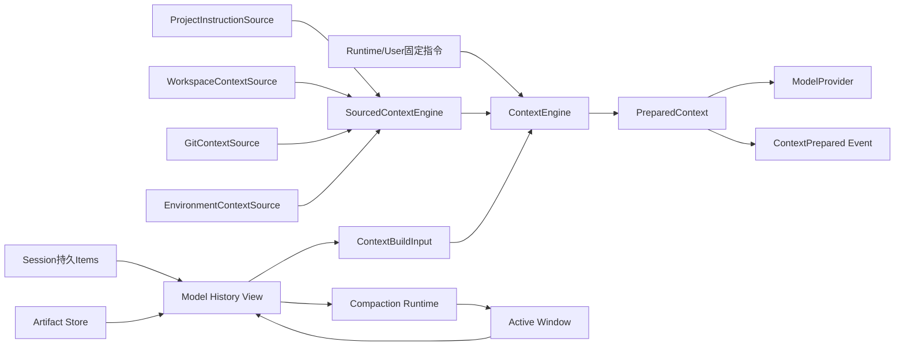
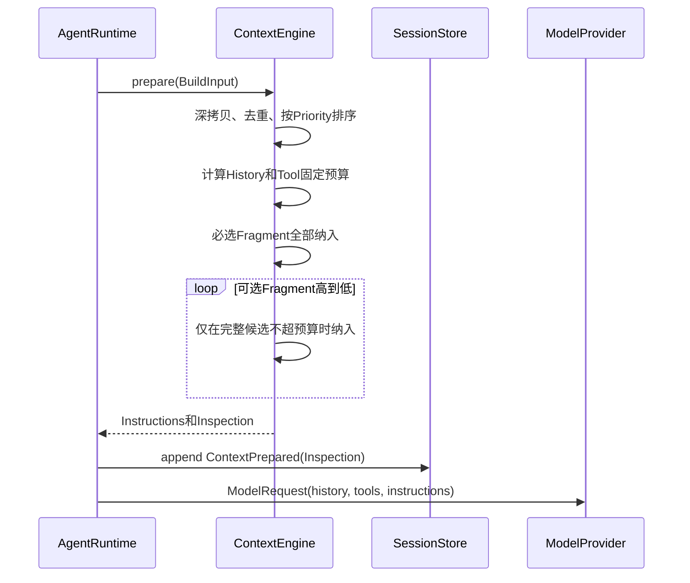
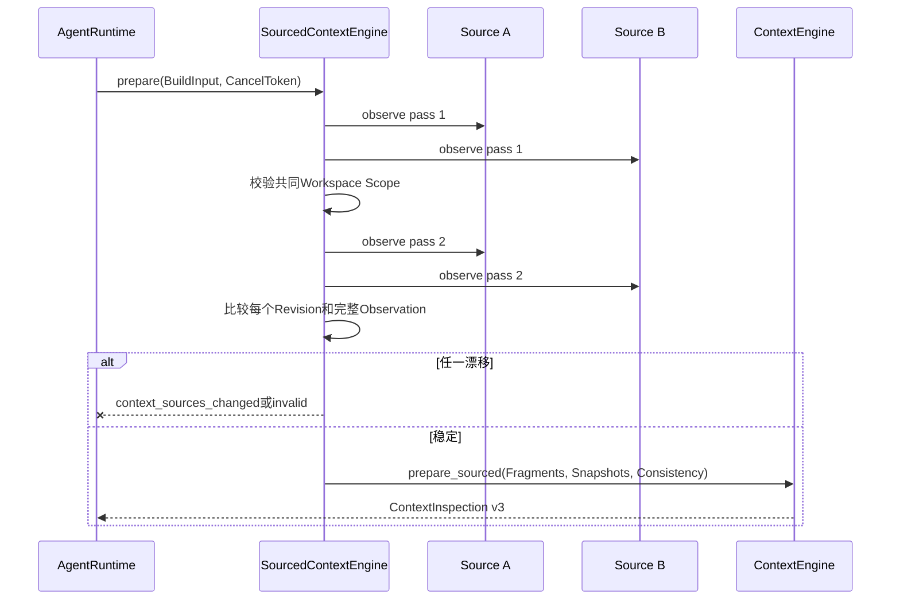
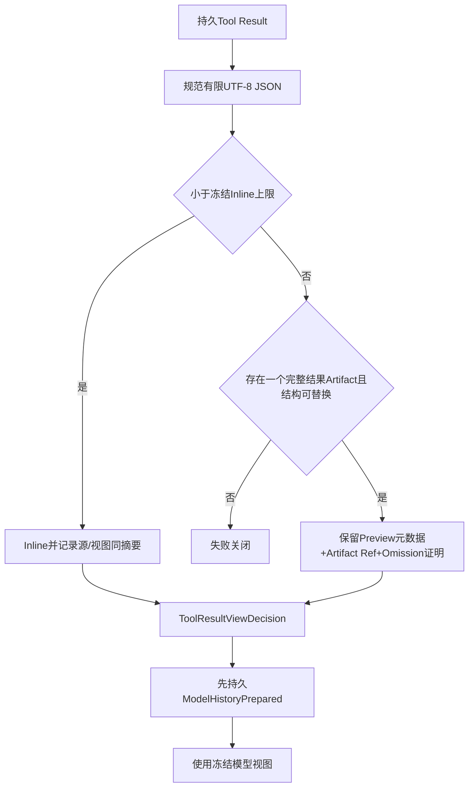
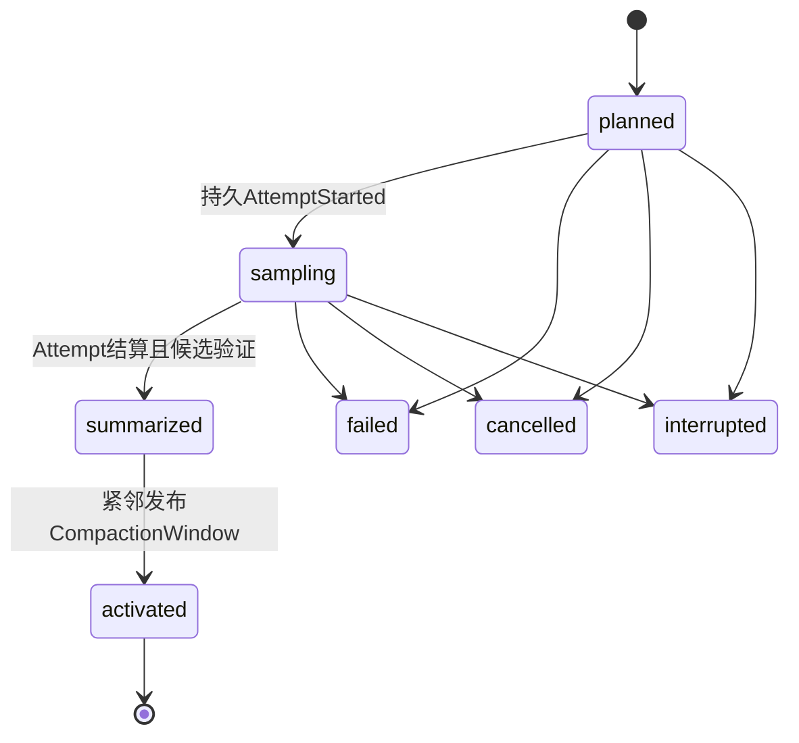
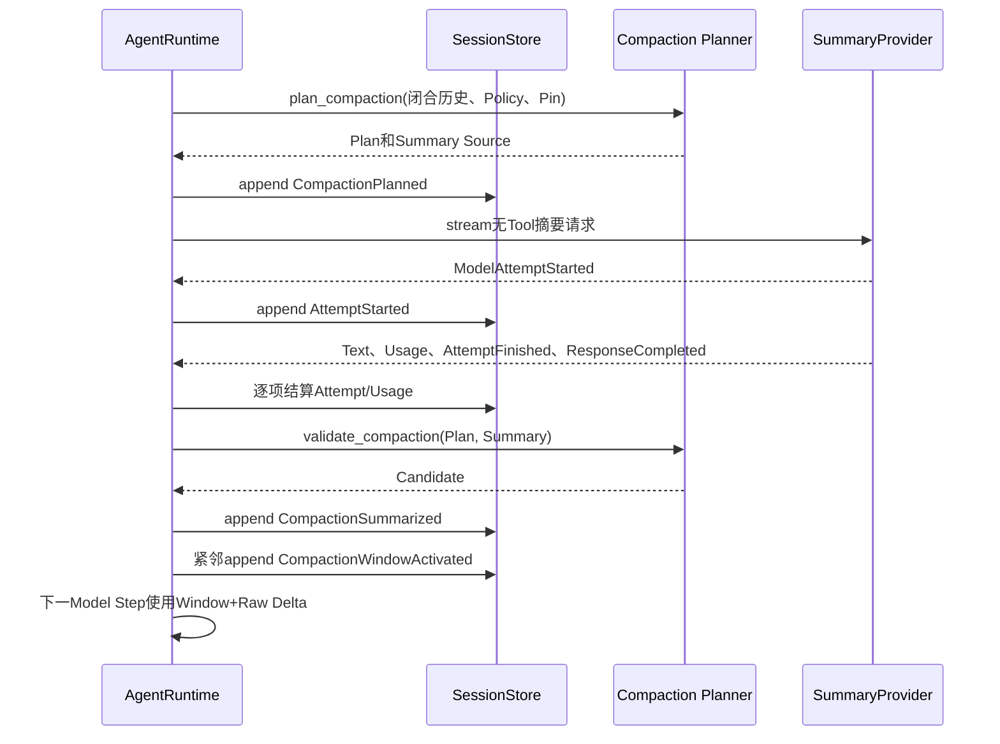
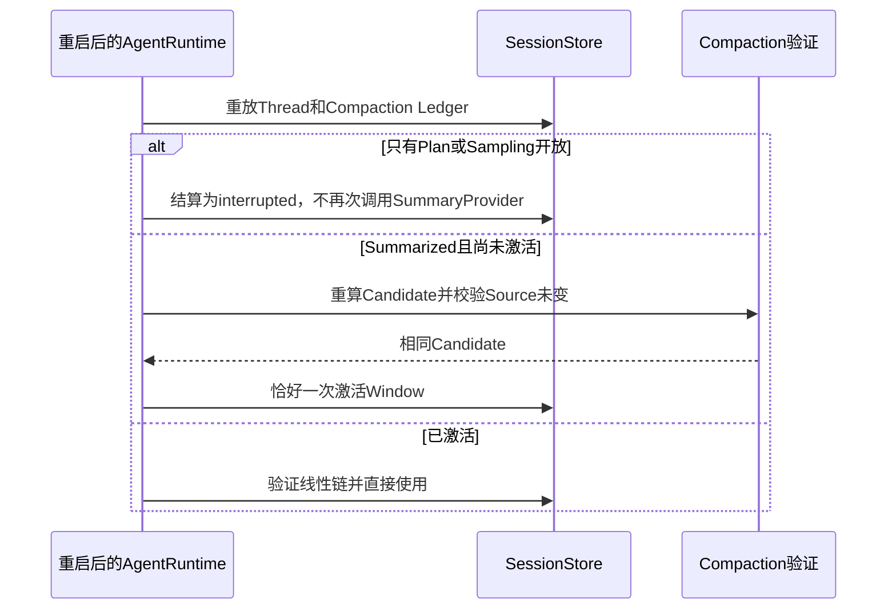
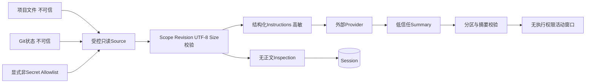

# Context模块设计

## 1. 文档摘要

| 项目 | 内容 |
|---|---|
| 当前能力 | 固定与动态Context规划、显式优先级/信任、输入预算、Project/Workspace/Git/Environment Source、Tool Result模型视图、Compaction计划/账本/活动窗口 |
| 本文状态 | 当前实现；`context`包现行实现的事实源 |
| 代码版本 | `6c5f310346afa3fa176f51707722467f46811b35` |
| 默认产品装配 | 当前默认薄CLI没有装配Context Source或自动Compaction；能力通过`AgentRuntime`端口显式装配 |
| 稳定版本 | Context Inspection v1/v2/v3、Source Snapshot v1、Tool Result Model View v1、Compaction Policy/Plan/Summary/Window/Runtime v1 |
| 持久事实 | 无动态来源正文的Inspection/Snapshot、模型历史决定、Compaction账本和活动窗口；原始Session历史不被删除 |

Context不是“把尽可能多的文本拼进Prompt”。它在每个Model Step前生成有界、可解释、可重放验证的
模型视图，并把来源、预算和省略决定持久化。模型摘要属于低信任派生数据，不能覆盖原始历史或携带
执行权限。

## 2. 需求背景

真实仓库中的指令、目录、Git状态、环境事实和Tool Result会随时间变化。若Agent每次任意读取并直接
拼接，无法解释某次模型决策看到了什么，也无法在来源竞态、长会话超窗或大Tool Result时安全恢复。
粗暴截断还可能拆开Tool Call/Result、丢失当前用户请求或让低优先级项目文本覆盖Runtime安全约束。

Context模块把该问题分成四层：纯规划器只处理受界文本；Source负责可信工作区内的动态观测；模型
历史层冻结Tool Result展示；Compaction仅用已闭合历史生成带账本的活动窗口。

## 3. 设计目标与非目标

### 3.1 目标

1. 固定优先级为`runtime > user > project > workspace > git > environment`，来源文本不能自提权；
2. 历史、Tool定义和必选指令超预算时失败关闭，可选Fragment按确定顺序省略；
3. 每个Model Step刷新动态Source并持久化无正文Revision/Fingerprint证据；
4. 多Source通过两次完整观测证明同一Workspace Scope和稳定Revision；
5. Project/Workspace/Git读取复用受控Workspace和只读Tool契约，拒绝路径漂移与竞态；
6. Environment只投影显式Allowlist且拒绝Secret类名称，不枚举宿主环境；
7. 大Tool Result只有绑定完整Artifact时才能替换为有界模型视图，决定首次生成后冻结；
8. Compaction保持完整闭合组、当前用户和Pin，先持久计划/请求意图/用量/候选，再原子激活窗口；
9. 重启不重复发起已可能计费的摘要请求，原始Event和Items始终保留。

### 3.2 非目标

1. 当前估算器不是Provider真实Tokenizer，而是稳定保守的`utf8-bytes/v1`；
2. Context Engine不执行语义检索、向量索引、RAG或全仓库自动索引；
3. Source不提供任意环境变量、任意Shell或未受控网络读取；
4. Compaction不修改Session原始历史，不保证摘要语义绝对正确，也不授予Tool权限；
5. 当前默认产品未启用自动Compaction，本文不能被解读为最终用户默认已经获得长会话压缩；
6. Context Source正文没有独立持久副本；重放证明保存Revision和决策，原内容仍来自工作区或Session。

## 4. 约束、假设与术语

| 术语 | 定义 | 约束/影响 |
|---|---|---|
| Fragment | kind、source、UTF-8 content组成的不可变指令片段 | ID为三者SHA-256；最多128项、总来源+正文128 KiB |
| Trust | `runtime/user/project/external` | 由Kind固定映射，不接受来源自报 |
| Required | Runtime与User Instruction | 超预算直接失败，不得省略 |
| Optional | Project、Workspace、Git、Environment | 按优先级、source、fragment ID稳定选择 |
| Inspection | 某Model Step预算和决策的无正文记录 | 指令摘要、分项Token、Source Snapshot必须自洽 |
| Observation | Source瞬时正文、Workspace Scope和Revision | 单次结果最多64文档、正文总量128 KiB |
| Source Snapshot | 不含正文的来源/文档Revision及Fragment关联 | 写入Session，支持审计而不复制正文 |
| Model History View | Provider看到的Thread语义Items | 大结果可替换，原Item不改写 |
| Compaction Plan | 覆盖/保留/Pin分区和摘要输入证明 | 无副作用，不能直接成为活动窗口 |
| Compaction Record | 摘要Provider尝试、用量、候选或失败账本 | `planned/sampling`开放，其余终止 |
| Active Window | 摘要Item+保留Items+之后原始增量 | 线性链，只能发布已验证候选 |

`ContextBuildInput`最多8192份历史文档、256份Tool文档和8 MiB UTF-8总量。`ContextLimits`从Context
Window减去Reserved Output、Provider Overhead和Safety Margin，至少保留一个输入单位。

## 5. 模块上下文与数据流



### 5.1 图示说明与源码映射

- [`tool_result_view.py`](../../src/harnessix/context/tool_result_view.py)先从Session和Fork历史生成模型Items；
- [`sources.py`](../../src/harnessix/context/sources.py)只通过宿主准入的Source采集动态正文；
- [`engine.py`](../../src/harnessix/context/engine.py)不I/O，只做确定性排序、预算和渲染；
- `PreparedContext.instructions`瞬时进入`ModelRequest`，Session只保存
  [`ContextPrepared`](../../src/harnessix/context/contracts.py)中的Inspection；
- [`compaction.py`](../../src/harnessix/context/compaction.py)规划和验证窗口，Agent Runtime负责Provider
  请求账本与发布，[`compaction_window.py`](../../src/harnessix/context/compaction_window.py)负责使用窗口。

## 6. 组件职责与禁止边界

| 组件 | 职责 | 直接依赖 | 禁止事项 | 生命周期/并发 |
|---|---|---|---|---|
| `ContextEngine` | 固定/动态Fragment排序、预算、渲染、Inspection | 纯合同 | 文件、环境、Provider或Session I/O | 构造后值语义，可复用 |
| `SourcedContextEngine` | 刷新1～16个Source、组合一致性、委托纯Engine | Source、CancelToken | 接受Runtime/User动态Kind；缓存旧观测跨Step | 每次prepare重新观测 |
| `ProjectInstructionSource` | 根到工作目录发现首个`AGENTS.override.md`或`AGENTS.md` | 受控Workspace读 | 跟随不安全路径、跨Root、读取无限文件 | 每Step异步观测 |
| `WorkspaceContextSource` | 根和工作目录一级有界布局 | List Tool | 全仓递归扫描 | 每Step双读目录Revision |
| `GitContextSource` | 固定Git只读Runtime的有界状态 | GitReadRuntime | 任意Git命令或泄漏Denied Path | 前后绑定校验 |
| `EnvironmentContextSource` | 显式非Secret Allowlist、OS/Platform/工作目录 | 传入Mapping | 枚举`os.environ`、允许Secret名称 | 每Step读取Allowlist值 |
| Tool Result View | 冻结Inline/Artifact Reference展示及Inspection | Session Item、Artifact合同 | 修改原结果、事后缩小旧历史、替换Patch/Process未知效果 | 每Step准备，决定持久复用 |
| Compaction Planner | 闭合组分区、Pin、预算和摘要输入 | 纯历史 | I/O、调用Provider、删原历史 | 可取消纯计算 |
| Compaction Ledger/Window | 尝试记账、候选校验、活动窗口线性链 | Agent Event/Reducer | 把摘要当权威事实或执行授权 | 每Thread持久状态 |

## 7. Context合同与重点字段

| 结构/字段 | 来源 | 语义/约束 | 敏感级别 | 持久化/兼容 |
|---|---|---|---|---|
| `ContextFragment.kind` | 宿主/Source | 决定Trust、Priority和Required | 低 | Inspection Decision |
| `source` | 宿主/受控路径 | 非空、无NUL、UTF-8、最大4096字符 | 中 | Snapshot/Decision；不得作为权限 |
| `content` | 文件/宿主 | 非空、无NUL、UTF-8、最大262,144字符 | 高 | 瞬时渲染，不进入Source Snapshot |
| `fragment_id` | 合同计算 | kind+source+content摘要 | 低 | 关联Snapshot与Decision |
| `workspace_scope` | Workspace能力 | 绑定真实Root和工作目录Revision | 中 | Source/Consistency Snapshot |
| `source_revision` | Source计算 | 配置、目录、文档和运行时合同摘要 | 低 | 检测观测漂移 |
| `ContextLimits` | 宿主配置 | Window 1024～10,000,000；输出/开销/余量有界 | 低 | 每次Inspection冻结 |
| `instruction_fingerprint` | Engine | 精确Rendered Instructions SHA-256 | 低 | `PreparedContext`自校验 |
| `disposition` | Engine | `included`或`omitted_budget`；Required必须included | 低 | Context Inspection |
| `ContextInspection.spec_version` | Engine | v1固定Fragment；v2单动态来源；v3多来源一致性 | 低 | Event兼容判别字段 |

渲染格式为规范JSON `harnessix.instructions/v1`，包含固定Priority Rule及每个Fragment的ID、Kind、Source、
Trust和Content。模型能看到来源与信任，但这些标签由Runtime生成，不能由项目正文伪造。

## 8. 接口设计

| 接口/方法 | 调用者 | 输入/输出 | 前置/后置 | 错误与重试 | 取消/超时 | 幂等/顺序 | 权限 |
|---|---|---|---|---|---|---|---|
| `ContextPlanner.prepare` | Agent Runtime → ContextEngine | BuildInput → PreparedContext | 输入有界；输出指纹/Inspection自洽 | 预算失败不可内部重试 | 同步纯计算 | 相同输入/配置确定 | 无I/O权限 |
| `AsyncContextPlanner.prepare` | Runtime → SourcedEngine | BuildInput、Token → PreparedContext | Source身份唯一、Kind合法 | Source retryable映射到公开输入失败 | 每Source通过CancelToken | Source按注册顺序；多源双观测 | 仅已注入Source能力 |
| `ContextSource.observe` | SourcedEngine → Source | BuildInput、Token → Observation | Workspace必须匹配绑定Root | 漂移/超时为稳定Source错误 | 协作取消并回收读取Task | 每Step重新读，不复用旧正文 | 只读、路径和Allowlist受限 |
| `prepare_model_history` | Runtime | Thread、Step、Policy → PreparedModelHistory | 历史非空、≤8192项/8 MiB | 决定/Artifact错配失败关闭 | 纯计算 | 旧决定必须原样复用 | 不访问Artifact正文 |
| `plan_compaction` | Runtime | Thread、Step、View/Compaction Policy、Token → Prepared | Turn处于安全边界、历史闭合 | 无可安全压缩前缀明确失败 | 可取消生成器检查点 | 相同历史/ID重算相同Plan | 无Provider权限 |
| `validate_compaction` | Runtime | Thread、Plan、低信任Summary、Token → Candidate | Plan仍匹配来源 | 摘要越界/源变化拒绝 | 可取消 | 不修改Session | 摘要无执行权 |
| `prepare_active_model_history` | Runtime | Thread、Step、View Policy → History | 窗口在线性链尾且证明匹配 | 原历史前缀变化失败关闭 | 纯计算 | Window+Raw Delta确定 | 只读Session投影 |

## 9. 纯Context规划流程



历史和Tool定义是固定输入，超过Available Input立即`context_budget_exceeded`；Runtime/User必选指令
也不能省略。可选Fragment不做文本截断，只做整片纳入或省略，避免生成无法由Fingerprint验证的半片。
估算值使用UTF-8字节数并进入Inspection，使不同Provider/平台得到相同规划结果。

## 10. 动态Source与一致性



单Source生成Inspection v2，不需要组合一致性快照；两个及以上Source生成v3并强制两遍观测。Source按
注册顺序串行执行，当前没有并行读取；这是为了保持有界资源和清晰取消语义。空文档仍形成`empty`
Snapshot，避免“未读取”和“读取为空”无法区分。

### 10.1 Source安全规则

- Project Instruction按Root到Working Directory逐级查找，每级优先`AGENTS.override.md`，再
  `AGENTS.md`，总量默认64 KiB；读取前后目录Revision必须一致；
- Workspace Source只生成Root与工作目录的一层有界清单，默认正文12 KiB；
- Git Source只调用固定`GitReadRuntime`状态合同，默认100项/16 KiB，并过滤Denied Path；非仓库是
  显式状态而非异常；
- Environment Source最多32个显式名称，拒绝包含Token、Secret、Password、Credential、Auth、Key等
  Secret模式的名称；单值最多1024字节、总正文默认4 KiB；不枚举Mapping。

## 11. Tool Result模型视图



默认Inline上限64 KiB，可配置1 KiB～1,000,000字节。决定绑定Item、Call、Source摘要/大小、View摘要/
大小、Artifact和首次Policy。历史已见过模型后不能事后改变旧决定；旧事件没有替换证据时只允许Inline。
Patch、Process或Batch效果结果超限时不能用通用Artifact替换，因为省略字段可能破坏安全语义。

模型历史只包括完成的用户/助手文本、Tool Call和Tool Result；Approval、Error、私有Patch/Process效果
字段不会直接进入Provider历史。使用Artifact Reference前，Agent Runtime还会通过当前Workspace Scope
验证Artifact存在、完整且Owner正确。

## 12. Compaction状态、数据与不变量



`planned`和`sampling`是开放账本；`summarized/failed/cancelled/interrupted`必须有结束Event Sequence和
时间。摘要成功要求一个已完成、Step匹配且Index=1的Model Attempt、Summary及Candidate摘要/Token；
失败状态必须有公开Failure。Provider在AttemptStarted前可能已发请求但没有事实时，记录
`unaccounted_request_possible=True`并禁止自动重试。

| 结构/字段 | 语义/不变量 |
|---|---|
| `CompactionPolicy.target_history_tokens` | 目标历史预算；Summary Reserve必须更小 |
| `source/covered/retained/pinned_item_ids` | Covered与Retained无交且完整分区Source；Pin是Retained子集并保持原序 |
| `anchors` | 宿主固定Item及原始摘要，必须在Pinned中 |
| `source_event_sequence` | Plan绑定来源Snapshot；计划Event必须紧邻其后 |
| `summary_source_sha256` | 绑定送给摘要Provider的精确输入 |
| `CompactionRuntimeConfig` | Trigger必须高于Target，形成迟滞；Summary输出有界 |
| `CompactionWindow.previous_window_id` | 形成线性窗口链，不允许回退到旧前缀 |
| `raw_history_*` | 证明窗口发布时的原始历史前缀，后续只追加Delta |

## 13. Compaction正常、失败与恢复流程



摘要请求不暴露Tools，只允许单文本块、一次Attempt和完整用量/响应终态；任何Tool Call拒绝。Summary
输入/输出和Turn总Token预算都受限。发布窗口使用Shield保证“候选已提交后收到宿主取消”仍会等待相邻
激活事务结束，避免永久留下可恢复但未发布的模糊边界。



## 14. 持久化、事务、并发和迁移

Context没有独立数据库表；所有Inspection、Model History Decision、Compaction Event和Window都作为
Agent Event写入Session，并由Reducer投影到Turn/Thread。Context Inspection v2需要Event v11，v3需要
v12；Compaction Ledger需要v14，Window需要v15。Session迁移12～17分别引入Inspection、Source、
Consistency、Tool Result View、Compaction Ledger和Window读取能力。

Context准备发生在每Thread Runtime锁保护的Model Step边界。Source内部异步读取由CancelToken回收；
多Source当前串行双观测。Plan和Candidate计算使用带检查点的生成器，可响应取消但无I/O。Plan、Attempt、
Usage、Summary和Window分别持久化，以便崩溃定位到精确边界；激活Window与原始历史删除无关。

## 15. 失败语义与恢复矩阵

| 故障点 | 稳定错误/事实 | 重试 | 恢复 | 防错误上下文证明 |
|---|---|---|---|---|
| History/Tool固定输入超预算 | `context_budget_exceeded` | 先压缩或改配置 | 不调用Provider | 预算先于模型请求 |
| Required指令超预算 | 同上 | 不自动省略 | 调整明确配置 | Runtime/User约束不丢失 |
| Source超时/工作区变化 | `context_source_unavailable`、retryable | 上层新Step前决定 | 当前Step不调用Provider | 无Inspection不暴露半观测 |
| 多Source两遍漂移 | `context_sources_changed` | 可重新完整观测 | 丢弃两遍正文 | Revision和Observation同时比较 |
| Source返回伪造/错Scope合同 | `context_source_invalid/mismatch` | 否 | 修复Source实现 | Pydantic和共同Scope校验 |
| 大结果无完整Artifact | `context_tool_result_artifact_required` | 否 | 重新产生合规Tool结果 | 不静默截断 |
| 冻结Decision与原结果不符 | `context_tool_result_decision_mismatch` | 否 | Session诊断 | 摘要、大小、身份全绑定 |
| Summary Provider在请求意图前异常 | 失败/中断且`unaccounted_request_possible` | 禁止自动重发 | 人工核对计费后继续原历史 | 不重复可能计费请求 |
| Summary产生Tool Call/非法流 | 稳定Provider/Compaction失败 | 不透明重试禁止 | 原历史不变 | Tools为空且事件协议验证 |
| Candidate前来源变化 | `context_compaction_source_changed` | 重新规划新ID | 原Plan冻结 | 重放Plan与摘要绑定 |
| Summarized后激活前崩溃 | 完整Candidate事实 | 不重发摘要 | 重算并恰好一次激活 | Window紧邻结束序号 |
| 活动窗口原始前缀被改写 | `context_compaction_window_source_changed` | 否 | Session损坏诊断 | Raw Item ID摘要 |

## 16. 安全与隐私



Project、Workspace、Git和Environment正文都是不可信输入，结构化Trust标签不表示内容可信。低优先级
正文不能覆盖高优先级规则，但仍可能Prompt Injection；真正执行权限由Tool/Sandbox/Approval控制。
Environment Source拒绝Secret名称只是纵深防御，不替代Secret Store；值和源码正文会发送给配置的
Provider，部署必须按数据边界选择Provider。

Inspection不持久Source正文，但包含路径、Revision和大小，仍属于中敏元数据。Tool Result原文保留在
Session或Artifact，替换视图只减少模型暴露，不是数据删除。Summary Source显式过滤私有Action/Approval
字段，Summary本身不可生成Tool Call，也不能伪装历史Tool Result。

## 17. 可观测性

| 信号 | 触发点 | 关键属性 | 敏感/基数规则 | 用途 |
|---|---|---|---|---|
| Agent Event | History Prepared、Context Prepared、Compaction各阶段/Window | Step、版本、Token分项、Revision摘要、状态 | 不保存动态正文；Item正文仍按Session高敏保护 | 重放和审计 |
| Trace | history、context、compaction操作 | thread/turn/step、结果和公开错误 | 不记录Instructions、Source正文或Summary Source | 定位准备/摘要延迟 |
| Metric | Context/Compaction完成、失败、用量 | 版本、状态、错误类别 | 不以Fragment ID/路径作为标签 | 超窗率、失败率和摘要成本 |
| Log | Source/Compaction边界 | 操作和公开错误码 | 不记录环境值、文件正文、Prompt | 运维诊断 |

## 18. 核心业务逻辑伪代码

```text
prepare_context(request):
    require bounded UTF-8 history and tool documents
    fragments = deep_copy_unique_and_sort_by_fixed_priority()
    fixed = bytes(history) + bytes(tool_definitions)
    fail if fixed exceeds available input
    include every runtime/user fragment or fail
    for optional fragment in stable order:
        include whole fragment only if rendered candidate fits
    return instructions plus self-consistent no-body inspection

prepare_sourced_context(request, cancel):
    first = observe every registered source through CancelToken
    if multiple sources:
        require one workspace scope
        second = observe every source again
        require identical revisions and observations
    turn nonblank documents into externally-trusted fragments
    create no-body source snapshots, including explicit empty state
    delegate to pure ContextEngine

prepare_tool_result_view(thread, policy):
    for each completed call/result pair in provider-neutral order:
        canonicalize finite UTF-8 JSON
        reuse persisted decision when present
        else inline if within first policy limit
        else require complete bound artifact and safe replaceable shape
        freeze source/view digests, sizes, references and omission field
    persist decisions and history inspection before Provider call

compact(thread, step, cancel):
    plan a closed covered prefix and retained/pinned suffix
    persist plan before any summary request
    require first Provider event is persisted attempt intent
    consume one tool-free text response and persist all usage/attempt facts
    validate low-trust summary against unchanged plan/source and budgets
    persist summarized candidate
    atomically publish adjacent linear window; never delete raw history
    on crash, never reissue an open paid request; only activate completed candidate
```

## 19. 源码与测试双向映射

| 设计元素 | 源码 | 关键符号 | 测试 | 关键测试函数 | 证明内容 |
|---|---|---|---|---|---|
| 纯规划与预算 | [`engine.py`](../../src/harnessix/context/engine.py) | `ContextEngine.prepare`、`_prepare`、`estimate_tokens` | [`test_engine.py`](../../tests/context/test_engine.py) | `test_priority_rendering_is_deterministic_and_structurally_escaped`、`test_history_or_required_instruction_overflow_fails_closed` | 优先级与失败关闭 |
| Context合同 | [`contracts.py`](../../src/harnessix/context/contracts.py) | `ContextLimits`、`ContextBuildInput`、`PreparedContext` | [`test_engine.py`](../../tests/context/test_engine.py) | `test_duplicate_fragment_is_rejected_before_runtime_use` | 字段和指纹不变量 |
| Source组合 | [`sources.py`](../../src/harnessix/context/sources.py) | `SourcedContextEngine.prepare`、`_observe_all` | [`test_sources.py`](../../tests/context/test_sources.py) | `test_multi_source_double_observation_fails_closed_on_drift`、`test_multi_source_v3_is_persisted_and_replayed_as_event_v12` | 双观测和v3持久化 |
| Project指令 | [`sources.py`](../../src/harnessix/context/sources.py) | `ProjectInstructionSource` | [`test_sources.py`](../../tests/context/test_sources.py) | `test_project_instructions_follow_root_to_cwd_and_override_precedence`、`test_unsafe_instruction_file_fails_closed` | 查找顺序和路径安全 |
| Workspace/Git | [`sources.py`](../../src/harnessix/context/sources.py) | `WorkspaceContextSource`、`GitContextSource` | [`test_sources.py`](../../tests/context/test_sources.py) | `test_workspace_source_truncates_view_and_detects_directory_race`、`test_git_source_filters_denied_rename_origin` | 有界视图和Denied Path |
| Environment | [`sources.py`](../../src/harnessix/context/sources.py) | `EnvironmentContextSource` | [`test_sources.py`](../../tests/context/test_sources.py) | `test_environment_source_never_enumerates_mapping_and_rejects_secrets` | Allowlist和Secret拒绝 |
| Tool Result View | [`tool_result_view.py`](../../src/harnessix/context/tool_result_view.py) | `prepare_model_history`、`_new_decision`、`_apply_decision` | [`test_tool_result_view.py`](../../tests/context/test_tool_result_view.py) | `test_replayed_decision_is_bound_to_source_and_first_policy`、`test_partial_effect_artifacts_cannot_replace_whole_large_result` | 冻结决定和完整Artifact |
| Compaction规划 | [`compaction.py`](../../src/harnessix/context/compaction.py) | `plan_compaction`、`replay_compaction_plan` | [`test_compaction.py`](../../tests/context/test_compaction.py) | `test_closed_prefix_preserves_current_user_and_original_facts`、`test_entire_parallel_response_is_kept_or_covered` | 闭合组与当前用户 |
| Summary验证 | [`compaction.py`](../../src/harnessix/context/compaction.py) | `validate_compaction`、`replay_compaction_candidate` | [`test_compaction.py`](../../tests/context/test_compaction.py) | `test_summary_source_does_not_expose_private_action_or_call_approval_fields`、`test_tampered_plan_cannot_be_validated` | 私有字段和来源绑定 |
| Compaction账本 | [`compaction_ledger_contracts.py`](../../src/harnessix/context/compaction_ledger_contracts.py) | `CompactionRecord`及Event | [`test_compaction_ledger.py`](../../tests/context/test_compaction_ledger.py) | `test_summary_ledger_preserves_steps_items_and_cumulative_accounting`、`test_provider_without_persisted_attempt_intent_keeps_unknown_charge_risk` | 计费/尝试事实 |
| Runtime编排 | [`runtime.py`](../../src/harnessix/agent/runtime.py) | `_run_compaction`、`_activate_compaction_window` | [`test_compaction_runtime.py`](../../tests/context/test_compaction_runtime.py) | `test_summary_tool_call_is_rejected_without_execution`、`test_cancel_during_summary_closes_stream_and_ledger` | Provider协议与取消 |
| 崩溃恢复 | [`runtime.py`](../../src/harnessix/agent/runtime.py) | `_recover`及Compaction分支 | [`test_compaction_runtime_recovery.py`](../../tests/context/test_compaction_runtime_recovery.py) | `test_runtime_compaction_crash_never_reissues_paid_summary`、`test_window_activation_transaction_crash_recovers_exactly_once` | 不重复计费和恰好一次发布 |
| 活动窗口 | [`compaction_window.py`](../../src/harnessix/context/compaction_window.py) | `build_compaction_window`、`prepare_active_model_history` | [`test_compaction_window.py`](../../tests/context/test_compaction_window.py) | `test_repeated_compaction_uses_prior_window_plus_raw_delta_only`、`test_reopen_activates_committed_candidate_without_provider_request` | 线性窗口和增量历史 |
| 长会话组合 | [`compaction_window.py`](../../src/harnessix/context/compaction_window.py) | `active_model_history_source` | [`test_long_session_recovery.py`](../../tests/context/test_long_session_recovery.py) | `test_long_session_compaction_recovery_retry_switch_fork_archive` | Compaction/Retry/Fork/Archive组合 |

### 19.1 推荐阅读路线

1. 从[`contracts.py`](../../src/harnessix/context/contracts.py)和
   [`engine.py`](../../src/harnessix/context/engine.py)理解预算与固定优先级；
2. 读[`sources.py`](../../src/harnessix/context/sources.py)的`SourcedContextEngine`，再按Project、Workspace、
   Git、Environment Source及测试逐个阅读；
3. 读[`tool_result_contracts.py`](../../src/harnessix/context/tool_result_contracts.py)与
   [`tool_result_view.py`](../../src/harnessix/context/tool_result_view.py)，理解模型视图不是原始事实；
4. 读`compaction_contracts` → `compaction.py` → `compaction_ledger_contracts` → Agent Runtime
   `_run_compaction` → `compaction_window.py`；
5. 最后运行崩溃恢复和长会话组合测试，避免只理解摘要Happy Path。

## 20. 测试设计与验收标准

| 层级 | 必测内容 | 证据 |
|---|---|---|
| 纯合同 | 优先级、去重、预算边界、UTF-8和指纹 | `test_engine.py` |
| Source | 路径、Scope、Revision竞态、超时/取消、环境Secret、多源一致性 | `test_sources.py` |
| 历史视图 | JSON类型、精确字节边界、Artifact完整性、冻结Decision、非法值 | `test_tool_result_view.py` |
| Compaction纯逻辑 | 闭合分组、Pin、预算、摘要验证、私有字段 | `test_compaction.py` |
| 账本 | Attempt/Usage/计费、身份、状态、Deadline和Event版本 | `test_compaction_ledger.py` |
| Runtime/故障 | Provider非法流、Tool Call拒绝、取消、Context Overflow、每个Crash Point | `test_compaction_runtime.py`及Recovery测试 |
| 组合 | 活动窗口、真实Session、两个Provider映射、长会话Retry/Fork/Archive | Window、Session、Long Session测试 |

验收要求所有模型调用前的Inspection/Decision事实可重放，所有可能计费的Summary请求有Attempt边界，
所有大结果省略有完整Artifact证据，所有失败保持原始历史可用。

## 21. 已知限制、风险与后续工作

| 项目 | 当前影响 | 后续归属 |
|---|---|---|
| 默认产品未装配Context/Compaction | 代码库能力尚非最终用户默认体验 | 0.9.1产品装配 |
| UTF-8字节估算偏保守且非真实Tokenizer | 可能提前省略Context或触发Compaction | 0.9.2用Eval证明后再引入版本化估算器 |
| Source串行双观测 | Source多时增加Model Step前延迟 | 0.9.3基准；不可牺牲一致性盲目并行 |
| 无语义代码索引/RAG | 大仓库发现依赖Tool Loop和有界布局 | 1.x按真实任务证据评估 |
| Source正文不持久 | 工作区变化后只能证明Revision，不能复现完整Prompt正文 | 数据保留/隐私权衡需ADR后变更 |
| Session/Artifact增长未治理 | 原历史不删除，长期使用占用磁盘 | 0.9.3/0.9.5 |
| Summary语义错误仍可能影响后续模型 | 结构验证不等于事实正确 | 0.9.2固定任务Eval与可见诊断 |

## 22. 变更记录

| 文档版本 | 代码版本 | 日期 | 变更摘要 |
|---|---|---|---|
| 1 | `6c5f310346afa3fa176f51707722467f46811b35` | 2026-09-12 | DOC-1.3 Wave A Context模块设计初版 |
