# Delivery模块设计

## 1. 模块摘要

| 项目 | 内容 |
|---|---|
| 源码包 | [`src/harnessix/delivery`](../../src/harnessix/delivery/) |
| 当前职责 | 把多文件目标冻结为Workspace Transaction；私有保存before/after Blob；生成完整Diff；在POSIX普通目录中可恢复发布；在受管Git Worktree中生成Checkpoint和确定性Commit；把Push投影到统一Trusted Action与Effect Journal |
| 非职责 | 不生成模型修改意图，不提供编辑器/TUI，不执行任意Shell，不实现Windows普通目录写端口，不自动Push/建PR，不管理公网凭据，不提供多租户远端服务或跨Store原子事务 |
| 上游调用者 | 默认POSIX `agent-server`通过Trusted Workspace Patch消费文件Delivery；Git、Push及其他宿主仍为显式装配 |
| 下游依赖 | Workspace Snapshot/Lease、`tools.workspace.Workspace`、SQLite、宿主文件系统、固定Git可执行文件、Trusted Actions、Execution Plan与Action Plane |
| 持久化 | Workspace Transaction DB与Blob目录、Git Delivery DB、Workspace Lease DB；Push另用Execution Plan、Action Audit与Effect Journal |
| 平台 | Planner支持POSIX/Windows观察；普通Workspace发布仅POSIX；Git Worktree/Commit目标支持macOS/Linux/Windows；Push合同跨平台，当前真实验收使用本地bare remote |
| 代码版本 | `ac05a74fb953ff6f56c8bc8a6736dd2f95fe9ce7` |
| 当前完成度 | 核心库、恢复测试及默认POSIX Workspace Patch写链已实现；Git公网认证、产品启动全局恢复、清理、完整可观测性及若干竞态边界仍未闭环 |

本文描述[`contracts.py`](../../src/harnessix/delivery/contracts.py)、
[`planner.py`](../../src/harnessix/delivery/planner.py)、[`store.py`](../../src/harnessix/delivery/store.py)、
[`filesystem.py`](../../src/harnessix/delivery/filesystem.py)、[`diff.py`](../../src/harnessix/delivery/diff.py)、
[`git_contracts.py`](../../src/harnessix/delivery/git_contracts.py)、
[`git_store.py`](../../src/harnessix/delivery/git_store.py)、[`git.py`](../../src/harnessix/delivery/git.py)和
[`git_push.py`](../../src/harnessix/delivery/git_push.py)的当前实现。Workspace路径、Snapshot与Lease以
[Workspace模块设计](workspace.md)为事实源；统一审批和外部效果恢复以
[Trusted Actions模块设计](trusted-actions.md)与[Action Plane子系统设计](../subsystems/action-plane.md)为事实源。

## 2. 需求背景

Coding Agent的修改不能以“模型给出文本后直接覆盖文件”作为生产交付。一次真实软件工程任务可能同时
新增、修改和删除多个文件，并经历用户审批、进程中断、磁盘错误、并发编辑、Git对象写入、Branch Ref更新和
远端Push。若这些阶段只靠内存状态或命令返回码判断，会产生以下风险：

1. 审批展示的内容与最终落盘内容不一致；
2. 用户在规划后编辑文件，Agent静默覆盖新内容；
3. 多文件发布在中途崩溃，既不能证明完成，也不能安全重放；
4. Git Hook、Filter、Submodule或外部配置在交付期间执行未批准代码；
5. Commit返回丢失后重复创建Branch或生成不同对象；
6. Push返回丢失后自动重推，覆盖并发远端更新；
7. 文件正文、Commit身份和远端凭据进入公开Plan、日志或模型上下文；
8. macOS/Linux安全写策略被错误外推为Windows原生支持。

Delivery把交付拆成四个可独立证明的层次：

- **Workspace Transaction**：冻结选择资源、before/after版本、顺序和指纹；
- **Durable Publish**：逐成员写入、持久游标和事实对账；
- **Managed Git Delivery**：绑定来源仓库，在私有Worktree中生成Tree与确定性Commit；
- **External Push**：单独风险路由、审批、远端CAS和`UNKNOWN → reconcile`。

这些层次可组合，但不共享一个伪原子事务。每个效果必须由自己的事实和账本收敛。

## 3. 设计目标、非目标与关键术语

### 3.1 当前设计目标

1. 每个目标路径都绑定规范路径、before版本、after版本和来源Workspace Snapshot；
2. 公开Plan只保存正文摘要，完整before/after正文进入私有内容寻址Blob目录；
3. 文件数量、单文件和总镜像大小均有硬上限；
4. 控制面、Secret、Git元数据和Agent规则路径无条件拒绝写入；
5. 同一`request_id`只能绑定一个确定Plan，重试返回已推进的当前记录；
6. 普通文件系统逐成员发布，不把多文件流程描述为内核原子事务；
7. 每个成员只在观察为before时提交，观察为after时只推进账本；
8. 结果无法归因时进入`diverged`或`unknown`，不盲目覆盖或重放；
9. Rollback生成新的Transaction和新Approval，不改写原记录；
10. Diff完整覆盖新增、修改、删除和精确内容重命名，并区分文本与二进制；
11. Git来源必须是精确、干净、无危险转换配置的仓库根；
12. Git运行只使用固定argv、固定环境、固定可执行文件身份和有界输出；
13. Worktree、Checkpoint和Commit均绑定不可变来源事实与自摘要；
14. Commit对象正文和OID在规划时确定，执行只写相同对象并CAS创建新Branch；
15. Push只更新一个Branch Ref，并绑定Remote URL摘要、Local OID和Expected Remote OID；
16. Push调用开始后的不确定结果只允许远端事实对账，不允许自动第二次Push；
17. macOS/Linux/Windows能力差异在合同、实现和测试证据中明确暴露。

### 3.2 明确非目标

- 不提供模型规划、Patch生成、代码审查或自动合并策略；
- 不创建父目录、目录Mutation、符号链接、硬链接或特殊文件；
- 不承诺跨文件、跨数据库、文件系统与Git对象之间的ACID事务；
- 不阻止所有外部编辑器或同UID恶意进程；
- 不把内容Hash、Snapshot或Lease描述为备份；
- 不在普通文件系统上实现原子“比较旧inode后替换”原语；
- 不在Windows普通目录中执行直接发布；
- 不复用仓库Hook、Filter、LFS、Submodule或Sparse Checkout；
- 不修改来源HEAD、来源Index或已有Branch；
- 不清理受管Worktree、不可达Git对象、临时失败目录或未引用Blob；
- 不自动获取远端旧OID、管理SSH Agent、Known Hosts、Token、Keychain或企业代理；
- 不把Commit批准推导为Push批准；
- 不在默认产品中自动开放任何Delivery能力。

### 3.3 关键术语

| 术语 | 定义 |
|---|---|
| Desired File | 宿主提供的目标正文或删除意图，以及目标模式 |
| File Version | `absent`或普通文件的SHA-256、大小和模式 |
| Mutation | 同一路径的before/after版本变化 |
| Transaction Plan | 来源Snapshot、排序Mutation、Request ID和Fingerprint的不可变合同 |
| Blob Store | 以正文SHA-256命名的私有before/after内容目录 |
| Cursor | 已由账本确认达到after状态的Mutation前缀长度 |
| Diverged | 当前事实可观察，但不再属于允许的before/after有序前缀 |
| Unknown | 效果或持久事实无法可靠证明，需要人工处置或更强对账 |
| Managed Worktree | 位于Git私有状态根、由Git common directory登记的detached Worktree |
| Checkpoint | Base Commit/Tree、目标Tree、Mutation集合和Worktree绑定的不可变证明 |
| Deterministic Commit | 原始Commit正文、SHA-256和预期Git OID在执行前已冻结的Commit |
| Remote Lease | Push使用Expected Remote OID形成的Git `--force-with-lease`旧值条件 |
| Workspace Lease | 本地受管写者之间的Owner/Fencing能力，与Remote Lease不是同一对象 |

## 4. 当前能力边界

| 能力 | 状态 | 当前入口 | 证据边界 |
|---|---|---|---|
| Workspace Transaction规划 | 已实现 | `prepare_workspace_transaction` | POSIX规划测试；Windows观察代码与CI路径 |
| 私有Blob和事务账本 | 已实现 | `SQLiteWorkspaceTransactionStore` | 重开、幂等、篡改和版本测试 |
| 完整Diff | 已实现 | `build_workspace_diff` | 文本、二进制、模式和重命名测试 |
| POSIX普通目录发布 | 已实现/显式装配 | `WorkspaceTransactionRuntime.publish` | 创建、修改、删除、崩溃和Lease测试 |
| Windows普通目录发布 | 未实现 | 明确失败`delivery_platform_unsupported` | 不得宣称原生可写 |
| Rollback新事务 | 已实现 | `build_rollback` | 正常恢复测试；并发第三内容语义未覆盖 |
| Git Repository Binding | 已实现 | `bind_repository` | 干净状态与危险配置测试 |
| Managed Worktree | 已实现 | `plan_worktree/create_worktree/reconcile_worktree` | 注册崩溃恢复测试 |
| Git Checkpoint | 已实现 | `create_checkpoint` | Tree、Blob和来源不变测试 |
| 确定性Commit | 已实现 | `plan_commit/commit/reconcile_commit` | 对象写入/Ref更新硬退出测试 |
| 单Ref Git Push | 已实现/显式装配 | Trusted Action → Action Plane | 本地bare remote审批、旁路和UNKNOWN测试 |
| 公网Git认证 | 未实现 | Runner不继承完整宿主凭据环境 | 无真实GitHub/GitLab证据 |
| 产品CLI/TUI写链 | POSIX Workspace Patch已装配 | 完整Review后批准，Windows省略 | Process与启动恢复由0.9.1e4～e5实现 |
| Worktree/Blob GC | 未实现 | 无 | 长期运行容量风险 |
| Telemetry | 未实现 | 仅账本事实 | 无统一Metric/Trace |

## 5. 模块上下文与信任边界

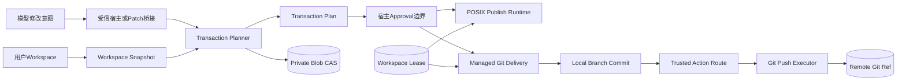

**图示说明：** 模型或扩展不能直接获得Filesystem Runtime、Git Runner、Store或Lease。受信宿主先把意图
转换为确定的Desired File集合，再由Planner捕获来源事实。普通发布和Git交付都要求Workspace Lease；但
本地Runtime当前只比较调用方传入的批准指纹，不自行读取Approval Store。Push必须额外经过统一Route和
Action Plane，Commit完成不构成网络授权。

### 5.1 受信输入

- Workspace根、私有状态根和绝对Git可执行文件；
- Desired File集合、Request ID、Transaction/Worktree/Commit ID；
- Commit作者、邮箱、消息、时间和目标Branch；
- 经上层策略批准的Plan Fingerprint；
- Workspace Lease及其Store；
- Push允许协议、Remote旧OID来源和Trusted Action装配。

### 5.2 不可信输入

- 模型生成的路径和文件正文；
- 用户仓库内容、配置、Git Tree、Worktree和Remote配置；
- SQLite和Blob目录读取出的持久Payload；
- Git stdout/stderr、Remote URL、Ref和OID；
- 扩展发起的Push Invocation；
- 文件系统与远端在任意检查窗口中的并发变化。

### 5.3 禁止旁路

1. 不允许模型直接调用`_apply`、`_GitRunner`或SQLite连接；
2. 不允许仅凭Plan Fingerprint字符串推导“已获批准”，宿主必须先完成正式Approval检查；
3. 不允许把Workspace Lease替代文件before/after复核；
4. 不允许把Transaction Plan用于未绑定的Workspace Root；
5. 不允许把Checkpoint批准、Commit批准或已配置Upstream推导为Push批准；
6. 不允许Push绕过Trusted Action Route直接提交旧Action Service；
7. 不允许Push异常后按同一Intent自动再次调用`git push`；
8. 不允许把Git工作目录配置、Hook或Filter作为隐式执行能力；
9. 不允许把POSIX直接发布能力外推为Windows普通目录安全写；
10. 不允许公开记录Blob正文、Diff正文、Commit消息、作者邮箱或Remote凭据。

## 6. 包结构与推荐阅读顺序

| 顺序 | 文件 | 关键符号 | 阅读目的 |
|---:|---|---|---|
| 1 | [`contracts.py`](../../src/harnessix/delivery/contracts.py) | `WorkspaceFileVersion`、`WorkspaceMutation` | 理解文件状态和变化最小单元 |
| 2 | 同上 | `WorkspaceTransactionPlan/Record` | 理解Plan、Fingerprint、状态和Cursor |
| 3 | [`planner.py`](../../src/harnessix/delivery/planner.py) | `DesiredWorkspaceFile`、`prepare_workspace_transaction` | 追踪意图如何冻结为Plan与Blob |
| 4 | [`store.py`](../../src/harnessix/delivery/store.py) | `SQLiteWorkspaceTransactionStore` | 理解Blob耐久写和事务事件CAS |
| 5 | [`filesystem.py`](../../src/harnessix/delivery/filesystem.py) | `WorkspaceTransactionRuntime` | 理解逐成员发布、崩溃和对账 |
| 6 | [`diff.py`](../../src/harnessix/delivery/diff.py) | `build_workspace_diff` | 理解文本/二进制/重命名投影 |
| 7 | [`git_contracts.py`](../../src/harnessix/delivery/git_contracts.py) | `GitRepositoryBinding`、Worktree/Checkpoint/Commit合同 | 理解Git阶段绑定 |
| 8 | [`git_store.py`](../../src/harnessix/delivery/git_store.py) | `SQLiteGitDeliveryStore` | 理解Worktree、Checkpoint和Commit账本 |
| 9 | [`git.py`](../../src/harnessix/delivery/git.py) | `_GitRunner`、`GitDeliveryRuntime` | 理解固定Git环境与本地交付 |
| 10 | [`git_push.py`](../../src/harnessix/delivery/git_push.py) | `GitPushActionExecutor` | 理解Remote URL、单Ref Push和对账 |
| 11 | 同上 | `ApprovedGitPushPolicy`、`GitPushRoutedExecutor` | 理解Route到Effect Journal桥接 |
| 12 | [`test_filesystem.py`](../../tests/delivery/test_filesystem.py) | 效果切点和硬退出夹具 | 对照普通目录恢复语义 |
| 13 | [`test_git.py`](../../tests/delivery/test_git.py) | Worktree/Commit硬退出夹具 | 对照Git本地恢复语义 |
| 14 | [`test_git_push.py`](../../tests/delivery/test_git_push.py) | Route/Push/Remote夹具 | 对照外部效果不可重放边界 |

包根[`__init__.py`](../../src/harnessix/delivery/__init__.py)只提供模块说明，不导出稳定公共API。当前调用者从
具体子模块导入，说明Delivery仍是内部生产库，不是已经承诺兼容性的独立SDK。

## 7. 组件架构

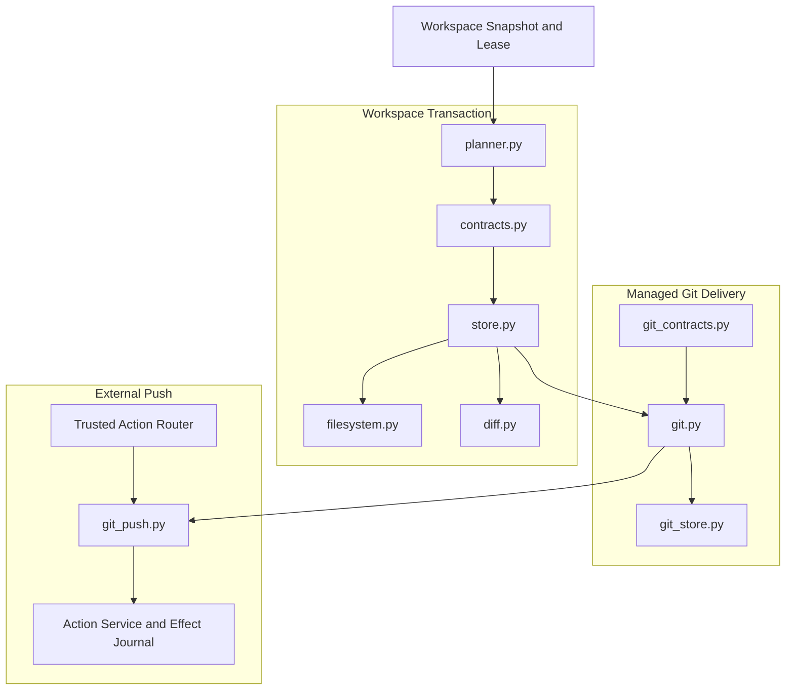

Workspace Transaction合同和Blob是两个本地交付分支的共同输入。普通目录Runtime直接消费Plan和Blob；Git
Runtime把同一Mutation集合转换为Git Tree。Git Push不消费Transaction Record状态，而消费已经存在的本地
Branch/OID与Repository Binding，并通过独立Route执行。

## 8. 总体数据与控制流程

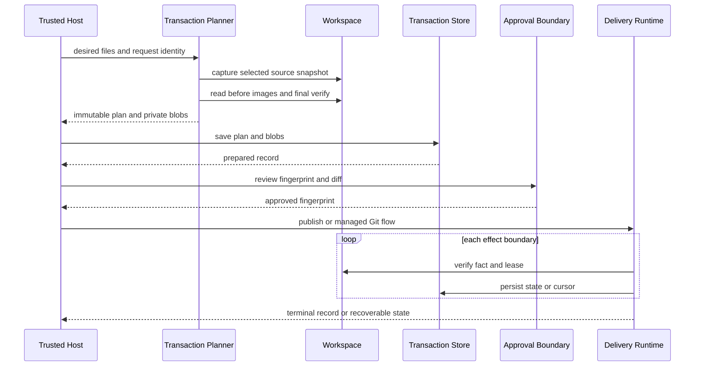

Planner返回的`PreparedWorkspaceTransaction.blobs`仍位于内存；只有`store.save`成功后才具有持久恢复基础。
本地批准机制不属于Delivery Store，调用方必须先将Plan/Diff送入正式审批系统，再把相同Fingerprint传给
Runtime。默认POSIX产品已用Workspace Patch完成文件事务的这条装配；Git交付仍未进入默认产品。

## 9. Workspace文件与Mutation合同

所有Delivery合同继承`DeliveryContract`，使用`extra="forbid"`、`frozen=True`、`strict=True`和
`allow_inf_nan=False`。

### 9.1 WorkspaceFileVersion

| 字段 | 类型/限制 | 语义 |
|---|---|---|
| `presence` | `absent/file` | 只支持缺失或普通文件 |
| `sha256` | 文件必填 | 完整正文SHA-256 |
| `size` | 0～8 MiB | 完整正文大小 |
| `mode` | `0644/0755` | 缺失为空；Windows规划的现存文件统一投影为0644 |

`absent`必须同时满足摘要为空、大小为0、模式为空；`file`必须同时提供摘要和模式。

### 9.2 WorkspaceMutation

| 字段 | 语义 | 不变量 |
|---|---|---|
| `path` | 1～4096字符逻辑路径 | Plan校验时再按Snapshot平台规范化 |
| `before` | 规划时来源版本 | 发布和对账的旧值条件 |
| `after` | 批准后的目标版本 | 最终效果证明 |

`before == after`被拒绝。新增、修改、删除分别是`absent→file`、`file→file`、`file→absent`。重命名不是
执行原语，而是Diff层对“相同版本的一删一增”的展示推断；普通发布仍执行两个独立Mutation。

## 10. WorkspaceTransactionPlan合同

| 字段 | 类型/来源 | 语义与约束 |
|---|---|---|
| `transaction_id` | UUID | Transaction稳定身份 |
| `request_id` | 1～128字符 | Store级幂等键；当前允许纯空白 |
| `source` | `WorkspaceSnapshot` | Root、cwd、父目录和目标文件来源事实 |
| `mutations` | 1～256个 | 按平台Path Key排序且唯一 |
| `created_at` | 含时区时间 | 规划事实，不参与运行时Clock控制 |
| `fingerprint` | SHA-256 | 除自身外完整Plan的规范摘要 |

Plan拒绝根路径`.`、平台语义重复路径、未排序Mutation、镜像合计超过32 MiB以及任何组件为
`.agents/.codex/.git/.gitattributes/.gitmodules/.harnessix/.lfsconfig`或以`.env`开头的路径。

Transaction Fingerprint同时绑定Snapshot、Request ID、Mutation、时间和ID。它是批准对象身份，不是“批准
已经发生”的证明；Delivery Runtime当前只做字符串相等检查。

## 11. Transaction Planner

### 11.1 输入规范化

`prepare_workspace_transaction`要求非空Desired Mapping、1～128字符Request ID和含时区时间。每个
`DesiredWorkspaceFile`只允许：

- `content=None, mode=None`表示删除；
- 精确`bytes`与`0644/0755`表示创建或替换。

路径经过Workspace逻辑路径规范化、平台比较去重和控制面拒绝。Planner不创建父目录，因此目标的所有父
目录都必须已经存在且可安全观察。

### 11.2 Snapshot资源集合

对每个目标，Planner加入：

1. 目标路径的`write` Observation；
2. 根`.`和每一级父目录的`read` Observation；
3. Workspace Snapshot自动要求的cwd `read` Observation。

父目录选择可以发现规划到执行之间的目录成员或对象变化，但也意味着深路径会快速消耗Snapshot 256资源
上限。Mutation上限为256，不代表任意256个深路径都能成功规划。

### 11.3 Before/After与最终复核

对现存普通文件，Planner使用安全Workspace端口再次读取完整正文和模式，并与Snapshot中的内容摘要/大小
交叉核对；对缺失目标生成`absent`。before和after正文都进入按SHA-256去重的内存Blob Mapping。所有
Mutation构造完成后再次执行完整Snapshot验证，防止规划窗口内来源漂移。

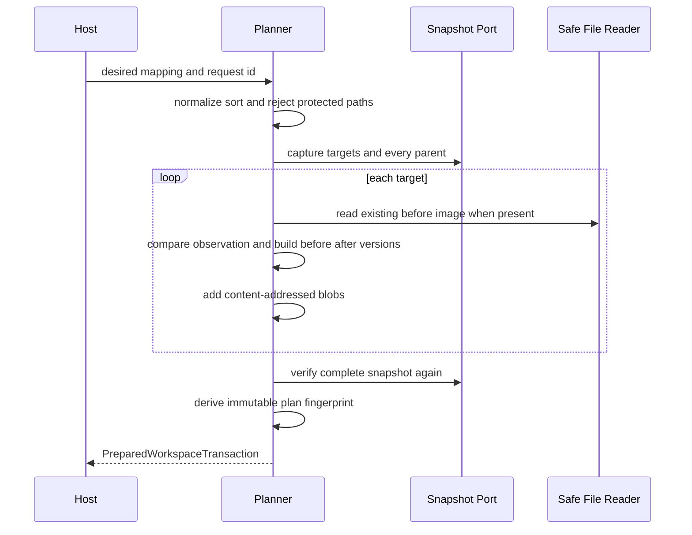

### 11.4 当前输入错误边界

部分类型错误和最终Pydantic合同错误没有统一映射为`KernelError`。例如非Mapping、错误Target对象、某些
时间边界或父目录使Snapshot资源数超限时，调用者可能收到Python/Pydantic异常或Workspace错误。产品协议
接线前需要统一错误投影。

## 12. 私有Blob与Workspace Transaction Store

### 12.1 Blob耐久写

`SQLiteWorkspaceTransactionStore.save`先按Digest排序保存全部Blob，再写Transaction记录。Blob文件名为
64位小写SHA-256，单个不超过8 MiB。新Blob写入流程为：

1. 在私有`blobs/`创建唯一临时文件；
2. 分块写入并`fsync`文件；
3. `os.replace`到Digest目标；
4. POSIX上`fsync`Blob目录；
5. 重新以`O_NOFOLLOW`读取并校验类型、Owner、0600、大小和摘要。

已存在Blob必须重新读取并与正文相等。Blob正文不进入Plan JSON，但Store保存完整用户代码，必须按高敏感
源码数据保护。

### 12.2 SQLite Schema

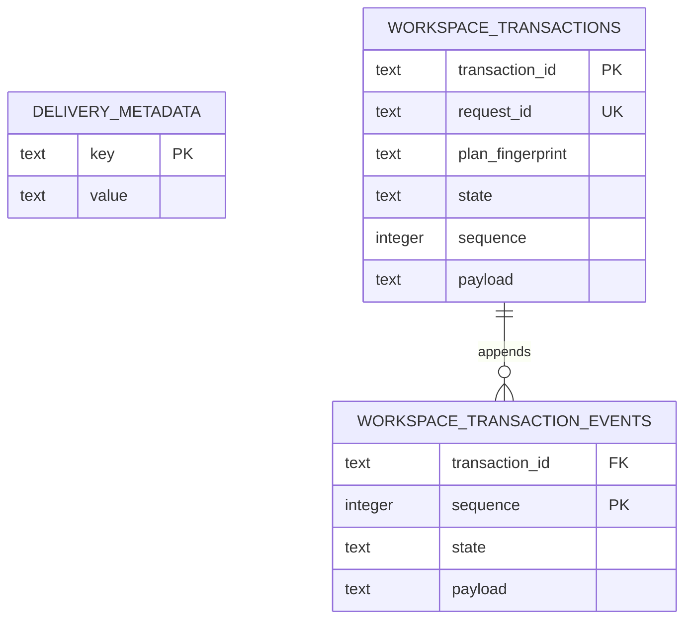

Schema版本固定为`1`；数据库启用Foreign Key、WAL、`synchronous=FULL`和5秒busy timeout。POSIX私有目录、
Blob目录和数据库分别校验0700/0700/0600。Windows没有模块内DACL配置。

### 12.3 Save与CAS Transition

- `request_id`唯一；相同Request只有Transaction ID和完整Plan都相等时返回现有当前记录；
- 初始Record和sequence 0事件在`BEGIN IMMEDIATE`中原子插入；
- Transition要求完整当前Payload、State和Sequence与数据库一致；
- Updated Record必须保持Plan，Sequence恰好加一，Cursor不回退且State边合法；
- 当前投影和新事件在一个SQLite事务中提交。

Blob保存早于记录事务；数据库写失败可能留下未引用Blob。当前没有引用计数或GC。

### 12.4 持久完整性边界

加载时Store校验Pydantic合同、冗余列、当前Sequence事件和事件总数`sequence + 1`。事件没有前序Hash或
签名，加载也不重放检查每个历史Payload与状态边。因此它能发现常见损坏和缺事件，但不是防同UID篡改的
不可变审计链。

## 13. WorkspaceTransactionRecord状态机

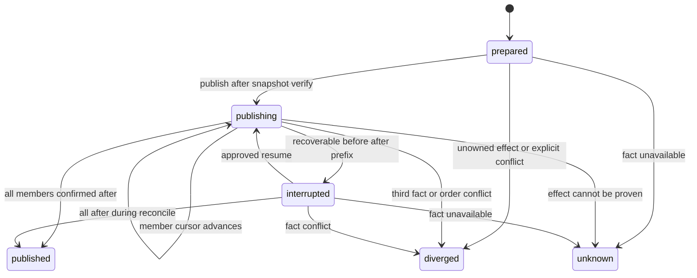

| 状态 | Cursor/时间要求 | 可继续性 |
|---|---|---|
| `prepared` | sequence=0、cursor=0、无started | 可首次执行 |
| `publishing` | sequence>0、有started、无finished | 必须先对账再继续 |
| `interrupted` | 同上 | before/after有序前缀已证明，可恢复 |
| `published` | cursor=Mutation数、有started/finished | 终态，表示历史发布完成 |
| `diverged` | 有started/finished | 终态，事实已偏离可恢复集合 |
| `unknown` | 有started/finished | 终态，效果无法可靠证明 |

`published/diverged/unknown`不可迁出。`published`后的`publish/reconcile`直接返回历史Record，不重新证明
当前文件仍保持after；后续用户修改不会改写已经完成的历史事实。

## 14. POSIX普通Workspace发布

`WorkspaceTransactionRuntime.publish`的入口顺序为：

1. 加载Transaction并比较Approval Fingerprint；
2. 要求Plan平台和宿主都是POSIX；
3. 已发布直接返回，风险终态拒绝；
4. 校验Lease Workspace ID并调用`assert_current`；
5. `prepared`时完整验证Snapshot，再进入`publishing`；
6. 非prepared时先`reconcile`，仅`interrupted`可恢复；
7. 对Cursor之后的每个Mutation重新校验Lease和当前File Version；
8. 当前为after则只推进Cursor；当前不是before则终结为diverged；
9. 当前为before时调用安全父目录端口执行删除或同目录临时文件替换；
10. 提交后观察after并推进Cursor；全部完成后进入published。

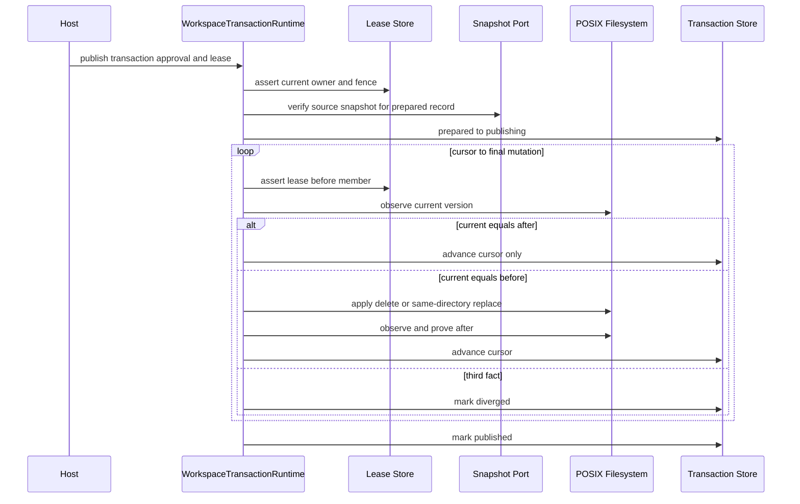

### 14.1 安全父目录定位

`_parent`复用`tools.workspace.Workspace`：从保留Root FD逐段`lstat/openat`，拒绝链接、跨设备、非目录和
身份变化，并在作用域结束时复核Root与父目录链。目标只允许普通单链接文件或缺失。

### 14.2 创建与替换

新正文从Blob Store读取，在目标同目录创建唯一0600临时普通文件，完整写入、`fchmod`为0644/0755并
`fsync`。第二次观察目标仍等于before后，使用`os.replace`提交，再`fsync`父目录。删除在before复核后
使用`unlink`并`fsync`父目录。

### 14.3 精确竞态边界

当前实现是“提交前乐观检查”，不是内核原子Compare-And-Swap。第二次`_observe_at`与`os.replace`或
`unlink`之间仍存在窗口：外部非协议写者若在该窗口替换目标，Delivery可能覆盖或删除新对象，且最终after
观察无法证明被覆盖的中间事实。Workspace Lease只能协调遵守同一协议的写者。该缺口必须在生产默认写链
开放前通过平台原子能力、FD绑定提交或受管Git Worktree策略闭环。

## 15. 普通Workspace对账与恢复

`reconcile`一次观察所有Mutation路径，并分类为before、after或第三事实：

| 当前事实 | Record状态 | 结果 |
|---|---|---|
| 全部after | `prepared` | `diverged/delivery_unowned_effect`，拒绝认领无账本效果 |
| 全部after | 其他非终态 | `published` |
| 全部before | `prepared` | 保持prepared |
| 全部before | `publishing` | `interrupted`，cursor=0 |
| after为严格前缀、before为剩余后缀 | `publishing` | `interrupted`，cursor=前缀长度 |
| 与现有`interrupted.cursor`一致 | `interrupted` | 原Record不变 |
| before/after顺序交错 | 任意非终态 | `diverged/delivery_order_diverged` |
| 任一路径为第三版本 | 任意非终态 | `diverged/delivery_source_changed` |
| 观察本身失败 | 任意 | 抛稳定错误；当前并不总是落盘为unknown |

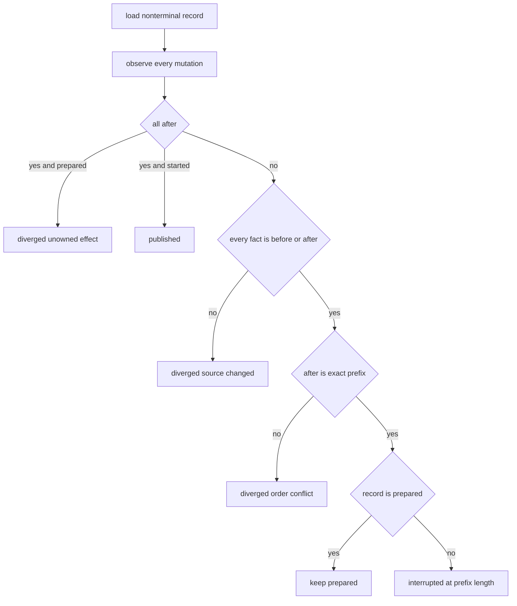

发布阶段的`KernelError`会触发一次对账；如果对账证明全部完成则返回published，否则保留对账结论并重新
抛出原错误。非`KernelError`和进程硬退出依靠重启后的显式`reconcile`。

## 16. Rollback语义

`build_rollback`只接受`published`原Transaction。它从私有Blob取回每个原before正文，以当前Workspace为
新来源重新调用Planner，生成新Request ID、新Transaction ID、新Snapshot和新Fingerprint。原Record保持
published且不可变。

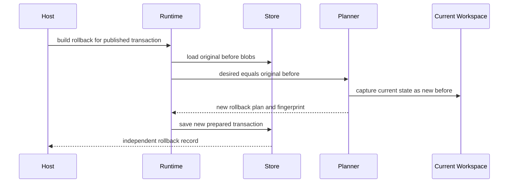

当前实现不会要求Workspace仍等于原Transaction的after。若用户已经写入第三内容，Rollback规划会把该
第三内容捕获为新before，并生成“第三内容→原before”的新变更，等待新批准；它不会在`build_rollback`
阶段自动冲突。这与[ADR 0068](../adr/0068-transactional-workspace-and-git-delivery.md)中“第三内容使Rollback
冲突”的文字并不完全一致，需明确产品选择：拒绝第三内容，或保留当前“展示新Diff后重新批准”语义。

## 17. Diff生成

`build_workspace_diff`从Plan和Blob Store生成`WorkspaceDiffDocument`：

- 一删一增且完整`WorkspaceFileVersion`相同，且只有一个候选时推断为`renamed`；
- NUL或非法UTF-8任一出现即视为二进制；
- 文本使用`difflib.unified_diff`生成完整Patch；
- 模式变化单独写`new/deleted/old/new file mode`；
- 二进制文本段只写before/after摘要，结构化Entry仍含完整大小与模式；
- Entry按原路径/目标路径排序；正文记录UTF-8字节数和SHA-256；
- 文档正文上限64 MiB，不做分页或模型视图裁剪。

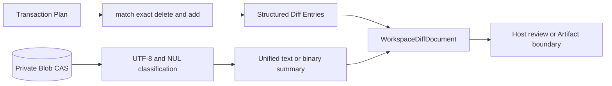

模块本身只返回包含完整正文的内存对象，不自动写入Artifact Store，也不生成有界模型视图。调用者必须在
审批UI、协议和日志边界避免直接暴露超大或敏感Diff。多个相同内容新增会使重命名推断保持保守，不选择
歧义候选。重命名展示不改变执行时的两个Mutation及其中断语义。

## 18. 固定Git Runner与Repository Binding

### 18.1 Git Runner

`_GitRunner`要求Git可执行文件为绝对、可执行普通文件，并记录路径、dev/inode、大小、mtime/ctime和模式
摘要；每次命令前重新核对。固定全局参数关闭Pager、Optional Lock、颜色、Hook、Fsmonitor、外部
Attributes和AutoCRLF，并设置私有HOME、TMP与空Hook目录。

环境从空白Allowlist构造，不继承仓库选择变量、用户Git配置、交互Prompt或凭据环境。允许协议只能是
排序唯一的`file/https/ssh`子集。命令使用`subprocess.run`固定argv，不经Shell；默认20秒、Remote读取
60秒、Push 120秒，stdout/stderr各最多1 MiB。

### 18.2 GitRepositoryBinding字段

| 字段组 | 当前绑定事实 |
|---|---|
| Workspace | platform、workspace_id、Root路径摘要与对象身份 |
| Git根 | 精确Repository Root、Common Directory路径摘要与对象身份 |
| 基准 | HEAD Commit OID、HEAD Tree OID、SHA-1/SHA-256对象格式 |
| 工作区 | 含Untracked的Porcelain v2状态摘要；绑定时必须为空 |
| 配置 | 包含Origin的完整有效Config输出摘要 |
| 执行实现 | Git可执行文件身份、Git版本、Delivery实现摘要 |
| 完整性 | 全合同Digest |

`bind_repository`要求传入绝对精确Top-level Root，拒绝脏状态和Object Alternates。当前
`git_delivery_implementation_digest`只Hash `git.py/git_contracts.py/git_store.py`，不覆盖Planner、
Workspace Store、Push实现或依赖库版本；相关变化仍可能需要显式合同版本升级。

### 18.3 危险仓库配置拒绝

- Local `include/includeIf`；
- `filter.*.clean/smudge/process`；
- `core.sparseCheckout=true`；
- Object Alternates；
- Git Tree中的Submodule、`.gitmodules`和`.lfsconfig`；
- `.gitattributes`正文中的Filter或`working-tree-encoding`。

此策略是保守能力收缩，不代表可安全执行任意Git仓库功能。

## 19. Managed Git Worktree合同与状态

### 19.1 ManagedGitWorktreePlan

| 字段 | 语义 |
|---|---|
| `worktree_id` | Worktree稳定UUID |
| `transaction_id/fingerprint` | 绑定Workspace Transaction与批准对象 |
| `repository` | 完整GitRepositoryBinding |
| `path` | 私有状态根下生成的绝对路径 |
| `created_at/fingerprint` | 创建时间与完整Plan摘要 |

合同只校验路径为对应平台绝对路径且无控制字符；“必须位于当前Git Store的`worktrees/`目录”由Runtime生成
路径保证，未编码为合同不变量。持久Plan包含宿主绝对路径，属于机器敏感数据。

### 19.2 Worktree Binding

Ready后绑定：

- Worktree目录对象身份；
- `.git`普通文件正文摘要；
- Admin Directory路径摘要与对象身份；
- `commondir`解析结果和`gitdir`回链摘要；
- Worktree HEAD Commit；
- Plan Fingerprint与完整Binding Digest。

### 19.3 状态机

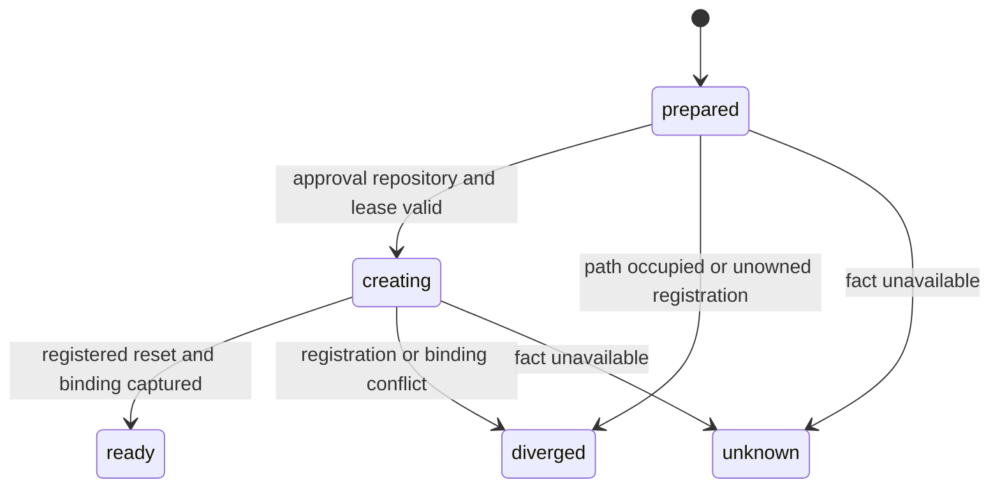

`ready/diverged/unknown`为终态。Ready记录保存Binding；风险终态必须无Binding并带Error Code。

## 20. Worktree创建与恢复

`plan_worktree`加载Transaction，绑定来源仓库，验证Transaction Snapshot，并在Git Store私有
`worktrees/<uuid>`下生成绝对路径。它当前不限制Transaction Record必须处于prepared状态，Git流程主要把
Transaction Plan和Blob当作只读交付输入。

`create_worktree`比较Transaction Plan Fingerprint，重绑来源仓库并校验Workspace Lease，然后：

1. `prepared → creating`先落账；
2. 要求目标路径不存在；
3. 固定执行`git worktree add --detach --no-checkout <path> <head>`；
4. 固定执行`git reset --hard --no-recurse-submodules <head>`；
5. 捕获`.git`、Admin、Backlink、Path和HEAD绑定；
6. `creating → ready`。

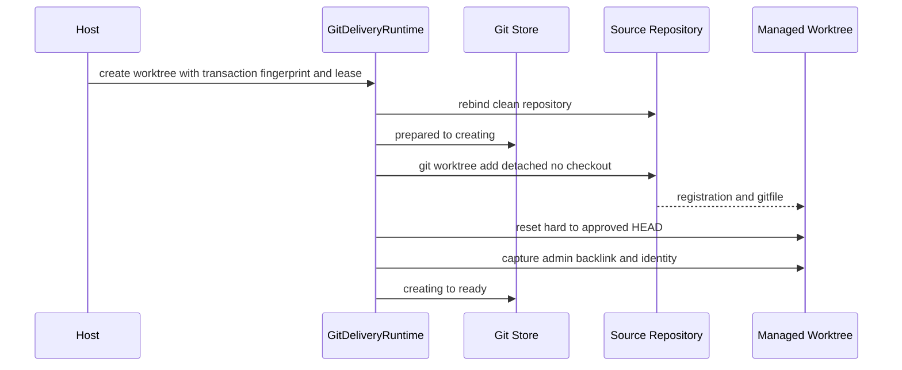

### 20.1 Reconcile

对非终态，`reconcile_worktree`比较目标路径是否存在和Git登记列表是否包含该绝对路径：

- 两者都不存在：保持当前Record；
- 只有一方存在：终结为diverged；
- 两者都存在且状态为creating：再次`reset --hard`并捕获Binding；
- 两者都存在但状态仍prepared：标记无账本效果diverged；
- Binding捕获失败：diverged；
- Ready状态：重新捕获并要求完全相等，否则抛`git_worktree_changed`。

`reconcile_worktree`没有Lease或Approval参数，但在`creating`状态下可能执行`reset --hard`。从
`create_worktree`内部进入对账前已完成授权；直接调用公开Reconcile则依赖宿主信任边界。生产API需要区分
只读对账与可修复恢复，或为后者重新要求Owner/Fencing。

### 20.2 当前清理边界

模块没有`remove_worktree/prune/gc`生命周期。Ready、Diverged、Unknown和测试失败留下的Worktree及Git
Admin记录需要外部运维处置；不能直接删除目录而忽略`git worktree remove/prune`的Common Directory状态。

## 21. Git Checkpoint

`create_checkpoint`要求Worktree为ready且Binding仍相等、来源Repository Binding仍相等、Transaction
Fingerprint仍匹配，并在开始时校验Workspace Lease。相同Worktree最多保存一个Checkpoint。

Checkpoint构建：

1. 在Git私有TMP创建独立`GIT_INDEX_FILE`；
2. `read-tree`载入批准时Base Tree；
3. 对每个Mutation用`ls-tree/cat-file`证明before与Base Tree一致；
4. 删除目标使用`update-index --force-remove`；
5. 新正文从私有Blob读取，以`hash-object -w --stdin`写入Git Object Store；
6. `update-index --cacheinfo`只加入计划路径；
7. `write-tree`生成目标Tree；
8. `diff-tree`证明Base到目标Tree只包含Mutation路径；
9. 在Managed Worktree执行`read-tree --reset -u <tree>`物化；
10. 核对Worktree Index Tree及每个目标文件正文/模式；
11. 保存不可变Checkpoint并删除临时Index。

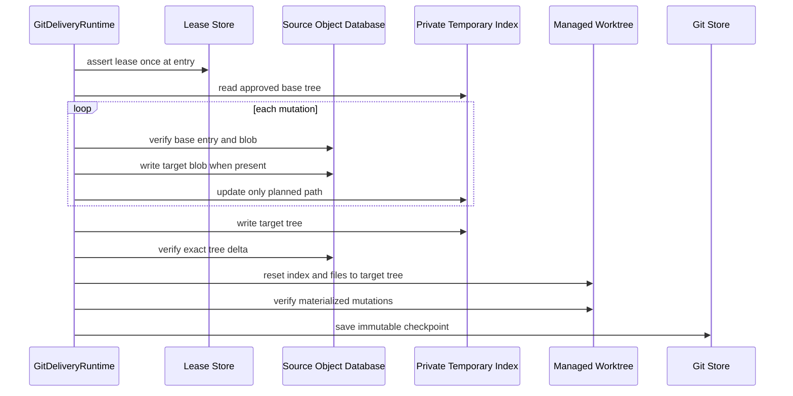

`GitCheckpoint`绑定Worktree Plan/Binding、Transaction Plan、Repository Binding、Base Commit/Tree、目标Tree、
Mutation摘要、时间和自身Digest。Checkpoint没有状态机：Git Blob/Tree或Worktree物化后、Checkpoint落盘前
崩溃时，重新调用会重建确定内容。临时Index删除为best effort。

当前Lease只在入口检查一次；多文件Hash、Index和Worktree物化期间Lease可能到期。操作还会向来源Common
Object Database写入不可达Blob/Tree。生产化需要按耗时阶段续租/复核，并明确对象垃圾回收策略。

## 22. 确定性Git Commit

### 22.1 GitCommitSpec

| 字段组 | 绑定事实 |
|---|---|
| 身份 | Commit UUID、Checkpoint |
| Ref | 新`refs/heads/...`、Parent OID、Tree OID |
| 作者 | Name、Email、含时区Authored At |
| 正文 | 末尾换行的Message、原始Commit正文SHA-256 |
| 安全 | `hooks_policy=disabled`、Implementation Digest |
| 结果 | Expected Commit OID、Spec Fingerprint |

`plan_commit`先让Git `check-ref-format`校验Branch，并要求Ref不存在；规范化Message末尾换行；使用固定Tree、
Parent、作者/提交者和时间生成原始Commit bytes；用不带`-w`的`hash-object -t commit --stdin`计算预期OID。
规划不创建Branch，也不写Commit对象。

### 22.2 Commit状态机

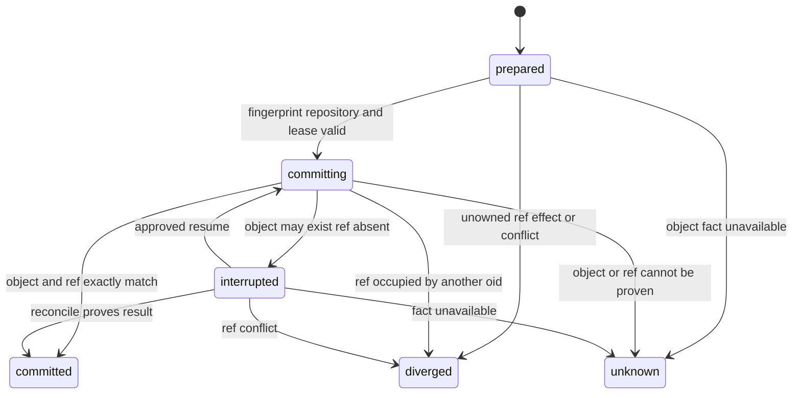

### 22.3 Commit执行

执行先比较Spec Fingerprint、Repository Binding和Workspace Lease。进入`committing`后：

1. 重建并核对原始Commit正文SHA-256；
2. 若预期OID对象不存在或正文不匹配，执行`hash-object -t commit -w --stdin`；
3. 读取目标Ref；不存在时再次校验Lease；
4. `update-ref --create-reflog ... <expected> <all-zero-old>`原子创建新Ref；
5. 再次核对Commit对象完整正文和Ref OID；
6. 进入`committed`并保存OID。

来源HEAD、Index和当前Branch均不移动。所有Commit Hook被固定Runner禁用。目标Branch在规划时和提交时均
要求不存在；`update-ref`零旧值条件防止并发创建覆盖。

### 22.4 Commit对账

| Ref事实 | Commit对象事实 | 结论 |
|---|---|---|
| Expected OID | 完整正文匹配 | 非prepared收敛committed；prepared标记unowned effect diverged |
| Ref不存在 | 对象匹配或不存在 | prepared保持；committing转interrupted；interrupted保持 |
| 其他OID | 任意 | diverged/git_ref_changed |
| Expected OID | 正文不匹配/不可证明 | unknown或`git_commit_changed` |

Commit对象写入是内容寻址幂等效果；Branch Ref更新是CAS效果。硬退出测试分别覆盖对象写入后和Ref更新后。

## 23. Git Delivery Store

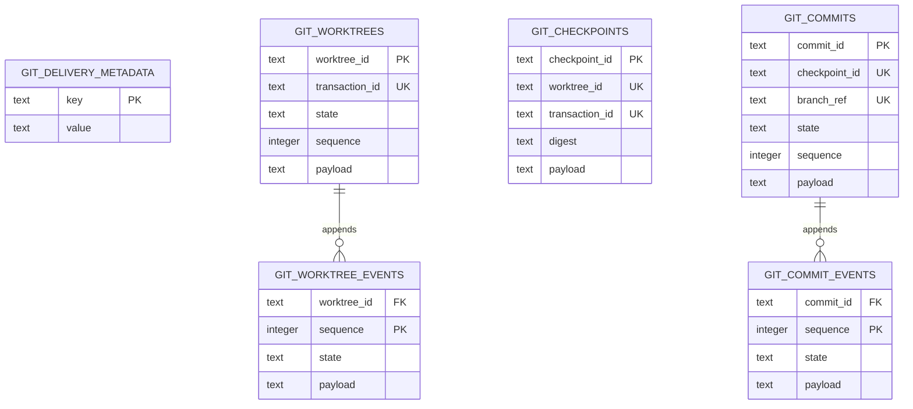

Git Store同样使用SQLite WAL、FULL、Foreign Key、5秒busy timeout和Schema v1；POSIX目录/DB收紧为0700/0600。
Worktree和Commit当前投影与事件在单个`BEGIN IMMEDIATE`事务内CAS推进。Checkpoint单行自动提交，并以
Worktree ID和Transaction ID双唯一保证幂等。

完整性边界与Transaction Store相同：加载校验合同、冗余列、当前事件和事件数量，不验证历史事件Hash链。
Git Store与Transaction Store是两个SQLite文件，与Lease DB也不共享事务。

## 24. Git Push合同与Remote规范化

### 24.1 Remote URL

`canonical_git_remote_url`最多接受4096 UTF-8字节，拒绝首尾空白、控制字符、Query、Fragment、URL密码和
不支持协议。支持：

- `https://host/path`，不允许User Info；
- `ssh://user@host/path`和受限SCP风格`user@host:path`；
- 显式`allow_file_remote=True`时的绝对本地路径或`file://localhost/...`。

Host经IDNA、小写、IPv4/IPv6规范化；Path先Percent Decode，拒绝空段、`.`、`..`、反斜线和控制字符，
再按稳定Safe集合编码。Intent只保存规范URL的SHA-256，不保存URL原文。

### 24.2 GitPushIntent

| 字段 | 语义 |
|---|---|
| `push_id` | Push稳定身份 |
| `repository_binding_digest` | 本地仓库完整绑定 |
| `remote_name/url_sha256` | 固定Remote名称与规范URL身份 |
| `local_ref/local_oid` | 只允许Branch Ref和计划本地OID |
| `remote_ref` | 单个目标Branch Ref |
| `expected_remote_oid` | 远端旧值；空表示必须不存在 |
| `force_mode` | `fast_forward_only/force_with_lease` |
| `idempotency_key/digest` | Action幂等身份与合同摘要 |

`prepare_intent`只核对本地Repository Binding、Local Ref和Remote配置，不连接远端。Expected Remote OID由
调用者提供；当前模块没有“经独立网络读取批准后生成Remote Observation”的正式端口，来源可信性依赖上层。

### 24.3 Tool合同

`git_push_tool_definition`注册`git.push`为High Risk、Non-idempotent Write、必须Approval、必须Idempotency、
支持Reconcile的Action Tool。Tool版本绑定Git Push实现Digest及Action Input/Receipt Schema。

## 25. Push统一Route与旁路防护

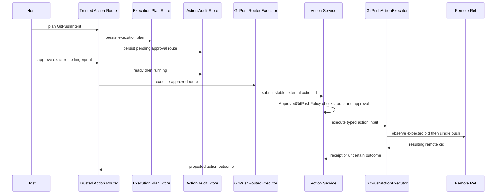

`GitPushRoutedExecutor`把Route Plan投影为稳定`external_action_id`的`ActionRequest`。Action参数额外绑定Route
Plan ID/Fingerprint和外部Action ID。`ApprovedGitPushPolicy`只有同时满足以下条件才允许：

- Route与Execution Plan一致且持久Approval有效；
- Route状态当前为`running`；
- Route Fingerprint、外部Action ID和Intent完整一致；
- Recovery Mode为`external_reconcile`；
- Tool确为`git.push`、效果为非幂等写并支持对账；
- Route Invocation、Action Request和Intent使用相同Idempotency Key。

因此直接调用Action Service、复用未批准Route或替换Intent会被拒绝。底层`_GitRunner`仍是受信进程内能力；
同进程恶意代码若直接持有它，不受该Policy保护。

## 26. Push执行、UNKNOWN与对账

### 26.1 执行前检查

1. 重绑本地仓库并要求等于Repository Binding；
2. 核对Remote名称和当前Push URL摘要；
3. 核对Local Ref仍指向Intent Local OID；
4. `ls-remote --refs`读取Remote Ref并要求等于Expected OID；
5. `fast_forward_only`且旧OID存在时，要求旧OID是Local OID祖先。

### 26.2 单次Push

两种Force Mode都使用显式
`--force-with-lease=<remote-ref>:<expected-or-zero>`和单一`local-ref:remote-ref` Refspec。区别是
`fast_forward_only`额外执行祖先检查；`force_with_lease`允许非快进，但仍要求旧OID精确匹配。固定
`--no-verify`禁用Pre-push Hook。

Push命令开始后，启动/等待异常、返回丢失或后续Remote读取失败都转为`UncertainEffectError`，由Action
Plane进入UNKNOWN。若命令返回后Remote为Local OID则成功并生成`GitPushReceipt/EffectReceipt`；命令失败且
Remote仍为Expected OID则确定失败；第三OID为Unknown。

### 26.3 Reconcile

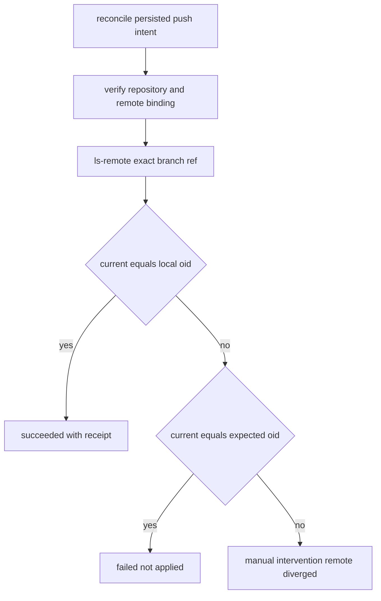

对账不再执行Push。Remote为目标OID收敛成功；仍为旧OID收敛失败；第三OID进入人工处置。网络读取失败保持
Unknown。Receipt保存Push ID、Remote名称/Ref/OID、URL摘要、观察时间和Digest，不保存Remote URL或凭据。

## 27. 跨Store一致性与事务边界

Delivery路径涉及最多六个独立事实域：

| 事实域 | 持久位置 | 原子范围 |
|---|---|---|
| Transaction Plan/Record/Event | `transactions.db` | 单SQLite事务 |
| before/after正文 | `blobs/<sha256>` | 单文件原子替换；先于Plan记录 |
| Workspace Owner/Fence | Lease DB | 单Lease行事务 |
| Worktree/Checkpoint/Commit | `git-delivery.db` | 单Git记录事务 |
| Git Object/Ref/Worktree | Git Common Directory与受管路径 | Git单命令或对象内容寻址语义 |
| Push Route/外部Action | Execution Plan、Action Audit、Effect Journal | 各Store独立事务 |

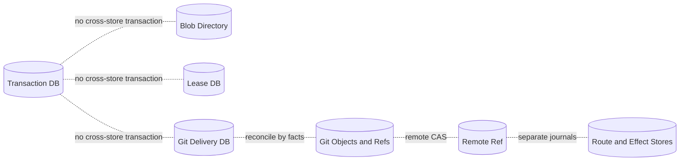

系统不使用分布式事务，而使用“先持久意图、再效果、再持久证明”和事实对账。当前Git流程读取Transaction
Plan/Blob但不推进Workspace Transaction Record，后者通常保持`prepared`；Git Worktree/Checkpoint/Commit
账本才是该分支的执行真相。调用者不能把两个Record状态混为同一生命周期。

任何跨Store写失败都可能留下不可达Plan、孤立Blob、已写Git对象或已完成远端效果。恢复必须从各自稳定ID
读取事实，不得删除证据或按异常重放外部效果。

## 28. 并发与竞态模型

| 竞态 | 当前控制 | 剩余边界 |
|---|---|---|
| 相同Request重复规划 | `request_id`唯一+完整Plan相等 | Blob可能先成为孤儿 |
| 两Owner推进同Transaction | 完整Payload/Sequence CAS | 无显式Transaction Owner Lease，使用Workspace Lease协作 |
| 用户在规划后改文件 | Snapshot执行前复核 | POSIX最终observe到replace/unlink仍有窗口 |
| Lease在多文件中途过期 | 每个普通FS成员前检查 | 成员提交内部和状态写后未再原子绑定Fence |
| 状态写在文件效果后失败 | before/after对账和Cursor | 观察失败可能未落unknown |
| 同名外部文件在提交窗口替换 | 二次observe | 非原子旧对象CAS，可覆盖并发新对象 |
| Worktree注册后进程退出 | creating状态+Git登记对账 | 无自动清理和Owner Lease |
| Checkpoint期间Lease过期 | 仅入口检查 | 长Checkpoint可越过有效期继续写对象/Worktree |
| Branch并发创建 | `update-ref`全零旧值CAS | Commit对象可能成为不可达垃圾 |
| Commit返回丢失 | OID正文+Ref对账 | Git命令超时后的子进程树边界有限 |
| Remote并发更新 | Expected OID+force-with-lease | Expected OID来源尚无正式观察合同 |
| Push响应丢失 | UNKNOWN后只读对账 | 网络长期不可用需人工/运维恢复 |
| 历史事件篡改 | 当前事件+计数+Payload Digest | 无全链Hash或签名 |

## 29. Timeout、取消与资源释放

| 组件 | Timeout | 取消 | 资源释放 |
|---|---|---|---|
| Planner/Snapshot | POSIX底层ReadOperation单次时限 | 无统一外部Token | Context Manager关闭FD/Handle |
| Transaction Store | SQLite busy 5秒 | 同步不可取消 | 显式close/context manager |
| POSIX Publish | 无整体Deadline | 同步不可取消 | FD与临时文件finally清理 |
| Diff | 无Deadline | 同步不可取消 | 内存对象 |
| Git本地命令 | 默认20秒 | 无协作Token | `subprocess.run`结束后回收直接子进程 |
| Git Remote读取 | 60秒 | 无协作Token | 同上 |
| Git Push | 120秒 | Async只把同步调用放入线程 | 线程内Git命令无法因Task取消安全中止 |
| Git Store | SQLite busy 5秒 | 同步不可取消 | 显式close/context manager |

Git命令没有独立Process Group/Job Object Owner合同，超时和Task取消不等同完整后代树清理。Push Async包装
使用`asyncio.to_thread`，上层取消Task时同步线程和Git命令可能继续执行。Trusted Action Router会把Route
记为unknown，但内层Action Service不捕获`CancelledError`，对应Effect Action可能保持running，直到启动恢复
或额外协调器将其转为可对账状态；直接Route Reconcile不能保证立即推进该内层Action。当前没有专项测试。

## 30. 错误分类与恢复建议

### 30.1 Transaction/Store

| 错误码 | 触发 | 恢复 |
|---|---|---|
| `delivery_plan_invalid/no_change/plan_limit` | 输入、无变化、大小不合法 | 修正意图并重新规划 |
| `delivery_path_denied/metadata_unsupported` | 控制路径、根/目录、模式不支持 | 缩小能力，不自动放宽 |
| `delivery_source_changed` | Snapshot或before事实漂移 | 丢弃旧批准，重新规划 |
| `delivery_request_conflict/transaction_conflict` | 幂等身份错绑 | 使用原Record或新Request ID |
| `delivery_store_version/store_corrupt` | 未知Schema或Payload/事件损坏 | 停止写入，恢复受信备份 |
| `delivery_blob_invalid/conflict/corrupt` | Blob摘要、类型、权限或正文错误 | 停止执行，修复私有Store |
| `delivery_transition_invalid/transaction_stale` | 非法状态边或并发推进 | 重载Record并对账 |
| `delivery_approval_mismatch` | 指纹不相等 | 返回审批层，不复用旧批准 |
| `workspace_lease_lost` | Owner/Fence/Expiry失效 | 停止效果，获取新Lease后对账 |
| `delivery_effect_unknown` | 提交后无法证明after | 不重放，人工/增强对账 |
| `delivery_platform_unsupported` | Windows普通目录发布 | 使用受管Git路径或等待原生端口 |

### 30.2 Git本地

| 错误族 | 语义 |
|---|---|
| `git_executable_* / git_process_failed / git_command_failed` | Git身份、启动、超时、返回码或输出上限 |
| `git_repository_* / git_binding_changed` | Root、Common Directory、HEAD、Status、Config或实现漂移 |
| `git_*_unsupported` | Filter、Attributes、Submodule、LFS、Sparse或Alternates被拒绝 |
| `git_worktree_*` | Path、登记、Binding、状态或对账冲突 |
| `git_checkpoint_*` | Base Tree、目标Tree、物化或持久身份不一致 |
| `git_commit_* / git_ref_changed` | Commit合同、对象、Branch Ref、状态或批准不一致 |
| `git_delivery_store_*` | Git SQLite版本、损坏或私有目录失败 |

部分Git Runtime方法以终态Record返回`diverged/unknown`，部分路径抛`KernelError`；产品协议必须统一把终态和
异常投影为用户可理解、可恢复且不泄露宿主细节的结果。

### 30.3 Git Push

| 错误/结论 | 语义 | 后续 |
|---|---|---|
| `git_push_intent_invalid` | Ref、Remote、OID或幂等输入无效 | 重新构造Intent |
| `git_repository_changed/git_remote_changed/git_push_local_changed` | 本地批准事实漂移 | 新Plan和新批准 |
| `git_push_remote_changed` | 远端旧OID不符 | 刷新远端观察并重新审批 |
| `git_push_non_fast_forward` | 快进策略失败 | 不自动Force；显式新策略 |
| `git_push_rejected` | 命令失败且远端未变化 | 可按修正原因重新规划 |
| `git_push_uncertain`或`UncertainEffectError` | 调用后事实非预期/不可读 | 只Reconcile |
| `git_push_not_applied` | 对账证明仍为旧OID | 确定失败 |
| `git_push_remote_diverged` | 第三OID | 人工处置 |

## 31. 安全分析

### 31.1 已实现控制

- 严格、冻结、自摘要的Plan/Record/Binding/Checkpoint/Commit/Push合同；
- Workspace规范路径、父目录选择、链接/硬链接拒绝和来源Snapshot；
- 控制面、Secret路径和Git元数据写入拒绝；
- 私有Blob、文件权限、摘要重读和SQLite冗余列交叉校验；
- Workspace Lease与逐成员Fencing；
- POSIX Root FD和同目录耐久临时文件；
- Git可执行文件身份、固定argv、空白环境Allowlist和协议Allowlist；
- 干净Repository、无Hook/Filter/外部Config/Submodule/LFS/Sparse/Alternates；
- 确定性Commit正文与新Branch Ref零旧值CAS；
- Remote URL去凭据、规范Host/Path和单Ref Force-With-Lease；
- Push必须通过统一Route、持久Approval和Action Plane；
- 非幂等远端效果不确定时进入UNKNOWN，只读对账。

### 31.2 当前安全缺口

| 风险 | 当前影响 | 处置方向 |
|---|---|---|
| POSIX目标检查到替换/删除非原子 | 外部写者可在极小窗口被覆盖 | 内核CAS能力、绑定FD提交或默认受管Worktree |
| 本地Runtime只比较Fingerprint | 持有Plan的受信代码可自报批准 | 产品统一接入Execution Approval Store/Trusted Route |
| Worktree创建未重验完整Workspace Snapshot | 非Git Binding覆盖的Snapshot变化可能不使批准失效 | 创建前调用Snapshot Verify并补漂移测试 |
| Reconcile Worktree可执行Reset但无Lease | 直接恢复入口可修改受管路径 | 拆只读Observe与Authorized Repair |
| Checkpoint仅入口校验Lease | 长操作可能越过Lease继续写 | 阶段复核/续租和可中断Owner |
| Worktree路径仅合同绝对、不绑定Store Root | 私有DB被重写后可指向其他绝对路径 | 合同加入State Root摘要与运行时Containment复核 |
| Managed Worktree不核对完整Status和计划外文件 | 同UID外部修改或未跟踪文件可能留在私有Worktree | 物化前后验证Index、Tracked和Untracked全量事实 |
| Event无Hash链/签名 | 同UID篡改历史不一定被发现 | 前序Hash、Checkpoint签名或受控远端审计 |
| 同UID宿主可改Store/Git对象 | 本地文件权限不抵御同UID恶意进程 | 进程隔离、独立Service身份和权限边界 |
| Public Push认证未实现 | 无法安全使用真实私有Remote | Secret Scope、SSH Known Hosts、Agent/Keychain适配 |
| Push取消时线程继续且内层Action可停在running | Route为unknown但Effect Action未立即进入可对账态 | 可取消Process Owner和跨账本取消恢复协调 |
| Remote旧OID来源未建合同 | 调用方可误用过期或未授权观察 | 独立Remote Read Action和Observation Fingerprint |
| 完整Diff/Commit数据误记录 | 源码、PII或Secret可泄露 | Artifact权限、脱敏、模型视图和日志Guard |

## 32. 数据、隐私与保留

| 数据 | 保存位置 | 敏感性 | 当前保护/缺口 |
|---|---|---|---|
| 逻辑路径、Snapshot摘要、Mutation | Transaction Payload | 项目结构敏感 | 私有DB；无字段加密/TTL |
| before/after完整正文 | Blob目录 | 高敏源码/可能含Secret | 0600+Hash；无加密、TTL、GC |
| 完整Diff正文 | 调用进程内存 | 高敏源码 | 不自动持久；调用者可能误日志 |
| Worktree绝对路径 | Git Plan Payload | 机器环境敏感 | 私有DB；无路径Token化 |
| Commit作者/邮箱/消息 | Git Commit Spec/DB与Git对象 | PII/业务内容 | 无脱敏；属于交付必要数据 |
| Repository/Remote路径 | 仅摘要进入Binding/Intent | 可离线枚举 | SHA-256不等同匿名化 |
| Remote URL凭据 | 明确拒绝 | Secret | 不进入合同/argv |
| Push OID/Ref | Intent、Receipt、Audit | 项目元数据 | 私有Store；Metric不得作高基数Label |

Store没有Retention、Secure Delete、Backup、Export或Key Rotation。Blob以内容Hash去重意味着相同正文跨
Transaction共享文件；删除一个Transaction时不能直接删除其Blob。正式多用户部署必须按Tenant/Workspace
隔离状态根，并建立引用扫描、保留策略和加密边界。

## 33. 可观测性

Delivery包当前没有直接统一Trace或Metric。可诊断事实主要来自持久Record、Error Code、Cursor、Fingerprint、
Git OID和Action Audit。

| 阶段 | 建议低基数信号 | 禁止默认记录 |
|---|---|---|
| Plan | 目标数、before/after字节Bucket、平台、耗时、错误码 | 路径、正文、Diff |
| Blob | 命中/新增数、写入字节Bucket、校验失败 | Digest作为Metric Label、正文 |
| Publish | State、Cursor Bucket、恢复次数、Lease Lost、耗时 | 文件名、绝对Root |
| Git | 命令类别、返回类别、超时、Worktree/Commit状态 | argv中的路径/Ref全文、stderr原文 |
| Push | Force Mode、协议、结果类别、UNKNOWN/对账次数 | Remote URL、Host、Ref、OID、凭据 |
| Store | CAS冲突、Corrupt、Busy、Schema版本 | Payload正文 |

Trace可在受限属性中记录Transaction/Plan/Route ID，但Metric Label保持低基数。Git stderr可能包含Remote URL、
用户名或服务器信息，当前Runtime只返回固定中文错误而不暴露stderr，这一边界应保持。

## 34. 重点类与生命周期

| 符号 | 职责 | 生命周期 | 并发/资源边界 |
|---|---|---|---|
| `DesiredWorkspaceFile` | 内存目标正文 | 单次规划 | 正文`repr=False`，仍在内存 |
| `PreparedWorkspaceTransaction` | Plan+Blob Mapping | Save前短生命周期 | Mapping只读，正文未耐久前不可恢复 |
| `WorkspaceTransactionPlan` | 不可变批准对象 | 长期持久 | 可跨进程JSON传递 |
| `WorkspaceTransactionRecord` | 当前执行投影 | CAS状态机 | Sequence防并发推进 |
| `SQLiteWorkspaceTransactionStore` | Plan/Event/Blob持久化 | 长期连接，必须close | 多进程靠SQLite；同实例未声明线程安全 |
| `WorkspaceTransactionRuntime` | POSIX发布与Rollback | 宿主装配生命周期 | 无内部Owner线程或取消Token |
| `WorkspaceDiffDocument` | 完整Diff | 短生命周期/可外置Artifact | 最多64 MiB UTF-8 |
| `_GitRunner` | 固定Git子进程能力 | Git/Push Runtime生命周期 | 身份每次复核；无进程树Owner |
| `GitDeliveryRuntime` | Repo/Worktree/Checkpoint/Commit | 宿主装配生命周期 | Store和Lease由外部关闭 |
| `SQLiteGitDeliveryStore` | Git阶段账本 | 长期连接，必须close | 两类事件CAS、Checkpoint唯一 |
| `GitPushActionExecutor` | 单Ref外部写与对账 | Tool注册生命周期 | Async通过线程调用同步Git |
| `ApprovedGitPushPolicy` | 阻断Action Service旁路 | Action Service生命周期 | 每次读取Route/Plan/Approval |
| `GitPushRoutedExecutor` | Route到Action投影 | Trusted Action生命周期 | 稳定External Action ID |

## 35. 公共接口合同

| 接口 | 前置/后置 | 幂等与顺序 | Timeout/取消 | 权限边界 |
|---|---|---|---|---|
| `prepare_workspace_transaction` | 安全Root、目标、Request；返回Plan+Blob | 稳定输入可确定内容，但默认ID/时间随机 | 无统一取消 | 受信Planner |
| `TransactionStore.save` | Blob完整；返回prepared或现有当前Record | Request ID幂等 | SQLite 5秒 | 私有状态根 |
| `TransactionStore.transition` | 相邻合法Record | 完整Payload CAS | 同步 | Runtime专用 |
| `build_workspace_diff` | Plan Blob均存在 | 纯读取确定性输出 | 无Deadline | 完整源码读取 |
| `WorkspaceTransactionRuntime.publish` | 指纹、Lease、POSIX Root | Published重复返回；中断先对账 | 无整体取消 | 必须由已批准宿主调用 |
| `reconcile` | Transaction ID和Root | 事实收敛，不回退Cursor | 无 | 当前可推进Record |
| `build_rollback` | 原Record published | 总是新Plan/新批准 | 无 | 不应自动执行 |
| `bind_repository` | 绝对精确干净Git Root | 同事实确定Binding | 每命令20秒 | 固定Git能力 |
| `plan/create/reconcile_worktree` | Transaction、Binding、指纹、Lease | Store ID幂等；Reconcile可能修复 | 命令20秒 | 私有Worktree Root |
| `create_checkpoint` | Ready Worktree、Lease | Worktree唯一Checkpoint | 多命令无总Deadline | 写Git对象和Managed Worktree |
| `plan_commit` | Checkpoint、新Branch和作者信息 | Commit正文确定 | 多命令 | 只读计算OID |
| `commit/reconcile_commit` | Spec指纹、Binding、Lease | 对象内容寻址+Ref CAS | 多命令 | 创建本地Branch |
| `prepare_intent` | Local Ref、Remote配置和旧OID | 构造不可变Intent | 本地命令 | 不连接Remote |
| `GitPushActionExecutor.execute` | 已由Action Policy允许 | 单次Remote CAS | Push 120秒；取消不完善 | 外部网络写 |
| `GitPushActionExecutor.reconcile` | 持久Intent | 只读Remote事实 | 60秒 | 外部网络读 |

## 36. 核心业务逻辑伪代码

### 36.1 Transaction规划

```text
prepare(root, desired, request, platform):
    validate request and desired file contracts
    normalize and platform-sort target paths
    reject root, duplicates and protected components
    build write target plus read parent resource set
    snapshot = capture selected workspace facts
    for each target:
        derive before from safe current read or absent
        derive after from desired content or absent
        reject no-op and store both bodies by sha256
    verify snapshot again
    derive immutable plan fingerprint
    return plan plus private blob mapping
```

### 36.2 POSIX逐成员发布

```text
publish(transaction, root, approval, lease):
    load record and require exact plan fingerprint
    require POSIX and current workspace lease
    if prepared:
        verify full source snapshot
        persist publishing cursor zero
    else:
        reconcile filesystem facts
        continue only from interrupted
    for each mutation after cursor:
        assert lease
        current = safely observe target
        if current equals after:
            persist next cursor
            continue
        if current differs from before:
            persist diverged and stop
        safely write temp plus fsync then replace, or unlink
        if current target cannot be proven after:
            persist unknown and stop
        persist next cursor
    persist published
```

### 36.3 Git Checkpoint与Commit

```text
checkpoint(ready_worktree, transaction, lease):
    verify worktree binding, repository binding and lease
    load base tree into private index
    for each mutation:
        prove before equals base tree entry
        write target blob and update only that index path
    write tree and prove exact changed-path set
    materialize tree into managed worktree
    verify index tree and planned after images
    persist immutable checkpoint

commit(checkpoint, spec, approval, lease):
    verify spec fingerprint, repository and lease
    persist committing
    reconstruct exact raw commit bytes
    write content-addressed commit object when absent
    assert lease again before ref effect
    create new branch ref with all-zero expected old oid
    prove object body and ref
    persist committed
```

### 36.4 Push与对账

```text
push(intent):
    verify repository, remote url digest and local ref oid
    remote_before = ls_remote(exact remote branch)
    require remote_before equals approved expected oid
    if fast_forward and old exists: require old is ancestor of local
    invoke exactly one push with force-with-lease old oid
    after = ls_remote(exact remote branch)
    if after equals local: return success receipt
    if command rejected and after equals old: return failed
    otherwise return unknown

reconcile_push(intent):
    current = ls_remote(exact remote branch)
    if current equals local: succeeded
    else if current equals expected: failed not applied
    else: manual intervention
```

## 37. 源码与测试映射

| 设计元素 | 源码 | 关键符号 | 测试 | 测试符号/证明 |
|---|---|---|---|---|
| 多文件Plan和Blob | [`planner.py`](../../src/harnessix/delivery/planner.py) | `prepare_workspace_transaction` | [`test_planner.py`](../../tests/delivery/test_planner.py) | `test_prepares_complete_multi_file_plan_and_private_blob_set` |
| 控制路径拒绝 | 同上 | `_protected` | 同上 | `test_planner_rejects_control_plane_and_secret_paths` |
| 规划最终复核 | 同上 | `verify_workspace_snapshot` | 同上 | `test_planner_detects_source_change_during_final_recheck` |
| Blob/Event/CAS | [`store.py`](../../src/harnessix/delivery/store.py) | `SQLiteWorkspaceTransactionStore.save`、`SQLiteWorkspaceTransactionStore.transition`、`SQLiteWorkspaceTransactionStore.blob` | [`test_store.py`](../../tests/delivery/test_store.py) | `test_store_persists_blobs_events_and_progressed_idempotency` |
| Store损坏关闭 | 同上 | `SQLiteWorkspaceTransactionStore._decode`、`SQLiteWorkspaceTransactionStore._initialize` | 同上 | `test_store_rejects_request_conflict_and_blob_tampering`、`test_store_fails_closed_on_unknown_version_and_payload_corruption` |
| 完整Diff | [`diff.py`](../../src/harnessix/delivery/diff.py) | `build_workspace_diff` | [`test_diff.py`](../../tests/delivery/test_diff.py) | `test_diff_covers_text_binary_mode_and_exact_rename` |
| POSIX发布 | [`filesystem.py`](../../src/harnessix/delivery/filesystem.py) | `WorkspaceTransactionRuntime.publish` | [`test_filesystem.py`](../../tests/delivery/test_filesystem.py) | `test_publish_create_modify_delete_and_idempotent_result` |
| Snapshot漂移 | 同上 | `verify_workspace_snapshot` | 同上 | `test_source_drift_before_first_effect_preserves_workspace` |
| 效果后崩溃恢复 | 同上 | `reconcile`、`_fault` | 同上 | `test_reconcile_effect_after_crash_and_resume_remaining_members`、`test_real_process_exit_after_replace_reconciles_without_repeating_effect` |
| 顺序/第三事实 | 同上 | `reconcile` | 同上 | `test_reconcile_rejects_unowned_or_out_of_order_effects` |
| Lease中途过期 | 同上 | `_assert_lease` | 同上 | `test_expired_lease_stops_before_next_member_effect` |
| Rollback新事务 | 同上 | `build_rollback` | 同上 | `test_rollback_is_a_new_approved_transaction_and_preserves_original` |
| Approval/Fencing | 同上 | `WorkspaceTransactionRuntime.publish`、`WorkspaceTransactionRuntime._assert_lease` | 同上 | `test_approval_and_fencing_mismatch_fail_before_effect` |
| Repo/Worktree/Checkpoint/Commit | [`git.py`](../../src/harnessix/delivery/git.py) | `GitDeliveryRuntime` | [`test_git.py`](../../tests/delivery/test_git.py) | `test_managed_worktree_checkpoint_and_commit_preserve_source` |
| 危险Git配置 | 同上 | `_reject_unsafe_configuration` | 同上 | `test_dirty_repository_and_configured_filter_fail_closed`、`test_git_repository_control_planes_fail_closed` |
| Worktree注册恢复 | 同上 | `GitDeliveryRuntime.create_worktree`、`GitDeliveryRuntime.reconcile_worktree` | 同上 | `test_worktree_registration_crash_reconciles_and_source_drift_is_rejected` |
| Commit硬退出 | 同上 | `GitDeliveryRuntime.commit`、`GitDeliveryRuntime.reconcile_commit` | 同上 | `test_real_process_exit_reconciles_commit_without_duplicate` |
| Branch/Commit批准 | 同上 | `GitDeliveryRuntime.plan_commit`、`GitDeliveryRuntime.commit` | 同上 | `test_commit_approval_and_existing_branch_are_rejected` |
| Git Store损坏 | [`git_store.py`](../../src/harnessix/delivery/git_store.py) | `SQLiteGitDeliveryStore` | 同上 | `test_git_store_rejects_unknown_schema_and_corrupt_payload` |
| Push审批与单Ref | [`git_push.py`](../../src/harnessix/delivery/git_push.py) | `ApprovedGitPushPolicy`、`GitPushActionExecutor` | [`test_git_push.py`](../../tests/delivery/test_git_push.py) | `test_git_push_requires_route_approval_and_updates_one_remote_ref` |
| Push响应丢失 | 同上 | `GitPushActionExecutor._execute`、`GitPushActionExecutor._reconcile` | 同上 | `test_push_response_loss_reconciles_without_second_push` |
| Action旁路 | 同上 | `ApprovedGitPushPolicy._approved` | 同上 | `test_direct_action_service_push_bypass_is_denied` |
| Remote配置漂移 | 同上 | `GitPushActionExecutor._verify_binding`、`GitPushActionExecutor._remote_name` | 同上 | `test_remote_configuration_drift_after_approval_fails_closed` |
| URL/argv/输出边界 | 同上 | `canonical_git_remote_url`、`_decode_single_line` | 同上 | `test_remote_url_rejects_protocol_credentials_and_ambiguous_paths`、`test_prepare_intent_rejects_unsafe_command_fields_before_git_runs` |
| Push Schema | [`git_contracts.py`](../../src/harnessix/delivery/git_contracts.py) | `GitPushIntent`、`GitPushActionInput`、`GitPushReceipt` | [`test_schemas.py`](../../tests/trusted_actions/test_schemas.py) | `test_action_plane_public_schemas_match_generated_contracts` |

## 38. 测试设计与验证范围

### 38.1 定向回归

```bash
uv run pytest \
  tests/delivery \
  tests/workspace \
  tests/trusted_actions/test_router.py \
  tests/trusted_actions/test_schemas.py \
  tests/execution/test_plans.py \
  tests/integration/test_action_service.py
```

普通Filesystem测试在非POSIX平台Skip；Git测试要求本机存在Git。Push场景使用本地bare remote并显式开启
`file`协议，不发生公网访问、不验证凭据、TLS、SSH Host Key或企业代理。Windows CI能证明Git合同和受管
Worktree路径，不证明Windows普通目录发布。

### 38.2 当前测试缺口

- POSIX目标在最终observe与replace/unlink之间被外部替换的确定性竞态；
- Rollback面对原after之外第三内容的产品语义；
- Worktree创建前完整Workspace Snapshot漂移而Git Binding仍相等；
- 未授权直接`reconcile_worktree`触发`reset --hard`；
- Managed Worktree中计划外Tracked/Untracked内容和Index漂移的全量拒绝；
- Checkpoint期间Lease过期、被新Owner接管或SQLite不可用；
- 256 Mutation与父目录资源扩张后的稳定错误投影；
- Blob写成功但Transaction DB失败后的GC；
- Worktree、Admin记录、临时Index、不可达Git对象和终态记录清理；
- Store旧事件Payload篡改、Event State边伪造和Hash链；
- 磁盘满、fsync失败、WAL损坏、备份恢复和Schema Migration；
- 网络文件系统、APFS大小写模式、Linux多文件系统和Windows不同Git版本；
- Git LFS/Filter/Attributes拒绝的大小写、编码和复杂配置攻击；
- Push Task取消、内层Effect Action停在running、Git后代进程泄漏和120秒超时后UNKNOWN收敛；
- HTTPS/SSH真实Remote、认证轮换、Known Hosts、代理和限流；
- Force-With-Lease第三方并发更新和非快进多分支矩阵；
- Expected Remote OID受控观察与Approval绑定；
- Workspace Transaction、Diff、Worktree、Checkpoint和Commit Schema自动漂移测试；
- 默认产品从模型修改、Diff审批到本地Commit/Push的端到端场景。

## 39. Schema、版本与兼容

当前生成以下v1 Schema：

- [`workspace-file-version-v1`](../../spec/workspace-file-version-v1.schema.json)、
  [`workspace-mutation-v1`](../../spec/workspace-mutation-v1.schema.json)；
- [`workspace-transaction-plan-v1`](../../spec/workspace-transaction-plan-v1.schema.json)、
  [`workspace-transaction-record-v1`](../../spec/workspace-transaction-record-v1.schema.json)；
- [`workspace-diff-entry-v1`](../../spec/workspace-diff-entry-v1.schema.json)、
  [`workspace-diff-v1`](../../spec/workspace-diff-v1.schema.json)；
- [`git-repository-binding-v1`](../../spec/git-repository-binding-v1.schema.json)；
- [`managed-git-worktree-plan-v1`](../../spec/managed-git-worktree-plan-v1.schema.json)、
  [`managed-git-worktree-binding-v1`](../../spec/managed-git-worktree-binding-v1.schema.json)、
  [`managed-git-worktree-record-v1`](../../spec/managed-git-worktree-record-v1.schema.json)；
- [`git-checkpoint-v1`](../../spec/git-checkpoint-v1.schema.json)、
  [`git-commit-spec-v1`](../../spec/git-commit-spec-v1.schema.json)、
  [`git-commit-record-v1`](../../spec/git-commit-record-v1.schema.json)；
- [`git-push-intent-v1`](../../spec/git-push-intent-v1.schema.json)、
  [`git-push-action-input-v1`](../../spec/git-push-action-input-v1.schema.json)、
  [`git-push-receipt-v1`](../../spec/git-push-receipt-v1.schema.json)。

Schema由[`scripts/generate_specs.py`](../../scripts/generate_specs.py)生成。当前自动合同测试只逐字比较Git Push
三份Schema；其余Delivery Schema主要依赖人工运行生成脚本和Git Diff。SQLite Transaction/Git Store各自
只有Schema v1和拒绝未知版本，没有Migration路径。

任何字段、排序、摘要输入、状态边、Git命令、实现Digest文件集合或错误语义变化，都需要判断是否升级公共
Spec、SQLite Schema和Tool Version，不能只修改Python类型。

## 40. 部署与平台约束

### 40.1 状态目录

Workspace Transaction、Git Delivery、Lease、Execution Plan、Action Audit和Effect Journal应位于Workspace
之外的当前用户私有状态根。Git Managed Worktree也位于Git Store Root下，不能落入来源仓库，否则会使
来源Status变脏并扩大信任边界。当前构造器未统一检查所有目录互不包含，产品装配必须执行。

### 40.2 平台矩阵

| 能力 | macOS | Linux | Windows |
|---|---|---|---|
| Transaction规划 | POSIX端口 | POSIX端口 | Windows Handle端口 |
| 普通目录Publish | 支持 | 支持 | 明确拒绝 |
| Managed Worktree/Commit | 支持 | 支持 | 支持，依赖Windows Git |
| File Mode | 0644/0755 | 0644/0755 | Planner投影0644，Git模式由Tree语义控制 |
| 私有权限 | chmod 0700/0600 | chmod 0700/0600 | 依赖宿主ACL |
| Process隔离 | 无专用Owner | 无专用Owner | 无Job Object封装 |
| 公网Push | 未完成认证 | 未完成认证 | 未完成认证 |

### 40.3 Git兼容

实现避免依赖旧macOS Git不支持的`--path-format`、`--show-object-format`和`worktree list -z`。对象格式通过
OID长度识别SHA-1/SHA-256。Git二进制身份和版本进入Binding，但没有正式声明最低/最高Git版本矩阵。

## 41. 已知限制、风险与后续工作

| 优先级 | 缺口 | 当前影响 | 建议归属 |
|---|---|---|---|
| P0 | POSIX最终提交不是原子旧对象CAS | 可覆盖检查后出现的外部内容 | 0.9默认写链安全门禁 |
| P0 | Delivery未装配默认Agent/CLI/TUI | 用户无法从产品完成正式写入交付 | 0.9.1～0.9.3 |
| P0 | 本地Publish/Commit只比较Fingerprint参数 | 库本身不证明批准来源 | 统一Trusted Action接线 |
| P0 | Worktree创建未重验完整Snapshot | 部分批准事实漂移可能未失效 | Git执行前复核修复 |
| P0 | Push缺少公网Secret/Known Hosts边界 | 不能安全发布私有仓库 | 0.9.5 |
| P0 | Push取消/超时无完整进程Owner且内层Action可停在running | 用户取消后效果仍可能继续，Route与Effect账本暂时分叉 | Process/Sandbox统一Owner与取消恢复协调 |
| P1 | Checkpoint Lease只检查一次 | 长操作可能越过Fencing期限 | 阶段续租与复核 |
| P1 | Worktree Reconcile可写但不要求Lease | 恢复入口权限边界不清 | Observe/Repair拆分 |
| P1 | Rollback第三内容语义与ADR不一致 | 用户预期和实现可能冲突 | 设计决策+回归测试 |
| P1 | Store事件无Hash链且只验证当前事件 | 历史审计防篡改不足 | Ledger完整性升级 |
| P1 | 无Worktree/Blob/Git对象GC | 长期运行磁盘增长 | 0.9.5运维生命周期 |
| P1 | 无跨Store恢复协调器 | 运维需逐账本人工判断 | Recovery Coordinator |
| P1 | Diff无Artifact/模型视图接线 | 审批与模型上下文可能过大/泄漏 | Product UI与Artifact |
| P1 | Expected Remote OID无正式观察合同 | Push旧值来源不可追溯 | Remote Read Action |
| P2 | Implementation Digest覆盖不完整 | 依赖变化未必使旧Binding失效 | 能力版本规范 |
| P2 | Schema漂移门禁在Windows尚未执行 | Windows发布前可能遗漏平台相关生成差异 | 0.9.6关闭Evals POSIX依赖后纳入Windows |
| P2 | Request ID允许纯空白 | 诊断和幂等质量不足 | 输入合同收紧 |
| P2 | 错误异常/终态返回风格不统一 | 协议映射复杂 | 统一Delivery Result |

## 42. 生产化演进约束

1. 默认产品开放写工具前，必须闭环P0提交竞态、Approval来源和执行前Snapshot复核；
2. Windows普通目录写只有通过Handle-relative原生安全测试后才能声明支持，否则继续使用Managed Worktree；
3. 所有本地写入口必须从统一Execution/Trusted Action边界获得批准，不接受“知道Fingerprint即可执行”；
4. 任何Reconcile若可能写入或修复，必须重新验证Owner、Lease和权限；
5. Checkpoint、Commit和Push的每个不可逆边界都必须有稳定故障切点和真实进程退出测试；
6. Push认证只能通过短生命周期Secret Scope注入，不得进入URL、Intent、Plan、argv、日志或Receipt；
7. SSH必须显式管理Host Key和Agent/Key路径，HTTPS必须显式管理Token Header/AskPass能力；
8. Worktree、Blob、Git对象和终态Record清理必须以引用证明和保留策略驱动；
9. 跨Store协调不得伪装为ACID，应持久记录Saga身份并逐事实域对账；
10. Diff完整正文必须进入私有Artifact，审批UI和模型只消费有界、可验证视图；
11. Git命令升级必须重新验证旧Git、Windows Git、SHA-256仓库和危险配置矩阵；
12. 所有合同变化同步Pydantic、Schema、Store版本、Tool版本、文档和兼容测试；
13. 多租户服务必须按Tenant隔离状态根、Git进程身份、Network和Remote凭据；
14. 可观测性默认只输出低基数结果，不得暴露源码、路径、作者邮箱、Remote URL或Git stderr。

## 43. 验收标准

### 43.1 当前文档切片

- [x] 九个生产文件的职责、边界和调用关系已映射；
- [x] Transaction、Worktree、Commit和Push状态/恢复语义已与源码核对；
- [x] Workspace/Blob/Git/Remote数据流及跨Store非原子边界已说明；
- [x] 正常发布、崩溃恢复、Rollback、Checkpoint、Commit和Push时序已覆盖；
- [x] 关键合同、字段、接口、错误和伪代码已给出；
- [x] 全部Delivery测试文件和关键测试符号已映射；
- [x] POSIX/Windows、Secret、权限、竞态和数据保留边界已明确；
- [x] 当前实现与历史设计不一致、未装配能力和生产风险已登记；
- [x] 相对链接、Mermaid、Schema生成、定向回归与全仓门禁通过后方可提交。

### 43.2 产品生产完成条件

- [ ] 默认Agent能以版本化Tool Contract生成Transaction并展示完整可验证Diff；
- [ ] Approval Store而非调用方字符串证明本地Publish/Worktree/Commit授权；
- [ ] POSIX提交竞态被关闭或默认产品只在受管Worktree中交付；
- [ ] Windows、macOS、Linux真实仓库与长任务恢复均通过；
- [ ] 取消、Timeout、断电、磁盘满、数据库损坏和并发外部编辑测试完备；
- [ ] Worktree、Blob、Object、Record有安全Retention和GC；
- [ ] 公网GitHub/GitLab至少一种HTTPS和SSH认证路径通过Secret零暴露验收；
- [ ] Push Remote Observation、Approval、CAS和UNKNOWN对账形成产品闭环；
- [ ] 低基数Telemetry、诊断、备份、升级和恢复Runbook完成；
- [ ] 大型真实仓库Dogfooding与容量基线达到发布门槛。

## 44. 推荐源码阅读路线

1. 从`WorkspaceFileVersion`和`WorkspaceMutation`手工推演新增、修改、删除；
2. 阅读`WorkspaceTransactionPlan.complete_plan`，列出排序、Protected Path和32 MiB不变量；
3. 跟踪`prepare_workspace_transaction`的Target+Parent资源集合和最终Snapshot复核；
4. 阅读`SQLiteWorkspaceTransactionStore._put_blob/save/transition/_decode`，区分Blob原子性与跨Store边界；
5. 阅读`WorkspaceTransactionRuntime.publish`，逐行标记效果前、效果后和记账后切点；
6. 阅读`_parent/_observe_at/_apply`，定位最后一次检查到replace/unlink的竞态窗口；
7. 用`test_reconcile_effect_after_crash_and_resume_remaining_members`验证Cursor前缀模型；
8. 阅读`build_rollback`，确认第三内容成为新before而不是自动冲突；
9. 阅读`build_workspace_diff`，区分Rename展示推断与实际两个Mutation；
10. 阅读`_GitRunner`的固定参数、环境、协议、超时和输出上限；
11. 阅读`bind_repository/_reject_unsafe_configuration`，理解来源仓库能力收缩；
12. 跟踪`plan_worktree/create_worktree/reconcile_worktree`及Admin Backlink验证；
13. 跟踪`create_checkpoint`从Base Tree、Private Index到Managed Worktree物化；
14. 手工构造`_commit_bytes`，理解预期OID与`update-ref`零旧值CAS；
15. 对照两个硬退出测试理解Object写入后与Ref更新后的不同恢复结论；
16. 阅读Remote URL规范化和Git Push Intent合同；
17. 从Trusted Router进入`GitPushRoutedExecutor → ActionService → ApprovedGitPushPolicy`验证旁路防护；
18. 阅读`GitPushActionExecutor._execute/_reconcile`，确认调用后异常不会触发第二次Push；
19. 最后检查默认Bootstrap/Product Config，确认Delivery当前没有产品装配入口；
20. 按第38节运行测试，并用第41节审查尚未满足的生产门槛。

## 45. 维护规则

以下变化必须在同一重大提交更新本文：

- File Version、Mutation、Plan、Record、Diff字段或摘要输入变化；
- 文件数、单文件、总镜像、Diff或Git输出预算变化；
- Protected Path、模式、目录、链接或平台支持策略变化；
- Planner资源集合、Snapshot验证或Blob保存顺序变化；
- Transaction状态、Cursor、对账矩阵、Rollback或幂等语义变化；
- POSIX父目录定位、临时文件、fsync、replace/unlink或竞态控制变化；
- Git Runner环境、argv、协议、Timeout、身份或危险配置规则变化；
- Repository/Worktree/Checkpoint/Commit合同、状态和恢复变化；
- Push URL、Ref、Remote Lease、Route Policy、Effect Receipt或UNKNOWN变化；
- SQLite Schema、Migration、事件完整性、权限、备份、Retention或GC变化；
- 默认产品、CLI/TUI、SDK、Artifact、Approval、Secret或Observability接线变化；
- Windows/macOS/Linux、Git版本、远端认证或真实场景证据变化。

长期安全与兼容取舍进入ADR；现行模块事实留在本文；具体代码提交的评审材料进入`docs/changes/`。不得把
乐观检查描述为原子CAS，不得把Plan Fingerprint描述为Approval证明，不得把本地Commit批准描述为Push
授权，也不得把本地bare remote测试描述为公网Git生产证据。

## 46. 默认Trusted Workspace Patch组合（0.9.1e3）

### 46.1 输入与事务身份

[`trusted_action_contracts.py`](../../src/harnessix/delivery/trusted_action_contracts.py)定义严格`WorkspacePatchInput`和Review JSONL。提案最多16个文件、512 KiB UTF-8正文，操作必须为带前置条件的`create/replace/delete`。每个规范文件生成写资源和父目录读资源；操作、before/after SHA及模式进入Action资源属性。

[`WorkspacePatchTransactionPlanner`](../../src/harnessix/delivery/trusted_action.py)令`transaction_id == plan_id`、`request_id == action:<plan_id>`，从Execution Plan中复核工具、Executor、Invocation、参数、资源和Snapshot，再调用既有Delivery Store保存Prepared计划与内容寻址Blob。重放只返回逐字段相同的既有事务，任何差异拒绝覆盖。

### 46.2 Review、执行与恢复

Review Provider先物化事务，再调用既有Diff构造并发布确定性`action_review` Artifact。批准后Executor持有Workspace Lease并循环调用[`publish_next`](../../src/harnessix/delivery/filesystem.py)；一次调用最多提交一个成员，内部保留目录FD/no-follow、exclusive temp、文件与父目录fsync、replace/unlink、after复核和游标CAS。

取消只在成员之间检查。Router进入`unknown`后，Reconciler只比较before/after镜像：全after证明published，全before且游标为0证明未应用，严格after前缀与before后缀标记interrupted并映射人工处理，第三状态或无法观察保持diverged/unknown。恢复不调用`publish_next`，因此不会自动补写剩余成员。

### 46.3 平台与验证

该组合只在POSIX no-follow能力成立时构造；Windows明确省略。默认状态位于`workspace-transactions/transactions.db`与`blobs/`，必须和Execution、Audit、Lease、Session数据库一致备份。

专项回归[`test_trusted_action_patch.py`](../../tests/delivery/test_trusted_action_patch.py)覆盖合同、正常链、提交确认丢失、审批孤儿、Lease竞争、取消部分效果、来源漂移和不重放；既有[`test_filesystem.py`](../../tests/delivery/test_filesystem.py)继续证明逐故障点文件系统语义。

## 47. 变更记录

| 文档版本 | 代码版本 | 日期 | 变更摘要 |
|---|---|---|---|
| 3 | `71a479439edcdd29b863ec3a9bad7a52586dd1bf` | 2026-09-13 | 接入默认Trusted Workspace Patch，定义Action/Delivery同身份、Review Artifact、逐成员提交、取消与只观察恢复 |
| 2 | `991b6f267671f5a86870672e9c97a5fbb3991a39` | 2026-09-13 | 同步DOC-1.6公共合同漂移门禁及Windows已知平台限制；Delivery运行合同不变 |
| 1 | `ac05a74fb953ff6f56c8bc8a6736dd2f95fe9ce7` | 2026-09-12 | 建立Delivery现行模块设计，覆盖Workspace Transaction、私有Blob、POSIX发布与恢复、Rollback、Diff、Git Worktree/Checkpoint/Commit、Push统一Route和生产缺口 |
