# Harnessix Code Domain模块设计

## 1. 模块摘要

| 项目 | 内容 |
|---|---|
| 源码包 | [`src/harnessix/domain/`](../../src/harnessix/domain/) |
| 当前职责 | 定义Action请求、Tool描述、风险/效果、Policy/Approval、执行/对账结果、Action状态、快照、事件、稳定错误和依赖倒置端口 |
| 非职责 | 不验证真实主体身份，不决定Policy，不执行Tool，不持久化状态，不管理线程/进程，不解析Secret值，不实现取消或Deadline |
| 直接上游 | API、Adapter、Agent桥接、Trusted Action和宿主业务代码 |
| 直接下游 | `ActionService`、Policy、SQLite/PostgreSQL Journal、Worker和各Tool Executor |
| 公共稳定版本 | `ActionRequest.spec_version = harnessix.action/v1` |
| 主要持久形态 | `ActionRequest`、`ToolDescriptor`、`TraceContext`、`ActionSnapshot`和`ActionEvent`由Effect Journal保存 |
| 当前测试基线 | Domain直接单元测试5个；连同Service、Worker、API和LangGraph边界共31个本地测试通过 |
| 代码版本 | `69bd39ac3b0445ca96813c32bbdaf855e9861756` |

Domain包是Action Plane的**契约根**，不是Action Plane全部实现。它回答“跨组件传递什么事实”和“允许哪些状态
名称”，但“何时创建事实、哪个Worker有权推进、结果与状态是否匹配”仍由
[`ActionService`](../../src/harnessix/runtime.py)和Effect Journal实现共同保证。

## 2. 需求背景

Agent框架、模型Tool Call、Worker、数据库和外部系统不能直接共享各自内部对象。若没有稳定领域边界，会产生：

- LangGraph、OpenAI Agents SDK或自研Agent各自定义一套执行请求；
- 调用方用`effect_hint`冒充运行时副作用事实；
- Tool参数已变化但复用旧审批；
- 写操作网络断开后被当作普通失败自动重放；
- 多Worker同时执行同一Action；
- 数据库行、事件、HTTP响应和Executor结果使用不同状态词；
- Trace上下文污染业务幂等身份；
- 基础设施类型反向渗入核心合同，无法替换SQLite/PostgreSQL或Provider。

因此Domain包用Pydantic合同、枚举、Protocol和稳定错误建立最小共享语言。具体业务控制必须继续经过运行时和
持久Journal，不能因为对象能被构造就推导为它已经获得授权。

## 3. 设计目标与非目标

### 3.1 设计目标

1. **框架无关**：请求不引用LangGraph、OpenAI或Anthropic SDK对象；
2. **调用意图与运行事实分离**：`effect_hint`来自调用方，`ToolDescriptor.effect_class`由宿主注册；
3. **UNKNOWN一等公民**：无法证明外部效果时不伪造`FAILED`；
4. **审批绑定**：`ApprovalRecord.request_fingerprint`绑定被审阅的请求语义；
5. **租约可表达**：快照携带Owner与到期时间，端口支持Claim/Renew/Recover；
6. **持久Trace**：首次创建时冻结W3C Trace字段，不参与业务指纹；
7. **依赖倒置**：Service只依赖`PolicyEngine`、`ActionExecutor`和`EffectJournal`；
8. **可序列化边界**：核心事实能进入JSON、数据库和HTTP Schema；
9. **最小公开面**：仓库根包只导出客户端需要的稳定合同，内部端口按模块导入；
10. **失败可映射**：不存在、冲突、非法迁移与未知效果具有稳定类型或错误码。

### 3.2 明确非目标

- 不把`Principal`字段视为已认证身份；
- 不在Domain模型中解析Tool具体`arguments`；
- 不保存Secret值，`SecretRef`只是引用；
- 不实现完整W3C Trace语法校验；
- 不定义用户取消状态、执行Deadline或暂停/恢复协议；
- 不实现Event Sourcing Store、数据库CAS或跨库事务；
- 不规定HTTP路由、状态码投影或SDK异常类型；
- 不规定任意Tool可以并行；当前只有只读Tool可声明并行；
- 不把`ActionStatus.UNKNOWN`列为完成态；
- 不承诺Pydantic的`frozen=True`提供深不可变；
- 不自动限制任意JSON正文的字节数、深度或记录数；
- 不替代[Action Plane子系统设计](../subsystems/action-plane.md)中的跨包执行主链。

## 4. 系统上下文

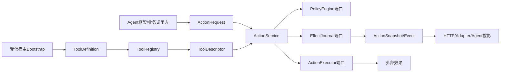

### 4.1 权威来源

| 事实 | 权威来源 | Domain中的载体 | 禁止推断 |
|---|---|---|---|
| 请求意图 | 调用方，经外层认证/校验 | `ActionRequest` | 请求存在不代表允许执行 |
| Tool能力 | 受信宿主注册 | `ToolDefinition/ToolDescriptor` | `effect_hint`不能覆盖 |
| Policy决定 | `PolicyEngine` | `PolicyDecision` | 不等同人工审批 |
| 人工决定 | `ActionService`绑定当前指纹后写Journal | `ApprovalRecord` | 单独构造Record不授权 |
| 当前生命周期 | Effect Journal | `ActionSnapshot.status` | 内存对象不是提交事实 |
| 外部结果 | Executor或Reconciler | `ExecutionOutcome/ReconciliationOutcome` | 返回`FAILED`必须符合效果语义 |
| 已知外部资源 | Executor/对账器 | `EffectReceipt` | Receipt结构合法不代表真实性 |
| 执行所有权 | Journal租约 | `lease_owner/lease_expires_at` | Worker ID本身不授予能力 |
| Trace关联 | 首次接收请求的Runtime | `TraceContext` | 不参与业务幂等 |

### 4.2 信任边界

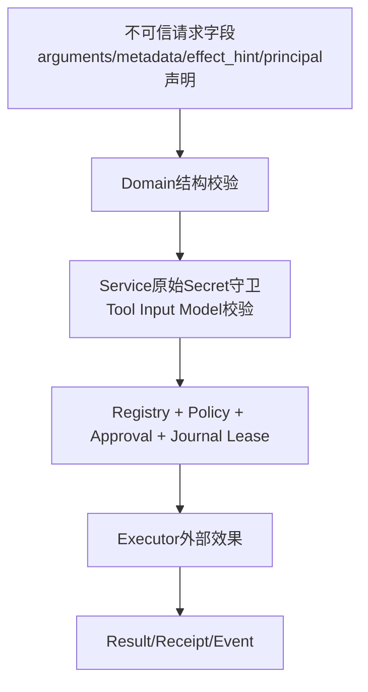

Domain只完成第一层结构校验。真实权限至少还需要Registry、Policy/Approval和Journal租约；文件、进程、网络和
Secret能力还要由对应执行模块二次绑定。

## 5. 包结构与阅读顺序

Domain包当前共512行生产代码，建议按以下顺序阅读：

| 顺序 | 文件 | 关键符号 | 阅读目的 |
|---:|---|---|---|
| 1 | [`models.py`](../../src/harnessix/domain/models.py) | `ContractModel`、枚举、`ActionRequest`、`ActionSnapshot`、Outcome | 掌握共享数据语言和状态图 |
| 2 | [`ports.py`](../../src/harnessix/domain/ports.py) | `ActionExecutor`、`PolicyEngine`、`EffectJournal` | 理解应用层依赖倒置边界 |
| 3 | [`registry.py`](../../src/harnessix/domain/registry.py) | `ToolDefinition`、`ToolRegistry` | 理解受信Tool事实如何冻结为Descriptor |
| 4 | [`errors.py`](../../src/harnessix/domain/errors.py) | `HarnessixError`及具体错误、`UncertainEffectError` | 理解API冲突与执行不确定控制流 |
| 5 | [根公共导出](../../src/harnessix/__init__.py) | `__all__` | 区分稳定SDK合同和内部领域类型 |
| 6 | [`runtime.py`](../../src/harnessix/runtime.py) | `action_fingerprint`、`ActionService` | 理解Domain不变量在哪里被组合执行 |
| 7 | [SQLite Journal](../../src/harnessix/storage/sqlite_journal.py)与[PostgreSQL Journal](../../src/harnessix/storage/postgres_journal.py) | `transition`、`claim_next_ready`、`recover_expired` | 验证端口的持久语义 |

`domain/__init__.py`当前为空；内部代码直接从具体子模块导入。包根
[`harnessix/__init__.py`](../../src/harnessix/__init__.py)只导出部分面向调用方的模型和SDK类型。

## 6. 依赖方向与模块边界

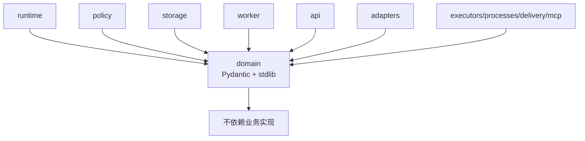

Domain生产代码只依赖Pydantic和标准库。禁止在Domain新增：

- FastAPI、SQLAlchemy/数据库驱动；
- OpenTelemetry SDK；
- LangGraph、OpenAI、Anthropic或MCP SDK；
- Workspace、Process或Sandbox实现；
- 产品配置、CLI或网络客户端；
- 具体Tool的输入模型与外部服务客户端。

`ports.py`允许引用Domain自身类型和Pydantic `BaseModel`，使Executor可以接收已解析的Tool输入，但不绑定某个
Tool Schema。

## 7. `ContractModel`基线

所有Pydantic领域模型继承：

```python
class ContractModel(BaseModel):
    model_config = ConfigDict(extra="forbid", frozen=True)
```

### 7.1 已保证

- 未声明字段被拒绝；
- 顶层字段不能通过普通赋值修改；
- `model_dump/model_dump_json/model_validate_json`可用于持久边界；
- Enum、UUID和datetime按Pydantic规则解析；
- 子类可以增加字段Validator或Model Validator。

### 7.2 未保证

`frozen=True`是**浅冻结**。`ActionRequest.arguments`、`metadata`、`ToolDescriptor.input_schema`、
`ActionResult.output`和Event `data`内的可变对象仍能原地修改。基类也没有统一设置：

- `strict=True`；
- `allow_inf_nan=False`；
- JSON值递归类型；
- 字节、深度、键数量和字符串总量；
- datetime必须带时区；
- Secret/PII分类；
- 规范摘要或深不可变副本。

因此“模型已构造”只说明Pydantic当前接受了结构，不代表它已满足Journal、HTTP、审批或安全不变量。

## 8. 分类枚举

### 8.1 副作用分类

| `EffectClass` | 语义 | 异常后的默认安全方向 | 示例 |
|---|---|---|---|
| `READ_ONLY` | 不改变受信外部状态 | 普通异常可确定`FAILED` | 读取、查询 |
| `IDEMPOTENT_WRITE` | 相同业务键重复调用预期收敛同一效果 | 未知时仍先对账，不因“幂等”盲重放 | 按唯一键创建/更新 |
| `NON_IDEMPOTENT_WRITE` | 重复调用可能产生第二个效果 | 要求审批；异常保守`UNKNOWN` | 任意命令、发送 |
| `DESTRUCTIVE` | 删除或不可逆高影响操作 | 默认Policy拒绝 | 删除资源 |

运行时Tool Definition是权威。`ActionRequest.effect_hint`只是调用方提示；提供且不一致时由Service在
`RECEIVED`阶段确定失败。

### 8.2 风险等级

`RiskLevel`为`LOW/MEDIUM/HIGH/CRITICAL`。当前默认Policy只对`CRITICAL`直接拒绝；其他等级还会结合
Effect与`requires_approval`。风险不是操作系统Capability，也不自动决定Sandbox Profile。

### 8.3 决策与结果枚举

| 枚举 | 值 |
|---|---|
| `PolicyDecisionKind` | allow / deny / require_approval |
| `ApprovalOutcome` | approved / rejected |
| `ExecutionOutcomeKind` | succeeded / failed / unknown |
| `ReconciliationOutcomeKind` | succeeded / failed / unknown / manual_intervention |

Executor不能在普通执行阶段直接返回`MANUAL_INTERVENTION`；该结论只属于对账阶段。

## 9. Action状态合同

### 9.1 状态集合

| 状态 | 语义 | 是否在`TERMINAL_ACTION_STATUSES` |
|---|---|---:|
| `RECEIVED` | 请求与Tool快照已写入Journal | 否 |
| `VALIDATED` | Effect、幂等、Secret字段与Input Model校验通过 | 否 |
| `POLICY_EVALUATED` | Policy事实已持久 | 否 |
| `DENIED` | Policy或人工拒绝 | 是 |
| `PENDING_APPROVAL` | 等待绑定当前指纹的决定 | 否 |
| `READY` | 已获准且可Claim | 否 |
| `LEASED` | 某Worker持有执行租约，尚未开始外部调用 | 否 |
| `RUNNING` | 已跨过外部调用边界 | 否 |
| `SUCCEEDED` | 确定成功 | 是 |
| `FAILED` | 确定失败/未提交目标效果 | 是 |
| `UNKNOWN` | 效果可能已提交，等待对账 | 否 |
| `RECONCILING` | 有租约的对账查询正在执行 | 否 |
| `MANUAL_INTERVENTION` | 自动对账无法收敛 | 是 |

`UNKNOWN`不是完成态。Metric或客户端若只使用`TERMINAL_ACTION_STATUSES`，不会把待对账Action误计为完成。

### 9.2 转换图

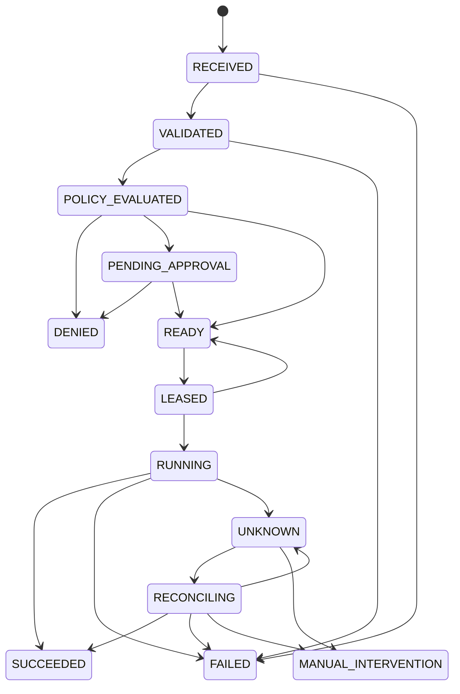

[`ALLOWED_ACTION_TRANSITIONS`](../../src/harnessix/domain/models.py)是合法边集合；SQLite/PostgreSQL
`transition`还会检查当前状态、期望集合和Lease Owner。模型本身不会阻止调用方直接构造一个任意状态的
`ActionSnapshot`。

### 9.3 转换不变量所在层

| 不变量 | Domain常量 | Service | Journal |
|---|---:|---:|---:|
| 目标边合法 | 是 | 按流程选择 | 是，最终阻断 |
| 当前状态属于调用方预期集合 | 否 | 提供expected | 是 |
| Lease Owner有效且未过期 | 仅字段 | 传required owner | 是 |
| Snapshot与Event原子提交 | 否 | 否 | 是 |
| Result.status等于目标状态 | 否 | 当前路径按约定构造 | 当前不交叉验证 |
| Approval指纹等于请求指纹 | 仅字段 | 是 | 当前不交叉验证 |
| Lease字段成对出现 | 否 | 当前路径按约定构造 | Schema/SQL未形成统一Domain校验 |

最后三项是当前契约加固缺口，不能只凭`ActionSnapshot`解析成功断言事实一致。

## 10. `ActionRequest`

### 10.1 字段设计

| 字段 | 当前类型/边界 | 语义 | 是否进入业务指纹 |
|---|---|---|---:|
| `spec_version` | 固定`harnessix.action/v1` | 请求合同版本 | 是 |
| `action_id` | UUID，默认随机 | 单次Action全局身份 | 否 |
| `tool` | 1～256，受限命名正则 | Registry查找键 | 是 |
| `arguments` | `dict[str, Any]` | 不可信Tool参数 | 是 |
| `principal` | `Principal` | 租户、主体、框架和角色声明 | 仅tenant |
| `context` | `ActionContext` | 上游Session/Run/业务Trace关联 | 否 |
| `effect_hint` | 可空`EffectClass` | 调用方提示 | 是 |
| `idempotency_key` | 可空1～256，禁止纯空白 | 租户范围业务键 | 否，作为索引键 |
| `secret_refs` | `tuple[SecretRef,...]` | Secret名称与可选版本 | 是，保留顺序 |
| `metadata` | `dict[str,Any]` | 非敏感扩展关联 | 否 |

### 10.2 两种重复语义

- 相同`action_id`：Journal要求**完整ActionRequest相等**，Context和Metadata变化也冲突；
- 相同`tenant_id + idempotency_key`：Journal比较`action_fingerprint`，忽略Action ID、Context、
  Metadata、Subject、Framework、Roles和幂等键自身。

命中同一幂等键并同指纹时返回首次Action及其首次Tool Descriptor、Trace和结果，不使用当前注册表的新版本覆盖旧
事实。

### 10.3 参数解析边界

`arguments`不会在Domain包按Tool Schema解析。[`ActionService._validate_request`](../../src/harnessix/runtime.py)
按以下顺序处理：

1. `effect_hint`与受信Tool Definition比较；
2. 必要时要求幂等键；
3. 扫描`arguments/metadata`中的敏感键名；
4. 先JSON序列化，再由Tool `input_model.model_validate_json`解析。

这保证Executor接收Tool输入模型，而不是原始字典；但Domain对象仍可包含无法JSON持久化的`Any`值，失败位置可能
出现在指纹或Journal序列化。`ActionService._submit`在上述四项校验前已经调用`journal.create_action`持久化完整
Request；因此敏感键守卫只保证“Policy/Executor前拒绝”，不保证“持久化前拒绝”。完整HTTP数据流和P0风险见
[API模块设计](api.md#25-敏感数据真实流向)。

## 11. Principal、Context、Trace与Secret引用

### 11.1 `Principal`

| 字段 | 边界 | 当前语义 |
|---|---:|---|
| `tenant_id` | 1～128 | 幂等隔离和日志关联；真实性由外层负责 |
| `subject_id` | 1～256 | 发起主体审计声明 |
| `framework` | 1～64 | 上游框架标签，不授予权限 |
| `roles` | tuple，无数量/元素长度/唯一约束 | 当前Domain不执行RBAC |

API当前没有内建公网身份认证，不能把客户端填写的Principal作为多租户安全边界。

### 11.2 `ActionContext`

`session_id/run_id`各1～256；`trace_id`可空、最大256。它们属于业务关联，完整进入Action请求持久化与
相同Action ID比较，但不进入业务幂等指纹。

### 11.3 `TraceContext`

`traceparent`长度1～128，`tracestate`最大512。首次`create_action`时由Observability Runtime写入Snapshot；
重复提交保留首次值。Domain只做长度校验，不验证W3C格式；具体Trace适配器会尝试解析，无效值不能被当作有效父
Span。

### 11.4 `SecretRef`

只含`name`和可选`version`，没有Secret值。当前Domain未限制引用数量、重复项、名称格式或目标注入位置；通用
ActionService也不解析值。Process、MCP、Delivery等专用链必须在自己的Execution Plan/Secret合同中完成版本、
目标和作用域核对。

## 12. Tool描述、定义与Registry

### 12.1 `ToolDefinition`与`ToolDescriptor`

`ToolDefinition`是进程内`dataclass(frozen=True, slots=True)`，额外保存：

- `input_model: type[BaseModel]`；
- `executor: ActionExecutor`。

`descriptor()`把Input Model生成的JSON Schema和能力标志投影为可持久`ToolDescriptor`。Snapshot保存Descriptor，
不保存Executor或Python类型。

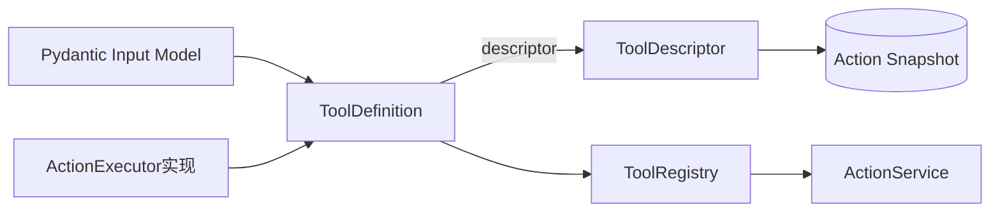

### 12.2 Descriptor字段

| 字段 | 语义 |
|---|---|
| `name/version/description` | Tool身份与说明 |
| `input_schema` | 当时Input Model生成的JSON Schema快照 |
| `effect_class/risk_level` | 运行时权威效果和风险 |
| `requires_idempotency` | 请求必须提供幂等键 |
| `requires_approval` | 默认Policy要求人工审批 |
| `supports_reconciliation` | UNKNOWN是否可调用`reconcile` |
| `supports_parallel_calls` | Agent可并行调度声明；只允许READ_ONLY |

唯一跨字段Validator是“并行调用只能用于只读Tool”。`name/version/description/input_schema`当前没有统一长度、
命名或Schema有效性校验；Action请求的Tool名称约束比Descriptor更严格。

### 12.3 Registry行为

| 方法 | 行为 | 错误 |
|---|---|---|
| `register` | 先构造Descriptor触发Schema/并行校验，再按name加入 | 重名`ValueError`，不覆盖旧定义 |
| `get` | 精确名称查询 | `ToolNotFoundError`，404 |
| `list_descriptors` | 按Tool名称排序后重新生成Descriptor | Schema生成错误向上传播 |

Registry没有`freeze/close`状态或并发锁。当前约定在Bootstrap阶段注册，运行阶段只读；测试仍可动态添加Tool。
产品若支持热加载，必须增加版本化目录快照和并发发布合同，不能依赖普通字典隐式安全。

## 13. Policy与Approval合同

### 13.1 `PolicyDecision`

包含`kind/policy_id/reason/evaluated_at`。默认时间由`utc_now`生成。Domain没有限制ID/原因长度，也没有强制
`evaluated_at`带时区；默认路径产生UTC时间，但外部Policy实现可以构造naive datetime。

### 13.2 `ApprovalDecision`与`ApprovalRecord`

`ApprovalDecision`是API/Service输入：

- outcome：approved/rejected；
- actor：1～256；
- reason：可空、最大2000。

`ApprovalRecord`是持久事实，增加`request_fingerprint`与`decided_at`。Record中的actor、reason和fingerprint
当前没有对应长度/摘要格式Validator；正确绑定由`ActionService.decide_approval`从当前Snapshot生成。

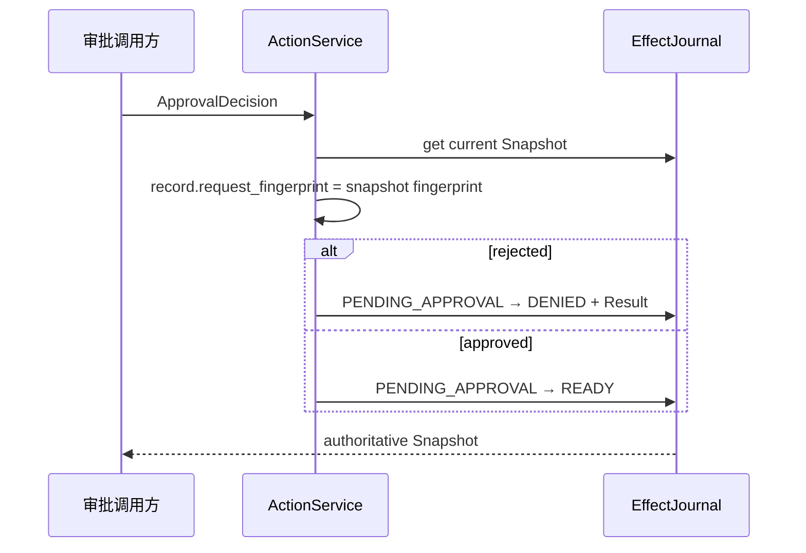

直接构造`ApprovalRecord`或Session中的审批镜像不产生执行许可；只有Journal合法迁移后的Snapshot才是权威事实。

## 14. Failure、Receipt和Result

### 14.1 `ActionFailure`

`code/message/retriable`用于稳定失败投影。当前没有code正则、消息长度、错误分类枚举或敏感信息清洗。Service在
Policy、Executor和Reconcile异常路径直接使用`str(error)`，这是0.9.4已登记的泄露风险。

`retriable=True`只是提示，不授权重放；是否安全重试还必须结合Effect、状态、幂等键和外部证据。

### 14.2 `EffectReceipt`

| 字段 | 语义 |
|---|---|
| `provider/resource_type/resource_id` | 外部效果定位 |
| `idempotency_key` | 外部业务键 |
| `response_digest` | 有界响应摘要 |
| `observed_at` | 观察时间，默认UTC |

Domain未验证字段长度、digest格式、资源归属或Receipt与Action幂等键一致性。Receipt由受信Executor产生并被
Journal保存，但当前模型本身不是加密签名或第三方证明。

### 14.3 `ActionResult`

包含`status/output/error/receipt/attempt`。`attempt >= 1`是唯一字段约束。当前模型允许构造：

- `SUCCEEDED`同时带error；
- `FAILED`却无error；
- Result status与Snapshot status不同；
- `UNKNOWN`带`retriable=True`；
- 任意不可JSON序列化或无界output。

正式Service路径会按Outcome映射状态，但Journal `transition`没有统一交叉Validator。读取历史数据时，合法JSON
仍可能形成语义不一致Snapshot。

## 15. Snapshot、Event和运维统计

### 15.1 `ActionSnapshot`

| 字段组 | 字段 | 语义 |
|---|---|---|
| 固定请求 | request、request_fingerprint、tool、trace_context | 首次创建后不应改变 |
| 决策 | policy、approval | 随状态机追加 |
| 结果 | result | 验证、拒绝、执行、恢复或对账结论 |
| 租约 | lease_owner、lease_expires_at | 当前执行/对账所有权 |
| 生命周期 | status、created_at、updated_at、version | 当前Journal投影与CAS版本 |

只有`version >= 1`由模型校验。Domain没有验证时间顺序、时区、摘要、状态所需字段或Lease成对关系。SQLite与
PostgreSQL从列和JSON重建Snapshot，但当前也没有对所有冗余事实做统一交叉校验。

### 15.2 `ActionEvent`

事件包含Action ID、sequence、event_type、from/to、data和created_at。只有`sequence >= 1`受模型约束。
严格递增、首事件from为空、from/to相邻和Snapshot一致性由Journal事务实现，而非Event模型。

Heartbeat续租只增加Snapshot version，不追加Action Event；因此Event sequence与Snapshot version不是同一计数。

### 15.3 `JournalOperationalStats`

`ready_count/pending_approval_count/unknown_count`非负，`oldest_ready_at`可空。Worker将其投影为低基数Gauge。
统计是观察快照，不参与Action状态机，也不能用于判断单个Action是否终结。

## 16. 执行与对账Outcome

### 16.1 `ExecutionOutcome`

Executor返回`SUCCEEDED/FAILED/UNKNOWN`，可携带output/error/receipt。便捷构造器：

- `succeeded(output, receipt?)`；
- `failed(code, message, retriable=False)`；
- `unknown(code, message)`，固定不可重试。

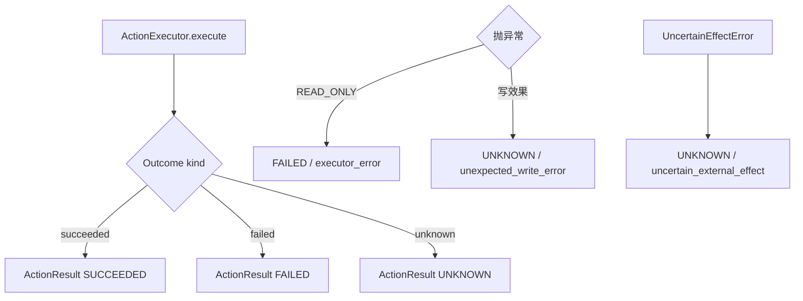

模型未强制kind与error/receipt形状。Executor实现应使用类方法；Service最终按kind决定Action目标状态。

### 16.2 `ReconciliationOutcome`

对账支持`SUCCEEDED/FAILED/UNKNOWN/MANUAL_INTERVENTION`，类方法分别构造：

- 成功必须由类方法传Receipt；
- failed/unknown/manual固定不可重试。

但直接调用模型构造器仍可绕过这些形状约定。Reconcile只能查询已存在效果，不得再次调用`execute`或产生新效果。

## 17. 稳定错误与控制流信号

| 类型 | code/status | 触发点 |
|---|---|---|
| `HarnessixError` | 调用方提供code/message/status | 稳定应用错误基类 |
| `ActionNotFoundError` | action_not_found / 404 | Action ID不存在 |
| `ToolNotFoundError` | tool_not_found / 404 | Registry无Tool |
| `ActionConflictError` | action_conflict / 409 | 相同ID载荷变化、Lease Owner冲突等 |
| `IdempotencyConflictError` | idempotency_conflict / 409 | 租户幂等键绑定不同指纹 |
| `IllegalTransitionError` | illegal_transition / 409 | 当前/目标状态非法 |
| `UncertainEffectError` | 无code/status | Executor确认效果可能提交，Service转UNKNOWN |

`ActionNotFoundError`和`ToolNotFoundError`消息直接包含调用方标识。API会把`HarnessixError`投影为结构化错误；
它们不应接收Secret。`UncertainEffectError`是内部控制流，不是HTTP错误。

当前错误类没有统一cause、公开/私有消息双轨、错误详情Schema或自动脱敏。

## 18. 依赖倒置端口

### 18.1 `ActionExecutor`

```python
class ActionExecutor(Protocol):
    async def execute(self, action: ActionSnapshot, arguments: BaseModel) -> ExecutionOutcome: ...

    async def reconcile(self, action: ActionSnapshot) -> ReconciliationOutcome: ...
```

- Service保证普通执行前Snapshot已进入`RUNNING`；
- `arguments`是Tool Input Model实例；
- Executor不直接迁移Journal；
- Protocol没有CancelToken、Deadline、Secret Provider、Trace Span或Capability参数；
- 是否支持reconcile由Tool Definition声明，但Protocol要求实现方法。

### 18.2 `PolicyEngine`

`evaluate(action, tool) -> PolicyDecision`。Policy读取已验证Snapshot与Descriptor，不执行效果、不写Journal。
异常由Service转`FAILED/policy_error`，当前消息直接使用原Exception文本。

### 18.3 `EffectJournal`

| 方法 | 合同作用 |
|---|---|
| `initialize/close/ping` | 生命周期与健康 |
| `operational_stats` | 队列低基数统计 |
| `create_action` | 原子建立Snapshot和首事件，返回created标志 |
| `get_action/list_events` | 权威读取 |
| `transition` | expected +合法边+可选Lease Owner守卫推进 |
| `claim_next_ready` | 原子领取一个READY Action |
| `renew_lease` | 当前Owner续租，返回是否成功 |
| `recover_expired` | LEASED回READY，RUNNING/RECONCILING回UNKNOWN |

`Protocol`只描述签名，不能表达“Snapshot和Event同事务”“FIFO”“`SKIP LOCKED`”或持久隔离级别。这些语义由
Storage模块设计与合同测试承担。

## 19. 请求指纹与幂等边界

`action_fingerprint`位于[`runtime.py`](../../src/harnessix/runtime.py)，不在Domain包。当前摘要输入：

```text
spec_version
tenant_id
tool
arguments
effect_hint
secret_refs（保留数组顺序）
```

排除：

- action_id；
- principal的subject/framework/roles；
- ActionContext全部字段；
- idempotency_key自身；
- metadata；
- Tool version/Descriptor；
- Runtime Trace Context。

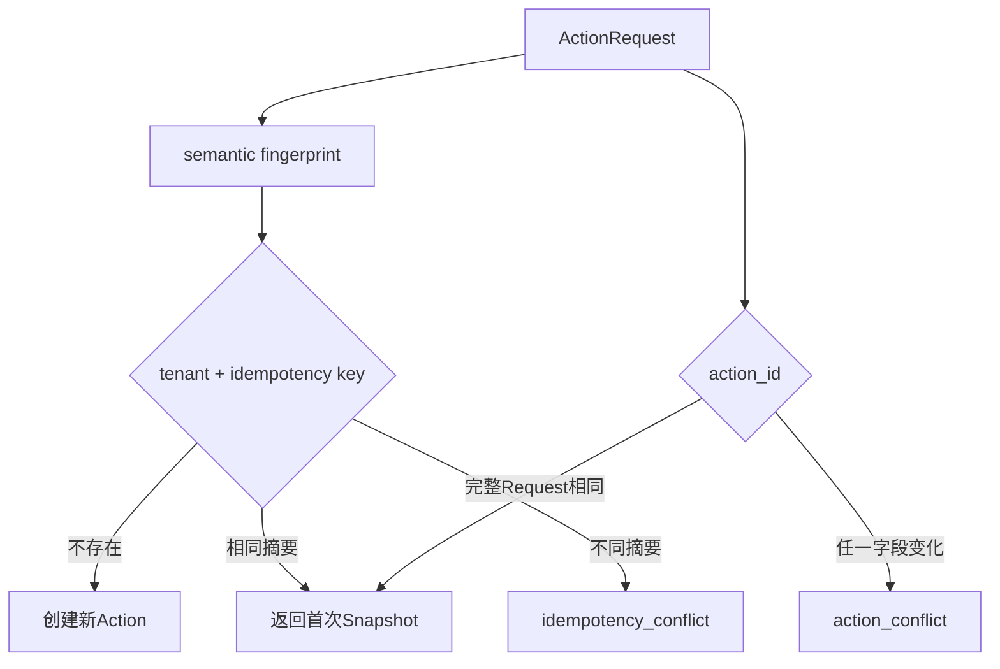

规范JSON使用`sort_keys=True`与紧凑分隔符，但对未知对象使用`default=str`。这不等同严格RFC
Canonical JSON；非JSON对象可能先被字符串化参与指纹，后续在持久化或Tool解析时失败。Domain v1应把请求JSON
闭包与摘要算法版本化列为加固方向。

## 20. 持久化与不可变边界

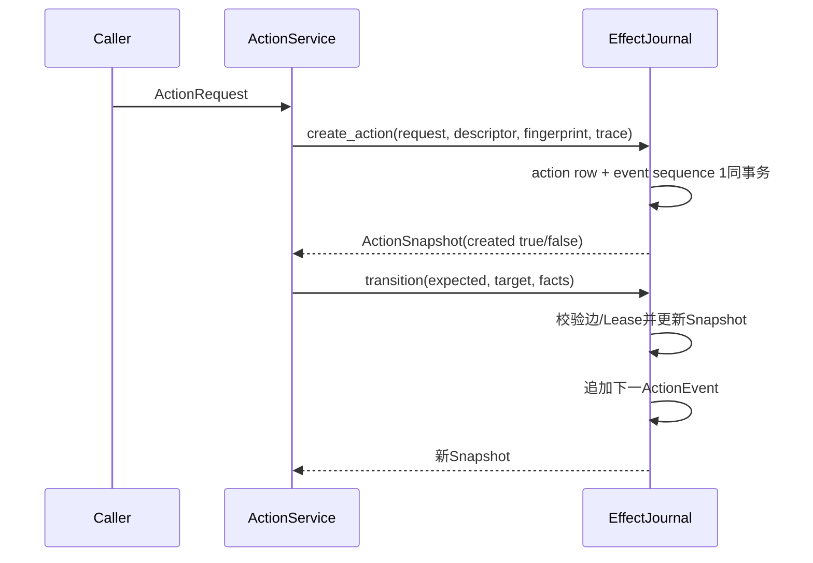

Domain中的`frozen`不能代替持久不可变：

- Action请求由Journal保存为JSON；
- Tool Descriptor保存当时版本，不从Registry动态重建历史事实；
- Trace只在首次创建时写入；
- 状态迁移通过Journal事务和版本列推进；
- 相同ID重复提交比较完整请求；
- 上层获得的旧Snapshot只是值对象，不能作为CAS授权。

SQLite/PostgreSQL实现细节属于Storage模块；Domain只定义共享形状与端口。

## 21. Lease与Worker所有权

`ActionSnapshot`只保存`lease_owner`和`lease_expires_at`，没有独立Lease ID、fencing token或heartbeat事件。

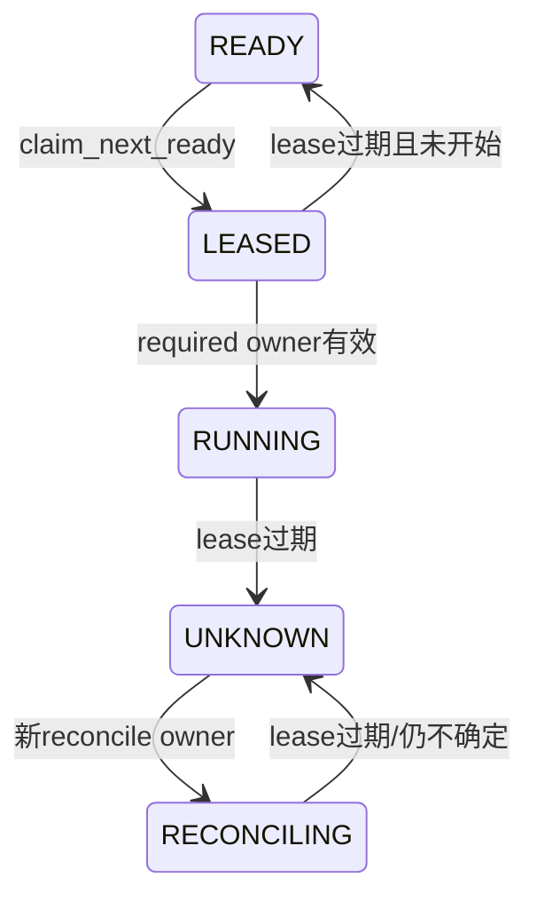

重要语义：

- `LEASED`表示尚未开始外部调用，过期可安全回READY；
- `RUNNING`表示可能已有外部效果，过期只能UNKNOWN；
- `RECONCILING`只查询，过期回UNKNOWN；
- Renew只更新Snapshot version，不产生Event；
- Worker完成结果时必须提供`required_lease_owner`；
- 仅知道worker_id不能证明当前仍持Lease。

Domain当前没有“Lease开始时间”“租约代次/fencing token”或执行Deadline；Storage依赖Owner+到期时间和事务状态守卫。

## 22. 正常Action数据流

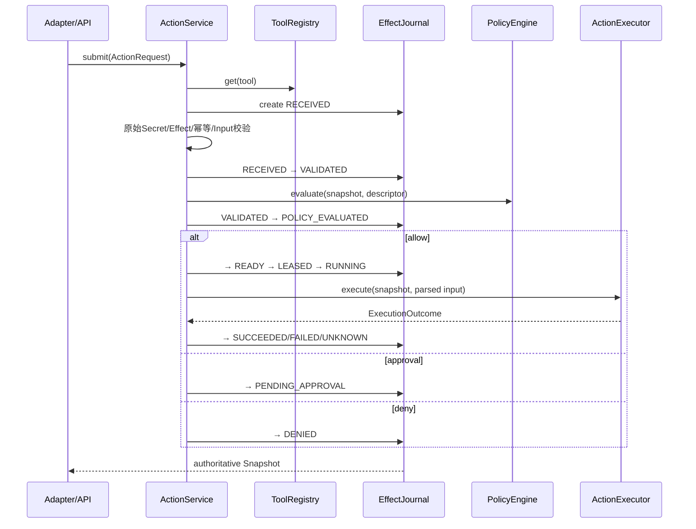

在queued模式下，`READY`之后由ActionWorker完成Claim和执行；Domain合同对inline/queued保持一致。

## 23. UNKNOWN与对账

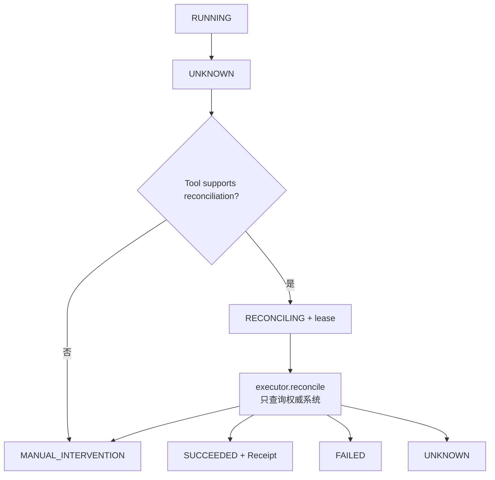

- 普通写Executor抛未分类异常时，Service保守进入UNKNOWN；
- 显式`UncertainEffectError`总是UNKNOWN；
- 只读Executor异常进入FAILED；
- 不支持对账的Tool直接MANUAL_INTERVENTION；
- 对账异常仍回UNKNOWN，不能证明原效果失败；
- UNKNOWN不会自动调用`execute`。

Domain提供结果枚举和状态边；外部身份、查询方式和Receipt真实性由具体Executor负责。

## 24. API、Adapter和公共导出

### 24.1 HTTP边界

FastAPI直接使用`ActionRequest`、`ApprovalDecision`和`ActionSnapshot`生成OpenAPI。`HarnessixError`映射
404/409等状态；非终结Action可返回202。Domain本身不依赖FastAPI。

`spec/action-contract-v1.schema.json`由`ActionRequest.model_json_schema()`生成；完整API模型还进入
`spec/openapi.json`。当前CI没有独立“重新生成Schema后git diff必须为空”的门禁。

### 24.2 Framework Adapter

[Adapter模块](adapters.md)当前通过[LangChain `StructuredTool`工厂](../../src/harnessix/adapters/langgraph.py)把
框架输入转换为同一`ActionRequest`并调用Client；它不直接调用Service，也不能定义第二套Effect或状态机。当前没有真实
LangGraph ToolNode/Checkpoint/Interrupt集成，Tool Call ID未绑定Action ID，非终态或负面终态Snapshot仍作为正常Tool
内容返回。专用Agent Process/Patch桥接也必须把Action Journal视为唯一Action事实。

### 24.3 根公共API

[`harnessix.__all__`](../../src/harnessix/__init__.py)当前导出请求、状态、审批输入、失败、结果、Receipt、
Principal、Trace、Secret Ref、Tool Descriptor及同步/异步SDK客户端。以下类型不在根公开面：

- Policy/Execution/Reconciliation内部Outcome；
- Domain Protocol；
- ToolDefinition/ToolRegistry；
- Journal运维统计；
- 具体错误类。

这是当前导出事实，不是永久兼容承诺；公共导出变化必须有版本和兼容评审。

## 25. 数据分类与敏感信息

| 数据 | 当前位置 | 敏感性 | 现有控制 | 剩余风险 |
|---|---|---|---|---|
| Principal | Request/Journal/Log关联 | 身份元数据 | 字段长度；日志不展开请求 | API不验证真实性 |
| arguments | Request/Journal | 可能高敏感 | 首次持久化后执行敏感键名扫描；Tool Model | 命中键也已落盘；值型Secret、编码值、无界嵌套可能漏过 |
| secret_refs | Request/Journal/指纹 | Secret标识元数据 | 不含值 | 名称/版本仍可能敏感 |
| metadata | Request/Journal | 声明非敏感 | 与arguments一起扫键名 | 任意值、无字节预算 |
| Approval actor/reason | Snapshot | 审计/可能PII | 输入长度 | Record模型自身约束较弱 |
| ActionFailure.message | Result/Event/API | 可能泄露 | 无统一Domain控制 | `str(error)`可进入持久化 |
| output | Result/Journal/API | Tool定义 | 无统一Domain预算 | 大对象、Secret、非JSON值 |
| EffectReceipt | Result | 外部资源标识 | 字段化 | 无长度、签名和归属验证 |
| TraceContext | Snapshot | 诊断元数据 | 长度限制 | Domain不校验W3C语法 |

Domain模型的`repr`没有统一隐藏这些字段。日志必须只记录Action ID、Tool、Tenant和低基数状态，不能直接打印完整
Request/Snapshot/Outcome。

## 26. 并发、生命周期与线程安全

| 对象 | 当前并发语义 |
|---|---|
| Contract Model | 顶层不可赋值，但嵌套dict/list可变；不要跨Task共享后修改 |
| ToolDefinition | dataclass浅冻结；Executor对象自身可变 |
| ToolRegistry | 普通dict，无锁；Bootstrap期写、运行期读是约定而非强制 |
| PolicyEngine Protocol | 未声明可重入；默认实现无状态 |
| ActionExecutor Protocol | Tool实现决定并发；Descriptor只允许只读Tool声明Agent并行 |
| EffectJournal | 并发安全由实现事务保证 |
| ActionSnapshot | 历史值对象；旧version不能授权新迁移 |
| ActionEvent | append事实；顺序由Journal分配 |

`supports_parallel_calls`只描述Agent Tool调度能力，不表示Executor线程安全、数据库并发安全或外部API无速率限制。

## 27. 失败语义

### 27.1 准入和冲突

| 失败 | 当前表现 | 是否可直接重试 |
|---|---|---|
| 未注册Tool | `ToolNotFoundError`/404 | 修正Tool |
| 相同Action ID载荷变化 | `ActionConflictError`/409 | 不能用同ID覆盖 |
| 同租户幂等键不同指纹 | `IdempotencyConflictError`/409 | 业务决策后换键或复用原意图 |
| Effect Hint不一致 | Action `FAILED/effect_mismatch` | 修正新请求 |
| 缺必要幂等键 | `FAILED/idempotency_key_required` | 提供稳定业务键 |
| 疑似原始Secret | `FAILED/raw_secret_rejected` | 改用受控Secret引用 |
| Tool参数错误 | `FAILED/invalid_arguments` | 修正参数 |
| 非JSON/持久化失败 | 异常向上，可能只留下前序事实 | 读取Journal后判断 |

### 27.2 Policy、执行和恢复

| 场景 | 领域结果 |
|---|---|
| Policy异常 | `FAILED/policy_error`，当前retriable=true |
| Policy拒绝 | `DENIED/policy_denied` |
| 审批拒绝 | `DENIED/approval_rejected` |
| 只读Executor异常 | `FAILED/executor_error` |
| 写Executor异常 | `UNKNOWN/unexpected_write_error` |
| 显式不确定效果 | `UNKNOWN/uncertain_external_effect` |
| Lease执行前过期 | `LEASED → READY` |
| RUNNING/RECONCILING Lease过期 | `→ UNKNOWN/lease_expired` |
| 不支持对账 | `MANUAL_INTERVENTION/reconciliation_not_supported` |
| 对账异常 | `UNKNOWN/reconciliation_error` |

`retriable`不是状态迁移；当前Action状态机没有自动重试边。新尝试必须由上层显式定义身份与安全条件。

## 28. 模型与组合不变量矩阵

| 规则 | 模型直接校验 | 组合层校验 | 当前缺口 |
|---|---:|---:|---|
| extra字段拒绝/顶层冻结 | 是 | — | 嵌套对象可变 |
| Action spec/tool名称/幂等键空白 | 是 | — | arguments/metadata无JSON和预算闭包 |
| 只有只读Tool可并行 | 是 | Registry构造Descriptor | 无Executor并发证明 |
| 状态边合法 | 常量定义 | Journal校验 | Snapshot/Event自身可伪造组合 |
| Request与指纹一致 | 否 | Service计算、Journal保存 | 读取时不重算 |
| Approval与当前指纹一致 | 否 | Service构造 | Journal不交叉验证任意调用 |
| Result与目标状态一致 | 否 | Service正常路径 | Journal不验证 |
| Lease字段成对且状态匹配 | 否 | Service/Storage路径 | Domain可接受孤立owner |
| datetime UTC/顺序 | 默认值通常是 | 部分Store使用UTC | 外部构造可naive/逆序 |
| Output/Failure/Receipt有界且JSON | 否 | Tool/Artifact局部处理 | 通用Action无统一预算 |
| Trace W3C有效 | 仅长度 | Observability适配器解析 | Domain可接受任意字符串 |
| Secret值不入请求 | 仅`SecretRef`形状 | Service在首次持久化后执行敏感键名守卫 | 命中键也已落盘；值型、派生和编码Secret漏检 |

## 29. 重点类与接口设计

| 符号 | 输入/输出 | 核心不变量 | 副作用 |
|---|---|---|---|
| `ContractModel` | Pydantic数据 | extra forbid、浅冻结 | 无 |
| `ActionRequest` | 调用意图 | v1、Tool名、非空幂等键 | 无 |
| `ToolDescriptor` | 受信Tool快照 | 并行仅只读 | 无 |
| `ToolDefinition.descriptor` | Python定义→Descriptor | Input Schema来自model | Schema生成 |
| `ToolRegistry.register` | Definition | 名称唯一，不覆盖 | 修改内存Registry |
| `ActionSnapshot` | 当前聚合投影 | 当前模型仅version>=1 | 由Store重建 |
| `ActionEvent` | 转换审计 | 当前模型仅sequence>=1 | 由Store追加 |
| `ExecutionOutcome` | Executor→Service | 类方法表达建议形状 | 无 |
| `ReconciliationOutcome` | Reconciler→Service | 类方法表达建议形状 | 无 |
| `EffectJournal.transition` | expected/target/facts→Snapshot | 实现需合法边、Lease、原子Event | 持久化 |
| `UncertainEffectError` | Executor控制流 | 效果可能提交 | Service转UNKNOWN |

## 30. 核心业务逻辑伪代码

### 30.1 Tool注册

```text
register(definition):
    descriptor = definition.descriptor()
    require descriptor validates parallel => read_only
    require name not already present
    tools[name] = definition

list_descriptors():
    return descriptor(tools[name]) for name in sorted(names)
```

### 30.2 Action创建与准入

```text
submit(request):
    definition = registry.get(request.tool)
    fingerprint = action_fingerprint(request)
    snapshot, created = journal.create_action(
        request, definition.descriptor(), fingerprint, current_trace
    )
    if not created:
        return snapshot

    failure = validate_effect_idempotency_secret_keys_and_input(request, definition)
    if failure:
        transition RECEIVED -> FAILED with result
        return

    transition RECEIVED -> VALIDATED
    decision = policy.evaluate(snapshot, descriptor)
    persist VALIDATED -> POLICY_EVALUATED with decision
    route to DENIED, PENDING_APPROVAL or READY
```

### 30.3 Worker执行

```text
claim_and_execute():
    snapshot = journal.claim_next_ready(worker, expiry)
    if none: return
    transition LEASED -> RUNNING requiring current worker lease
    parse stored request arguments again
    try:
        outcome = executor.execute(snapshot, parsed)
    except UncertainEffectError:
        outcome = UNKNOWN
    except Exception:
        outcome = FAILED if read_only else UNKNOWN
    transition RUNNING -> mapped state
        requiring same unexpired owner
        persist ActionResult and clear lease
```

### 30.4 Lease恢复

```text
recover_expired(now):
    for each LEASED/RUNNING/RECONCILING with expiry <= now:
        if LEASED:
            target = READY
            result unchanged
        else:
            target = UNKNOWN
            result = lease_expired unless an earlier result must be preserved
        clear owner/expiry
        append lease_recovered event atomically
```

### 30.5 对账

```text
reconcile(action_id):
    snapshot = journal.get(action_id)
    definition = registry.get(snapshot.request.tool)
    if not supports_reconciliation:
        UNKNOWN -> MANUAL_INTERVENTION
        return
    UNKNOWN -> RECONCILING with worker lease
    query executor.reconcile(snapshot), never execute()
    map outcome to SUCCEEDED/FAILED/UNKNOWN/MANUAL_INTERVENTION
    persist result requiring same lease owner and clear lease
```

## 31. 源码与测试映射

| 设计元素 | 源码 | 关键符号 | 测试 | 测试符号 |
|---|---|---|---|---|
| 请求指纹身份 | [`models.py`](../../src/harnessix/domain/models.py)、[`runtime.py`](../../src/harnessix/runtime.py) | `ActionRequest`、`action_fingerprint` | [`test_models.py`](../../tests/unit/test_models.py) | `test_fingerprint_ignores_action_identity_and_run_context`、`test_fingerprint_changes_with_effect_payload` |
| Tool权威分类 | [`registry.py`](../../src/harnessix/domain/registry.py) | `ToolDefinition`、`ToolRegistry` | [`test_registry.py`](../../tests/unit/test_registry.py) | `test_runtime_owns_effect_classification` |
| 未知Tool失败关闭 | [`errors.py`](../../src/harnessix/domain/errors.py)、[`registry.py`](../../src/harnessix/domain/registry.py) | `ToolNotFoundError`、`get` | [`test_registry.py`](../../tests/unit/test_registry.py) | `test_unknown_tool_fails_closed` |
| 并行只读不变量 | [`models.py`](../../src/harnessix/domain/models.py) | `ToolDescriptor.parallel_calls_are_read_only` | [`test_registry.py`](../../tests/unit/test_registry.py) | `test_parallel_capability_is_additive_and_write_registration_fails_closed` |
| 状态与事件顺序 | [`models.py`](../../src/harnessix/domain/models.py)、[`sqlite_journal.py`](../../src/harnessix/storage/sqlite_journal.py) | `ActionStatus`、`ALLOWED_ACTION_TRANSITIONS`、`transition` | [`test_action_service.py`](../../tests/integration/test_action_service.py) | `test_echo_runs_without_approval_and_records_lifecycle`、`test_journal_rejects_illegal_state_transition` |
| Action ID不可变 | [`models.py`](../../src/harnessix/domain/models.py)、[`sqlite_journal.py`](../../src/harnessix/storage/sqlite_journal.py) | `ActionRequest`、`create_action` | [`test_action_service.py`](../../tests/integration/test_action_service.py) | `test_action_id_rejects_mutated_request` |
| 租户幂等冲突 | [`runtime.py`](../../src/harnessix/runtime.py)、[`sqlite_journal.py`](../../src/harnessix/storage/sqlite_journal.py) | `action_fingerprint`、`create_action` | [`test_action_service.py`](../../tests/integration/test_action_service.py) | `test_issue_requires_approval_and_is_idempotent`、`test_idempotency_key_rejects_different_payload` |
| 原始Secret和Effect提示 | [`runtime.py`](../../src/harnessix/runtime.py) | `_find_sensitive_path`、`_validate_request` | [`test_action_service.py`](../../tests/integration/test_action_service.py) | `test_raw_secret_is_rejected_before_policy`、`test_effect_hint_mismatch_is_rejected` |
| 审批拒绝无效果 | [`models.py`](../../src/harnessix/domain/models.py)、[`runtime.py`](../../src/harnessix/runtime.py) | `ApprovalDecision`、`ApprovalRecord`、`decide_approval` | [`test_action_service.py`](../../tests/integration/test_action_service.py) | `test_rejected_approval_never_executes_effect` |
| UNKNOWN与对账 | [`models.py`](../../src/harnessix/domain/models.py)、[`runtime.py`](../../src/harnessix/runtime.py) | `ExecutionOutcome`、`ReconciliationOutcome`、`reconcile` | [`test_action_service.py`](../../tests/integration/test_action_service.py) | `test_uncertain_effect_is_reconciled_without_reexecution` |
| 过期状态语义 | [`ports.py`](../../src/harnessix/domain/ports.py)、[`sqlite_journal.py`](../../src/harnessix/storage/sqlite_journal.py) | `EffectJournal.recover_expired`、`recover_expired` | [`test_action_service.py`](../../tests/integration/test_action_service.py) | `test_expired_running_lease_becomes_unknown` |
| Queued Worker合同 | [`worker.py`](../../src/harnessix/worker.py) | `ActionWorker.run_once` | [`test_worker.py`](../../tests/integration/test_worker.py) | `test_queued_action_is_executed_by_worker`、`test_approval_only_enqueues_action` |
| 单Claim与失租保护 | [`ports.py`](../../src/harnessix/domain/ports.py)、[`worker.py`](../../src/harnessix/worker.py) | `claim_next_ready`、`renew_lease`、`_resolve_failed_renewal` | [`test_worker.py`](../../tests/integration/test_worker.py) | `test_ready_action_can_only_be_claimed_once`、`test_stale_worker_cannot_advance_state`、`test_failed_renewal_while_running_still_reports_lost_lease` |
| LEASED安全回READY | [`models.py`](../../src/harnessix/domain/models.py)、[`sqlite_journal.py`](../../src/harnessix/storage/sqlite_journal.py) | `ALLOWED_ACTION_TRANSITIONS`、`recover_expired` | [`test_worker.py`](../../tests/integration/test_worker.py) | `test_expired_unstarted_lease_returns_to_ready` |
| Heartbeat不追加Event | [`ports.py`](../../src/harnessix/domain/ports.py)、[`worker.py`](../../src/harnessix/worker.py) | `renew_lease`、`_execute_with_heartbeat` | [`test_worker.py`](../../tests/integration/test_worker.py) | `test_heartbeat_renews_lease_during_action` |
| 终态提交与续租竞态 | [`worker.py`](../../src/harnessix/worker.py) | `_execution_commit_exists`、`_resolve_failed_renewal` | [`test_worker.py`](../../tests/integration/test_worker.py) | `test_execution_commit_wins_renewal_race` |
| 队列统计 | [`models.py`](../../src/harnessix/domain/models.py)、[`ports.py`](../../src/harnessix/domain/ports.py) | `JournalOperationalStats`、`operational_stats` | [`test_worker.py`](../../tests/integration/test_worker.py) | `test_operational_stats_report_queue_state`、`test_metrics_collection_failure_does_not_change_execution_result` |
| HTTP领域投影 | [`app.py`](../../src/harnessix/api/app.py) | `create_app` | [`test_api.py`](../../tests/integration/test_api.py) | `test_http_api_executes_echo`、`test_http_api_returns_structured_conflict`、`test_queued_http_api_returns_202_and_worker_completes` |
| PostgreSQL等价语义 | [`postgres_journal.py`](../../src/harnessix/storage/postgres_journal.py) | `claim_next_ready`、`recover_expired` | [`test_postgres_journal.py`](../../tests/integration/test_postgres_journal.py) | `test_postgres_workers_claim_action_without_duplication`、`test_postgres_expired_running_lease_persists_unknown_result` |
| Framework中立请求 | [`langgraph.py`](../../src/harnessix/adapters/langgraph.py)及[Adapter模块设计](adapters.md) | `create_harnessix_tool` | [`test_langgraph_adapter.py`](../../tests/unit/test_langgraph_adapter.py) | `test_langgraph_tool_builds_framework_neutral_action`；只证明Async正常映射，不证明真实LangGraph或恢复 |

## 32. 测试设计与当前证据

### 32.1 本地基线

以下测试在标注代码版本上执行：

```text
tests/unit/test_models.py
tests/unit/test_registry.py
tests/unit/test_langgraph_adapter.py
tests/integration/test_action_service.py
tests/integration/test_worker.py
tests/integration/test_api.py

31 passed
```

其中Domain直接单元测试只有5个：

- 2个指纹语义；
- 1个运行时Effect权威；
- 1个未知Tool；
- 1个并行只读约束。

其余状态、审批、Lease和Result语义由Service/Storage/Worker集成测试间接覆盖。

### 32.2 PostgreSQL与跨模块证据

PostgreSQL测试需要外部数据库环境，验证多Worker Claim和过期RUNNING持久UNKNOWN。Process、Patch、Delivery、
MCP、Hook和Trusted Action测试广泛复用Domain类型，但不应被计作Domain模型全部不变量的直接合同测试。

### 32.3 当前测试空白

1. `ActionRequest`所有字段上限、extra、空白和Schema快照没有集中参数化测试；
2. `ActionResult/ActionSnapshot/ActionEvent`没有直接跨字段不变量测试，因为当前模型尚未实现相应Validator；
3. `ExecutionOutcome/ReconciliationOutcome`允许直接构造非法形状，缺少拒绝测试；
4. `PolicyDecision/ApprovalRecord/EffectReceipt/ActionFailure`没有长度、摘要和时区合同测试；
5. `Principal.roles`与`SecretRef`没有数量、重复和规范化测试；
6. `arguments/metadata/output/event.data`没有JSON闭包、深度和总字节预算测试；
7. `ContractModel`浅冻结导致嵌套修改没有防回归测试；
8. `TraceContext`只限制长度，W3C格式不在Domain测试；
9. Tool Registry没有并发注册、运行时冻结和Schema生成失败的显式测试；
10. checked-in `action-contract-v1.schema.json`没有独立生成无差异门禁；
11. SQLite/PostgreSQL没有共享的EffectJournal合同测试套件；
12. 无领域Cancel/Deadline，因此没有相应状态、恢复和竞态测试。

## 33. 已知限制与演进方向

| 当前限制 | 直接影响 | 正确演进方向 |
|---|---|---|
| Framework Tool Call与Action ID无持久绑定 | 图重试、Checkpoint恢复或返回前断线可能新建Action | 版本化桥接身份、可重入绑定状态机及崩溃测试；详见[Adapter模块设计](adapters.md) |
| 敏感键守卫晚于首次Action持久化 | 被拒绝的疑似明文仍进入Journal和失败Snapshot | 版本化持久化前Admission安全门、最小拒绝事实及双后端兼容迁移 |
| ContractModel仅浅冻结 | 嵌套字典可在持久前后被原地修改 | 版本化JSON值类型、深冻结/规范复制；先补失败测试 |
| 核心Any字段无预算 | 可造成数据库/API/内存放大 | 定义统一JsonValue、深度、键数和UTF-8字节预算 |
| Result/Snapshot/Event缺跨字段Validator | 合法JSON可能语义自相矛盾 | 先形成兼容矩阵和历史数据扫描，再新增严格v2或可兼容Validator |
| 时间字段不强制UTC aware | 外部实现可提交naive/逆序时间 | 统一AwareDatetime与顺序校验 |
| Failure/Receipt字段无边界 | 错误、资源ID和输出可能无界或泄密 | 公私错误双轨、长度/摘要/Artifact合同 |
| 指纹使用`default=str` | 非JSON对象规范化不稳定 | 先拒绝非JSON值，再版本化Canonical JSON算法 |
| 指纹不含Tool版本 | 同幂等键命中历史Action时保持旧Descriptor，但升级语义依赖调用方理解 | 明确“命中原事实”合同；新业务语义必须新键或新Action版本 |
| TraceContext不验W3C语法 | Domain可持久无效父上下文 | 增加格式Validator并保留历史兼容读取策略 |
| Secret守卫仅键名启发式 | Secret值、派生/编码形式可能漏检 | 专用Secret类型、来源标记和最终出站DLP |
| Principal未经认证 | 当前API不能作为公网多租户边界 | 0.9.4接可信身份注入与授权上下文 |
| Registry没有冻结/并发控制 | 动态注册可能与请求竞态 | Bootstrap后冻结或使用版本化不可变Registry快照 |
| Protocol无取消/Deadline | 长执行和用户撤销没有统一领域事实 | 重大变更设计新的取消状态、提交边界和恢复语义 |
| Lease无fencing代次 | 主要依赖Owner+时间+状态事务 | 评估跨进程长任务的单调fencing token |
| Domain错误无公开/私有消息 | `str(error)`可能进入Journal/API | 0.9.4统一清洗和敏感泄漏回归 |
| Schema无生成diff门禁 | checked-in合同可能漂移 | DOC-1.6/发布CI运行generate并要求仓库无差异 |

### 33.1 兼容性约束

对现有Domain模型加严格Validator可能拒绝历史SQLite/PostgreSQL行，不能作为“内部重构”直接修改。演进必须：

1. 扫描现有持久数据；
2. 明确v1兼容读取与v2写入；
3. 更新Action Contract/OpenAPI；
4. 同步两个Journal；
5. 增加旧数据重放、升级中断和回滚测试；
6. 更新Adapter、SDK和所有Tool Executor。

## 34. 当前实现风险登记

| 风险 | 严重度 | 当前控制 | 路线图归属 |
|---|---|---|---|
| 任意Any载荷无界/非JSON | 高 | Service按JSON解析Tool参数；数据库序列化失败关闭 | 0.9.3/0.9.4 |
| Result/Snapshot组合可构造不一致 | 高 | 正常Service路径按映射构造；Journal合法边 | 0.9.3合同加固 |
| 异常文本泄密 | 高 | 普通日志不展开请求；无统一清洗 | 0.9.4 |
| Principal可伪造 | 高（公网） | 当前仅本地/受信Gateway边界 | 0.9.4/1.x |
| 缺取消与Deadline | 中高 | Tool/Process局部实现取消；Lease恢复 | 0.9.1/0.9.3重大设计 |
| Registry运行时可变 | 中 | 当前Bootstrap约定 | 0.9.1产品装配 |
| 无Schema diff门禁 | 中 | 手动`make spec` | DOC-1.6/0.9.4 |
| Trace格式宽松 | 低到中 | OTel适配器解析失败关闭到新Trace | 0.9.3 |

这些风险不改变当前v1事实，但在对应切片关闭前不得把Action Contract宣称为完整公网多租户或任意不可信插件边界。

## 35. 验收标准

当前Domain模块达到的事实：

- [x] Action v1请求、Effect、Risk、Policy、Approval、Result和状态枚举已定义；
- [x] UNKNOWN与RECONCILING拥有正式状态和合法转换；
- [x] Tool Descriptor只允许只读能力声明并行；
- [x] Registry拒绝同名覆盖并稳定排序描述；
- [x] Executor、Policy和Journal通过Protocol解耦；
- [x] Action ID不可变、租户幂等冲突和状态非法迁移由Journal测试验证；
- [x] LEASED、RUNNING和RECONCILING过期具有不同恢复语义；
- [x] Agent框架可构造同一framework-neutral请求；
- [x] 当前模型约束、组合层约束和未实现约束已分开记录；
- [x] 源码、测试、历史ADR和跨包子系统设计可双向定位。

仍未达到：

- [ ] 所有持久模型的跨字段强不变量；
- [ ] 深不可变、有界、严格JSON闭包；
- [ ] 公私错误清洗与Secret零泄漏；
- [ ] 可信Principal和公网多租户授权；
- [ ] 领域级取消/Deadline；
- [ ] SQLite/PostgreSQL共享合同测试和Schema生成门禁。

## 36. 变更维护规则

以下变化必须在同一提交更新本文、Schema和相应测试：

- `ACTION_SPEC_VERSION`或ActionRequest字段；
- Effect/Risk/Status/Outcome枚举；
- `ALLOWED_ACTION_TRANSITIONS`或终态集合；
- 指纹输入、Canonical JSON或幂等作用域；
- Approval指纹和身份语义；
- Result/Receipt/Failure形状；
- Snapshot Lease、Event或version语义；
- Executor/Policy/Journal端口签名；
- Tool Descriptor能力和Registry覆盖规则；
- 错误码、HTTP状态投影和根公共导出；
- JSON预算、深冻结、时区或严格性；
- Action Contract/OpenAPI生成方式。

评审必须同时检查SQLite、PostgreSQL、Worker、API、Adapter和至少一个写Executor，不能只修改Pydantic模型。

## 37. 推荐源码阅读路线

1. 阅读[`models.py`](../../src/harnessix/domain/models.py)的枚举、请求和状态图；
2. 对照本文第9、10、14、15节，明确哪些不变量未在模型实现；
3. 阅读[`ports.py`](../../src/harnessix/domain/ports.py)理解依赖倒置；
4. 阅读[`registry.py`](../../src/harnessix/domain/registry.py)理解Descriptor快照；
5. 跟随[`runtime.py`](../../src/harnessix/runtime.py)的`action_fingerprint → submit → decide_approval →
   execute_leased → reconcile`；
6. 对照SQLite/PostgreSQL `create_action/transition/claim/renew/recover`；
7. 阅读[`worker.py`](../../src/harnessix/worker.py)的Heartbeat和提交竞态；
8. 用第31节测试逐项验证，再阅读Policy、Executor和Storage独立模块设计。

## 38. 相关现行设计与历史证据

- 跨包主链：[Action Plane子系统设计](../subsystems/action-plane.md)；
- HTTP边界：[API模块设计](api.md)；
- 外部合同：[Action Contract v1](../action-contract.md)；
- 生命周期：[Action生命周期](../action-lifecycle.md)；
- 系统边界：[总体架构](../architecture.md)；
- Python-first决策：[ADR 0001](../adr/0001-python-first-runtime.md)；
- UNKNOWN决策：[ADR 0002](../adr/0002-unknown-first-class.md)；
- 持久Worker队列：[ADR 0003](../adr/0003-database-backed-worker-queue.md)；
- 持久Trace：[ADR 0004](../adr/0004-durable-trace-context.md)；
- Coding Agent演进：[ADR 0005](../adr/0005-evolve-to-harnessix-code.md)。

Action Contract和生命周期文档是稳定外部契约摘要；Action Plane文档负责跨包运行主链；本文负责`domain`包现行
实现细节。三者若冲突，必须通过代码、Schema和测试求证后在同一提交修正，不允许读者自行猜测。

## 39. 变更记录

| 文档版本 | 代码版本 | 日期 | 变更摘要 |
|---|---|---|---|
| 3 | `12f49ce60cbba09726f27ec2e9039c7c9159d67c` | 2026-09-12 | 接入Adapter现行设计，纠正其为LangChain Tool工厂及Tool Call身份、状态投影和真实LangGraph证据边界 |
| 2 | `3480ee8d15c0de0f2f182a3dceafd37cb59a32d7` | 2026-09-12 | 接入API现行设计，明确敏感键守卫在首次Journal持久化之后 |
| 1 | `69bd39ac3b0445ca96813c32bbdaf855e9861756` | 2026-09-12 | 建立Domain包现行事实源，覆盖Action v1模型、状态、Tool Registry、Policy/Approval、Outcome、错误、端口、持久/租约边界、源码测试映射和契约加固缺口 |
