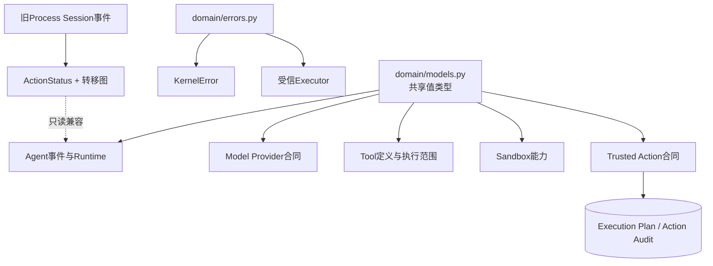
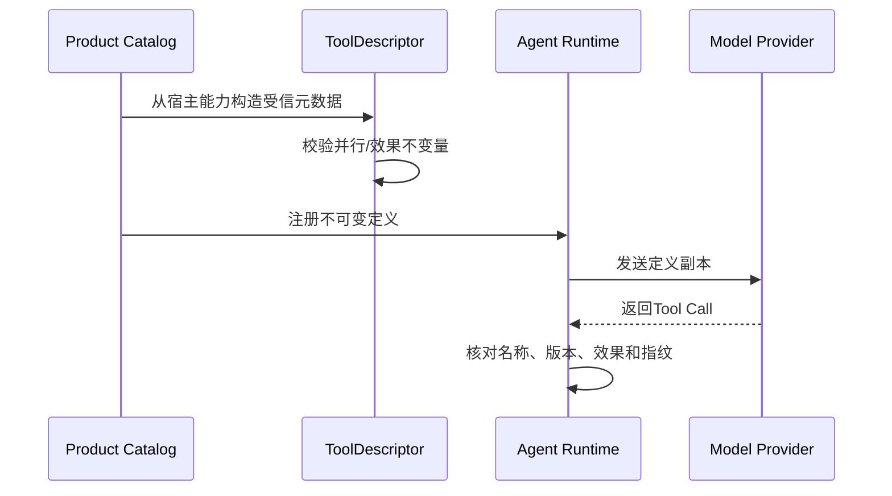
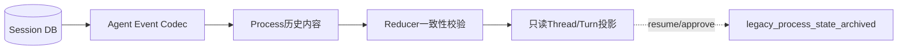

# Domain模块设计

## 1. 文档摘要

`harnessix.domain`只保存多个现行子系统共同依赖的最小基础类型和错误信号，不再承载独立Action服务的请求、快照、
Journal端口、工具注册表或Executor合同。0.9.1f3删除了`ActionRequest`、`ActionSnapshot`、`EffectReceipt`、
`ActionResult`等服务专用模型；当前执行领域合同位于`trusted_actions`与`execution`模块。

| 项目 | 当前事实 |
|---|---|
| 源码 | [`src/harnessix/domain/models.py`](../../src/harnessix/domain/models.py)、[`errors.py`](../../src/harnessix/domain/errors.py) |
| 当前共享类型 | `ContractModel`、Tool风险元数据、审批记录、Trace Context、时间函数 |
| 历史兼容类型 | `ActionStatus`和转移图，仅用于读取旧Process Session事件 |
| 已删除 | Action Service请求/结果/快照、Journal/Policy/Executor端口、Tool Registry |
| 新执行事实源 | [`trusted_actions/contracts.py`](../../src/harnessix/trusted_actions/contracts.py)、[`execution/contracts.py`](../../src/harnessix/execution/contracts.py) |

## 2. 需求背景

项目最初以framework-agnostic Action Plane起步，领域包同时定义公共HTTP合同、数据库状态机和执行端口。Coding Agent
产品形成后，这些类型造成三个问题：根包看起来仍是通用Action SDK、Agent Runtime可依赖第二套执行权威、维护者无法判断
哪些状态属于当前产品。架构收敛采用“删除执行实现、保留必要历史解码类型”的策略：新代码只使用当前合同，旧Session仍可回放，
但不能继续旧Process Action。

## 3. 设计目标与非目标

### 3.1 目标

1. 给Agent、Model、Tool、Sandbox和Trusted Action提供稳定、无基础设施依赖的值类型；
2. 所有Pydantic合同默认`extra=forbid`且冻结，拒绝未知字段和隐式修改；
3. 风险、效果、审批和Trace字段在进程内与持久事件中保持同义；
4. 保留旧Session反序列化需要的Action状态枚举和转移验证；
5. 通过导入方向阻止独立服务合同重新进入根包。

### 3.2 非目标

- 不提供HTTP请求或OpenAPI模型；
- 不拥有Session、Action Audit或Execution Plan持久化；
- 不注册工具或选择Executor；
- 不执行Policy、审批、外部调用或Reconcile；
- 不把历史`ActionStatus`作为新Trusted Action状态机使用。

## 4. 模块上下文与总体架构



依赖方向只能从具体模块指向Domain。Domain不得反向导入Session、数据库、HTTP、Provider SDK或产品配置。

## 5. 核心数据结构与字段设计

### 5.1 基础合同

| 类型 | 关键字段 | 约束 | 用途 |
|---|---|---|---|
| `ContractModel` | Pydantic配置 | `extra=forbid`、`frozen=True` | 所有共享值类型基类 |
| `EffectClass` | `read_only`、`idempotent_write`、`non_idempotent_write`、`destructive` | 闭集枚举 | 决定并发、审批和恢复边界 |
| `RiskLevel` | `low`至`critical` | 闭集枚举 | 风险展示和Policy输入 |
| `PolicyDecisionKind` | `allow`、`deny`、`require_approval` | 闭集枚举 | 当前Sandbox/执行Policy结论 |
| `TraceContext` | `traceparent`、可选`tracestate` | 长度受限；不等于业务身份 | 跨进程遥测关联 |

### 5.2 Tool描述

`ToolDescriptor`是模型可见目录和Runtime执行边界之间的摘要：

| 字段 | 含义 | 安全约束 |
|---|---|---|
| `name`、`version` | 稳定工具身份 | 调用时必须与注册事实一致 |
| `description`、`input_schema` | 模型可见说明与JSON Schema | 不是执行许可 |
| `effect_class`、`risk_level` | 可信宿主声明 | 模型不能覆盖 |
| `requires_idempotency` | 是否要求稳定效果身份 | 非幂等写通常为真 |
| `requires_approval` | 是否进入审批边界 | 由定义和Router共同验证 |
| `supports_reconciliation` | 是否允许只读对账 | 不等于允许自动重试 |
| `supports_parallel_calls` | 可并行执行 | 仅`READ_ONLY`允许为真 |

模型校验器强制“并行调用只能是只读工具”，避免注册错误在调度阶段变成并发副作用。

### 5.3 审批记录

`ApprovalDecision`是客户端提交的意图，只含结论、actor和可选原因；`ApprovalRecord`是持久事实，增加
`request_fingerprint`与`decided_at`。两者分离，防止调用者自行构造已持久化时间或绑定指纹。

### 5.4 历史Action状态

`ActionStatus`和`ALLOWED_ACTION_TRANSITIONS`仍由Agent Reducer读取，用于验证旧
`ProcessApprovalRequestContent/ProcessActionStateContent`事件没有倒退、伪造终态或跨Action错绑。新运行不会创建这些事件。
类型保留不表示旧Action Service仍可启动。

## 6. 流程、状态与数据流

### 6.1 当前Tool定义流



### 6.2 历史事件读取流



历史事件可以读取、投影和经Agent Protocol展示；恢复执行或作出新审批会返回稳定错误，数据库保持不变。

## 7. 接口设计与核心伪代码

```text
register_tool(descriptor):
    validate descriptor is strict and immutable
    require parallel => effect_class == READ_ONLY
    freeze a deep copy in runtime catalog

read_historical_process_event(event):
    decode Process approval/effect with ActionStatus
    validate identity, approval and monotonic transition
    project into Thread/Turn view
    if caller requests resume or decision:
        raise legacy_process_state_archived
```

根包`harnessix.__all__`为空；公共客户端只能从`harnessix.sdk`导入。该边界由治理测试固定，避免删除后的Action合同被重新包装为公共API。

## 8. 失败、恢复、取消与超时

| 场景 | 错误/行为 | 恢复 |
|---|---|---|
| 合同出现未知字段 | Pydantic验证失败 | 调用方按当前Schema重建 |
| Tool定义声明可并行写 | 定义构造失败 | 修正宿主定义，不允许运行时降级 |
| 审批指纹与调用不一致 | `approval_mismatch` | 重新读取当前审批事实 |
| 旧Process审批尝试决定 | `legacy_process_state_archived` | 只读查看；需要处置旧库时使用归档手册 |
| 旧Process等待尝试恢复 | `legacy_process_state_archived` | 不自动重放、不写失败终态 |
| Trace Context缺失 | 允许为空 | 新建本地遥测上下文，不伪造业务身份 |

Domain不拥有计时器或取消令牌。取消、Turn截止时间和Executor超时分别由Agent Runtime、Process/Sandbox和Provider层实现。

## 9. 持久化与兼容策略

Domain本身不连接数据库。值类型通过上层Event、Plan或Config合同序列化。兼容规则：

1. 当前合同字段修改必须产生新版本或迁移证据；
2. 旧Process事件字段不得删除，直到正式数据保留策略允许停止读取；
3. 旧Action Service请求Schema已从`spec/`删除，只能从删除前Git版本获取；
4. 绝不把旧Effect Journal自动转换为当前Action Audit，因为两者批准权威和身份模型不同。

## 10. 安全、权限与信任边界

- `ToolDescriptor`来自宿主，不来自模型；
- `TraceContext`只用于遥测关联，不能作为租户、用户或授权身份；
- `ApprovalDecision.actor`是审计字段，不替代上层身份认证；
- Domain类型不得包含Secret正文；产品配置只保存Secret引用；
- 历史兼容类型不能被当前Catalog注册为执行入口；
- 错误消息不得拼接参数正文、环境值或外部响应。

## 11. 测试、验证与验收

| 验收目标 | 自动化证据 |
|---|---|
| Session合同严格解析与回放 | [Session合同测试](../../tests/agent/test_session_contract.py) |
| 历史Process可读但不可变更 | [历史兼容测试](../../tests/agent/test_legacy_process_compatibility.py) |
| Trusted Action当前状态与失败语义 | [Router测试](../../tests/trusted_actions/test_router.py) |
| 根包和旧源码不回归 | [产品收敛门禁](../../tests/governance/test_product_runtime_convergence.py) |

此外，`mypy --strict`验证跨模块类型，生成Schema门禁验证仍受支持的合同，文档门禁验证源码与设计链接。

## 12. 源码映射与阅读顺序

1. [`domain/models.py`](../../src/harnessix/domain/models.py)：共享枚举、Tool、审批和Trace类型；
2. [`agent/models.py`](../../src/harnessix/agent/models.py)：当前Session合同与历史Process事件内容；
3. [`agent/reducer_support.py`](../../src/harnessix/agent/reducer_support.py)：历史Action转移一致性；
4. [`trusted_actions/contracts.py`](../../src/harnessix/trusted_actions/contracts.py)：当前Action Route合同；
5. [`execution/contracts.py`](../../src/harnessix/execution/contracts.py)：当前Execution Plan和批准检查点；
6. [`domain/errors.py`](../../src/harnessix/domain/errors.py)：Kernel错误基类与不确定效果信号。

## 13. 限制、风险与后续差距

- `ActionStatus`命名仍容易被误认为当前状态机；保留原因是历史事件兼容，后续可迁入显式legacy codec包；
- `ToolDescriptor.input_schema`仍是通用字典，Schema语义由注册方和生成测试保证；
- 根包不再重导出共享类型，内部开发者必须从明确模块导入；
- 当前只保证旧Process Session读取，不恢复已退役Worker Queue；旧数据库按独立归档流程处置。
