# Evals模块设计

## 1. 模块摘要

| 项目 | 内容 |
|---|---|
| 源码包 | [`src/harnessix/evals`](../../src/harnessix/evals/) |
| 当前职责 | 固定历史缺陷任务及版本；加载Wheel内置不可变Task Pack并安全物化固定Git基线；把固定无网检查Profile投影到产品Trusted Action/Container链；通过正式Agent、Patch审批和Eval专用Trusted Action组合运行任务；采集隐藏检查、Git、Session、Usage及Cost证据；确定性评分；顺序执行受控真实模型Campaign；冻结多任务Suite身份，以单写者状态机顺序执行/恢复Case，并从完整Campaign与Turn生成脱敏、可重算聚合报告；评测Compaction语义保持；把严格通过的单文件Eval候选受控写回精确历史仓库 |
| 非职责 | 不提供通用Benchmark平台、运行时动态第三方数据集、LLM Judge、分布式调度、供应商账单、在线排行榜、默认产品质量门禁、通用多文件交付或Windows原生执行；0.9.2c不包含最终十Case/三仓库数据集、Task Pack到Campaign正式适配器或真实Provider Suite基线 |
| 产品入口 | `harnessix coding-eval-campaign`是显式真实Campaign CLI；单次运行、评分、Compaction评测和Eval专用交付仅由库调用 |
| 核心依赖 | Agent Runtime、Session、Models、Context、Coding Tools、Managed Patch、Trusted Action Catalog/Gateway/Router、Process Supervisor、Artifact、Git Read和Workspace |
| 持久化 | 每Task Pack Run的0700目录、0755只读挂载Workspace和0600物化清单；每Eval Run私有JSON、Session、Execution Plan、Action Audit、Process Lease与Artifact；每Campaign私有Plan/State/Report；每Suite私有Plan/State/Case Reports/Report/Lock；Eval专用交付目录中的Package/State/Lock |
| 平台 | 当前实现是POSIX专用；`evals.__init__`会立即导入`fcntl`依赖模块，原生Windows连包级导入也不能保证 |
| 代码版本 | 0.9.2a实现`d42ab6c9c55f7f62da0fe8dade6455bd0b1f0373`已由CI 35456635653关闭；0.9.2b Task Pack实现`608c07a54543f436651aa4e55141acb7f76021fc`已由CI 35461708961关闭；0.9.2c Suite Runner实现`ffd3db4e83a807ab3029c479fb4650216240b4f7`已由CI 35465458256关闭 |
| 当前完成度 | 0.5.5单任务闭环、0.9.1f2c运行时收敛、0.9.2a Suite/Transcript、0.9.2b Task Pack和0.9.2c可恢复Suite Runner已完成；至少10 Case/3仓库离线基线及受控真实Provider基线仍属0.9.2d/e |

本文是[`contracts.py`](../../src/harnessix/evals/contracts.py)、
[`catalog.py`](../../src/harnessix/evals/catalog.py)、
[`materializer.py`](../../src/harnessix/evals/materializer.py)、
[`checks.py`](../../src/harnessix/evals/checks.py)、
[`runner.py`](../../src/harnessix/evals/runner.py)、
[`eval_process.py`](../../src/harnessix/product_config/eval_process.py)、
[`eval_action.py`](../../src/harnessix/product_config/eval_action.py)、
[`grader.py`](../../src/harnessix/evals/grader.py)、
[`campaign.py`](../../src/harnessix/evals/campaign.py)、
[`campaign_execution.py`](../../src/harnessix/evals/campaign_execution.py)、
[`task_pack_contracts.py`](../../src/harnessix/evals/task_pack_contracts.py)、
[`task_pack.py`](../../src/harnessix/evals/task_pack.py)、
[`task_pack_materializer.py`](../../src/harnessix/evals/task_pack_materializer.py)、
[`compaction.py`](../../src/harnessix/evals/compaction.py)和
[`delivery.py`](../../src/harnessix/evals/delivery.py)的当前事实源。测试原则和历史验收数字保留在
[测试与Eval规范](../testing-and-evals.md)，通用工程交付以[Delivery模块设计](delivery.md)为事实源。

## 2. 需求背景

Coding Agent的质量不能只由“模型给出了答案”“一次测试通过”或“生成了某个Golden Patch”证明。生产评测至少
要回答以下问题：

1. 任务是否来自一个不可变、可重现的真实缺陷基线；
2. 被评Agent是否看不到后续修复历史和宿主隐藏检查；
3. 模型是否在正式Runtime、Tool、审批、Trusted Action Router、Process Owner和持久化路径上完成任务；
4. 行为缺陷是否从失败变为通过，同时没有破坏回归行为；
5. 实际修改是否局限于允许路径、文件类型和数量；
6. Session是否证明Agent经历了“失败测试→Patch→通过测试→Git核对→结构化回答”；
7. Token、模型尝试、时延、成本和失败原因是否来自可重算事实；
8. 崩溃或取消后是否沿用同一Run，不重复请求、Action或评分；
9. 多次模型试验是否相互隔离，并在成本未知或达到停止线时停止新试验；
10. 严格通过的候选是否仍需独立批准和来源漂移复核后才能写回仓库。

Evals用版本化合同和持久证据回答这些问题。它衡量的是“固定任务在固定环境与预算下，通过正式产品内核得到的
可审计结果”，不是抽象模型智力，也不是供应商排行榜。

## 3. 设计目标、非目标与关键术语

### 3.1 当前设计目标

1. 任务绑定`task_id + task_version + fingerprint`、来源Commit、Tree OID和树SHA-256；
2. 历史源码通过`git archive`进入不含后续历史和Remote的私有单提交仓库；
3. 基线缺陷必须先确定失败，不能把失效任务计入模型失败率；
4. 隐藏检查命令由受信Catalog和宿主程序固定，模型不能选择命令或模式；
5. 每次Run拥有独立Workspace、Managed Patch副本、Session、Execution Plan、Action Audit、Process Lease和报告；
6. Patch继续走正式Patch账本，测试Process走产品同源Trusted Action合同及专用Supervisor Owner，不建立未审批执行旁路；
7. 评分不比较唯一补丁，而组合行为、回归、Git、Session顺序、回答和预算证据；
8. 原始Diff、测试输出和回答摘要不进入Eval报告，只保存必要字段和摘要；
9. Run状态和报告分别原子持久化，报告已落盘但状态未提交时可只补终态；
10. Campaign在任何请求前冻结运行ID、模型、价格和计费上下文；
11. Campaign只承认计划Run ID的有序完成前缀，并从原Turn重算Cost；
12. Provider自动重试关闭，成本不完整立即停止后续试验；
13. CLI默认禁网，未显式启用时不读取配置、凭据或文件；
14. Compaction语义评测使用人工Oracle，不调用额外模型裁判；
15. Eval候选写回必须重新证明Run通过、工作区未漂移、目标来源一致并绑定显式Approval。
16. Task Pack只按内置ID/版本加载，消费时重验资源根和Manifest，不信任调用方构造的加载对象；
17. Archive、许可证、Commit、Tree、Tree清单和固定Profile必须逐层绑定，检查只经现有产品无网Container链执行；
18. 相同Task Pack Run重开保留未提交Agent修改，但拒绝HEAD、清单、权限或Pack身份漂移。

### 3.2 明确非目标

- 不接受用户动态提供的任意Git URL、测试命令或隐藏检查脚本；
- 不在运行时下载第三方仓库；v1只发布权利链已审查的内置Archive，不提供远端对象存储或动态导入；
- 不提供SWE-bench、HumanEval等通用Benchmark适配；
- 不在评分器中执行模型、测试、Patch、Git写入或发布；
- 不使用LLM Judge，不评价代码风格、可维护性或唯一实现文本；
- 不提供请求内硬费用上限；费用停止只发生在完整试验之间；
- 不声称小样本P50/P95具有统计显著性；
- 不以Eval自动审批替代真实产品中的用户批准；
- 不把`evals.delivery`当作通用`harnessix.delivery`事务；
- 不支持创建、删除、重命名、二进制或多文件Eval候选交付；
- 不提供Windows实现、分布式Campaign Worker或跨主机Lock；
- 不自动提交、Push、建PR或改写来源仓库历史。

### 3.3 关键术语

| 术语 | 定义 |
|---|---|
| Historical Coding Eval | 固定在Harnessix真实历史缺陷上的内置任务定义 |
| Source Revision | 原仓库中包含缺陷的不可变Commit |
| Source Tree OID | Git对象层的来源Tree身份 |
| Baseline Tree SHA-256 | 对`git ls-tree -r -z --full-tree`完整输出计算的跨对象算法摘要 |
| Materialization | 从固定Git对象构造私有单提交仓库并发布ready清单 |
| Hidden Check | 随Harnessix包发布、不会进入Agent Workspace或模型上下文的宿主检查 |
| Managed Copy | Agent实际读写的第二层Managed Patch工作副本 |
| Run | 一个Run ID对应的一次独立任务、Session、效果账本和报告 |
| Grader | 从已存在Turn、检查观察和Git证据生成固定14项结论的纯函数 |
| Campaign | 同一任务、环境、模型、价格下2～20个有序独立Run |
| Suite | 多个固定任务和仓库的上层集合；每个Case绑定一个完整Campaign |
| Task Pack | Wheel内置、版本化且带来源/许可证/Archive/Task/Profile/Oracle摘要的固定任务包 |
| Task Pack Materialization | 从受信Archive重建私有单提交Git Workspace并发布可恢复身份清单 |
| Transcript Evidence | 从持久Turn派生的摘要、结构计数和人工干预计数，不保存正文 |
| Cost Completeness | `complete`、`partial`或`unknown`，禁止把未知Usage解释为零 |
| Eval Delivery | 0.5.5时期为严格通过的单文件候选提供的专用POSIX写回链 |
| Invalid | 任务或评测基础设施不可比较，不代表Agent任务能力失败 |

## 4. 当前能力边界

| 能力 | 状态 | 当前入口 | 证据边界 |
|---|---|---|---|
| 版本化任务合同 | 已实现 | `CodingEvalTask` | 严格Pydantic合同和Schema |
| 内置任务Catalog | 已实现 | `historical_coding_eval` | 仅1个任务、3个版本 |
| 历史仓库物化 | 已实现 | `materialize_historical_coding_eval` | 本地完整Git历史、POSIX私有目录 |
| 隐藏检查 | 已实现 | `run_historical_checks` | 固定Harnessix任务，不是第三方Sandbox |
| 正式Agent运行 | 已实现/已验收 | `run_historical_coding_eval` | Managed Copy、自动受限审批、Eval Trusted Action、Process Supervisor |
| 确定性评分 | 已实现 | `grade_coding_eval` | 固定14项，不评价主观代码质量 |
| Git证据 | 已实现 | `collect_git_evidence` | 最多200项状态，完整观察摘要 |
| Run恢复 | 已实现/已验收 | Run State + Session/Execution Plan/Action Audit/Process Lease/Patch账本 | 批准提交、结果投影丢失、取消和报告发布窗口 |
| Campaign聚合 | 已实现 | `build_coding_eval_campaign_report` | 完整计划才发布 |
| Suite合同、Runner与聚合 | 已实现/已验收 | `CodingEvalSuitePlan`、`run_coding_eval_suite`、`build_coding_eval_suite_report` | 五类任务、至少两仓库、计划先行、连续前缀和完整证据才发布；尚无最终真实任务集与正式Case适配器 |
| Task Pack合同与内置Catalog | 已实现/已验收 | `builtin_coding_eval_task_pack` | 双语言、来源/许可证/Archive/Profile/Oracle/整体摘要 |
| Task Pack物化与重开 | 已实现/已验收 | `materialize_task_pack_case` | 安全Tar、固定Git四重身份、脏工作区不覆盖 |
| Task Pack真实检查 | 已实现/已验收 | `build_task_pack_product_profile` | 两个固定Digest镜像经审批、只读、无网产品链先失败后通过 |
| 受控真实Campaign | 已实现/显式启用 | CLI + `run_coding_eval_campaign` | OpenAI Chat兼容Provider、顺序执行 |
| Compaction语义Eval | 已实现/显式调用 | `grade_compaction_semantics` | 人工短语Oracle、无独立持久化 |
| Eval单文件交付 | 已实现/显式调用 | `CodingEvalDeliveryStore` | POSIX、已有UTF-8普通文件 |
| 默认产品质量门禁 | 未装配 | 无 | 发布不依赖固定Eval阈值 |
| 动态数据集/第三方任务 | 未实现 | 无 | 仅允许Wheel内置且权利链已审查的Pack |
| 原生Windows | 未实现 | 包级导入受`fcntl`阻断 | 无Windows CI证据 |
| OS Sandbox | 未实现 | 环境值明确为`private-managed-copy-no-os-sandbox` | 仍有宿主用户权限 |

## 5. 模块上下文与信任边界

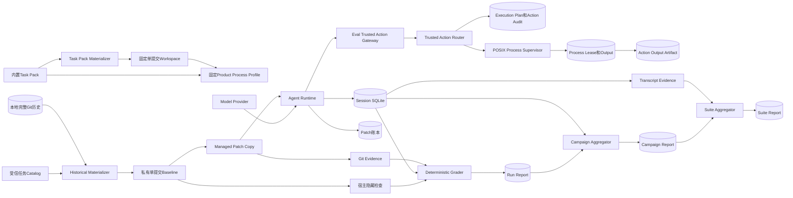
```mermaid
flowchart LR
    Catalog[受信任务Catalog] --> Materializer[Historical Materializer]
    TaskPack[内置Task Pack] --> PackMaterializer[Task Pack Materializer]
    PackMaterializer --> PackWorkspace[固定单提交Workspace]
    TaskPack --> FixedProfile[固定Product Process Profile]
    PackWorkspace --> FixedProfile
    Source[(本地完整Git历史)] --> Materializer
    Materializer --> Baseline[私有单提交Baseline]
    Baseline --> Checks[宿主隐藏检查]
    Baseline --> Copy[Managed Patch Copy]
    Provider[Model Provider] --> Runtime[Agent Runtime]
    Copy --> Runtime
    Runtime --> Session[(Session SQLite)]
    Runtime --> Patch[(Patch账本)]
    Runtime --> Gateway[Eval Trusted Action Gateway]
    Gateway --> Router[Trusted Action Router]
    Router --> Plan[(Execution Plan和Action Audit)]
    Router --> Owner[POSIX Process Supervisor]
    Owner --> Lease[(Process Lease和Output)]
    Lease --> Artifact[(Action Output Artifact)]
    Checks --> Grader[Deterministic Grader]
    Session --> Grader
    Copy --> GitEvidence[Git Evidence]
    GitEvidence --> Grader
    Grader --> Report[(Run Report)]
    Report --> Campaign[Campaign Aggregator]
    Session --> Campaign
    Campaign --> CampaignReport[(Campaign Report)]
    CampaignReport --> Suite[Suite Aggregator]
    Session --> Transcript[Transcript Evidence]
    Transcript --> Suite
    Suite --> SuiteReport[(Suite Report)]
```

**图示说明：** Catalog、物化器、隐藏检查、评分器、Campaign宿主和Suite聚合器是受信控制面。模型只能通过Agent Tool合同
观察和修改Managed Copy。Baseline、宿主检查、Run State、Session和报告不应成为模型工具可写资源。

### 5.1 受信输入

- 本地Harnessix源码仓库、固定Git和Python绝对路径；
- 代码内置`HistoricalCodingEval`定义、Task Pack Catalog、Archive、许可证和固定检查Profile；
- 运行根、Run ID、环境身份、价格快照和计费上下文；
- 预先冻结的Suite Plan、Case顺序、任务类别和Campaign Plan指纹；
- 已装配`ModelProvider`及其由宿主解析的Secret；
- Compaction人工Oracle；
- Eval Delivery目标仓库和人工`ApprovalRecord`。

### 5.2 不可信输入

- 模型文本、Tool Call参数、Patch正文和最终回答；
- 被评Workspace中的全部源码与Git工作区状态；
- Provider事件、实际模型身份和Usage元数据；
- 配置文件正文、文件类型、权限和JSON结构；
- 重开时磁盘上的Manifest、State、Report、SQLite与Delivery文件；
- 调用方自行构造的`LoadedCodingEvalTaskPack`、资源根和Container Engine路径；
- 目标仓库的Remote、HEAD、Tree、Index、Untracked内容和目录链。

### 5.3 禁止旁路

1. 模型不能指定Source Revision、隐藏检查命令或Python入口；
2. Eval Runner只批准Catalog声明的唯一`run_tests` Profile和允许Patch路径；
3. Process测试只接受宿主冻结的`run_tests {profile}`；Router保存Execution Plan和Action Audit，Supervisor保存真实Process Lease与输出，Session只投影批准和结果；
4. Campaign不能根据先前结果替换Run ID、任务版本、模型或价格；
5. `passed`报告不等于交付批准；专用Delivery仍要求独立Approval；
6. 任何`invalid`、成本未知、目标漂移或无法归因结果均不能降级为成功。
7. Task Pack调用方不能指定资源目录、URL、程序、参数、镜像、网络或Secret；公开加载对象在消费点必须重新按Catalog核验。

## 6. 包结构与推荐阅读顺序

| 文件 | 核心职责 | 建议顺序 |
|---|---|---:|
| [`contracts.py`](../../src/harnessix/evals/contracts.py) | Task、Environment、Observation、Run State、Report和14项检查合同 | 1 |
| [`catalog.py`](../../src/harnessix/evals/catalog.py) | 内置历史任务、版本和检查映射 | 2 |
| [`materializer.py`](../../src/harnessix/evals/materializer.py) | 来源验证、Archive、单提交Baseline、Manifest和重开 | 3 |
| [`_historical_check.py`](../../src/harnessix/evals/_historical_check.py) | 两类宿主隐藏行为检查 | 4 |
| [`checks.py`](../../src/harnessix/evals/checks.py) | Python Launcher和固定检查进程 | 5 |
| [`eval_process.py`](../../src/harnessix/product_config/eval_process.py) | 固定Profile、Launcher、Workspace、Capability与派生ProcessSpec绑定 | 6 |
| [`eval_action.py`](../../src/harnessix/product_config/eval_action.py) | Catalog、Router、Supervisor、输出Artifact及恢复组合 | 7 |
| [`runner.py`](../../src/harnessix/evals/runner.py) | 双层Workspace、Agent/Approval/Trusted Action、恢复和报告发布 | 7 |
| [`git_evidence.py`](../../src/harnessix/evals/git_evidence.py) | 复用Git Read采集状态和Diff摘要 | 7 |
| [`grader.py`](../../src/harnessix/evals/grader.py) | Session Transcript投影和固定评分 | 8 |
| [`run_state.py`](../../src/harnessix/evals/run_state.py) | 256 KiB私有Run状态原子文件 | 9 |
| [`report.py`](../../src/harnessix/evals/report.py) | Run/Campaign/Suite Plan、State与Report有界原子读写 | 10 |
| [`campaign_contracts.py`](../../src/harnessix/evals/campaign_contracts.py) | Campaign Plan、Trial、Summary和Report | 11 |
| [`campaign.py`](../../src/harnessix/evals/campaign.py) | 跨Run证据核对、Cost重算和聚合 | 12 |
| [`suite_contracts.py`](../../src/harnessix/evals/suite_contracts.py) | Suite Plan、Case、Transcript/Test证据、Rate、Summary和Report合同 | 13 |
| [`suite.py`](../../src/harnessix/evals/suite.py) | Turn脱敏投影、Campaign绑定与Suite报告聚合 | 14 |
| [`suite_execution_contracts.py`](../../src/harnessix/evals/suite_execution_contracts.py) | Suite执行Config、Case Result、State和白名单Run Report | 15 |
| [`suite_execution.py`](../../src/harnessix/evals/suite_execution.py) | Suite计划先行、顺序Case、前缀恢复、停止和报告发布 | 16 |
| [`execution_fs.py`](../../src/harnessix/evals/execution_fs.py) | Campaign/Suite共用0700目录和0600单写者锁 | 17 |
| [`task_pack_contracts.py`](../../src/harnessix/evals/task_pack_contracts.py) | Task Pack、Repository、License、Profile、Case、Review Oracle和Materialization严格合同 | 18 |
| [`task_pack.py`](../../src/harnessix/evals/task_pack.py) | 内置Catalog、no-follow资源核验和Product Profile投影 | 19 |
| [`task_pack_materializer.py`](../../src/harnessix/evals/task_pack_materializer.py) | 安全Tar解包、固定Git重建、清单发布和脏Workspace重开 | 20 |
| [`taskpacks/v1`](../../src/harnessix/evals/taskpacks/v1) | `harnessix-seed/v1` Manifest和双语言Archive发行资源 | 21 |
| [`campaign_execution_contracts.py`](../../src/harnessix/evals/campaign_execution_contracts.py) | 真实执行Config、State和白名单CLI结果 | 22 |
| [`campaign_execution.py`](../../src/harnessix/evals/campaign_execution.py) | 默认禁网、锁、顺序试验、费用停止和恢复 | 23 |
| [`campaign_cli.py`](../../src/harnessix/evals/campaign_cli.py) | 安全参数、0600配置读取和结果投影 | 24 |
| [`compaction_contracts.py`](../../src/harnessix/evals/compaction_contracts.py) | Compaction人工语义Oracle合同 | 25 |
| [`compaction.py`](../../src/harnessix/evals/compaction.py) | 无模型裁判的确定性短语检查 | 26 |
| [`delivery_contracts.py`](../../src/harnessix/evals/delivery_contracts.py) | 专用Change Package、Plan、Record和状态 | 27 |
| [`delivery.py`](../../src/harnessix/evals/delivery.py) | 严格通过候选的单文件POSIX写回 | 28 |
| [`__init__.py`](../../src/harnessix/evals/__init__.py) | 公共导出面 | 29 |

## 7. 组件架构与六条能力链

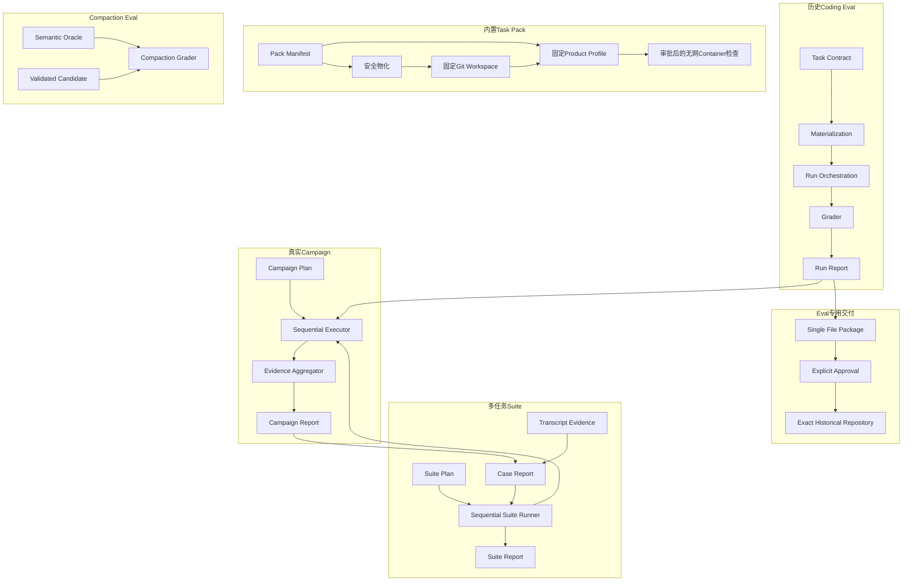
```mermaid
flowchart TB
    subgraph Historical[历史Coding Eval]
        T[Task Contract] --> M[Materialization]
        M --> R[Run Orchestration]
        R --> G[Grader]
        G --> RR[Run Report]
    end
    subgraph Campaigns[真实Campaign]
        CP[Campaign Plan] --> CE[Sequential Executor]
        RR --> CE
        CE --> CA[Evidence Aggregator]
        CA --> CR[Campaign Report]
    end
    subgraph Suites[多任务Suite]
        SP[Suite Plan] --> SE[Sequential Suite Runner]
        SE --> CE
        CR --> Case[Case Report]
        Transcript[Transcript Evidence] --> Case
        Case --> SE
        SE --> SR[Suite Report]
    end
    subgraph TaskPacks[内置Task Pack]
        TP[Pack Manifest] --> PM[安全物化]
        PM --> PW[固定Git Workspace]
        TP --> PP[固定Product Profile]
        PW --> PP
        PP --> PA[审批后的无网Container检查]
    end
    subgraph Compact[Compaction Eval]
        Oracle[Semantic Oracle] --> CG[Compaction Grader]
        Candidate[Validated Candidate] --> CG
    end
    subgraph LegacyDelivery[Eval专用交付]
        RR --> Package[Single File Package]
        Package --> Approval[Explicit Approval]
        Approval --> Target[Exact Historical Repository]
    end
```

六条链共享严格合同和摘要理念，但不是一个事务：

- Historical链产生单次Run事实；
- Campaign只读取完整Run事实并重算聚合；
- Suite Runner通过可信Case端口顺序执行/恢复Campaign，只持有跨Case计划、前缀和费用状态，不直接创建Provider或执行工具；
- Task Pack链提供Suite Case的固定来源与检查执行边界；到Campaign的正式Case适配器由0.9.2d完成；
- Compaction链不依赖Historical Run或Campaign；
- Eval Delivery读取严格通过Run，但使用独立JSON账本和文件写协议；
- 通用[Delivery](delivery.md)的Workspace Transaction、Blob CAS、Git Worktree/Commit/Push不参与Eval专用交付。

## 8. Historical Coding Eval总体数据流

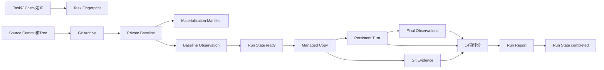
```mermaid
flowchart LR
    Def[Task和Check定义] --> Fingerprint[Task Fingerprint]
    GitObject[Source Commit和Tree] --> Archive[Git Archive]
    Archive --> Workspace[Private Baseline]
    Workspace --> Manifest[Materialization Manifest]
    Workspace --> BaselineCheck[Baseline Observation]
    BaselineCheck --> RunState[Run State ready]
    RunState --> Managed[Managed Copy]
    Managed --> Turn[Persistent Turn]
    Turn --> FinalCheck[Final Observations]
    Managed --> Evidence[Git Evidence]
    FinalCheck --> Grade[14项评分]
    Evidence --> Grade
    Turn --> Grade
    Grade --> Report[Run Report]
    Report --> Completed[Run State completed]
```

正文只存在于Source、Baseline、Managed Copy、Session/Artifact和专用Change Package。标准Run Report仅保存
检查输出摘要、Git摘要、回答摘要及结构化声明，不保存完整Diff和回答`summary`。

## 9. 任务与仓库合同

### 9.1 EvalRepository

`EvalRepository`固定：

| 字段 | 语义 | 约束 |
|---|---|---|
| `name` | 仓库稳定显示名 | 1～128个受限字符 |
| `origin` | 来源身份 | 1～2048字符；HTTP(S)不得内嵌用户名或密码 |
| `source_revision` | 缺陷Commit | 40～64位小写十六进制 |
| `baseline_tree_sha256` | 完整`ls-tree`摘要 | 64位SHA-256 |

Origin是身份字段，不是Clone指令。当前物化器只读取本地`source_root`，不会访问该URL。

### 9.2 CodingEvalTask

| 字段 | 语义 | 关键不变量 |
|---|---|---|
| `task_id/task_version` | 稳定任务和单调版本 | 版本至少1 |
| `repository` | 固定来源 | 完整参与Fingerprint |
| `prompt` | 模型任务文本 | 1～16384字符 |
| `allowed_changed_paths` | 允许修改的已有路径 | 1～64项、POSIX相对、唯一排序 |
| `required_test_profiles` | 模型必须运行的可见Profile | 1～32项、唯一排序 |
| `baseline_checks` | 基线必须失败的检查 | 必须等于`behavior_checks` |
| `behavior_checks` | 修复后必须通过 | 与Regression不相交 |
| `regression_checks` | 基线和修复后应保持通过 | 可为空、唯一排序 |
| `max_changed_files` | 实际变更数量上限 | 不超过允许路径数 |
| `budget` | Agent Turn正式预算 | 严格类型，不做字符串到数字强转 |
| `grader_version` | 评分语义版本 | 当前固定`coding-eval-grader/v1` |

`fingerprint`对完整规范JSON计算摘要。Prompt、预算、路径、检查或来源任一变化都会改变Fingerprint；已发布Run
和Campaign依赖精确版本及Fingerprint，不能原地改写任务定义。

## 10. 当前Catalog与版本演进

当前[`catalog.py`](../../src/harnessix/evals/catalog.py)只包含任务
`harnessix-openai-empty-incremental-call-id`：

| 版本 | 变化 | 累计Token预算 | 当前意义 |
|---:|---|---:|---|
| v1 | 初始真实缺陷任务 | 20,000 | 真实Campaign证明预算在目标读取前过早耗尽 |
| v2 | 只提高任务累计Token预算 | 100,000 | 排除已知错误截断，但最终回答协议仍不充分 |
| v3 | Prompt加入唯一裸JSON最终回答格式 | 100,000 | 三次真实Campaign全部严格通过 |

三个版本共享来源Commit `9f24961840fa704e7c7a344c648164d8afe793b7`、Source Tree OID、树摘要、
唯一允许路径`src/harnessix/models/_chat_stream.py`、`focused` Profile、行为检查和身份回归检查。

无版本查询返回最新版本；指定版本精确读取；未知任务或版本统一`eval_task_not_found`。Catalog是代码，
没有运行时注册、禁用、签名、数据集发现或外部插件机制。

## 11. 历史源码物化

### 11.1 正常流程

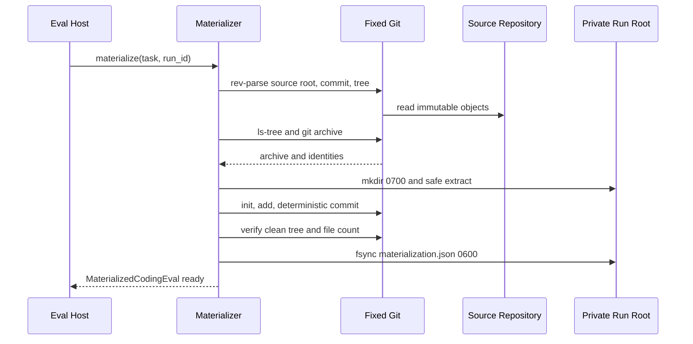
```mermaid
sequenceDiagram
    participant H as Eval Host
    participant M as Materializer
    participant G as Fixed Git
    participant S as Source Repository
    participant R as Private Run Root
    H->>M: materialize(task, run_id)
    M->>G: rev-parse source root, commit, tree
    G->>S: read immutable objects
    M->>G: ls-tree and git archive
    G-->>M: archive and identities
    M->>R: mkdir 0700 and safe extract
    M->>G: init, add, deterministic commit
    M->>G: verify clean tree and file count
    M->>R: fsync materialization.json 0600
    M-->>H: MaterializedCodingEval ready
```

### 11.2 来源和Archive约束

- Git路径必须解析为可执行普通文件；
- Source必须精确等于`git rev-parse --show-toplevel`；
- Commit、Tree OID、完整`ls-tree` SHA-256和文件数同时匹配；
- Git环境关闭系统/全局配置、Pager、Terminal Prompt和Optional Locks；
- Archive最大64 MiB、成员最多100,000、展开总大小最大64 MiB；
- 只允许目录和普通文件，拒绝绝对路径、空段、`.`、`..`、`.git`、链接和特殊成员；
- 新Baseline使用固定作者、邮箱、时间和消息，保证相同Tree得到确定Commit；
- 物化后再核对Tree摘要、文件数和干净Status。

### 11.3 Manifest与重开

`CodingEvalMaterialization`记录Run/Task/Fingerprint、Source Revision/Tree/Archive摘要、Baseline Revision/Tree
摘要、文件数、Archive字节、Git版本、Workspace目录、状态和创建时间。清单写入是ready发布点。

同Run ID已存在时不覆盖：只读取0600普通Manifest，验证0700 Run/Workspace目录和不可变HEAD/Tree/File
Count。允许工作树保留未提交修改，使中断后的Agent工作可继续；实际脏内容由Git Evidence和Grader判断。
已有目录但无有效Manifest被视为不完整，不自动接管或删除。

## 12. 隐藏检查与Python入口

`historical_python_launcher`在Run Root的`host/python`原子生成0700 Shell入口，正文固定为调用宿主配置的
词法绝对Python路径。这样既保留venv语义，又不把解释器链接放进Agent Workspace。重开要求既有入口正文和
权限完全相同，不就地“修复”漂移入口，避免已批准Process身份变化。

检查argv固定为：

```text
python -I -B <wheel中的_historical_check.py> <workspace> <mode>
```

`run_historical_checks`的每个检查使用独立`HostProcessRuntime`：

| 控制 | 值 |
|---|---:|
| 单检查Timeout | 60秒 |
| stdout捕获 | 16 KiB |
| stderr捕获 | 16 KiB |
| 总观察停止阈值 | 128 KiB |
| 正常行为退出码 | 0=通过，1=检查失败 |
| 基础设施失败 | 其他退出码、非`exited`、管道非EOF |

持久`EvalTestObservation`只包含Check ID、阶段、通过标志、Return Code、耗时和双流观察摘要的组合SHA-256。
取消传播`TurnCancelled`，不能伪装成行为失败。

## 13. 双层Workspace隔离

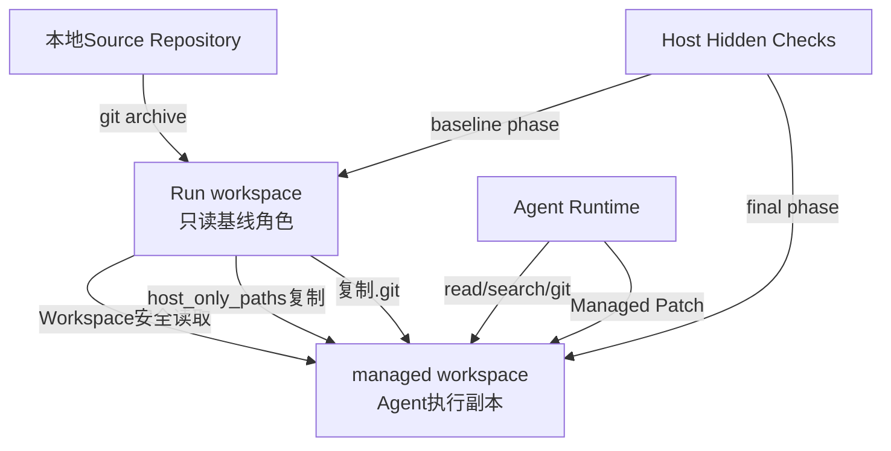
```mermaid
flowchart TB
    Source[本地Source Repository] -->|git archive| Baseline[Run workspace<br/>只读基线角色]
    Baseline -->|Workspace安全读取| Managed[managed workspace<br/>Agent执行副本]
    Baseline -->|host_only_paths复制| Managed
    Baseline -->|复制.git| Managed
    Agent[Agent Runtime] -->|read/search/git| Managed
    Agent -->|Managed Patch| Managed
    Hidden[Host Hidden Checks] -->|baseline phase| Baseline
    Hidden -->|final phase| Managed
```

Provision先验证Baseline缺陷确实失败且Git完全干净，再枚举全部Tracked Path。能通过`Workspace.parts`的路径
进入Managed Patch复制；被工具策略拒绝的Host-only路径必须与Catalog精确相等，当前为`.env.example`。
随后复制Host-only文件和`.git`，再次验证Managed Copy的HEAD和工作区。这个结构隐藏后续历史与检查程序，
但不是操作系统权限Sandbox。

## 14. Run State合同与状态机

`CodingEvalRunState`是Run恢复锚点：

| 字段组 | 作用 |
|---|---|
| Run/Task/Fingerprint/Baseline | 防止跨任务、跨版本或跨基线重开 |
| `execution_workspace_id` | 重开同一Managed Patch副本 |
| `thread_id/turn_id` | 绑定唯一Session事实 |
| `baseline_observations` | 固化基线缺陷可复现证据 |
| `environment` | 固定Harnessix Revision、Provider、Model、Platform、Isolation |
| `report_file/report_sha256` | 报告发布位置和完整性 |
| `started_at/updated_at` | 完整Eval墙钟边界 |

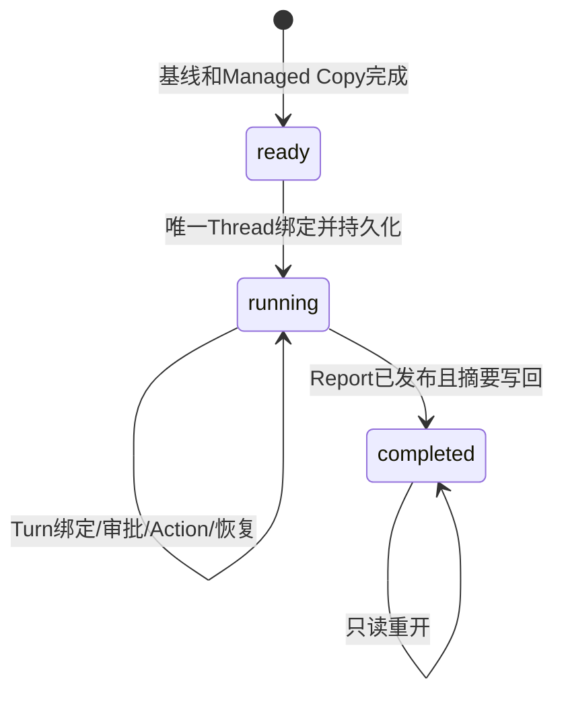
```mermaid
stateDiagram-v2
    [*] --> ready: 基线和Managed Copy完成
    ready --> running: 唯一Thread绑定并持久化
    running --> running: Turn绑定/审批/Action/恢复
    running --> completed: Report已发布且摘要写回
    completed --> completed: 只读重开
```

不变量：

- `ready`不能有Thread、Turn或Report；
- `running`必须有Thread，允许Turn尚未绑定；
- `completed`必须同时有Thread、Turn和Report摘要；
- Turn存在则Thread必须存在；
- Baseline观察唯一排序、阶段全为`baseline`且均失败；
- 更新时间不能早于开始时间。

Run状态最大256 KiB，写入使用0600唯一临时文件、文件`fsync`、同目录`replace`和目录`fsync`；读取拒绝
链接、非普通文件、权限放宽、空文件、超限和严格合同错误。

## 15. Agent Runtime编排

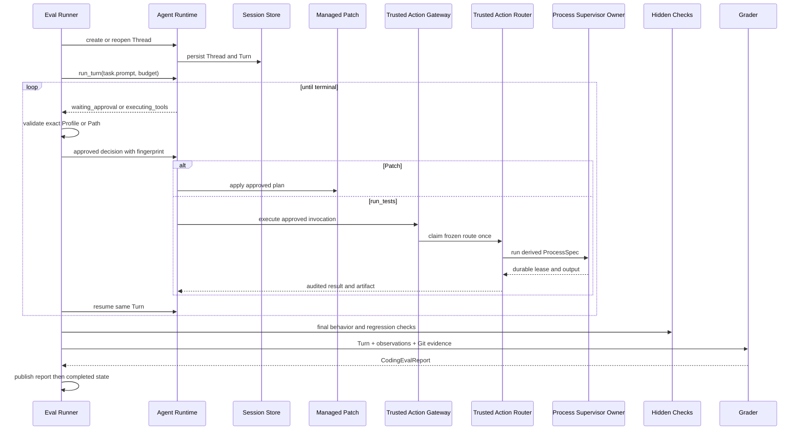
```mermaid
sequenceDiagram
    participant E as Eval Runner
    participant A as Agent Runtime
    participant S as Session Store
    participant P as Managed Patch
    participant G as Trusted Action Gateway
    participant R as Trusted Action Router
    participant O as Process Supervisor Owner
    participant C as Hidden Checks
    participant D as Grader
    E->>A: create or reopen Thread
    A->>S: persist Thread and Turn
    E->>A: run_turn(task.prompt, budget)
    loop until terminal
        A-->>E: waiting_approval or executing_tools
        E->>E: validate exact Profile or Path
        E->>A: approved decision with fingerprint
        alt Patch
            A->>P: apply approved plan
        else run_tests
            A->>G: execute approved invocation
            G->>R: claim frozen route once
            R->>O: run derived ProcessSpec
            O-->>R: durable lease and output
            R-->>A: audited result and artifact
        end
        E->>A: resume same Turn
    end
    E->>C: final behavior and regression checks
    E->>D: Turn + observations + Git evidence
    D-->>E: CodingEvalReport
    E->>E: publish report then completed state
```

Runner明确装配：

- `SQLiteSessionStore`与`SQLiteArtifactStore`；
- `ManagedPatchBridge`；
- `CodingToolRuntime`，含固定Git读取；
- `EvalTrustedActionComposition`，内部持有`ProductActionCatalog`、`RouterBackedAgentActionGateway`、`TrustedActionRouter`、`SQLiteExecutionPlanStore`、`SQLiteActionAuditStore`和`PosixProcessSupervisor`；
- 唯一`focused` Profile及由宿主Launcher、Profile、Workspace Snapshot和Supervisor Capability形成的Executor Evidence；
- 同一个`Observability`实例进入Agent Runtime，默认No-op；Trusted Action事实由持久Plan/Audit/Lease/Artifact诊断。

当前Runner只接受唯一Required Test Profile和唯一Behavior Check，否则`eval_task_unsupported`。这是实现限制，
不是`CodingEvalTask`通用合同允许范围。Eval组合诚实声明`host_guarded + network=full`，不把受管副本描述为OS Sandbox。

## 16. Eval自动审批边界

等待审批时，Runner要求Turn投影中恰有一个未决`PatchApprovalRequestContent`或
`TrustedActionApprovalRequestContent`，并找到同Call ID的唯一已完成Tool Call：

| 类型 | 可批准条件 | 其他输入 |
|---|---|---|
| Trusted Process | Tool必须为`run_tests`；参数只能有`profile`；Profile属于任务声明；展示类型必须为`process` | `eval_approval_denied` |
| Patch | Tool必须为`apply_patch`；Plan路径属于`allowed_changed_paths` | `eval_approval_denied` |

批准记录的Actor固定为`harnessix-eval-runner`，并绑定请求Fingerprint。该策略只用于受信Eval实验自动化；
它没有用户交互，也没有证明真实产品的人类审批体验。Batch Patch审批不在Runner允许类型中。

## 17. Run恢复与取消

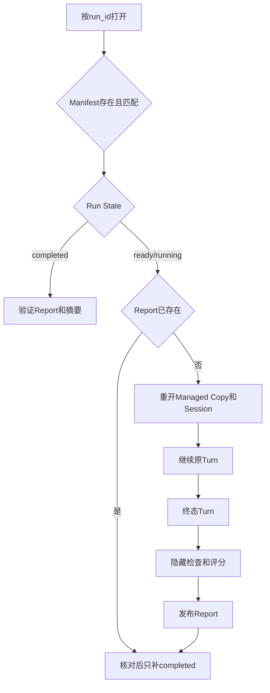
```mermaid
flowchart TD
    Open[按run_id打开] --> Materialized{Manifest存在且匹配}
    Materialized --> State{Run State}
    State -->|completed| VerifyReport[验证Report和摘要]
    State -->|ready/running| ExistingReport{Report已存在}
    ExistingReport -->|是| CompleteState[核对后只补completed]
    ExistingReport -->|否| Reopen[重开Managed Copy和Session]
    Reopen --> Drive[继续原Turn]
    Drive --> Terminal[终态Turn]
    Terminal --> Final[隐藏检查和评分]
    Final --> Publish[发布Report]
    Publish --> CompleteState
```

关键恢复窗口：

1. `after_ready`后退出：重开ready状态，创建或验证唯一空Thread；
2. `after_thread_bound`后退出：沿用Thread，不创建第二个；
3. `after_turn_bound`后退出：沿用Turn和`request_id=coding-eval:<run_id>`；
4. Patch批准后退出：Managed Patch账本对账；
5. Trusted Process批准后退出：沿用同Plan与Approval，不重新批准；Router终态已提交但Session结果丢失时只重建结果投影，不重复启动Process；
6. 外部取消：Agent Session保存CANCELLED；重开读取终态并评分为Runtime失败；
7. Report写入后状态提交前退出：读取并重算Report身份，只补`report_sha256`和`completed`；
8. completed重开：不创建Provider调用，不运行隐藏检查，不重评分。

取消由`CancelToken`包围Agent、Trusted Action与Supervisor操作，并在循环、检查及Git读中检查。当前Campaign没有为每个Run提供
独立取消恢复结果；取消会保留已持久事实，由下一次同配置执行重开。

### 17.1 f2c恢复一致性与失败语义

| 场景 | 权威事实 | 恢复动作 | 禁止行为 |
|---|---|---|---|
| Approval已提交、Session尚未继续 | Execution Plan Approval + Session Decision | 继续同Turn并Claim同Plan | 创建第二个Plan或再次审批 |
| Router已终态、Session Tool Result丢失 | Action Audit终态 + Process Output + Artifact摘要 | 仅重建原执行结果投影，`origin=execution` | 再次启动Process或误标为Reconcile成功 |
| Process运行中宿主退出 | Process Lease/Owner记录 | Router转`unknown`，Supervisor只观察并对账 | 依据历史PID重放命令 |
| Process不存在 | 无Lease | Reconcile返回`process_not_started`失败 | 首次启动或补执行 |
| 测试退出码1 | 可信终态退出码 | Action成功、公开`passed=false`，模型继续修复 | 把测试失败误作基础设施失败 |
| Timeout/取消/输出上限/清理失败 | Lease stop reason | 形成失败或UNKNOWN结果 | 伪造`passed=false`后继续 |
| 未完成旧Run含`effects.sqlite` | 旧账本 | `eval_runtime_upgrade_required` | 跨账本静默迁移或双重消费 |

`passed`不是Executor可自由写入的字段。它由`TrustedProcessOutputDocument`中的`state=exited`、`stop_reason=exited`和
`returncode == 0`确定性派生，Artifact读取再次按同一投影验证。非零退出形成可审计的测试失败事实，启动与效果证据
不完整则保持失败、UNKNOWN或人工处置，二者不能互换。

## 18. Git Evidence

`collect_git_evidence`复用[`GitReadRuntime`](../../src/harnessix/tools/git.py)，先读取最多200项完整Status，再
读取Worktree Diff。只要Status截断、条目数不等于Total或缺少HEAD，就拒绝评分。

`EvalGitEvidence`保存：

- Baseline Revision和Baseline Tree SHA-256；
- 当前HEAD；
- 完整Changed、Staged、Untracked和Unsupported路径集合；
- Status Revision；
- 完整已观察Diff SHA-256和字节数。

Rename会同时把原路径和新路径加入Changed集合；Staged、Untracked和Unsupported必须是Changed子集。报告不
保存Diff正文。Git Read自身的模型展示前缀不影响完整观察摘要，但大变更Status超过200项时整体不可评分。

## 19. Grader输入与Transcript投影

`grade_coding_eval`是纯函数。它不重新运行测试或读取磁盘，而从以下输入生成报告：

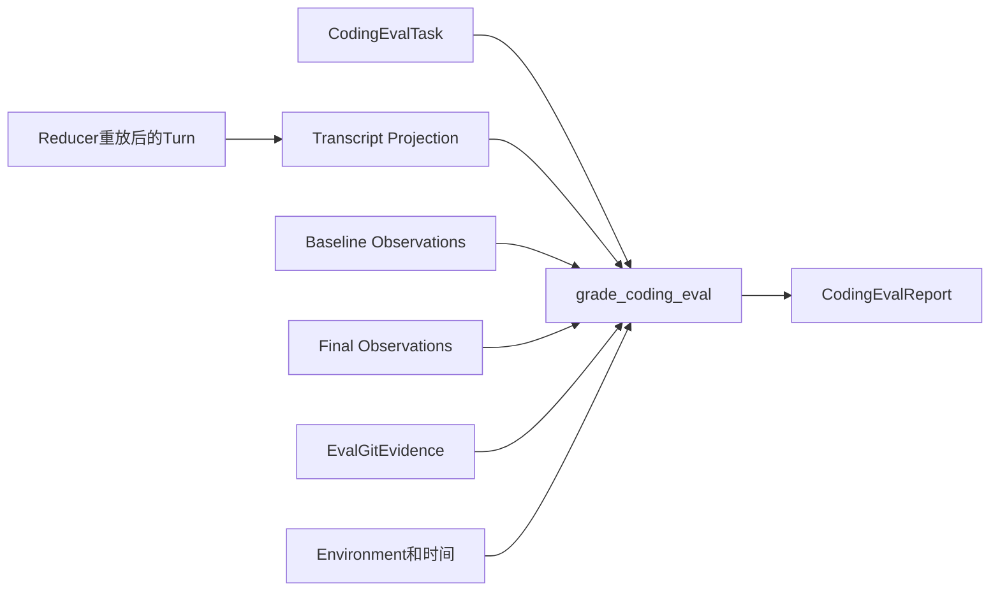
```mermaid
flowchart LR
    Task[CodingEvalTask] --> Grade[grade_coding_eval]
    Turn[Reducer重放后的Turn] --> Transcript[Transcript Projection]
    Transcript --> Grade
    Base[Baseline Observations] --> Grade
    Final[Final Observations] --> Grade
    Git[EvalGitEvidence] --> Grade
    Env[Environment和时间] --> Grade
    Grade --> Report[CodingEvalReport]
```

Transcript只读取Completed Item：

- Tool Call建立`call_id → tool/arguments`映射；
- 已批准Approval计数；
- 成功`run_tests`的Profile/Passed和位置；
- 已应用单文件或Batch Patch的位置；
- 成功`git_status`和`git_diff`的位置；
- 最后一个Assistant Message作为最终回答候选。

最终回答必须是正文唯一裸JSON并满足`EvalFinalAnswer`严格合同。报告只保留回答正文SHA-256、UTF-8字节数、
解析标志、Changed Paths和Test声明，不保存`summary`。

## 20. 固定14项评分

| 顺序 | Code | 通过条件 | 失败分类 |
|---:|---|---|---|
| 1 | `task_repository_matched` | Git基线树摘要等于任务来源 | `eval_infrastructure` |
| 2 | `baseline_checks_failed` | 基线集合精确且全部失败 | `eval_infrastructure` |
| 3 | `final_check_set_matched` | 最终集合精确、无缺失/额外、阶段正确 | `eval_infrastructure` |
| 4 | `turn_completed` | Turn为COMPLETED | `runtime` |
| 5 | `behavior_checks_passed` | 行为检查精确且全部通过 | `correctness` |
| 6 | `regression_checks_passed` | 回归检查精确且全部通过 | `regression` |
| 7 | `head_unchanged` | HEAD等于Baseline Revision | `forbidden_edit` |
| 8 | `allowed_changes` | 变更非空、在Allowlist内、无Untracked/Unsupported且Diff非空 | `forbidden_edit` |
| 9 | `change_count` | 1～`max_changed_files` | `forbidden_edit` |
| 10 | `clean_index` | 无Staged Path | `forbidden_edit` |
| 11 | `test_feedback_order` | 每个Profile在首个Patch前失败、Patch后通过且最后一次通过 | `correctness` |
| 12 | `git_feedback_order` | 通过测试后依次成功执行Status、Diff，最后才回答 | `correctness` |
| 13 | `final_answer_consistent` | JSON路径等于Git路径，Profile集合精确且全声明通过 | `final_answer` |
| 14 | `budget_respected` | Model Steps和累计Token不超过任务预算 | `budget` |

报告反序列化时要求上述Code顺序完整、Category不可重分类，Failure Categories必须从失败项重算，Changed
Files必须等于Git路径数量。删除失败项或手改Outcome不能通过合同。

## 21. Outcome与失败分类

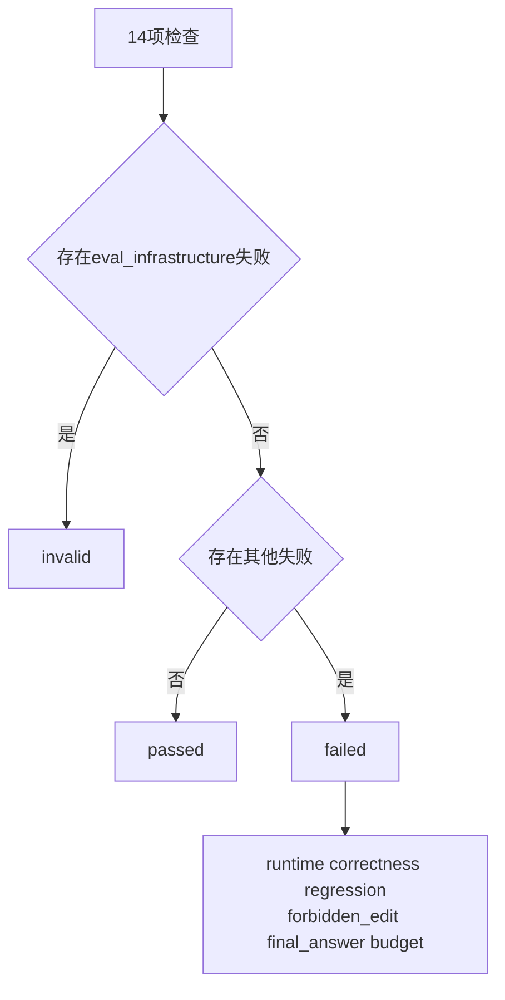
```mermaid
flowchart TD
    Checks[14项检查] --> Infra{存在eval_infrastructure失败}
    Infra -->|是| Invalid[invalid]
    Infra -->|否| Any{存在其他失败}
    Any -->|否| Passed[passed]
    Any -->|是| Failed[failed]
    Failed --> Categories[runtime correctness regression<br/>forbidden_edit final_answer budget]
```

`invalid`表示运行不可用于能力比较，例如来源树不匹配、基线缺陷未复现或最终检查集合漂移。它优先于
Provider/Runtime/Task分类。`failed`表示任务基线有效，但Agent、模型或预算未满足合同。一份报告可同时包含
多个细分类；Campaign再按固定优先级压缩为一个主分类。

## 22. Run Report与持久化

`CodingEvalReport`包括：

- Run/Task/Fingerprint/Grader Version；
- Outcome和有序Failure Categories；
- Environment及开始/完成时间；
- 固定14项`EvalCheck`；
- Baseline/Final Observation；
- Git Evidence；
- 可选脱敏Final Answer Evidence；
- 时延、步骤、输入/输出Token、Tool Call、Approval和Changed File计数。

Report最大1 MiB。写入采用0600临时文件、`fsync`、`replace`和目录`fsync`，拒绝目标符号链接。读取要求
普通文件和大小上限，但与Run State、Campaign文件不同，`read_eval_report`当前没有强制0600权限；因此
部署必须保护Run Root，不能把Reader的宽松模式误认为报告公开。

## 23. Campaign Plan合同

`CodingEvalCampaignPlan`必须在首个真实请求前冻结：

| 字段 | 作用 |
|---|---|
| `campaign_id` | Campaign唯一身份，不能与任一Run ID相同 |
| Task ID/Version/Fingerprint | 固定可比较任务 |
| `environment` | Harnessix Revision、Provider、Model、Platform、Isolation |
| `run_ids` | 2～20个唯一且有序的独立Run |
| `price` | 版本化Price Snapshot |
| `billing_context` | Provider、Region、Service Tier、Inference Mode和Cache TTL |
| `created_at` | 必须位于价格快照有效期 |

Environment Model必须等于Price Model；Billing Context各维度必须等于Price范围；Plan Fingerprint对完整
合同计算摘要。既有`campaign-plan.json`存在时必须与配置逐字段完全相等。

### 23.1 Suite Plan、Transcript与聚合合同

0.9.2a在Campaign之上增加纯证据层，不改变Campaign单任务不变量：

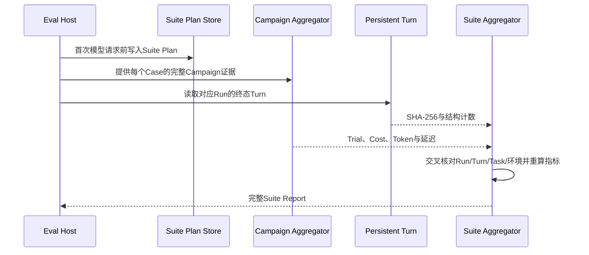
```mermaid
sequenceDiagram
    participant H as Eval Host
    participant P as Suite Plan Store
    participant C as Campaign Aggregator
    participant T as Persistent Turn
    participant S as Suite Aggregator
    H->>P: 首次模型请求前写入Suite Plan
    H->>C: 提供每个Case的完整Campaign证据
    H->>T: 读取对应Run的终态Turn
    T-->>S: SHA-256与结构计数
    C-->>S: Trial、Cost、Token与延迟
    S->>S: 交叉核对Run/Turn/Task/环境并重算指标
    S-->>H: 完整Suite Report
```

| 合同 | 重点字段 | 失败关闭条件 |
|---|---|---|
| `CodingEvalSuitePlan` | Suite ID/Version、Environment、Cases | 少于五Case、缺任一任务类型、少于两仓库、Case/Task/Campaign重复 |
| `CodingEvalSuiteCasePlan` | Case ID、Kind、Task身份、Repository、Campaign指纹 | Task或仓库身份不能与实际Campaign精确绑定 |
| `CodingEvalTranscriptEvidence` | Run/Turn/Status、Turn摘要、结构与干预计数 | 决定数超过请求数、回答数超过问题数、非冻结Turn |
| `CodingEvalTrialTestEvidence` | Run、Outcome、检查总数和通过数 | 结论与计数不一致；Suite没有任何适用测试 |
| `CodingEvalSuiteCaseReport` | 完整Campaign、Transcript、Test | Run顺序、Turn、状态、尝试或Token不一致 |
| `CodingEvalSuiteSummary` | 三种率、Token、Cost、延迟 | 分子/分母/基点不可重算、币种混合、计数越界 |
| `CodingEvalSuiteReport` | Plan、Case、Summary、Completed At | 缺Case、越序、环境漂移、摘要篡改或完成时间不一致 |

`build_transcript_evidence`对完整规范Turn计算SHA-256，但输出不携带Prompt、回答、Tool参数/输出、Diff、路径或Actor。
`harnessix-eval-runner`决定单独计作自动审批；其他Actor、未决审批、Question Request、首条任务输入后的User Message和
`manual_intervention`计为人工干预。普通恢复成功不计人工干预。

`build_coding_eval_suite_report`按Plan顺序调用既有Campaign聚合器，然后将每个Trial的Run ID、Turn ID、终态、模型尝试、
Token和测试证据交叉绑定。计划指纹、Campaign报告指纹和最终Summary均可从嵌套事实重算；任何Case缺失时不发布部分报告。
Plan最大512 KiB，Report最大8 MiB，沿用`report.py`的拒绝符号链接、0600、临时文件、文件/目录`fsync`和原子替换。

0.9.2a实现合同、投影、聚合和文件边界；Task Pack已由0.9.2b完成并验收。0.9.2c在这些合同之上增加执行状态机，
但至少10 Case/3仓库基线及真实Provider运行仍属于0.9.2d/e，不能由本节能力外推。

### 23.2 Suite执行状态、停止与恢复

[`CodingEvalSuiteRunConfig`](../../src/harnessix/evals/suite_execution_contracts.py)冻结Plan、与Case顺序一致的完整
Campaign Plans、规范绝对Work Root和单币种总费用停止线。全部Campaign Run ID必须跨Case唯一；任务、环境、价格币种、
Campaign指纹或停止线变化都会改变配置Fingerprint。

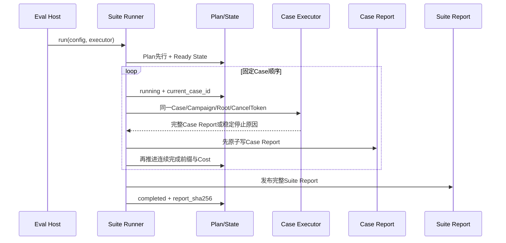
```mermaid
sequenceDiagram
    participant H as Eval Host
    participant S as Suite Runner
    participant P as Plan/State
    participant E as Case Executor
    participant C as Case Report
    participant R as Suite Report
    H->>S: run(config, executor)
    S->>P: Plan先行 + Ready State
    loop 固定Case顺序
        S->>P: running + current_case_id
        S->>E: 同一Case/Campaign/Root/CancelToken
        E-->>S: 完整Case Report或稳定停止原因
        S->>C: 先原子写Case Report
        S->>P: 再推进连续完成前缀与Cost
    end
    S->>R: 发布完整Suite Report
    S->>P: completed + report_sha256
```

Runner不持有Provider、Agent、审批和工具执行逻辑，只通过可信Case端口调用或恢复下层Campaign。重开扫描固定
`cases/case-NNN`槽位：Case Report超前于State时校验后推进一次；State声称完成但报告缺失、报告出现在证据缺口之后、
Case/Campaign身份不一致或Cost不能重算时失败关闭。Case目录按计划序号命名，不把业务Case ID用作路径。

`ready/running/stopped/completed`是四个状态。`stopped`包含`cancelled`、`fee_limit_reached`、`cost_unknown`、
`evidence_missing`或`runtime_failed`，默认重开只返回白名单结果；只有`resume=True`允许重入当前Case。未捕获崩溃保留
`running`，重开沿用同一Case、Campaign Plan、Run IDs和Case Root，由Campaign/Run权威事实恢复。完整设计见
[0.9.2c详细设计](../changes/m09-2c-recoverable-suite-runner.md)。

### 23.3 Task Pack、物化与固定Profile

Task Pack把“任务定义”“来源代码”和“检查执行”拆成三个相互核验的边界：

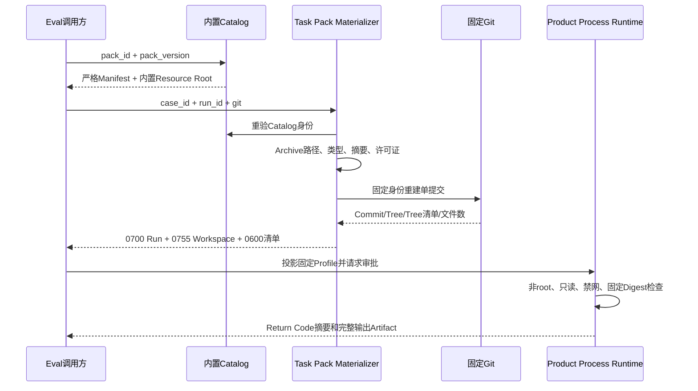
```mermaid
sequenceDiagram
    participant U as Eval调用方
    participant C as 内置Catalog
    participant M as Task Pack Materializer
    participant G as 固定Git
    participant P as Product Process Runtime
    U->>C: pack_id + pack_version
    C-->>U: 严格Manifest + 内置Resource Root
    U->>M: case_id + run_id + git
    M->>C: 重验Catalog身份
    M->>M: Archive路径、类型、摘要、许可证
    M->>G: 固定身份重建单提交
    G-->>M: Commit/Tree/Tree清单/文件数
    M-->>U: 0700 Run + 0755 Workspace + 0600清单
    U->>P: 投影固定Profile并请求审批
    P->>P: 非root、只读、禁网、固定Digest检查
    P-->>U: Return Code摘要和完整输出Artifact
```

[`CodingEvalTaskPack`](../../src/harnessix/evals/task_pack_contracts.py)要求Repository、Profile和Case按ID唯一排序，
至少覆盖两种语言。Repository同时保存来源Commit、Tree OID、原始`ls-tree`清单SHA-256、Archive SHA-256/大小/
文件数和许可证事实；Profile保存Digest镜像、绝对程序、固定参数及资源上限；Case必须让`CodingEvalTask.repository`
与Pack Repository精确相等，并只绑定一个同语言Profile。Review Case必须且只能携带确定性Oracle。

[`builtin_coding_eval_task_pack`](../../src/harnessix/evals/task_pack.py)只接受代码Catalog中的ID和版本。Root在解析前先
`lstat`拒绝Symlink；Manifest/Archive以no-follow方式有界读取。消费点再次调用内置加载器，要求完整Manifest和绝对
Resource Root与Catalog一致，因此调用方伪造`LoadedCodingEvalTaskPack`不能把任意本地Tar交给物化器。

[`materialize_task_pack_case`](../../src/harnessix/evals/task_pack_materializer.py)拒绝绝对路径、`.`/`..`、`.git`、Link、
Device和其他特殊Tar成员。固定Git环境重建Commit后，同时核对Commit、Tree OID、原始Tree清单摘要和文件数。相同Run
重开只核对HEAD与0600清单，不覆盖未提交工作树；HEAD提交漂移、清单不匹配、权限或目录类型变化均失败关闭。

物化目录采用`run_root=0700/workspace=0755`：0700父目录维持宿主私有边界，0755直接bind mount允许产品Container固定
用户`65532:65532`读取普通文件。Container只获得Workspace只读挂载，不获得父目录和物化清单。

`build_task_pack_product_profile`仅为Pack Profile绑定当前宿主普通可执行Engine；镜像、程序、参数、Timeout、输出、CPU、
内存、PID、无Selector、无Secret和`network=none`不可改写。真实集成测试通过正式Agent Catalog、审批、Trusted Action、
Process Owner和Artifact链，证明两个种子Baseline先以非零Return Code失败，应用唯一允许路径中的最小修复后再成功。

`harnessix-engineering/v1`进一步固定3个MIT派生Benchmark仓库、10个Case和10个Case专用Profile，Bug Fix、Feature、
Refactor、Test、Review各2个。生成输入位于Wheel外的`benchmarks/taskpacks/harnessix-engineering-v1`，
[`generate_engineering_task_pack.py`](../../scripts/generate_engineering_task_pack.py)以规范USTAR、固定Git提交和严格合同生成
Wheel内`engineering-v1`资源；`make check`逐字节阻断手工Manifest或Archive漂移。黄金补丁只存在于Benchmark开发目录，
不进入Pack资源根、Agent Workspace或模型上下文。

Review物化在Git提交前调用`_verify_review_oracle`：按1-based闭区间提取固定UTF-8源码行的原始字节并核对SHA-256。
路径逃逸、Link、行号越界、编码或摘要不匹配均返回`eval_task_pack_review_oracle_invalid`并删除半成品Run。d1只建立
数据、检查和权利链；Task Pack到Campaign/Transcript的正式Case Adapter与20 Trial完整Suite仍是d2/d3未完成边界。
完整设计见[0.9.2d详细设计](../changes/m09-2d-multi-repository-offline-baseline.md)。

## 24. Campaign执行配置与默认禁网

`CodingEvalCampaignRunConfig`额外绑定Source/Work Root、Git/Python绝对路径、`OpenAIChatConfig`和费用
停止线。当前固定要求：

- Environment Provider为`openai_chat`；
- Provider Model等于计划Model；
- 支持Tool Call且禁用Parallel Tool Call；
- `max_attempts=1`、`retry_delay_seconds=0`；
- Fee Currency等于Price Currency且金额大于零；
- Work Root不等于Source且不位于Source内；
- Environment Platform等于`sys.platform`；
- Isolation字符串精确为`private-managed-copy-no-os-sandbox`；
- Harnessix Source HEAD等于Environment Revision。

Provider配置只引用Secret环境变量名，不应保存Key值。是否真正遵守取决于Models配置和Secret边界；Evals
本身没有独立Secret Store。

## 25. Campaign状态机与完成前缀

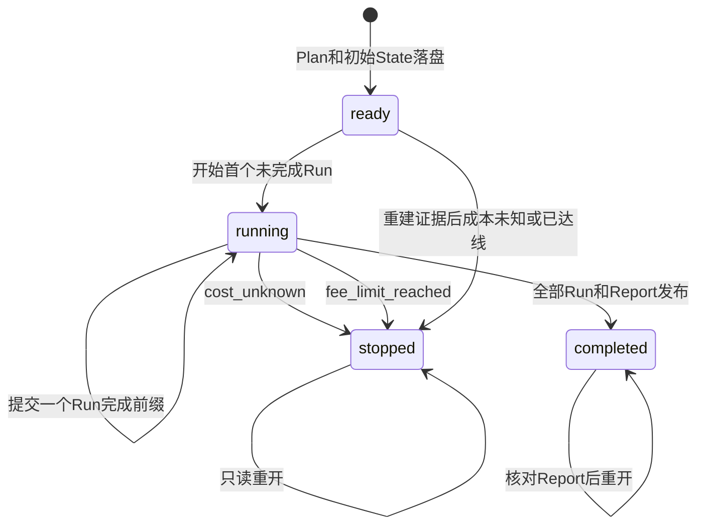
```mermaid
stateDiagram-v2
    [*] --> ready: Plan和初始State落盘
    ready --> running: 开始首个未完成Run
    running --> running: 提交一个Run完成前缀
    running --> stopped: cost_unknown
    running --> stopped: fee_limit_reached
    running --> completed: 全部Run和Report发布
    ready --> stopped: 重建证据后成本未知或已达线
    stopped --> stopped: 只读重开
    completed --> completed: 核对Report后重开
```

`completed_run_ids`必须严格等于Plan Run IDs的前缀。State记录Config Fingerprint、已知累计金额、Stop Reason、
Report摘要和时间。`stopped`必须有原因；只有`completed`能有Report摘要。

## 26. 真实Campaign顺序执行

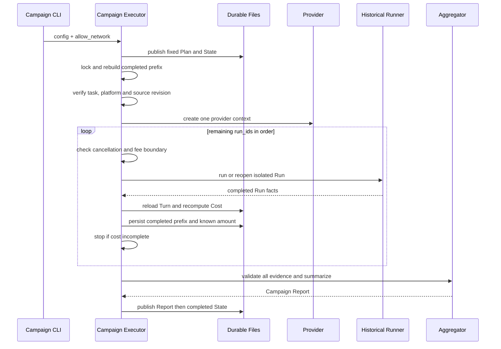
```mermaid
sequenceDiagram
    participant CLI as Campaign CLI
    participant E as Campaign Executor
    participant D as Durable Files
    participant P as Provider
    participant R as Historical Runner
    participant A as Aggregator
    CLI->>E: config + allow_network
    E->>D: publish fixed Plan and State
    E->>E: lock and rebuild completed prefix
    E->>E: verify task, platform and source revision
    E->>P: create one provider context
    loop remaining run_ids in order
        E->>E: check cancellation and fee boundary
        E->>R: run or reopen isolated Run
        R-->>E: completed Run facts
        E->>D: reload Turn and recompute Cost
        E->>D: persist completed prefix and known amount
        E->>E: stop if cost incomplete
    end
    E->>A: validate all evidence and summarize
    A-->>E: Campaign Report
    E->>D: publish Report then completed State
```

一个Provider上下文可复用连接池，但每个Run拥有独立Thread、Session、Workspace和模型历史。Campaign串行执行，
没有并发Run、优先队列或分布式Lease。费用停止在完整Run边界检查；一个已开始Run可能使总额超过停止线。

## 27. Campaign证据核对与Cost

`CompletedCodingEvalTrial`包含Run State、Run Report、原Turn和Cost Report。Aggregator重新执行以下核对：

1. 四份事实均能按严格合同重建；
2. Run/Task/Version/Fingerprint/Environment完全属于Plan；
3. Run State为completed，Report摘要可重算；
4. Turn ID、Model Steps、Input/Output Token和时间链一致；
5. Turn为正式终态且至少有一个Model Attempt；
6. 每个Cost Entry都绑定相同Price Snapshot与Billing Context；
7. Cost Report可从原Turn和Binding完整重算；
8. 币种唯一且与Plan一致。

成本完整性语义：

| 单次/整体情况 | 表示 |
|---|---|
| 所有尝试Usage及价格完整 | `complete`，保存完整已知金额 |
| 部分Run或Attempt未知，但存在已知小计 | `partial`，保留小计和不完整Run ID |
| 没有可证明金额 | `unknown`，金额为空，不填零 |

Campaign Summary聚合主分类计数、Model Attempts、Token、最小/P50/P95/最大墙钟时延和成本。P50/P95采用
nearest-rank；2～20个小样本只用于基线比较，不构成置信区间。

## 28. Campaign主分类

固定优先级：

1. Eval Outcome为passed → `passed`；
2. 含`eval_infrastructure` → `eval_infrastructure`；
3. Agent Failure为Provider → `provider`，仅保存规范Response Failure；
4. Agent或Eval含Budget失败 → `budget`；
5. 其他Agent Failure → `runtime`；
6. Correctness/Regression/Forbidden Edit/Final Answer → `task`；
7. 无法匹配 → `runtime`。

Provider错误仅保留规范Code和Retryable，不保存第三方原始正文。`invalid`不会因Turn同时有Provider错误而被
改成Provider失败，避免把评测基线问题归责给模型。

## 29. Campaign CLI

`harnessix coding-eval-campaign --config <file>`默认返回`network_not_enabled`并退出2，且不会读取Config。
只有同时提供`--allow-network`才进入读取和执行。

Config边界：

- 0600普通文件、`O_NOFOLLOW`和非阻塞打开；
- 1～512 KiB；
- 严格UTF-8和严格JSON；
- 拒绝重复Key、NaN/Infinity、目录、FIFO和符号链接；
- Parser错误不回显原始参数；
- 执行期间禁用日志；
- stdout只输出`CodingEvalCampaignRunReport`白名单字段；
- Import、配置、取消、Kernel和未知异常映射为固定Reason及退出码。

CLI没有交互确认、费用预估展示或Secret提示；它是受控运维入口，不是C端Eval产品界面。

## 30. Campaign崩溃恢复

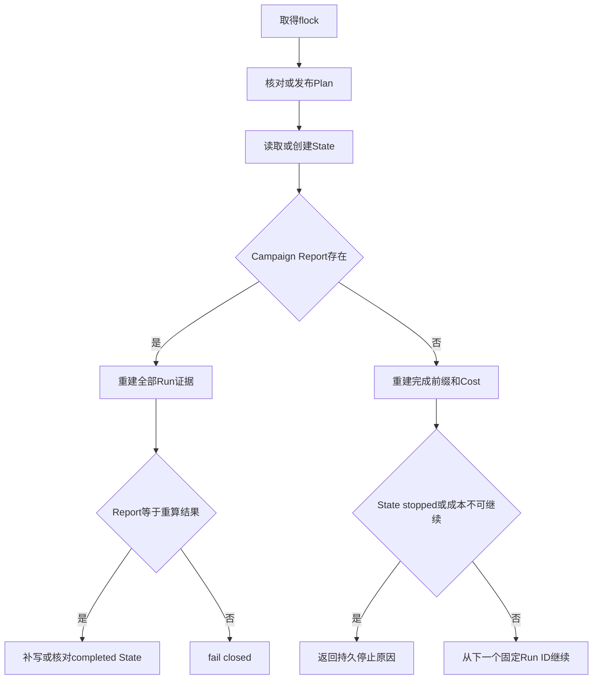
```mermaid
flowchart TD
    Start[取得flock] --> Plan[核对或发布Plan]
    Plan --> State[读取或创建State]
    State --> Existing{Campaign Report存在}
    Existing -->|是| Recompute[重建全部Run证据]
    Recompute --> Match{Report等于重算结果}
    Match -->|是| Finish[补写或核对completed State]
    Match -->|否| Fail[fail closed]
    Existing -->|否| Prefix[重建完成前缀和Cost]
    Prefix --> Stop{State stopped或成本不可继续}
    Stop -->|是| Return[返回持久停止原因]
    Stop -->|否| Continue[从下一个固定Run ID继续]
```

计划发布后Provider创建前退出不会丢失实验参数；单Run已完成但Campaign前缀未提交时，重开同Run ID，由单Run
Runner只读返回原事实后再提交前缀；Campaign Report发布后State未完成时，重开重算全部Trial并补写摘要。
任何金额、顺序、Config Fingerprint、源码Revision或报告内容漂移都拒绝继续。

## 31. Compaction语义评测

`CompactionSemanticEvalCase`要求Oracle覆盖六类工程语义：

1. Objective；
2. Constraint；
3. Unresolved Work；
4. File Revision；
5. Test Result；
6. Effect Uncertainty。

每个Expectation绑定Source Marker和可接受Summary Phrase；Case还声明Forbidden Summary Phrase和应从活动
History消失的Omitted Marker。

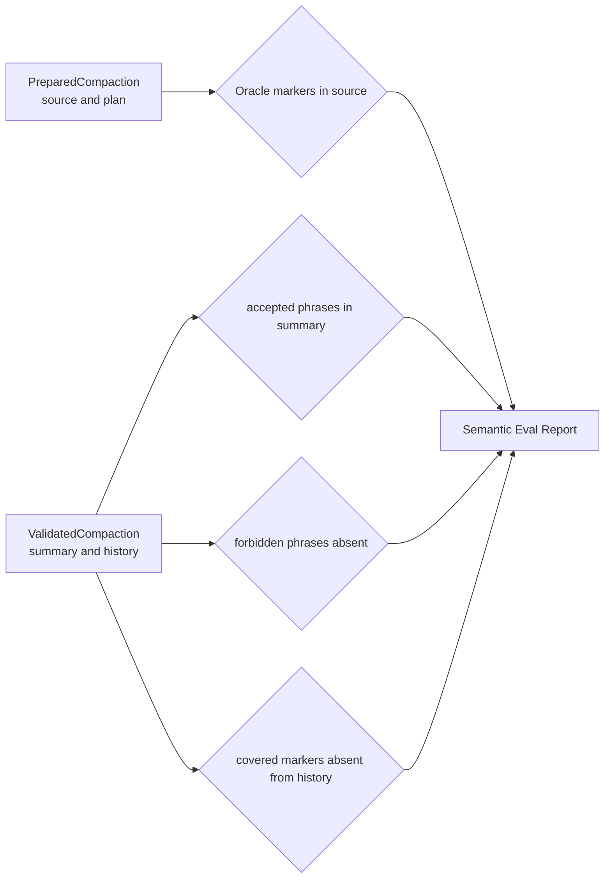
```mermaid
flowchart LR
    Prepared[PreparedCompaction<br/>source and plan] --> Bind{Oracle markers in source}
    Candidate[ValidatedCompaction<br/>summary and history] --> Preserve{accepted phrases in summary}
    Candidate --> Forbidden{forbidden phrases absent}
    Candidate --> Omitted{covered markers absent from history}
    Bind --> Result[Semantic Eval Report]
    Preserve --> Result
    Forbidden --> Result
    Omitted --> Result
```

Prepared Plan必须等于Candidate Plan，Compaction ID也必须一致。Oracle未绑定Source时Outcome为`invalid`；
绑定后缺事实、出现禁止主张或Covered History未移除时为`failed`；全部成立才`passed`。报告只保存Plan、
Source、Summary和History摘要、Token、布尔结论与Expectation ID，不保存正文。

当前判定是确定性的子串匹配，适合受控中文/英文Fixture，不理解语义等价、否定、引用或大小写变化；新增真实
语料必须由人工维护Phrase集合。该模块不提供Report文件持久化，Campaign成本覆盖通过跨模块测试验证。

## 32. Eval专用交付与通用Delivery的区别

| 维度 | `harnessix.evals.delivery` | `harnessix.delivery` |
|---|---|---|
| 初始用途 | 0.5.5严格通过历史Eval的单文件写回 | 通用多文件Workspace/Git交付 |
| 变更类型 | 一个已有UTF-8普通文件，0644/0755 | 新增、修改、删除、多文件、Diff |
| 持久化 | 每Delivery目录JSON全量Record | SQLite Transaction/Git Store + Blob |
| 批准 | Record内`ApprovalRecord` | 本地接口目前传Fingerprint；Push走Trusted Action |
| 并发 | POSIX `flock`单Delivery | Workspace Lease/Fencing及各Store |
| 恢复归因 | 临时文件`device,inode` | Mutation before/after和Cursor；Git对象/Ref事实 |
| Git交付 | 不Commit、不Push | Worktree、Checkpoint、Commit、Push |
| 平台 | POSIX专用 | Planner跨平台，普通Publish POSIX，Git跨平台 |
| 当前关系 | 独立旧纵向切片 | 后续通用正式方向 |

两者没有共享Record、Approval、Blob、Lease或Reconcile接口。生产演进应迁移Eval Change Package到通用Delivery，
而不是长期维护两套文件写协议。

## 33. Change Package与Delivery Plan

`build_coding_eval_change_package`只接受：

- Run State为completed；
- Report摘要、Task、Environment、Baseline与State一致；
- Report Outcome为passed且14项全部通过；
- Git恰有一个允许路径，无Staged、Untracked或Unsupported；
- Final Answer已解析且路径等于Git事实；
- 重开Managed Copy后Git Evidence仍逐字段等于Report；
- Baseline/After均是已有UTF-8普通文件、模式相同且内容确有变化；
- Managed Patch Manifest的Before摘要与Baseline一致。

`CodingEvalChangePackage`私有保存完整Before/After正文，单镜像最大1 MiB，Package最大3 MiB，并绑定Report、
Repository、Source Tree OID、Path、Mode、Diff摘要和自Fingerprint。

`CodingEvalDeliveryPlan`在目标仓库无副作用预检后冻结Delivery ID、Package Fingerprint、目标Repository、
Workspace Scope、Tree OID、Path、Mode、前后摘要和Approval Fingerprint。Approval绑定的是完整Plan，而不只
是文件路径。

## 34. Eval Delivery状态机

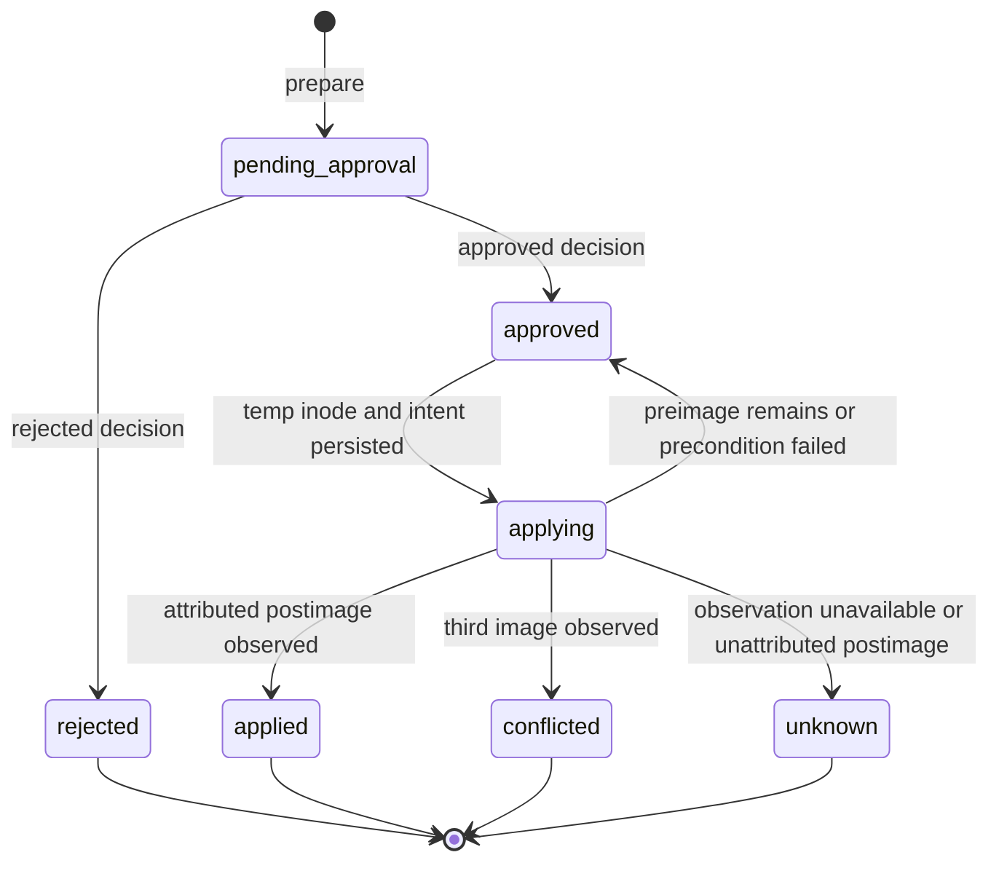
```mermaid
stateDiagram-v2
    [*] --> pending_approval: prepare
    pending_approval --> approved: approved decision
    pending_approval --> rejected: rejected decision
    approved --> applying: temp inode and intent persisted
    applying --> approved: preimage remains or precondition failed
    applying --> applied: attributed postimage observed
    applying --> conflicted: third image observed
    applying --> unknown: observation unavailable or unattributed postimage
    rejected --> [*]
    applied --> [*]
    conflicted --> [*]
    unknown --> [*]
```

Record保存完整Plan、Approval、当前Status、临时`device/inode`、Error Code、连续Transition和自Fingerprint。
Transition Sequence必须从1连续增长，From/To链、时间和允许边全部校验。Rejected、Applied、Conflicted、
Unknown是终态；不会自动覆盖、回滚或重放。

## 35. Eval Delivery执行与恢复

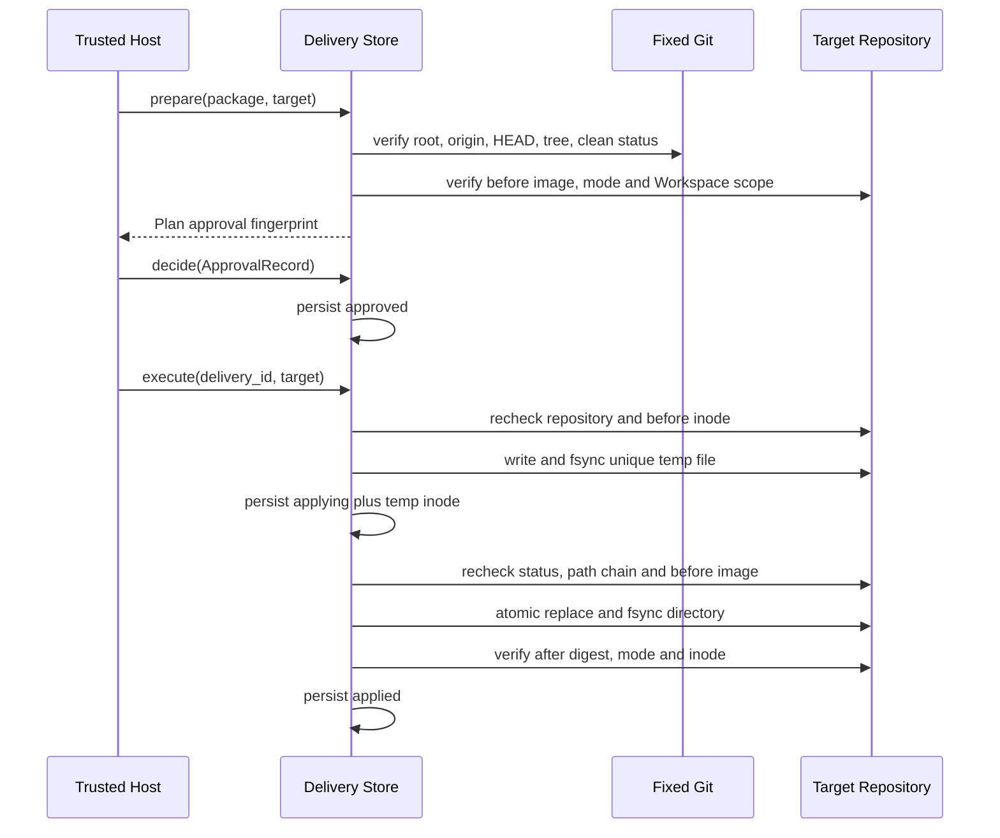
```mermaid
sequenceDiagram
    participant H as Trusted Host
    participant S as Delivery Store
    participant G as Fixed Git
    participant T as Target Repository
    H->>S: prepare(package, target)
    S->>G: verify root, origin, HEAD, tree, clean status
    S->>T: verify before image, mode and Workspace scope
    S-->>H: Plan approval fingerprint
    H->>S: decide(ApprovalRecord)
    S->>S: persist approved
    H->>S: execute(delivery_id, target)
    S->>T: recheck repository and before inode
    S->>T: write and fsync unique temp file
    S->>S: persist applying plus temp inode
    S->>T: recheck status, path chain and before image
    S->>T: atomic replace and fsync directory
    S->>T: verify after digest, mode and inode
    S->>S: persist applied
```

`applying`重开矩阵：

| 观察 | 归因 | 新状态 |
|---|---|---|
| 目标仍为Before | 本次效果未发生；清理匹配临时inode | `approved`，允许显式重试 |
| 目标为After且inode等于持久临时inode | 本次replace已发生 | `applied` |
| 目标为After但inode不同 | 同内容无法归因给本次效果 | `unknown` |
| 目标为第三内容 | 外部写入或不可接受漂移 | `conflicted` |
| Repo/路径事实不可观察 | 无法安全判断 | `unknown` |

## 36. 持久化布局

```text
<campaign-work-root>/                         0700
├── .campaign.lock                           0600
├── campaign-plan.json                       0600
├── campaign-state.json                      0600
├── campaign-report.json                     0600，完成时存在
└── runs/
    └── <run-id>/                            0700
        ├── materialization.json              0600
        ├── workspace/                        0700，单提交Baseline
        ├── host/python                       0700
        ├── managed/                          Managed Patch私有状态与副本
        ├── run-state.json                    0600
        ├── report.json                       写入为0600
        ├── session.sqlite
        ├── execution-plans.db                 Execution Plan与Approval
        ├── action-audit.db                    Route Hash链和终态摘要
        └── process-state/
            ├── process-leases.db              Process Owner权威状态
            └── <process-id>/                  stdout/stderr与Owner记录

<suite-work-root>/                            0700
├── .suite.lock                               0600
├── suite-plan.json                           0600
├── suite-state.json                          0600
├── suite-report.json                         0600，全部完成时存在
└── cases/                                    0700
    └── case-NNN/                             0700，按计划序号固定
        └── case-report.json                  0600，完整脱敏Case证据

<eval-delivery-root>/                         0700
└── <delivery-id>/                            0700
    ├── owner.lock                            0600
    ├── package.json                          0600，包含前后正文
    └── state.json                            0600
```

Run Root、Campaign Work Root和Suite Work Root必须位于调用方受信的私有存储边界。代码没有统一Retention/GC；长期
Campaign/Suite会累积完整Baseline、Managed Copy、Session、Execution Plan、Action Audit、Process输出、Artifact、
Case/Suite报告和Change Package。

## 37. 事务、一致性与并发边界

### 37.1 Run

Run State、Session、Execution Plan、Action Audit、Process Lease、Patch Store、Report和文件系统是多个独立事实域，没有跨Store ACID。
Runner通过不可变ID、摘要、状态形状和重开对账收敛。Report先于completed State发布，专门处理“结果已落盘、
状态未提交”窗口。

### 37.2 Campaign

Campaign使用共用文件描述符锁保护单Work Root，同一进程/主机上非阻塞互斥。它没有Lease、Fencing、Owner ID、
心跳或跨主机一致性。每完成一个Run才提交有序前缀和Cost；孤立但已完成的下一个Run可通过同ID重开后纳入，
但计划外Run永不计入。

### 37.3 Suite

Suite使用同一文件锁边界保护单Work Root。Plan、State、各Case Report和最终Suite Report分别原子，不构成跨文件ACID。
Case Report先于State前缀，Suite Report先于completed State；重开通过严格身份和摘要核对补交后续状态。证据必须是连续
Case前缀，计划槽位缺口后的报告不自动接管。停止状态需要显式恢复，崩溃状态只重入同一Case。

### 37.4 Eval Delivery

每个Delivery ID单独`flock`。Package和State分别原子替换，但不是一个事务；Prepare失败删除新建目录。
目标文件replace与State也不是原子事务，`applying + inode`是恢复锚点。锁只协调Harnessix进程，不阻止外部
编辑器或同UID进程修改目标。

## 38. Timeout、取消与资源释放

| 层 | 当前控制 |
|---|---|
| Git物化/Delivery命令 | 每次30秒，固定stdin/stdout/stderr和输出上限 |
| Managed Copy | 60秒受信读取操作预算 |
| Hidden Check | 每项60秒、Process Runtime取消 |
| Eval Process | 固定Profile超时60秒、输出上限128 KiB；Supervisor独立Owner和Lease持久化 |
| Agent Turn | 任务`Budget.timeout_seconds`，当前任务600秒 |
| Campaign | 无Campaign总时限；继承CancelToken，在Run边界和内部操作检查 |
| Suite | 无Suite总时限；在Case边界检查CancelToken并把领域取消持久化为stopped |
| Delivery | 同步Git/文件I/O，无CancelToken |

`run_historical_coding_eval`通过异步上下文关闭Eval Trusted Action组合、Process Supervisor、Plan/Audit Store、Managed Copy、Coding Tool Runtime、Patch Bridge和Agent Runtime。Campaign Provider使用单个Async Context Manager。同步`subprocess.run`和Eval Delivery写入
不可中途协作取消；超时或进程终止后的真实副作用仍需通过持久事实重开判断。

## 39. 错误分类与恢复建议

| 范围 | 稳定错误示例 | 处理 |
|---|---|---|
| Catalog | `eval_task_not_found`、`eval_check_not_found` | 修正固定任务/版本，不创建Run |
| 来源/物化 | `eval_source_tree_mismatch`、`eval_source_archive_invalid` | 视为Eval基础设施问题，不计模型失败 |
| Manifest | `eval_materialization_incomplete`、`eval_materialization_changed` | 保留现场，人工核对或新Run ID |
| 检查 | `eval_check_infrastructure_failed`、`eval_python_binding_invalid` | 不伪造检查失败 |
| Provision | `eval_baseline_invalid`、`eval_materialization_dirty` | 任务无效，停止 |
| Run绑定 | `eval_run_mismatch`、`eval_run_projection_invalid` | 禁止跨环境/Session继续 |
| Approval | `eval_approval_denied`、`eval_approval_projection_invalid` | 停止，不扩大Allowlist |
| Report | `eval_report_mismatch`、`eval_report_invalid` | 不重评分覆盖未知文件 |
| Campaign | `eval_campaign_execution_mismatch`、`eval_campaign_cost_mismatch` | fail closed，不创建下一请求 |
| Campaign并发 | `eval_campaign_busy` | 等待当前宿主结束后重开 |
| Suite | `eval_suite_execution_mismatch`、`eval_suite_case_mismatch`、`eval_suite_cost_mismatch` | 保留现场，不执行下一Case |
| Suite证据 | `eval_suite_evidence_missing`、`eval_suite_evidence_order_invalid`、`eval_suite_report_mismatch` | 恢复权威文件或新建Suite，不覆盖历史 |
| Suite并发 | `eval_suite_busy` | 等待当前宿主结束后以原配置重开 |
| Compaction | `compaction_eval_evidence_mismatch` | 修正候选绑定，不计摘要质量失败 |
| Change Package | `eval_change_package_not_passed`、`eval_change_package_workspace_drift` | 重新评测，不交付 |
| Delivery批准 | `eval_delivery_approval_mismatch`、`eval_delivery_approval_conflict` | 不写目标 |
| Delivery目标 | `eval_delivery_source_drift`、`eval_delivery_target_dirty` | 重新Prepare新Plan |
| Delivery恢复 | `eval_delivery_postimage_unattributed` | 保持unknown，人工核对 |

CLI刻意把Kernel细节压缩为`runtime_failed`，便于防泄漏，但降低终端诊断能力；详细错误只能从受控宿主诊断
通道获得，当前没有Eval专用诊断Bundle。

## 40. 安全分析

### 40.1 已实现控制

- Source Commit、Tree OID、树SHA-256和Task Fingerprint多重绑定；
- Archive成员类型、路径、数量和字节上限；
- Baseline仓库不含Remote和后续Git历史；
- Agent只能进入Managed Copy，宿主检查位于Workspace外；
- Tool调用继续经过正式合同、Patch账本或Trusted Action Plan、Approval、Router Audit和专用Process Owner；
- 自动审批精确限制Tool、参数/Profile和Path；
- Git命令使用固定可执行文件、argv、环境、超时和有界输出；
- Run/Campaign/Delivery文件使用私有目录、原子写、严格JSON及摘要；
- CLI默认禁网并在启用前不读取配置；
- Provider自动重试关闭，防止隐式改变样本与费用；
- Report不保存完整Diff、隐藏检查输出、Prompt、回答Summary、Provider错误正文或Secret；
- Eval Delivery绑定Origin、HEAD、Tree、Workspace Scope、Before Image、Mode、Approval和临时inode。

### 40.2 当前安全缺口

1. `private-managed-copy-no-os-sandbox`明确表示被测代码和测试拥有宿主用户权限及网络能力；
2. 当前安全成立依赖Catalog只包含评审过的Harnessix自身历史代码，不能扩展到不可信第三方任务；
3. `harnessix.evals`包在Windows因`fcntl`顶层导入不可用；
4. Campaign Lock和Delivery Lock仅同一POSIX主机有效，无Fencing；
5. Materializer/Report/Delivery大量依赖POSIX权限和`O_NOFOLLOW/O_DIRECTORY`，无Windows ACL等价实现；
6. 单次Report Reader没有强制0600；
7. JSON原子写通过先检查目标链接再`replace`，没有统一dirfd路径能力；
8. Provider Secret仍由Models Config和环境解析，Campaign Config包含环境变量名；
9. Eval自动批准策略不是用户授权，不能复用于生产Agent；
10. Eval Delivery没有Workspace Lease，外部编辑只能靠多次Git/Image/Inode检查发现；
11. 没有数据集签名、任务来源权利链、运行镜像SBOM或远程证明；
12. 无统一Retention、加密静态存储、备份销毁和多租户目录隔离。

## 41. 数据、隐私与保留

| 数据 | 存储位置 | 敏感性 |
|---|---|---|
| Source和Baseline源码 | Source/Run Workspace | 项目源码 |
| 模型Prompt、消息和Tool结果 | `session.sqlite`及Artifact | 高，可能含源码和模型输出 |
| Patch正文 | Managed Patch状态与副本 | 高 |
| Process输出 | Session/Artifact及摘要 | 高 |
| Run Report | `report.json` | 中，含路径、模型、Token、摘要 |
| Campaign Config | 外部0600配置文件 | 高，含路径和Secret引用，不应归档 |
| Campaign Plan/Report | Work Root与可选脱敏验证资料 | 中 |
| Change Package | `package.json` | 高，包含完整Before/After源码 |
| Delivery Approval | `state.json` | 中，含Actor和Reason |

当前代码不自动清理任何Run或Delivery。归档到Git的真实验证资料必须继续只保留脱敏Plan和Campaign Report，
不得提交Config、Session、Execution Plan/Action Audit/Process数据库、Workspace、Change Package、日志或Secret。

## 42. 可观测性

`run_historical_coding_eval`接收可选`Observability`并注入`AgentRuntime`，因此能获得既有Model与Tool Span和低基数Metric。默认使用`NoOpObservability`。Trusted Action与Process恢复的当前诊断事实来自Plan、Audit、Lease、Artifact和Session；Eval组合尚未把这些阶段补齐为专用Span/Metric。

Eval自身没有专用Span/Metric覆盖以下阶段：

- Materialization、Baseline/Final Hidden Check；
- Run State和Report发布/恢复；
- Grader逐项结论；
- Campaign Plan、Trial边界、Fee Stop和Recovery；
- Compaction语义评测；
- Eval Delivery Prepare/Approval/Execute/Reconcile。

Campaign API也没有Observability参数。当前主要诊断事实来自JSON/SQLite，而非统一Telemetry。后续指标只能使用
Task ID/Version、Outcome、Classification、阶段和稳定Error Code等低基数属性，不得把Prompt、路径、Diff、
Provider原文、Run ID高基数值或源码正文放入Metric Label。

## 43. 重点类与生命周期

| 类型/函数 | 生命周期 | 责任 |
|---|---|---|
| `HistoricalCodingEval` | 进程静态 | 组合Task、Source Tree、Host-only Path和Check定义 |
| `MaterializedCodingEval` | Run | 暴露Run Root、Baseline Workspace和Manifest |
| `CodingEvalRunState` | Run持久 | Run恢复主锚点 |
| `HistoricalCodingEvalResult` | 单次调用返回 | State、Report和Managed Workspace路径 |
| `AgentRuntime` | 单次Run调用 | 驱动正式模型与Tool循环 |
| `EvalTrustedActionComposition` | 单次Run调用 | 持有Catalog/Gateway/Router、Plan/Audit Store、Supervisor与输出Provider |
| `EvalRunTestsActionExecutor` | 单次Run调用 | 从批准的公开Profile确定性派生ProcessSpec并执行或只读对账 |
| `CodingEvalReport` | Run不可变结果 | 固定14项和脱敏证据 |
| `CodingEvalCampaignPlan` | Campaign不可变 | 请求前固定比较范围 |
| `CodingEvalCampaignExecutionState` | Campaign持久 | 有序完成前缀和费用停止 |
| `CompletedCodingEvalTrial` | 聚合内存 | 组合四类原始证据 |
| `CodingEvalCampaignReport` | Campaign不可变结果 | 全部Trial和可重算Summary |
| `CodingEvalSuitePlan` | Suite不可变 | 固定Case、类别、仓库、Campaign与统一环境 |
| `CompletedCodingEvalSuiteCase` | 聚合内存 | 组合任务、Campaign计划和完整Trial事实 |
| `CodingEvalTranscriptEvidence` | Run不可变投影 | 保存Turn摘要、结构和人工干预计数，不保存正文 |
| `CodingEvalSuiteReport` | Suite不可变结果 | 全部Case、完整Campaign和可重算Summary |
| `CodingEvalSuiteRunConfig` | Suite调用不可变 | 固定Plan、Campaign Plans、Work Root和总费用停止线 |
| `CodingEvalSuiteExecutionState` | Suite持久 | 连续Case前缀、当前Case、Cost、停止原因和最终报告摘要 |
| `CodingEvalSuiteCaseRunResult` | Case端口返回 | 只返回稳定原因或完整脱敏Case Report |
| `CodingEvalSuiteRunReport` | Suite调用返回 | 只公开身份、计数、停止原因和已知费用 |
| `CodingEvalTaskPack` | 发行版本 | 冻结Repository、Profile、Case及整体摘要 |
| `LoadedCodingEvalTaskPack` | 单次消费 | 携带已加载Manifest和内置Resource Root；消费前仍需重验 |
| `CodingEvalTaskPackMaterialization` | Task Pack Run持久 | 绑定Run、Pack、Case、Task、Repository、Git和Archive身份 |
| `MaterializedCodingEvalTaskPackCase` | Task Pack Run | 暴露0700 Run Root、0755 Workspace、Case和清单 |
| `CompactionSemanticEvalCase` | 语料版本 | 人工语义Oracle |
| `CodingEvalDeliveryStore` | 宿主长生命周期 | 管理独立Delivery目录与锁 |

## 44. 公共接口合同

### 44.1 历史任务

```python
historical_coding_eval(task_id, task_version=None) -> HistoricalCodingEval
materialize_historical_coding_eval(
    source_root, runs_root, git_executable, definition, run_id
) -> MaterializedCodingEval
run_historical_checks(
    definition, materialized, python_executable, phase, cancel=None, workspace=None
) -> tuple[EvalTestObservation, ...]
run_historical_coding_eval(
    source_root, runs_root, git_executable, python_executable,
    definition, run_id, provider, environment, cancel=None,
    *, observability=None, fault=None
) -> HistoricalCodingEvalResult
grade_coding_eval(task, turn, *, run_id, environment, started_at,
                  completed_at, baseline_observations,
                  final_observations, git) -> CodingEvalReport
```

Provider生命周期由调用方持有。`fault`只用于故障注入，不是生产扩展点。

### 44.2 Campaign

```python
build_coding_eval_campaign_report(
    plan, completed
) -> CodingEvalCampaignReport

await run_coding_eval_campaign(
    config, *, allow_network=False,
    provider_factory=None, cancel=None, fault=None
) -> CodingEvalCampaignRunReport
```

`allow_network`必须是字面`True`。`provider_factory`和`fault`服务于测试；默认Factory延迟导入OpenAI Chat
Provider。

### 44.3 Suite与Transcript证据

```python
build_transcript_evidence(run_id, turn) -> CodingEvalTranscriptEvidence
build_coding_eval_suite_report(
    plan, completed_cases
) -> CodingEvalSuiteReport
build_coding_eval_suite_case_report(
    expected_case, completed_case
) -> CodingEvalSuiteCaseReport
build_coding_eval_suite_report_from_cases(
    plan, case_reports
) -> CodingEvalSuiteReport
await run_coding_eval_suite(
    config, case_executor, *, cancel=None, resume=False, fault=None
) -> CodingEvalSuiteRunReport
write_eval_suite_plan(path, plan) -> None
read_eval_suite_plan(path) -> CodingEvalSuitePlan
write_eval_suite_case_report(path, report) -> None
read_eval_suite_case_report(path) -> CodingEvalSuiteCaseReport
write_eval_suite_execution_state(path, state) -> None
read_eval_suite_execution_state(path) -> CodingEvalSuiteExecutionState
write_eval_suite_report(path, report) -> None
read_eval_suite_report(path) -> CodingEvalSuiteReport
```

`completed_cases`必须与Plan顺序和数量完全相同。Suite Runner本身不发起Provider请求或执行测试；它调用可信
`case_executor`并要求该端口按同一Campaign/Run身份恢复。`resume`只允许从持久停止状态继续，不能绕过身份、Cost或证据
检查。调用方不得用`model_copy`构造跳过严格校验的持久合同。

### 44.4 Task Pack

```python
builtin_coding_eval_task_pack(
    pack_id="harnessix-seed", pack_version=None
) -> LoadedCodingEvalTaskPack
builtin_coding_eval_task_pack_ids() -> tuple[str, ...]
builtin_coding_eval_task_pack_versions(pack_id) -> tuple[int, ...]
materialize_task_pack_case(
    loaded, runs_root, git_executable, case_id, run_id
) -> MaterializedCodingEvalTaskPackCase
load_materialized_task_pack_case(
    loaded, runs_root, git_executable, case_id, run_id
) -> MaterializedCodingEvalTaskPackCase
build_task_pack_product_profile(
    loaded, profile_id, container_engine
) -> ProductProcessProfile
```

这些入口不接受资源路径、URL、命令或镜像覆盖。`loaded`不是授权凭据：物化和Profile投影都会重新按内置Catalog核验。
`materialize_task_pack_case`在Run不存在时创建；存在时等价于严格`load`，不覆盖工作树。

### 44.5 Compaction和Delivery

```python
grade_compaction_semantics(prepared, candidate, case) \
    -> CompactionSemanticEvalReport

await build_coding_eval_change_package(
    runs_root, git_executable, definition, run_id
) -> CodingEvalChangePackage

store.prepare(package, target_root, delivery_id=None) -> CodingEvalDeliveryRecord
store.decide(delivery_id, approval) -> CodingEvalDeliveryRecord
store.execute(delivery_id, target_root) -> CodingEvalDeliveryRecord
store.reconcile(delivery_id, target_root) -> CodingEvalDeliveryRecord
```

## 45. 核心业务逻辑伪代码

### 45.1 单次历史Eval

```text
materialized = materialize_or_reopen(task, run_id)
state = read_state_if_present()

if no state:
    assert baseline hidden checks fail exactly
    assert baseline git is clean
    managed_copy = create_exact_managed_copy()
    persist ready state

assert state binds task + baseline + environment
if state.completed:
    return verified existing report
if report exists:
    verify report against state
    persist completed state
    return report

open same managed copy
wire Session + Artifact + Tools + Patch + Eval Trusted Action
create or reopen exactly one Thread
run or reopen Turn with deterministic request_id

while Turn is non-terminal:
    if waiting approval:
        assert exact allowed run_tests profile or patch path
        persist approved decision
    if executing tools after recovered trusted result:
        resume same Turn without replay
    trusted gateway executes only the frozen test route
    resume same Turn

final_observations = run hidden behavior + regression checks
git_evidence = collect complete status and diff digest
report = deterministic_grade(turn, observations, git_evidence)
atomically publish report
persist completed state with report digest
```

### 45.2 Campaign

```text
if allow_network is not True:
    return network_not_enabled without reading config or files

validate strict config
lock campaign root
publish_or_match immutable plan
read_or_create execution state
rebuild completed prefix and recompute known cost

if report already exists:
    recompute all trials
    verify exact report
    finish state if needed
    return completed

if stopped or cost incomplete or fee reached:
    persist/return fixed stop reason

verify task + platform + source revision + executables
open provider once
for each remaining fixed run_id:
    stop before next run if fee reached
    run_or_reopen_historical_eval(run_id)
    reload state + report + turn
    bind fixed price and recompute cost
    append only next planned run to completed prefix
    persist state
    stop if cost is incomplete

build report only when every planned run has valid evidence
publish report
persist completed state and digest
```

### 45.3 Task Pack物化与检查

```text
loaded = load_builtin(pack_id, version)
reverify manifest + exact catalog resource root
case = require_case(case_id)
repository = require_repository(case.repository_id)

if run_id directory exists:
    require run_root 0700, workspace 0755, manifest 0600
    bind every pack/case/task/repository/archive field
    verify HEAD commit + tree + raw ls-tree digest + file count
    return without touching dirty worktree

verify archive ordinary/no-follow/exact digest and size
mkdir run_root 0700 and workspace 0755
extract only bounded regular POSIX members
verify embedded license digest
git init; symbolic-ref HEAD main; add all; fixed identity commit
require exact commit + tree + raw ls-tree digest + file count
atomically publish 0600 materialization manifest

product_profile = project_fixed_profile_with_verified_engine()
require digest image + fixed argv + no selector + no secret + network none
execute only through Product Trusted Action approval and read-only container
derive pass/fail from persisted terminal return code
```

### 45.4 Eval Delivery

```text
package = rebuild_from_strictly_passed_run()
assert managed workspace evidence still equals report

plan = prepare():
    verify exact target git root, origin, HEAD, tree and clean status
    verify before content + mode + workspace scope
    persist package and pending_approval record

decide():
    require approval fingerprint == plan fingerprint
    persist one immutable approve/reject decision

execute():
    lock delivery
    reconcile prior applying state
    require approved
    recheck repository and before image
    write and fsync unique temp after image
    persist applying with temp inode
    recheck git status, parent chain and exact before inode
    replace target
    fsync and verify digest + mode + inode
    persist applied
```

## 46. 源码与测试映射

| 设计元素 | 源码 | 关键符号 | 测试 | 测试符号/证明 |
|---|---|---|---|---|
| Task严格合同和Fingerprint | [`contracts.py`](../../src/harnessix/evals/contracts.py) | `CodingEvalTask` | [`test_grader.py`](../../tests/evals/test_grader.py) | `test_task_contract_is_versioned_strict_and_fingerprinted` |
| Report固定Schema | 同上 | `CodingEvalReport.consistent_report` | 同上 | `test_public_schema_is_frozen`、`test_report_rejects_removed_checks_or_reclassified_failures` |
| 14项成功评分 | [`grader.py`](../../src/harnessix/evals/grader.py) | `grade_coding_eval` | 同上 | `test_success_requires_behavior_regression_git_and_answer_evidence` |
| Budget边界 | 同上 | `budget_respected` | 同上 | `test_budget_boundary_preserves_actual_usage_in_report` |
| Invalid与失败脱敏 | 同上 | `_transcript`、`_answer_evidence` | 同上 | `test_unreproducible_baseline_makes_run_invalid`、`test_failed_run_is_classified_without_exposing_diff` |
| Catalog固定版本 | [`catalog.py`](../../src/harnessix/evals/catalog.py) | `historical_coding_eval` | [`test_historical.py`](../../tests/evals/test_historical.py) | `test_catalog_pins_source_contract_and_checks` |
| 安全物化和重开 | [`materializer.py`](../../src/harnessix/evals/materializer.py) | `materialize_historical_coding_eval`、`load_materialized_coding_eval` | 同上 | `test_materializes_exact_private_one_commit_baseline_and_reopens_dirty_tree` |
| 不完整/篡改物化 | 同上 | `_read_manifest`、`_require_manifest_task` | 同上 | `test_existing_incomplete_run_is_rejected_without_overwrite`、`test_manifest_symbolic_link_and_wrong_source_tree_are_rejected` |
| 隐藏检查 | [`checks.py`](../../src/harnessix/evals/checks.py) | `run_historical_checks` | 同上 | `test_hidden_checks_detect_baseline_and_accept_minimal_fix`、`test_checker_exit_other_than_zero_or_one_is_infrastructure_failure` |
| Python入口身份 | 同上 | `historical_python_launcher` | 同上 | `test_relative_python_binding_is_rejected`、`test_existing_python_launcher_is_verified_without_changing_identity` |
| 正式Runtime闭环 | [`runner.py`](../../src/harnessix/evals/runner.py)、[`eval_action.py`](../../src/harnessix/product_config/eval_action.py) | `run_historical_coding_eval`、`build_eval_trusted_action_composition` | [`test_runner.py`](../../tests/evals/test_runner.py) | `test_real_history_runs_through_runtime_trusted_actions_and_grader` |
| Approval/结果投影恢复 | 同上 | `_drive_turn`、`EvalRunTestsActionExecutor.reconcile` | 同上 | `test_reopens_after_trusted_process_approval_without_replaying_action`、`test_reopens_after_trusted_process_result_without_replaying_process` |
| 取消持久化 | 同上 | `_await_cancel` | 同上 | `test_cancellation_is_durable_and_reopen_grades_terminal_turn` |
| Report崩溃窗口 | 同上 | `_require_report` | 同上 | `test_report_publication_is_recovered_without_regrading` |
| Allowlist与Host-only | 同上 | `_require_allowed_approval`、`_provision` | 同上 | `test_task_allowlist_rejects_patch_to_other_managed_file`、`test_provision_rejects_unpinned_host_only_paths` |
| Git完整证据 | [`git_evidence.py`](../../src/harnessix/evals/git_evidence.py) | `collect_git_evidence` | [`test_git_evidence.py`](../../tests/evals/test_git_evidence.py) | `test_collects_real_git_paths_index_types_and_full_diff_digest` |
| Run Report文件 | [`report.py`](../../src/harnessix/evals/report.py) | `write_eval_report`、`read_eval_report` | [`test_report.py`](../../tests/evals/test_report.py) | `test_report_round_trip_uses_private_atomic_file`、`test_report_rejects_symbolic_link_and_invalid_body` |
| Campaign聚合 | [`campaign.py`](../../src/harnessix/evals/campaign.py) | `build_coding_eval_campaign_report` | [`test_campaign.py`](../../tests/evals/test_campaign.py) | `test_campaign_aggregates_independent_success_provider_and_task_trials` |
| 未知Cost | 同上 | `_require_evidence` | 同上 | `test_unknown_failed_usage_keeps_partial_cost_without_inventing_zero` |
| 跨Run/价格防篡改 | 同上 | `_require_evidence` | 同上 | `test_campaign_rejects_missing_or_cross_run_evidence`、`test_campaign_rejects_cost_from_another_price_snapshot` |
| Campaign合同重算 | [`campaign_contracts.py`](../../src/harnessix/evals/campaign_contracts.py) | `CodingEvalCampaignReport.report_is_recomputable` | 同上 | `test_campaign_contract_recomputes_plan_and_summary`、`test_campaign_plan_rejects_duplicate_runs_and_pricing_scope_drift` |
| Suite范围与Schema | [`suite_contracts.py`](../../src/harnessix/evals/suite_contracts.py) | `CodingEvalSuitePlan.complete_multi_repository_scope`、`CodingEvalSuiteReport.report_is_recomputable` | [`test_suite.py`](../../tests/evals/test_suite.py) | `test_suite_requires_five_task_kinds_two_repositories_and_unique_campaigns`、`test_suite_public_schema_is_frozen` |
| Transcript人工干预投影 | [`suite.py`](../../src/harnessix/evals/suite.py) | `build_transcript_evidence` | 同上 | `test_transcript_evidence_excludes_automatic_approval_from_human_rate` |
| Suite聚合与防篡改 | 同上 | `build_coding_eval_suite_report`、`summarize_suite_cases` | 同上 | `test_suite_aggregates_quality_intervention_usage_cost_and_latency`、`test_suite_rejects_missing_cross_task_and_tampered_summary`、`test_suite_rejects_report_without_applicable_test_evidence` |
| Suite私有原子文件 | [`report.py`](../../src/harnessix/evals/report.py) | `write/read_eval_suite_plan`、`write/read_eval_suite_report` | 同上 | `test_suite_plan_and_report_round_trip_are_private_atomic_and_bounded` |
| Suite执行合同与Schema | [`suite_execution_contracts.py`](../../src/harnessix/evals/suite_execution_contracts.py) | `CodingEvalSuiteRunConfig`、`CodingEvalSuiteExecutionState`、`CodingEvalSuiteRunReport` | [`test_suite_execution.py`](../../tests/evals/test_suite_execution.py) | `test_suite_execution_config_rejects_campaign_and_run_identity_drift`、`test_suite_execution_public_schema_is_frozen` |
| Suite顺序执行与零重放 | [`suite_execution.py`](../../src/harnessix/evals/suite_execution.py) | `run_coding_eval_suite` | 同上 | `test_suite_runs_fixed_order_persists_report_and_reopens_without_case_replay` |
| Suite Case前缀恢复 | 同上 | `_load_contiguous_reports`、`_reconcile_prefix` | 同上 | `test_case_evidence_crash_advances_prefix_without_replaying_completed_case` |
| Suite取消与显式恢复 | 同上 | `_stop`、`resume`分支 | 同上 | `test_cancel_requires_explicit_resume_and_preserves_completed_prefix`、`test_reported_evidence_stop_requires_explicit_resume` |
| Suite报告恢复与费用停止 | 同上 | `_recover_published_report`、`_case_cost` | 同上 | `test_report_publication_crash_recovers_without_case_executor`、`test_unknown_cost_and_aggregate_fee_limit_stop_before_next_case` |
| Suite锁与证据失败关闭 | [`execution_fs.py`](../../src/harnessix/evals/execution_fs.py)、[`suite_execution.py`](../../src/harnessix/evals/suite_execution.py) | `exclusive_execution_lock`、`_require_case_report` | 同上 | `test_suite_rejects_wrong_case_missing_evidence_and_lock_contention` |
| Task Pack合同与Schema | [`task_pack_contracts.py`](../../src/harnessix/evals/task_pack_contracts.py) | `CodingEvalTaskPack`、`CodingEvalTaskPackProfile`、`CodingEvalReviewOracle` | [`test_task_pack.py`](../../tests/evals/test_task_pack.py) | `test_builtin_task_pack_is_versioned_canonical_and_multi_language`、`test_task_pack_contract_rejects_dynamic_or_inconsistent_execution`、`test_task_pack_public_schema_is_frozen` |
| 内置Root与Archive防篡改 | [`task_pack.py`](../../src/harnessix/evals/task_pack.py) | `_load_builtin_directory`、`_verified_builtin_task_pack` | 同上 | `test_loader_rejects_root_symlink_and_tampered_archive`、`test_consumers_reject_forged_loaded_pack` |
| 安全Tar与固定Git物化 | [`task_pack_materializer.py`](../../src/harnessix/evals/task_pack_materializer.py) | `_safe_archive_members`、`materialize_task_pack_case` | 同上 | `test_archive_policy_rejects_traversal_links_and_special_members`、`test_materializes_every_builtin_case_with_exact_license_and_tree` |
| Task Pack恢复与漂移 | 同上 | `load_materialized_task_pack_case` | 同上 | `test_materializes_exact_single_commit_reopens_dirty_workspace`、`test_materialization_detects_changed_head` |
| Profile投影 | [`task_pack.py`](../../src/harnessix/evals/task_pack.py) | `build_task_pack_product_profile` | 同上 | `test_profile_projection_is_exact_and_engine_is_validated` |
| 双语言真实容器链 | Product Runtime + Task Pack | 固定Profile、Approval、Process Owner、Artifact | [`test_task_pack_profiles.py`](../../tests/integration/test_task_pack_profiles.py) | `test_builtin_task_pack_profile_fails_then_passes_through_product_runtime` |
| 工程数据集生成与规模 | [`generate_engineering_task_pack.py`](../../scripts/generate_engineering_task_pack.py)、[`definition.json`](../../benchmarks/taskpacks/harnessix-engineering-v1/definition.json) | `_generate`、`_repository_identity` | [`test_engineering_task_pack.py`](../../tests/evals/test_engineering_task_pack.py) | `test_engineering_pack_has_balanced_production_scope`、`test_engineering_pack_generation_is_reproducible` |
| Review源码证据 | [`task_pack_materializer.py`](../../src/harnessix/evals/task_pack_materializer.py) | `_verify_review_oracle` | 同上 | `test_review_oracle_rejects_changed_source_evidence` |
| 十Case可解性 | [`solutions`](../../benchmarks/taskpacks/harnessix-engineering-v1/solutions) | Wheel外Golden Patch | 同上 | `test_each_engineering_case_fails_then_golden_patch_passes` |
| 十Case真实容器链 | Product Runtime + Engineering Pack | 固定Profile、Approval、Process Owner、Artifact | [`test_task_pack_profiles.py`](../../tests/integration/test_task_pack_profiles.py) | `test_engineering_task_pack_profiles_fail_then_pass_through_product_runtime` |
| Campaign执行与重开 | [`campaign_execution.py`](../../src/harnessix/evals/campaign_execution.py) | `run_coding_eval_campaign` | [`test_campaign_execution.py`](../../tests/evals/test_campaign_execution.py) | `test_campaign_runs_two_isolated_trials_persists_report_and_reopens` |
| 请求前Plan与费用停止 | 同上 | `_require_plan`、`_known_cost` | 同上 | `test_plan_is_durable_before_provider_and_fee_limit_stops_next_trial` |
| Cost Unknown恢复 | 同上 | `_rebuild_prefix` | 同上 | `test_unknown_cost_stops_and_crash_window_recovers_without_next_trial` |
| Campaign Report恢复 | 同上 | `_recover_published_report` | 同上 | `test_report_publication_crash_recovers_without_provider` |
| Lock/源码Revision | [`campaign_execution.py`](../../src/harnessix/evals/campaign_execution.py)、[`execution_fs.py`](../../src/harnessix/evals/execution_fs.py) | `exclusive_execution_lock`、`_source_revision` | 同上 | `test_campaign_lock_and_source_revision_fail_before_provider` |
| 默认禁网 | 同上 | `run_coding_eval_campaign` | 同上 | `test_disabled_campaign_does_not_touch_files_or_provider` |
| Campaign配置边界 | [`campaign_execution_contracts.py`](../../src/harnessix/evals/campaign_execution_contracts.py) | `CodingEvalCampaignRunConfig` | 同上 | `test_execution_config_rejects_retry_parallel_tools_and_source_child` |
| CLI白名单和私有配置 | [`campaign_cli.py`](../../src/harnessix/evals/campaign_cli.py) | `_read_config`、`main` | [`test_campaign_cli.py`](../../tests/evals/test_campaign_cli.py) | `test_campaign_cli_disabled_does_not_read_config`、`test_campaign_cli_emits_only_whitelisted_result`、`test_campaign_cli_requires_private_config` |
| CLI异常输入 | 同上 | `_SafeParser` | 同上 | `test_campaign_cli_parse_errors_do_not_echo_input`、`test_campaign_cli_rejects_ambiguous_or_oversized_config` |
| Compaction语义通过 | [`compaction.py`](../../src/harnessix/evals/compaction.py) | `grade_compaction_semantics` | [`test_compaction_semantics.py`](../../tests/evals/test_compaction_semantics.py) | `test_realistic_engineering_oracle_accepts_preserved_semantics_without_raw_body` |
| Compaction失败/Invalid | 同上 | 同上 | 同上 | `test_missing_fact_and_hallucinated_claim_fail_closed`、`test_oracle_not_bound_to_source_is_invalid_instead_of_task_failure` |
| Compaction身份/合同 | [`compaction_contracts.py`](../../src/harnessix/evals/compaction_contracts.py) | `CompactionSemanticEvalCase` | 同上 | `test_semantic_case_is_strict_complete_and_deterministic`、`test_candidate_identity_mismatch_is_rejected` |
| Compaction Cost计入Campaign | [`campaign.py`](../../src/harnessix/evals/campaign.py) | `build_coding_eval_campaign_report` | [`test_compaction_campaign.py`](../../tests/evals/test_compaction_campaign.py) | `test_campaign_counts_all_purposes_and_never_omits_summary_cost` |
| Change Package防篡改 | [`delivery.py`](../../src/harnessix/evals/delivery.py) | `write_coding_eval_change_package`、`read_coding_eval_change_package` | [`test_delivery.py`](../../tests/evals/test_delivery.py) | `test_change_package_private_round_trip_and_tamper_rejection` |
| 批准与幂等写入 | 同上 | `CodingEvalDeliveryStore.decide`、`execute` | 同上 | `test_explicit_approval_applies_once_and_preserves_mode`、`test_rejection_and_approval_binding_never_write_target` |
| Git目标预检 | 同上 | `_require_repository` | 同上 | `test_prepare_rejects_every_git_dirty_class`、`test_prepare_rejects_source_revision_origin_and_file_type_drift` |
| 批准后漂移 | 同上 | `CodingEvalDeliveryStore.execute` | 同上 | `test_execute_rechecks_dirty_workspace_after_approval` |
| Inode恢复归因 | 同上 | `_reconcile_locked` | 同上 | `test_crash_reconciliation_uses_persisted_inode_attribution`、`test_reconcile_never_attributes_external_target_image` |
| Delivery锁 | 同上 | `CodingEvalDeliveryStore._lock` | 同上 | `test_lock_and_existing_delivery_id_fail_closed` |
| 真实通过Run交付 | 同上 | `build_coding_eval_change_package` | 同上 | `test_real_passed_eval_builds_package_and_detects_late_workspace_drift` |

## 47. 测试设计与验证范围

### 47.1 定向回归

```bash
uv run pytest \
  tests/evals \
  tests/agent/test_schemas.py \
  tests/models/test_costs.py \
  tests/tools/test_git.py \
  tests/patches \
  tests/processes/test_action_executor.py
```

Historical和Runner测试需要当前仓库保留固定历史对象；浅克隆可能无法运行。真实Campaign单元测试使用注入
Provider Factory，不访问公网。版本化百炼真实结果位于[验证资料](../validation/)并已脱敏，不应在常规回归
重复产生费用。

### 47.2 当前测试缺口

- 原生Windows导入、路径、ACL、Lock、Git和Process全链；
- Linux容器/Namespace或macOS Sandbox下运行不可信第三方历史任务；
- Task Pack到Campaign/Transcript投影的正式Case Executor适配器与真实Run恢复组合；
- 10 Case、3仓库、五类各2个的固定Container全量CI验收、20 Trial离线Suite及真实Provider基线；
- Source仓库SHA-256对象格式、超大历史、Submodule、LFS和复杂Attributes；
- Archive在不同Git/Tar版本下的确定性与恶意边界矩阵；
- 磁盘满、`fsync`失败、SQLite损坏、Artifact丢失和备份恢复；
- Run State与Session/Execution Plan/Action Audit/Process Lease/Patch事实组合篡改的系统恢复矩阵；
- 单次Report权限放宽读取拒绝；
- Campaign总Timeout、跨主机并发、Fencing和分布式Worker；
- Provider连接上下文在Trial间污染、限流、长时间中断和凭据轮换；
- 供应商账单对账、缓存价格阶梯、税费和汇率；
- 统计置信区间、回归阈值、噪声检测和Flaky Check隔离；
- Compaction多语言语义、否定/引用/等价表达和大规模语料；
- Eval Delivery最终检查到replace之间外部进程竞态；
- Eval专用Delivery迁移到通用Transaction/Lease/Trusted Action；
- 默认产品发布前自动运行固定Eval/Soak及失败阻断。

## 48. Schema、版本与兼容

当前生成25份Evals公共Schema：

- [`coding-eval-task-v1`](../../spec/coding-eval-task-v1.schema.json)；
- [`coding-eval-final-answer-v1`](../../spec/coding-eval-final-answer-v1.schema.json)；
- [`coding-eval-report-v1`](../../spec/coding-eval-report-v1.schema.json)；
- [`coding-eval-materialization-v1`](../../spec/coding-eval-materialization-v1.schema.json)；
- [`coding-eval-run-state-v1`](../../spec/coding-eval-run-state-v1.schema.json)；
- [`coding-eval-campaign-plan-v1`](../../spec/coding-eval-campaign-plan-v1.schema.json)；
- [`coding-eval-campaign-report-v1`](../../spec/coding-eval-campaign-report-v1.schema.json)；
- [`coding-eval-campaign-run-config-v1`](../../spec/coding-eval-campaign-run-config-v1.schema.json)；
- [`coding-eval-campaign-execution-state-v1`](../../spec/coding-eval-campaign-execution-state-v1.schema.json)；
- [`coding-eval-campaign-run-report-v1`](../../spec/coding-eval-campaign-run-report-v1.schema.json)；
- [`coding-eval-suite-plan-v1`](../../spec/coding-eval-suite-plan-v1.schema.json)；
- [`coding-eval-suite-report-v1`](../../spec/coding-eval-suite-report-v1.schema.json)；
- [`coding-eval-transcript-evidence-v1`](../../spec/coding-eval-transcript-evidence-v1.schema.json)；
- [`coding-eval-suite-run-config-v1`](../../spec/coding-eval-suite-run-config-v1.schema.json)；
- [`coding-eval-suite-case-run-result-v1`](../../spec/coding-eval-suite-case-run-result-v1.schema.json)；
- [`coding-eval-suite-execution-state-v1`](../../spec/coding-eval-suite-execution-state-v1.schema.json)；
- [`coding-eval-suite-run-report-v1`](../../spec/coding-eval-suite-run-report-v1.schema.json)；
- [`coding-eval-task-pack-v1`](../../spec/coding-eval-task-pack-v1.schema.json)；
- [Task Pack物化v1 Schema](../../spec/coding-eval-ta%73k-pack-materialization-v1.schema.json)；
- [`coding-eval-review-oracle-v1`](../../spec/coding-eval-review-oracle-v1.schema.json)；
- [`coding-eval-change-package-v1`](../../spec/coding-eval-change-package-v1.schema.json)；
- [`coding-eval-delivery-plan-v1`](../../spec/coding-eval-delivery-plan-v1.schema.json)；
- [`coding-eval-delivery-record-v1`](../../spec/coding-eval-delivery-record-v1.schema.json)；
- [`compaction-semantic-eval-case-v1`](../../spec/compaction-semantic-eval-case-v1.schema.json)；
- [`compaction-semantic-eval-report-v1`](../../spec/compaction-semantic-eval-report-v1.schema.json)。

Schema由[`scripts/generate_specs.py`](../../scripts/generate_specs.py)生成并由多个冻结测试逐字比较。Task Version、
Grader Version、Materializer Version、Spec Version和Campaign Plan Fingerprint承担不同兼容职责：

- 任务Prompt/预算/允许路径变化提升Task Version；
- 评分检查或分类语义变化提升Grader Version并发布新Report Spec；
- 物化规则影响来源身份时提升Materializer Version；
- 字段、状态或摘要输入变化评估新Spec；
- 已发布Campaign Plan和Run不得原地迁移到新任务版本。

Run/Campaign/Delivery JSON没有Migration链；未知版本由严格Literal拒绝。Session、Execution Plan、Action Audit、Process Lease和Patch SQLite Migration由各自模块维护，不由Evals接管。未完成且仍含`effects.sqlite`的旧Run明确返回`eval_runtime_upgrade_required`；已完成报告仍可先按不可变结果读取。

## 49. 部署与平台约束

### 49.1 运行前提

- Python 3.12+和完整Harnessix开发/运行依赖；
- 本地完整Git历史，包含Catalog固定Source Revision；
- 固定绝对Git/Python入口；
- Task Pack真实检查需要Docker兼容Engine及Manifest指定的固定Digest镜像已预拉；
- Source外的0700私有Work/Campaign/Delivery Root；
- 历史任务需要的依赖已经安装；
- 真实Campaign才需要OpenAI optional依赖、Provider Endpoint和Secret环境变量。

### 49.2 平台矩阵

| 能力 | macOS | Linux | Windows |
|---|---|---|---|
| `harnessix.evals`包导入 | 支持 | 支持 | 当前可能因`fcntl`失败 |
| Historical Materialization | 已测试 | CI覆盖 | 未实现 |
| Hidden Check/Runner | 已测试 | CI覆盖 | 未实现 |
| Campaign/Suite单写者文件锁 | 支持 | 支持 | 合同存在；执行未验收 |
| Task Pack合同/内置资源读取 | 支持 | 支持 | 包级导入当前受`fcntl`阻断 |
| Task Pack Git物化 | 已测试 | CI普通测试覆盖 | 未实现 |
| Task Pack固定Container检查 | 本地Docker未启用 | CI固定镜像验收 | 未实现 |
| Eval Delivery | 支持 | 支持 | 不支持 |
| OS Sandbox | Historical无；Task Pack检查使用只读禁网Container | Historical无；Task Pack检查使用只读禁网Container | 无 |
| 真实Provider Campaign | 有版本化macOS证据 | 无等价公开实测 | 无 |

当前文档和Environment必须继续显式写`no-os-sandbox`，不得因私有目录或Managed Copy而宣称安全隔离。

### 49.3 真实基线证据

任务v1、v2和v3分别保留不可变Campaign。v1/v2揭示累计Token预算和最终回答合同问题；v3三次真实百炼
Campaign均通过，证明当时固定提交、模型和环境下的纵向链可运行。它不证明当前HEAD持续不回归，也不证明
其他模型、平台、任务或大规模用户场景。

## 50. 已知限制、风险与后续工作

| 优先级 | 缺口 | 当前影响 | 建议归属 |
|---|---|---|---|
| P0 | Historical链无OS Sandbox；Task Pack工程数据集虽有Container但仍是小型派生夹具 | 不能接动态第三方任务或外推大型仓库 | 0.9.2d/0.9.4/0.9.5安全执行 |
| P0 | 工程Pack已达3仓10 Case，但尚无正式Case Adapter和20 Trial完整报告 | Suite合同已有，质量基线仍未形成 | 0.9.2d2/d3 |
| P0 | 原生Windows包级导入受`fcntl`阻断 | 与1.0三平台目标冲突 | 0.9.6发行门禁 |
| P0 | Eval不参与默认发布阻断 | 当前回归可能绕过真实任务 | 0.9.2d～e/0.9.6 |
| P0 | Eval自动审批不是用户审批 | 不能证明生产权限体验 | 产品E2E Eval |
| P1 | Historical Runner只支持唯一Profile/Behavior Check | 合同能力与实现不一致 | Runner v2 |
| P1 | Suite Case Executor尚未正式装配Task Pack/Campaign/Transcript投影 | 状态机已实现但不能运行最终离线数据集 | 0.9.2d |
| P1 | Campaign只支持OpenAI Chat兼容Provider | 无Anthropic与多Provider可比基线 | Provider Eval矩阵 |
| P1 | 顺序本地主机Campaign，无总时限/Lease/Fencing | 长测吞吐与恢复有限 | Campaign Scheduler |
| P1 | 费用只是本地试验间停止，无账单对账 | 不能当账户硬预算 | Cost Governance |
| P1 | Evals专用Telemetry缺失 | 难定位物化、评分和恢复时延 | Observability切片 |
| P1 | Eval专用Delivery与通用Delivery重复 | 两套状态和安全模型增加维护成本 | Delivery统一 |
| P1 | Run/Workspace/Artifact/Package无GC | 长期Dogfooding磁盘持续增长 | Retention/GC |
| P1 | 单次Report Reader不强制0600 | 私有性依赖父目录 | 文件合同加固 |
| P1 | Compaction Oracle只是子串匹配 | 真实语义覆盖有限 | 版本化语料与确定性规则 |
| P2 | 只记录端到端时延 | 无Provider API、Tool、Check分段SLO | Eval Telemetry |
| P2 | 2～20个样本无置信区间/噪声模型 | 不适合排名或发布统计 | Statistical Gate |
| P2 | Task Pack Catalog仍由代码登记且未签名 | 外部可信发布和轮换流程尚未建立 | 0.9.4供应链 |

## 51. 生产化演进约束

1. 引入新任务前必须记录来源许可证、固定Commit、Tree、缺陷证据、隐藏检查和泄漏分析；
2. 第三方代码只有进入真实OS Sandbox、默认禁网和最小文件能力后才能执行；
3. Windows支持必须消除`fcntl`和POSIX Flag顶层依赖，并补ACL、Lock、Path、Process和Git真实测试；
4. 任务版本、评分器版本、环境和价格必须始终显式，不允许“最新”覆盖历史报告；
5. Flaky Check必须先隔离或分类为Eval Infrastructure，不得计入模型质量；
6. Campaign重试、温度、Seed、并发或Provider切换必须成为Plan字段，不能隐式变化；
7. 发布门禁必须使用版本化任务集、最小样本、波动阈值和历史基线，而非单次结果；
8. Cost Gate必须区分本地估算、供应商Usage和最终账单；
9. Eval-specific Telemetry必须低基数、脱敏、可关闭，Exporter失败不得影响评分事实；
10. Change Package应迁移到通用Delivery的Transaction、Approval、Lease和Reconcile；
11. Retention必须按Run/Report/Artifact/Workspace引用关系清理，不得先删恢复锚点；
12. 公开验证资料只能从私有事实生成白名单投影；
13. 任何Schema/状态/摘要变化必须同步代码、Spec、测试、本文和历史兼容策略；
14. “真实Campaign通过”只对固定任务、版本、模型、代码Revision、平台和时间成立。

## 52. 验收标准

### 52.1 当前文档切片

- [x] 22个生产Python文件及内置Task Pack资源目录的职责、边界和阅读顺序已映射；
- [x] Historical、Campaign、Suite、Task Pack、Compaction和Eval Delivery六条能力链已分层；
- [x] Task、Run、Report、Campaign、Suite、Task Pack、Profile、Oracle、Compaction和Delivery合同及重点字段已说明；
- [x] Materialization、Agent运行、审批、评分、Campaign和交付正常时序已覆盖；
- [x] Run、Campaign和Delivery状态机及崩溃恢复矩阵已覆盖；
- [x] 数据布局、跨Store非原子边界、并发、取消和Timeout已说明；
- [x] 安全、隐私、成本、平台和Telemetry边界已如实登记；
- [x] 全部Evals测试文件和关键测试符号已映射；
- [x] 公共Schema、版本规则、伪代码和源码阅读路线已补齐；
- [x] 相对链接、Mermaid、Schema生成、定向回归与全仓门禁通过后方可提交。

### 52.2 产品生产完成条件

- [ ] 建立覆盖代码理解、编辑、测试、恢复、安全和交付的版本化任务集；
- [ ] 不可信任务在macOS/Linux/Windows真实隔离环境运行；
- [ ] 默认发布流程执行可比较Eval/Soak并按稳定阈值阻断；
- [ ] 多Provider、多模型、多平台基线与噪声/置信区间完成；
- [ ] Campaign具备总Timeout、持久调度、Lease/Fencing和可控并发；
- [ ] Provider Retry、Temperature、Seed和工具并发全部进入Plan；
- [ ] 供应商Usage、价格快照和账单差异可审计；
- [ ] Eval专用Trace/Metric/Log、诊断Bundle和Exporter故障隔离完成；
- [ ] Run、Artifact、Workspace、报告和Package有安全Retention/GC；
- [ ] Eval Change Package统一进入正式Delivery/Trusted Action产品链；
- [ ] Dogfooding持续运行并形成当前HEAD的可追溯趋势，而非一次历史证据。

## 53. 推荐源码阅读路线

1. 阅读`CodingEvalTask`和`CodingEvalReport.consistent_report`，手工列出Fingerprint与14项不变量；
2. 阅读`catalog.py`的v1/v2/v3替换关系，理解任务版本与实现版本分离；
3. 从`materialize_historical_coding_eval`跟踪Commit、Tree、Archive和Manifest；
4. 对照`test_materializes_exact_private_one_commit_baseline_and_reopens_dirty_tree`验证“HEAD固定、脏树可重开”；
5. 阅读`_historical_check.py`，确认检查正文不进入Agent Workspace；
6. 阅读`historical_python_launcher`和`run_historical_checks`的Process、输出和退出码边界；
7. 阅读`_provision`，画出Source、Baseline、Managed Copy和Host-only Path；
8. 跟踪`run_historical_coding_eval`的State/Report早返回路径；
9. 跟踪`_drive_turn`和`EvalRunTestsActionExecutor`，确认唯一审批、Router Claim、Supervisor执行、结果投影和Resume顺序；
10. 阅读`collect_git_evidence`，理解Rename、Staged、Untracked和完整Diff摘要；
11. 阅读`_transcript`、`_feedback_order`和`_git_feedback_order`；
12. 逐项执行`grade_coding_eval`的14个Check并推导Outcome；
13. 阅读`run_state.py`和`report.py`，比较权限、上限和原子写差异；
14. 阅读`CodingEvalTaskPack.pack_is_canonical_and_bound`及三个摘要Builder；
15. 从`builtin_coding_eval_task_pack`跟踪no-follow资源读取和消费点Catalog重验；
16. 从`materialize_task_pack_case`跟踪Tar策略、固定Git四重身份和脏Workspace重开；
17. 阅读`build_task_pack_product_profile`并对照真实容器集成测试；
18. 阅读`CodingEvalCampaignPlan.fixed_comparable_scope`；
19. 从`_require_evidence`跟踪State、Report、Turn、Cost的交叉核对；
20. 阅读`summarize_campaign_trials`的成本完整性与nearest-rank；
21. 从`run_coding_eval_campaign`跟踪Plan-before-provider、完成前缀和费用停止；
22. 对照三个Campaign崩溃测试理解单Run与Campaign双层恢复；
23. 阅读`campaign_cli.main`，确认禁网路径不读取Config；
24. 阅读`grade_compaction_semantics`，区分`invalid`与语义`failed`；
25. 阅读`build_coding_eval_change_package`，确认`passed`仍需重验Workspace；
26. 跟踪`CodingEvalDeliveryStore.execute/_reconcile_locked`的临时inode归因；
27. 对比[Delivery模块设计](delivery.md)，列出两套交付模型不能互换的原因；
28. 最后检查`__init__.py`和`fcntl`顶层导入，验证Windows现状；
29. 按第47节运行回归，并用第50节评审生产缺口。

## 54. 维护规则

以下变化必须在同一重大提交更新本文：

- Task、Repository、Observation、Git Evidence、Final Answer、Run State或Report字段；
- Catalog任务、版本、来源Revision、Tree、Prompt、预算、Allowlist或Check；
- Archive、Git环境、大小限制、Manifest或重开判断；
- Hidden Check命令、Python Launcher、Process限制或退出码语义；
- Managed Copy、Host-only Path、Agent装配、自动审批、Trusted Action或Process Owner流程；
- Grader检查集合、顺序、分类、Transcript投影或回答协议；
- Run状态、Report发布顺序、取消或崩溃恢复；
- Campaign Plan、Config、State、主分类、Cost算法、统计或停止线；
- Suite Plan、Case、Transcript/Test证据、Rate、Summary、报告绑定或隐私字段；
- Task Pack Catalog、Manifest、Archive、许可证、Profile、Oracle、物化清单、Git身份或目录权限；
- CLI网络、配置、Secret、输出白名单或退出码；
- Compaction Oracle类别、匹配算法、结果或持久化；
- Eval Delivery Package、Plan、Approval、状态、文件提交或归因；
- 文件上限、权限、Lock、平台、Sandbox、Retention或Telemetry；
- 公共Schema、生成器、验证资料或默认产品质量门禁。

长期取舍进入ADR；源码对比和实验进入`docs/research/`；真实运行只保留脱敏证据；本文只维护当前实现。不得把
Managed Copy描述为OS Sandbox，不得把自动Eval审批描述为用户授权，不得把费用停止线描述为供应商硬额度，
不得把三次单任务通过描述为生产级Coding Agent总体质量，也不得把Eval专用单文件写回描述为通用事务交付。

## 55. 变更记录

| 文档版本 | 代码版本 | 日期 | 变更摘要 |
|---|---|---|---|
| 10 | `0245d117adc7c385a4e42de4e023fd0d22bbb1cd` | 2026-09-20 | 记录3仓10 Case工程Pack、确定性生成、MIT权利链、Review源码证据、外置Golden与d2/d3剩余边界 |
| 9 | `ffd3db4e83a807ab3029c479fb4650216240b4f7` | 2026-09-20 | 0.9.2c由CI 35465458256完成Linux双版本、macOS、Windows、固定镜像Container与Documentation六实例验收并关闭 |
| 8 | `17e20691cf38c5dd1e2130de5f31c002dd6ac261` | 2026-09-20 | 0.9.2c候选：补充计划先行、单写者Suite Runner、连续Case证据前缀、显式停止恢复、费用停止和报告发布恢复 |
| 7 | `608c07a54543f436651aa4e55141acb7f76021fc` | 2026-09-20 | 0.9.2b由CI 35461708961完成Linux双版本、macOS、Windows、固定镜像Container与Documentation六实例验收并关闭 |
| 6 | `92c62d428f51e9b40745f04f3bf0b820dbed1797` | 2026-09-20 | 0.9.2b候选：补充内置不可变Task Pack、双语言种子Archive、固定Git物化、消费点身份重验、Product Profile投影和真实容器检查边界 |
| 5 | `d42ab6c9c55f7f62da0fe8dade6455bd0b1f0373` | 2026-09-20 | 0.9.2a由CI 35456635653完成Linux双版本、macOS、Windows、Container和Documentation六实例验收并关闭 |
| 4 | `459bc4de3e60bf92ed570fa99bdc39b948689591` | 2026-09-20 | 0.9.2a候选：补充多仓库Suite、脱敏Transcript/Test证据、可重算指标和私有原子Plan/Report边界 |
| 3 | `89485f321b1a0f73a2e552818298c24b30e3cb3e` | 2026-09-19 | 记录f2c历史Eval Trusted Action迁移由CI 35446341997完成七任务全矩阵验收并关闭 |
| 2 | `c67f48dfffb683d61c3a91d813c0add25596202f` | 2026-09-19 | f2c候选：历史Eval从Action Service/Worker/Effect Journal迁入产品同源Trusted Action Catalog/Gateway/Router和POSIX Supervisor；补充批准、响应丢失、结果投影、旧Run升级拒绝及持久化布局 |
| 1 | `45cc209133784fdbff853001230171f95516be20` | 2026-09-12 | 建立Evals现行模块设计，覆盖历史任务、物化、隐藏检查、正式Agent运行、固定评分、Campaign、成本、Compaction语义评测、专用单文件交付及生产缺口 |
