# Harnessix Code Execution Plan模块设计

## 1. 模块摘要

| 项目 | 内容 |
|---|---|
| 源码包 | [`src/harnessix/execution/`](../../src/harnessix/execution/) |
| 当前职责 | 定义版本化执行合同，将Tool、参数、Workspace、环境摘要、Secret版本、Sandbox、Policy和平台能力冻结为不可变计划，并持久化计划与一次性审批检查点 |
| 非职责 | 不解析用户意图、不决定Tool风险、不捕获Workspace、不解析Secret明文、不启动进程/容器、不提交文件、不记录副作用终态、不承担`UNKNOWN`对账 |
| 上游调用者 | `trusted_actions`统一Action Router、Process/Sandbox规划器、Delivery安全策略及显式宿主装配 |
| 下游依赖 | `domain`的Effect/Policy/Approval枚举，`workspace`的Snapshot与平台语义，Python `sqlite3`和Pydantic严格合同 |
| 主要持久状态 | SQLite中的不可变Execution Plan和每个Plan至多一个Approval Checkpoint |
| 当前主合同 | 新可信执行链使用`harnessix.execution-plan/v2`；v1仍可读取并由兼容API显式构造 |
| 代码版本 | `8ab1d0380941206b7a5fddc52e780fe7b3f937bd` |

Execution模块回答的是：**某次副作用执行被批准时，批准的究竟是哪一组事实；执行发生前，如何证明这些事实没有被替换。**
它不是通用任务调度器或Effect Journal。计划存在、批准有效与副作用是否已经发生是三个不同事实，分别由
Execution Store、消费方执行状态机和各自的恢复账本负责。

## 2. 需求背景

Coding Agent的Tool调用不能只授权一个工具名称和一段模型参数。以下任一事实若在展示、审批和执行之间变化，
都会改变实际权限或效果：

- Tool来源、版本、Schema或实现身份；
- 规范化参数、效果类别、风险等级和幂等键；
- Workspace根身份、cwd、被访问资源及其内容/文件身份；
- 非Secret环境变量的值；
- Secret名称、版本和注入目标；
- Sandbox后端、配置、网络策略和运行平台；
- Policy版本、决定和原因；
- Process owner、Container Engine等能力提供者的可证明身份。

如果审批只绑定“运行测试”或`{command: ...}`，攻击者或错误集成可以在批准后替换环境、工作区、网络或执行器。
Execution Plan因此被设计为完整授权对象：所有影响执行语义的输入先规范化，再计算不可变指纹，审批同时绑定
`plan_id`和完整指纹，执行端重新加载并复核后才允许触发副作用。

## 3. 设计目标与非目标

### 3.1 设计目标

1. **完整绑定**：把一次执行的意图、Workspace、环境、Secret版本、Sandbox、Policy和能力证据放入同一计划；
2. **确定性身份**：相同规范数据产生相同SHA-256摘要，任何绑定事实变化都会改变Plan fingerprint；
3. **批准不可移植**：审批只能用于同一`plan_id`、同一fingerprint且Policy明确要求审批的计划；
4. **失败关闭**：合同非法、计划漂移、存储版本未知或记录损坏时停止执行；
5. **Secret最小持久化**：普通环境只保存值摘要，Secret只保存名称、版本和注入目标；
6. **平台语义正确**：Windows环境变量按大小写不敏感规则排序、去重和检测注入冲突；
7. **持久且幂等**：相同Plan/Approval重复提交无副作用，同一身份绑定不同内容时显式冲突；
8. **版本兼容**：v1合同保持可读，v2增加容器配置与底层能力证明，不静默改写旧记录；
9. **消费方可复核**：为Trusted Action、Process、Sandbox和Delivery提供一致的授权事实。

### 3.2 明确非目标

- 不根据自然语言生成执行意图；
- 不拥有Tool Registry、资源解析器或风险Policy；
- 不从文件系统捕获或重新捕获`WorkspaceSnapshot`；
- 不保存或解析Secret明文；
- 不物化Process argv、Container命令或文件事务；
- 不管理执行状态、结果、Lease、输出、重试、超时、取消或对账；
- 不提供跨Execution Store、Action Audit Store和Effect Journal的全局事务；
- 不把SHA-256摘要当作加密、认证或Secret保护机制；
- 不承诺多租户隔离、远端数据库或分布式Plan调度。

## 4. 模块上下文与边界

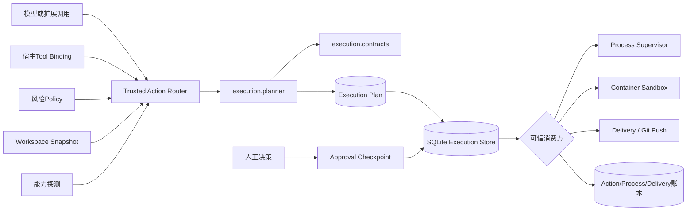

### 4.1 图示说明

1. 模型或扩展只能提交调用意图；Tool风险、效果、实现指纹、Sandbox和Policy必须由宿主可信边界提供；
2. `execution.planner`不主动查询外部状态，而是规范化调用方提供的已验证事实并冻结计划；
3. Execution Store只保存Plan和Approval，不保存“已经执行”或“执行成功”；
4. 消费方必须同时核对Plan、Approval和自己负责的当前事实，再进入自己的副作用状态机；
5. Process Lease、Action Audit、Delivery Record等账本不能由Execution Store替代。

### 4.2 数据所有权

| 数据 | 权威所有者 | Execution模块持有形式 | 禁止误解 |
|---|---|---|---|
| Tool定义与Schema | Trusted Tool Registry | `ExecutionIntent`中的来源、版本、指纹和参数 | Plan不证明Tool当前仍注册 |
| Workspace事实 | `workspace`模块 | 完整`WorkspaceSnapshot` | Execution不重新读取文件系统 |
| 普通环境 | 宿主/调用方 | 名称和无盐SHA-256值摘要 | 摘要不是密文，也不能恢复启动环境 |
| Secret | `secrets`模块/Provider | 名称、版本、注入目标 | 不保存值，不证明运行时解析值仍可信 |
| Sandbox配置 | `sandbox`模块 | 后端、版本、级别、网络、Profile摘要 | Plan不负责实际隔离 |
| 平台能力 | Process/Sandbox探测器 | 自校验能力证据摘要 | 声明能力不等于已经强制执行 |
| Policy | Policy实现 | 版本、决定、Policy ID、reason code | Execution不自行重算风险 |
| Approval | 受信审批入口 | 完整计划指纹和`ApprovalRecord` | Approval不表示副作用已发生 |
| 执行结果 | Process/Trusted Action/Delivery账本 | 不持有 | Plan Store不是Effect Journal |

## 5. 包结构与源码阅读顺序

生产源码共735行，核心行为集中在三个文件；[`__init__.py`](../../src/harnessix/execution/__init__.py)
当前不维护额外公共导出。

| 顺序 | 文件 | 关键符号 | 阅读目的 |
|---:|---|---|---|
| 1 | [`contracts.py`](../../src/harnessix/execution/contracts.py) | `ExecutionIntent`、`ExecutionPlan`、`ExecutionPlanV2`、`ExecutionApprovalCheckpoint` | 理解版本化字段、跨字段不变量和批准真值表 |
| 2 | [`planner.py`](../../src/harnessix/execution/planner.py) | `bind_environment`、`build_execution_plan_v2`、`verify_execution_plan_v2` | 理解规范化、Plan构造和执行前事实重建 |
| 3 | [`store.py`](../../src/harnessix/execution/store.py) | `SQLiteExecutionPlanStore` | 理解不可变写、一次性审批、事务和损坏失败关闭 |
| 4 | [`router.py`](../../src/harnessix/trusted_actions/router.py) | `TrustedActionRouter.plan`、`decide`、`_prepare_execution` | 理解Plan在统一高风险Action链中的生产和消费 |
| 5 | [`supervision_planner.py`](../../src/harnessix/processes/supervision_planner.py) | `build_process_launch_binding` | 理解Execution Plan如何继续绑定进程物化事实 |
| 6 | [`supervisor.py`](../../src/harnessix/processes/supervisor.py) | `_start_bound` | 理解批准、能力、Workspace、环境和Secret如何在spawn前复核 |
| 7 | [`container.py`](../../src/harnessix/sandbox/container.py) | `ContainerCommandBuilder.prepare` | 理解v2的Profile和Provider证据如何约束容器启动 |
| 8 | [`git_push.py`](../../src/harnessix/delivery/git_push.py) | `ApprovedGitPushPolicy` | 理解高风险外部副作用如何要求统一Route和Execution批准 |

## 6. 逻辑组成

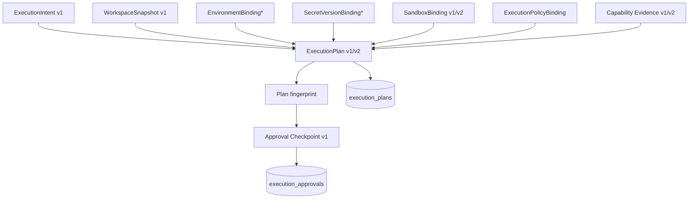

模块内部可分为四个职责：

1. **Contract**：严格、冻结、禁止额外字段的数据模型和跨字段不变量；
2. **Canonicalization**：环境排序、Secret排序和规范JSON摘要；
3. **Plan/Verify**：构造计划，或用当前事实重建并比较；
4. **Durable Checkpoint**：不可变保存Plan与至多一个审批决定。

## 7. 合同版本与兼容策略

### 7.1 当前公开Schema

| 合同 | `spec_version` | Schema | 当前用途 |
|---|---|---|---|
| Execution Intent | `harnessix.execution-intent/v1` | [`execution-intent-v1.schema.json`](../../spec/execution-intent-v1.schema.json) | v1/v2 Plan共同使用的Tool意图 |
| Capability v1 | 无显式`spec_version`字段 | [`execution-capability-evidence-v1.schema.json`](../../spec/execution-capability-evidence-v1.schema.json) | v1 Plan兼容读取与显式旧链构造 |
| Capability v2 | `harnessix.execution-capability/v2` | [`execution-capability-evidence-v2.schema.json`](../../spec/execution-capability-evidence-v2.schema.json) | 新可信执行链，增加底层Provider证据摘要 |
| Plan v1 | `harnessix.execution-plan/v1` | [`execution-plan-v1.schema.json`](../../spec/execution-plan-v1.schema.json) | 兼容保存与读取 |
| Plan v2 | `harnessix.execution-plan/v2` | [`execution-plan-v2.schema.json`](../../spec/execution-plan-v2.schema.json) | Trusted Action、Process和Container当前主合同 |
| Approval | `harnessix.execution-approval/v1` | [`execution-approval-v1.schema.json`](../../spec/execution-approval-v1.schema.json) | 同时适用于v1/v2 Plan的精确审批检查点 |

### 7.2 v1与v2差异

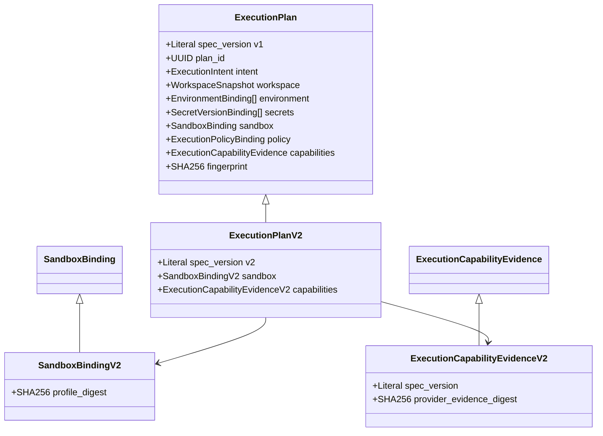

v2没有原地增加可选字段，而是使用新的Plan、Capability和Sandbox子类型：

- `SandboxBindingV2.profile_digest`绑定完整Sandbox Profile；
- `ExecutionCapabilityEvidenceV2.provider_evidence_digest`绑定Container Engine或Process owner等底层探测证明；
- v2 fingerprint包含上述新增事实；
- Store Schema仍为v1，因为表结构无需变化，`payload`以严格union读取v1/v2；
- 读取v1不会自动升级、补字段或重算为v2；
- 消费方若依赖Profile或Provider证据，必须显式要求`ExecutionPlanV2`，不能只接受基类语义。

## 8. 严格合同基类

[`ExecutionContract`](../../src/harnessix/execution/contracts.py)继承领域`ContractModel`并进一步配置：

| 配置 | 当前值 | 目的 |
|---|---|---|
| `extra` | `forbid` | 拒绝未知字段，避免调用方悄悄加入未参与授权的语义 |
| `frozen` | `True` | 构造后不能通过普通赋值改写计划 |
| `strict` | `True` | 拒绝字符串数字、枚举替代等隐式类型转换 |
| `allow_inf_nan` | `False` | JSON数字必须可规范化，避免非有限浮点破坏摘要 |

冻结对象只防止常规应用代码赋值，不是防篡改存储。每次持久化、读取或执行前仍需经过严格JSON重验证和
fingerprint核对。

## 9. 规范摘要与Plan身份

### 9.1 `canonical_digest`

[`canonical_digest`](../../src/harnessix/execution/contracts.py)对以下规范JSON字节计算SHA-256：

```text
JSON(
  ensure_ascii = false,
  sort_keys = true,
  separators = (",", ":"),
  allow_nan = false
).encode("utf-8")
```

这保证字典键顺序和默认空白不会改变摘要，但不自动规范任意业务集合。因此环境、Secret和能力枚举必须在进入
摘要前完成确定性排序；计划模型再检查其顺序与唯一性。

### 9.2 两类身份

| 身份 | 生成方式 | 语义 |
|---|---|---|
| `plan_id` | 调用方提供UUID或Planner生成UUIDv4 | 稳定业务主键；同一重试应复用相同ID |
| `fingerprint` | 对除`fingerprint`自身外的完整Plan规范JSON计算SHA-256 | 内容身份；任一绑定事实变化都应改变 |

`plan_id`相同而fingerprint不同不是“更新”，而是`execution_plan_conflict`。新的执行语义必须创建新Plan；旧审批
不能通过覆盖记录迁移到新事实。

### 9.3 指纹覆盖范围

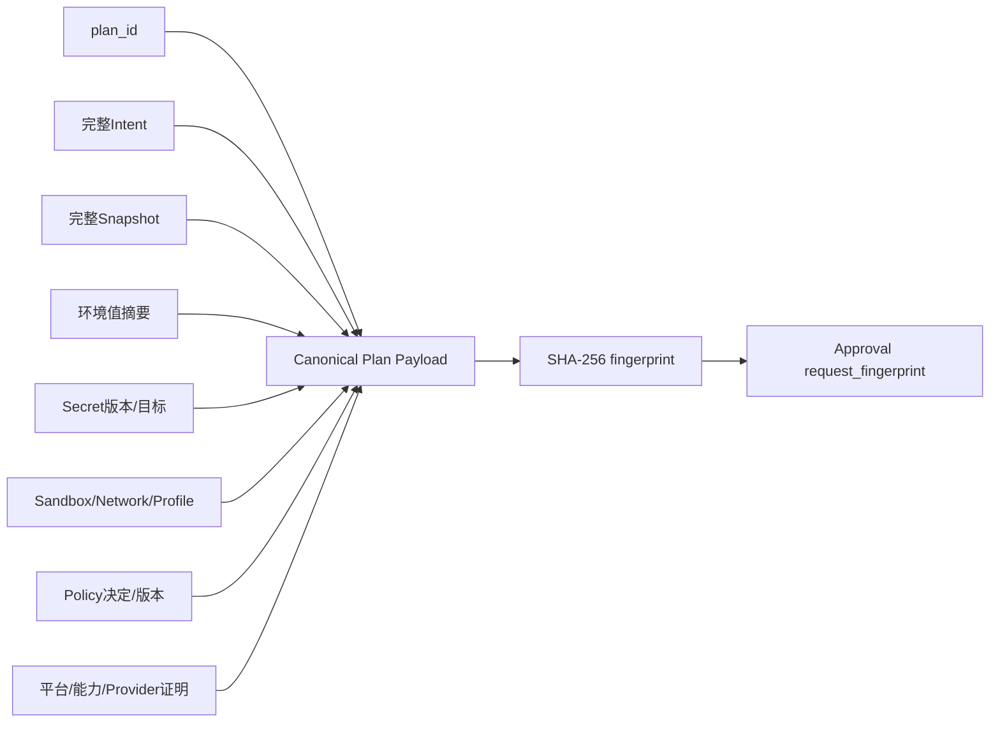

Approval绑定的是完整Plan fingerprint，不是Tool参数的局部摘要。

## 10. Execution Intent设计

[`ExecutionIntent`](../../src/harnessix/execution/contracts.py)把已解析Tool调用冻结为执行层可理解的最小意图。

| 字段 | 类型/上限 | 语义 | 关键约束 |
|---|---|---|---|
| `spec_version` | Literal v1 | Intent合同版本 | 固定值 |
| `source` | `builtin/mcp/skill/hook/custom` | Tool来源类别 | 不能由不可信扩展决定宿主权限 |
| `source_id` | 1～256字符 | 来源实例或注册身份 | 去除空白后不可为空 |
| `tool` | 名称正则，最长256 | Tool规范名称 | 以字母开头 |
| `tool_version` | 1～128字符 | Tool合同版本 | 去除空白后不可为空 |
| `tool_fingerprint` | 64位Revision | Schema/实现绑定摘要 | 由Registry提供 |
| `arguments` | JSON对象 | 已按Tool Schema规范化的参数 | 全量进入Plan和持久payload |
| `effect_class` | 领域枚举 | 只读、幂等写、非幂等写、破坏性 | 影响幂等要求与恢复策略 |
| `risk_level` | 领域枚举 | low～critical | 由受信Tool Binding/Policy链提供 |
| `idempotency_key` | 可选，1～256字符 | 外部或非幂等效果身份 | 非幂等写和破坏性操作必填且不可为空白 |

Execution包本身不会解析Tool Schema，也不会检测参数中的敏感字段。统一Trusted Action Router在创建Intent前会拒绝
常见凭据键；直接调用Planner的其他宿主必须提供等价输入治理，否则`arguments`会按原JSON持久化。

## 11. 环境与Secret绑定

### 11.1 普通环境规范化

[`bind_environment`](../../src/harnessix/execution/planner.py)执行以下规则：

1. 最多128个变量；
2. 名称符合`[A-Za-z_][A-Za-z0-9_]{0,127}`；
3. 值必须是精确`str`，不得包含NUL；
4. 按目标平台排序：Windows使用`casefold()`，其他平台使用原名称；
5. Windows按大小写不敏感语义去重；
6. 每个值以UTF-8编码计算SHA-256，只把名称和摘要放入Plan；
7. 名称、值及分隔开销总计不得超过32768字节。

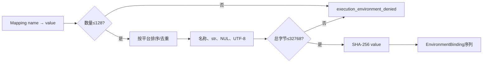

环境值摘要用于执行前等值比较，不提供保密性。布尔值、短枚举和其他低熵环境值可能被离线枚举，因此不应把
Token、密码或私钥伪装成普通环境变量。

### 11.2 Secret版本绑定

[`SecretVersionBinding`](../../src/harnessix/execution/contracts.py)只保存：

- `name`：Secret逻辑名称；
- `version`：不可为空的版本标识；
- `target`：运行时注入的环境变量名称。

每个Plan最多32项。Planner按`(name, target)`排序，其中Windows的`target`按`casefold()`比较；Plan合同要求：

- `(name, target)`组合不可重复；
- 注入目标按平台语义全局唯一，即不同Secret不能写入同一变量；
- 普通环境名称与Secret目标不得相交；
- Plan不保存Secret值，运行时由`secrets`模块重新解析，并由Process/Sandbox消费方核对实际版本绑定。

## 12. Sandbox与能力证据

### 12.1 Sandbox Binding

| 字段 | 语义 | 不变量 |
|---|---|---|
| `level` | `host_guarded/host_sandboxed/container_strong` | 必须包含在能力证据声明中 |
| `backend` | `host/docker/podman`等规范后端名 | `host_guarded`只能是`host`；`container_strong`只能是`docker`或`podman` |
| `backend_version` | 后端版本 | 1～128字符 |
| `network` | `none/limited/restricted/full` | 必须包含在能力证据声明中 |
| `capability_digest` | 当前能力证据摘要 | 必须精确等于`capabilities.evidence_digest` |
| `profile_digest` | v2 Sandbox Profile摘要 | 只在`SandboxBindingV2`中存在 |

### 12.2 Capability Evidence

Capability记录目标平台、Provider、版本、支持的Sandbox/Network集合及PTY、后台、进程树能力。构造器要求
Sandbox和Network枚举集合已经排序且无重复，并对除`evidence_digest`外的完整证据自摘要。

v2的`provider_evidence_digest`用于把高层声明继续绑定到真实底层探测，例如Container Engine Probe或Process owner
实现摘要。它避免仅用可伪造的`provider="docker"`和版本文本代表能力身份。

### 12.3 能力关系不变量

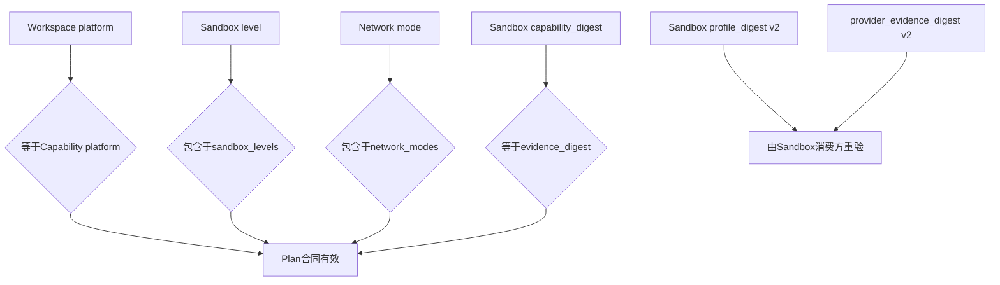

Plan合同能证明“所选能力与所附证据自洽”，不能单独证明后端当前仍是同一实例。Sandbox和Process执行器必须在
物化前重新探测并比较v2证据。

## 13. Execution Plan字段与不变量

| 字段 | 来源 | 是否进入fingerprint | 主要约束 |
|---|---|---:|---|
| `spec_version` | 合同 | 是 | v1或v2固定Literal |
| `plan_id` | 调用方/UUIDv4 | 是 | 持久主键与审批关联键 |
| `intent` | Tool Registry + 规范参数 | 是 | 严格`ExecutionIntent` |
| `workspace` | `capture_workspace_snapshot`调用方 | 是 | 平台必须匹配能力证据 |
| `environment` | `bind_environment` | 是 | 有序、唯一、最多128，仅值摘要 |
| `secrets` | Secret引用解析前的元数据 | 是 | 有序、目标唯一、最多32 |
| `sandbox` | Sandbox Planner | 是 | 级别、网络、能力摘要匹配 |
| `policy` | Policy实现 | 是 | 版本、决定、ID、规范reason code |
| `capabilities` | 平台探测器 | 是 | 有序能力集合、自校验摘要 |
| `fingerprint` | Planner | 否 | 必须等于其余完整字段的规范摘要 |

Pydantic字段验证之后，`ExecutionPlan.complete_binding`统一执行平台排序、环境/Secret冲突、能力范围、平台一致和
fingerprint检查。任何一项不满足都不能形成可持久的Plan。

## 14. 核心流程：Plan构造

### 14.1 正常时序

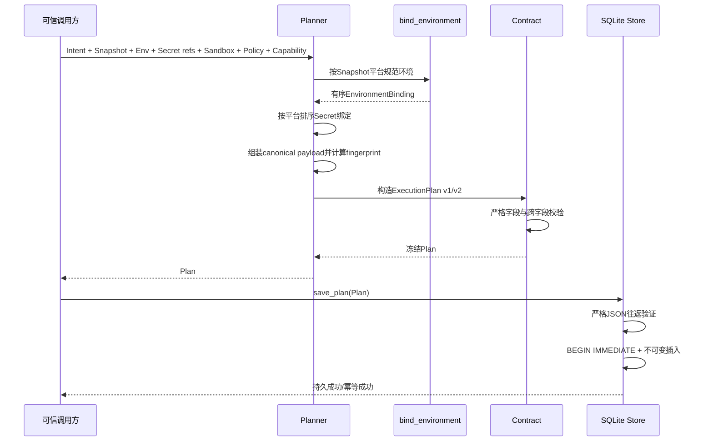

### 14.2 构造函数

| 函数 | 结果 | 失败代码 |
|---|---|---|
| `build_capability_evidence` | v1自摘要能力证据 | `execution_capability_invalid` |
| `build_capability_evidence_v2` | 带Provider证据的v2能力证据 | `execution_capability_invalid` |
| `bind_environment` | 有序、仅摘要的环境绑定 | `execution_environment_denied` |
| `build_execution_plan` | v1 Plan | `execution_plan_invalid` |
| `build_execution_plan_v2` | v2 Plan | `execution_plan_invalid` |

Planner只捕获Pydantic合同错误并投影为稳定`KernelError`。调用方传入错误Python对象导致的其他编程错误不应被
解释为可恢复业务失败。

## 15. 执行前验证流程

### 15.1 `verify_execution_plan`与`verify_execution_plan_v2`

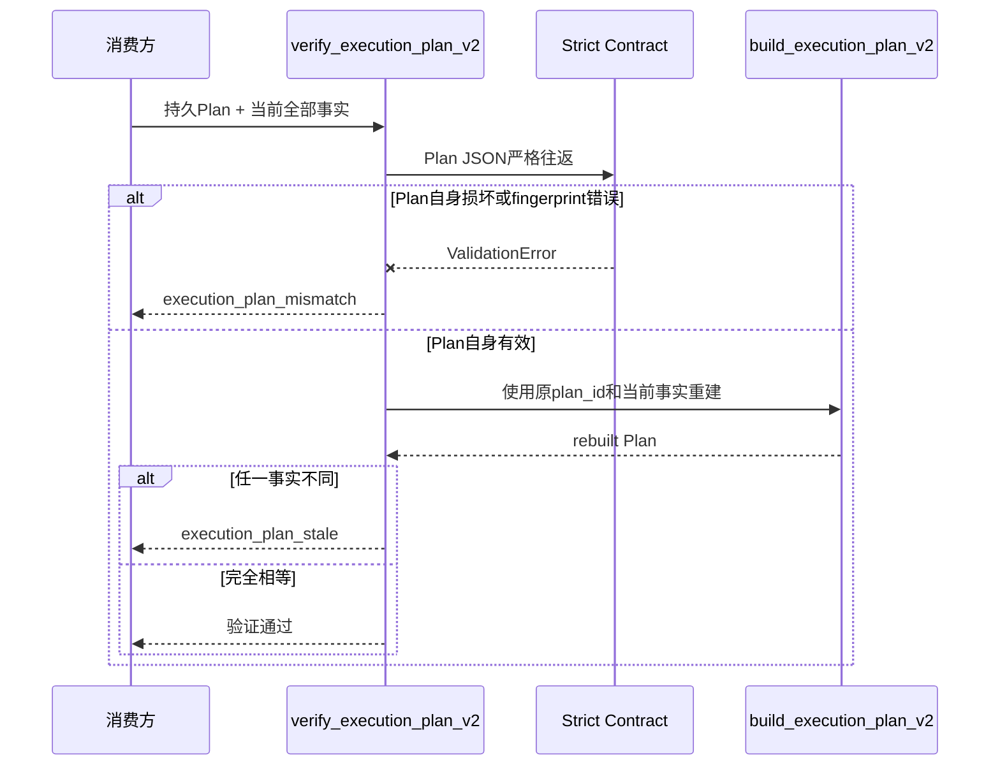

验证分两层：

1. **自身完整性**：严格重解析现有Plan，拒绝非法字段、类型、跨字段关系或fingerprint；
2. **新鲜度**：用调用方提供的当前Intent、Snapshot、环境、Secret版本、Sandbox、Policy和能力重建同一`plan_id`，
   要求对象和fingerprint完全相等。

### 15.2 调用方责任

验证函数不会自行：

- 重新捕获Workspace；
- 重新探测Process owner或Container Engine；
- 重新计算Policy；
- 重新解析Secret版本；
- 从Store加载Plan。

因此传入旧Snapshot或旧Capability只能证明“旧事实和旧Plan相等”。当前生产消费者采用分层复核：Trusted Action
Router重开Plan、核对Route和Tool Binding并重新验证Workspace；Process/Sandbox继续检查实际环境、Secret和后端
能力。`verify_execution_plan_v2`是可复用完整比较API，但当前并非所有生产入口的单一强制门面。

## 16. Policy与Approval语义

### 16.1 Policy绑定

`ExecutionPolicyBinding`保存：

- `version`：Policy合同/规则版本；
- `decision`：`allow`、`deny`或`require_approval`；
- `policy_id`：做出决定的策略身份；
- `reason_code`：规范、低基数原因码。

自然语言解释不进入本合同，避免未经治理的文本成为授权事实或持久敏感数据。

### 16.2 Approval Checkpoint

`ExecutionApprovalCheckpoint`由`plan_id`、`plan_fingerprint`和`ApprovalRecord`组成。合同要求：

- `ApprovalRecord.request_fingerprint == plan_fingerprint`；
- `actor.strip()`非空；
- Store中必须已存在同一`plan_id`的Plan；
- Plan fingerprint必须精确匹配；
- 只有Policy为`require_approval`的Plan可以记录Checkpoint；
- 同一Plan只能记录一个不可变决定，批准与拒绝不能覆盖。

Checkpoint可以保存`approved`或`rejected`。保存拒绝是持久审计事实，但`execution_is_approved`只对精确批准返回真。

### 16.3 批准真值表

| Policy | Checkpoint | 指纹/ID | Outcome | `execution_is_approved` |
|---|---|---|---|---:|
| `deny` | 任意 | 任意 | 任意 | `False` |
| `allow` | 无 | — | — | `True` |
| `allow` | 有 | 任意 | 任意 | `False` |
| `require_approval` | 无 | — | — | `False` |
| `require_approval` | 有 | 不匹配 | 任意 | `False` |
| `require_approval` | 有 | 精确匹配 | `rejected` | `False` |
| `require_approval` | 有 | 精确匹配 | `approved` | `True` |

`allow`计划携带额外Checkpoint会失败关闭，而不是忽略它。这样可以阻止调用方把不应存在的审批记录混入另一条
Policy路径。

### 16.4 审批时序

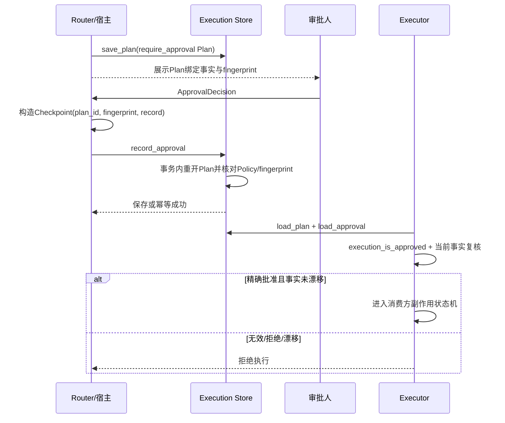

## 17. SQLite持久化设计

### 17.1 初始化与文件权限

[`SQLiteExecutionPlanStore`](../../src/harnessix/execution/store.py)初始化时：

1. 创建父目录；POSIX上将父目录权限设为`0700`；
2. 以自动提交模式和5秒连接超时打开SQLite；
3. 设置`busy_timeout=5000`、`foreign_keys=ON`、`journal_mode=WAL`、`synchronous=FULL`；
4. POSIX上将数据库文件权限设为`0600`；
5. 创建元数据和业务表；未知Schema版本立即返回`execution_store_version`。

权限加固面向本地状态文件，不能抵御同一账户下已获得读权限的恶意进程，也不能替代磁盘加密。构造器当前
没有像受管Patch I/O那样验证绝对路径、父目录所有者、符号链接、硬链接或既有文件类型；数据库路径必须来自
宿主可信配置，不能接受Workspace内容或扩展输入。

### 17.2 表结构

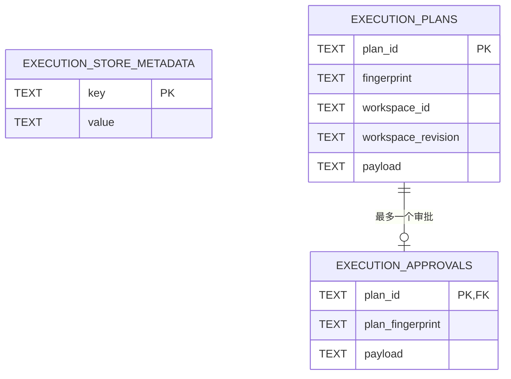

`execution_plans_workspace(workspace_id, workspace_revision)`为Workspace查询预留索引，但当前Store没有公开列表/扫描API。
`payload`保存完整严格JSON；其他列是索引或冲突检查所需的冗余事实。

### 17.3 `save_plan`事务

```text
strict_validate(plan)
payload = canonical_model_json(plan)
BEGIN IMMEDIATE
existing = SELECT fingerprint, payload WHERE plan_id = ?
if absent:
    INSERT(plan_id, fingerprint, workspace_id, workspace_revision, payload)
elif existing != (fingerprint, payload):
    raise execution_plan_conflict
COMMIT
on any failure:
    ROLLBACK if transaction active
```

相同`plan_id`、fingerprint和JSON重复保存是幂等成功。任何差异都不能更新原记录。

### 17.4 `record_approval`事务

```text
strict_validate(checkpoint)
BEGIN IMMEDIATE
plan = SELECT payload WHERE plan_id = checkpoint.plan_id
require plan exists and parses strictly
require plan.fingerprint == checkpoint.plan_fingerprint
require plan.policy.decision == require_approval
existing = SELECT plan_fingerprint, payload FROM approvals
if absent:
    INSERT checkpoint
elif existing differs:
    raise approval_conflict
COMMIT
on any failure:
    ROLLBACK if transaction active
```

Approval写入与对应Plan核对位于同一SQLite事务中，不存在“审批落库但Plan尚不存在”的合法状态。

## 18. 持久状态与生命周期

Execution模块没有“running/succeeded/unknown”状态机，只有不可变事实是否存在：

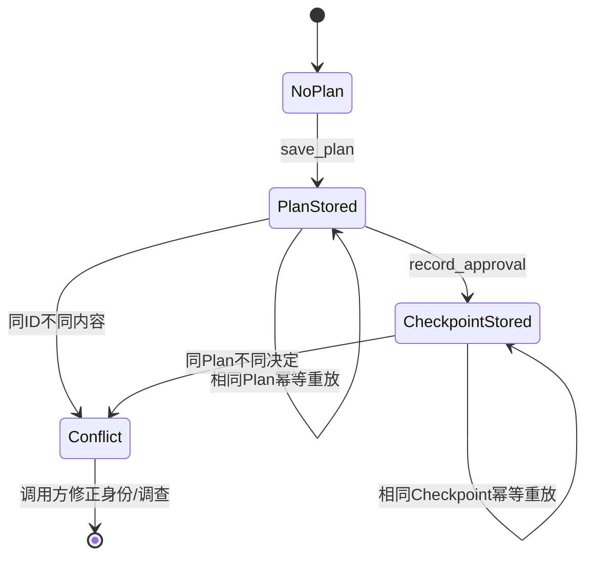

| 状态事实 | 是否可更新 | 恢复方式 |
|---|---:|---|
| Plan不存在 | — | 使用稳定Plan ID重新执行`save_plan` |
| Plan存在、无Checkpoint | 否 | `allow/deny`无需Checkpoint；`require_approval`等待决定 |
| Plan存在、Checkpoint存在 | 否 | 重开并复核；改变决定必须创建新Plan和新审批流程 |
| Plan写成功、Route写失败 | Plan保留 | 形成不可达孤立Plan；不得仅凭Plan执行 |
| Store记录损坏 | 不自动修复 | 失败关闭，保留数据库并通过正式恢复/迁移工具处理 |

## 19. Trusted Action集成

### 19.1 计划阶段

[`TrustedActionRouter.plan`](../../src/harnessix/trusted_actions/router.py)是当前最完整的Plan生产入口：

1. 严格解析`CodingActionInvocation`并匹配宿主注册的`TrustedToolBinding`；
2. 拒绝Tool版本/指纹漂移和常见明文凭据键；
3. 使用受信Input Model规范化参数；
4. 由Resource Resolver产生规范资源，由Policy根据Binding、资源、Sandbox和Secret元数据决策；
5. 捕获选择资源Workspace Snapshot；
6. 从宿主Binding构造`ExecutionIntent`；
7. 构造`ExecutionPlanV2`，其中`plan_id == invocation_id`；
8. 先保存Execution Plan，再保存包含该Plan的Action Route及初始审计状态。

### 19.2 执行阶段

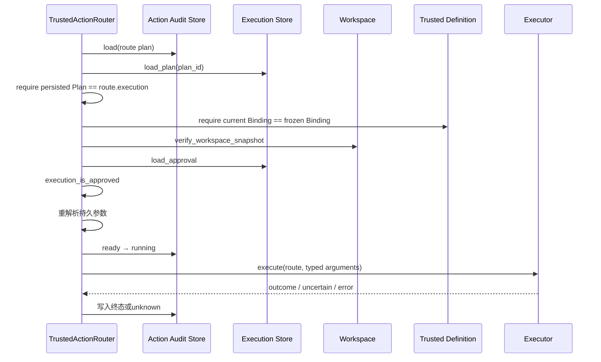

Execution Store与Action Audit Store是两个独立SQLite文件，不伪装跨库原子性：

- Plan先写成功、Route写失败：最多产生不可达孤立Plan；
- Route执行必须重开两个对象并要求Plan完全相等；
- 仅知道Plan ID不能绕过Route状态、Tool Binding和Executor身份；
- 执行结果与`UNKNOWN/reconcile`只进入Action Audit，不写回不可变Plan。

## 20. Process与Sandbox集成

### 20.1 Host Process

[`PosixProcessSupervisor._start_bound`](../../src/harnessix/processes/supervisor.py)及其Windows继承实现在spawn前继续检查：

- Plan是否按Policy获得有效批准；
- 当前Capability是否等于Supervisor初始化能力，且重新探测仍一致；
- 相同Process ID是否已存在；存在时无论是否同Plan都禁止自动重放；
- Workspace Snapshot是否仍匹配；
- 物化环境摘要是否等于`ProcessLaunchBinding.environment`；
- 实际Secret名称/版本/目标是否等于Plan，普通环境不得覆盖Secret；
- Process Spec、Plan fingerprint、Capability和Launch Binding是否写入新Lease。

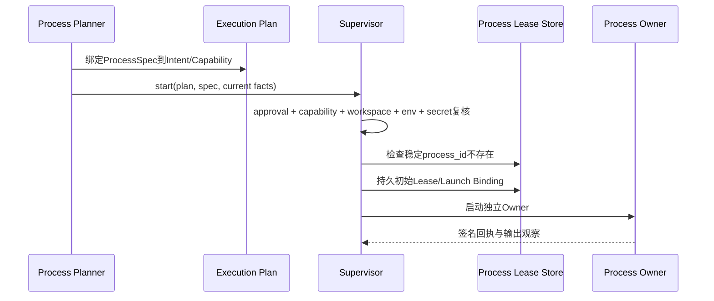

进程的超时、取消、输出预算、进程树回收和Owner丢失由`processes`模块负责，不是Execution Plan状态。

### 20.2 Container Process

Container链要求v2 Plan，并在准备阶段核对：

- `container_strong`级别与实际Docker/Podman后端及版本；
- `provider_evidence_digest`与当前Engine Probe；
- `profile_digest`、网络模式和Command Profile；
- Plan Intent参数与完整Container Command/Execution Spec逐字段相等；
- Workspace、环境、Secret和可选Egress绑定；
- 外层受监督Process的Owner能力和Launch Binding。

Container准备成功不表示执行成功；容器实例清理和Owner恢复仍由`sandbox.process_runtime`与`processes`账本负责。

## 21. Delivery与外部副作用集成

Git Push是Execution批准与Effect Journal组合的代表。`ApprovedGitPushPolicy`只有同时满足以下条件才向既有Action
Plane返回`ALLOW`：

- Execution Store加载的是`ExecutionPlanV2`；
- 它与Route内嵌Plan完全相等并通过`execution_is_approved`；
- Route已经进入`running`；
- Route fingerprint、稳定外部Action ID和请求Action ID一致；
- Tool Binding声明`external_reconcile`和非幂等写；
- Intent、幂等键和`git.push`工具能力完全匹配。

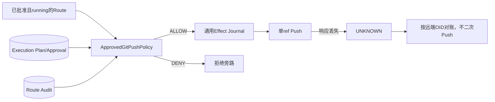

Execution Approval证明“允许尝试该精确Push”，Effect Journal证明“尝试是否已发送、结果是否未知、应如何对账”。
二者不能合并成一个布尔`approved`字段。

## 22. 数据流与敏感数据

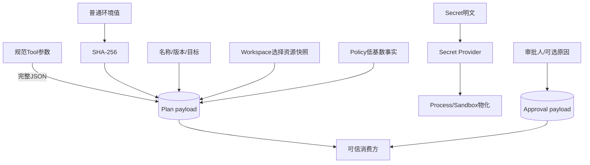

### 22.1 持久化数据分类

| 数据 | 是否持久化 | 风险与控制 |
|---|---:|---|
| Tool参数 | 是，完整JSON | 直接Planner不做Secret扫描；调用方必须先治理，状态目录需受限 |
| 普通环境值 | 否 | 只保存无盐摘要；低熵值仍可枚举 |
| 环境名称 | 是 | 可能泄露运行结构，不应包含用户输入正文 |
| Secret明文 | 否 | 只在运行时Provider解析和注入 |
| Secret名称/版本/目标 | 是 | 属于敏感元数据，数据库权限应最小化 |
| Workspace宿主根路径 | 不由Execution新增 | Snapshot保存根摘要与逻辑cwd；具体规则由Workspace合同负责 |
| Workspace资源摘要/身份 | 是 | 用于漂移检测，可能暴露文件规模和逻辑结构 |
| 审批actor/reason | 是 | reason可能含人工文本，审批入口应限制敏感内容 |
| 执行输出/错误正文 | 否 | 由Artifact或消费方审计以受控投影保存 |

## 23. 失败语义

### 23.1 Execution模块错误矩阵

| 错误码 | 触发条件 | 是否可直接重试 | 正确处理 |
|---|---|---:|---|
| `execution_capability_invalid` | 能力集合乱序/重复、字段非法或证据摘要错误 | 否 | 重新探测并重新构造证据 |
| `execution_environment_denied` | 数量/字节超限、名称非法、值非字符串/NUL、Windows冲突 | 否 | 修正环境；不要截断后继续 |
| `execution_plan_invalid` | Plan字段或跨字段绑定不成立 | 否 | 修正Planner输入并生成新Plan |
| `execution_plan_mismatch` | 待验证Plan自身不能严格解析或fingerprint错误 | 否 | 视为损坏/篡改，停止执行 |
| `execution_plan_stale` | 当前事实重建结果与Plan不同 | 否 | 废弃旧批准，生成新Plan并重新决策 |
| `execution_store_version` | SQLite元数据Schema未知 | 否 | 使用匹配二进制或正式迁移工具 |
| `execution_plan_conflict` | 同一Plan ID绑定不同Plan | 否 | 调查幂等身份复用错误 |
| `execution_plan_not_found` | Plan或待审批Plan不存在 | 视调用链而定 | 重新建立完整计划链，不能只补审批 |
| `execution_store_corrupt` | Plan/Approval payload不能通过严格合同 | 否 | 失败关闭并保留存储诊断 |
| `approval_invalid` | Checkpoint自身合同非法 | 否 | 修正审批记录生成逻辑 |
| `approval_plan_mismatch` | 指纹不匹配或Plan不要求审批 | 否 | 拒绝复用批准，重新读取Plan |
| `approval_conflict` | 同一Plan已有不同审批结果 | 否 | 不覆盖；新语义创建新Plan |

### 23.2 消费方相关失败

| 错误码 | 消费方 | 与Execution Plan的关系 |
|---|---|---|
| `action_plan_mismatch` | Trusted Action | Route内嵌Plan与独立Plan Store不一致 |
| `action_not_approved` | Trusted Action | Policy/Checkpoint真值表不允许执行 |
| `trusted_tool_contract_changed` | Trusted Action | 当前注册Binding不同于冻结Binding |
| `approval_required` | Process/Sandbox | 执行端没有精确有效批准 |
| `process_capability_mismatch` | Process | 当前Owner能力与Plan/Launch Binding不一致 |
| `sandbox_capability_mismatch` | Sandbox | 后端、Profile、网络、证据或命令与v2 Plan不一致 |
| `secret_binding_mismatch` | Process/Sandbox | 运行时Secret版本/目标与Plan不同或环境覆盖Secret |
| `process_already_exists` | Process | 稳定Process ID存在，禁止自动重放副作用 |

## 24. 崩溃、取消、超时与恢复边界

### 24.1 崩溃切点

| 切点 | 持久事实 | 恢复结论 |
|---|---|---|
| `BEGIN`前 | 无新Plan/Approval | 使用相同对象重试安全 |
| Plan `INSERT`后、`COMMIT`前 | 事务未提交 | SQLite回滚；相同Plan重试 |
| Plan `COMMIT`后、Route保存前 | 孤立Plan | 不可仅凭Plan执行；后续可做存储维护清理 |
| Route已保存、审批前 | Plan + pending Route | 等待决定，不执行 |
| Approval `INSERT`后、`COMMIT`前 | 审批未提交 | 相同Checkpoint重试 |
| Approval提交后、执行前 | Plan + 精确决定 | 重开、重新验证当前事实后执行 |
| 副作用发送后响应丢失 | Execution记录不变 | 消费方进入`UNKNOWN`并对账，不通过Plan重放 |

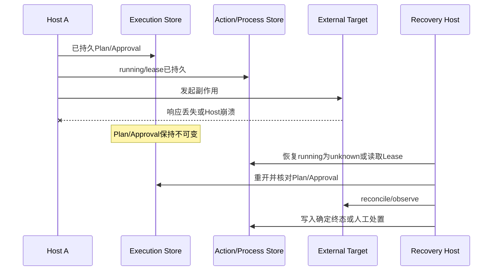

### 24.2 取消与超时

Execution API为同步构造/SQLite操作，没有`CancelToken`或业务重试：

- SQLite锁等待由5秒`busy_timeout`约束，当前没有专用超时错误投影；
- 取消发生在Trusted Action、Process或Container生命周期，由其账本记录确定/未知效果；
- Plan中没有通用deadline字段；Process超时属于绑定在Intent参数内的`ProcessSpec`；
- 取消不能删除或改写已批准Plan，也不能把旧Plan标记为“未执行”；
- 恢复时必须查询消费方账本，不能从Execution Store推断是否可以重试。

## 25. 幂等、并发与生命周期

| 关注点 | 当前语义 |
|---|---|
| Plan重试 | 相同ID + 相同fingerprint + 相同JSON幂等 |
| Plan冲突 | 相同ID + 任一内容不同，显式冲突 |
| Approval重试 | 相同Plan + 完全相同Checkpoint幂等 |
| Approval改变 | 禁止覆盖，显式冲突 |
| 写事务 | `BEGIN IMMEDIATE`串行化同库写者 |
| 锁等待 | SQLite 5秒busy timeout |
| 连接线程 | 使用sqlite3默认线程约束，Store实例不声明跨线程安全 |
| 进程并发 | 可由多个连接受SQLite协调，但当前没有多进程压力/崩溃合同测试，不作为分布式承诺 |
| 实例关闭 | `close()`幂等；关闭后方法没有统一`KernelError`前置检查，底层sqlite错误会外泄 |
| 删除/更新 | 无公共API；Plan和Approval只追加一次 |
| 清理/配额 | 无列表、TTL、容量配额、归档或孤立Plan清理API |

`_closed`只用于避免重复关闭，并未在每个方法入口执行生命周期守卫。调用方必须通过Context Manager或明确所有权
管理Store，不得在关闭后继续访问。

## 26. 重点类、函数与接口

### 26.1 重点符号

| 符号 | 职责 | 输入/输出 | 不变量 | 副作用 | 错误/取消 |
|---|---|---|---|---|---|
| `canonical_digest` | 规范JSON SHA-256 | 任意JSON可编码对象→hex | 排序键、紧凑、禁NaN | 无 | JSON编码错误原样传播 |
| `ExecutionIntent` | 冻结Tool意图 | 严格字段→冻结模型 | 非幂等/破坏性必有幂等键 | 无 | ValidationError |
| `ExecutionCapabilityEvidence(V2)` | 能力自证明 | 探测事实→冻结模型 | 集合有序唯一、摘要自洽 | 无 | ValidationError/包装错误 |
| `ExecutionPlan(V2)` | 完整授权对象 | 全部执行事实→冻结模型 | 平台、能力、环境、Secret、fingerprint一致 | 无 | ValidationError/包装错误 |
| `ExecutionApprovalCheckpoint` | 绑定审批 | Plan身份+ApprovalRecord | request fingerprint一致、actor非空 | 无 | ValidationError/包装错误 |
| `bind_environment` | 环境规范化 | `Mapping[str,str]`→bindings | 平台排序、大小/数量限制 | 计算摘要 | `execution_environment_denied` |
| `build_execution_plan_v2` | 生成当前主Plan | 当前事实→Plan v2 | 同一payload确定同一fingerprint | UUID生成（可选） | `execution_plan_invalid` |
| `verify_execution_plan_v2` | 比较Plan与当前事实 | Plan+当前事实→None | 严格自身有效且重建完全相等 | 无 | mismatch/stale |
| `execution_is_approved` | 批准纯判断 | Plan+可选Checkpoint→bool | 严格真值表 | 无 | 不抛业务错误 |
| `SQLiteExecutionPlanStore` | 持久计划与审批 | save/load/record/load | 不可变、同对象幂等 | SQLite I/O、权限修改 | 稳定KernelError + 部分sqlite错误 |

### 26.2 Store接口

| 方法 | 调用者 | 契约 | 超时/重试 | 幂等/顺序 | 权限 |
|---|---|---|---|---|---|
| `save_plan(plan)` | Router/Planner宿主 | 先严格JSON验证，再不可变写入 | SQLite锁最多约5秒；相同对象可重试 | Plan必须先于Approval和Route执行 | 状态目录应为私有 |
| `load_plan(plan_id)` | Router/Executor/Policy | 返回严格v1/v2对象；不存在或损坏失败 | 只读可重试 | 不表示Plan可执行 | 需读取本地状态库 |
| `record_approval(checkpoint)` | 审批编排层 | 事务内要求Plan存在、指纹匹配、Policy要求审批 | 相同Checkpoint可重试 | 每Plan至多一次 | 仅受信审批入口 |
| `load_approval(plan_id)` | 执行门禁 | 缺失返回`None`，损坏失败 | 只读可重试 | 必须与Plan一起判断 | 需读取本地状态库 |
| `close()` | 生命周期Owner | 幂等关闭连接 | 不重试业务操作 | 所有访问结束后 | 进程内所有权 |

## 27. 核心业务逻辑伪代码

### 27.1 可信计划

```text
function plan_trusted_action(invocation, host_context):
    definition = registry.require_exact_binding(invocation)
    reject_suspected_plaintext_credentials(invocation.arguments)
    arguments = definition.input_model.strict_decode(invocation.arguments)
    resources = definition.resolve(arguments, host_context)
    policy = policy.evaluate(definition.binding, resources, host_context)
    workspace = capture_workspace_snapshot(resources)

    intent = ExecutionIntent(
        source/tool/version/fingerprint from definition.binding,
        arguments = canonical typed JSON,
        effect/risk from definition.binding,
        idempotency_key = invocation.idempotency_key,
    )
    plan = build_execution_plan_v2(
        intent, workspace,
        hashed environment, secret version refs,
        sandbox profile, policy, probed capability,
        plan_id = invocation.invocation_id,
    )
    execution_store.save_plan(plan)
    audit_store.save_route(route_containing_exact(plan))
    return route_snapshot
```

### 27.2 执行门禁

```text
function prepare_execution(plan_id):
    route = audit_store.load(plan_id)
    persisted_plan = execution_store.load_plan(plan_id)
    require persisted_plan == route.plan.execution
    require registry.current_binding == route.plan.binding
    verify_workspace_snapshot(persisted_plan.workspace)
    checkpoint = execution_store.load_approval(plan_id)
    require execution_is_approved(persisted_plan, checkpoint)
    typed_arguments = definition.input_model.strict_decode(route.invocation.arguments)
    return route, definition, typed_arguments
```

### 27.3 消费方物化

```text
function start_process(plan_v2, current_runtime_facts):
    require execution_is_approved(plan_v2, checkpoint)
    require current_capability == frozen_capability
    require recaptured_workspace == frozen_workspace
    require hash(current_environment) == frozen_environment
    require resolved_secret_versions_and_targets == frozen_secret_bindings
    require process/container spec == plan_v2.intent.arguments
    persist process lease before spawn
    spawn owner once
    on response loss:
        recover from lease/receipt; never infer outcome from Plan alone
```

## 28. 安全设计

### 28.1 威胁与控制

| 威胁 | 当前控制 | 剩余风险 |
|---|---|---|
| 批准后替换参数 | 完整Intent进入fingerprint | 直接调用方若未Schema规范化，仍可能建立错误但自洽的Plan |
| 批准后替换Workspace | Snapshot进入Plan；消费方重新验证 | `verify_execution_plan`依赖调用方提供新Snapshot |
| 环境覆盖Secret | 平台语义冲突检测；运行时再次比较 | 环境摘要无盐，不适合保存Secret |
| 伪造Sandbox能力 | 能力自摘要、v2 Provider证据、运行时重探测 | Plan本身不执行隔离，恶意消费方可忽略合同 |
| Approval复用 | 同时绑定Plan ID、完整fingerprint和Policy | Approval actor真实性由上游身份系统保证 |
| Plan/Route替换 | 两库执行前完全相等检查 | 两库没有统一事务，存在孤立Plan运维债务 |
| 数据库payload篡改 | 严格模型与fingerprint失败关闭 | 冗余索引列当前读取时未与payload交叉核对 |
| 数据库路径替换或链接攻击 | POSIX权限在打开后收紧 | 构造前未验证绝对路径、所有者、符号/硬链接和普通文件身份 |
| 重复非幂等副作用 | Intent要求幂等键；Process ID/Action ID稳定；消费方账本恢复 | Execution Store不保存Effect Receipt，不能单独阻止重放 |
| 凭据写入参数 | Trusted Router拒绝常见敏感键 | Execution Planner公共API自身不扫描任意敏感结构 |
| 状态文件泄露 | POSIX目录0700、DB 0600 | Windows ACL、磁盘加密和同UID攻击不由本模块证明 |

### 28.2 信任边界结论

Execution Plan是**授权完整性合同**，不是安全执行环境。只有在以下链条同时成立时才具有生产意义：

1. Intent由受信Registry和严格Schema生成；
2. Snapshot、Policy、Sandbox和Capability由受信端口生成；
3. Plan在审批前持久化并向审批人展示一致事实；
4. 消费方只能从受信Store重开Plan和Checkpoint；
5. 消费方在副作用前重验自己负责的实际事实；
6. 副作用状态由独立账本持久，并对不确定结果执行reconcile而不是重放。

## 29. 可观测性与运维

Execution包当前不直接发出Trace、Metric或结构化Log，也没有管理查询API。可用事实包括：

- Plan/Approval是否存在；
- Plan ID、fingerprint、Workspace ID/revision；
- 规范Policy ID/reason code；
- 严格错误码；
- 下游Action Audit、Process Lease和Delivery Record。

运维诊断应按以下顺序关联，而不是记录Plan payload全文：

```text
plan_id
→ plan fingerprint / spec_version
→ action route or process/delivery identity
→ policy_id / reason_code
→ consumer state and stable error_code
→ artifact or reconciliation evidence
```

建议的后续低基数指标包括Plan创建/冲突、Approval结果、stale/mismatch、Store corrupt/version和孤立Plan数量；
任何指标标签都不得包含参数、路径、环境值、Secret元数据或审批原因。

## 30. 源码与测试映射

| 设计元素 | 源码文件 | 关键符号 | 测试文件 | 测试符号 |
|---|---|---|---|---|
| 完整Plan绑定且不含Secret明文 | [`contracts.py`](../../src/harnessix/execution/contracts.py)、[`planner.py`](../../src/harnessix/execution/planner.py) | `ExecutionPlan`、`build_execution_plan` | [`test_plans.py`](../../tests/execution/test_plans.py) | `test_plan_binds_every_execution_fact_without_secret_plaintext` |
| 参数/环境/Workspace/Secret/Policy/能力漂移 | [`planner.py`](../../src/harnessix/execution/planner.py) | `verify_execution_plan` | [`test_plans.py`](../../tests/execution/test_plans.py) | `test_plan_rejects_argument_environment_workspace_policy_and_capability_drift` |
| Plan自身篡改 | [`contracts.py`](../../src/harnessix/execution/contracts.py) | `execution_plan_fingerprint` | [`test_plans.py`](../../tests/execution/test_plans.py) | `test_plan_rejects_tampered_fingerprint` |
| Windows环境名语义 | [`planner.py`](../../src/harnessix/execution/planner.py) | `bind_environment` | [`test_plans.py`](../../tests/execution/test_plans.py) | `test_windows_environment_names_are_case_insensitive` |
| 环境与Secret目标冲突 | [`contracts.py`](../../src/harnessix/execution/contracts.py) | `ExecutionPlan.complete_binding` | [`test_plans.py`](../../tests/execution/test_plans.py) | `test_plan_rejects_environment_and_secret_target_collision` |
| Store持久与幂等重开 | [`store.py`](../../src/harnessix/execution/store.py) | `save_plan`、`record_approval` | [`test_store.py`](../../tests/execution/test_store.py) | `test_plan_and_approval_are_durable_and_idempotent` |
| Plan/Approval不可变 | [`store.py`](../../src/harnessix/execution/store.py) | `save_plan`、`record_approval` | [`test_store.py`](../../tests/execution/test_store.py) | `test_plan_id_and_approval_are_append_only` |
| 未知Schema/损坏payload失败关闭 | [`store.py`](../../src/harnessix/execution/store.py) | `_initialize`、`load_plan` | [`test_store.py`](../../tests/execution/test_store.py) | `test_store_fails_closed_on_unknown_schema_and_corrupt_payload` |
| v2持久兼容 | [`contracts.py`](../../src/harnessix/execution/contracts.py)、[`store.py`](../../src/harnessix/execution/store.py) | `ExecutionPlanV2`、`ExecutionPlanAny` | [`test_container.py`](../../tests/sandbox/test_container.py) | `test_execution_plan_v2_round_trips_through_durable_store` |
| Trusted Route精确批准与Workspace新鲜度 | [`router.py`](../../src/harnessix/trusted_actions/router.py) | `decide`、`_prepare_execution` | [`test_router.py`](../../tests/trusted_actions/test_router.py) | `test_write_requires_exact_approval_and_workspace_freshness` |
| Route崩溃进入Unknown并只对账一次 | [`router.py`](../../src/harnessix/trusted_actions/router.py) | `recover_interrupted`、`reconcile` | [`test_router.py`](../../tests/trusted_actions/test_router.py) | `test_running_recovery_enters_unknown_then_reconciles_once` |
| Process物化绑定Plan和环境 | [`supervision_planner.py`](../../src/harnessix/processes/supervision_planner.py) | `build_process_launch_binding` | [`test_supervision_contracts.py`](../../tests/processes/test_supervision_contracts.py) | `test_process_launch_binding_covers_plan_materialization_and_environment` |
| Process环境与Secret运行复核 | [`supervisor.py`](../../src/harnessix/processes/supervisor.py) | `_start_bound` | [`test_supervisor.py`](../../tests/processes/test_supervisor.py) | `test_pipe_process_uses_exact_environment_and_redacts_secret` |
| Container重验Workspace/环境/Profile/Approval | [`container.py`](../../src/harnessix/sandbox/container.py) | `ContainerCommandBuilder.prepare` | [`test_container.py`](../../tests/sandbox/test_container.py) | `test_container_rechecks_workspace_environment_profile_and_approval` |
| Container拒绝Owner或Plan漂移 | [`process_runtime.py`](../../src/harnessix/sandbox/process_runtime.py) | `ContainerProcessRuntime.prepare` | [`test_process_runtime.py`](../../tests/sandbox/test_process_runtime.py) | `test_container_execution_rejects_owner_or_plan_drift` |
| Git Push要求统一批准 | [`git_push.py`](../../src/harnessix/delivery/git_push.py) | `ApprovedGitPushPolicy` | [`test_git_push.py`](../../tests/delivery/test_git_push.py) | `test_git_push_requires_route_approval_and_updates_one_remote_ref` |
| Git Push结果丢失不二次发送 | [`git_push.py`](../../src/harnessix/delivery/git_push.py) | `GitPushRoutedExecutor.reconcile` | [`test_git_push.py`](../../tests/delivery/test_git_push.py) | `test_push_response_loss_reconciles_without_second_push` |

## 31. 测试设计与当前覆盖

### 31.1 模块内基线

[`tests/execution/`](../../tests/execution/)当前包含8个可收集测试，覆盖：

- v1 Plan完整字段、环境摘要和Secret零明文；
- 六类当前事实漂移；
- fingerprint篡改；
- Windows环境变量大小写；
- 环境与Secret目标冲突；
- SQLite重开、幂等与不可变冲突；
- 未知Schema和损坏payload失败关闭。

### 31.2 跨模块覆盖

v2、运行时重探测、Process/Container物化、统一Action批准和外部副作用对账主要由Sandbox、Process、
Trusted Action和Delivery测试覆盖。Execution模块设计变更不能只运行`tests/execution`；至少应根据影响范围执行上述
映射中的消费方合同测试。

### 31.3 尚未覆盖的关键场景

以下是当前真实测试缺口，不得写成已验证能力：

1. `tests/execution`没有直接覆盖v2构造和`verify_execution_plan_v2`的完整漂移矩阵；
2. 没有直接覆盖`execution_is_approved`的全部`deny/allow/require_approval`真值表；
3. `load_plan`没有测试冗余`fingerprint/workspace_id/workspace_revision`列与payload不一致；
4. `load_approval`没有测试冗余`plan_fingerprint`列与payload或Plan不一致；
5. 没有Plan/Approval事务中途进程退出、断电或WAL恢复故障注入；
6. 没有同一数据库多线程、多进程竞争和busy timeout错误投影测试；
7. 没有payload大小、数据库增长、配额、孤立Plan清理或磁盘耗尽测试；
8. 没有关闭后访问的稳定生命周期错误合同；
9. 没有Windows ACL和实际Windows文件权限验证；
10. 没有低熵环境摘要离线枚举风险的自动防护，因为其正确边界是禁止把Secret放入普通环境。

## 32. 平台、部署与恢复要求

| 关注点 | macOS/Linux | Windows | 当前边界 |
|---|---|---|---|
| Plan/合同 | 支持 | 支持 | 纯Python/Pydantic |
| 环境排序 | 区分大小写 | `casefold()`不区分大小写 | 由Workspace目标平台决定，不是宿主`os.name` |
| SQLite | 支持WAL/FULL | 支持WAL/FULL | 实际文件系统耐久性仍取决于平台和挂载 |
| 文件权限 | 父目录0700、DB 0600 | 未设置等价ACL | 多用户Windows状态目录隔离需部署层保证 |
| 容器证据 | Docker/Podman显式探测 | 取决于后端端口 | 由Sandbox模块证明 |
| Process能力 | POSIX owner | Windows Job/ConPTY owner | 由Process模块证明并进入v2证据 |

部署时Execution数据库必须位于产品私有状态目录，不能放入受模型修改的Workspace。备份/恢复必须连同Action
Audit、Process Lease和Delivery Store按一致恢复点处理；只恢复Plan库会失去副作用状态，只恢复消费方账本会失去
授权证明。

## 33. 当前限制与后续演进

| 当前限制 | 直接影响 | 正确演进方向 |
|---|---|---|
| 读取时只校验payload，不交叉核对冗余索引列 | 数据库被外部篡改时索引事实可能漂移而未被`load_*`发现 | 在同一读取合同内比较列与payload，并增加损坏测试 |
| Store无`application_id`、row checksum和迁移框架 | 文件误识别、局部损坏与后续Schema升级诊断能力有限 | 引入明确数据库身份、迁移协议和逐行完整性校验 |
| 数据库路径未做所有者、链接和文件类型校验 | 不可信路径可在SQLite打开阶段替换状态文件或影响共享父目录权限 | 复用安全状态根/FD链，打开前后核对绝对路径、Owner、链接数和文件身份 |
| 无记录/文件容量上限 | 恶意或错误参数可导致状态库持续增长 | 在公共合同和Store层增加有界payload、配额与拒绝语义 |
| 无孤立Plan清理 | Execution写成功、Route写失败会积累不可达记录 | 以Route可达性和保留策略实现离线维护，不放宽执行门禁 |
| 无列表与运维统计 | 难以直接观测冲突、待批准和孤立Plan | 提供低基数、脱敏管理投影，不暴露payload |
| Store实例无显式锁/线程安全合同 | 跨线程复用会落入sqlite底层错误 | 声明单Owner或封装同步边界，并增加并发测试 |
| 关闭后访问未投影稳定错误 | 生命周期错误不统一 | 所有公开方法增加`execution_store_closed`守卫 |
| Planner公共API不检查参数Secret | 非Router调用方可能持久化凭据 | 抽取统一敏感输入守卫或收窄可信构造入口 |
| `verify_*`依赖调用方提供当前事实 | 旧事实可被误当成重新验证 | 为标准消费链提供聚合Reattestation端口并保留职责分离 |
| 当前生产链没有统一调用`verify_execution_plan_v2` | 各消费方复核范围分散，新增Executor容易漏检 | 统一Action门面按资源类型注册必需Reattestation合同 |
| v1/v2同库读取但无消费能力标签 | 错误消费者可能接受能力不足的v1 Plan | 消费方类型和运行时检查均显式要求最低Plan版本 |
| Execution包无Telemetry | 计划冲突、漂移和损坏只能依赖上游日志 | 添加不含payload的低基数事件与指标 |
| 无事务崩溃/磁盘故障验证 | `FULL`和WAL不能替代目标文件系统证据 | 增加进程级故障注入、磁盘满和恢复矩阵 |
| Approval身份只保存actor文本 | 本模块不证明审批人身份和授权链 | 由产品认证层签发不可伪造主体证明并版本化绑定 |

## 34. 验收标准

Execution模块的生产完成判断必须同时满足：

- [x] v1/v2 Intent、Plan、Capability、Sandbox和Approval合同具有公开Schema；
- [x] 完整Plan fingerprint覆盖Tool、参数、Workspace、环境、Secret版本、Sandbox、Policy和能力；
- [x] 环境和Secret遵循目标平台排序、唯一和冲突规则；
- [x] Plan与Approval使用不可变、幂等SQLite事务持久化；
- [x] 未知Schema和损坏payload失败关闭；
- [x] Trusted Action、Process、Container和Git Push存在跨模块消费验证；
- [x] 非幂等外部效果使用独立账本与reconcile，不从Plan推断重放；
- [ ] 冗余列与payload完整性交叉校验；
- [ ] 完整v2与批准真值表模块级回归；
- [ ] 多进程竞争、事务崩溃、磁盘满和文件系统恢复验证；
- [ ] 安全状态路径、状态容量、孤立记录清理、低基数Telemetry和稳定关闭错误；
- [ ] Windows状态目录ACL与发布环境恢复演练。

前七项证明当前设计链已经建立；未完成项表示Store韧性、可运维性和全平台部署证据仍需加强。本文不据此宣称
Execution子系统已经独立满足大规模多租户服务端存储要求。

## 35. 变更维护规则

以下任一变化必须在同一提交更新本文、Schema、源码映射和回归测试：

- Intent、Plan、Capability、Sandbox或Approval公共字段及`spec_version`；
- `canonical_digest`序列化参数、集合排序或fingerprint覆盖范围；
- 环境变量数量/字节限制、Windows比较规则或Secret目标冲突语义；
- Sandbox级别、Network模式、Profile和Provider证据关系；
- Policy/Approval真值表、批准复用规则或actor身份语义；
- SQLite Schema、事务顺序、同步级别、权限、迁移、校验或配额；
- Trusted Action、Process、Sandbox、Delivery的Plan生产/消费顺序；
- 执行前Reattestation、取消、超时、`UNKNOWN`或对账责任边界；
- 默认产品装配、平台支持、备份恢复或观测声明。

## 36. 相关设计与历史证据

- 系统当前边界：[总体架构](../architecture.md)；
- 高风险统一执行链：[0.7可信执行与工程交付](../m07-trusted-execution-and-delivery.md)；
- 背景研究：[可信执行与交付源码研究](../research/trusted-execution-and-delivery.md)；
- 统一扩展边界研究：[统一Action Plane与扩展边界](../research/unified-action-plane-and-extension-boundaries.md)；
- 基础决策：[ADR 0065：平台能力端口与不可变执行计划](../adr/0065-platform-capability-ports-and-execution-plan.md)；
- 统一路由决策：[ADR 0069：统一Coding Action风险路由](../adr/0069-unified-coding-action-risk-route.md)；
- 相邻当前事实：[Action Plane子系统设计](../subsystems/action-plane.md)、
  [Managed Patch Runtime模块设计](patches.md)。

ADR和里程碑资料描述决策及当时增量；本文维护`execution`包与当前消费链的现行事实。若历史资料中的状态文字
与本文冲突，应先核对本文标注提交的源码和测试，不把旧切片计划误当成当前实现。

## 37. 变更记录

| 文档版本 | 代码版本 | 日期 | 变更摘要 |
|---|---|---|---|
| 1 | `8ab1d0380941206b7a5fddc52e780fe7b3f937bd` | 2026-09-12 | 建立Execution Plan现行事实源，覆盖v1/v2合同、规范摘要、环境/Secret、Sandbox/能力、Policy/Approval、SQLite持久化、消费方复核、恢复边界、安全、测试映射和已知限制 |
