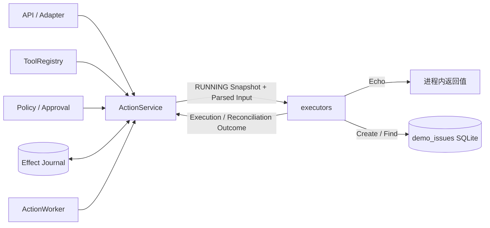
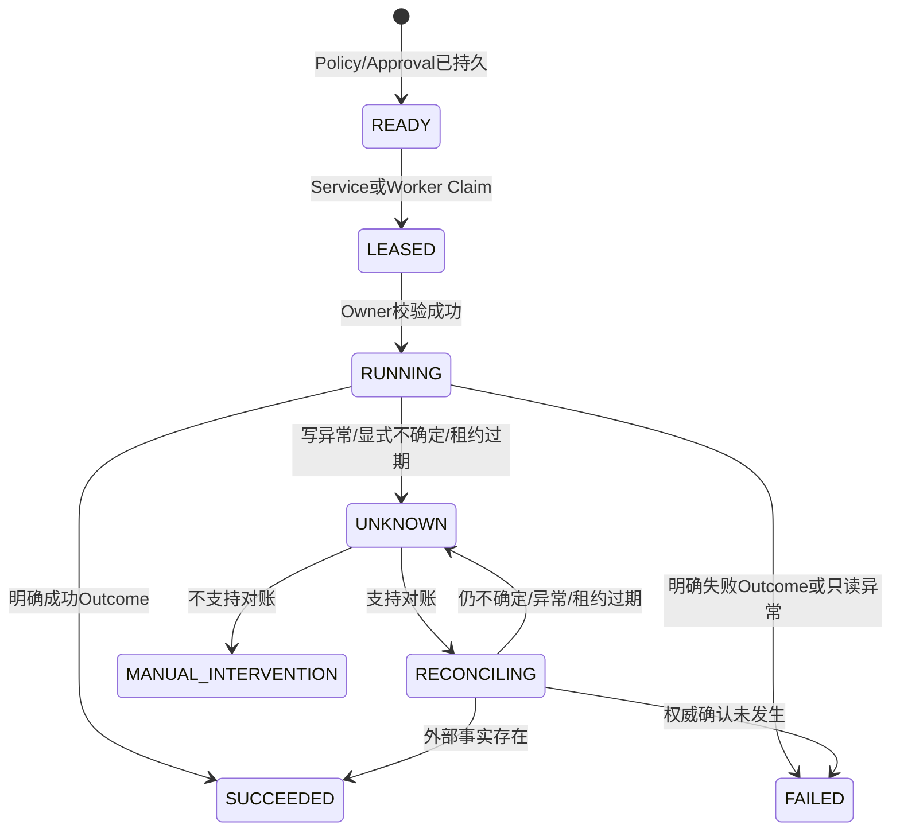
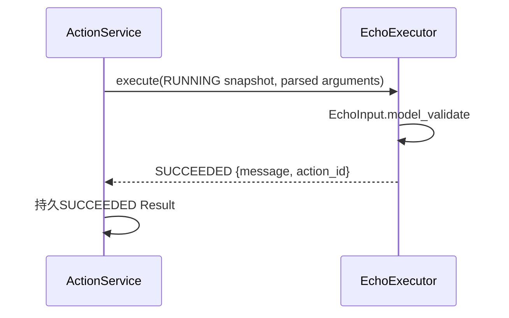
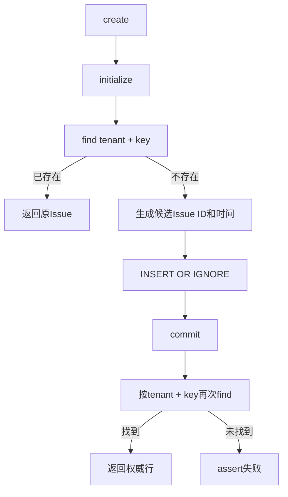
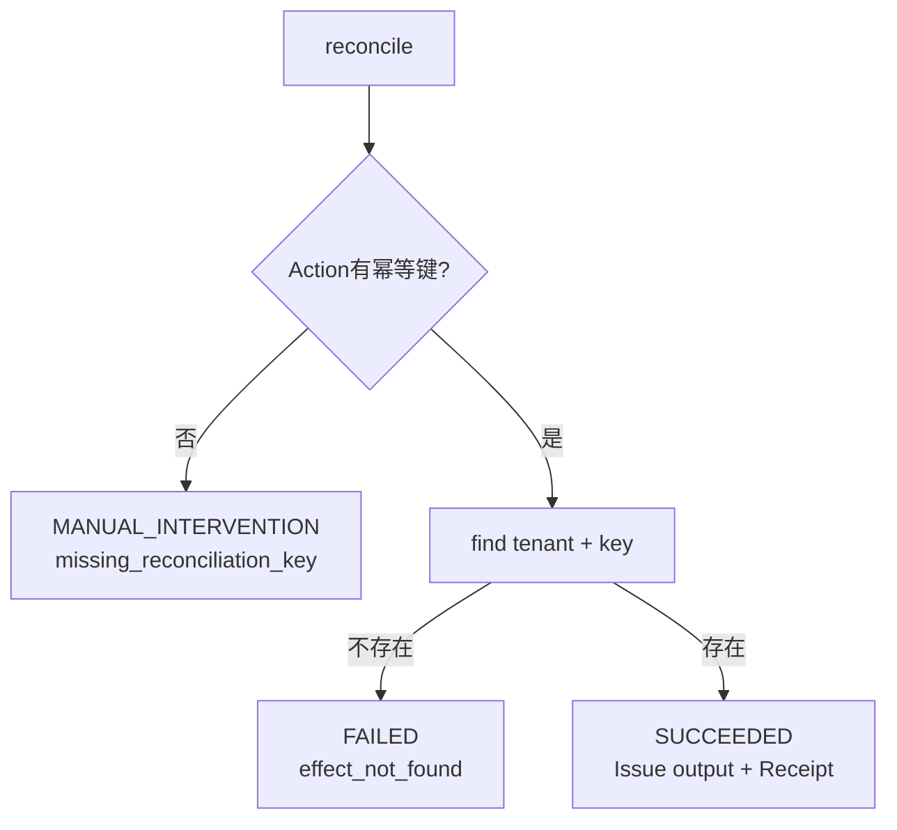
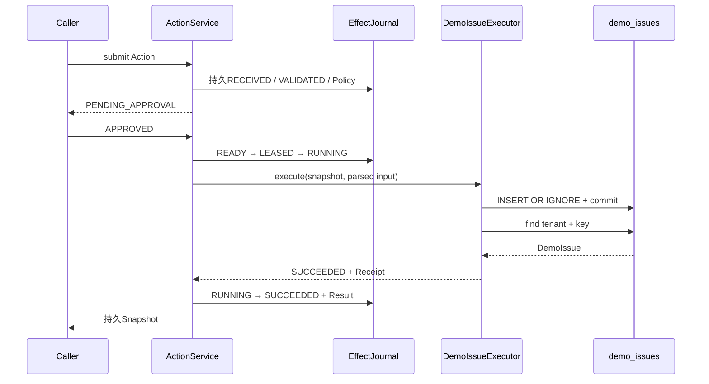
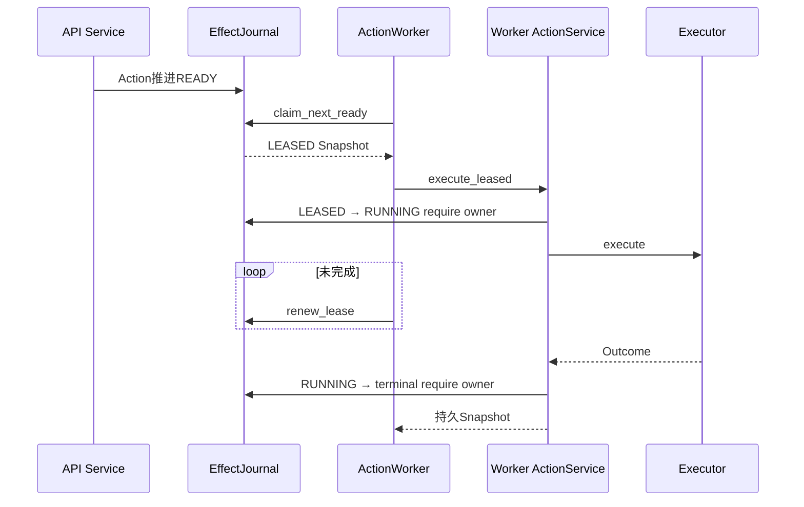
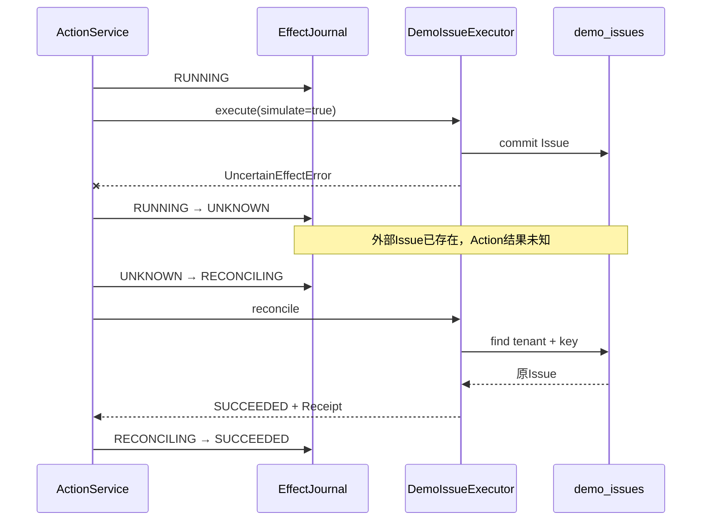
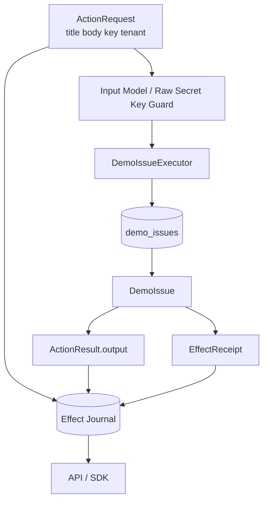
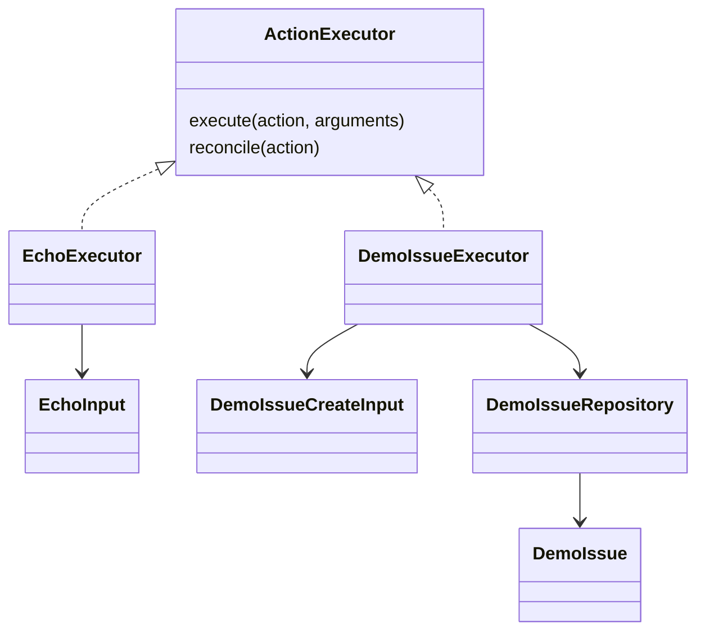

# Harnessix Code Executors模块设计

## 1. 模块摘要

| 项目 | 内容 |
|---|---|
| 源码包 | [`src/harnessix/executors/`](../../src/harnessix/executors/) |
| 当前职责 | 提供通用Action Plane默认装配所需的只读Echo Executor与可幂等、可对账的本地Issue效果样例 |
| 公共实现 | `EchoExecutor`、`DemoIssueExecutor`、`DemoIssueRepository`及两个输入模型 |
| 调用端口 | [`ActionExecutor`](../../src/harnessix/domain/ports.py)的`execute`与`reconcile` |
| 状态所有者 | Action状态由Effect Journal持有；Issue效果事实由独立`demo_issues` SQLite表持有 |
| 默认装配 | [`build_registry`](../../src/harnessix/bootstrap.py)注册`system.echo`和`demo.issue.create` |
| 非职责 | 不负责Policy、Approval、Lease、Action状态转换、Worker调度、Sandbox、Secret解析或通用连接器发现 |
| 当前定位 | Action Plane合同验证实现，不是面向生产SaaS、代码执行或文件修改的完整Executor平台 |
| 代码版本 | `4dc613f12e0deb5ce5ab53937fca226afab21516` |

本包共3个Python文件、256行。`system.echo`证明无副作用执行路径；`demo.issue.create`用独立
SQLite文件模拟外部系统，证明“效果提交与Action结果提交不原子”时的幂等和对账语义。生产Coding Tool主要通过
`processes`、`patches`、`delivery`及`trusted_actions`提供，不应误认为都由本包实现。

## 2. 需求背景

Action Plane若只有抽象端口而没有可运行实现，无法验证以下生产问题：

1. Policy允许后，Executor是否只在Action进入`RUNNING`并持有Lease时调用；
2. 输入是否按注册Schema重新解析，而不是把任意字典直接交给效果实现；
3. 外部写效果已提交、Journal结果尚未提交时，系统是否进入`UNKNOWN`而非盲目重放；
4. 相同业务幂等键是否能返回同一外部资源；
5. 对账是否只查询外部事实，不重复调用原执行；
6. Inline与Queued Worker是否共享同一Executor合同；
7. Result、Receipt、Trace和错误是否经过稳定Domain对象返回。

因此首个版本保留一个纯内存只读样例和一个独立SQLite写样例。后者故意与Action Journal分库，用最小成本复现真实
HTTP/SaaS连接器中无法跨系统提交事务的核心问题。

## 3. 设计目标与非目标

### 3.1 当前目标

1. **端口可执行**：两个实现满足`ActionExecutor`结构化Protocol；
2. **受管调用**：正常路径只能由`ActionService`在Journal许可后调用；
3. **严格边界输入**：拒绝额外字段，并对文本长度设上限；
4. **租户级幂等**：Issue以`tenant_id + idempotency_key`为唯一业务身份；
5. **效果可核对**：写入后通过同一业务身份查回并生成Receipt；
6. **不确定显式化**：可在外部提交后模拟结果丢失，并由Service映射`UNKNOWN`；
7. **跨平台基础可用**：仅依赖Python、Path与SQLite，不使用POSIX专有系统调用；
8. **无状态Echo**：提供低成本、确定性健康链路和集成测试入口；
9. **依赖倒置**：Executor不导入具体Journal、Worker、API或Policy实现。

### 3.2 当前非目标

- 不提供任意Shell、文件修改、Git、网络或SaaS连接器；
- 不把`demo.issue.create`作为真实工单产品；
- 不提供Executor插件目录、动态加载、热升级或远端进程协议；
- 不认证Principal，也不执行RBAC/ABAC；
- 不解析`SecretRef`，不注入凭据；
- 不创建Sandbox、Workspace Lease或Network Policy；
- 不提供统一Deadline、Cancel Token、Retry或Circuit Breaker；
- 不保证跨Action Journal与外部系统的Exactly Once；
- 不提供分布式外部数据库、Schema Migration、备份、删除、TTL或加密；
- 不验证API/Worker间Executor版本一致；
- 不等同Trusted Action的`TrustedActionExecutor`端口。

## 4. 系统上下文与边界

`executors`位于Action Service和模拟外部系统之间：



边界规则：

- Registry持有`ToolDefinition.executor`引用和受信Descriptor；
- Service负责校验、Policy、Approval、Lease及状态转换；
- Executor只返回Outcome，不能直接修改Action状态；
- Demo Repository只拥有模拟Issue事实，不读取Action Journal；
- Journal只拥有Action事实，不参加`demo_issues`事务；
- Worker只提供执行所有权和Heartbeat，不改变Executor业务语义；
- 外部调用方不能凭`effect_hint`直接选择或调用Executor。

## 5. 包结构与推荐阅读顺序

| 顺序 | 文件 | 行数 | 关键符号 | 阅读目的 |
|---:|---|---:|---|---|
| 1 | [`__init__.py`](../../src/harnessix/executors/__init__.py) | 16 | `__all__` | 确认公共导出仅有五个符号 |
| 2 | [`echo.py`](../../src/harnessix/executors/echo.py) | 33 | `EchoInput`、`EchoExecutor` | 理解最小只读执行与不支持对账 |
| 3 | [`demo_issue.py`](../../src/harnessix/executors/demo_issue.py) | 207 | `DemoIssueCreateInput`、`DemoIssue`、`DemoIssueRepository`、`DemoIssueExecutor` | 理解外部效果、幂等、Receipt和对账 |
| 4 | [`domain/ports.py`](../../src/harnessix/domain/ports.py) | — | `ActionExecutor` | 理解调用端口 |
| 5 | [`runtime.py`](../../src/harnessix/runtime.py) | — | `_execute_leased`、`reconcile` | 理解Outcome如何成为持久Action事实 |
| 6 | [`bootstrap.py`](../../src/harnessix/bootstrap.py) | — | `build_registry` | 理解默认Tool和风险声明 |

`__init__.py`不导出`DemoIssue`。仓储可由宿主直接构造，但正常产品装配只通过`build_registry`持有实例。

## 6. 公共面与默认装配

### 6.1 包导出

| 导出 | 类型 | 用途 |
|---|---|---|
| `EchoInput` | Pydantic Model | `system.echo`输入合同 |
| `EchoExecutor` | ActionExecutor实现 | 返回消息和Action ID |
| `DemoIssueCreateInput` | Pydantic Model | `demo.issue.create`输入合同 |
| `DemoIssueRepository` | Repository | 模拟外部Issue系统 |
| `DemoIssueExecutor` | ActionExecutor实现 | 创建和对账Issue |

### 6.2 Tool绑定

`build_registry`固定注册：

| Tool | 版本 | Effect | Risk | 幂等键 | 审批 | 对账 | Executor |
|---|---|---|---|---:|---:|---:|---|
| `system.echo` | `1.0.0` | `READ_ONLY` | `LOW` | 否 | 否 | 否 | `EchoExecutor` |
| `demo.issue.create` | `1.0.0` | `IDEMPOTENT_WRITE` | `MEDIUM` | 是 | 是 | 是 | `DemoIssueExecutor` |

`demo.issue.create`的Repository路径来自`Settings.demo_database_path`，默认是相对于当前工作目录的
`.harnessix/demo-external.db`。API和Worker各自调用`build_service`时会各建一个Repository实例。

## 7. `ActionExecutor`端口合同

端口签名由Domain定义：

| 方法 | 输入 | 输出 | 当前调用者 | 允许副作用 |
|---|---|---|---|---|
| `execute(action, arguments)` | 持久`ActionSnapshot`、已解析`BaseModel` | `ExecutionOutcome` | `ActionService._execute_leased` | 按Tool Descriptor执行既定效果 |
| `reconcile(action)` | `UNKNOWN`经Service转为`RECONCILING`后的Snapshot | `ReconciliationOutcome` | `ActionService.reconcile` | 只查询权威事实，不创建新效果 |

端口本身是`Protocol`，没有运行时`isinstance`门禁、基类构造、生命周期、Deadline或Cancel Token。任何对象只要方法
形状相同即可注册。`ToolRegistry.register`会构造Descriptor并拒绝同名注册，但不会探测方法可调用性或执行健康度。

### 7.1 Service提供的正常前置条件

调用`execute`前，Service正常保证：

1. Action已创建并通过输入、Effect、幂等键和疑似Secret键校验；
2. Policy已持久，必要审批已持久；
3. Action已从`READY → LEASED → RUNNING`；
4. 状态转换校验了当前`worker_id`拥有Lease；
5. 参数已按当前Registry Input Model再次通过JSON语义解析。

调用`reconcile`前，Service正常保证：

1. Action当前为`UNKNOWN`；
2. 当前Registry Tool声明`supports_reconciliation=True`；
3. Action已转`RECONCILING`并绑定恢复Lease；
4. 原`execute`不会被再次调用。

直接调用Executor方法不具备上述保证。内置Executor不会自行读取Journal确认状态或Lease。

### 7.2 后置条件

Executor只返回Outcome或抛异常。Service负责：

- 将Outcome kind映射为Action状态；
- 把output、error和receipt组合为`ActionResult`；
- 在单次Journal转换中持久Result和`execution_completed`或`reconciliation_completed`事件；
- 清除Lease并校验Owner；
- 记录Span、Metric和结构化日志。

Outcome对象本身不是持久提交证明；调用方只有读取到Journal中的终态或`UNKNOWN`事实后才能对外确认。

## 8. 执行授权与受信边界



内置Executor只参与`RUNNING`和`RECONCILING`阶段。它不能：

- 把未批准Action推进到`RUNNING`；
- 延长或释放Lease；
- 自行标记终态；
- 根据异常自动重新执行写效果；
- 把对账查询改造成补偿写入。

## 9. 输入合同

### 9.1 `EchoInput`

| 字段 | 类型 | 约束 | 使用 |
|---|---|---|---|
| `message` | string | 长度1～4000；额外字段拒绝；模型冻结 | 原样写入output |

### 9.2 `DemoIssueCreateInput`

| 字段 | 类型 | 默认 | 约束/语义 |
|---|---|---|---|
| `title` | string | 必填 | 长度1～200 |
| `body` | string | 空串 | 最大20,000字符 |
| `simulate_uncertain_after_commit` | boolean | false | 提交Issue后显式抛出`UncertainEffectError`，仅用于合同测试 |

两个输入类使用`ConfigDict(extra="forbid", frozen=True)`，但没有`strict=True`或
`allow_inf_nan=False`。字段都是标量，冻结足以防止内部容器突变；类型强制语义仍由Pydantic默认行为决定。

### 9.3 三次解析边界

正常执行中输入最多经历三次模型校验：

1. Submit校验时`_parse_tool_arguments`按JSON传输语义解析；
2. Worker/Inline进入`RUNNING`后，`_execute_leased`再次按当前Registry模型解析持久arguments；
3. 内置Executor用自己的具体Input Model再次校验传入`BaseModel`。

第二次解析防止排队期间或持久读取后的类型漂移；第三次保证Executor不依赖调用者传入的任意BaseModel。当前没有测试
明确锁定“三次解析”次数，兼容性不应依赖具体次数，只应依赖调用Executor前参数满足注册Schema。

## 10. Echo Executor设计

`EchoExecutor`没有字段、外部I/O或生命周期：



### 10.1 执行结果

`execute`返回：

| 字段 | 值 |
|---|---|
| kind | `SUCCEEDED` |
| output.message | 输入`message` |
| output.action_id | `str(action.request.action_id)` |
| error | null |
| receipt | null |

`action_id`使测试和调用方能核对返回值属于哪个持久Action。Read-only成功不要求Receipt。

### 10.2 对账结果

`reconcile`始终返回`MANUAL_INTERVENTION`，错误码`reconciliation_not_supported`。但默认Tool Descriptor声明
`supports_reconciliation=False`，所以`ActionService.reconcile`不会调用该方法，而会直接把`UNKNOWN`转为
`MANUAL_INTERVENTION`并使用Service统一错误。该方法只为满足端口形状和直接调用提供保守结果。

## 11. Demo Issue领域数据

### 11.1 `DemoIssue`

| 字段 | 类型 | 来源 | 语义 |
|---|---|---|---|
| `issue_id` | string | `ISSUE-`加UUID十个十六进制字符 | 模拟外部资源ID |
| `tenant_id` | string | Action Principal | 租户分区键 |
| `idempotency_key` | string | Action Request | 租户内业务唯一键 |
| `title` | string | Parsed Input | Issue标题 |
| `body` | string | Parsed Input | Issue正文 |
| `created_at` | datetime | `utc_now()` | 初次创建时间 |

`DemoIssue`本身只有`extra="forbid", frozen=True`，没有重复声明长度、非空、timezone或ID格式Validator。正常写入约束
来自`DemoIssueCreateInput`与Action Request；直接调用Repository可以绕过标题和正文上限。

`issue_id`只取UUID的40 bit十六进制前缀。主键冲突概率低但不为零，当前没有碰撞重试。

## 12. Repository与数据库Schema

### 12.1 生命周期

`DemoIssueRepository`持有：

| 字段 | 类型 | 作用 |
|---|---|---|
| `database_path` | `Path` | 模拟外部库位置 |
| `_initialized` | bool | 当前实例内的建表快路径 |
| `_initialize_lock` | `asyncio.Lock` | 防止同一实例并发重复初始化 |

Repository无`close`方法。每次`find`或写入都创建并关闭独立`aiosqlite.Connection`；长期持有的只有路径、
bool和Lock。

### 12.2 初始化

首次调用会：

1. 创建数据库父目录；
2. 打开SQLite连接；
3. 设置`row_factory=aiosqlite.Row`；
4. 执行`PRAGMA busy_timeout = 5000`；
5. 执行`CREATE TABLE IF NOT EXISTS`；
6. commit后将当前实例`_initialized=True`。

多个Repository实例没有共享内存Lock，但SQLite的幂等建表支持并发初始化。当前没有`user_version`、迁移表、WAL、
foreign_keys、synchronous或加密配置。

### 12.3 表结构

```sql
CREATE TABLE IF NOT EXISTS demo_issues (
    issue_id TEXT PRIMARY KEY,
    tenant_id TEXT NOT NULL,
    idempotency_key TEXT NOT NULL,
    title TEXT NOT NULL,
    body TEXT NOT NULL,
    created_at TEXT NOT NULL,
    UNIQUE (tenant_id, idempotency_key)
)
```

所有字段以TEXT存储；`created_at`写ISO 8601，读取时用`datetime.fromisoformat`。数据库损坏或非法时间文本会抛异常，
不会被Repository转换为“未找到”。

## 13. 创建与幂等算法



关键语义：

- 首次`find`是快路径，不是并发唯一性证明；
- `UNIQUE (tenant_id, idempotency_key)`才是数据库竞争裁决；
- 两个并发调用使用相同租户和键时，只会保留一行，二者最终读取同一Issue；
- 相同键但不同title/body直接调用Repository时，会静默返回首个载荷；
- 正常Action Service在进入Executor前，通过Action Journal的请求指纹拒绝相同键不同载荷；
- 不同tenant可以复用同一idempotency key；
- `INSERT OR IGNORE`也会忽略`issue_id`主键冲突；若该冲突与业务键无关，最终`find`为空并触发assert；
- Python以优化模式移除assert时，该异常保护不存在，因此该断言不是生产级数据完整性错误合同。

本地运行探针已确认：同租户同键并发返回同一ID；随后以不同载荷复用该键仍返回首个值；另一租户得到不同ID。
该探针用于源码求证，不替代正式测试。

## 14. Demo Issue执行流程

`DemoIssueExecutor.execute`：

1. 将`arguments`再次解析为`DemoIssueCreateInput`；
2. 读取`action.request.idempotency_key`；
3. 缺失时返回`FAILED/idempotency_key_required`，不访问Repository；
4. 以Principal tenant、幂等键、title和body调用`repository.create`；
5. 若模拟标志为true，在Repository已commit且查回Issue后抛`UncertainEffectError`；
6. 否则返回`SUCCEEDED`，output为Issue JSON，receipt由`_receipt`生成。

正常Bootstrap声明`requires_idempotency=True`，所以第3步在受管Service链不可达；该分支防御直接调用和错误装配。

### 14.1 Receipt

| 字段 | 值 |
|---|---|
| provider | `demo-issue-system` |
| resource_type | `issue` |
| resource_id | 外部`issue_id` |
| idempotency_key | Action业务幂等键 |
| response_digest | null |
| observed_at | 创建Receipt时的UTC时间 |

Receipt不包含title/body，但Action output会包含完整Issue正文。`observed_at`不是Issue的`created_at`，也不是数据库commit
时间，只表示当前进程构造Receipt的时间。

## 15. 对账流程

`DemoIssueExecutor.reconcile`只按持久业务身份查询：



语义要求：

- `FAILED/effect_not_found`表示模拟外部权威库确认该业务键不存在；
- `SUCCEEDED`返回首次创建的Issue，不再次调用`create`；
- 缺键无法形成稳定查询身份，因此人工介入；
- SQLite异常向上抛出，由Service映射回`UNKNOWN/reconciliation_error`；
- 新Repository或进程重启后，`find`遇到数据库文件不存在会初始化空库并返回不存在；若文件实际丢失，这可能把“外部证据丢失”误判为“效果未发生”。已初始化实例运行中丢失文件还可能因新文件无表而抛错。

最后一项是Demo实现的生产限制。真实连接器必须区分“权威不存在”和“数据源不可用/历史丢失”。

## 16. Inline完整时序



`demo_issues` commit早于Effect Journal的SUCCEEDED提交。两者之间不存在两阶段提交、Outbox或分布式事务。

## 17. Queued Worker时序



Queued模式下API进程不调用Executor。Worker进程通过自己的`build_service`重建Registry和Executor，因此部署必须保证：

- API和Worker使用兼容代码与Tool版本；
- `demo_database_path`指向同一权威模拟外部库；
- 每个Worker能访问该路径并具有一致权限；
- Action Journal和外部库的备份/恢复点能够解释不一致窗口。

当前没有通用Registry版本握手或Executor健康探测。

## 18. 不确定效果与恢复



恢复只调用`reconcile`，不会再次调用`execute`。若进程在外部commit后、显式异常抛出前硬退出，Journal仍停在
`RUNNING`；Lease过期恢复把它转`UNKNOWN`，之后使用相同对账流程。

## 19. Outcome与异常映射

### 19.1 Executor显式返回

| Executor返回 | Service持久状态 | 要求 |
|---|---|---|
| `ExecutionOutcome.SUCCEEDED` | `SUCCEEDED` | 写Executor应提供Receipt，但Domain当前未强制 |
| `ExecutionOutcome.FAILED` | `FAILED` | 写Executor必须确认效果未发生；Runtime无法独立证明 |
| `ExecutionOutcome.UNKNOWN` | `UNKNOWN` | 禁止直接重放 |
| `ReconciliationOutcome.SUCCEEDED` | `SUCCEEDED` | 应提供权威output与Receipt |
| `ReconciliationOutcome.FAILED` | `FAILED` | 表示权威确认原效果未发生 |
| `ReconciliationOutcome.UNKNOWN` | `UNKNOWN` | 后续可再次只读查询 |
| `ReconciliationOutcome.MANUAL_INTERVENTION` | `MANUAL_INTERVENTION` | 需要人工处置 |

`ExecutionOutcome`和`ReconciliationOutcome`没有跨字段Validator。调用实现可以构造“SUCCEEDED但有error”或
“写成功但无receipt”的对象，Service会按kind映射。内置工厂方法保持合理组合，但端口安全仍依赖实现者纪律。

Runtime也不对Executor返回值再次执行`model_validate`。若第三方实现返回`None`、普通dict或非法kind，后续访问
`outcome.kind`产生的异常可能发生在当前`try/except`之外，使Action保留在`RUNNING`或`RECONCILING`，直到Lease恢复。

### 19.2 抛出异常

| 场景 | Runtime映射 | retriable | 当前内置触发 |
|---|---|---:|---|
| `UncertainEffectError` | `UNKNOWN/uncertain_external_effect` | false | Demo模拟commit后响应丢失 |
| 只读Executor普通`Exception` | `FAILED/executor_error` | true | Echo正常不抛；无直接故障测试 |
| 写Executor普通`Exception` | `UNKNOWN/unexpected_write_error` | false | SQLite/解析等意外异常 |
| Reconcile普通`Exception` | `UNKNOWN/reconciliation_error` | false | SQLite查询异常 |
| `asyncio.CancelledError`或其他`BaseException` | 不在上述catch中 | — | Action保持RUNNING/RECONCILING，等待Lease恢复 |

异常消息当前直接使用`str(error)`进入`ActionFailure.message`，可能泄露外部响应或敏感值。

## 20. 数据流、持久化与事务边界



### 20.1 两个事实源

| 事实 | 权威存储 | 事务 |
|---|---|---|
| Action请求、Policy、Approval、Lease、Result、Event | SQLite或PostgreSQL Effect Journal | Journal实现自己的原子转换 |
| Issue是否存在、正文和创建时间 | `demo_issues` SQLite | Repository单连接commit |
| “哪个Action创建哪个Issue” | 幂等键、tenant与Receipt关联 | 无跨库原子约束 |

故障后应先读取Action状态，再用tenant和幂等键查询外部库。不能只凭某一数据库的时间或进程返回值推断另一方已提交。

### 20.2 持久内容

Action Journal与Demo DB都可能保存title/body；API成功结果也返回完整Issue。当前没有自动脱敏、字段级加密、保留期限、
删除级联或审计访问日志。`metadata`原始Secret键守卫不检查普通正文中的敏感字符串。

## 21. 并发、幂等与版本一致性

### 21.1 当前并发控制

- Echo无共享状态，可并发执行；
- Demo Repository同一实例仅用Lock保护初始化，不串行化业务写；
- SQLite唯一约束裁决同租户同键竞争；
- 每次操作独立连接，`busy_timeout`最多等待5秒；
- 未显式启用WAL，多写者吞吐和长事务行为未建立基线；
- Action Journal通过Lease/Owner防止同一Action被两个Worker合法推进；
- 业务幂等键防止不同Action对同一外部身份重复创建。

### 21.2 Action级载荷冲突

Action指纹包含tenant、Tool、arguments、effect hint和Secret refs。正常Service对相同租户、Tool、幂等键但不同载荷
抛`IdempotencyConflictError`，从而弥补Repository“返回首个载荷”的弱语义。

Repository作为公开导出仍可被直接调用；它自身不比较title/body。调用方不能把Repository唯一约束单独解释为完整请求
幂等合同。

### 21.3 Registry与Executor漂移

Action创建时会把`ToolDescriptor`存进Snapshot，但执行和对账时`ActionService`按
`snapshot.request.tool`从**当前进程Registry**重新取得`ToolDefinition`和Executor。当前通用链没有核对：

- 持久Tool版本与当前版本；
- 持久Input Schema与当前Schema；
- 持久Effect/Risk与当前定义；
- Executor实现或配置摘要；
- Demo Database路径。

两个内置Executor也不执行上述比对。若API和Worker版本不同，旧Action可能由新Executor执行；异常分类还使用当前
ToolDefinition的Effect。`ProcessActionExecutor`在其所属包中有额外绑定检查，但这不是本包通用能力。

## 22. 取消、超时与重试

| 机制 | 当前语义 | 对内置Executor的影响 |
|---|---|---|
| 用户取消 | Action Plane没有公共取消状态/API | 不能把调用Task取消记为用户取消 |
| Task取消 | `CancelledError`越过Service普通异常分支 | RUNNING或RECONCILING保留到Lease恢复 |
| 执行Deadline | `ActionExecutor`端口无统一参数 | Echo立即返回；Demo只有SQLite busy timeout |
| SQLite锁等待 | 每连接`busy_timeout=5000` | 超时异常在写执行中保守映射UNKNOWN |
| Worker Heartbeat | 执行Task未完成时周期续租 | 真正失租会取消Task并拒绝无Owner提交 |
| 自动执行重试 | 不存在 | 写效果不会因异常直接重放 |
| Reconcile重试 | UNKNOWN可再次进入RECONCILING | 只重复`find`查询 |
| HTTP/SaaS重试 | 本包无网络 | 未来连接器必须区分发送前失败与结果不确定 |

Inline模式不运行Worker Heartbeat。若未来把慢Executor接入Inline，Lease可能在调用期间过期；当前内置SQLite调用通常短，
但没有正式最大时延保证。

## 23. 失败语义矩阵

| 故障点 | 外部效果可能性 | Action可见事实 | 恢复 |
|---|---|---|---|
| 输入模型失败 | 未发生 | Submit阶段`FAILED/invalid_arguments` | 修正后新请求 |
| 缺幂等键 | 未发生 | Service在Executor前`FAILED/idempotency_key_required` | 新请求携带键 |
| Repository初始化失败 | 写入未开始或未知 | 写Executor普通异常→`UNKNOWN` | 排障后Reconcile |
| 首次find失败 | 未写入，但Runtime不知道细节 | `UNKNOWN` | Reconcile；不重执行 |
| INSERT前异常 | 通常未写入，但无证明 | `UNKNOWN` | Reconcile |
| commit结果丢失 | 可能已写 | `UNKNOWN` | Reconcile |
| commit后Service/Journaling退出 | 已写或可能已写，Action仍RUNNING | Lease过期→`UNKNOWN` | Reconcile |
| 最终find为空 | insert被忽略或数据异常 | assert/返回异常→`UNKNOWN` | 检查DB，Reconcile |
| Action终态提交Owner冲突 | 外部可能已写 | Journal保留RUNNING/UNKNOWN事实 | 失租解析与Reconcile |
| Reconcile查到Issue | 已写 | `SUCCEEDED` | 不重执行 |
| Reconcile权威查无 | 确认未写（仅在库完整前提下） | `FAILED/effect_not_found` | 不自动重执行 |
| Reconcile查询异常 | 未知 | `UNKNOWN/reconciliation_error` | 可再次查询 |
| 外部库文件丢失后新实例自动重建 | 历史证据丢失 | 当前可能错误返回effect_not_found | 生产实现必须拒绝空库冒充权威否定 |
| Echo异常 | 无写效果 | `FAILED/executor_error` | 当前无自动重试 |
| Claim后当前Registry缺少Tool | 未调用Executor | Action停在`LEASED`，调用异常向Worker上抛 | Lease过期回`READY`；配置未修复时会重复失败 |
| Executor返回非法对象或kind | 效果可能已发生 | Outcome解析异常可能越过当前catch，Action保留`RUNNING` | Lease过期转`UNKNOWN`后对账 |

Runtime对写异常一律保守UNKNOWN，即使异常发生在明显写入前。这会增加人工/对账成本，但避免错误重放。

## 24. 安全与隐私

### 24.1 当前控制

- 输入模型拒绝未声明字段并限制title/body/message长度；
- SQL全部参数化，不拼接用户输入；
- tenant和幂等键共同形成唯一约束；
- Policy与Approval在执行前持久；
- 写异常保守UNKNOWN；
- Receipt不包含Issue正文；
- Executor不记录arguments或output日志；
- 默认实现不访问网络、Shell、Workspace或Secret Provider。

### 24.2 当前风险

| 风险 | 事实 |
|---|---|
| 身份未认证 | Executor信任Action中`principal.tenant_id`；Action Plane公网身份边界尚未实现 |
| 明文内容 | title/body同时进入Action Journal、Demo DB和成功output |
| Secret误放正文 | 原始Secret守卫按键名工作，不能识别message/body中的凭据文本 |
| 相对路径 | Demo DB默认依赖进程cwd，错误启动目录可能创建另一份空库 |
| 路径安全 | Repository会创建父目录，未执行Workspace Scope、符号链接或权限加固 |
| 模拟开关暴露 | `simulate_uncertain_after_commit`属于公共Schema，任何调用方可制造UNKNOWN |
| 错误泄漏 | Executor/Reconcile异常`str(error)`可进入持久层和API |
| 资源枚举 | 40 bit Issue随机后缀不是授权机制；API本身也未提供租户认证 |
| 无配额 | 没有每租户Issue数、数据库大小或写速率上限 |
| 版本漂移 | 当前Registry配置可与持久Descriptor不同 |
| 外部库损失 | 自动创建空库可能破坏否定性对账证明 |

本包只能用于本地或受信测试部署，不构成大规模C端产品的数据保护和租户隔离边界。

## 25. 可观测性与审计

Executor包本身不依赖`observability`，不创建Span、Metric或Log。Service和Worker外围提供：

| 信号 | 名称/位置 | 属性 |
|---|---|---|
| Execute Span | `harnessix.action.execute` | tool、effect_class、终态 |
| Execute Counter | `harnessix.executions.completed` | tool、status |
| Execute Duration | `harnessix.executor.duration` | tool、status |
| Reconcile Span | `harnessix.action.reconcile` | tool |
| Reconcile Counter | `harnessix.reconciliation` | tool、outcome |
| Reconcile Duration | `harnessix.reconciliation.duration` | tool、outcome |
| Action Event | `execution_completed`、`reconciliation_completed` | 低基数outcome |
| Structured Log | Action/Worker外层 | action、tenant、tool、worker、trace字段 |

当前缺失：

- Repository initialize/find/create时延和错误分类；
- SQLite busy/size/connection指标；
- 外部效果commit与Receipt构造的独立Trace；
- 幂等命中/冲突和Issue数量Metric；
- API/Worker Executor版本摘要；
- 公开与私有错误双轨；
- Demo DB健康检查和数据损失告警。

Metric不得使用title、body、幂等键、issue ID、Action ID或租户ID作为高基数标签。

## 26. 部署与运维约束

### 26.1 Inline

单进程默认同时访问Action Journal和Demo DB。两个文件应位于持久目录，进程用户必须有父目录创建、读写和原子文件操作所需
权限。`ActionService.ready`只ping Action Journal，不验证Demo DB可用。

### 26.2 Queued单机

API和Worker可以是不同进程，但必须配置相同`HARNESSIX_DEMO_DATABASE_PATH`。SQLite锁提供有限本机并发，不代表已验证
高吞吐。备份应同时保留Action Journal与Demo DB，并记录一致性时间；无法原子备份时，恢复后应通过对账处理窗口。

### 26.3 PostgreSQL与多主机

PostgreSQL只替换Action Journal。Demo Issue效果仍是本地SQLite：

- 不同主机的相同相对路径通常指向不同文件；
- 多Worker可能各自产生不一致的“外部系统”；
- 网络文件系统上的SQLite语义未验证；
- PostgreSQL多Worker测试只证明Journal Claim，不证明Demo Executor分布式安全。

因此`demo.issue.create`不得作为多主机生产Executor。真实连接器应使用共享权威服务或数据库，并提供独立健康、身份、
限流和对账协议。

### 26.4 平台

代码未使用POSIX专有接口，Python和SQLite层面可运行于macOS、Linux和Windows。当前CI的Windows主路径覆盖通用导入与
可信执行测试，但没有专门在Windows上验证Demo DB锁竞争、路径权限、备份和故障注入，因此不能把跨平台源码兼容表述为
三平台生产验收完成。

## 27. 与其他Executor家族的关系

| 实现/端口 | 所在包 | 输入 | 状态事实 | 当前用途 |
|---|---|---|---|---|
| `EchoExecutor` / `DemoIssueExecutor` | `executors` | ActionSnapshot + BaseModel | Effect Journal | 通用Action Plane合同样例 |
| `ProcessActionExecutor` | `processes` | ActionSnapshot + ProcessActionInput | Effect Journal + Process Result | 受信宿主进程Action桥接 |
| `GitPushActionExecutor` | `delivery` | ActionSnapshot + Git Push输入 | Effect Journal + Delivery Ledger | 兼容Action Plane Git Push |
| `TrustedActionExecutor` | `trusted_actions` | ActionRoutePlan + BaseModel | Execution Plan/Route Store | 统一资源感知高风险Action |
| Patch/Batch Bridge | `patches` | Agent/Patch计划 | Session/Patch Store | 受管文件修改 |

`TrustedActionExecutor`返回`ActionExecutionOutcome`，其Plan绑定资源、Sandbox、Secret和Executor身份；它与Domain
`ActionExecutor`不是同一个Protocol。新增生产Coding能力应优先进入统一Trusted Action路由，本包保留最小兼容与合同
验证，不应演化成第二套绕过Execution Plan的插件系统。

## 28. 重点类与接口设计

### 28.1 类关系



Protocol是结构化类型关系，图中的实现箭头不表示源码显式继承。

### 28.2 重点方法

| 符号 | 输入/输出 | 副作用 | 不变量 | 错误/取消 |
|---|---|---|---|---|
| `EchoExecutor.execute` | Snapshot + BaseModel → ExecutionOutcome | 无 | 始终成功返回同一消息和Action ID | 校验异常交给Service分类 |
| `EchoExecutor.reconcile` | Snapshot → ReconciliationOutcome | 无 | 始终人工介入 | 无await取消点 |
| `DemoIssueRepository.initialize` | 无 → None | 建目录、建表 | 同实例只在成功commit后标记初始化 | SQLite/文件错误向上抛 |
| `_connection` | Async context | 打开/关闭连接，设5秒busy timeout | finally关闭 | 连接错误向上抛 |
| `create` | tenant/key/title/body → DemoIssue | INSERT/commit | 正常Action链同键载荷固定 | 冲突由OR IGNORE；最终空值assert |
| `find` | tenant/key → Issue或None | 只读查询；首次可建库 | 精确双字段查询 | 非法行/数据库错误向上抛 |
| `DemoIssueExecutor.execute` | Snapshot + BaseModel → Outcome | 可创建Issue | 缺键不写；成功带Receipt | 模拟不确定显式抛错 |
| `reconcile` | Snapshot → Outcome | 只读外部库 | 不调用create | 缺键人工、无行失败、异常向上抛 |
| `_receipt` | DemoIssue → EffectReceipt | 读取当前时间 | provider/type固定 | 无I/O |

### 28.3 关键字段所有权

| 字段 | 所有者 | 读取者 | 持久化 | 敏感性/约束 |
|---|---|---|---|---|
| `message` | 调用方 | Echo | Action Journal/output | 最长4000，可能含敏感正文 |
| `title/body` | 调用方 | Demo Executor/Repository | 双库与output | 明文业务内容 |
| `simulate_uncertain_after_commit` | 测试调用方 | Demo Executor | Action Journal | 测试开关，不应进入生产Tool |
| `tenant_id` | Principal | Repository | 双库关联 | 当前未认证 |
| `idempotency_key` | Action Request | Journal/Repository/Receipt | 双库 | 业务身份，最长256 |
| `issue_id` | Repository | output/Receipt | 双库 | 40 bit随机后缀 |
| `created_at` | Repository | output | Demo DB/Action result | UTC ISO文本 |
| `_initialized` | Repository实例 | initialize | 不持久 | 仅进程内快路径 |
| `_initialize_lock` | Repository实例 | initialize | 不持久 | 不跨进程/实例 |
| `database_path` | Settings | Repository | 配置 | 受信宿主路径 |

## 29. 核心业务逻辑伪代码

### 29.1 Service执行

```text
claim READY action under worker identity
resolve current ToolDefinition by request.tool
persist LEASED then RUNNING with owner check
parse persisted arguments with current input model

try:
    outcome = executor.execute(snapshot, parsed_arguments)
except UncertainEffectError:
    outcome = UNKNOWN
except ordinary error:
    outcome = FAILED when current tool is read-only
    outcome = UNKNOWN when current tool may write

persist result and execution_completed under same lease owner
never replay a write merely because execution raised
```

### 29.2 Demo创建

```text
initialize external database
if tenant + idempotency_key exists:
    return original issue

candidate = new issue
INSERT OR IGNORE candidate
commit
result = find tenant + idempotency_key
require result to exist
return result
```

### 29.3 不确定恢复

```text
when RUNNING lease expires:
    persist UNKNOWN; do not call execute

when operator requests reconciliation:
    persist RECONCILING with owner
    if current tool does not support reconciliation:
        persist MANUAL_INTERVENTION
    else:
        query external system by tenant + idempotency_key
        persist SUCCEEDED when exact resource exists
        persist FAILED only when authority proves it absent
        persist UNKNOWN when query evidence is unavailable
```

## 30. 源码与测试映射

| 设计元素 | 源码 | 关键符号 | 测试 | 测试符号 |
|---|---|---|---|---|
| 公共导出与Bootstrap | [`__init__.py`](../../src/harnessix/executors/__init__.py)、[`bootstrap.py`](../../src/harnessix/bootstrap.py) | `__all__`、`build_registry` | [`test_registry.py`](../../tests/unit/test_registry.py) | `test_runtime_owns_effect_classification` |
| Echo输入/成功 | [`echo.py`](../../src/harnessix/executors/echo.py) | `EchoInput`、`EchoExecutor.execute` | [`test_action_service.py`](../../tests/integration/test_action_service.py) | `test_echo_runs_without_approval_and_records_lifecycle` |
| Echo Worker执行 | [`echo.py`](../../src/harnessix/executors/echo.py) | `execute` | [`test_worker.py`](../../tests/integration/test_worker.py) | `test_queued_action_is_executed_by_worker` |
| Issue输入/审批 | [`demo_issue.py`](../../src/harnessix/executors/demo_issue.py) | `DemoIssueCreateInput`、`DemoIssueExecutor.execute` | [`test_action_service.py`](../../tests/integration/test_action_service.py) | `test_issue_requires_approval_and_is_idempotent` |
| Action载荷冲突 | [`runtime.py`](../../src/harnessix/runtime.py) | `action_fingerprint` | [`test_action_service.py`](../../tests/integration/test_action_service.py) | `test_idempotency_key_rejects_different_payload` |
| 拒绝不执行 | [`runtime.py`](../../src/harnessix/runtime.py) | `decide_approval` | [`test_action_service.py`](../../tests/integration/test_action_service.py) | `test_rejected_approval_never_executes_effect` |
| commit后不确定 | [`demo_issue.py`](../../src/harnessix/executors/demo_issue.py) | `simulate_uncertain_after_commit` | [`test_action_service.py`](../../tests/integration/test_action_service.py) | `test_uncertain_effect_is_reconciled_without_reexecution` |
| Issue自动对账 | [`demo_issue.py`](../../src/harnessix/executors/demo_issue.py) | `DemoIssueExecutor.reconcile`、`_receipt` | [`test_action_service.py`](../../tests/integration/test_action_service.py) | `test_uncertain_effect_is_reconciled_without_reexecution` |
| Queued审批后执行 | [`bootstrap.py`](../../src/harnessix/bootstrap.py) | `DemoIssueExecutor`绑定 | [`test_worker.py`](../../tests/integration/test_worker.py) | `test_approval_only_enqueues_action` |
| Lease Heartbeat | [`worker.py`](../../src/harnessix/worker.py) | `_execute_with_heartbeat` | [`test_worker.py`](../../tests/integration/test_worker.py) | `test_heartbeat_renews_lease_during_action` |
| 终态提交/续租竞态 | [`worker.py`](../../src/harnessix/worker.py) | `_execution_commit_exists`、`_resolve_failed_renewal` | [`test_worker.py`](../../tests/integration/test_worker.py) | `test_execution_commit_wins_renewal_race` |
| RUNNING Lease过期 | [`runtime.py`](../../src/harnessix/runtime.py) | `_execute_leased`、`reconcile` | [`test_action_service.py`](../../tests/integration/test_action_service.py) | `test_expired_running_lease_becomes_unknown` |
| API结果投影 | [`api/app.py`](../../src/harnessix/api/app.py) | `create_app` | [`test_api.py`](../../tests/integration/test_api.py) | `test_http_api_executes_echo` |
| Repository并发/Schema | [`demo_issue.py`](../../src/harnessix/executors/demo_issue.py) | `initialize`、`create`、`find` | — | 无直接测试，见第31节缺口 |
| effect-not-found/缺键对账 | [`demo_issue.py`](../../src/harnessix/executors/demo_issue.py) | `reconcile` | — | 无直接测试，见第31节缺口 |
| 版本漂移 | [`runtime.py`](../../src/harnessix/runtime.py) | `registry.get`、`_execute_leased` | — | 无直接测试，见第31节缺口 |

## 31. 测试设计与当前证据

### 31.1 当前覆盖

现有集成测试证明：

- Echo在Inline和Queued路径返回持久SUCCEEDED；
- Issue要求审批，拒绝时不创建效果；
- 相同Action业务请求返回同一结果；
- 相同幂等键不同Action载荷在Journal层冲突；
- commit后显式不确定进入UNKNOWN；
- Reconcile按同一键查回原Issue，不重新执行；
- 运行中Lease过期进入UNKNOWN；
- Worker Heartbeat、Claim唯一性和终态提交竞态；
- API可提交并读取内置Action；
- Registry中Effect、Risk、审批、幂等和对账声明正确。

### 31.2 直接测试缺口

仓库没有`tests/executors/`目录。以下实现分支没有独立测试：

1. `EchoInput`空值、超长和extra字段；
2. `EchoExecutor.reconcile`保守返回；
3. `DemoIssueCreateInput`标题/正文边界和类型强制；
4. `DemoIssueExecutor.execute`缺幂等键防御分支；
5. `DemoIssueRepository`建表Schema和非法历史行；
6. 相同租户同键并发创建；
7. Repository直接复用同键不同载荷返回首值；
8. 不同租户相同键隔离；
9. `issue_id`碰撞与`INSERT OR IGNORE`误吞；
10. Reconcile缺键、查无、数据库不可用和损坏；
11. Cancel发生在INSERT前、commit后、Result提交前和Reconcile期间；
12. API/Worker Tool版本、Schema、Effect或DB路径漂移；
13. 多进程SQLite锁竞争与5秒busy timeout；
14. Windows路径、权限和并发；
15. title/body/异常消息敏感信息泄漏；
16. 写Executor错误返回`FAILED`但效果已发生的防御；
17. 写成功无Receipt和Outcome跨字段非法组合；
18. Claim后Tool缺失、Executor返回非Outcome对象或非法kind的恢复行为。

### 31.3 后续测试优先级

| 优先级 | 测试 | 目的 |
|---|---|---|
| P0 | API/Worker持久Descriptor与当前Executor绑定漂移 | 防止旧Action由错误实现执行 |
| P0 | 写Outcome FAILED/SUCCEEDED证据要求 | 防止效果发生后伪装确定失败或无Receipt成功 |
| P0 | Reconcile数据源丢失/空库 | 防止把证据丢失误判为未执行 |
| P0 | 异常与正文Secret泄漏 | 满足0.9.4安全门禁 |
| P1 | Repository并发和载荷冲突矩阵 | 固化真实幂等边界 |
| P1 | commit前后取消/退出注入 | 证明UNKNOWN与不重放 |
| P1 | Schema、非法行和ID碰撞 | 关闭数据完整性弱点 |
| P2 | 三平台SQLite锁与性能 | 判断样例是否仅保留测试用途 |

## 32. 当前限制与演进方向

| 当前限制 | 影响 | 演进方向 |
|---|---|---|
| 仅两个样例Executor | 不构成Coding Agent工具生态 | 生产能力走统一Trusted Action路由 |
| Demo DB是本地SQLite | 多主机Worker外部事实不共享 | 替换为受管共享服务或仅限测试Profile |
| 无通用Executor Binding摘要 | API/Worker版本漂移可错误执行 | Plan绑定版本、Schema、配置和Executor ID |
| Outcome跨字段不变量弱 | Runtime依赖实现者诚实分类 | 加强Domain Validator及合同测试 |
| 写成功不强制Receipt | 审计证据可能不足 | 按Effect/Recovery Mode要求Receipt |
| 写FAILED不验证未发生 | 可能诱导上层新请求 | Executor合同要求否定性证据或UNKNOWN |
| 无Deadline/Cancel Token | 慢调用和用户取消语义不完整 | 重大变更中增加持久取消/时限合同 |
| 异常`str(error)`持久化 | 可能泄密 | 0.9.4公开/私有错误双轨 |
| Demo自动创建空库 | 数据丢失可冒充“未发生” | 建立数据库身份、Schema版本和灾难状态 |
| `simulate_uncertain`公开 | 调用者可主动制造UNKNOWN | 仅测试注册表暴露，不进入生产Tool |
| 无直接Executor测试包 | 边界回归依赖跨层测试 | 新建参数化单元/故障注入套件 |
| Repository断言完整性 | 优化模式语义变化 | 显式抛稳定数据完整性错误 |
| 40 bit资源ID | 极低概率碰撞无重试 | 使用完整UUID或数据库生成稳定ID |
| 无保留/删除/加密 | 不满足生产数据治理 | 纳入0.9.4/0.9.5发布门禁 |
| 产品主路由并非本包 | 新读者易误认 | 保持本文与Trusted Action设计的清晰分界 |

## 33. 风险登记

| 风险 | 严重度 | 当前控制 | 后续归属 |
|---|---|---|---|
| 版本漂移执行错误Executor | 高 | 运维约定API/Worker同版本 | 0.9.3/0.9.5绑定与升级 |
| 外部库丢失误判effect-not-found | 高 | Demo用途、单机受信部署 | 正式数据库身份与对账错误分类 |
| 写显式FAILED缺证据 | 高 | 内置Demo只在写前缺键时FAILED | Domain/Trusted Action合同增强 |
| 异常或正文泄密 | 高 | 可疑键守卫、外围日志不记录参数 | 0.9.4错误清洗/DLP测试 |
| PostgreSQL多主机配本地Demo DB | 高 | 文档禁止生产使用 | 移除生产装配或共享外部服务 |
| 取消后Action悬至Lease过期 | 中高 | Worker Lease恢复UNKNOWN | 正式取消/Deadline合同 |
| SQLite锁和容量瓶颈 | 中 | 5秒busy timeout | Soak、容量阈值与运维告警 |
| 幂等载荷仅Journal校验 | 中 | 正常链拒绝冲突 | Repository API收窄或存payload digest |
| 断言被优化移除 | 中 | 默认Python不启用`-O` | 改为显式错误 |
| 无独立测试包 | 中高 | 跨层核心成功/恢复已覆盖 | DOC后续代码治理补齐 |
| 三平台未专项验收 | 中 | 无POSIX依赖 | 0.9.5发行矩阵 |

## 34. 验收标准

当前Executors模块达到：

- [x] 两个实现满足ActionExecutor结构化端口；
- [x] Echo只读成功路径可在Inline和Worker运行；
- [x] Demo写入要求审批和幂等键；
- [x] 外部效果使用独立持久库；
- [x] 同租户同键由唯一约束收敛到同一Issue；
- [x] 成功写返回外部资源Receipt；
- [x] commit后不确定进入UNKNOWN并通过只读Reconcile收敛；
- [x] Executor不拥有Action状态、Policy或Lease；
- [x] 当前部署、数据、安全、版本和测试边界已明确。

尚未达到：

- [ ] 生产连接器生命周期、共享外部服务和健康检查；
- [ ] API/Worker精确Executor绑定；
- [ ] Outcome/Receipt强不变量；
- [ ] 领域级取消和Deadline；
- [ ] 完整三平台、并发、数据损失和安全故障测试；
- [ ] 公开/私有错误清洗；
- [ ] 数据迁移、加密、保留、备份和删除；
- [ ] 独立`tests/executors`测试套件；
- [ ] 统一产品Trusted Action装配。

## 35. 推荐源码阅读路线

1. 阅读[Domain模块设计](domain.md)中的`ActionExecutor`、Outcome与Receipt；
2. 阅读[Policy模块设计](policy.md)，确认Executor调用前的决策并非本包职责；
3. 阅读[`bootstrap.build_registry`](../../src/harnessix/bootstrap.py)，记录两个Tool Descriptor；
4. 阅读[`echo.py`](../../src/harnessix/executors/echo.py)建立最小执行心智模型；
5. 按`DemoIssueCreateInput → DemoIssue → Repository.initialize/_connection/find/create`阅读
   [`demo_issue.py`](../../src/harnessix/executors/demo_issue.py)；
6. 阅读`DemoIssueExecutor.execute/reconcile/_receipt`；
7. 回到[`ActionService._execute_leased`](../../src/harnessix/runtime.py)核对异常映射；
8. 阅读[`ActionWorker._execute_with_heartbeat`](../../src/harnessix/worker.py)理解Queued Lease；
9. 用第30节测试从正常、审批、UNKNOWN和Worker四条路径反查；
10. 最后阅读[Trusted Action Router](../../src/harnessix/trusted_actions/router.py)，不要混淆两种Executor端口。

## 36. 变更维护规则

以下变化必须同步本文、[Action Plane子系统设计](../subsystems/action-plane.md)和相关测试：

- `ActionExecutor`方法签名、Outcome或Receipt字段；
- Runtime对显式Outcome、普通异常、`UncertainEffectError`或Cancel的映射；
- Tool名称、版本、Effect、Risk、审批、幂等或对账声明；
- 输入Schema和`simulate_uncertain_after_commit`可见性；
- Demo DB路径、Schema、迁移、连接或锁配置；
- Issue ID、租户或幂等唯一性；
- API/Worker Registry与Executor绑定；
- Reconcile的否定性证明；
- 输出、错误、日志或观测脱敏；
- 多主机、Windows或发行支持声明；
- 默认产品是否继续装配Demo Tool；
- 与Trusted Action路由的收口边界。

放宽写入、重试或对账规则必须增加故障注入和重复效果测试；收紧规则必须说明历史Queued Action与升级行为。

## 37. 相关设计与历史证据

- 跨包主链：[Action Plane子系统设计](../subsystems/action-plane.md)；
- 领域合同：[Domain模块设计](domain.md)；
- 默认决策：[Policy模块设计](policy.md)；
- 外部请求：[Action Contract](../action-contract.md)；
- 生命周期：[Action生命周期](../action-lifecycle.md)；
- UNKNOWN决策：[ADR 0002](../adr/0002-unknown-first-class.md)；
- Worker队列：[ADR 0003](../adr/0003-database-backed-worker-queue.md)；
- Trace传播：[ADR 0004](../adr/0004-durable-trace-context.md)。

## 38. 变更记录

| 文档版本 | 代码版本 | 日期 | 变更摘要 |
|---|---|---|---|
| 1 | `4dc613f12e0deb5ce5ab53937fca226afab21516` | 2026-09-12 | 建立Executors包现行事实源，覆盖内置Tool绑定、输入合同、Demo外部库、幂等与跨库事务、Outcome/异常映射、UNKNOWN对账、Worker执行、部署安全和测试缺口 |
