# Hook模块设计

## 1. 模块摘要

| 项目 | 内容 |
|---|---|
| 源码包 | [`src/harnessix/hooks`](../../src/harnessix/hooks/) |
| 当前职责 | 冻结受信宿主提供的Hook定义和摘要授权；按生命周期事件确定性匹配；通过来源隔离的`ExtensionActionPort`计划和执行只读Hook Action；持久化Registry、Run Plan、状态投影和Hash链事件 |
| 非职责 | 不加载任意Shell、HTTP、Prompt或进程内第三方插件；不自动包围Agent/Tool主链；不签发密码学授权；不替代目标Action自身的Policy、Approval、Sandbox或恢复语义 |
| 主要入口 | `HookRuntime`、`SQLiteHookStore`、`build_hook_definition`、`build_hook_trust_grant`、`build_hook_dispatch` |
| 上游调用者 | 受信产品宿主或显式集成方；当前默认`agent-server`、CLI和Agent Runtime均未装配Hook |
| 下游依赖 | `ExtensionActionPort`、`TrustedActionRouter`、Execution Plan Store、Action Audit Store、`SecretLeakGuard`和SQLite |
| 公共合同 | 11类v1 Pydantic合同及已提交JSON Schema |
| 持久化 | 独立SQLite保存Registry、Run Plan、当前投影和Run Event；底层Action另存Execution Plan和Action Audit |
| 代码版本 | `097f23b24c03df0d9d5b540c5b65ddc12029e9f1` |
| 当前完成度 | 定义摘要、非Bundled精确授权、确定排序、六类事件、Blocking/Advisory、超时、取消、重复Dispatch回放、启动中断收敛和事件链验证已实现；默认产品接线、授权持续有效性、双账本对账、租约恢复、完整遥测及多租户供应链尚未完成 |

本文是`hooks`包当前实现的现行事实源。长期边界见
[ADR 0074](../adr/0074-skill-snapshot-and-hook-action-boundary.md)，参考项目证据见
[Skills、Hooks与供应链边界源码研究](../research/skills-hooks-and-supply-chain.md)，底层统一执行语义见
[Trusted Actions模块设计](trusted-actions.md)，Secret输出边界见[Secrets模块设计](secrets.md)。

## 2. 需求背景

Coding Agent在Session建立、Turn执行和Action调用前后需要执行策略检查、记录审计事实或触发只读观察。
若Hook直接运行工作区Shell、动态插件或任意HTTP，它会在Trusted Action Runtime之外形成第二条执行通道：Hook既可读取
环境和Secret，也可能在目标Action尚未审批时产生不可恢复副作用。若配置在运行中可变，审计又无法回答实际执行
的是哪个处理器版本。

当前模块采用以下核心判断：

> **Hook不是任意回调，而是受信宿主对既有只读Trusted Action的不可变、摘要化生命周期绑定。**

该判断带来六项约束：

1. Hook Definition只能引用宿主已经注册的Action版本和指纹；
2. 非Bundled Definition必须绑定完整定义摘要的Trust Grant；
3. Action事件只向Hook处理器提供身份和摘要，不提供原始参数、原始结果、模型正文或Secret；
4. `before_action`只能收紧执行，失败即不放行；其他事件只记录，不追溯改变已发生事实；
5. 每次Run先写计划和`ready`事实，再进入底层Action；
6. 底层Action仍独立执行Policy、Approval、Sandbox和审计，Hook的`allow`不产生授权。

## 3. 当前能力、显式装配能力与目标能力

| 层级 | 能力 | 当前结论 |
|---|---|---|
| 当前合同 | Matcher、Definition、Trust Grant、Registry、Dispatch、Action输入/输出、Run Plan/Event/Snapshot和Dispatch Result共11类v1合同 | 已实现并提交JSON Schema |
| 当前Registry | 最多512个定义和512个授权；定义按事件、顺序、限定身份排序；Registry代次和语义摘要持久化 | 已实现 |
| 当前信任 | `managed/user/workspace`要求精确Definition摘要且在捕获时未过期的Grant；`bundled`免Grant | 已实现，但Grant不是签名且只在构造时检查 |
| 当前匹配 | Action来源、来源身份和Tool的精确值或完整`*`；字段按AND组合 | 已实现 |
| 当前执行 | Hook处理器必须绑定`source="hook"`、`READ_ONLY`、`LOW`、`recovery=none`及精确输入Schema | 已实现为元数据门禁 |
| 当前运行语义 | `before_action`串行Blocking/Fail Closed；其他事件Advisory/Record Only；相同Dispatch与定义只执行一次 | 已实现 |
| 当前持久化 | Registry、Run Plan、投影和Hash链事件；Running启动收敛为Interrupted | 已实现 |
| 当前Secret边界 | Hook输入仅传摘要；输出经调用方提供精确值集合的`SecretLeakGuard`和Schema校验 | 已实现，但默认保护集合为空 |
| 当前产品集成 | Agent Session/Turn/Action自动构造Dispatch并调用Hook | 未实现 |
| 当前恢复 | Hook与底层Action跨账本对账、所有权租约、自动恢复或安全重试 | 未实现 |
| 0.9目标 | 默认生命周期装配、统一关联、授权时效/撤销、恢复协调、遥测、平台门禁和攻击回归 | 规划，不是当前保证 |
| 1.0目标 | 多用户隔离、发行签名、集中策略、运维SLO、灰度升级和真实用户Dogfooding | 尚未完成 |

“显式装配能力”表示库对象可由受信宿主组合，不表示最终用户产品已经启用。当前源码中不存在
`hooks`包之外对`HookRuntime`或`build_hook_dispatch`的生产调用。

## 4. 设计目标

1. 把Hook可执行面约束为宿主注册的Trusted Action，不提供通用脚本入口；
2. 用完整Definition摘要冻结事件、Matcher、顺序、模式、Timeout和Action版本；
3. 使非Bundled Hook必须经过显式Grant，Definition任何变化均使旧Grant失效；
4. 按稳定顺序执行匹配Hook，保证同一Registry和Dispatch得到确定选择顺序；
5. `before_action`只允许放行或更严格拒绝，不得绕过目标Action Policy；
6. 不向处理器公开原始参数、原始输出、模型正文、路径正文、环境和Secret；
7. 每个Hook Run具有确定身份、不可变Plan、当前投影和可核验事件链；
8. 相同Dispatch重复提交返回同一终态，不重复执行已终结处理器；
9. Timeout和外层取消必须推动Hook及底层Action收敛为可解释终态；
10. 进程重启后把遗留Running显式标记为Interrupted，不伪装为从未执行；
11. 对合同、状态、摘要和失败码提供可提交的Schema及回归测试；
12. 明确当前实现不能证明的生产能力，避免把安全元数据误述为隔离机制。

## 5. 明确非目标

1. 不从Workspace、用户目录、网络或Skill Frontmatter自动发现Hook；
2. 不执行任意Shell命令、脚本文件、HTTP回调、Prompt模板或动态导入模块；
3. 不允许Hook直接持有Router、Executor、Session、Workspace、Secret Provider或文件系统对象；
4. 不让`allow`覆盖目标Action的拒绝、审批、Sandbox、Secret或能力检查；
5. 不让`after_action`追溯撤销已经提交的目标Action副作用；
6. 不支持正则表达式、Glob、否定式、复合布尔表达式或参数内容Matcher；
7. 不支持同一事件内并行Hook、后台异步Hook或跨Hook依赖图；
8. 不提供Hook输出正文、日志或任意载荷的长期存储；
9. 不为Trust Grant提供数字签名、HMAC、证书链、Workspace绑定或撤销列表；
10. 不验证`source_version`与真实发行物、文件摘要、包签名或SBOM一致；
11. 不提供Registry热替换、动态注销、旧版本排空或跨进程配置广播；
12. 不提供Hook Store与Execution Plan/Action Audit Store之间的分布式事务；
13. 不对Interrupted运行自动重放或对底层Action自动Reconcile；
14. 不提供运行列表、分页、保留、归档、备份、迁移或租户配额；
15. 不承诺当前运行时线程安全、跨事件循环安全或多进程恢复互斥；
16. 不承诺Hash链可抵抗拥有数据库写权限且能重算全部摘要的攻击者。

## 6. 约束、假设与关键术语

### 6.1 约束与假设

- Definition、Grant、Port映射和`captured_at`由受信宿主提供；模块不自行验证宿主身份；
- Hook处理器实现属于受信计算基，`READ_ONLY`是Binding声明，不是静态副作用证明；
- SQLite文件位于受信用户数据目录，不位于可写Workspace或不可信扩展目录；
- `bundled`是宿主声明的来源标签，当前没有发行签名或安装来源证明；
- Runtime实例拥有固定Registry快照，当前没有原地热更新；
- 同一Runtime通过一个`asyncio.Lock`串行全部Dispatch，且仅在单线程事件循环使用；
- 系统墙钟用于授权捕获和事件时间，不提供单调时钟或抗回拨保证；
- `protected_secret_values`由调用方完整提供；空元组意味着没有已知明文Canary可检查；
- ExtensionActionPort后方的Policy和Store可用性属于外部依赖；
- 当前Package要求Python 3.12或更高，使用`asyncio.timeout`；
- 所有合同继承严格、冻结的`ExecutionContract`，未知字段和类型宽松转换被拒绝。

### 6.2 关键术语

| 术语 | 本文含义 |
|---|---|
| Hook Definition | 一个来源中的生命周期事件、Matcher、执行顺序、模式、Timeout与Action版本的不可变绑定 |
| Qualified ID | `<source_id>/<hook_id>`；Registry内唯一的Hook身份 |
| Trust Grant | 对指定`source_id + hook_id + definition_sha256`的摘要声明，不是密码学签名 |
| Registry Snapshot | 一组已排序Definition和实际使用Grant摘要的代次化不可变快照 |
| Dispatch | 宿主对一次生命周期事件及目标Action身份/摘要的冻结输入 |
| Matcher | Action事件上的精确或`*`匹配条件；各字段按AND组合 |
| Hook Action | `source="hook"`且由宿主注册到TrustedActionRouter的只读处理器 |
| Hook Run | 单个Definition处理单个Dispatch的持久化执行实例 |
| Blocking | 该Run非`succeeded`即停止后续Blocking链并使Dispatch不放行 |
| Advisory | Run失败只记录，Dispatch仍可放行；不能返回`deny` |
| Action账本 | Execution Plan与Action Audit保存的底层处理器计划和执行终态 |
| Hook账本 | Hook Store保存的Registry、Run Plan、投影和事件链 |
| Interrupted | 启动恢复把遗留`running`收敛后的终态；不表示副作用一定未发生 |

## 7. 系统上下文与信任边界

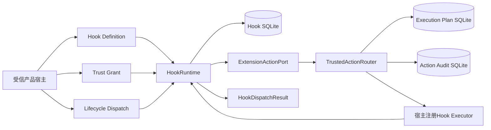

### 7.1 图示说明

1. 宿主负责构造Definition、Grant、Port映射和Dispatch，当前没有配置加载器；
2. Runtime在构造时验证定义、授权和Action Binding，再保存Registry；
3. 每个匹配Definition先在Hook DB建立Run Plan，再调用Port规划底层Action；
4. Router独立写Execution Plan和Action Audit，并执行自己的Policy；
5. Executor输出返回后先由Router结算Action，再由Hook Runtime执行Secret Guard与输出Schema校验；
6. Hook DB与Action两个Store没有共同事务，终态可能暂时或永久不同；
7. Runtime返回`allowed`只表达Hook链结论，不表达目标Action最终获准。

### 7.2 信任分区

| 区域 | 可信度 | 当前允许 | 当前禁止或未证明 |
|---|---|---|---|
| 产品宿主 | 受信控制面 | 声明来源、配置Grant、绑定Port、产生Dispatch | 不应把用户可写定义伪装成`bundled` |
| Definition/Grant | 宿主输入 | 通过严格合同、摘要和数量校验 | 不自证作者、发行物或签名真实性 |
| Hook Runtime/Store | 执行TCB | 匹配、计划、状态转换、摘要和持久化 | 不执行任意动态代码，不读取Workspace正文 |
| ExtensionActionPort | 来源能力边界 | 只能访问固定`source/source_id`的注册Action | 不暴露Router、其他来源Plan或Reconcile给Hook Runtime |
| Hook Executor | 宿主TCB代码 | 接收最小化输入并返回结构化决定 | 元数据不能机械证明其无隐藏副作用 |
| 目标Action | 独立决策域 | 保持自身Policy、Approval、Sandbox和恢复权威 | Hook `allow`不能授予目标Action权限 |
| SQLite状态 | 受信本地持久层 | 保存合同和摘要事实 | 当前未加密、未签名且未做强租户隔离 |

## 8. 包结构、依赖方向与阅读顺序

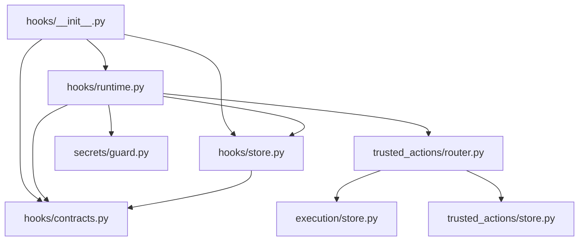

依赖方向从装配和运行层指向合同与基础设施。`contracts.py`不依赖Runtime或Store；Store不知道Matcher和执行端口；
Runtime不能从Port取得Router或Executor对象。`__init__.py`只导出公共符号，不执行默认装配。

| 顺序 | 文件/目录链接 | 关键符号 | 阅读目的 |
|---:|---|---|---|
| 1 | [`hooks/contracts.py`](../../src/harnessix/hooks/contracts.py) | `HookDefinition`、`HookDispatch`、`HookRunPlan`、`HookRunEvent` | 先掌握事件、字段形状、摘要和状态不变量 |
| 2 | [`hooks/store.py`](../../src/harnessix/hooks/store.py) | `SQLiteHookStore`、`_ALLOWED_TRANSITIONS` | 理解Registry代次、Run事务、投影和Hash链 |
| 3 | [`hooks/runtime.py`](../../src/harnessix/hooks/runtime.py) | `HookRuntime` | 理解授权、Binding、匹配、运行、超时和输出校验 |
| 4 | [`trusted_actions/router.py`](../../src/harnessix/trusted_actions/router.py) | `ExtensionActionPort`、`TrustedActionRouter` | 理解来源隔离和底层Action状态 |
| 5 | [`tests/hooks/test_runtime.py`](../../tests/hooks/test_runtime.py) | 14项运行时用例 | 对照正常、拒绝、超时、取消和恢复事实 |
| 6 | [`tests/hooks/test_schemas.py`](../../tests/hooks/test_schemas.py) | `test_committed_hook_schemas_match_runtime_contracts` | 核对11份Schema与运行合同一致性 |

## 9. 公共API与默认装配状态

[`hooks/__init__.py`](../../src/harnessix/hooks/__init__.py)导出11类合同、三个Builder、`HookRuntime`和
`SQLiteHookStore`。当前没有导出抽象Store端口、配置文件解析器、Hook Executor基类、统一Bootstrap或列表查询API。

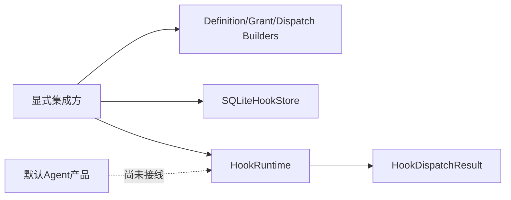

因此，以下说法均不属于当前保证：

1. 创建Session会自动触发`session_started`；
2. Turn完成会自动触发`turn_completed`；
3. 任意Tool执行前后会自动触发`before_action/after_action`；
4. CLI或配置文件可以声明Hook；
5. Runtime重启会自动调用`recover_interrupted()`；
6. Hook结果会自动显示在UI、Trace或运维指标中。

## 10. 事件、模式与失败策略

| 事件 | `turn_id` | 目标Action身份 | 参数摘要 | 结果摘要 | Matcher | 固定模式 | 固定失败策略 | 当前语义 |
|---|---|---|---|---|---|---|---|---|
| `session_started` | 禁止 | 禁止 | 禁止 | 禁止 | 禁止 | Advisory | Record Only | 只记录Session启动观察 |
| `session_ended` | 禁止 | 禁止 | 禁止 | 禁止 | 禁止 | Advisory | Record Only | 只记录Session结束观察 |
| `turn_started` | 必填 | 禁止 | 禁止 | 禁止 | 禁止 | Advisory | Record Only | 只记录Turn启动观察 |
| `turn_completed` | 必填 | 禁止 | 禁止 | 禁止 | 禁止 | Advisory | Record Only | 只记录Turn完成观察 |
| `before_action` | 必填 | 必填 | 必填 | 禁止 | 必填 | Blocking | Fail Closed | 非成功即不放行并停止后续定义 |
| `after_action` | 必填 | 必填 | 禁止 | 必填 | 必填 | Advisory | Record Only | 结果发生后观察，不能追溯阻断 |

### 10.1 合同上的固定组合

`HookDefinition.valid_definition()`把事件与模式直接绑定：只有`before_action`可声明
`blocking + fail_closed`；其他五类事件必须为`advisory + record_only`。这不是调用方可自由配置的矩阵。
Action事件必须有Matcher，非Action事件禁止Matcher。

### 10.2 运行时上的实际结果

- Blocking Run只有`succeeded`才允许继续；`blocked`、`failed`、`cancelled`和`interrupted`都视为失败关闭；
- Advisory Run无论成功或失败都不改变`allowed`；
- Advisory处理器返回`deny`不是拒绝，而是`hook_output_invalid`；
- `after_action`即使失败也无法改变已经完成的目标Action；
- 没有匹配定义时返回`allowed=true, runs=()`，且不持久化Dispatch本身。

## 11. Hook Definition合同

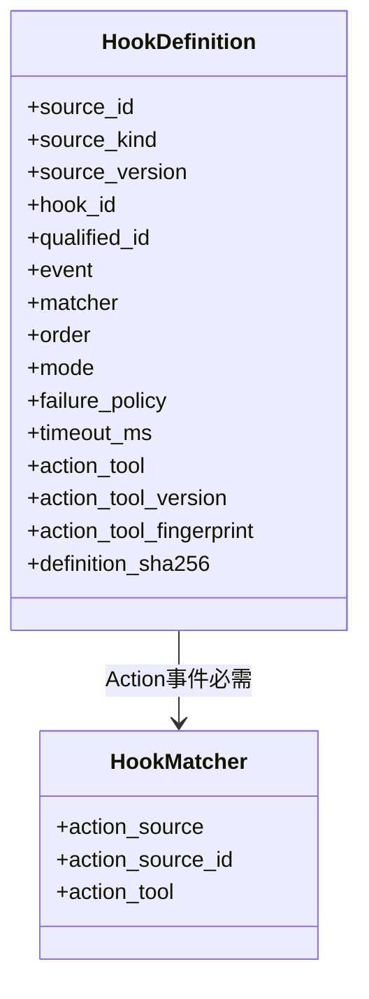

### 11.1 重点字段

| 字段 | 类型/范围 | 语义 | 是否进入Definition摘要 | 当前限制 |
|---|---|---|---|---|
| `spec_version` | 固定`harnessix.hook-definition/v1` | 合同版本 | 是 | 无旧版本迁移器 |
| `source_id` | 小写标识，1～64字符 | Hook来源身份 | 是 | 由宿主声明，不绑定发行证据 |
| `source_kind` | `bundled/managed/user/workspace` | 授权分支标签 | 是 | `bundled`免Grant |
| `source_version` | 1～128字符 | 来源版本声明 | 是 | 未限制换行/NUL，未绑定包摘要 |
| `hook_id` | 小写标识，1～64字符 | 来源内Hook身份 | 是 | 与来源组成限定身份 |
| `qualified_id` | `<source_id>/<hook_id>` | Registry唯一键 | 是 | Builder自动构造，合同复核 |
| `event` | 六值枚举 | 生命周期触发点 | 是 | 由宿主负责实际触发 |
| `matcher` | 可空对象 | Action选择条件 | 是 | 只支持精确值和`*` |
| `order` | -10000～10000 | 同事件执行顺序 | 是 | 同值再按限定身份排序 |
| `mode` | Blocking/Advisory | 是否影响放行 | 是 | 由事件固定 |
| `failure_policy` | Fail Closed/Record Only | 失败影响 | 是 | 由事件固定 |
| `timeout_ms` | 100～60000 | 底层`execute()`等待上界 | 是 | 不覆盖全调度和规划阶段 |
| `action_tool` | Tool标识 | 处理器Tool | 是 | 必须在来源Port中唯一命中 |
| `action_tool_version` | 1～128字符 | 处理器版本 | 是 | 未限制换行/NUL |
| `action_tool_fingerprint` | SHA-256 | 处理器合同指纹 | 是 | 来自宿主Binding |
| `definition_sha256` | SHA-256 | 除自身外全字段规范摘要 | 否 | 不是签名 |

### 11.2 Definition摘要

```text
definition_sha256 = SHA256(canonical_json(all_fields_except_definition_sha256))
```

事件、Matcher、顺序、模式、Timeout、来源版本或Action版本/指纹任一变化都会产生新摘要，并使旧的非Bundled
Grant不再匹配。摘要证明字段一致性，不证明字段的作者或来源真实性。

## 12. Matcher语义

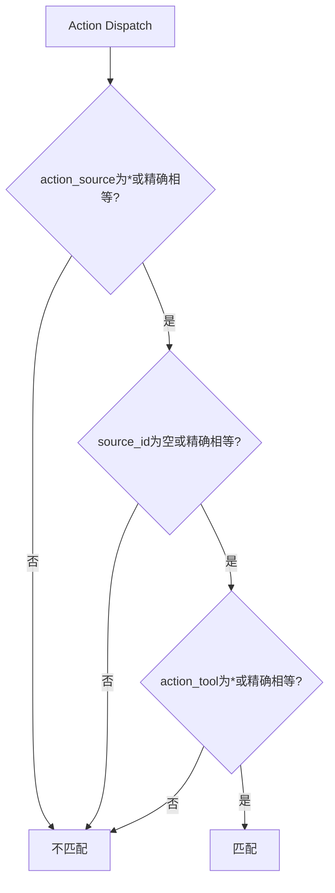

Matcher三字段按AND组合：

| 字段 | 允许值 | 匹配方式 | 特别规则 |
|---|---|---|---|
| `action_source` | `*`或小写来源标识，可为`null` | `*`或精确相等 | 若`action_source_id`非空则本字段必须非空 |
| `action_source_id` | 1～256字符，可为`null` | 空表示不限制，否则精确相等 | 原值保存在Definition和Dispatch中 |
| `action_tool` | `*`或Tool标识，可为`null` | `*`或精确相等 | 正则和Glob字符不被接受 |

当前`HookMatcher()`允许三个字段都为空。由于实现中的集合判断会把`None`与缺失目标字段比较，在Action Dispatch
中`action_source`和`action_tool`必填，空Matcher实际不匹配任何Action；它不是“匹配全部”。如需匹配全部，必须
显式使用`HookMatcher(action_source="*", action_tool="*")`。这一区别需要测试固定，不能依赖直觉。

## 13. Trust Grant合同与生命周期

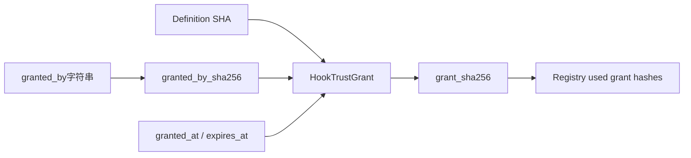

### 13.1 字段与约束

| 字段 | 语义 | 校验 | 安全结论 |
|---|---|---|---|
| `source_id`、`hook_id` | 被授权限定身份 | 与Definition精确匹配 | 不含Registry或Workspace身份 |
| `definition_sha256` | 被授权定义版本 | 与当前Definition精确匹配 | 定义任何变化失效 |
| `granted_by_sha256` | `canonical_digest(granted_by)` | 仅SHA格式 | 只是Actor标签摘要，不是签名主体 |
| `granted_at` | 签发墙钟时间 | 必须带时区 | Runtime不校验未来签发 |
| `expires_at` | 可选过期时间 | 必须晚于`granted_at` | 只在Runtime构造时与`captured_at`比较 |
| `grant_sha256` | 除自身外全字段摘要 | 重算精确一致 | 可检测误改，不能认证签发者 |

### 13.2 构造时授权算法

1. `bundled` Definition跳过Grant查找；
2. 其他来源按`source_id + hook_id + definition_sha256`查找精确Grant；
3. 找不到或`expires_at <= captured_at`时抛出`hook_trust_required`；
4. 实际命中的Grant摘要排序后写入Registry；
5. 未使用Grant不进入Registry；
6. 相同`source_id + hook_id`出现多个Grant时整体拒绝，即使Definition摘要不同。

### 13.3 当前信任缺口

`build_hook_trust_grant()`注释称其绑定Workspace，但实际合同没有Workspace、Tenant、Registry或Project字段。
Grant也没有数字签名、HMAC、审批账本身份或撤销状态。任何已能构造受信宿主输入的代码都能生成形式有效的Grant。
此外，过期只在Runtime构造时检查；Runtime存活期间不按Dispatch时间复核。受控验证已证明：若
`captured_at`早于`expires_at`，即使实际Dispatch发生在过期之后仍会执行。该能力只能称为“捕获时有效的摘要授权”。

## 14. Registry构建与不可变快照

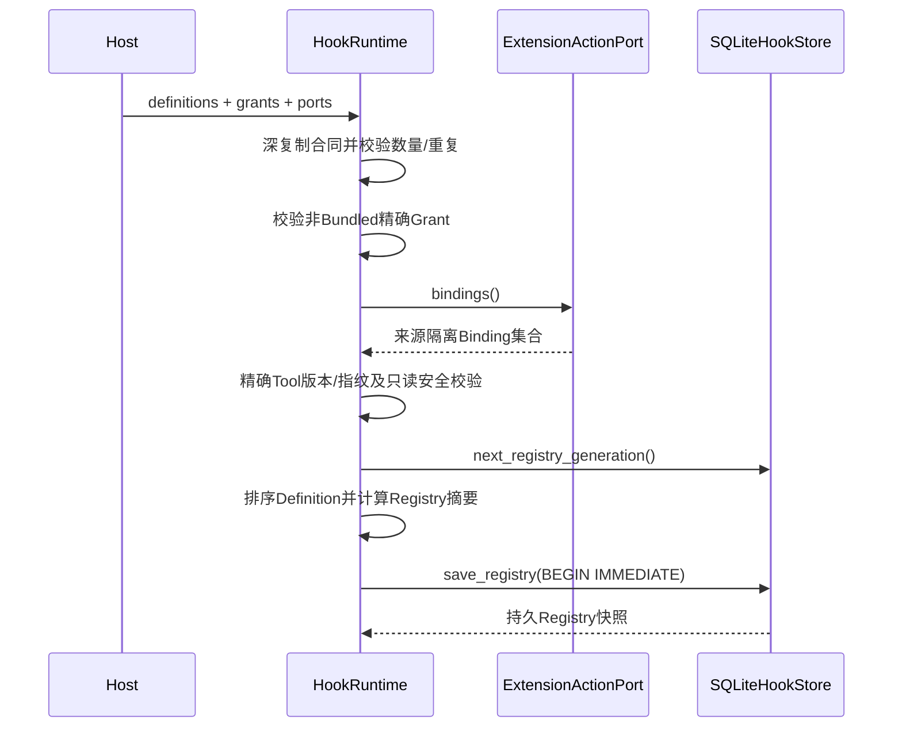

### 14.1 规范排序与摘要

Definition按`(event, order, qualified_id)`升序排列；已使用Grant摘要按字典序排列且去重。Registry语义摘要排除
`generation`、`captured_at`和自身，因此相同定义/授权跨代次具有相同摘要，但每次Runtime构造仍保存新代次。

### 14.2 数量与重复约束

- Runtime显式限制Definition和Grant各不超过512；
- Qualified ID在整个Registry唯一，不能为同一Hook定义多个事件；
- Grant按`(source_id, hook_id)`唯一；
- Snapshot合同再次限制两个元组各不超过512并检查规范排序；
- Runtime没有要求至少一个Definition，空Registry是有效快照。

### 14.3 Action Binding门禁

每个Definition必须在`ports[definition.source_id].bindings()`中唯一命中相同Tool、版本和指纹。命中Binding必须满足：

```text
source == "hook"
effect_class == READ_ONLY
risk_level == LOW
recovery_mode == "none"
input_schema_sha256 == SHA256(HookActionInput JSON Schema)
```

当前`_validate_binding()`没有比较`binding.source_id == definition.source_id`。若受信宿主把键`foo`错误映射到
实际封装`bar`来源的Port，只要Action三元组匹配，Registry会接受，执行计划实际绑定`bar`。受控验证已经复现
`foo` Definition最终运行`bar` Action。该缺口必须在产品装配前失败关闭。

## 15. Dispatch合同与数据最小化

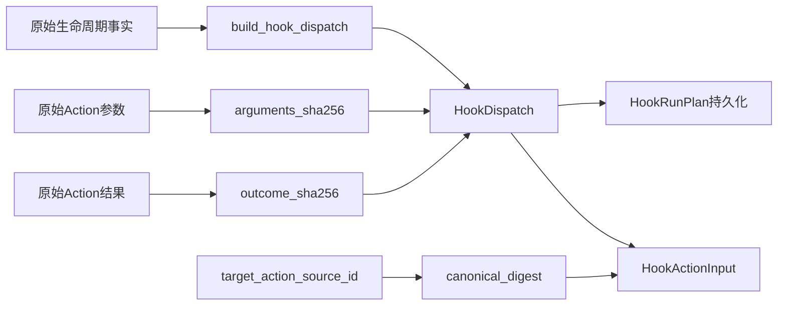

### 15.1 Dispatch重点字段

| 字段 | 必填条件 | 语义 | 持久化/敏感性 |
|---|---|---|---|
| `dispatch_id` | 总是 | 一次宿主生命周期派发身份 | 嵌入每个匹配Run Plan；零匹配时不保存 |
| `event` | 总是 | 六类事件之一 | Registry选择键 |
| `thread_id` | 总是 | Session/Thread关联 | 原值持久化，属于关联元数据 |
| `turn_id` | Turn/Action事件必填，Session事件禁止 | Turn关联 | 原值持久化 |
| `target_action_source` | Action事件必填 | 目标Action来源种类 | 原值持久化并传给处理器 |
| `target_action_source_id` | Action事件必填 | 目标来源实例身份 | 原值存于Hook Plan，传处理器前取摘要 |
| `target_action_tool` | Action事件必填 | 目标Tool | 原值持久化并传给处理器 |
| `target_action_plan_id` | Action事件必填 | 目标Action计划身份 | 原值持久化并传给处理器 |
| `arguments_sha256` | 仅`before_action`必填 | 原始参数规范摘要 | 不保存原始参数 |
| `outcome_sha256` | 仅`after_action`必填 | 原始结果规范摘要 | 不保存原始结果 |
| `occurred_at` | 总是 | 宿主提供的带时区墙钟 | 进入摘要，无新鲜度检查 |
| `dispatch_sha256` | 总是 | 除自身外全部字段摘要 | 校验Dispatch完整性 |

### 15.2 HookActionInput

处理器收到Registry/Definition摘要、Hook ID、Dispatch ID、事件、Thread/Turn、目标来源/Tool/Plan及参数或结果摘要。
唯一进一步脱敏的是`target_action_source_id`，它转换为`target_action_source_id_sha256`。以下内容不会进入输入：

- 原始Action参数和结果；
- 模型提示、回复和上下文正文；
- Workspace路径或文件正文；
- 环境变量与Secret值；
- Session事件载荷或用户消息正文。

但是Thread、Turn、Dispatch、目标Plan UUID以及来源/Tool仍是可关联元数据，部署方不能把它们视为匿名数据。

## 16. 匹配、排序与调度流程

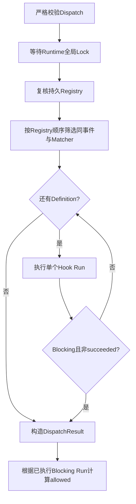

### 16.1 确定顺序

Registry已按事件、`order`和限定身份排序。Dispatch先筛选同事件，再按现有顺序逐个执行。`before_action`遇到首个
非成功Blocking Run立即停止，后续匹配Definition不会建立Run Plan，也不会出现在结果中。当前结果无法区分“未匹配”
与“因前序阻断而跳过”。

### 16.2 全局串行化

一个Runtime只有一个`asyncio.Lock`，所有Thread、Turn和事件共享。因此不会在同一实例中并发修改Run链，但慢Hook会
阻塞无关Session和Thread，形成Head-of-Line Blocking。Lock等待不受Definition Timeout约束；等待期间取消不会产生
Hook Run或Dispatch审计事实。

### 16.3 Registry复核

获得Lock后，Runtime按`registry_id + generation + digest`从Store重读完整Registry并与内存快照比较。找不到、损坏或
内容不等均在任何新Run建立前失败。该检查防止静默使用已篡改快照，但没有对数据库写者提供密码学防篡改保证。

## 17. Run身份、Plan与幂等边界

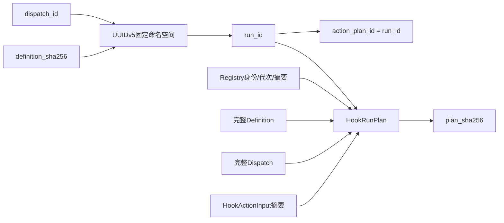

Run ID算法为：

```text
UUIDv5(HOOK_RUN_NAMESPACE, "<dispatch_id>:<definition_sha256>")
```

相同Dispatch与Definition产生相同Run ID，且底层Action Plan ID与Run ID相等。`SQLiteHookStore.begin()`发现相同Run ID：

- 完整Plan相等：返回已有投影；
- 完整Plan不同：抛出`hook_dispatch_conflict`；
- 已终态：Runtime直接回放，不再调用Action；
- `running`：抛出`hook_run_in_progress`；
- `ready`：继续底层Action规划。

Registry ID、代次和摘要不进入UUIDv5名称，但进入完整Plan。因此同一Dispatch/Definition跨新Registry代次提交会碰到
相同Run ID和不同Plan，并失败为冲突，而不是创建新Run。需要重试时应使用新的Dispatch ID。

`HookRunPlan`合同验证Run/Action Plan身份相等、Definition事件与Dispatch事件一致及自身摘要；它不从Plan重建
`HookActionInput`验证`input_sha256`，也不独立验证Registry字段与Definition来源。Store只进一步确认Registry存在且
完整Definition属于快照。当前正确输入摘要依赖Runtime Builder路径。

## 18. 正常执行时序

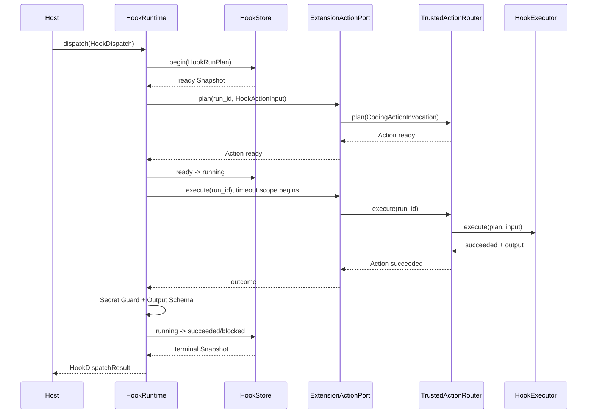

正常放行路径的持久顺序为：Hook `ready`事实 → 底层Action Plan → Hook `running`事实 → 底层Action执行与审计终态
→ Hook输出校验 → Hook `succeeded`事实。正常拒绝路径最后一步为`blocked + deny + hook_denied`。

## 19. Action规划与执行边界

### 19.1 规划

Runtime使用Definition冻结的Tool、版本、指纹和最小化`HookActionInput`调用来源Port。Port自行注入其私有
`source="hook"`和`source_id`，再由Router完成Binding、资源、Workspace、Sandbox、能力、Secret和Policy规划。
Hook Runtime不直接传递或覆盖这些字段。

若`port.plan()`抛出`KernelError`，Run从`ready`转为`failed(hook_action_plan_failed)`；若返回状态不是`ready`，
Run转为`failed(hook_action_not_ready)`。后一分支包括目标Action自己的Policy拒绝、需要Approval、Secret资源不允许
或其他非就绪状态。Hook处理器不会在这些情况下执行。

### 19.2 执行

只有Action Plan为`ready`时，Hook Store才先转为`running`，随后调用`port.execute(run_id)`。Port会再次检查Plan的
`source/source_id`与自身能力一致。Router负责Action执行、取消结算和Action Audit；Runtime只接收
`ActionExecutionOutcome`。

### 19.3 不能绕过目标Action Policy

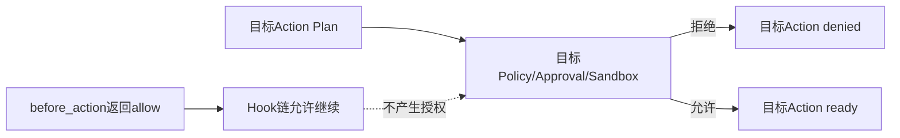

测试证明Hook返回`allow`后，一个`DESTRUCTIVE + CRITICAL`目标Action仍会被自己的Policy拒绝。Hook结果只是一道
额外门禁，不是能力令牌或审批凭据。

## 20. 输出合同、阻断与发布边界

`HookActionOutput`只有两个字段：

| `decision` | `reason_code` | Blocking结果 | Advisory结果 |
|---|---|---|---|
| `allow` | 必须为空 | `succeeded`，继续 | `succeeded`，继续 |
| `deny` | 必须为小写下划线码 | `blocked(hook_denied)`，停止 | 非法，`failed(hook_output_invalid)`但不阻断 |
| 非法结构 | 任意 | `failed(hook_output_invalid)`，停止 | `failed(hook_output_invalid)`但不阻断 |

处理顺序固定为：

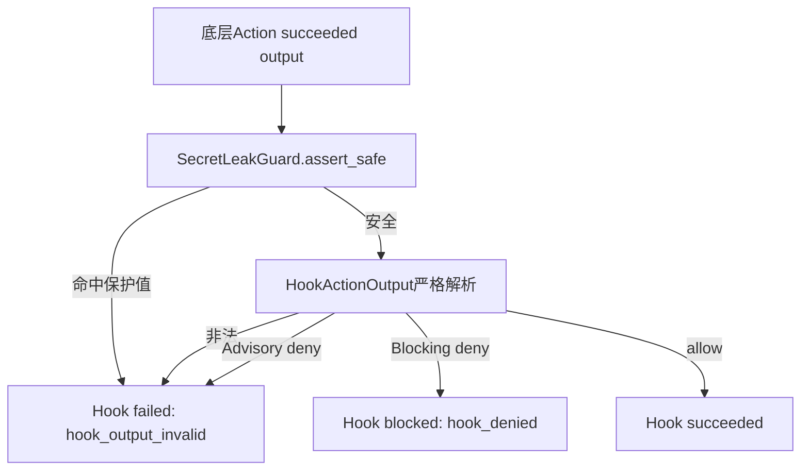

Hook Store只保存规范化输出摘要，不保存输出正文或`reason_code`原文。`reason_code`参与输出摘要，但无法从Hook
账本直接恢复。底层Action Audit同样保存输出摘要而非输出正文。

## 21. Hook与Action双账本一致性

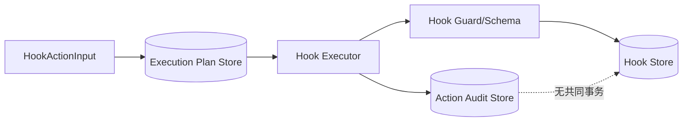

两个账本拥有不同事实：

| 账本 | 所有事实 | 提交时点 | 当前关联键 |
|---|---|---|---|
| Hook Store | Registry、Hook Run Plan、Hook状态和输出摘要 | Action规划前及Action返回后 | `run_id` |
| Execution Plan Store | Hook处理器Action计划、Policy、资源和状态 | `port.plan/execute`内部 | `plan_id == run_id` |
| Action Audit Store | Route状态事件和输出摘要 | Router执行期间 | `plan_id == run_id` |

`run_id == action_plan_id`提供关联，但不存在跨库事务、Outbox或自动对账器。特别是，Router先把Action结算为
`succeeded`，Runtime随后才执行Secret Guard和Hook输出Schema。若Guard命中、输出多字段或Advisory返回`deny`，
Hook会结算为`failed(hook_output_invalid)`，而Action保持`succeeded`。受控验证已复现该分歧。

这不是原始Secret落盘：两个账本都只保存输出摘要；问题在于相同处理器交付的语义终态不一致。运维若只查询Action
账本会误以为Hook有效完成，若只查询Hook账本则看不到底层Action已执行。产品化前需要统一“执行完成”和“Hook输出
接受/发布完成”的阶段事实或专用对账器。

## 22. 状态机

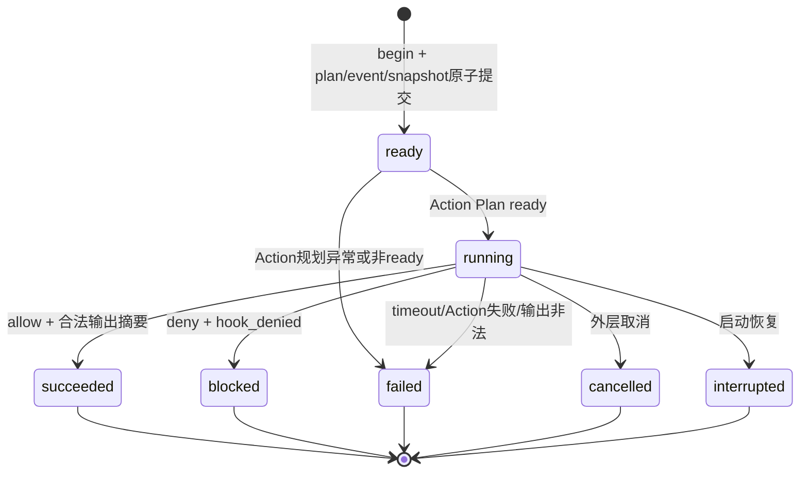

### 22.1 转换表

| 起始 | 目标 | 发起者 | 条件 | 终态字段 |
|---|---|---|---|---|
| 不存在 | `ready` | `SQLiteHookStore.begin` | Registry和Definition绑定有效 | 无decision/output/error |
| `ready` | `running` | `HookRuntime._run` | 底层Action Plan为`ready` | 无decision/output/error |
| `ready` | `failed` | `HookRuntime._run` | Action规划抛`KernelError`或非`ready` | 对应错误码 |
| `running` | `succeeded` | `HookRuntime._run` | Action成功、Guard和Schema通过、decision=`allow` | `allow + output_sha256` |
| `running` | `blocked` | `HookRuntime._run` | Blocking输出合法且decision=`deny` | `deny + output_sha256 + hook_denied` |
| `running` | `failed` | `HookRuntime._run` | Timeout、Action异常/失败或输出非法 | `hook_*`错误码 |
| `running` | `cancelled` | `HookRuntime._run` | 等待Action时收到外层取消 | `hook_cancelled` |
| `running` | `interrupted` | `recover_interrupted` | 启动扫描发现Running | `hook_host_interrupted` |

所有六个终态不可再转换。Snapshot和Event的`sequence`合同范围是1～16；当前正常路径最多三项事件。若未来增加
超过16次状态变化，Builder会产生Pydantic `ValidationError`，Store没有把该异常归一化为`KernelError`。

## 23. Event与Snapshot终态不变量

| 状态 | `decision` | `output_sha256` | `error_code` |
|---|---|---|---|
| `ready` / `running` | 空 | 空 | 空 |
| `succeeded` | 必须`allow` | 必填 | 空 |
| `blocked` | 必须`deny` | 必填 | 必须`hook_denied` |
| `failed` / `cancelled` / `interrupted` | 空 | 空 | 必填且匹配`hook_*` |

Event额外要求：序号1必须同时没有`from_state`和`previous_digest`；序号大于1必须同时携带两者；每个Event摘要
覆盖Plan摘要、序号、前后状态、终态字段、时间和前序摘要。Snapshot投影保存最新状态、序号、最新事件摘要和终态字段。


## 24. Timeout语义

### 24.1 当前覆盖范围

Definition的`timeout_ms`只包围：

```python
async with asyncio.timeout(timeout_ms / 1000):
    outcome = await port.execute(run_id)
```

它不覆盖：

- 等待全局Dispatch Lock；
- Registry数据库复核；
- Matcher和ActionInput/Plan构造；
- Hook Store `begin()`与状态转换；
- `port.plan()`及其Policy、数据库和资源解析；
- Action返回后的Secret Guard、Schema解析和终态提交。

因此`timeout_ms`是“底层Action执行等待上界”，不是完整Dispatch或单Run端到端Deadline。

### 24.2 Timeout时序

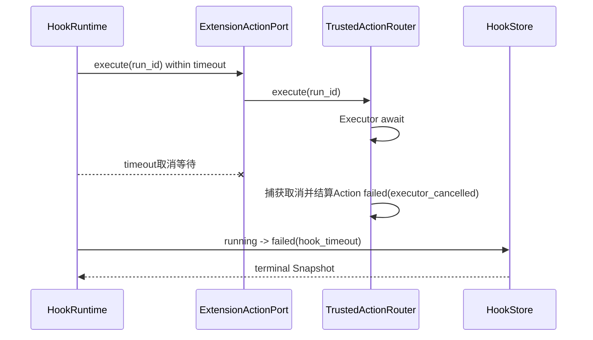

专项测试证明底层Action最终为`failed`且Action Event错误码为`executor_cancelled`，Hook最终为
`failed(hook_timeout)`。如果底层依赖不响应协作式取消，`asyncio.timeout`不能保证外部副作用立即停止；该情况仍需要
Executor/Sandbox层的进程树终止和对账语义。

## 25. 外层取消语义

外层任务仅在等待`port.execute()`时被Runtime显式捕获。当前处理顺序是：

1. Router接收取消并结算底层Action；
2. Runtime捕获`CancelledError`；
3. Hook Store同步提交`running -> cancelled(hook_cancelled)`；
4. Runtime重新抛出`CancelledError`给调用方。

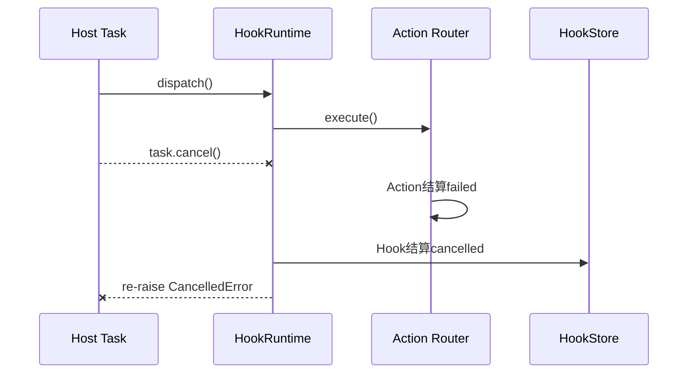

取消在Lock等待、同步SQLite、Action规划或输出校验阶段没有专门持久事实；Python只会在可等待点交付取消。若Hook终态
提交自身失败，当前实现可能用Store异常遮蔽原始`CancelledError`。调用方不应把“收到取消”与“两账本均已可靠提交”
视为同一保证。

## 26. 异常与错误归一化

### 26.1 Runtime错误码

| 错误码 | 产生阶段 | 是否建立Run | Dispatch影响 | 建议重试 |
|---|---|---:|---|---|
| `hook_registry_limit` | Runtime构造 | 否 | 构造失败 | 修配置 |
| `hook_definition_duplicate` | Runtime构造 | 否 | 构造失败 | 修配置 |
| `hook_trust_grant_duplicate` | Runtime构造 | 否 | 构造失败 | 修配置 |
| `hook_trust_required` | Runtime构造 | 否 | 构造失败 | 重新授权或移除定义 |
| `hook_action_port_missing` | Runtime构造 | 否 | 构造失败 | 修Port映射 |
| `hook_action_binding_missing` | 构造/运行 | 否或已有 | 失败 | 恢复精确Binding |
| `hook_action_binding_unsafe` | Runtime构造 | 否 | 构造失败 | 修Binding合同 |
| `hook_registry_invalid` | Runtime构造 | 否 | 构造失败 | 修合同/数量 |
| `hook_registry_changed` | Dispatch获得Lock后复核 | 否 | 整个Dispatch抛错 | 停止服务并核对持久Registry |
| `hook_action_binding_changed` | Run开始 | 否 | 整个Dispatch抛错 | 重新构造Runtime |
| `hook_run_in_progress` | 重复Run | 已有 | 整个Dispatch抛错 | 等待所有者或恢复 |
| `hook_action_plan_failed` | Action规划 | 是，failed | Blocking不放行；Advisory记录 | 新Dispatch或修依赖 |
| `hook_action_not_ready` | Action Policy/Approval | 是，failed | 同上 | 不自动重试 |
| `hook_timeout` | Action执行 | 是，failed | 同上 | 新Dispatch并先对账 |
| `hook_cancelled` | 外层取消 | 是，cancelled | 取消向上传播 | 不自动重试 |
| `hook_action_failed` | Action异常/非成功 | 是，failed | Blocking不放行 | 按Action事实判断 |
| `hook_output_invalid` | Guard/Schema/模式 | 是，failed | Blocking不放行 | 修Executor输出 |
| `hook_denied` | 合法Blocking deny | 是，blocked | 不放行 | 属于业务拒绝 |

### 26.2 Store错误码

| 错误码 | 场景 | 当前错误边界 |
|---|---|---|
| `hook_store_version` | Schema版本不是1 | 初始化失败，无迁移 |
| `hook_store_corrupt` | Registry、Plan投影、事件或索引不一致 | 失败关闭 |
| `hook_registry_conflict` | 保存代次不是当前下一代 | 整个Registry保存回滚 |
| `hook_registry_not_found` | 精确或最新Registry不存在 | 调度前失败 |
| `hook_dispatch_conflict` | 相同Run ID绑定不同Plan | 不覆盖旧事实 |
| `hook_definition_changed` | Run Definition不属于Registry | `begin`回滚 |
| `hook_run_not_found` | 指定Run不存在 | 查询/转换失败 |
| `hook_run_state_conflict` | 期望状态、合法边或CAS不匹配 | 转换回滚 |

当前只有部分Pydantic和数据损坏异常被归一化；SQLite锁耗尽、磁盘满、权限、关闭后调用以及部分Builder
`ValidationError`可能原样越过公共边界。Runtime的`port.plan()`只捕获`KernelError`，非Kernel异常会留下`ready` Run并
向上传播。

## 27. SQLite持久化模型

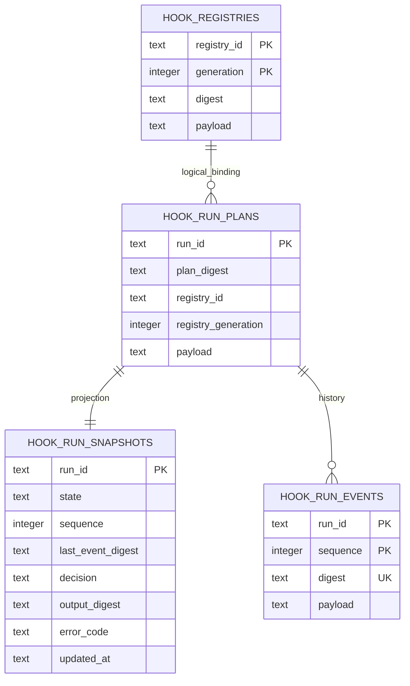

图中的关系是应用层逻辑关系，Schema没有声明实际Foreign Key。删除Registry或Plan可能留下孤立行；当前API不提供删除，
但直接数据库操作或损坏仍可造成该状态。

### 27.1 初始化参数

- SQLite连接：`isolation_level=None`、连接Timeout 5秒；
- `busy_timeout=5000`；
- `foreign_keys=ON`，但表没有FK；
- `journal_mode=WAL`；
- `synchronous=FULL`；
- 表使用`STRICT`；
- POSIX父目录被设为`0700`，主数据库被设为`0600`。

当前没有控制既有祖先目录所有权、Symlink路径、`O_NOFOLLOW`、WAL/SHM文件权限、文件加密、Windows ACL或共享目录
兼容；对既有父目录直接`chmod(0700)`还可能改变其他应用预期权限。

## 28. Registry事务

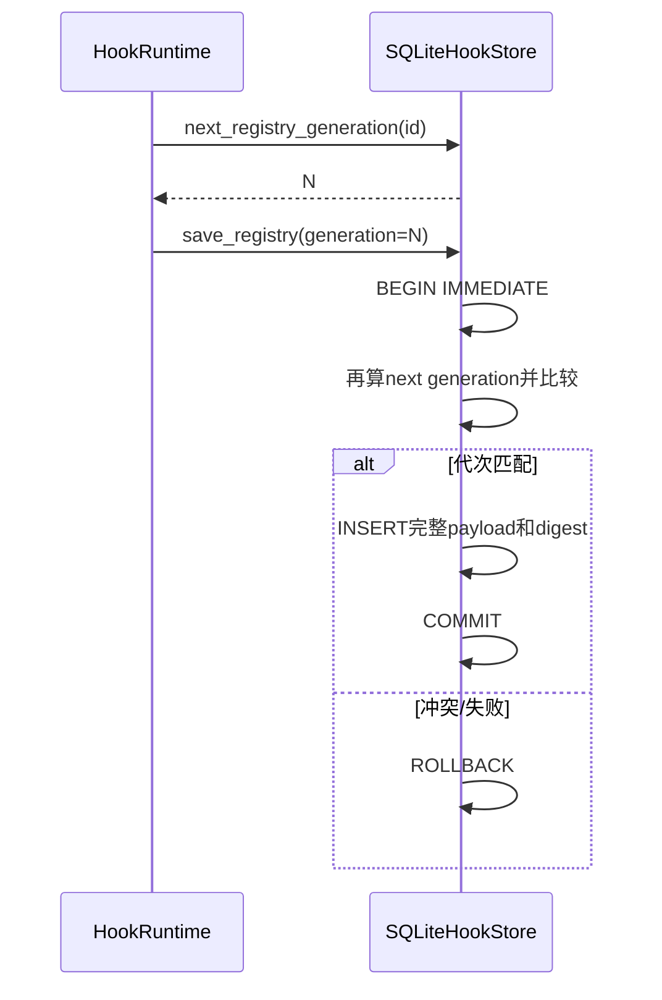

Runtime在事务外读取候选代次，Store在`BEGIN IMMEDIATE`内再次计算并比较，从而检测并发Registry写入。相同语义快照
不会复用旧代次：每次成功构造都追加新行，语义摘要可以相同。长期进程反复重建Runtime会无限增长Registry表。

## 29. Run建立事务

`begin(plan)`在一个`BEGIN IMMEDIATE`事务中完成：

1. 严格重建Plan合同；
2. 查询同Run ID；存在则比较完整Plan并直接返回或冲突；
3. 精确加载Plan声明的Registry ID、代次和摘要；
4. 验证完整Definition属于Registry；
5. 插入Run Plan；
6. 插入序号1的`ready` Event；
7. 插入`ready` Snapshot；
8. 提交后重新`load()`并返回。

```mermaid
flowchart TD
    Begin[BEGIN IMMEDIATE] --> Existing{Run已存在?}
    Existing -- 同Plan --> Return[COMMIT并返回]
    Existing -- 异Plan --> Rollback[ROLLBACK + conflict]
    Existing -- 否 --> Registry[复核Registry和Definition]
    Registry --> Plan[INSERT Plan]
    Plan --> Event[INSERT ready Event]
    Event --> Snapshot[INSERT ready Snapshot]
    Snapshot --> Commit[COMMIT]
```

这保证Run Plan、首事件和首投影不会部分可见。它不保证后续底层Action Plan也在同一事务中存在，因此进程可在Hook
`ready`之后、Action规划之前崩溃。

## 30. 状态转换事务与CAS

每次`transition()`执行：`BEGIN IMMEDIATE` → 加载当前投影 → 检查调用方`expected` → 检查允许边 → 构造下一Event
→ 插入Event → 以旧状态和旧序号CAS更新Snapshot → `COMMIT`。任何异常回滚。

```mermaid
sequenceDiagram
    participant R as Runtime/Recovery
    participant S as HookStore
    R->>S: transition(run, expected, target)
    S->>S: BEGIN IMMEDIATE + load current
    S->>S: expected与允许边校验
    S->>S: INSERT event(sequence+1)
    S->>S: UPDATE snapshot WHERE old state+sequence
    alt rowcount = 1
      S->>S: COMMIT
    else 竞争/异常
      S->>S: ROLLBACK
    end
```

`BEGIN IMMEDIATE`已串行化同数据库写者，CAS仍提供显式状态冲突检测。Store没有Owner、Lease或Fencing Token；跨进程
执行所有权并非由该CAS解决。

## 31. 读取与事件链验证

### 31.1 `load()`

`load()`联结Plan与Snapshot，严格重建二者，再只读取`sequence == snapshot.sequence`的最新Event，检查：

- Plan索引摘要和Plan正文一致；
- Run ID一致；
- 最新Event行摘要、Event正文摘要和Snapshot最新摘要一致；
- 最新Event序号、目标状态和终态字段与Snapshot一致。

它不会读取或验证更早的Event。受控验证修改序号2事件的行摘要、保持序号3和Snapshot不变后，`load()`仍成功；
`events()`才报告`hook_store_corrupt`。因此`load()`提供最新投影局部一致性，不是完整历史完整性证明。

### 31.2 `events()`

`events()`先调用`load()`，随后单独查询完整事件序列，逐项验证连续序号、行/正文摘要、Run ID、前序摘要、前序状态，
最后比较事件数、末摘要和末状态与第一次读取的Snapshot。

```mermaid
flowchart LR
    Load[先load当前Snapshot] --> Query[再查询全部Events]
    Query --> Chain[逐项验证序号/摘要/状态]
    Chain --> Compare[与先前Snapshot比较]
    Compare --> Return[返回完整链]
```

两次读取不在同一显式读事务中。若另一个连接恰在其间追加合法转换，`events()`可能把正常并发变化误报为链与投影不一致。
单Runtime全局Lock减少本实例内发生概率，但Store是公共导出类，跨Runtime/进程仍可能出现。

## 32. 崩溃窗口

| 窗口 | Hook账本 | Action账本 | 当前重启行为 | 风险 |
|---|---|---|---|---|
| Registry提交前 | 无新Registry | 无 | 构造失败重试 | 无半Registry |
| Hook `ready`后、Action Plan前 | `ready` | 无 | `recover_interrupted`忽略；同Dispatch可继续规划 | 若不重放Dispatch则永久Ready |
| Action Plan后、Hook `running`前 | `ready` | Action可能`ready/denied` | 恢复忽略Ready；重放调用幂等Plan | 需依赖Router同ID一致性 |
| Hook `running`后、Executor前 | `running` | Action可能`ready/running` | Hook统一标Interrupted | 不检查Action真实状态 |
| Executor副作用后、Action终态前 | `running` | Action可能不确定 | Hook标Interrupted | 只读声明降低但不能消除未知 |
| Action succeeded后、Hook Guard前 | `running` | `succeeded` | Hook标Interrupted | 合法输出不能自动发布或恢复 |
| Hook Event插入后、Snapshot更新前 | 同一事务不可见 | 已终态 | 回滚Hook转换 | 可重做Hook终态提交但无自动协调 |
| Hook终态提交后、返回前 | 终态 | 终态 | 同Dispatch回放 | 不重复Executor |

当前Binding固定`recovery=none`且声明只读，设计意图是避免需要外部副作用对账的Hook处理器。但宿主Executor仍是进程内
受信代码，元数据并不能机械阻止其写操作；故崩溃窗口不能被描述为完全无副作用。

## 33. 启动恢复

```mermaid
flowchart TD
    Start[宿主显式调用recover_interrupted] --> Scan[查询全部state=running]
    Scan --> Next{下一Run}
    Next -- 有 --> Transition[running -> interrupted]
    Transition --> Next
    Next -- 无 --> IDs[返回已收敛Run ID]
```

`recover_interrupted()`只扫描`running`，按Run ID排序逐个转换为
`interrupted(hook_host_interrupted)`；重复调用在无新Running时返回空元组。它不自动执行，必须由宿主在确认没有旧执行者
后调用。

当前恢复没有：

- Owner/Lease/Fencing，无法阻止仍存活执行者稍后提交；
- 对应Action状态查询，无法区分`ready/running/succeeded/failed`；
- Action Reconcile或Hook输出重验；
- 单批次事务，一个Run竞争失败可中止后续扫描；
- Ready孤儿扫描；
- 分布式恢复协调或恢复审计批次。

Interrupted是保守终态而非“执行没有发生”的证明。同一Dispatch再次提交会回放Interrupted并使Blocking链不放行；若业务
决定重试，必须创建新Dispatch并先核对底层Action。

## 34. Blocking与Advisory组合

```mermaid
flowchart LR
    A1[Advisory 1] --> A2[Advisory 2]
    A2 --> B1[Blocking 1]
    B1 -- succeeded --> B2[Blocking 2]
    B1 -- 非成功 --> Stop[停止后续全部定义]
    B2 -- succeeded --> Done[allowed=true]
    B2 -- 非成功 --> Stop2[allowed=false]
```

由于Registry先按事件排序，同一Dispatch只处理同一事件。当前只有`before_action`能出现Blocking，因此同一事件中的Definition
要么全部Blocking，要么全部Advisory，不会出现图中的混合链；该图用于说明Runtime通用循环的控制规则。实际
`before_action`首个失败后，后续全部Definition跳过；其他事件会执行所有已选择Definition，即使某个Advisory失败。

## 35. Dispatch Result合同

`HookDispatchResult`保存Dispatch ID、事件、`allowed`和最多512个已执行Run Snapshot。合同验证：

1. 每个Run嵌入的Dispatch ID和事件必须与结果一致；
2. 只要存在Blocking Run且其状态不是`succeeded`，`allowed`必须为`false`；
3. 没有Blocking失败时`allowed`必须为`true`。

结果不保存：匹配Definition总数、未匹配原因、被前序阻断跳过的Definition、Registry代次顶层字段、总体耗时或Trace ID。
这些信息部分可从Run Plan推导，但零匹配与跳过无法从持久状态完整重建。

## 36. 并发模型

| 范围 | 当前机制 | 保证 | 不保证 |
|---|---|---|---|
| 单Runtime Dispatch | 一个`asyncio.Lock` | 同实例完全串行、稳定顺序 | 公平性、端到端Deadline、高吞吐 |
| 单SQLite连接写 | `BEGIN IMMEDIATE` | 事务原子性和写冲突检测 | 跨Store原子性 |
| 多连接同DB | WAL + busy timeout | SQLite支持的并发读写 | 应用层执行所有权 |
| 同Run转换 | 旧状态/序号CAS | 检测状态竞争 | 防止两个Executor同时产生外部效果 |
| 多进程恢复 | 无Owner/Lease | 无 | 活跃执行者与Recovery互斥 |
| 跨线程 | SQLite默认线程检查，Lock非线程锁 | 创建线程内使用 | 线程安全 |
| 跨事件循环 | 未设计 | 无 | Runtime复用安全 |

当前全局锁简单且利于证明顺序，但生产多用户场景会把一个慢Hook放大为全局尾延迟。演进时不能直接删除锁；需要明确
按Registry/Thread/Dispatch分片的并发键、同事件顺序、同Run单所有者和Store事务边界。

## 37. 安全设计

### 37.1 已实现控制

1. 不提供任意Shell、HTTP或动态模块加载接口；
2. Definition完整摘要绑定所有行为字段；
3. 非Bundled来源要求精确摘要Grant；
4. Action版本、指纹和输入Schema精确绑定；
5. Binding必须声明Hook来源、只读、低风险和无恢复；
6. 处理器只通过来源隔离Port执行；
7. 输入不含原始参数、结果、正文、环境和Secret；
8. 输出经过已知Secret精确值Guard和严格Schema；
9. Blocking失败关闭，`allow`不能覆盖目标Action策略；
10. Registry、Dispatch、Plan和事件具有规范摘要；
11. 重复终态不重放Executor；
12. 事件链损坏由完整读取接口失败关闭。

### 37.2 安全控制的真实边界

- 摘要是完整性校验，不是签名、认证或不可抵赖；
- `bundled`、Definition来源和`captured_at`都是宿主断言；
- Binding的`READ_ONLY`是声明，Runtime不能审计Executor内部代码；
- Port限制调用来源，但当前Runtime未核对Definition来源与Port实际来源一致；
- Guard只发现调用方提供的精确明文字节值，默认集合为空，不覆盖编码、分片或未知Secret；
- Hook DB保存Thread/Turn/Plan和原始目标来源身份等关联元数据；
- Hash链不能抵抗可重算全部行并修改投影的数据库写者；
- Store路径和SQLite sidecar权限没有完成强路径安全设计。

## 38. 威胁场景与缓解

| 威胁 | 当前攻击路径 | 当前缓解 | 剩余风险 |
|---|---|---|---|
| 未授权Workspace Hook | 注入新Definition | 精确Grant + Definition摘要 | Grant非签名、无Workspace绑定和撤销 |
| Definition静默漂移 | 改Matcher/Timeout/Action版本 | 摘要变化使旧Grant失效 | Bundled免Grant，宿主来源真实性未证明 |
| 任意命令旁路 | Hook声明Shell/URL | 无此合同，必须引用注册Action | 宿主Executor自身仍是TCB |
| 原始参数/结果外泄 | Hook读取敏感正文 | 仅传SHA摘要 | 关联元数据仍存在，摘要可被字典猜测 |
| Secret输出泄漏 | Executor把Secret放入输出 | `SecretLeakGuard`阻断已知精确值 | 默认空、未知/变形/分片Secret漏检 |
| Hook放宽权限 | 返回`allow` | 目标Action Policy独立权威 | 产品接线尚未实现，不能证明无旁路 |
| Port来源混淆 | 错误Mapping键绑定其他来源Port | Port内部隔离实际来源 | Runtime缺少Definition/Binding来源一致性检查 |
| 超时后副作用继续 | Executor忽略取消 | Router取消结算、Hook失败 | 需Sandbox进程树和Reconcile证明 |
| 重启误判 | Running时Action已经成功 | 收敛为Interrupted且不自动重放 | 无双账本对账，管理员需人工判断 |
| Event历史篡改 | 修改非末端Event | `events()`全链验证 | `load()`不验全链；全量重算无法发现 |
| SQLite路径替换 | Symlink/恶意祖先目录 | 基本chmod和SQLite权限 | 无nofollow/所有权/sidecar控制 |
| DoS | 慢Hook占用全局Lock | 每个Action执行有Timeout | Lock/规划/Store不在Timeout内 |

## 39. 隐私与数据分类

| 数据 | 示例 | Hook Action可见 | Hook DB | Action账本 | 建议分类 |
|---|---|---:|---:|---:|---|
| 原始Action参数 | 文件路径、命令参数 | 否 | 否 | Plan侧可能按Router合同保存参数 | 高敏用户数据 |
| 参数摘要 | `arguments_sha256` | 是 | 是 | 是/可关联 | 关联敏感元数据 |
| 原始Action结果 | 文件正文、命令输出 | 否 | 否 | Audit不保存正文 | 高敏用户数据 |
| 结果摘要 | `outcome_sha256` | 是 | 是 | 可关联 | 关联敏感元数据 |
| 目标来源身份 | MCP server/extension ID | 处理器仅见摘要 | 原值 | 目标Plan原值 | 配置与关联元数据 |
| Thread/Turn/Plan ID | UUID | 是 | 是 | 可关联 | 用户活动元数据 |
| Hook输出正文 | allow/deny对象 | Runtime短暂可见 | 仅摘要 | 仅摘要 | 控制面数据 |
| Grant Actor | 操作者标签 | 否 | 仅摘要 | 否 | 管理审计元数据 |

摘要不是匿名化：低熵参数、固定路径或已知来源身份可通过枚举比较。遥测和支持包若导出这些字段，仍需按用户数据生命周期
处理。当前Store没有租户字段、TTL、删除API或加密，不能直接用于多用户共享数据库。

## 40. 可观测性

### 40.1 当前可观测事实

- Registry Snapshot：实际Definition顺序和已使用Grant摘要；
- Hook Run Plan：Dispatch、Definition、Registry和输入摘要；
- Hook Run Event：状态、时间、错误码、输出摘要和前序摘要；
- Hook Run Snapshot：快速读取最新状态；
- Execution Plan和Action Audit：底层处理器规划与执行事实；
- `HookDispatchResult`：单次调用已执行Run和最终放行结论。

### 40.2 当前缺失

`hooks`包没有OpenTelemetry Span、Metric、结构化Log、Trace上下文、统一Correlation合同或健康检查。Store没有列表和
分页，无法直接计算吞吐、P95/P99、失败率、队列等待、Timeout率、Grant拒绝、Registry大小、恢复积压或数据库容量。

### 40.3 目标信号

| 信号 | 建议维度 | 禁止维度 | 用途 |
|---|---|---|---|
| `hook.dispatch.duration` | event、allowed、registry digest前缀 | Thread/Turn原值 | 端到端延迟与SLO |
| `hook.lock.wait` | Runtime/Registry | 用户或来源原值 | Head-of-Line诊断 |
| `hook.run.duration` | event、mode、terminal state | 参数/结果摘要 | 处理器性能 |
| `hook.run.failures` | 稳定错误码 | 原始异常正文 | 失败分布 |
| `hook.trust.rejections` | source kind、原因 | Actor/Source ID原值 | 授权风险 |
| `hook.recovery.backlog` | state、age bucket | Dispatch正文 | 启动恢复告警 |
| `hook.ledger.divergence` | Hook/Action终态对 | 输出摘要 | 双账本一致性 |
| `hook.store.bytes` | Store实例 | 路径 | 容量与保留 |

遥测失败不得改变Hook放行结论；安全拒绝和账本提交则属于主路径，不能降级为Best Effort日志。

## 41. 部署与生命周期

```mermaid
flowchart TD
    Config[受信配置/发行物] --> Validate[加载Definition与Grant]
    Validate --> Stores[打开Hook/Plan/Audit Stores]
    Stores --> Register[注册Hook Action与来源Port]
    Register --> Runtime[构造HookRuntime并持久Registry]
    Runtime --> Recover[确认单所有者后恢复Interrupted]
    Recover --> Wire[接入Session/Turn/Action生命周期]
    Wire --> Serve[提供服务]
    Serve --> Drain[停止接收新Dispatch并排空]
    Drain --> Close[关闭Stores]
```

当前仓库只提供中间三层对象，没有完整Bootstrap。生产宿主至少需要自行保证：

1. 配置目录与状态目录隔离，Definition不可由普通Workspace内容直接提升为Bundled；
2. 先注册Router Action，再构造Port和Hook Runtime；
3. 使用独立Hook/Plan/Audit数据库并维持同一生命周期；
4. 只有确认旧进程不再执行后才调用恢复；
5. 开始服务前完成Registry持久化和恢复；
6. 停机先停止新Dispatch，再等待或取消执行中Run，最后关闭Store；
7. Runtime和SQLite连接不跨线程或事件循环复用；
8. 不把Workspace可写目录作为数据库父目录。

## 42. 平台兼容性

| 平台 | Python/asyncio | SQLite | 文件权限 | 当前证据 |
|---|---|---|---|---|
| macOS | Python 3.12+支持`asyncio.timeout` | WAL/FULL可用 | POSIX chmod主库/父目录 | 专项测试在当前开发环境通过 |
| Linux | 同上 | WAL/FULL可用 | POSIX chmod主库/父目录 | CI通用测试可覆盖合同；Hook专用运行证据需持续保留 |
| Windows | Python 3.12+支持 | SQLite可用 | 不执行POSIX chmod，无ACL配置 | 测试辅助会构造Windows能力证据；Store专用ACL/锁/恢复攻击测试不足 |

Hook Runtime本身不操作Workspace路径，平台差异集中在SQLite锁、权限、进程取消、时钟和宿主Executor。当前文档不能把
“纯Python可导入”描述为生产Windows安全验收。需要真实Windows上的并发、崩溃、ACL、WAL sidecar、路径替换和停机恢复测试。

## 43. 兼容性与Schema

11份Schema位于[`spec`](../../spec/)：

1. `hook-matcher-v1.schema.json`；
2. `hook-definition-v1.schema.json`；
3. `hook-trust-grant-v1.schema.json`；
4. `hook-registry-snapshot-v1.schema.json`；
5. `hook-dispatch-v1.schema.json`；
6. `hook-action-input-v1.schema.json`；
7. `hook-action-output-v1.schema.json`；
8. `hook-run-plan-v1.schema.json`；
9. `hook-run-event-v1.schema.json`；
10. `hook-run-snapshot-v1.schema.json`；
11. `hook-dispatch-result-v1.schema.json`。

Schema测试逐份比较提交JSON与`model_json_schema()`结果。所有带`spec_version`的合同固定v1；Matcher和Action输入/输出
没有独立`spec_version`字段，只通过外层Definition/Binding版本及Schema摘要绑定。SQLite Metadata固定Schema版本`1`，
遇到其他版本直接`hook_store_version`，没有迁移路径。

修改字段、枚举、默认值、上限、摘要排除集、状态边、错误码或Store表结构均属于重大兼容变更，必须先形成变更设计、
升级Schema/迁移策略并保留旧运行读取或明确阻断规则。

## 44. 重点类与职责

| 符号 | 生命周期与状态 | 直接依赖 | 不变量/副作用 | 错误与取消 |
|---|---|---|---|---|
| `HookRuntime` | 构造即冻结并保存一个Registry；持有Port、Binding、Store、Guard和全局Lock | Contracts、Store、Port、Guard | 所有Dispatch串行；Definition/Grant/Binding固定 | 构造错误直接抛；Action等待捕获取消 |
| `SQLiteHookStore` | 打开一个线程绑定SQLite连接；显式或上下文关闭 | sqlite3、Contracts | Registry/Plan/Event不可变，Snapshot受控转换 | 部分损坏归一化；原生SQLite异常可能外泄 |
| `HookDefinition` | 不可变值对象 | `ExecutionContract` | 限定身份、事件形状、模式和摘要一致 | Pydantic ValidationError |
| `HookTrustGrant` | 不可变值对象 | Definition摘要、墙钟 | 过期晚于签发、摘要一致 | 不验证签名/撤销/Workspace |
| `HookDispatch` | 单次宿主输入快照 | 生命周期身份与摘要 | 事件决定字段形状和摘要 | Pydantic ValidationError |
| `HookRunPlan` | Run建立前构造并永久保存 | Registry、Definition、Dispatch | Run ID等于Action Plan ID；Plan摘要固定 | 输入摘要不自重算 |
| `HookRunEvent` | 每次状态转换追加 | Run Plan摘要、前序事件 | Hash链、状态与终态字段一致 | 序号上限16 |
| `HookRunSnapshot` | 每个Run一行可变投影 | 最新Event | 与最新Event终态字段一致 | `load()`仅验最新Event |
| `HookDispatchResult` | 单次Dispatch返回值 | 已执行Run | `allowed`与Blocking终态一致 | 不包含跳过/未匹配详情 |
| `ExtensionActionPort` | 宿主为一个来源构造 | Router、Planning Context | 注入私有来源并拒绝其他来源Plan | 不暴露Router本体 |

## 45. 公共接口设计

| 方法 | 调用者/实现者 | 前置与输出 | Timeout/取消 | 幂等/顺序 | 权限边界 |
|---|---|---|---|---|---|
| `build_hook_definition(...)` | 宿主/合同Builder | 规范Definition并计算摘要 | 同步，无 | 相同输入相同摘要 | 不授予执行权限 |
| `build_hook_trust_grant(...)` | 授权层/合同Builder | 生成Actor摘要与Grant摘要 | 同步，无 | 相同输入和时间相同摘要 | 当前不验签 |
| `build_hook_dispatch(...)` | 生命周期集成/合同Builder | 冻结事件与摘要 | 同步，无 | 调用方决定Dispatch ID | 调用方不得传原始正文 |
| `HookRuntime.__init__` | Bootstrap | 保存新Registry或失败 | 同步SQLite，无Deadline | 每次新代次 | 宿主Port/Grant为信任输入 |
| `HookRuntime.dispatch` | 生命周期集成 | 返回严格Dispatch Result | 仅Action execute有Definition Timeout；取消部分持久化 | 同Dispatch+Definition终态回放；全局串行 | 不自动执行目标Action |
| `HookRuntime.recover_interrupted` | 独占启动流程 | 返回已收敛Running ID | 同步，无Deadline | 重复调用无新项为空 | 调用方保证无旧Owner |
| `SQLiteHookStore.load_registry` | Runtime/运维代码 | 按ID及可选代次/摘要读取 | 同步5秒busy | 只读；最新选择按代次 | 返回完整定义与Grant摘要 |
| `SQLiteHookStore.begin` | Runtime | 原子建立或返回Run | 同步，无取消 | Run ID+完整Plan幂等 | 必须属于持久Registry |
| `SQLiteHookStore.transition` | Runtime/Recovery | CAS状态转换 | 同步，无取消 | 非幂等；冲突失败 | 只能走允许边 |
| `SQLiteHookStore.load/events` | Runtime/诊断 | 最新投影/完整链 | 同步，无取消 | 只读 | Events可能包含关联元数据 |
| `SQLiteHookStore.close` | 生命周期管理 | 幂等关闭自身连接 | 同步 | 幂等 | 关闭后方法无统一错误 |

## 46. 核心业务逻辑伪代码

### 46.1 Runtime构造

```text
build_runtime(definitions, grants, ports, captured_at):
    deep_validate_all_contracts()
    enforce_count_and_uniqueness_limits()
    for definition in definitions:
        if definition.source_kind != bundled:
            grant = find_exact(source, hook, definition_digest)
            require grant exists and not_expired_at(captured_at)
        port = ports[definition.source_id] or fail
        binding = find_exact_tool_version_fingerprint(port)
        require binding declares hook/read_only/low/no_recovery/exact_input_schema
        freeze binding by qualified_id
    ordered = sort(definitions by event, order, qualified_id)
    generation = store.next_generation(registry_id)
    registry = digest(ordered, used_grant_hashes, excluding generation/time)
    store.save_registry_with_generation_cas(registry)
    return runtime(registry, ports, bindings, store, guard, global_lock)
```

### 46.2 Dispatch

```text
dispatch(input):
    checked = deep_validate(input)
    acquire global_runtime_lock                 # timeout尚未开始
    verify persisted_registry_equals_memory()
    selected = definitions where event_equal and exact_matcher
    runs = []
    for definition in stable_order(selected):
        run = execute_one(definition, checked)
        append run
        if definition.blocking and run.state != succeeded:
            break                               # 后续定义无持久事实
    allowed = no_executed_blocking_run_failed
    return strict_result(dispatch_id, event, allowed, runs)
```

### 46.3 单Run

```text
execute_one(definition, dispatch):
    refetch exact binding and compare frozen binding
    input = minimize(dispatch, hash raw target source id)
    run_id = uuid5(dispatch_id, definition_digest)
    plan = digest(registry, definition, dispatch, input_digest, run_id)
    current = hook_store.begin(plan)             # 持久化先于Action规划
    if current is terminal: return current
    if current is running: fail in_progress

    try:
        action_plan = port.plan(run_id, frozen_action_contract, input)
    catch KernelError:
        return transition ready -> failed(action_plan_failed)
    if action_plan.state != ready:
        return transition ready -> failed(action_not_ready)

    transition ready -> running
    try within definition.execute_timeout:
        outcome = await port.execute(run_id)      # 底层Action副作用点
    catch timeout:
        return transition running -> failed(timeout)
    catch cancellation:
        transition running -> cancelled
        rethrow cancellation
    catch exception:
        return transition running -> failed(action_failed)

    if outcome is not succeeded with output:
        return transition running -> failed(action_failed)
    if secret_guard_or_output_schema_rejects(output):
        return transition running -> failed(output_invalid)
    if advisory and output.decision == deny:
        return transition running -> failed(output_invalid)
    if output.decision == deny:
        return transition running -> blocked(deny, output_digest, denied)
    return transition running -> succeeded(allow, output_digest)
```

### 46.4 启动恢复

```text
recover_interrupted_exclusively():
    running_ids = query_running_ordered_by_id()
    for run_id in running_ids:
        transition running -> interrupted(host_interrupted)
    return recovered_ids

# 当前没有：Owner检查、Action状态查询、Reconcile、Ready孤儿处理或批次继续错误隔离。
```

## 47. 源码与测试映射

| 设计元素 | 源码文件链接 | 关键符号 | 测试文件链接 | 测试符号 |
|---|---|---|---|---|
| Definition与事件/模式约束 | [`contracts.py`](../../src/harnessix/hooks/contracts.py) | `HookDefinition.valid_definition`、`build_hook_definition` | [`test_runtime.py`](../../tests/hooks/test_runtime.py) | `test_before_action_contract_rejects_advisory_or_regex_matcher` |
| 精确Matcher | [`contracts.py`](../../src/harnessix/hooks/contracts.py)、[`runtime.py`](../../src/harnessix/hooks/runtime.py) | `HookMatcher.complete_source`、`HookRuntime._matches` | [`test_runtime.py`](../../tests/hooks/test_runtime.py) | `test_matcher_filters_exact_source_and_tool` |
| 非Bundled授权 | [`contracts.py`](../../src/harnessix/hooks/contracts.py)、[`runtime.py`](../../src/harnessix/hooks/runtime.py) | `HookTrustGrant`、`build_hook_trust_grant`、`HookRuntime.__init__` | [`test_runtime.py`](../../tests/hooks/test_runtime.py) | `test_non_bundled_hook_requires_exact_unexpired_definition_grant` |
| Registry排序与快照 | [`contracts.py`](../../src/harnessix/hooks/contracts.py)、[`runtime.py`](../../src/harnessix/hooks/runtime.py) | `HookRegistrySnapshot`、`hook_registry_snapshot_digest` | [`test_runtime.py`](../../tests/hooks/test_runtime.py) | `test_denial_stops_later_blocking_hook_in_deterministic_order` |
| Binding安全门禁 | [`runtime.py`](../../src/harnessix/hooks/runtime.py) | `_find_binding`、`_validate_binding` | [`test_runtime.py`](../../tests/hooks/test_runtime.py) | `test_hook_registry_rejects_non_readonly_or_wrong_schema_binding` |
| Dispatch字段形状 | [`contracts.py`](../../src/harnessix/hooks/contracts.py) | `HookDispatch.valid_shape`、`build_hook_dispatch` | [`test_runtime.py`](../../tests/hooks/test_runtime.py) | `before_dispatch`及全部Action事件用例 |
| 输入最小化 | [`runtime.py`](../../src/harnessix/hooks/runtime.py) | `HookRuntime._run`中的`HookActionInput`构造 | [`test_runtime.py`](../../tests/hooks/test_runtime.py) | `test_hook_receives_only_digests_and_secret_output_is_fail_closed` |
| 确定Run与重复回放 | [`runtime.py`](../../src/harnessix/hooks/runtime.py) | `_HOOK_RUN_NAMESPACE`、`HookRuntime._run` | [`test_runtime.py`](../../tests/hooks/test_runtime.py) | `test_blocking_hook_allows_and_replays_same_dispatch_once` |
| Blocking拒绝和短路 | [`runtime.py`](../../src/harnessix/hooks/runtime.py) | `HookRuntime.dispatch`、`HookRuntime._run` | [`test_runtime.py`](../../tests/hooks/test_runtime.py) | `test_denial_stops_later_blocking_hook_in_deterministic_order` |
| Advisory失败隔离 | [`runtime.py`](../../src/harnessix/hooks/runtime.py) | `HookRuntime.dispatch`、输出模式校验 | [`test_runtime.py`](../../tests/hooks/test_runtime.py) | `test_advisory_failure_is_recorded_without_blocking` |
| 目标Action Policy独立 | [`runtime.py`](../../src/harnessix/hooks/runtime.py)、[`router.py`](../../src/harnessix/trusted_actions/router.py) | `ExtensionActionPort.plan`、`TrustedActionRouter.plan` | [`test_runtime.py`](../../tests/hooks/test_runtime.py) | `test_allow_hook_cannot_override_target_action_policy` |
| Action非Ready失败关闭 | [`runtime.py`](../../src/harnessix/hooks/runtime.py) | `HookRuntime._run` Action Plan分支 | [`test_runtime.py`](../../tests/hooks/test_runtime.py) | `test_hook_action_requiring_secret_or_approval_fails_closed` |
| Timeout双账本结算 | [`runtime.py`](../../src/harnessix/hooks/runtime.py) | `asyncio.timeout`分支 | [`test_runtime.py`](../../tests/hooks/test_runtime.py) | `test_hook_timeout_cancels_and_persists_underlying_action` |
| 外层取消 | [`runtime.py`](../../src/harnessix/hooks/runtime.py) | `CancelledError`分支 | [`test_runtime.py`](../../tests/hooks/test_runtime.py) | `test_outer_cancellation_persists_hook_and_action_cancellation` |
| Secret Guard | [`runtime.py`](../../src/harnessix/hooks/runtime.py) | `SecretLeakGuard.assert_safe`、`HookActionOutput.model_validate` | [`test_runtime.py`](../../tests/hooks/test_runtime.py) | `test_hook_receives_only_digests_and_secret_output_is_fail_closed` |
| Run建立和转换事务 | [`store.py`](../../src/harnessix/hooks/store.py) | `begin`、`transition`、`_ALLOWED_TRANSITIONS` | [`test_runtime.py`](../../tests/hooks/test_runtime.py) | `test_blocking_hook_allows_and_replays_same_dispatch_once` |
| 中断恢复 | [`store.py`](../../src/harnessix/hooks/store.py) | `recover_interrupted` | [`test_runtime.py`](../../tests/hooks/test_runtime.py)、[`crash_worker.py`](../../tests/hooks/crash_worker.py) | `test_store_recovers_interrupted_run_without_replay` |
| Event Hash链 | [`store.py`](../../src/harnessix/hooks/store.py) | `load`、`events` | [`test_runtime.py`](../../tests/hooks/test_runtime.py) | `test_hook_store_detects_event_chain_corruption` |
| 11份Schema | [`contracts.py`](../../src/harnessix/hooks/contracts.py)、[`spec`](../../spec/) | 11类导出合同 | [`test_schemas.py`](../../tests/hooks/test_schemas.py) | `test_committed_hook_schemas_match_runtime_contracts` |

## 48. 当前测试覆盖

专项测试当前收集15项：14项Runtime/Store行为测试和1项Schema集合测试。已经覆盖：

1. Blocking允许、确定Run ID和同Dispatch单次执行；
2. Definition确定顺序、拒绝短路后续处理器；
3. 非Bundled缺Grant、旧Definition Grant、过期Grant和有效Grant；
4. `before_action`模式约束及正则Matcher拒绝；
5. 非只读、错误输入Schema等不安全Binding拒绝；
6. Secret资源或Approval导致Action非Ready时失败关闭；
7. Hook `allow`不能覆盖目标Action Policy；
8. Timeout取消底层Action及双方终态；
9. 外层取消的Hook/Action持久状态；
10. Advisory非法拒绝只记录不阻断；
11. 输入摘要化、输出Secret Canary阻断和Hook DB无Canary；
12. 来源与Tool精确Matcher；
13. 独立进程异常退出后的Running收敛；
14. Event链行摘要损坏检测；
15. 11份提交Schema与运行合同逐项一致。

## 49. 测试缺口与建议矩阵

### 49.1 合同与边界

- 六类事件的全部合法/非法字段形状；
- 0/512/513个Definition和Grant精确边界；
- 重复Qualified ID、重复Grant、空Registry和未使用Grant；
- Matcher三个字段为空、仅来源、仅Tool、来源身份、多字段AND和Unicode/控制字符边界；
- `source_version`、`action_tool_version`换行/NUL；
- Dispatch墙钟未来值、摘要错误和低熵摘要字典攻击；
- Run Plan输入摘要重算及Registry字段交叉约束；
- Snapshot/Event序号16/17及异常归一化；
- Dispatch Result 512/513 Runs和跳过表达。

### 49.2 信任与Binding

- Grant在Runtime存活期间过期、未来签发、撤销、时钟回拨和不可信`captured_at`；
- Grant缺Workspace/Tenant/Registry绑定及Actor伪造攻击；
- 用户Definition错误标为Bundled；
- Definition `source_id`与Port/Binding实际`source_id`错配；
- 来源版本与实际发行物替换；
- Binding在构造后删除、替换、同工具多版本和指纹冲突；
- Executor违反READ_ONLY声明的隔离测试。

### 49.3 执行、并发与取消

- 所有Advisory依次执行以及中间异常继续；
- Blocking的Action规划异常、Action失败、Guard失败和存储失败短路；
- `port.plan()`抛非Kernel异常留下Ready的恢复；
- 同Run `running`重复Dispatch；
- 相同Dispatch跨Registry代次冲突；
- Lock等待、Registry校验、规划、Guard和Store阶段取消；
- Lock等待/规划/Store不受Timeout保护的尾延迟；
- 多Thread并发公平性、慢Hook Head-of-Line和大Registry Soak；
- 多Runtime/多进程同Run竞争及单Executor证明；
- 取消期间Hook终态提交失败对原取消的遮蔽。

### 49.4 双账本与恢复

- Guard/Schema拒绝时Action succeeded与Hook failed的正式对账测试；
- 每个崩溃窗口的进程级故障注入；
- Ready孤儿、Action ready/denied/succeeded/failed/running与Hook Running组合；
- Recovery与仍活跃Owner竞争；
- 批量Recovery某项冲突后继续策略；
- Hook/Action Store任一磁盘满、锁超时或提交失败；
- Event历史中间损坏时`load()`与`events()`差异；
- `events()`两阶段读取的合法并发误报；
- Hash链截断、重排、重算及投影同步篡改。

### 49.5 Store、平台与产品

- Schema迁移、备份恢复、保留、分页、GC和用户删除；
- Store路径Symlink、恶意祖先目录、既有共享父目录权限及WAL/SHM权限；
- SQLite关闭后、只读文件系统、损坏页、IntegrityError和锁耗尽错误合同；
- macOS/Linux/Windows真实崩溃、ACL、WAL、时钟和事件循环测试；
- 默认Agent Session/Turn/Action生命周期接线；
- 零匹配、跳过和授权拒绝的可观测性；
- 真实模型、MCP、Skill、Patch、Process和Git Action端到端Hook回归；
- 多租户隔离、配置签名、灰度切换和撤销传播。

## 50. 已知限制与风险优先级

| 优先级 | 风险 | 影响 | 关闭条件 |
|---|---|---|---|
| P0 | 默认Agent/Action主链未装配Hook | 当前能力不会自动服务真实用户，安全策略可被产品旁路 | 统一Lifecycle Dispatcher、默认配置、端到端接线与无旁路测试 |
| P0 | Runtime未核对Definition来源与Port/Binding实际来源 | 错误宿主映射可执行另一来源Action，审计身份与声明不一致 | 构造和运行双重复核`binding.source_id`并加入攻击回归 |
| P0 | Grant只在构造时按调用方`captured_at`检查 | 长生命周期Runtime在过期/撤销后继续执行 | 使用可信时钟逐Dispatch检查、撤销代次和运行失效策略 |
| P0 | Hook输出Guard/Schema后置于Action成功结算 | Hook failed而Action succeeded，运维与恢复结论分裂 | 增加执行/接受/发布阶段或原子可对账终态及故障测试 |
| P1 | Recovery无Owner/Lease且不查询Action账本 | 可能与活跃执行者竞争，并误判已成功或未知Action | Fencing所有权、双账本状态矩阵和Reconciler |
| P1 | `READ_ONLY`仅为受信元数据声明 | 恶意或缺陷Executor仍可产生隐藏副作用 | 隔离进程/Container、能力限制和副作用攻击测试 |
| P1 | 全局Lock且Timeout不覆盖Lock/Plan/Store/输出 | 单慢Hook阻塞所有用户，端到端Deadline不成立 | 分片并发、全路径Deadline和取消收尾 |
| P1 | Trust Grant无签名、Workspace/Tenant绑定或撤销 | 不能形成多用户供应链授权证明 | 签名Grant、范围绑定、审批账本、撤销和审计 |
| P1 | Store无安全路径打开、迁移、保留和分页 | 本地替换、升级失败和无限增长 | Store v2安全打开、迁移/备份/TTL/分页门禁 |
| P1 | `load()`不验证完整Event链，`events()`读取非原子 | 状态查询可能漏掉历史损坏，诊断可能误报并发 | 单快照事务全链/检查点验证及并发测试 |
| P1 | 没有Trace、Metric、Log和Dispatch账本 | 零匹配、跳过、授权拒绝和尾延迟不可运营 | 安全遥测目录、关联ID、指标和SLO |
| P1 | Secret Guard默认空且只做精确值 | 未知、编码、分片Secret可从处理器输出返回 | 产品Secret生命周期、结构化/流式DLP和Canary矩阵 |
| P1 | 双账本无跨库事务或Outbox | 任一提交失败形成孤立事实 | Correlation、Outbox/对账器和故障注入 |
| P2 | Ready孤儿不在启动恢复范围 | 未重放Dispatch时永久积压 | 按年龄和Action状态恢复Ready |
| P2 | 跳过/未匹配Definition没有事实 | 无法完整解释Dispatch为何只运行部分Hook | Dispatch选择快照及skipped reason合同 |
| P2 | Run ID排除Registry代次 | 跨代次同Dispatch产生Plan冲突而非清晰回放 | 明确幂等作用域或将Registry身份纳入Run身份 |
| P2 | Plan不重算Action输入摘要 | 非Runtime构造路径可提交自洽但错误摘要 | 在合同或Store重建最小输入并校验 |
| P2 | 版本字符串允许控制字符 | 配置、日志和诊断可出现模糊文本 | 单行规范化和回归测试 |
| P2 | 关闭后与部分SQLite/Pydantic异常未归一化 | 公共错误合同不稳定 | closed状态、异常映射和故障测试 |

## 51. 演进路线

### 51.1 近期正确性加固

1. 在Registry构造和Run执行前验证Definition、Port和Binding来源身份三者一致；
2. 使用Runtime内部可信时钟逐Dispatch复核Grant过期与撤销代次；
3. 修正Grant Builder注释，或正式增加Workspace/Tenant/Registry范围；
4. 让Run Plan从嵌入字段重建并验证Action Input摘要；
5. 统一Runtime、Store、Pydantic和SQLite错误边界；
6. 为完整Event链提供同一数据库快照读取；
7. 固定空Matcher语义、控制字符和所有合同精确边界测试。

### 51.2 生命周期与恢复

1. 建立Hook/Action统一Correlation和阶段状态；
2. 引入Owner、Lease、Fencing及独占启动恢复；
3. 查询底层Action状态后按矩阵恢复Ready/Running，不盲目覆盖；
4. 对Action succeeded但Hook未发布的情况安全重验摘要化输出，或明确人工处理；
5. 保存Dispatch选择、未匹配与跳过原因；
6. 增加Store分页、保留、迁移、备份和损坏诊断；
7. 用进程级故障注入覆盖全部崩溃窗口。

### 51.3 产品装配与规模化

1. Product Config声明签名来源、Definition、Grant和启用范围；
2. Bootstrap按“打开Store→注册Action→构造Registry→恢复→发布服务”原子接线；
3. Agent Runtime在Session/Turn/Action唯一主链构造Dispatch，禁止旁路；
4. 把Action事件前置Hook与目标Action计划/审批顺序写成正式事务协议；
5. 按Thread或安全并发键分片，保留同Dispatch确定顺序；
6. 接入Observability模块并设置延迟、错误、积压和账本分歧SLO；
7. 在macOS、Linux、Windows和多进程部署运行真实Coding任务与攻击回归。

### 51.4 供应链与多租户

只有Definition发行签名、发布者身份、来源物化摘要、Workspace/Tenant范围、Grant签名、撤销、透明审计、灰度升级、
旧版本排空和多租户数据库隔离形成正式合同与测试后，才能允许远端生态安装Hook。第三方可执行逻辑应运行于受管
MCP/Container Action，而不是导入宿主进程。

## 52. 阅读与排障路线

### 52.1 源码阅读

1. 从[`contracts.py`](../../src/harnessix/hooks/contracts.py)的类型别名和`HookDefinition`开始，先记住事件固定模式；
2. 阅读`HookDispatch`与`HookActionInput`，比较原始来源身份被摘要化的位置；
3. 阅读`HookRunPlan/Event/Snapshot`，理解Plan不可变、Event追加和Snapshot投影；
4. 转到[`store.py`](../../src/harnessix/hooks/store.py)的`_ALLOWED_TRANSITIONS`、`begin`和`transition`；
5. 阅读`load/events/recover_interrupted`，区分最新投影校验和全链校验；
6. 最后阅读[`runtime.py`](../../src/harnessix/hooks/runtime.py)构造授权、`dispatch`循环和`_run`异常分支；
7. 对照[`router.py`](../../src/harnessix/trusted_actions/router.py)的`ExtensionActionPort`，确认实际来源由Port私有字段注入；
8. 逐项运行[`test_runtime.py`](../../tests/hooks/test_runtime.py)并观察两个账本状态。

### 52.2 常见排障

| 现象 | 首查 | 次查 | 注意事项 |
|---|---|---|---|
| Runtime构造报`hook_trust_required` | Definition摘要与Grant三元组 | `captured_at`和`expires_at` | Grant只在构造时检查 |
| 报`hook_action_binding_missing` | Port实际Bindings | Tool版本和指纹 | 同名不同版本不会降级 |
| 报`hook_action_binding_unsafe` | source/effect/risk/recovery/schema摘要 | Action Builder | 元数据正确仍不证明代码无副作用 |
| Dispatch返回空Runs | event和Matcher精确值 | 空Matcher与`*`区别 | 当前不保存零匹配事实 |
| Blocking返回`hook_action_not_ready` | Action Route Snapshot和Policy | 资源/Secret/Approval | Hook不能覆盖目标Policy |
| Hook `hook_output_invalid`但Action成功 | Guard命中、输出额外字段、Advisory deny | Action Audit输出摘要 | 属于已知双账本分歧 |
| 重复Dispatch报冲突 | Registry代次和完整Plan | 是否复用了Dispatch ID | 跨代次应生成新Dispatch |
| Recovery后为Interrupted | 对应Action Plan/Audit状态 | 崩溃窗口 | 不可据此断言Action未执行 |
| `load`成功但`events`损坏 | 中间Event行与前序摘要 | 数据库直接修改/损坏 | `load`只校验最新Event |
| SQLite锁或权限异常 | 状态目录、并发进程、WAL文件 | busy timeout和磁盘 | 当前可能泄漏原生异常 |

## 53. 验收标准

当前实现可被称为“Hook受信执行证明切片”，需同时满足：

- [x] 11类严格合同和提交Schema一致；
- [x] Definition摘要覆盖事件、Matcher、顺序、模式、Timeout和Action版本；
- [x] 非Bundled来源在Registry捕获时要求精确且未过期Grant；
- [x] Action Binding限定Hook来源、只读、低风险、无恢复和精确输入Schema；
- [x] Action事件输入不包含原始参数、结果、模型正文或Secret；
- [x] `before_action`确定顺序、失败关闭、拒绝短路；
- [x] Advisory失败记录但不阻断；
- [x] 相同Dispatch与Definition终态回放且Executor只执行一次；
- [x] Timeout和外层取消能形成Hook及Action持久终态；
- [x] Running可显式恢复为Interrupted且不自动重放；
- [x] Hook Store具有Run Plan、投影和Hash链Event；
- [x] Secret Canary不进入Hook数据库；
- [x] 专项15项测试通过。

以下条件未满足，因此不得称为“生产Hook产品完成”：

- [ ] 默认Agent/Session/Turn/Action生命周期已无旁路接线；
- [ ] Definition/Port/Binding来源身份一致性已失败关闭；
- [ ] Grant逐Dispatch时效、撤销、签名和Workspace/Tenant范围已实现；
- [ ] Hook/Action双账本具有统一阶段语义和自动对账；
- [ ] Recovery具有Owner/Lease/Fencing并按Action状态决策；
- [ ] 全路径Deadline、取消和规模化并发已验证；
- [ ] Store安全路径、迁移、备份、分页、保留和删除已完成；
- [ ] Trace/Metric/Log、SLO和运维诊断已接入；
- [ ] macOS、Linux、Windows及多进程故障矩阵已形成发布证据；
- [ ] 真实Coding任务、恶意Hook和多租户Dogfooding达到发布阈值。

## 54. 变更触发清单

发生以下任一变更时必须同步本文，并视影响更新ADR、Schema和测试：

1. 新增事件、Matcher操作符、模式或失败策略；
2. 修改Definition、Grant、Dispatch、Run或Result字段及摘要算法；
3. 修改Grant签发、过期、撤销、来源优先级或Bundled语义；
4. 修改Registry排序、代次、热更新或Binding规则；
5. 修改Run ID、幂等作用域、状态机、错误码或终态字段；
6. 修改Timeout范围、取消传播、并发键或执行顺序；
7. 修改Hook/Action账本事务、对账、恢复或UNKNOWN语义；
8. 修改SQLite Schema、权限、迁移、保留或部署拓扑；
9. 把Hook接入默认Agent、Protocol、App Server、SDK、CLI或配置；
10. 引入远端Hook、签名发行、Container/MCP执行或多租户能力。

## 55. 设计取舍回顾

| 取舍 | 采用方案 | 未采用方案 | 原因与代价 |
|---|---|---|---|
| 执行入口 | 预注册只读Trusted Action | 任意Shell/HTTP/动态插件 | 复用统一Policy与审计；生态灵活性较低 |
| 信任版本 | 完整Definition摘要Grant | 仅来源名或文件路径授权 | 变更自动失效；当前仍缺签名和范围 |
| 输入 | 身份与摘要 | 原始参数/输出/上下文 | 降低泄漏面；无法做内容级策略 |
| Before执行 | 串行确定顺序、失败关闭 | 并行并聚合 | 易证明和稳定；尾延迟高 |
| 其他事件 | Advisory Record Only | 允许追溯阻断 | 不改写既成事实；失败只能观察 |
| 幂等 | Dispatch+Definition确定Run ID | 每次随机Run | 防止重复Executor；跨Registry重用冲突 |
| 持久化 | Plan+Event+Snapshot | 只写日志或只存当前态 | 可恢复且可审计；Store复杂度与容量增加 |
| 重启恢复 | Running→Interrupted，不自动重放 | 自动再次执行 | 避免重复未知执行；需要人工/对账判断 |
| 输出存储 | 只存摘要 | 保存处理器原始输出 | 降低敏感数据；诊断需外部受控信息 |

## 56. 变更记录

| 文档版本 | 代码版本 | 日期 | 变更摘要 |
|---|---|---|---|
| 1 | `097f23b24c03df0d9d5b540c5b65ddc12029e9f1` | 2026-09-12 | 建立Hook现行模块事实源，覆盖定义、授权、Registry、Dispatch、状态机、双账本、Timeout/取消、恢复、安全、测试映射及生产差距 |
