# MCP模块设计

## 1. 模块摘要

| 项目 | 内容 |
|---|---|
| 源码包 | [`src/harnessix/mcp`](../../src/harnessix/mcp/) |
| 当前职责 | 使用官方MCP Python SDK连接受管stdio或受信进程内Server；捕获并持久化不可变Tool目录；限制Schema、参数和结果；在调用前检测目录漂移；把宿主准入Tool绑定到统一Trusted Action；可选导出低风险只读Action |
| 非职责 | 不实现模型规划、Agent Loop、用户审批UI、远端OAuth、Streamable HTTP Target、通用MCP代理、资源/Prompt消费、MCP进程包管理或默认产品自动装配 |
| 主要入口 | `McpClientConnection`、`McpContainerStdioTarget`、`McpInProcessTarget`、`SQLiteMcpStore`、`build_mcp_action_definition`、`McpActionGateway`、`HarnessixMcpServer` |
| 外部依赖 | `mcp>=2.2,<3`、`jsonschema`、Pydantic；锁文件当前固定`mcp==2.2.0` |
| 传输现状 | `container_stdio`与`in_process`已实现；`streamable_http`仅为合同枚举，没有对应Target、认证、出口或测试 |
| 持久化 | MCP独立SQLite保存目录代次、连接事件Hash链和当前投影；Action计划、审批、执行审计及UNKNOWN恢复保存在Trusted Action独立账本 |
| 默认产品接线 | 未接入默认`agent-server`或Product Config；宿主必须显式创建Store、Target、Connection、Policy、Definition、Router Port与Gateway |
| 代码版本 | `3a81225fe8014d28ba559001f7a1fdf3da5d36a0` |
| 当前完成度 | 本地受管MCP Client、可信Action绑定、故障语义和只读stdio Server已形成证明切片；关闭取消、跨账本原子性、动态重注册、统一遥测、远端传输及默认产品化仍未完成 |

本文是MCP包当前实现的现行事实源。长期决策见[ADR 0073](../adr/0073-mcp-catalog-binding-and-sandbox.md)，
外部参考证据见[MCP运行时与安全源码研究](../research/mcp-runtime-and-security.md)，统一执行语义见
[Trusted Actions模块设计](trusted-actions.md)。

## 2. 需求背景

Coding Agent需要使用数据库、浏览器、搜索、项目服务和企业系统等外部能力。MCP统一了Tool发现与调用协议，
但远端Server返回的名称、描述、Annotation、Schema和结果都不能自动成为宿主权限事实。若Agent直接把MCP目录
注册给模型并执行，至少会产生以下生产问题：

1. Server可在审批后修改Schema、Tool实现或描述，形成批准对象与执行对象不一致；
2. “只读”“破坏性”等Annotation由第三方声明，不能替代宿主风险分类；
3. stdio Server是长期运行的可执行进程，启动阶段已经可能读取文件、网络或Secret；
4. 写Tool在Timeout、断连、取消或异常结果后可能已经产生外部效果，不能盲目重试；
5. 动态Tool名称可能冲突、超长或包含模型工具命名不接受的字符；
6. 恶意Schema和结果可消耗CPU、内存、磁盘或把Secret带入模型历史；
7. 宿主重启后不能仅凭内存Client推断旧连接和外部效果仍然安全；
8. MCP会话事实、用户审批、Action执行和Agent Session分别拥有不同生命周期，需要明确事实归属。

当前实现的核心判断是：**MCP负责协议与目录，Harnessix负责信任、权限、执行计划、审批和恢复。**
MCP Tool只有在宿主建立可信Policy并注册到来源隔离的`ExtensionActionPort`后才可进入模型可见集合。

## 3. 当前能力、显式装配能力与目标能力

| 层级 | 能力 | 当前结论 |
|---|---|---|
| 当前合同 | Server/Tool/Catalog/Connection/Result六类v1合同及生成Schema | 已实现并提交到`spec/` |
| 当前客户端 | 官方SDK `Client(mode="auto")`、Container stdio与受信进程内Target | 已实现，需宿主显式装配 |
| 当前目录 | 分页、名称隔离、Schema限制、不可变代次、调用前完整刷新 | 已实现并有直接测试 |
| 当前治理 | 宿主Policy、统一Trusted Action计划/审批/执行/UNKNOWN/Reconcile | 已实现，需显式注册 |
| 当前服务端 | 本地stdio导出显式白名单的低风险只读Action | 已实现，不监听网络 |
| 当前产品 | 默认`agent-server`自动加载MCP配置、展示目录并管理连接 | 未实现 |
| 当前协议范围 | Tools `list/call` | 不消费Resources、Prompts、Roots、Sampling或Elicitation |
| 兼容意图 | 通过SDK auto模式兼容现代Discover与旧握手 | 当前锁定SDK验证；未承诺整个`<3`范围均已验证 |
| 0.9.4目标 | Streamable HTTP、目标身份、OAuth/Secret生命周期和受管Egress | 规划，不是当前能力 |
| 1.0目标 | 三平台产品装配、可诊断生命周期、供应链与Dogfooding门禁 | 尚未完成 |

## 4. 设计目标

1. 不复制MCP Wire Protocol，版本协商、帧传输和SDK进程关闭由官方SDK承担；
2. 把服务端身份、能力和完整Tool定义冻结为可审计目录；
3. 调用前在单连接锁内强制刷新目录，阻止旧计划在新Schema上执行；
4. 由宿主而非MCP Annotation决定Effect、Risk、资源、Sandbox和Recovery；
5. 所有准入Tool经`TrustedActionRouter`完成Policy、Approval、Execution Plan和Action Audit；
6. 区分调用前拒绝与调用发送后失败，对写Tool保守进入`unknown`；
7. 限制Schema、参数、目录项和结果复杂度，并在结果越过Action边界前替换已知Secret；
8. stdio第三方Server只允许通过已准备的强Container启动对象运行；
9. 连接状态、目录代次和完整事件链跨重启可恢复、可校验；
10. 反向导出时不向远端MCP Client授予审批权或写权限。

## 5. 明确非目标

1. 不把MCP Tool描述或Annotation视为可信权限元数据；
2. 不允许任意宿主Shell命令进入生产Target公共构造器；
3. 不在MCP Store中复制Action计划、用户批准或外部效果结果；
4. 不在当前版本实现远端URL、任意Header、OAuth、Streamable HTTP或公网监听；
5. 不实现自动安装、更新、签名验证或第三方MCP Server市场；
6. 不自动加载第三方Python模块到`McpInProcessTarget`；
7. 不支持`input_required`的持久交互映射；
8. 不消费MCP Resource、Prompt、Notification或订阅作为Agent上下文；
9. 不保证多个Tool并行调用；同一Connection当前全部串行；
10. 不提供MCP目录管理CLI、TUI或默认Product Config字段；
11. 不提供跨MCP Store、Execution Plan Store和Action Audit Store的分布式事务；
12. 不把Hash链宣称为抵抗本地数据库写权限攻击者的真实性证明。

## 6. 约束、假设与关键术语

### 6.1 约束与假设

- MCP Server、其返回的所有文本和JSON均按不可信输入处理；
- 创建Target、Policy、Sandbox Plan和Extension Port的宿主属于受信控制面；
- `McpInProcessTarget`只用于宿主拥有且审核过的实现或测试；该约束当前依靠装配纪律，不是技术隔离；
- SQLite数据库位于受信用户数据根，不位于Workspace，也不挂载给MCP容器；
- Container Runtime、镜像解析结果和`ContainerCommandBuilder`属于执行TCB；
- Secret替换只覆盖`PreparedContainerLaunch.redaction_values()`给出的精确值；
- 当前Connection对象和SDK Client只在一个事件循环中使用；
- 每个`server_id`在同一Store中同一时刻只有一条可执行连接投影。

### 6.2 关键术语

| 术语 | 本文含义 |
|---|---|
| Target | 描述如何构造SDK Client、目标摘要、Sandbox绑定、Timeout、清理和脱敏值的宿主对象 |
| Catalog | 一次连接发现得到的Server身份、能力摘要和排序Tool快照集合 |
| Generation | 某`server_id`的目录持久化代次；每次成功连接或确认漂移保存一个新代次 |
| Raw Name | MCP协议中服务端原始Tool名称，真正发送`tools/call`时使用 |
| Model Name | `mcp__<server>__<tool>`命名空间化名称，供模型和Trusted Action Registry使用 |
| Definition Digest | 官方SDK `Tool`完整JSON定义的SHA-256 |
| Tool Digest | Harnessix Tool快照除自身摘要外所有字段的规范摘要 |
| Catalog Digest | Server身份和所有Tool快照的规范摘要；故意排除代次与捕获时间 |
| Pre-send | 尚未发出`tools/call`，可确定外部Tool未因本次请求产生效果 |
| After-send | `tools/call`可能已经发出，无法仅从本地异常证明外部效果不存在 |
| Reconcile | 写Tool进入UNKNOWN后只观察外部事实、不得重放原调用的恢复动作 |

## 7. 系统上下文与信任边界

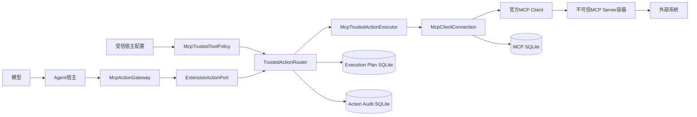
```mermaid
flowchart LR
    Model[模型] --> Agent[Agent宿主]
    Agent --> Gateway[McpActionGateway]
    Host[受信宿主配置] --> Policy[McpTrustedToolPolicy]
    Policy --> Router[TrustedActionRouter]
    Gateway --> Port[ExtensionActionPort]
    Port --> Router
    Router --> Executor[McpTrustedActionExecutor]
    Executor --> Connection[McpClientConnection]
    Connection --> SDK[官方MCP Client]
    SDK --> Container[不可信MCP Server容器]
    Connection --> MCPDB[(MCP SQLite)]
    Router --> PlanDB[(Execution Plan SQLite)]
    Router --> AuditDB[(Action Audit SQLite)]
    Container --> External[外部系统]
```

### 7.1 图示说明

1. 模型只向Gateway提交当前可见的模型名称和参数；它不持有SDK Client；
2. 宿主把远端Tool与可信Effect、Risk、资源和Recovery策略绑定；
3. `ExtensionActionPort`固定`source="mcp"`和`source_id=server_id`，阻止扩展跨来源访问Plan；
4. Router先持久化计划和审批事实，再调用MCP Executor；
5. Connection负责协议目录新鲜度、结果边界和连接状态，不决定用户权限；
6. 三个数据库分别拥有连接目录、执行计划和Action审计，没有跨库原子提交；
7. 第三方Server位于强Container内，但其可能调用的外部系统仍需由网络策略和Tool权限约束。

### 7.2 源码映射

- Gateway与Executor：[`mcp/actions.py`](../../src/harnessix/mcp/actions.py)中的`McpActionGateway`、`McpTrustedActionExecutor`；
- Connection与Target：[`mcp/runtime.py`](../../src/harnessix/mcp/runtime.py)中的`McpClientConnection`、`McpContainerStdioTarget`；
- Port与Router：[`trusted_actions/router.py`](../../src/harnessix/trusted_actions/router.py)中的`ExtensionActionPort`、`TrustedActionRouter`；
- 三类持久化：[`mcp/store.py`](../../src/harnessix/mcp/store.py)、[`execution/store.py`](../../src/harnessix/execution/store.py)、[`trusted_actions/store.py`](../../src/harnessix/trusted_actions/store.py)。

## 8. 包结构与依赖方向

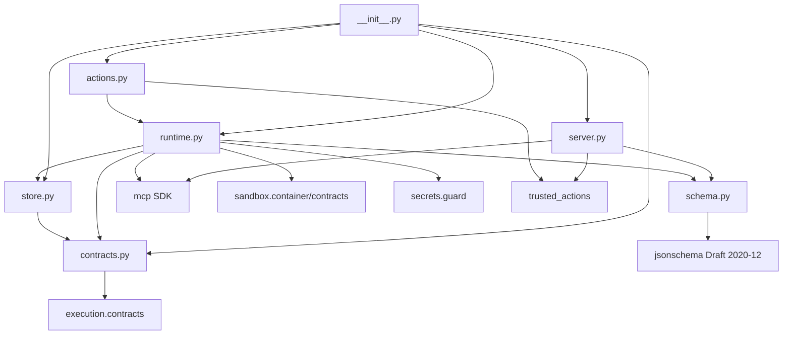
```mermaid
flowchart TD
    Contracts[contracts.py] --> ExecutionContracts[execution.contracts]
    Schema[schema.py] --> JsonSchema[jsonschema Draft 2020-12]
    Store[store.py] --> Contracts
    Runtime[runtime.py] --> Contracts
    Runtime --> Schema
    Runtime --> Store
    Runtime --> MCPSDK[mcp SDK]
    Runtime --> Sandbox[sandbox.container/contracts]
    Runtime --> Secrets[secrets.guard]
    Actions[actions.py] --> Runtime
    Actions --> Trusted[trusted_actions]
    Server[server.py] --> Schema
    Server --> Trusted
    Server --> MCPSDK
    Public[__init__.py] --> Contracts
    Public --> Store
    Public --> Runtime
    Public --> Actions
    Public --> Server
```

| 文件 | 主要职责 | 明确禁止承担的职责 |
|---|---|---|
| `contracts.py` | 版本化Server、Tool、Catalog、Connection和Result合同及摘要 | 网络I/O、SQLite、Policy |
| `schema.py` | JSON规范化、Schema/参数/结果边界和Draft 2020-12验证 | Tool授权、目录状态 |
| `store.py` | 目录快照、连接事件、当前投影、恢复和完整性校验 | SDK Client或Tool调用 |
| `runtime.py` | Target、SDK生命周期、目录捕获、调用前刷新、结果规范化 | 用户审批、Agent Session |
| `actions.py` | 宿主Policy、Trusted Action Definition、Executor和模型Gateway | 直接持久化Connection或批准计划 |
| `server.py` | 把显式低风险只读Action导出为本地MCP stdio Server | 网络监听、写Action、远端审批 |
| `__init__.py` | 公开稳定入口聚合 | 运行时装配 |

依赖方向保持“协议适配层依赖执行内核”，Trusted Action内核不反向依赖MCP。这允许其他扩展复用相同Policy和
UNKNOWN语义，也避免MCP SDK类型渗入核心领域合同。

## 9. 公共接口与装配边界

### 9.1 包级公开符号

[`mcp/__init__.py`](../../src/harnessix/mcp/__init__.py)公开：

- 合同：`MCP_PROTOCOL_VERSION`、`McpServerIdentity`、`McpToolSnapshot`、`McpCatalogSnapshot`、
  `McpConnectionEvent`、`McpConnectionSnapshot`、`McpToolCallOutput`；
- Schema：`McpToolArguments`、`validate_mcp_arguments`；
- Client：`McpContainerStdioTarget`、`McpInProcessTarget`、`McpClientConnection`；
- Store：`SQLiteMcpStore`；
- Action：`McpTrustedToolPolicy`、`McpActionGateway`、`build_mcp_action_definition`、
  `static_mcp_resource_resolver`；
- Server：`McpExportedTool`、`HarnessixMcpServer`。

`McpClientTarget`、`McpTrustedActionExecutor`、底层Schema边界函数和摘要辅助函数可从实现文件导入，但不在
包级`__all__`中，不能把它们视为已承诺的顶层公共API。

### 9.2 推荐显式装配顺序

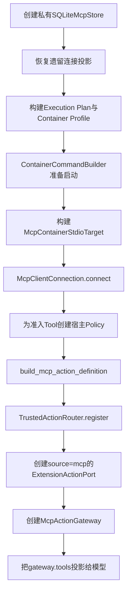
```mermaid
flowchart TD
    A[创建私有SQLiteMcpStore] --> B[恢复遗留连接投影]
    B --> C[构建Execution Plan与Container Profile]
    C --> D[ContainerCommandBuilder准备启动]
    D --> E[构建McpContainerStdioTarget]
    E --> F[McpClientConnection.connect]
    F --> G[为准入Tool创建宿主Policy]
    G --> H[build_mcp_action_definition]
    H --> I[TrustedActionRouter.register]
    I --> J[创建source=mcp的ExtensionActionPort]
    J --> K[创建McpActionGateway]
    K --> L[把gateway.tools投影给模型]
```

当前仓库没有完成上述步骤的默认产品工厂。部署方若漏掉Policy、Router或Port而直接调用
`McpClientConnection.call`，等同绕开用户审批；因此Connection是受信宿主内部协议能力，不应直接暴露给模型、
插件或远端请求处理器。

## 10. 外部协议与依赖版本

### 10.1 版本事实

| 项目 | 当前值 | 语义 |
|---|---|---|
| MCP研究基线 | 规范`2026-07-28` | 研究与合同常量的目标协议版本 |
| `MCP_PROTOCOL_VERSION` | `2026-07-28` | 导出的合同常量；当前Runtime不强制协商值等于该常量 |
| Python依赖范围 | `mcp>=2.2,<3` | 安装合同 |
| 锁定测试版本 | `mcp==2.2.0` | 当前直接验证版本 |
| Client模式 | `mode="auto"` | 由SDK选择现代Discover或兼容旧协议 |
| Cache | `cache=None`且列表显式`cache_mode="bypass"` | 目录每次权威读取，不使用SDK缓存 |

关键限制：`_capture_catalog`持久化`client.protocol_version`，但不与`MCP_PROTOCOL_VERSION`比较。因此当前代码允许
SDK auto模式协商到其他版本；这是一项兼容策略，而不是“只接受2026-07-28”的强约束。SDK升级必须重新验证
Client、Tool、结果和stdio关闭行为。

### 10.2 当前使用的MCP方法

| 协议能力 | 使用位置 | 当前行为 |
|---|---|---|
| 连接/Discover | `Client.__aenter__` | 在启动Timeout内完成 |
| `tools/list` | `_capture_catalog` | 全分页、绕过缓存、限制页数和数量 |
| `tools/call` | `McpClientConnection.call` | 允许SDK返回`input_required`，但Harnessix明确拒绝 |
| stdio transport | `McpContainerStdioTarget`、`HarnessixMcpServer` | 已实现 |
| in-process | `McpInProcessTarget` | 仅受信宿主/测试 |
| Streamable HTTP | 无Target | 未实现 |
| Resources/Prompts | 无消费路径 | 未实现 |
| Notification/Subscription | 无处理路径 | 未实现 |

## 11. 核心类与生命周期

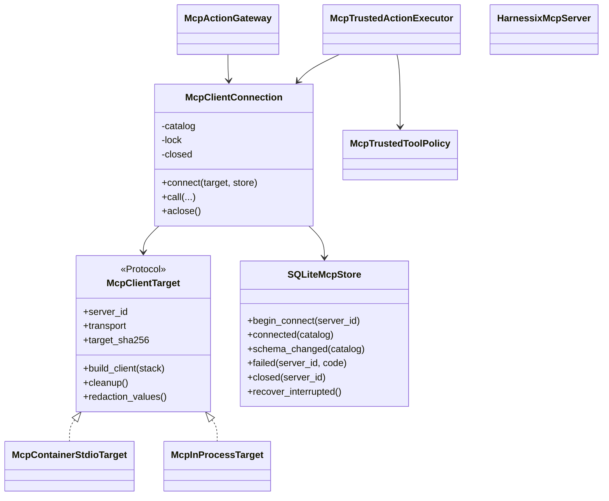
```mermaid
classDiagram
    class McpClientTarget {
      <<Protocol>>
      +server_id
      +transport
      +target_sha256
      +build_client(stack)
      +cleanup()
      +redaction_values()
    }
    class McpContainerStdioTarget
    class McpInProcessTarget
    class McpClientConnection {
      -catalog
      -lock
      -closed
      +connect(target, store)
      +call(...)
      +aclose()
    }
    class SQLiteMcpStore {
      +begin_connect(server_id)
      +connected(catalog)
      +schema_changed(catalog)
      +failed(server_id, code)
      +closed(server_id)
      +recover_interrupted()
    }
    class McpTrustedToolPolicy
    class McpTrustedActionExecutor
    class McpActionGateway
    class HarnessixMcpServer
    McpClientTarget <|.. McpContainerStdioTarget
    McpClientTarget <|.. McpInProcessTarget
    McpClientConnection --> McpClientTarget
    McpClientConnection --> SQLiteMcpStore
    McpTrustedActionExecutor --> McpClientConnection
    McpTrustedActionExecutor --> McpTrustedToolPolicy
    McpActionGateway --> McpClientConnection
```

| 类/组件 | 生命周期与状态所有权 | 并发约束 | 直接依赖 | 禁止依赖/暴露 |
|---|---|---|---|---|
| `McpContainerStdioTarget` | 不可变；持有已准备Container启动合同 | 可读取；cleanup委托线程 | Sandbox Builder、Execution、Profile | 不接受任意裸命令 |
| `McpInProcessTarget` | 不可变；持有受信Server引用 | 由SDK/事件循环约束 | MCP低层Server | 不应用于第三方模块 |
| `McpClientConnection` | 一个Server的一次活动SDK连接、内存目录与关闭标志 | 单`asyncio.Lock`串行刷新、调用和关闭 | Target、Store、SDK Client | 不暴露给模型或不可信扩展 |
| `SQLiteMcpStore` | 一个SQLite连接；拥有目录、事件和投影 | SQLite事务/CAS；Python对象本身未声明线程安全 | `sqlite3`、合同 | 不拥有外部进程 |
| `McpTrustedToolPolicy` | 宿主构造的不可变Policy | 无可变状态 | Trusted Action类型 | 不从Annotation推导 |
| `McpTrustedActionExecutor` | 闭包绑定Connection、Catalog、Tool、Policy | 受Router和Connection约束 | Connection | 不决定审批 |
| `McpActionGateway` | 绑定Connection和来源隔离Port | 无内部锁 | Connection、Port | 不提供`decide/events` |
| `HarnessixMcpServer` | 一个低层stdio Server与静态导出白名单 | SDK Server调度；Port为权威 | MCP SDK、Extension Port | 不监听网络、不导出写Tool |

## 12. Target合同

### 12.1 `McpClientTarget`

| 字段/方法 | 输入/输出 | 前置条件 | 失败与敏感信息 |
|---|---|---|---|
| `server_id` | 稳定字符串 | 首字符字母，总长1～256，只含字母数字`_.-` | 进入Store主键与模型名称，可能暴露拓扑 |
| `transport` | 三值合同 | 实现必须与真实Transport一致 | 当前无HTTP实现 |
| `target_sha256` | 64位摘要 | 必须绑定目标身份和启动事实 | 不是签名或认证凭据 |
| `startup_timeout_seconds` | 0.1～3600秒 | 构造时校验 | 连接与目录捕获各自使用一次该上限 |
| `call_timeout_seconds` | 0.1～3600秒 | 构造时校验 | 目录刷新和Tool调用各自使用一次该上限 |
| `build_client` | 返回官方`Client` | 调用者提供`AsyncExitStack` | 不得把Secret写入错误正文 |
| `cleanup` | 异步清理目标 | 需可重复判定目标是否残留 | 失败转`mcp_process_cleanup_failed` |
| `redaction_values` | 精确Secret字节元组 | 只在结果边界消费 | 不持久化值 |

### 12.2 Container stdio Target

构造时同时核对：

1. Prepared Launch的Execution摘要等于`ContainerExecutionSpec.digest`；
2. Prepared Launch和Execution Command的Profile摘要均等于`ContainerSandboxProfile.digest`；
3. Prepared Container名称等于Builder按Execution推导的名称；
4. argv非空；
5. Network模式属于`none/limited/restricted/full`；
6. 启动和调用Timeout位于合同范围。

`target_sha256`绑定Transport、Server ID、完整argv、Plan Fingerprint、Profile摘要和Execution摘要。SDK启动参数来自
Prepared Launch的物化环境；stderr当前写入`os.devnull`，因此不会进入stdout协议帧，也不会保留诊断日志。
关闭后调用`ContainerCommandBuilder.cleanup_container`，以Container执行身份清理残留。

### 12.3 In-process Target

`McpInProcessTarget`接受官方低层`Server`或`MCPServer`和调用方提供的64位实现摘要。它没有Sandbox摘要、网络
模式、外部清理和脱敏值。实现摘要只绑定调用方声明，不会扫描或签名Python代码；任何不可信实现放入该Target
都会获得宿主进程权限。当前代码没有运行时开关强制阻止这种误装配。

## 13. 连接状态机

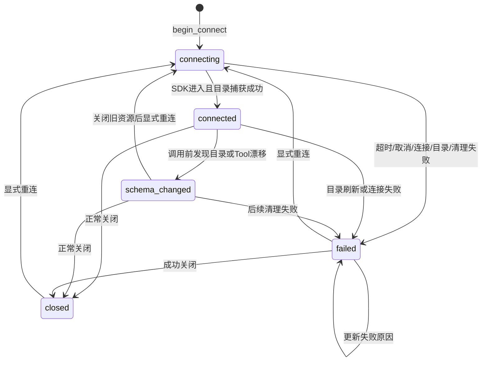
```mermaid
stateDiagram-v2
    [*] --> connecting: begin_connect
    connecting --> connected: SDK进入且目录捕获成功
    connecting --> failed: 超时/取消/连接/目录/清理失败
    connected --> schema_changed: 调用前发现目录或Tool漂移
    connected --> failed: 目录刷新或连接失败
    connected --> closed: 正常关闭
    schema_changed --> failed: 后续清理失败
    schema_changed --> closed: 正常关闭
    failed --> failed: 更新失败原因
    failed --> closed: 成功关闭
    failed --> connecting: 显式重连
    closed --> connecting: 显式重连
    schema_changed --> connecting: 关闭旧资源后显式重连
```

### 13.1 状态语义

| 状态 | 是否可调用 | 目录要求 | 错误码 | 恢复动作 |
|---|---:|---|---|---|
| `connecting` | 否 | 可无目录 | 禁止 | 等待connect完成；重启后转failed |
| `connected` | 是 | 必须有当前代次与摘要 | 禁止 | 正常调用或关闭 |
| `schema_changed` | 否 | 保存新目录 | 必须为`mcp_tool_schema_changed` | 关闭旧连接，重建Policy/Definition后重连 |
| `failed` | 否 | 可保留最近目录 | 必须有安全错误码 | 清理、诊断后关闭或重连 |
| `closed` | 否 | 保留历史目录 | 禁止 | 可开始新连接代次 |

`failed()`允许从`failed`再次进入`failed`，用于把后续清理失败等更保守事实追加到事件链。
`recover_interrupted()`只把遗留`connecting/connected`按Server ID顺序转成`failed(mcp_host_interrupted)`；它不接管
旧SDK会话、不复用PID，也不证明Container残留已清理。

`begin_connect()`允许Store投影从`failed/closed/schema_changed`开始新连接，但它无法判断旧Connection对象或SDK资源
是否已经关闭。宿主必须先调用旧Connection的关闭/残留清理，再创建新Connection；当前代码没有以资源Owner或
活动连接注册表强制这一顺序。

## 14. 连接建立正常流程

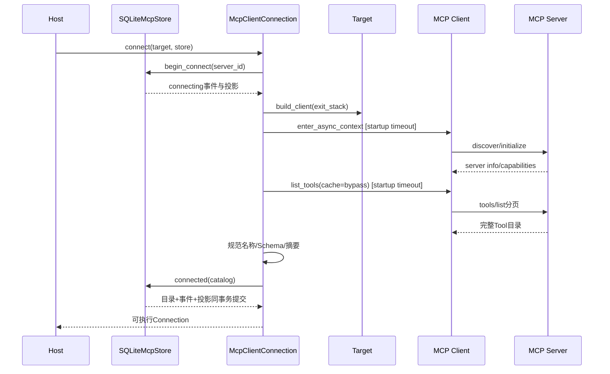
```mermaid
sequenceDiagram
    participant H as Host
    participant S as SQLiteMcpStore
    participant C as McpClientConnection
    participant T as Target
    participant SDK as MCP Client
    participant R as MCP Server
    H->>C: connect(target, store)
    C->>S: begin_connect(server_id)
    S-->>C: connecting事件与投影
    C->>T: build_client(exit_stack)
    C->>SDK: enter_async_context [startup timeout]
    SDK->>R: discover/initialize
    R-->>SDK: server info/capabilities
    C->>SDK: list_tools(cache=bypass) [startup timeout]
    SDK->>R: tools/list分页
    R-->>SDK: 完整Tool目录
    C->>C: 规范名称/Schema/摘要
    C->>S: connected(catalog)
    S-->>C: 目录+事件+投影同事务提交
    C-->>H: 可执行Connection
```

### 14.1 顺序和Timeout含义

`connect`先提交`connecting`事实，再创建Client。SDK上下文进入和目录捕获分别套用一次Startup Timeout，因此最坏
墙钟时间不是单个Timeout，而可能接近两倍Startup Timeout，再加失败清理。失败清理中的SDK Stack关闭和Target
cleanup也分别有10秒上限。

只有`store.connected(catalog)`提交成功后，Connection才返回给调用者。Store异常可能覆盖已经建立的SDK资源处理
结果；当前实现没有把连接事实与外部进程生命周期放入同一事务。

## 15. 连接建立失败与恢复

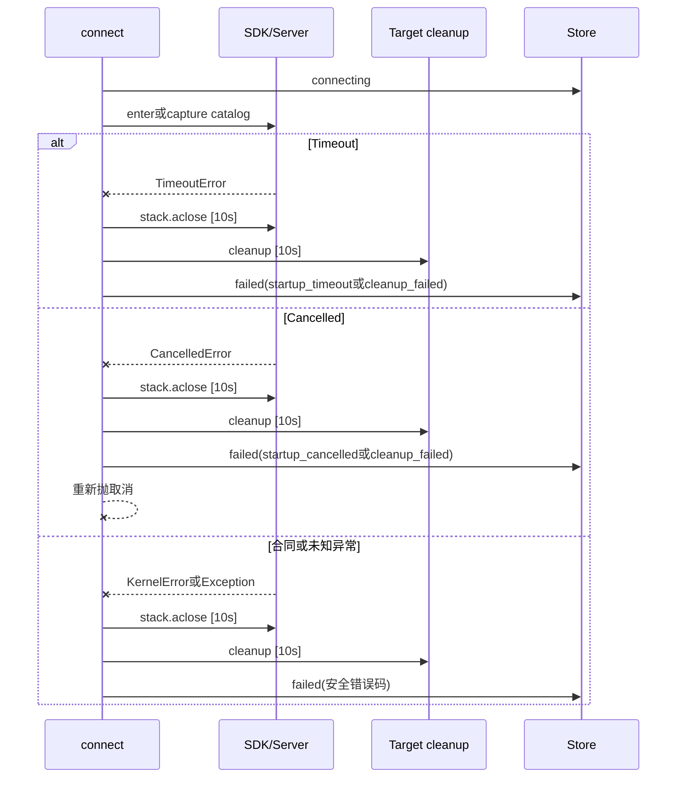
```mermaid
sequenceDiagram
    participant C as connect
    participant SDK as SDK/Server
    participant T as Target cleanup
    participant S as Store
    C->>S: connecting
    C->>SDK: enter或capture catalog
    alt Timeout
        SDK--xC: TimeoutError
        C->>SDK: stack.aclose [10s]
        C->>T: cleanup [10s]
        C->>S: failed(startup_timeout或cleanup_failed)
    else Cancelled
        SDK--xC: CancelledError
        C->>SDK: stack.aclose [10s]
        C->>T: cleanup [10s]
        C->>S: failed(startup_cancelled或cleanup_failed)
        C--xC: 重新抛取消
    else 合同或未知异常
        SDK--xC: KernelError或Exception
        C->>SDK: stack.aclose [10s]
        C->>T: cleanup [10s]
        C->>S: failed(安全错误码)
    end
```

| 失败点 | 持久状态 | 对外错误 | 可否直接重试 |
|---|---|---|---|
| SDK进入或目录发现超时 | `failed(mcp_startup_timeout)` | 可重试Kernel错误 | 先确认无残留，再显式重连 |
| 启动取消 | `failed(mcp_startup_cancelled)` | 原取消重新抛出 | 不自动重试 |
| Schema/目录非法 | `failed(具体mcp_*代码)` | 原Kernel错误 | 修复/更换Server后重连 |
| SDK未知异常 | `failed(mcp_connection_failed)` | 安全可重试错误 | 需诊断目标状态 |
| 任一清理失败 | `failed(mcp_process_cleanup_failed)` | 清理失败优先 | 禁止直接启动同身份目标 |
| Store写失败 | 可能只留下先前投影 | 原Store/SQLite异常 | 当前缺少统一补偿，需人工诊断 |

## 16. 目录捕获与模型名称

### 16.1 捕获算法

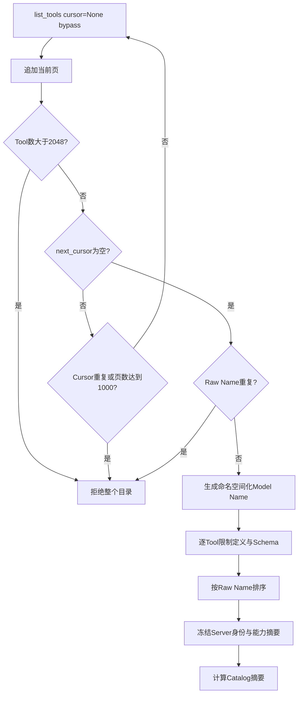
```mermaid
flowchart TD
    A[list_tools cursor=None bypass] --> B[追加当前页]
    B --> C{Tool数大于2048?}
    C -- 是 --> X[拒绝整个目录]
    C -- 否 --> D{next_cursor为空?}
    D -- 否 --> E{Cursor重复或页数达到1000?}
    E -- 是 --> X
    E -- 否 --> A
    D -- 是 --> F{Raw Name重复?}
    F -- 是 --> X
    F -- 否 --> G[生成命名空间化Model Name]
    G --> H[逐Tool限制定义与Schema]
    H --> I[按Raw Name排序]
    I --> J[冻结Server身份与能力摘要]
    J --> K[计算Catalog摘要]
```

### 16.2 目录限制

| 限制 | 当前值 | 超限结果 |
|---|---:|---|
| 列表页数 | 最多1000页 | `mcp_catalog_invalid` |
| Tool总数 | 最多2048 | `mcp_catalog_invalid` |
| 单Tool完整定义JSON | 最多256 KiB | `mcp_catalog_invalid` |
| Raw Name | 1～256字符 | 目录合同拒绝 |
| 模型名称 | 1～256字符且符合`[A-Za-z][A-Za-z0-9_.-]*` | 目录合同拒绝 |
| 描述 | 最多16,384字符 | 目录合同拒绝 |
| Annotation条目 | 最多64项 | 目录合同拒绝 |
| 输入/输出Schema | 每份最多128 KiB、32层、2048节点 | `mcp_tool_schema_invalid` |

当前没有“整个Catalog编码后总字节数”上限。2048个各自接近定义上限的Tool可造成较大的内存、SQLite写入和
每次调用前刷新成本；这是现行容量缺口，不能用单项限制替代总预算。

### 16.3 名称算法

1. 对Server ID与Raw Name中的非`A-Za-z0-9_.-`字符替换为下划线；
2. 空值或非字母开头时添加`x_`；
3. 组合成`mcp__<sanitized-server>__<sanitized-tool>`；
4. 若名称唯一且长度不超过256，直接采用；
5. 若规范化冲突或过长，截取前241字符并追加`__`与Raw Name SHA-256前12位；
6. 若最终仍不唯一，拒绝整个目录。

排序和Hash后缀保证同一输入目录产生稳定名称，但不能防止恶意Server选择名称干扰模型语义；宿主仍需决定哪些
Tool可见。

## 17. Server身份、Tool和Catalog摘要

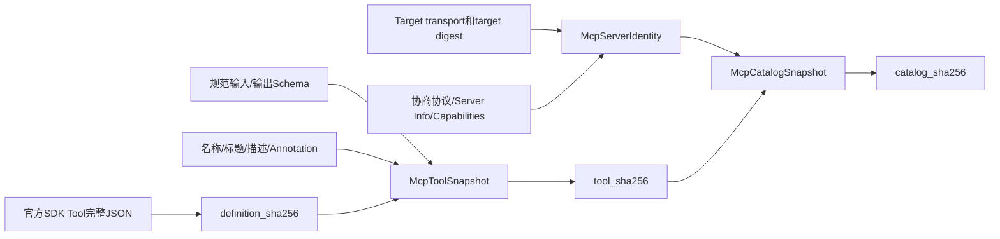
```mermaid
flowchart LR
    Target[Target transport和target digest] --> Identity[McpServerIdentity]
    Negotiated[协商协议/Server Info/Capabilities] --> Identity
    RawTool[官方SDK Tool完整JSON] --> Definition[definition_sha256]
    Schema[规范输入/输出Schema] --> Tool[McpToolSnapshot]
    Display[名称/标题/描述/Annotation] --> Tool
    Definition --> Tool
    Tool --> ToolDigest[tool_sha256]
    Identity --> Catalog[McpCatalogSnapshot]
    ToolDigest --> Catalog
    Catalog --> CatalogDigest[catalog_sha256]
```

### 17.1 摘要范围

| 摘要 | 包含 | 故意不包含 | 安全含义 |
|---|---|---|---|
| `target_sha256` | Transport和Target实现定义的目标绑定 | 运行时连接状态 | 变更检测，不是目标认证 |
| `definition_sha256` | 官方SDK Tool按Alias导出的完整非空JSON | 无单独例外 | 捕获SDK可见原定义 |
| `tool_sha256` | Tool快照除自身摘要外全部字段 | 自身摘要 | 绑定名称、Schema、描述和Annotation |
| `catalog_sha256` | 完整Server Identity与排序Tool快照 | `generation`、`captured_at` | 相同语义目录跨重连可比较 |
| Event `digest` | 事件除自身摘要外全部字段，含前序摘要 | 自身摘要 | 检测顺序或正文损坏 |

Hash链和摘要可以检测非一致修改，但数据库写权限攻击者可重算全部摘要。真实性仍依赖文件权限、宿主信任和后续
发行签名；当前没有HMAC、签名或外部锚点。

## 18. JSON Schema与参数合同

### 18.1 输入Schema

[`validate_mcp_input_schema`](../../src/harnessix/mcp/schema.py)执行：

1. 规范JSON编码/解码，拒绝非JSON对象、NaN、Infinity、递归和非法Unicode；
2. 限制128 KiB、32层和2048节点；
3. 要求根`type`严格为`object`；
4. `$schema`缺省或只允许Draft 2020-12两个规范URI；
5. 拒绝`pattern`、`patternProperties`、`$id`和外部`$ref`；
6. 对每个对象键限制16 KiB、每个字符串限制64 KiB；
7. 调用`Draft202012Validator.check_schema`确认元Schema合法。

本地`$ref`允许进入捕获Schema；如果解析失败，参数验证阶段统一返回`tool_invalid_arguments`。正则关键字被整体
关闭是为避免不可控正则成本，不代表JSON Schema其他关键字已经具备独立性能证明。

### 18.2 参数验证

| 属性 | 当前合同 |
|---|---|
| 根类型 | JSON对象 |
| 最大编码大小 | 256 KiB |
| 最大深度 | 64 |
| 最大节点 | 10,000 |
| 非有限浮点 | 拒绝 |
| Schema版本 | 捕获时的Draft 2020-12 Schema |
| 错误码 | `tool_invalid_arguments` |
| 输出类型 | 冻结、strict的`McpToolArguments` RootModel |

Plan阶段通过Definition的显式Decoder验证参数。持久化后执行路径要求参数模型类型仍为`McpToolArguments`；统一
Router当前重开执行时使用Root Model合同还原，不再次调用自定义Decoder，这一通用行为详见
[Trusted Actions模块设计](trusted-actions.md)。因此MCP Schema再次验证主要发生在Plan，而Connection调用前的
防线是Catalog/Tool摘要复核。

## 19. 核心数据合同

### 19.1 `McpServerIdentity`

| 字段 | 类型/必填 | 来源 | 约束与含义 | 敏感/持久化/兼容 |
|---|---|---|---|---|
| `spec_version` | Literal/是 | 合同 | `harnessix.mcp-server-identity/v1` | Catalog JSON；破坏变更升版 |
| `server_id` | str/是 | 宿主Target | Store作用域与模型名称前缀 | 可能暴露拓扑；持久化 |
| `transport` | 三值/是 | Target | 当前运行Transport | 持久化；HTTP仅合同占位 |
| `target_sha256` | 64hex/是 | Target | 启动/实现绑定摘要 | 持久化，不是Secret |
| `protocol_version` | str/是 | SDK协商结果 | 1～64字符 | 持久化；不强等于常量 |
| `reported_name` | str?/否 | Server Info | 最多256字符 | 不可信显示信息 |
| `reported_version` | str?/否 | Server Info | 最多128字符 | 不可信显示信息 |
| `capabilities_sha256` | 64hex/是 | SDK能力JSON | 能力摘要 | 原能力正文不持久化 |

### 19.2 `McpToolSnapshot`

| 字段 | 来源 | 约束 | 作用 | 信任级别 |
|---|---|---|---|---|
| `raw_name` | Server | 1～256字符、目录唯一 | 协议调用身份 | 不可信 |
| `model_name` | Harnessix | 命名空间化、目录唯一 | Registry/模型身份 | 派生但非授权 |
| `title` | Server | 可空、最多1024字符 | 显示 | 不可信 |
| `description` | Server | 可空、最多16384字符 | 模型提示/显示 | 不可信，不决定Policy |
| `input_schema` | Server→规范化 | 对象根与资源限制 | 参数合同 | 不可信输入，捕获后冻结 |
| `output_schema` | Server→规范化 | 可空；同输入Schema限制 | 成功结构化结果验证 | 不可信输入，捕获后冻结 |
| `annotations` | Server→规范化 | 最多64项 | 目录信息 | 不可信，不决定Effect/Risk |
| `definition_sha256` | 完整Tool JSON | 64hex | 原始定义变化检测 | 派生 |
| `tool_sha256` | 快照 | 64hex且模型自校验 | Action Binding/调用新鲜度 | 派生 |

### 19.3 `McpCatalogSnapshot`

| 字段 | 约束 | 事实语义 |
|---|---|---|
| `server` | 完整Identity | 当前连接发现的目标身份 |
| `generation` | `>=1` | Store中该Server的不可变代次 |
| `captured_at` | 带时区墙钟 | 目录捕获时间；不参与目录摘要 |
| `tools` | Raw Name排序、两类名称唯一、最多2048 | 完整目录，不是增量 |
| `catalog_sha256` | 重算一致 | Server和Tools的语义摘要 |

### 19.4 Connection与Result合同

| 合同 | 重点字段 | 约束 |
|---|---|---|
| `McpConnectionEvent` | Server、序号、前后状态、目录摘要、错误码、前序摘要、时间、摘要 | 首事件无前序摘要；connected必须有目录；failed/schema_changed必须有错误码 |
| `McpConnectionSnapshot` | Server、状态、序号、代次、目录摘要、尾事件摘要、错误码、更新时间 | generation=0当且仅当无目录；状态和错误码一致 |
| `McpToolCallOutput` | `content`、`structured_content`、`is_error` | 内容最多256项；完整载荷先受1 MiB/64层/10000节点限制 |

所有合同继承冻结`ExecutionContract`；持久JSON必须通过Pydantic重新验证，不能把数据库正文当作可信对象。

## 20. SQLite持久化模型

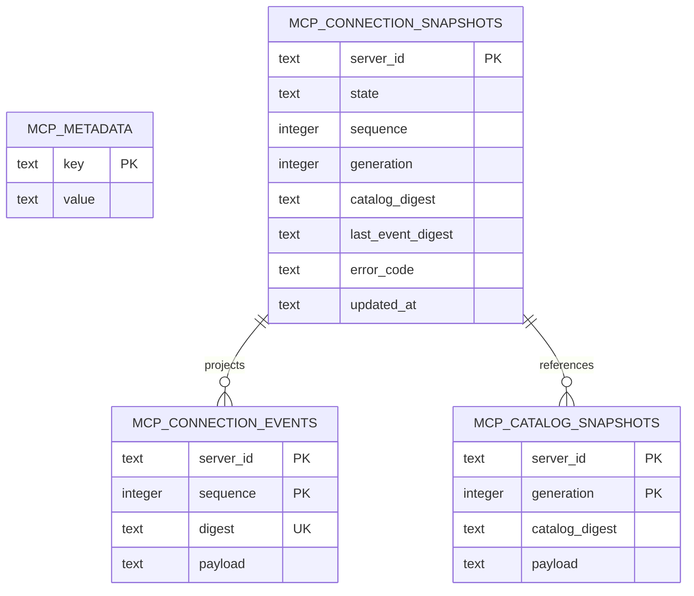
```mermaid
erDiagram
    MCP_METADATA {
      text key PK
      text value
    }
    MCP_CATALOG_SNAPSHOTS {
      text server_id PK
      integer generation PK
      text catalog_digest
      text payload
    }
    MCP_CONNECTION_SNAPSHOTS {
      text server_id PK
      text state
      integer sequence
      integer generation
      text catalog_digest
      text last_event_digest
      text error_code
      text updated_at
    }
    MCP_CONNECTION_EVENTS {
      text server_id PK
      integer sequence PK
      text digest UK
      text payload
    }
    MCP_CONNECTION_SNAPSHOTS ||--o{ MCP_CONNECTION_EVENTS : projects
    MCP_CONNECTION_SNAPSHOTS ||--o{ MCP_CATALOG_SNAPSHOTS : references
```

### 20.1 数据库配置

- `sqlite3.connect(..., isolation_level=None, timeout=5)`；
- `busy_timeout=5000`、`foreign_keys=ON`、`journal_mode=WAL`、`synchronous=FULL`；
- POSIX上父目录尝试`0700`、主数据库尝试`0600`；
- Schema版本存于`mcp_metadata`，当前只接受字符串`1`；
- 三张业务表均为SQLite `STRICT`表。

当前创建路径使用普通`Path.mkdir/chmod`和`sqlite3.connect`，没有`O_NOFOLLOW`、祖先链对象身份核验或打开前后
inode一致性检查；WAL/SHM文件也没有显式chmod。因此它不能替代Workspace模块的抗Symlink/Reparse Point打开端口。

### 20.2 事务写入顺序

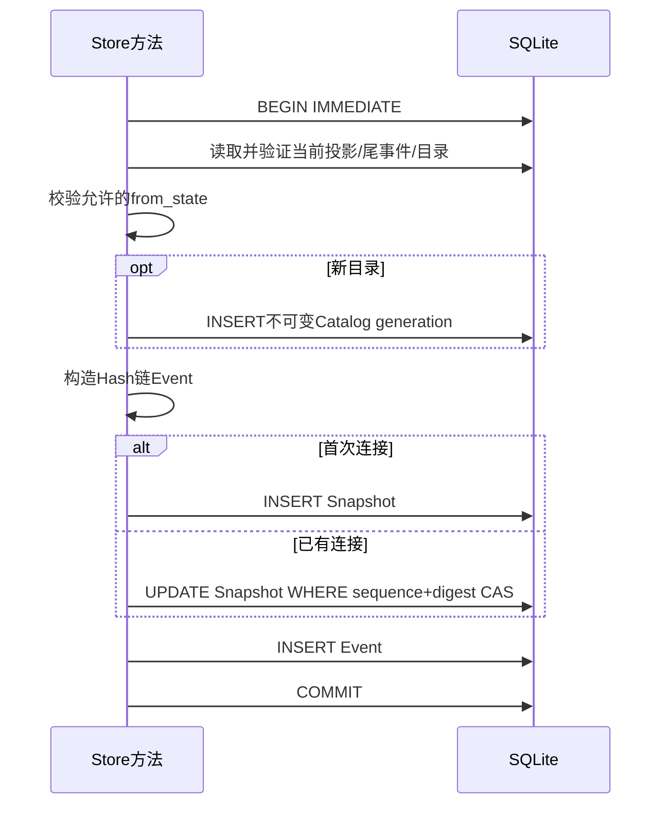
```mermaid
sequenceDiagram
    participant Caller as Store方法
    participant DB as SQLite
    Caller->>DB: BEGIN IMMEDIATE
    Caller->>DB: 读取并验证当前投影/尾事件/目录
    Caller->>Caller: 校验允许的from_state
    opt 新目录
        Caller->>DB: INSERT不可变Catalog generation
    end
    Caller->>Caller: 构造Hash链Event
    alt 首次连接
        Caller->>DB: INSERT Snapshot
    else 已有连接
        Caller->>DB: UPDATE Snapshot WHERE sequence+digest CAS
    end
    Caller->>DB: INSERT Event
    Caller->>DB: COMMIT
```

目录、事件和投影在单次状态转换内原子提交。CAS条件同时绑定旧序号与尾摘要；并发修改导致
`mcp_connection_state_conflict`。目录主键冲突或Event摘要唯一冲突映射为`mcp_catalog_conflict`。

## 21. 读取、完整性与恢复

| 操作 | 校验范围 | 复杂度与边界 |
|---|---|---|
| `load` | Snapshot字段、尾Event正文/摘要/状态/序号、当前Catalog摘要 | 读取当前投影与关联事实 |
| `catalog` | Pydantic合同、Server ID、Generation、数据库摘要 | 单代次读取；无分页 |
| `events` | 从序号1扫描全链、前序摘要、from/to状态、投影尾部 | O(事件总数)；无分页/保留策略 |
| `next_generation` | `MAX(generation)+1`类型 | 事务外调用时存在竞争，由插入冲突关闭 |
| `recover_interrupted` | 查找connecting/connected并逐个转failed | 每个Server独立事务，不是全批次原子恢复 |

Store不提供目录/事件删除、压缩、备份、导出、在线迁移或Schema校验和。调用`close()`后再次关闭是幂等的，
但其他方法没有统一的“Store已关闭”Kernel错误，底层SQLite `ProgrammingError`可能向上泄漏。

## 22. 调用前目录新鲜度与TOCTOU控制

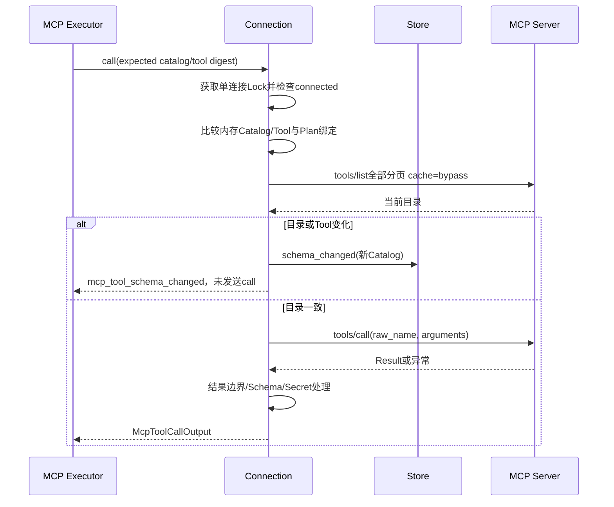
```mermaid
sequenceDiagram
    participant E as MCP Executor
    participant C as Connection
    participant S as Store
    participant R as MCP Server
    E->>C: call(expected catalog/tool digest)
    C->>C: 获取单连接Lock并检查connected
    C->>C: 比较内存Catalog/Tool与Plan绑定
    C->>R: tools/list全部分页 cache=bypass
    R-->>C: 当前目录
    alt 目录或Tool变化
        C->>S: schema_changed(新Catalog)
        C-->>E: mcp_tool_schema_changed，未发送call
    else 目录一致
        C->>R: tools/call(raw_name, arguments)
        R-->>C: Result或异常
        C->>C: 结果边界/Schema/Secret处理
        C-->>E: McpToolCallOutput
    end
```

同一`asyncio.Lock`覆盖完整目录刷新和实际调用，阻止本Connection中的另一个协程在两者之间刷新内存目录。
这缩小但不能消除分布式TOCTOU：Server仍可在返回`tools/list`后、处理`tools/call`前改变实现。不可变镜像和Target
摘要限制本地Container代码替换，但外部网络服务行为仍可能变化。

调用前检查有两层：

1. 预期Catalog/Tool摘要必须等于Connection当前内存快照，否则`mcp_tool_contract_changed`；
2. 权威刷新后的完整目录和目标Tool必须仍等于预期，否则保存新代次并进入`schema_changed`。

## 23. Tool调用结果处理

### 23.1 正常结果数据流

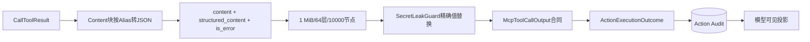
```mermaid
flowchart LR
    SDK[CallToolResult] --> Dump[Content块按Alias转JSON]
    Dump --> Payload[content + structured_content + is_error]
    Payload --> Bound1[1 MiB/64层/10000节点]
    Bound1 --> Guard[SecretLeakGuard精确值替换]
    Guard --> Contract[McpToolCallOutput合同]
    Contract --> Action[ActionExecutionOutcome]
    Action --> Audit[(Action Audit)]
    Audit --> Model[模型可见投影]
```

如果Tool声明`output_schema`且结果不是`is_error`，Connection在规范化前要求`structured_content`为JSON对象并按
捕获Schema验证。MCP SDK 2.2.0的`CallToolResult.structured_content`类型本身是`Any`，Harnessix的对象根约束来自
自己的Schema函数，而不是SDK自动保证。

结果先完成总大小和结构限制，再替换Target提供的精确Secret值，最后重新验证`McpToolCallOutput`。替换覆盖值，
不扫描对象键；未知Secret、编码/分片/派生值以及In-process Target的任意敏感信息不会自动命中。

### 23.2 结果上限

| 项目 | 当前限制 | 发生阶段 |
|---|---:|---|
| 整体规范JSON | 1 MiB | 脱敏前与辅助结果边界 |
| 深度 | 64 | 脱敏前 |
| 节点 | 10,000 | 脱敏前 |
| Content块数 | 256 | `McpToolCallOutput`合同 |
| 对象键 | 16 KiB | 通用JSON树检查 |
| 字符串 | 64 KiB | 通用JSON树检查 |

当前不把超大结果外置为Artifact，也没有面向模型的摘要或截断协议；超限直接失败。对写Tool而言，结果边界失败
发生在外部调用之后，因此进入UNKNOWN，而不是假设写入未发生。

## 24. 调用失败分类

### 24.1 Connection层

| 失败 | 是否可能After-send | Connection投影 | 抛出 |
|---|---:|---|---|
| 关闭/非connected | 否 | 不变 | `KernelError` |
| 绑定与内存快照不一致 | 否 | 不变 | `mcp_tool_contract_changed` |
| 目录刷新超时 | 否 | `failed(mcp_catalog_timeout)` | 可重试`KernelError` |
| 目录刷新异常/非法 | 否 | `failed` | 安全`KernelError` |
| 发现目录漂移/Tool移除 | 否 | `schema_changed`并保存新目录 | `mcp_tool_schema_changed` |
| `input_required` | 是 | 当前保持connected | `McpCallAfterSendError` |
| Tool调用Timeout | 是 | 当前保持connected | `mcp_tool_timeout` |
| 结果Schema/边界非法 | 是 | 通常保持connected | 对应After-send错误 |
| SDK连接丢失 | 是 | `failed(mcp_connection_failed)` | `mcp_tool_connection_lost` |
| 协程取消 | 可能 | Connection投影当前不变 | 原`CancelledError` |

`call`中的`RuntimeError`在存在`output_schema`时统一分类为`mcp_result_schema_invalid`，不会把Connection标为failed；
这可能把SDK其他Runtime错误误归为结果Schema问题，是当前错误分类风险。

### 24.2 Trusted Action层

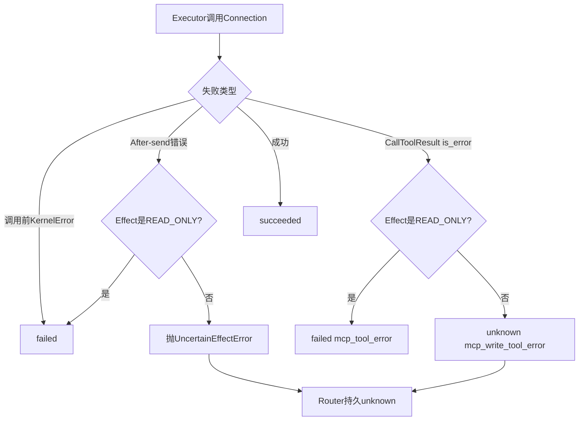
```mermaid
flowchart TD
    A[Executor调用Connection] --> B{失败类型}
    B -- 调用前KernelError --> F[failed]
    B -- After-send错误 --> E{Effect是READ_ONLY?}
    E -- 是 --> F
    E -- 否 --> U[抛UncertainEffectError]
    B -- CallToolResult is_error --> I{Effect是READ_ONLY?}
    I -- 是 --> F2[failed mcp_tool_error]
    I -- 否 --> U2[unknown mcp_write_tool_error]
    B -- 成功 --> S[succeeded]
    U --> R[Router持久unknown]
    U2 --> R
```

只读Tool可在After-send失败后确定本次Action没有需要恢复的写效果，因此收敛到`failed`。非只读Tool无法凭本地
Timeout、断连、错误结果或输出验证失败证明外部效果不存在，Executor抛`UncertainEffectError`，由Router持久化
`unknown`并只允许Reconcile。

## 25. 宿主可信Policy

`McpTrustedToolPolicy`包含：

| 字段 | 来源 | 规则 | 进入何处 |
|---|---|---|---|
| `raw_name` | 宿主白名单 | 构建Definition时必须存在于目录 | 选择冻结Tool |
| `effect_class` | 宿主 | 不能从Annotation推导 | Trusted Binding与失败语义 |
| `risk_level` | 宿主 | 由统一Policy消费 | 审批决策 |
| `recovery_mode` | 宿主 | 只读=`none`；写=`external_reconcile` | Execution Plan与恢复 |
| `resolve` | 宿主函数 | 把已校验参数映射为规范资源 | 资源级Policy/锁/审计 |
| `reconcile` | 宿主函数/可空 | 只读必须空；写必须存在 | UNKNOWN对账 |

构造时立即校验只读与写入恢复规则。`raw_name`存在性延迟到`build_mcp_action_definition`调用
`connection.tool()`时验证。Reconciler会收到原Connection、Plan和参数；接口本身没有技术手段禁止Reconciler再次
调用写Tool，因此“只观察、不重放”仍依赖宿主实现和测试。

## 26. MCP Tool到Trusted Action Definition

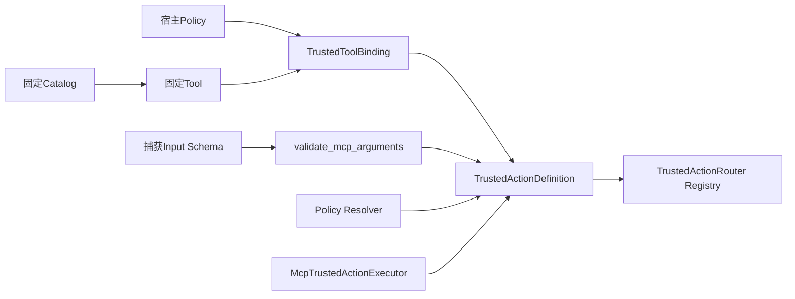
```mermaid
flowchart LR
    Catalog[固定Catalog] --> Tool[固定Tool]
    Policy[宿主Policy] --> Binding[TrustedToolBinding]
    Tool --> Binding
    Binding --> Definition[TrustedActionDefinition]
    ToolSchema[捕获Input Schema] --> Decoder[validate_mcp_arguments]
    Decoder --> Definition
    Resources[Policy Resolver] --> Definition
    Executor[McpTrustedActionExecutor] --> Definition
    Definition --> Registry[TrustedActionRouter Registry]
```

`build_mcp_action_definition`冻结以下事实：

- `source="mcp"`、`source_id=server_id`；
- Tool为模型名称，Version为`protocol.reportedVersion.toolDigestPrefix`并截断至128字符；
- Tool Fingerprint为完整`tool_sha256`；
- Input Schema摘要、Effect、Risk和Recovery；
- Executor ID绑定Server、Catalog与Tool摘要；
- 显式Input Schema和Decoder；
- Connection、目录摘要、Tool快照与宿主Policy的Executor闭包。

当前Definition和Connection在内存中绑定。目录漂移或重连后必须重建Definition；现有Router对重复Binding Key拒绝
注册，也没有注销/原子替换接口，因此同一Router进程内更新同名MCP Tool尚无正式重注册流程，通常需要创建新
Router或重启装配。这是动态MCP产品化前必须解决的生命周期缺口。

## 27. 模型侧Gateway

### 27.1 可见目录

`McpActionGateway.tools()`只返回以下交集：

1. Connection当前Catalog中的Tool；
2. 对应`ExtensionActionPort.bindings()`中存在相同模型名称的Binding；
3. Binding的Tool Fingerprint仍等于当前Tool摘要。

返回深拷贝快照，避免调用者修改Connection内存目录。未绑定Tool、旧摘要Tool和其他`source_id`的Tool均不进入
模型可见集合。

### 27.2 Gateway接口

| 方法 | 输入 | 输出 | 约束 |
|---|---|---|---|
| `tools()` | 无 | 当前可信Tool快照元组 | 不持久化，不执行网络调用 |
| `plan()` | Invocation ID、模型名、参数、可选幂等键 | `ActionRouteSnapshot` | 先确认唯一Binding与当前指纹 |
| `execute(plan_id)` | Plan ID | `ActionExecutionOutcome` | Port重核来源后委托Router |
| `reconcile(plan_id)` | Plan ID | `ActionExecutionOutcome` | 仅恢复路径 |

Gateway不提供`decide`、`events`或Approval主体接口；审批必须由宿主持有的Router/API完成。它也不轮询终态、不把
状态映射为模型消息，Agent宿主需负责编排`pending_approval`、`unknown`和终态。

## 28. 只读调用正常时序

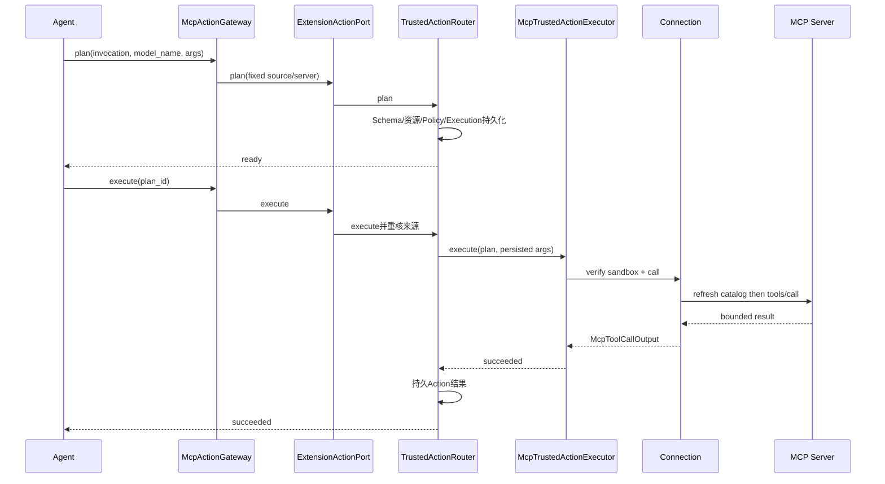
```mermaid
sequenceDiagram
    participant A as Agent
    participant G as McpActionGateway
    participant P as ExtensionActionPort
    participant R as TrustedActionRouter
    participant E as McpTrustedActionExecutor
    participant C as Connection
    participant M as MCP Server
    A->>G: plan(invocation, model_name, args)
    G->>P: plan(fixed source/server)
    P->>R: plan
    R->>R: Schema/资源/Policy/Execution持久化
    R-->>A: ready
    A->>G: execute(plan_id)
    G->>P: execute
    P->>R: execute并重核来源
    R->>E: execute(plan, persisted args)
    E->>C: verify sandbox + call
    C->>M: refresh catalog then tools/call
    M-->>C: bounded result
    C-->>E: McpToolCallOutput
    E-->>R: succeeded
    R->>R: 持久Action结果
    R-->>A: succeeded
```

读取Action无需Reconcile。若模型参数无效、资源解析失败、Policy拒绝或目录漂移，副作用前失败。Tool返回
`is_error`、Timeout、取消或结果非法时，Router将只读Action收敛到`failed`。

## 29. 写调用、审批与UNKNOWN

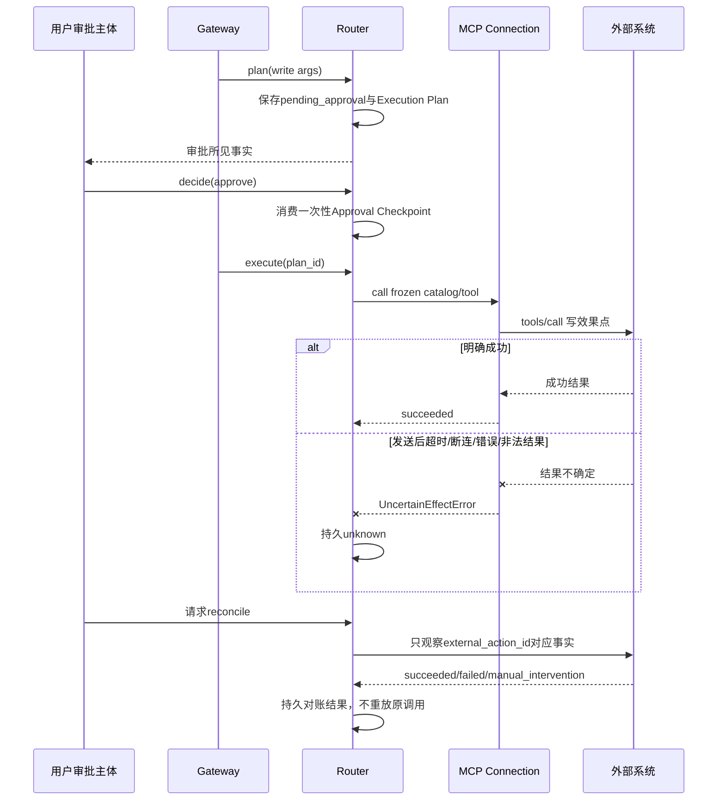
```mermaid
sequenceDiagram
    participant U as 用户审批主体
    participant G as Gateway
    participant R as Router
    participant C as MCP Connection
    participant X as 外部系统
    G->>R: plan(write args)
    R->>R: 保存pending_approval与Execution Plan
    R-->>U: 审批所见事实
    U->>R: decide(approve)
    R->>R: 消费一次性Approval Checkpoint
    G->>R: execute(plan_id)
    R->>C: call frozen catalog/tool
    C->>X: tools/call 写效果点
    alt 明确成功
        X-->>C: 成功结果
        C-->>R: succeeded
    else 发送后超时/断连/错误/非法结果
        X--xC: 结果不确定
        C--xR: UncertainEffectError
        R->>R: 持久unknown
    end
    U->>R: 请求reconcile
    R->>X: 只观察external_action_id对应事实
    X-->>R: succeeded/failed/manual_intervention
    R->>R: 持久对账结果，不重放原调用
```

`external_action_id`由统一Router按Invocation与Binding事实确定性生成，供Reconciler查询外部系统。MCP协议调用本身
没有注入该ID的通用字段；宿主若需要远端幂等，必须把业务幂等值纳入Tool参数/资源合同并由具体Server支持。

## 30. 取消语义

| 阶段 | 当前行为 | 持久结果 | 剩余风险 |
|---|---|---|---|
| Connect取消 | 尝试关闭SDK和Target，Store记`mcp_startup_cancelled`，重抛 | `failed` | Store写失败可覆盖取消收敛 |
| 调用前目录刷新取消 | Connection重抛，不改连接状态 | Action Router处理Executor取消 | Connection仍可能可用 |
| Tool调用取消 | Connection重抛，不改连接状态 | 只读=`failed(executor_cancelled)`；写=`unknown(cancelled_write_effect_unknown)` | Server调用是否继续由SDK/Transport决定 |
| 等待Connection Lock时取消 | `asyncio.Lock`等待取消 | Router按执行取消收敛 | 未取得锁，无MCP调用 |
| `aclose`等待Lock时取消 | 关闭未开始 | 无新增连接事件 | Connection仍可调用 |
| `_finish_close`中取消 | `CancelledError`不被`except Exception`捕获 | 可能停留connected且`_closed=True` | 后续`aclose`立即返回，清理无法重试 |

最后一项是当前高优先级生命周期缺口：`aclose`在执行实际清理前先设置`_closed=True`，且关闭分支不捕获
`CancelledError`。若Task在SDK Stack或Target cleanup中被取消，资源可能未完成清理，Store也可能未进入closed；再次
调用`aclose`因标志已置位而直接返回。当前测试未覆盖该路径。

## 31. Timeout与并发

### 31.1 Timeout预算

| 操作 | 上限 | 说明 |
|---|---:|---|
| SDK连接进入 | Startup Timeout，默认30秒 | 独立一次 |
| 首次目录捕获 | Startup Timeout，默认30秒 | 独立一次 |
| 调用前目录刷新 | Call Timeout，默认300秒 | 独立一次 |
| `tools/call` | Call Timeout，默认300秒 | SDK参数与外层`wait_for`双重约束 |
| SDK Stack关闭 | 固定10秒 | 不可由Target配置 |
| Target cleanup | 固定10秒 | 与Stack关闭分开 |

因此一次成功Tool调用的墙钟上限可能接近两倍Call Timeout；`aclose`获取Lock没有单独总上限，若前方有最长3600秒
的调用，关闭需先等待调用释放Lock，再执行两个10秒清理阶段。

### 31.2 并发模型

- 每个Connection有一个Lock；目录刷新、所有Tool调用和关闭全部串行；
- 不同Connection可并行，但若共享同一个Store和Server ID，会在状态/CAS上冲突；
- Store方法是同步SQLite调用，Connection在事件循环线程中直接调用，数据库阻塞会阻塞事件循环；
- `target.cleanup()`中的Container Builder通过`asyncio.to_thread`运行；
- Server端是否并发处理多个请求由官方SDK决定，Harnessix Server本身没有额外并发限制；
- 当前没有每Tool并发安全Annotation或读Tool并行调度。

## 32. Connection关闭与资源所有权

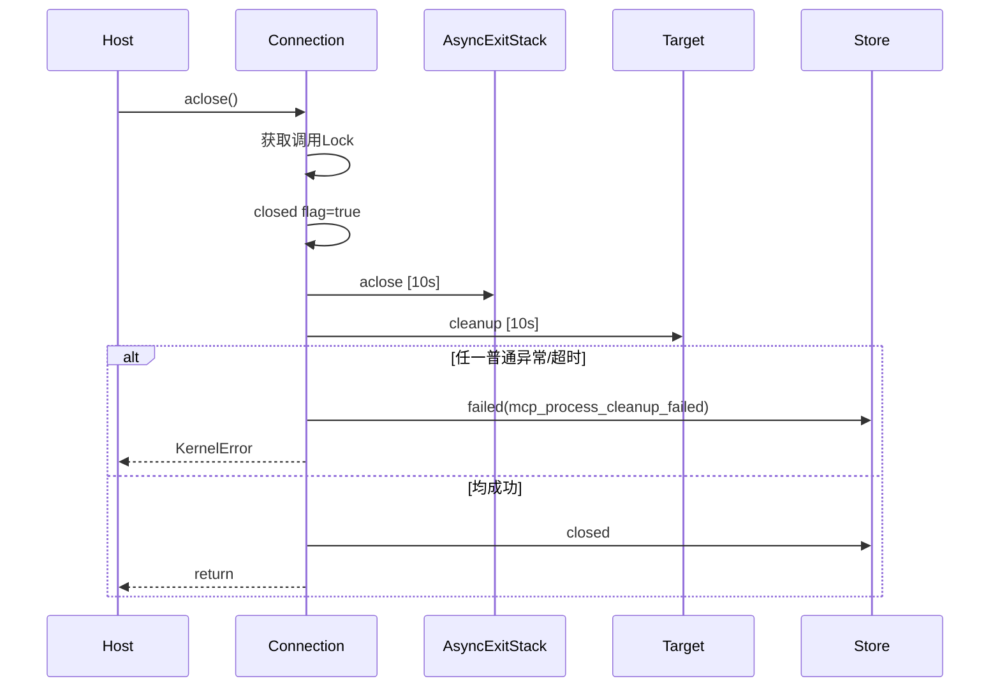
```mermaid
sequenceDiagram
    participant H as Host
    participant C as Connection
    participant SDK as AsyncExitStack
    participant T as Target
    participant S as Store
    H->>C: aclose()
    C->>C: 获取调用Lock
    C->>C: closed flag=true
    C->>SDK: aclose [10s]
    C->>T: cleanup [10s]
    alt 任一普通异常/超时
        C->>S: failed(mcp_process_cleanup_failed)
        C-->>H: KernelError
    else 均成功
        C->>S: closed
        C-->>H: return
    end
```

SDK Stack负责退出官方Client/stdio会话；Target cleanup负责按Container身份消除残留。两者都必须成功，才能把连接
投影为closed。普通异常被压缩为安全错误码，不保存第三方异常正文。Connection不会关闭传入的`SQLiteMcpStore`，
Store生命周期由宿主单独拥有。

除取消漏洞外，清理失败后`_closed=True`也导致同一Connection无法重试关闭；恢复需由外部Container身份扫描和新
宿主流程完成，而不是复用对象。

## 33. 可选MCP Server

### 33.1 导出边界

`HarnessixMcpServer`只接受非空、Public Name唯一的`McpExportedTool`白名单。每个导出项必须映射到当前Port中的
Binding，且同时满足：

- `effect_class=READ_ONLY`；
- `risk_level=LOW`；
- `recovery_mode="none"`；
- Binding Input Schema摘要等于公开Schema摘要。

这些条件在Server构造、每次`tools/list`和每次`tools/call`前重新验证。缺失Binding在列表中被隐藏，在调用中返回
安全`is_error`；漂移且仍存在的Binding会触发Kernel错误，调用路径转为安全Tool错误。

### 33.2 Server调用时序

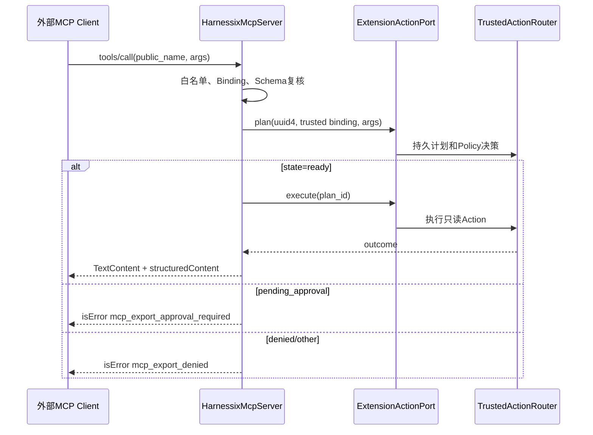
```mermaid
sequenceDiagram
    participant Client as 外部MCP Client
    participant S as HarnessixMcpServer
    participant P as ExtensionActionPort
    participant R as TrustedActionRouter
    Client->>S: tools/call(public_name, args)
    S->>S: 白名单、Binding、Schema复核
    S->>P: plan(uuid4, trusted binding, args)
    P->>R: 持久计划和Policy决策
    alt state=ready
        S->>P: execute(plan_id)
        P->>R: 执行只读Action
        R-->>S: outcome
        S-->>Client: TextContent + structuredContent
    else pending_approval
        S-->>Client: isError mcp_export_approval_required
    else denied/other
        S-->>Client: isError mcp_export_denied
    end
```

Server不会代替用户批准。即使错误地为导出Tool配置了需要审批的Policy，本次远端调用也只创建计划并返回错误，
不会自动执行。每次调用使用新UUID且不传业务幂等键，因此重复远端调用会创建不同计划；当前只允许只读Action，
避免由此产生写入重放问题。

### 33.3 公开结果和协议面

成功结果同时返回一个JSON文本Content块和原始有界`structured_content`；官方SDK 2.2.0允许结构化结果为任意JSON
值。Server未声明`output_schema`，也不输出Title、Annotation或分页Cursor，列表设置`ttl_ms=0`、
`cache_scope="private"`。默认Server版本字符串仍为`0.8.4`，与包版本`0.1.0`和路线图阶段不是同一版本源，调用方
应显式传入发行版本；后续需统一产品版本注入。

Server只提供`serve_stdio()`，stdout由协议独占。当前没有认证、OAuth、网络监听、主体映射、限流或多租户隔离，
不得把stdio直接桥接到公网或多用户Socket。

## 34. 错误码与重试建议

| 类别 | 代表错误码 | 是否重试 | 处理建议 |
|---|---|---|---|
| Target输入 | `mcp_server_id_invalid`、`mcp_target_invalid`、`mcp_sandbox_binding_invalid` | 否 | 修复受信配置 |
| 启动 | `mcp_startup_timeout`、`mcp_connection_failed` | 有条件 | 先确认清理和目标身份，再新建Connection |
| 清理 | `mcp_process_cleanup_failed` | 否 | 外部身份扫描和人工诊断 |
| 目录 | `mcp_catalog_invalid`、`mcp_tool_schema_invalid` | 否 | 拒绝该Server版本 |
| 漂移 | `mcp_tool_schema_changed`、`mcp_tool_contract_changed` | 否 | 重建Policy、Definition和Router装配 |
| 参数 | `tool_invalid_arguments`、`mcp_arguments_invalid` | 由模型修正 | 不发送Tool调用 |
| 调用 | `mcp_tool_timeout`、`mcp_tool_connection_lost` | 只读可新计划；写禁止重放 | 写入进入UNKNOWN并Reconcile |
| 结果 | `mcp_result_invalid`、`mcp_result_too_large`、`mcp_result_schema_invalid` | 只读可重试；写禁止重放 | 修复Server；写先对账 |
| Server导出 | `mcp_export_not_found`、`mcp_export_denied`、`mcp_export_approval_required` | 视本地状态 | 远端不能自行批准 |
| Store | `mcp_store_corrupt`、`mcp_store_version`、`mcp_connection_state_conflict` | 否/受控 | 停止调用并修复状态/升级路径 |

Agent通用`failure_category`把`mcp_`前缀归为Tool错误。SQLite原生异常并非全部转换为`KernelError`，因此宿主不应
假定所有Store故障都具有稳定MCP错误码。

## 35. 幂等、重试与对账

### 35.1 幂等层次

| 身份 | 作用域 | 当前来源 | 保证 |
|---|---|---|---|
| `server_id` | MCP Store | 宿主 | 连接事件与目录命名空间 |
| Catalog Generation | Server | Store递增 | 不可变目录历史 |
| Invocation ID | Agent/宿主 | 调用方 | 一次业务调用意图 |
| Plan ID | Trusted Action | Router | 一次执行计划 |
| External Action ID | Binding+Invocation | Router派生 | Reconcile观察键 |
| Business Idempotency Key | 租户/Tool | 可选调用方 | Router重复计划约束；不自动传入MCP协议 |

### 35.2 重试规则

1. 参数、Policy、Sandbox和Schema漂移失败发生在Pre-send，可修正后创建新计划；
2. 只读After-send失败可以按宿主重试策略创建新调用，但Connection为failed时必须重连；
3. 写After-send失败禁止自动重放，必须进入UNKNOWN并调用Reconciler；
4. Server返回`is_error=true`也不能证明写效果不存在；
5. Reconciler只能观察，不应再次调用原写Tool；
6. `input_required`不是可重试错误的持久交互，当前一律按After-send失败；
7. 目录变化后不能把旧Approval或Plan摘要复制到新Definition。

## 36. 跨数据库一致性

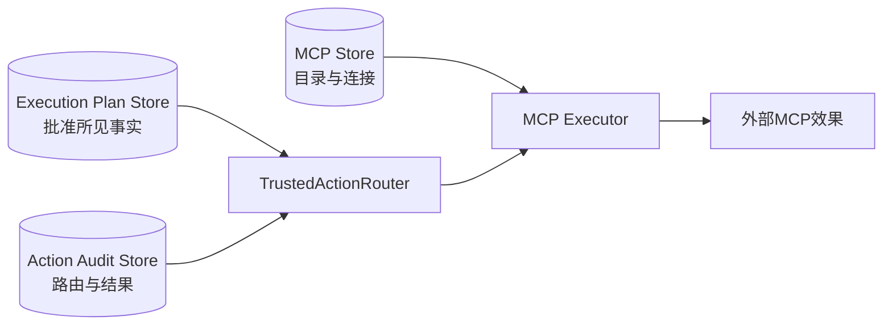
```mermaid
flowchart LR
    MCPDB[(MCP Store<br/>目录与连接)] --> Runtime[MCP Executor]
    PlanDB[(Execution Plan Store<br/>批准所见事实)] --> Router[TrustedActionRouter]
    AuditDB[(Action Audit Store<br/>路由与结果)] --> Router
    Router --> Runtime
    Runtime --> Remote[外部MCP效果]
```

当前不存在覆盖四个事实域的原子事务：

- MCP Store只证明调用时使用哪个连接/目录以及连接后来发生什么；
- Execution Plan Store证明执行绑定、Sandbox和Approval Checkpoint；
- Action Audit Store证明Route状态和执行/对账结果；
- 外部系统保存真正Tool效果。

崩溃恢复依赖保守状态而非分布式事务：遗留Connection转failed；遗留Running/Reconcile由Router转unknown；写Tool
只依赖External Action ID做外部观察。当前没有一个统一诊断视图按Plan ID关联MCP Catalog Generation和Connection
Event，需要上层根据Binding摘要和Server ID联查。

## 37. 安全边界

### 37.1 威胁与控制

| 威胁 | 当前控制 | 剩余风险 |
|---|---|---|
| 恶意描述/Annotation降权 | Policy完全由宿主构造 | 模型仍可能被描述诱导选择已准入Tool |
| Schema炸弹 | 字节、深度、节点、关键字和元Schema限制 | 无整个Catalog总预算；其他复杂Schema关键字未做独立成本分析 |
| 审批后Schema替换 | 调用前完整刷新并比较摘要 | 列表响应后至调用处理间仍有分布式TOCTOU |
| Server启动即越权 | 第三方stdio使用强Container Prepared Launch | Container Runtime为TCB；In-process误用无隔离 |
| 网络外传 | Profile网络模式和受管Egress绑定 | `full`模式可由宿主选择；当前无远端目标认证 |
| Secret结果泄漏 | 已知精确值JSON替换 | 未知、编码、派生、键名和In-process输出不覆盖 |
| 写Timeout盲重试 | UNKNOWN + External Reconcile | Reconciler只观察靠宿主纪律 |
| 目录/事件篡改 | 私有文件权限、Pydantic、摘要与Hash链 | 同UID/DB写权限攻击者可重算 |
| 导出审批绕过 | 仅低风险只读、非ready返回错误 | 无远端主体认证，不能扩展写Tool |
| stdout协议污染 | Container stderr丢弃，Server stdout仅协议 | 当前缺少安全stderr诊断留存 |

### 37.2 Secret生命周期

```mermaid
flowchart TD
    Ref[Secret引用] --> Provider[宿主Secret Provider]
    Provider --> Prepared[PreparedContainerLaunch内存环境]
    Prepared --> Process[MCP Container进程环境]
    Prepared --> Values[redaction_values内存副本]
    Process --> Result[Tool结果]
    Result --> Guard[精确值替换]
    Guard --> Action[Action结果]
    Action --> Model[模型/历史]
    Prepared -.不进入.-> Catalog[(Catalog SQLite)]
    Prepared -.不进入.-> Error[公开错误]
```

MCP模块不解析Secret Ref；它消费Sandbox层已经准备的启动环境与脱敏值。Secret不能进入argv、Catalog、错误正文或
诊断投影。Connection结束后Python字节副本没有显式内存擦除保证。

## 38. 隐私与数据分类

| 数据 | 可能内容 | 持久位置 | 当前最小化 |
|---|---|---|---|
| Server ID/版本 | 扩展名称、部署拓扑 | MCP Catalog/Connection | 完整保存以供绑定 |
| Tool描述/Schema/Annotation | 第三方文本、字段名、业务结构 | Catalog JSON | 全量保存；无字段脱敏 |
| Tool参数 | 用户输入、资源标识 | Execution Plan Store | 由Trusted Action合同保存；不复制到MCP Store |
| Tool结果 | 业务数据 | Action Audit/上层Session | 已知Secret替换；MCP Store不保存结果 |
| 错误 | 安全错误码 | MCP Event/Action Audit | 不保存第三方异常正文 |
| stderr | 第三方诊断 | 当前不保存 | 写入`os.devnull`，降低泄漏也降低可诊断性 |

目录可能包含业务敏感Schema和描述，备份、诊断导出和文件权限必须按用户私有数据处理。当前没有目录字段级加密或
保留期。

## 39. 供应链与许可

- Wire Protocol依赖官方`mcp`包，依赖范围与锁文件都必须进入升级评审；
- 第三方通知已经登记MCP Python SDK许可，发行物必须继续携带对应归属；
- Container Target要求上游Execution Plan绑定不可变镜像摘要，不能仅用浮动Tag；
- 当前模块不安装、下载或自动更新MCP Server；镜像/二进制来源验证由产品供应链承担；
- `implementation_digest`是In-process宿主声明，不是可执行代码签名；
- 远端Server身份、OAuth和证书固定尚未实现；
- 社区代码许可证不自动覆盖外部MCP Server、Tool内容或其输出，发行者需分别审计。

## 40. 可观测性

### 40.1 当前可观察事实

- MCP Store可读取Connection当前状态、Generation、目录摘要、错误码和完整事件链；
- Trusted Action Store可读取Plan、路由状态、执行结果和Reconcile结果；
- 安全错误使用稳定错误码，不持久化第三方异常正文；
- Catalog摘要可用于比较部署前后目录是否变化。

### 40.2 当前缺失

MCP包没有注入通用Telemetry端口，也没有统一结构化日志、Trace Span、Metric或跨数据库Correlation ID。当前无法从
标准观测后端直接回答：

1. 连接/目录发现/每Tool调用的延迟分位数；
2. Catalog大小、页数、Tool数和刷新频率；
3. Timeout、漂移、UNKNOWN和Reconcile成功率；
4. Container启动/清理耗时与残留数量；
5. Plan ID到MCP Connection Event的直接关联；
6. 某Provider请求选择了哪个MCP Tool和Catalog Generation。

后续接入不得记录原始参数、结果、Description、Schema、Secret或第三方异常；建议只记录Server ID的受控标签、
摘要前缀、Tool模型名的低基数映射、阶段、耗时和安全错误码。

## 41. 平台与部署

| 平台/路径 | 当前证据 | 支持结论 |
|---|---|---|
| macOS真实stdio子进程 | `test_stdio_faults.py`在平台矩阵运行 | SDK子进程Crash/Timeout/关闭路径有证据 |
| Linux Container stdio | 固定摘要镜像CI条件测试 | 强Container调用和正常无残留关闭有证据 |
| Windows真实stdio子进程 | Windows矩阵运行MCP确定性/子进程测试 | SDK基础stdio路径有证据 |
| Windows强Container MCP | 无独立真实Docker Desktop/WSL2证据 | 不能据Linux测试宣称完成 |
| 默认产品MCP | 无Product Config/agent-server接线 | 不是当前产品能力 |

部署必须把MCP SQLite、Execution Plan和Action Audit放在同一受信数据根的不同私有文件中，不得放进Workspace或
挂载给Container。Container不得获得Docker Socket、用户HOME、Session数据库、SSH目录或云凭据目录。默认网络
应为`none`；其他模式必须由宿主Policy和Sandbox合同显式允许。

## 42. 兼容与迁移

### 42.1 合同兼容

- 六类公共合同均为`v1`，字段破坏变更必须新增`spec_version`，不能原地改变旧JSON语义；
- `spec/`中的六份Schema由`generate_specs.py`生成，禁止手改；
- Catalog摘要覆盖Server和Tool合同，任何被覆盖字段变化都会使旧Binding失效；
- `captured_at`和Generation变化不使语义Catalog摘要变化；
- MCP Store只接受Schema版本`1`，没有自动迁移路径，版本不匹配失败关闭；
- Server默认版本参数不是统一发行版本源，调用者当前应显式提供。

### 42.2 SDK升级

升级`mcp`版本至少需要重新验证：

1. `Client`的`mode`、`read_timeout_seconds`、`cache`与Session API；
2. `list_tools(cursor, cache_mode)`分页结果和缓存语义；
3. `CallToolResult`、`InputRequiredResult`和Content块Pydantic字段；
4. stdio Client进程树与取消/关闭行为；
5. 低层Server的List/Call Handler签名；
6. 新协议版本中Tool Schema、Output Schema和Annotation字段；
7. 全部MCP直接测试及真实Container测试。

## 43. 核心业务伪代码

### 43.1 建立连接

```text
CONNECT(target, store):
  persist connecting event and projection
  create exit stack
  try:
    client := target.build_client(stack)
    enter client within startup timeout
    generation := store.next_generation(server)
    catalog := capture full bypass-cache catalog within startup timeout
    persist catalog + connected event + projection in one SQLite transaction
    return connection(target, store, stack, client, catalog)
  on cancellation:
    close SDK stack and cleanup target, each bounded
    persist failed(cleanup_failed else startup_cancelled)
    rethrow cancellation
  on timeout / contract / unknown error:
    close SDK stack and cleanup target, each bounded
    persist safe failed code; cleanup failure wins
    raise safe KernelError
```

### 43.2 捕获目录

```text
CAPTURE_CATALOG(client, target, generation):
  tools := []
  seen_cursors := {}
  repeat at most 1000 pages:
    page := list_tools(cursor, bypass cache)
    append page.tools
    reject if tools > 2048
    stop when next cursor is absent
    reject repeated cursor
  reject duplicate raw names
  derive stable namespaced model names
  for each tool:
    canonicalize full SDK definition and enforce 256 KiB
    validate input/output object schemas and resource limits
    canonicalize annotations
    compute definition and tool digests
  freeze negotiated server identity and capabilities digest
  sort tools by raw name
  compute catalog digest excluding generation/captured_at
  return immutable catalog
```

### 43.3 计划与执行

```text
PLAN_MCP(invocation, model_name, args):
  require exactly one source-scoped binding
  require current catalog tool fingerprint equals binding
  validate args against captured schema
  resolve canonical resources using host policy
  persist execution plan, policy decision and approval state
  return route snapshot

EXECUTE_MCP(plan):
  restore persisted MCP argument model
  verify plan sandbox equals target binding
  acquire connection lock
  require connection state connected
  require expected catalog/tool equals in-memory snapshot
  refresh complete catalog with cache bypass
  if catalog or tool changed:
    persist new catalog and schema_changed before returning error
    do not send tools/call
  send tools/call
  if cancelled:
    let router settle read as failed and write as unknown
  if timeout, connection loss, invalid result or input_required after send:
    read => failed
    write => raise uncertain effect and persist unknown
  if is_error:
    read => failed
    write => unknown
  bound result, validate optional output schema, redact known secrets
  persist succeeded outcome
```

### 43.4 Reconcile

```text
RECONCILE_MCP(plan):
  require route belongs to source=mcp and same server
  require route state allows reconciliation
  require write policy has external reconciler
  call reconciler with connection, immutable plan and persisted arguments
  reconciler observes external_action_id; it must not replay original write
  persist succeeded / failed / manual_intervention outcome
```

### 43.5 关闭

```text
CLOSE_CONNECTION(connection):
  acquire the same lock used by calls
  if already marked closed: return
  mark in-memory closed before cleanup
  close SDK stack within 10 seconds
  cleanup target within 10 seconds
  if ordinary cleanup error:
    persist failed(process_cleanup_failed)
    raise safe error
  otherwise persist closed from connected/schema_changed/failed

CURRENT GAP:
  cancellation during cleanup bypasses ordinary exception handlers;
  in-memory closed remains true and later close cannot retry.
```

## 44. 测试设计与当前证据

### 44.1 直接合同测试

| 设计元素 | 测试文件 | 关键测试 | 证明范围 |
|---|---|---|---|
| 现代目录与只读调用 | [`test_runtime_actions.py`](../../tests/mcp/test_runtime_actions.py) | `test_connection_captures_modern_catalog_and_executes_read_tool` | 捕获、绑定、计划、执行 |
| 漂移拒绝 | 同上 | `test_schema_drift_is_persisted_and_rejected_before_call` | 新目录持久化且调用前失败 |
| 宿主Policy权威 | 同上 | `test_malicious_description_and_annotations_cannot_lower_write_policy` | 不信任描述/Annotation |
| 写Timeout | 同上 | `test_write_timeout_becomes_unknown_and_only_reconcile_continues` | UNKNOWN且不重放 |
| 取消 | 同上 | `test_cancelled_read_call_is_persisted_failed` | 只读取消收敛 |
| 名称与分页 | 同上 | `test_name_collisions_receive_stable_hash_suffixes`、`test_catalog_paginates_and_rejects_stalled_cursor` | 稳定名称、重复Cursor |
| 恶意Schema | 同上 | `test_malicious_schema_fails_entire_connection_closed` | 连接建立失败、Store记failed并清理SDK上下文 |
| Secret与Output Schema | 同上 | `test_tool_result_is_redacted_before_crossing_action_boundary`、`test_structured_result_must_match_captured_output_schema` | 结果边界 |
| 清理失败 | 同上 | `test_cleanup_failure_is_persisted_and_surfaced` | 安全清理错误 |
| Schema边界 | [`test_schema.py`](../../tests/mcp/test_schema.py) | `test_schema_and_arguments_use_bounded_json_schema_2020_12`等 | 字节、深度、外部引用、正则 |
| Store完整性 | [`test_store.py`](../../tests/mcp/test_store.py) | `test_store_persists_catalog_and_hash_chained_lifecycle`等 | 事务、Hash链、恢复、并发冲突 |
| 可选Server | [`test_server.py`](../../tests/mcp/test_server.py) | `test_optional_server_lists_and_executes_only_exported_read_tool`、`test_optional_server_rejects_write_action_export` | 白名单只读边界 |
| 真实stdio故障 | [`test_stdio_faults.py`](../../tests/mcp/test_stdio_faults.py) | `test_real_stdio_server_crash_settles_call_and_process`、`test_real_stdio_tool_timeout_is_bounded_and_close_kills_child` | 子进程Crash/Timeout/正常关闭 |
| Schema生成 | [`test_schemas.py`](../../tests/mcp/test_schemas.py) | `test_committed_mcp_schemas_match_runtime_contracts` | 六份提交Schema无漂移 |
| 强Container | [`test_container_sandbox.py`](../../tests/integration/test_container_sandbox.py) | `test_real_container_runs_mcp_stdio_with_frozen_sandbox_binding` | 固定镜像、强Sandbox、真实stdio、无残留 |

`tests/mcp`当前收集26项测试；参数化Schema用例使测试项数大于函数数。真实Container测试依赖固定镜像和可用
Daemon，本地可能Skip，正式发布证据必须来自配置完整的CI任务。

### 44.2 间接测试

- [`tests/trusted_actions`](../../tests/trusted_actions/)验证统一Router状态、Approval、取消和恢复合同；
- [`tests/sandbox`](../../tests/sandbox/)验证Execution/Profile/Container Builder边界；
- [`tests/secrets`](../../tests/secrets/)验证Secret Material和Guard基本合同；
- [`tests/agent`](../../tests/agent/)不等于MCP默认产品集成测试，因为默认Agent尚未装配MCP。

### 44.3 尚缺直接测试

1. 启动阶段每个Timeout/取消切点与Store写失败组合；
2. `_finish_close`被取消、等待Lock超时和清理失败后的再次关闭；
3. 1000页、2048 Tool、重复Raw Name、256 KiB定义和整个Catalog总预算边界；
4. 256 Content块、深度/节点、编码Secret和In-process无脱敏路径；
5. Store关闭后调用、Symlink/Reparse Point、WAL/SHM权限、备份与版本迁移；
6. SDK支持版本范围的多版本合同矩阵和协议降级；
7. Server列表Binding漂移、Approval Plan残留、执行失败、超大/标量输出；
8. 目录漂移后在同一Router中替换Definition的正式流程；
9. 多Connection、多Store实例、事件循环阻塞和长期Soak；
10. Windows强Container MCP、远端HTTP/OAuth及受管Egress；
11. MCP观测字段的隐私和故障隔离。

## 45. 验收标准

### 45.1 当前DOC-1.4文档验收

- [x] 当前能力、显式装配和规划能力分离；
- [x] 合同、状态机、接口、字段、持久化和事务顺序说明完整；
- [x] 正常、失败、取消、Timeout、UNKNOWN、Reconcile和关闭流程有图文；
- [x] Container、In-process、Server导出、Secret和供应链边界明确；
- [x] 关键结论映射到源码符号和测试函数；
- [x] 已知缺口不伪装成已实现保证；
- [ ] DOC-1.6严格文档门禁尚未启用。

### 45.2 生产能力关闭条件

MCP产品能力在1.0前至少还需：

1. 进入默认Product Config、App Server、Agent Tool Registry和用户交互生命周期；
2. 修复关闭取消与可重试清理，建立进程Owner等价恢复；
3. 提供Catalog总预算、目录变更Diff和安全重注册；
4. 为MCP连接与Action Plan建立可诊断关联和隐私安全遥测；
5. 完成三平台安装、升级、崩溃恢复和真实任务Dogfooding；
6. 完成第三方Server来源、镜像签名/SBOM和版本更新治理；
7. 若开放HTTP，先完成目标身份、OAuth、Secret作用域、受管Egress和服务端认证；
8. 用直接测试覆盖全部取消、Timeout、恢复和安全拒绝路径。

### 45.3 验证记录

| 日期 | 验证项 | 结果 |
|---|---|---|
| 2026-09-12 | 全库Markdown相对链接 | 3,580条，缺失0条 |
| 2026-09-12 | 本文引用测试符号 | 19个均可通过Python AST在测试源码中定位 |
| 2026-09-12 | MCP核心源码符号 | 22个均可通过Python AST定位 |
| 2026-09-12 | Mermaid语法与渲染 | 21/21通过`mmdc`渲染 |
| 2026-09-12 | `uv run pytest -q tests/mcp` | 26项全部通过 |
| 2026-09-12 | 真实Container专项 | 本机2项因固定镜像环境未配置而跳过；不作为正式Container发布证据 |
| 2026-09-12 | 官方SDK结果合同探针 | 锁定`mcp==2.2.0`的`structured_content`为`Any`，对象、数组、标量和空值均可构造 |
| 2026-09-12 | `make spec` | 六份MCP及其余生成规格无漂移 |
| 2026-09-12 | `make check` | Ruff Format、Ruff、Readability、Mypy通过；3,326个测试通过，13个跳过 |

验证基于代码提交`3a81225fe8014d28ba559001f7a1fdf3da5d36a0`。该文档版本没有改变生产源码、
测试或Schema；条件Container测试的正式证明仍来自配置固定镜像的CI，而不是本机Skip结果。

## 46. 已知限制与风险优先级

| 优先级 | 现行限制 | 影响 | 建议归属 |
|---|---|---|---|
| P0 | 关闭清理期间取消会留下`_closed=True`且无法重试 | 可能残留SDK/Container资源且Store未closed | 0.9.3可靠性 |
| P0 | 默认产品未装配MCP，Connection可被宿主直接调用绕过Router | 能力不能对C端用户宣称可用，误装配可绕审批 | 0.9.4产品接线 |
| P1 | 同一Router没有MCP Definition安全替换/注销 | Schema变化后需重启装配，动态目录不可持续运营 | 0.9.4扩展生命周期 |
| P1 | Store允许failed/schema_changed直接重连且不验证旧SDK资源已关闭 | 同一Server身份可能同时残留旧Client/Container | 0.9.3资源Owner |
| P1 | 没有Catalog总字节预算 | 大目录可造成内存、磁盘和每调用刷新压力 | 0.9.3资源治理 |
| P1 | MCP/Plan/Audit三库无统一Correlation与事务 | 崩溃诊断复杂，只能保守UNKNOWN | 0.9.3可恢复性 |
| P1 | SQLite同步I/O运行在Async事件循环 | 慢盘/锁竞争阻塞调用和关闭 | 0.9.3并发治理 |
| P1 | In-process信任边界只靠使用约定 | 错误装配第三方代码可获得宿主权限 | 0.9.4供应链/装配 |
| P1 | Reconciler“只观察”未技术强制 | 错误实现可能重放写操作 | 0.9.3恢复合同 |
| P1 | Store路径缺少抗链接打开与WAL/SHM权限证明 | 同UID/恶意路径可影响私有事实 | 0.9安全加固 |
| P1 | 无标准Telemetry | 无法建立SLO、容量和故障趋势 | 0.9.6 Dogfooding |
| P2 | stderr完全丢弃 | 安全性较保守但生产诊断不足 | 受限脱敏诊断设计 |
| P2 | `RuntimeError`在有Output Schema时分类过宽 | 连接故障可能误报Schema错误 | 错误分类收敛 |
| P2 | Server默认版本硬编码`0.8.4` | 目录身份与发行版本可能不一致 | 统一版本源 |
| P2 | 事件读取无分页/保留 | 长期连接历史读放大 | Store演进 |

## 47. 取舍与替代方案

### 47.1 官方SDK而非自研协议

选择官方SDK可复用版本协商、Content类型和跨平台stdio生命周期，代价是SDK升级会影响接口和错误类型，需要锁定
版本与升级探针。自研JSON-RPC会扩大协议兼容和安全责任，当前不采用。

### 47.2 完整目录刷新而非只信通知

每次调用前完整刷新提高延迟和Server负载，但能在没有可靠订阅与持久通知的情况下把审批绑定到当前目录。只依赖
变更通知可能丢消息或在重连后使用旧快照，当前不采用。

### 47.3 写错误保守UNKNOWN

把所有After-send写错误视为失败会允许自动重试并制造重复副作用。保守UNKNOWN增加人工/对账成本，但符合生产
Effect安全原则。

### 47.4 Container stdio而非任意宿主命令

Container限制第三方Server启动即越权的范围，代价是依赖Container Runtime、镜像供应链和平台能力。任意宿主
命令便于生态接入，但当前不能满足强Sandbox目标。

### 47.5 独立MCP Store而非并入Session

独立Store使连接目录可脱离某个Agent Session复用，避免把第三方Schema复制进每个Session；代价是跨库关联和事务
更复杂。当前以保守恢复弥补，不宣称原子一致。

### 47.6 只读反向导出而非通用MCP Server

只读低风险白名单避免把远端MCP Client变成用户审批主体。开放写Tool需要身份、授权、幂等、持久审批和远端恢复，
当前明确不做。

## 48. 源码—测试—决策追踪矩阵

| 设计元素 | 源码 | 关键符号 | 测试/证据 | 决策 |
|---|---|---|---|---|
| 公共合同 | [`contracts.py`](../../src/harnessix/mcp/contracts.py) | `McpServerIdentity`、`McpToolSnapshot`、`McpCatalogSnapshot`、`McpConnectionEvent` | [`test_schemas.py`](../../tests/mcp/test_schemas.py) `test_committed_mcp_schemas_match_runtime_contracts` | ADR 0073 |
| Schema与参数限制 | [`schema.py`](../../src/harnessix/mcp/schema.py) | `validate_mcp_input_schema`、`validate_mcp_arguments`、`bounded_mcp_output` | [`test_schema.py`](../../tests/mcp/test_schema.py) | ADR 0073 |
| Container Target | [`runtime.py`](../../src/harnessix/mcp/runtime.py) | `McpContainerStdioTarget` | [`test_container_sandbox.py`](../../tests/integration/test_container_sandbox.py) `test_real_container_runs_mcp_stdio_with_frozen_sandbox_binding` | ADR 0066、0073 |
| In-process Target | 同上 | `McpInProcessTarget` | [`test_runtime_actions.py`](../../tests/mcp/test_runtime_actions.py) | ADR 0073 |
| 连接与目录 | 同上 | `McpClientConnection.connect`、`_capture_catalog` | `test_connection_captures_modern_catalog_and_executes_read_tool` | ADR 0073 |
| 调用前漂移 | 同上 | `McpClientConnection._verify_fresh_catalog` | `test_schema_drift_is_persisted_and_rejected_before_call` | ADR 0073 |
| 名称消歧 | 同上 | `_model_tool_names` | `test_name_collisions_receive_stable_hash_suffixes` | ADR 0073 |
| 结果与Secret | 同上 | `_normalize_call_result` | `test_tool_result_is_redacted_before_crossing_action_boundary` | ADR 0066、0073 |
| SQLite事件链 | [`store.py`](../../src/harnessix/mcp/store.py) | `SQLiteMcpStore._transition`、`events`、`recover_interrupted` | [`test_store.py`](../../tests/mcp/test_store.py) | ADR 0073 |
| 宿主Policy | [`actions.py`](../../src/harnessix/mcp/actions.py) | `McpTrustedToolPolicy` | `test_malicious_description_and_annotations_cannot_lower_write_policy` | ADR 0069、0073 |
| Action Definition | 同上 | `build_mcp_action_definition`、`McpTrustedActionExecutor` | `test_write_timeout_becomes_unknown_and_only_reconcile_continues` | ADR 0069、0073 |
| 模型Gateway | 同上 | `McpActionGateway` | `test_connection_captures_modern_catalog_and_executes_read_tool` | ADR 0069 |
| 反向导出 | [`server.py`](../../src/harnessix/mcp/server.py) | `HarnessixMcpServer`、`McpExportedTool` | [`test_server.py`](../../tests/mcp/test_server.py) | ADR 0073 |
| 真实stdio故障 | [`runtime.py`](../../src/harnessix/mcp/runtime.py) | `call`、`aclose` | [`test_stdio_faults.py`](../../tests/mcp/test_stdio_faults.py) | ADR 0073 |

## 49. 推荐源码阅读顺序

1. [`contracts.py`](../../src/harnessix/mcp/contracts.py)：先掌握六类版本合同和摘要范围；
2. [`schema.py`](../../src/harnessix/mcp/schema.py)：理解所有不可信JSON的资源边界；
3. [`store.py`](../../src/harnessix/mcp/store.py)：跟踪状态机、同事务写入和恢复；
4. [`runtime.py`](../../src/harnessix/mcp/runtime.py)的Target：理解启动身份和Sandbox；
5. `McpClientConnection.connect`与`_capture_catalog`：理解首次目录；
6. `_verify_fresh_catalog`与`call`：理解Pre-send/After-send分界；
7. `_normalize_call_result`：理解结果和Secret边界；
8. [`actions.py`](../../src/harnessix/mcp/actions.py)：理解MCP如何进入Trusted Action；
9. [`server.py`](../../src/harnessix/mcp/server.py)：理解反向导出的只读限制；
10. 按第44节测试从正常、漂移、UNKNOWN、Crash、Store损坏到Container实测反向验证。

阅读时应持续区分三个名称：Raw MCP Tool Name用于协议调用；Model Name用于模型与Registry；Binding Key还包含
`source/source_id/version/fingerprint`等宿主事实。把三者混为一个字符串会误解漂移和授权边界。

## 50. 变更触发器与维护规则

发生以下任一变化时必须同步本文：

- MCP SDK依赖范围、锁定版本、Client模式、结果类型或Server Handler变化；
- 新增/删除Transport、Remote Target、OAuth、Header或受管Egress；
- Catalog、Tool命名、Schema限制、摘要范围或调用前刷新规则变化；
- Connection状态、Store表、Migration、Hash链、恢复或清理语义变化；
- Tool结果、Artifact、Secret Guard或公开错误字段变化；
- Trusted Policy、Binding、Approval、UNKNOWN或Reconcile规则变化；
- 默认Product Config、Agent Runtime、CLI/TUI或App Server开始装配MCP；
- 反向Server开放新能力、网络监听、认证或写Tool；
- 测试矩阵、平台支持或真实Container证据变化。

重大变更必须先建立`docs/changes/`设计并按[文档工程规范](../governance/documentation-standard.md)完成评审，长期
取舍追加ADR。Schema由生成器维护；本文、总体架构、部署、威胁模型、路线图和追踪矩阵必须在同一提交同步。

## 51. 参考资料

- [MCP运行时与安全源码研究](../research/mcp-runtime-and-security.md)；
- [ADR 0073：MCP目录绑定与Sandbox](../adr/0073-mcp-catalog-binding-and-sandbox.md)；
- [Trusted Actions模块设计](trusted-actions.md)；
- [Sandbox模块设计](sandbox.md)；
- [Secrets模块设计](secrets.md)；
- [0.8产品运行时与扩展详细设计](../m08-product-runtime-and-extensions-milestone-history.md#7-084-mcp详细设计)；
- [部署与运维总入口](../deployment.md)；
- [威胁模型：MCP边界](../threat-model.md#084-mcp补充2026-09-09)；
- [MCP公共Schema目录](../../spec/)；
- [文档工程规范](../governance/documentation-standard.md)。

## 52. 版本记录

| 文档版本 | 代码版本 | 日期 | 变更 |
|---|---|---|---|
| 1 | `3a81225fe8014d28ba559001f7a1fdf3da5d36a0` | 2026-09-12 | 建立MCP现行模块设计，覆盖Target、目录、Schema、SQLite、调用新鲜度、Trusted Action、UNKNOWN、反向Server、取消、部署、安全、测试和已知风险 |
