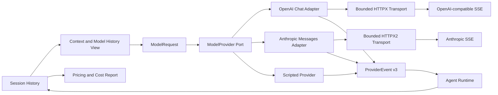
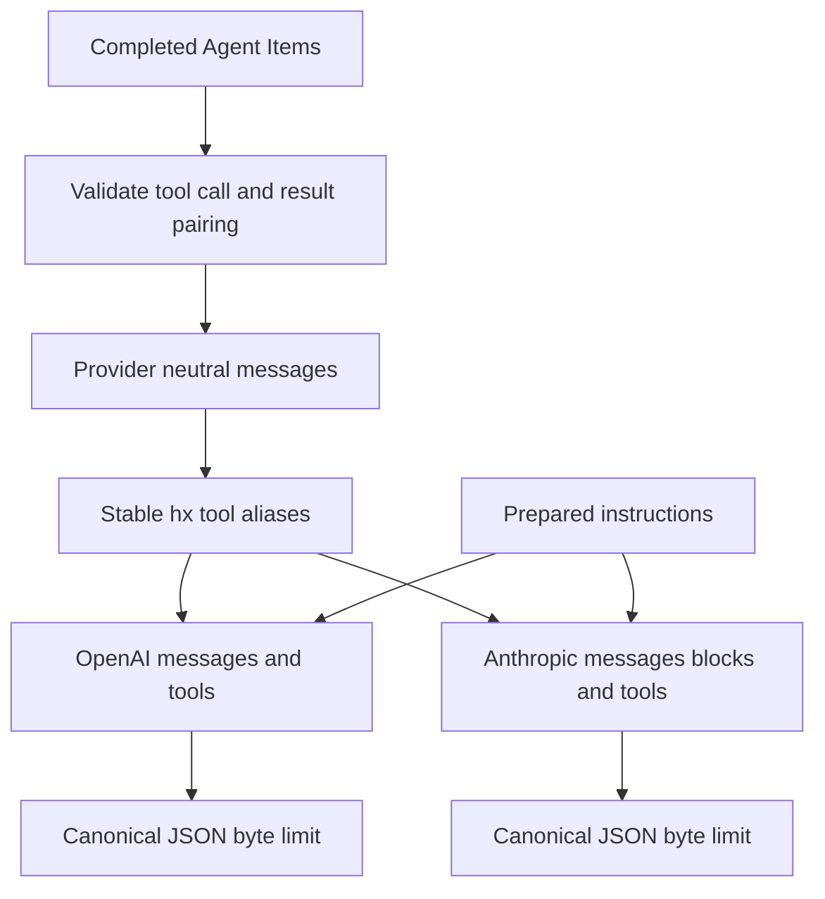
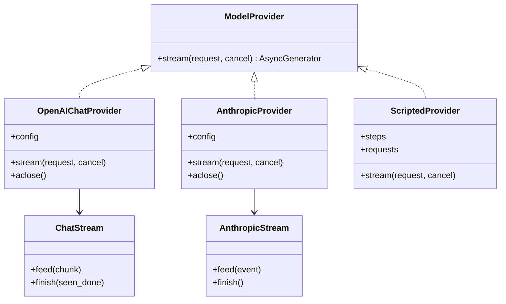
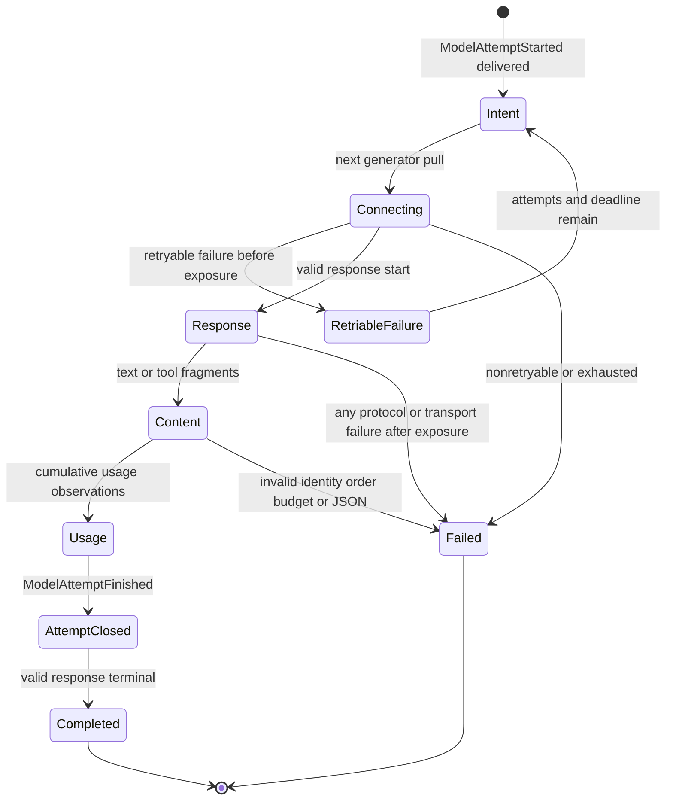
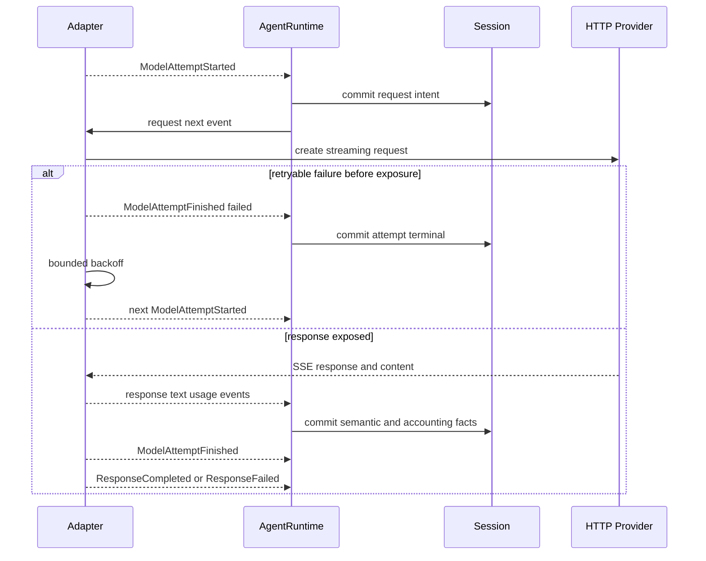
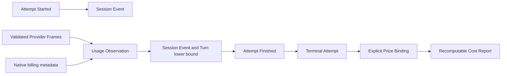
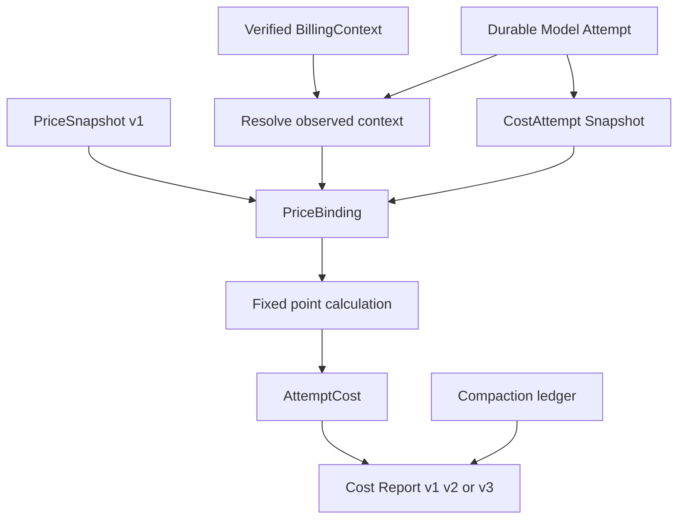
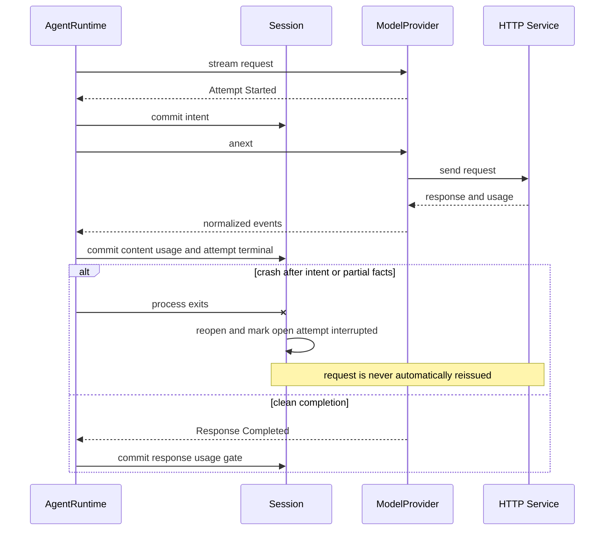

# Model Runtime模块设计

## 1. 文档摘要

| 项目 | 内容 |
|---|---|
| 当前Provider | OpenAI-compatible Chat Completions、Anthropic Messages、确定性Scripted/Fake Provider |
| 核心端口 | `ModelProvider.stream(ModelRequest, CancelToken) -> AsyncGenerator[ProviderEvent]` |
| 当前事件合同 | Provider Event v3；文本、Tool Call、结构化终态、尝试、累计用量和响应计费元数据 |
| 计价合同 | Price Snapshot v1；Cost Report v1/v2/v3；显式绑定后的可重算事后估算 |
| 本文状态 | 当前实现；`models`包现行实现的事实源 |
| 代码版本 | `00e2b816078f52c10849a65efddb36e84a538eef` |
| 默认产品装配 | `product_config`按Profile与Secret构造Provider Bundle；安全Fallback位于产品配置层而非单Adapter |
| 核心保证 | 请求意图先持久化再发HTTP；严格流状态机；语义暴露后不自动重试；未知用量和价格不伪装为零 |

Model Runtime不是Agent Loop，也不是Prompt/Context规划器。它把已准备的Provider中立请求转换为具体SDK
线协议，再将不可信网络流归一化为严格事件；Agent Runtime负责持久化、Tool执行、Turn状态和恢复。

## 2. 需求背景

模型平台对消息、系统指令、Tool Call、SSE、Stop Reason、错误、缓存用量和计费字段采用不同协议。
如果Agent直接依赖SDK Chunk，历史、Session、Retry、Tool权限和客户端协议都会被单一供应商绑定。网络流
还可能出现截断JSON、身份漂移、重复终态、超大Frame、压缩炸弹、错误正文泄漏和“请求可能计费但没有
持久记录”等生产故障。

本模块采用Provider中立合同和供应商专用状态机：先把Agent历史映射为有界请求，再在SDK类型转换之前
验证原始SSE，只有完整终态通过后才释放Tool Call。每次HTTP尝试使用独立账本身份；用量、计费上下文
和价格保持三层事实，避免把Token数、价格估算和供应商账单混为一谈。

## 3. 设计目标与非目标

### 3.1 目标

1. Agent Runtime只依赖`ModelProvider`和Provider Event，不导入具体模型SDK；
2. 同一历史在OpenAI-compatible和Anthropic协议中保持文本、Tool配对和错误语义等价；
3. API Key、Header、原始错误正文和SDK对象不进入Session或公共事件；
4. 请求、响应、SSE Frame、Chunk、文本和Tool参数均有硬上限；
5. 原始SSE先严格校验，再交给可能执行类型转换的SDK；
6. Tool Call只在完整参数、唯一身份、合法名称、正确Stop Reason、完整Usage和流终态后释放；
7. Adapter先交付`ModelAttemptStarted`，Runtime持久化后才拉取下一事件并触发HTTP；
8. 仅在没有语义输出暴露时执行有界重试，已出现Response/Text/Tool语义后不重发；
9. 用量按Attempt累计快照记录，未知保持`null`，失败请求有完整用量时仍可计价；
10. 价格必须显式绑定实际模型、平台、地域、等级、模式、时间、输入阶梯和缓存TTL；
11. 成本报告可从Attempt与嵌入价格重算，未知、部分和完整三种结论不可混淆；
12. 取消、消费者提前退出和总超时都关闭Owned Stream，不在生成器清理阶段伪造持久收据。

### 3.2 非目标

1. 当前不支持OpenAI Responses API、Realtime、Batch API或SDK内置Agent/Tool Runner；
2. 当前不支持Thinking/Reasoning正文、Citations、图片、音频、结构化输出或服务器工具；
3. 不自动抓取实时价格，不把估算金额声明为供应商账单；
4. 不从Adapter类型、Base URL、请求模型别名或响应文案猜测计费平台；
5. 不提供全局并发限流、账户配额、Circuit Breaker或跨进程请求调度；
6. 不在Adapter内执行跨Profile Fallback；该能力由`product_config.SafeFallbackProvider`审计编排；
7. 不保证部分/未知Usage下的实际Token或费用硬上限；
8. 不保存原始HTTP请求、响应、SSE、错误Body或Debug Capture。

## 4. 术语、边界与固定上限

| 术语/边界 | 当前定义 | 影响 |
|---|---|---|
| Model Step | Agent Loop的一次Provider调用阶段 | 同一Step可有多个HTTP Attempt |
| Attempt | 一次可能发出HTTP的独立请求意图 | ID唯一，Step内Index连续；领域上限32，单Adapter配置上限5 |
| Semantic Exposure | Response、文本、Tool或完成事件已经交付Runtime | 一旦发生，当前Adapter不再自动重试 |
| Usage Observation | 同一Attempt的累计用量快照 | 重复值不累加，后继不可回退 |
| Billing Metadata | 响应中观测到的等级、地域和缓存TTL分项 | 不是平台身份、价格或账单证明 |
| Price Snapshot | 宿主提供的不可变费率事实 | 需与Attempt摘要和计费上下文显式绑定 |
| Cost Report | 由Attempt和Price Binding纯计算的事后报告 | JSON重载时重新验证，不信任写入金额 |
| Request Intent | 已提交的`ModelAttemptStarted` | 证明准备发请求，不证明服务端收到或计费 |

| 资源 | 默认 | 配置范围/硬限制 |
|---|---:|---|
| 单次最大输出Token | 1024 | 1～1000000，且受Turn剩余Token约束 |
| 总请求超时 | 60秒 | 大于0且不超过3600秒，跨重试共用Deadline |
| 单次I/O等待 | 30秒 | 大于0且不超过300秒 |
| 单Adapter尝试数 | 2 | 1～5 |
| 退避基数 | 0.5秒 | 0～10秒，指数增长且受总Deadline限制 |
| 请求/响应字节 | 各2 MiB | 1 KiB～16 MiB |
| SSE Frame | 256 KiB | 128 B～1 MiB |
| 网络Chunk/SSE Frame数量 | 10000 | 1～100000，共用上限防止无语义Ping消耗 |
| Provider Event数量 | 10000 | Agent Runtime每Model Step硬限制 |
| 文本块 | 不超过128 | Agent Runtime和Anthropic Block均有界 |
| API Key | 无默认明文 | 非空可打印ASCII，最大8 KiB |

## 5. 模块上下文与数据流



Context准备后的同一历史同时用于预算和Provider请求。具体Adapter只做协议映射、传输控制、状态机和
错误归一化；Agent Runtime将完成内容、Tool Call、Attempt、Usage和终态写入Session。Pricing/Cost不在
请求路径上自动扣费，而是读取已持久Attempt并与显式价格快照结合。

## 6. 组件职责与禁止边界

| 组件 | 主要职责 | 禁止承担 |
|---|---|---|
| `ModelProvider` | 提供统一异步事件流 | 操作Session、执行Tool、决定Turn恢复 |
| `OpenAIChatProvider` | Chat Completions请求、流解析和错误映射 | 假装支持Responses、SDK重试或工具执行 |
| `AnthropicProvider` | Messages请求、Block状态机和累计Usage | 接收Thinking签名、服务器工具或Assistant Prefill |
| `BoundedTransport/Stream` | 字节、Chunk、Frame、编码和资源关闭边界 | 解释业务Stop Reason或记录原始Body |
| `_history/messages_for` | Provider中立历史配对与规范化 | 修复未完成Item、缺失Tool Result或权限状态 |
| Chat/Anthropic Mapping | 工具别名、系统指令、消息和请求大小映射 | 改写Agent持久历史 |
| Chat/Anthropic Stream | 供应商专用流状态机 | 在不完整终态前释放Tool Call |
| Agent Attempt Reducer | 持久化Attempt/Usage并维护累计预算 | 推断未知计数或价格 |
| Pricing/Costs | 严格价格、绑定和可重算估算 | 联网取价、汇率换算、账单认证 |
| `SafeFallbackProvider` | 产品层候选编排、全局Attempt Index和审计 | 在语义暴露后切换Provider |

## 7. 核心合同与重点字段

### 7.1 `ModelRequest`

| 字段 | 类型/约束 | 来源 | 语义与安全 |
|---|---|---|---|
| `thread_id`/`turn_id` | UUID | Agent Runtime | 审计与事件归属，不发送为Provider业务字段 |
| `step` | `int >= 1` | Turn投影 | 绑定Attempt、Usage和Tool Loop轮次 |
| `history` | 完成`Item`元组 | Model History View | 不允许未完成Item、未配对Tool或不支持内容 |
| `tools` | `ToolDescriptor`元组 | Runtime注册表 | 使用稳定别名发送，返回时映射回内部工具名 |
| `instructions` | 可空字符串，1～1000000字符 | Context Engine | OpenAI放首个System消息；Anthropic放`system`字段 |
| `budget` | `Budget` | Turn创建事实 | 约束总Token、输出字符和每步Tool Call |
| `remaining_tokens` | 可空正整数 | Runtime预算 | 输出Token取其与Provider配置上限的较小值 |

### 7.2 Provider语义事件

| 事件 | 关键字段 | 约束/消费行为 |
|---|---|---|
| `ResponseStarted` | `response_id` | 每响应一次；身份必须与Usage观测一致 |
| `TextStarted` | `content_id` | 同Step唯一，最多128块 |
| `TextDelta` | `content_id/delta` | 仅直播并累计输出字符；不直接持久化Delta |
| `TextCompleted` | `content_id/text` | 必须等于累计Delta或作为无Delta完整终值 |
| `ToolCallCompleted` | Provider Call ID、内部Tool名、JSON Object参数 | ID唯一，数量和参数大小受Turn预算约束 |
| `ResponseCompleted` | 标准Finish Reason、总Usage | 必须与文本/Tool存在性及成功Attempt用量一致 |
| `ResponseFailed` | 固定Code、`retryable` | Runtime转为`provider_<code>`，不携带原始错误 |
| `ModelAttemptStarted` | ID、Step、Index、Provider、请求模型 | 必须先持久化，下一次拉流才允许发HTTP |
| `ModelUsageObserved` | Attempt、响应/实际模型、Usage、Billing | 累计后继，不得覆盖或回退已知事实 |
| `ModelAttemptFinished` | Attempt、Outcome、公开错误 | 完成流中位于Response终值前；异常关闭由Runtime补结算 |

`ResponseCompleted.finish_reason`支持`completed/tool_calls/max_output_tokens/content_filter/cancelled/unknown`。
只有前两种是当前普通Agent Loop正常完成；其余由Runtime转换为结构化失败，不自动伪装成功。

### 7.3 错误分类

Provider失败Code固定为：`invalid_request`、`authentication`、`rate_limit`、`quota`、
`content_policy`、`provider_internal`、`transport`、`invalid_provider_output`、`context_overflow`、
`cancelled`和`unknown`。Adapter只基于SDK异常类型、状态码和受控错误类型字段映射，不持久化错误Body或
从任意服务端文案推断业务语义。

## 8. 历史与请求映射



### 8.1 中立历史规则

1. 所有Item必须Completed；只接受User/Assistant文本、Tool Call和Tool Result；
2. Tool Call ID在历史中唯一，Result必须唯一配对，连续Result组不能被其他消息打断；
3. Assistant文本与同轮Tool Call聚合为一条中立Assistant消息；
4. Tool Result正文只包含`outcome/output/error/diff_artifact`的规范JSON；
5. 工具名按`hx_ + SHA-256(name)前60位`形成稳定别名，避免供应商名称字符约束和名称泄漏冲突；
6. Tool Schema顶层必须为Object；别名不能冲突；请求JSON UTF-8字节不得超过配置上限。

### 8.2 OpenAI-compatible映射

指令作为首个System消息；中立Tool消息映射为`role=tool`并绑定稳定Call ID；请求启用Streaming Usage。
输出Token参数可配置为`max_completion_tokens`或兼容端点需要的`max_tokens`。只有存在工具定义时才发送
`tools`与`parallel_tool_calls`。

### 8.3 Anthropic映射

Tool Result转换为User消息中的`tool_result` Block，连续同Role消息合并；Tool Call转换为Assistant
`tool_use` Block。历史必须以User开始并以User结束，不支持Assistant Prefill。指令使用独立`system`字段，
Thinking显式禁用；工具选择为Auto，并按能力设置是否禁用并行Tool。

## 9. Adapter与依赖倒置设计



两个生产Adapter共享合同、历史工具别名、严格JSON、截止时间等待和有界传输概念，但保留独立SDK与流
状态机。Anthropic当前依赖HTTPX2类型，不能与OpenAI Adapter的HTTPX Client不安全混用。

## 10. HTTP、端点与Secret边界

| 控制 | 当前实现 |
|---|---|
| Endpoint | 仅无User Info、Query、Fragment或空白的HTTPS URL；去除尾部斜线 |
| DNS/目标 | Adapter未做域名Allowlist或私网IP封锁；应由受管网络/产品配置约束 |
| Proxy | `trust_env=False`，不继承系统代理 |
| Redirect | `follow_redirects=False` |
| 压缩 | 请求`Accept-Encoding: identity`；响应Content-Encoding非Identity即拒绝 |
| 自定义Header | 检出`OPENAI_CUSTOM_HEADERS`/`ANTHROPIC_CUSTOM_HEADERS`即拒绝构造 |
| SDK重试 | 显式`max_retries=0`；只使用Harnessix可审计重试 |
| API Key | 环境变量引用或显式短生命周期注入；非空可打印ASCII，最大8 KiB |
| 错误Body | 通过有界流读取并关闭；只向上返回固定分类 |
| Client生命周期 | Provider拥有Client；`aclose`幂等关闭连接池，关闭后请求固定失败 |

产品配置层只持久`SecretReference(name, version)`，解析后构造Provider；可变Secret副本随后清零。SDK内部
不可变字符串副本持续到Provider Client关闭，因此Provider生命周期也是凭据驻留边界。

## 11. 供应商流状态机



### 11.1 OpenAI Chat状态机

原始SSE Frame先严格解析为`ChatCompletionChunk`，防止SDK把布尔或字符串宽松转换为计数。响应ID和实际
模型首次确定后不可漂移；只接受Choice Index 0，Usage只能在Finish Reason后以无Choice Chunk到达，
并要求输入加输出等于总量。Tool分片按连续Index聚合，ID/名称不可漂移，参数终值必须为JSON Object。
成功结束还要求`[DONE]`、Finish Reason和完整Usage同时存在。

### 11.2 Anthropic状态机

严格顺序为Message Start → 有序Content Block Start/Delta/Stop → Message Delta → Message Stop。最多128个
Block；拒绝Citations、Thinking/未知Block、服务器工具容器、重复或未关闭Block。Usage是累计值，输入
总量由未缓存、缓存读和缓存写相加；Message Stop前必须能确定全部四类核心计数。Tool Call只在全部Block
关闭、终态Reason和Usage验证后一次性释放。

## 12. 尝试、重试与Fallback时序



单Adapter仅对被标记为Retryable且尚未暴露语义的错误重试，并与所有尝试共享总Deadline。当前OpenAI对
连接、超时、408/409/429和5xx等受控类别重试；Anthropic对连接、超时、限流、Overload/API错误等映射
重试。Adapter不解析`Retry-After`，使用配置的指数退避。

产品层Fallback进一步要求错误属于`transport/rate_limit/provider_internal`、尚未语义暴露、存在下一
候选且Fallback审计先持久化。`SafeFallbackProvider`重写各候选局部Attempt Index为Step内全局连续值，
并使用配置中的Provider ID；审计失败时返回原失败，不切换候选。

## 13. Attempt、Usage与Billing持久事实



### 13.1 `ModelAttempt`

| 字段 | 约束 | 语义 |
|---|---|---|
| `attempt_id` | Thread内唯一UUID | 一次请求意图与所有Usage/终态的主键 |
| `step` | `>= 1` | 所属普通生成步骤；Compaction另绑定独立身份 |
| `index` | 1～32且Step内连续 | HTTP重试和跨Profile候选的全局顺序 |
| `provider` | 小写稳定标识 | Adapter类型或产品Provider ID，不等同计费商户 |
| `requested_model` | 严格模型标识 | 请求配置；不能用于替代实际模型计价 |
| `actual_model` | 可空严格标识 | 从合法响应观测；成功Attempt必须存在 |
| `response_id` | 可空严格标识 | 一旦观测不可改变；成功Attempt必须存在 |
| `usage` | `UsageObservation` | 同一Attempt的最后累计快照 |
| `billing` | `ResponseBillingMetadata` | 响应原生事实，不含平台身份和价格 |
| `status` | running/completed/failed/cancelled/interrupted | 只有Running没有`finished_at`；成功没有Error |
| `started_at/finished_at` | 带时区时间 | 价格窗口保守要求完整覆盖开始与结束 |

### 13.2 `UsageObservation`

`input_tokens`包含未缓存、缓存读取和缓存创建；`output_tokens`包含推理输出。三个输入分项互斥，全已知时
之和必须等于输入总量；推理输出不得超过输出总量。计数是严格非负整数，布尔、字符串或浮点不能转换。

`unknown`要求所有计数均为空；`partial`表示已有观测但不具备可信最终总量；`complete`必须具备输入和
输出总量。后继快照不能降低完整性、删除已知字段或回退计数；Complete之后只可补此前未知明细，不能
修改已知终值。

`Turn.usage`只按同一Attempt新旧总量差额累加，表示已观测消费下界。重复累计收据不重复计数，缺总量
时不从分项猜测预算。`UsageRecorded`仍是响应完整结束门禁；已有Attempt模式只校验成功Attempt总量并
推进步骤，不再次累加。

### 13.3 响应计费元数据

当前记录`service_tier`、`inference_geo`、5分钟与1小时缓存创建Token分项。标签只能从未知补齐且不可
漂移，计数累计不回退且不能超过已知缓存创建总量。OpenAI的`auto`不视为实际等级；Anthropic只有两个
TTL分项都完整覆盖缓存创建且仅一种为正时，才可解析为单一TTL。

## 14. 价格绑定与成本报告



### 14.1 `PriceSnapshot v1`

| 维度 | 约束/含义 |
|---|---|
| 来源 | HTTPS URL、版本名和内容SHA-256；未做数字签名或自动抓取 |
| Scope | 计费平台、实际模型、地域、服务等级、推理模式必须全部匹配 |
| 时间 | Attempt开始和结束都位于`[valid_from, valid_until)` |
| 输入阶梯 | 完整输入Token落在单一闭区间；一个快照代表一个阶梯 |
| 输入价格 | 全部输入统一费率，或未缓存/缓存读/缓存写三分项 |
| 缓存TTL | 分项价格可要求5m或1h；显式`null`表示费率确实与TTL无关 |
| 输出价格 | 按包含Reasoning的总输出计价，不再重复增加Reasoning子集 |
| 币种 | 仅USD或CNY；报告不做隐式汇率换算 |

费率是每百万Token的严格十进制字符串，内部转换为12位定点单价；乘Token后以10^-18货币单位求和，
不依赖全局Decimal Context，不在单Attempt内随意四舍五入。

### 14.2 绑定和未知原因

`PriceBinding`冻结Attempt摘要、价格摘要、完整Price Snapshot和可信`BillingContext`。实际模型、上下文、
时间、输入阶梯、分项或TTL缺失时返回`unknown`及固定原因；ID或摘要错绑属于非法输入而非Unknown。
失败、取消或中断Attempt只要Usage Complete，仍可以估算，不能将失败解释为免费。

### 14.3 Cost Report版本

| 版本 | 用途 |
|---|---|
| v1 | 普通生成Attempt和终态Turn |
| v2 | 加入Compaction Attempt、用途和压缩状态 |
| v3 | 支持`WAITING_INPUT`等0.8.3交互状态，并统一普通生成与Compaction |

报告对每个Attempt只计一次，按币种分别汇总。Turn未终结、存在未覆盖Step、Running/Unknown费用、开放
Compaction或`unaccounted_request_possible`时不能宣称Complete。报告反序列化会重算每个金额和汇总，
篡改已存Amount、Attempt、Binding或成员关系会被拒绝。

## 15. 正常、失败与崩溃恢复



### 15.1 正常完成

Provider完成原始流校验后先发`ModelAttemptFinished(completed)`，再发Text Completed、Tool Calls和
`ResponseCompleted`。Agent逐事件提交Attempt和语义Item，最终校验Finish Reason、文本块闭合、Tool Call
存在性及Usage一致。只有完整终态通过后，Tool Loop才执行已经持久化的调用。

### 15.2 Provider失败

本地历史、能力或请求大小失败发生在HTTP前，不创建虚假Attempt。HTTP请求阶段失败会先结算Attempt，
若符合零暴露重试条件再开始下一Attempt；最终`ResponseFailed`由Agent转换为固定`provider_*`错误。原始
异常、URL查询、Header和Body不进入Session。

### 15.3 取消、超时和消费者退出

`wait_for_io`把建连、每次`anext`和退避同时绑定总Deadline与Cancel Token。取消直接传播，不允许Adapter
在异步生成器`finally`中继续yield收据；Agent根据最后持久事实将Running Attempt结算为Cancelled或
Interrupted。Owned Stream在有界时间内关闭，清理故障不覆盖原取消或业务失败。

### 15.4 崩溃恢复

Attempt Intent已经提交但进程退出时，重开只把开放Attempt标记Interrupted，不自动重发模型HTTP。Usage
和Billing保留最后合法快照；没有观测继续是Unknown。该保守策略避免重复计费和重复Tool Call，代价是
需要显式终态Turn Retry创建新Turn。

## 16. 失败语义矩阵

| 场景 | Provider事件/Kernel错误 | Retryable | 请求/工具后果 |
|---|---|---:|---|
| History未完成、Tool未配对、Schema非法 | `invalid_request`/`provider_invalid_request` | 否 | 不发HTTP |
| Provider不支持Tool但请求含Tool语义 | `invalid_request` | 否 | 不发HTTP |
| 请求JSON超过配置上限 | `invalid_request` | 否 | 不发HTTP |
| API Key缺失/非法或自定义Header污染 | 构造时`ValueError`或产品诊断错误 | 否 | 不构造Client |
| 401/403或认证错误类型 | `authentication` | 否 | Attempt失败，不重试 |
| 配额/计费错误 | `quota` | 否 | Attempt失败，不重试 |
| 429 | `rate_limit` | 是 | 仅零暴露且有预算时重试 |
| 连接、408/409/504或超时 | `transport` | 是 | 仅零暴露且有预算时重试 |
| 5xx、Overload或API错误 | `provider_internal` | 是 | 仅零暴露且有预算时重试 |
| 响应压缩、字节/Frame/Chunk超限 | `invalid_provider_output` | 否 | 关闭流，不释放Tool |
| SSE JSON、顺序、身份、计数或终态非法 | `invalid_provider_output` | 否 | 保留先前合法Usage，不释放Tool |
| Context Window明确超限 | `context_overflow` | 否 | 交由Context/Compaction或显式Retry |
| Refusal/Content Filter | `content_policy`或`provider_content_filter` | 否 | 不执行Tool |
| 达到输出上限 | `provider_max_output_tokens` | 否 | Turn失败，不自动续写 |
| Provider Event超过10000 | `provider_event_limit` | 否 | 关闭流 |
| Agent输出字符/Tool Call超预算 | `model_output_too_large`/`tool_call_limit` | 否 | 已有事实保留，Turn失败 |
| 流缺少开始或完整终态 | `provider_stream_incomplete` | 否 | Runtime结算开放Attempt |
| 用户取消 | Cancelled Turn | 不适用 | 关闭流并结算Attempt |
| 宿主崩溃 | Attempt Interrupted | 否 | 不自动重发HTTP |

Retryable描述错误类别，不等于调用方可以无条件重发。Adapter、产品Fallback和终态Turn Retry各有独立
语义暴露、审计和身份边界。

## 17. 并发、生命周期与资源管理

1. 每个Provider Client可并发处理请求，每个Stream拥有独立解析状态；
2. Config在构造时JSON Round Trip冻结，活动请求不读取热变更配置；
3. 总Deadline在一次Adapter `stream`调用内跨建连、全部重试、读流和退避，不因新Task重置；
4. 每次I/O通过`CancelToken.run`托管，即使不同Task逐次调用`anext`也保持取消语义；
5. `BoundedStream`在SDK成功流和错误Body两条路径都关闭底层源；
6. Provider关闭后不能重开；Bundle关闭按逆序关闭所有候选，并保留首个关闭错误；
7. Agent Runtime每Thread串行化Turn状态，但不同Thread可共享Provider并发；
8. 当前没有Provider级Semaphore、账户QPS、全局Token Bucket或自适应背压。

## 18. 安全与隐私

| 资产/风险 | 当前控制 | 剩余风险 |
|---|---|---|
| API Key | 环境引用/版本化Secret、格式上限、自定义Header拒绝、Client关闭 | SDK内存字符串无法主动清零；环境变量仍可被同进程读取 |
| Endpoint污染 | HTTPS、无User Info/Query/Fragment、禁代理/重定向 | Adapter本身未限制域名、DNS解析结果或私网地址 |
| 错误泄漏 | 固定错误Code和消息、有界Body、无Raw持久化 | 调试器或同进程异常检查仍可能看到SDK对象 |
| Prompt与Tool结果 | 请求不持久Raw Wire；Session使用正式Item | HTTPS目标仍可看到完整请求；目标身份必须由产品安全配置保证 |
| 恶意SSE | 严格原始JSON、字节/Frame/Chunk/事件上限、状态机 | 供应商SDK升级可能改变类型和错误语义，需合同回归 |
| Tool Call注入 | 别名白名单、JSON Object、数量/字符预算、完整终态门禁 | 参数业务安全仍由Tool Schema、Policy、Approval和Sandbox负责 |
| 计价误归因 | 实际模型和显式平台上下文绑定，未知不填零 | Price来源未签名，也未与供应商账单自动核对 |
| Prompt Injection | 模型输入由Context分层，Tool执行另有权限边界 | Provider输出和历史内容仍可能包含恶意建议 |

Model ID、Response ID、Usage和计费标签属于可审计元数据，但仍不应作为高基数Metric标签。Secret、Prompt、
历史、Tool参数、原始响应和价格来源中的查询信息不得写入通用日志。

## 19. 可观测性与运维

Agent Runtime围绕Model操作发Span，并在Usage事件提交后按输入/输出差额记录Token Metric；持久Attempt
Event才是审计权威，Metric在“提交后、发送前”崩溃时可能少报，不具备Exactly Once。错误指标只使用
固定Provider分类，不能带URL、模型响应正文、API Key、请求ID或Tool参数。

Cost Report适合作为可重放的任务级证据，但不是在线账单。生产运维仍需补充低基数的Provider/Profile、
结果分类、Attempt数、首Token延迟、总延迟、输入/输出Token桶和Fallback次数；模型名若可由用户配置，
不应直接成为无限基数标签。当前没有账户级限流、实际账单对账、价格更新服务和Provider SLO。

## 20. 核心业务逻辑伪代码

```text
adapter_stream(request, cancel):
    validate and map completed provider-neutral history
    require capabilities and canonical request bytes within config
    deadline = monotonic_now + total_timeout
    for local_index in configured_attempts:
        yield attempt_started before any HTTP side effect
        wait until consumer requests next event
        try:
            create SDK stream with bounded transport and no SDK retries
            require SSE content type
            for each bounded and strictly validated vendor event:
                update vendor-specific state machine
                yield normalized response, usage, text deltas as allowed
            validate complete stop reason, usage, identities and transport terminator
            yield attempt_finished completed
            yield final text, tool calls and response_completed
            return
        except cancellation:
            close stream and rethrow for runtime settlement
        except sanitized error:
            close stream
            yield attempt_finished failed
            if semantic exposure or not retryable or exhausted or deadline: yield response_failed
            else await bounded exponential backoff

consume_provider_events(request):
    persist every attempt event before requesting the next generator value
    require response and content state ordering
    persist completed text and tool calls; live deltas are not durable
    reject tool calls until complete provider terminal validation
    update turn usage only by cumulative attempt deltas
    on exception, cancel or crash recovery: close any running attempt without reissuing HTTP

estimate_cost(attempt, price, verified_context):
    bind exact attempt digest and immutable price digest
    merge only verified direct-provider response facts without guessing proxy identity
    if usage, model, scope, time, band, details or TTL unknown: return fixed unknown reason
    calculate integer fixed-point lines without double-counting cache or reasoning subsets
    recompute report membership, per-currency totals and completeness on load
```

## 21. 源码与测试双向映射

| 设计元素 | 源码 | 关键符号 | 测试 | 关键测试函数 | 证明内容 |
|---|---|---|---|---|---|
| Provider端口与事件 | [`contracts.py`](../../src/harnessix/models/contracts.py) | `ModelRequest`、`ProviderEvent`、`ModelProvider` | [`provider.py`](../../tests/contracts/provider.py) | `ProviderContract.test_text_and_usage`、`test_tool_fragments` | 双Adapter统一语义 |
| History配对 | [`_history.py`](../../src/harnessix/models/_history.py) | `messages_for`、`tool_alias` | [`test_chat_mapping.py`](../../tests/models/test_chat_mapping.py) | `test_parallel_history_and_stable_aliases`、`test_invalid_history_fails_explicitly` | 配对、并行组和稳定别名 |
| OpenAI请求映射 | [`_chat_mapping.py`](../../src/harnessix/models/_chat_mapping.py) | `build_request` | [`test_chat_mapping.py`](../../tests/models/test_chat_mapping.py) | `test_instructions_are_a_separate_leading_system_message`、`test_invalid_request_is_rejected_before_network` | System、Tool和请求预算 |
| Anthropic请求映射 | [`_anthropic_mapping.py`](../../src/harnessix/models/_anthropic_mapping.py) | `build_request` | [`test_anthropic_mapping.py`](../../tests/models/test_anthropic_mapping.py) | `test_parallel_results_form_one_user_message`、`test_instructions_use_anthropic_system_field` | Block结构和消息角色 |
| HTTP配置 | [`config.py`](../../src/harnessix/models/config.py) | `ModelHTTPConfig`、`ChatCapabilities` | [`test_openai_chat.py`](../../tests/models/test_openai_chat.py)、[`test_anthropic_mapping.py`](../../tests/models/test_anthropic_mapping.py) | `test_endpoint_constraints`、`test_https_endpoint_constraints` | HTTPS、能力和数值边界 |
| Secret读取 | [`_provider_io.py`](../../src/harnessix/models/_provider_io.py) | `read_key`、`validate_key` | [`test_openai_chat.py`](../../tests/models/test_openai_chat.py) | `test_configuration_fails_without_exposing_credentials` | Key格式和Header污染隔离 |
| 有界传输 | [`_bounded_http.py`](../../src/harnessix/models/_bounded_http.py) | `BoundedStream`、`BoundedTransport` | [`test_openai_chat.py`](../../tests/models/test_openai_chat.py) | `test_wire_budgets`、`test_compressed_response_rejected`、`test_error_response_body_is_bounded_and_closed` | 字节/Frame/Chunk和关闭 |
| OpenAI流状态 | [`_chat_stream.py`](../../src/harnessix/models/_chat_stream.py) | `ChatStream.feed`、`finish` | [`test_openai_chat.py`](../../tests/models/test_openai_chat.py) | `test_invalid_arguments_never_release_calls`、`test_malformed_wire`、`test_kernel_tool_loop_pairing_usage_and_replay` | 工具、终态和Replay |
| Anthropic流状态 | [`_anthropic_stream.py`](../../src/harnessix/models/_anthropic_stream.py) | `AnthropicStream.feed`、`finish` | [`test_anthropic.py`](../../tests/models/test_anthropic.py) | `test_bad_tool_json_never_releases_call`、`test_invalid_protocol`、`test_cumulative_usage_includes_caches_without_double_counting` | Block、Usage和工具门禁 |
| Adapter重试合同 | [`openai_chat.py`](../../src/harnessix/models/openai_chat.py)、[`anthropic.py`](../../src/harnessix/models/anthropic.py) | `stream`、`_failure` | [`provider.py`](../../tests/contracts/provider.py) | `test_error_codes_and_bounded_retry`、`test_midstream_failure_not_retried` | 零暴露重试和错误分类 |
| 取消和资源关闭 | [`_provider_io.py`](../../src/harnessix/models/_provider_io.py) | `wait_for_io` | [`provider.py`](../../tests/contracts/provider.py) | `test_cancel_closes_blocked_stream`、`test_consumer_exit_closes_stream` | 全等待点取消和Owned Stream |
| Attempt/Usage合同 | [`usage.py`](../../src/harnessix/agent/usage.py) | `UsageObservation`、`ModelAttempt`及三类Event | [`test_attempt_usage.py`](../../tests/models/test_attempt_usage.py) | `test_native_usage_details_and_alias_identity`、`test_duplicate_cumulative_report_is_not_added_twice` | 累计、身份和不双记 |
| Attempt崩溃恢复 | [`runtime.py`](../../src/harnessix/agent/runtime.py) | `_sample_events`、`_finish` | [`test_attempt_crash_recovery.py`](../../tests/models/test_attempt_crash_recovery.py) | `test_sdk_crash_preserves_attempt_and_never_reissues_request` | 意图先提交和不重发 |
| Billing元数据 | [`_billing.py`](../../src/harnessix/models/_billing.py)、[`billing.py`](../../src/harnessix/models/billing.py) | `merge_billing`、`resolve_billing_context` | [`test_billing_metadata.py`](../../tests/models/test_billing_metadata.py) | `test_usage_and_metadata_commit_atomically_and_omission_keeps_fact`、`test_anthropic_drift_preserves_previous_metadata_and_usage` | 同事件、后继和冲突 |
| 价格合同 | [`pricing.py`](../../src/harnessix/models/pricing.py) | `PriceSnapshot`、`BillingContext`、`content_digest` | [`test_pricing.py`](../../tests/models/test_pricing.py) | `test_price_roundtrip_and_digest_are_content_bound`、`test_fixed_point_cost_is_exact_independent_of_decimal_context` | 快照绑定和定点精度 |
| Attempt计价 | [`costs.py`](../../src/harnessix/models/costs.py) | `bind_price`、`estimate_attempt` | [`test_pricing.py`](../../tests/models/test_pricing.py) | `test_complete_usage_is_priced_even_when_attempt_failed`、`test_unknown_attempts_never_become_zero` | 失败计价和未知非零 |
| Turn成本报告 | [`costs.py`](../../src/harnessix/models/costs.py) | `build_cost_report`、`CostReportV3` | [`test_costs.py`](../../tests/models/test_costs.py)、[`test_compaction_costs.py`](../../tests/models/test_compaction_costs.py) | `test_retries_count_attempts_not_usage_observations`、`test_possible_unaccounted_request_prevents_complete_cost_claim` | 重试、Compaction和完整性 |
| 端到端成本 | [`costs.py`](../../src/harnessix/models/costs.py) | `COST_REPORT_ADAPTER` | [`test_cost_integration.py`](../../tests/models/test_cost_integration.py) | `test_real_sdk_to_durable_cost_report_replay` | SDK到Session再到重算报告 |
| 安全Fallback | [`runtime.py`](../../src/harnessix/product_config/runtime.py) | `SafeFallbackProvider.stream` | [`test_runtime.py`](../../tests/product_config/test_runtime.py) | `test_zero_exposure_failure_falls_back_with_global_attempts_and_audit`、`test_never_falls_back_after_response_or_tool_exposure` | 审计先行和暴露边界 |
| Scripted测试端口 | [`scripted.py`](../../src/harnessix/models/scripted.py) | `ScriptedProvider`、`FakeProvider` | [`test_runtime.py`](../../tests/agent/test_runtime.py) | Agent Runtime测试套件 | 无网络确定性事件脚本 |

### 21.1 推荐源码阅读路线

1. 从[`contracts.py`](../../src/harnessix/models/contracts.py)和
   [`tests/contracts/provider.py`](../../tests/contracts/provider.py)理解Provider中立边界；
2. 读`_history.py`及两个Mapping，掌握同一Agent历史如何映射为两种协议；
3. 读`_bounded_http.py`、`_provider_io.py`，建立HTTP、Secret、Deadline和取消边界；
4. 分别阅读`_chat_stream.py`和`_anthropic_stream.py`，对照非法流测试画出状态机；
5. 读两个Provider的`stream`，重点跟踪Started → HTTP → Exposure → Retry → Finished顺序；
6. 转到`agent/usage.py`、Reducer和`AgentRuntime._sample_events`理解持久账本；
7. 最后读`pricing.py`、`billing.py`和`costs.py`，区分响应事实、可信上下文、费率和估算结果。

## 22. 测试设计与验收标准

| 层级 | 必测内容 | 证据 |
|---|---|---|
| 统一合同 | 文本、Tool分片、坏流、错误、重试、取消、消费者退出 | `tests/contracts/provider.py`由两个Adapter复用 |
| Wire/SDK | 任意UTF-8分片、SSE换行、状态码、错误Body、压缩、传输预算 | `test_openai_chat.py`、`test_anthropic.py` |
| 映射 | 历史角色、Tool配对/别名、系统指令、能力和请求大小 | 两个Mapping测试 |
| 尝试账本 | HTTP前意图、累计Usage、响应身份、失败/取消/超时和重试 | `test_attempt_usage.py` |
| 崩溃 | Started/Usage/Finished每个进程退出切点、不重发 | `test_attempt_crash_recovery.py` |
| Billing | 等级、地域、TTL分项、后继、冲突和同事件持久化 | `test_billing_metadata.py`、`test_billing_context.py` |
| Pricing | 严格十进制、时间/阶梯/TTL、固定点、摘要、防错绑 | `test_pricing.py` |
| Cost | 重试、未知、跨币种、报告重算、Compaction和交互状态 | `test_costs.py`、`test_compaction_costs.py` |
| 集成 | 两个真实SDK路径到Session、成本报告和Replay | `test_cost_integration.py` |
| 产品 | Profile/Secret/Fallback图、审计、关闭和配置切换 | `tests/product_config` |

当前`tests/models`包含483项测试。Models变更还必须运行Provider合同、Agent Attempt/Session、Context模型
历史、Product Config Fallback及全量`make check`。Wire测试使用真实SDK和受控HTTP Transport，不以直接
构造归一化成功事件替代协议验证；发布兼容结论还需0.9.6真实平台Smoke证据。

## 23. 已知限制、风险与后续工作

| 项目 | 当前影响 | 后续归属 |
|---|---|---|
| 仅Chat Completions与Messages | 缺OpenAI Responses、原生推理、多模态和结构化输出 | 1.x按真实任务与官方合同独立设计 |
| Provider真实Smoke证据有限 | 离线SDK通过不能证明所有线上兼容端点 | 0.9.6能力矩阵和受控验证 |
| Base URL只做HTTPS语法校验 | 恶意配置仍可指向私网或错误目标 | 0.9.4目标身份、DNS和受管出口 |
| 无全局限流/Circuit Breaker | 大量C端并发可能触发平台限流和雪崩 | 0.9.3容量基准后设计调度层 |
| 部分/未知Usage无法硬限费用 | 已知Token预算只是消费下界 | 0.9.2/0.9.6预算与账单证据 |
| 不读取`Retry-After` | 限流退避可能过短或过长 | 需版本化、安全解析并经故障测试 |
| Price Snapshot由宿主提供且未签名 | 来源URL和摘要不能证明费率真实性 | 0.9.6价格来源与账单核对流程 |
| 无实时价格目录、税/折扣/汇率 | Cost Report只能做显式快照估算 | 商业计费系统独立边界 |
| SDK Client持有不可变Key字符串 | 关闭前无法可靠清零内存副本 | 0.9.4Secret生命周期审计 |
| 无Raw Wire诊断 | 有利于隐私，但线上协议故障定位信息有限 | 需脱敏、有界、显式授权的诊断设计 |
| 默认Provider配置不支持热重载 | 活动Turn使用旧Bundle直到重启 | 当前有意保持可复现；后续需独立迁移语义 |

Provider协议、Usage和Cost事实属于本文；Agent Loop消费规则见[Agent Runtime模块设计](agent.md)，Context
输入构造见[Context模块设计](context.md)，Profile/Secret/Fallback持久审计由
[Product Config模块设计](product-config.md)维护。里程碑文档只索引当前结论，不复制维护这些状态机。

## 24. 变更记录

| 文档版本 | 代码版本 | 日期 | 变更摘要 |
|---|---|---|---|
| 1 | `00e2b816078f52c10849a65efddb36e84a538eef` | 2026-09-12 | DOC-1.3 Wave A Model Runtime模块设计初版 |
| 2 | `ac803fca1dcfc8edf76c41c8c0e474b9533282f1` | 2026-09-12 | 链接DOC-1.4 Product Config现行设计 |
