# Observability模块设计

## 1. 模块摘要

| 项目 | 内容 |
|---|---|
| 源码包 | [`src/harnessix/observability`](../../src/harnessix/observability/) |
| 当前职责 | 定义与供应商无关的Trace/Metric端口；提供No-op与OpenTelemetry实现；生成、提取和传播W3C Trace Context；提供受限上下文字段的JSON/Console日志配置 |
| 非职责 | 不保存业务审计事实，不保证遥测Exactly-once，不提供日志采集、全局DLP、Dashboard、告警、采样策略、Collector运维、遥测本地队列或计费账本 |
| 直接调用者 | Action API、`ActionService`、`ActionWorker`、Agent `KernelTelemetry`和可选Eval宿主 |
| 下游依赖 | Python `logging`、OpenTelemetry API/SDK、OTLP/HTTP Trace与Metric Exporter、领域层`TraceContext` |
| 默认行为 | 未配置Endpoint时构造`NoOpObservability`；Action `serve/worker` CLI配置根日志；默认Coding Agent产品装配当前没有注入外部Observability |
| 持久化 | 模块自身无持久存储；Action Journal和Agent Session分别持久化`TraceContext`以跨队列、暂停和重启恢复链路 |
| 平台 | 核心与适配器没有显式平台分支；当前只有本地内存和本机OTLP HTTP测试，没有三平台Collector兼容证据 |
| 代码版本 | `44b0cbcfcf9b1b532568e682b1b792b09df1276d` |
| 当前完成度 | Trace、Metric、日志、跨Action队列传播和Agent安全包装已实现；统一产品装配、统一故障隔离、正确Metric单位、完整隐私治理和生产运维资产未完成 |

本文是[`core.py`](../../src/harnessix/observability/core.py)、
[`logging.py`](../../src/harnessix/observability/logging.py)、
[`opentelemetry.py`](../../src/harnessix/observability/opentelemetry.py)和
[`__init__.py`](../../src/harnessix/observability/__init__.py)的当前事实源。跨进程Action链应同时阅读
[Action Plane子系统设计](../subsystems/action-plane.md)和[Storage模块设计](storage.md)；Agent链应同时阅读
[Agent Runtime模块设计](agent.md)。[M1.2可观测性设计](../m1-observability.md)保留历史增量背景，
其中“客户端Span”等表述不代表当前代码已经实现。

## 2. 需求背景

生产Coding Agent同时包含HTTP入口、持久队列、后台Worker、模型请求、工具执行、审批暂停、取消、
崩溃恢复和事务性交付。单独观察某个函数的日志不能回答下列生产问题：

1. 一个外部请求经过API、Action提交、持久队列和Worker后是否仍属于同一条链路；
2. Agent在一次Turn中耗时主要来自Context、Model、Tool、Approval还是恢复；
3. 一个失败是Provider、Tool、存储、超时、取消还是不确定副作用；
4. 队列是否积压、最老READY Action等待多久、Lease是否频繁丢失；
5. Token、Tool结果外置和Context裁剪是否符合预算预期；
6. 遥测后端不可用时，业务是否仍能持久提交或按原错误失败；
7. Trace、Metric和日志是否意外携带Prompt、Workspace路径、工具参数、Secret或异常正文；
8. Agent暂停审批或进程重启后，新的有限时长Span如何继续原Trace；
9. 观测信号与Session/Journal审计事实有什么区别，故障恢复时应信任哪一方；
10. 多进程部署中的API与Worker是否使用可区分的服务身份。

Observability模块以“小型内部端口 + 可选OpenTelemetry适配器”回答信号生成和传播问题。业务事实仍由
Session Event Log、Action Journal、Execution/Delivery账本和Eval报告拥有；可观测数据只用于尽力而为的
诊断、聚合和关联。

## 3. 设计目标、非目标与关键术语

### 3.1 当前设计目标

1. 领域和运行时调用方不直接依赖OpenTelemetry SDK类型；
2. 未启用外部导出时不要求安装Observability可选依赖；
3. 使用W3C `traceparent`和可选`tracestate`跨HTTP、数据库队列和进程传播；
4. 为Action、HTTP、Worker和Agent关键操作建立稳定命名的Span；
5. 指标标签使用受控状态、类别和组件，不放入Action/Thread/Turn等无界标识；
6. Agent链不把业务异常正文和堆栈交给第三方Span自动采集；
7. Agent观测适配器故障后熔断为无导出，不改变Turn结果或掩盖原错误；
8. JSON日志只允许一组固定的关联上下文字段，并在作用域退出时恢复；
9. Action首次创建时持久化Trace Context，重复提交不覆盖原上下文；
10. 独立API与Worker进程使用`.api`和`.worker`服务名后缀；
11. 进程关闭时显式Flush/Shutdown由拥有适配器生命周期的宿主触发；
12. 测试可通过内存Exporter或本地HTTP Collector替身验证实际OpenTelemetry输出。

### 3.2 明确非目标

- 不把Trace、Metric或Log当作可重放业务账本；
- 不保证崩溃前尚未Flush的遥测可以恢复；
- 不在本模块实现Collector、Prometheus、Grafana、Jaeger或供应商后端；
- 不导出OpenTelemetry Logs Signal；
- 不自动生成Dashboard、SLO、告警规则或On-call Runbook；
- 不自动脱敏任意日志消息、异常堆栈或第三方SDK日志；
- 不为调用方动态注册的任意Metric名称提供基数或数量上限；
- 不提供OTLP Header、认证、证书、代理、压缩、超时和重试的产品级配置面；
- 不实现Baggage、Span Link、Tail Sampling或跨租户采样策略；
- 不提供统一的异步遥测缓冲、磁盘Spool或背压协议；
- 不保证外部Exporter故障在所有Action/API调用点均被隔离；
- 不为Metric提供业务计费精度，Token和Cost仍以持久账本为准；
- 不证明Windows、macOS和Linux均已通过真实Collector部署验收。

### 3.3 关键术语

| 术语 | 定义 |
|---|---|
| Observability Port | Harnessix内部的`Observability` Protocol，隔离SDK和业务层 |
| No-op | 接受所有调用但不产生Trace/Metric的`NoOpObservability` |
| Span | 有起止时间、Kind、属性和状态的单个Trace操作 |
| Trace Context | 持久化的W3C `traceparent`和可选`tracestate` |
| Durable Trace | Trace身份通过业务存储跨排队、暂停或重启继续，而非仅依赖进程内Context |
| Metric Instrument | 按名称懒创建并缓存的Counter、Histogram或Gauge |
| Cardinality | Metric属性值可能形成的时序组合数量 |
| Bounded Label | 由代码枚举或受控集合产生、可预估取值空间的属性 |
| Correlation Field | 仅用于日志或Span定位单次执行的高基数字段 |
| KernelTelemetry | Agent层对通用Observability端口的安全包装和语义映射 |
| Degraded/Broken | `KernelTelemetry`检测到Observer异常后停止继续发送的进程内状态 |
| Audit Fact | 可恢复、可重放、由Session/Journal等持久化的权威业务事实 |

## 4. 当前能力边界

| 能力 | 当前状态 | 入口 | 证据或限制 |
|---|---|---|---|
| 内部Observability端口 | 已实现 | `Observability` | Protocol只包含Span、Context、Counter、Histogram、Gauge和Close |
| 未启用时No-op | 已实现/默认 | `build_observability` | Endpoint为`None`时不导入OTel实现 |
| OpenTelemetry Trace | 已实现/可选 | `OpenTelemetryObservability.span` | 仅INTERNAL、SERVER、CONSUMER三种Kind |
| OpenTelemetry Metric | 已实现/可选 | `increment/record/set_gauge` | 名称懒创建；所有Histogram被错误固定为单位`s` |
| OTLP/HTTP导出 | 已实现/可选 | Endpoint基础地址 | 固定追加`/v1/traces`和`/v1/metrics` |
| W3C上下文 | 已实现 | `current_trace_context/_extract` | 无效父上下文由SDK忽略并建立新Trace |
| Action跨队列传播 | 已实现 | `ActionSnapshot.trace_context` | 首次创建固定；SQLite/PostgreSQL列可空 |
| Agent跨暂停/重启传播 | 已实现 | `Turn.trace_context` | 每个恢复片段沿持久上下文继续 |
| Agent故障隔离 | 已实现 | `KernelTelemetry` | 首次Observer异常后本宿主熔断，无自动恢复 |
| Action/API故障隔离 | 部分实现 | Worker运维指标局部捕获 | 普通Span、Counter和Histogram调用可把Observer异常传播给业务 |
| Agent异常隐私 | 已实现 | `KernelTelemetry.operation` | Span退出不接收业务异常；只记录低基数错误类别 |
| Action/API异常隐私 | 未统一实现 | 直接OTel上下文管理 | 传播出Span的异常可被SDK自动记录；日志也可能输出完整异常 |
| 结构化JSON日志 | 已实现 | `configure_logging` | 关联上下文白名单；消息和异常正文未自动脱敏 |
| Coding Agent默认装配 | 未实现 | `run_product_stdio` | 当前构造`AgentRuntime`时未注入Observer，实际为No-op |
| Dashboard/告警/SLO | 未实现 | 无 | 仓库没有正式运维资产 |
| 遥测持久队列 | 未实现 | 无 | 进程崩溃或Exporter故障可丢失信号 |

## 5. 模块上下文与信任边界

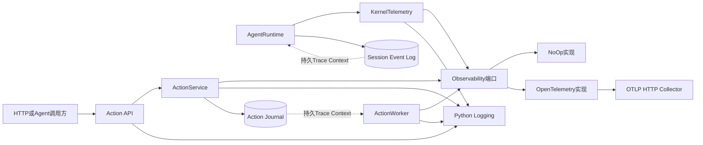

**图示说明：** Observability端口是业务调用方与具体SDK之间的同步边界。API、Action和Worker直接调用
端口；Agent先经过`KernelTelemetry`，因此两条链的错误隔离和隐私语义并不相同。Journal与Session只保存
传播上下文，不保存Span或Metric。Collector是进程外不可信可用性依赖，不是业务提交参与者。

**源码映射：** 端口和No-op位于[`core.py`](../../src/harnessix/observability/core.py)；OTel实现位于
[`opentelemetry.py`](../../src/harnessix/observability/opentelemetry.py)；Agent包装位于
[`agent/telemetry.py`](../../src/harnessix/agent/telemetry.py)；Action和Agent持久化分别由
[`runtime.py`](../../src/harnessix/runtime.py)与[`agent/runtime.py`](../../src/harnessix/agent/runtime.py)发起。

### 5.1 信任分区

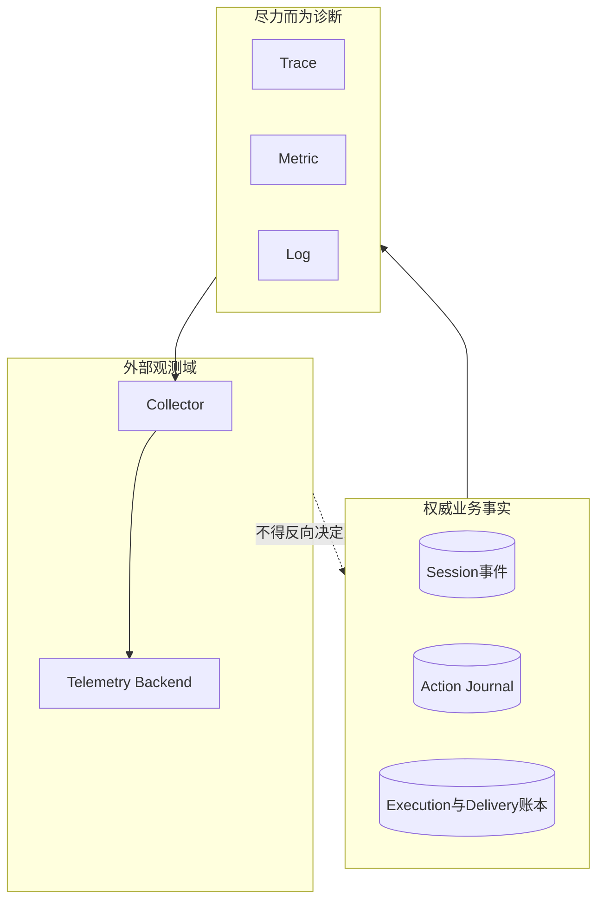

权威恢复必须读取Session、Journal和专用账本，不能依据“是否看到了Span”决定重试、重复执行或审批结果。
Trace/Metric丢失最多降低诊断能力；理想边界是不改变业务结果，但当前Action/API直接调用仍存在实现缺口。

### 5.2 允许依赖与禁止旁路

| 调用方向 | 允许 | 禁止 |
|---|---|---|
| 领域/运行时→Observability | 使用内部Protocol和`TraceContext` | 在领域模型中保存OTel SDK对象 |
| Observability→领域 | 只复用`TraceContext`合同 | 修改Action、Turn或审批状态 |
| Observability→Collector | OTLP/HTTP Trace与Metric | 让Collector参与业务事务或恢复判断 |
| 调用方→Metric | 使用稳定名称和有界标签 | 放入Prompt、路径、ID、参数、结果、Secret或异常原文 |
| 调用方→Span | 放入必要关联ID和固定类别 | 放入Prompt、工具正文、环境值和Secret |
| 日志上下文→Formatter | 只绑定白名单关联字段 | 认为白名单能自动清洗消息及异常文本 |
| Agent→Observer | 经过`KernelTelemetry` | 让Exporter异常覆盖原始业务异常 |

## 6. 包结构与推荐阅读顺序

| 顺序 | 文件 | 关键符号 | 阅读目的 |
|---:|---|---|---|
| 1 | [`core.py`](../../src/harnessix/observability/core.py) | `SpanKind`、`ObservabilitySpan`、`Observability` | 先理解供应商无关端口及允许的数据类型 |
| 2 | [`core.py`](../../src/harnessix/observability/core.py) | `_NoOpSpan`、`NoOpObservability` | 理解默认关闭路径不会建立导出资源 |
| 3 | [`opentelemetry.py`](../../src/harnessix/observability/opentelemetry.py) | `_OpenTelemetrySpan`、`OpenTelemetryObservability` | 理解SDK资源、Exporter、传播器和Instrument缓存 |
| 4 | [`logging.py`](../../src/harnessix/observability/logging.py) | `bind_log_context`、`trace_log_fields`、`JsonLogFormatter` | 理解日志关联字段和真实脱敏边界 |
| 5 | [`__init__.py`](../../src/harnessix/observability/__init__.py) | `build_observability` | 理解No-op/OTel惰性选择 |
| 6 | [`settings.py`](../../src/harnessix/settings.py) | `Settings.from_environment` | 理解进程级配置来源和校验 |
| 7 | [`bootstrap.py`](../../src/harnessix/bootstrap.py) | `build_service` | 理解API/Worker服务命名和Observer注入 |
| 8 | [`api/app.py`](../../src/harnessix/api/app.py) | `create_app.observe_http` | 追踪HTTP入口Span、日志和请求指标 |
| 9 | [`runtime.py`](../../src/harnessix/runtime.py) | `ActionService` | 追踪Action、Policy、Execution和Reconcile信号 |
| 10 | [`worker.py`](../../src/harnessix/worker.py) | `ActionWorker` | 追踪Consumer Span、Lease和队列Gauge |
| 11 | [`agent/telemetry.py`](../../src/harnessix/agent/telemetry.py) | `KernelTelemetry`、`Operation` | 理解Agent低基数、异常抑制和熔断 |
| 12 | [`agent/runtime.py`](../../src/harnessix/agent/runtime.py) | `AgentRuntime`各Telemetry调用点 | 对照Turn、Model、Tool、Context、Retry和恢复主链 |
| 13 | [`tests/agent/test_telemetry.py`](../../tests/agent/test_telemetry.py) | Agent遥测测试组 | 用真实内存Exporter核验安全和故障语义 |
| 14 | [`tests/integration/test_observability_flow.py`](../../tests/integration/test_observability_flow.py) | 三个跨层测试 | 核验Action持久传播、幂等计数和迁移 |
| 15 | [`tests/integration/test_otlp_export.py`](../../tests/integration/test_otlp_export.py) | `test_otlp_http_exports_trace_and_metrics` | 核验真实OTLP HTTP路径和关闭Flush |

## 7. 内部组件架构

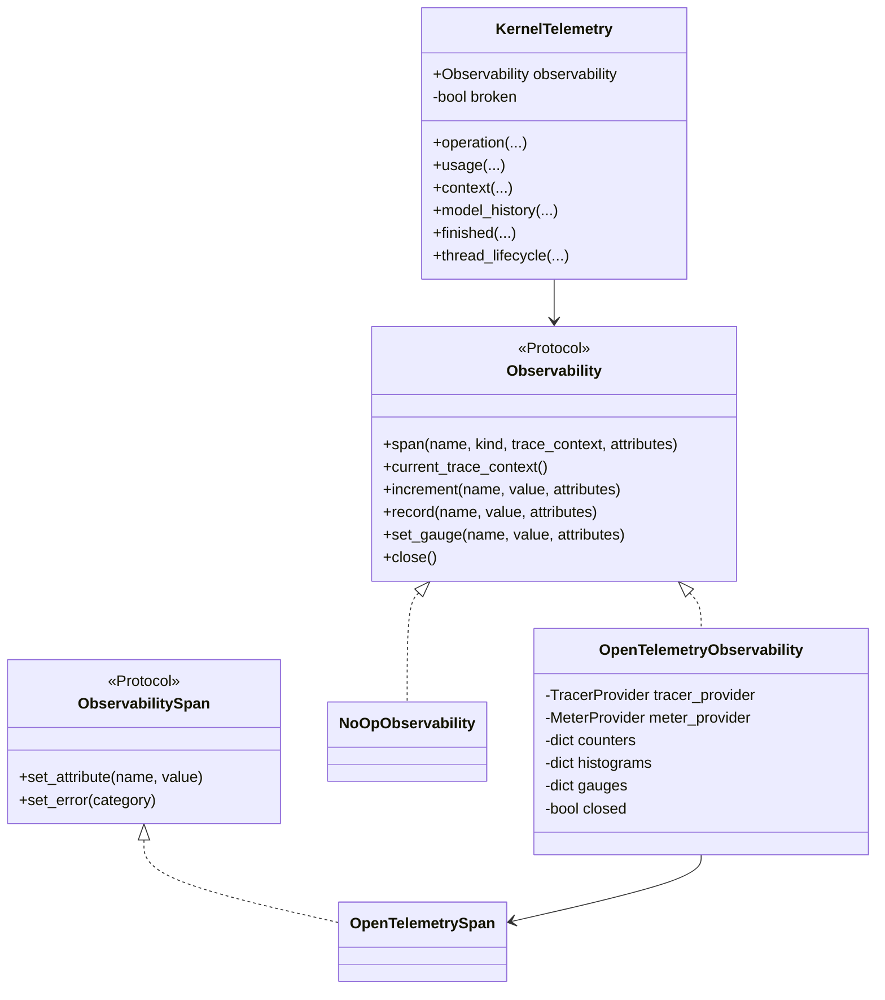

**图示说明：** Python Protocol不要求显式继承；No-op、OTel和测试替身只要实现同一结构即可注入。
`KernelTelemetry`不是另一个Exporter，而是Agent语义、标签策略和错误隔离层。Action链当前没有同等包装层。

### 7.1 组件职责

| 组件 | 拥有状态 | 生命周期 | 线程/任务边界 | 关键不变量 |
|---|---|---|---|---|
| `SpanKind` | 无 | 进程常量 | 全局只读 | 当前仅`internal/server/consumer` |
| `Observability` | 端口，无实现状态 | 由宿主决定 | 方法为同步调用 | 不返回SDK专用类型 |
| `NoOpObservability` | 单例No-op Span | 无资源 | 可被任意调用方共享 | 所有方法不产生效果、不抛业务错误 |
| `OpenTelemetryObservability` | Provider、Tracer、Meter、三个Instrument字典、关闭标志 | 构造到`close` | 无显式Harnessix锁 | 同名Metric固定复用同类Instrument |
| `_OpenTelemetrySpan` | 当前SDK Span引用 | Span上下文内 | 当前Context | `set_error`只写类别和ERROR状态 |
| 日志`ContextVar` | 当前异步上下文的字段字典 | `bind_log_context`作用域 | Task Context传播 | 退出必须按Token恢复原值 |
| `KernelTelemetry` | Observer引用和`_broken`熔断位 | 与AgentRuntime实例一致 | AgentRuntime内使用 | Observer故障不能改变Agent业务结果 |
| `ActionService` | Observer引用 | `initialize`到`close` | API或Worker服务实例 | 当前`close`总会关闭注入Observer |

## 8. Observability端口合同

### 8.1 基础类型

| 类型 | 当前定义 | 约束 | 未表达信息 |
|---|---|---|---|
| `AttributeValue` | `str \| bool \| int \| float` | 不允许列表、对象或`None` | 敏感级别、基数、单位 |
| `MetricAttributes` | `Mapping[str, AttributeValue]` | 调用时可为空 | 标签Schema、允许值集合 |
| `SpanKind` | `INTERNAL/SERVER/CONSUMER` | 映射OTel同名Kind | `CLIENT`、`PRODUCER`未实现 |
| `TraceContext` | `traceparent: str`、`tracestate: str \| None` | 长度由Pydantic字段约束；严格W3C有效性主要由传播器判断 | Baggage、Span Link、远端标记 |

[`core.py`](../../src/harnessix/observability/core.py)的`SpanKind`文档字符串仍写有“客户端”，但枚举没有
`CLIENT`成员；当前合同以实际枚举为准，该注释属于待修正文档债。

### 8.2 方法合同

| 方法 | 输入/输出 | 当前前置条件 | 当前后置条件 | 超时/重试 | 幂等与顺序 | 敏感边界 |
|---|---|---|---|---|---|---|
| `span` | 名称、Kind、父Context、属性→上下文管理器 | 名称和属性由受信调用方提供 | 进入后当前Context可被提取，退出后Span结束 | 无Harnessix超时/重试 | 每次调用新建Span | 属性不会自动脱敏 |
| `current_trace_context` | 无→`TraceContext?` | 应在活动Span内调用 | OTel实现注入W3C载体并复制为领域合同 | 无 | 只读快照 | 仅Context，不含业务正文 |
| `increment` | 名称、整数增量、属性→无 | 调用方选择Counter名称 | 同名Counter懒创建并累加 | 无 | 重复调用重复计数 | 标签不会自动校验基数 |
| `record` | 名称、浮点值、属性→无 | 调用方选择Histogram名称 | 同名Histogram懒创建并记录 | 无 | 重复调用重复记录 | 当前单位总为`s` |
| `set_gauge` | 名称、数值、属性→无 | SDK支持同步Gauge | 同名Gauge懒创建并设置 | 无 | 后值不撤销前一次导出 | 标签不会自动校验基数 |
| `close` | 无→无 | 由生命周期Owner调用 | No-op直接返回；OTel依次关闭Trace和Metric Provider | 无显式超时 | OTel实现本实例幂等 | 失败可向调用方传播 |

### 8.3 Span句柄合同

| 方法 | 当前行为 | 错误语义 | 隐私语义 |
|---|---|---|---|
| `set_attribute` | 原样转发给SDK Span | SDK异常向直接调用者传播；Agent包装会捕获 | 值未自动脱敏 |
| `set_error` | 写`error.type=<category>`并将状态设为ERROR | 不记录独立Harnessix错误对象 | 设计上应只传低基数类别 |

`_OpenTelemetrySpan.set_error`不主动添加Exception Event或Stacktrace。但如果业务异常穿过
`OpenTelemetryObservability.span`的上下文管理器，底层`start_as_current_span`仍可能按SDK默认行为自动记录
异常。Agent通过特殊退出策略避免这条路径；Action/API直接路径没有统一避免。

## 9. OpenTelemetry适配器

### 9.1 构造流程

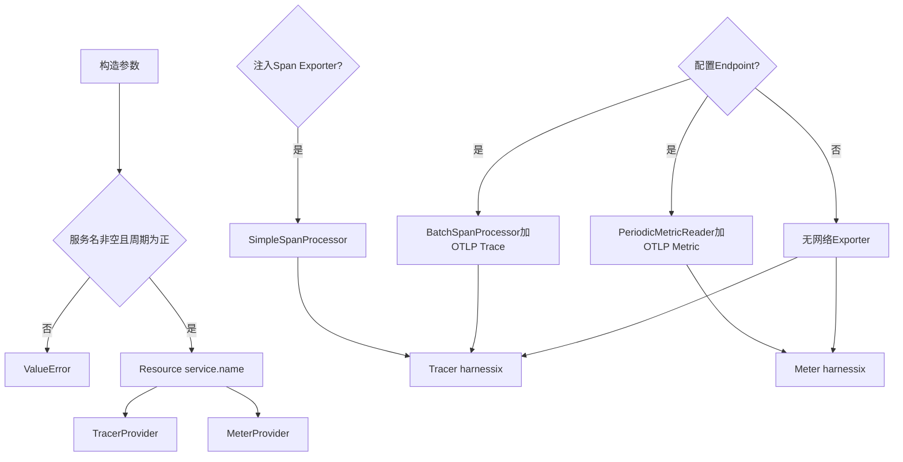

**图示说明：** 测试注入`span_exporter`时使用同步`SimpleSpanProcessor`；配置网络Endpoint时Trace使用
`BatchSpanProcessor`，Metric使用周期Reader。Provider保存在实例内，没有调用全局Provider注册函数。

### 9.2 资源与Endpoint语义

| 参数 | 默认值 | 实现语义 | 生产注意事项 |
|---|---:|---|---|
| `service_name` | 无 | 只写入Resource的`service.name` | 不自动写版本、环境、实例ID、租户或部署区 |
| `endpoint` | `None` | 去掉末尾`/`后追加固定Signal路径 | 必须传Collector基础地址，不应传已经包含`/v1/traces`的地址 |
| `export_interval_millis` | `10000` | Metric周期导出间隔 | 不控制Trace批处理周期，也不控制Shutdown上限 |
| `span_exporter` | `None` | 注入时使用Simple处理器 | 主要用于确定性测试，不与网络配置互斥 |
| `metric_reader` | `None` | 注入自定义Reader | 主要用于内存测试，可与网络Reader同时存在 |

当前Endpoint拼接结果严格为：

```text
<rstrip(endpoint, '/')>/v1/traces
<rstrip(endpoint, '/')>/v1/metrics
```

模块没有暴露OTLP Headers、证书、mTLS、代理、压缩、请求超时或单Signal Endpoint。环境变量只决定传入的
基础地址，未直接采用OTel SDK的全部标准环境配置面。

### 9.3 Span创建与父上下文

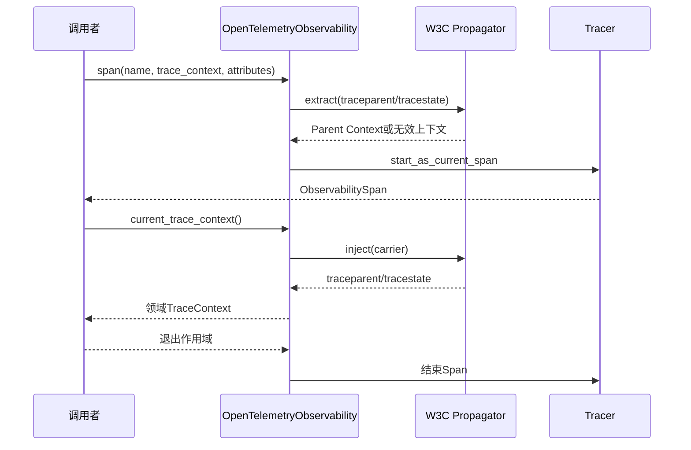

传入`None`时使用当前进程上下文；传入格式无效但能通过领域长度校验的`TraceContext`时，传播器不会采用
该父级，Tracer创建新的有效Trace。单元测试明确验证`traceparent="invalid"`不会原样传播。

### 9.4 Instrument缓存

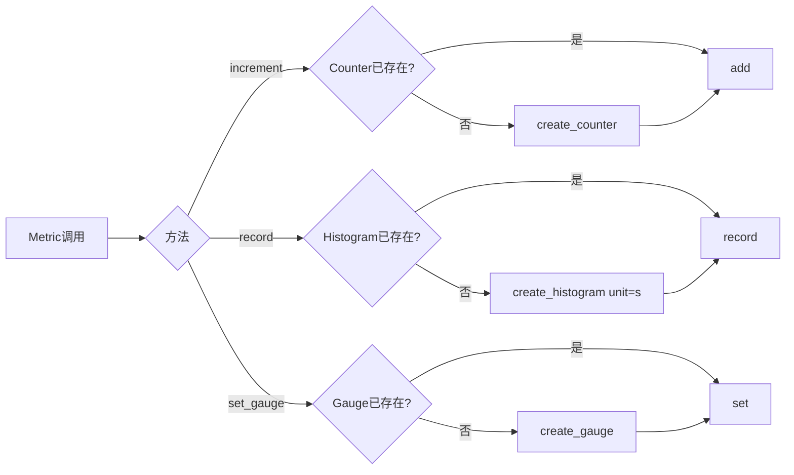

三个字典按任意字符串名称增长，当前没有名称白名单、最大Instrument数或冲突检测。如果同一名称先作为
Counter再作为Histogram，两个字典会分别创建不同类型的同名Instrument；调用方必须通过代码评审维持稳定
命名。实现也没有显式锁保护“检查后创建”，并发语义依赖Python执行和OTel SDK行为，仓库没有并发注册测试。

## 10. Trace设计

### 10.1 当前Span目录

| Span名称 | Kind | 创建位置 | 初始属性 | 结束时属性/状态 | 父级来源 |
|---|---|---|---|---|---|
| `harnessix.http.request` | SERVER | API Middleware | `http.request.method` | 成功时status code、route；异常由SDK路径处理 | 入站W3C Header或新Trace |
| `harnessix.action.submit` | INTERNAL | `ActionService.submit` | `tool`、`effect_class` | 成功写Action status；异常写`harnessix.outcome=error` | 当前HTTP/Agent Context |
| `harnessix.policy.evaluate` | INTERNAL | `_submit` | `tool` | 无显式结果属性 | Action submit |
| `harnessix.worker.consume` | CONSUMER | `ActionWorker.run_once` | `tool` | 无显式状态 | 持久`ActionSnapshot.trace_context` |
| `harnessix.action.execute` | INTERNAL | `execute_leased` | `tool`、`effect_class` | `harnessix.action.status` | Worker consumer或当前Context |
| `harnessix.action.reconcile` | INTERNAL | `reconcile` | `tool` | 无显式结果属性 | 当前调用Context |
| `harnessix.agent.turn` | INTERNAL | Agent运行/恢复 | `thread_id`、`turn_id` | `outcome`、可选`error.type` | 入参或持久Turn Context |
| `harnessix.agent.model` | INTERNAL | 模型采样 | `thread_id`、`turn_id`、`model_step` | `outcome`、可选错误类别 | 当前Turn Span |
| `harnessix.agent.tool` | INTERNAL | 单个Tool调用 | `thread_id`、`turn_id`、`call_id` | `outcome`、可选错误类别 | 当前Turn Span |
| `harnessix.agent.approval` | INTERNAL | 审批答复 | `thread_id`、`turn_id` | `outcome`、可选错误类别 | 持久Turn Context |
| `harnessix.agent.cancel` | INTERNAL | 取消 | `thread_id`、`turn_id` | `outcome`、可选错误类别 | 持久Turn Context |
| `harnessix.agent.recovery` | INTERNAL | 启动恢复 | `thread_id`、`turn_id` | `outcome`、可选错误类别 | 持久Turn Context |
| `harnessix.agent.context` | INTERNAL | Context准备 | IDs、`model_step` | `outcome`、可选错误类别 | 当前Turn Span |
| `harnessix.agent.history` | INTERNAL | 模型历史视图准备 | IDs、`model_step` | `outcome`、可选错误类别 | 当前Turn Span |
| `harnessix.agent.compaction` | INTERNAL | 摘要压缩 | IDs、`model_step` | `outcome`、可选错误类别 | 当前Turn Span |
| `harnessix.agent.retry` | INTERNAL | Turn Retry | IDs | `outcome`、可选错误类别 | 入参或新Trace |

当前没有Model Provider的`CLIENT` Span、OTLP Export自身Span、Delivery/Trusted Action统一Span或Protocol请求Span。

### 10.2 Agent有限时长Trace片段

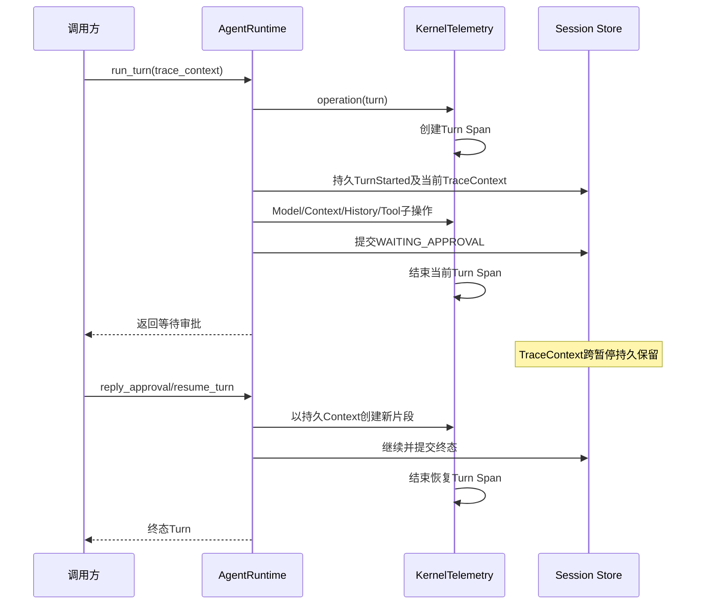

暂停审批不是一个无限期开放的Span。第一次运行在返回`WAITING_APPROVAL`时结束；答复和恢复创建新的有限片段，
并使用持久`Turn.trace_context`继续相同Trace。崩溃恢复同理。该设计避免Span跨进程长期悬挂，同时保留链路身份。

### 10.3 Agent异常抑制

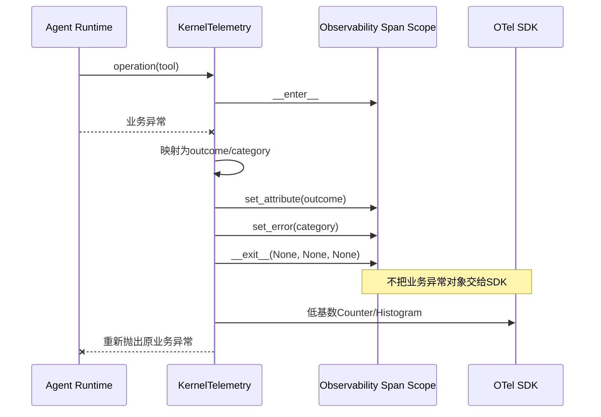

`KernelTelemetry.operation`捕获`BaseException`只为分类，随后原样重新抛出。关闭Scope时刻意传入三个`None`，
因此OTel不会自动收到业务异常对象。取消结果标记为`cancelled`，但不调用`set_error`；一般失败只暴露
`FailureCategory`，不暴露消息和堆栈。

## 11. Durable Trace Context

### 11.1 数据合同

| 字段 | 类型 | 必填 | 来源 | 约束 | 持久位置 | 敏感级别 | 兼容规则 |
|---|---|---:|---|---|---|---|---|
| `traceparent` | `str` | 是 | 入站Header或当前OTel Span | Pydantic长度1～128；W3C有效性由传播器判定 | Action `trace_context_json`、Agent `TurnStarted`事件 | 诊断标识 | 无效父级不采用；旧记录可为空 |
| `tracestate` | `str?` | 否 | 入站Header或传播器 | 最大512字符 | 同上 | 可能包含供应商状态 | 缺失保持`None` |

`TraceContext`是运行时拥有的诊断合同，不是Action请求载荷；不会加入Action请求指纹。Agent `TurnStarted`
同样持久化它，以便审批、取消和恢复创建连续片段。

### 11.2 Action跨API/Worker流程

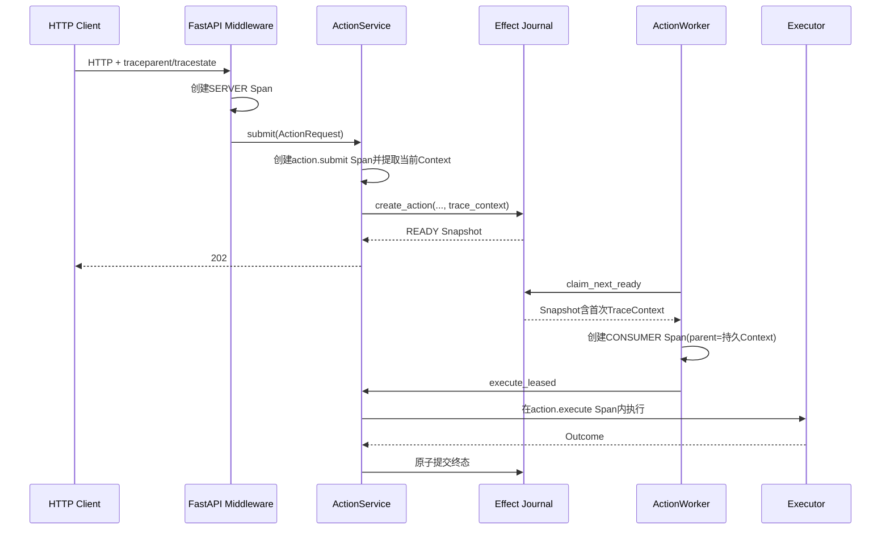

首次创建Action时，SQLite或PostgreSQL与请求、工具和初始状态一起写入`trace_context_json`。同一
`action_id`或幂等键的合法重复提交返回既有Snapshot，不覆盖首次上下文，也不会再次累计Action终态指标。

### 11.3 持久化Schema

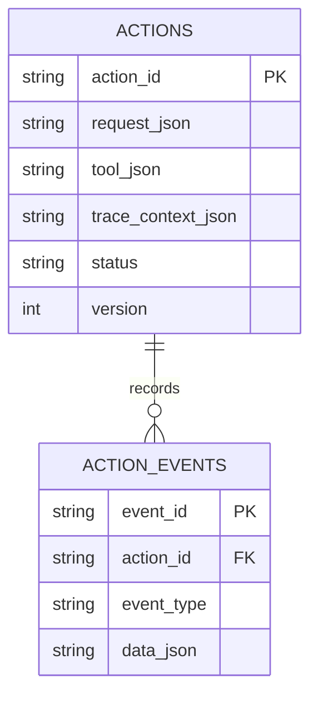

SQLite迁移[`0002_observability.sql`](../../src/harnessix/storage/migrations/0002_observability.sql)增加可空列；
PostgreSQL迁移[`postgresql/0002_observability.sql`](../../src/harnessix/storage/migrations/postgresql/0002_observability.sql)
使用`IF NOT EXISTS`。历史Action没有上下文时，Worker创建新的Trace，不拒绝执行。

### 11.4 Context与业务身份的区别

| 字段 | 所在域 | 是否业务幂等输入 | 主要用途 |
|---|---|---:|---|
| `ActionRequest.context.trace_id` | 上游Action Context | 是，请求合同的一部分 | 上游提供的关联提示 |
| `ActionSnapshot.trace_context` | 运行时快照 | 否 | W3C跨队列父上下文 |
| `Turn.trace_context` | Agent Event投影 | 与Turn接受事件一起持久化 | 暂停/恢复Trace片段 |
| Span的`thread_id/turn_id/call_id` | OTel Span属性 | 否 | 单次诊断关联 |
| Metric属性 | 聚合时序 | 否 | 低基数统计，禁止放上述ID |

## 12. Metric设计

### 12.1 Action、HTTP和Worker Counter

| 名称 | 值 | 属性 | 记录时机 | 当前语义限制 |
|---|---:|---|---|---|
| `harnessix.actions.submitted` | `1` | `tool,effect_class` | 每次进入新/重复提交处理前 | 重复请求也计Submitted |
| `harnessix.actions.submit_errors` | `1` | `tool,effect_class` | `submit`主链异常 | 不含错误类别 |
| `harnessix.actions.completed` | `1` | `tool,status` | 本进程确认新的确定终态 | 重复提交不重复计；非持久Exactly-once |
| `harnessix.executions.completed` | `1` | `tool,status` | `execute_leased`返回结果 | FAILED/UNKNOWN仍算执行完成 |
| `harnessix.worker.claims` | `1` | `tool` | Worker成功Claim READY Action | 不含Worker ID |
| `harnessix.worker.lease_renewal_failures` | `1` | `tool` | 确认未提交终态且失去Lease | 终态提交竞态不误计 |
| `harnessix.lease.recoveries` | 恢复数 | 无 | 初始化或周期恢复过期Lease | 一次记录可大于1 |
| `harnessix.approvals.decisions` | `1` | `tool,outcome` | 尝试处理审批决定前 | 若后续状态冲突，计数仍已发生 |
| `harnessix.reconciliation` | `1` | `tool,outcome` | 对账返回或抛异常 | 异常固定`outcome=error` |
| `harnessix.http.requests` | `1` | 成功：`method,route,status`；异常：`method,status` | HTTP响应或未处理异常 | 同一Metric存在两种属性集合 |

### 12.2 Action、HTTP和Worker Histogram/Gauge

| 名称 | 类型 | 值语义 | 属性 | 记录条件 |
|---|---|---|---|---|
| `harnessix.action.duration` | Histogram | 提交到返回Snapshot的秒数 | `tool,status` | 成功完成`submit`；异常不记录 |
| `harnessix.executor.duration` | Histogram | Lease执行总秒数 | `tool,status` | `execute_leased`正常返回 |
| `harnessix.reconciliation.duration` | Histogram | 对账调用秒数 | `tool,outcome` | Executor返回Outcome；异常不记录 |
| `harnessix.http.duration` | Histogram | HTTP Middleware秒数 | `method,route,status` | 正常得到Response；异常不记录 |
| `harnessix.queue.ready` | Gauge | READY Action数 | 无 | Worker运维采样 |
| `harnessix.queue.oldest_ready_age` | Gauge | 最老READY等待秒数 | 无 | 无READY时为0 |
| `harnessix.actions.pending_approval` | Gauge | 等待审批Action数 | 无 | Worker运维采样 |
| `harnessix.actions.unknown` | Gauge | UNKNOWN Action数 | 无 | Worker运维采样 |

### 12.3 Agent Counter

| 名称 | 值 | 属性 | 来源事实 |
|---|---:|---|---|
| `harnessix.agent.operations` | `1` | `operation,outcome,category?` | 每个Telemetry操作结束 |
| `harnessix.agent.tokens.input` | 已提交增量 | 无 | Session已提交Usage差值 |
| `harnessix.agent.tokens.output` | 已提交增量 | 无 | Session已提交Usage差值 |
| `harnessix.agent.context.fragments` | `1` | `kind,disposition` | 每个Context Fragment检查记录 |
| `harnessix.agent.context.sources` | `1` | `kind,status` | v2/v3每个Context Source检查记录 |
| `harnessix.agent.context.consistency` | `1` | `strategy,result=stable` | v3双观察一致性事实 |
| `harnessix.agent.model_history.tool_results` | 结果数量 | `strategy` | Inline或Artifact Reference决策 |
| `harnessix.agent.turns.finished` | `1` | `status,category?` | 新终态成功提交后 |
| `harnessix.agent.thread.lifecycle` | `1` | `action,outcome` | Resume/Fork/Archive操作 |

Usage指标使用持久提交后的累计差值，不直接累计Provider重复发送的部分Usage事件。测试验证失败和成功Attempt都
与最终`Turn.usage`一致，Metric不携带Attempt ID或Model名称。

### 12.4 Agent Histogram

| 名称 | 值语义 | 属性 | 当前单位结果 |
|---|---|---|---|
| `harnessix.agent.operation.duration` | 单个操作单调时钟耗时 | `operation,outcome,category?` | `s`，正确 |
| `harnessix.agent.context.tokens` | available/history/tools/instructions/estimated_input Token数 | `component` | 被错误标为`s` |
| `harnessix.agent.model_history.tool_result_bytes` | Source/View UTF-8字节数 | `component` | 被错误标为`s` |
| `harnessix.agent.model_history.artifact_bindings` | Artifact绑定数量 | 无 | 被错误标为`s` |
| `harnessix.agent.thread.fork.inherited_items` | Fork继承Item数量 | 无 | 被错误标为`s` |

`Observability.record`没有单位参数，OTel适配器又无条件`create_histogram(..., unit="s")`，因此非时长
Histogram的元数据不正确。数值本身仍按调用值记录，但查询、Dashboard和单位换算不能依赖当前单位。

### 12.5 基数策略

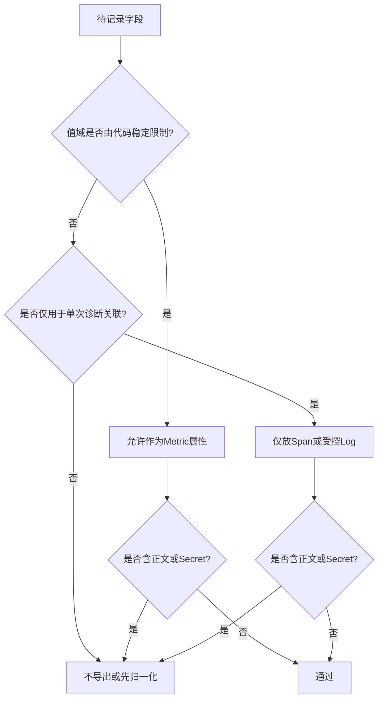

| 字段类别 | Metric | Span | 受控日志上下文 | 说明 |
|---|---:|---:|---:|---|
| `operation/status/category/outcome` | 允许 | 允许 | 通常不绑定 | 代码控制的有限集合 |
| `component/kind/disposition/strategy` | 允许 | 允许 | 通常不绑定 | 必须保持合同枚举 |
| `tool` | 当前允许 | 当前允许 | 允许 | Registry若可动态扩张，仍可能形成较高基数 |
| `http.route`模板 | 当前允许 | 允许 | 消息中输出 | 必须使用模板，不使用原始URL |
| `thread_id/turn_id/call_id/action_id` | 禁止 | 允许 | Action ID允许 | 高基数关联身份 |
| `tenant_id/worker_id` | 禁止 | 当前Span通常不放 | 白名单允许 | 多租户/实例高基数 |
| Prompt、路径、参数、结果 | 禁止 | 禁止 | 禁止 | 用户内容或敏感工程数据 |
| 异常消息和堆栈 | 禁止 | Agent禁止；Action/API未统一阻断 | Formatter当前会输出 | 必须在调用点治理 |
| Secret/Token/Header | 禁止 | 禁止 | 禁止 | 不得进入任何遥测信号 |

## 13. 结构化日志设计

### 13.1 上下文作用域

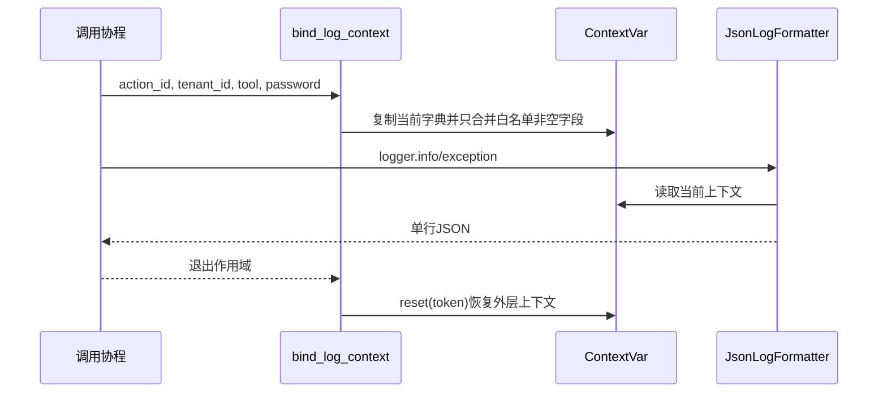

白名单精确包含：`action_id`、`tenant_id`、`tool`、`worker_id`、`trace_id`、`span_id`。未知字段和
值为`None`的字段被忽略，其余值统一转为字符串。嵌套作用域复制父字典并在退出时恢复，不会主动清除父字段。

### 13.2 JSON格式

| 字段 | 来源 | 总是存在 | 约束 |
|---|---|---:|---|
| `timestamp` | `record.created`转UTC ISO 8601 | 是 | 墙钟时间，不是单调耗时 |
| `level` | `record.levelname` | 是 | Python日志级别 |
| `logger` | `record.name` | 是 | Logger命名空间 |
| `message` | `record.getMessage()` | 是 | 未自动脱敏，可包含格式化参数 |
| 白名单Context | 当前`ContextVar` | 否 | 值转字符串 |
| `exception` | `formatException(record.exc_info)` | 否 | 完整异常及堆栈，未自动脱敏 |

序列化使用`ensure_ascii=False`、紧凑分隔符和`default=str`。因此中文保持可读，但任意不可序列化对象可能
通过`str()`进入输出。白名单只约束额外上下文字段，不能被解释为对`message`或`exception`的DLP。

### 13.3 Trace日志关联

`trace_log_fields`只按`-`拆分字符串并要求四段，然后返回第二段`trace_id`和第三段`span_id`。它不自行
校验十六进制、长度、版本、采样Flags或全零ID。`TraceContext`领域模型当前也只限制字符串长度，不完整
验证W3C语法；API日志所说的“格式或长度不合法”实际上只覆盖模型能识别的空值/长度问题，更深的合法性由
OTel传播器在提取父级时处理。生产调用点通常传入OTel生成的当前`traceparent`；若未来直接把不可信字符串
送入日志关联函数，必须先完成W3C校验。

### 13.4 根日志配置

| 参数 | 默认 | 校验 | 效果 |
|---|---:|---|---|
| `level` | `INFO` | `getattr(logging, upper)`必须为整数 | 设置Root Logger级别 |
| `log_format` | `json` | 只能`json/console` | 选择`JsonLogFormatter`或标准文本Formatter |

`configure_logging`创建一个`StreamHandler`，清空Root Logger已有全部Handler后再安装。它不是增量配置；
嵌入其他宿主时可能移除宿主已有Handler。当前顶层CLI只在Action `serve`和`worker`分支之前执行该配置，
`agent`、`agent-server`、`model-smoke`和`coding-eval-campaign`会提前分派，不经过该调用。

## 14. 配置、装配与生命周期

### 14.1 环境配置

| 环境变量 | 默认值 | Settings字段 | 当前校验 | 说明 |
|---|---:|---|---|---|
| `HARNESSIX_SERVICE_NAME` | `harnessix` | `service_name` | 非空 | Action服务自动追加组件后缀 |
| `HARNESSIX_LOG_LEVEL` | `INFO` | `log_level` | Settings阶段不校验；配置日志时校验 | 必须是Python标准整数Level名称 |
| `HARNESSIX_LOG_FORMAT` | `json` | `log_format` | `json/console` | 只影响Python标准输出日志 |
| `HARNESSIX_OTEL_ENDPOINT` | 空 | `otel_endpoint` | 无URL格式校验 | 优先于标准Endpoint变量 |
| `OTEL_EXPORTER_OTLP_ENDPOINT` | 空 | `otel_endpoint`回退 | 无URL格式校验 | 仅作为基础地址读取 |
| `HARNESSIX_OTEL_EXPORT_INTERVAL_MILLIS` | `10000` | `otel_export_interval_millis` | 大于0 | 只控制Metric周期Reader |

环境数字转换错误会在`Settings.from_environment`直接抛`ValueError`。Endpoint存在并不在启动时验证Collector
可达性；Exporter通常在后台或关闭Flush时才暴露连接问题。

### 14.2 构造决策

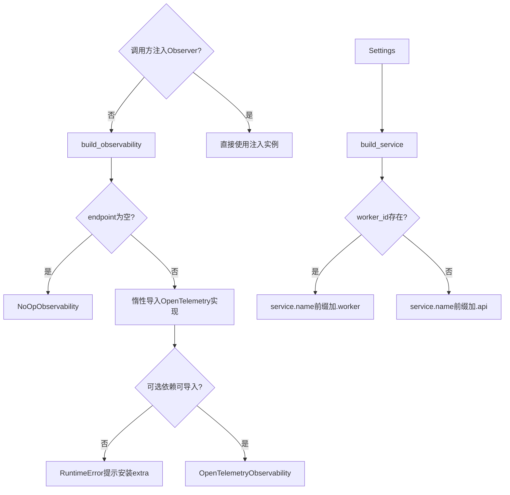

Endpoint为空时不会导入`opentelemetry.py`，因此基础安装不需要Observability Extra。启用时应安装项目的
`observability`可选依赖。工厂仅捕获ImportError并转换为固定RuntimeError，构造参数错误仍直接传播。

### 14.3 当前产品装配矩阵

| 运行形态 | Observer来源 | 日志配置 | 当前结论 |
|---|---|---|---|
| 旧Action API | `build_service`按Settings构造 | 无顶层CLI入口 | 仅迁移兼容测试可启用，不是产品观测链 |
| 旧Action Worker | 独立`build_service`构造 | 无顶层CLI入口 | 仅迁移兼容测试可启用，0.9.1f3删除 |
| 旧Action内联模式 | API服务同一Observer | 无产品装配 | 只记录历史Submit/Execute行为 |
| `harnessix agent` | App Server产品链未注入 | 顶层CLI提前分派，不配置 | Agent Telemetry实际No-op |
| `harnessix agent-server` | `run_product_stdio`未注入 | 顶层CLI提前分派，不配置 | Agent Telemetry实际No-op |
| Model Smoke | 未注入 | 顶层CLI提前分派 | 无外部Agent遥测 |
| Coding Eval | `run_historical_coding_eval`可由库调用方注入 | CLI未统一配置 | 默认No-op；旧Action观测随Eval迁移删除 |

### 14.4 生命周期与所有权

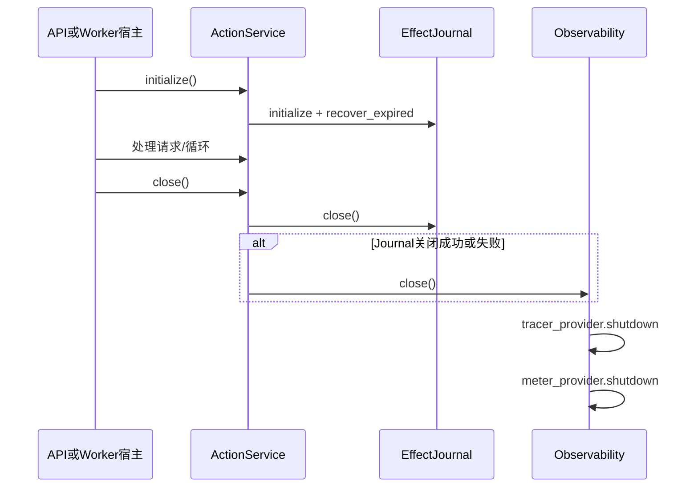

`ActionService.close`通过`finally`确保Journal关闭失败时仍关闭Observer。`OpenTelemetryObservability.close`
使用`_closed`防止重复Shutdown，但先关闭Tracer再关闭Meter；任一步异常都可能向宿主传播，且没有有界超时。

Agent Runtime不同：它不关闭外部注入Observer，符合“宿主拥有共享Exporter”的语义。Action Service无所有权
标志，无论Observer是内部构造还是外部注入都会关闭它。若多个Service共享同一实例，先关闭的Service会影响
其余调用者；Eval当前把同一Observer注入Action和Agent，并在全部Agent工作结束后由Action Service关闭，调用方
仍需知道该隐式所有权转移。

## 15. 正常业务流程

### 15.1 HTTP成功路径

1. Middleware读取`traceparent`和`tracestate`；
2. 领域`TraceContext`校验失败时只记录固定消息，然后忽略远端父级；
3. 创建`harnessix.http.request` SERVER Span，初始只有HTTP Method；
4. 从活动Span提取当前W3C Context并绑定日志Trace/Span ID；
5. 执行FastAPI下游路由；
6. 使用路由模板而不是原始URL作为`http.route`与Metric标签；
7. 写响应状态、请求Counter、耗时Histogram和固定格式日志；
8. 退出Middleware后结束SERVER Span。

### 15.2 Action提交成功路径

```text
resolve tool definition
start action.submit span(tool, effect_class)
extract current W3C context
bind action/tenant/tool/trace log fields
increment actions.submitted
create action with trace context if and only if it is new
if duplicate:
    return original snapshot without completion metric
validate request and transition state
run policy in child span
route to DENIED, PENDING_APPROVAL, READY, or inline execution
if this call created a terminal action:
    increment actions.completed once
record action.duration for normal return
return snapshot
```

Submitted按调用尝试计数，Completed按本进程确认的新终态计数；二者不是同一个Exactly-once事务，也不能替代
Journal事件统计。

### 15.3 Worker执行成功路径

1. 从Journal原子Claim一个READY Action；没有任务时不创建Span；
2. 成功Claim后累计`worker.claims`；
3. 使用Snapshot中持久的Trace Context创建CONSUMER Span；
4. 绑定Action、Tenant、Tool、Worker和当前Trace日志字段；
5. 后台执行Action，同时按Heartbeat周期续租；
6. Action Service在内部`action.execute` Span中提交Executor终态；
7. Worker退出CONSUMER Span后采集队列Gauge；
8. Gauge采集失败只记录日志，不改变已经返回的执行结果。

### 15.4 Agent成功路径

```text
open operation span with thread/turn/call/step identifiers
execute durable business operation
commit Session event or state transition
derive bounded outcome and category
record committed usage/context/history facts
set span outcome and optional error category
close span without passing business exception object
increment operation counter
record monotonic duration
return authoritative Turn result
```

高基数ID只位于Span；Metric只接收操作、结果、类别、状态、组件和策略等受控属性。终态Metric在Session新终态
提交后发出，重复Resume不应再次累计。

## 16. 失败、取消与恢复

### 16.1 Agent Observer熔断状态

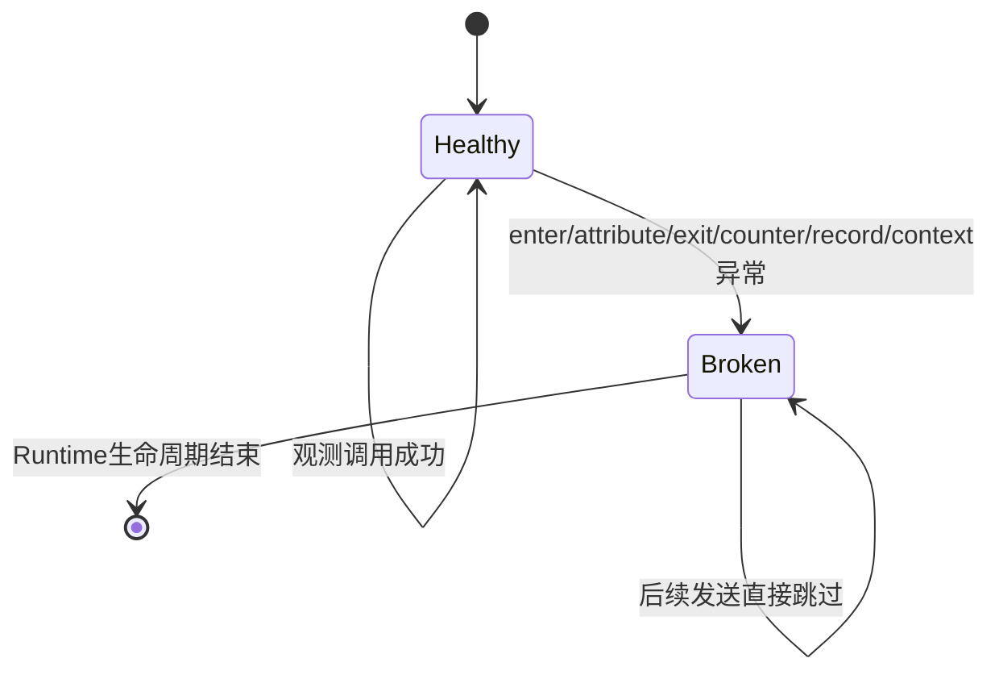

`_broken`是`KernelTelemetry`实例内布尔值，不持久化、不定时探测恢复。首次失败调用`_degrade`并尝试输出一条
固定Warning；日志Handler若再次失败也被吞掉。后续操作继续执行业务，但不再向该Observer发送任何信号。

### 16.2 Agent错误分类

| 捕获对象 | Outcome | Failure Category | Span ERROR | 是否重新抛出 |
|---|---|---|---:|---:|
| `TurnCancelled` | `cancelled` | 来自固定取消Failure | 否 | 是 |
| `asyncio.CancelledError` | `cancelled` | 固定取消类别 | 否 | 是 |
| `KernelError` | `failed` | `to_failure()`结果 | 是 | 是 |
| 普通`Exception` | `failed` | `internal` | 是 | 是 |
| 其他`BaseException` | `interrupted` | `interrupted` | 是 | 是 |
| 调用方主动`finish` | 白名单值或降级`failed` | 由Failure或默认规则 | 取消外的类别设ERROR | 不适用 |

传给`finish`的不认识Outcome会归一化为`failed`。`unknown`映射`interrupted`类别，裸`failed`映射
`internal`；错误类别进入Span和Metric，错误消息不进入。

### 16.3 Action/API故障矩阵

| 场景 | 当前业务行为 | 当前遥测行为 | 恢复依据 | 已知问题 |
|---|---|---|---|---|
| 非法入站Trace Header | 忽略Header并继续 | 固定Info日志，新建Trace | 无需恢复 | 日志不回显Header |
| HTTP Handler异常 | 原异常传播给FastAPI | Counter后`logger.exception`，Span可能自动记录异常 | 业务层状态 | 不记录duration/route；异常堆栈可能泄漏 |
| Action提交异常 | 原异常传播 | 设置outcome、计Error、完整异常日志 | Journal当前事实 | Observer自身异常可覆盖业务异常 |
| Policy异常 | Action转FAILED并持久化`policy_error` | Span可能自动记录异常对象 | Journal终态 | 未显式低基数Span错误策略 |
| Executor异常 | 转FAILED或UNKNOWN并持久化 | Execute Span只写最终status | Journal终态/对账 | 不标Span ERROR，异常语义只在业务结果 |
| Reconcile异常 | 回到UNKNOWN | Counter outcome=error；Span可能记录异常 | Journal UNKNOWN | 不记录失败duration |
| Gauge采集异常 | 执行结果不变 | 完整异常日志 | 下周期重采 | 仅该路径显式隔离 |
| Lease续租失败 | 取消失租Task并核对终态 | 确认真失租后计Counter | Journal与最后Event | Counter调用异常仍可改变抛出结果 |
| Observer Close异常 | 宿主关闭可失败 | 可能未完成后续Provider shutdown | 已持久业务事实 | 无超时、无隔离、顺序部分完成 |

### 16.4 崩溃与遥测丢失

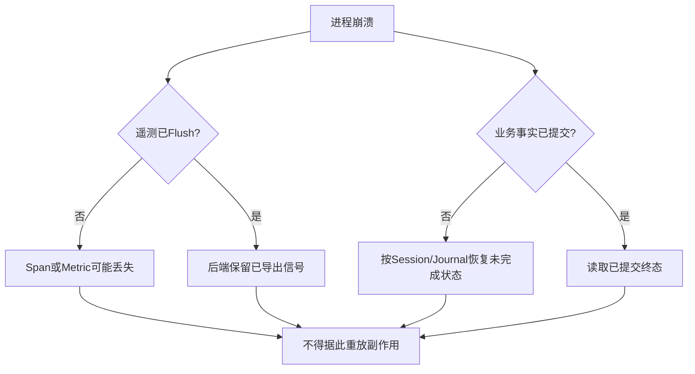

OTel Batch处理器和周期Metric Reader不是Harnessix持久账本。进程硬崩溃时，内存中未导出的信号不可恢复；
Session/Journal恢复也不会补发历史Span或Metric。运行人员应使用业务账本判定状态，再把遥测作为关联证据。

### 16.5 超时与重试

- Observability Protocol没有Timeout或Retry参数；
- OTLP重试行为完全依赖所用SDK/Exporter版本，Harnessix没有额外包裹；
- `export_interval_millis`只控制Metric周期，不是请求超时；
- `close`没有Harnessix有界超时；
- Agent熔断后本实例不重试Observer；
- Worker运维Gauge在下个恢复/运行周期自然重采，不保存失败次数；
- 不允许因为Trace缺失、Metric缺失或导出失败而自动重放模型、工具或副作用。

## 17. 数据流、状态与持久化

### 17.1 信号数据流

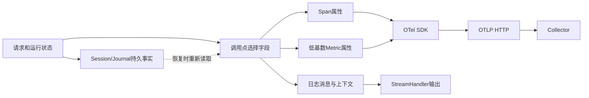

模块不读取完整业务对象并自动选择字段；每个调用点负责构造属性。因而隐私和基数控制不是端口级强制Schema，
而是实现约定加测试。日志正文由调用方直接形成，独立于白名单Context。

### 17.2 内存状态

| 状态 | Owner | 生存期 | 有界性 | 崩溃后 |
|---|---|---|---|---|
| 当前OTel Context | OTel/ContextVar | 当前同步/异步上下文 | 随调用深度 | 丢失 |
| 日志Context字典 | `ContextVar` | `bind_log_context`作用域 | 最多6个允许键 | 丢失 |
| Counter缓存 | OTel Adapter | Adapter实例 | 名称无上限 | 丢失并重建 |
| Histogram缓存 | OTel Adapter | Adapter实例 | 名称无上限 | 丢失并重建 |
| Gauge缓存 | OTel Adapter | Adapter实例 | 名称无上限 | 丢失并重建 |
| `_closed` | OTel Adapter | Adapter实例 | 布尔 | 重建为False |
| `_broken` | `KernelTelemetry` | AgentRuntime实例 | 布尔 | 重建后重新尝试 |

### 17.3 持久状态Owner

| 持久事实 | Owner | 写入点 | 读取点 | Observability是否Owner |
|---|---|---|---|---:|
| Action Trace Context | Effect Journal | `create_action` | Worker Claim Snapshot | 否 |
| Agent Turn Trace Context | Session Event Log | `TurnStarted` | Resume/Cancel/Recovery | 否 |
| Action/Turn终态 | Journal/Session | 状态事务 | API、Worker、Runtime恢复 | 否 |
| Usage/Cost | Session与Model账本 | Attempt/Usage事件 | Agent/Eval报告 | 否 |
| Telemetry后端数据 | 外部系统 | OTel Exporter | 运维查询 | 仅产生者，不拥有可靠性 |

## 18. 并发与进程边界

### 18.1 异步Context

Python `ContextVar`可随异步Task上下文传播，因此HTTP Middleware绑定的日志字段在同一调用链内可见。新建Task
通常复制创建时Context，但模块没有定义跨线程、手工Context执行或第三方线程池的额外传播合同。作用域必须通过
上下文管理器退出，避免字段污染后续请求。

### 18.2 API与Worker独立进程

API和Worker各自构造独立OTel Provider，服务名分别为`<prefix>.api`与`<prefix>.worker`。它们不共享内存
Context，通过Journal中的W3C字符串关联。独立Provider也意味着采样、队列、关闭和Exporter故障彼此独立。

### 18.3 Instrument并发

Adapter字典没有显式锁；正常调用方使用稳定静态名称，首次创建窗口很短，但当前测试没有覆盖多线程同时首次创建
同名Instrument。该限制不应被外推为已经证明的线程安全保证。后续若开放插件动态Metric注册，应增加白名单、
注册冻结或锁，并用并发测试证明。

### 18.4 关闭竞态

`close`只保护重复关闭，不阻止其他任务在关闭后继续调用`span/increment/record/set_gauge`。调用方必须先停止
接收新请求、结束Worker/Agent任务，再关闭Service和Observer。当前没有引用计数或共享所有权协议。

## 19. 安全与隐私边界

### 19.1 数据分类

| 数据 | 默认允许进入Trace | 默认允许进入Metric | 默认允许进入日志 | 当前强制程度 |
|---|---:|---:|---:|---|
| 固定操作名、状态、错误类别 | 是 | 是 | 是 | 调用点控制 |
| Tool名、路由模板 | 是 | 是 | 是 | 调用点控制 |
| Action/Thread/Turn/Call ID | Span允许 | 否 | 白名单部分允许 | Agent测试Metric低基数 |
| Tenant/Worker ID | 通常不进入Span | 否 | 白名单允许 | Formatter白名单 |
| Prompt、Workspace路径 | 否 | 否 | 否 | Agent Trace/Metric有Canary测试；日志无全局Guard |
| Tool参数、结果、Artifact正文 | 否 | 否 | 否 | 依赖调用点，不是端口强制 |
| Approval Actor/Reason | 否 | 否 | 否 | 当前指标只记录Outcome |
| Secret、API Key、数据库URL | 否 | 否 | 否 | 无Observability全局DLP |
| 异常正文、堆栈 | Agent否 | 否 | Formatter会输出 | Agent包装强制，Action/API存在缺口 |

### 19.2 Agent防泄漏机制

1. Span只加入ID、Step和低基数Outcome/Category；
2. Metric不加入ID、Model名、Attempt ID、Source身份、路径或Revision；
3. Prompt、Context正文和Tool结果不进入Telemetry调用；
4. Provider/Tool异常只映射`FailureCategory`；
5. Span退出不给SDK业务异常对象；
6. 测试使用Canary验证Span JSON和Metric JSON均不包含正文或路径；
7. Observer失败Warning使用固定消息，不拼接异常对象。

### 19.3 日志风险

`JsonLogFormatter`对异常使用`formatException`，会包含异常消息和堆栈。Action Runtime、API和Worker存在
`logger.exception`调用；如果上游异常文本包含Secret、路径、工具参数或外部响应，白名单Context不会阻止它们
进入日志。现有Secret Redactor/Guard没有在Root Formatter统一装配，因此当前不能宣称“日志全局零泄漏”。

### 19.4 OpenTelemetry自动异常风险

Agent包装通过`__exit__(None, None, None)`关闭Span，防止自动Exception Event。API、Policy、Reconcile等直接
使用`with observability.span(...)`，异常穿出时底层OTel Context Manager可能记录异常类型、消息和堆栈。
这既是隐私风险，也是不同主链语义不一致。生产完善应统一采用安全Span包装或显式配置自动异常采集策略。

### 19.5 多租户与后端边界

Tenant ID当前允许进入结构化日志关联上下文，但不进入Metric。Collector/Backend的租户隔离、数据留存、访问控制、
加密和删除请求不由Harnessix实现。启用外部导出前，部署方必须把遥测后端视为接收工程诊断数据的独立信任域。

## 20. 故障隔离现状矩阵

| 调用链 | Span进入失败 | 属性/状态失败 | Metric失败 | Close失败 | 是否保证业务不变 |
|---|---|---|---|---|---:|
| Agent `KernelTelemetry` | 捕获并熔断 | 捕获并熔断 | 捕获并熔断 | Agent不负责关闭 | 是，测试覆盖 |
| Worker队列Gauge | 不涉及 | 不涉及 | `record_operational_metrics`整体捕获 | Service关闭传播 | 采样阶段是 |
| Worker主执行 | 直接传播 | 直接传播 | 直接传播 | Service关闭传播 | 否 |
| Action Service | 直接传播 | 直接传播 | 直接传播 | 传播 | 否 |
| HTTP Middleware | 直接传播 | 直接传播 | 直接传播 | Lifespan关闭传播 | 否 |
| Eval共享Observer | Agent部分隔离；Action直接传播 | 同左 | 同左 | Action Service关闭 | 否，取决于路径 |

历史ADR 0013关于“OTel故障不能改变业务结果”的保证只由Agent `KernelTelemetry`实现和测试证明，不能外推到
Action/API全链。总体架构和运维声明必须保留该限定，直到统一包装、测试和所有权合同落地。

## 21. 核心业务逻辑伪代码

### 21.1 Observer工厂

```text
build_observability(service_name, endpoint, interval):
    if endpoint is absent:
        return NoOpObservability
    try lazy import OpenTelemetry adapter
    if optional dependency import fails:
        raise fixed RuntimeError
    return adapter(service_name, endpoint, interval)
```

### 21.2 OTel Span

```text
span(name, kind, trace_context, attributes):
    parent = extract W3C carrier if trace_context exists
    map internal SpanKind to OTel SpanKind
    enter tracer.start_as_current_span(name, parent, attributes)
    yield restricted span wrapper
    exit SDK span scope
```

### 21.3 Agent安全操作

```text
operation(name, identities, parent):
    if telemetry is healthy:
        try enter observer span
        on observer error: mark broken and continue without span
    start monotonic timer
    try:
        yield mutable operation outcome holder
    on cancellation:
        map to cancelled; rethrow
    on kernel error:
        map stable failure category; rethrow
    on other exception/interruption:
        map internal/interrupted; rethrow
    finally:
        best-effort set outcome and bounded error category
        close span with no exception object
        best-effort increment operation counter
        best-effort record duration
```

### 21.4 日志上下文

```text
bind_log_context(values):
    current = shallow copy of current ContextVar dictionary
    for each input:
        if key is allowlisted and value is not null:
            current[key] = string(value)
    token = set ContextVar(current)
    yield
    always reset ContextVar(token)
```

### 21.5 Durable Action Trace

```text
submit(action):
    enter submit span under current request span
    current_context = observer.current_trace_context()
    create_action(action, current_context)
    if action already exists:
        keep original persisted context
        do not emit a second completion metric
    return snapshot

worker_once():
    snapshot = claim READY action
    if none: return
    enter consumer span with snapshot.trace_context
    execute leased action and commit journal outcome
    sample queue gauges best effort
```

### 21.6 关闭

```text
close_observer():
    if already closed: return
    mark closed before shutdown
    shutdown tracer provider
    shutdown meter provider
```

因为关闭标志在实际Shutdown前设置，如果Tracer Shutdown抛错，后续再次`close`不会重试Tracer或执行尚未到达的
Meter Shutdown。这是当前实现事实，不是建议的最终恢复策略。

## 22. 源码与测试映射

| 设计元素 | 源码文件 | 关键符号 | 测试文件 | 测试符号/说明 |
|---|---|---|---|---|
| 端口类型 | [`core.py`](../../src/harnessix/observability/core.py) | `AttributeValue`、`MetricAttributes`、`SpanKind` | [`test_observability_core.py`](../../tests/unit/test_observability_core.py) | OTel/No-op间接合同 |
| Span端口 | [`core.py`](../../src/harnessix/observability/core.py) | `ObservabilitySpan` | [`test_telemetry.py`](../../tests/agent/test_telemetry.py) | `test_exception_text_and_stack_never_enter_spans` |
| Observability端口 | [`core.py`](../../src/harnessix/observability/core.py) | `Observability` | [`helpers.py`](../../tests/helpers.py) | `RecordingObservability`结构替身 |
| No-op | [`core.py`](../../src/harnessix/observability/core.py) | `NoOpObservability` | [`test_observability_core.py`](../../tests/unit/test_observability_core.py) | `test_observability_is_noop_without_endpoint` |
| 工厂惰性选择 | [`__init__.py`](../../src/harnessix/observability/__init__.py) | `build_observability` | [`test_observability_core.py`](../../tests/unit/test_observability_core.py) | `test_observability_is_noop_without_endpoint` |
| JSON日志白名单 | [`logging.py`](../../src/harnessix/observability/logging.py) | `_ALLOWED_CONTEXT_KEYS`、`bind_log_context` | [`test_observability_core.py`](../../tests/unit/test_observability_core.py) | `test_json_log_formatter_includes_bound_safe_context` |
| Trace日志字段 | [`logging.py`](../../src/harnessix/observability/logging.py) | `trace_log_fields` | [`test_observability_flow.py`](../../tests/integration/test_observability_flow.py) | 跨Action链间接覆盖；缺独立非法值测试 |
| JSON Formatter | [`logging.py`](../../src/harnessix/observability/logging.py) | `JsonLogFormatter.format` | [`test_observability_core.py`](../../tests/unit/test_observability_core.py) | 安全Context正向/未知字段反向断言 |
| 根日志配置 | [`logging.py`](../../src/harnessix/observability/logging.py) | `configure_logging` | 无专用测试 | Level、Handler替换和Console分支待覆盖 |
| OTel构造 | [`opentelemetry.py`](../../src/harnessix/observability/opentelemetry.py) | `OpenTelemetryObservability.__init__` | [`test_otlp_export.py`](../../tests/integration/test_otlp_export.py) | `test_otlp_http_exports_trace_and_metrics` |
| W3C生成/继续 | [`opentelemetry.py`](../../src/harnessix/observability/opentelemetry.py) | `span`、`current_trace_context`、`_extract` | [`test_observability_core.py`](../../tests/unit/test_observability_core.py) | `test_opentelemetry_adapter_generates_w3c_trace_context` |
| 无效父级 | [`opentelemetry.py`](../../src/harnessix/observability/opentelemetry.py) | `_extract` | [`test_observability_core.py`](../../tests/unit/test_observability_core.py) | `test_invalid_parent_creates_new_valid_trace` |
| Span错误类别 | [`opentelemetry.py`](../../src/harnessix/observability/opentelemetry.py) | `_OpenTelemetrySpan.set_error` | [`test_telemetry.py`](../../tests/agent/test_telemetry.py) | `test_cancellation_closes_spans_and_provider_failure_retains_category` |
| OTLP Signal路径 | [`opentelemetry.py`](../../src/harnessix/observability/opentelemetry.py) | `OTLPSpanExporter`、`OTLPMetricExporter`构造 | [`test_otlp_export.py`](../../tests/integration/test_otlp_export.py) | 断言`/v1/traces`与`/v1/metrics` |
| Action服务装配 | [`bootstrap.py`](../../src/harnessix/bootstrap.py) | `build_service` | [`test_observability_flow.py`](../../tests/integration/test_observability_flow.py) | 注入Recording Observer |
| HTTP入口 | [`api/app.py`](../../src/harnessix/api/app.py) | `create_app.observe_http` | [`test_api.py`](../../tests/integration/test_api.py) | API成功/错误/就绪；遥测字段缺专用断言 |
| Action Trace持久化 | [`runtime.py`](../../src/harnessix/runtime.py) | `ActionService.submit`、`_submit` | [`test_observability_flow.py`](../../tests/integration/test_observability_flow.py) | `test_trace_context_is_durable_across_api_and_worker` |
| 重复提交计数 | [`runtime.py`](../../src/harnessix/runtime.py) | `_record_action_completion` | [`test_observability_flow.py`](../../tests/integration/test_observability_flow.py) | `test_duplicate_submission_does_not_double_count_completion` |
| SQLite Trace迁移 | [`sqlite_journal.py`](../../src/harnessix/storage/sqlite_journal.py) | `create_action`、`_snapshot` | [`test_observability_flow.py`](../../tests/integration/test_observability_flow.py) | `test_sqlite_applies_observability_migration_to_existing_database` |
| PostgreSQL Trace字段 | [`postgres_journal.py`](../../src/harnessix/storage/postgres_journal.py) | `create_action`、`_snapshot` | [`test_postgres_journal.py`](../../tests/integration/test_postgres_journal.py) | Worker链测试间接覆盖，缺专用父子Trace断言 |
| Worker Consumer Span | [`worker.py`](../../src/harnessix/worker.py) | `ActionWorker.run_once` | [`test_observability_flow.py`](../../tests/integration/test_observability_flow.py) | 断言Span Kind和父Context |
| Lease失败Counter | [`worker.py`](../../src/harnessix/worker.py) | `_resolve_failed_renewal` | [`test_worker.py`](../../tests/integration/test_worker.py) | `test_failed_renewal_while_running_still_reports_lost_lease`覆盖失租调用路径，但未专门断言Counter值 |
| 运维Gauge隔离 | [`worker.py`](../../src/harnessix/worker.py) | `record_operational_metrics` | [`test_worker.py`](../../tests/integration/test_worker.py) | `test_metrics_collection_failure_does_not_change_execution_result` |
| Agent操作包装 | [`agent/telemetry.py`](../../src/harnessix/agent/telemetry.py) | `KernelTelemetry.operation` | [`test_telemetry.py`](../../tests/agent/test_telemetry.py) | `test_durable_trace_segments_and_low_cardinality_metrics` |
| Agent Retry Span | [`agent/runtime.py`](../../src/harnessix/agent/runtime.py) | `retry_turn` | [`test_telemetry.py`](../../tests/agent/test_telemetry.py) | `test_retry_has_dedicated_low_cardinality_operation` |
| 并行Tool Span | [`agent/runtime.py`](../../src/harnessix/agent/runtime.py) | `_execute_tool` | [`test_telemetry.py`](../../tests/agent/test_telemetry.py) | `test_parallel_reads_keep_individual_tool_spans_and_metrics` |
| Usage增量 | [`agent/telemetry.py`](../../src/harnessix/agent/telemetry.py) | `KernelTelemetry.usage` | [`test_telemetry.py`](../../tests/agent/test_telemetry.py) | `test_attempt_usage_metrics_follow_committed_deltas` |
| Context低基数 | [`agent/telemetry.py`](../../src/harnessix/agent/telemetry.py) | `KernelTelemetry.context` | [`test_telemetry.py`](../../tests/agent/test_telemetry.py) | `test_context_telemetry_has_only_bounded_metadata` |
| Source身份隔离 | [`agent/telemetry.py`](../../src/harnessix/agent/telemetry.py) | `KernelTelemetry.context` | [`test_telemetry.py`](../../tests/agent/test_telemetry.py) | `test_context_source_metric_excludes_identity_path_and_revision` |
| 一致性标签 | [`agent/telemetry.py`](../../src/harnessix/agent/telemetry.py) | `KernelTelemetry.context` | [`test_telemetry.py`](../../tests/agent/test_telemetry.py) | `test_multi_source_consistency_metric_has_only_fixed_labels` |
| 异常正文抑制 | [`agent/telemetry.py`](../../src/harnessix/agent/telemetry.py) | `KernelTelemetry.operation` | [`test_telemetry.py`](../../tests/agent/test_telemetry.py) | `test_exception_text_and_stack_never_enter_spans` |
| Observer熔断 | [`agent/telemetry.py`](../../src/harnessix/agent/telemetry.py) | `_send`、`_degrade` | [`test_telemetry.py`](../../tests/agent/test_telemetry.py) | `test_broken_observer_cannot_change_turn_result`六故障点 |
| 取消Span结束 | [`agent/telemetry.py`](../../src/harnessix/agent/telemetry.py) | `operation`取消分支 | [`test_telemetry.py`](../../tests/agent/test_telemetry.py) | `test_cancellation_closes_spans_and_provider_failure_retains_category` |
| 原错误不被掩盖 | [`agent/telemetry.py`](../../src/harnessix/agent/telemetry.py) | Scope退出隔离 | [`test_telemetry.py`](../../tests/agent/test_telemetry.py) | `test_export_failure_does_not_mask_original_storage_error` |

## 23. 测试设计与证据边界

### 23.1 测试层级

| 层级 | 测试 | 证明内容 | 不证明内容 |
|---|---|---|---|
| 单元 | `test_observability_core.py` | JSON上下文字段、No-op、W3C生成/继续、无效父级 | 日志异常脱敏、并发、网络故障 |
| Agent集成 | `test_telemetry.py` | 真实内存OTel Trace/Metric、低基数、隐私、取消、熔断 | Action/API直接调用故障隔离 |
| Action集成 | `test_observability_flow.py` | SQLite跨服务传播、终态不重计、迁移 | PostgreSQL父子Span、Collector故障 |
| OTLP集成 | `test_otlp_export.py` | 本机HTTP端点收到Trace和Metric路径 | Payload语义、TLS/Auth、超时、重试、生产Collector |
| Worker集成 | `test_worker.py` | Queue Gauge、Lease竞态、Gauge失败不改执行结果 | 所有Worker Observer调用均安全 |
| API集成 | `test_api.py` | HTTP业务路由和生命周期 | Span属性、异常隐私、Observer故障 |

### 23.2 关键负向用例

1. 日志Context传入`password`不会进入JSON；
2. 无Endpoint返回No-op；
3. 无效父Context不会污染新Trace；
4. Agent Prompt/Canary/Workspace路径不进入Span与Metric；
5. Context Source身份、路径和Revision不进入Metric；
6. Observer在Span Enter、Attribute、Exit、Counter、Record或Context任一点失败，Turn仍完成；
7. Exporter退出失败不掩盖原始Storage错误；
8. 取消会结束全部Span，且取消不标ERROR；
9. Worker Queue Metric采集异常不修改已执行Action结果；
10. 重复Action提交不重复累计终态。

### 23.3 尚缺测试

- `configure_logging`非法Level、Console分支、Root Handler替换和嵌套Context恢复；
- `TraceContext`与`trace_log_fields`完整W3C语法校验；
- 日志消息和异常堆栈的Secret/Canary阻断；
- Action/API Observer在Span、Metric、Close各故障点的业务不变性；
- Policy、Reconcile和HTTP异常不进入OTel Exception Event；
- Histogram的正确单位合同；
- 动态Metric名称数量和并发首次创建；
- Close与并发调用、Tracer Shutdown失败后Meter关闭；
- OTLP连接拒绝、超时、慢Collector、TLS、Header和重试耗尽；
- PostgreSQL API→Worker真实父子Trace；
- macOS/Linux/Windows真实Collector矩阵；
- 默认`agent-server`产品装配的端到端Trace、Metric和Log。

## 24. 部署与运维

### 24.1 最小启用条件

1. 安装项目的`observability`可选依赖；
2. 部署可接收OTLP/HTTP的Collector；
3. 把`HARNESSIX_OTEL_ENDPOINT`设置为基础地址；
4. 为API和Worker配置一致的Service前缀；
5. 根据环境选择JSON日志并由外部Agent采集标准错误输出；
6. 在后端按`service.name`区分`.api`和`.worker`；
7. 不把Collector可用性纳入Action业务就绪条件；
8. 关闭进程前停止新请求和Worker循环，再调用Service关闭。

### 24.2 健康检查边界

Action API的`/healthz`只证明进程可响应；`/readyz`只检查Journal `ping`。两者都不检查Collector、Exporter
队列或最后导出时间。Collector不可达时服务仍可能Ready，这符合遥测不是业务依赖的目标，但当前直接Observer调用
仍可能在特定时机传播SDK异常。

### 24.3 告警建议与当前事实

仓库当前没有正式告警规则。部署方可以基于以下信号建立外部告警，但这只是消费建议，不是已交付产品能力：

| 关注点 | 可用信号 | 解释限制 |
|---|---|---|
| 队列积压 | `queue.ready`、`queue.oldest_ready_age` | Gauge只在Worker采样成功时更新 |
| 审批积压 | `actions.pending_approval` | 不表示审批SLA或用户在线状态 |
| 不确定效果 | `actions.unknown`、`reconciliation` | 权威清单必须查询Journal |
| Lease稳定性 | `lease.recoveries`、`lease_renewal_failures` | 进程崩溃可能丢失最后Counter |
| Agent错误率 | `agent.operations{outcome,category}` | 默认产品当前未装配外部Observer |
| 延迟 | HTTP/Action/Executor/Agent duration | 异常路径部分不记录Duration |

### 24.4 数据保留与删除

Harnessix不配置Collector或后端留存，也不提供按Tenant删除遥测的API。Action/Turn Trace Context随业务存储
保留周期存在；外部Trace、Metric和Log的生命周期必须由部署策略独立治理。

## 25. 平台与兼容性

| 维度 | 当前状态 | 兼容承诺 |
|---|---|---|
| Python基础安装 | Endpoint为空可不安装OTel Extra | No-op路径应保持可导入 |
| OTel依赖 | `>=1.30,<2`，Lock当前解析到1.44.0 | 依赖小版本升级仍需回归Exporter和Gauge API |
| Linux/macOS | 无平台分支 | 仅本地测试环境证明，不等于生产Collector认证 |
| Windows | 代码无POSIX依赖 | 尚无Windows OTLP/日志集成证据 |
| Schema升级 | Action Migration 0002可空新增列 | 旧Action读取为`trace_context=None` |
| Trace Context | W3C字符串 | 未来新增字段需保持旧记录可读 |
| Metric名称 | 未版本化 | 变更名称或标签集合会破坏Dashboard查询，应按外部契约治理 |
| Log Schema | 未显式版本化 | 字段变化会影响采集解析器，当前缺合同版本 |

## 26. 历史设计差异

| 历史表述 | 当前源码事实 | 处理结论 |
|---|---|---|
| Span支持客户端类型 | `SpanKind`没有`CLIENT` | 以当前枚举为准，历史文档保留阶段背景 |
| OTel故障不改变业务结果 | 仅Agent包装和Worker Gauge局部成立 | 不外推到Action/API；登记P0/P1治理项 |
| 结构化日志过滤敏感字段 | 只过滤Context键，消息/异常未过滤 | 不能宣称全局日志脱敏 |
| Metric标签统一低基数 | Agent严格测试；Action `tool/route`仍依赖注册与模板约束 | 保持调用点治理并补Schema门禁 |
| 当前可观测性覆盖产品Agent | 默认Product Config构造未注入Observer | 当前Agent产品路径实际No-op |
| Histogram都是时长 | Agent用`record`记录Token/Byte/Count | 当前单位`s`错误需修复 |

这些差异不通过修改历史ADR或里程碑原文消除；现行事实由本文维护，历史资料将在DOC-1.5统一标记角色和状态。

## 27. 已知限制、风险与后续工作

| 优先级 | 缺口 | 当前影响 | 建议归属 |
|---|---|---|---|
| P0 | Action/API没有统一Observer故障隔离 | 遥测故障可能改变请求结果或掩盖业务异常 | 0.9可靠性/Observability加固 |
| P0 | Action/API日志与OTel自动异常可能泄漏正文/堆栈 | Secret或工程数据存在进入外部系统的风险 | 0.9安全加固 |
| P1 | 所有Histogram固定单位`s` | Token、Byte、Count元数据错误 | Metric合同版本化 |
| P1 | 默认`agent-server`未装配Observability | 主产品真实用户任务不可外部观测 | 0.9.1产品闭环 |
| P1 | 注入Observer所有权不一致 | Action会关闭共享实例，Agent不会 | 生命周期合同加固 |
| P1 | `close`无超时且部分失败不继续 | 进程关闭可阻塞或漏关Meter | 有界关闭与错误聚合 |
| P1 | 日志Schema/Metric Schema未版本化 | Dashboard和采集规则易被无意破坏 | 0.9.2/0.9.4遥测合同治理 |
| P1 | HTTP异常Metric缺Route且不记Duration | 查询Schema不一致、尾延迟缺失 | Middleware修复 |
| P1 | Span失败状态不一致 | Executor FAILED不一定标ERROR，Policy异常可能自动带堆栈 | 统一Span语义层 |
| P2 | Instrument名称无上限 | 动态调用可造成内存和后端时序膨胀 | 注册表/白名单 |
| P2 | Endpoint配置面过窄 | 无法正式配置认证、TLS、单Signal路径和超时 | Deployment/Product Config |
| P2 | `TraceContext`模型与日志字段拆分器未完整校验W3C语法 | 非法但长度合规的值会延迟到传播器处理，日志辅助函数可错误提取 | 合同校验加固 |
| P2 | 无持久Spool与导出健康指标 | 崩溃或断网时遥测丢失且不可见 | 生产Collector/SDK设计 |
| P2 | 无Dashboard、SLO和告警 | 运维仍依赖临时查询 | 0.9.3可靠性基线 |
| P2 | 无三平台真实Collector验证 | 平台兼容性不能泛化 | 0.9.5发行矩阵 |

## 28. 验收标准

### 28.1 当前文档切片验收

- [x] 包内4个文件、公共端口和实现类均有说明；
- [x] API、Action、Worker和Agent调用关系均映射到源码；
- [x] Trace、Metric和Log的正常数据流完整；
- [x] Action与Agent两种持久Trace恢复路径完整；
- [x] Metric名称、类型、属性和值语义完整列出；
- [x] 正常、失败、取消、崩溃、重复提交和关闭路径均有说明；
- [x] 隐私、基数、异常泄漏和外部Collector信任边界明确；
- [x] 已实现保证与未统一实现的保证分开；
- [x] 关键设计映射到实际源码符号和测试函数；
- [x] 历史文档与源码差异已登记，不伪造完成状态。

### 28.2 生产完善验收门槛

下列条件尚未满足，因此不能把当前模块标记为1.0生产观测闭环：

1. 所有业务调用链统一保证Observer故障不改变业务结果；
2. 所有日志和Span异常路径通过Canary/Secret泄漏测试；
3. Metric名称、类型、单位、标签Schema形成版本化合同；
4. 默认Coding Agent产品装配并可配置Observer；
5. Observer拥有者、共享、关闭顺序和有界Shutdown形成正式合同；
6. 异常路径完整记录时长且保持一致标签集合；
7. OTLP认证、TLS、超时和导出健康具备产品配置；
8. 固化Dashboard、SLO、告警和诊断Runbook；
9. macOS、Linux、Windows真实Collector矩阵通过；
10. Soak和故障注入证明慢Collector、断网和关闭不会破坏业务。

## 29. 维护规则

以下变更必须在同一提交更新本文及对应测试：

- 新增、删除或重命名Span/Metric/日志字段；
- 改变Metric类型、单位、标签或记录时机；
- 改变`TraceContext`字段、持久位置或幂等关系；
- 改变Observer故障传播、熔断、重试或关闭语义；
- 改变OTLP路径、资源属性、Exporter或处理器；
- 改变日志白名单、Formatter、Root Handler行为或脱敏策略；
- 为默认产品装配Observability；
- 新增平台支持、Collector认证、Dashboard、告警或SLO；
- 改变Action Service和Agent Runtime对注入Observer的所有权。

## 30. 变更记录

| 文档版本 | 代码版本 | 日期 | 变更摘要 |
|---:|---|---|---|
| 2 | `991b6f267671f5a86870672e9c97a5fbb3991a39` | 2026-09-13 | DOC-1.6完成后修正未关闭遥测合同的路线图归属；运行合同不变 |
| 1 | `44b0cbcfcf9b1b532568e682b1b792b09df1276d` | 2026-09-12 | 建立Observability现行模块设计，覆盖端口、OTel、日志、持久Trace、Agent安全包装、全量信号目录、失败隔离、安全边界、测试映射和真实缺口 |
