# Managed Patch Runtime模块设计

## 1. 文档摘要

| 项目 | 当前实现 |
|---|---|
| 模块职责 | 将已有UTF-8文件的精确编辑冻结为完整前后镜像，在宿主管理的私有副本内完成一次性审批、持久执行和只观察恢复 |
| 单文件入口 | `ManagedPatchBridge`，向Agent显式提供`apply_patch`专用端口 |
| 批次入口 | `ManagedPatchBatchBridge`，向Agent显式提供`apply_patch_batch`专用端口 |
| 写入位置 | `PatchWorkspaces`创建的受管私有副本；源Workspace保持不变 |
| 持久化 | 每个受管副本独立SQLite账本，当前`user_version=3`、`synchronous=FULL` |
| 审批对象 | 完整调用计划的SHA-256指纹，不是截断Diff、路径或模型自报风险 |
| 批次语义 | 单次整组批准、顺序执行、成功前缀、首个失败停止、未开始后缀、不回滚 |
| 恢复语义 | 只读取账本并观察目标；从不重新准备、批准、替换文件或继续批次后缀 |
| Diff | 由原始完整镜像生成有界计划/效果JSONL，可与Session事实事务性发布为Artifact |
| 平台状态 | 当前写入与锁实现仅支持macOS/Linux；Windows原生Patch端口尚未完成 |
| 产品状态 | 已实现且可由宿主显式装配；当前默认产品配置不开放写工具 |
| 代码版本 | `5db59f1ae4c5632ba6a9aec4b7ea3869fac1c0d1` |

Managed Patch Runtime不是通用文本Diff库、任意文件写API、完整Workspace事务、Git交付器或OS
Sandbox。它解决的是一个更窄但可证明的生产问题：模型先对**已经读取并带revision的已有文本文件**提交
精确替换，宿主冻结完整事实、持久审批并在隔离副本中执行；进程退出后只能按已经落库的证据判断效果，
不能因“可能失败”而再次写入。

## 2. 需求背景

Coding Agent的文件修改同时具有不可信输入、并发漂移、持久副作用和跨存储恢复四类风险。直接把模型
生成的字符串交给`Path.write_text()`或在异常后重试，会出现以下问题：

1. 模型用绝对路径、`..`、链接或替换后的目录对象逃逸Workspace；
2. 模型依据旧内容规划，执行时文件已经变化，静默覆盖其他修改；
3. 模糊上下文在同一文件多次匹配，修改位置不可证明；
4. 审批只展示摘要或Diff，却执行另一份完整正文；
5. 文件已经`replace`，但结果事件或Session提交失败，自动重试造成第二次效果；
6. 多文件执行到中间失败，系统把部分成功误报为全部失败或全部成功；
7. 取消发生在替换之后，执行线程立即退出，未完成`fsync`和效果归因；
8. 私有计划、完整源码、批准人或后端路径泄露到模型结果和日志；
9. 报告生成失败反向抹去真实审批或执行事实；
10. 单文件批准被复用于另一调用、另一副本、另一批次或另一组成员顺序。

本模块用五层绑定闭合这些窗口：`Workspace scope → 完整镜像计划 → 稳定调用 → 持久审批 →
临时inode/观察结果`。Session账本负责Agent状态和批准事实，副本账本负责文件效果；两者没有跨数据库
原子事务，因此恢复协议必须保守地保留`unknown`，而不是推断“没有结果就没有写入”。

## 3. 设计目标与非目标

### 3.1 目标

1. 只允许受限相对路径、已有普通UTF-8文件和精确唯一上下文编辑；
2. 在计划阶段捕获完整前镜像、完整后镜像、模式、revision和所有摘要；
3. 计划、调用、Workspace、审批和实际效果均有独立且可交叉验证的身份；
4. 源Workspace不被本模块修改，所有效果发生在显式创建的受管副本；
5. 写意图先持久化，临时inode证据先于`replace`持久化，结果事实晚于落盘观察；
6. 单文件计划只消费一次；批次计划只启动一次并保持确定的成员顺序；
7. 取消、超时、存储异常和进程退出后，恢复只观察而不重放写入；
8. 公开结果有界且不含正文、绝对路径、宿主批准人和后端内部ID；
9. 批次Diff保留全部文件行、编辑有序前缀和显式完整度，不把展示当授权；
10. 所有边界通过合同、故障注入、硬退出、Kernel集成和SDK wire测试证明。

### 3.2 非目标

1. 不创建、删除或重命名文件，不修改目录结构、符号链接、二进制文件或特殊文件；
2. 不提供模糊Patch、统一Diff应用、AST改写、正则替换或链式编辑语义；
3. 不原地修改源Workspace，也不把副本变更自动交付回源目录或Git分支；
4. 不承诺跨多个文件的内核级原子提交，不自动回滚已应用前缀；
5. 不提供Windows Reparse Point安全写入端口；
6. 不提供OS Sandbox、恶意同UID宿主隔离或网络/Secret治理；
7. 不在Patch层决定Turn是否完成、是否允许Retry或是否继续调用模型；
8. 不允许通用Tool Registry把任意`NON_IDEMPOTENT_WRITE`伪装成本专用端口；
9. 不把计划验证称为与未来`replace`原子关联的compare-and-swap；
10. 不替代[Delivery模块](../../src/harnessix/delivery/)的完整Workspace事务、Rollback、Git Commit和Push。

## 4. 术语、信任边界与固定上限

### 4.1 术语

| 术语 | 定义 | 不是 |
|---|---|---|
| Source Workspace | 创建副本时只读导入文件的原始Workspace | Patch执行目标 |
| Managed Copy | 私有根中的`workspace/`和同级账本、锁文件组成的副本Bundle | 通用Git worktree或系统Sandbox |
| Exact Edit | `old_text → new_text`，`old_text`在完整前镜像中必须恰好出现一次 | 按顺序在上一个编辑结果上继续匹配 |
| Prepared Patch | 完整提案、Manifest、before和after组成的宿主私有值 | 审批凭证或已发生效果 |
| Patch Manifest | 绑定路径、Workspace、revision、模式、摘要、大小和编辑数的公开计划元数据 | 完整正文 |
| Stable Request | Thread、Turn、Call和调用指纹的确定性摘要 | 可由模型选择的幂等键 |
| Approval Fingerprint | 对完整后端/调用计划的摘要 | Diff Artifact摘要或批准人身份 |
| Temporary Identity | 替换临时文件的`(st_dev, st_ino)` | 仅靠after字节推断的归因 |
| Reconcile | 读取账本和当前目标，追加观察结论 | 自动重新执行或恢复批次后缀 |
| Batch Effect | `not_applied/applied/partial/unknown`的组级归纳 | Turn状态或停止原因 |
| Plan Diff | 原完整计划中编辑的有界展示 | 当前文件状态或执行许可 |
| Effect Diff | 仅展示已归因应用成员的历史报告 | 对未归因成员的推测 |

### 4.2 信任边界

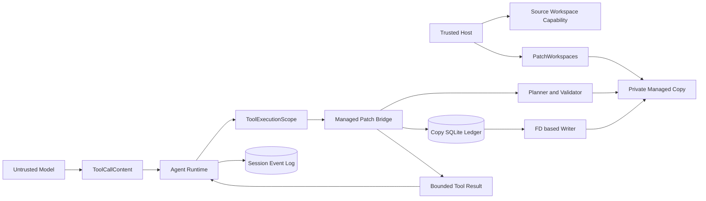

#### 图示说明

1. 模型只提供工具名和严格参数，不提供Workspace根、执行权限、风险级别或批准；
2. 宿主创建Source能力和Managed Copy，Bridge绑定一个不可切换的副本；
3. Agent构造`ToolExecutionScope`并维护Session批准，Bridge再次验证调用合同；
4. Planner只读，Ledger和Writer只作用于Managed Copy；
5. Patch正文保留在宿主私有计划/账本，模型只看到路径、状态和前后摘要；
6. Session与副本SQLite是两个持久域，依赖身份和恢复协议关联，不存在跨库事务。

### 4.3 固定资源边界

| 资源 | 当前上限 | 超限/拒绝语义 |
|---|---:|---|
| 单文件前/后镜像 | 各1 MiB | `patch_limit_exceeded` |
| 单个Exact Edit的old+new UTF-8 | 128 KiB | 输入合同失败 |
| 单文件全部编辑文本 | 256 KiB | 输入合同失败 |
| 单文件编辑数 | 1～32 | 输入合同失败 |
| 批次文件数 | 1～16 | 输入合同失败 |
| 批次全部编辑文本 | 512 KiB | 输入合同失败 |
| 批次before+after完整镜像 | 8 MiB | `patch_batch_limit_exceeded` |
| 单Managed Copy文件数 | 1～256 | `patch_limit_exceeded` |
| Copy导入总字节 | 32 MiB | `patch_limit_exceeded` |
| Copy持久计划数 | 64 | `patch_limit_exceeded` |
| Copy持久计划镜像总字节 | 32 MiB | `patch_limit_exceeded` |
| 批次持久计划 | 64 KiB | 合同/账本拒绝 |
| 批次决定 | 16 KiB | 合同/账本拒绝 |
| 批次元数据总量 | 1 MiB | `patch_batch_metadata_limit_exceeded` |
| 公开批次输出 | 48 KiB | 合同拒绝或Kernel输出失败 |
| 简单Diff | 默认64 KiB，范围256 B～1 MiB | 返回显式截断前缀 |
| Diff文本预览 | 默认1 KiB，范围0～4 KiB | 保留总字节、SHA-256和截断位 |
| JSONL Diff文档 | 默认64 KiB，最大1 MiB | 保留全部文件行；预算不足则失败 |
| 单条JSONL记录 | 24 KiB | `patch_diff_record_too_large` |
| Patch协作读取期限 | 5秒 | `patch_timeout`或相应超时结果 |

## 5. 模块上下文与组件分层

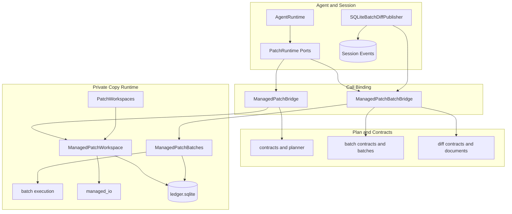

### 5.1 源码映射

- 单文件合同与计划：[contracts.py](../../src/harnessix/patches/contracts.py)、
  [planner.py](../../src/harnessix/patches/planner.py)；
- 受管副本与FD原语：[managed.py](../../src/harnessix/patches/managed.py)、
  [managed_io.py](../../src/harnessix/patches/managed_io.py)；
- 单文件账本：[ledger.py](../../src/harnessix/patches/ledger.py)；
- 批次合同、预留和运行：[batch_contracts.py](../../src/harnessix/patches/batch_contracts.py)、
  [managed_batches.py](../../src/harnessix/patches/managed_batches.py)、
  [batch_execution.py](../../src/harnessix/patches/batch_execution.py)；
- 调用桥接：[agent_bridge.py](../../src/harnessix/patches/agent_bridge.py)、
  [batch_agent_bridge.py](../../src/harnessix/patches/batch_agent_bridge.py)；
- Agent专用端口与证据：[ports.py](../../src/harnessix/agent/ports.py)、
  [patching.py](../../src/harnessix/agent/patching.py)、
  [batch_patching.py](../../src/harnessix/agent/batch_patching.py)；
- Diff与事务发布：[diff.py](../../src/harnessix/patches/diff.py)、
  [diff_document.py](../../src/harnessix/patches/diff_document.py)、
  [batch_diff.py](../../src/harnessix/artifacts/batch_diff.py)。

## 6. 组件职责与依赖边界

| 组件 | 主要职责 | 持有状态/资源 | 明确禁止 |
|---|---|---|---|
| `PatchProposal`/`PatchBatchProposal` | 严格校验模型编辑意图和静态预算 | 不可变Pydantic值 | 接受宿主路径、批准或执行字段 |
| `prepare_patch` | 读取完整前镜像并计算唯一编辑和完整后镜像 | 单次`ReadOperation` | 写文件、持久化或批准 |
| `validate_prepared` | 校验计划内部一致性与Workspace绑定 | 无 | 读取当前目标并声称仍可提交 |
| `verify_prepared` | 在执行前复核当前前镜像、revision和模式 | 当前只读观察 | 提供原子CAS承诺 |
| `PatchWorkspaces` | 创建和打开私有Copy Bundle | 私有管理根能力 | 在Source内部创建副本 |
| `ManagedPatchWorkspace` | 独占副本、迁移/验证账本、单文件审批执行和恢复 | `flock`、`RLock`、Workspace、SQLite连接 | 自动重放、写Source、消费批次成员的单文件许可 |
| `ManagedPatchBatches` | 整组事务预留、一次决定、执行/核对门面 | 复用Copy锁和连接 | 建立第二账本或跨文件回滚 |
| `batch_execution` | 预检、成功前缀顺序调度、终止和恢复归纳 | 组运行事件 | 在恢复中调度未开始成员 |
| `ManagedPatchBridge` | 绑定单文件Call/Scope/Plan/Approval并异步排空 | 单异步锁、一个Copy | 驱动Session、注册任意写工具 |
| `ManagedPatchBatchBridge` | 绑定整组Call并提供计划/效果Diff | 单异步锁、一个Copy | 把单文件批准当组批准、报告时执行核对 |
| `agent.patching` | 校验Session批准和单文件私有效果 | 无资源 | 操作文件或账本 |
| `agent.batch_patching` | 校验批次批准、成员顺序、公开摘要和私有效果 | 无资源 | 从公开输出反推批准 |
| `SQLiteBatchDiffPublisher` | 从真实Session事实准备Diff并与引用同事务提交 | Session/Artifact同库事务 | 接受调用方正文、因报告失败抹去真实事实 |

`patches`仍是0.5时代的专用受信端口。0.7的统一风险路由把它视为legacy adapter，不应继续为新高风险
能力复制新的旁路；未来MCP、Hook、Git网络写等必须经`trusted_actions`统一计划和Policy。

## 7. 单文件领域合同

### 7.1 `ExactEdit`与`PatchProposal`

| 字段 | 类型 | 来源 | 约束与语义 |
|---|---|---|---|
| `old_text` | `str` | 模型 | 非空；合法UTF-8；不含禁用控制字符；在完整before中恰好出现一次 |
| `new_text` | `str` | 模型 | 合法UTF-8；可为空；必须与`old_text`不同 |
| `path` | `str` | 模型 | 1～1024字符的受限相对文件路径，不允许根路径 |
| `expected_revision` | 64位hex | 前序`read_file`结果 | 绑定Workspace、路径和文件身份/状态，不是正文SHA |
| `edits` | `tuple[ExactEdit]` | 模型 | 1～32项；所有区间按原始before坐标计算，不得重叠 |

源码：[contracts.py](../../src/harnessix/patches/contracts.py)中的`ExactEdit`、`PatchProposal`、
`text_bytes`和`patch_path`；计划语义由[planner.py](../../src/harnessix/patches/planner.py)中的
`_edit_ranges`实现。

### 7.2 `PatchManifest`

| 字段 | 含义 | 一致性规则 |
|---|---|---|
| `version` | 固定`patch-plan/v1` | 未知版本由合同拒绝 |
| `path` | 目标相对路径 | 必须仍为受限具体文件 |
| `workspace_scope` | 计划所属Workspace能力摘要 | 校验/执行Workspace必须完全相同 |
| `source_revision` | 计划读取到的前镜像revision | 执行前必须重新匹配 |
| `source_mode` | 原文件权限位 | 仅0～`0o777`；特殊权限拒绝 |
| `proposal_sha256` | 完整提案规范JSON摘要 | 防止编辑内容或顺序变化 |
| `before_sha256`/`after_sha256` | 完整镜像SHA-256 | 必须不同；公开结果可安全引用 |
| `before_bytes`/`after_bytes` | 完整镜像UTF-8字节数 | 各不超过1 MiB |
| `edit_count` | 原编辑数量 | 1～32且与提案一致 |
| `fingerprint` | 除自身外全部字段摘要 | 构造和重载时重算 |

### 7.3 `PreparedPatch`

`PreparedPatch`是`frozen=True, slots=True`的宿主私有dataclass：

```text
PreparedPatch
├── manifest : PatchManifest
├── proposal : PatchProposal      # repr隐藏
├── before   : bytes              # repr隐藏，完整镜像
└── after    : bytes              # repr隐藏，完整镜像
```

它不实现自定义序列化，不进入模型wire，也不代表审批或效果。任何从数据库重建、跨层返回或可能被
`model_copy`绕过的对象，都必须再经`validate_prepared`；真正执行前还必须经`verify_prepared`。

## 8. 精确计划算法

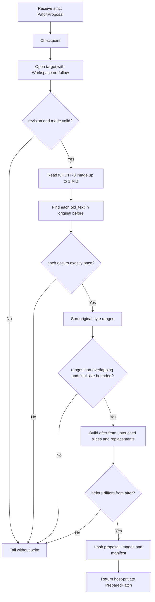

### 8.1 关键语义

1. `_read_image`使用Workspace逐段安全打开，拒绝超大文件、特殊权限、非法UTF-8和revision漂移；
2. `_edit_ranges`始终在**同一原始before字节串**中查找全部`old_text`；
3. 每个锚点必须只出现一次，缺失为`patch_context_not_found`，重复为
   `patch_ambiguous_context`；
4. 编辑按原始字节起点排序，任意交叠为`patch_overlapping_edits`；
5. `_target`拼接未编辑切片和replacement，不做链式查找，因此前一个`new_text`不会成为后一个锚点；
6. 完整after超过1 MiB或最终字节未变化均失败；
7. `validate_prepared`重算全部内容，不读取当前文件；`verify_prepared`在前者之后重新读取当前文件；
8. 最后一次verify与未来`os.replace`之间仍有时间窗口，因此执行器还要在持有父目录FD时再次复核。

### 8.2 核心伪代码

```text
prepare_patch(workspace, proposal, operation):
    proposal = strict_round_trip(proposal)
    before, revision, mode = read_full_image(
        path=proposal.path,
        expected_revision=proposal.expected_revision,
    )
    ranges = []
    for edit in proposal.edits:
        require count(before, edit.old_text) == 1
        ranges += original_utf8_byte_range(edit)
    require sorted(ranges) do not overlap
    after = concatenate(original gaps and replacements)
    require after != before and len(after) <= 1 MiB
    manifest = hash(path, scope, revision, mode, proposal, before, after)
    return PreparedPatch(manifest, proposal, before, after)
```

验证入口：[test_planner.py](../../tests/patches/test_planner.py)中的
`test_multiple_edits_use_original_coordinates_not_chained_replacement`、
`test_invalid_matches_fail_without_modification`、`test_corrupt_plan_rejected_before_source_read`和
`test_full_image_validation_includes_unpreviewed_tail`。

## 9. Managed Copy目录与创建流程

### 9.1 目录布局

```text
<private-root>/
└── <workspace-uuid>/                 mode 0700
    ├── owner.lock                    mode 0600，独占flock
    ├── ledger.sqlite                 mode 0600，副本私有账本
    ├── <plan-uuid>.patch             短暂临时文件；正常结束后清理
    └── workspace/                    mode 0700
        └── <selected existing files> 保留原0～0777权限位
```

管理根必须与Source互不包含；Bundle、账本、锁和目录必须由当前UID拥有并使用精确权限。Copy只导入宿主
显式列出的1～256个已有文件，清单按路径排序；未登记路径即使后来出现在副本中也不能保存计划。

### 9.2 创建数据流

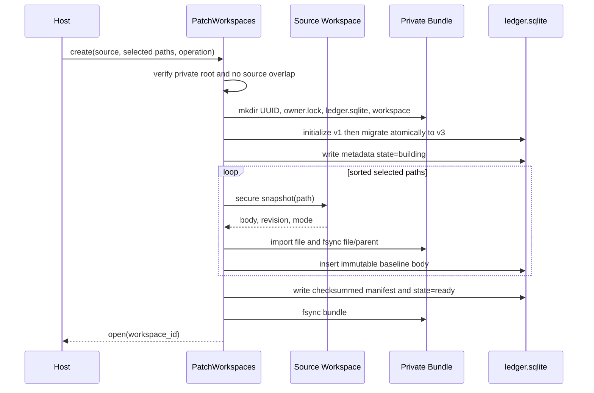

创建在`building`阶段崩溃的Bundle不会被当成可执行副本；`open()`只接受`ready`、身份与Checksum均
正确的元数据。具体实现见[managed.py](../../src/harnessix/patches/managed.py)中的
`PatchWorkspaces.create`和`ManagedPatchWorkspace.__init__`，硬退出验证见
[test_managed_crash.py](../../tests/patches/test_managed_crash.py)中的
`test_real_exit_building_copy_is_quarantined`。

## 10. 副本打开、所有权与完整性校验

`ManagedPatchWorkspace`打开时依次执行：

1. 以安全Workspace能力打开管理根、Bundle和`workspace/`；
2. 校验Bundle为当前UID的`0700`目录，无不支持的扩展属性、Flags或扩展ACL；
3. 以`O_NOFOLLOW|O_NONBLOCK|O_CLOEXEC`打开`owner.lock`和`ledger.sqlite`；
4. 对`owner.lock`申请非阻塞独占`flock`，并在进程内再用`RLock`串行所有操作；
5. 建立`check_same_thread=False, timeout=0`连接，启用`foreign_keys=ON`和`synchronous=FULL`；
6. 校验SQLite `application_id`、允许版本、元数据Checksum和根/Bundle/锁/数据库inode身份；
7. 校验`CopyManifest`、baseline行数、路径、大小和SHA-256；
8. 先完整校验旧版本事实，再在单事务中执行v1→v2或v2→v3迁移；
9. 每次公开操作通过`_guard()`再次验证资源身份，关闭后拒绝访问。

`flock`只防止遵守同一协议的进程同时拥有副本，不隔离同UID恶意进程；`RLock`只保护当前对象内的
SQLite连接和FD流程，不是跨Workspace全局锁。

## 11. 单文件状态机

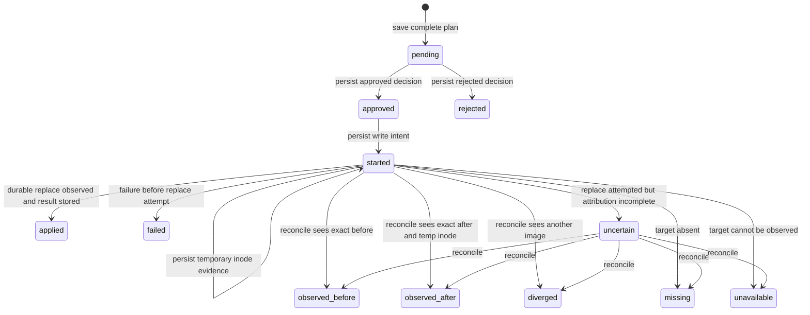

### 11.1 状态含义

| 状态 | 持久事实 | 是否可再次执行 |
|---|---|---:|
| `pending` | 完整计划已保存，尚无决定 | 否；只能答复 |
| `approved` | 不可变批准已保存，尚未写入started | 是，仅一次准入 |
| `rejected` | 不可变拒绝已保存 | 否 |
| `started` | 写意图已保存；可能已有临时inode证据 | 否；只能核对 |
| `applied` | 替换、fsync、后镜像观察和结果事件均完成 | 否 |
| `failed` | 在`replace`尝试前失败或取消 | 否；新尝试必须新请求和新批准 |
| `uncertain` | 已尝试替换，但无法充分归因当前字节 | 否；只能核对 |
| `observed_before` | 恢复观察到精确前镜像 | 否；旧批准仍已消费 |
| `observed_after` | 恢复观察到精确后镜像且inode等于持久临时身份 | 否 |
| `diverged` | 当前字节既非计划前镜像也非计划后镜像 | 否 |
| `missing` | 观察时目标不存在 | 否 |
| `unavailable` | 权限、I/O、元数据等使观察无法完成 | 否 |

账本加载器最多接受每个计划1～6个事件，逐行验证Checksum、不可变字段、决定一致性、临时身份和允许
转换。非法转换、缺事件、篡改Payload或伪造after证据统一关闭为`patch_ledger_corrupt`。

## 12. 单文件调用、审批与执行时序

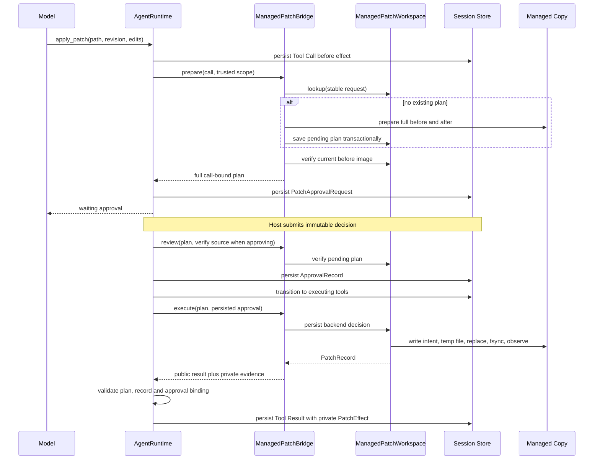

### 12.1 准入顺序

1. Agent必须先持久化Provider产生的Tool Call；
2. `ManagedPatchBridge._validate`核对`ToolExecutionScope`、副本根、工具名、版本、指纹、Effect Class和
   `requires_approval`；
3. 稳定请求由`thread_id + turn_id + call_id + request_fingerprint`摘要生成，模型不能提供；
4. `prepare`幂等查找原请求；缺失时才准备并保存，命中时必须与原提案完全相同；
5. Session先持久化`PatchApprovalRequestContent`及完整`ManagedPatchCallPlan`，再进入等待；
6. 批准提交前调用`review(..., verify_source=True)`；拒绝使用`verify_source=False`，允许在Source已漂移时
   明确关闭旧请求而不写入；
7. `execution_approval`要求当前调用是未决队首、Turn处于`EXECUTING_TOOLS`、预算仍有效且批准Item完整；
8. Bridge把Session `ApprovalRecord`压缩成后端`ApprovalDecision`，要求批准指纹精确匹配；
9. Backend先持久决定，再执行；执行结果经`agent.patching.result_content`绑定为Session私有
   `PatchEffect`；
10. 回调、Session或公开结果持久化失败不会撤销实际文件效果，启动恢复按双账本事实结算。

### 12.2 调用计划字段

`ManagedPatchCallPlan`把三个身份域连成一个不可变审批对象：

| 身份域 | 字段 | 作用 |
|---|---|---|
| Agent调用 | `thread_id/turn_id/call_id/call_fingerprint` | 防止跨Thread、Turn或Call重用 |
| 稳定请求 | `request_id` | 必须等于`call_request_id(...)` |
| 后端计划 | `workspace_id/plan_id/manifest/backend_fingerprint` | 防止跨副本或替换后端记录 |
| 审批 | `approval_fingerprint` | 摘要除自身外完整调用计划，Session批准只绑定此值 |

公开`ManagedPatchOutput`只包含`path/state/before_sha256/after_sha256`。`PatchCallResult.plan`和
`record`为宿主私有证据；成功结果若缺少证据或二者字段不一致，Kernel以`patch_result_mismatch`拒绝。

源码入口：[agent_bridge.py](../../src/harnessix/patches/agent_bridge.py)中的
`ManagedPatchBridge.prepare`、`review`、`execute`、`recover`，以及
[patching.py](../../src/harnessix/agent/patching.py)中的`execution_approval`和`result_content`。

## 13. 单文件落盘算法与取消边界

### 13.1 执行步骤

```text
execute(plan_id, approval_fingerprint, operation):
    acquire copy guard and reject batch-owned member
    load and fully validate ledger plan
    require state == approved and approval fingerprint matches
    verify full current before image and writable target metadata
    append state=started before any write effect

    securely open and retain every parent directory fd
    require target and private bundle are on same device
    create exclusive <plan_id>.patch in private bundle
    write complete after image with cooperative checkpoints
    chmod to original mode; reject unsupported metadata; fsync temp
    append state=started with (temp.st_dev, temp.st_ino)

    checkpoint cancellation before effect boundary
    reverify parent chain, before image, target and copy identity
    attempted = true
    os.replace(temp, target, using source/destination dir fds)

    ignore caller cancellation until effect is settled
    fsync replaced fd, destination parent and private bundle
    reverify parent/copy identity
    observe exact after image and require target inode == temp inode
    append state=applied

on failure:
    reload only persisted evidence
    append failed if replace was not attempted, otherwise uncertain
    preserve stable error code; rethrow unexpected programming errors
finally:
    unlink only a private temp name whose inode still matches evidence
    never restore target from before image
```

### 13.2 为什么使用Bundle临时文件

临时文件在私有Bundle中创建，名称由宿主`plan_id`生成，使用`O_CREAT|O_EXCL|O_NOFOLLOW`。执行前要求
Bundle和目标父目录位于同一设备，否则`os.replace`不能提供单文件原子替换，返回
`patch_cross_device`。临时inode先于替换写入账本，使崩溃恢复能够区分“内容碰巧相同”和“确为本计划
临时对象完成的替换”。

### 13.3 取消语义

| 取消位置 | 持久/文件结果 |
|---|---|
| 调用Bridge前 | 不创建计划、不产生后端I/O |
| 准备/复核线程中 | 设置`ReadOperation.stopped`并等待线程退出，不遗留FD |
| 后端决定前 | 无决定、无写意图 |
| 决定后但`started`前 | 批准已消费；恢复不自动执行 |
| `started`后、`replace`前 | `failed/cancelled`，目标保持before |
| `replace`后 | 先忽略取消，完成fsync与观察；通常结算`applied`，否则`uncertain` |
| Agent结果提交前 | 文件事实留在副本账本；Session恢复只核对并补充诚实结果 |

Bridge通过`asyncio.shield`保护工作线程，并在Task取消时设置停止事件、调用`_drain`等待退出。
`aclose()`先标记关闭，再等待同一异步锁，保证在途写入或review排空；它不关闭宿主拥有的Managed Copy。

验证：[test_bridge_cancel.py](../../tests/patches/test_bridge_cancel.py)、
[test_kernel_patch_boundaries.py](../../tests/patches/test_kernel_patch_boundaries.py)和
[test_managed.py](../../tests/patches/test_managed.py)中的`test_cancel_before_replace_is_consumed_failed`、
`test_cancel_after_replace_drains_to_applied`。

## 14. 单文件崩溃恢复与效果归因

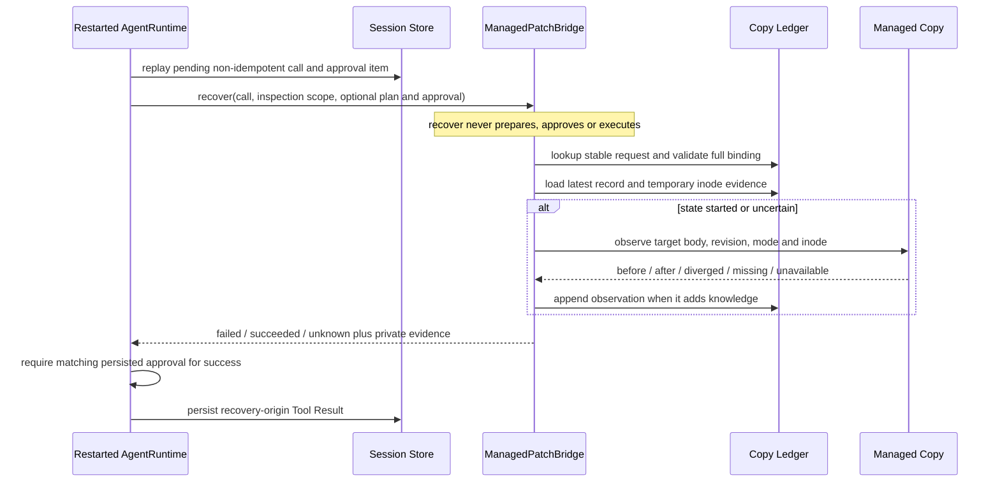

### 14.1 观察决策表

| 当前观察 | 临时inode证据 | 结论 | 解释 |
|---|---|---|---|
| body/revision/mode均为计划before | 任意 | `observed_before` | 可证明当前没有计划后镜像，但旧批准已消费 |
| body为after、mode相同、目标inode等于持久temp | 有且匹配 | `observed_after` | 可归因于该计划的替换 |
| body为after、mode相同、inode不匹配或无证据 | 缺失/不匹配 | `uncertain` | 相同字节不足以证明由本计划产生 |
| body为其他内容或模式不符 | 任意 | `diverged` | 外部变化或未知效果 |
| 目标不存在 | 任意 | `missing` | 不推断谁删除了文件 |
| 无法安全读取/校验 | 任意 | `unavailable` | 保持保守未知 |
| 观察超时 | 任意 | 抛出超时 | 不把预算耗尽伪装成损坏 |

只有`applied/observed_after`且Session完整批准与副本决定一致时，Bridge才报告`succeeded`。待定、批准但
未执行、拒绝、失败和`observed_before`报告`failed`；不确定、分歧、缺失、不可用或证据缺失报告
`unknown`。`recover`发现计划缺失时，如果Session已经存在计划/批准证据则必须返回`unknown`，不能按
“未找到”报告未应用。

真实硬退出覆盖见[test_managed_crash.py](../../tests/patches/test_managed_crash.py)、
[test_bridge_crash.py](../../tests/patches/test_bridge_crash.py)和
[test_kernel_patch_crash.py](../../tests/patches/test_kernel_patch_crash.py)。

## 15. 批次合同与持久审批

### 15.1 `PreparedPatchBatch`

`PatchBatchProposal.files`保持Provider顺序，路径不可重复。`prepare_patch_batch`逐文件复用单文件计划器，
累计完整镜像不超过8 MiB；全部成员准备完成后再次调用`verify_patch_batch`，避免准备后续文件期间早期
文件已经漂移。该复核仍不声称所有文件来自同一时刻快照。

`PatchBatchManifest`绑定：

- 固定`patch-batch-plan/v1`；
- 唯一Workspace Scope；
- 完整批次提案摘要；
- 按顺序保存的全部单文件Manifest；
- 对上述字段重算的整组Fingerprint。

### 15.2 事务预留

`ManagedPatchBatches.save`在同一SQLite `BEGIN IMMEDIATE`事务内：

1. 验证批次内部事实和当前前镜像；
2. 计算`batch_id`、成员`plan_id`、成员稳定`request_id`与审批指纹；
3. 写入一条`batches`；
4. 逐成员写入原`plans/events`，并设置同一`owner_batch_id`；
5. 在事务提交前持续检查协作取消。

任一成员失败、取消、存储只读或硬退出均回滚整组，不留下可单独消费的成员。单文件入口通过
`batch_ledger.require_single`拒绝`owner_batch_id`非空的计划；即使攻击者篡改该列为`NULL`，加载器还会
扫描最多64个批次计划，发现成员身份后以账本损坏失败。

### 15.3 整组审批字段

| 合同 | 关键字段 | 不变量 |
|---|---|---|
| `PatchBatchMember` | `plan_id/request_id/approval_fingerprint` | 每个成员绑定workspace、batch、原请求、位置和单计划指纹 |
| `ManagedPatchBatchPlan` | `batch_id/workspace_id/request_id/manifest/members` | 成员数量、顺序、唯一身份与Manifest完全一致 |
| `ManagedPatchBatchApproval` | `plan/decision` | 决定可空；一旦持久化不可修改 |
| `ManagedPatchBatchCallPlan` | Agent调用身份加完整backend计划 | 稳定请求和调用指纹匹配；外层批准指纹覆盖完整计划 |

批准一次作用于整组计划，不等于16份可独立执行的单文件批准。决定存于`batch_approvals`，成员在真正被
调度前才由批次执行器追加相同批准状态；未开始后缀保持`pending`。

## 16. 批次运行、部分效果与恢复

### 16.1 运行时序

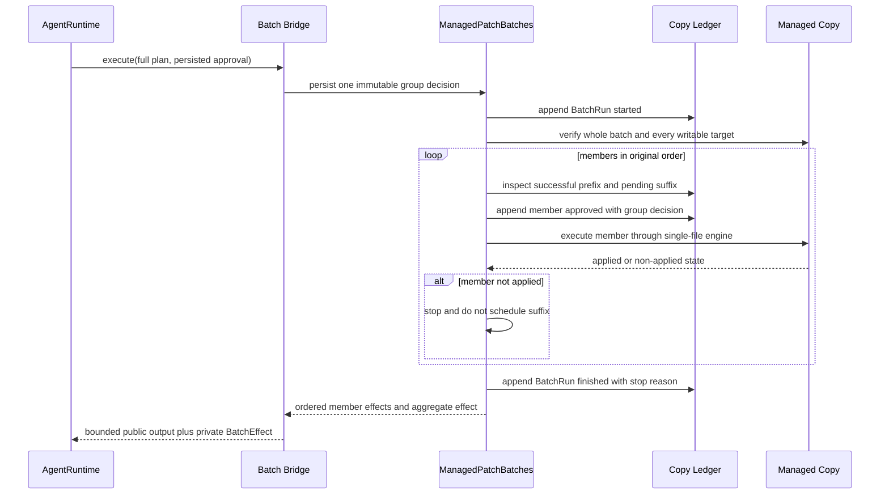

### 16.2 顺序不变量

合法成员状态必须形如：

```text
[applied or observed_after]*
[at most one non-applied/non-pending member]
[pending]*
```

任何`rejected`成员、失败后仍有非pending成员、成员重排或执行记录与审批顺序不一致，均视为账本损坏。
整组执行先持久`started`，再对**全部成员**做前镜像和可写元数据预检；预检失败时不写任何文件，但组
运行仍被消费并以`failed`结束。

### 16.3 成员与聚合效果

| 单文件状态 | `MemberEffect` |
|---|---|
| `applied`、`observed_after` | `applied` |
| `pending`、`approved`、`failed`、`observed_before` | `not_applied` |
| `started`、`uncertain`、`diverged`、`missing`、`unavailable` | `unknown` |

聚合规则优先保守性：任一`unknown`使整组为`unknown`；全部成员`applied`才是`applied`；没有未知且同时
存在已应用与未应用成员为`partial`；其余为`not_applied`。停止原因与效果正交：

| `StopReason` | 含义 | 对Effect的约束 |
|---|---|---|
| `completed` | 全部成员完成 | 必须为`applied` |
| `cancelled` | 协作取消停止调度 | 可能not_applied、partial或unknown |
| `timeout` | 读取/写入预算耗尽 | 同上 |
| `failed` | 合同、I/O、存储或成员失败 | 同上 |
| `interrupted` | 重启发现started运行并完成只观察恢复 | 同上；不继续后缀 |

公开`ManagedPatchBatchOutput`保持文件顺序，只含路径、状态、成员效果与前后摘要。全部应用映射为
Tool Result `succeeded`；任一未知映射为`unknown`；部分或未应用映射为`failed`。

### 16.4 批次恢复

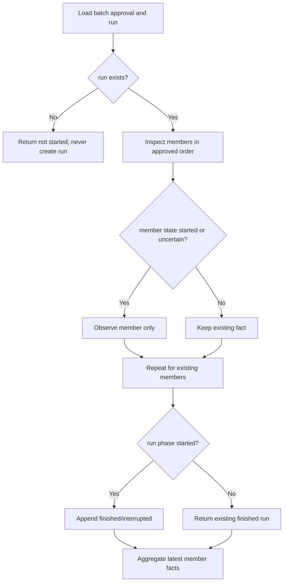

恢复只核对处于`started/uncertain`的成员，并把开放运行结束为`interrupted`；不批准pending成员、不调度
后缀、不回滚成功前缀，也不把相同after字节当成充分归因。验证见
[test_batch_execution.py](../../tests/patches/test_batch_execution.py)和
[test_batch_execution_crash.py](../../tests/patches/test_batch_execution_crash.py)。

## 17. Diff、效果报告与Artifact

### 17.1 简单结构化Diff

`patch_batch_diff`直接复用计划器计算出的精确字节区间，不重新运行通用Diff算法，也不读取当前
Workspace。每条`PatchEditDiff`包含路径、Patch Fingerprint、编辑序号、before/after字节起点，以及
两侧`DiffText`：

- `text`：不切断UTF-8码点的有界前缀；
- `total_bytes`：完整编辑文本字节数；
- `sha256`：完整文本摘要；
- `truncated`：预览是否省略尾部。

整个`PatchBatchDiff`只返回按文件和编辑顺序排列的前缀，JSON转义后的真实UTF-8字节计入预算；
`total_files/total_edits/truncated`使调用方不能把前缀误作完整报告。

### 17.2 JSONL文档

```text
line 1                  BatchDiffSummary
line 2..N               every BatchDiffFile in original order
remaining bounded lines zero or more BatchDiffEdit prefix
```

计划视图保留全部文件的所有计划编辑资格，不带执行状态。效果视图保留全部文件行，但只有
`MemberEffect=applied`的成员进入编辑候选；未应用和未知成员仍通过文件行及组摘要可见。`complete`仅说明
所有**eligible edits**和文本预览均完整，不说明执行成功。

预算算法先预留Summary和全部文件行；如果连成员事实都无法全部保存，返回
`patch_diff_budget_too_small`，而不是隐藏尾部文件。之后只追加编辑有序前缀，并在每次追加时重算Summary
真实JSONL大小。

### 17.3 报告证据准入

`ManagedPatchBatchBridge.diff`只返回`PreparedBatchDiffDocument`宿主载荷：

| 视图 | 必需证据 | 禁止行为 |
|---|---|---|
| `plan` | 完整Call Plan与当前账本计划一致 | 不接收批准/运行，不读当前目标，不核对效果 |
| `effect` | 完整Call Plan、匹配Session审批决定、与账本完全相等的已结算运行快照 | 不接受started运行，不调用reconcile，不补写事实 |

### 17.4 与Session事实事务发布

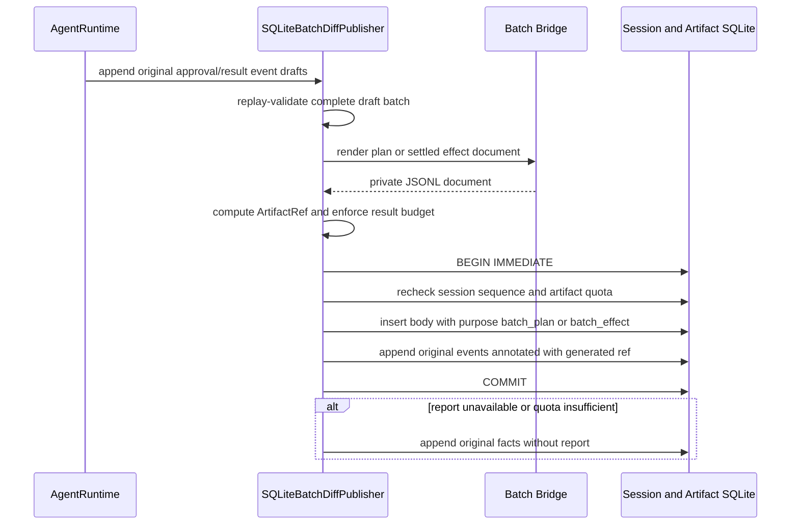

发布器不接受调用方正文或预制`ArtifactRef`。报告正文与带引用的原Session事件在同一SQLite事务提交；
提交后丢确认时按原事件身份读取，不生成第二个引用。报告准备、配额或模型结果预算失败可以省略报告，
但不能省略、修改或回滚真实批准与效果。实现见
[batch_diff.py](../../src/harnessix/artifacts/batch_diff.py)中的`SQLiteBatchDiffPublisher.append`。

## 18. Agent Kernel双账本集成

### 18.1 专用端口

Agent只接受`PatchRuntime`和`PatchBatchRuntime`两个显式端口。两个当前Bridge都广告
`risk_level=HIGH`且默认不支持并行；Agent构造器还强制验证：

- 名称分别精确为`apply_patch`和`apply_patch_batch`；
- `effect_class=NON_IDEMPOTENT_WRITE`；
- `requires_idempotency=true`；
- `requires_approval=true`；
- `supports_reconciliation=true`；
- 名称不能与只读工具、Process或其他定义冲突。

未装配专用端口时，即使通用Tool Registry广告同名写工具，Kernel仍拒绝执行。当前默认
`product_config`不装配这两个端口，因此源码能力不等于默认产品可用能力。

### 18.2 Session事实

| Session合同 | 保存内容 | 模型可见性 |
|---|---|---|
| `PatchApprovalRequestContent` | 完整单文件Call Plan、请求指纹、可空决定 | 审批界面可投影；私有执行字段不进入模型历史 |
| `PatchBatchApprovalRequestContent` | 完整整组Call Plan、决定、可选计划Diff引用 | 同上 |
| `PatchEffect` | workspace/plan/request/approval/state/origin | `ToolResultContent`私有证据，序列化历史受策略过滤 |
| `PatchBatchEffect` | workspace/batch/request/approval/origin/完整结算运行 | 最大8 KiB；与公开结果交叉验证 |
| `diff_artifact` | 计划或效果JSONL的`ArtifactRef` | 只暴露有界引用，不替代完整结果 |

### 18.3 两个持久域的顺序

```text
Session: persist call
Copy:    persist prepared plan
Session: persist approval request
Session: persist approval decision
Copy:    persist backend decision
Copy:    persist write intent / effects / result
Session: persist Tool Result and private effect
```

任何相邻步骤之间都可能崩溃。恢复以Session未决Call为入口，把已有计划和批准作为可选证据传给Bridge；
Bridge只能lookup/reconcile。没有跨库两阶段提交，也没有凭Session批准自动补做文件写入。

### 18.4 Turn结算

- 正常执行只允许当前pending calls队首进入写端口；写工具形成串行屏障；
- `succeeded`只代表私有账本证明计划后镜像且批准完整，不代表整个Turn已完成；
- `partial`映射`failed`，`unknown`保持未知并阻止模型继续把结果当成功；
- 取消或回调失败后，Kernel先保留已发生Patch事实，再结算Turn状态；
- 启动恢复不会重新调用Provider或写工具，只追加recovery-origin结果；
- 输出超过当前Turn上限时，恢复可删除公开`output`，但保留私有Effect证据和失败/未知语义。

## 19. 持久化模型与迁移

### 19.1 SQLite表

| 表 | 版本 | 关键列 | 作用 |
|---|---:|---|---|
| `metadata` | v1 | `id=1,payload` | Bundle身份、building/ready、清单及Checksum |
| `baseline` | v1 | `path,body` | 导入时完整原始字节，用于副本完整性审计 |
| `plans` | v1/v2 | `id,request_id,proposal,before_image,after_image,owner_batch_id` | 完整单文件计划；v2增加批次所有权 |
| `events` | v1 | `sequence,plan_id,payload,temporary,checksum` | 单文件append-only状态与临时inode证据 |
| `batches` | v2 | `id,request_id,payload,checksum` | 完整整组计划和稳定请求索引 |
| `batch_approvals` | v2 | `batch_id,payload,checksum` | 每组唯一不可变决定 |
| `batch_run_events` | v3 | `sequence,batch_id,phase,payload,checksum` | 每组至多started/finished两条运行事件 |

`APPLICATION_ID=0x48585057`区分副本数据库。计划正文和镜像属于私有执行证据，不进入Session数据库；
Session只保存绑定后的计划元数据、批准和有界效果。

### 19.2 迁移策略

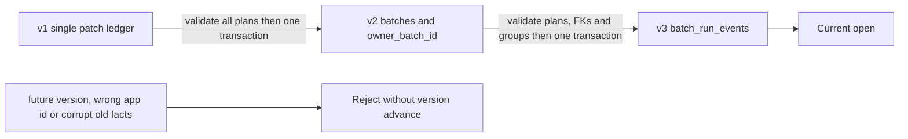

迁移不使用`executescript`，避免它隐式提交调用者事务。`user_version`只在DDL完成后写入；任何故障回滚
表和版本。升级前先校验所有受上限约束的旧计划、组和外键；坏账本不能通过升级被“修复”。旧二进制
面对更高版本应拒绝打开，不支持手工降级。

迁移源码：[ledger_migrations.py](../../src/harnessix/patches/ledger_migrations.py)、
[batch_run_migrations.py](../../src/harnessix/patches/batch_run_migrations.py)；硬退出验证见
[test_batch_crash.py](../../tests/patches/test_batch_crash.py)和
[test_batch_execution_crash.py](../../tests/patches/test_batch_execution_crash.py)。

## 20. 失败语义

### 20.1 输入、计划与作用域

| 场景 | 稳定错误/结果 | 是否写文件 |
|---|---|---:|
| 参数不符合严格Schema | `tool_invalid_arguments`，模型可修正 | 否 |
| 路径越界/非具体文件 | `patch_path_denied`等 | 否 |
| revision已变化 | `patch_source_changed` | 否 |
| 锚点缺失/不唯一/重叠 | `patch_context_not_found` / `patch_ambiguous_context` / `patch_overlapping_edits` | 否 |
| 文件/编辑/组预算超限 | `patch_limit_exceeded` / `patch_batch_limit_exceeded` | 否 |
| 计划内容或指纹损坏 | `patch_plan_corrupt` / `patch_batch_corrupt` | 否 |
| Workspace/Call/Tool合同漂移 | `patch_workspace_mismatch` / `patch_call_mismatch` / `tool_contract_changed` | 否 |
| 同稳定请求对应不同计划 | `patch_request_conflict` | 否 |

### 20.2 审批、执行与存储

| 场景 | 稳定错误/状态 | 恢复动作 |
|---|---|---|
| 指纹不匹配或批准来自其他合同 | `patch_approval_mismatch` | 不写，重新形成新请求 |
| 同计划收到不同第二决定 | `patch_approval_conflict` | 保留第一决定 |
| 未批准、已消费或批次成员走单入口 | `patch_not_executable` / `patch_batch_member_requires_group` | 不重试旧计划 |
| 目标在写意图前漂移 | `patch_source_changed` | 新读、新计划、新批准 |
| `replace`前取消/I/O失败 | 状态`failed`及受控error code | 不重执行旧计划 |
| `replace`后fsync/记账/观察失败 | 状态`uncertain` | 只调用reconcile |
| 账本或身份损坏 | `patch_ledger_corrupt` / `patch_workspace_changed` | 隔离副本，人工诊断 |
| 存储不可用 | `patch_storage_unavailable` | 不凭异常位置猜测效果 |
| 批次首个成员失败 | finished + `failed/timeout/cancelled` | 保留前缀，pending后缀不调度 |

### 20.3 公开结果语义

| 私有事实 | Tool Result outcome | 模型可用结论 |
|---|---|---|
| 单文件`applied/observed_after`且批准匹配 | `succeeded` | 受管副本目标已归因到计划after |
| 单文件明确未应用 | `failed` | 旧批准已关闭，不可自动重试 |
| 单文件归因不足 | `unknown` | 必须核对或人工处理 |
| 批次全部应用 | `succeeded` | 全部成员after已归因 |
| 批次partial/not_applied | `failed` | 读取成员状态决定后续新计划 |
| 批次任一unknown | `unknown` | 不能把其余已知成员覆盖未知成员 |

## 21. 安全设计

### 21.1 路径与对象身份

- 路径复用`Workspace.parts/open`逐段限制，不跟随符号链接；
- `write_parent`逐段打开目录FD并在写前、写后比较路径项和已持有FD的设备/inode；
- 不复用普通目录revision，因为合法替换会改变父目录mtime；
- 目标必须是当前UID拥有的普通文件，拒绝特殊权限、多余元数据和非支持类型；
- Copy根、Bundle、Workspace、锁和数据库身份在每次操作前复核。

### 21.2 元数据策略

`plain_metadata`当前只支持Darwin/Linux：

- Linux发现任何xattr即拒绝；
- Darwin只允许系统生成的`com.apple.provenance`，拒绝其他xattr；
- Darwin发现扩展ACL即拒绝；
- 任一平台发现文件Flags或xattr枚举异常即失败关闭；
- Patch仅保留普通`0o000～0o777`模式，不承诺ACL、Capability、Finder信息或安全标签复制。

### 21.3 审批与最小披露

- 模型不能提交`workspace_id/plan_id/request_id/approval_fingerprint`；
- Tool版本绑定具体Copy ID、Workspace Scope、输入/输出/计划Schema和超时；
- 单文件、批次、其他Call和其他Copy的批准互不复用；
- 截断Diff只用于展示，完整Call Plan才是批准对象；
- 公开输出不含完整源码、绝对路径、临时文件、批准人或后端账本细节；
- Session私有Effect、完整批准和Artifact正文分别受投影与归属校验。

### 21.4 剩余威胁

1. 同UID恶意进程仍可直接操作文件、SQLite或advisory lock协议之外的资源；
2. inode重用、异常网络文件系统、硬件缓存和突然断电不在当前耐久性证明范围；
3. `flock`、`O_NOFOLLOW`和POSIX dir-fd语义不可直接移植到Windows；
4. Managed Copy不是容器或权限隔离，执行副本内其他程序仍需Sandbox/Process Policy；
5. 完整before/after保存在本地账本，私有根的备份、加密和磁盘权限由部署层负责；
6. Source导入后不自动同步，任何新变化都要求新副本或显式交付事务。

## 22. 并发、生命周期与性能

### 22.1 并发模型

- 每个`ManagedPatchWorkspace`使用非阻塞进程锁保证单Owner；
- 同一对象用`RLock`保护一个SQLite连接和所有写/核对操作；
- 每个Bridge再用一个`asyncio.Lock`把prepare/review/execute/recover/diff串行化；
- 单文件Bridge在取得异步锁后创建`ReadOperation`；批次Bridge在排队前创建，因此排队时间计入5秒预算；
- Patch工具声明为非幂等写且不支持并行，Agent的只读并发调度不能越过它；
- 两个独立Bridge即使指向同一Copy，最终仍由Copy的`RLock`串行，但宿主不应制造重复入口。

### 22.2 性能取舍

当前实现为每个计划保存完整before/after，换取确定性验证和离线恢复；因此按Copy限制64个计划/32 MiB
计划镜像。每次加载会校验事件链和完整计划，执行前多次读取目标并`fsync`文件及目录，优先保证故障
语义，不面向超大文件或高吞吐批量改写。大量仓库变更应使用Workspace Transaction/Delivery，而不是
提高本模块上限。

## 23. 可观测性与审计

Patch包本身不直接依赖OpenTelemetry，也不记录模型参数或正文。可观测事实分为三层：

| 层 | 当前事实 | 用途 |
|---|---|---|
| Agent Telemetry | `harnessix.agent.tool`和`harnessix.agent.recovery`操作，Thread/Turn/Call、outcome和低基数failure category | 在线时延、成功/失败/取消/未知统计 |
| Session Event Log | Call、审批请求/决定、Tool Result、私有Patch Effect和可选Diff引用 | 用户会话Replay与跨层因果审计 |
| Copy Ledger | 完整计划、决定、状态事件、临时inode、批次运行和Checksum | 文件效果与崩溃恢复事实源 |

`patch_`前缀错误归类为`tool`；日志和指标不得以文件路径、正文、摘要、Plan ID、Artifact ID或批准人作为
标签。当前Patch账本没有独立结构化日志导出、跨账本Trace ID列或运维清理器；这些属于后续产品装配和
可观测性模块治理，不能用调试打印替代。

## 24. 典型故障排查

| 现象 | 先检查 | 再检查 | 禁止操作 |
|---|---|---|---|
| `patch_workspace_busy` | 是否已有进程持有`owner.lock` | 是否有未关闭Bridge/Copy | 删除锁文件或强开第二Owner |
| `patch_source_changed` | 重新读取目标revision和完整上下文 | Copy是否来自旧Source快照 | 沿用旧批准强制覆盖 |
| `patch_ledger_corrupt` | Bundle身份、数据库版本、Checksum和事件顺序 | 最近崩溃/迁移证据及备份 | 手改`user_version`或删除事件 |
| 状态`uncertain` | 持久temp inode与当前目标inode/摘要 | 调用只读`reconcile` | 再次执行旧计划 |
| 批次`partial` | 成员成功前缀和首个失败码 | 基于当前文件重新形成后续计划 | 回滚未纳入新审批的文件 |
| 批次`unknown` | 哪个成员为started/uncertain/diverged | Copy账本与Session批准是否完整 | 把组结果改成failed后重跑 |
| 无Diff引用 | 原批准/效果是否已正常持久化 | Artifact配额、结果预算和发布器绑定 | 以报告失败否定文件事实 |
| Windows启动失败 | 当前平台能力诊断 | 使用受支持POSIX环境或等待原生端口 | 用字符串路径检查替代Reparse防护 |

## 25. 测试策略与证据映射

### 25.1 测试分层

| 层级 | 主要文件 | 覆盖重点 |
|---|---|---|
| 合同/Schema | [test_schema.py](../../tests/patches/test_schema.py)、[test_diff_document_schema.py](../../tests/patches/test_diff_document_schema.py) | 冻结版本、严格字段、跨字段不变量 |
| 单文件计划 | [test_planner.py](../../tests/patches/test_planner.py)、[test_boundaries.py](../../tests/patches/test_boundaries.py) | UTF-8、revision、唯一锚点、原坐标、大小、取消 |
| 受管副本 | [test_managed.py](../../tests/patches/test_managed.py) | 权限、身份、审批、写入、fsync、配额、线程竞争、恢复 |
| 单文件Bridge | [test_agent_bridge.py](../../tests/patches/test_agent_bridge.py)、[test_bridge_boundaries.py](../../tests/patches/test_bridge_boundaries.py) | Call/Scope/Tool/Approval绑定和公开/私有结果 |
| Kernel单文件 | [test_kernel_patch.py](../../tests/patches/test_kernel_patch.py)、[test_kernel_patch_sdk.py](../../tests/patches/test_kernel_patch_sdk.py) | Session等待、Replay、SDK wire隐私和双账本顺序 |
| 批次计划/预留 | [test_batches.py](../../tests/patches/test_batches.py)、[test_managed_batches.py](../../tests/patches/test_managed_batches.py) | 组预算、整组复核、原子预留、成员归属、一次决定 |
| 批次执行 | [test_batch_execution.py](../../tests/patches/test_batch_execution.py) | 全组预检、成功前缀、停止原因、部分/未知效果、16成员边界 |
| 批次Bridge/Kernel | [test_batch_bridge.py](../../tests/patches/test_batch_bridge.py)、[test_kernel_batch.py](../../tests/patches/test_kernel_batch.py) | 整组调用批准、结果投影、Kernel恢复和wire |
| Diff/Artifact | [test_diff.py](../../tests/patches/test_diff.py)、[test_diff_document.py](../../tests/patches/test_diff_document.py)、[test_batch_diff_bridge.py](../../tests/patches/test_batch_diff_bridge.py) | UTF-8偏移、真实预算、计划/效果视图、归档准入 |
| 取消/生命周期 | `test_*_cancel.py`、`test_*_lifecycle.py` | 排队预算、线程排空、重复关闭、取消窗口 |
| 硬退出 | `test_*_crash.py` | 文件替换、账本提交、迁移、Session和Artifact提交窗口 |

### 25.2 关键结论与测试函数

| 设计结论 | 直接证据 |
|---|---|
| 多编辑按原始before坐标，不做链式替换 | `tests/patches/test_planner.py::test_multiple_edits_use_original_coordinates_not_chained_replacement` |
| 计划准备和复核从不写文件 | `tests/patches/test_planner.py::test_prepare_and_verify_never_write_and_preserve_unedited_bytes` |
| Source或Workspace漂移在写前拒绝 | `tests/patches/test_planner.py::test_verify_rejects_source_or_workspace_drift` |
| Copy执行后Source保持不变且可重开 | `tests/patches/test_managed.py::test_copy_approval_execution_reopen_source_unchanged` |
| `replace`后取消先完成事实结算 | `tests/patches/test_managed.py::test_cancel_after_replace_drains_to_applied` |
| after字节相同但无inode证据仍未知 | `tests/patches/test_batch_execution.py::test_identical_bytes_without_recorded_inode_stay_unknown` |
| 单文件恢复不准备、不批准、不执行 | `tests/patches/test_agent_bridge.py::test_recovery_never_creates_or_approves_or_executes` |
| Kernel崩溃恢复不重放单文件写 | `tests/patches/test_kernel_patch_crash.py::test_session_patch_real_exit_no_replay` |
| 批次预留中途失败回滚全部成员 | `tests/patches/test_managed_batches.py::test_mid_transaction_failure_rolls_back_all_members` |
| 单文件入口不能消费批次成员 | `tests/patches/test_managed_batches.py::test_single_file_entry_cannot_consume_group` |
| 全组预检失败时没有任何文件写入 | `tests/patches/test_batch_execution.py::test_whole_group_preflight_consumes_without_any_file_write` |
| 成员失败停止后缀并保留真实部分效果 | `tests/patches/test_batch_execution.py::test_member_failure_stops_suffix_and_preserves_effect` |
| 批次崩溃保留成功前缀且恢复不重放 | `tests/patches/test_batch_execution_crash.py::test_real_exit_preserves_prefix_and_recovery_never_replays` |
| Diff使用真实JSON转义字节预算 | `tests/patches/test_diff_document.py::test_exact_budget_includes_every_newline_and_json_escape` |
| 效果报告只展示已归因成员且保留全部文件行 | `tests/patches/test_diff_document.py::test_history_only_renders_attributed_members_and_keeps_all_file_rows` |
| 报告硬退出不修改Patch账本或目标 | `tests/patches/test_batch_diff_crash.py::test_real_exit_does_not_mutate_ledger_or_targets` |
| SDK wire不泄露私有Patch证据 | `tests/patches/test_kernel_batch_sdk.py::test_sdk_reads_batch_reopen_approve_write_readback_and_private_wire` |

`tests/patches`当前包含33个测试文件、233个顶层测试函数，参数化后收集1092项用例。
模块文档变更至少运行完整`uv run pytest -q tests/patches`，生产合同或实现变化还必须运行全仓
`make check`、Schema连续生成、独立wheel和适用平台矩阵。

## 26. 源码阅读顺序

### 26.1 首次理解单文件链

1. [contracts.py](../../src/harnessix/patches/contracts.py)：先理解`ExactEdit`、`PatchProposal`、
   `PatchManifest`和`PreparedPatch`；
2. [planner.py](../../src/harnessix/patches/planner.py)：跟随`prepare_patch → _read_image →
   _edit_ranges → _target → _manifest`；
3. [managed_contracts.py](../../src/harnessix/patches/managed_contracts.py)：理解Copy和Patch状态；
4. [ledger.py](../../src/harnessix/patches/ledger.py)：阅读表结构、事件转换和完整加载校验；
5. [managed_io.py](../../src/harnessix/patches/managed_io.py)：理解权限、元数据和父目录FD链；
6. [managed.py](../../src/harnessix/patches/managed.py)：跟随Copy创建、保存、批准、执行、观察和核对；
7. [agent_bridge.py](../../src/harnessix/patches/agent_bridge.py)：理解稳定请求与异步生命周期；
8. [patching.py](../../src/harnessix/agent/patching.py)：理解Session授权和私有效果进入Kernel的最后门禁。

### 26.2 再理解批次与Diff

1. [batch_contracts.py](../../src/harnessix/patches/batch_contracts.py)和
   [batches.py](../../src/harnessix/patches/batches.py)：整组计划；
2. [batch_approval_contracts.py](../../src/harnessix/patches/batch_approval_contracts.py)和
   [batch_ledger.py](../../src/harnessix/patches/batch_ledger.py)：成员身份与事务预留；
3. [managed_batches.py](../../src/harnessix/patches/managed_batches.py)：整组决定和门面；
4. [batch_run_contracts.py](../../src/harnessix/patches/batch_run_contracts.py)、
   [batch_runs.py](../../src/harnessix/patches/batch_runs.py)和
   [batch_execution.py](../../src/harnessix/patches/batch_execution.py)：运行、效果和恢复；
5. [batch_agent_bridge.py](../../src/harnessix/patches/batch_agent_bridge.py)和
   [batch_patching.py](../../src/harnessix/agent/batch_patching.py)：Agent整组准入；
6. [diff.py](../../src/harnessix/patches/diff.py)、
   [diff_document.py](../../src/harnessix/patches/diff_document.py)和
   [batch_diff.py](../../src/harnessix/artifacts/batch_diff.py)：展示与事务发布。

## 27. 当前限制与后续演进

| 当前限制 | 直接影响 | 正确演进方向 |
|---|---|---|
| 默认产品不装配Patch | 终端用户当前不能通过正式产品链修改文件 | 0.9.1把专用/统一Action安全装配到CLI/TUI |
| 仅macOS/Linux | Windows不能使用原生Managed Patch | 实现Reparse-safe平台端口并纳入发行矩阵 |
| 只改已有UTF-8普通文件 | 不能新增、删除、重命名、二进制或元数据变更 | 使用Delivery `WorkspaceTransaction`扩展正式变更类型 |
| Copy不自动回写Source | Patch结果停留在受管副本 | 经独立Diff、审批和Delivery发布，不增加隐式同步 |
| 批次非跨文件原子 | 中途失败可形成成功前缀 | 保持durable recoverability；不要声称原子批量写 |
| 无自动Rollback | 已应用前缀需新计划处理 | Rollback建模为新的显式事务和批准 |
| SQLite本地单Owner | 不支持分布式Patch Worker | 先证明真实需求，再设计租约/远端执行协议 |
| Patch专用桥接是legacy路径 | 新能力若复制桥接会继续扩大架构环 | 通过`trusted_actions`统一风险路由和审计 |
| Agent构造器未独立复核Patch Descriptor的`risk_level=HIGH` | 当前安全性依赖所装配专用Bridge固定声明；自定义端口可能产生风险展示漂移 | 统一Action路由按规范资源重算风险，并为专用端口补合同回归 |
| Patch包无独立Telemetry | 深层写阶段只能由账本和测试定位 | 在不泄露路径/正文前提下增加低基数阶段观测 |
| 断电/NFS未证明 | `fsync`顺序不等于所有存储介质耐久保证 | 明确支持文件系统并做断电/挂载故障验证 |

## 28. 变更维护规则

以下任一变化必须在同一提交更新本文、相关Schema和测试：

- Patch/Batch/Diff公共字段、版本、大小或枚举变化；
- Exact Edit匹配、revision、Workspace Scope或Fingerprint算法变化；
- Copy目录、权限、xattr/ACL、FD或平台实现变化；
- SQLite表、Checksum、事件状态、迁移或容量边界变化；
- 批准对象、稳定请求、Kernel端口或公开/私有投影变化；
- `replace/fsync/observe`顺序、取消边界或未知效果归因变化；
- 批次成员顺序、停止、聚合效果或恢复策略变化；
- Diff预算、完整度、Artifact用途、发布事务或模型历史可见性变化；
- 默认产品装配、Windows支持或与Delivery/Trusted Action的职责边界变化。

## 29. 相关设计与历史证据

- 当前里程碑背景：[0.5 Coding Tool Runtime](../m05-coding-tools.md)；
- 源码研究：[Patch Runtime专项研究](../research/patch-runtime.md)；
- 单文件计划、写执行与Kernel接入：[ADR 0027](../adr/0027-prepared-patch-and-write-admission.md)～
  [ADR 0030](../adr/0030-kernel-managed-patch-admission.md)；
- 批次、部分效果和Diff：[ADR 0031](../adr/0031-patch-batches-and-structured-diff.md)～
  [ADR 0037](../adr/0037-batch-diff-transaction-publication.md)；
- Tool错误与模型历史Artifact：[ADR 0053](../adr/0053-tool-concurrency-and-error-taxonomy.md)、
  [ADR 0057](../adr/0057-tool-result-model-view-and-artifact-binding.md)；
- 完整Workspace事务边界：[ADR 0068](../adr/0068-transactional-workspace-and-git-delivery.md)；
- 统一高风险Action方向：[ADR 0069](../adr/0069-unified-coding-action-risk-route.md)；
- 系统当前装配：[总体架构](../architecture.md)和[Agent Runtime模块设计](agent.md)。

ADR说明历史决策及当时分片状态；本文维护当前代码事实。若历史ADR中的“待实现”文字与本文冲突，
应先核对当前源码、Schema和测试，再按其历史基线理解，不得把旧状态当作当前产品能力。

## 30. 变更记录

| 文档版本 | 代码版本 | 日期 | 变更摘要 |
|---|---|---|---|
| 1 | `5db59f1ae4c5632ba6a9aec4b7ea3869fac1c0d1` | 2026-09-12 | 建立Managed Patch Runtime现行事实源，覆盖精确计划、受管副本、单文件/批次状态机、审批、落盘、崩溃恢复、Diff Artifact、持久化、安全和源码测试映射 |
