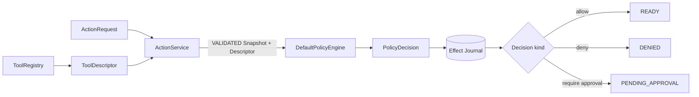
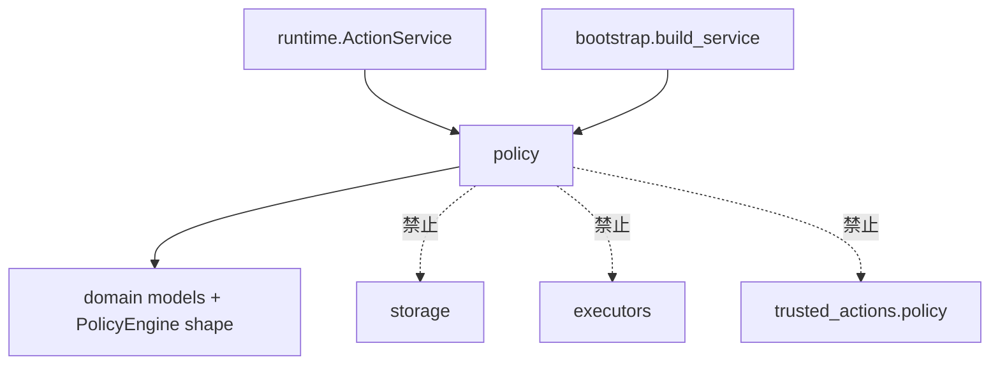
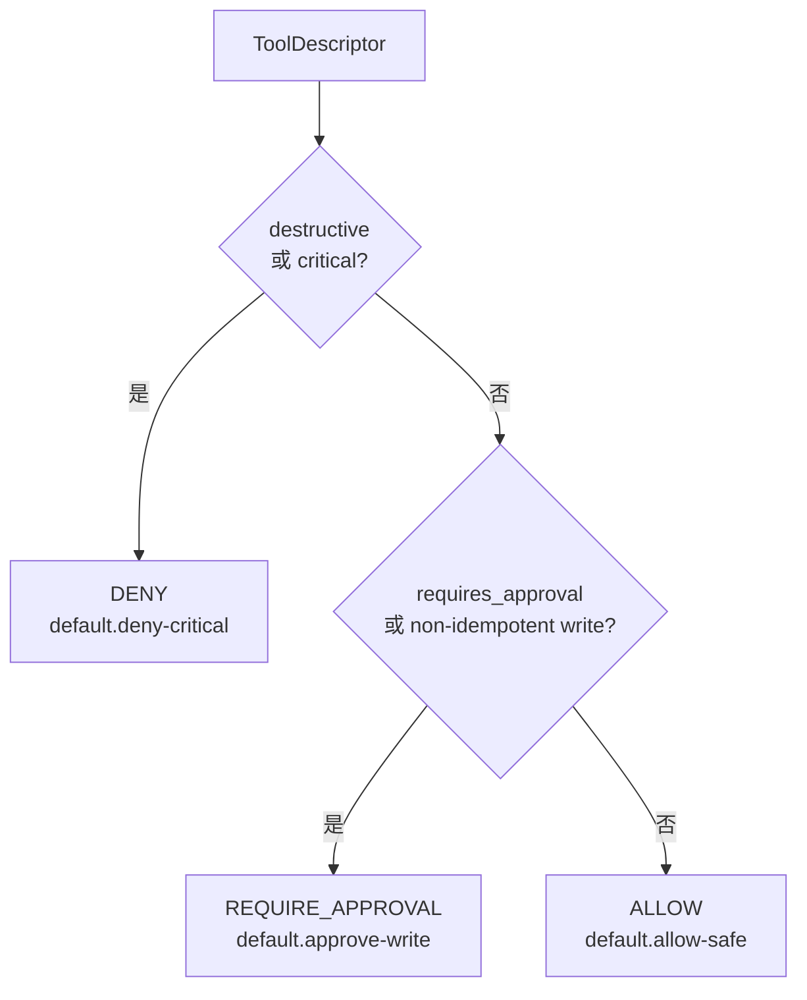
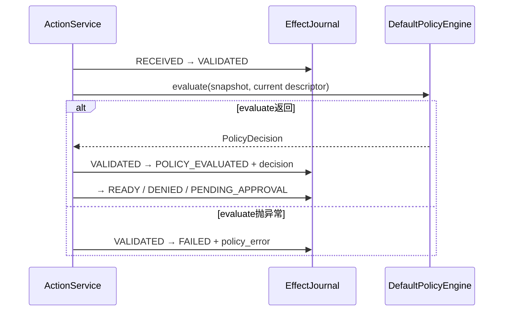
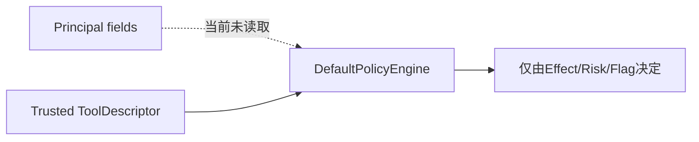
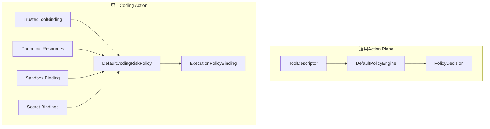

# Harnessix Code Policy模块设计

## 1. 模块摘要

| 项目 | 内容 |
|---|---|
| 源码包 | [`src/harnessix/policy/`](../../src/harnessix/policy/) |
| 当前职责 | 为通用Action Plane提供一个无状态、确定性的默认`PolicyEngine`实现 |
| 核心输入 | 已创建并校验的`ActionSnapshot`与受信`ToolDescriptor` |
| 核心输出 | `ALLOW`、`DENY`或`REQUIRE_APPROVAL`的`PolicyDecision` |
| 当前规则 | destructive或critical拒绝；显式要求审批或non-idempotent write要求审批；其余允许 |
| 非职责 | 不认证Principal，不解析资源，不读取Workspace/Secret/网络，不执行Tool，不写Journal，不决定Execution Plan |
| 默认装配 | 根Action Plane的`build_service`始终注入`DefaultPolicyEngine` |
| 当前测试事实 | 无独立Policy单元测试；Service集成覆盖ALLOW和显式审批，DENY/完整矩阵没有直接回归 |
| 代码版本 | `5cb6903d3efe6c97e39f4f7d7d0e7bcfa2556197` |

当前实现类的docstring明确标注为“MVP 默认策略”。它是Action Plane早期的最小安全路由，不是生产级组织授权引擎。
Harnessix还存在资源感知的
[`DefaultCodingRiskPolicy`](../../src/harnessix/trusted_actions/policy.py)，后者属于统一Trusted Action链；两者输入、
输出和安全声明不同。

## 2. 需求背景

Action调用方可以提交`effect_hint`、Principal和参数，但这些字段不能自行成为执行授权。运行时必须基于受信
Tool注册事实，在外部效果发生前给出可持久的策略结论。

最小默认策略需要回答三个问题：

1. 此Tool是否应无条件拒绝；
2. 是否必须等待人工审批；
3. 是否可以直接进入READY。

Policy只负责决策，不负责审批交互、租约、执行或恢复。若把这些职责混入Policy：

- Policy重试可能重复执行副作用；
- Policy服务故障无法和外部效果故障区分；
- 不同数据库后端会复制状态机；
- 模型或Adapter可能绕过唯一Journal；
- 审批对象难以绑定精确请求指纹。

## 3. 设计目标与非目标

### 3.1 当前设计目标

1. **受信输入**：只依据宿主`ToolDescriptor`，不信任Action `effect_hint`；
2. **拒绝优先**：destructive或critical永远优先DENY；
3. **非幂等写审批**：non-idempotent write必须REQUIRE_APPROVAL；
4. **Tool显式收紧**：`requires_approval=True`可以把其他Tool升级为审批；
5. **确定性**：同一Descriptor得到同一kind、policy_id和reason；
6. **无副作用**：评估不访问网络、数据库、文件或Executor；
7. **端口可替换**：实现`PolicyEngine` Protocol，可由更强策略替换；
8. **持久决定**：返回Domain `PolicyDecision`，由Service先写Journal再路由。

### 3.2 当前非目标

- 不执行RBAC/ABAC；
- 不验证tenant、subject、roles或framework；
- 不解析Tool参数、Action资源、路径或网络目标；
- 不根据Workspace信任、Sandbox级别、Secret、Git目标或外部域名决策；
- 不读取历史审批、用户偏好、组织策略或时间窗口；
- 不支持Policy配置文件、热更新、版本仓库或回滚；
- 不调用OPA、Cedar或远端PDP；
- 不生成审批UI说明或资源Diff；
- 不负责幂等键校验；
- 不负责审批指纹、Journal迁移或Executor异常分类；
- 不提供取消、超时、缓存、批量评估或降级策略；
- 不等同Trusted Action的资源感知Policy。

## 4. 系统上下文



### 4.1 调用顺序

Policy只在新Action完成`RECEIVED → VALIDATED`后调用。相同Action ID或幂等键命中已有Snapshot时，
`ActionService`直接返回原事实，不重新评估当前Policy。这保证历史决定不会因进程重启或规则代码变化被静默覆盖。

### 4.2 权威输入

| 输入 | 来源 | 当前使用情况 |
|---|---|---|
| `action: ActionSnapshot` | Effect Journal创建后的快照 | 当前实现完全未读取 |
| `tool.effect_class` | 受信Tool Registry | 决定拒绝、审批或允许 |
| `tool.risk_level` | 受信Tool Registry | 只有CRITICAL触发拒绝 |
| `tool.requires_approval` | 受信Tool Registry | true触发审批 |
| 其他Descriptor字段 | Registry | 当前忽略 |
| Principal/arguments/context/metadata | Action Request | 当前忽略 |

源码函数签名保留`action`以满足Policy端口并支持未来上下文策略，但当前未执行`del action`，也没有访问其字段。

## 5. 包结构与依赖

| 文件 | 行数 | 符号 | 职责 |
|---|---:|---|---|
| [`__init__.py`](../../src/harnessix/policy/__init__.py) | 5 | `DefaultPolicyEngine`导出 | 包公共面 |
| [`default.py`](../../src/harnessix/policy/default.py) | 35 | `DefaultPolicyEngine.evaluate` | 默认三分支规则 |

依赖方向：



Policy生产包只依赖Domain类型和标准Python语义，不依赖数据库、FastAPI、Observability或任何外部Policy SDK。

## 6. `PolicyEngine`端口

端口定义位于[`domain/ports.py`](../../src/harnessix/domain/ports.py)：

```python
class PolicyEngine(Protocol):
    async def evaluate(
        self,
        action: ActionSnapshot,
        tool: ToolDescriptor,
    ) -> PolicyDecision: ...
```

### 6.1 前置条件

`ActionService`当前保证：

- Action已持久创建；
- Snapshot状态为`VALIDATED`；
- Tool来自当前Registry；
- effect hint、必要幂等键、疑似原始Secret键和Input Model已校验；
- 还没有进入`POLICY_EVALUATED`；
- 尚未执行任何Tool效果。

端口类型本身不强制这些条件。直接调用Policy可以传任意状态或与Snapshot不匹配的Descriptor。

### 6.2 后置条件

Policy返回后，Service将Decision写入Journal并迁移到`POLICY_EVALUATED`，再按kind推进：

| kind | 目标状态 | 结果 |
|---|---|---|
| `ALLOW` | `READY` | 可由inline Service或Worker Claim |
| `DENY` | `DENIED` | 同事务保存`policy_denied` Result |
| `REQUIRE_APPROVAL` | `PENDING_APPROVAL` | 等待绑定当前请求指纹的决定 |

Policy返回值本身不授权Executor。只有Journal已持久的READY及有效Lease允许执行。

## 7. 默认决策算法

源码等价逻辑：

```text
evaluate(action, tool):
    if tool.effect_class == DESTRUCTIVE
       or tool.risk_level == CRITICAL:
        return DENY("default.deny-critical")

    if tool.requires_approval
       or tool.effect_class == NON_IDEMPOTENT_WRITE:
        return REQUIRE_APPROVAL("default.approve-write")

    return ALLOW("default.allow-safe")
```

### 7.1 优先级



拒绝分支优先于审批。即使destructive Tool声明`requires_approval=True`，结果仍是DENY，不能由普通审批解锁。

### 7.2 完整效果×风险矩阵

以下矩阵假设`requires_approval=False`：

| Effect \\ Risk | LOW | MEDIUM | HIGH | CRITICAL |
|---|---|---|---|---|
| READ_ONLY | ALLOW | ALLOW | ALLOW | DENY |
| IDEMPOTENT_WRITE | ALLOW | ALLOW | ALLOW | DENY |
| NON_IDEMPOTENT_WRITE | REQUIRE_APPROVAL | REQUIRE_APPROVAL | REQUIRE_APPROVAL | DENY |
| DESTRUCTIVE | DENY | DENY | DENY | DENY |

这意味着MEDIUM/HIGH本身没有任何升级作用；IDEMPOTENT_WRITE若未显式要求审批，即使HIGH也会ALLOW。

### 7.3 `requires_approval`叠加

| 基础条件 | flag=false | flag=true |
|---|---|---|
| destructive或critical | DENY | DENY |
| non-idempotent write | REQUIRE_APPROVAL | REQUIRE_APPROVAL |
| 其他Effect/非critical | ALLOW | REQUIRE_APPROVAL |

Tool只能通过flag收紧默认结果，不能把拒绝降级为审批或允许。

## 8. Policy Decision合同

`PolicyDecision`字段：

| 字段 | 默认实现值 | 语义 |
|---|---|---|
| `kind` | 三种枚举之一 | 状态路由 |
| `policy_id` | 固定低基数字符串 | 规则身份 |
| `reason` | 固定中文说明 | 审计和用户解释 |
| `evaluated_at` | 构造时UTC当前时间 | 决策发生时间 |

### 8.1 固定Decision

| 分支 | policy_id | reason |
|---|---|---|
| 拒绝 | `default.deny-critical` | 默认策略拒绝destructive或critical Action |
| 审批 | `default.approve-write` | 该Action的运行时工具定义要求人工审批 |
| 允许 | `default.allow-safe` | 运行时工具定义允许直接执行 |

kind、ID和reason固定，但`evaluated_at`每次不同，因此完整`PolicyDecision`不是纯值恒等。正常Action只评估一次。

### 8.2 当前合同弱点

Domain `PolicyDecision`没有：

- policy version；
- reason code与可本地化参数；
- rule/package digest；
- 输入摘要；
- 资源列表；
- Policy配置版本；
- 到期时间；
- 决策义务或约束；
- 字段长度和时区Validator。

因此`policy_id`只能标识当前代码分支，不能独立重建当时完整Policy Bundle。

## 9. 与`ActionService`的事务边界



Policy评估和Journal写入不在一个跨组件事务中。当前Policy无外部副作用，因此进程在“评估返回、Decision未提交”
窗口退出时，Action仍停在VALIDATED；当前`recover_expired`不处理VALIDATED，且Service也没有自动resume该状态。
这属于Action生命周期恢复缺口，不应由Policy内部写Journal规避。

### 9.1 Policy异常

任意异常被Service转为：

- Action状态`FAILED`；
- code `policy_error`；
- message `str(error)`；
- `retriable=True`。

当前状态机FAILED为终态，没有内建Policy重试转换。`retriable=True`只是信息，实际重新评估需要新设计；异常文本
直接持久化也有Secret泄漏风险。

## 10. Principal与身份边界

`DefaultPolicyEngine.evaluate`当前不读取：

- `principal.tenant_id`；
- `subject_id`；
- `framework`；
- `roles`；
- Session/Run/Trace；
- Approval actor。

因此它不能表达“某角色可运行某Tool”“租户A禁止网络”“CI主体可自动测试”等规则。外层即使提供可信Principal，
当前默认Policy也不会使用。



在可信身份和授权规则闭环前，默认Action API只能部署在本地或受信Gateway后，不能作为公网多租户授权边界。

## 11. 资源、参数与环境边界

当前Policy不查看：

- `arguments`中的路径、命令、URL、分支或目标资源；
- Secret Ref；
- Workspace Snapshot/Lease；
- ProcessSpec/Sandbox Profile；
- Network/Egress；
- Git remote/ref；
- MCP server/tool identity；
- Patch diff或写文件集合。

因此两个同样标为`NON_IDEMPOTENT_WRITE/HIGH`的Tool会得到完全相同审批kind，Policy不能生成“批准哪些资源”的
精确边界。具体Process/Patch/Delivery链通过Execution Plan和Trusted Action Policy补充此能力。

## 12. 与Trusted Action Policy的区别

[`DefaultCodingRiskPolicy`](../../src/harnessix/trusted_actions/policy.py)不属于`policy`包。两者对比：

| 维度 | DefaultPolicyEngine | DefaultCodingRiskPolicy |
|---|---|---|
| 使用链 | 旧/通用Action Plane | 统一Trusted Coding Action |
| 输入 | ActionSnapshot + ToolDescriptor | TrustedToolBinding + Canonical Resources + Sandbox + Secrets |
| 输出 | `PolicyDecision` | `ExecutionPolicyBinding` |
| 是否读取Principal | 否 | 否 |
| 是否核对资源/Effect | 否 | 是 |
| 是否核对网络 | 否 | 是 |
| 是否核对Secret | 否 | 是 |
| MEDIUM/HIGH | 单独不升级 | 要求审批 |
| 任意非只读Effect | 仅non-idempotent自动审批 | 全部要求审批 |
| Policy版本 | 仅policy_id | `version=trusted-coding-action/v1` |
| 事实落点 | Action Journal | Execution Plan/Action Route Store |



新增生产级Coding Tool应优先走Trusted Action统一路由，而不是扩充旧Policy后绕过Execution Plan。长期收口需明确
兼容Adapter和单一产品入口，不能让同一效果获得两套互相矛盾的批准。

## 13. 默认Bootstrap装配

[`build_service`](../../src/harnessix/bootstrap.py)为API和独立Worker都构造新的`DefaultPolicyEngine`实例。
实例无字段、无初始化和关闭方法，多个实例行为相同。

内置Tool：

| Tool | Effect | Risk | requires approval | 默认结果 |
|---|---|---|---:|---|
| `system.echo` | READ_ONLY | LOW | false | ALLOW |
| `demo.issue.create` | IDEMPOTENT_WRITE | MEDIUM | true | REQUIRE_APPROVAL |

仓库内置Tool没有destructive/critical定义，因此默认DENY分支未被Bootstrap真实Tool覆盖。

## 14. 并发、性能与确定性

- `evaluate`是async函数，但内部没有`await`；
- 每次评估为O(1)，无I/O、锁、缓存或共享状态；
- 同一实例可被并发调用；
- 不持有Action引用；
- 不修改Snapshot或Descriptor；
- 决策时间为唯一随调用变化字段；
- Event Loop取消只能在协程调度边界发生，函数内部没有协作取消点；
- 当前没有超时必要性，但Policy端口整体未定义Deadline。

若替换为远端PDP，必须重新设计超时、取消、缓存、熔断、失败关闭、版本证明和敏感输入最小化，不能保持当前异常语义
后直接上线。

## 15. 安全分析

| 威胁 | 当前控制 | 剩余风险 |
|---|---|---|
| 调用方伪报低Effect | Service按Registry Descriptor，effect hint不一致先FAILED | Registry本身必须受信 |
| destructive经审批放行 | 拒绝优先，始终DENY | 只能通过部署新Policy改变 |
| non-idempotent自动运行 | 强制REQUIRE_APPROVAL | 审批仍需精确指纹 |
| Tool主动要求审批被忽略 | flag触发REQUIRE_APPROVAL | Registry热变更/历史Descriptor需治理 |
| HIGH风险自动运行 | 仅CRITICAL拒绝 | HIGH只读/幂等写无flag时ALLOW |
| 角色越权 | 无控制 | Principal完全未读取 |
| 资源错配 | 无控制 | 路径、网络、Secret等不参与旧Policy |
| Policy规则漂移 | 历史Decision持久，不重评 | 没有规则digest/版本，审计难重建 |
| Policy异常泄密 | 无统一清洗 | `str(error)`进入Result/日志 |
| Policy不可用降级放行 | 不降级，异常FAILED | FAILED终态且无正式重试 |
| 直接绕过Service执行 | 架构禁止 | Python进程内私有调用仍依赖宿主纪律 |

## 16. 失败、取消与恢复语义

### 16.1 输入异常

`DefaultPolicyEngine`假定Pydantic Descriptor有效。传入非枚举值通常在构造阶段失败；如果调用方绕过模型或传入
不匹配Snapshot，Policy本身不会核对。

### 16.2 评估异常

Policy没有显式抛错分支。未来修改若产生异常，Service将Action确定标记FAILED，不进入UNKNOWN，因为尚未调用
Executor。

### 16.3 取消

当前评估没有await，通常在单次Event Loop step完成。Policy合同没有CancelToken，也没有持久`policy_cancelled`
状态。调用Task在评估前取消可能使Action停在VALIDATED；评估后、写Decision前退出同样保留VALIDATED。

### 16.4 重启恢复

- RECEIVED/VALIDATED/POLICY_EVALUATED没有通用恢复扫描；
- 相同Action重提只返回已有Snapshot，不继续驱动；
- Lease恢复只处理LEASED/RUNNING/RECONCILING；
- 已持久Policy Decision不会因代码升级自动重评。

因此Action Plane不能把“Service任意切点都可自动续跑”作为当前事实。Policy阶段崩溃恢复应在0.9可靠性设计中
定义稳定resume命令或启动扫描，并证明不会重复效果。

## 17. 可观测性与审计

Policy本身不调用Observability。`ActionService`在评估外层创建`harnessix.policy.evaluate` Span，并在
`policy_evaluated` Event中保存：

- policy_id；
- decision kind。

完整`PolicyDecision`保存在Action Snapshot。当前没有：

- Policy耗时独立Metric；
- deny/approval/allow计数的低基数Policy指标；
- rule digest/config version；
- 输入资源摘要；
- Decision变更审计；
- Policy异常公开/私有消息拆分。

Metric标签不能加入arguments、Principal、路径、URL、Secret名称或reason正文。

## 18. 部署与替换约束

### 18.1 本地默认部署

默认策略无配置、无状态、无需迁移，API和Worker代码版本必须一致。Queued模式中Policy只在提交端执行；Worker消费
已READY Action，不重新评估。

### 18.2 替换实现

实现新的`PolicyEngine`必须满足：

1. 决策前不执行外部副作用；
2. 输入来自受信Snapshot/Descriptor；
3. 明确失败关闭；
4. 输出稳定Policy版本和reason code；
5. 超时、取消、缓存及断路器有持久语义；
6. 远端请求不泄露Secret/参数正文；
7. 规则更新不追溯篡改旧Decision；
8. SQLite/PostgreSQL、inline/queued语义一致；
9. 有完整决策矩阵和负向测试；
10. 与Trusted Action Policy的职责和收口路线清楚。

### 18.3 OPA/Cedar状态

源码docstring只说“后续可由OPA/Cedar适配器替换”。当前仓库没有OPA/Cedar Client、Bundle加载、Rego/Cedar
Schema、缓存、签名或部署配置。文档不得把它们写成已支持能力。

## 19. 重点接口与字段

| 符号/字段 | 读取者 | 当前作用 | 不作用于 |
|---|---|---|---|
| `DefaultPolicyEngine.evaluate` | ActionService | 三分支决策 | 执行/持久化 |
| `tool.effect_class` | Policy | 拒绝/非幂等审批 | 调用方effect hint |
| `tool.risk_level` | Policy | 仅critical拒绝 | medium/high升级 |
| `tool.requires_approval` | Policy | 显式收紧 | 幂等校验 |
| `action` | Policy签名 | 当前未使用 | Principal/资源决策 |
| `PolicyDecision.kind` | Service | 状态路由 | 单独授权 |
| `policy_id` | Journal/Event/审计 | 固定分支标识 | 规则包digest |
| `reason` | Result/审计 | 人类可读说明 | 机器reason code |
| `evaluated_at` | Snapshot | 评估时间 | TTL/到期 |

## 20. 核心业务逻辑伪代码

### 20.1 新Action评估

```text
snapshot = journal.create_action(request, descriptor)
validate request
journal.transition(RECEIVED, VALIDATED)

try:
    decision = policy.evaluate(snapshot, descriptor)
except Exception as error:
    journal.transition(
        VALIDATED,
        FAILED,
        result=policy_error(public_message_currently_str(error)),
    )
    return

journal.transition(
    VALIDATED,
    POLICY_EVALUATED,
    policy=decision,
    event_data={policy_id, decision},
)

if decision.kind == DENY:
    transition DENIED
elif decision.kind == REQUIRE_APPROVAL:
    transition PENDING_APPROVAL
else:
    transition READY
```

### 20.2 默认矩阵

```text
deny = effect == destructive OR risk == critical
approval = requires_approval OR effect == non_idempotent_write

if deny:
    DENY
elif approval:
    REQUIRE_APPROVAL
else:
    ALLOW
```

### 20.3 未来远端PDP必须具备的失败顺序

```text
bind policy bundle version and input digest
send minimum non-secret canonical attributes
wait under explicit deadline and cancellation
verify signed/identified response
persist decision before route
on timeout/unavailable/invalid response:
    fail closed with sanitized private/public error
never fall back from deny/unknown to allow
```

此伪代码是演进约束，不是当前已实现远端能力。

## 21. 源码与测试映射

| 设计元素 | 源码 | 关键符号 | 测试 | 测试符号 |
|---|---|---|---|---|
| 默认Policy导出 | [`__init__.py`](../../src/harnessix/policy/__init__.py) | `DefaultPolicyEngine`、`__all__` | [`test_action_service.py`](../../tests/integration/test_action_service.py) | `test_echo_runs_without_approval_and_records_lifecycle` |
| ALLOW安全读 | [`default.py`](../../src/harnessix/policy/default.py) | `DefaultPolicyEngine.evaluate` | [`test_action_service.py`](../../tests/integration/test_action_service.py) | `test_echo_runs_without_approval_and_records_lifecycle` |
| 显式审批 | [`default.py`](../../src/harnessix/policy/default.py) | `evaluate` | [`test_action_service.py`](../../tests/integration/test_action_service.py) | `test_issue_requires_approval_and_is_idempotent` |
| Process非幂等审批 | [`default.py`](../../src/harnessix/policy/default.py) | `EffectClass.NON_IDEMPOTENT_WRITE` | [`test_action_executor.py`](../../tests/processes/test_action_executor.py) | `test_persistent_approval_executes_once_and_records_binary_result` |
| 固定测试Profile审批 | [`default.py`](../../src/harnessix/policy/default.py) | `PolicyDecisionKind.REQUIRE_APPROVAL` | [`test_test_profiles.py`](../../tests/processes/test_test_profiles.py) | `test_run_tests_only_exposes_profile_and_reports_test_failure` |
| Tool权威Effect | [`runtime.py`](../../src/harnessix/runtime.py) | `_validate_request` | [`test_action_service.py`](../../tests/integration/test_action_service.py) | `test_effect_hint_mismatch_is_rejected` |
| Policy持久后路由 | [`runtime.py`](../../src/harnessix/runtime.py) | `ActionService._submit` | [`test_action_service.py`](../../tests/integration/test_action_service.py) | `test_echo_runs_without_approval_and_records_lifecycle`、`test_rejected_approval_never_executes_effect` |
| 默认Bootstrap装配 | [`bootstrap.py`](../../src/harnessix/bootstrap.py) | `build_service`、`build_registry` | [`test_registry.py`](../../tests/unit/test_registry.py) | `test_runtime_owns_effect_classification` |
| 资源感知策略分界 | [`policy.py`](../../src/harnessix/trusted_actions/policy.py) | `DefaultCodingRiskPolicy.evaluate` | [`test_router.py`](../../tests/trusted_actions/test_router.py) | `test_bounded_read_is_planned_executed_and_audited`、`test_write_requires_exact_approval_and_workspace_freshness` |

## 22. 测试设计与当前证据

### 22.1 当前可执行基线

默认Action Service相关本地测试已随Domain切片验证，覆盖：

- 内置READ_ONLY/LOW/无flag → ALLOW → SUCCEEDED；
- IDEMPOTENT_WRITE/MEDIUM/flag=true → PENDING_APPROVAL；
- 人工拒绝不执行；
- effect hint不一致在Policy前失败；
- Process NON_IDEMPOTENT_WRITE/flag=true进入审批链。

### 22.2 直接测试缺口

`tests/policy/`不存在，也没有参数化Default Policy决策矩阵。当前没有直接证明：

1. destructive/LOW拒绝；
2. READ_ONLY/CRITICAL拒绝；
3. 拒绝优先于`requires_approval`；
4. NON_IDEMPOTENT_WRITE在flag=false时仍审批；
5. READ_ONLY在flag=true时审批；
6. MEDIUM/HIGH在flag=false时当前允许；
7. IDEMPOTENT_WRITE/HIGH在flag=false时当前允许；
8. action字段完全不影响Decision；
9. policy_id/reason固定；
10. Policy无I/O、可并发或取消切点；
11. Policy异常的FAILED、脱敏和恢复；
12. Snapshot Descriptor与方法参数不匹配时的行为。

### 22.3 测试优先级

| 优先级 | 测试 | 原因 |
|---|---|---|
| P0 | 4×4 Effect/Risk矩阵×flag | 防止规则改动静默放宽 |
| P0 | deny优先级 | 防止审批解锁destructive |
| P0 | Policy异常公开/私有错误 | 防止Secret泄漏 |
| P1 | action不影响当前结果 | 固化现状，后续改为资源Policy时显式破坏 |
| P1 | Decision ID/reason/time | 审计可重复 |
| P1 | VALIDATED崩溃窗口恢复 | 当前Action可能悬挂 |
| P2 | 并发和性能 | 当前O(1)，替换远端PDP前必需 |

## 23. 当前限制与演进方向

| 当前限制 | 直接影响 | 正确演进方向 |
|---|---|---|
| 规则标注MVP且仅三分支 | 不能支撑复杂生产授权 | 以Trusted Action资源Policy为产品主路由，旧Action保持兼容 |
| 完全忽略Principal | 无角色、租户或主体授权 | 先接可信身份，再设计RBAC/ABAC；不能信任自报roles |
| 不读取资源和参数 | 审批不能精确到路径/命令/域名 | 使用Canonical Resources与Execution Plan |
| MEDIUM/HIGH默认不升级 | 高风险幂等写可能自动允许 | 新产品Policy至少审批medium/high；兼容变更需测试和迁移 |
| 幂等写默认可ALLOW | 是否审批完全依赖Tool flag | Registry治理和统一Policy双重校验 |
| 无Policy版本/digest | 无法重建历史规则包 | Decision绑定版本、bundle digest和输入摘要 |
| 无直接测试矩阵 | 安全回归难发现 | 新建`tests/policy/test_default.py`参数化全矩阵 |
| Policy阶段无恢复 | 崩溃可留下VALIDATED/POLICY_EVALUATED悬挂 | 定义安全resume/启动扫描及提交窗口测试 |
| 异常文本未清洗 | Policy实现可能泄密 | 0.9.4公私错误双轨 |
| 无Deadline/Cancel | 远端PDP可能挂住提交 | 扩展端口前先定义时限与取消终态 |
| 无规则配置/签名 | 不能运营组织Policy | 版本化、签名Bundle和原子激活/回滚 |
| 两套Policy并存 | 旧Action与Trusted Action结论可能不同 | 0.9产品装配只走统一Trusted Action，兼容层显式标注 |

## 24. 风险登记

| 风险 | 严重度 | 当前控制 | 后续 |
|---|---|---|---|
| HIGH幂等写未设flag时自动ALLOW | 高 | 受信Registry应正确声明；默认产品仅示例Tool | 统一资源Policy与矩阵测试 |
| Principal伪造/未使用 | 高（公网） | 仅本地/受信部署 | 0.9.4身份与Policy |
| Policy阶段崩溃悬挂 | 中高 | 相同Action事实保留 | 0.9.3恢复设计 |
| 两套Policy漂移 | 中高 | 文档明确分界 | 0.9.1统一产品路由 |
| Decision不可重建 | 中 | Journal保存输出而非规则包 | Policy版本/digest |
| 异常消息泄密 | 高 | 当前默认实现不抛异常 | 替换实现前必须错误清洗 |
| 缺直接DENY测试 | 高 | 简单源码可审查 | 立即纳入后续代码治理测试 |
| 动态Registry变化 | 中 | Bootstrap期约定 | 不可变Registry Snapshot |

## 25. 验收标准

当前Policy模块达到：

- [x] 默认实现满足`PolicyEngine`异步端口；
- [x] destructive/critical拒绝优先级在源码中明确；
- [x] non-idempotent和Tool显式flag进入审批；
- [x] 其他Descriptor进入ALLOW；
- [x] 决策先持久再推进Action；
- [x] Policy无I/O、无状态、不执行效果；
- [x] 默认Bootstrap、旧Process Saga和Trusted Action策略边界可定位；
- [x] 当前完整决策矩阵和未使用输入已文档化；
- [x] 测试证据与直接测试缺口已分开。

尚未达到：

- [ ] 独立4×4×flag决策矩阵测试；
- [ ] Principal/资源/环境感知的生产授权；
- [ ] Policy版本、Bundle digest和可重建审计；
- [ ] Policy阶段崩溃恢复；
- [ ] 远端PDP的超时、取消、缓存、签名和故障语义；
- [ ] 统一产品Policy入口。

## 26. 变更维护规则

以下变化必须同步本文、Action Plane设计和测试：

- 决策分支、优先级或Effect/Risk含义；
- `requires_approval`语义；
- Policy ID、reason或Decision字段；
- Principal、资源、Secret、网络或Workspace输入；
- Policy端口签名；
- 默认Bootstrap注入；
- Policy异常、取消、超时或恢复；
- Registry热更新与Policy版本绑定；
- OPA/Cedar/远端PDP集成；
- Default Policy和Trusted Action Policy收口路线。

任何放宽规则必须提供负向安全测试和升级影响；任何收紧规则必须说明历史Action、幂等命中和用户审批体验。

## 27. 推荐源码阅读路线

1. 阅读[Domain模块设计](domain.md)的Effect、Risk、Policy Decision与状态；
2. 阅读[`default.py`](../../src/harnessix/policy/default.py)三分支；
3. 对照第7节完整矩阵，注意MEDIUM/HIGH当前不升级；
4. 阅读[`ActionService._submit`](../../src/harnessix/runtime.py)的校验、调用、持久和路由；
5. 阅读[`bootstrap.py`](../../src/harnessix/bootstrap.py)内置Tool事实；
6. 阅读[Trusted Action Policy](../../src/harnessix/trusted_actions/policy.py)比较资源感知差异；
7. 用第21节测试核对当前证据，再按第22节识别未覆盖结论。

## 28. 相关设计与历史证据

- 领域合同：[Domain模块设计](domain.md)；
- 跨包主链：[Action Plane子系统设计](../subsystems/action-plane.md)；
- 请求合同：[Action Contract](../action-contract.md)；
- 生命周期：[Action生命周期](../action-lifecycle.md)；
- Execution授权：[Execution Plan模块设计](execution.md)；
- 统一风险路由：[ADR 0069](../adr/0069-unified-coding-action-risk-route.md)；
- Python-first端口：[ADR 0001](../adr/0001-python-first-runtime.md)；
- UNKNOWN安全语义：[ADR 0002](../adr/0002-unknown-first-class.md)。

本文只维护`src/harnessix/policy`的现行事实。Trusted Action Policy应在
`docs/modules/trusted-actions.md`中展开；两者不得通过同名“Default Policy”被误认为同一实现。

## 29. 变更记录

| 文档版本 | 代码版本 | 日期 | 变更摘要 |
|---|---|---|---|
| 1 | `5cb6903d3efe6c97e39f4f7d7d0e7bcfa2556197` | 2026-09-12 | 建立Policy包现行事实源，覆盖默认三分支、完整决策矩阵、Action Service边界、Trusted Action策略差异、失败恢复、测试缺口和生产演进约束 |
