# Harnessix Code Process Runtime模块设计

## 1. 模块摘要

| 项目 | 内容 |
|---|---|
| 源码包 | [`src/harnessix/processes/`](../../src/harnessix/processes/) |
| 当前职责 | 定义受控进程请求和监督合同，完成POSIX/Windows进程树所有权、pipe/PTY、stdin、输出脱敏与持久化、Lease/CAS、取消/超时/关闭及重启后保守恢复 |
| 兼容职责 | 保留0.5 POSIX固定程序Runtime、Action Plane准入、Agent跨库Saga、Process Output Artifact和`run_tests` Profile入口 |
| 非职责 | 不决定模型是否应运行命令，不替代Execution Plan审批，不提供OS文件/网络隔离，不拥有Action Journal或Session Store，不把进程退出码解释为测试/业务成功 |
| 上游调用者 | 显式宿主装配、Trusted Action/Sandbox、Agent Process专用端口、Eval的`run_tests`闭环 |
| 下游依赖 | `execution`授权计划、`workspace`快照、`secrets`解析/脱敏、SQLite Lease Store、POSIX进程组、Windows Job Object/ConPTY |
| 主要持久状态 | Supervised链的Process Lease当前投影与完整快照事件；兼容链的执行事实由通用Action Journal和Session/Artifact Store拥有 |
| 当前产品状态 | 两条进程链均已实现并有测试，但默认产品Bootstrap不广告任意`host.process`；必须由受信宿主显式装配 |
| 代码版本 | `c7449164a2bbf08164472a36c11102dc408ebb15` |

Process Runtime解决的不是“如何调用`subprocess`”，而是以下生产问题：命令何时被授权、由谁拥有完整进程树、
调用方取消或崩溃后谁负责回收、输出如何有界且不泄露Secret、重启后哪些事实可证明，以及何时必须报告
`unknown`而不是假定执行未发生。

## 2. 需求背景

Coding Agent执行命令具有比普通函数调用更复杂的生命周期：

- 目标进程可以创建后代、继承句柄、打开终端并在根进程退出后继续运行；
- Shell source、argv、cwd、环境和可执行文件解析共同决定实际效果；
- stdout/stderr可能无限输出、包含二进制、无效UTF-8和Secret；
- 调用方Task取消不等于内核进程已退出；
- 宿主崩溃后数字PID可能复用，不能作为跨重启控制权限；
- 命令已启动但结果未持久化时，自动重放可能重复写文件、发网络请求或执行迁移；
- Windows普通spawn后再加入Job Object存在后代在绑定前逃逸的竞态；
- PTY是终端字节流，不等价于三根普通pipe，尤其Windows ConPTY的EOF和关闭语义不同。

因此模块将“授权计划”“进程描述”“平台能力”“启动物化”“Owner控制”“输出证明”和“持久Lease”拆开，并让
每层都拥有可验证合同。

## 3. 设计目标与非目标

### 3.1 设计目标

1. **先授权后spawn**：Supervised链只消费精确有效的`ExecutionPlanV2`与Approval Checkpoint；
2. **稳定执行身份**：`ProcessSpec.process_id`、Plan fingerprint、Spec/Capability/Launch摘要一起进入Lease；
3. **进程树所有权**：POSIX以新Session/Process Group管理，Windows以不可breakaway Job Object管理；
4. **消除Windows归属窗口**：pipe模式挂起创建→加入Job→恢复，ConPTY在`CreateProcessW`属性中同时绑定Job；
5. **独立Owner**：Agent/App宿主不直接承担目标生命周期，私有控制管道断开时Owner主动收敛进程树；
6. **持久恢复**：Lease使用CAS状态和append-only快照事件；重启只消费HMAC回执，不凭PID猜测；
7. **有界I/O**：stdin单帧、累计输入、输出持久前缀、控制帧和终端尺寸均有显式上限；
8. **Secret零持久明文**：Secret只经内存启动帧注入，输出先流式脱敏再计量、摘要和写盘；
9. **真实终态**：退出、启动失败、清理失败和未知效果分开，非零returncode不等于运行时失败；
10. **兼容历史Agent链**：0.5的唯一Action审批、跨库Saga和受控测试Profile保持可读、可恢复；
11. **跨平台合同一致**：macOS/Linux和Windows共享Spec/Lease语义，平台差异由Capability与Owner实现显式表达。

### 3.2 明确非目标

- 不默认向模型开放任意Shell或argv；
- 不把cwd、进程组或Job Object当作文件系统/网络Sandbox；
- 不阻止POSIX目标主动`setsid`、使用内核漏洞或访问当前用户可访问资源；
- 不提供CPU、内存、PID或网络资源隔离；这些由Container Sandbox/cgroup等能力负责；
- 不根据命令退出码判断测试通过、构建成功或业务正确；
- 不允许重启后按历史PID发送信号、重新发送stdin或自动重放命令；
- 不提供远端执行池、分布式Lease、终端多客户端复用或WebSocket传输；
- 不统一迁移0.5兼容Action链与0.7 Supervised链为同一产品入口；
- 不保证恶意同UID进程无法读取状态库、替换输出或取得Owner token；
- 不承诺普通宿主Process达到`container_strong`隔离级别。

## 4. 当前实现的三条执行链

模块中存在三个来源不同但仍在使用的纵向切片，阅读时必须区分：

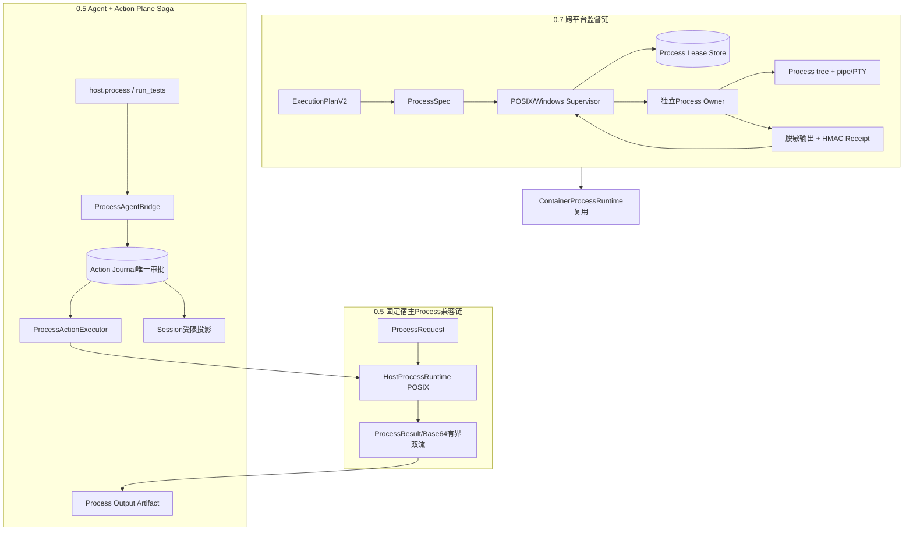

### 4.1 0.5固定宿主链

[`HostProcessRuntime`](../../src/harnessix/processes/runtime.py)只支持POSIX、固定cwd、宿主预注册程序表、显式环境、
pipe双流和单个前台调用。它在同一进程内持有目标句柄，没有独立Lease Store；崩溃后的效果由Action Journal标记
`UNKNOWN`并进入人工处置。

### 4.2 0.5 Agent/Action Saga

[`ProcessActionExecutor`](../../src/harnessix/processes/action_executor.py)、
[`ProcessAgentBridge`](../../src/harnessix/processes/agent_runtime.py)和Session投影复用通用Action Plane。Action Journal
是唯一审批和执行事实，Session只保存受限镜像。`run_tests`进一步将模型输入限制为Profile名。

### 4.3 0.7 Supervised链

[`PosixProcessSupervisor`](../../src/harnessix/processes/supervisor.py)和
[`WindowsProcessSupervisor`](../../src/harnessix/processes/supervisor.py)消费`ExecutionPlanV2`、持久`ProcessLease`，
以独立Owner、输出文件和签名回执实现跨平台进程树监督。Container运行时也复用此Owner生命周期。

### 4.4 当前收口边界

三条链都不是默认模型工具。0.5 Saga已有Agent专用接入但底层仅POSIX且不是强隔离；0.7链具备跨平台Owner与
Execution Plan绑定，但未直接取代旧Agent Bridge。新增产品能力应优先经`trusted_actions + ExecutionPlanV2 +
ProcessSupervisor`统一路由，不应再复制第四套审批或恢复状态机。

## 5. 模块上下文与信任边界

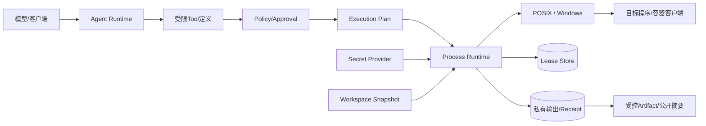

### 5.1 可信输入

| 输入 | 必须由谁提供 | Process模块如何核对 |
|---|---|---|
| Tool风险与效果 | 宿主Registry/Trusted Action Binding | 兼容链固定HIGH、NON_IDEMPOTENT_WRITE、审批和幂等；新链消费Plan |
| `ExecutionPlanV2` | 受信Planner + Store | Approval、Workspace、Capability、环境、Secret和Spec逐层比较 |
| `ProcessSpec` | 受信Tool/Container Planner | 自摘要、模式形状、预算和Capability检查 |
| Workspace根 | 宿主映射 | `verify_workspace_snapshot`后构造绝对cwd |
| 环境 | 宿主配置 | 不继承父环境；按平台计算摘要并与Launch Binding比较 |
| Secret值 | Secret Provider | 名称/版本/目标与Plan匹配后注入；不写Plan/Lease/Receipt |
| Capability | 平台Probe | spawn前重算实现摘要并与Supervisor冻结能力比较 |
| Owner回执 | 独立Owner | Process ID、Owner identity和HMAC-SHA256验证 |

### 5.2 禁止旁路

- 未持久或未批准的Plan不能直接传入spawn私有实现；
- 数字PID不能成为重启后的控制句柄；
- Session里的Process审批Item不能直接授权Executor；
- 模型不能提供环境、Secret值、可执行路径映射或Sandbox级别；
- Container客户端退出不能直接解释为容器工作负载已清理；
- 输出文件不能不经Lease摘要校验直接发布给模型；
- 非零returncode不能被Action执行器改写为传输失败。

## 6. 包结构与阅读顺序

生产包共5,579行，建议按责任簇阅读，而不是按文件名排序。

### 6.1 0.7 Supervised主链

| 顺序 | 文件 | 关键符号 | 阅读目的 |
|---:|---|---|---|
| 1 | [`supervision_contracts.py`](../../src/harnessix/processes/supervision_contracts.py) | `ProcessSpec`、`ProcessCapabilityProbe`、`ProcessLaunchBinding`、`ProcessLease` | 理解稳定身份、状态和不变量 |
| 2 | [`supervision_planner.py`](../../src/harnessix/processes/supervision_planner.py) | `build_process_spec`、`build_process_launch_binding`、`prepare_process_lease` | 理解Plan、能力、环境和Lease如何绑定 |
| 3 | [`supervision_store.py`](../../src/harnessix/processes/supervision_store.py) | `SQLiteProcessLeaseStore` | 理解CAS、事件和损坏检查 |
| 4 | [`owner_protocol.py`](../../src/harnessix/processes/owner_protocol.py) | `ProcessOwnerStart`、`ProcessOwnerCommand` | 理解内存控制帧及I/O预算 |
| 5 | [`owner_receipt.py`](../../src/harnessix/processes/owner_receipt.py) | `ProcessOwnerReceipt`、`sign_owner_receipt`、`read_owner_receipt` | 理解HMAC、原子发布和恢复证据 |
| 6 | [`owner_output.py`](../../src/harnessix/processes/owner_output.py) | `CapturedProcessOutput` | 理解先脱敏、后计量、摘要和落盘 |
| 7 | [`supervisor.py`](../../src/harnessix/processes/supervisor.py) | `SupervisedProcess`、`PosixProcessSupervisor`、`WindowsProcessSupervisor` | 跟随计划复核、启动、控制和reconcile |
| 8 | [`posix_owner.py`](../../src/harnessix/processes/posix_owner.py) | `_Owner` | 理解Session/Process Group、selector、TERM/KILL和回执 |
| 9 | [`windows_job.py`](../../src/harnessix/processes/windows_job.py) | `WindowsJobObject` | 理解挂起归属和kill-on-close |
| 10 | [`windows_conpty.py`](../../src/harnessix/processes/windows_conpty.py) | `spawn_conpty`、`WindowsConPtyProcess` | 理解ConPTY与Job原子属性、EOF和resize |
| 11 | [`windows_owner.py`](../../src/harnessix/processes/windows_owner.py) | `_Owner` | 理解Windows有界队列和Job生命周期 |

### 6.2 0.5兼容与Agent Saga

| 顺序 | 文件 | 关键符号 | 阅读目的 |
|---:|---|---|---|
| 1 | [`contracts.py`](../../src/harnessix/processes/contracts.py) | `ProcessRequest`、`ProcessLimits`、`ProcessStream`、`ProcessResult` | 理解旧POSIX结果合同 |
| 2 | [`capture.py`](../../src/harnessix/processes/capture.py) | `CaptureProtocol` | 理解旧双流有界内存捕获 |
| 3 | [`runtime.py`](../../src/harnessix/processes/runtime.py) | `HostProcessRuntime` | 理解固定程序、环境、取消和组回收 |
| 4 | [`action_executor.py`](../../src/harnessix/processes/action_executor.py) | `ProcessActionExecutor`、`process_action_tool` | 理解Action Journal准入和UNKNOWN |
| 5 | [`bridge_contracts.py`](../../src/harnessix/processes/bridge_contracts.py) | `AgentProcessCallPlan` | 理解Thread/Turn/Call到Action的稳定身份 |
| 6 | [`agent_bridge.py`](../../src/harnessix/processes/agent_bridge.py) | `prepare_process_action`、`process_snapshot_matches` | 理解确定性Action构造与跨库核对 |
| 7 | [`session_projection.py`](../../src/harnessix/processes/session_projection.py) | `process_approval_request`、`process_action_state` | 理解Action事实到Session的只读投影 |
| 8 | [`agent_runtime.py`](../../src/harnessix/processes/agent_runtime.py) | `ProcessAgentBridge` | 理解prepare/decide/sync/observe Saga |
| 9 | [`output_artifact.py`](../../src/harnessix/processes/output_artifact.py) | `ProcessOutputDocument` | 理解旧ProcessResult的二进制安全Artifact |
| 10 | [`test_contracts.py`](../../src/harnessix/processes/test_contracts.py)、[`test_profiles.py`](../../src/harnessix/processes/test_profiles.py) | `TestProfile`、`RunTestsAgentBridge` | 理解模型仅选Profile的测试入口 |

## 7. 公共合同与Schema

### 7.1 0.5兼容合同

| 合同 | 版本 | Schema | 作用 |
|---|---|---|---|
| `ProcessRequest` | 结构v1 | [`process-request-v1`](../../spec/process-request-v1.schema.json) | 固定程序别名、argv与时限 |
| `ProcessLimits` | 结构v1 | [`process-limits-v1`](../../spec/process-limits-v1.schema.json) | 捕获、输出停止、TERM宽限和pipe排水预算 |
| `ProcessStream` | 结构v1 | [`process-stream-v1`](../../spec/process-stream-v1.schema.json) | Base64捕获前缀、观察摘要、截断与EOF |
| `ProcessResult` | `host-process-result/v1` | [`process-result-v1`](../../spec/process-result-v1.schema.json) | PID、returncode、停止/终止事实和双流 |
| `AgentProcessCallPlan` | `agent-host-process/v1` | [`agent-process-call-plan-v1`](../../spec/agent-process-call-plan-v1.schema.json) | Agent调用、Action、主体和批准的稳定跨库身份 |
| `ProcessOutputDocument` | `process-output/v1`摘要+chunk | [`process-output-document-v1`](../../spec/process-output-document-v1.schema.json) | 旧Action结果捕获前缀的规范JSONL Artifact |

### 7.2 0.7 Supervised合同

| 合同 | `spec_version` | Schema | 作用 |
|---|---|---|---|
| `ProcessSpec` | `harnessix.process-spec/v1` | [`process-spec-v1`](../../spec/process-spec-v1.schema.json) | 命令、终端、I/O、生命周期和预算 |
| `ProcessCapabilityProbe` | `harnessix.process-capability/v1` | [`process-capability-v1`](../../spec/process-capability-v1.schema.json) | 平台Owner能力及实现摘要 |
| `ProcessLaunchBinding` | `harnessix.process-launch-binding/v1` | [`process-launch-binding-v1`](../../spec/process-launch-binding-v1.schema.json) | Plan到实际Process物化的摘要 |
| `ProcessLease` | `harnessix.process-lease/v1` | [`process-lease-v1`](../../spec/process-lease-v1.schema.json) | 持久状态、Owner身份、deadline和输出证明 |
| `ProcessOutputObservation` | 结构v1 | [`process-output-observation-v1`](../../spec/process-output-observation-v1.schema.json) | 脱敏后观察流与持久前缀摘要 |
| `ProcessOwnerStart` | `harnessix.process-owner-start/v1` | [`process-owner-start-v1`](../../spec/process-owner-start-v1.schema.json) | Supervisor到Owner的一次启动帧 |
| `ProcessOwnerCommand` | `harnessix.process-owner-command/v1` | [`process-owner-command-v1`](../../spec/process-owner-command-v1.schema.json) | stdin/close/resize/stop控制帧 |
| `ProcessOwnerReceipt` | `harnessix.process-owner-receipt/v1` | [`process-owner-receipt-v1`](../../spec/process-owner-receipt-v1.schema.json) | Owner运行/终态签名证据 |

所有Process/Supervision合同均禁止额外字段、冻结、严格类型并拒绝NaN/Infinity。Schema只是边界格式；运行权限仍
来自Execution Plan或Action Journal，不来自“能构造一个合法ProcessSpec”。

## 8. 0.5 `ProcessRequest`与`ProcessResult`

### 8.1 请求和宿主限制

| 字段/限制 | 当前边界 | 说明 |
|---|---:|---|
| `program` | 1～64规范字符 | 是宿主预注册别名，不是任意路径 |
| `arguments` | 最多128项、UTF-8合计≤65536字节 | 不得含NUL，`repr`隐藏但会进入Action请求 |
| `timeout_seconds` | `0 < t ≤ 3600` | 还必须≤宿主`max_timeout_seconds` |
| 每流捕获 | 默认24576，最大1 MiB | stdout/stderr分别保留前缀 |
| 观察输出停止阈值 | 默认8 MiB，最大64 MiB | 双流观察合计达阈值即停止 |
| TERM宽限 | 默认0.2秒，最大5秒 | 之后升级SIGKILL |
| pipe排水 | 默认0.5秒，最大5秒 | 超时强制关读端，`eof=False` |

### 8.2 Result语义

`ProcessResult`包含PID、真实returncode、`stop_reason`、`termination`、双流与耗时。`ProcessStream`要求：

- Base64必须规范编码；
- 解码长度等于`captured_bytes`；
- `observed_bytes >= captured_bytes`；
- `truncated`精确表示观察量大于捕获量；
- 若观察量等于捕获量，正文SHA-256必须等于`observed_sha256`；
- `cleanup_failed`必须且只能对应`termination="failed"`。

Action执行成功只表示进程调用生命周期已得到确定结论。returncode为非零、超时或被取消仍可形成确定
`ProcessResult`；测试是否通过由上层Profile根据`stop_reason == exited && returncode == 0`判断。

## 9. 0.5 `HostProcessRuntime`

### 9.1 构造绑定

构造器只在POSIX可用，并冻结：

- 绝对且存在的cwd，其设备号和inode；
- 1～32个命名程序，每个必须是绝对、存在、普通、可执行文件；
- 程序设备号、inode、大小、mtime、ctime和mode；
- 明确环境映射，键只能来自固定allowlist，默认仅`PATH/LANG/LC_ALL`；
- 环境值不得含NUL，总计≤8192字节；
- `ProcessLimits`。

上述完整绑定生成`binding_fingerprint`并进入Action Tool版本。每次spawn前重新核对cwd和程序文件身份；不搜索
模型提供的PATH来选择主程序，不继承父进程环境/stdin，不使用Shell。

### 9.2 正常与停止时序

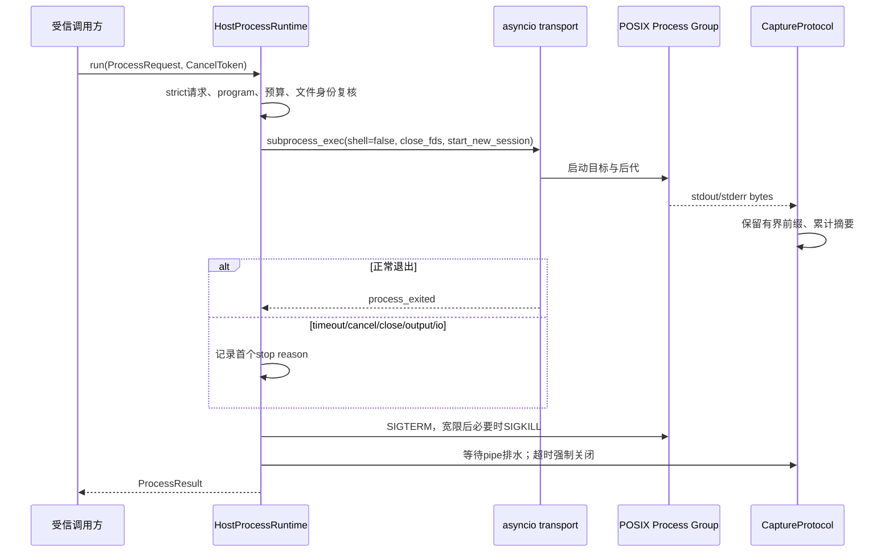

### 9.3 取消与并发

- 单实例同时最多一个活动运行；不排队，第二个调用返回`process_busy`；
- Deadline从准入开始计算，包含spawn前等待；
- `CancelToken`取消会停止并排空内部Task，然后返回`cancelled`结果；
- 调用方Task取消会先停止和排空，再重新抛出`CancelledError`；
- `aclose`拒绝新调用，停止活动组且重复关闭幂等；
- `_settle`等待直接子进程回收，不把协程取消传播到不可中断内核清理；
- 组终止失败会返回`cleanup_failed/failed`并熔断该Runtime实例。

### 9.4 兼容链限制

POSIX进程组不是安全容器：目标可主动脱组，宿主被`SIGKILL`时没有持久Owner接管，数字PID不可在重启后安全
控制。该链的硬退出恢复只能由Action Journal报告`UNKNOWN`和人工处置，不能声称已清理全部后代。

## 10. 0.5 Action Plane准入

[`process_action_tool`](../../src/harnessix/processes/action_executor.py)注册固定合同：

| 属性 | 值 |
|---|---|
| Tool | `host.process` |
| Effect | `NON_IDEMPOTENT_WRITE` |
| Risk | `HIGH` |
| 幂等键 | 强制 |
| Approval | 强制 |
| Reconciliation | 不支持，未知效果进入人工处置 |
| Tool version | `host-process-action/v1.<binding_fingerprint>` |

`ProcessActionExecutor`每次通过工厂获得独立`HostProcessRuntime`，避免并发Action共享单活动槽。执行前再次核对
持久Tool描述、绑定fingerprint、风险和审批能力。当前兼容执行器拒绝`secret_refs`，因为旧Runtime没有Secret
Provider绑定。

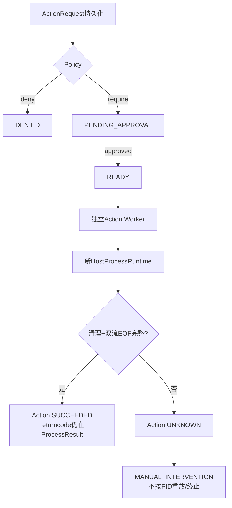

`FAILED`用于已证明没有启动的合同、绑定、Secret或启动错误；已启动后证据不完整必须`UNKNOWN`。Action Worker或
宿主硬退出导致RUNNING Lease过期时，通用Journal同样转`UNKNOWN`，不回READY。

## 11. Agent Process跨库Saga

### 11.1 唯一审批权威

Agent Session和Action Journal没有全局事务。进程Action以Action Journal的`ApprovalRecord`为唯一执行许可；
Session中的`ProcessApprovalRequestContent`只是用于UI、Replay和Turn状态的受限投影，不能传给Executor。

### 11.2 稳定身份

[`AgentProcessCallPlan`](../../src/harnessix/processes/bridge_contracts.py)绑定：

- Thread、Turn、Call和绝对Workspace；
- Agent ToolCall fingerprint与稳定request ID；
- Action UUIDv5、Action request fingerprint和Tool版本；
- Host binding fingerprint和Principal fingerprint；
- 稳定幂等键；
- program、argv摘要和timeout；
- 完整Agent展示计划的`approval_fingerprint`。

Action ID与幂等键都从同一规范身份派生。同一Thread/Turn/Call、Workspace、Tool、参数、主体和Host binding重建
得到同一Action；任一授权事实改变都会产生不同身份。

### 11.3 双指纹语义

| 指纹 | 绑定对象 | 用途 |
|---|---|---|
| `plan.approval_fingerprint` | 完整`AgentProcessCallPlan` | Session审批请求展示和完整调用归属 |
| `plan.action_fingerprint` | 原`ActionRequest` | Action Journal的实际ApprovalRecord |

Session请求要求自己的`request_fingerprint == approval_fingerprint`；一旦决定存在，又要求
`decision.request_fingerprint == action_fingerprint`。这避免把UI投影指纹误当成Executor许可。

### 11.4 正常Saga

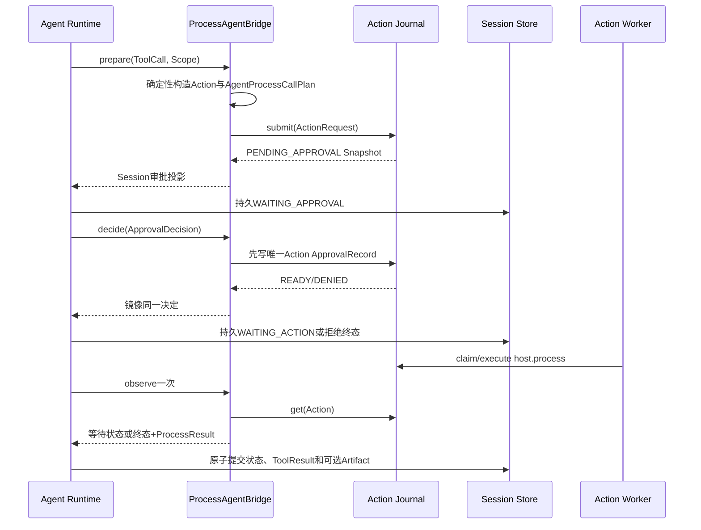

### 11.5 崩溃与取消

- Action提交成功、Session审批Item未写：重启以稳定身份重取同一Action并补投影；
- Action决定已写、Session仍待批准：`sync_decision`只读权威决定，不再提交第二份批准；
- 同决定并发提交幂等，不同决定由Journal事务一胜一冲突；
- Agent取消WAITING状态只终止Turn等待，不撤销Action批准、不删除READY、不声称RUNNING进程已停止；
- `observe`每次只读取一次Action，不在Bridge内轮询、执行或把UNKNOWN回READY；
- RUNNING/RECONCILING过期由Action Journal产生带`lease_expired`的UNKNOWN结果；
- UNKNOWN/MANUAL_INTERVENTION不会恢复模型循环或重放命令。

## 12. `run_tests`受控前端

[`RunTestsAgentBridge`](../../src/harnessix/processes/test_profiles.py)不向模型暴露命令或argv，只接受：

```json
{"profile":"unit"}
```

宿主预注册并排序最多32个`TestProfile`，每项固定名称、说明、program、arguments和timeout。构造时验证Profile程序
存在于底层`ProcessActionExecutor`白名单、timeout不超过Host限制、Workspace与执行器一致。模型选择Profile后才
由受信Bridge转换为`ProcessRequest`，再复用同一Action审批、Worker和Artifact链。

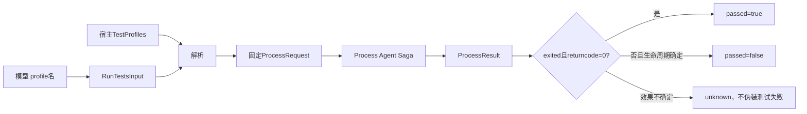

这是当前最适合模型的命令入口；它仍以宿主权限运行，不能替代Container Sandbox。

## 13. `ProcessSpec`设计

### 13.1 字段

| 字段 | 类型/边界 | 语义 |
|---|---|---|
| `process_id` | UUID | 稳定运行身份；同一ID禁止第二次spawn |
| `invocation` | `argv/posix_sh/cmd/powershell` | 显式调用模式，不自动猜Shell |
| `argv` | 最多128项、合计≤64 KiB | `argv`模式唯一命令载荷；每项非空且无NUL |
| `shell_source` | 可选、≤64 KiB | Shell模式唯一命令载荷；必须非空白且无NUL |
| `terminal` | `pipe/pty` | I/O端口形态 |
| `stdin` | `closed/pipe` | 默认关闭；pipe必须有正输入预算 |
| `lifecycle` | `foreground/background` | 持久语义标签和上层等待选择 |
| `timeout_seconds` | `0 < t ≤ 86400` | 生成带时区deadline |
| `output_bytes` | 1～64 MiB | stdout+stderr共享持久前缀预算 |
| `input_bytes` | 0～1 MiB | 累计接受的stdin预算 |
| `columns/rows` | 20～1000 / 5～1000 | PTY初始尺寸；pipe中仍为合同字段但不使用 |
| `digest` | SHA-256 | 除digest外完整Spec规范摘要 |

### 13.2 调用形状

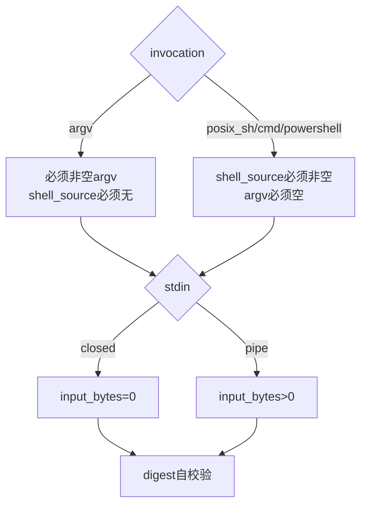

Shell source原文进入Spec和Execution Plan批准。POSIX固定物化为`/bin/sh -c source`；Windows固定物化为
`cmd.exe /d /s /c source`或`powershell.exe -NoLogo -NoProfile -NonInteractive -Command source`，不由模型拼接
前缀。

## 14. Capability与实现证明

### 14.1 `ProcessCapabilityProbe`

| 平台 | Owner backend | 调用模式 | PTY |
|---|---|---|---|
| POSIX | `posix_session` | `argv`、`posix_sh` | 当前实现声明支持 |
| Windows | `windows_job_object` | `argv`、`cmd`、`powershell` | 仅真实系统Build/API满足ConPTY时支持 |

所有Probe固定支持pipe、background、process tree和`atomic_containment=True`，并绑定`implementation_digest`。
Digest自身还覆盖完整Capability字段。

### 14.2 实现摘要

POSIX摘要包含当前Python可执行文件的路径、设备、inode、大小、mtime及Owner/协议/回执/Supervisor相关模块正文
摘要。Windows摘要包含Python、`cmd.exe`、`powershell.exe`路径/大小/mtime及Windows Job/ConPTY/Owner相关模块。
每次spawn前重新探测；安装或关键实现发生变化必须重新规划Execution Plan。

当前Windows Probe是全量能力探测：即使只计划`argv`，缺少受信`cmd.exe`或`powershell.exe`也会使实现摘要不可
证明。POSIX摘要当前没有绑定`/bin/sh`文件身份，这是受控Shell路径的已知缺口。

## 15. `ProcessLaunchBinding`

Launch Binding将抽象批准计划继续绑定到实际物化：

| 字段 | 绑定内容 |
|---|---|
| `kind` | `host`或`container` |
| `platform` | 当前Process Capability平台 |
| `plan_fingerprint` | 完整Execution Plan身份 |
| `intent_arguments_digest` | Plan Intent参数摘要 |
| `process_spec_digest` | 实际启动Spec摘要 |
| `capability_digest` | 当前Owner能力摘要 |
| `environment` | 实际普通环境名称和值摘要 |
| `digest` | 完整Launch Binding自摘要 |

Host绑定要求Plan Intent参数逐字段等于`ProcessSpec`、Plan v2 Provider证据等于Process Capability、环境等于
Plan环境，且不能使用`container_strong`计划。Container绑定允许外层Spec是由受信Container Builder物化的
Docker客户端命令，但要求计划为`container_strong`，后续由Sandbox同时核对内层ContainerExecutionSpec。

## 16. Process Lease数据模型

### 16.1 不可变绑定

[`process_lease_binding`](../../src/harnessix/processes/supervision_contracts.py)定义迁移过程中永不改变的字段：

- process/plan ID与Plan fingerprint；
- Process Spec、Capability、Launch Binding摘要；
- foreground/background生命周期；
- 256位随机Owner token；
- 带时区deadline。

PID、Owner identity、时间、输出和终态是观察事实，可随相邻sequence推进，但不能改变执行授权。

### 16.2 重点字段

| 字段 | 语义与约束 | 敏感性 |
|---|---|---|
| `state` | prepared/starting/running/stopping/exited/failed/unknown | 低基数状态 |
| `sequence` | 从0开始，每次Store迁移+1 | CAS版本 |
| `owner_token` | 32字节随机hex，HMAC key | 高敏感；`repr=False`但会写入Lease JSON |
| `owner_identity` | 每次Owner随机32字节hex | 只与同一Owner回执匹配 |
| `pid` | 目标根进程观察值 | 不是恢复控制权限 |
| `deadline` | 计划时限的UTC/带时区时间 | Owner独立执行超时 |
| `stdout/stderr` | 脱敏后完整观察与持久前缀摘要 | 不含正文 |
| `returncode` | 仅`exited`允许 | Windows可为DWORD范围，POSIX可负信号值 |
| `stop_reason` | 终态原因 | unknown只允许host_lost/cleanup_failed/unknown |

### 16.3 运行身份完整性

`owner_identity + pid + started_at`只能全部存在或全部缺失：

- `running/stopping/exited`必须完整存在；
- `prepared/starting/failed`不得存在；
- `unknown`可带完整运行身份，也可在启动事实不可证明时全部缺失；
- `exited/failed/unknown`必须同时有`finished_at`和`stop_reason`；
- `failed`只表示确定未启动，原因固定`launch_failed`。

## 17. Lease状态机

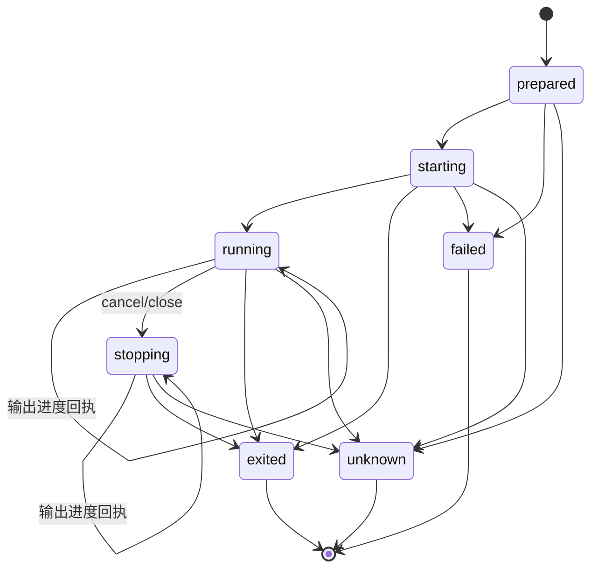

| 当前状态 | 允许后继 | 说明 |
|---|---|---|
| `prepared` | starting/failed/unknown | Lease已持久，Owner尚未证明启动 |
| `starting` | running/exited/failed/unknown | 快速命令可在Supervisor看到running前直接退出 |
| `running` | running/stopping/exited/unknown | 同状态迁移保存输出进度 |
| `stopping` | stopping/exited/unknown | 保留停止意图，running回执不能倒退状态 |
| 终态 | 无 | 不重开，不用同一process ID再次执行 |

Owner Receipt有自己的sequence；Lease sequence记录Store事件顺序。`SupervisedProcess`在当前句柄内忽略不递增的
Owner Receipt，并把新回执转换为相邻Lease sequence。

## 18. SQLite Process Lease Store

### 18.1 表结构

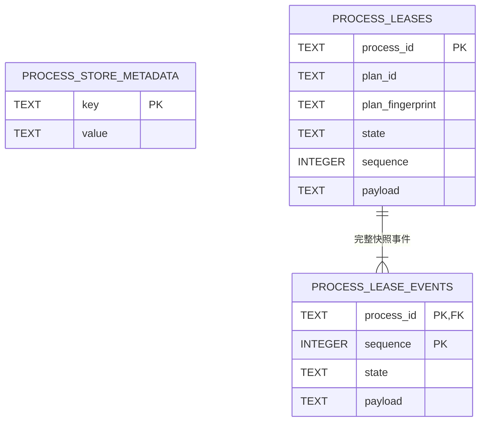

Store Schema版本为`2`。初始化使用SQLite WAL、`synchronous=FULL`、外键、5秒busy timeout；POSIX父目录和DB
分别chmod为0700/0600。未知Schema返回`process_store_version`。

### 18.2 创建与CAS迁移

```text
create(lease):
    require state=prepared and sequence=0
    BEGIN IMMEDIATE
    if process_id absent:
        insert current row and event 0 atomically
    elif every indexed field and payload identical:
        idempotent success
    else:
        process_lease_conflict

transition(before, after):
    require immutable binding unchanged
    require after.sequence = before.sequence + 1
    require state edge allowed
    BEGIN IMMEDIATE
    require database current row == complete before snapshot
    update current row with expected sequence
    append full after snapshot event
    COMMIT
```

### 18.3 读取完整性

`load/active`不只解析payload，还交叉核对：

- 冗余process ID、plan ID、Plan fingerprint、state和sequence；
- 当前sequence对应事件必须存在；
- 最新事件state和payload必须与当前投影完全相等；
- Process Lease严格合同和跨字段状态不变量。

因此篡改冗余state不能从`active()`隐藏待恢复进程。当前实现只验证**最新事件**，不扫描全部历史sequence或维护
事件Hash Chain；更早事件的删除/篡改不会在普通`load`时被发现。

## 19. Supervised启动主流程

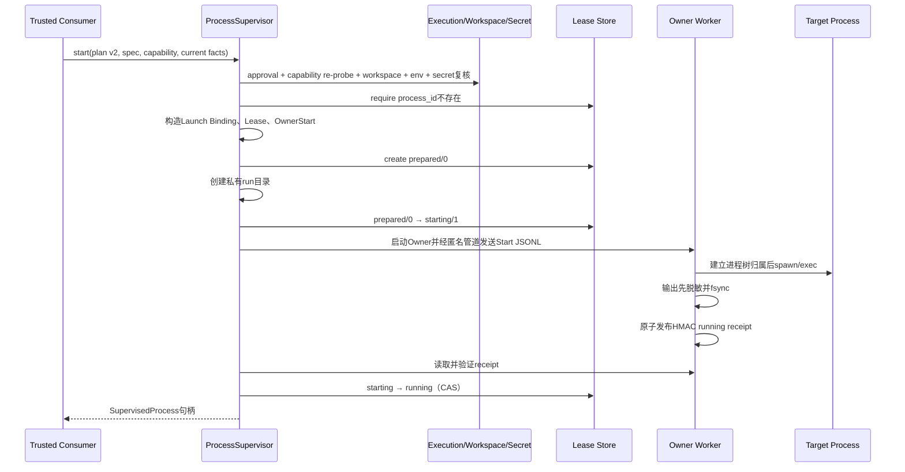

### 19.1 spawn前门禁

Supervisor按顺序执行：

1. 实例未关闭；
2. `execution_is_approved`为真；
3. 调用方Capability等于Supervisor冻结Capability，现场重新探测仍相等；
4. 相同process ID不存在；若存在，即使绑定相同也返回`process_already_exists`，禁止自动重放；
5. Workspace Snapshot重新验证；
6. 物化普通环境摘要等于Launch Binding；
7. 实际Secret `(target,name,version)`等于Plan且不与普通环境冲突；
8. Spec/Capability/Plan满足调用模式、PTY、后台和进程树能力；
9. OwnerStart满足绝对cwd、精确环境、deadline和I/O预算合同。

### 19.2 启动故障归因

| 切点 | Lease结果 | 目标是否可证明启动 |
|---|---|---|
| Lease创建前 | 无Lease | 未调用Owner |
| `prepared`后run目录创建失败 | `failed/launch_failed` | 未启动Owner |
| `starting`后Owner spawn/Start发送失败 | `failed/launch_failed` | Supervisor杀死已创建Owner；不宣称有运行结果 |
| Owner发布`failed` Receipt | `failed/launch_failed` | Owner证明目标未建立运行身份 |
| Owner已启动目标但无法证明清理 | `unknown/cleanup_failed` | 禁止自动重放 |
| 约5秒内未报告启动结果 | 先请求关闭并等待，再抛`process_launch_failed` | 持久Lease可能为exited或unknown，诊断必须读取Lease |

## 20. Owner控制协议

### 20.1 Start帧

`ProcessOwnerStart`经匿名控制管道传输一次，不写run目录。它包含Process/Owner身份、Owner token、物化argv、绝对
cwd、完整目标环境、Secret变量名、终端/stdin、deadline、I/O预算、尺寸和终止宽限。

边界：

- Start/累计控制缓冲最大1 MiB；
- 环境最多128项、UTF-8总计≤128 KiB；
- Secret名称必须有序唯一且为环境键的子集；
- Owner token、argv和environment均`repr=False`，但这不是内存加密；
- 控制管道不继承给目标进程。

### 20.2 Command帧

| operation | 必需字段 | 限制 | 无效处理 |
|---|---|---|---|
| `stdin` | 规范Base64数据 | 单帧1～64 KiB；累计受Spec预算 | Owner停止为input_limit/cleanup失败 |
| `close_stdin` | 无 | 幂等逻辑关闭 | 多余字段拒绝 |
| `resize` | columns+rows | 20～1000 / 5～1000，仅PTY有效 | pipe收到resize进入cleanup_failed |
| `stop` | cancelled/closed | 只接受两个外部停止原因 | 其他reason拒绝 |

所有帧以一行规范JSON传输。控制EOF表示Agent/Supervisor宿主丢失，Owner请求`host_lost`停止目标树。

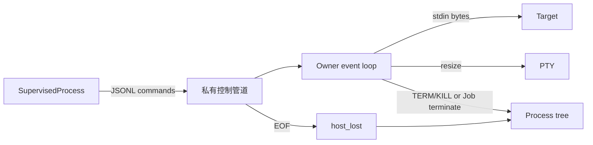

当前没有显式命令频率/resize速率限制；Windows有界队列和管道背压限制内存，POSIX selector直接消费。产品若开放
高频交互客户端，需要增加独立速率合同。

## 21. Owner Receipt与恢复证据

### 21.1 回执字段

`ProcessOwnerReceipt`可表示`running/exited/failed/unknown`，绑定Process ID、Owner identity、Owner sequence、
运行身份、时间、returncode/stop reason、双流观察和HMAC。

### 21.2 发布顺序

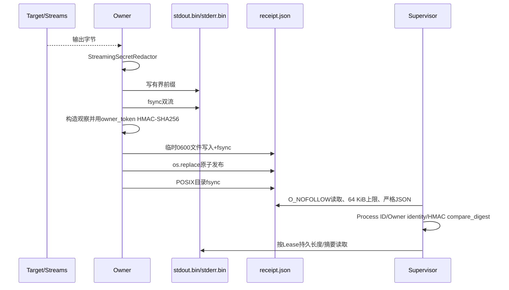

输出必须先持久并同步，回执才能引用该前缀。Receipt最大64 KiB，临时文件使用`O_EXCL`和0600；POSIX读取增加
`O_NOFOLLOW`。HMAC key是Lease中的Owner token，目的是识别本次Owner事实并拒绝随机/串线回执，不是抵御能读取
状态数据库的同UID攻击者。

### 21.3 回执映射

| Receipt | Lease转换 |
|---|---|
| `running` | starting/running→running；若已stopping则保持stopping；更新运行身份与输出 |
| `failed` | →failed，固定launch_failed，无运行身份 |
| `exited` | →exited，保留真实returncode和stop reason |
| `unknown` | →unknown，保留可证明的完整运行身份或全部为空 |

当前句柄只接受比`_last_receipt_sequence`新的Receipt。终态关闭控制FD并不再迁移。

## 22. 输出、脱敏与完整性

### 22.1 Supervised输出

[`CapturedProcessOutput`](../../src/harnessix/processes/owner_output.py)对每个流执行：

```text
raw target bytes
→ StreamingSecretRedactor.feed/finish
→ observed byte count + full redacted SHA-256
→ apply shared remaining output allowance
→ persist redacted prefix + prefix SHA-256
→ fsync before receipt publication
```

`ProcessOutputObservation`保存脱敏后：

- `observed_bytes/sha256`：Owner实际观察的完整脱敏字节；
- `persisted_bytes/persisted_sha256`：在共享预算内落盘的前缀；
- `truncated == persisted_bytes < observed_bytes`；
- `eof`：是否自然完成流关闭。

stdout/stderr共享`ProcessSpec.output_bytes`。超过预算会请求停止进程树；本次已读chunk仍计入observed，但落盘只到
剩余额度。`SupervisedProcess.output`每次按Lease声明长度读取完整前缀并验证SHA-256，文件截短/替换失败关闭。

### 22.2 PTY流

POSIX和Windows PTY都投影为组合stdout流；stderr记录为空且`eof=True`。终端本身已合并输出，调用方不能再把
stderr空值解释为目标没有写标准错误。

### 22.3 0.5 Process Output Artifact

兼容链的`ProcessResult`在Action Journal中保存每流最多1 MiB Base64前缀。`ProcessOutputDocument`把它转换为：

- 第一行唯一`summary`；
- stdout全部12 KiB chunk，再按顺序写stderr chunk；
- 连续offset、规范Base64、捕获/观察双摘要；
- 每行和总Artifact字节上限；
- `complete`只在双流都EOF且未截断时为真。

Artifact发布由[`artifacts/process_output.py`](../../src/harnessix/artifacts/process_output.py)在Session事务中完成；若完整
已捕获前缀超过Artifact上限，返回`None`而不是二次静默截断。模型历史只看到摘要与受限Artifact引用，不看到PID、
Action私有身份或原始Base64正文。

## 23. POSIX Owner实现

### 23.1 进程树与I/O

- 目标pre-exec先`setsid()`建立新Session/Process Group；
- Linux额外设置`PR_SET_PDEATHSIG=SIGKILL`并复核parent PID；
- pipe模式分别以非阻塞selector读取stdout/stderr；
- PTY模式建立master/slave、设置controlling terminal和尺寸，stdout/stderr合并；
- stdin以非阻塞缓冲写入，关闭PTY stdin时发送EOT字节；
- 根进程正常退出后仍向残留进程组发送TERM，避免后代继续运行；
- 首个stop reason获胜，TERM宽限后对仍存在的进程组发送KILL；
- 控制EOF、deadline、输入/输出超限、I/O错误和显式停止使用同一收敛路径。

### 23.2 POSIX终止时序

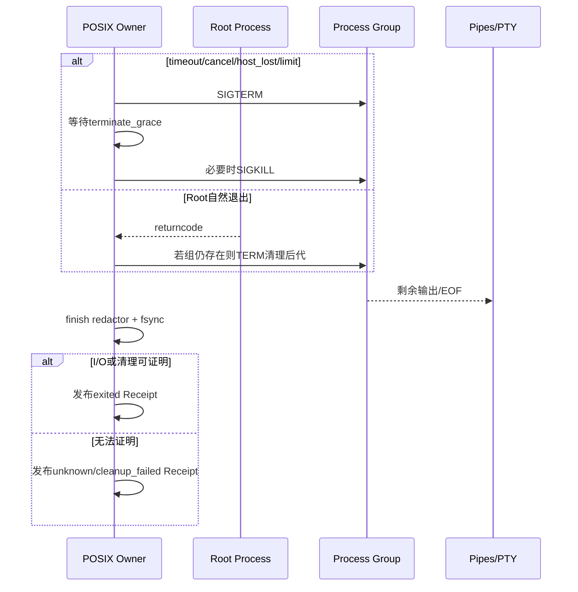

### 23.3 POSIX边界

Process Group不是cgroup或Sandbox。恶意目标可主动`setsid/setpgid`脱离；macOS没有Linux parent-death signal；Owner
自身被强杀、不可中断内核任务或脱组后代持有pipe时不能承诺完整回收。此时应保守归因unknown，不把
`supports_process_tree`解释为对恶意代码的强隔离证明。

## 24. Windows Job Object与ConPTY

### 24.1 pipe模式：挂起归属

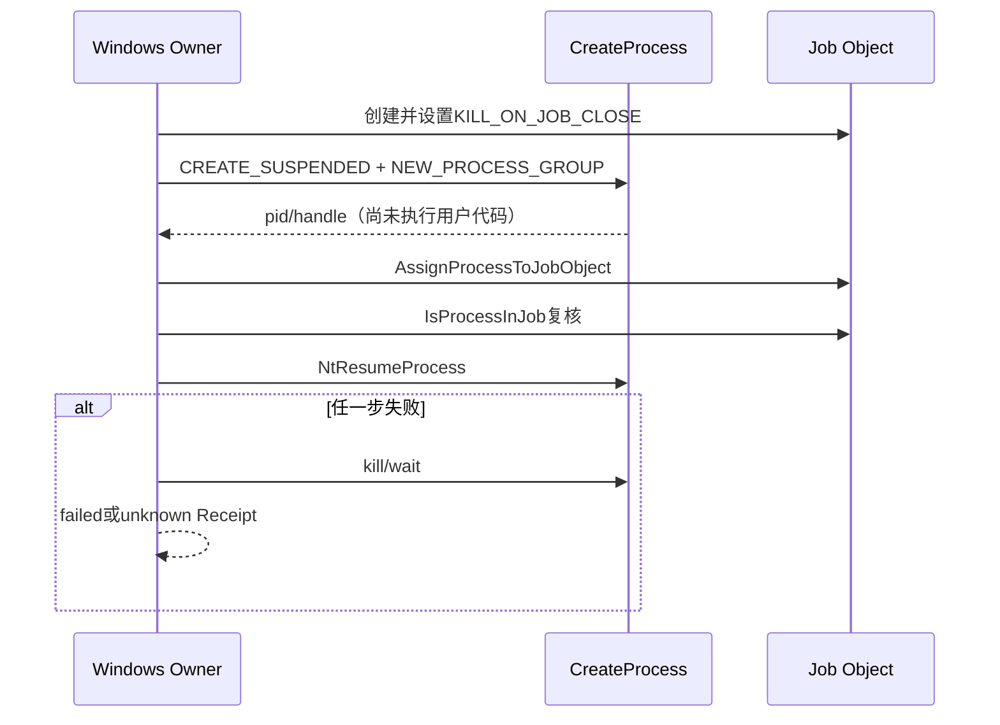

这样目标在执行用户代码前就属于Job。Job设置`JOB_OBJECT_LIMIT_KILL_ON_JOB_CLOSE`，Owner持有最后句柄；控制宿主
丢失时Owner终止Job，Owner异常退出时关闭最后Job句柄也清理整棵树，不回退到根PID或`taskkill`。

### 24.2 ConPTY模式：原子启动属性

ConPTY使用`STARTUPINFOEXW`同时设置：

- `PROC_THREAD_ATTRIBUTE_PSEUDOCONSOLE`；
- `PROC_THREAD_ATTRIBUTE_JOB_LIST`；
- `STARTF_USESTDHANDLES`，三个标准句柄为`INVALID_HANDLE_VALUE`；
- Unicode环境块；
- 当前Job Object。

一次`CreateProcessW`完成终端和Job归属，避免“先运行再Assign”的窗口。返回后再次用`IsProcessInJob`证明归属。
ConPTY仅在Windows Build≥17763且所需API存在时广告，能力不足返回`process_pty_unavailable`。

### 24.3 Windows输入语义

[`WindowsTtyInputNormalizer`](../../src/harnessix/processes/windows_conpty.py)保持跨chunk状态：

- LF转换为CR，但已有CR后的LF不重复；
- Backspace `0x08`转换为DEL `0x7f`；
- `close_stdin`向ConPTY发送`Ctrl+Z + CR`控制台EOF键，只做逻辑关闭；
- 不提前关闭输入传输或Pseudo Console，避免触发`CTRL_CLOSE_EVENT`和错误退出；
- 原始模式程序若不解释EOF键，仍由deadline/stop收敛。

Windows Owner以最大64项事件队列和32项stdin队列提供有界线程间背压；队列溢出转输入/清理失败，不建立无界
内存缓冲。

## 25. `SupervisedProcess`句柄

| 方法 | 当前行为 | 权限/限制 |
|---|---|---|
| `refresh()` | 读取HMAC Receipt并CAS推进Lease | 终态幂等返回；缺Receipt且本地Owner退出→unknown |
| `wait(cancel)` | 20ms轮询直到终态 | Token取消只发送一次stop；Task取消先停止并等待终态再抛出 |
| `send_stdin(bytes)` | 单帧1～64 KiB | 需仍持有私有控制FD |
| `close_stdin()` | 发送逻辑关闭 | Owner端幂等 |
| `resize(c,r)` | 严格尺寸Command | pipe最终进入清理失败，调用方应先按Spec判断 |
| `stop(reason)` | running先持久stopping，再发送stop | 控制丢失时保留状态并等待Receipt/unknown |
| `output(stream)` | 读取Lease声明前缀并验摘要 | 不是增量cursor；每次返回完整当前前缀 |
| `aclose()` | 活动进程先closed stop并wait，再关控制FD | 重复关闭幂等 |

每个句柄以`asyncio.Lock`串行化refresh、stop和控制写。控制FD只属于创建它的Supervisor进程；重启恢复句柄没有
该FD，因此只能观察Receipt，不能重新发送输入或停止命令。

## 26. 取消、超时、关闭与后台语义

### 26.1 停止原因

| 原因 | 触发者 | 目标终态 |
|---|---|---|
| `exited` | 根进程退出并清理后代 | exited + returncode |
| `timeout` | Owner wall-clock deadline | exited或unknown |
| `cancelled` | CancelToken/Task | stopping→exited或unknown |
| `closed` | 句柄/Supervisor关闭 | stopping→exited或unknown |
| `output_limit` | 脱敏后观察输出超预算 | exited或unknown |
| `input_limit` | 累计输入或Windows队列超限 | exited或unknown |
| `io_error` | 控制/stdin/输出I/O失败 | exited或unknown，取决于清理证明 |
| `host_lost` | 控制管道EOF/恢复观察失败 | Owner尝试收敛；恢复端无证明时unknown |
| `launch_failed` | 未形成目标运行身份 | failed |
| `cleanup_failed/unknown` | 证据不足 | unknown |

### 26.2 foreground/background

`lifecycle`进入Spec和Lease。`start()`对两者都返回可控句柄；`run()`对两者都会等待终态。background的实际价值
是上层可以保留句柄并不立即wait，状态仍由Lease持久；它不表示进程在Supervisor优雅关闭或宿主崩溃后继续运行：

- `Supervisor.aclose()`会关闭并回收所有当前句柄，包括background；
- 宿主硬退出导致控制EOF，Owner主动终止树；
- 重启只能`reconcile(process_id)`观察Owner结果，不能重连交互控制；
- 当前包没有面向产品客户端的后台任务列表、终端重连或长期Session管理器。

## 27. 重启恢复与PID禁用

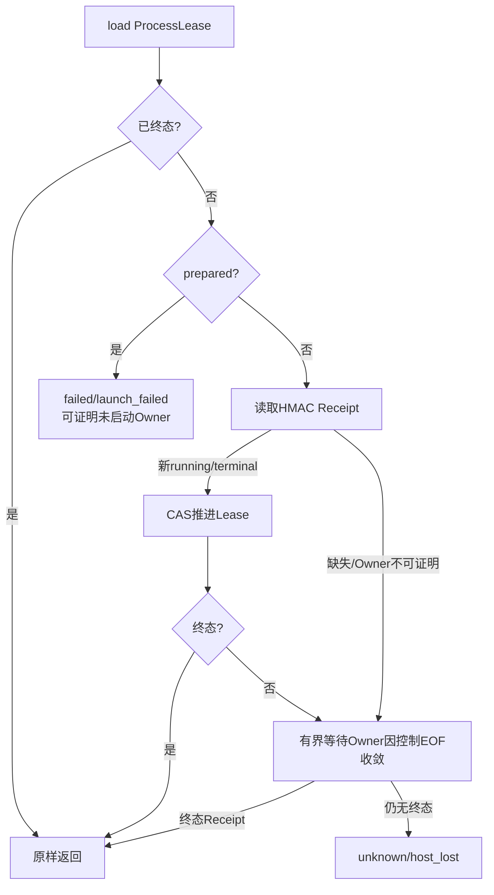

`reconcile`对starting/running/stopping建立**无控制FD**句柄，最多等待约1秒或终止宽限派生窗口，持续验证Receipt。
若Owner没有发布终态，转`unknown/host_lost`。恢复端不会：

- `kill(pid)`或`taskkill(pid)`；
- 重新发送Start帧、命令或stdin；
- 将starting回到prepared或ready；
- 为同一process ID创建第二个目标；
- 根据PID消失推断命令没有外部副作用。

## 28. Container复用边界

[`ContainerProcessRuntime`](../../src/harnessix/sandbox/process_runtime.py)把受信Container argv物化为外层
`ProcessSpec`，再以`ProcessLaunchBinding(kind="container")`调用`start_prepared`。Process Supervisor负责Docker/
Podman客户端进程的Owner、I/O、取消和Lease；Sandbox层额外负责：

- 内层`ContainerExecutionSpec`与Execution Plan参数；
- image/Profile/Network/Egress/Secret/Workspace；
- 稳定容器名称和双标签；
- 启动前不存在性检查；
- 客户端结束、失败、取消和恢复后的`container rm --force`；
- 再查询证明容器实例已不存在。

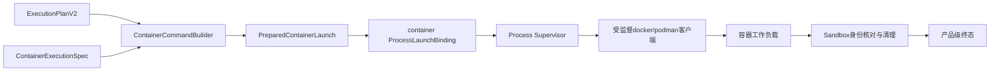

外层客户端`exited`不等于容器实例已结束；只有Sandbox清理证明完成后才能形成容器级确定终态。

## 29. 并发与生命周期

| 对象 | 并发模型 | 当前约束 |
|---|---|---|
| `HostProcessRuntime` | 单活动Task | busy即拒绝，不排队 |
| `ProcessActionExecutor` | 每Action新Runtime | 并发由Action Journal/Worker和工厂隔离 |
| `ProcessAgentBridge` | 无后台轮询 | 每操作只读/写一次Action事实 |
| `SQLiteProcessLeaseStore` | 同步SQLite，BEGIN IMMEDIATE | 实例使用默认线程约束；无显式跨线程锁 |
| `ProcessSupervisor` | 单事件循环可启动多ID | `_handles`字典无独立锁；每个句柄自有asyncio Lock |
| POSIX Owner | 单线程selector | 控制和I/O都在一个事件循环 |
| Windows Owner | 主循环+有界reader/stdin线程 | event queue 64、stdin queue 32 |
| Windows Owner spawn | 全局`_WINDOWS_SPAWN_LOCK` | 仅保护控制Handle临时继承窗口 |

Supervisor保留每个已启动句柄直到整体`aclose()`，终态后不会从`_handles`移除。长期大量短进程会增长内存字典和
run目录/Lease事件；当前没有按进程关闭释放、TTL、归档或垃圾回收API。

## 30. 数据流与敏感数据

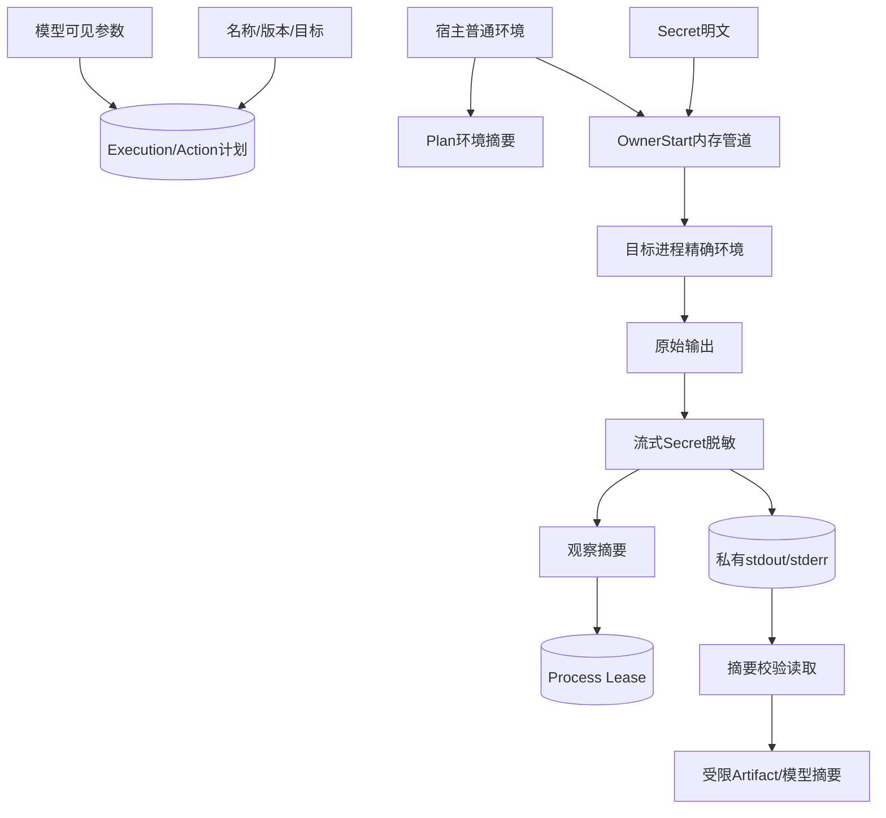

### 30.1 数据分类

| 数据 | 存储位置 | 是否明文 | 控制 |
|---|---|---:|---|
| ProcessSpec argv/Shell | Execution Plan/调用方合同 | 是 | 完整审批；不得放Secret |
| 普通环境 | Plan仅摘要；OwnerStart内存 | 运行时明文 | 精确映射、不继承父环境 |
| Secret值 | OwnerStart内存和目标环境 | 运行时明文 | 版本绑定、输出流式脱敏、不写Lease/Receipt |
| Owner token | Lease数据库 | 是hex key | 私有状态目录、`repr=False`、不对外投影 |
| PID | Lease/兼容Action Result | 是 | 只作观察，不作恢复权限；模型投影移除 |
| stdout/stderr | 私有run文件或兼容Action/Artifact | 脱敏后字节 | 大小、摘要、EOF、权限和Artifact授权 |
| Approval actor/reason | Action/Execution审批库 | 是 | 不由Process输出或日志复制 |

## 31. 安全设计

### 31.1 威胁与控制

| 威胁 | 当前控制 | 剩余风险 |
|---|---|---|
| 未批准命令spawn | Execution Approval或Action Journal唯一批准 | 私有spawn实现仍依赖宿主不旁路 |
| 参数/环境/Workspace漂移 | Plan、Launch Binding、Snapshot和运行时摘要复核 | 文件在最终exec前仍可能发生TOCTOU |
| 可执行文件替换 | 旧Host Runtime绑定inode/mtime等；新链绑定argv与环境 | 新Supervised链不自动绑定目标可执行文件身份 |
| Shell路径替换 | Windows实现摘要绑定cmd/PowerShell | POSIX `/bin/sh`未进入实现摘要 |
| 子进程逃逸 | POSIX Session/Group；Windows原子Job | POSIX恶意`setsid`可脱组；Host不是强Sandbox |
| 宿主死亡孤儿 | 控制EOF触发独立Owner清理；Windows Job kill-on-close；LinuxPDEATHSIG | macOS/Owner自身强杀与脱组后代不能完全证明 |
| PID复用误杀 | 恢复绝不按PID控制 | unknown需要人工/外部观测处理 |
| Secret出现在输出 | 跨chunk流式Redactor先于计量/落盘 | 仅覆盖已解析Secret精确值；派生/编码形式不自动识别 |
| 输出替换/截短 | O_EXCL/O_NOFOLLOW创建、Receipt顺序、Lease前缀摘要 | 同UID攻击者可读token并伪造；文件类型/Owner/链接复核不完整 |
| Owner回执串线 | process ID、owner identity、HMAC、sequence | Owner receipt sequence未持久为独立Lease字段 |
| 重复执行 | 稳定process ID，已存在一律拒绝；Action幂等键 | 新意图可显式创建新ID，需上层控制语义 |
| 状态库篡改 | 严格合同、冗余列和最新事件交叉核对 | 旧事件无Hash Chain；同UID/磁盘攻击不在边界内 |
| Windows句柄逃逸 | close_fds、handle_list、spawn lock、Job | Windows ACL和复杂父Job策略需真机部署验证 |

### 31.2 执行边界结论

`host_guarded/host_sandboxed` Process只提供授权、生命周期和输出安全，不约束目标读取用户文件或联网。执行不可信
仓库代码必须使用通过探测的`container_strong`计划及Sandbox资源/网络策略。Job Object和Process Group是进程树
生命周期机制，不是权限降级或多租户隔离。

## 32. 失败语义

### 32.1 规划/准入

| 错误码 | 条件 | 处理 |
|---|---|---|
| `process_spec_invalid` | 模式、argv/source、预算、尺寸或摘要非法 | 修正并生成新Spec/Plan |
| `process_capability_invalid` | Probe形状或摘要错误 | 重新探测，不降级 |
| `process_capability_mismatch` | Plan/Spec/平台/PTY/环境/Owner能力不匹配 | 旧批准失效，重新规划 |
| `approval_required` | Execution Plan未精确批准 | 停止spawn |
| `secret_binding_mismatch` | Secret版本/目标或环境冲突 | 重新解析并规划 |
| `process_already_exists` | process ID已创建 | 查询原Lease，禁止重放 |
| `process_lease_conflict` | 同一ID绑定不同授权 | 调查稳定身份错误 |

### 32.2 Owner/运行

| 错误码/状态 | 条件 | 恢复 |
|---|---|---|
| `process_launch_failed` | Owner/目标在可证明启动前失败，或启动握手超时 | 读取Lease区分failed/exited/unknown；不用同ID重试 |
| `process_control_lost` | 当前控制FD写失败 | 等待Receipt；无证据转unknown |
| `process_not_owned` | 恢复句柄或终态无控制通道 | 只能观察，不能输入/停止 |
| `process_input_invalid` | stdin分片类型/大小非法 | 修正调用；不发送部分帧 |
| `process_terminal_invalid` | 尺寸非法或ConPTY resize失败 | 停止交互并读取Lease |
| `process_output_corrupt` | 输出文件不可读、长度或摘要不符 | 失败关闭，不返回空输出 |
| `process_owner_receipt_missing/invalid` | Receipt缺失、损坏、串线或MAC错误 | 活Owner继续等待；Owner已退则unknown；损坏保留诊断 |
| `process_store_corrupt/version` | Lease索引、payload、最新事件或Schema不可信 | 停止恢复，正式迁移/修复 |
| `process_lease_stale` | CAS前置快照已被推进 | 重载Lease，不重放副作用 |
| `unknown` | 清理、宿主或I/O证据不足 | 不重开，交由上层对账/人工处置 |

### 32.3 兼容Agent链

| 错误码/状态 | 含义 |
|---|---|
| `process_auto_execute_forbidden` | Agent Bridge拒绝审批请求线程内直接执行，必须有独立Worker |
| `tool_contract_changed/process_binding_changed` | Tool、Host程序或环境绑定与批准时不同 |
| `process_projection_mismatch/incomplete` | Session镜像与Action Journal权威事实不一致 |
| `approval_conflict` | 同一Action已有不同人工决定 |
| `process_effect_unknown` | 组清理或双流终止证据不完整 |
| `process_manual_reconciliation_required` | 不支持按历史PID自动核对，转人工处置 |

## 33. 可观测性与运维

Process包当前没有直接OpenTelemetry Trace/Metric/Log埋点。可审计事实来自：

- Execution Plan/Approval；
- Process Lease当前投影和相邻完整快照事件；
- HMAC Owner Receipt与脱敏输出摘要；
- 兼容链Action Journal的Policy、Approval、Lease、Result和Effect Receipt；
- Agent Session中的受限Process Action投影；
- Process Output Artifact及其Manifest。

推荐诊断关联顺序：

```text
thread/turn/call（若来自Agent）
→ action_id 或 execution plan_id
→ process_id + spec/capability/launch digest
→ Lease sequence/state/stop_reason
→ owner_identity + receipt sequence
→ stdout/stderr observed/persisted digest
→ Action/Container reconciliation evidence
```

不得把argv、Shell source、环境、Secret名称/值、Owner token或输出正文写入Metric标签或普通日志。后续应增加低
基数指标：启动/运行/停止耗时、各stop reason、unknown、Receipt/Store损坏、输出/输入预算、活动后台数和run目录
占用；导出失败不能阻塞Owner清理。

## 34. 重点类、接口与数据结构

### 34.1 重点符号

| 符号 | 职责 | 输入/输出 | 不变量 | 副作用/取消 |
|---|---|---|---|---|
| `HostProcessRuntime` | 0.5固定POSIX执行 | ProcessRequest→ProcessResult | 固定program/cwd/env；单活动 | spawn、组TERM/KILL；取消排空 |
| `ProcessActionExecutor` | 兼容Action执行器 | ActionSnapshot+参数→ExecutionOutcome | HIGH/审批/幂等/不自动对账 | 每次独立Runtime |
| `ProcessAgentBridge` | Agent×Action Saga | prepare/decide/sync/observe | Journal唯一批准；Session只投影 | 不执行、不轮询 |
| `RunTestsAgentBridge` | Profile前端 | profile名→固定ProcessRequest | Workspace/program/timeout绑定 | 复用同一Saga |
| `ProcessSpec` | 监督命令合同 | 模式+I/O+预算→自摘要模型 | argv/source互斥；stdin预算一致 | 无 |
| `ProcessCapabilityProbe` | Owner能力证明 | 平台探测→自摘要模型 | backend/模式/实现一致 | 读取实现文件身份 |
| `ProcessLaunchBinding` | 实际物化身份 | Plan+Spec+Capability+Env→摘要 | host/container语义匹配 | 无 |
| `ProcessLease` | 持久生命周期快照 | 授权+观察→冻结快照 | 运行身份/终态完整 | Store事件 |
| `SQLiteProcessLeaseStore` | Lease CAS与事件 | create/transition/load/active | 不可变绑定、相邻sequence、最新事件一致 | SQLite事务 |
| `SupervisedProcess` | 单进程控制句柄 | refresh/wait/stdin/stop/output | 终态不再控制；Receipt HMAC | 控制管道、取消收敛 |
| `PosixProcessSupervisor` | POSIX启动与恢复 | Plan+Spec→句柄/Lease | 先持久starting，后Owner spawn | 子Owner、私有run目录 |
| `WindowsProcessSupervisor` | Windows启动与恢复 | 同上 | Capability和命令行限制 | 受控Handle继承 |
| `CapturedProcessOutput` | 输出脱敏和前缀持久化 | raw bytes+allowance→Observation | 先脱敏后摘要；只创建一次 | 文件写/fsync |
| `ProcessOwnerReceipt` | Owner恢复证据 | 状态+输出+HMAC | 运行/终态形状严格 | 原子文件发布 |
| `WindowsJobObject` | Windows树所有权 | suspended PID→Job | 归属后再恢复；kill-on-close | Win32 Handle |
| `spawn_conpty` | 原子ConPTY+Job创建 | argv/env/size→Process wrapper | 两个ProcThread属性同时生效 | Win32 pipes/handles |

### 34.2 公共方法

| 端口/方法 | 调用者 | 前置条件 | 顺序/幂等 | 权限 |
|---|---|---|---|---|
| `build_process_spec` | 可信Planner | 已选择显式模式和预算 | 同字段+同ID得到同digest | 无副作用 |
| `prepare_process_lease` | Supervisor/测试 | Plan/Spec/Capability/Binding一致 | 新Owner token默认随机 | 生成敏感token |
| `ProcessSupervisor.start` | Host/Trusted Action | 精确批准与当前事实 | process ID存在即拒绝 | spawn权限 |
| `start_prepared` | Container Runtime | kind必须container | 不允许Host伪装 | 容器客户端spawn |
| `run` | 前台组合调用 | 同start | 启动后等待终态 | 取消先收敛 |
| `reconcile(process_id)` | 重启恢复 | Lease Store可读 | 只推进已有Lease | 无PID控制 |
| `SupervisedProcess.output` | Artifact/UI宿主 | Receipt/Lease已刷新 | 每次全前缀、只读 | 私有run目录读取 |
| `SQLiteProcessLeaseStore.active` | Supervisor/运维 | Store完整 | 先校验所有记录再过滤 | 本地状态读取 |

## 35. 核心业务逻辑伪代码

### 35.1 Supervised启动

```text
function start(plan, spec, supplied_capability, current_runtime_facts):
    require supervisor.open
    require execution_is_approved(plan, checkpoint)
    require supplied_capability == frozen_supervisor_capability
    require probe_capability_now() == frozen_supervisor_capability
    require lease_store.load(spec.process_id) is NOT_FOUND

    launch = build_process_launch_binding(plan, spec, capability, actual_environment)
    verify_workspace_snapshot(plan.workspace, workspace)
    require hash(actual_environment) == launch.environment
    require resolved_secret_bindings == plan.secrets

    lease = prepare_process_lease(plan, spec, capability, launch)
    start_frame = ProcessOwnerStart(exact argv/cwd/env/deadline/budgets)
    lease_store.create(lease prepared/0)
    create_private_run_directory()
    lease_store.transition(prepared/0, starting/1)
    owner, control_pipe = spawn_owner()
    write_start_frame(control_pipe)
    wait_for_signed_running_or_terminal_receipt()
    if no proof within launch window:
        stop_and_wait_owner()
        raise process_launch_failed
    return SupervisedProcess
```

### 35.2 Owner主循环

```text
function owner(start):
    create stdout/stderr files exclusively
    establish process-tree containment before user code runs
    spawn target with exact cwd/environment and no shell guessing
    publish_running_receipt_after_output_fsync()

    while target/tree/streams are active:
        consume bounded control frames and I/O
        redact output before counting and writing
        enforce deadline, input budget and output budget
        on control EOF: request_stop(host_lost)
        on first stop reason: terminate complete owned tree
        periodically publish signed progress receipt

    finish streams and redactor
    if cleanup and I/O are provable:
        publish exited receipt with actual returncode
    else:
        publish unknown/cleanup_failed receipt
```

### 35.3 重启恢复

```text
function reconcile(process_id):
    lease = store.load(process_id)
    if lease terminal:
        return lease
    if lease prepared:
        transition to failed/launch_failed
        return

    handle = observation_only_handle(no control fd, expected owner identity)
    for bounded recovery window:
        receipt = read_and_verify_hmac_receipt()
        if receipt newer:
            CAS lease from receipt
        if lease terminal:
            return
    transition lease to unknown/host_lost
    return
```

### 35.4 Agent Saga

```text
function agent_prepare(call, scope):
    process = trusted_frontend.resolve(call)
    action, plan = deterministically_prepare_same_action(call, scope, principal, process)
    snapshot = action_service.submit(action)
    require snapshot exactly matches plan
    project pending approval into Session

function agent_decide(plan, decision):
    snapshot = action_service.get(plan.action_id)
    if journal has no decision:
        action_service.decide_approval(plan.action_id, decision)
    reload on transaction conflict
    require recorded decision exactly matches
    project journal decision into Session

function agent_observe(plan):
    snapshot = action_service.get(plan.action_id)  # once only
    require exact cross-store identity
    return waiting projection OR terminal summary/process evidence
```

## 36. 源码与测试映射

| 设计元素 | 源码 | 关键符号 | 测试 | 测试符号 |
|---|---|---|---|---|
| 旧请求/限制/流合同 | [`contracts.py`](../../src/harnessix/processes/contracts.py) | `ProcessRequest`、`ProcessLimits`、`ProcessStream` | [`test_contracts.py`](../../tests/processes/test_contracts.py) | `test_request_fails_closed`、`test_limits_are_finite_and_bounded`、`test_stream_metadata_cannot_claim_wrong_capture` |
| 固定程序和精确环境 | [`runtime.py`](../../src/harnessix/processes/runtime.py) | `HostProcessRuntime` | [`test_runtime.py`](../../tests/processes/test_runtime.py) | `test_argv_is_not_shell_and_environment_is_not_inherited`、`test_exact_launch_environment_does_not_merge_parent` |
| 旧输出有界与双流排空 | [`capture.py`](../../src/harnessix/processes/capture.py) | `CaptureProtocol` | [`test_runtime.py`](../../tests/processes/test_runtime.py) | `test_large_dual_stream_drained_without_unbounded_capture`、`test_output_stop_threshold_closes_pipes_without_claiming_eof` |
| 旧取消/超时/组回收 | [`runtime.py`](../../src/harnessix/processes/runtime.py) | `_settle` | [`test_lifecycle.py`](../../tests/processes/test_lifecycle.py) | `test_timeout_reaps_root_and_stops_same_group_grandchild`、`test_cancel_during_spawn_keeps_handle_until_cleanup` |
| 旧宿主硬退出限制 | [`runtime.py`](../../src/harnessix/processes/runtime.py) | `HostProcessRuntime` | [`test_crash_boundary.py`](../../tests/processes/test_crash_boundary.py) | `test_host_hard_exit_does_not_falsely_claim_process_group_containment` |
| Action审批与执行一次 | [`action_executor.py`](../../src/harnessix/processes/action_executor.py) | `ProcessActionExecutor` | [`test_action_executor.py`](../../tests/processes/test_action_executor.py) | `test_persistent_approval_executes_once_and_records_binary_result` |
| 非零退出是结果 | [`action_executor.py`](../../src/harnessix/processes/action_executor.py) | `execute` | [`test_action_executor.py`](../../tests/processes/test_action_executor.py) | `test_command_exit_is_result_not_action_transport_failure` |
| 兼容硬退出UNKNOWN不重放 | [`action_executor.py`](../../src/harnessix/processes/action_executor.py) | `reconcile` | [`test_action_crash_boundary.py`](../../tests/processes/test_action_crash_boundary.py) | `test_hard_exit_recovers_unknown_without_pid_kill_or_replay` |
| 稳定Agent/Action身份 | [`bridge_contracts.py`](../../src/harnessix/processes/bridge_contracts.py)、[`agent_bridge.py`](../../src/harnessix/processes/agent_bridge.py) | `AgentProcessCallPlan`、`prepare_process_action` | [`test_agent_bridge_contracts.py`](../../tests/processes/test_agent_bridge_contracts.py) | `test_prepare_is_deterministic_and_binds_complete_action_identity`、`test_action_identity_changes_with_authority_or_intent` |
| Action事实唯一投影 | [`agent_bridge.py`](../../src/harnessix/processes/agent_bridge.py)、[`session_projection.py`](../../src/harnessix/processes/session_projection.py) | `process_snapshot_matches`、`process_action_state` | [`test_agent_bridge_contracts.py`](../../tests/processes/test_agent_bridge_contracts.py) | `test_journal_snapshot_is_the_only_matching_action_fact` |
| `run_tests` Profile限制 | [`test_profiles.py`](../../src/harnessix/processes/test_profiles.py) | `RunTestsAgentBridge` | [`test_test_profiles.py`](../../tests/processes/test_test_profiles.py) | `test_run_tests_only_exposes_profile_and_reports_test_failure`、`test_run_tests_rejects_unknown_profile_and_model_arguments` |
| ProcessSpec/Lease合同 | [`supervision_contracts.py`](../../src/harnessix/processes/supervision_contracts.py) | `ProcessSpec`、`ProcessLease` | [`test_supervision_contracts.py`](../../tests/processes/test_supervision_contracts.py) | `test_process_spec_requires_one_exact_invocation_and_self_digest`、`test_process_lease_binds_plan_spec_capability_and_deadline` |
| Launch Binding | [`supervision_planner.py`](../../src/harnessix/processes/supervision_planner.py) | `build_process_launch_binding` | [`test_supervision_contracts.py`](../../tests/processes/test_supervision_contracts.py) | `test_process_launch_binding_covers_plan_materialization_and_environment` |
| Receipt HMAC与短读 | [`owner_receipt.py`](../../src/harnessix/processes/owner_receipt.py) | `verify_owner_receipt`、`read_owner_receipt` | [`test_supervision_contracts.py`](../../tests/processes/test_supervision_contracts.py) | `test_process_owner_receipt_mac_binds_identity_and_payload`、`test_process_owner_receipt_reads_short_regular_file_chunks` |
| Lease CAS与最新事件完整性 | [`supervision_store.py`](../../src/harnessix/processes/supervision_store.py) | `create`、`transition`、`_decode_current` | [`test_supervision_store.py`](../../tests/processes/test_supervision_store.py) | `test_process_lease_store_is_append_only_durable_and_cas_guarded`、`test_process_lease_store_rejects_index_or_event_divergence` |
| 精确环境、Secret脱敏 | [`supervisor.py`](../../src/harnessix/processes/supervisor.py)、[`owner_output.py`](../../src/harnessix/processes/owner_output.py) | `_start_bound`、`CapturedProcessOutput` | [`test_supervisor.py`](../../tests/processes/test_supervisor.py) | `test_pipe_process_uses_exact_environment_and_redacts_secret` |
| pipe/PTY控制 | [`supervisor.py`](../../src/harnessix/processes/supervisor.py)、[`posix_owner.py`](../../src/harnessix/processes/posix_owner.py) | `send_stdin`、`resize`、`_Owner` | [`test_supervisor.py`](../../tests/processes/test_supervisor.py) | `test_pipe_stdin_and_pty_resize_are_explicit` |
| 输出预算/终止/完整前缀 | [`owner_output.py`](../../src/harnessix/processes/owner_output.py) | `CapturedProcessOutput` | [`test_supervisor.py`](../../tests/processes/test_supervisor.py) | `test_output_limit_stops_tree_and_preserves_verified_prefix` |
| 超时、取消和持久stop reason | [`supervisor.py`](../../src/harnessix/processes/supervisor.py) | `wait`、`stop`、`aclose` | [`test_supervisor.py`](../../tests/processes/test_supervisor.py) | `test_timeout_kills_descendant_process_group`、`test_cancel_token_and_close_are_durable_stop_reasons` |
| 控制丢失/PID非权威恢复 | [`supervisor.py`](../../src/harnessix/processes/supervisor.py) | `reconcile` | [`test_supervisor.py`](../../tests/processes/test_supervisor.py) | `test_control_loss_is_reconciled_without_pid_authority` |
| 启动失败与重复禁用 | [`supervisor.py`](../../src/harnessix/processes/supervisor.py) | `_start_bound` | [`test_supervisor.py`](../../tests/processes/test_supervisor.py) | `test_launch_failure_is_terminal_and_duplicate_is_not_replayed` |
| 输出文件篡改失败关闭 | [`supervisor.py`](../../src/harnessix/processes/supervisor.py) | `SupervisedProcess.output` | [`test_supervisor.py`](../../tests/processes/test_supervisor.py) | `test_output_artifact_tampering_fails_closed` |
| Windows输入规范化 | [`windows_conpty.py`](../../src/harnessix/processes/windows_conpty.py) | `WindowsTtyInputNormalizer`、`signal_eof` | [`test_windows_input.py`](../../tests/processes/test_windows_input.py) | `test_windows_tty_input_normalizes_newlines_backspace_and_chunk_boundary`、`test_windows_conpty_eof_uses_console_key_without_closing_transport` |
| Windows Job完整树 | [`windows_job.py`](../../src/harnessix/processes/windows_job.py)、[`windows_owner.py`](../../src/harnessix/processes/windows_owner.py) | `assign_suspended`、`_Owner` | [`test_windows_supervisor.py`](../../tests/processes/test_windows_supervisor.py) | `test_windows_timeout_terminates_complete_job_tree`、`test_windows_job_assigns_suspended_process_before_resume` |
| Windows ConPTY | [`windows_conpty.py`](../../src/harnessix/processes/windows_conpty.py) | `spawn_conpty` | [`test_windows_supervisor.py`](../../tests/processes/test_windows_supervisor.py) | `test_windows_conpty_unicode_input_resize_and_tree_owner` |
| Windows Owner丢失恢复 | [`supervisor.py`](../../src/harnessix/processes/supervisor.py) | `WindowsProcessSupervisor.reconcile` | [`test_windows_supervisor.py`](../../tests/processes/test_windows_supervisor.py) | `test_windows_owner_loss_closes_job_and_restart_reconciles` |

## 37. 测试设计与当前覆盖

### 37.1 模块基线

[`tests/processes/`](../../tests/processes/)当前收集151个测试用例。本地POSIX基线为146通过、5个Windows真机用例
跳过；Windows专用CI执行Supervision合同、Store、输入和Windows Supervisor测试。覆盖面包括：

- 旧固定Runtime合同、二进制双流、环境/FD隔离、超时、取消、信号和硬退出边界；
- Action审批、绑定漂移、未知效果、并发决定和不重放；
- Agent稳定身份、Session只读投影、受控Profile；
- ProcessSpec/Capability/Launch/Lease/Receipt合同；
- SQLite CAS、非法迁移、冗余索引和最新事件损坏；
- POSIX pipe/PTY/stdin、进程组、输出预算、Secret脱敏、控制丢失和恢复；
- Windows挂起Job、ConPTY、Unicode输入、完整树超时和Owner丢失；
- Process Output Artifact的完整测试位于[`tests/artifacts/`](../../tests/artifacts/)。

### 37.2 跨模块验证

| 场景 | 测试入口 |
|---|---|
| Agent Process Saga硬退出和重开 | [`tests/agent/test_process_agent_crash.py`](../../tests/agent/test_process_agent_crash.py) |
| Process Output事务发布/损坏/TTL | [`tests/artifacts/test_process_output.py`](../../tests/artifacts/test_process_output.py)、[`test_process_output_crash.py`](../../tests/artifacts/test_process_output_crash.py) |
| Coding反馈闭环与双Provider SDK | [`tests/agent/test_coding_feedback_loop.py`](../../tests/agent/test_coding_feedback_loop.py)、[`test_coding_feedback_sdk.py`](../../tests/agent/test_coding_feedback_sdk.py) |
| Container复用统一Owner | [`tests/sandbox/test_process_runtime.py`](../../tests/sandbox/test_process_runtime.py)、[`tests/integration/test_container_sandbox.py`](../../tests/integration/test_container_sandbox.py) |
| Execution批准与环境/Secret绑定 | [`tests/execution/`](../../tests/execution/)、[`tests/secrets/`](../../tests/secrets/) |

### 37.3 尚未覆盖或证据不足

1. POSIX Supervised链没有针对恶意`setsid`脱组、Owner自身`SIGKILL`和脱组后代长期持pipe的完整收敛测试；
2. macOS缺少Linux parent-death signal，对Owner自身异常死亡的孤儿行为没有强证明；
3. 新Supervised链没有目标可执行文件identity/最终exec TOCTOU测试；
4. POSIX `/bin/sh`身份未绑定Capability，缺少Shell替换漂移测试；
5. background没有产品级列表、终端重连、跨Supervisor控制恢复和大规模长时Soak；
6. Owner控制命令没有速率/滥用压力测试；
7. Lease Store没有全部历史事件连续性/Hash Chain校验、磁盘满和事务中途断电测试；
8. `owner_token`数据库泄露、Receipt重放和同UID恶意文件替换不在当前威胁验证范围；
9. Supervised输出run目录没有TTL/配额/回收及磁盘耗尽闭环；
10. `SupervisedProcess.output`没有增量cursor/分页和多客户端并发读取合同；
11. Supervised公共Schema当前主要由生成脚本维护，模块测试没有逐个断言所有checked-in Schema与代码相等；
12. Windows真机矩阵证明GitHub-hosted runner环境，不等价于全部Windows版本、企业父Job和安全软件组合；
13. CPU、内存、PID、网络和文件系统逃逸只在Container层验证，Host Supervisor不具备这些隔离；
14. 0.5 Agent Bridge与0.7 Supervised链尚无统一产品级端到端接入测试；
15. 托管Windows Runner曾在Owner并发更新回执期间出现一次`process_owner_receipt_invalid`；原子替换、读取共享
    语义和安全软件影响尚未形成可重复根因与压力回归，当前仍按损坏失败关闭，不以无条件重试掩盖证据问题。

## 38. 当前限制与演进方向

| 当前限制 | 直接影响 | 正确演进方向 |
|---|---|---|
| 默认产品不装配Process写能力 | 终端用户不能通过正式默认链运行任意命令/测试 | 0.9产品入口仅装配统一Trusted Action和受控Profile，保持最小权限 |
| 0.5与0.7存在两套运行合同 | Agent Saga和跨平台Owner保证无法自动叠加 | 设计兼容Adapter，把Agent调用统一映射到ExecutionPlanV2+Supervisor，不复制审批 |
| 新链不绑定目标可执行文件身份 | PATH、Workspace或系统文件变化可能在批准后改变实际程序 | 增加Executable Resolution/Identity合同或强制Container固定镜像 |
| POSIX `/bin/sh`不在实现摘要 | Shell实现漂移不改变Capability | 将Shell绝对路径、inode/摘要和平台版本纳入能力证据 |
| POSIX进程组可被主动脱离 | Host Supervisor不能约束恶意程序完整树 | 不提高Host隔离声明；不可信代码使用Container/cgroup/namespace |
| background不可重连控制 | 重启后只能观察，不可继续交互 | 先定义认证的Owner control endpoint、fencing和输入审计，再实现重连 |
| Supervisor句柄/run目录不回收 | 长期进程密集使用增长内存和磁盘 | 终态句柄释放、输出归档、配额、TTL和安全GC |
| Lease只核对最新事件 | 历史审计链可被局部改写 | 添加连续事件校验/Hash Chain与完整扫描工具 |
| Store/输出路径安全检查不完备 | 同UID或不可信状态根可替换文件 | 复用安全状态根、FD链、Owner/mode/link/file identity校验 |
| Owner token明文持久 | 状态库读者可伪造Receipt | 明确同UID信任边界；需要时使用OS key protection或进程隔离签名 |
| 无Process Telemetry | 线上unknown、停止延迟和容量难诊断 | 加低基数指标/Trace且与Owner清理故障隔离 |
| 无命令控制速率 | 高频stdin/resize可能造成资源压力 | 版本化每秒帧/字节预算与有界错误语义 |
| Supervised输出无通用Artifact发布 | 产品客户端难分页读取长后台输出 | 增加基于Lease摘要的只读Artifact/cursor，不复制文件正文 |
| Schema生成未纳入独立CI diff门禁 | 新合同可能与checked-in Schema漂移 | 添加`generate_specs.py`无差异门禁和模块级合同测试 |
| Windows部署身份边界有限 | 私有目录ACL和父Job兼容性依赖环境 | 加Windows ACL、企业Job、旧Build和恢复安装矩阵 |
| Windows回执并发读写存在未复现抖动 | 偶发读取可能以`process_owner_receipt_invalid`失败关闭 | 在0.9.3增加高频发布/读取Soak、文件身份观测与故障注入，先求证根因再定义有界重读合同 |

## 39. 验收标准

当前Process模块设计事实满足：

- [x] 0.5固定Process、Action准入、Agent Saga和Test Profile合同明确分层；
- [x] 0.7 ProcessSpec、Capability、Launch Binding、Lease、Owner协议和Receipt具有严格Schema；
- [x] Process ID、Execution Plan、Spec、Capability、环境和Secret进入启动门禁；
- [x] Lease当前投影、相邻事件、CAS和最新事件完整性持久化；
- [x] POSIX pipe/PTY、stdin、deadline、输出预算和进程组回收通过真实子进程测试；
- [x] Windows挂起Job、ConPTY原子Job属性、输入规范化和Owner丢失进入真机CI；
- [x] 输出在计量和落盘前流式Secret脱敏，并以Receipt/Lease摘要验证；
- [x] 取消、Task取消、关闭、超时、输入/输出上限和启动失败具有明确终态；
- [x] 重启不按PID控制、不重复spawn，证据不足进入unknown；
- [x] Container客户端生命周期复用统一Supervisor并由Sandbox补充实例清理；
- [ ] Agent默认产品链统一迁移到ExecutionPlanV2 + Supervisor；
- [ ] POSIX恶意脱组、Owner强杀和长后台Soak达到预冻结阈值；
- [ ] 可执行文件身份、状态路径、全事件完整性、容量和安全GC闭环；
- [ ] 产品级后台列表、认证重连、分页输出和低基数Telemetry；
- [ ] Windows/macOS/Linux发行环境的权限、升级、恢复和Dogfooding证据。

已勾选项证明当前源码的实现边界，不表示Host Process已经是强Sandbox，也不表示默认产品可安全执行任意第三方
仓库命令。未完成项必须进入后续0.9纵向切片，不以文档声明替代实现和验证。

## 40. 变更维护规则

以下任一变化必须在同一提交更新本文、Schema、源码/测试映射和安全评审：

- `ProcessRequest/Result`、`ProcessSpec/Lease/Capability/Launch`或Owner协议字段、版本和大小限制；
- invocation、Shell物化、PTY、stdin、background和终端EOF语义；
- Execution Plan、Action Approval、Agent Session投影或Test Profile边界；
- Process ID、Owner token/identity、Capability/Implementation digest和HMAC算法；
- Lease状态、迁移表、sequence、CAS、事件表、Schema版本和损坏检查；
- POSIX Session/Group/PDEATHSIG或Windows suspended Job/ConPTY启动顺序；
- 输出脱敏、共享预算、摘要、EOF、Artifact格式和读取校验；
- 取消、超时、关闭、控制丢失、启动握手、unknown和reconcile逻辑；
- run目录、数据库、文件权限、清理、容量、备份和恢复；
- Container复用、默认产品装配、三平台支持或Telemetry声明。

## 41. 相关设计与历史证据

- 当前系统边界：[总体架构](../architecture.md)；
- 授权前置合同：[Execution Plan模块设计](execution.md)；
- 0.5当前增量历史：[Coding Tool Runtime设计](../m05-coding-tools.md)；
- 0.7当前增量历史：[可信执行与工程交付](../m07-trusted-execution-and-delivery.md)；
- 源码研究：[可信执行与交付源码研究](../research/trusted-execution-and-delivery.md)；
- 旧Process生命周期：[ADR 0038](../adr/0038-host-process-lifecycle.md)；
- Action准入与Saga：[ADR 0039](../adr/0039-process-action-plane-admission.md)、
  [ADR 0040](../adr/0040-agent-process-action-saga.md)、
  [ADR 0042](../adr/0042-process-saga-recovery-and-cancellation.md)；
- Artifact与测试Profile：[ADR 0041](../adr/0041-process-output-artifact.md)、
  [ADR 0043](../adr/0043-git-and-controlled-test-feedback.md)；
- 跨平台Owner决策：[ADR 0067](../adr/0067-process-ownership-and-terminal-lifecycle.md)；
- 统一Action方向：[ADR 0069](../adr/0069-unified-coding-action-risk-route.md)。

里程碑和ADR记录当时的切片状态；本文维护`processes`包在标注提交上的现行事实。旧资料中的“后续实现”若已经
落地，应以当前源码、Schema和测试为准；旧链未迁移的边界也不得因新Supervisor存在而被写成已自动解决。

## 42. 变更记录

| 文档版本 | 代码版本 | 日期 | 变更摘要 |
|---|---|---|---|
| 1 | `c7449164a2bbf08164472a36c11102dc408ebb15` | 2026-09-12 | 建立Process Runtime现行事实源，区分0.5兼容Saga与0.7跨平台Supervisor，覆盖合同、Lease/CAS、Owner协议、POSIX/Windows/PTY、输出脱敏、取消恢复、Container复用、测试和已知限制 |
