# Product Config模块设计

## 1. 模块摘要

| 项目 | 内容 |
|---|---|
| 源码包 | [`src/harnessix/product_config`](../../src/harnessix/product_config/) |
| 当前职责 | 严格加载和迁移产品配置；从非敏感草案原子创建或CAS替换v2文件；选择模型Profile并解析版本化Secret；生成共享Preflight/Doctor报告；构造Provider Bundle；执行安全Fallback；定义独立Product Action配置/能力报告并构造同源Action目录；持久化配置及Fallback审计事实 |
| 非职责 | 不执行Agent Loop、Tool、Approval或Action；不保存Secret值；不实现配置热加载、远端配置中心、Keychain/KMS、模型目录发现、价格治理或通用依赖注入容器 |
| 上游调用者 | `harnessix config`、`harnessix agent-server`、0.9.1b的`harnessix code`stdio组合根、自定义产品组合根和测试宿主 |
| 下游依赖 | Model Provider、Secret Provider、Session、Artifact、Coding Tool Runtime、Trusted Action、App Server、SQLite和安全文件读取 |
| 正式输入 | 最大256 KiB的严格UTF-8 JSON v2；v1只允许进入显式迁移路径 |
| 持久化 | `product-config.db`保存无明文Snapshot、活动Profile CAS、配置事件Hash链和Fallback事件Hash链 |
| 默认产品平台 | 配置、Configure和Doctor跨平台；macOS/Linux使用POSIX只读端口并可安装Workspace Patch，Windows使用原生Handle只读端口并省略Patch；固定Process Profile只有在本机Engine、镜像、Owner、Sandbox与Secret全部验证后才跨平台广告 |
| 公共导出 | 包根导出数据合同；Codec、Store、Runtime、Migration和Server需从具体模块导入 |
| 代码版本 | `82e247a8d083f3f8a7d68ee091a43d59096f298d` |
| 当前完成度 | 0.9.1d、0.9.1e1～e3已关闭；0.9.1e4已完成默认产品统一组合、Process Supervisor生命周期、按Tool上下文、审批执行、输出Artifact和真实固定镜像测试接线，等待本地全量及七任务CI验收后关闭；e5仍待实施 |

本文是[`contracts.py`](../../src/harnessix/product_config/contracts.py)、
[`codec.py`](../../src/harnessix/product_config/codec.py)、
[`migration.py`](../../src/harnessix/product_config/migration.py)、
[`store.py`](../../src/harnessix/product_config/store.py)、
[`runtime.py`](../../src/harnessix/product_config/runtime.py)、
[`action_contracts.py`](../../src/harnessix/product_config/action_contracts.py)、
[`action_catalog.py`](../../src/harnessix/product_config/action_catalog.py)、
[`process_profile.py`](../../src/harnessix/product_config/process_profile.py)、
[`process_action.py`](../../src/harnessix/product_config/process_action.py)、
[`server.py`](../../src/harnessix/product_config/server.py)和
[`cli.py`](../../src/harnessix/product_config/cli.py)的当前事实源。决策理由见
[ADR 0075](../adr/0075-provider-profile-secret-and-safe-fallback.md)，历史研究证据见
[Provider、Profile、配置与安全Fallback源码研究](../research/provider-profile-config-and-safe-fallback.md)。

## 2. 需求背景

Model Adapter只能解决“如何向一个已知端点发请求”，不能独立回答生产产品中的以下问题：

1. 本次进程究竟使用哪个Provider、精确模型和请求资源边界；
2. 用户选择的Profile是否属于已经加载的配置，Fallback链是否被伪造或重排；
3. API Key如何在不进入配置、Session、审计和错误正文的前提下交给SDK；
4. 配置文件被替换、软链接、硬链接或并发改写时应继续启动还是失败关闭；
5. 多个进程同时激活配置时，如何避免丢失同一配置内的Profile切换；
6. Provider失败后何时可以自动切换，何时继续切换会造成重复文本、重复Tool Call或错误计费；
7. v1配置如何在崩溃、重复执行和非协作写入下安全升级；
8. 启动失败时如何保证不会发布活动配置或开放一个内部未就绪的stdio Server；
9. 运维如何区分源文件字节变化、配置语义变化、活动选择变化和运行时Fallback事实。

Product Config以一个独立控制面回答这些问题。它不接管Model Adapter、Agent Runtime或App Server，
而是在产品启动边界把它们装配为一个可验证、可审计、失败关闭的运行实例。

## 3. 设计目标、非目标与术语

### 3.1 当前设计目标

1. 配置合同严格、冻结、可生成JSON Schema，未知字段与类型隐式转换失败关闭；
2. 原始文件字节身份与规范领域语义身份分离，分别服务迁移CAS和运行时绑定；
3. Provider、Profile和Secret Source具有稳定标识、确定排序和完整引用校验；
4. Fallback图无环、无重复展开且受Profile数和全局尝试账本上限约束；
5. Profile选择形成带摘要的不可变证据，诊断和构造前重新与Snapshot核对；
6. 配置只保存Secret名称、声明版本和受信环境变量定位，不保存值；
7. 启动前离线检查能力、依赖、Secret版本和API Key格式，不发送模型请求；
8. Provider候选全有或全无构造，失败与关闭均尽力回收所有已创建Client；
9. 自动Fallback只发生在零响应暴露、失败可重试且审计已提交的边界；
10. 配置加载、激活、迁移和Fallback形成可重放、可校验的持久事实；
11. v1迁移使用源摘要CAS、同目录私有备份、原子替换和目录同步；
12. 默认产品启动在所有组件进入托管生命周期后才CAS激活并开放stdio；
13. 稳定Kernel错误不包含底层异常和Secret，CLI意外错误统一脱敏；
14. 配置、状态目录与模型可操作Workspace保持隔离。

### 3.2 明确非目标

- 不支持JSONC、YAML、TOML、include、模板替换、命令替换或远端配置URL；
- 不在运行中热替换Provider Bundle，不迁移已开始的Turn；
- 不保存API Key、OAuth Token、自定义Header或供应商响应；
- 不提供系统Keychain、Vault、KMS或云Secret Manager Adapter；
- 不自动探测可用模型、上下文窗口、价格或供应商实时能力；
- 不为失败Provider流做协议续传，Fallback总是新的完整请求；
- 不在响应或Tool Call暴露后透明切换Provider；
- 不把Hash链声明为抵御同用户恶意进程的密码学签名日志；
- 不提供任意配置编辑器、配置热加载、集中式配置服务或多租户控制面；Configure只生成单Provider/单Profile安全起始配置；
- 不默认装配写文件、Process、Commit、Push、远端MCP或公网Git认证；
- 不在Windows广告Git读取、写入Action、Process或Delivery能力。

### 3.3 关键术语

| 术语 | 含义 |
|---|---|
| Source SHA256 | 配置文件原始字节SHA256；空白和键顺序变化也会改变，用于迁移CAS |
| Config SHA256 | 对`ProductConfigV2`规范领域值计算的摘要；语义相同的配置共享身份 |
| Snapshot | 同时绑定Source SHA、Config SHA、加载时间和v2配置的不可变对象 |
| Profile | Provider、精确模型、能力、HTTP资源边界、内部重试和Fallback列表的命名组合 |
| Selection | 从一个Snapshot展开得到的Profile/Provider/Model候选链及其摘要 |
| Environment Secret Source | Secret引用到一个受信宿主环境变量名的白名单映射，不包含Secret值 |
| zero exposure | 当前候选只产生Attempt/Usage内部事实，尚未产生任何其他Provider Event |
| Safe Fallback | 零暴露、可重试、错误码允许、有下一候选且审计成功时进行的候选切换 |
| active pointer | SQLite中唯一的`config_sha256 + profile_id`运行选择 |
| activation CAS | 以期望旧配置摘要和旧Profile同时匹配为前提更新active pointer |
| audit head | 持久事件链最后一项的连续序号和摘要 |
| product composition root | `run_product_stdio`，负责按固定顺序建立和关闭产品依赖 |

## 4. 当前能力与产品边界

| 能力 | 当前实现 | 默认产品使用 | 尚未实现 |
|---|---|---|---|
| v2严格配置 | 完整 | 是 | 多来源合并与热加载 |
| v1读取 | 仅迁移模式 | 否，Server拒绝 | v0或任意未来版本迁移 |
| Schema | 8份提交产物与运行时逐字比较 | CLI/外部工具可用 | Schema兼容自动评估 |
| 安全读取 | 复用`SecureWorkspaceReader`并增加POSIX私有文件检查 | 是 | 非POSIX所有者/ACL等价私有证明 |
| Profile选择 | 绑定完整候选链和摘要 | 是 | 模糊模型查找、能力自动降级 |
| 离线诊断 | 合同、能力、依赖、Secret版本、Key格式 | 启动前执行 | DNS、认证、模型存在性和价格探测 |
| Secret | Environment Source、精确声明版本、可变副本清零 | 是 | Keychain/KMS和真实版本证明 |
| Provider Factory | OpenAI-compatible与Anthropic | 是 | 动态Provider插件 |
| Fallback | 零暴露、三类失败、先审计后切换 | 是 | 熔断、健康评分、跨进程路由 |
| 配置Store | Snapshot、active CAS、双Hash链 | 是 | 容量/保留策略、签名、备份编排 |
| v1→v2迁移 | 文件锁、CAS、备份、原子替换 | CLI显式执行 | 配置DB与文件跨资源原子事务 |
| stdio组合根 | Preflight后固定Workspace只读Tool与Artifact产品路径 | macOS/Linux/Windows | Windows Git与完整写工具 |
| Product Action合同/目录 | 严格Action Config、固定Process Profile、短时能力报告、同源Descriptor/Binding目录 | e1仅建立合同，尚未注册高风险Action | e2～e4实际Gateway、Patch与Process装配 |
| Artifact | Session绑定的SQLite Store、Tool/Agent共享Owner和Scoped协议Reader | 默认产品已启用`artifact/read` | GC调度、指标和长期容量治理 |
| Telemetry | 稳定错误、诊断和审计可查询 | 未接入Observer | 指标、Trace、SLO和导出接口 |

## 5. 模块上下文与信任边界

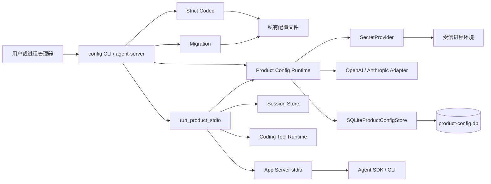

**图示说明：** 配置文件和环境是启动控制面输入；模型只能通过Runtime构造的Provider访问Secret副本；
`product-config.db`不保存Secret值；Workspace通过Tool Runtime进入模型可操作数据面，因此配置和状态必须位于
Workspace之外。App Server只在配置、Provider、Session和Tool全部就绪且激活成功后开放。

### 5.1 允许依赖

| 方向 | 规则 |
|---|---|
| CLI/Server → Product Config | 允许；只能通过公开合同和应用函数装配 |
| Product Config → Models | 允许；向Adapter传递显式API Key，不让Adapter自行选择产品Secret来源 |
| Product Config → Secrets | 允许；依赖`SecretProvider`端口和Environment实现 |
| Product Config → Workspace Reader | 允许；仅用于安全读取受信配置文件 |
| Product Config → SQLite | 允许；只保存无明文控制面事实 |
| Product Server → Session/Tools/App Server | 允许；组合根拥有创建和关闭顺序 |
| SafeFallbackProvider → Config Store | 允许；切换前同步持久化决策 |

### 5.2 禁止旁路

- Model Adapter不得从Product Config对象中获得任意环境映射或Secret Source列表；
- 配置文件不得直接包含Secret值；
- Profile选择不得由调用方只提交字符串数组后跳过Snapshot重算；
- Server不得在离线诊断失败、Provider部分构造或激活CAS冲突时开放stdout协议；
- Fallback不得由网关或上层在响应暴露后透明执行；
- Store不得保存模型响应、Prompt、Tool参数、环境值或Provider SDK异常正文；
- Tool Runtime不得读取或修改配置文件、状态数据库及其父控制目录；
- 迁移不得在没有完整小写源SHA256的情况下覆盖文件；
- 事件链损坏后不得删除异常行并继续追加。

## 6. 包结构与推荐阅读顺序

| 顺序 | 文件 | 规模 | 阅读目标 |
|---:|---|---:|---|
| 1 | [`contracts.py`](../../src/harnessix/product_config/contracts.py) | 497行 | v1/v2、Snapshot、Selection、Diagnostic、Receipt和两类Audit合同 |
| 2 | [`test_contracts_and_codec.py`](../../tests/product_config/test_contracts_and_codec.py) | 201行 | 严格类型、排序、图、能力、路径与资源上限 |
| 3 | [`codec.py`](../../src/harnessix/product_config/codec.py) | 165行 | JSON解码、私有文件检查、安全读取和双摘要构造 |
| 4 | [`runtime.py`](../../src/harnessix/product_config/runtime.py) | 410行 | 选择核验、诊断、Secret生命周期、Factory和Fallback状态机 |
| 5 | [`test_runtime.py`](../../tests/product_config/test_runtime.py) | 419行 | 零暴露边界、审计门禁、构造回滚和关闭语义 |
| 6 | [`store.py`](../../src/harnessix/product_config/store.py) | 496行 | SQLite Schema、CAS、事务和Hash链校验 |
| 7 | [`migration.py`](../../src/harnessix/product_config/migration.py) | 200行 | 文件锁、源CAS、备份、替换及崩溃点 |
| 8 | [`test_migration_and_store.py`](../../tests/product_config/test_migration_and_store.py) | 334行 | 替换前后恢复、权限、CAS及篡改失败关闭 |
| 9 | [`server.py`](../../src/harnessix/product_config/server.py) | 166行 | 产品组合根、路径隔离、平台门禁和生命周期事务 |
| 10 | [`cli.py`](../../src/harnessix/product_config/cli.py) | 116行 | 命令参数、stdout/stderr与错误脱敏 |
| 11 | [`test_server_and_cli.py`](../../tests/product_config/test_server_and_cli.py) | 311行 | 启动、失败回滚、固定Workspace与CLI输出 |
| 12 | [`test_provider_credentials.py`](../../tests/product_config/test_provider_credentials.py) | 121行 | 真实Adapter显式凭据注入及canary不泄漏 |
| 13 | [`test_schemas.py`](../../tests/product_config/test_schemas.py) | 46行 | 提交Schema和示例与运行时合同同步 |
| 14 | [`action_contracts.py`](../../src/harnessix/product_config/action_contracts.py) | 动态 | 理解固定Process Profile、Secret引用和能力报告合同 |
| 15 | [`process_profile.py`](../../src/harnessix/product_config/process_profile.py) | 动态 | 理解Engine、镜像、Owner、Sandbox和Secret能力如何全部证明后才形成可执行Profile |
| 16 | [`process_action.py`](../../src/harnessix/product_config/process_action.py) | 动态 | 理解公共`profile/selectors`如何派生执行合同、进入Router并发布终态Artifact |
| 17 | [`action_composition.py`](../../src/harnessix/product_config/action_composition.py) | 动态 | 区分已接入的Patch组合与尚未接入Server的Process候选链 |

## 7. 内部架构与责任分层

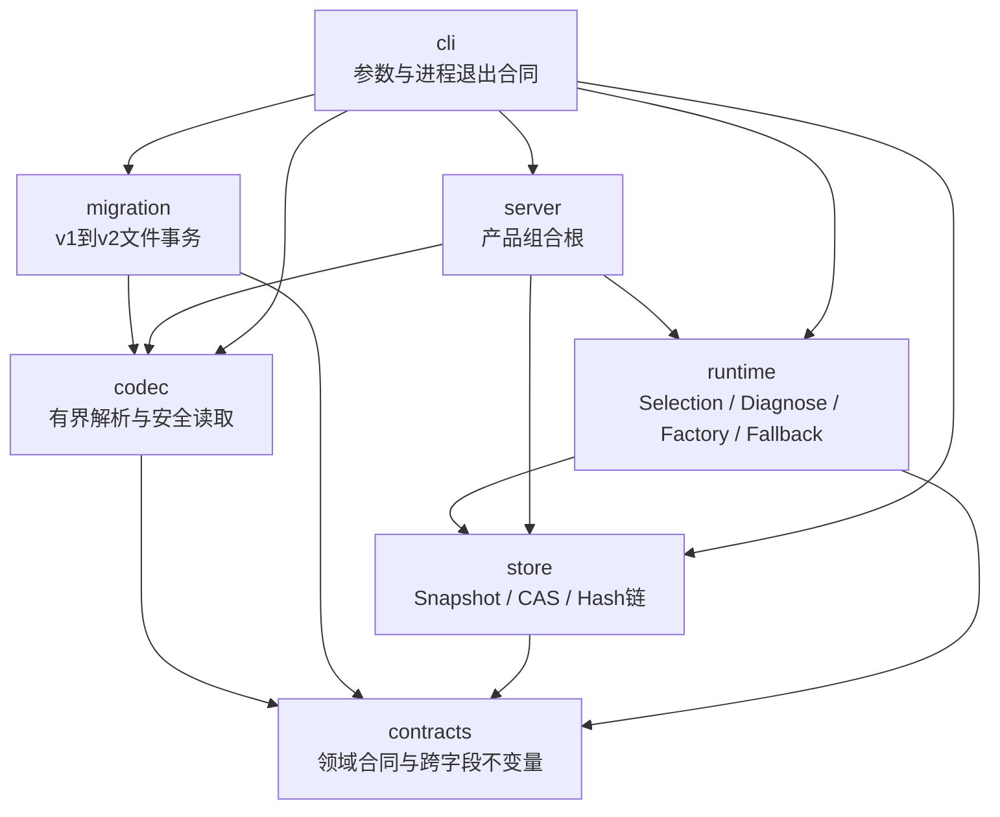

`contracts`是稳定数据语义中心；`codec`只负责从字节建立合法对象；`runtime`只在合法Snapshot上工作；
`store`保存不可变事实与当前指针；`server`承担跨子系统生命周期事务；`cli`不复制领域规则。

## 8. 配置聚合与关系模型

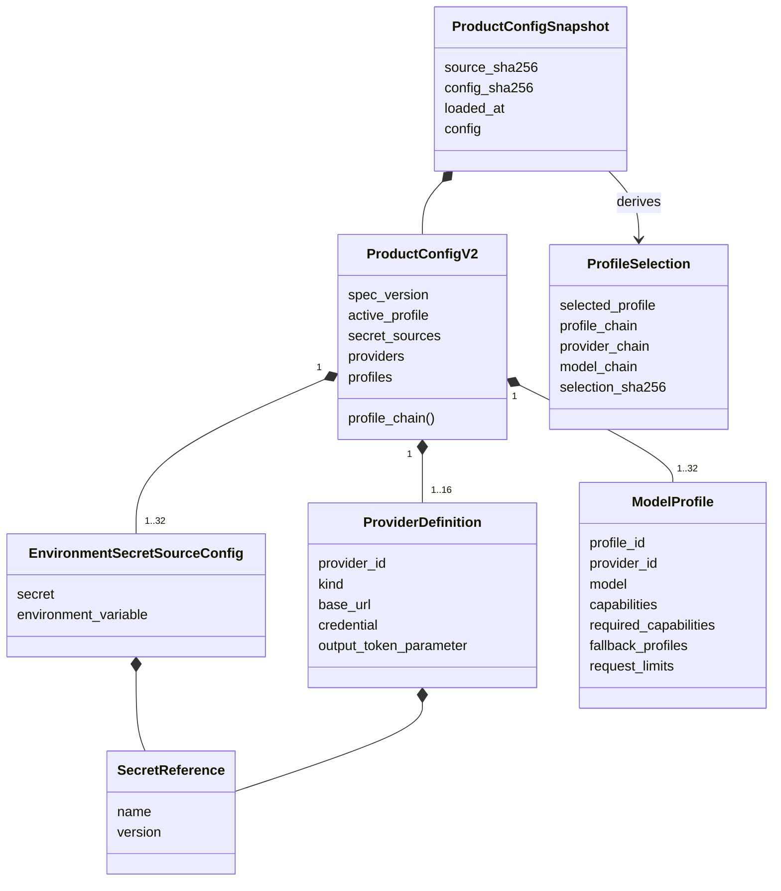

配置聚合使用数组而不是以ID为Key的自由对象。数组必须规范排序且ID唯一，使审阅Diff、Schema约束和摘要输入
保持确定。Fallback列表保留声明顺序，因为顺序直接影响运行行为。

## 9. 基础合同与字段设计

所有Product Config合同继承
[`ProductConfigContract`](../../src/harnessix/product_config/contracts.py)，统一使用
`extra="forbid"`、`frozen=True`、`strict=True`和`allow_inf_nan=False`。调用方不能用字符串`"2"`
替代整数，也不能在构造后原地修改对象。

### 9.1 `SecretReference`

| 字段 | 类型/限制 | 语义 | 是否可持久化 |
|---|---|---|---|
| `name` | 1～128字符；字母开头；字母、数字、`_ . -` | 逻辑Secret身份 | 是 |
| `version` | 1～128字符；非空单行；拒绝NUL/CR/LF | 部署者声明的精确版本 | 是 |

`version`不是Secret值摘要，也不会由Environment Provider从外部系统验证。它证明配置和Source声明一致，
不能证明环境变量值没有在同一声明版本下被替换。

### 9.2 `EnvironmentSecretSourceConfig`

| 字段 | 类型/限制 | 语义 |
|---|---|---|
| `secret` | `SecretReference` | 可被Provider精确引用的名称与版本 |
| `environment_variable` | 1～128字符；大写环境变量格式 | 受信宿主中的值定位 |

同一v2配置中，一个环境变量最多对应一个Secret引用；多个Provider共享凭据时必须共享同一个引用。

### 9.3 `ProviderDefinition`

| 字段 | 类型/限制 | 语义 |
|---|---|---|
| `provider_id` | 小写稳定标识，最多64字符 | Profile引用和审计身份 |
| `kind` | `openai_chat`或`anthropic` | Factory选择 |
| `base_url` | 最多2048字符，经`ModelHTTPConfig.validate_url`验证 | 精确Provider端点 |
| `credential` | `SecretReference` | API Key引用 |
| `output_token_parameter` | `max_completion_tokens`、`max_tokens`或空 | OpenAI-compatible输出参数差异 |

Anthropic定义禁止配置OpenAI输出Token参数。端点验证复用Model模块，不在Product Config复制网络规则。

### 9.4 `ModelCapabilities`

| 字段 | 默认值 | 不变量 |
|---|---:|---|
| `tool_calls` | `true` | 可声明关闭 |
| `parallel_tool_calls` | `true` | 为真时`tool_calls`必须为真 |
| `streaming_usage` | 固定`true` | 当前产品要求流式用量事实 |

`satisfies(required)`逐项判断候选声明能力是否覆盖首选Profile要求。它不连接Provider验证声明真实性。

### 9.5 `ModelProfile`

| 字段 | 范围/默认 | 运行语义 |
|---|---|---|
| `profile_id` | 稳定小写标识 | 用户选择与Fallback节点身份 |
| `provider_id` | 稳定小写标识 | 引用Provider定义 |
| `model` | 1～256字符，受限模型名字符集 | 发送给Adapter的精确模型 |
| `capabilities` | 默认工具、并行工具、流式用量均开启 | 候选声明能力 |
| `required_capabilities` | 默认只要求流式用量 | 首选Profile对整条链的最低要求 |
| `fallback_profiles` | 最多5个、有序、唯一、不含自身 | 深度优先展开的后继节点 |
| `max_output_tokens` | 1～1,000,000；默认4096 | Adapter输出上限 |
| `timeout_seconds` | `(0,3600]`；默认120 | 整体请求超时 |
| `io_timeout_seconds` | `(0,300]`；默认30 | 单次I/O超时 |
| `max_attempts` | 1～5；默认2 | 当前Provider内部尝试数 |
| `retry_delay_seconds` | `[0,10]`；默认0.5 | Adapter重试等待 |
| `max_request_bytes` | 1 KiB～16 MiB；默认2 MiB | 序列化请求上限 |
| `max_response_bytes` | 1 KiB～16 MiB；默认2 MiB | 累计响应上限 |
| `max_frame_bytes` | 128 B～1 MiB；默认256 KiB | 单流Frame上限 |
| `max_chunks` | 1～100,000；默认10,000 | 流Chunk数量上限 |

Profile既是模型选择，也是Provider I/O和重试预算。改变任一字段都会改变Config SHA。

## 10. 顶层v2合同与图不变量

[`ProductConfigV2`](../../src/harnessix/product_config/contracts.py)包含：

| 字段 | 数量 | 规范 |
|---|---:|---|
| `spec_version` | 1 | 固定`harnessix.product-config/v2` |
| `active_profile` | 1 | 必须存在于`profiles` |
| `secret_sources` | 1～32 | 按Secret名称排序，名称唯一，环境变量唯一 |
| `providers` | 1～16 | 按Provider ID排序且唯一；Secret名称和版本精确存在 |
| `profiles` | 1～32 | 按Profile ID排序且唯一；Provider和Fallback引用完整 |

每个Profile都独立展开整条Fallback链并验证：

1. DFS访问期间再次访问`visiting`节点表示环；
2. 再次访问`visited`节点表示展开重复，即菱形共享也被拒绝；
3. 展开结果最多6个Profile；
4. 所有候选`max_attempts`之和最多32；
5. 所有候选都满足链首Profile的`required_capabilities`。

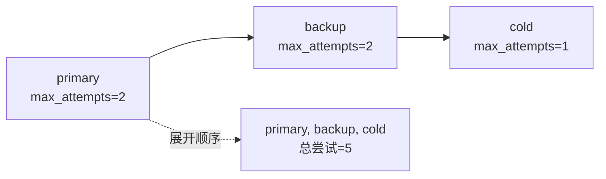

当前语义是深度优先前序展开，而不是按层广度优先。一个Profile可以列出多个Fallback，但所有分支展开后不得
重复节点。运行时按扁平Selection的相邻候选依次切换。

## 11. v1兼容合同

[`ProductConfigV1`](../../src/harnessix/product_config/contracts.py)只为迁移保留。它与v2的主要差异是
`LegacyProviderDefinition.api_key_env`直接位于Provider定义中，没有独立Secret引用。

v1仍验证Provider/Profile排序、唯一、活动Profile、Provider引用、Fallback引用、环、重复、六候选和32次
尝试上限。普通`decode_product_config_bytes`和`agent-server`不接受v1；只有显式传入`allow_legacy=True`
的迁移路径允许解码。

## 12. 派生合同与身份绑定

### 12.1 `ProductConfigSnapshot`

| 字段 | 语义 |
|---|---|
| `spec_version` | 固定`harnessix.product-config-snapshot/v1` |
| `source_sha256` | 实际读取原始字节的SHA256 |
| `config_sha256` | 规范领域配置摘要 |
| `loaded_at` | UTC有时区加载时间 |
| `config` | 已完整验证的v2配置 |

模型校验器会重算Config SHA，但不会重算Source SHA，因为Snapshot对象不保存原始文件字节。

### 12.2 `ProfileSelection`

| 字段 | 语义 |
|---|---|
| `config_sha256` | 所属Snapshot身份 |
| `selected_profile` | 展开链首项 |
| `profile_chain` | 有序Profile ID链，1～6项且唯一 |
| `provider_chain` | 与Profile链等长的Provider ID链 |
| `model_chain` | 与Profile链等长的精确模型链 |
| `selection_sha256` | 排除自身字段后的规范摘要 |

Selection自身只验证基本结构和摘要；[`_verify_selection`](../../src/harnessix/product_config/runtime.py)
还会从Snapshot重新构造期望Selection并逐字段比较，防止合法摘要包裹伪造链。

### 12.3 `ConfigurationDiagnosticReport`

报告绑定Config SHA、Selection SHA、首选Profile、生成时间和Report SHA。每项Check只包含：

- `scope`：`config|profile|provider|secret|dependency`；
- `subject_id`：受限标识；
- `code`：`config_...`稳定码；
- `status`：`passed|failed`。

Checks按`scope + subject_id + code`排序且唯一，`ready`必须等于所有Check均通过。报告不包含端点、环境变量值、
Secret正文、异常正文或SDK诊断字符串。

### 12.4 `ConfigMigrationReceipt`

收据绑定迁移前后版本、源/目标/备份摘要、是否变化、时间和自身摘要。v1迁移必须满足：

- `changed=true`；
- `backup_sha256 == source_sha256`；
- `target_sha256 != source_sha256`。

对已是v2的文件，`changed=false`、无备份摘要且目标摘要等于源摘要。

### 12.5 `ConfigAuditEvent`

事件操作为`loaded|activated|migrated`。`activated`必须携带Profile；`migrated`必须携带迁移收据摘要；
旧活动配置摘要和旧Profile必须同时存在或同时为空。序号1必须没有前驱摘要，之后必须有前驱。

### 12.6 `ProviderFallbackDecision`

事件绑定Config SHA、Thread、Turn、Step、前后Profile/Provider、失败码、时间和链摘要。
`response_exposed`与`tool_call_exposed`在v1合同中固定为`false`，使持久记录本身证明该决策只允许来自零暴露路径。

## 13. 摘要模型与规范化边界

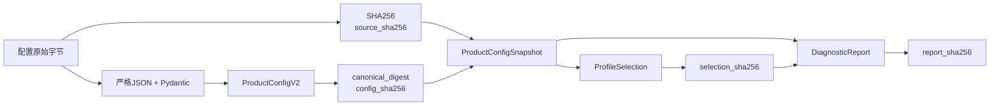

Source SHA对格式敏感，Config SHA对解析后的领域值敏感。Store以Config SHA为Snapshot主键，因此同一语义配置若仅
改变空白或JSON键顺序，不会新增第二个Snapshot；Store保留第一次写入的Source SHA和`loaded_at`。这意味着Store
不是全部源文件字节版本的历史档案，迁移CAS必须继续使用当前文件重新计算的Source SHA。

## 14. 严格解码与资源上限

[`decode_product_config_bytes`](../../src/harnessix/product_config/codec.py)按以下顺序处理输入：

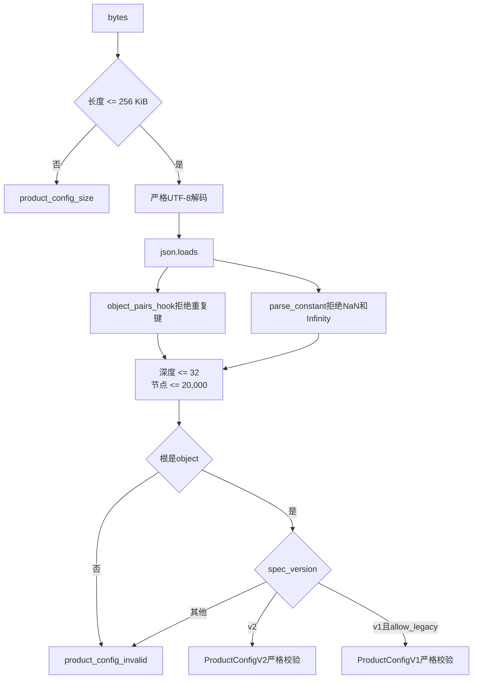

结构计数同时遍历对象Key和值；过深、过多、非法UTF-8、JSON错误、重复键、Pydantic错误和不支持版本统一映射为
`product_config_invalid`，避免向外泄漏解析器细节。超过字节上限单独返回`product_config_size`。

规范v2输出由[`canonical_product_config_bytes`](../../src/harnessix/product_config/codec.py)生成：
按Key排序、两空格缩进、UTF-8、不转义中文、拒绝NaN并以换行结束。它用于迁移目标，不是加载时强制要求；
输入可以有不同合法空白和对象Key顺序，但数组领域顺序必须规范。

## 15. 配置文件安全读取

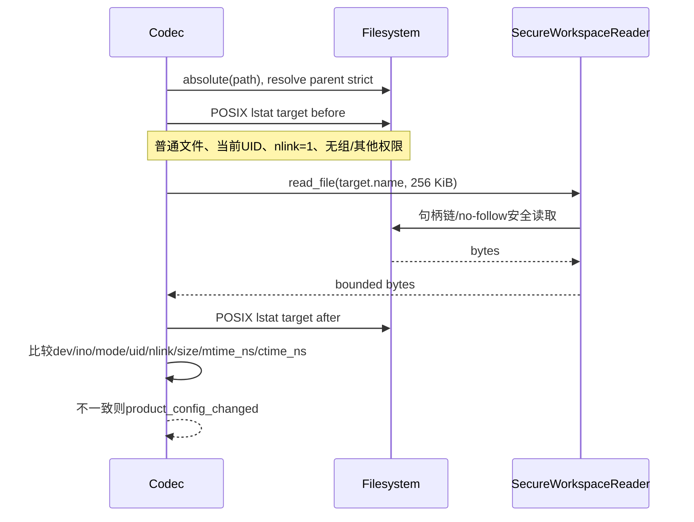

POSIX额外要求目标是当前UID拥有、单硬链接、无组/其他权限的普通文件。前后身份元组不同即拒绝。
非POSIX路径仍由`SecureWorkspaceReader`执行平台安全读取，但`_private_file`返回空观察，不提供与POSIX相同的
所有者、ACL和前后元数据比较保证。

配置文件本身被作为安全Reader的单文件Workspace读取。父目录必须可严格解析；文件不可用、链接、特殊对象或
Reader拒绝映射为稳定配置错误。安全读取的底层跨平台语义见[Workspace模块设计](workspace.md)。

## 16. Profile展开与选择核验

选择流程分两层：

1. [`select_profile`](../../src/harnessix/product_config/runtime.py)从显式`profile_id`或
   `active_profile`生成Selection；未知Profile或无效图映射为`product_profile_not_found`；
2. 诊断和Provider构造调用`_verify_selection`，比较Config SHA后从Snapshot重新展开并要求对象完全相等。

核心伪代码：

```text
function verify_selection(snapshot, supplied):
    if supplied.config_sha256 != snapshot.config_sha256:
        fail product_config_selection_mismatch
    expected = build_profile_selection(
        snapshot.config,
        snapshot.config_sha256,
        supplied.selected_profile,
    )
    if expected != supplied:
        fail product_config_selection_mismatch
```

调用方即使重新计算了一个伪造Selection的合法摘要，也不能截短、插入或重排候选链。

## 17. 离线诊断流程

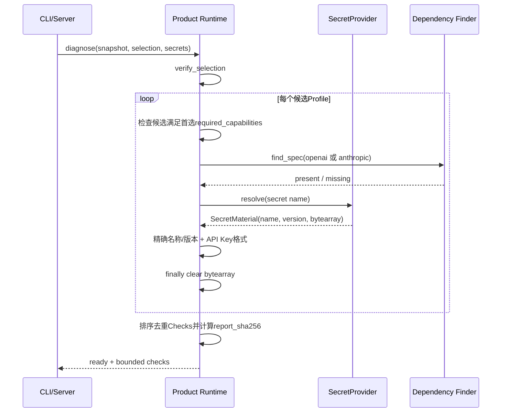

### 17.1 当前检查项

| Scope | Code | 条件 |
|---|---|---|
| config | `config_contract_valid` | 已经成功建立合法Snapshot，固定通过 |
| profile | `config_capabilities_satisfied` | 候选能力覆盖首选要求 |
| dependency | `config_dependency_available` | 对应`openai`或`anthropic`模块可发现 |
| secret | `config_secret_version_available` | 名称、声明版本和非空值匹配 |
| provider | `config_provider_auth_usable` | Key为1～8192字节可打印ASCII、无空格控制字符，且无自定义Header环境污染 |

依赖检查只说明Python模块可导入；Secret检查只读取本地Source。诊断不会解析DNS、建立TLS、验证认证、查询模型、
检查配额或验证声明能力。因此`ready=true`表示“可以进入构造阶段”，不表示真实Provider调用必然成功。

### 17.2 诊断失败语义

单个候选的依赖或Secret失败不会抛出底层错误，而是形成`failed` Check。Selection与Snapshot不一致属于调用方
合同破坏，直接抛出稳定Kernel错误。Server要求`ready=true`；CLI仍输出完整有界报告并以退出码2结束。

## 18. Secret生命周期与数据流

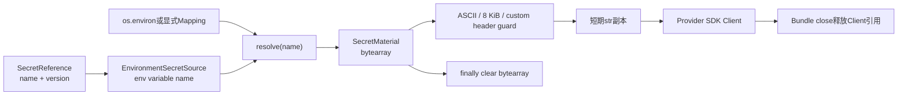

[`environment_secret_provider`](../../src/harnessix/product_config/runtime.py)只把配置声明的Source转换为
白名单，不枚举环境。当未显式传入Mapping时，Provider保存对实时`os.environ`对象的引用，而不是启动时副本。
诊断和后续构造会分别解析，因此同一环境变量若在两阶段间改变，构造使用后值；声明版本不会自动变化。

`SecretMaterial.value`是可变`bytearray`，诊断与构造均在`finally`清零。API Key通过ASCII解码形成Python
不可变字符串，并由Provider SDK Client持有到关闭；Python运行时无法保证立即清除该字符串内存。测试保证值不进入
Provider Event、诊断、SQLite和CLI错误，不声称完成进程内存取证防护。

`OPENAI_CUSTOM_HEADERS`或`ANTHROPIC_CUSTOM_HEADERS`存在非空值时，Key验证失败，避免环境中的认证Header
被SDK发送到配置指定的另一个端点。

## 19. Provider Factory映射

[`default_provider_factory`](../../src/harnessix/product_config/runtime.py)把产品合同转换为Model合同：

| Product字段 | OpenAI-compatible | Anthropic |
|---|---|---|
| `base_url` | 原样传入 | 原样传入 |
| `model` | 原样传入 | 原样传入 |
| `capabilities` | 转换为`ChatCapabilities` | 转换为`ChatCapabilities` |
| `max_output_tokens` | 原样传入 | 原样传入 |
| timeout/I/O/attempt/retry | 原样传入 | 原样传入 |
| request/response/frame/chunk上限 | 原样传入 | 原样传入 |
| `output_token_parameter` | 显式值；缺省为`max_completion_tokens` | 不允许配置 |
| `api_key_env` | 固定占位`HARNESSIX_MANAGED_PROVIDER_SECRET` | 同左 |
| `api_key` | 通过构造参数显式注入 | 通过构造参数显式注入 |

占位`api_key_env`仅满足Model Config既有合同；Adapter收到显式`api_key`后不会读取该占位环境变量。
Factory不根据Provider ID推断类型，也不修改Profile模型名。

## 20. Provider Bundle构造事务

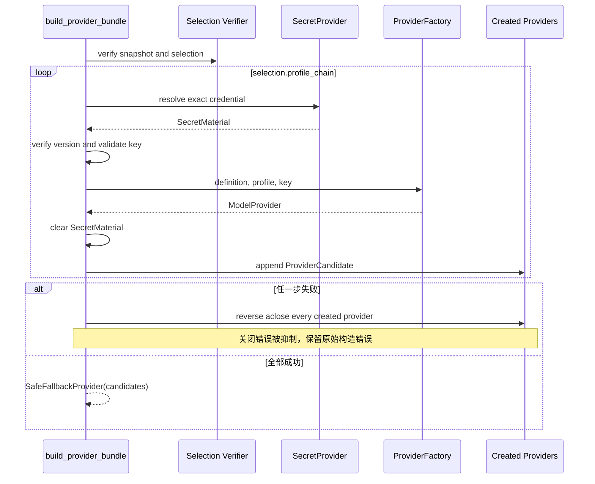

构造阶段是内存资源的全有或全无事务。关闭阶段同样逆序尝试所有候选，但与构造回滚不同：Bundle正常
`aclose`会保留并抛出第一个关闭错误，同时继续关闭其他候选。重复关闭幂等；关闭后进入Context返回
`product_provider_closed`，关闭后调用`stream`产生`ResponseFailed(code="invalid_request")`。

## 21. Safe Fallback状态机

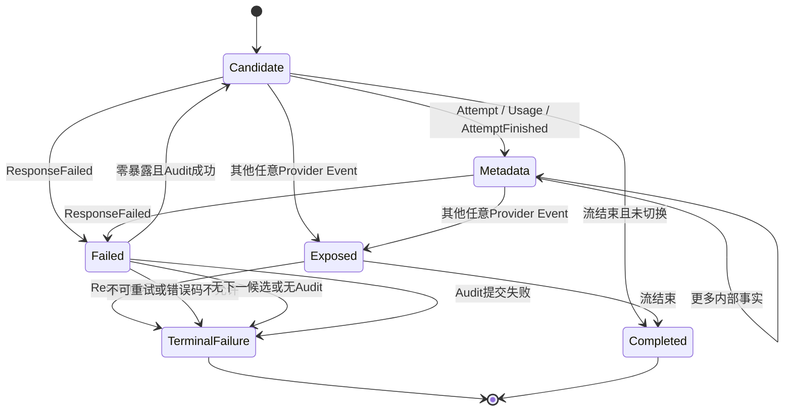

### 21.1 安全元数据白名单

只有以下冻结类型不关闭Fallback窗口：

- `ModelAttemptStarted`；
- `ModelUsageObserved`；
- `ModelAttemptFinished`。

`ResponseStarted`、Text事件、`ToolCallCompleted`、`ResponseCompleted`以及未来新增的任何未知事件都会关闭窗口。
这是默认拒绝策略：新Provider Event不会因未更新Fallback代码而被误判为不可见。

### 21.2 允许切换的失败

必须同时满足：

1. 尚未暴露响应；
2. `ResponseFailed.retryable=true`；
3. Code为`transport|rate_limit|provider_internal`；
4. 当前链中存在下一候选；
5. 注入了Audit Store；
6. Fallback决策成功提交。

审计失败时返回原始`ResponseFailed`，不把审计异常泄漏为模型错误。无Audit的库级Bundle即使有候选链也不会切换。

### 21.3 核心伪代码

```text
global_index = 0
exposed = false
for each candidate in selection order:
    switched = false
    for event in candidate.stream(request, cancel):
        cancellation_checkpoint()
        if event is AttemptStarted:
            global_index += 1
            if global_index > 32:
                emit invalid_request; stop
            emit event with global index and configured provider id
        else if event is ResponseFailed:
            if zero_exposure_retryable_allowed_and_auditable(event):
                persist fallback decision synchronously
                switched = true
                break without emitting intermediate failure
            emit event; stop
        else:
            if event is not frozen internal metadata:
                exposed = true
            emit event
    if not switched:
        stop
```

Fallback是下一Provider的新请求。它不重用旧响应ID、私有签名、流Cursor或半成品Tool Call。

## 22. 尝试序号、用量与取消

各Adapter可以从局部尝试序号1重新开始。Bundle对每个`ModelAttemptStarted`递增步骤内全局序号，并把
`provider`改写为配置中的稳定Provider ID；Attempt ID、模型名、Usage和Finish事实保持不变。

配置加载时已限制候选链`max_attempts`总和不超过32，运行时仍执行第二道`global_index > 32`保护。
若Provider违反自身配置多发Attempt，Bundle返回`invalid_request`并停止。

每个事件消费前调用`cancel.checkpoint()`，取消异常直接向上传播，不参与Fallback。`aclosing`保证退出候选流时调用
异步生成器`aclose`。若Provider生成器直接抛异常而不是发出结构化`ResponseFailed`，当前Bundle不会自动Fallback。

## 23. SQLite持久模型

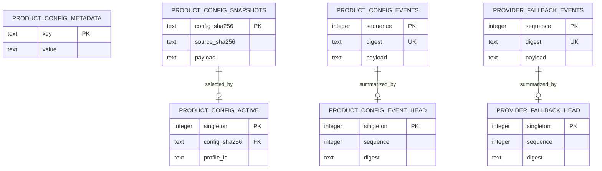

[`SQLiteProductConfigStore`](../../src/harnessix/product_config/store.py)使用：

- `isolation_level=None`，每个写方法显式`BEGIN IMMEDIATE`；
- `busy_timeout=5000`毫秒；
- `foreign_keys=ON`；
- `journal_mode=WAL`；
- `synchronous=FULL`；
- SQLite STRICT表；
- 元数据`schema_version=1`。

Store是同步对象。所有读取、链校验和写事务都在调用线程执行；默认Server的Fallback流位于asyncio事件循环中，
因此大型数据库或五秒锁等待可能阻塞事件循环。当前没有异步连接、线程卸载或写队列。

## 24. Store路径安全

构造Store前会检查：

1. 最终父目录存在时必须是非链接目录；不存在时以0700递归创建；
2. POSIX最终父目录必须由当前UID拥有且权限精确0700；不会自动收紧已有共享目录；
3. 数据库不存在时用`O_CREAT|O_EXCL`及可用的`O_NOFOLLOW`创建0600文件；
4. 数据库必须是普通文件、单硬链接；POSIX必须当前UID拥有且权限精确0600；
5. SQLite连接成功后再次将主数据库chmod为0600。

直接以包含符号链接祖先、但最终父目录本身不是链接的路径构造Store时，`_prepare_path`不会逐级拒绝祖先链接。
默认产品组合根先把状态根解析为真实路径，因此不经过该别名继续构造数据库；独立库调用仍应传入已规范化受信路径。
WAL/SHM侧文件由SQLite管理，当前实现没有逐次验证其权限、所有者和链接计数。

## 25. Snapshot保存事务

`save_snapshot`先通过JSON round-trip重新验证调用方对象，然后：

```text
BEGIN IMMEDIATE
verify complete config event chain
if config_sha256 exists:
    parse and validate stored snapshot
    require stored config == supplied config
    COMMIT and return stored snapshot
else:
    insert snapshot
    append loaded event and update head
    COMMIT
on any failure:
    ROLLBACK
```

已存在同一Config SHA时不产生新的`loaded`事件。Store比较领域Config，不要求新Snapshot的Source SHA与旧记录相同，
因此会返回首次保存的Snapshot。

## 26. 活动Profile CAS

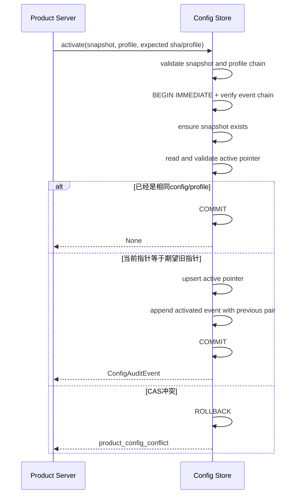

首次激活要求期望摘要和期望Profile都为空。切换同一配置中的Profile也必须同时提交旧摘要和旧Profile。
相同Config/Profile重复激活在检查期望值前直接幂等成功，因此即使调用方传入过时的期望值，也不会为已经成立的目标
制造冲突；它不会新增事件。

激活前若Snapshot不存在，事务会插入Snapshot并追加`loaded`事件。活动索引读取时会重新加载Snapshot并验证Profile
仍属于配置；损坏时失败关闭。

## 27. 配置与Fallback Hash链

每条链都使用全局连续序号、前驱摘要和单行Head：

```text
event[1].previous_digest = null
event[n].previous_digest = event[n-1].digest
head.sequence = count(events)
head.digest = event[last].digest
```

每次配置写入先读取并验证完整配置链；Fallback写入同时先验证完整配置链和完整Fallback链。验证内容包括：

- JSON正文能严格反序列化且对象自身摘要正确；
- 数据库行序号从1连续；
- 行摘要等于正文摘要；
- 正文序号等于行序号；
- 前驱摘要连续；
- 空链与空Head一致；
- 非空Head与最后序号/摘要一致。

Fallback写入还加载目标Config Snapshot，验证前后Profile/Provider与该配置图的某条展开链相邻关系一致。
记录不要求该Config当前处于active状态，因为历史Bundle仍可能持有旧Snapshot；默认产品不热切换Bundle。

Hash链可检测非协调修改和意外损坏，但数据库写权限相同的恶意进程可以重算全部摘要和Head。当前没有HMAC、签名、
远端WORM日志或独立校验锚点。

## 28. v1到v2映射

[`migrate_v1`](../../src/harnessix/product_config/migration.py)按Provider规范顺序处理：

1. 读取`api_key_env`；
2. 若此前未见该环境变量，建立`<provider-id>-api-key`、版本`env-v1`的Secret引用和Source；
3. 若已见，复用首次建立的同一Secret引用；
4. Provider改为引用Secret；
5. Secret Source按名称排序，Provider按ID排序，Profile保持已验证规范顺序；
6. 构造`ProductConfigV2`并执行全部v2不变量。

同一旧环境变量不会在迁移后伪装成多个独立版本身份。生成名称取决于规范Provider列表中首个使用该变量的Provider。

## 29. 文件迁移事务与崩溃恢复

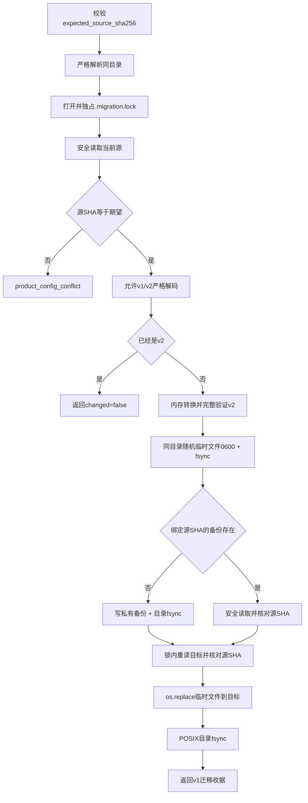

迁移锁名为`.{config-name}.migration.lock`，文件要求普通、单硬链接；POSIX要求当前UID和0600。
锁竞争返回`product_config_busy`，锁对象不在成功后删除。临时文件和新备份使用排他创建、0600、文件fsync；
POSIX再同步目录。已存在备份必须通过安全读取且SHA与源一致，否则`product_config_backup_conflict`。

### 29.1 崩溃边界

| 崩溃/失败点 | 文件事实 | 恢复 |
|---|---|---|
| 临时文件fsync前后、替换前 | 原v1仍在；可能已有有效备份 | 以原Source SHA重跑；随机临时文件在正常异常清理，进程硬崩溃可能遗留 |
| 备份完成后、源二次核对失败 | 原源不被覆盖；备份保留 | 核对非协作修改，使用最新SHA重新决策 |
| `os.replace`后、收据返回前 | 目标已经是完整v2 | 计算当前v2 Source SHA重跑，返回`changed=false` |
| 目录fsync失败 | 替换可能已发生，但调用方收到迁移失败 | 检查当前文件版本和SHA，不得继续使用旧期望摘要 |
| 配置文件迁移成功、配置DB审计失败 | 文件已是v2，原v1收据未进入DB | 文件与DB不是跨资源原子事务；需依据备份和外部操作记录人工核对 |

Windows跳过目录fsync；其原子性和持久落盘保证不等价于POSIX目录同步。

## 30. 产品启动事务

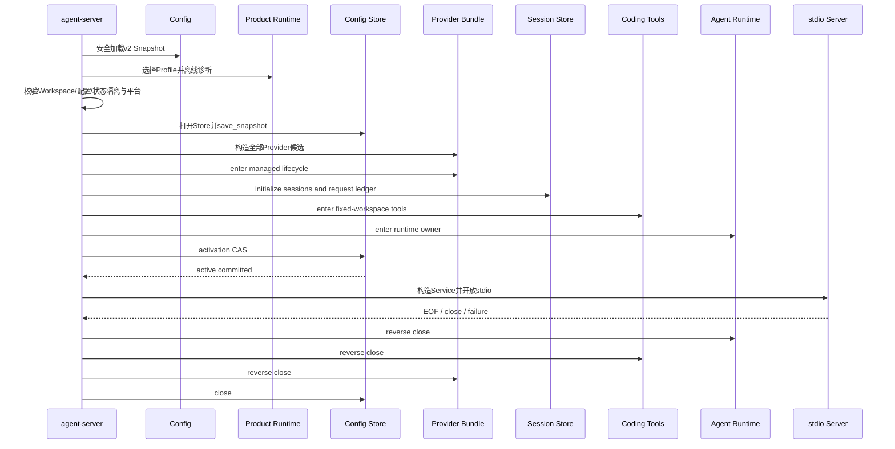

[`run_product_stdio`](../../src/harnessix/product_config/server.py)的精确顺序为：

1. 安全加载配置，v1返回`product_config_migration_required`；
2. 构造Selection；
3. 在线程中严格解析Workspace；
4. 再解析配置路径并拒绝配置文件位于Workspace；
5. 构造Environment Secret Provider并离线诊断；
6. 在创建前以绝对候选路径拒绝状态目录与Workspace互相包含；
7. 执行POSIX Coding Tool平台门禁；
8. 建立/验证私有状态根，解析后再次执行重叠检查；
9. 可选解析Git可执行文件；
10. 打开Config Store并保存Snapshot；
11. 构造全部Provider并进入Bundle生命周期；
12. 初始化Session Store和Protocol Request Store；
13. 进入Coding Tool Runtime与Agent Runtime Owner生命周期；
14. 以调用方期望旧指针执行activation CAS；
15. 构造固定Workspace的Application Service和Protocol Server；
16. 运行stdio直到EOF或失败，随后逆序关闭。

Provider构造、Session初始化、Tool/Runtime Owner或CAS任一步失败都不会开放stdio。Snapshot的`loaded`事件可能已
持久化，但active pointer保持不变。

## 31. Workspace、状态与可执行文件隔离

### 31.1 Workspace

Workspace必须已存在且是目录，并解析为真实路径。Application Service被固定到该Root；客户端创建Thread时提交
不同或不存在的Root会返回`workspace_not_configured`，不能用Protocol切换到另一个项目。

### 31.2 配置文件

配置安全读取后，Server再次`resolve(strict=True)`用于重叠判断。该第二次解析只确认路径仍可解析，未重新读取文件、
比较原始字节或核对前次文件身份；即使文件在加载后被替换，当前进程继续使用内存Snapshot。运维展示的路径此时可能
已经指向与运行Snapshot不同的文件内容。

### 31.3 状态目录

创建前后都拒绝：

- State位于Workspace；
- Workspace位于State。

已有State必须是非链接目录；POSIX要求当前UID且无组/其他权限。创建路径使用0700并在最终Root检查。配置文件可以位于
State目录内，当前代码只禁止其位于Workspace。

### 31.4 Git可执行文件

可选路径必须可严格解析且`is_file()`。当前未验证POSIX执行位、所有者、内容摘要、签名或是否通过符号链接解析到目标，
也未把Git身份写入Product Config Snapshot。真正执行时的Process层仍可能失败。

## 32. CLI接口与进程合同

### 32.1 离线诊断

```bash
uv run harnessix config diagnose \
  --config /absolute/private/product-config.json \
  --profile primary \
  --state-database /absolute/private/config-audit.db
```

- `--profile`省略时使用配置`active_profile`；
- `--state-database`可选，提供时保存Snapshot和`loaded`事件，即使报告`ready=false`；
- stdout输出一行排序JSON报告；
- `ready=true`退出0，`ready=false`退出2；
- 稳定错误写stderr并退出2。

### 32.2 显式迁移

```bash
uv run harnessix config migrate \
  --config /absolute/private/product-config.json \
  --expected-source-sha256 0123456789abcdef... \
  --state-database /absolute/private/config-audit.db
```

成功stdout输出收据并正常返回。可选Store在文件迁移完成后重新加载v2并记录`migrated`事件；二者不是一个事务。

### 32.3 stdio Agent Server

```bash
uv run harnessix agent-server \
  --config /absolute/private/product-config.json \
  --profile primary \
  --workspace /absolute/project \
  --state-directory /absolute/private/runtime/project-id \
  --expected-active-sha256 0123456789abcdef... \
  --expected-active-profile backup \
  --git-executable /usr/bin/git
```

stdout专用于Agent Protocol JSONL。启动错误写stderr JSON并退出2。首次激活省略两个Expected参数；已有活动指针的切换
必须提交二者。CLI未强制“两者同时出现”，不完整组合会在Store CAS中作为不匹配失败。

### 32.4 错误输出

稳定Kernel错误格式为：

```json
{"code":"product_config_invalid","message":"产品配置无效","retryable":false}
```

未知`Exception`不会输出`repr`或底层消息，而统一为`product_internal_failure`。`SystemExit`、`KeyboardInterrupt`
等`BaseException`不由通用分支吞掉。

### 32.5 TUI产品调用方

[`product_ui/cli.py`](../../src/harnessix/product_ui/cli.py)不复制Product Config加载、诊断或Runtime装配逻辑，而是使用
当前Python解释器启动同一Wheel中的`agent-server`：

```text
python -m harnessix agent-server --config CONFIG --workspace WORKSPACE
    --state-directory CLIENT_STATE_ROOT/runtime [--profile ID] [--git-executable PATH]
```

TUI的客户端状态文件保存在`CLIENT_STATE_ROOT`，本模块的配置审计、Session、Request Ledger和运行时账本保存在其
`runtime/`子目录。Workspace、配置和状态的安全重叠检查仍由本模块执行；TUI仅提前拒绝不存在的Workspace。缺少配置、
Secret、Provider SDK或平台能力时，子进程保持现行失败关闭语义，不由View静默降级。

## 33. 主要失败语义与恢复动作

| 错误码/类别 | 触发点 | 自动重试 | 恢复动作 |
|---|---|---:|---|
| `product_config_size` | 原始文件超过256 KiB | 否 | 缩小配置，重新生成Source SHA |
| `product_config_invalid` | JSON、版本、类型或领域不变量失败 | 否 | 依据Schema修复并重新诊断 |
| `product_config_permissions` | 配置文件身份或权限不安全 | 否 | 恢复私有普通单链接文件 |
| `product_config_changed` | 安全读取观察变化或启动期路径不可解析 | 否 | 停止写入者，重新加载 |
| `product_profile_not_found` | 显式Profile不存在或图无效 | 否 | 使用配置中精确Profile ID |
| `product_config_selection_mismatch` | Selection不属于Snapshot | 否 | 丢弃缓存Selection并从Snapshot重建 |
| `product_config_diagnostic_failed` | Server离线诊断未全部通过 | 否 | 运行`config diagnose`查看Check |
| `secret_unavailable` | Secret缺失、编码或Key格式失败 | 否 | 修复Source和值；不在日志粘贴Secret |
| `secret_version_changed` | 构造期返回版本与引用不同 | 否 | 更新受信Source或显式升级配置版本 |
| `product_provider_unavailable` | 候选为空或构造失败映射 | 否 | 修复依赖、Provider定义或Secret |
| `product_config_conflict` | 文件Source CAS或active CAS不匹配 | 否 | 读取最新文件/active pointer后重新决策 |
| `product_config_busy` | 迁移锁被占用 | 有条件 | 等待当前迁移结束，读取最新SHA后重试 |
| `product_config_backup_conflict` | 同名绑定SHA备份正文不一致 | 否 | 隔离并人工核对备份与源 |
| `product_config_migration_failed` | 文件I/O或替换错误 | 否 | 检查当前文件版本、备份和摘要 |
| `product_config_store_permissions` | DB路径不安全 | 否 | 建立当前用户私有0700目录和0600文件 |
| `product_config_store_version` | Store Schema版本未知 | 否 | 使用支持版本或正式迁移Store |
| `product_config_store_corrupt` | Snapshot、active、事件正文/链/Head损坏 | 否 | 停机，从一致备份恢复并审计 |
| `product_config_fallback_invalid` | 决策不属于配置展开图 | 否 | 修复Bundle/Store绑定，不手工追加 |
| `product_state_overlap` | State与Workspace互相包含 | 否 | 移到Workspace外独立私有目录 |
| `product_tools_platform_unsupported` | 未知平台或原生读取端口不可用 | 否 | 使用已验证的POSIX/Windows宿主并检查系统能力 |
| Provider `ResponseFailed` | 模型流失败 | 条件式 | 仅满足Safe Fallback全部条件时切换 |

部分SQLite `OperationalError`、`DatabaseError`或关闭后`ProgrammingError`没有在Store公共方法统一映射为Kernel错误；
CLI会将其脱敏为内部错误，自定义库调用方可能直接观察SQLite异常类型。

## 34. 并发、幂等与一致性

| 场景 | 当前机制 | 一致性边界 |
|---|---|---|
| 同一配置文件并发迁移 | OS独占文件锁 + Source SHA二次核对 | 协作写入串行；非协作写入由二次摘要检测 |
| Snapshot重复保存 | Config SHA主键 + 领域Config比较 | 语义幂等；不同Source字节不另存 |
| 首次/切换激活 | `BEGIN IMMEDIATE` + 旧摘要/旧Profile CAS | 单SQLite文件内原子 |
| 相同目标重复激活 | 目标相同直接返回None | 幂等，不检查调用方旧期望 |
| 配置事件追加 | 事务内全链验证、追加、更新Head | 单Store串行；每次O(n)验证 |
| Fallback追加 | 事务内验证两条链和Snapshot图 | 切换前持久；同步阻塞调用线程 |
| 文件迁移 + Store审计 | 两个顺序操作 | 非原子；文件成功后DB可失败 |
| 多个Server共享State | Config Store可串行，Agent Runtime Owner另行互斥 | 后启动者可能在Owner冲突前保存`loaded`，不会激活 |
| 环境Secret变化 | 每次`resolve`读取Mapping | 无值快照；声明版本由部署者负责同步 |

Store连接默认SQLite线程约束，未设计为跨线程共享。Product Server在单事件循环线程内使用；自定义宿主必须保证
连接所有权。

## 35. 安全控制矩阵

| 威胁 | 当前控制 | 剩余风险 |
|---|---|---|
| JSON键覆盖/拼写被忽略 | 重复键和未知字段拒绝 | 人工语义配置错误仍可能合法 |
| 资源耗尽 | 字节、深度、节点和数组上限 | 诊断和全链校验仍随合法规模/历史线性增长 |
| 路径链接替换 | Secure Reader、POSIX前后观察、State最终路径校验 | 非POSIX私有ACL证明较弱；Store独立调用不逐祖先校验 |
| 配置被模型修改 | 配置/State与Workspace隔离 | 配置位于其他模型可写目录仍由部署负责 |
| Secret落盘 | 配置只保存引用；DB无值；canary测试 | SDK持有不可变字符串；环境和进程内存仍含值 |
| Secret跨端点污染 | 禁Provider自定义Header环境变量 | base URL由配置决定，无域名Allowlist/私网地址控制 |
| 未审批凭据轮换 | 精确声明版本 | Environment Source不验证真实外部版本，值可同版本变化 |
| Fallback重复输出/副作用 | 零暴露白名单、未知事件失败关闭 | Provider若错误分类或不按合同发事件，无法自动证明 |
| Fallback无审计 | 无Store或写失败即不切换 | DB故障直接降低可用性，这是安全优先取舍 |
| 配置并发覆盖 | 文件Source CAS、active双字段CAS | 文件和DB不构成跨资源事务 |
| 审计篡改 | 全链、正文摘要和Head验证 | 同权限攻击者可重算；无签名/WORM |
| 恶意Git二进制 | 仅要求已存在普通文件 | 未绑定摘要、签名、owner或执行权限 |
| 错误泄密 | 稳定消息、未知异常统一脱敏 | 外部Provider/Store自定义调用方可能自行记录异常 |

## 36. 可观测性与审计

### 36.1 已有事实

- Diagnostic Report：启动前一次性健康证据；
- Config Snapshot：运行配置语义与首次源字节身份；
- Config Audit Event：加载、迁移、激活顺序；
- Active Pointer：当前选择；
- Provider Fallback Decision：Thread/Turn/Step级零暴露切换事实；
- 稳定Kernel错误码：CLI和启动失败分类；
- Model Attempt/Usage事件：由Model/Session模块保存实际尝试与用量。

### 36.2 当前缺失

- 没有注入统一`Observer`或Trace Span；
- 没有配置加载、诊断、CAS、迁移、Fallback耗时指标；
- 没有Store锁等待、数据库大小、链长度、Fallback率或失败率指标；
- 没有活动配置查询API或受控审计导出接口；
- 没有链校验定时巡检和外部Head锚定；
- 没有SLO、告警阈值和诊断报告保留策略；
- 默认Product Server未把Product Config字段写入通用Runtime遥测。

运维工具不应直接导出SQLite `payload`作为日志。即使当前合同不含Secret，Provider ID、模型、端点引用、Thread ID和
时间仍是敏感运行元数据，应经过明确访问控制与最小化投影。

## 37. 性能与容量边界

| 资源 | 已有上限 | 当前复杂度/风险 |
|---|---:|---|
| 配置文件 | 256 KiB | 读取和JSON解码有界 |
| JSON深度 | 32 | 递归检查有界 |
| JSON节点 | 20,000 | Key和值都计数 |
| Secret Sources | 32 | 每次诊断按候选而不是Source去重解析 |
| Providers | 16 | Config全量验证线性加图展开 |
| Profiles | 32 | 每个Profile独立DFS，合法上界可接受 |
| 单Selection候选 | 6 | Provider Client数量有界 |
| 单候选内部尝试 | 5 | Adapter控制 |
| 单链总尝试 | 32 | 配置和运行双重保护 |
| Diagnostic Checks | 合同最多256 | 当前每候选4项外加config项 |
| Config/Fallback事件 | 无上限 | 每次写入全表读取并验证，长期为O(n)且同步阻塞 |
| Snapshot数量 | 无上限 | 无保留、压缩或清理策略 |
| SQLite busy wait | 5秒 | async模型流中同步调用可阻塞事件循环 |
| Provider关闭 | 无Product层超时 | SDK关闭卡住会延长退出 |

当前Store适合单用户本地实例和有限配置变化，不构成大量C端实例集中共享数据库的控制面。每个本地实例相互独立；
1.0容量门禁需要用Soak数据确定链长、DB大小、锁等待和关闭时延阈值。

## 38. 平台行为矩阵

| 能力 | macOS/Linux POSIX | Windows | 当前证据 |
|---|---|---|---|
| 严格JSON/合同/Schema | 支持 | 支持 | 平台CI与单元测试 |
| 配置安全读取 | 目录FD/no-follow + 私有UID/mode检查 | Windows安全Reader；无POSIXUID/mode观察 | Codec测试 |
| v1迁移 | 文件/目录fsync、锁、原子替换 | 文件锁和替换；跳过目录fsync | 迁移测试与CI |
| Config Store | 0700/0600/owner/nlink检查 | 普通文件/目录与链接检查，无ACL等价证明 | Store测试 |
| 离线诊断 | 支持 | 支持 | CLI测试 |
| Provider Factory/Fallback | 平台中立Python | 平台中立Python | Runtime测试 |
| 内置`agent-server` | 支持具有`O_NOFOLLOW`的POSIX | 启动前稳定拒绝 | Server测试 |
| 固定Workspace Service | 支持 | 进程内Service合同支持路径大小写等价 | App Server测试 |
| `harnessix code`调用 | 当前Python子进程组合根已实现；Product配置语义不复制到View | View可运行，但Windows上的`agent-server`仍在工具平台门失败关闭 | Product UI CLI与stdio测试；[CI 34721082419](https://github.com/carrie1988/Harnessix/actions/runs/34721082419) |

“配置诊断/迁移支持Windows”不能推导为“默认Coding Agent产品支持Windows”。完整Windows产品Tool Runtime、安装器、
升级和Dogfooding属于后续路线图门禁。

## 39. 测试策略与证据映射

### 39.1 合同与Codec

| 测试 | 覆盖事实 |
|---|---|
| [`test_loads_strict_private_snapshot`](../../tests/product_config/test_contracts_and_codec.py) | 私有文件加载、双摘要、默认链 |
| [`test_rejects_malformed_or_ambiguous_json`](../../tests/product_config/test_contracts_and_codec.py) | 重复键、未知字段、NaN、非object、非法UTF-8和空输入 |
| [`test_rejects_unknown_profile_cycle_and_attempt_overflow`](../../tests/product_config/test_contracts_and_codec.py) | 环、悬空引用和账本上限 |
| [`test_rejects_insecure_file_link_and_hardlink`](../../tests/product_config/test_contracts_and_codec.py) | POSIX权限、硬链接和符号链接 |
| [`test_json_strictness_rejects_scalar_coercion_and_resource_exhaustion`](../../tests/product_config/test_contracts_and_codec.py) | 严格类型、深度、节点和字节上限 |
| [`test_fallback_capability_and_secret_version_mismatch_are_rejected`](../../tests/product_config/test_contracts_and_codec.py) | 能力覆盖与Secret精确版本 |
| [`test_rejects_multiple_secret_references_for_same_environment_variable`](../../tests/product_config/test_contracts_and_codec.py) | 环境变量唯一定位 |

### 39.2 迁移与Store

| 测试 | 覆盖事实 |
|---|---|
| [`test_migrates_with_backup_cas_and_idempotent_reopen`](../../tests/product_config/test_migration_and_store.py) | 备份、摘要、v2目标和幂等重开 |
| [`test_migration_deduplicates_shared_environment_secret`](../../tests/product_config/test_migration_and_store.py) | 共享旧环境变量只生成一个引用 |
| [`test_migration_conflict_and_crash_before_replace_are_recoverable`](../../tests/product_config/test_migration_and_store.py) | Source CAS与替换前崩溃 |
| [`test_crash_after_replace_recovers_as_idempotent_v2`](../../tests/product_config/test_migration_and_store.py) | 替换后未返回收据的恢复 |
| [`test_migration_rejects_linked_or_insecure_lock`](../../tests/product_config/test_migration_and_store.py) | 锁硬链接和权限 |
| [`test_store_activation_cas_hash_chains_and_corruption`](../../tests/product_config/test_migration_and_store.py) | loaded/activated、双字段CAS、链篡改和事务回滚 |
| [`test_active_profile_and_fallback_graph_corruption_fail_closed`](../../tests/product_config/test_migration_and_store.py) | active索引和非法Fallback边失败关闭 |
| [`test_store_rejects_shared_parent_and_linked_database`](../../tests/product_config/test_migration_and_store.py) | 私有父目录和单硬链接DB |
| [`test_fallback_audit_chain_detects_payload_and_head_corruption`](../../tests/product_config/test_migration_and_store.py) | Fallback正文/Head篡改与拒绝后续追加 |

### 39.3 Runtime与凭据

| 测试 | 覆盖事实 |
|---|---|
| [`test_zero_exposure_failure_falls_back_with_global_attempts_and_audit`](../../tests/product_config/test_runtime.py) | 安全切换、全局序号、用量与持久决策 |
| [`test_never_falls_back_after_response_or_tool_exposure`](../../tests/product_config/test_runtime.py) | Response/Text/Tool三类暴露门禁 |
| [`test_non_retryable_or_unaudited_failure_never_falls_back`](../../tests/product_config/test_runtime.py) | 不可重试失败与无Audit降级 |
| [`test_audit_failure_prevents_switch`](../../tests/product_config/test_runtime.py) | Store失败时原失败透传 |
| [`test_selection_snapshot_mismatch_fails_before_secret_resolution`](../../tests/product_config/test_runtime.py) | 伪造Selection在Secret前被拒绝 |
| [`test_provider_construction_failure_closes_every_created_candidate`](../../tests/product_config/test_runtime.py) | 部分构造逆序回收并保留原错误 |
| [`test_bundle_close_attempts_every_provider_even_if_one_close_fails`](../../tests/product_config/test_runtime.py) | 关闭不短路 |
| [`test_diagnostics_are_offline_bounded_and_do_not_expose_secret`](../../tests/product_config/test_runtime.py) | 有界离线报告和canary不泄漏 |
| [`test_openai_adapter_uses_explicit_secret_without_environment_lookup`](../../tests/product_config/test_provider_credentials.py) | OpenAI显式Key和Event脱敏 |
| [`test_anthropic_adapter_uses_explicit_secret_without_environment_lookup`](../../tests/product_config/test_provider_credentials.py) | Anthropic显式Key和Event脱敏 |
| [`test_explicit_secret_validation_is_bounded_and_redacted`](../../tests/product_config/test_provider_credentials.py) | 自定义Header污染和异常脱敏 |

### 39.4 产品组合根与CLI

| 测试 | 覆盖事实 |
|---|---|
| [`test_product_server_starts_and_closes_on_eof_without_model_request`](../../tests/product_config/test_server_and_cli.py) | 启动、EOF关闭、active事实、DB canary和Windows门禁 |
| [`test_provider_construction_failure_does_not_activate_config`](../../tests/product_config/test_server_and_cli.py) | 构造失败仅保存loaded、不激活 |
| [`test_session_initialization_failure_closes_provider_bundle`](../../tests/product_config/test_server_and_cli.py) | 下游初始化失败关闭Bundle |
| [`test_runtime_owner_conflict_does_not_activate_or_open_protocol`](../../tests/product_config/test_server_and_cli.py) | Owner冲突不激活、不输出协议 |
| [`test_product_server_rejects_configuration_inside_workspace`](../../tests/product_config/test_server_and_cli.py) | 配置和State隔离 |
| [`test_fixed_workspace_rejects_other_thread_roots`](../../tests/product_config/test_server_and_cli.py) | Protocol不能切换Workspace |
| [`test_config_diagnose_and_migrate_commands_emit_bounded_json`](../../tests/product_config/test_server_and_cli.py) | CLI成功输出、迁移和canary |
| [`test_config_cli_redacts_unexpected_exception`](../../tests/product_config/test_server_and_cli.py) | 未知异常统一脱敏 |
| [`test_product_command_builds_current_python_stdio_server_argv`](../../tests/product_ui/test_cli.py) | TUI使用当前解释器、固定Workspace和`runtime/`状态子目录调用`agent-server` |

### 39.5 Schema

[`test_committed_product_config_schemas_match_runtime_contracts`](../../tests/product_config/test_schemas.py)
逐项比较8份提交Schema与Pydantic运行时输出；
[`test_committed_v2_example_is_a_valid_strict_product_config`](../../tests/product_config/test_schemas.py)
保证公开示例仍可严格加载并展开预期链。

## 40. Schema、示例与公共面

正式Schema：

- [`product-config-v1.schema.json`](../../spec/product-config-v1.schema.json)；
- [`product-config-v2.schema.json`](../../spec/product-config-v2.schema.json)；
- [`product-config-snapshot-v1.schema.json`](../../spec/product-config-snapshot-v1.schema.json)；
- [`profile-selection-v1.schema.json`](../../spec/profile-selection-v1.schema.json)；
- [`configuration-diagnostic-v1.schema.json`](../../spec/configuration-diagnostic-v1.schema.json)；
- [`config-migration-receipt-v1.schema.json`](../../spec/config-migration-receipt-v1.schema.json)；
- [`config-audit-event-v1.schema.json`](../../spec/config-audit-event-v1.schema.json)；
- [`provider-fallback-decision-v1.schema.json`](../../spec/provider-fallback-decision-v1.schema.json)。

公开示例为[`docs/examples/product-config-v2.json`](../examples/product-config-v2.json)。示例中的端点、模型和环境变量
定位是结构示例，不是可直接投入生产的推荐Provider清单，也不包含Secret值。

[`product_config/__init__.py`](../../src/harnessix/product_config/__init__.py)只导出合同类型；调用方需要从具体模块导入
`load_product_config`、`migrate_product_config_file`、`SQLiteProductConfigStore`、`select_profile`、
`build_provider_bundle`或`run_product_stdio`。当前没有声明稳定的跨语言Product Config管理API。

## 41. 当前已确认的限制与风险

| 优先级 | 限制/风险 | 影响 | 建议归属 |
|---|---|---|---|
| P1 | Environment Source的版本是静态声明，`os.environ`在诊断与构造间可变化 | `ready`证据不绑定最终使用的值，静默同版本轮换不可检测 | Secret产品化切片 |
| P1 | Config Store同步调用位于async Fallback路径，且busy timeout为5秒 | 锁等待或全链扫描可阻塞模型流和取消响应 | 0.9运行时可靠性 |
| P1 | 配置/Fallback事件无限增长，每次写前全链O(n)校验 | 长期Dogfooding后写延迟与内存峰值持续上升 | 0.9容量与运维 |
| P1 | 文件迁移与可选DB迁移审计不是跨资源原子事务 | 文件成功、DB失败时原v1迁移收据可能未持久化 | 配置恢复设计 |
| P1 | 内置Agent Server仍拒绝Windows | 三平台正式产品目标未满足 | 0.9.2/0.9.5 |
| P1 | 无产品级Telemetry、审计查询API和告警 | 无法建立配置/Fallback SLO与规模证据 | 0.9.3 |
| P2 | Server加载后只重新解析配置路径，不复核已加载文件身份/字节 | 路径当前内容可与内存Snapshot不一致，排障容易误判 | 启动一致性切片 |
| P2 | Store独立调用不逐级拒绝符号链接祖先，WAL/SHM未显式复核权限 | 自定义宿主路径安全弱于默认组合根 | Store安全加固 |
| P2 | Git路径仅验证存在普通文件 | 未绑定执行位、owner、摘要和供应链身份 | 0.9.4供应链 |
| P2 | Provider生成器抛异常不会触发Fallback | 非合同化Adapter故障直接中断 | Model端口一致性 |
| P2 | 诊断只做模块发现和Key格式，不验证DNS/TLS/认证/模型/价格 | `ready=true`不能作为真实上线Smoke证据 | 0.9.6 Eval/Smoke |
| P2 | 同Config SHA只保存首个Source SHA | Store不能回答全部字节版本历史 | 配置审计演进 |
| P2 | 无Snapshot/Event保留、备份、导出和恢复工具 | 数据库故障恢复依赖人工操作 | 0.9发布运维 |
| P2 | Store部分SQLite异常未映射稳定Kernel错误 | 库调用方错误合同不完整 | Store API治理 |
| P2 | Provider关闭没有Product层超时 | SDK关闭卡住可拖延进程退出 | 生命周期治理 |
| P3 | `diagnose --state-database`在`ready=false`时仍保存loaded事实 | 使用者可能误把loaded理解为可运行 | 审计语义/文档 |
| P3 | CLI不在参数解析期要求两个Expected Active参数同时出现 | 不完整组合较晚在CAS失败 | CLI体验 |
| P3 | 仅支持两类Provider和Environment Secret Source | 扩展需要改代码和Schema | 后续Provider/Secret插件决策 |

这些条目描述当前实现边界，不等于已承诺的兼容接口。新增修复必须先确定是否改变Schema、错误码、事件序列、
持久化格式或启动副作用，再按重大变更文档工作流实施。

## 42. 部署与操作基线

### 42.1 配置准备

```bash
mkdir -p "$HOME/.harnessix"
chmod 700 "$HOME/.harnessix"
cp docs/examples/product-config-v2.json "$HOME/.harnessix/product-config.json"
chmod 600 "$HOME/.harnessix/product-config.json"
```

修改精确端点、模型、能力和资源上限。环境变量由进程管理器注入；不要把值写入JSON、argv、Workspace、Session、
Shell历史或工单。POSIX下配置和State使用当前用户私有目录。

### 42.2 启动前门禁

1. 安装所选Provider依赖；
2. 注入配置声明的环境变量；
3. 运行`config diagnose`并保存报告摘要；
4. 对v1先计算当前原字节SHA并显式迁移；
5. 为不同Workspace分配不同State目录；
6. 首次激活省略Expected参数，切换时从可信Store读取当前pair；
7. 确认配置/State不在Workspace，且Workspace不在State；
8. 当前只在受支持POSIX宿主启动内置Server；
9. 用受控Provider Smoke另行验证DNS、TLS、认证、模型、工具和计费；
10. 对数据库、备份和失败码建立本地监控，不直接上传原始payload。

### 42.3 恢复原则

- 配置无效或Secret失败：不改active pointer，修复后重启；
- CAS冲突：读取最新事实重新决策，不覆盖；
- 迁移失败：先判断当前文件是v1还是v2，再选择旧SHA或新SHA重跑；
- 链损坏：停止写入，从一致备份恢复，保留损坏副本用于审计；
- Fallback审计失败：保留原Provider失败，不手工伪造切换事件；
- 已暴露响应失败：由用户或Agent上层发起新Turn/正式Retry，不透明续流；
- Provider Bundle部分构造失败：依赖自动关闭已创建Client，不复用半成品Bundle。

## 43. 调试阅读路径

### 43.1 配置无法加载

1. 从[`load_product_config`](../../src/harnessix/product_config/codec.py)确认是读取还是解码阶段；
2. 对照[`ProductConfigV2`](../../src/harnessix/product_config/contracts.py)检查严格类型和排序；
3. 使用提交Schema验证，不跳过重复Key和资源上限；
4. POSIX检查文件owner、0600、普通文件和单硬链接；
5. 不用通用JSON重写器覆盖源后继续沿用旧Source SHA。

### 43.2 诊断未就绪

1. 读取Check的Scope、Subject和Code；
2. `dependency`失败时检查对应可选包；
3. `secret`失败时检查名称、声明版本和Source定位；
4. `provider`失败时检查ASCII格式和自定义Header环境污染；
5. 不从报告寻找底层异常或Secret，报告有意不保存这些信息；
6. `ready=true`后仍需真实受控Smoke验证远端行为。

### 43.3 Fallback没有发生

1. 确认失败最终形成结构化`ResponseFailed`而不是抛异常；
2. 确认`retryable=true`且错误码属于三项白名单；
3. 检查此前是否出现Response、Text、Tool或未知事件；
4. 确认Selection还有下一候选；
5. 确认Bundle注入有效Config Store；
6. 校验配置链和Fallback链未损坏；
7. 检查DB锁等待、空间和写权限；
8. 不在上层绕过Audit强行切换。

### 43.4 Server未开放stdio

按[`run_product_stdio`](../../src/harnessix/product_config/server.py)顺序定位：配置→选择→路径→诊断→平台→State→
Store→Provider→Session→Tool→Runtime Owner→CAS。stdout为空通常表示失败发生在协议开放之前，是预期失败关闭行为。

## 43.5 0.9.1d配置就绪与启动门禁

### 43.5.1 增量架构

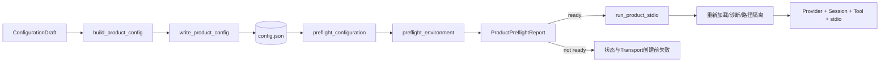

`ProductPreflightReport`是诊断事实而不是授权票据。产品入口根据报告提前阻断，`run_product_stdio`随后仍重新读取配置、
解析Workspace和State并构造运行组件，以消除把瞬时报告当成可复用授权的TOCTOU旁路。

### 43.5.2 合同与文件边界

| 文件 | 关键符号 | 职责 |
|---|---|---|
| [`product_contracts.py`](../../src/harnessix/product_config/product_contracts.py) | `ConfigurationDraft`、`ConfigurationWriteReceipt`、`ProductPreflightCheck/Report` | 把产品就绪合同从基础配置图拆出，保持每个合同严格、冻结、摘要自校验 |
| [`wizard.py`](../../src/harnessix/product_config/wizard.py) | `ConfigurationWriteRequest`、`build_product_config`、`write_product_config` | 只接收Secret引用；新建或显式`replace + expected_source_sha256`事务 |
| [`preflight.py`](../../src/harnessix/product_config/preflight.py) | `ProductPreflightRequest`、`run_product_preflight` | 编排配置与环境检查并生成有序报告 |
| [`preflight_configuration.py`](../../src/harnessix/product_config/preflight_configuration.py) | `inspect_configuration` | 文件、v2合同、Profile、Provider依赖和Secret引用检查 |
| [`preflight_environment.py`](../../src/harnessix/product_config/preflight_environment.py) | `inspect_environment` | 平台、Workspace、State、TUI和Git检查 |
| [`preflight_support.py`](../../src/harnessix/product_config/preflight_support.py) | `PreflightRecorder` | 稳定耗时、排序和路径脱敏指纹 |
| [`errors.py`](../../src/harnessix/product_config/errors.py) | `ProductConfigError` | 为产品调用方提供稳定错误边界，避免其直接依赖Agent内部包 |

### 43.5.3 Writer事务与失败语义

Writer先严格验证操作组合并生成Canonical v2字节，再校验0700父目录、取得0600单字节非阻塞锁、创建同目录临时文件并
`fsync`。新建通过硬链接发布后删除临时名，替换在锁内前后两次核对源字节摘要后调用`os.replace`；提交后同步目录并
重开执行严格解码、Source SHA、Config SHA和领域值核对。提交前失败返回`product_config_write_failed`并保留旧字节；原子
发布后的任意不确定性返回`product_config_commit_unknown`，禁止自动重试。并发测试在第一个Writer持锁且临时文件已同步时启动
第二个Writer，证明只有一个提交，另一个得到可重试`product_config_lock_timeout`。

### 43.5.4 Preflight检查图和数据约束

Required检查包括配置文件、v2合同、Profile、Provider依赖、Secret引用、平台读取端口、Workspace、State及按入口决定的
TUI/Git。前置失败只跳过依赖项，Workspace、TUI和Git等独立检查继续运行。报告仅包含稳定代码、修复动作ID、毫秒耗时、
Config摘要、Profile ID和不可逆Workspace指纹；不包含绝对路径、环境值、API Key、原始异常或Provider响应。Doctor全程只读，
不创建State、Session、Thread或网络请求。

### 43.5.5 实现与验证证据

- [`test_product_contracts.py`](../../tests/product_config/test_product_contracts.py)：Draft/Receipt/Report不变量和摘要防篡改；
- [`test_wizard.py`](../../tests/product_config/test_wizard.py)：新建、显式替换、CAS冲突、锁竞争、双Writer、fsync/replace/重开故障与Canary脱敏；
- [`test_preflight.py`](../../tests/product_config/test_preflight.py)：缺失/损坏/v1、Profile/依赖/Secret、Workspace/State、TUI/Git、异常隔离和报告round-trip；
- [`test_server_and_cli.py`](../../tests/product_config/test_server_and_cli.py)：Server在创建持久状态前预检，进入组件生命周期后再次校验；
- [`tests/product_ui/test_cli.py`](../../tests/product_ui/test_cli.py)：Configure不读取Secret值、Doctor只读、显式替换及Start在TUI加载前失败。

主体实现绑定提交`532e59b346f50657518d11225102bc6999c301e6`，最终验证Revision为
`93723773676349fbfbe0ef42c26d9000cce379c8`。Windows真实Handle、Server/SDK及全矩阵
[CI 34735529084](https://github.com/carrie1988/Harnessix/actions/runs/34735529084)已通过，0.9.1d正式关闭。

## 44. 设计取舍

### 44.1 严格JSON而非灵活配置合并

选择严格JSON可以复用公共Schema、规范摘要和安全解码，减少来源追踪、注释保留、动态表达式和合并优先级攻击面。
代价是手写体验较弱，后续应由受控向导生成配置，而不是削弱运行时合同。

### 44.2 Secret引用而非0600明文文件

文件权限不能阻止Secret进入备份、同步和误提交。配置仅保存引用能缩小静态泄漏面，但Environment Source仍不是强Secret
服务；更高保证需要独立Keychain/KMS Adapter和真实版本证明。

### 44.3 保守Fallback而非最大可用性

从`ResponseStarted`或任意未知事件开始禁止切换，牺牲部分自动恢复率，换取不重复输出、Tool Call和副作用的可证明
边界。Audit失败同样不切换，明确选择安全和可追溯性高于瞬时可用性。

### 44.4 启动末端激活而非加载即激活

活动指针表示“完整组件已经可服务”，而不是“文件已成功解析”。因此Provider、Session、Tool和Agent Runtime均就绪后
才激活。失败前仍可能留下`loaded`事实，用于审计观察而不伪造可运行状态。

### 44.5 同步SQLite而非独立控制面服务

本地优先单实例阶段使用SQLite减少部署依赖，便于事务与恢复测试。代价是事件循环阻塞、容量和共享能力有限；它不应被
直接扩展为大量用户共享的中心数据库。

## 45. 后续演进约束

### 45.1 新Provider Kind

必须同时更新：

1. `ProviderKind`和Provider专属选项不变量；
2. v1/v2兼容和迁移策略；
3. Dependency Finder映射；
4. API Key或新认证类型的Secret生命周期；
5. Factory字段映射；
6. 暴露事件和Fallback错误码合同；
7. Schema、示例、Mock Wire与真实受控Smoke；
8. License、网络、安全和价格证据。

不能只在Factory增加一个`if`分支。

### 45.2 新Secret Source

必须证明：稳定版本身份、值上限、可变副本清理、取消/超时、缓存与轮换、错误脱敏、离线诊断、平台权限、审计最小化和
Provider构造前再次核验。Source配置不得嵌入可执行代码或任意Header。

### 45.3 配置热加载

热加载会改变当前“新进程绑定一个不可变Bundle”的核心假设。正式设计至少需要：Generation、旧Bundle Drain、进行中
Turn绑定、CAS、失败回滚、Secret轮换、审计顺序、双版本资源关闭和跨平台Soak，不得以文件Watch直接替换对象。

### 45.4 Store演进

Schema版本升级必须有显式迁移、备份、失败恢复和旧版本拒绝语义。事件裁剪需要外部锚点或Checkpoint合同，不能删除链首
后继续把剩余数据声明为完整Hash链。

## 46. 文档完成与验收条件

Product Config模块现行设计满足以下条件时可判定DOC-1.4中的本模块文档完成：

- [x] 七个源码文件和六组测试文件均纳入责任与阅读地图；
- [x] v1/v2、Snapshot、Selection、Diagnostic、Receipt和两类Audit字段已解释；
- [x] 配置图、解码、安全读取、诊断、Secret、Factory、Fallback、Store、迁移和启动主链均有图示及文字；
- [x] 失败、取消、超时、并发、幂等、恢复、安全、平台、容量和可观测性边界已说明；
- [x] 源码符号、测试用例、Schema、示例、ADR和研究资料建立链接；
- [x] 当前能力与规划能力严格分离；
- [x] 已确认限制进入优先级表，不把0.8.6纵向切片误称为1.0生产完成；
- [x] 文档相对链接、源码符号、Mermaid、专项测试、Schema和全量`make check`完成本次提交验证；
- [x] 文档中心、总体架构、追踪矩阵、治理状态和路线图同步到DOC-1.4 4/10。

### 46.1 本次验证记录

| 验证项 | 结果 |
|---|---|
| 文档相对链接 | 全仓3,353项，缺失0项 |
| Product Config测试符号 | 37项反向定位，缺失0项 |
| Product Config关键源码符号 | 31项反向定位，缺失0项 |
| Mermaid | 15/15使用本机Mermaid CLI完整渲染 |
| 专项回归 | `tests/product_config`与`tests/app_server/test_server_sdk.py`共72项通过 |
| Schema | `make spec`成功，提交产物无漂移 |
| 全量门禁 | Ruff Format、Ruff、可读性门禁、Mypy通过；Pytest 3,326 passed、13 skipped |

## 47. 变更触发清单

以下变化必须同步更新本文：

1. Product Config版本、字段、限制、排序或摘要算法变化；
2. Profile图展开、能力要求、尝试预算或Fallback错误码变化；
3. 新Provider、Secret Source、认证形式或Header行为；
4. 配置读取、权限、TOCTOU或跨平台路径语义变化；
5. Migration锁、备份、fsync、replace、收据或恢复语义变化；
6. SQLite表、Schema版本、事务、CAS、Hash链或保留策略变化；
7. SafeFallback暴露事件、审计时机、取消或异常处理变化；
8. Provider构造映射、关闭顺序或超时变化；
9. Server启动顺序、Workspace/State隔离、Runtime Owner或stdio开放边界变化；
10. CLI参数、stdout/stderr、退出码和稳定错误码变化；
11. Windows产品支持、安装器、升级或Dogfooding结论变化；
12. Telemetry、审计导出、Smoke或SLO进入默认产品；
13. 相关Schema、示例、ADR、威胁模型或部署手册变化。

## 48. 0.9.1e1 Action合同、能力目录与默认Artifact组合

### 48.1 需求与边界

0.9.1e1解决的是“产品广告什么，Router就必须能以同一绑定执行什么”以及“大结果如何在默认产品中安全分页”两个前置问题。
本切片不读取Action配置文件、不注册Patch/Process，也不改变Product Config v2；新增合同是独立版本面，避免为尚未稳定的高风险
执行配置触发既有模型配置迁移。

### 48.2 组件与字段

| 源码/类型 | 重点字段 | 约束与用途 |
|---|---|---|
| [`action_contracts.py`](../../src/harnessix/product_config/action_contracts.py) `ProductProcessProfile` | `container_engine`、`image`、`program`、`arguments`、`network_mode`、资源上限、`secret_refs` | Engine必须为绝对路径，镜像必须绑定SHA-256，v1网络固定`none`，参数和Secret引用有界、排序、唯一且不含Secret值 |
| 同上 `ProductActionConfigV1` | `workspace_patch_enabled`、`process_profiles`、`config_sha256` | Patch功能门和固定Profile形成独立规范摘要；Profile按ID排序且唯一 |
| 同上 `ProductActionCapabilityEvidence` | `status`、`reason_code`、`binding_digest`、`executor_evidence_digest`、`expires_at` | `verified`必须同时持有两个摘要，`omitted`不得持有；有效期最多600秒 |
| 同上 `ProductActionCapabilityReport` | `config_sha256`、`capabilities`、`created_at`、`report_sha256` | 报告绑定精确Action配置并按能力ID排序唯一；创建时间必须落在每项证据有效区间内 |
| [`action_catalog.py`](../../src/harnessix/product_config/action_catalog.py) `ProductActionCatalog` | `report`、`entries`、派生Descriptors | Verified集合必须与Entry集合精确相等；Schema、Tool Fingerprint、Binding和Evidence逐项闭合 |

四份合同由[`generate_specs.py`](../../scripts/generate_specs.py)生成并提交到[`spec`](../../spec/)；严格往返、摘要防篡改、
非法Profile、诚实省略和目录漂移分别由[`test_action_contracts.py`](../../tests/product_config/test_action_contracts.py)与
[`test_action_catalog.py`](../../tests/product_config/test_action_catalog.py)覆盖。

### 48.3 目录构造与安装时序

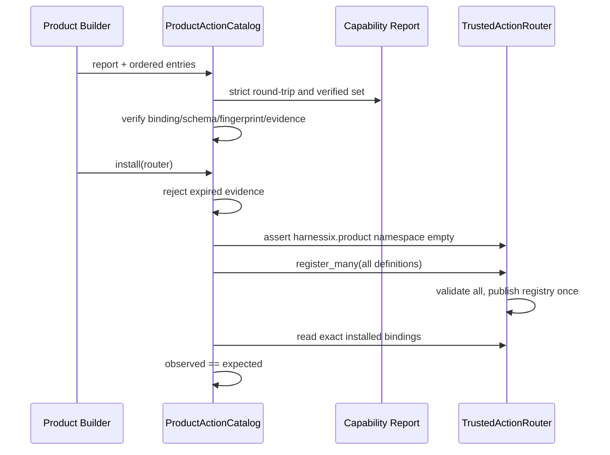

`ProductActionCatalog`属于产品组合层，因此放在`product_config`并单向依赖通用Router；若下沉到`trusted_actions`，会让领域路由
反向依赖产品配置并制造依赖环。`definitions()`返回深复制的模型描述，调用者不能通过修改返回值改变目录内部事实。

### 48.4 默认Artifact所有权

[`run_product_stdio`](../../src/harnessix/product_config/server.py)在Session初始化后创建唯一`SQLiteArtifactStore`，并把同一实例注入
`CodingToolRuntime`、`AgentRuntime`和`ScopedProtocolArtifactReader`。产品只有在这三个消费者均构造成功后才激活配置并开放stdio。
初始化能力因此真实包含`artifact/read`与`artifactPages=true`，正文读取仍需重新验证Thread、Workspace Scope、Artifact摘要及Session
反向引用，客户端不能提交Scope。

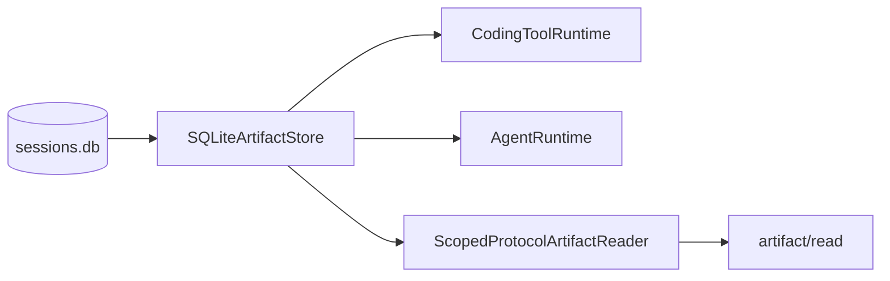

### 48.5 失败、恢复与兼容

- 目录任一Entry无效、重复，任一Verified/Omitted证据过期、报告来自未来，或命名空间被占用时，在公开部分注册前失败关闭；
- `register_many`先验证全集，再一次替换内存注册表，避免半安装；
- Artifact Reader构造失败时stdio不开放，已持久Session/Artifact事实不删除；
- Product Config v2、既有迁移、Provider Fallback和三平台只读合同不变；
- Windows只获得与平台中立的Artifact分页，不获得Patch、Process、Delivery或Git写能力；
- e1完整实施流程、规划崩溃窗口和后续e2～e5边界见[0.9.1e详细设计](../changes/m09-1e-default-trusted-action-composition.md)。

## 49. 默认统一Action产品组合（0.9.1e3～e4）

[`build_product_action_composition`](../../src/harnessix/product_config/action_composition.py)是当前唯一正式产品组合函数。它把
Workspace Patch能力和每个固定Process Profile的探测结果转换为同一份`ProductActionCapabilityReport`、同一个
`ProductActionCatalog`和同一个`RouterBackedAgentActionGateway`。兼容函数`build_workspace_patch_composition`仅保留给e3专项测试，
不再是默认产品组合根。

Patch在POSIX安全文件能力成立时生成`apply_patch_batch`；Windows及缺少`O_DIRECTORY/O_NOFOLLOW/O_CLOEXEC`的平台生成
`omitted/platform_not_supported`。Process按Profile逐项探测，任一Engine、镜像、Owner、Sandbox、资源或Secret证据失败只省略
该Profile，不影响已经验证的Patch或其他Profile。Report和Catalog都按Capability ID稳定排序，并在Router批量注册前断言Verified
集合与Entry集合精确相等。

[`open_default_product_action_runtime`](../../src/harnessix/product_config/action_runtime.py)使用一个`AsyncExitStack`拥有Execution Plan
Store、Action Audit Store、Delivery Store、Workspace Lease Store和可选平台Process Supervisor。只有配置包含Profile时才创建
Supervisor并执行阻塞能力探测；Agent Runtime退出后先关闭Gateway，再关闭Supervisor和Store。`run_product_stdio`在全部组件进入
生命周期后才激活Product Config并开放stdio。

```text
state-root/
├── sessions.db
├── execution-plans.db
├── action-audit.db
├── workspace-leases.db
├── workspace-transactions/
│   ├── transactions.db
│   └── blobs/
└── process-owner/                # 仅配置Process Profile时创建
    ├── process-leases.db
    └── runs/<process-id>/
```

Gateway的规划上下文按Tool选择：Patch使用固定Workspace的`host_guarded`能力；Process使用Verified Owner的
`container_strong` Sandbox、Engine Capability、固定环境及Secret版本。Review Provider也按Tool绑定，只有Patch生成Diff；Process
使用`presentation=process`且不得携带Diff。这个分派关闭了“多Tool Gateway仍把Process交给Patch Review”的组合错误。

## 50. 固定Container Process默认链（0.9.1e4验收中）

Process公共输入限制为固定`profile`和有界`selectors`。宿主在
[`process_profile.py`](../../src/harnessix/product_config/process_profile.py)中重新证明Container Engine文件身份、平台Owner能力、镜像
Repo Digest、无网络只读Sandbox、资源上限及Secret版本；失败返回稳定省略原因，不降级到Host Shell。

[`process_action.py`](../../src/harnessix/product_config/process_action.py)从公共参数确定性派生`ContainerExecutionSpec`，复核Action Route
中的Tool Binding、资源、Workspace、Environment、Sandbox、Capability和Secret Binding，再经`ContainerProcessRuntime`执行。
只有能证明Lease不存在的确定性前置失败才返回`failed/process_preflight_failed`；取消或副作用不可证明先进入`unknown`，恢复只查
Process Ledger并Reconcile，不再次调用`run`。非零退出、超时和输出上限是具有稳定错误码的可证明终态。

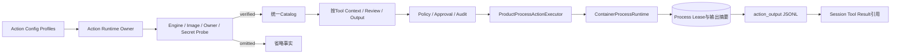

终态正文由Owner按Lease中的stdout/stderr摘要重建，再由
[`action_output_store.py`](../../src/harnessix/artifacts/action_output_store.py)查询优先发布。Router Audit只保存公开摘要Hash和Artifact
SHA-256，Session只保存公共摘要及Artifact引用。Artifact发布再次校验Thread、Turn、Call、Workspace Scope、批准的Process ID和
正文摘要；提交确认丢失时返回原收据，不重复插入或刷新TTL。

`run_product_stdio(action_config=...)`已经持有Profile探测、Definition安装和Supervisor生命周期；缺省配置仍不包含Profile，因此
现有CLI不会在e5安全加载外部Action Config前隐式扩大权限。专项测试覆盖危险Selector、能力证明与省略、前置失败、非零退出、
超时、输出上限、取消后Reconcile不重放、Agent审批、Artifact提交确认丢失及Server目录接线。Linux Container CI还执行
[`test_product_process_profile.py`](../../tests/integration/test_product_process_profile.py)，使用固定Digest镜像验证批准后真实运行、只读
Workspace和输出分页。七任务CI结果回写前，本切片保持验收中。

## 51. 相关文档

- [文档中心](../README.md)
- [总体架构](../architecture.md)
- [源码阅读地图](../guides/source-reading-map.md)
- [0.8产品运行时与扩展详细设计](../m08-product-runtime-and-extensions.md)
- [ADR 0075：Provider Profile、Secret引用与安全Fallback](../adr/0075-provider-profile-secret-and-safe-fallback.md)
- [Provider、Profile、配置与安全Fallback源码研究](../research/provider-profile-config-and-safe-fallback.md)
- [配置参考](../operations/configuration.md)
- [威胁模型](../threat-model.md)
- [测试与评测规范](../testing-and-evals-milestone-history.md#78-086-provider与产品配置候选验收2026-09-09)
- [Model Runtime模块设计](models.md)
- [Secrets模块设计](secrets.md)
- [Workspace模块设计](workspace.md)
- [App Server模块设计](app-server.md)
- [Protocol模块设计](protocol.md)
- [SDK模块设计](sdk.md)


## 52. 变更记录

| 文档版本 | 代码版本 | 日期 | 变更摘要 |
|---:|---|---|---|
| 8 | `030deeb31bb9f2ff64b6ecbd8fd7c98c3419ed86` | 2026-09-19 | 默认产品组合扩展为Patch与固定Container Process共享的单一Catalog/Gateway，增加Supervisor生命周期、按Tool上下文、故障恢复与真实镜像验收接线 |
| 7 | `809ed2b1a10f5cb462989a12dddf44f83a9d01ab` | 2026-09-19 | 登记固定Container Process候选链的能力证明、执行、UNKNOWN、输出Artifact及尚未完成的产品装配和专项测试边界 |
| 6 | `71a479439edcdd29b863ec3a9bad7a52586dd1bf` | 2026-09-13 | 装配默认POSIX Workspace Patch、Action/Delivery/Lease状态Owner、Review Provider及Windows诚实省略 |
| 5 | `82e247a8d083f3f8a7d68ee091a43d59096f298d` | 2026-09-13 | 交付0.9.1e1 Action配置/能力报告、同源目录、默认Artifact所有权与失败关闭边界；[CI 34739842959](https://github.com/carrie1988/Harnessix/actions/runs/34739842959)全矩阵通过 |
| 4 | `93723773676349fbfbe0ef42c26d9000cce379c8` | 2026-09-13 | 记录0.9.1d三平台只读产品链完成全矩阵CI验收 |
