# Product UI终端产品模块设计

## 1. 模块摘要

| 项目 | 内容 |
|---|---|
| 源码包 | [`src/harnessix/product_ui`](../../src/harnessix/product_ui/) |
| 当前职责 | 保存最小客户端恢复元数据；发送前持久分配Command ID；管理Agent SDK连接代际；串行处理类型化Intent；从Snapshot、Replay和Live Delta确定性生成单Thread产品视图；通过Textual提供会话、Plan、Tool、Approval、Question、Diff证据、Usage/Cost未知、Cancel、Steer和错误自助；由`harnessix code`装配本地stdio产品链 |
| 非职责 | 不实现配置向导与Doctor、自动业务命令重放、Agent状态机、Session数据库、Windows产品级Coding Tool、客户端价格推断或统一Trusted Action默认装配 |
| 上游调用者 | 顶层`harnessix code`入口、Textual事件循环和模块测试 |
| 下游端口 | `AgentTransportFactory → AgentClient → Agent Protocol`、`ClientStateStore → 本地私有文件` |
| 持久化 | `client-state.json`只保存身份、Command序列、选择、Cursor、关闭标志、Revision和摘要；排他锁文件为`.client-state.lock` |
| 平台 | 文件锁和原子替换按macOS/Linux/Windows分支实现；POSIX额外校验Owner与精确权限；Windows行为由CI验证，不以WSL替代 |
| 公共导出 | 包根导出状态合同、Store、投影Reducer、连接、Controller、冻结交互绑定/证据/Intent、纯交互投影和稳定错误帮助；Textual App与Screen从具体模块导入以保持可选依赖隔离 |
| 当前完成度 | 0.9.1a、0.9.1b与0.9.1c已通过三平台CI并关闭；Doctor、Windows产品工具链和默认Action装配仍未实现 |
| 代码版本 | `684a17ecc013549e3472978f1c0e8c1eca4db92e`；0.9.1c实现提交，测试同步提交为`84ffd595989d682c792d615e3815cf5877c0a419` |

本模块是终端表现层与Agent Protocol之间的**可恢复客户端应用层**。Agent Session和Protocol Request Ledger仍是
领域事实源；客户端文件不是Session副本，内存投影也不能反向修改Agent状态。

## 2. 需求背景、设计目标与非目标

### 2.1 需求背景

现有薄CLI直接持有进程内`client_instance_id`、Thread选择和Replay Cursor。进程退出或stdio断开后，如果客户端
重新生成身份或Command ID，服务端无法把重放识别为原命令；如果从已保存Cursor恢复但本地没有Transcript正文，
则界面只得到Cursor之后的增量，历史消息永久缺失。并发启动两个客户端还可能同时消费同一个Command序列。

生产客户端因此必须同时解决六个问题：

1. **稳定身份**：同一状态目录跨进程保持Client Instance ID和单调Command序列；
2. **提交顺序**：Command ID必须先原子落盘，再允许写入Transport；
3. **完整恢复**：冷启动从Cursor 0重建全文，只有同进程仍持有完整投影时才允许暖续传；
4. **临时与权威分离**：Live Delta只优化显示，持久`item_finished`始终覆盖临时文本。
5. **单写者并发**：Widget、轮询和按键不能并发操作同一个Transport或重复提交同一Intent；
6. **有界关闭**：退出先停止接收Intent，再排空或明确标记未知，不能把取消等待误当作领域命令失败；
7. **交互身份**：Approval、Question、Cancel和Steer必须逐字段绑定当前Thread/Turn及领域请求；
8. **证据完整性**：需要Diff Artifact的批准必须验证分页、引用、记录、字节数和SHA-256，失败时禁止盲批。

### 2.2 当前设计目标

- Client State采用严格版本、未知字段拒绝、规范摘要、大小和集合上限；
- 单个状态目录仅允许一个进程写入，进程内变更也串行；
- 每次变更前重读并验证磁盘文件，外部篡改不会被内存旧值覆盖；
- 临时文件与目标同目录，完成文件`fsync → replace → directory fsync`后才返回；
- Command序列分配失败时不返回ID，成功返回的ID一定已经消费且永不回退；
- Agent连接每次完整握手形成新Generation，半握手和协议损坏进入`BROKEN`；
- Projection Reducer无I/O、时钟和随机数，相同输入逐字段相等；
- Replay游标回退、近期事件身份冲突、Item事件类型/状态不一致、终态Item冲突和Delta身份漂移均失败关闭。
- Controller由单个Actor拥有全部Session I/O，Intent队列和状态更新队列均有固定上限；
- Textual Widget只派发类型化Intent并渲染不可变快照，不直接操作SDK、Store或Transport；
- `harnessix code`固定Workspace、配置、客户端状态根和子进程Runtime状态根，缺少TUI依赖时不联网安装。
- Approval/Question/Cancel/Steer仅通过冻结Intent进入Controller；Modal关闭不产生协议命令；
- Artifact只读查询不消费Command ID，副作用决定在校验成功后恰好消费一个ID；
- Token可见但协议没有价格绑定时费用明确显示未知，不能推断为零。

### 2.3 明确非目标

- 不保存Transcript、Diff、Prompt、Approval/Question答案、Provider正文或Secret；
- 不依据`clean_shutdown=false`猜测领域命令成功或失败；
- 不自动清理第1001个Thread Cursor；只有上层验证Thread已归档后才能调用显式遗忘；
- 不自动重放发生歧义的业务命令；显式Reconnect只重建连接并从持久事实恢复；
- 不把Client Instance ID当作认证身份；
- 不修改Agent Protocol v1、Server Session Schema或Protocol Request Ledger；
- 不保存Approval Evidence、Question Answer、Steer正文或错误原文；进程重开后从持久事实重新推导；
- 不从Provider名、模型名或内部账本推断金额；
- 不宣称0.9.1或Windows产品支持已经完成。

## 3. 模块上下文、总体架构与信任边界

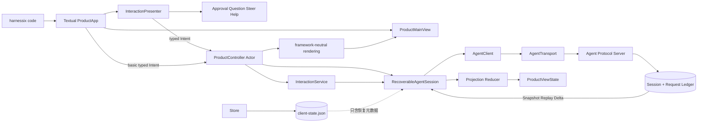

**边界说明：**

- `product_ui`可依赖公共`protocol`合同和`sdk`端口，不能导入App Server、Agent Runtime或Session Store实现；
- `RecoverableAgentSession`拥有一个当前`AgentClient`和多个同进程Thread投影，但不拥有服务端领域事实；
- `ClientStateStore`只接受产品边界已经规范化的Workspace身份并保存其版本化SHA-256，不自行解释平台路径；
- `ProjectionReducer`只接收已由SDK校验的`ThreadView`、`EventsReplayResult`和`PublicItemDelta`；
- Textual Widget只能发送类型化Intent，不能直接分配Command ID、推进Cursor或调用Transport；
- `ProductController`是Session I/O和Workspace级产品状态的唯一异步所有者；View退出不等于Turn取消；
- `InteractionService`校验当前不可变投影、完整交互身份和Approval Evidence后才准备命令；Artifact读取使用
  `execute_query`，不占用Command序列；
- `InteractionPresenter`和四类Screen只能返回本地值或派发Intent，禁止持有SDK、Transport、Store或Agent私有模型；
- `ProductMainView`只渲染快照和调整Composer；拆卸后拒绝迟到状态，防止Textual生命周期竞态；
- CLI只负责参数、安全默认目录和组合根；实际stdio子进程继续由`agent-server`执行正式配置和Runtime装配。

## 4. 包结构与源码阅读顺序

| 顺序 | 文件 | 关键符号 | 阅读目的 |
|---:|---|---|---|
| 1 | [`errors.py`](../../src/harnessix/product_ui/errors.py) | `ProductUIError` | 理解产品层稳定错误码及不可信正文隔离 |
| 2 | [`contracts.py`](../../src/harnessix/product_ui/contracts.py) | `ClientStateV1`、`ClientThreadCursor`、`ClientCommandAllocation` | 理解持久字段、摘要、上限和Command命名 |
| 3 | [`state_file.py`](../../src/harnessix/product_ui/state_file.py) | `open_state_lock`、`read_state_file`、`write_state_file` | 理解目录/文件安全、排他锁和原子替换 |
| 4 | [`state_store.py`](../../src/harnessix/product_ui/state_store.py) | `ClientStateStore` | 理解变更前重读、Command分配、选择和单调Cursor |
| 5 | [`projection.py`](../../src/harnessix/product_ui/projection.py) | `ProductViewState`、`apply_replay_page`、`apply_item_delta` | 理解冷暖视图、Replay幂等和Delta覆盖 |
| 6 | [`session.py`](../../src/harnessix/product_ui/session.py) | `ConnectionPhase`、`PreparedClientCommand`、`RecoverableAgentSession` | 理解连接代际、Hydration和同ID显式重放 |
| 7 | [`interactions.py`](../../src/harnessix/product_ui/interactions.py) | `ApprovalBinding`、`PendingQuestion`、`ApprovalEvidence`、`interaction_snapshot` | 理解领域身份、交互派生、状态白名单和费用未知语义 |
| 8 | [`interaction_service.py`](../../src/harnessix/product_ui/interaction_service.py) | `InteractionService`、`_read_artifact` | 理解Artifact完整性、发送前复核和Prepared Command边界 |
| 9 | [`controller.py`](../../src/harnessix/product_ui/controller.py) | `ProductController`、十类Intent、`CloseReport` | 理解单Actor、队列背压、交互分派、轮询和关闭结算 |
| 10 | [`rendering.py`](../../src/harnessix/product_ui/rendering.py) | `TranscriptLine`、`transcript_lines`、`thread_label` | 理解Plan、Tool、持久正文、临时流和终端标记隔离 |
| 11 | [`error_help.py`](../../src/harnessix/product_ui/error_help.py) | `ProductErrorHelp`、`product_error_help` | 理解稳定错误目录和未知码脱敏回退 |
| 12 | [`main_view.py`](../../src/harnessix/product_ui/main_view.py) | `ProductMainView` | 理解基础Widget、Usage/Cost状态及Composer门禁 |
| 13 | [`interaction_screens.py`](../../src/harnessix/product_ui/interaction_screens.py) | 四类Screen | 理解审批、问题、Steer和帮助Modal的本地返回合同 |
| 14 | [`interaction_presenter.py`](../../src/harnessix/product_ui/interaction_presenter.py) | `InteractionPresenter` | 理解Modal与Controller Intent之间的唯一适配 |
| 15 | [`app.py`](../../src/harnessix/product_ui/app.py) | `ProductApp`、`ControllerUpdated` | 理解Textual焦点、快捷键、Worker和View生命周期 |
| 16 | [`cli.py`](../../src/harnessix/product_ui/cli.py) | `code_main`、`_server_command` | 理解状态目录布局、可选依赖和stdio组合根 |
| 17 | [`agent_client.py`](../../src/harnessix/sdk/agent_client.py) | `AgentClient._send`、`initialize`、`read_artifact` | 对照SDK握手、交互方法和协商Limit门禁 |
| 18 | [`test_controller_interactions.py`](../../tests/product_ui/test_controller_interactions.py) | 真实协议领域纵向场景 | 验证身份复核、Command分配和Turn终态 |
| 19 | [`test_app_interactions.py`](../../tests/product_ui/test_app_interactions.py) | `App.run_test()`交互场景 | 验证Modal、Escape、陈旧交互、Cancel/Steer/Quit分离 |
| 20 | [`test_stdio_product.py`](../../tests/product_ui/test_stdio_product.py) | 真实JSONL子进程恢复 | 验证跨进程冷Replay、Transcript恢复和Command单调性 |

## 5. 核心生命周期与状态机

### 5.1 Client State Store生命周期

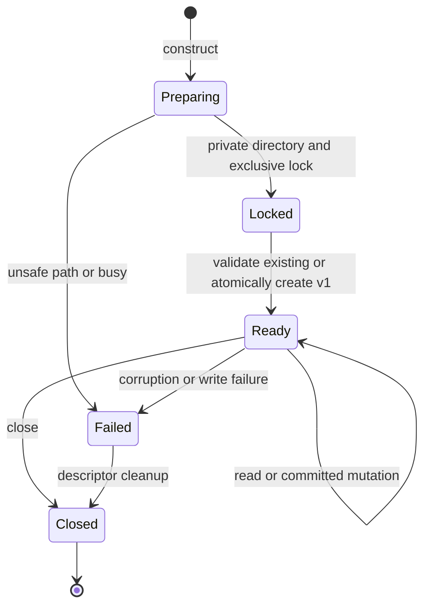

Store构造成功后一直持有`.client-state.lock`描述符，直到`close`。锁只解决协作进程并发；每次操作还使用
`threading.RLock`保护同一对象的线程并发。`close`幂等，关闭后的全部读取和变更返回`client_state_closed`。

### 5.2 Agent连接代际

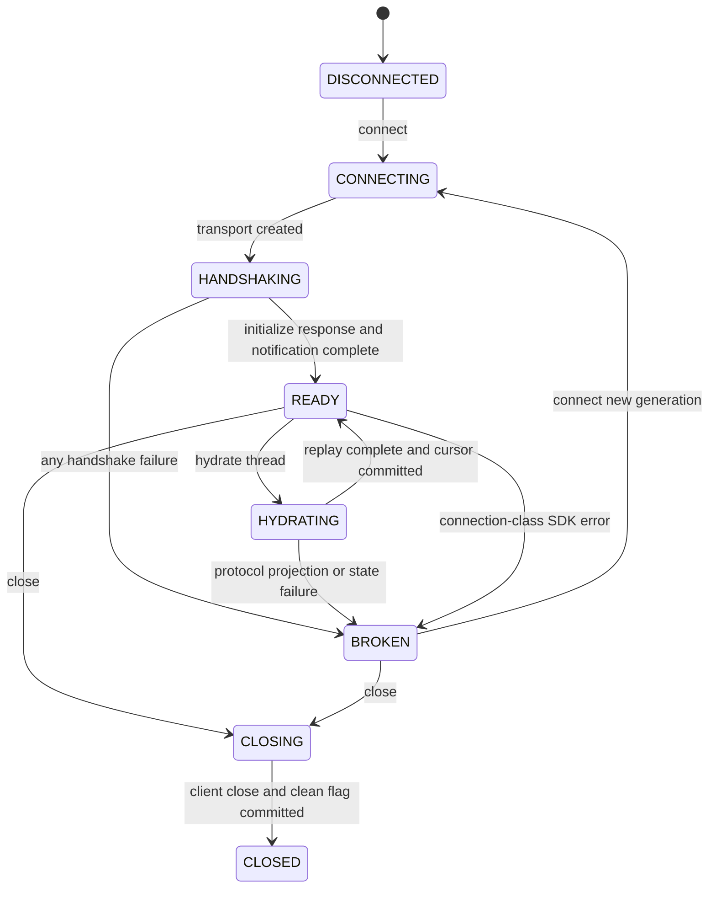

每次`connect`先关闭旧Client，再递增Generation并完整握手。`invalid_response`、`server_closed`、
`server_start_failed`和`handshake_failed`会使当前代际进入`BROKEN`。旧Client不再由Session引用，因此其结果不能
结算新代际操作。

### 5.3 Command身份生命周期

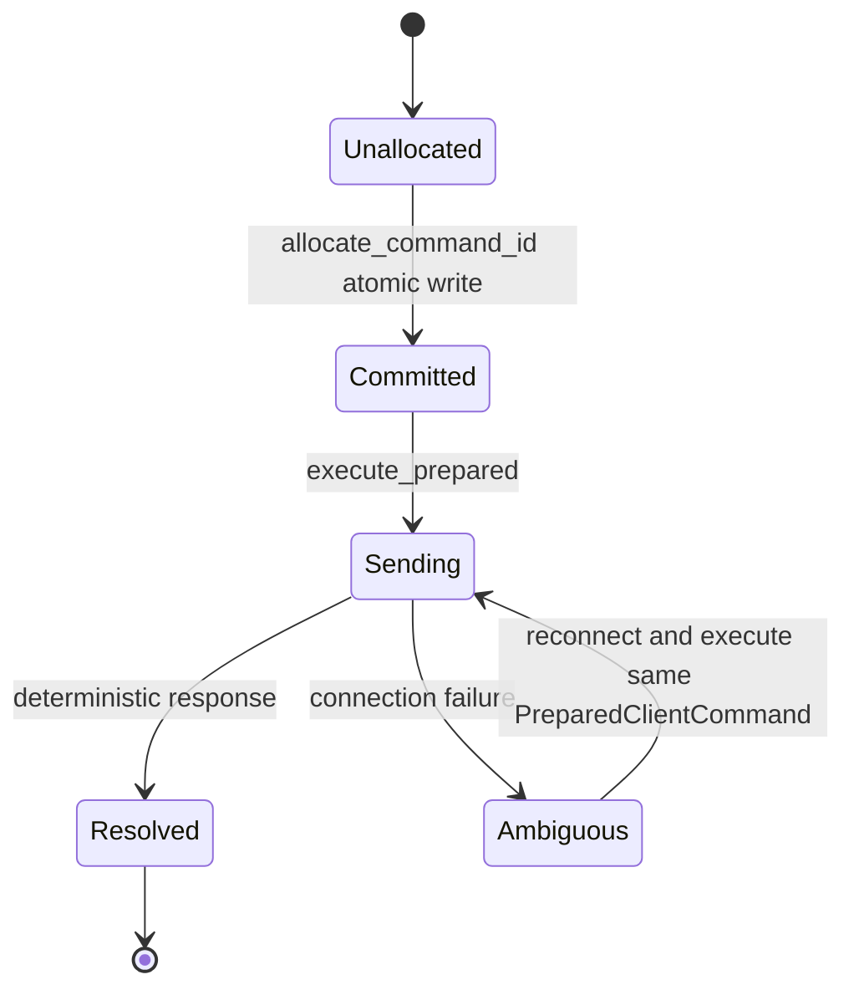

`PreparedClientCommand`不保存Prompt或业务参数，只绑定客户端身份、序列、Request ID和分配时Revision。
结果不明确时调用方保留同一对象；Session不会在重放路径重新调用`allocate_command_id`。业务Payload是否漂移最终仍由
服务端Protocol Request Ledger的同ID同Payload规则校验。

### 5.4 Product Controller生命周期

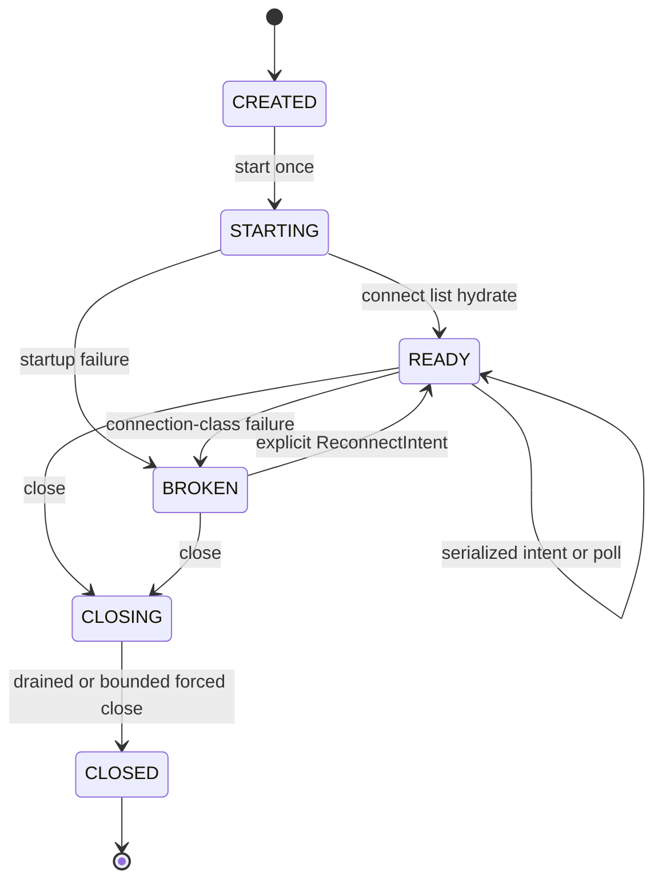

`ProductController`在`start`完成前不接收Intent；成功后创建唯一Actor Task。Intent队列最多64项，队列满返回
`controller_busy`且不会分配Command ID。更新队列最多保留一份最新不可变快照，慢View不会使Actor无界积压。
活动Turn每100毫秒拉取一次，空闲态每1秒拉取一次；轮询仍在Actor中执行，因此不会与用户Intent并发访问Session。
Thread列表逐页读取，每页最多200项，总量上限1000项，并检测重复分页Cursor。

关闭先将`_accepting`置为假，再把Stop标记排到已经接纳的Intent之后。正常路径排空队列并关闭Session；达到1～30秒
调用方指定时限后取消Actor，把当前及剩余Intent完成为`controller_operation_unknown`，并返回非Clean的
`CloseReport`。已经分配的Command序列保持消费，重复`close`返回同一报告。

### 5.5 Approval Evidence生命周期

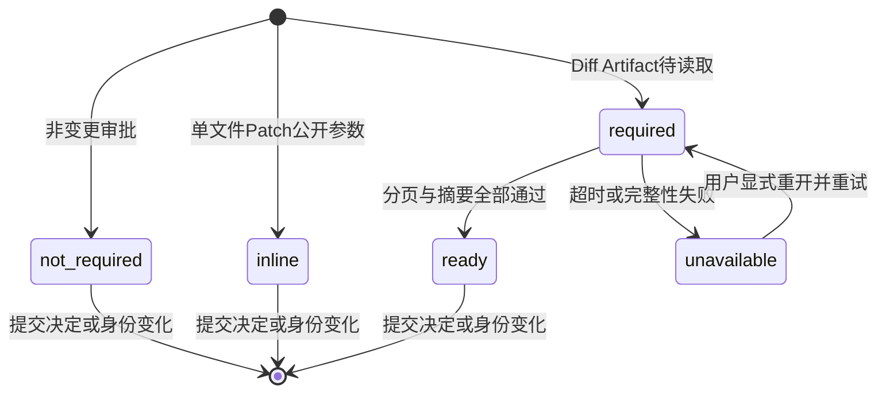

`ApprovalEvidence`只存在于Controller不可变快照。Thread、Turn、Call、Approval ID或Fingerprint任一变化都会通过
`retained_approval_evidence`清除证据。`unavailable`不会自动拒绝领域请求，但批准按钮关闭，拒绝和重新读取仍可用。

## 6. 正常流程、失败恢复时序与数据流

### 6.1 首次初始化与原子Command分配

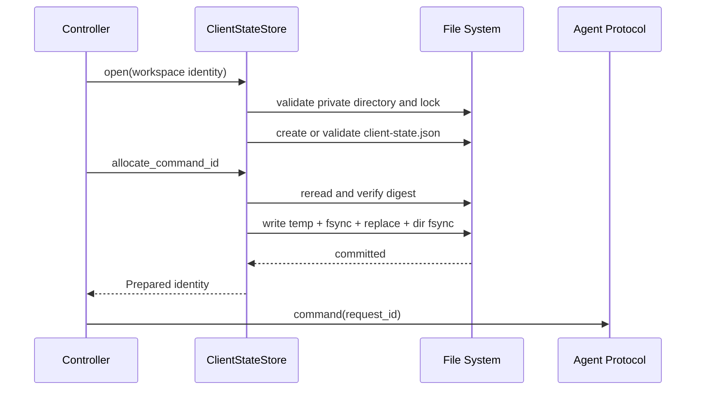

文件替换失败时临时文件被清理，旧目标仍保存原`next_command_sequence`，调用方不会收到尚未提交的ID。替换已经成功
但目录同步失败时返回`client_state_write_failed`；此时磁盘可能为新版本，后续必须重读，而不能回退内存序列。
专项故障注入覆盖该不确定窗口：重新读取后若序列已经前进，下一次分配必须从新序列继续，不得复用未返回的ID。

### 6.2 冷启动与暖重连Hydration

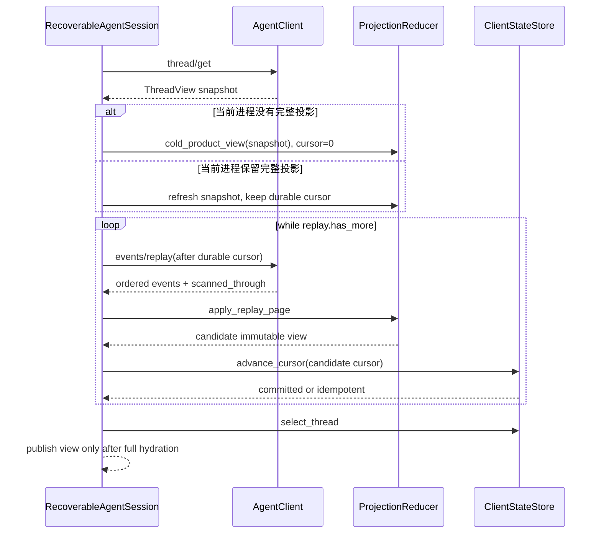

冷启动无论Client State记录了多大Cursor都从0开始，因为状态文件不含历史Item。保存Cursor的作用是记录最后确认位置、
检测回退并支持同一进程暖重连，不是Transcript快照。Replay声明`has_more`却不推进扫描位置时返回
`projection_replay_stalled`；最终位置未覆盖`ThreadView.cursor`时返回`projection_replay_incomplete`。

### 6.3 Replay与Live Delta合并

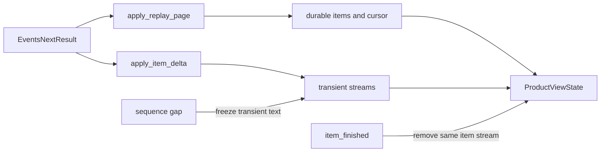

持久Event Cursor可以因服务端过滤私有事件而不连续，`scanned_through`才是下一页起点。最近256个
`cursor → event_id`检查点用于发现重叠页中同Cursor不同Event的服务端冲突；更旧重复事件只跳过，不保留无界集合。
Delta要求从1开始且逐一递增；缺口后不再拼接后续片段，等待持久Item提供完整正文。
Item事件必须携带Turn ID；`item_started`只接受`status=started`，`item_finished`只接受终态状态。缺少身份或
事件类型与Item状态不一致时以`projection_event_invalid`失败关闭。`turn_started`对应领域Reducer创建Turn时的
持久`accepted`状态，不能伪造尚未发生的`running`状态。

### 6.4 TUI启动、提交与跨进程恢复

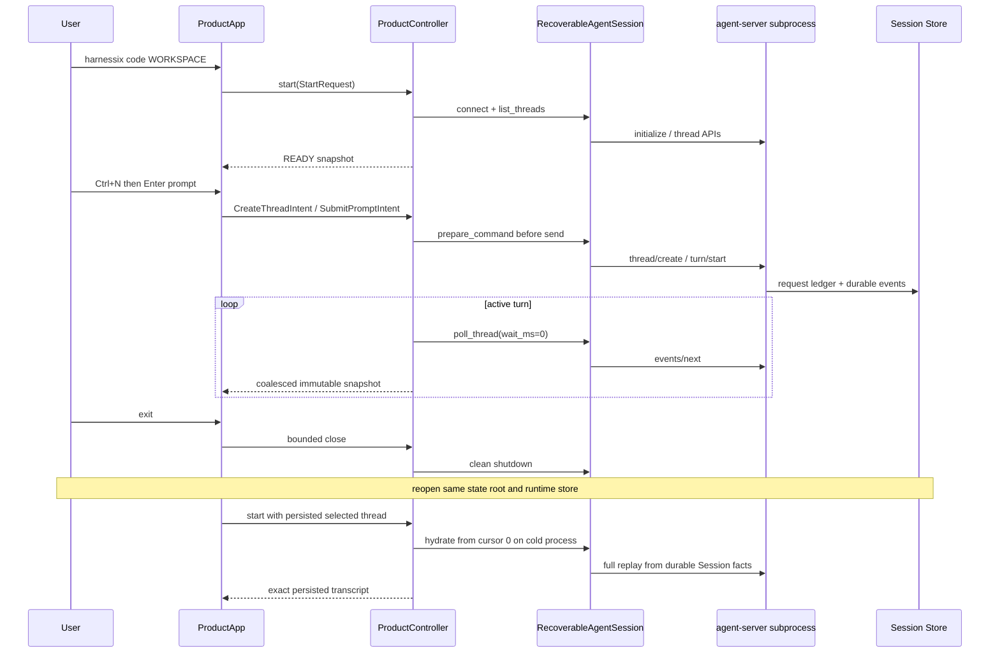

`ProductApp`清空Composer后只启动一个`local-intent-waiter`组Worker；`_intent_in_flight`期间Composer禁用，连续Enter不会
形成重复Intent。View收到Revision不大于已渲染Revision的快照时完全忽略，避免迟到STARTING/BROKEN快照回退Composer或
会话视图。由于`_intent_in_flight`是View本地门闩而不是Controller Revision的一部分，Worker结算后即使快照已由Watcher
渲染，`_dispatch`也必须再次调用`_update_composer`；否则相同Revision的短路会让Composer永久保持禁用。关闭阶段的
`_closing`同样进入禁用条件，避免退出过程中重新开放输入。会话列表仅展示Thread ID短前缀、Turn状态和轮数，不展示
Workspace路径。所有不可信文本均关闭Textual markup解析。

### 6.5 Approval与Diff证据

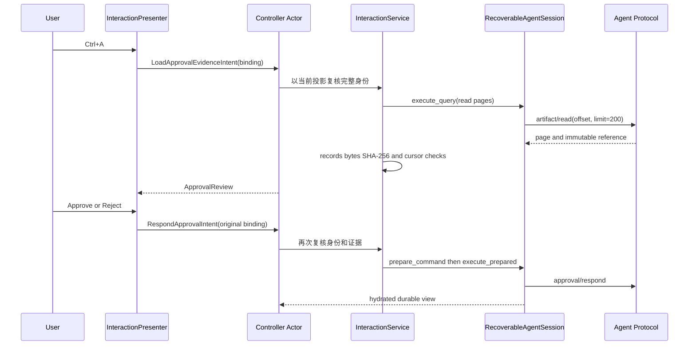

Artifact完整读取最多50页、每页200条并受5秒绝对时限约束。任何引用变化、游标停滞、换行、记录数、字节数或摘要
不一致都会形成稳定`UNAVAILABLE`证据，且在`prepare_command`之前返回。单文件Patch使用同一公开Tool Call的完整参数作为
Inline证据；Batch Patch没有Artifact时失败关闭。Escape只关闭Modal，不分配Command ID。

### 6.6 Question、Steer、Cancel与Quit

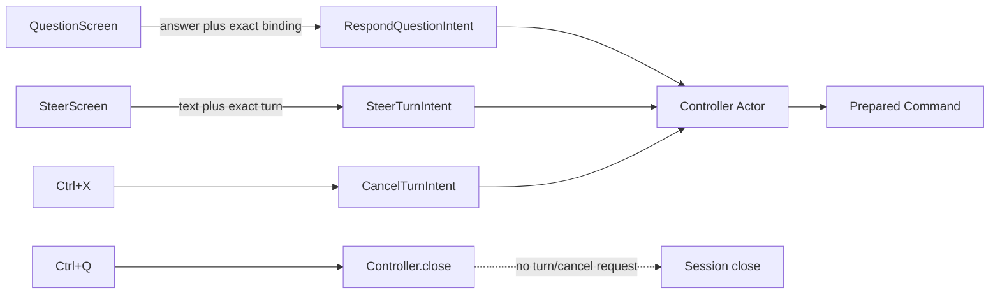

Question数字输入只在Screen内映射为对应选项正文，自由文本仍按1～4000字符校验。Steer使用协议文本上限，Cancel与
Steer按Runtime显式状态白名单启用。Modal打开后如果当前Turn或交互身份变化，原绑定以`question_stale`或
`turn_control_stale`失败且不消费Command ID。退出只关闭客户端连接，不发送`turn/cancel`。

## 7. 接口设计

### 7.1 `ClientStateStore`

| 方法 | 输入/输出 | 顺序与幂等 | 失败语义 |
|---|---|---|---|
| `state()` | 返回完整`ClientStateV1` | 每次重读磁盘；无写入 | 关闭、缺失、损坏、权限或Workspace错配 |
| `allocate_command_id()` | 返回`ClientCommandAllocation` | 先递增并提交`next_command_sequence`；每次成功唯一 | 写失败不返回；序列耗尽失败 |
| `select_thread(id)` | 返回更新后状态 | 相同选择幂等且不增Revision | 非UUID失败 |
| `advance_cursor(id,cursor)` | 返回更新后状态 | 只允许单调增加；相等或更小幂等 | 新Thread超过1000条时失败，不自动驱逐 |
| `forget_thread_cursor(id)` | 返回更新后状态 | 不存在时幂等 | 调用方必须先验证Thread已归档 |
| `set_clean_shutdown(bool)` | 返回更新后状态 | 相同值幂等 | 非严格布尔失败 |
| `close()` | 无返回 | 幂等释放进程锁 | 关闭后操作拒绝 |

### 7.2 Projection纯函数

| 函数 | 输入 | 输出 | 不变量 |
|---|---|---|---|
| `cold_product_view` | `ThreadView` | 空Transcript、Cursor 0的视图 | 不使用Snapshot cursor跳过历史 |
| `refresh_thread_snapshot` | 现有视图、新Snapshot | 保留Item/Stream/Cursor的视图 | Thread相同且Snapshot cursor不回退 |
| `apply_replay_page` | 视图、Replay页 | 原子新视图 | 跨Thread、Cursor回退、近期Event冲突失败 |
| `apply_item_delta` | 视图、一个Delta | 临时流更新 | 序列逐一追加；终态Item后忽略Delta |
| `apply_events_next` | 视图、Next结果 | Replay后Delta的新视图 | 只有Replay推进持久Cursor |

### 7.3 `RecoverableAgentSession`

| 方法 | 前置条件 | 结果 | 取消/超时 |
|---|---|---|---|
| `connect()` | Store开放、Session未关闭 | 新Generation完成握手并进入READY | 复用SDK/Transport超时；失败代际BROKEN |
| `prepare_command()` | 当前连接READY | 已持久化`PreparedClientCommand` | 同步原子事务，无Transport I/O |
| `execute_prepared()` | READY且Command属于当前客户端 | 调用类型化SDK操作 | 不自动生成新ID；连接错误标记BROKEN |
| `execute_query()` | READY | 在同一Operation Lock内执行不消费Command ID的只读查询 | 连接类错误标记BROKEN；业务查询错误保留READY |
| `hydrate_thread()` | READY、Thread存在 | 完整冷/暖投影并选择Thread | 当前实现由SDK调用者提供外层超时 |
| `poll_thread()` | READY且已经Hydrate | 一页Replay/Delta结果 | `events/next`最多使用协议允许的30秒 |
| `close()` | 任意非CLOSED状态 | 关闭Client、提交安全关闭标志 | 失败保留BROKEN且不伪造安全关闭 |

Session另有两个只读/幂等边界：`list_threads_page(cursor, limit)`在当前代际读取一页未归档Thread；
`resume_thread(thread_id)`恢复服务端Runtime驱动。二者都受同一`_operation_lock`保护，连接类错误会把Session标为
`BROKEN`。`client_state()`返回重新校验的快照，`clear_selected_thread()`只清除已被Controller证明无效的选择。

### 7.4 `ProductController`

| 方法 | 输入/输出 | 所有权与顺序 | 失败/取消语义 |
|---|---|---|---|
| `start(request)` | `StartRequest → ProductControllerState` | 只允许一次；规范Workspace、连接、分页列举并恢复显式或持久选择 | 启动失败发布`BROKEN`快照并抛稳定错误 |
| `dispatch(intent)` | 十类封闭Intent，无业务结果正文 | `put_nowait`进入64项Actor队列；Actor串行执行 | 调用者取消只停止等待，`shield`保护已接纳Intent |
| `next_update()` | 下一份`ProductControllerState` | 更新队列大小1，较旧未消费快照被最新状态覆盖 | 不保证每个中间Revision都送达，但状态事实不丢失 |
| `close(deadline_seconds)` | `CloseReport` | 停止接收、排空、关闭Session；重复调用幂等 | 超时标记未知并消费已分配身份，不误报业务失败 |

基础Intent为`CreateThreadIntent`、`SelectThreadIntent`、`SubmitPromptIntent`、`RefreshThreadsIntent`和
`ReconnectIntent`；领域交互Intent为`LoadApprovalEvidenceIntent`、`RespondApprovalIntent`、
`RespondQuestionIntent`、`CancelTurnIntent`和`SteerTurnIntent`。Controller处理交互后重新读取Thread列表并Hydrate当前
Thread；任何发送前校验错误只发布稳定Notice，不生成通用字典命令。

### 7.5 领域交互合同与服务

| 合同/函数 | 关键字段或输入 | 约束与结果 |
|---|---|---|
| `TurnBinding` | `thread_id`、`turn_id` | Cancel/Steer必须与当前Turn逐字段相等 |
| `ApprovalBinding` | Turn字段、`call_id`、`approval_id`、`fingerprint` | Approval提交前复核五项身份，不重新计算Fingerprint |
| `QuestionBinding` | Turn字段、`call_id`、`question_id` | 已回答、错Call或新Turn全部拒绝 |
| `ApprovalEvidence` | binding、status、artifact、text、sha256、records、error | 仅内存；批准准入只接受`not_required/inline/ready` |
| `UsageCostView` | input/output/total/max token、cost status/reason | 费用固定`unknown/price_not_exposed` |
| `pending_approval` | 当前`ProductViewState` | 只接受唯一未决请求及唯一配对Tool Call，歧义失败关闭 |
| `pending_question` | 当前`ProductViewState` | 过滤已回答请求后必须唯一，歧义失败关闭 |
| `active_turn_control` | 当前Turn状态 | 按显式Cancel/Steer白名单生成能力 |
| `InteractionService` | 当前视图、Evidence、冻结Intent | 先校验、后分配；Artifact读取走只读Query |

`InteractionPresenter`每次读取Controller最新快照并保存打开Modal时的原绑定；Screen只返回值。提交时Controller不信任
Presenter缓存，而由`InteractionService`重新推导当前事实。这样，外部Replay在Modal打开期间改变状态时，旧输入不能
命中新请求。

### 7.6 框架中立渲染

`transcript_lines(ProductViewState | None)`把持久Item按首次Cursor顺序转换为`TranscriptLine`，然后附加尚未被
终态Item覆盖的临时流。Plan逐步显示状态和描述；Tool Call显示名称、版本、effect class、审批要求和Item生命周期；
Tool Result显示Outcome、稳定错误及Diff Artifact可用性。Gap使用固定提示替代不完整正文；未知内容只显示
“上下文已压缩”。`thread_label(ThreadView)`不接收Workspace，因此从类型边界上避免把绝对路径写入列表。

### 7.7 `ProductApp`与`harnessix code`

`ProductApp(App[CloseReport])`拥有Textual生命周期，`ProductMainView`包含Session Picker、`RichLog` Transcript、状态行和
单行Composer。快捷键为`Ctrl+N`新建、`Ctrl+R`重连、`Ctrl+A`审批、`Ctrl+U`回答、`Ctrl+X`取消Turn、`Ctrl+S`补充
Turn、`F1`错误帮助和`Ctrl+Q`有界关闭。退出TUI不会发送`turn/cancel`；Textual拆卸后主视图拒绝迟到快照，避免访问
已经卸载的子Widget。

```text
harnessix code [WORKSPACE] [--config PATH] [--profile ID]
    [--state-directory PATH] [--resume THREAD_ID] [--git-executable PATH]
```

CLI通过当前Python解释器启动`python -m harnessix agent-server`，不依赖PATH中另一个Harnessix版本。Textual在进入
`code_main`后延迟导入；基础安装缺少依赖时返回`{"code":"tui_dependency_missing",...}`并退出2，不动态下载。
参数解析前或启动前错误输出为单行、排序、有界JSON，不包含路径、argv、stderr或异常正文。

## 8. 数据结构、重点字段与持久化格式

### 8.1 `ClientStateV1`

| 字段 | 类型/上限 | 来源 | 语义 | 敏感与持久化 |
|---|---|---|---|---|
| `spec_version` | 固定`harnessix.client-state/v1` | 合同 | 未知版本返回`client_state_version` | 持久、公开 |
| `client_instance_id` | UUID | 首次初始化随机生成 | Protocol Command幂等命名空间，不是认证身份 | 持久、内部 |
| `workspace_fingerprint` | 64位小写十六进制 | 版本前缀与规范Workspace身份SHA-256 | 防止状态目录误绑定；不证明Workspace内容 | 持久，不保存路径原文 |
| `next_command_sequence` | `1..2^53-1` | Store递增 | 下一个可分配序列；成功分配后立即加一 | 持久、关键 |
| `selected_thread_id` | UUID或空 | 用户选择 | 启动候选，仍须服务端校验 | 持久、用户元数据 |
| `thread_cursors` | 排序唯一Tuple，最多1000 | Replay `scanned_through` | 最近确认的持久扫描位置；不能替代冷启动正文 | 持久、用户元数据 |
| `clean_shutdown` | 严格布尔 | Session生命周期 | 诊断上次是否按序关闭，不推断领域结果 | 持久、诊断 |
| `state_revision` | `1..2^53-1` | 每次有效变更加一 | 本地状态提交版本；幂等无变化不递增 | 持久、关键 |
| `digest` | 64位小写十六进制 | 除自身外规范JSON SHA-256 | 检测损坏或非协作写入 | 持久、完整性 |

状态正文最多1 MiB。JSON字段使用Python合同的`snake_case`，未知字段、重复键、无效UTF-8、NaN/Infinity、非严格
整数和摘要不匹配均拒绝。Command ID格式为：

```text
tui-{client_instance_id.hex}-{base36(sequence)}
```

### 8.2 `ProductViewState`

| 字段 | 语义 | 权威来源 | 有界策略 |
|---|---|---|---|
| `thread` | 当前Thread元数据Snapshot | `thread/get` | 单对象 |
| `durable_cursor` | 已原子应用的Replay扫描位置 | `scanned_through` | 单调不回退 |
| `items` | 按首次Cursor稳定排序的持久Item | `item_started/item_finished` | 受Session历史大小约束；虚拟化属于0.9.1b |
| `streams` | 尚未持久完成的临时文本 | `PublicItemDelta` | Protocol单页上限；终态删除 |
| `current_turn` | 当前Turn状态、Budget、Usage和Step | Snapshot与Turn/Usage Event | 单对象 |
| `recent_events` | 近期Cursor和Event ID | Replay事件 | 最多256条 |
| `live_gap` | 服务端报告Live缓冲缺口 | `EventsNextResult.live_gap` | 粘性标志，重新Hydrate后由上层处理 |

### 8.3 文件事务与权限

| 对象 | POSIX约束 | Windows约束 | 通用约束 |
|---|---|---|---|
| 状态目录 | 当前UID、精确`0700` | 必须为真实目录，拒绝Symlink/Junction | 绝对词法路径、私有单实例根 |
| 锁文件 | 当前UID、普通文件、单硬链接、`0600` | 普通文件且至少1字节供`msvcrt.locking` | 生命周期持锁、非阻塞获取 |
| 状态文件 | 当前UID、普通文件、单硬链接、`0600` | 拒绝Symlink/Junction | 打开前后对象身份一致、最大1 MiB |
| 临时文件 | `0600`、`O_EXCL`、`fsync` | 同目录同卷、独占创建 | 随机名、失败清理、原子替换 |

### 8.4 `ProductControllerState`

| 字段 | 类型 | 语义与来源 |
|---|---|---|
| `phase` | `ControllerPhase` | CREATED、STARTING、READY、BROKEN、CLOSING或CLOSED |
| `workspace` | `str | None` | 启动时严格解析的固定目录；只在内存中存在 |
| `connection_generation` | `int` | 当前Session连接代际，用于诊断而非认证 |
| `threads` | `tuple[ThreadView, ...]` | 当前Workspace未归档Thread，按更新时间和ID稳定倒序 |
| `selected_thread_id` | `UUID | None` | 已验证属于当前列表的选择 |
| `thread_view` | `ProductViewState | None` | 当前Thread不可变投影，不复制到Controller持久文件 |
| `approval_evidence` | `ApprovalEvidence | None` | 当前审批的内存证据；完整绑定变化时自动清除 |
| `last_notice` | `ProductNotice | None` | 仅含稳定code、固定message和retryable |
| `revision` | `int` | 每次发布递增，View用其拒绝迟到重绘 |

### 8.5 交互绑定与证据字段

| 字段 | 类型/上限 | 来源 | 安全与持久化语义 |
|---|---|---|---|
| `ApprovalBinding.fingerprint` | 64位小写十六进制 | 公开Approval Item | 完整提交，UI可缩略；不持久化副本 |
| `PendingApproval.arguments_json` | 规范排序JSON | 配对公开Tool Call | 只用于显示和单文件Patch Inline证据，不写Client State |
| `ApprovalEvidence.text` | UTF-8，受Artifact 1 MiB上限 | 完整Artifact或公开参数 | 只在内存，不进入Notice、日志或状态文件 |
| `ApprovalEvidence.error_code` | 稳定码或空 | 查询与完整性分类 | 不含异常正文、路径或Artifact内容 |
| `PendingQuestion.options` | 有序字符串Tuple | 公开Question Item | 数字只在Screen映射为实际文本 |
| `SteerTurnIntent.text` | 1～协议文本上限 | 用户输入 | 仅通过命令发送，不写Client State |

`ApprovalEvidenceStatus`为`not_required`、`inline`、`required`、`ready`、`unavailable`。`required`表示存在完整公开
Artifact引用但尚未读取；`ready`必须同时满足引用逐页相等、记录数、字节数和SHA-256；`unavailable`永远不能批准。

### 8.6 Usage与Cost

`UsageCostView`从当前Turn公开Usage读取`input_tokens`、`output_tokens`和`total_tokens`，从Budget读取`max_tokens`。
协议没有价格适用性、币种或金额字段，因此`cost_status`固定为`unknown`，`cost_reason`固定为
`price_not_exposed`。Token为零表示当前公开累计用量为零，不表示费用为零。

### 8.7 `CloseReport`

| 字段 | 语义 |
|---|---|
| `clean` | Actor与Session是否在同一关闭时限内完成 |
| `processed_intents` | Actor已确定完成的Intent数量 |
| `abandoned_intents` | 关闭时限内无法结算的排队Intent数量，不包含对领域结果的猜测 |
| `error_code` | `controller_close_timeout`、`controller_connection_close_failed`或空 |

## 9. 核心业务逻辑伪代码

### 9.1 状态变更

```text
mutate(operation):
    require store open and lifetime lock held
    current = secure_read_and_validate_file()
    updated = operation(current)
    if updated equals current:
        return current
    updated.state_revision = current.state_revision + 1
    updated.digest = digest(canonical body without digest)
    atomic_write(updated)
    return updated only after replace and directory sync
```

### 9.2 Replay页归并

```text
apply_replay_page(view, page):
    require page.thread_id equals view.thread_id
    require page.scanned_through >= view.durable_cursor
    candidate = view
    for event in page.events ordered by cursor:
        if event.cursor <= old durable cursor:
            if recent checkpoint exists and event_id differs: fail conflict
            continue
        candidate = apply persistent event(candidate, event)
        append bounded recent checkpoint
    candidate.durable_cursor = page.scanned_through
    return candidate
```

### 9.3 连接失败后的同ID重放

```text
prepared = session.prepare_command()  # disk commit happens here
try:
    execute(client, prepared.request_id, immutable business params)
except connection_class_error:
    mark current generation BROKEN
    connect()                         # new transport and full handshake
    execute(client, prepared.request_id, same business params)
```

Session不自动执行最后一步，以免在不知道上层业务参数是否仍相同的情况下盲目重放。服务端Ledger是最终幂等裁决者。

### 9.4 Actor串行与有界关闭

```text
dispatch(intent):
    require accepting and actor alive
    completion = new future
    enqueue without waiting or fail controller_busy
    await shield(completion)

actor_loop:
    wait for next intent using active/idle poll interval
    if timeout: poll selected hydrated thread
    if stop: return
    execute exactly one intent through RecoverableAgentSession
    publish immutable snapshot, then settle completion

close(deadline):
    accepting = false
    enqueue stop after already accepted intents
    await actor within remaining deadline
    if timeout: cancel actor and mark unresolved completions unknown
    close session within same absolute deadline
    publish CLOSED and memoize CloseReport
```

### 9.5 Artifact证据与交互提交

```text
load_approval_evidence(current_view, original_binding):
    pending = derive exactly one pending approval and paired public tool call
    require pending.binding == original_binding
    if no artifact: return inline/not_required/unavailable by approval type
    within one 5-second absolute deadline and one execute_query lock:
        for at most 50 pages with limit 200:
            require page.reference == original reference
            require page.offset == requested offset
            require text is empty or newline terminated
            require next_offset == offset + page_records and progresses
            reject running records/bytes above advertised values
        require final records, UTF-8 bytes and SHA-256 equal reference
    return READY evidence in memory only

submit_interaction(current_view, evidence, original_intent):
    derive current pending interaction/control again
    require exact binding equality
    require input and evidence policy valid
    prepared = session.prepare_command()
    session.execute_prepared(prepared, typed SDK method)
    hydrate thread from durable facts
```

校验、证据准入和输入长度均发生在`prepare_command`之前。命令结果不确定时维持原Prepared Command规则；TUI不会保存
Approval reason、Question answer或Steer正文以便自动重放。

## 10. 失败、恢复、取消与超时

| 故障 | 稳定错误/状态 | 是否修改持久状态 | 恢复方式 |
|---|---|---:|---|
| 状态目录/文件链接、过宽权限、Owner错误 | `client_state_permissions` | 否 | 修复目录后重新打开 |
| 另一个进程持锁 | `client_state_busy`，可重试 | 否 | 关闭旧实例或稍后重试 |
| 未知Schema | `client_state_version` | 否 | 使用支持版本或显式迁移；不覆盖原文件 |
| JSON/字段/摘要损坏 | `client_state_corrupt` | 否 | 隔离后显式重建；服务端事实仍完整 |
| Workspace指纹不同 | `client_state_workspace_mismatch` | 否 | 使用对应状态目录 |
| 原子写失败 | `client_state_write_failed` | 旧或新完整版本 | 重开并重读；不得依据内存猜测 |
| 协商方法缺失或上限超出 | SDK `method_not_negotiated`/`negotiated_limit_exceeded` | 否 | 降级功能或修正请求，不写Transport |
| 半握手/协议帧损坏/EOF | Connection `BROKEN` | `clean_shutdown=false`可能已提交 | 新Generation完整握手 |
| Replay回退/冲突/停滞/不完整 | `projection_*`，Connection `BROKEN` | Cursor不越过成功提交页 | 停止发布视图，重新获取服务端事实 |
| Delta缺口 | Stream `gap=true` | Cursor不变 | 等待持久Replay的`item_finished`覆盖 |
| `execute_prepared`等待者取消 | 原协程取消 | 已分配ID保持消费 | 不生成新ID；按Transport/服务端事实恢复 |
| `events/next`超时 | 协议正常`timed_out=true` | Cursor不变 | 继续下一次轮询 |
| Close失败 | `connection_close_failed`、`BROKEN` | 不提交`clean_shutdown=true` | 运维诊断并重新打开 |
| Intent队列已满 | `controller_busy` | 否 | 等待当前操作完成后重新发起新Intent |
| 无Thread、已有活动Turn或Prompt非法 | `controller_thread_required`/`controller_turn_active`/`controller_prompt_invalid` | 非法Prompt不分配ID | 修正当前选择或输入；不重放 |
| Thread列表超过1000或分页不推进 | `controller_thread_limit`/`controller_pagination_stalled` | 否 | 服务端归档治理或修复分页合同 |
| 调用者取消`dispatch`等待 | 原等待者收到取消 | 已接纳Intent继续由Actor结算 | 从Controller快照和服务端事实观察结果 |
| Controller关闭超时 | `controller_operation_unknown`与`controller_close_timeout` | 已分配序列不回退 | 重启并从持久事实Hydrate，不生成替代结果 |
| Approval/Question/Turn绑定过期 | `approval_stale`/`question_stale`/`turn_control_stale` | 不分配Command ID | 从当前投影重新打开交互 |
| Artifact方法未协商或Diff缺失 | `diff_unavailable` | 不分配Command ID | 只能Reject、重试或升级Server |
| Artifact引用变化或分页停滞 | `artifact_reference_changed`/`artifact_pagination_stalled` | 不分配Command ID | 禁止Approve并重新读取 |
| Artifact记录、字节或SHA不符 | `artifact_integrity_failed` | 不分配Command ID | 禁止Approve并诊断服务端 |
| Artifact读取超过5秒 | `artifact_read_timeout` | 不分配Command ID | 显式重试或Reject |
| 批准缺少完整证据 | `approval_evidence_required` | 不分配Command ID | 先读取完整证据 |
| Question/Steer输入无效 | `question_answer_invalid`/`steering_invalid` | 不分配Command ID | 修正输入后重新提交 |
| Modal Escape | 本地关闭，无错误 | 不修改 | 保持当前领域请求待决 |
| Quit | `CloseReport` | 只提交关闭状态，不发送`turn/cancel` | 下次启动从服务端事实恢复Turn |
| 缺少Textual | `tui_dependency_missing`，CLI退出2 | 否 | 显式安装`tui` Extra |

Session不自行设置普通Request的墙钟超时；Transport关闭上限和`events/next`等待上限沿用SDK/Protocol现行合同。
Controller为整个关闭序列提供1～30秒绝对时限，并将轮询、Intent和Session I/O纳入单Actor所有权。自动退避、普通请求
统一Deadline和进程级强制回收基准仍属于0.9.3；发生歧义时只能显式重连并从服务端持久事实恢复。

## 11. 安全、权限与隐私

1. 持久文件不包含Prompt、模型输出、工具参数、Diff、审批答案、Secret或环境变量；
2. Workspace原文只用于即时计算版本化指纹，不写入Client State；
3. 读取通过`lstat/fstat`核对设备与inode、普通文件、硬链接数和POSIX Owner/Mode；
4. JSON先由stdlib拒绝重复键和非有限常量，再由Pydantic严格验证字段与跨字段摘要；
5. 文件大小、Thread Cursor数量、Revision和Sequence均有固定上限；
6. 错误信息使用固定中文，不拼接路径、JSON正文、stderr或不可信服务端消息；
7. 投影只消费公共Protocol对象，不访问服务端私有Event或数据库；
8. Client Instance ID仅作为本地协议幂等命名空间，远程部署仍需独立认证授权；
9. `forget_thread_cursor`不自动决定归档资格，防止低层Store误删活跃恢复位置；
10. Approval完整绑定包含Fingerprint，Diff证据不足时Approve禁用但Reject保持可用；
11. Artifact错误只保留静态稳定码，错误帮助未知输入统一映射为`product_internal_failure`；
12. Screen内容使用`markup=False`或Textual输入组件，不把Tool参数、Diff或错误码解释为富文本；
13. Question选项不会直接变为Shell、配置或权限；它只作为绑定问题的答案进入Agent Runtime；
14. 同状态目录排他锁不等于分布式锁，也不能抵御同账号恶意进程替换父目录。

## 12. 可观测性与错误分类

当前实现维护`ProductConnection(generation, phase, last_error_code)`和
`ProductControllerState(phase, revision, last_notice)`两层内存诊断面；状态行展示连接代际、Turn状态、Token/上限、
费用未知原因、待决交互快捷键和固定错误信息。`ProductErrorHelp`为已知稳定码提供原因、影响、恢复动作和重试语义；
未知输入不回显。
0.9.1b没有建立第二套日志、Metric或Trace实现，下列正式Telemetry仍必须在0.9.3统一产品组合根落地：

| 后续信号 | 低基数字段 | 禁止字段 |
|---|---|---|
| `product.client.connection` | phase、result、generation bucket | stderr、argv、Workspace路径 |
| `product.client.state_write` | operation、result | UUID、文件正文、绝对路径 |
| `product.client.replay` | result、event count bucket、gap | Event和Delta正文 |
| `product.client.command` | method、resolution、retryable | Request ID、Prompt、参数正文 |

错误分为Client State、Connection、Projection和Command四域。`ProductUIError.retryable`只表达技术上可重试，不授权
自动重放领域命令；`AgentSDKError.retryable`也必须与Prepared Command及服务端Ledger组合判断。

## 13. 源码与测试双向映射

| 设计元素 | 源码与符号 | 测试与断言 |
|---|---|---|
| 状态Schema、摘要和Command命名 | [`contracts.py`](../../src/harnessix/product_ui/contracts.py) `ClientStateV1`、`client_state_digest`、`command_request_id` | [`test_state_store.py`](../../tests/product_ui/test_state_store.py) `test_command_ids_are_committed_before_return_and_never_reused`、损坏/未知字段用例 |
| 私有目录与单写者锁 | [`state_file.py`](../../src/harnessix/product_ui/state_file.py) `prepare_private_directory`、`open_state_lock` | `test_state_store_rejects_concurrent_writer`、`test_state_store_rejects_broad_lock_permissions_without_repair`、符号链接攻击用例 |
| 安全读取与原子替换 | [`state_file.py`](../../src/harnessix/product_ui/state_file.py) `read_state_file`、`write_state_file` | `test_state_store_rejects_symlink_and_corrupt_digest`、`test_failed_atomic_replace_preserves_previous_command_sequence`、`test_directory_sync_failure_never_reuses_replaced_command_sequence` |
| 单调Cursor和选择 | [`state_store.py`](../../src/harnessix/product_ui/state_store.py) `advance_cursor`、`select_thread` | `test_state_store_persists_selection_and_monotonic_thread_cursor` |
| 冷启动和确定性 | [`projection.py`](../../src/harnessix/product_ui/projection.py) `cold_product_view`、`apply_replay_page` | [`test_projection.py`](../../tests/product_ui/test_projection.py) `test_cold_projection_starts_at_zero_and_is_deterministic` |
| Replay重叠与回退 | [`projection.py`](../../src/harnessix/product_ui/projection.py) `ReplayCheckpoint`、`apply_replay_page` | `test_duplicate_replay_is_idempotent_and_recent_conflict_fails`、`test_replay_rejects_cross_thread_and_cursor_rollback` |
| Turn初态与Item事件一致性 | [`projection.py`](../../src/harnessix/product_ui/projection.py) `_apply_event`、`_replace_item` | `test_turn_started_projects_the_durable_accepted_state`、`test_replay_rejects_item_event_status_mismatch`、`test_replay_rejects_item_event_without_turn_identity` |
| Delta Gap与终态覆盖 | [`projection.py`](../../src/harnessix/product_ui/projection.py) `TransientItemStream`、`apply_item_delta` | `test_delta_sequence_gap_and_final_event_authority`、`test_delta_rejects_cross_thread_and_identity_change` |
| 冷暖Hydration和连接代际 | [`session.py`](../../src/harnessix/product_ui/session.py) `connect`、`hydrate_thread` | [`test_recoverable_session.py`](../../tests/product_ui/test_recoverable_session.py) `test_session_cold_replays_from_zero_and_warm_reconnect_resumes_projection` |
| 同一Prepared ID跨代际重放 | [`session.py`](../../src/harnessix/product_ui/session.py) `prepare_command`、`execute_prepared` | `test_prepared_command_reuses_identity_after_ambiguous_connection_failure` |
| Poll投影故障失败关闭 | [`session.py`](../../src/harnessix/product_ui/session.py) `poll_thread` | `test_poll_projection_failure_marks_connection_broken` |
| 只读Query与连接语义 | [`session.py`](../../src/harnessix/product_ui/session.py) `execute_query` | [`test_recoverable_session.py`](../../tests/product_ui/test_recoverable_session.py) `test_read_only_query_does_not_allocate_command_and_marks_transport_failure` |
| SDK协商前置门禁 | [`agent_client.py`](../../src/harnessix/sdk/agent_client.py) `_send`与[`request.py`](../../src/harnessix/sdk/request.py) `require_replay_limit` | [`test_server_sdk.py`](../../tests/app_server/test_server_sdk.py) `test_sdk_rejects_unadvertised_method_before_transport_write`、`test_sdk_enforces_negotiated_replay_and_message_limits_before_write` |
| Actor、Intent和有界关闭 | [`controller.py`](../../src/harnessix/product_ui/controller.py) `ProductController.start`、`dispatch`、`close` | [`test_controller.py`](../../tests/product_ui/test_controller.py)四个串行、取消和超时场景 |
| 交互身份与费用未知 | [`interactions.py`](../../src/harnessix/product_ui/interactions.py) `pending_approval`、`pending_question`、`active_turn_control`、`usage_cost_view` | [`test_interactions.py`](../../tests/product_ui/test_interactions.py) `test_interaction_projection_binds_approval_question_control_and_unknown_cost`及状态白名单 |
| Artifact完整证据 | [`interaction_service.py`](../../src/harnessix/product_ui/interaction_service.py) `_read_artifact`、`load_approval_evidence` | `test_artifact_evidence_reads_all_pages_without_allocating_command`、0/50/51页、损坏、超时和能力缺失用例 |
| 交互发送前复核 | [`interaction_service.py`](../../src/harnessix/product_ui/interaction_service.py) `_respond_approval`、`_respond_question`、`_cancel_turn`、`_steer_turn` | [`test_controller_interactions.py`](../../tests/product_ui/test_controller_interactions.py)三个真实Runtime/Protocol场景 |
| Transcript与会话标签 | [`rendering.py`](../../src/harnessix/product_ui/rendering.py) `transcript_lines`、`thread_label` | [`test_rendering.py`](../../tests/product_ui/test_rendering.py)持久顺序、Gap、Plan步骤、Tool生命周期和稳定错误 |
| 专用Modal与错误帮助 | [`interaction_screens.py`](../../src/harnessix/product_ui/interaction_screens.py)四类Screen、[`error_help.py`](../../src/harnessix/product_ui/error_help.py) | [`test_interaction_screens.py`](../../tests/product_ui/test_interaction_screens.py)盲批、选项、Escape、输入及脱敏回退 |
| Textual View生命周期 | [`app.py`](../../src/harnessix/product_ui/app.py) `ProductApp`、[`main_view.py`](../../src/harnessix/product_ui/main_view.py) `ProductMainView` | [`test_app.py`](../../tests/product_ui/test_app.py)基础View；[`test_app_interactions.py`](../../tests/product_ui/test_app_interactions.py)Approval、Question、Steer、Cancel、陈旧Modal、Usage/Cost与Quit分离 |
| CLI组合根与可选依赖 | [`cli.py`](../../src/harnessix/product_ui/cli.py) `code_main`、`_server_command` | [`test_cli.py`](../../tests/product_ui/test_cli.py)顶层分派、精确argv和脱敏失败 |
| 跨进程产品恢复 | [`stdio_server.py`](../../tests/product_ui/stdio_server.py)测试Server、[`controller.py`](../../src/harnessix/product_ui/controller.py) | [`test_stdio_product.py`](../../tests/product_ui/test_stdio_product.py)关闭并重开真实JSONL子进程与Store |

## 14. 测试、验证与验收

### 14.1 当前自动化覆盖

- Store：初始化/重开、权限、链接、摘要、未知版本/字段、重复键、并发锁、原子替换和目录同步失败、关闭幂等；
- Projection：冷启动、确定性、重复Replay、近期冲突、跨Thread、Cursor回退、Turn初态、Item事件一致性、Delta重复/缺口/身份漂移、终态覆盖；
- Session：保存Cursor存在时仍冷启动从0、同进程暖重连续传、Generation递增、旧Transport关闭、Prepared ID复用、Poll投影故障失败关闭；
- Controller：创建/选择/提交/显式重连串行执行，非法Prompt不消费ID，调用者取消不取消已接纳Intent，关闭超时不复用ID；
- Rendering：持久Item稳定排序、临时流追加、Gap显式展示、终态正文覆盖和Workspace路径不进入标签；
- Textual：使用`App.run_test()`驱动真实Controller和内存Protocol，覆盖两个新Thread、选择、连续Enter防重、Turn完成、Resize和退出关闭；
- 领域交互：纯函数覆盖Approval/Question唯一性、完整绑定、Cancel/Steer状态白名单、Usage及费用未知；
- Approval Artifact：覆盖0页、1页、多页、恰好50页、超过50页、引用变化、offset停滞、换行、记录/字节/SHA、能力缺失、超时和连接断开；
- 交互纵向场景：真实Runtime/Protocol与Textual Modal覆盖Approval、Question、Steer、Cancel、Escape不发送、陈旧Modal不分配命令和Quit不发送`turn/cancel`；
- stdio：启动真实JSONL子进程和持久Session Store，首次提交后关闭，再以相同状态重开并从Cursor 0恢复精确用户/助手Transcript；
- CLI：`harnessix code`延迟导入Textual，构造当前解释器`agent-server` argv，缺失Workspace输出稳定脱敏JSON；
- SDK：非法Envelope、深度预算、Result归一、半握手、超长Frame、未协商方法和协商Limit前置拒绝；
- 本地切片门禁：Product UI 65项测试、Ruff、Mypy、Readability和真实`run_test()`均已通过；
- 全仓门禁：3434项通过、13项跳过；[CI 34727612571](https://github.com/carrie1988/Harnessix/actions/runs/34727612571)完成Linux Python 3.12/3.13、macOS、Windows、PostgreSQL、Container和文档矩阵验收。
- 平台门禁：Linux Python 3.12/3.13全量测试、macOS Coding Tools矩阵和Windows Trusted Execution矩阵均
  显式执行或覆盖`tests/product_ui`，并由
  [CI 34715925598](https://github.com/carrie1988/Harnessix/actions/runs/34715925598)完成0.9.1a验收；
  [CI 34721082419](https://github.com/carrie1988/Harnessix/actions/runs/34721082419)进一步完成0.9.1b的Linux Python 3.12/3.13、macOS、Windows、PostgreSQL、Container与文档矩阵验收。

### 14.2 当前验收标准

- [x] 成功返回的Command ID在磁盘重开后不复用；
- [x] 状态文件只能是替换前或替换后的完整版本；
- [x] 替换成功但目录同步报错时，重读后的Command序列仍单调且不复用；
- [x] 冷进程不因已保存Cursor跳过Transcript历史；
- [x] 暖重连保留完整内存投影并从已确认Cursor继续；
- [x] Live Delta不推进持久Cursor，Gap不继续拼接，终态Event清除临时流；
- [x] Turn Started保持`accepted`事实，Item事件类型与状态不一致时失败关闭；
- [x] SDK在Transport写入前拒绝未协商方法、过大消息和过量Replay；
- [x] 连接故障后可显式复用同一Prepared Command，不额外消费序列；
- [x] Linux Python 3.12/3.13、macOS和Windows矩阵验证Product UI及其协作边界；
- [x] Textual View、单Actor Controller、真实stdio冷恢复和CLI参数合同通过本地自动化；
- [x] 0.9.1b实现、并发稳定化和三平台CI完成并正式关闭；三平台安装器仍属于0.9.5。
- [x] 0.9.1c领域合同、Artifact失败关闭、专用Modal、真实协议纵向场景和本地专项门禁完成；
- [x] 0.9.1c全仓3434项通过/13项跳过及513幅Mermaid本地真实渲染完成；
- [x] Linux Python 3.12/3.13、macOS、Windows矩阵由[CI 34727612571](https://github.com/carrie1988/Harnessix/actions/runs/34727612571)完成并正式关闭0.9.1c。

## 15. 部署、兼容、回退与迁移

- `tui = ["textual>=8.2,<9"]`为可选Extra，当前锁文件解析到Textual 8.2.8；基础Wheel不导入Textual；
- `harnessix code`默认读取`HARNESSIX_PRODUCT_CONFIG`或用户级`.harnessix/config.json`，状态根读取
  `HARNESSIX_PRODUCT_STATE_DIRECTORY`或用户级`.harnessix/workspaces/<workspace-fingerprint>`；
- 客户端状态文件位于状态根，`agent-server`运行状态固定在其`runtime/`子目录，两者均不得与Workspace重叠；
- Agent Protocol仍为`1.0`，Session数据库和Protocol Request Ledger没有迁移；
- `client-state.json`是新增独立文件，不读取旧薄CLI内存状态；首次启动原子创建v1；
- 未知Client State版本失败关闭，当前不提供自动迁移器；未来迁移必须保留备份、摘要CAS和收据；
- 回退代码前可删除整个客户端状态目录并从服务端Thread列表及Cursor 0恢复，但会生成新的Client Instance命名空间；
- 0.9.1b接入时必须由产品边界提供稳定、规范的Workspace身份，并确保客户端状态目录与Workspace不重叠；
- Client State与产品CLI均使用跨平台文件合同；0.9.1d已经接入Windows原生只读Coding Tool候选链，正式支持声明仍等待原生Windows全矩阵CI。

## 16. 已知限制、风险与后续差距

| 限制/风险 | 当前影响 | 后续归属 |
|---|---|---|
| 0.9.1b仅完成CI Runner矩阵，尚未覆盖真实用户终端长期运行 | 当前证据足以关闭基础产品链，但不能外推正式发行与长期稳定性 | 0.9.3 Soak与0.9.5 Dogfooding |
| Prepared Command不持久保存业务Payload | 崩溃后不能仅凭本地文件自动重放最后操作；必须由UI Intent/服务端事实恢复 | 0.9.1b设计后仍坚持不保存敏感正文 |
| 投影在内存保存完整Item历史，`RichLog`只保留1万展示行 | 大Transcript仍可能使投影占用较多内存 | 0.9.3性能基线与虚拟化 |
| `live_gap`是粘性诊断标志 | UI显示缺口并等待持久终态，没有自动重新Hydrate | 0.9.3 |
| Store锁只覆盖协作本地实例 | 不适用于网络共享或分布式客户端 | 1.0本地优先边界 |
| 状态文件无自动迁移/备份 | v1升级必须新增正式迁移流程 | 首次Schema变更前 |
| Session普通Request无统一外层Deadline | Actor操作可能直到整体关闭时限才转为未知 | 0.9.3 |
| 当前没有产品层Telemetry适配 | 只能通过Connection/Controller状态和错误码诊断 | 0.9.3 |
| Windows原生只读产品链尚待当前提交CI | 本地POSIX和假端口不能替代真实Handle/Server证据 | 0.9.1d关闭门禁 |
| 协议没有价格适用性和金额 | UI只能显示Token与费用未知，不能提供精确成本 | 0.9.6发布证据 |
| Approval Evidence不持久化 | 重启后必须重新读取Artifact，不能离线沿用旧Diff | 安全设计，不计划放宽 |

`ProductController`和`ProductApp`分别超过默认类行数阈值，因此本切片对
[`readability-policy-v1.json`](../../governance/readability-policy-v1.json)进行了显式合同审查，而不是忽略门禁。
Controller保留在一个类中是为了让连接、Intent、轮询和关闭只有一个生命周期所有者；拆成多个有状态对象会扩大并发
结算面。App保留在一个类中是为了遵循Textual的单App事件生命周期。两者当前决策复杂度报告均为0，数据合同、投影和
渲染转换已经独立为无状态模块；后续只能在不提高已批准行数与复杂度预算的前提下修改，新增领域交互优先放入专用
Screen/Presenter而不是继续扩张这两个类。

## 17. 0.9.1d Configure、Doctor与启动Preflight

`code_main`保留`harnessix code [WORKSPACE]`兼容入口，仅在首个Token精确为`configure`或`doctor`时分派专用Parser。
该分派发生在Textual延迟导入之前，因此离线配置和诊断不要求构造TUI。

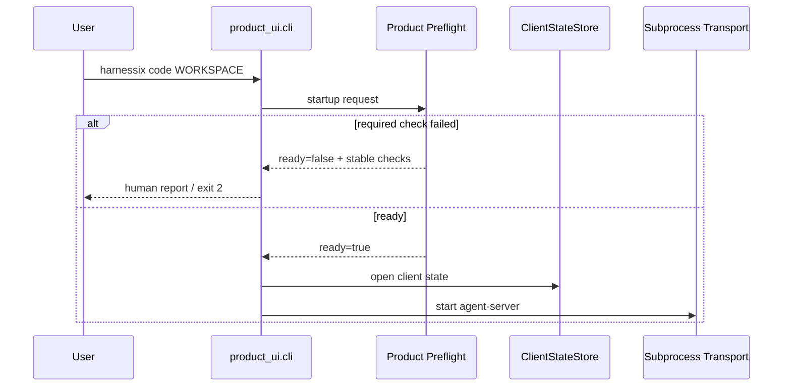

| 入口 | 输入与输出 | 副作用边界 | 源码/测试 |
|---|---|---|---|
| `code configure` | 非敏感Provider/Profile字段；stdout为脱敏Write Receipt | 不读取API Key；已有文件只有`--replace`与精确摘要同时存在才可替换 | [`cli.py`](../../src/harnessix/product_ui/cli.py) `_configure`；[`test_cli.py`](../../tests/product_ui/test_cli.py)显式替换与Canary用例 |
| `code doctor` | 与Startup相同检查；人类文本或`--json`合同；ready为0，否则2 | 不创建Client State、Server、Session、Thread或网络请求 | `_doctor`、`_render_preflight`；`test_code_doctor_json_uses_shared_report_without_creating_state` |
| `code WORKSPACE` | 先生成Startup Preflight，再延迟加载Textual | Required失败发生在`ClientStateStore`和`SubprocessAgentTransport`之前 | `code_main`；缺失Workspace测试断言TUI加载函数未调用 |

默认人类报告只显示稳定检查ID、分类、状态、代码、修复动作和摘要。JSON报告适合自动化支持包，但同样不含绝对路径、
环境值和原始异常。Server端不信任客户端Preflight；子进程启动后执行同源检查并继续完成原有严格重校验。实现绑定
`532e59b346f50657518d11225102bc6999c301e6`，原生Windows产品CI通过前保持候选状态。

## 18. 变更记录

| 文档版本 | 代码版本 | 日期 | 变更摘要 |
|---|---|---|---|
| 11 | `532e59b346f50657518d11225102bc6999c301e6` | 2026-09-13 | 接入Secret-free Configure、共享Doctor/Startup Preflight和状态/Transport前阻断；Windows原生只读候选等待CI |
| 10 | `684a17ecc013549e3472978f1c0e8c1eca4db92e` | 2026-09-13 | 记录0.9.1c实现提交`684a17e`、测试同步提交`84ffd59`及[CI 34727612571](https://github.com/carrie1988/Harnessix/actions/runs/34727612571)全矩阵验收，正式关闭完整领域交互子切片 |
| 9 | `35e9e889f78534fd8866f76cfe24d936b08d345d` | 2026-09-13 | 同步0.9.1c本地实现：冻结交互身份、Artifact完整证据、发送前复核、Plan/Tool/Usage渲染、专用Modal、错误自助及65项Product UI验证；等待实现Revision与三平台CI |
| 8 | `5e8d71f019b30cac28229f1fddcee3778fe8e8eb` | 2026-09-13 | 记录实现与四次稳定化提交通过Linux Python 3.12/3.13、macOS、Windows、PostgreSQL、Container及文档矩阵，正式关闭0.9.1b |
| 7 | `f8a1dc4c1e06c9e4d052c87144a4ff3197d9ec7a` | 2026-09-13 | 无头产品场景在ListView投影数量和本地Intent门闩都结算后再导航，并在ListView选择和Composer输入前显式等待焦点生效，去除平台相关的渲染、调度与焦点假设 |
| 6 | `e717a87e21d7d03b46a44a59ab203f3a8c80f9e9` | 2026-09-13 | 明确跨平台无头测试分别验证真实键绑定与再次Action派发，隔离Pilot控制键注入差异 |
| 5 | `e717a87e21d7d03b46a44a59ab203f3a8c80f9e9` | 2026-09-13 | 修复Controller快照Revision未变化时Composer本地门闩无法重新启用的View生命周期缺口 |
| 4 | `1c11956d3fdc95ccc5a051a96e2107becfdbe78d` | 2026-09-13 | 同步0.9.1b本地实现：单Actor Controller、框架中立渲染、Textual基础产品壳、`harnessix code`组合根和真实stdio冷恢复；等待实现提交及三平台CI |
| 3 | `ca656aa26cee7f1aefbe6b0cb85b5fc7e0336ec1` | 2026-09-13 | 记录0.9.1a在Linux Python 3.12/3.13、macOS和Windows矩阵全部通过，正式关闭客户端内核子切片 |
| 2 | `085649da9aa27192c9f67ee35ee5471fdd33ce6d` | 2026-09-13 | 将Product UI专项测试纳入Linux全量、macOS Coding Tools和Windows Trusted Execution三平台CI矩阵 |
| 1 | `608c548feb909aa5ae572bab7db35859283d3d01` | 2026-09-13 | 建立Client State、原子Store、投影Reducer、连接代际、Prepared Command及SDK协商门禁的现行设计 |
