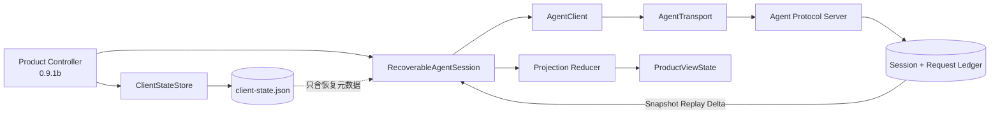
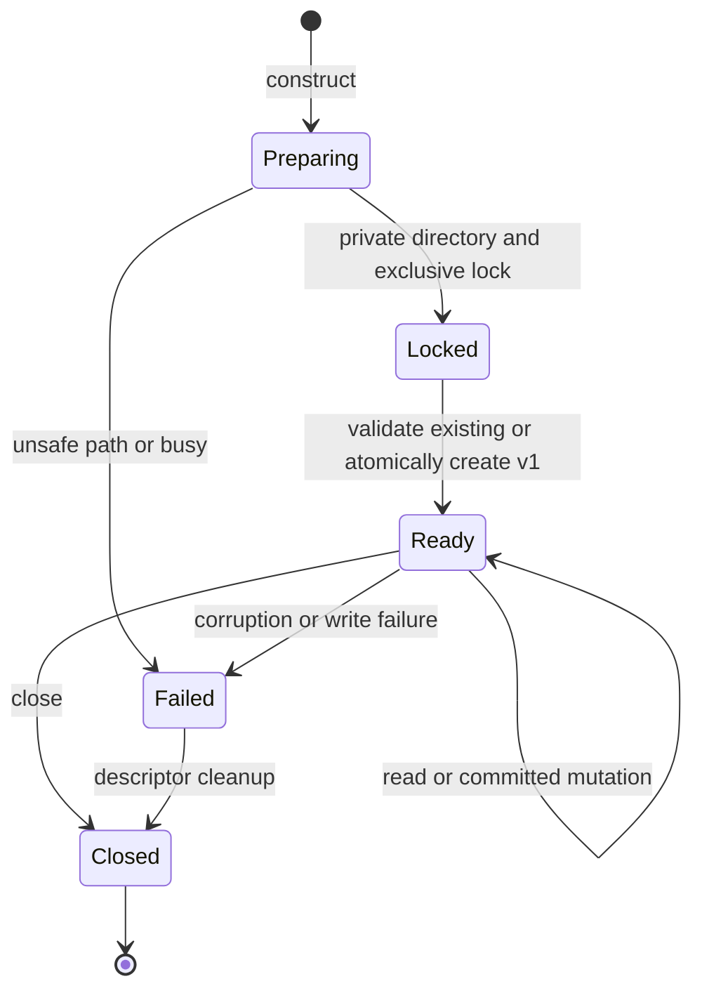
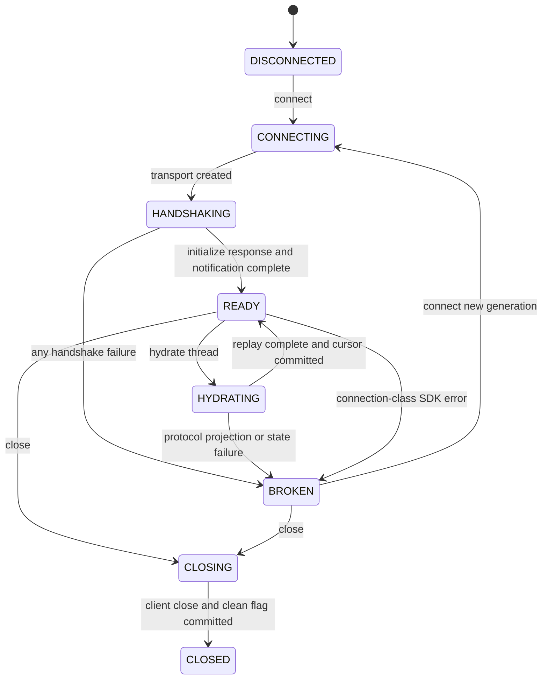
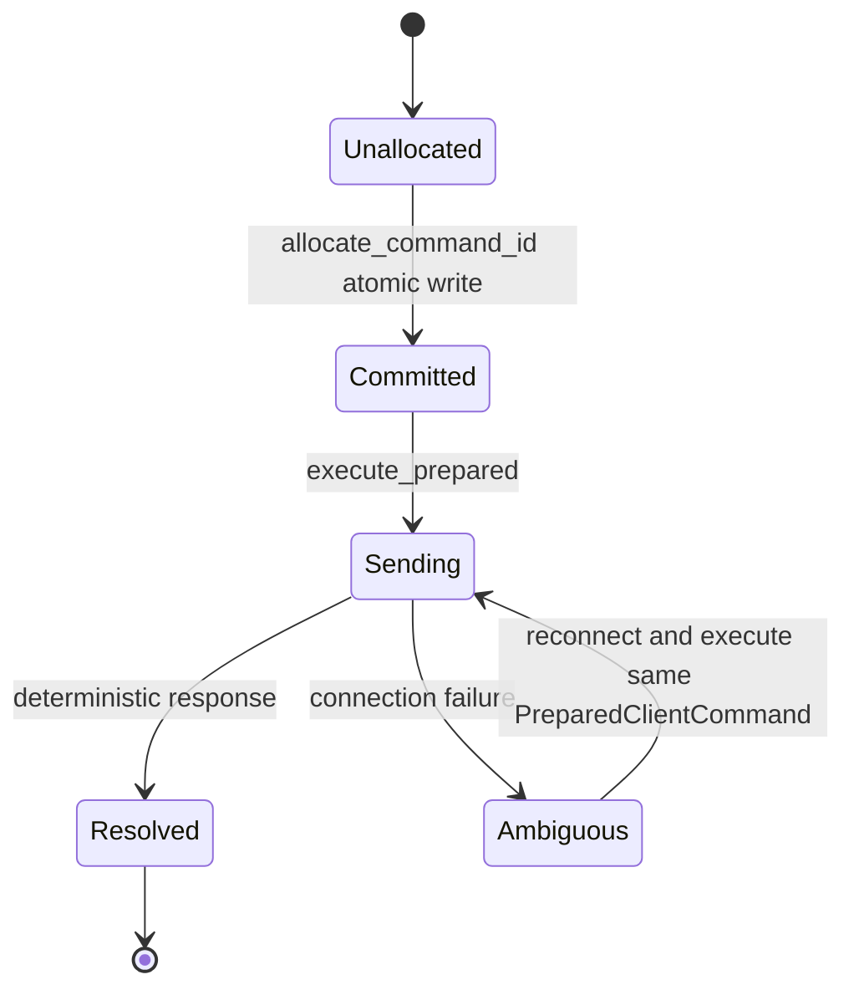
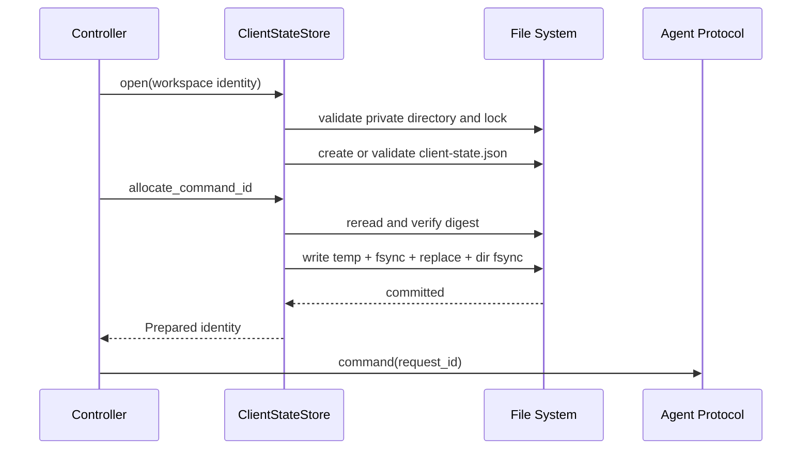
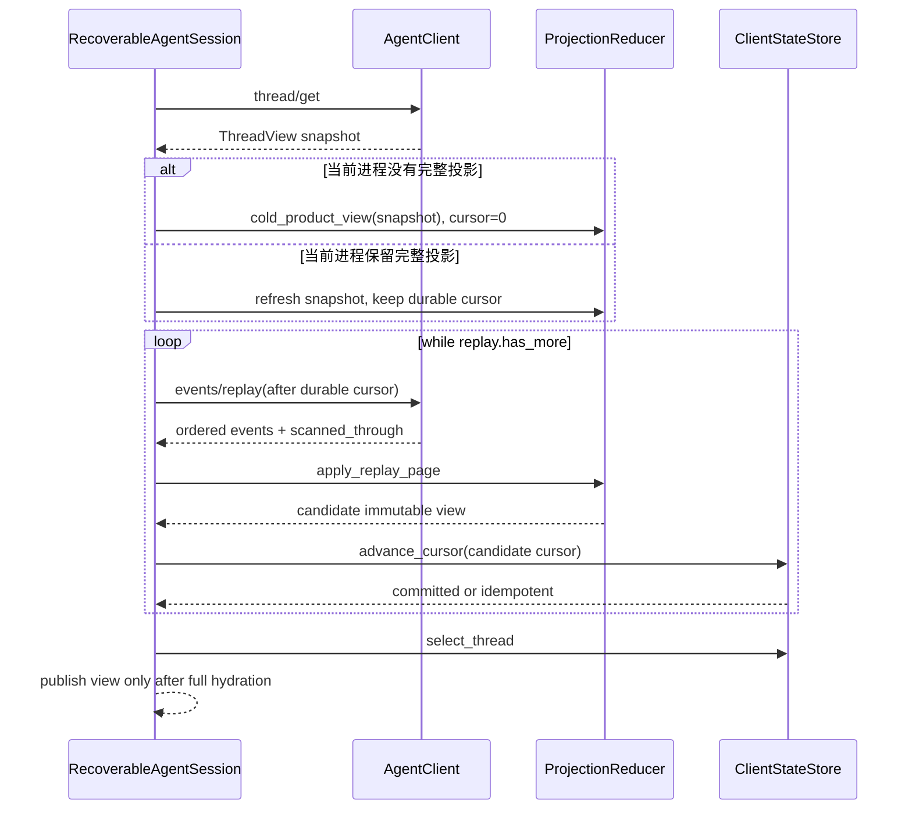
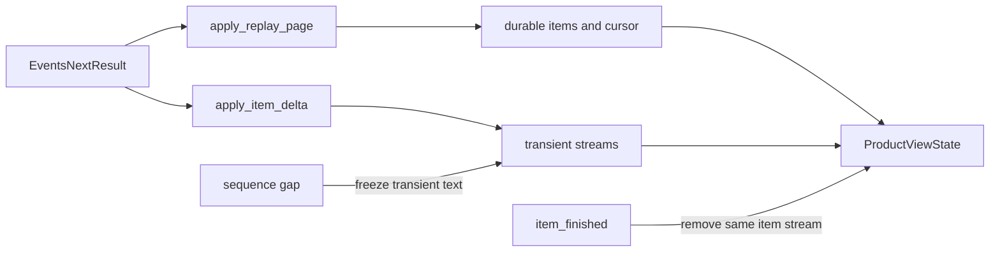

# Product UI客户端内核模块设计

## 1. 模块摘要

| 项目 | 内容 |
|---|---|
| 源码包 | [`src/harnessix/product_ui`](../../src/harnessix/product_ui/) |
| 当前职责 | 保存最小客户端恢复元数据；发送前持久分配Command ID；管理Agent SDK连接代际；从Snapshot、Replay和Live Delta确定性生成单Thread产品视图 |
| 非职责 | 不实现Textual界面、Controller、配置向导、自动重试策略、Agent状态机、Session数据库、Protocol Server或Trusted Action执行 |
| 上游调用者 | 0.9.1b计划中的Product Controller；当前由模块测试直接调用 |
| 下游端口 | `AgentTransportFactory → AgentClient → Agent Protocol`、`ClientStateStore → 本地私有文件` |
| 持久化 | `client-state.json`只保存身份、Command序列、选择、Cursor、关闭标志、Revision和摘要；排他锁文件为`.client-state.lock` |
| 平台 | 文件锁和原子替换按macOS/Linux/Windows分支实现；POSIX额外校验Owner与精确权限；Windows行为由CI验证，不以WSL替代 |
| 公共导出 | 包根导出状态合同、Store、投影类型/Reducer、连接状态及`RecoverableAgentSession` |
| 当前完成度 | 0.9.1a客户端内核已实现；Textual、产品CLI、完整领域交互、Doctor和默认Action装配尚未实现 |
| 代码版本 | `085649da9aa27192c9f67ee35ee5471fdd33ce6d` |

本模块是终端表现层与Agent Protocol之间的**可恢复客户端应用层**。Agent Session和Protocol Request Ledger仍是
领域事实源；客户端文件不是Session副本，内存投影也不能反向修改Agent状态。

## 2. 需求背景、设计目标与非目标

### 2.1 需求背景

现有薄CLI直接持有进程内`client_instance_id`、Thread选择和Replay Cursor。进程退出或stdio断开后，如果客户端
重新生成身份或Command ID，服务端无法把重放识别为原命令；如果从已保存Cursor恢复但本地没有Transcript正文，
则界面只得到Cursor之后的增量，历史消息永久缺失。并发启动两个客户端还可能同时消费同一个Command序列。

生产客户端因此必须同时解决四个问题：

1. **稳定身份**：同一状态目录跨进程保持Client Instance ID和单调Command序列；
2. **提交顺序**：Command ID必须先原子落盘，再允许写入Transport；
3. **完整恢复**：冷启动从Cursor 0重建全文，只有同进程仍持有完整投影时才允许暖续传；
4. **临时与权威分离**：Live Delta只优化显示，持久`item_finished`始终覆盖临时文本。

### 2.2 当前设计目标

- Client State采用严格版本、未知字段拒绝、规范摘要、大小和集合上限；
- 单个状态目录仅允许一个进程写入，进程内变更也串行；
- 每次变更前重读并验证磁盘文件，外部篡改不会被内存旧值覆盖；
- 临时文件与目标同目录，完成文件`fsync → replace → directory fsync`后才返回；
- Command序列分配失败时不返回ID，成功返回的ID一定已经消费且永不回退；
- Agent连接每次完整握手形成新Generation，半握手和协议损坏进入`BROKEN`；
- Projection Reducer无I/O、时钟和随机数，相同输入逐字段相等；
- Replay游标回退、近期事件身份冲突、Item事件类型/状态不一致、终态Item冲突和Delta身份漂移均失败关闭。

### 2.3 明确非目标

- 不保存Transcript、Diff、Prompt、Approval/Question答案、Provider正文或Secret；
- 不依据`clean_shutdown=false`猜测领域命令成功或失败；
- 不自动清理第1001个Thread Cursor；只有上层验证Thread已归档后才能调用显式遗忘；
- 不在本模块实现自动重连次数、指数退避、UI通知或后台Task所有权；
- 不把Client Instance ID当作认证身份；
- 不修改Agent Protocol v1、Server Session Schema或Protocol Request Ledger；
- 不宣称0.9.1整体完成，当前实现没有Textual View和产品入口。

## 3. 模块上下文、总体架构与信任边界



**边界说明：**

- `product_ui`可依赖公共`protocol`合同和`sdk`端口，不能导入App Server、Agent Runtime或Session Store实现；
- `RecoverableAgentSession`拥有一个当前`AgentClient`和多个同进程Thread投影，但不拥有服务端领域事实；
- `ClientStateStore`只接受产品边界已经规范化的Workspace身份并保存其版本化SHA-256，不自行解释平台路径；
- `ProjectionReducer`只接收已由SDK校验的`ThreadView`、`EventsReplayResult`和`PublicItemDelta`；
- 未来Textual Widget只能发送类型化Intent，不能直接分配Command ID、推进Cursor或调用Transport。

## 4. 包结构与源码阅读顺序

| 顺序 | 文件 | 关键符号 | 阅读目的 |
|---:|---|---|---|
| 1 | [`errors.py`](../../src/harnessix/product_ui/errors.py) | `ProductUIError` | 理解产品层稳定错误码及不可信正文隔离 |
| 2 | [`contracts.py`](../../src/harnessix/product_ui/contracts.py) | `ClientStateV1`、`ClientThreadCursor`、`ClientCommandAllocation` | 理解持久字段、摘要、上限和Command命名 |
| 3 | [`state_file.py`](../../src/harnessix/product_ui/state_file.py) | `open_state_lock`、`read_state_file`、`write_state_file` | 理解目录/文件安全、排他锁和原子替换 |
| 4 | [`state_store.py`](../../src/harnessix/product_ui/state_store.py) | `ClientStateStore` | 理解变更前重读、Command分配、选择和单调Cursor |
| 5 | [`projection.py`](../../src/harnessix/product_ui/projection.py) | `ProductViewState`、`apply_replay_page`、`apply_item_delta` | 理解冷暖视图、Replay幂等和Delta覆盖 |
| 6 | [`session.py`](../../src/harnessix/product_ui/session.py) | `ConnectionPhase`、`PreparedClientCommand`、`RecoverableAgentSession` | 理解连接代际、Hydration和同ID显式重放 |
| 7 | [`agent_client.py`](../../src/harnessix/sdk/agent_client.py) | `AgentClient._send`、`initialize`、`replay_events` | 对照SDK握手、方法和协商Limit门禁 |
| 8 | [`test_state_store.py`](../../tests/product_ui/test_state_store.py) | Store正反例 | 从崩溃、权限、锁和损坏场景反证持久化设计 |
| 9 | [`test_projection.py`](../../tests/product_ui/test_projection.py) | Reducer正反例 | 验证确定性、重复页、冲突、Gap和终态覆盖 |
| 10 | [`test_recoverable_session.py`](../../tests/product_ui/test_recoverable_session.py) | 连接恢复场景 | 验证冷启动从0、暖重连续传和Command身份复用 |

## 5. 核心生命周期与状态机

### 5.1 Client State Store生命周期



Store构造成功后一直持有`.client-state.lock`描述符，直到`close`。锁只解决协作进程并发；每次操作还使用
`threading.RLock`保护同一对象的线程并发。`close`幂等，关闭后的全部读取和变更返回`client_state_closed`。

### 5.2 Agent连接代际



每次`connect`先关闭旧Client，再递增Generation并完整握手。`invalid_response`、`server_closed`、
`server_start_failed`和`handshake_failed`会使当前代际进入`BROKEN`。旧Client不再由Session引用，因此其结果不能
结算新代际操作。

### 5.3 Command身份生命周期



`PreparedClientCommand`不保存Prompt或业务参数，只绑定客户端身份、序列、Request ID和分配时Revision。
结果不明确时调用方保留同一对象；Session不会在重放路径重新调用`allocate_command_id`。业务Payload是否漂移最终仍由
服务端Protocol Request Ledger的同ID同Payload规则校验。

## 6. 正常流程、失败恢复时序与数据流

### 6.1 首次初始化与原子Command分配



文件替换失败时临时文件被清理，旧目标仍保存原`next_command_sequence`，调用方不会收到尚未提交的ID。替换已经成功
但目录同步失败时返回`client_state_write_failed`；此时磁盘可能为新版本，后续必须重读，而不能回退内存序列。
专项故障注入覆盖该不确定窗口：重新读取后若序列已经前进，下一次分配必须从新序列继续，不得复用未返回的ID。

### 6.2 冷启动与暖重连Hydration



冷启动无论Client State记录了多大Cursor都从0开始，因为状态文件不含历史Item。保存Cursor的作用是记录最后确认位置、
检测回退并支持同一进程暖重连，不是Transcript快照。Replay声明`has_more`却不推进扫描位置时返回
`projection_replay_stalled`；最终位置未覆盖`ThreadView.cursor`时返回`projection_replay_incomplete`。

### 6.3 Replay与Live Delta合并



持久Event Cursor可以因服务端过滤私有事件而不连续，`scanned_through`才是下一页起点。最近256个
`cursor → event_id`检查点用于发现重叠页中同Cursor不同Event的服务端冲突；更旧重复事件只跳过，不保留无界集合。
Delta要求从1开始且逐一递增；缺口后不再拼接后续片段，等待持久Item提供完整正文。
Item事件必须携带Turn ID；`item_started`只接受`status=started`，`item_finished`只接受终态状态。缺少身份或
事件类型与Item状态不一致时以`projection_event_invalid`失败关闭。`turn_started`对应领域Reducer创建Turn时的
持久`accepted`状态，不能伪造尚未发生的`running`状态。

## 7. 接口设计

### 7.1 `ClientStateStore`

| 方法 | 输入/输出 | 顺序与幂等 | 失败语义 |
|---|---|---|---|
| `state()` | 返回完整`ClientStateV1` | 每次重读磁盘；无写入 | 关闭、缺失、损坏、权限或Workspace错配 |
| `allocate_command_id()` | 返回`ClientCommandAllocation` | 先递增并提交`next_command_sequence`；每次成功唯一 | 写失败不返回；序列耗尽失败 |
| `select_thread(id)` | 返回更新后状态 | 相同选择幂等且不增Revision | 非UUID失败 |
| `advance_cursor(id,cursor)` | 返回更新后状态 | 只允许单调增加；相等或更小幂等 | 新Thread超过1000条时失败，不自动驱逐 |
| `forget_thread_cursor(id)` | 返回更新后状态 | 不存在时幂等 | 调用方必须先验证Thread已归档 |
| `set_clean_shutdown(bool)` | 返回更新后状态 | 相同值幂等 | 非严格布尔失败 |
| `close()` | 无返回 | 幂等释放进程锁 | 关闭后操作拒绝 |

### 7.2 Projection纯函数

| 函数 | 输入 | 输出 | 不变量 |
|---|---|---|---|
| `cold_product_view` | `ThreadView` | 空Transcript、Cursor 0的视图 | 不使用Snapshot cursor跳过历史 |
| `refresh_thread_snapshot` | 现有视图、新Snapshot | 保留Item/Stream/Cursor的视图 | Thread相同且Snapshot cursor不回退 |
| `apply_replay_page` | 视图、Replay页 | 原子新视图 | 跨Thread、Cursor回退、近期Event冲突失败 |
| `apply_item_delta` | 视图、一个Delta | 临时流更新 | 序列逐一追加；终态Item后忽略Delta |
| `apply_events_next` | 视图、Next结果 | Replay后Delta的新视图 | 只有Replay推进持久Cursor |

### 7.3 `RecoverableAgentSession`

| 方法 | 前置条件 | 结果 | 取消/超时 |
|---|---|---|---|
| `connect()` | Store开放、Session未关闭 | 新Generation完成握手并进入READY | 复用SDK/Transport超时；失败代际BROKEN |
| `prepare_command()` | 当前连接READY | 已持久化`PreparedClientCommand` | 同步原子事务，无Transport I/O |
| `execute_prepared()` | READY且Command属于当前客户端 | 调用类型化SDK操作 | 不自动生成新ID；连接错误标记BROKEN |
| `hydrate_thread()` | READY、Thread存在 | 完整冷/暖投影并选择Thread | 当前实现由SDK调用者提供外层超时 |
| `poll_thread()` | READY且已经Hydrate | 一页Replay/Delta结果 | `events/next`最多使用协议允许的30秒 |
| `close()` | 任意非CLOSED状态 | 关闭Client、提交安全关闭标志 | 失败保留BROKEN且不伪造安全关闭 |

## 8. 数据结构、重点字段与持久化格式

### 8.1 `ClientStateV1`

| 字段 | 类型/上限 | 来源 | 语义 | 敏感与持久化 |
|---|---|---|---|---|
| `spec_version` | 固定`harnessix.client-state/v1` | 合同 | 未知版本返回`client_state_version` | 持久、公开 |
| `client_instance_id` | UUID | 首次初始化随机生成 | Protocol Command幂等命名空间，不是认证身份 | 持久、内部 |
| `workspace_fingerprint` | 64位小写十六进制 | 版本前缀与规范Workspace身份SHA-256 | 防止状态目录误绑定；不证明Workspace内容 | 持久，不保存路径原文 |
| `next_command_sequence` | `1..2^53-1` | Store递增 | 下一个可分配序列；成功分配后立即加一 | 持久、关键 |
| `selected_thread_id` | UUID或空 | 用户选择 | 启动候选，仍须服务端校验 | 持久、用户元数据 |
| `thread_cursors` | 排序唯一Tuple，最多1000 | Replay `scanned_through` | 最近确认的持久扫描位置；不能替代冷启动正文 | 持久、用户元数据 |
| `clean_shutdown` | 严格布尔 | Session生命周期 | 诊断上次是否按序关闭，不推断领域结果 | 持久、诊断 |
| `state_revision` | `1..2^53-1` | 每次有效变更加一 | 本地状态提交版本；幂等无变化不递增 | 持久、关键 |
| `digest` | 64位小写十六进制 | 除自身外规范JSON SHA-256 | 检测损坏或非协作写入 | 持久、完整性 |

状态正文最多1 MiB。JSON字段使用Python合同的`snake_case`，未知字段、重复键、无效UTF-8、NaN/Infinity、非严格
整数和摘要不匹配均拒绝。Command ID格式为：

```text
tui-{client_instance_id.hex}-{base36(sequence)}
```

### 8.2 `ProductViewState`

| 字段 | 语义 | 权威来源 | 有界策略 |
|---|---|---|---|
| `thread` | 当前Thread元数据Snapshot | `thread/get` | 单对象 |
| `durable_cursor` | 已原子应用的Replay扫描位置 | `scanned_through` | 单调不回退 |
| `items` | 按首次Cursor稳定排序的持久Item | `item_started/item_finished` | 受Session历史大小约束；虚拟化属于0.9.1b |
| `streams` | 尚未持久完成的临时文本 | `PublicItemDelta` | Protocol单页上限；终态删除 |
| `current_turn` | 当前Turn状态、Budget、Usage和Step | Snapshot与Turn/Usage Event | 单对象 |
| `recent_events` | 近期Cursor和Event ID | Replay事件 | 最多256条 |
| `live_gap` | 服务端报告Live缓冲缺口 | `EventsNextResult.live_gap` | 粘性标志，重新Hydrate后由上层处理 |

### 8.3 文件事务与权限

| 对象 | POSIX约束 | Windows约束 | 通用约束 |
|---|---|---|---|
| 状态目录 | 当前UID、精确`0700` | 必须为真实目录，拒绝Symlink/Junction | 绝对词法路径、私有单实例根 |
| 锁文件 | 当前UID、普通文件、单硬链接、`0600` | 普通文件且至少1字节供`msvcrt.locking` | 生命周期持锁、非阻塞获取 |
| 状态文件 | 当前UID、普通文件、单硬链接、`0600` | 拒绝Symlink/Junction | 打开前后对象身份一致、最大1 MiB |
| 临时文件 | `0600`、`O_EXCL`、`fsync` | 同目录同卷、独占创建 | 随机名、失败清理、原子替换 |

## 9. 核心业务逻辑伪代码

### 9.1 状态变更

```text
mutate(operation):
    require store open and lifetime lock held
    current = secure_read_and_validate_file()
    updated = operation(current)
    if updated equals current:
        return current
    updated.state_revision = current.state_revision + 1
    updated.digest = digest(canonical body without digest)
    atomic_write(updated)
    return updated only after replace and directory sync
```

### 9.2 Replay页归并

```text
apply_replay_page(view, page):
    require page.thread_id equals view.thread_id
    require page.scanned_through >= view.durable_cursor
    candidate = view
    for event in page.events ordered by cursor:
        if event.cursor <= old durable cursor:
            if recent checkpoint exists and event_id differs: fail conflict
            continue
        candidate = apply persistent event(candidate, event)
        append bounded recent checkpoint
    candidate.durable_cursor = page.scanned_through
    return candidate
```

### 9.3 连接失败后的同ID重放

```text
prepared = session.prepare_command()  # disk commit happens here
try:
    execute(client, prepared.request_id, immutable business params)
except connection_class_error:
    mark current generation BROKEN
    connect()                         # new transport and full handshake
    execute(client, prepared.request_id, same business params)
```

Session不自动执行最后一步，以免在不知道上层业务参数是否仍相同的情况下盲目重放。服务端Ledger是最终幂等裁决者。

## 10. 失败、恢复、取消与超时

| 故障 | 稳定错误/状态 | 是否修改持久状态 | 恢复方式 |
|---|---|---:|---|
| 状态目录/文件链接、过宽权限、Owner错误 | `client_state_permissions` | 否 | 修复目录后重新打开 |
| 另一个进程持锁 | `client_state_busy`，可重试 | 否 | 关闭旧实例或稍后重试 |
| 未知Schema | `client_state_version` | 否 | 使用支持版本或显式迁移；不覆盖原文件 |
| JSON/字段/摘要损坏 | `client_state_corrupt` | 否 | 隔离后显式重建；服务端事实仍完整 |
| Workspace指纹不同 | `client_state_workspace_mismatch` | 否 | 使用对应状态目录 |
| 原子写失败 | `client_state_write_failed` | 旧或新完整版本 | 重开并重读；不得依据内存猜测 |
| 协商方法缺失或上限超出 | SDK `method_not_negotiated`/`negotiated_limit_exceeded` | 否 | 降级功能或修正请求，不写Transport |
| 半握手/协议帧损坏/EOF | Connection `BROKEN` | `clean_shutdown=false`可能已提交 | 新Generation完整握手 |
| Replay回退/冲突/停滞/不完整 | `projection_*`，Connection `BROKEN` | Cursor不越过成功提交页 | 停止发布视图，重新获取服务端事实 |
| Delta缺口 | Stream `gap=true` | Cursor不变 | 等待持久Replay的`item_finished`覆盖 |
| `execute_prepared`等待者取消 | 原协程取消 | 已分配ID保持消费 | 不生成新ID；按Transport/服务端事实恢复 |
| `events/next`超时 | 协议正常`timed_out=true` | Cursor不变 | 继续下一次轮询 |
| Close失败 | `connection_close_failed`、`BROKEN` | 不提交`clean_shutdown=true` | 运维诊断并重新打开 |

本模块不自行设置普通Request的墙钟超时；Transport关闭上限和`events/next`等待上限沿用SDK/Protocol现行合同。自动退避、
最大重连次数和Controller Task取消树属于0.9.1b与0.9.3。

## 11. 安全、权限与隐私

1. 持久文件不包含Prompt、模型输出、工具参数、Diff、审批答案、Secret或环境变量；
2. Workspace原文只用于即时计算版本化指纹，不写入Client State；
3. 读取通过`lstat/fstat`核对设备与inode、普通文件、硬链接数和POSIX Owner/Mode；
4. JSON先由stdlib拒绝重复键和非有限常量，再由Pydantic严格验证字段与跨字段摘要；
5. 文件大小、Thread Cursor数量、Revision和Sequence均有固定上限；
6. 错误信息使用固定中文，不拼接路径、JSON正文、stderr或不可信服务端消息；
7. 投影只消费公共Protocol对象，不访问服务端私有Event或数据库；
8. Client Instance ID仅作为本地协议幂等命名空间，远程部署仍需独立认证授权；
9. `forget_thread_cursor`不自动决定归档资格，防止低层Store误删活跃恢复位置；
10. 同状态目录排他锁不等于分布式锁，也不能抵御同账号恶意进程替换父目录。

## 12. 可观测性与错误分类

当前0.9.1a只维护`ProductConnection(generation, phase, last_error_code)`内存诊断面和稳定异常，不直接写日志、Metric或
Trace，避免在Controller和Telemetry组合根完成前形成第二套观测实现。0.9.1b必须在不记录正文的前提下装配以下信号：

| 计划信号 | 低基数字段 | 禁止字段 |
|---|---|---|
| `product.client.connection` | phase、result、generation bucket | stderr、argv、Workspace路径 |
| `product.client.state_write` | operation、result | UUID、文件正文、绝对路径 |
| `product.client.replay` | result、event count bucket、gap | Event和Delta正文 |
| `product.client.command` | method、resolution、retryable | Request ID、Prompt、参数正文 |

错误分为Client State、Connection、Projection和Command四域。`ProductUIError.retryable`只表达技术上可重试，不授权
自动重放领域命令；`AgentSDKError.retryable`也必须与Prepared Command及服务端Ledger组合判断。

## 13. 源码与测试双向映射

| 设计元素 | 源码与符号 | 测试与断言 |
|---|---|---|
| 状态Schema、摘要和Command命名 | [`contracts.py`](../../src/harnessix/product_ui/contracts.py) `ClientStateV1`、`client_state_digest`、`command_request_id` | [`test_state_store.py`](../../tests/product_ui/test_state_store.py) `test_command_ids_are_committed_before_return_and_never_reused`、损坏/未知字段用例 |
| 私有目录与单写者锁 | [`state_file.py`](../../src/harnessix/product_ui/state_file.py) `prepare_private_directory`、`open_state_lock` | `test_state_store_rejects_concurrent_writer`、`test_state_store_rejects_broad_lock_permissions_without_repair`、符号链接攻击用例 |
| 安全读取与原子替换 | [`state_file.py`](../../src/harnessix/product_ui/state_file.py) `read_state_file`、`write_state_file` | `test_state_store_rejects_symlink_and_corrupt_digest`、`test_failed_atomic_replace_preserves_previous_command_sequence`、`test_directory_sync_failure_never_reuses_replaced_command_sequence` |
| 单调Cursor和选择 | [`state_store.py`](../../src/harnessix/product_ui/state_store.py) `advance_cursor`、`select_thread` | `test_state_store_persists_selection_and_monotonic_thread_cursor` |
| 冷启动和确定性 | [`projection.py`](../../src/harnessix/product_ui/projection.py) `cold_product_view`、`apply_replay_page` | [`test_projection.py`](../../tests/product_ui/test_projection.py) `test_cold_projection_starts_at_zero_and_is_deterministic` |
| Replay重叠与回退 | [`projection.py`](../../src/harnessix/product_ui/projection.py) `ReplayCheckpoint`、`apply_replay_page` | `test_duplicate_replay_is_idempotent_and_recent_conflict_fails`、`test_replay_rejects_cross_thread_and_cursor_rollback` |
| Turn初态与Item事件一致性 | [`projection.py`](../../src/harnessix/product_ui/projection.py) `_apply_event`、`_replace_item` | `test_turn_started_projects_the_durable_accepted_state`、`test_replay_rejects_item_event_status_mismatch`、`test_replay_rejects_item_event_without_turn_identity` |
| Delta Gap与终态覆盖 | [`projection.py`](../../src/harnessix/product_ui/projection.py) `TransientItemStream`、`apply_item_delta` | `test_delta_sequence_gap_and_final_event_authority`、`test_delta_rejects_cross_thread_and_identity_change` |
| 冷暖Hydration和连接代际 | [`session.py`](../../src/harnessix/product_ui/session.py) `connect`、`hydrate_thread` | [`test_recoverable_session.py`](../../tests/product_ui/test_recoverable_session.py) `test_session_cold_replays_from_zero_and_warm_reconnect_resumes_projection` |
| 同一Prepared ID跨代际重放 | [`session.py`](../../src/harnessix/product_ui/session.py) `prepare_command`、`execute_prepared` | `test_prepared_command_reuses_identity_after_ambiguous_connection_failure` |
| Poll投影故障失败关闭 | [`session.py`](../../src/harnessix/product_ui/session.py) `poll_thread` | `test_poll_projection_failure_marks_connection_broken` |
| SDK协商前置门禁 | [`agent_client.py`](../../src/harnessix/sdk/agent_client.py) `_send`与[`request.py`](../../src/harnessix/sdk/request.py) `require_replay_limit` | [`test_server_sdk.py`](../../tests/app_server/test_server_sdk.py) `test_sdk_rejects_unadvertised_method_before_transport_write`、`test_sdk_enforces_negotiated_replay_and_message_limits_before_write` |

## 14. 测试、验证与验收

### 14.1 当前自动化覆盖

- Store：初始化/重开、权限、链接、摘要、未知版本/字段、重复键、并发锁、原子替换和目录同步失败、关闭幂等；
- Projection：冷启动、确定性、重复Replay、近期冲突、跨Thread、Cursor回退、Turn初态、Item事件一致性、Delta重复/缺口/身份漂移、终态覆盖；
- Session：保存Cursor存在时仍冷启动从0、同进程暖重连续传、Generation递增、旧Transport关闭、Prepared ID复用、Poll投影故障失败关闭；
- SDK：非法Envelope、深度预算、Result归一、半握手、超长Frame、未协商方法和协商Limit前置拒绝；
- 全仓门禁：Ruff、Readability、Documentation、Contract、Mypy和全部Pytest。
- 平台门禁：Linux全量测试、macOS Coding Tools矩阵和Windows Trusted Execution矩阵均显式执行`tests/product_ui`；
  正式结论只在同一提交的远端CI全部通过后记录。

### 14.2 当前验收标准

- [x] 成功返回的Command ID在磁盘重开后不复用；
- [x] 状态文件只能是替换前或替换后的完整版本；
- [x] 替换成功但目录同步报错时，重读后的Command序列仍单调且不复用；
- [x] 冷进程不因已保存Cursor跳过Transcript历史；
- [x] 暖重连保留完整内存投影并从已确认Cursor继续；
- [x] Live Delta不推进持久Cursor，Gap不继续拼接，终态Event清除临时流；
- [x] Turn Started保持`accepted`事实，Item事件类型与状态不一致时失败关闭；
- [x] SDK在Transport写入前拒绝未协商方法、过大消息和过量Replay；
- [x] 连接故障后可显式复用同一Prepared Command，不额外消费序列；
- [ ] Textual View、Controller Task树、真实stdio产品恢复和三平台安装由后续子切片验收。

## 15. 部署、兼容、回退与迁移

- 当前模块只使用项目已有依赖，不引入Textual，也不改变安装Extra；
- Agent Protocol仍为`1.0`，Session数据库和Protocol Request Ledger没有迁移；
- `client-state.json`是新增独立文件，不读取旧薄CLI内存状态；首次启动原子创建v1；
- 未知Client State版本失败关闭，当前不提供自动迁移器；未来迁移必须保留备份、摘要CAS和收据；
- 回退代码前可删除整个客户端状态目录并从服务端Thread列表及Cursor 0恢复，但会生成新的Client Instance命名空间；
- 0.9.1b接入时必须由产品边界提供稳定、规范的Workspace身份，并确保客户端状态目录与Workspace不重叠；
- 正式Windows声明需等待Windows CI及0.9.1d原生只读产品纵向测试，当前仅声明存储算法具有平台分支。

## 16. 已知限制、风险与后续差距

| 限制/风险 | 当前影响 | 后续归属 |
|---|---|---|
| 无Textual View和Product Controller | 用户不能从正式TUI使用本模块 | 0.9.1b |
| Prepared Command不持久保存业务Payload | 崩溃后不能仅凭本地文件自动重放最后操作；必须由UI Intent/服务端事实恢复 | 0.9.1b设计后仍坚持不保存敏感正文 |
| 投影在内存保存完整Item历史 | 大Transcript可能占用较多内存 | 0.9.1b虚拟化、0.9.3性能基线 |
| `live_gap`是粘性诊断标志 | 当前没有自动重新Hydrate策略 | 0.9.1b Controller |
| Store锁只覆盖协作本地实例 | 不适用于网络共享或分布式客户端 | 1.0本地优先边界 |
| 状态文件无自动迁移/备份 | v1升级必须新增正式迁移流程 | 首次Schema变更前 |
| Session普通Request无统一外层Deadline | 卡住的自定义Transport可能阻塞操作 | 0.9.1b/0.9.3 |
| 当前没有产品层Telemetry适配 | 只能通过Connection状态和错误码诊断 | 0.9.1b/0.9.3 |
| Windows文件安全只有算法和CI证据 | 不能代表默认Windows Coding Tool已可用 | 0.9.1d |

## 17. 变更记录

| 文档版本 | 代码版本 | 日期 | 变更摘要 |
|---|---|---|---|
| 2 | `085649da9aa27192c9f67ee35ee5471fdd33ce6d` | 2026-09-13 | 将Product UI专项测试纳入Linux全量、macOS Coding Tools和Windows Trusted Execution三平台CI矩阵 |
| 1 | `608c548feb909aa5ae572bab7db35859283d3d01` | 2026-09-13 | 建立Client State、原子Store、投影Reducer、连接代际、Prepared Command及SDK协商门禁的现行设计 |
