# Protocol模块设计

## 1. 模块摘要

| 项目 | 内容 |
|---|---|
| 源码包 | [`src/harnessix/protocol`](../../src/harnessix/protocol/) |
| 当前职责 | 定义Agent Protocol v1公共JSON-RPC合同、严格入站帧解码、公共状态白名单投影、Replay游标语义、旧客户端结果兼容读取，以及跨进程写命令幂等账本 |
| 非职责 | 不实现stdio读写、连接调度、方法路由、Agent业务状态机、Artifact授权、SDK进程管理、网络认证、远程传输或Session事件存储 |
| 上游调用者 | [`app_server`](../../src/harnessix/app_server/)、[`sdk`](../../src/harnessix/sdk/)、Schema生成脚本和合同测试 |
| 下游依赖 | Pydantic、标准库JSON/SHA-256、`aiosqlite`、Agent领域模型、Artifact合同、Domain审批记录和Session数据库Migration |
| 公共版本 | `AGENT_PROTOCOL_VERSION = "1.0"`；公共Thread、Turn和Event各自带`.../v1`规格标识 |
| 持久化 | `SQLiteProtocolRequestStore`复用Session数据库中的`protocol_requests`表；只保存参数摘要和有界公开终态，不保存原始参数 |
| 平台 | 合同、投影和SQLite账本没有显式平台分支；当前产品传输是本地stdio JSONL，远程TCP/WebSocket/HTTP不在v1范围 |
| 代码版本 | `aa3372c0eb0c3b4ab674b19d26754a80dd035b46` |
| 当前完成度 | v1合同、投影、Schema与命令账本已实现；内部Trusted Action审批已兼容映射；终态请求已纳入Plan-first离线保留，accepted仍保守全局保护业务状态；出站字节门禁、accepted恢复、远程安全和协议多版本协商尚未实现 |

本文是[`codec.py`](../../src/harnessix/protocol/codec.py)、
[`compatibility.py`](../../src/harnessix/protocol/compatibility.py)、
[`contracts.py`](../../src/harnessix/protocol/contracts.py)、
[`projection.py`](../../src/harnessix/protocol/projection.py)、
[`requests.py`](../../src/harnessix/protocol/requests.py)和
[`__init__.py`](../../src/harnessix/protocol/__init__.py)的当前事实源。连接状态、调度与stdio背压应继续阅读
[App Server模块设计](app-server.md)；客户端调用行为应阅读[SDK模块设计](sdk.md)；
内部持久事实应阅读[Agent Runtime模块设计](agent.md)和[Session模块设计](session.md)。
[0.8产品运行时设计](../m08-product-runtime-and-extensions.md)和
[ADR 0070](../adr/0070-agent-protocol-v1-boundaries.md)用于解释历史增量与取舍，不替代本文的现行实现说明。

## 2. 需求背景

生产Coding Agent不能把内部Python对象、Provider事件或数据库行直接暴露给CLI、IDE和SDK。内部
Session需要持续演进以支持Context压缩、模型尝试、工具执行、审批、恢复和诊断，而公共客户端需要
相对稳定、可生成Schema、可重连和可审计的边界。Protocol模块因此需要同时解决以下问题：

1. 将不可信字节帧转换为严格、大小有界且无歧义的JSON-RPC消息；
2. 区分一次连接内的响应关联ID与跨进程、跨重启的业务命令幂等ID；
3. 让客户端只看到公共Thread、Turn、Item和Event，而不是Provider私有标识、内部Context或执行计划；
4. 在内部事件被过滤后仍提供可恢复的权威游标，避免客户端把游标跳跃误判为网络丢包；
5. 在响应丢失或App Server重启后识别同一命令，并重放既有终态而不是重复产生业务意图；
6. 让新服务端能够增加可选输出字段或通知，而旧客户端仍可按明确规则继续工作；
7. 通过同一Pydantic合同生成JSON Schema，防止运行时、SDK和发布规格各自漂移；
8. 对Prompt、Tool参数、Tool结果、Workspace和审批信息划定真实暴露边界，不以“公共投影”误称全局脱敏；
9. 对帧大小、JSON深度、集合长度、文本长度和安全整数建立拒绝边界；
10. 把协议本身与stdio、HTTP、Agent状态机和存储迁移职责分开，避免形成第二套Agent框架。

## 3. 设计目标、非目标与关键术语

### 3.1 当前设计目标

1. 线上字段固定使用`camelCase`，Python字段使用`snake_case`，模型默认冻结、严格且拒绝未知字段；
2. JSON-RPC Request、Notification、Success和Error保持互斥且可由JSON Schema描述；
3. 协议关联ID只允许1～128字符字符串或JavaScript安全整数，不接受`null`、布尔、浮点和越界整数；
4. v1只处理一个UTF-8 JSON对象，不处理Batch、重复键、非有限数和行内多对象；
5. 初始化显式绑定版本、客户端实例、能力和资源限制；
6. 有状态写命令以`clientInstanceId + requestId`建立持久幂等域；
7. 参数指纹绑定方法与规范化JSON，原始Prompt和参数不进入协议账本；
8. 公共事件只由显式投影函数产生，未知内部事件默认不公开；
9. Replay以`scannedThrough`表达已扫描的内部事实位置，允许公开事件游标有间隔；
10. 持久事件是真实恢复依据，实时Delta只承担可丢失的低延迟展示；
11. 服务端输出的已知字段保持严格，新增未知输出字段可被旧客户端忽略；
12. 生成的14份Agent Protocol Schema与运行时合同逐字等价。

### 3.2 明确非目标

- 不定义模型Provider流协议；Provider事件由[`models`](../../src/harnessix/models/)拥有；
- 不允许客户端提交`AgentEvent`、`ToolResult`、Policy决定、事件Sequence或运行时状态；
- 不实现通用消息代理、服务发现、负载均衡或多租户网关；
- 不提供TCP、WebSocket、HTTP/SSE、压缩、二进制附件或JSON-RPC Batch；
- 不在协议层解析API Key、OAuth Token或远程用户身份；
- 不保证实时Delta可靠送达，也不把Delta写入协议账本；
- 不为每个内部字段提供一一同构的公共表示；
- 不在Protocol业务端口或Agent启动中自动清理`protocol_requests`；终态记录只允许由Session共库内部Maintenance在显式Plan、备份和Cutoff下离线删除；
- 不对所有公开用户内容执行通用DLP或Secret扫描；
- 不把Schema文件存在等同于App Server已开放对应方法。

### 3.3 关键术语

| 术语 | 含义 |
|---|---|
| JSON-RPC `id` | 单次连接中关联Request与Response的临时身份；可在新连接重新使用，不承担业务幂等 |
| `requestId` | 写命令参数中的持久业务幂等键；在同一`clientInstanceId`内不可换方法或换参数复用 |
| `clientInstanceId` | 客户端安装或逻辑实例的UUID；握手后固定到连接，参与命令账本主键 |
| 公共投影 | 从内部Agent对象显式选择字段并重建公共模型；不是简单序列化，也不等于内容脱敏 |
| `cursor` | 复用Thread内部事件Sequence的单调、不透明位置；不保证相邻公开事件连续 |
| `scannedThrough` | 服务端在本次Replay中已经扫描到的内部权威位置，包括被过滤的内部事件 |
| durable replay | 来自Session事件存储、可重连恢复的公开事件页面 |
| live delta | 内存中的低延迟文本增量；可能溢出、丢失或在重启后消失 |
| accepted | 协议账本已占用幂等键，但公开终态尚未写入 |
| completed/failed | 协议账本不可变终态；相同终态与结果可幂等重写，不同结果或状态冲突 |

## 4. 当前能力边界

| 能力 | 当前实现 | 所属模块 | 不应推断的能力 |
|---|---|---|---|
| 严格帧解码 | 1 MiB默认上限、UTF-8、单对象、无重复键、无NaN/Infinity、深度与集合上限 | Protocol `codec.py` | 未支持Batch、分块或流式JSON解析 |
| JSON-RPC合同 | 标准`jsonrpc: "2.0"`、严格Request/Notification/Response | Protocol `contracts.py` | 未实现任意JSON-RPC扩展 |
| 初始化合同 | v1、客户端信息、实例ID、能力、四类Limit | Protocol合同；状态机由App Server实现 | 未实现版本范围或双版本降级 |
| 公共视图 | Thread、Turn、Item、Event、Replay、Delta和Artifact页 | Protocol合同与投影 | 不公开完整内部Thread或全部Event |
| 幂等账本 | SQLite Claim与不可变终态，参数和结果摘要校验 | Protocol `requests.py` | 不自动保证任意业务操作幂等；仍依赖Runtime领域身份 |
| Schema发布 | 14份v1 JSON Schema由Pydantic合同生成 | `scripts/generate_specs.py` | Schema不代表方法一定已注册 |
| 兼容读取 | 旧客户端忽略服务端结果新增字段；未知通知忽略 | Protocol兼容函数与SDK | 入站请求不接受未知字段 |
| 连接状态 | `NEW → INITIALIZED_PENDING_ACK → READY` | App Server | Protocol包自身不保存连接对象 |
| 传输与背压 | 本地stdio JSONL、并发Request、有界Queue | App Server `stdio.py` | 未提供认证远程传输 |
| 方法执行 | 16个固定方法和条件开放的`artifact/read` | App Server | Protocol包不路由、不执行业务 |
| 实时流 | Pull-Live `events/next`，最多1000条内存Delta | App Server应用服务 | Delta不是持久事件，不保证无缺口 |
| Server通知 | 兼容层识别9个历史通知名 | Protocol兼容函数 | 当前App Server不主动发布这些通知，能力中`notifications`为空 |

## 5. 模块上下文、依赖方向与信任边界

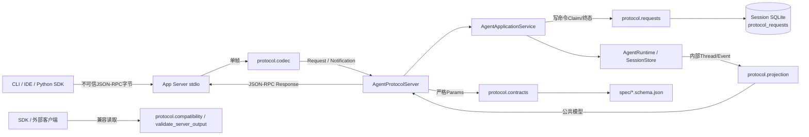

**图示说明：** 客户端字节先由App Server传输层读取，再由Protocol解码和合同校验。业务方法由App
Server应用服务调用既有Agent Runtime；Protocol不拥有Agent状态机。写命令先进入独立幂等账本，内部
结果经投影后才返回。当前SDK使用相同公共模型验证结果，并通过`validate_server_output`允许服务端增加未知可选字段；
`decode_known_notification`是已导出的外部客户端辅助函数，当前Pull-only SDK路径没有调用它。

**源码映射：** 入站解码见[`decode_client_frame`](../../src/harnessix/protocol/codec.py)，公共合同见
[`ProtocolModel`](../../src/harnessix/protocol/contracts.py)，投影见
[`project_thread`与`project_event`](../../src/harnessix/protocol/projection.py)，账本见
[`SQLiteProtocolRequestStore`](../../src/harnessix/protocol/requests.py)，跨模块调用见
[`AgentProtocolServer`](../../src/harnessix/app_server/server.py)和
[`AgentApplicationService`](../../src/harnessix/app_server/service.py)。

### 5.1 信任边界

1. **字节到Envelope边界**：任何stdin输入都不可信；必须先经过大小、编码、结构和Envelope校验；
2. **Envelope到方法Params边界**：Envelope中的`params`只是JSON对象；每个方法再次用精确模型校验；
3. **协议到领域边界**：客户端不能构造内部事件，应用服务只调用公开Runtime方法；
4. **领域到公共输出边界**：内部对象必须经投影白名单重建，不能直接`model_dump`为公共响应；
5. **协议到Artifact边界**：`artifact/read`的Thread归属与Workspace Scope由App Server读取器验证；
6. **协议账本到Session边界**：两者共用数据库文件但使用不同表和状态语义；账本终态不替代Session事实；
7. **本地客户端边界**：当前stdio信任启动它的父进程身份；协议仍校验输入，但没有远程认证授权能力。

### 5.2 允许与禁止依赖

| 方向 | 规则 |
|---|---|
| `app_server → protocol` | 允许；复用Envelope、Params、Result、投影和账本端口 |
| `sdk → protocol` | 允许；复用Params与输出兼容读取，禁止复制第二套字段定义 |
| `protocol.projection → agent/domain/artifacts` | 允许的适配依赖；只读取内部对象并构造公共对象 |
| `protocol.requests → session migration` | 运行时通过共库形成间接依赖；表由Session初始化，不由Request Store自行建表 |
| `protocol → app_server/sdk` | 禁止；Protocol不能依赖具体传输、连接或客户端实现 |
| 客户端 → 内部Session模型 | 禁止；必须经过公共投影与方法合同 |
| Schema生成物 → 运行时实现 | 禁止反向作为手写事实源；Pydantic合同是生成源 |

## 6. 包结构与推荐阅读顺序

| 顺序 | 文件 | 关键符号 | 阅读目的 |
|---:|---|---|---|
| 1 | [`contracts.py`](../../src/harnessix/protocol/contracts.py) | `ProtocolModel`、`JsonRpcRequest`、`InitializeParams`、`ThreadView`、`PublicEvent` | 先理解线上字段、边界和跨字段不变量 |
| 2 | [`codec.py`](../../src/harnessix/protocol/codec.py) | `ProtocolDecodeError`、`decode_client_frame` | 理解不可信字节如何进入合同层 |
| 3 | [`projection.py`](../../src/harnessix/protocol/projection.py) | `project_item`、`project_turn`、`project_thread`、`project_event`、`project_replay` | 理解内部事实如何变成公共事实 |
| 4 | [`requests.py`](../../src/harnessix/protocol/requests.py) | `ProtocolRequestStore`、`request_fingerprint`、`SQLiteProtocolRequestStore` | 理解跨重启命令幂等和终态不变性 |
| 5 | [`compatibility.py`](../../src/harnessix/protocol/compatibility.py) | `SERVER_NOTIFICATION_METHODS`、`decode_known_notification` | 理解旧客户端对新增通知的容忍边界 |
| 6 | [`__init__.py`](../../src/harnessix/protocol/__init__.py) | `__all__` | 查看包级稳定导出面；未导出的合同仍可供内部实现直接使用 |
| 7 | [`app_server/server.py`](../../src/harnessix/app_server/server.py) | `SERVER_METHODS`、`ConnectionState`、`AgentProtocolServer` | 跟踪连接状态、方法注册和错误映射 |
| 8 | [`app_server/service.py`](../../src/harnessix/app_server/service.py) | `AgentApplicationService._command` | 跟踪账本、领域调用、投影和后台驱动顺序 |
| 9 | [`sdk/agent_client.py`](../../src/harnessix/sdk/agent_client.py) | `AgentClient`、`validate_server_output`调用点 | 验证客户端如何消费兼容输出和推进Replay游标 |
| 10 | [`tests/protocol`](../../tests/protocol/) | 五组合同测试 | 从拒绝用例、投影和Schema反向确认设计 |

## 7. 内部组件架构

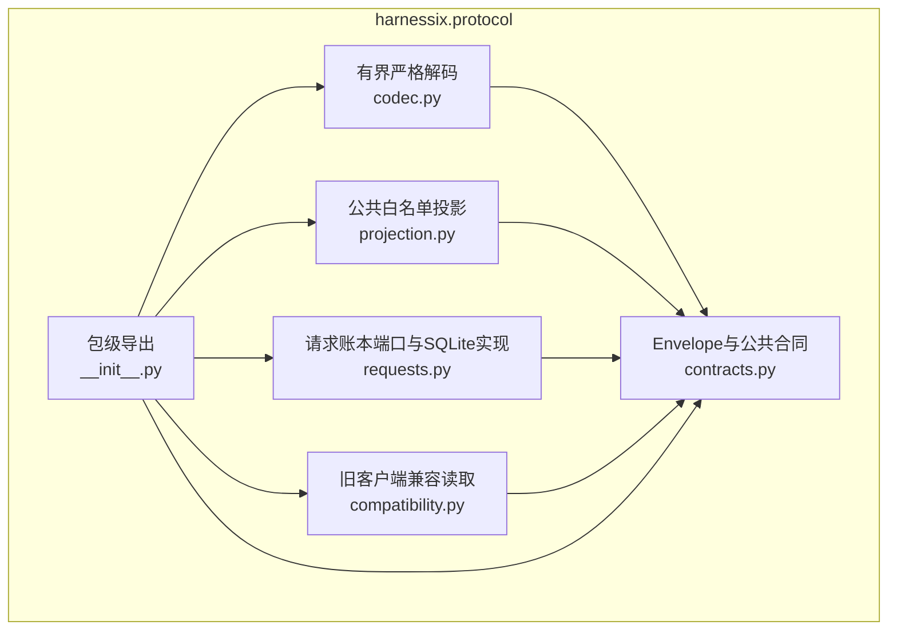

`contracts.py`是线上数据形状的唯一生成源；`codec.py`只负责帧与Envelope，不知道具体业务方法；
`projection.py`是内部到公共的防腐层；`requests.py`只记录协议命令身份与公开结果，不执行命令；
`compatibility.py`只帮助旧客户端识别通知，不拥有连接版本状态；`__init__.py`提供经过选择的包级API。

## 8. JSON-RPC Envelope合同

### 8.1 四类消息

| 模型 | 必填字段 | 约束 | 互斥语义 |
|---|---|---|---|
| `JsonRpcRequest` | `jsonrpc`、`id`、`method`；`params`默认空对象 | `jsonrpc="2.0"`；方法1～128字符；参数最多256个顶层字段 | 存在`id`即按Request解析 |
| `JsonRpcNotification` | `jsonrpc`、`method`；`params`默认空对象 | 不允许`id`；其他约束同Request | Notification处理后不产生Response |
| `JsonRpcSuccessResponse` | `jsonrpc`、`id`、`result` | `result`为JSON值 | 不允许`error` |
| `JsonRpcErrorResponse` | `jsonrpc`、`id`、`error` | 解析阶段可用`id=null`；错误结构有界 | 不允许`result` |

“Notification不产生Response”是协议合同，也是App Server正常解码路径的行为。当前App Server在
`CLOSING/CLOSED`状态会先于解码返回ID为空的`server_closing`，所以合法Notification在该边界也会收到
Error Response；这是已登记实现缺口，不应被解释为合同允许的例外。

所有模型继承`ProtocolModel`：线上别名为`camelCase`、`extra="forbid"`、`frozen=True`、
`populate_by_name=True`、`serialize_by_alias=True`和`strict=True`。`validate_protocol_input`先执行一次
JSON序列化再调用`model_validate_json`，防止进程内Python调用利用UUID、时间或数字的隐式转换绕过
真实线上JSON语义。

### 8.2 关联ID

`JsonRpcId`只接受以下两类值：

- 长度1～128的严格字符串；
- `[-(2^53-1), 2^53-1]`范围内的严格整数。

`None`、`bool`、浮点、空字符串、超长字符串和超出JavaScript安全整数范围的值均被拒绝。错误响应
允许`id=null`，仅用于服务端无法从无效帧可靠提取Request ID的场景。

### 8.3 错误结构

`JsonRpcError`包含标准数值`code`、1～512字符的安全`message`和`JsonRpcErrorData`。`data`只允许：

| 字段 | 类型与边界 | 用途 |
|---|---|---|
| `code` | 1～128字符 | 稳定机器错误码 |
| `retryable` | 布尔，默认`false` | 是否可由上层在业务语义允许时重试 |
| `path` | 最多64段字符串/整数 | 首个参数校验错误路径；字符串1～128字符，整数0～8192，不接受布尔 |
| `cursor` | 非负整数或空 | 为需要恢复位置的扩展错误预留；当前Server错误构造未填充 |

App Server当前使用`-32700`解析错误、`-32600`无效请求、`-32601`方法不存在、`-32602`参数或
版本错误、`-32603`内部错误，以及`-32010`领域/服务失败、`-32011`幂等冲突、`-32012`未初始化、
`-32015`正在关闭。Protocol只定义错误结构；具体映射由`AgentProtocolServer.process_frame`负责。

## 9. 严格入站解码

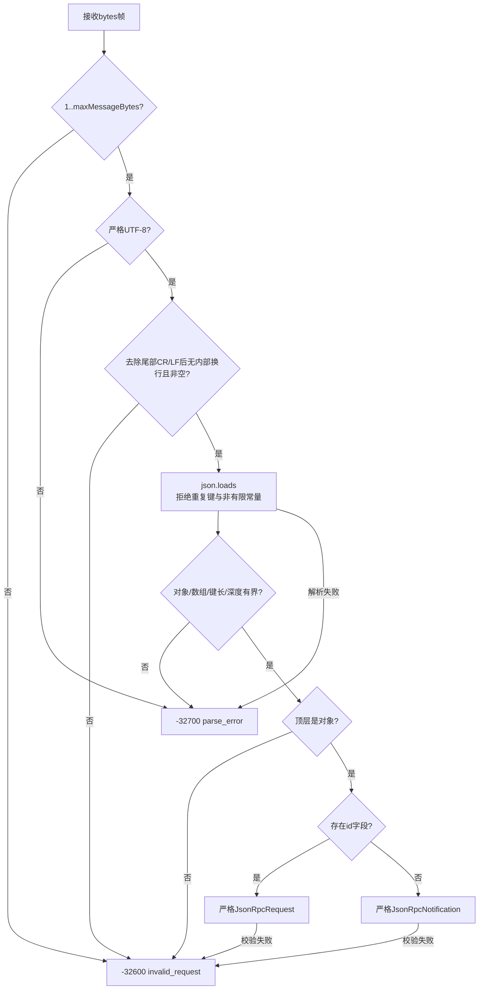

### 9.1 字节与结构限制

| 门禁 | 当前值/规则 | 失败 |
|---|---|---|
| 默认帧大小 | `1_048_576`字节；调用者可传入协商值 | `-32600 invalid_request` |
| 编码 | 严格UTF-8 | `-32700 parse_error` |
| 行结构 | 去掉尾部CR/LF后不得仍含LF；正文不得为空白 | `-32600 invalid_request` |
| JSON常量 | `NaN`、`Infinity`、`-Infinity`拒绝 | `-32700 parse_error` |
| 重复键 | 任意对象同名键拒绝 | `-32700 parse_error` |
| 深度 | `MAX_JSON_DEPTH = 64`，根从深度1计 | `-32700 parse_error` |
| 对象/数组宽度 | 每个对象或数组最多8192项 | `-32700 parse_error` |
| 对象键长度 | 每个键最多8192字符 | `-32700 parse_error` |
| 顶层类型 | 只能是对象；数组即Batch，明确拒绝 | `-32600 invalid_request` |
| Envelope | 由是否存在`id`选择Request或Notification，再严格验证 | `-32600 invalid_request` |

`_bounded_json`在完整`json.loads`之后遍历对象，因此当前实现不是增量流式解析；字节上限是抵御大输入的
第一道边界。尾部CR/LF由解码器容忍，实际stdio通过`readline(max_message_bytes + 1)`提供一行帧。

### 9.2 入站校验的两级模型

1. `decode_client_frame`只验证字节、JSON和通用Envelope；未知方法仍可成为合法Request；
2. `AgentProtocolServer`确认连接状态和方法存在后，使用对应Params模型执行第二次严格校验。

这一区分保证解析错误、无效Request、方法不存在和参数错误具有不同稳定语义，也避免Codec依赖App
Server方法表。

## 10. 初始化、能力与资源限制协商

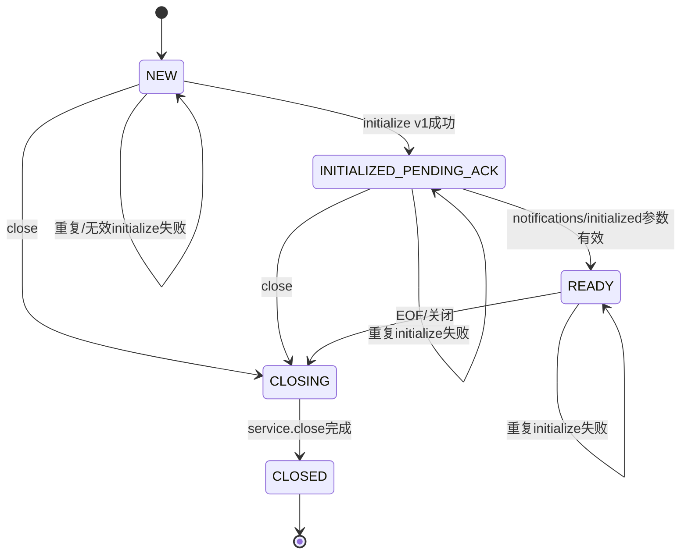

连接状态属于[`AgentProtocolServer`](../../src/harnessix/app_server/server.py)，不是Protocol包内持久状态。
握手顺序固定为：

1. Client发送`initialize` Request；
2. Server严格校验`InitializeParams`；该模型当前把`protocolVersion`声明为`Literal["1.0"]`；
3. Server固定`clientInstanceId`、协商Limit并返回`InitializeResult`；
4. Client发送`notifications/initialized` Notification；
5. Server校验空`InitializedParams`后进入`READY`；
6. 进入`READY`前的业务Request返回`-32012 not_initialized`。

当前存在一个实现与错误合同不一致点：非`1.0`值会在步骤2的Pydantic校验阶段直接返回
`-32602 invalid_params`，因此[`AgentProtocolServer._initialize`](../../src/harnessix/app_server/server.py)
后续用于返回`unsupported_protocol_version`的显式比较分支不可达。现行客户端必须把该场景按
`invalid_params`处理；专用版本错误码只能在合同类型与Server分支同步修复并增加回归测试后对外承诺。

### 10.1 初始化字段

| 结构/字段 | 规则 | 当前运行时用途 |
|---|---|---|
| `ClientInfo.name` | 1～64字符的字母数字起始标识，后续允许`_.-` | 仅合同标识，当前不持久化、不用于授权 |
| `ClientInfo.version` | 1～64字符 | 仅协议信息，当前不参与兼容选择 |
| `protocolVersion` | 只能为`1.0` | 精确匹配，不支持范围协商 |
| `clientInstanceId` | UUID | 固定到连接并参与写命令账本主键 |
| `capabilities` | 五个布尔能力 | 当前仅`itemDeltas`直接改变事件返回行为 |
| `limits` | 四个有界整数 | Server逐字段返回Client与Server配置的最小值 |

### 10.2 能力现状

| 能力字段 | 客户端默认 | 当前服务端行为 | 现状结论 |
|---|---:|---|---|
| `itemDeltas` | `false` | 保存到连接；返回能力与请求值一致；控制`events/next`是否取实时Delta | 已实施协商 |
| `serverRequests` | `true` | 当前不发服务端Request，返回`serverRequests=()` | 声明存在，能力未开放 |
| `artifactPages` | `true` | 服务端只依据是否装配Scoped Reader决定是否广告`artifact/read` | 未根据客户端布尔关闭方法 |
| `replay` | `true` | 服务端固定广告`replay=true`并开放Replay | 未根据客户端布尔关闭方法 |
| `ignoredNotificationMethods` | `true` | 当前App Server不推送通知；兼容函数可忽略未知通知 | 未参与服务端分支 |

### 10.3 Limit合同与实际执行

| Limit | 合同范围/默认 | 当前实际使用 | 已知差距 |
|---|---|---|---|
| `maxMessageBytes` | 4096～8 MiB；默认1 MiB | 握手后Codec与stdio后续`readline`使用协商最小值 | 出站Response未用`protocol_json_size`强制同一字节上限 |
| `maxPendingRequests` | 1～1024；默认64 | stdio以Server构造时的值建立Semaphore | Queue在握手前创建，客户端提出的更小值不会缩小已创建Semaphore |
| `maxOutboundMessages` | 8～4096；默认256 | stdio以Server构造时的值建立有界Queue | 同样在握手前创建，客户端更小值不改变Queue容量 |
| `maxReplayEvents` | 1～1000；默认256 | 协商值写入结果 | `AgentApplicationService`当前按请求`limit`执行，未再按协商值收紧 |

因此`InitializeResult.limits`当前不能全部解释为服务端强制执行的动态配额。`maxMessageBytes`有真实入站
门禁；另外三项主要描述配置与容量，部分客户端协商值尚未贯穿运行时。该差距必须在后续协议演进时
修复或重新定义，不能在客户端文档中承诺为全部强制Limit。

## 11. 方法合同与职责分类

### 11.1 当前方法基线

`AgentProtocolServer.SERVER_METHODS`固定、排序后公开16个方法；只有装配
`ScopedProtocolArtifactReader`时才额外公开`artifact/read`。`initialize`虽然位于方法表中，但只能在
`NEW`状态由专用分支处理。方法参数模型存在不代表方法自动开放，最终以握手返回的`methods`为准。

| 方法 | Params/Result | 分类 | `requestId`账本 | 核心语义 |
|---|---|---|---:|---|
| `initialize` | `InitializeParams → InitializeResult` | 连接控制 | 否 | 固定协议、客户端实例、能力和Limit |
| `thread/create` | `ThreadCreateParams → ThreadResult` | 写命令 | 是 | 校验绝对Workspace；固定产品可进一步限制根；派生稳定Thread UUID |
| `thread/get` | `ThreadGetParams → ThreadResult` | 查询 | 否 | 读取并投影Thread Snapshot |
| `thread/list` | `ThreadListParams → ThreadListResult` | 查询 | 否 | UUID字符串顺序分页，Session先按归档状态过滤再限页；只校验选中页的完整投影 |
| `thread/resume` | `ThreadResumeParams → ThreadResult` | 恢复控制 | 否 | 恢复Thread并可能重新驱动活动Turn |
| `thread/fork` | `ThreadForkParams → ThreadResult` | 写命令 | 是 | 从指定Thread和可选Turn边界派生Fork |
| `thread/archive` | `ThreadArchiveParams → ThreadResult` | 写命令 | 是 | 写入归档事实与可选原因 |
| `turn/start` | `TurnStartParams → TurnResult` | 写命令 | 是 | 持久接受Turn后在后台驱动 |
| `turn/retry` | `TurnRetryParams → TurnResult` | 写命令 | 是 | 从来源Turn创建显式Retry |
| `turn/resume` | `TurnResumeParams → TurnResult` | 写命令 | 是 | 恢复指定Turn执行 |
| `turn/cancel` | `TurnCancelParams → TurnResult` | 写命令 | 是 | 请求确定性取消 |
| `turn/steer` | `TurnSteerParams → TurnResult` | 写命令 | 是 | 给活动Turn增加有界用户指令 |
| `approval/respond` | `ApprovalRespondParams → TurnResult` | 写命令 | 是 | 绑定Thread、Turn、Approval、指纹和决定 |
| `question/respond` | `QuestionRespondParams → TurnResult` | 写命令 | 是 | 绑定Thread、Turn和Question提交答案 |
| `events/replay` | `EventsReplayParams → EventsReplayResult` | 查询 | 否 | 从持久Session事件扫描并投影公开页面 |
| `events/next` | `EventsNextParams → EventsNextResult` | 长轮询查询 | 否 | 优先返回持久进展，再按协商返回实时Delta |
| `artifact/read` | `ArtifactReadParams → ArtifactPageResult` | 条件查询 | 否 | 在Thread与Workspace授权下分页读取Artifact |

### 11.2 写命令与查询的边界

`AgentCommandParams`联合类型包含10种带`requestId`的写命令；`AgentQueryParams`包含6种查询或恢复参数。
这两个联合主要用于生成Schema，不参与Server运行时自动分派。`thread/resume`虽然可能触发后台恢复，当前
被建模为不带协议账本的查询/控制操作；它依赖Agent Runtime自身恢复幂等，而不是
`ProtocolRequestStore`。该差异是现行合同，客户端不能自行给它添加`requestId`。

### 11.3 参数边界摘要

| 参数 | 关键限制 |
|---|---|
| `CommandParams.requestId` | 1～256字符；不是JSON-RPC `id` |
| `ThreadCreateParams.workspace` | 1～4096字符、宿主绝对路径、不得含NUL；存在性和固定根匹配由App Server进一步校验 |
| `ThreadListParams` | `limit` 1～200；游标1～512字符；归档过滤可空 |
| `TurnStartParams.prompt` | 1～1,000,000字符；可选`PublicBudget` |
| `TurnSteerParams.text` | 1～1,000,000字符 |
| `ApprovalRespondParams.fingerprint` | 64位小写十六进制；决定包含approved/rejected、Actor与Reason |
| `QuestionRespondParams.answer` | 1～4000字符 |
| `EventsReplayParams` | `afterCursor ≥ 0`；`limit` 1～1000，默认256 |
| `EventsNextParams` | `waitMs` 0～30000，默认30000；其余同Replay |
| `ArtifactReadParams` | 记录Offset 0～10000；记录数Limit 1～200，默认100 |

## 12. 公共输出模型

### 12.1 公共模型层次

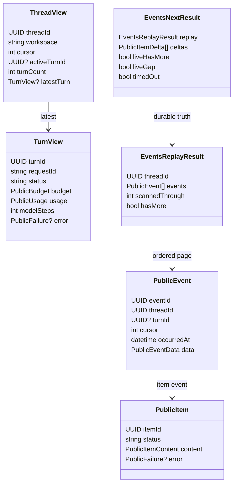

`ThreadView`是摘要而不是完整聚合：只包含最新Turn、Turn数量、活动Turn、Fork来源、归档和时间；不包含
历史Turn数组或Items。`TurnView`包含预算、用量、步骤和失败，但不包含Items、Prompt、Trace Context、
Provider尝试和内部请求指纹。完整用户可见过程通过Public Event Replay读取。

### 12.2 公共Item内容

`PublicItemContent`以`kind`作为判别字段，共10个模型、12种`kind`值：

| `kind` | 公共内容 | 明确省略/说明 |
|---|---|---|
| `user_message` | 用户文本 | 用户内容会公开给同一受信客户端 |
| `assistant_message` | 助手文本 | 最大1,000,000字符 |
| `reasoning_summary` | 允许公开的推理摘要文本 | 不代表公开Provider原始推理流 |
| `tool_call` | Call ID、Tool名/版本、效果类别、参数、审批要求 | 省略Provider Call ID与Tool Fingerprint；参数仍可能敏感 |
| `tool_result` | Call ID、Outcome、Output、PublicFailure、Action ID、Diff Artifact | Output是公共JSON值，不做通用脱敏 |
| `approval_request` | 类型、Approval/Call ID、请求指纹、Policy版本、决定、可选Diff | 省略内部执行Plan；Actor/Reason会在决定后公开 |
| `question_request` | Question/Call ID、问题、最多8个唯一选项 | 只投影UI所需字段 |
| `question_answer` | Question/Call ID与答案 | 答案属于用户内容 |
| `process_action_state` | Call/Action ID、状态、execution/recovery来源 | 不公开完整Process计划与收据 |
| `plan` | 最多32步的ID、描述、状态与可选被取代Item ID | 只接受pending/in_progress/completed |
| `context_compaction` | 来源Item数量、压缩前后Token、Tokenizer | 不公开摘要正文和来源Item ID |
| `error` | `PublicFailure` | 只使用公开失败结构 |

前三类文本共享`PublicTextContent`，因此判别联合实际由十个模型承载十二个可能的`kind`值。

### 12.3 失败、预算、用量和Artifact

| 结构 | 不变量 |
|---|---|
| `PublicFailure` | `code` 1～128、`message`最多2000、`retryable`与十类稳定Category；由`AgentFailure`白名单投影 |
| `PublicBudget` | `maxSteps` 1～1000；`maxTokens ≥ 1`；有限`timeoutSeconds`且≤86400；输出字符≤1,000,000；每步Tool Call 1～128 |
| `PublicUsage` | 三个非负严格整数；`totalTokens == inputTokens + outputTokens` |
| `PublicArtifactRef` | UUID、64位SHA-256、大小≤1 MiB、记录≤10000、`jsonl/v1`、完成标志和带时区过期时间 |
| `ArtifactPageResult` | 文本≤24 Ki字符；Offset/Next Offset 0～10000；分页单位是记录位置，不是原始字节位置 |

## 13. 内部事实的白名单投影

### 13.1 投影原则

`projection.py`不复用内部模型的完整序列化结果，而是逐类型构造公共模型。这形成默认拒绝边界：新增
内部Item类型会触发`TypeError`，新增内部Event类型会返回`None`，不会因内部Schema扩张而意外进入公共
协议。

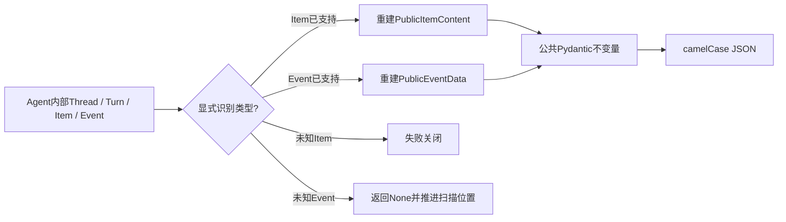

未知Item代表代码没有定义如何安全公开，因而失败；未知Event可能只是内部诊断事实，因而过滤。两种策略
不同是有意的：Item已经被某个公开事件选中时必须完整说明其公共形态，而事件流本身允许只公开固定子集。

### 13.2 当前公开事件允许列表

| 内部Payload | 公共`data.type` | 主要字段 |
|---|---|---|
| `ThreadCreated` | `thread_created` | Workspace |
| `ThreadForked` | `thread_forked` | Workspace、来源Thread ID |
| `ThreadArchived` | `thread_archived` | 原因 |
| `TurnStarted` | `turn_started` | Request ID、Retry来源、预算；不直接带Prompt |
| `TurnStateChanged` | `turn_state_changed` | 状态与公开失败 |
| `ItemStarted` | `item_started` | 状态固定为started的公共Item |
| `ItemFinished` | `item_finished` | 完成/失败/取消状态的公共Item |
| `UsageRecorded` | `usage_updated` | 模型步骤与累计公开用量 |
| 其他内部Payload | 不公开 | `project_event`返回`None` |

Provider Attempt、Context检查、压缩尝试账本、内部执行准备和其他诊断事件不直接公开。Prompt最终可通过
`user_message` Item出现在公共事件中，故“TurnStarted省略Prompt”不等于Prompt在整个协议中不可见。

### 13.3 字段去除与保留矩阵

| 内部数据 | 公共处理 | 原因/风险 |
|---|---|---|
| `provider_call_id` | 去除 | 供应商私有关联值，不构成产品公共身份 |
| `tool_fingerprint` | 去除 | 内部Tool定义完整性元数据，不提供客户端授权能力 |
| 审批内部Plan | 去除 | 防止客户端依赖内部执行表示 |
| 审批请求指纹/Policy版本 | 保留 | 客户端响应必须绑定服务端发出的批准对象 |
| 审批Actor/Reason | 保留 | 用户界面与审计可见字段；可能含用户输入，应按受信客户端处理 |
| Tool参数与结果 | 保留 | Coding UI需要；可能包含路径、源码或命令输出，不是脱敏字段 |
| Compaction摘要正文/来源Item ID | 去除 | 内部Context实现细节 |
| Compaction计数与Tokenizer | 保留 | 解释Context预算变化 |
| Process完整计划/环境/Secret引用 | 去除 | 只公开Action ID、状态和执行/恢复来源 |
| Thread Workspace | 保留 | 客户端定位会话所需；本地绝对路径属于敏感运行元数据 |
| Agent Trace Context | 去除 | 不向产品协议暴露遥测传播细节 |

## 14. Replay、实时Delta与恢复游标

### 14.1 持久Replay

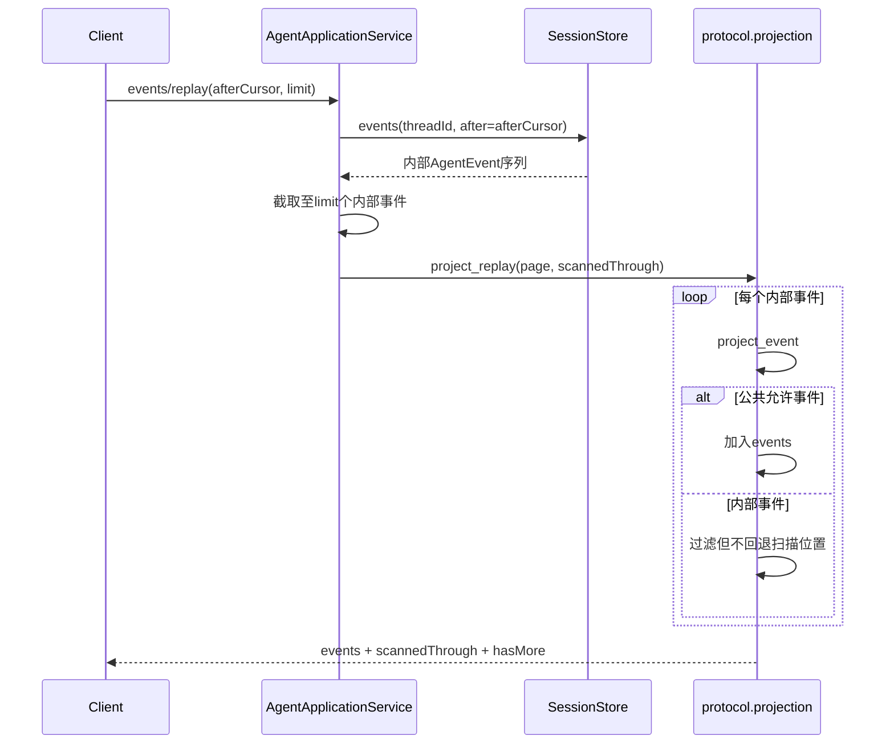

App Server先按内部事件数量截页，再投影。因此一个页面可能没有任何公开Event，但
`scannedThrough > afterCursor`，表示客户端仍应推进游标。`EventsReplayResult`要求公开Event Cursor严格
递增且不超过`scannedThrough`，但允许`1, 7, 9`之类的间隔。客户端必须使用`scannedThrough`而不是
“最后公开Cursor加一”继续读取。

### 14.2 Pull-Live Delta

`EventsNextResult`把可靠与非可靠数据显式分层：

- `replay`始终存在，是可重启恢复的持久事实；
- `deltas`最多1000条，仅用于低延迟显示；
- 每个Delta绑定Thread、Turn、Item、模型步骤和从1开始的Stream Sequence；
- 同一结果中`(itemId, streamSequence)`必须唯一，且所有Delta必须属于Replay的Thread；
- `liveHasMore`表示当前内存Buffer还有Delta；
- `liveGap`表示1000条Buffer曾溢出，客户端应依靠后续持久Item恢复；
- `timedOut=true`时不得同时携带Replay事件、`hasMore`、Delta、Live More或Gap。

当前App Server的`events/next`先检查持久进展；没有进展且客户端协商`itemDeltas=true`时才消费内存
Delta。长轮询最多30秒，并以50毫秒轮询观察不产生Delta的审批、提问、Tool和终态事件。该调度属于
App Server，Protocol只定义结果一致性。

### 14.3 客户端恢复算法

```text
cursor := 本地最后确认的scannedThrough或ThreadView.cursor之前的读取位置

loop:
    page := events/next(threadId, afterCursor=cursor, limit=N)
    apply page.replay.events in ascending cursor order
    cursor := max(cursor, page.replay.scannedThrough)

    render page.deltas only as transient UI
    if page.liveGap:
        discard assumptions about complete delta stream
        wait for durable item event or reload snapshot/replay

    if page.replay.hasMore or page.liveHasMore:
        continue immediately
    if page.timedOut:
        continue, cancel, or back off according to client lifecycle
```

SDK中的对应推进规则见[`AgentClient.watch_thread`](../../src/harnessix/sdk/agent_client.py)。

## 15. 持久命令幂等账本

### 15.1 身份与指纹

协议账本主键是`(client_instance_id, request_id)`。参数指纹计算为：

```text
SHA256(method + "\n" + canonical_json(params))
```

规范JSON使用UTF-8、键排序、紧凑分隔符、保留Unicode并拒绝非有限数。方法1～128字符；参数规范JSON
和终态结果均不得超过1 MiB。账本只保存`params_sha256`，不保存原始参数，因此Prompt或Steer文本不会
因命令幂等机制额外复制到`protocol_requests`表。

### 15.2 状态机

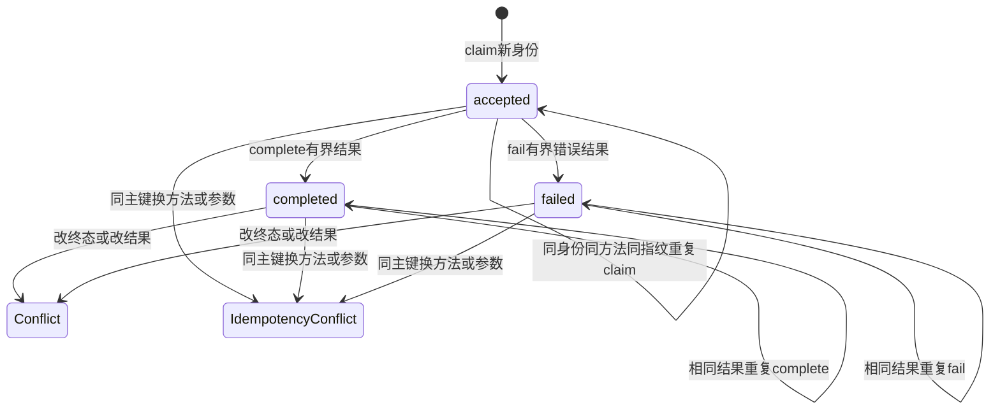

`accepted`、`completed`和`failed`是协议命令处理状态，不是Turn状态。终态不可逆；相同终态与相同公开
结果允许幂等调用，不同状态或结果返回`request_state_conflict`。不存在的请求不能直接完成或失败。

### 15.3 Claim与完成事务

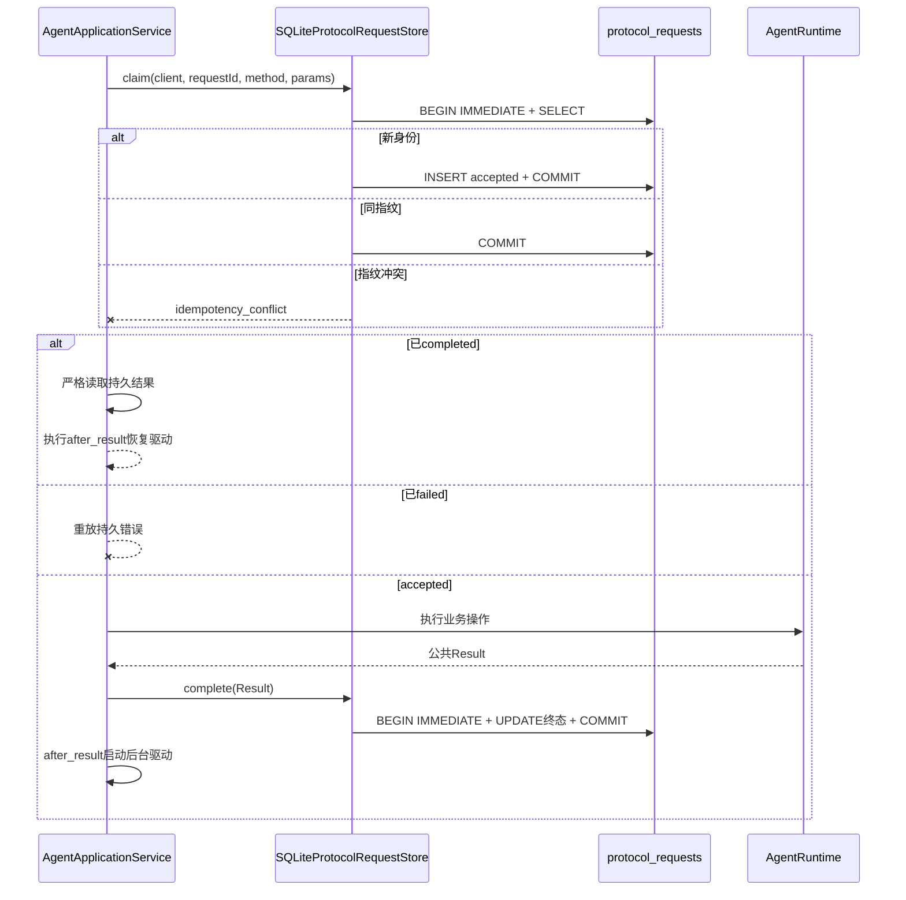

`BEGIN IMMEDIATE`串行化同库写事务；连接设置`busy_timeout=5000`和外键检查，异常时回滚。每个Store
操作创建独立连接，Store本身不持有长生命周期连接，也没有`initialize`/`close`方法。

### 15.4 与领域幂等的关系

协议账本只保证相同命令身份不会被静默换成另一组参数。崩溃可能发生在“领域事实已写入、协议终态尚未
写入”之间，此时账本仍为`accepted`，重试会再次调用领域操作。生产正确性因此同时依赖：

- `thread/create`通过`uuid5(clientInstanceId, requestId)`派生稳定Thread ID；
- Agent Runtime以命令`requestId`、Thread/Turn状态和Session CAS识别已接受事实；
- `turn/start`等命令先持久接受事实，再由`after_result`启动后台驱动；
- 重放已完成结果时仍执行必要的`after_result`，弥补“协议完成后、后台Task调度前”崩溃窗口；
- `thread/resume`可以重驱动仍处于可恢复活动状态的Turn。

Protocol Request Store不是Exactly-once副作用引擎。工具与外部副作用的幂等、Lease、`UNKNOWN`和
Reconcile由Agent Runtime、Execution、Trusted Action Runtime及具体能力的效果Owner共同负责。

## 16. 持久化模型、事务与完整性

### 16.1 表结构

`protocol_requests`由Session Migration
[`0020_protocol_requests.sql`](../../src/harnessix/session/migrations/0020_protocol_requests.sql)创建。
Request Store要求调用方先完成`SQLiteSessionStore.initialize()`；它不会自行建表或校验Migration链。

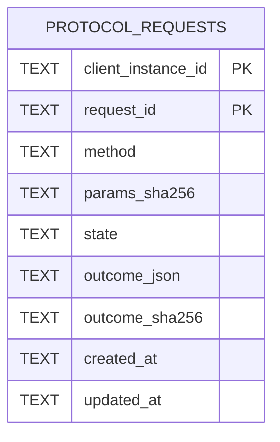

| 字段 | 来源 | 约束与语义 | 敏感级别 |
|---|---|---|---|
| `client_instance_id` | 初始化UUID | 与`request_id`组成主键；逻辑客户端作用域 | 受控标识 |
| `request_id` | Command Params | 1～256字符；调用方生成的持久命令ID | 受控标识，可能被人为命名 |
| `method` | Server分派常量 | 1～128字符；指纹输入的一部分 | 非敏感协议元数据 |
| `params_sha256` | 规范方法与参数 | 64位SHA-256；用于检测同键换载荷 | 摘要，不应视为匿名化证明 |
| `state` | Store转换 | `accepted/completed/failed`；数据库CHECK | 非敏感状态 |
| `outcome_json` | 公共Result或白名单错误 | accepted时必须为空，终态必须存在；最多1 MiB；当前命令主要保存Thread/Turn摘要或错误 | 可能包含Workspace和清洗错误消息；通用端口仍允许其他公共JSON |
| `outcome_sha256` | 规范终态JSON | 与正文同时空或同时存在；读取时重算 | 完整性摘要 |
| `created_at` | Store墙钟UTC | 新Claim时ISO 8601带时区字符串 | 运维元数据 |
| `updated_at` | Store墙钟UTC | 终态更新时间；相同终态幂等调用不改写 | 运维元数据 |

主键和两个CHECK约束保证：结果正文与摘要成对出现；`accepted`恰好对应无结果，终态恰好对应有结果。
索引`protocol_requests_state_idx(state, updated_at)`为状态扫描预留，但当前Protocol包没有GC、恢复扫描或
运维查询API。

### 16.2 读取完整性

`SQLiteProtocolRequestStore._record`按以下顺序验证数据库行：

1. `outcome_json`与`outcome_sha256`必须同时为空或同时存在；
2. 存在结果时重算SHA-256并精确匹配；
3. 解析JSON，拒绝损坏与递归错误；
4. 将所有列通过`ProtocolRequestRecord`严格模型重建；
5. 任一步失败统一返回`request_corrupt`，不把损坏内容作为业务结果返回。

SHA-256用于发现意外损坏或越界改写，不是MAC或数字签名；能写数据库的同权限恶意进程可以同时改正文
和摘要。数据库文件保护、备份与Migration完整性属于Session和部署职责。

### 16.3 事务和并发

| 操作 | 事务 | 并发保证 | 失败后状态 |
|---|---|---|---|
| `get` | 只读隐式事务 | 读取一个主键 | 无写入 |
| `claim` | `BEGIN IMMEDIATE` | 同库写者串行；先查后插不会发生普通丢失更新 | 插入前失败无记录；提交后为accepted |
| `complete/fail` | `BEGIN IMMEDIATE` | 锁内读状态并只更新accepted | 提交前回滚；提交后终态不可逆 |
| 连接异常 | 上下文管理器回滚 | 不保留半次Store事务 | 调用方获得原数据库异常或稳定ProtocolRequestError |

该实现依赖SQLite单文件事务，没有进程内Lock；跨进程一致性来自SQLite写锁和主键/CHECK约束。`busy_timeout`
为5秒，但没有应用级取消令牌或自动重试。阻塞、磁盘错误和`aiosqlite`异常不统一映射为
`ProtocolRequestError`，可能最终由App Server清洗为`internal_error`。

## 17. 正常业务流程

### 17.1 创建Thread并启动Turn

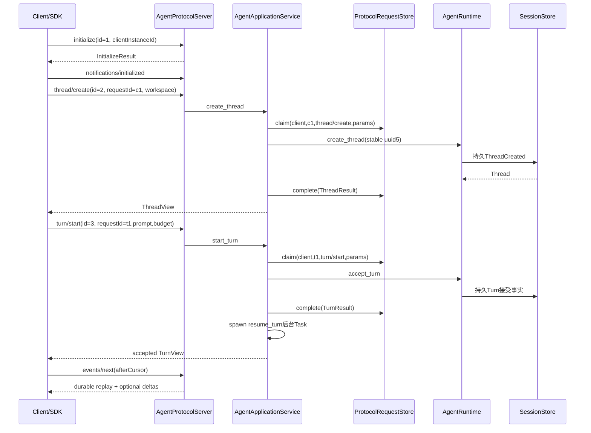

协议成功响应表示相应应用服务已返回并按写命令顺序完成账本终态。`turn/start`成功并不表示模型执行已经
结束，而是Turn已经被领域层接受；后续进度与终态通过Replay获取。

### 17.2 审批或提问响应

客户端先从Replay读取服务端生成的Approval/Question Item，再提交带完整身份的Response。审批必须同时
绑定Thread ID、Turn ID、Approval ID和64位请求指纹；Question绑定Thread、Turn和Question ID。应用服务
将公共决定转换为领域`ApprovalDecision`，Runtime重新验证待决对象。Protocol账本只防重复Command，不能
替代领域对过期、错Turn、错指纹和不同决定的检查。

### 17.3 Artifact分页

`artifact/read`只在App Server装配`ScopedProtocolArtifactReader`时进入方法表。读取器先从同一Session
加载Thread，再根据Thread Workspace获取Artifact Scope，最后读取指定Artifact页并投影为
`ArtifactPageResult`。Protocol模型限制单页字符与记录范围；Thread归属、Workspace授权、Artifact摘要和
过期检查由App Server与Artifact模块执行。

## 18. 失败、取消与崩溃恢复

### 18.1 失败分类

| 失败点 | 对外错误/状态 | 是否进入领域层 | 恢复动作 |
|---|---|---:|---|
| 空帧/超长帧/顶层非对象/Envelope无效 | `invalid_request` | 否 | 修正帧；不要复用未被受理的业务假设 |
| 非UTF-8/无效JSON/重复键/深度或宽度超限 | `parse_error` | 否 | 修正编码或JSON |
| READY前调用业务方法 | `not_initialized` | 否 | 完成两步握手 |
| 未注册方法 | `method_not_found` | 否 | 读取协商`methods`，不要按Schema猜测 |
| Params不满足严格合同 | `invalid_params`与首个字段路径 | 否 | 修正字段、类型或边界 |
| 相同幂等键换方法/参数 | `idempotency_conflict` | 否 | 生成新`requestId`表达新业务意图 |
| 账本结果或记录损坏 | `request_corrupt`，通常映射领域服务错误 | 否/不继续 | 停止重放，恢复一致数据库备份并审计 |
| Agent Runtime稳定失败 | `-32010`与领域`code/retryable` | 可能已写领域事实 | 按领域错误和Snapshot决定Retry/Resume |
| 未预期异常 | `-32603 internal_error`，不公开原异常 | 未知 | 读取持久Thread/Replay和账本状态后恢复 |
| Server关闭 | `-32015 server_closing`或连接EOF | 不保证 | 重连新进程，使用相同客户端实例和命令ID |
| Closing/Closed时发送Notification | 当前在解码前返回`server_closing` Error Response | 否 | 客户端关闭连接；服务端需恢复Notification单向合同 |
| 实时Delta溢出 | `liveGap=true` | 领域执行继续 | 丢弃增量完整性假设，依赖持久Item Replay |
| `events/next`无进展到期 | `timedOut=true` | 无变更 | 继续轮询、退避或按客户端生命周期取消等待 |

### 18.2 响应丢失后的命令重试

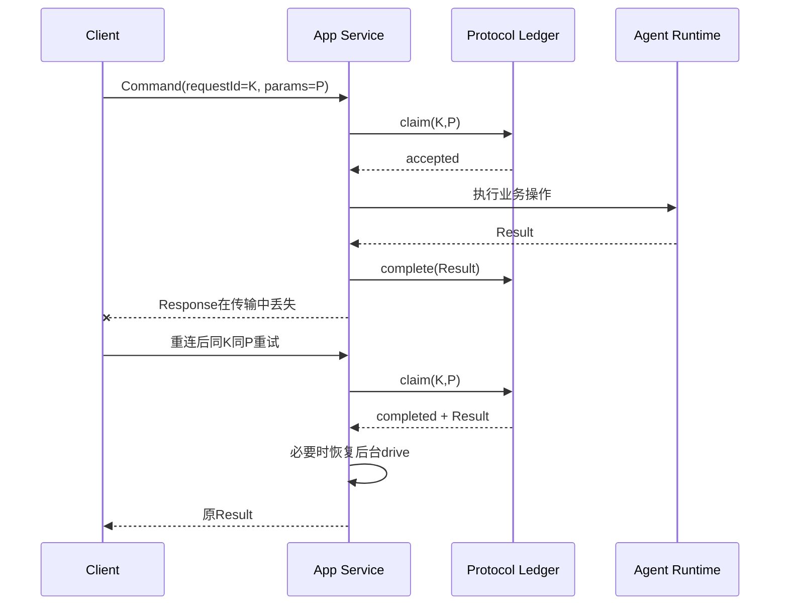

客户端必须保留原`clientInstanceId`、`requestId`和参数。更换`requestId`会被视为新意图；保留键但更换
参数会得到冲突。JSON-RPC `id`可在新连接中重新生成，因为它不参与账本主键。

### 18.3 三个崩溃窗口

| 窗口 | 可查询事实 | 重试行为 |
|---|---|---|
| Claim提交前崩溃 | 无Protocol记录、无本次领域调用 | 同键重试创建accepted并执行 |
| Claim后、领域接受前崩溃 | Protocol为accepted，领域可能无事实 | 同键重试再次调用领域；领域校验决定是否接受 |
| 领域接受后、Protocol完成前崩溃 | Protocol为accepted，Session已有事实 | 同键重试再次调用领域；稳定身份与领域幂等返回同一聚合结果，再完成账本 |
| Protocol完成后、后台Task创建前崩溃 | Protocol为completed，Session为可运行状态 | 同键重放结果时执行`after_result`；或`thread/resume`重驱动 |
| 后台执行中崩溃 | Protocol命令通常已completed，Session停留在可恢复状态 | 重连读取Snapshot/Replay并调用`thread/resume`或`turn/resume` |

### 18.4 取消和超时归属

- Codec和合同校验是同步、有界计算，没有独立Cancel Token；
- Request Store没有显式操作超时，SQLite忙等待上限为5秒；
- `events/next.waitMs`是协议级长轮询时限，不取消Agent Turn；
- `turn/cancel`是带账本的业务命令，确定终态由Agent Runtime负责；
- stdio出站等待默认5秒，超时触发连接停止，但不把断连解释为Turn取消；
- App Server关闭最多等待后台Turn 5秒，之后取消Task并依赖Runtime提交确定性取消事实；
- Protocol不定义外部副作用结果未知，对账语义由执行子系统负责。

### 18.5 当前异常持久化边界

`AgentApplicationService._command`只把`KernelError`和`ProtocolRequestError`转换并尝试写入failed终态；
`idempotency_conflict`不会覆盖原记录。由应用服务自身抛出的`AgentServiceError`、数据库驱动异常和其他
未预期异常不会统一写入failed，账本可能保留accepted。重试时这些命令会重新进入业务Operation，并依赖
领域幂等恢复。该行为避免把未知中间状态武断冻结为失败，但也意味着Protocol账本不是完整异常审计日志。

## 19. 数据流与敏感数据

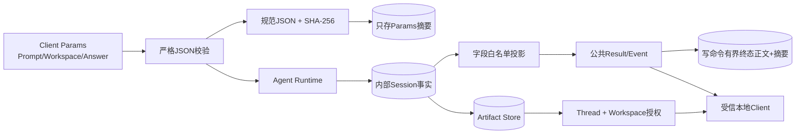

**图示说明：** 原始命令参数进入领域层，但协议账本只保存参数摘要。公共终态可能被账本保存并重放，
因此当前写命令结果中的Workspace、Turn摘要和清洗错误消息仍会落盘；通用账本端口也允许其他有界公共
JSON。大正文应进入Artifact后分页读取，但`PublicToolResultContent.output`本身仍是JSON值，Protocol没有
通用强制外置或DLP。

**源码映射：** 参数规范化见[`request_fingerprint`](../../src/harnessix/protocol/requests.py)，内部投影见
[`project_item`](../../src/harnessix/protocol/projection.py)，终态保存见
[`SQLiteProtocolRequestStore._finish`](../../src/harnessix/protocol/requests.py)，Artifact授权见
[`ScopedProtocolArtifactReader`](../../src/harnessix/app_server/artifacts.py)。

## 20. 并发、顺序与生命周期

### 20.1 并发模型

Protocol包没有全局事件循环或线程池。并发语义由调用者与SQLite共同提供：

1. Codec、合同和投影对象无可变模块状态，可由多个Request并发调用；
2. `SQLiteProtocolRequestStore`每次操作打开独立连接，通过数据库事务串行化写入；
3. App Server在握手完成前串行处理帧，READY后以Semaphore限制并发Request；
4. stdout只有一个Writer Task，避免并发响应字节交错；响应允许按完成顺序乱序返回，以JSON-RPC `id`关联；
5. 同一Thread的领域变更由Agent Runtime自己的锁与Session CAS保护，Protocol账本不替代它们；
6. Replay返回Session顺序，Delta Buffer按到达顺序消费；二者不合并为一个Exactly-once序列。

### 20.2 对象生命周期

| 对象 | 创建 | 结束 | 所有者 |
|---|---|---|---|
| `ProtocolModel` | 单次解码、投影或兼容读取 | 引用释放 | 调用函数 |
| `AgentProtocolServer` | 单个stdio客户端连接启动 | EOF、慢客户端或显式关闭 | App Server宿主 |
| `clientInstanceId`绑定 | initialize成功 | 连接对象销毁；值仍用于持久账本 | Server连接状态 |
| `SQLiteProtocolRequestStore` | 产品装配Session DB后 | 无显式关闭动作 | 产品宿主；连接按调用关闭 |
| Protocol Request记录 | 首次Claim | accepted持续保留；completed/failed可由显式Plan-first离线维护按Cutoff删除 | Session数据库 |
| Public Replay页面 | 单次查询 | 客户端消费后释放 | App Service/Client |
| Live Delta | Runtime回调入内存Deque | 被取走、溢出或进程退出 | App Service |

### 20.3 顺序不变量

- Request与Response由JSON-RPC `id`相关，不依赖物理输出顺序；
- 写命令的`requestId`只在客户端实例内唯一；
- 公开事件Cursor严格递增但可跳跃；
- 同一`EventsNextResult`内Delta身份唯一，但合同未要求跨页面Sequence完全连续；
- 协议账本终态在后台Turn驱动前提交；后台驱动可由重放或Resume恢复；
- 正常解码路径中Notification不产生Response，SDK不能用“发送后读取一条响应”的同步交换模式处理它；
  Closing/Closed前置错误是待修复实现偏差。

## 21. 安全与隐私边界

### 21.1 已实现控制

| 攻击/风险 | 当前控制 | 验证入口 |
|---|---|---|
| 超长输入导致内存放大 | 默认1 MiB帧上限；stdio有界读取 | `test_decode_enforces_frame_and_depth_limits` |
| JSON重复键造成解析歧义 | `object_pairs_hook`拒绝重复字段 | `test_decode_rejects_invalid_frames` |
| 非有限数与隐式类型转换 | `allow_nan=False`语义、严格Pydantic、JSON Round-trip | `test_public_budget_and_limits_are_finite_and_bounded` |
| 深层/超宽JSON消耗 | 深度64、集合8192、键长8192 | Codec合同测试 |
| 未知输入字段被静默忽略 | 入站模型`extra="forbid"` | `test_initialize_and_command_params_use_camel_case_and_reject_unknown_fields` |
| 客户端伪造内部事实 | 只开放命令/查询Params；无Agent Event写入接口 | 公共Schema与Server方法表 |
| 同键替换Prompt或命令 | 方法+规范参数SHA-256冲突检测 | `test_same_request_id_with_different_command_is_rejected` |
| 原始Prompt复制到幂等表 | 只保存参数摘要 | `test_claim_is_durable_idempotent_and_does_not_store_params` |
| 协议终态被单独篡改 | 正文摘要重算、严格记录模型、数据库CHECK | `test_corrupt_outcome_is_detected` |
| 内部Provider/Context字段泄漏 | 显式公共投影，未知Event过滤 | `test_runtime_events_project_to_public_cursor_stream` |
| Approval对象被替换 | 公共响应携带请求指纹，领域层再次验证 | App Server审批测试与Agent审批测试 |
| Artifact越权读取 | 条件开放方法，绑定同一Session、Thread与Workspace Scope | `test_artifact_read_is_advertised_only_with_scoped_reader` |
| 内部异常直接暴露 | 未预期异常返回固定`internal_error`消息 | App Server异常映射测试 |

### 21.2 公开不等于脱敏

以下字段会按当前产品合同返回受信客户端，并可能出现在协议账本终态、SDK内存、CLI输出或客户端日志中：

- Workspace绝对路径；
- 用户消息、Steer文本、Question和Answer；
- Tool名称、版本、参数和结果；
- 助手消息与允许公开的Reasoning Summary；
- Approval Actor、Reason、Policy版本和请求指纹；
- PublicFailure消息、Artifact文本页和计划描述。

因此Protocol的安全目标是“阻止内部私有结构被意外透传”，不是“删除所有用户内容或Secret”。上游Tool、
Provider、Artifact、日志和UI必须遵循各自的Secret与输出策略。客户端不得把完整Transcript默认上传到
第三方遥测。

### 21.3 当前信任假设与禁止部署

v1产品传输是由同一用户启动的本地stdio子进程，信任父进程身份和操作系统进程边界。协议没有：

- 网络监听地址与TLS；
- 用户登录、Tenant鉴别或RBAC；
- Origin/CSRF防护；
- OAuth/API Key生命周期；
- 远端速率限制与滥用检测；
- 消息签名、加密或防重放Nonce；
- 不同客户端实例对Thread的访问控制。

因此不得仅把stdio替换为Socket后对公网开放。任何远程传输必须新增独立威胁模型、身份、授权、加密、
配额、审计和多租户数据隔离设计。

## 22. 兼容性、版本与Schema生成

### 22.1 兼容矩阵

| 变化 | v1当前策略 | 是否兼容 |
|---|---|---|
| 客户端Request增加未知字段 | 服务端严格拒绝 | 否；需双方合同一致 |
| 客户端Params字段类型变化 | 严格拒绝，不隐式转换 | 否 |
| 服务端Result增加未知可选字段 | 旧SDK通过`validate_server_output(..., extra="ignore")`忽略 | 是 |
| 服务端已知Result字段类型变化 | 旧SDK仍严格失败 | 否 |
| 服务端发送未知Notification | 旧客户端严格验证Envelope后返回`None`忽略 | 是 |
| 已知Notification Envelope非法 | 客户端校验失败 | 否 |
| 公共联合增加未知`kind/type` | 当前旧模型判别联合无法解析 | 通常否；需版本或兼容设计 |
| 内部Session Event升级 | 只要投影输出不变，不自动影响协议 | 是 |
| 协议版本不是`1.0` | `InitializeParams`的Literal校验返回`invalid_params`；专用`unsupported_protocol_version`分支当前不可达 | 否；无降级协商 |
| 方法存在Schema但未被Server广告 | 客户端必须以`capabilities.methods`为准 | 不可调用 |

`validate_server_output`通过JSON序列化后按目标模型读取，并只对顶层及嵌套模型的额外字段采用忽略策略；
已知字段的类型、枚举和跨字段不变量仍然严格。`decode_known_notification`先按严格Notification Envelope
验证，再按9个已知方法名决定返回对象或`None`。

### 22.2 已知识别的历史通知

兼容集合当前包含：`item/cancelled`、`item/completed`、`item/failed`、`item/started`、
`thread/updated`、`turn/completed`、`turn/started`、`turn/stateChanged`和`usage/updated`。这只是
客户端解码允许列表。当前`AgentProtocolServer`以Pull Replay/Next返回进展，初始化结果中的
`notifications`默认为空，不能据此宣称服务端正在推送上述通知。

### 22.3 Schema生成链

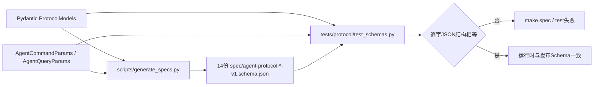

生成范围包括四类JSON-RPC Envelope、初始化输入/输出、Thread、Turn、Item、Event、Replay、Next、
Command联合和Query联合共14份Schema。`make spec`应在合同变化后重新生成；
[`test_agent_protocol_schemas_match_runtime_contracts`](../../tests/protocol/test_schemas.py)阻止提交陈旧文件。

### 22.4 版本演进规则

1. 新增可选输出字段前验证旧SDK忽略策略；
2. 新增输入字段即使可选，也会被旧Server拒绝，必须明确最低Server版本或升级协议；
3. 新增判别联合成员需要评估旧客户端解析失败，不能仅依赖“未知字段忽略”；
4. 修改方法语义、错误码、Cursor或幂等域属于协议兼容变更，必须更新ADR、Schema、SDK和Golden测试；
5. 公共Thread/Turn/Event规格版本与连接协议版本是不同层次，不能只改其中一处；
6. 当前没有`minVersion/maxVersion`或多版本路由；不兼容变化应设计v2，而不是放宽v1严格性；
7. 内部Session Migration不能自动证明公共协议兼容，必须通过投影与Schema回归独立验证。

## 23. 重点类、函数与接口设计

### 23.1 重点符号

| 符号 | 职责 | 输入/输出 | 核心不变量 | 副作用与失败 |
|---|---|---|---|---|
| `ProtocolModel` | 所有公共合同基类 | Python/JSON ↔ 冻结模型 | camelCase、严格、禁止未知字段 | 校验失败抛`ValidationError` |
| `decode_client_frame` | 将不可信帧变成Envelope | `bytes + max` → Request/Notification | 单对象、有界、无重复键 | 无持久副作用；抛`ProtocolDecodeError` |
| `ProtocolDecodeError` | 安全携带JSON-RPC解析错误 | RPC码、稳定码、安全消息 | 数据类冻结 | 由Server映射Error Response |
| `validate_protocol_input` | 按真实JSON语义校验入站对象 | 模型类型+对象 → 严格模型 | 先JSON Round-trip | Type/Value/Validation错误 |
| `validate_server_output` | 旧客户端兼容读取结果 | 模型类型+对象 → 输出模型 | 未知字段忽略、已知字段严格 | 非JSON或合同错误失败 |
| `project_item` | 投影内部Item | `Item → PublicItem` | 所有已知内部Item显式重建 | 未知Item抛`TypeError` |
| `project_turn` | 投影Turn摘要 | `Turn → TurnView` | 不包含Items与内部执行事实 | 无持久副作用 |
| `project_thread` | 投影Thread摘要 | `Thread → ThreadView` | 只带latest Turn与计数 | 无持久副作用 |
| `project_event` | 投影或过滤内部Event | `(threadId, AgentEvent) → PublicEvent?` | 公共Cursor沿用内部Sequence | 未识别Event返回`None` |
| `project_replay` | 构造公开Replay页面 | 内部页+扫描位置 → Result | 最后内部Sequence不得超过扫描位置 | 参数不一致抛`ValueError` |
| `request_fingerprint` | 计算命令载荷身份 | 方法+JSON参数 → SHA-256 | 排序、紧凑、拒绝NaN、≤1 MiB | 无外部副作用；稳定请求错误 |
| `ProtocolRequestStore` | 抽象幂等账本端口 | claim/complete/fail/get | 主键、终态不变 | 实现可持久化 |
| `SQLiteProtocolRequestStore` | Session共库实现 | `Path`和端口方法 | BEGIN IMMEDIATE、摘要校验 | SQLite I/O；无自初始化/关闭 |
| `decode_known_notification` | 旧客户端通知兼容 | Mapping → Notification或None | Envelope严格、未知方法忽略 | 无副作用 |

### 23.2 Request Store端口合同

| 方法 | 前置条件 | 成功后置条件 | 幂等与顺序 | 失败 |
|---|---|---|---|---|
| `claim` | UUID有效；Request ID/方法/参数可规范化 | 新记录为accepted，或返回既有同指纹记录 | 必须先于业务Operation | `invalid_request`、`invalid_outcome`、`outcome_too_large`、`idempotency_conflict`、`request_corrupt` |
| `complete` | 记录存在且accepted，结果为≤1 MiB JSON | 记录变为completed并保存正文/摘要 | 相同completed结果可重复 | `request_not_found`、`request_state_conflict`、结果/记录错误 |
| `fail` | 同上 | 记录变为failed并保存错误JSON/摘要 | 相同failed结果可重复 | 同complete |
| `get` | 身份有效 | 返回严格记录或None | 只读 | `invalid_request`、`request_corrupt`、数据库异常 |

端口没有取消、批处理、分页、清理或事务组合API。0.9.3b的终态删除属于Session共库内部Maintenance，不扩展公共
`ProtocolRequestStore`，也不在Command热路径触发。实现者若新增后端，必须保持相同主键、指纹、终态和损坏拒绝语义，
并明确并发线性化点与等价Maintenance保护。

### 23.3 Public Protocol辅助函数

`protocol_json_size`返回一个`ProtocolModel`按线上别名、键排序、紧凑JSON编码后的UTF-8字节数，可供传输
门禁复用。当前生产Server `_encode`没有调用它，也没有在出站前比较协商`maxMessageBytes`；它是已实现
但尚未贯穿产品传输的辅助能力。

## 24. 重点数据结构与字段设计

### 24.1 Thread与Turn字段

| 结构/字段 | 类型/必填 | 来源与语义 | 持久化/兼容 | 敏感级别 |
|---|---|---|---|---|
| `ThreadView.specVersion` | 固定`harnessix.agent-protocol-thread/v1` | 公共Thread结构版本 | 从投影产生；不等同连接版本 | 非敏感 |
| `threadId` | UUID/是 | Session Thread身份 | 持久事实 | 受控标识 |
| `workspace` | 1～4096字符/是 | Thread绑定宿主绝对路径 | Session中持久；协议公开 | 敏感运行元数据 |
| `cursor` | 非负整数/是 | 当前Thread内部Sequence | Snapshot恢复位置 | 非敏感顺序元数据 |
| `activeTurnId` | UUID/否 | 当前活动Turn | 由Reducer派生 | 受控标识 |
| `turnCount` | 非负整数/是 | 内部Turn数量 | 投影计算 | 非敏感 |
| `latestTurn` | `TurnView`/否 | 最后一个Turn摘要 | 允许未来新增输出字段 | 含用户任务元数据 |
| `forkedFromThreadId` | UUID/否 | Fork Snapshot来源 | 投影摘要 | 受控标识 |
| `archive` | 归档时间/原因/否 | 当前归档事实 | 原因可含用户文本 | 可能敏感 |
| `createdAt/updatedAt` | 带时区时间/是 | Session墙钟 | 不是单调时钟 | 运维元数据 |
| `TurnView.requestId` | 1～256字符/是 | Agent领域命令ID | 与协议账本ID语义关联但存储独立 | 受控标识 |
| `retryOfTurnId` | UUID/否 | 显式Retry来源 | 持久事实 | 受控标识 |
| `status` | 1～64字符/是 | 内部Turn状态字符串 | 公共模型未冻结成Literal | 状态元数据 |
| `budget/usage/modelSteps` | 是 | 执行边界与累计用量 | 从聚合投影 | 成本/运维元数据 |
| `error` | PublicFailure/否 | 终态公开失败 | 不含原始异常堆栈 | 可能含清洗消息 |

### 24.2 Event与Delta字段

| 字段 | 约束 | 语义 |
|---|---|---|
| `PublicEvent.specVersion` | 固定`harnessix.agent-protocol-event/v1` | 事件公共结构版本 |
| `eventId` | UUID | 内部事件稳定身份 |
| `threadId/turnId` | UUID/可选Turn | 事件所属范围 |
| `cursor` | ≥1 | Thread内部Sequence，不透明且可跳跃 |
| `occurredAt` | 带时区时间 | 业务墙钟，不用于替代Cursor排序 |
| `data.type` | 八类公开事件值 | 判别联合与兼容敏感点 |
| `scannedThrough` | ≥0 | 服务端已扫描的内部位置 |
| `hasMore` | 布尔 | 当前持久查询仍有内部事件页 |
| `modelStep` | 1～1000 | Delta所属模型步骤 |
| `streamSequence` | ≥1 | Item流内顺序标识 |
| `delta` | 最多1,000,000字符 | 短暂显示文本；合同上界不代表每个出站帧必然符合协商字节上限 |

### 24.3 标识作用域

| 标识 | 唯一作用域 | 是否由客户端生成 | 是否持久 |
|---|---|---:|---:|
| JSON-RPC `id` | 当前连接待决Request | 是 | 否 |
| `clientInstanceId` | 客户端逻辑实例 | 是 | 随协议账本键持久 |
| Command `requestId` | 一个客户端实例内的业务意图 | 是 | Protocol与Agent各自持久相关事实 |
| `threadId` | Session Store | 创建时由服务端稳定派生或Runtime产生 | 是 |
| `turnId/itemId/eventId` | 对应Thread/聚合 | 否 | 是 |
| `approvalId/questionId/callId` | 对应Turn | 否 | 是 |
| `artifactId/actionId` | 对应Artifact/Action域 | 否 | 是 |

## 25. 核心业务逻辑伪代码

### 25.1 帧解码

```text
decode_client_frame(frame, max_bytes):
    require 0 < byte_length(frame) <= max_bytes
    text := strict_utf8_decode(frame)
    require strip_trailing_crlf(text) contains no newline and is not blank

    value := json_parse(
        reject_duplicate_object_keys = true,
        reject_non_finite_constants = true
    )
    validate depth <= 64
    validate each object/list size <= 8192
    validate each object key length <= 8192
    require value is object, not batch

    if key "id" exists:
        return strict JsonRpcRequest(value)
    return strict JsonRpcNotification(value)
```

### 25.2 命令执行与重放

```text
execute_command(client_id, method, params, operation, result_model, after_result):
    wire_params := serialize params with camelCase aliases
    claim := ledger.claim(client_id, params.request_id, method, wire_params)

    if claim.state == completed:
        result := strict_json_validate(result_model, claim.outcome)
        run after_result(result) when configured
        return result

    if claim.state == failed:
        reconstruct stable service error from bounded outcome
        raise it

    try:
        result := operation()              # may persist Agent facts
        ledger.complete(client_id, request_id, public_json(result))
        run after_result(result)            # background drive happens after terminal ledger
        return result
    catch KernelError or ProtocolRequestError as error:
        unless error is idempotency_conflict:
            best_effort ledger.fail(client_id, request_id, safe_error_fields)
        raise stable AgentServiceError
```

### 25.3 Event投影与游标推进

```text
project_replay(thread_id, internal_page, scanned_through, has_more):
    require internal_page.last.sequence <= scanned_through
    public_events := []
    for event in internal_page:
        projected := project_event_by_explicit_type(thread_id, event)
        if projected exists:
            append projected to public_events

    validate public cursors are strictly increasing and <= scanned_through
    return EventsReplayResult(public_events, scanned_through, has_more)
```

### 25.4 旧客户端读取

```text
decode_server_result(model, value):
    encoded := strict JSON serialize(value, reject non-finite)
    return model.validate_json(encoded, ignore_unknown_fields=true)

decode_notification(value):
    notification := strict JsonRpcNotification(value)
    if method not in known_notification_methods:
        return none
    return notification
```

## 26. 可观测性与运维

Protocol包当前不直接记录日志、不创建Trace/Metric，也不注入Observability端口。其生产诊断主要依赖：

- JSON-RPC稳定错误码与`error.data.path`；
- Protocol Request表中的方法、状态、时间和摘要；
- Session Event Replay与Thread Snapshot；
- App Server进程退出状态和上层结构化日志；
- SDK对传输EOF、Malformed Response和待决Request的错误归并。

### 26.1 运维排查顺序

```text
1. 确认initialize结果中的版本、methods和limits
2. 区分JSON-RPC id与Command requestId
3. 根据稳定错误码判断失败位于Codec、Params、Ledger还是Runtime
4. 查询Thread Snapshot和scannedThrough，不以公开Cursor间隔判断丢失
5. 对重复命令核对clientInstanceId、requestId、method和参数是否原样保持
6. 对accepted记录核对Session是否已有对应Thread/Turn事实
7. 对liveGap丢弃Delta完整性假设，等待持久Item
8. 对request_corrupt停止运行并从一致备份恢复，不手工覆盖单列
```

### 26.2 当前观测缺口

- 没有Protocol decode/validation/ledger latency的专用Metric；
- 没有连接、待决请求、outbox占用和Replay滞后的统一Trace；
- `ProtocolRequestStore`底层数据库异常没有统一稳定分类；
- accepted记录会进入低敏容量活动计数并阻止Session/Artifact维护，但仍没有内置年龄告警或目标级恢复扫描；
- 协商Limit未全部贯穿执行，无法仅凭初始化结果证明真实背压配置；
- 日志若由上层记录Params或Response，Protocol没有自动脱敏Guard。

运维平台在新增信号时不得使用Prompt、Tool参数、Workspace、Answer、Actor/Reason、完整Request ID或
高基数Thread/Turn ID作为Metric标签。详细遥测策略应与[Observability模块设计](observability.md)统一。

## 27. 源码、测试、ADR与Schema映射

### 27.1 核心源码映射

| 设计元素 | 源码文件 | 关键符号 | 直接测试 | 说明 |
|---|---|---|---|---|
| 公共模型统一规则 | [`contracts.py`](../../src/harnessix/protocol/contracts.py) | `ProtocolModel` | [`test_contracts.py`](../../tests/protocol/test_contracts.py) `test_initialize_and_command_params_use_camel_case_and_reject_unknown_fields` | camelCase、冻结、严格、拒绝额外字段 |
| Envelope与ID | [`contracts.py`](../../src/harnessix/protocol/contracts.py) | `JsonRpcId`、四类Envelope | [`test_contracts.py`](../../tests/protocol/test_contracts.py) `test_jsonrpc_request_rejects_ambiguous_or_unbounded_ids`、`test_jsonrpc_wire_shape_is_standard_and_strict` | 标准结构与安全整数 |
| 严格帧解码 | [`codec.py`](../../src/harnessix/protocol/codec.py) | `decode_client_frame` | [`test_codec.py`](../../tests/protocol/test_codec.py)全部 | 字节、UTF-8、单对象、深度与重复键 |
| 初始化与能力模型 | [`contracts.py`](../../src/harnessix/protocol/contracts.py) | `InitializeParams`、`ServerCapabilities`、`ProtocolLimits` | [`test_contracts.py`](../../tests/protocol/test_contracts.py) `test_capabilities_must_be_stably_sorted_and_unique` | 合同；状态执行在App Server |
| 公共Item投影 | [`projection.py`](../../src/harnessix/protocol/projection.py) | `project_item`、`_approval` | [`test_projection.py`](../../tests/protocol/test_projection.py) `test_item_projection_removes_provider_and_private_approval_fields`、`test_question_projection_exposes_only_ui_contract` | 显式字段白名单 |
| Thread/Turn投影 | [`projection.py`](../../src/harnessix/protocol/projection.py) | `project_thread`、`project_turn` | [`test_projection.py`](../../tests/protocol/test_projection.py) `test_runtime_events_project_to_public_cursor_stream` | 摘要视图而非内部聚合 |
| Event过滤与Replay | [`projection.py`](../../src/harnessix/protocol/projection.py) | `project_event`、`project_replay` | [`test_contracts.py`](../../tests/protocol/test_contracts.py) `test_replay_accepts_cursor_gaps_but_rejects_reordering` | Cursor可跳跃，扫描位置权威 |
| Delta一致性 | [`contracts.py`](../../src/harnessix/protocol/contracts.py) | `PublicItemDelta`、`EventsNextResult.coherent_page` | [`test_contracts.py`](../../tests/protocol/test_contracts.py) `test_next_events_rejects_cross_thread_or_duplicate_deltas` | 同Thread、身份唯一、超时空结果 |
| 参数指纹 | [`requests.py`](../../src/harnessix/protocol/requests.py) | `request_fingerprint`、`_json` | [`test_requests.py`](../../tests/protocol/test_requests.py)前两项 | 方法与参数规范JSON绑定 |
| SQLite账本 | [`requests.py`](../../src/harnessix/protocol/requests.py) | `SQLiteProtocolRequestStore` | [`test_requests.py`](../../tests/protocol/test_requests.py)全部 | Claim、终态、重开、损坏检测 |
| Request表Migration | [`0020_protocol_requests.sql`](../../src/harnessix/session/migrations/0020_protocol_requests.sql) | `protocol_requests` | [`test_requests.py`](../../tests/protocol/test_requests.py) `_ledger` | Session初始化拥有Schema |
| 终态离线保留 | [`maintenance_planning.py`](../../src/harnessix/session/maintenance_planning.py)、[`maintenance_execution.py`](../../src/harnessix/session/maintenance_execution.py) | `_protocol_candidates`、`_delete_protocol_request` | [`test_store_maintenance.py`](../../tests/agent/test_store_maintenance.py) | completed/failed按Cutoff删除；accepted保留且全局保护Session/Artifact |
| 旧客户端结果兼容 | [`contracts.py`](../../src/harnessix/protocol/contracts.py) | `validate_server_output` | [`test_contracts.py`](../../tests/protocol/test_contracts.py) `test_old_client_ignores_unknown_outputs_but_known_fields_remain_strict` | 只忽略新增输出字段 |
| 未知通知兼容 | [`compatibility.py`](../../src/harnessix/protocol/compatibility.py) | `decode_known_notification` | [`test_contracts.py`](../../tests/protocol/test_contracts.py) `test_unknown_notification_is_ignored_after_envelope_validation` | Envelope仍严格 |
| Schema生成 | [`generate_specs.py`](../../scripts/generate_specs.py) | Protocol模型列表、`TypeAdapter`联合 | [`test_schemas.py`](../../tests/protocol/test_schemas.py) | 14份生成物防漂移 |

### 27.2 跨模块行为映射

| 行为 | 源码 | 关键符号 | 测试 |
|---|---|---|---|
| 两步握手与方法分派 | [`app_server/server.py`](../../src/harnessix/app_server/server.py) | `AgentProtocolServer._initialize`、`_notification`、`_dispatch` | [`test_server_sdk.py`](../../tests/app_server/test_server_sdk.py) `test_handshake_enforces_state_version_and_params` |
| 并发初始化串行 | App Server/SDK | Server状态、SDK初始化锁 | `test_sdk_serializes_concurrent_initialize_calls` |
| 写命令账本顺序 | [`app_server/service.py`](../../src/harnessix/app_server/service.py) | `AgentApplicationService._command` | `test_agent_sdk_drives_turn_replay_and_duplicate_command` |
| 同键换Prompt冲突 | App Service + Ledger | `_command`、`claim` | `test_same_command_key_with_different_prompt_returns_conflict` |
| accepted命令重启恢复 | App Service + Agent Runtime | `_command`、`start_turn`、`_spawn` | `test_completed_ledger_recovers_accepted_turn_after_restart` |
| Notification无Response | [`app_server/stdio.py`](../../src/harnessix/app_server/stdio.py) | `run_stdio` | `test_subprocess_notification_does_not_wait_for_response` |
| Response乱序路由 | App Server + SDK Transport | 单Writer、pending Future映射 | `test_subprocess_transport_routes_out_of_order_responses` |
| Malformed Response处理 | [`sdk`](../../src/harnessix/sdk/) | 子进程Reader | `test_subprocess_transport_fails_all_pending_on_malformed_response` |
| 长轮询不阻塞其他请求 | [`app_server/stdio.py`](../../src/harnessix/app_server/stdio.py) | READY并发Dispatch | `test_stdio_long_poll_does_not_block_concurrent_request` |
| 慢客户端关闭 | [`app_server/stdio.py`](../../src/harnessix/app_server/stdio.py) | 有界Outbox与出站Timeout | `test_stdio_closes_slow_client_without_session_damage` |
| Delta后持久Replay | [`app_server/service.py`](../../src/harnessix/app_server/service.py) | `_receive_delta`、`next_events` | `test_events_next_delivers_live_delta_then_durable_replay` |
| Delta能力门禁与Gap | 同上 | `_take_deltas`、`_next_snapshot` | `test_events_next_marks_bounded_delta_buffer_gap`、`test_events_next_omits_deltas_when_client_did_not_negotiate_them` |
| Artifact条件开放 | [`app_server/artifacts.py`](../../src/harnessix/app_server/artifacts.py) | `ScopedProtocolArtifactReader` | `test_artifact_read_is_advertised_only_with_scoped_reader` |

### 27.3 决策与研究映射

| 主题 | 资料 | 与本文关系 |
|---|---|---|
| JSON-RPC与stdio选择 | [ADR 0009](../adr/0009-app-server-protocol.md) | 解释传输与Envelope选择；当前细节以本文和App Server实现为准 |
| 公共投影、游标与兼容 | [ADR 0070](../adr/0070-agent-protocol-v1-boundaries.md) | 定义v1长期边界 |
| 持久交互与Pull-Live | [ADR 0072](../adr/0072-durable-interaction-and-pull-live-stream.md) | 解释Question/Steer、Replay与Delta分层 |
| 初期协议对比 | [Protocol研究](../research/protocol.md) | Codex/OpenCode/Claude Code参考事实与早期选择 |
| 固定版本源码求证 | [Agent Protocol与产品运行时研究](../research/agent-protocol-product-runtime.md) | 0.8实现前差距、参考版本和独立结论 |
| 系统装配 | [0.8产品运行时设计](../m08-product-runtime-and-extensions.md) | 跨Protocol、App Server、SDK、扩展和配置的里程碑视图 |

## 28. 测试设计与证据边界

### 28.1 测试分层

| 层级 | 覆盖内容 | 主要文件 |
|---|---|---|
| Codec单元 | 合法Request/Notification、UTF-8、重复键、Batch、多行、帧与深度 | [`test_codec.py`](../../tests/protocol/test_codec.py) |
| 合同单元 | ID、严格Wire、别名、能力排序、输出兼容、通知、游标、Delta、预算和产品身份 | [`test_contracts.py`](../../tests/protocol/test_contracts.py) |
| 投影集成 | Runtime真实事件投影、私有字段去除、Question UI边界 | [`test_projection.py`](../../tests/protocol/test_projection.py) |
| 持久化集成 | Claim重开、参数不落盘、冲突、终态不可变、摘要损坏 | [`test_requests.py`](../../tests/protocol/test_requests.py) |
| Schema合同 | 14份JSON Schema与运行时模型逐字一致 | [`test_schemas.py`](../../tests/protocol/test_schemas.py) |
| App Server/SDK纵向 | 握手、幂等、重启、JSONL、并发、背压、交互、Replay/Delta和Artifact | [`test_server_sdk.py`](../../tests/app_server/test_server_sdk.py) |
| 产品启动 | 固定Workspace、Session初始化、Provider构造失败、EOF关闭 | [`test_server_and_cli.py`](../../tests/product_config/test_server_and_cli.py) |

### 28.2 已证明范围

- Runtime合同与发布Schema在当前提交一致；
- 典型无效Envelope和深度/帧限制被拒绝；
- 公共投影不包含测试覆盖的Provider Call ID、Tool Fingerprint、Context检查和内部模型尝试字段；
- Replay接受公开Cursor间隔并拒绝重排；
- 命令参数不以明文进入Protocol Request表；
- 同一账本在重开后识别终态且拒绝改写；
- 真实内存App Server/SDK和stdio替身覆盖连接状态、乱序响应、慢客户端与长轮询；
- Question、Approval、Live Delta、Durable Replay和Artifact条件能力有纵向测试。

### 28.3 尚未由这些测试证明

- 面向公网、多用户或不可信远程客户端的安全性；
- Windows/macOS/Linux三平台完整产品传输与发行兼容；
- 数日长连接、大量C端用户、数据库增长和历史账本GC；
- `maxPendingRequests`、`maxOutboundMessages`和`maxReplayEvents`客户端协商值被完全执行；
- 所有可能的超大Public Tool Output都满足出站协商字节上限；
- SQLite磁盘满、锁超时、进程Kill在每个指令级窗口的系统化故障注入；
- 数据库同权限恶意篡改、消息签名或加密；
- 非`1.0`初始化返回专用`unsupported_protocol_version`错误，而不是通用`invalid_params`；
- v1与未来v2双栈升级、降级和长期兼容窗口。

## 29. 已知限制、风险与后续工作

| 优先级 | 当前限制/风险 | 影响 | 后续方向 |
|---|---|---|---|
| P0 | `InitializeParams.protocol_version`是`Literal["1.0"]`，导致显式`unsupported_protocol_version`分支不可达 | 实际错误码与Server意图、ADR描述不一致，客户端无法稳定区分格式错误与版本不支持 | 调整校验边界并新增非1.0握手回归，再同步Schema与SDK |
| P0 | `_encode`未强制协商`maxMessageBytes`，`protocol_json_size`未进入生产出站路径 | 极端公共结果可能生成超出客户端声明能力的帧 | 在App Server设计中定义有界错误或Artifact外置，并补出站边界测试 |
| P0 | 三个非消息Limit未全部贯穿运行时；Queue/Semaphore在握手前建立，Replay未按协商值收紧 | 初始化返回值与实际强制容量存在差异 | 固化Limit语义并在构造/分派处执行一致门禁 |
| P1 | `protocol_requests`已有终态离线保留，但无分页、自动调度或accepted目标恢复 | 终态增长可控；陈旧accepted会全局阻止Session/Artifact清理 | 0.9.3c恢复扫描与0.9.5维护UX；不得放宽保守保护 |
| P1 | 数据库驱动异常未统一映射，部分异常保留accepted | 客户端只得到`internal_error`，恢复需联合查询Session | 统一存储错误分类，同时保留未知状态的安全恢复语义 |
| P1 | `outcome_json`读取未在读前重新执行1 MiB大小门禁 | 被越界改写的数据库行可导致额外内存消耗 | 在摘要/JSON解析前检查UTF-8字节长度并测试 |
| P1 | 公共Tool Result `output`和JSON-RPC `result`没有独立结构/字节上限 | 依赖上游Artifact外置，合同层不能单独保证有界出站 | 明确Result预算并统一Artifact策略 |
| P1 | 公共投影仍公开Tool参数、结果、Workspace、用户内容和审批Reason | 客户端或日志误用可泄露源码/路径/Secret | 客户端日志默认脱敏、字段分级和导出策略 |
| P1 | 当前无认证远程传输和Thread级授权 | 不能直接作为多租户公网API | 单独远程Gateway协议与威胁模型，不直接复用stdio信任 |
| P2 | `status`部分字段是有界字符串而非Literal | 内部新状态可能在无显式协议版本变更时出现 | 明确状态兼容策略或增加Unknown处理 |
| P2 | 旧客户端只对未知字段兼容，未知判别联合成员仍会失败 | 新Item/Event类型扩展受限 | 为v2设计Unknown Item/Event Envelope或能力协商 |
| P2 | 已知Server Notification集合与当前Pull-only Server能力脱节 | 阅读者可能误判推送能力 | 在SDK模块文档说明历史兼容用途；未来删除或正式实现需版本决策 |
| P2 | `clientInfo`目前不持久、不参与策略；`clientInstanceId`由客户端自声明 | 无法作为安全身份 | 保持其仅幂等命名空间，禁止用于授权 |
| P2 | `protocol_json_size`的规范排序与Server `_encode`非排序输出不完全同字节表示 | 辅助函数值不等于当前实际帧逐字节长度 | 统一单一编码器后再作为硬门禁 |
| P2 | App Server在Closing/Closed时先于解码返回错误，合法Notification也会收到Response | 偏离Notification单向合同 | 调整关闭分支并增加直接Frame回归 |

上述差距是现行实现边界，不影响已有v1本地stdio合同的基本可运行性，但在1.0商用、多用户规模和远程
产品化前必须纳入0.9.1～0.9.5对应切片并形成独立设计与故障测试。

## 30. 验收标准

Protocol模块现行设计满足以下条件时可判定DOC-1.4中的本模块文档完成：

- [x] 需求、目标、非目标、上下文、依赖与信任边界完整；
- [x] JSON-RPC Envelope、ID、错误、帧解码和两级校验有精确合同；
- [x] 初始化状态、能力和Limit同时描述声明值与真实执行差距；
- [x] 17个当前方法、写命令/查询分类及关键参数边界完整；
- [x] Thread、Turn、Item、Event、Replay、Delta和Artifact公共结构有字段说明；
- [x] 白名单投影明确哪些内部字段删除、哪些用户内容仍公开；
- [x] Replay游标跳跃、`scannedThrough`和Live Delta缺口恢复有流程与伪代码；
- [x] 命令账本身份、指纹、状态、表结构、事务、崩溃窗口和领域幂等关系完整；
- [x] 取消、超时、异常、慢客户端、重启和损坏恢复边界明确；
- [x] 安全、隐私、兼容、Schema生成、可观测性和部署限制明确；
- [x] 重点类、接口、字段、源码、测试、ADR和研究资料双向映射；
- [x] 未实现能力和风险显式登记，不把本地stdio描述为远程生产协议；
- [x] 本文已通过相对链接、Mermaid、Schema、Protocol专项和全仓质量门禁。

## 31. 维护规则

以下变化必须在同一提交更新本文、Schema及对应测试：

1. `AGENT_PROTOCOL_VERSION`、公共`specVersion`、Envelope或JSON-RPC ID规则变化；
2. 新增、删除或修改Params、Result、Item/Event判别联合、方法和通知；
3. 帧大小、深度、集合、文本、分页、等待或安全整数上限变化；
4. 初始化状态、能力、Limit协商或Server方法广告变化；
5. 公共投影新增字段、删除字段或改变未知内部类型处理；
6. Cursor、`scannedThrough`、Delta顺序、Gap和Timeout语义变化；
7. Request Store主键、指纹、状态、结果上限、事务、Migration或回收策略变化；
8. 命令持久顺序、崩溃恢复、后台驱动或领域幂等关系变化；
9. 公开内容、Artifact授权、异常清洗或远程信任边界变化；
10. Schema生成列表、包级`__all__`或旧客户端兼容规则变化。

协议重大变更必须先形成变更设计并按[文档工程规范](../governance/documentation-standard.md)评审；不兼容
变化不得通过放宽v1测试静默合入。测试名称重构时同步本文映射，生成Schema变化时必须审阅语义Diff，
不得仅机械接受生成结果。

## 32. 统一Action的Protocol v1兼容投影

内部`TrustedActionApprovalRequestContent`不新增公共联合成员。`projection._approval`按`presentation`复用既有公共枚举，并继续逐字段构造白名单对象：

| 内部字段/类型 | 公共结果 | 原因 |
|---|---|---|
| `presentation=tool` | `approvalType=tool` | 复用普通Tool审批UI |
| `presentation=patch_batch` | `approvalType=patch_batch`和`diffArtifact` | 复用完整Diff审查UI |
| `presentation=process` | `approvalType=process` | 复用Process审批UI |
| `request_fingerprint`、`policy_version` | 保留 | 客户端响应必须绑定精确请求并显示策略版本 |
| `plan_id` | 审批阶段省略；终态复用`ToolResult.actionId` | 不让客户端依赖Router内部计划表示 |
| Plan/Execution Fingerprint、Policy ID、Route State | 省略 | 内部授权和恢复细节不属于公共v1 |
| `TrustedActionEffect` | 不直接投影；结果使用既有Outcome、Action ID、Artifact引用 | 保持公共Tool Result合同稳定 |

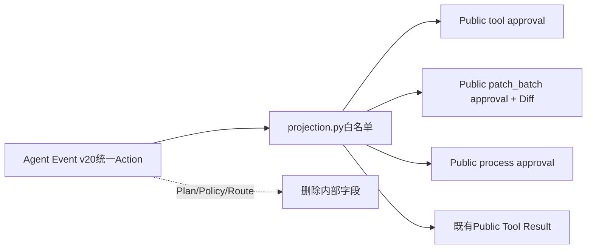

[`tests/protocol/test_projection.py`](../../tests/protocol/test_projection.py)分别验证三种呈现、决定和Diff，并断言序列化结果不含`planId`、三类内部Fingerprint、Policy ID和Route状态。`generate_specs.py --check`证明14份Protocol v1 Schema未因内部Event v20发生漂移。

## 33. 默认Patch的公共协议链（0.9.1e3）

e3没有升级Agent Protocol版本或增加方法。内部`apply_patch_batch`继续映射为已有`approval_type=patch_batch`，`diff_artifact`指向完整`action_review`；客户端通过既有`artifact/read`分页读取、校验后通过`approval/respond`提交绑定原请求指纹的决定。终态`PublicToolResultContent`复用同一Artifact引用和Action ID。

公共投影不暴露Execution Fingerprint、Policy、规范资源、Lease、Delivery游标或内部异常。Windows目录没有Patch Descriptor，因此协议初始化的工具能力不会暗示写支持。真实协议/SDK链由[`test_server_and_cli.py`](../../tests/product_config/test_server_and_cli.py)覆盖，投影兼容由[`test_projection.py`](../../tests/protocol/test_projection.py)覆盖。

## 34. Protocol Request离线保留（0.9.3b）

### 34.1 为什么不在Request Store增加`delete`端口

Command幂等端口负责`claim → completed/failed → get`，其调用发生在业务热路径。若在该端口增加TTL自动删除，响应丢失后的
客户端重试可能失去原终态并重新产生业务意图。终态保留因此由
[`SQLiteStoreMaintenance`](../../src/harnessix/session/maintenance.py)统一编排，先形成不可变Plan和备份，再在短事务内删除；
Protocol公共v1、Schema和SDK均不变化。

### 34.2 accepted的保守语义

`protocol_requests`只保存参数SHA-256，不保存原始Params或目标Thread/Artifact ID。Maintenance无法证明一个accepted请求与哪条
Session或Artifact无关，因此采用以下规则：

```text
if any protocol request is accepted:
    protect every Session Thread candidate
    protect every Artifact Body candidate
always protect the accepted request itself
allow old completed/failed request items to remain candidates
```

这会降低清理及时性，但避免把“摘要相同”或Method名称误当作精确业务引用。0.9.3c如增加accepted恢复索引，必须先形成新合同、
Migration和旧记录兼容策略，不能直接删除这条全局保护。

### 34.3 终态候选与执行复核

规划时，只有`completed/failed`且`updated_at<=cutoff`的行成为`protocol_request` Item；前置摘要覆盖Client、Request、Method、
Params摘要、State、Outcome摘要和两个时间。执行时重新读取并要求状态仍为终态、摘要未变、时间仍满足Cutoff，然后在同一事务中
删除该行并推进Maintenance Progress。行已变化或消失只记Skip，不生成替代候选。

容量报告验证accepted没有Outcome，终态必须有合法JSON和匹配摘要，并输出accepted/completed/failed低敏计数。公开Plan和报告
不返回Client/Request ID、Method或Outcome。完整流程见
[0.9.3b详细设计](../changes/m09-3b-persistent-capacity-and-retention.md)和
[ADR 0090](../adr/0090-plan-first-store-maintenance-and-backup.md)。

## 35. 变更记录

| 文档版本 | 代码版本 | 日期 | 变更摘要 |
|---:|---|---|---|
| 8 | `aa3372c0eb0c3b4ab674b19d26754a80dd035b46` | 2026-09-24 | Thread列表保持Protocol 1.0公开字段，由Session提供先筛选后分页与稳定游标；不增加外部Action服务 |
| 7 | `cb3f3ea834624d5a8f84396952eba212650065d1` | 2026-09-20 | 增加Protocol Request低敏容量、终态Plan-first离线保留、accepted全局保护和执行前置摘要语义 |
| 5 | `71a479439edcdd29b863ec3a9bad7a52586dd1bf` | 2026-09-13 | 验证默认Patch复用Protocol v1审批、Artifact分页和Tool Result，不泄漏Action/Delivery私有字段 |
| 4 | `328aa2d6c8ee85a75ab2baef51b80869dc4089a8` | 2026-09-13 | 将Agent Event v20统一Action审批映射到现有`tool/patch_batch/process`，保持Protocol v1合同与Schema不变并增加内部字段不泄漏回归 |
| 3 | `658e04d216d7d7efb01cd2e6a9db9788917552b9` | 2026-09-12 | 接入SDK现行设计，并将不存在的`AgentClient.stream_events`源码映射修正为实际`watch_thread`方法 |
| 2 | `8cd3358bdf0e8f550d7584ee3d81b5e5f7ae4e3e` | 2026-09-12 | 根据App Server源码反向求证，修正非1.0版本错误分支不可达及Closing状态回复Notification的实现偏差 |
| 1 | `b71682da19b54e93b225c54c594e2583fd648e70` | 2026-09-12 | 建立Protocol现行模块设计，覆盖合同、严格解码、公共投影、Replay、命令账本、兼容、Schema、失败恢复和真实实现差距 |
