# Sandbox模块设计

## 1. 模块摘要

| 项目 | 内容 |
|---|---|
| 源码包 | [`src/harnessix/sandbox`](../../src/harnessix/sandbox/) |
| 当前职责 | 定义强Container、网络策略、能力探测和执行绑定合同；将已批准Execution Plan物化为固定Docker/Podman兼容argv；提供受管出口授权、Container Process监督适配和不可变Profile存储 |
| 非职责 | 不负责Agent决策、Tool Policy、审批签发、Workspace锁、Secret来源、通用Process底层实现、镜像构建/签名、Container Daemon运维、默认产品装配或云端远程执行 |
| 上游调用者 | Execution Plan构建方、显式装配的可信Action、MCP Container Target和测试/宿主集成 |
| 下游依赖 | `execution`合同、`workspace`快照、`secrets`短生命周期环境、`processes` Supervisor、Docker/Podman兼容CLI、DNS和TCP |
| 持久化 | `SQLiteSandboxProfileStore`按Profile Digest保存不可变JSON；Execution Plan和Process Lease由其他模块保存 |
| 平台 | 合同与确定性测试覆盖POSIX/Windows；真实Container隔离只在Linux Docker CI验证；Windows/macOS真实强隔离尚未形成发布证据 |
| 代码版本 | `49c798bb6a9b18052f298258ef28bc3e4ef73104` |
| 当前完成度 | 可显式组合的正式运行库，不是默认Coding Agent已启用的端到端Sandbox产品能力 |

本文描述Sandbox包当前实现。不可变执行计划和批准指纹以
[Execution Plan模块设计](execution.md)为事实源；底层Process Owner、Lease、输出和终止语义以
[Process Runtime模块设计](processes.md)为事实源；跨模块高风险路由以
[0.7可信执行设计](../m07-trusted-execution-and-delivery.md)为聚合入口。本文只展开Sandbox自身合同、
物化、网络、Container身份与持久化边界。

## 2. 需求背景

审批只能回答“某个确定请求是否获准”，不能限制获准进程实际可访问的宿主文件、网络、进程和凭据。
工作目录也不是安全边界：进程可以使用绝对路径、符号链接、子进程、网络套接字或宿主环境访问计划外
资源。生产Coding Agent执行用户仓库命令和第三方MCP Server时，需要把以下事实从文本约定升级为可
验证执行边界：

1. 哪个Sandbox后端和版本已经通过能力探测；
2. 固定镜像、Workspace挂载模式、身份和资源上限；
3. 网络完全禁用、完全开放或选择性出口的精确语义；
4. DNS解析与批准目标之间的时间和地址绑定；
5. Secret只在Spawn边界注入且不进入argv、计划或对象表示；
6. Container CLI进程与Daemon中工作负载之间的生命周期差异；
7. 取消、超时、宿主崩溃后如何证明Container不存在；
8. 后端不可用或证据漂移时必须失败关闭，不能静默回退Host执行。

Sandbox模块通过“严格合同 → 能力证据 → Execution Plan绑定 → 启动前复核 → 固定argv → 监督与清理”
缩小执行面。它不宣称抵御受信宿主、Container Daemon或内核失陷，也不把当前库能力外推为默认产品已
启用。

## 3. 设计目标、非目标与关键术语

### 3.1 当前设计目标

1. 所有Sandbox、网络、Profile、Command和Execution对象严格、冻结、自摘要且版本化；
2. 强Container只使用固定SHA-256镜像、数字非Root身份、只读根、最小Capability和明确资源上限；
3. Container启动前复核Plan Approval、能力、Profile、Command、Workspace、环境、Secret和网络绑定；
4. Secret值不进入固定argv、Execution Plan、Profile或Dataclass `repr`；
5. `none`网络模式落实为`--network none`；选择性网络只能使用已证明的Internal Network和受管网关；
6. 域名授权绑定规范Host、HTTPS、端口、固定DNS地址与TTL，拒绝通配符和隐式私网；
7. 受管网关在转发TLS应用字节前核对CONNECT目标和精确SNI；
8. Container执行绑定Process ID、Execution Digest、Container Name和双标签；
9. 正常、取消和启动失败路径均尝试按身份清理并再次证明Container不存在；
10. 后端二进制、Daemon、网络证明、Owner能力或计划事实变化时失败关闭；
11. Profile可按内容Digest持久化并在损坏或未知Store版本时拒绝使用；
12. Linux CI以真实固定摘要镜像验证关键隔离参数，而不仅检查argv文本。

### 3.2 明确非目标

- 不实现Container Engine、镜像仓库、镜像构建、签名验证、SBOM或漏洞扫描；
- 不抵御宿主Root、恶意Container Daemon、内核漏洞或硬件侧信道；
- 不实现Kubernetes、远程Sandbox Pool、微虚拟机或多租户云调度；
- 不通过命令文本推断文件/网络副作用；
- 不把`host_guarded`称为OS强隔离；
- 不提供可执行的Seatbelt/Bubblewrap Host Adapter，当前只有能力探测；
- 不创建或监督受管Egress Network/Gateway的完整生命周期；
- 不提供默认产品配置、自动后端选择或全局Sandbox Service；
- 不拥有Workspace Snapshot、Execution Approval、Secret Store或Process Lease的数据表；
- 不保证当前Windows/macOS已通过真实Container强隔离与发行验收。

### 3.3 关键术语

| 术语 | 定义 |
|---|---|
| `host_guarded` | 依靠Permission、Approval、最小环境和Process Owner，不提供文件/网络强隔离 |
| `host_sandboxed` | 由Seatbelt或Bubblewrap等Host机制执行的强于Guarded边界；当前仅探测，无执行适配 |
| `container_strong` | 由固定镜像、Namespace/挂载、身份、Capability、资源与网络策略共同落实的Container边界 |
| Requested Capability | Execution Plan要求的Sandbox等级、网络模式和进程能力 |
| Effective Evidence | 运行前探测并摘要的实际后端、版本、可执行文件身份和安全事实 |
| Profile | 镜像、Workspace模式、资源、网络快照和Egress Digest组成的不可变Sandbox配置 |
| Command | 内层工作负载argv与Profile Digest组成的不可变命令 |
| Container Execution | Command、Process Spec与Owner Capability Digest的不可变组合 |
| Managed Egress | Internal Container Network中唯一Gateway对批准目标执行CONNECT授权 |
| Attestation | 对Docker Network Inspect中名称、Internal、Driver、Label和连接Container集合的摘要证明 |

## 4. 当前能力边界

| 能力 | 当前状态 | 默认产品状态 | 证据边界 |
|---|---|---|---|
| 严格Sandbox/Network合同 | 已实现 | 可被显式宿主复用 | Pydantic合同和Schema |
| Docker/Podman引擎探测 | 已实现 | 未由Product Config自动运行 | 确定性测试；Linux真实Docker间接使用 |
| Seatbelt/Bubblewrap探测 | 已实现 | 未装配 | 只证明预检结果，不提供命令执行器 |
| Container固定argv | 已实现 | 未装配到默认Agent Tool | 单元测试和Linux真实Container |
| Container Process Runtime | 已实现 | 未装配到默认Agent Tool | POSIX确定性监督测试；无Windows真实Container运行 |
| MCP Container Stdio | 可显式构造 | 默认Server没有自动配置入口 | Linux真实MCP Container集成测试 |
| DNS快照/选择性授权 | 已实现 | 未装配 | 确定性测试 |
| Managed Egress Gateway | 转发逻辑已实现 | 没有内建Service生命周期 | 本机asyncio回环测试，不是Docker端到端出口测试 |
| Internal Network证明 | 已实现 | Network/Gateway创建由外部生命周期提供 | 合成Docker Inspect测试 |
| Profile Store | 已实现 | 没有生产调用点强制使用 | SQLite确定性测试 |
| 三平台强隔离发行 | 未完成 | 不可宣称支持 | 0.9.5发布门禁 |

对生产源码调用点的反向检索显示：Sandbox包之外，当前只有
[`mcp/runtime.py`](../../src/harnessix/mcp/runtime.py)直接消费`PreparedContainerLaunch`、
`ContainerExecutionSpec`和`ContainerSandboxProfile`；`ContainerProcessRuntime`、Profile Store、能力
探测与Egress Gateway没有默认Bootstrap/Product Config装配。`sandbox/__init__.py`也不导出公共类型，
调用者当前通过具体子模块导入。

## 5. 模块上下文与信任边界

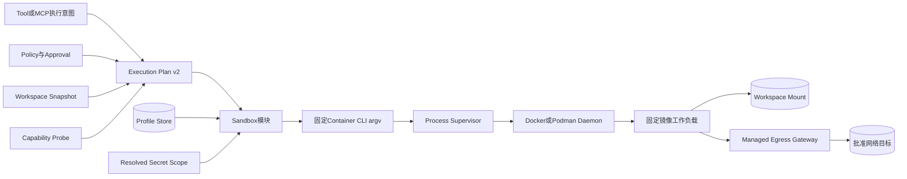

**图示说明：** Sandbox消费已经冻结的Plan、Profile和短生命周期Secret Scope，只生成或启动受控
Container命令。Process Supervisor拥有宿主进程树与Lease，Container Engine拥有Namespace和资源强制，
Egress Gateway拥有选择性网络授权。任何一个依赖证据不匹配都阻止启动。

**源码映射：** Execution Plan位于[`execution`](../../src/harnessix/execution/)；Sandbox主物化位于
[`container.py`](../../src/harnessix/sandbox/container.py)；Process接线位于
[`process_runtime.py`](../../src/harnessix/sandbox/process_runtime.py)；网络授权位于
[`network.py`](../../src/harnessix/sandbox/network.py)、[`egress.py`](../../src/harnessix/sandbox/egress.py)
和[`network_isolation.py`](../../src/harnessix/sandbox/network_isolation.py)。

### 5.1 受信组件

- Harnessix宿主进程与其内存中的Plan、Profile、Secret Provider和Policy结果；
- 固定绝对路径的Container CLI及被探测的Daemon；
- Process Supervisor与Workspace Snapshot实现；
- Managed Egress生命周期管理者和Internal Network配置；
- 数据库目录、Profile Store和操作系统权限；
- 镜像摘要指向内容的供应链真实性，目前仍需外部审查。

### 5.2 不可信输入和工作负载

- 模型或扩展提交的Command argv与Tool参数；
- 用户仓库内容和其中启动的子进程；
- MCP Server代码及其Tool实现；
- DNS响应、CONNECT请求、TLS ClientHello和远端服务；
- Container Inspect输出在严格解析和证明前不可信；
- stdout/stderr及任何可能包含Secret的输出。

### 5.3 禁止边界

1. 未批准Plan不能直接调用Builder生成启动命令；
2. Builder不可在Container不可用时返回Host命令；
3. Workload不得获得Docker Socket、Session DB、Action DB或Secret Store；
4. 选择性网络不得使用普通Bridge或只靠HTTP客户端Allowlist；
5. Container CLI退出不等于Daemon中Container一定消失；
6. Capability Probe成功不等于默认产品已经采用该后端；
7. Profile Digest不是签名，也不证明镜像供应链可信；
8. `host_sandboxed`探测结果不得被当作当前可执行后端。

## 6. 包结构与源码阅读顺序

| 顺序 | 文件 | 关键符号 | 阅读目的 |
|---:|---|---|---|
| 1 | [`contracts.py`](../../src/harnessix/sandbox/contracts.py) | `SandboxContract`、Network/Profile/Command/Execution模型 | 理解严格字段、版本、自摘要和跨字段不变量 |
| 2 | [`planner.py`](../../src/harnessix/sandbox/planner.py) | `build_container_*` | 理解如何从受信输入构建自摘要对象并归一错误 |
| 3 | [`capabilities.py`](../../src/harnessix/sandbox/capabilities.py) | `ContainerEngineProbe`、`HostSandboxProbe`、Probe函数 | 理解Requested与Effective Evidence |
| 4 | [`network.py`](../../src/harnessix/sandbox/network.py) | `resolve_network_policy`、`authorized_addresses` | 理解域名/CIDR、DNS固定、TTL和私网规则 |
| 5 | [`egress.py`](../../src/harnessix/sandbox/egress.py) | `ManagedEgressGateway`、TLS解析 | 理解CONNECT、SNI、连接和流量预算 |
| 6 | [`network_isolation.py`](../../src/harnessix/sandbox/network_isolation.py) | `attest_internal_network` | 理解Internal Network与唯一Gateway证明 |
| 7 | [`container.py`](../../src/harnessix/sandbox/container.py) | `ContainerCommandBuilder`、`PreparedContainerLaunch` | 理解执行前复核、固定argv和Container身份清理 |
| 8 | [`process_runtime.py`](../../src/harnessix/sandbox/process_runtime.py) | `ContainerProcessRuntime`、`SupervisedContainerProcess` | 理解Process Owner、取消、等待和清理组合 |
| 9 | [`store.py`](../../src/harnessix/sandbox/store.py) | `SQLiteSandboxProfileStore` | 理解Profile持久化、幂等与损坏处理 |
| 10 | [`mcp/runtime.py`](../../src/harnessix/mcp/runtime.py) | `McpContainerStdioTarget` | 理解当前唯一包外生产消费点及其不同生命周期 |
| 11 | [`tests/sandbox`](../../tests/sandbox/) | 七组确定性测试 | 对照所有拒绝和恢复路径 |
| 12 | [`test_container_sandbox.py`](../../tests/integration/test_container_sandbox.py) | 两个真实Container测试 | 明确Linux Docker真实证据和平台限制 |

## 7. 组件结构与数据流

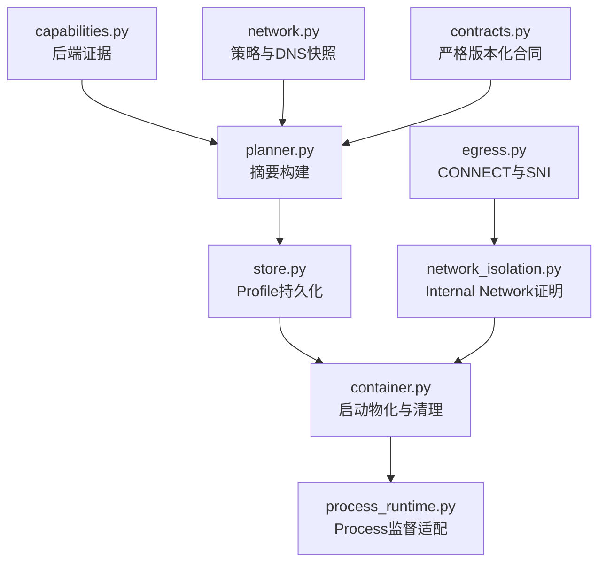

**图示说明：** 合同与Planner不执行I/O；Probe、DNS、Gateway、Inspect、Container CLI、Process Supervisor和
SQLite Store是I/O边界。Store不是Builder强制依赖，当前宿主可直接传入内存Profile；Egress Gateway和
Network生命周期也不由Builder创建。

**源码映射：** 箭头表示数据/调用依赖，不表示所有组件由一个Service自动装配。当前没有
`SandboxService`或统一Factory。

## 8. 严格合同与摘要体系

### 8.1 公共合同基类

`SandboxContract`继承Domain `ContractModel`并强化为：

- `extra="forbid"`：拒绝未知字段；
- `frozen=True`：正常属性赋值不可变；
- `strict=True`：禁止宽松类型转换；
- `allow_inf_nan=False`：数值字段拒绝非有限值。

对象摘要复用`execution.canonical_digest`：将排除Digest字段后的JSON对象按Key排序、紧凑UTF-8编码并
计算SHA-256。Digest提供稳定变化检测，不提供密钥认证、签名或抗数据库管理员篡改证明。

### 8.2 版本化对象

| 合同 | Spec Version | 核心绑定 | 自摘要 |
|---|---|---|---|
| `NetworkPolicy` | `harnessix.network-policy/v1` | Mode、目标、私网开关、TTL | 由Snapshot间接绑定 |
| `NetworkPolicySnapshot` | `harnessix.network-policy-snapshot/v1` | Policy和完整DNS Resolution | 是 |
| `ContainerSandboxProfile` | `harnessix.container-sandbox-profile/v1` | 镜像、挂载、用户、Limits、Network、Gateway | 是 |
| `ContainerCommandSpec` | `harnessix.container-command/v1` | argv和Profile Digest | 是 |
| `ContainerExecutionSpec` | `harnessix.container-execution/v1` | Command、Process Spec、Owner Capability | 是 |
| `ContainerEngineProbe` | `harnessix.container-engine-probe/v1` | 平台、Engine、版本、二进制身份、Rootless | 是 |
| `HostSandboxProbe` | `harnessix.host-sandbox-probe/v1` | 平台、Backend、可用性、身份、原因 | 是 |
| `ManagedEgressBinding` | 由Schema命名为v1，无显式`spec_version`字段 | Network、Proxy、Policy/Gateway/Attestation Digest | 自身无总Digest |

所有上述Schema由[`scripts/generate_specs.py`](../../scripts/generate_specs.py)生成到
[`spec`](../../spec/)目录。当前`make check`不运行Schema重生成差异检查，Sandbox Schema也没有专用Golden
测试；重大合同变更必须显式运行生成器并审计Diff。

### 8.3 `model_copy`与受信对象边界

Pydantic冻结模型阻止普通赋值，但Python调用者仍可通过`model_copy(update=...)`构造未重新执行全部
Validator的对象。Builder会复核关键Plan/Profile/Command字段，却不统一把每个输入序列化后重新验证，
也不显式重算Plan/Profile/Command所有Digest。正常Store读取和Planner构建会验证合同；不可信插件不得
直接获得Python对象构造能力，跨进程输入应始终走严格JSON Validation。

## 9. Sandbox等级与后端支持

### 9.1 等级矩阵

| 等级 | 合同含义 | 当前实现 | 当前不能宣称 |
|---|---|---|---|
| `host_guarded` | Host执行加Permission/Approval/Process Owner | Execution/Process模块可表达；Sandbox包不物化Host命令 | 文件、网络或同UID强隔离 |
| `host_sandboxed` | Seatbelt/Bubblewrap等Host OS机制 | `probe_host_sandbox`只提供预检与证据 | 已有可执行Adapter、完整策略或Windows Native Strong |
| `container_strong` | 固定Container配置和网络策略 | Docker/Podman兼容CLI Builder与Process Runtime已实现 | 抵御Daemon/内核、三平台发布完成或所有Tool默认接线 |

### 9.2 失败关闭

Builder只接受`plan.sandbox.level == "container_strong"`，并要求Backend、Backend Version、Capability
Evidence、Profile Digest和Network Mode全部匹配。代码中没有Host Fallback分支。若要降级安全等级，
调用方必须重新生成Execution Intent、Plan、Policy/Approval和Capability Evidence；复用旧批准会因
Fingerprint变化而失败。

## 10. Capability Probe

### 10.1 Container Engine探测时序

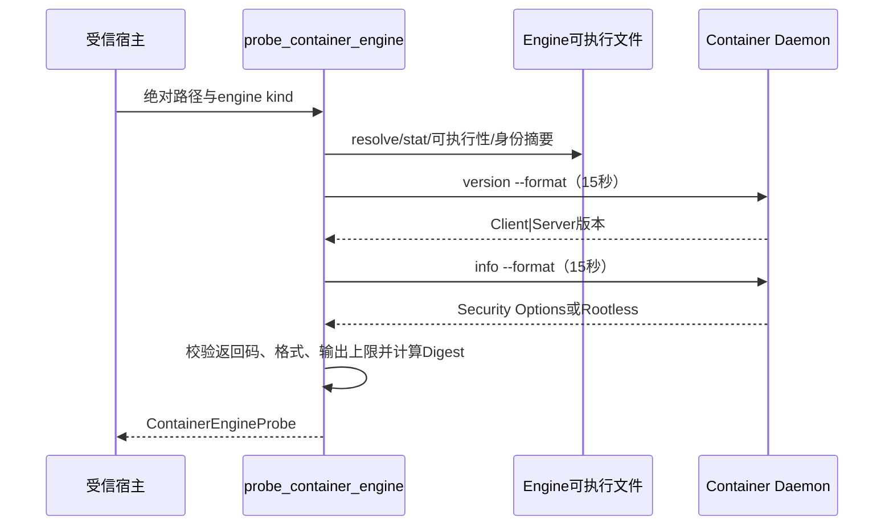

**图示说明：** Docker解析Security Options列表并检查是否含`rootless`；Podman解析严格`true/false`。
Rootless是证据字段，不是`container_strong`的强制前置条件。任何启动、超时、非零、版本格式、安全信息或
输出上限异常统一为`sandbox_unavailable`，不自动重试。

**源码映射：** [`capabilities.py`](../../src/harnessix/sandbox/capabilities.py)的
`probe_container_engine`、`executable_identity_digest`和`ContainerEngineProbe`；测试见
`test_container_probe_uses_daemon_and_security_capability_evidence`、
`test_container_probe_rejects_unparseable_security_evidence`和
`test_container_probe_timeout_fails_closed_without_retry`。

### 10.2 可执行文件身份

身份摘要包含Device、Inode、Size、mtime、ctime和Mode。Builder初始化时保存更直接的同组Tuple，
每次Prepare和Container控制命令前后复核。它能检测多数路径替换，但不是原子`open + fexecve`：最后一次
Stat与Process Supervisor实际Spawn之间仍存在TOCTOU窗口；Windows文件身份语义也尚无真实验收。

### 10.3 Host Sandbox探测

- macOS固定检查`/usr/bin/sandbox-exec`，运行允许Process的Deny-Default最小Profile和`/usr/bin/true`；
- 其他POSIX平台从`PATH`寻找第一个可执行`bwrap`，以只读根、独立Dev/Proc和`--unshare-net`运行
  `/bin/true`；
- Windows只返回`guarded_available=True`和`native_strong_unavailable`；
- Backend只有在预检返回0且可执行身份可计算时才标记可用；
- 探测对象记录Reason Code和Digest。

该预检只证明固定最小命令在探测时可运行，不验证项目所需的完整Filesystem Policy、Egress、资源限制和
逃逸负例。更重要的是，当前没有把Probe转成Seatbelt/Bubblewrap执行argv的生产类。

### 10.4 Probe资源边界

真实`subprocess.run(capture_output=True)`在进程返回后才检查4 KiB/16 KiB输出长度；恶意或失控Daemon CLI
仍可在15秒内产生大输出并占用内存。当前也没有全局Probe并发限制、缓存TTL或自动重新探测策略。Product
Config未装配Probe，宿主必须自行决定启动时机和证据生命周期。

## 11. Network Policy与DNS固定

### 11.1 目标合同

| 字段 | 约束 | 安全意义 |
|---|---|---|
| `kind=domain` | 必须为规范小写IDNA ASCII、至少两段、无尾点、非IP、无通配符 | 避免大小写、尾点、Wildcard和IP伪装 |
| Domain Protocol | 只能`https` | 使网关能够通过TLS SNI绑定域名身份 |
| `kind=cidr` | `ip_network(strict=True)`规范网络 | IP/TCP场景显式授权网段，不冒充域名 |
| `ports` | 1～65535、唯一、升序、最多32项 | 精确限制目标端口 |
| `destinations` | 唯一、规范排序、最多64项 | Digest与比较稳定 |
| `mode=none/full` | 不允许Destinations | 避免模式和规则矛盾 |
| `mode=limited/restricted` | 至少一个Destination | 选择性策略不能为空壳 |
| `allow_private_addresses` | 仅`restricted`可为True | Limited默认拒绝Loopback/私网/保留地址 |
| `resolution_ttl_seconds` | 1～300，默认60 | 限制批准DNS快照生命周期 |

### 11.2 DNS规划时序

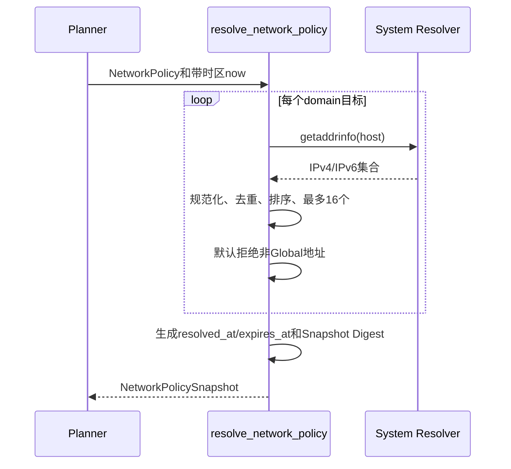

**图示说明：** Snapshot必须为每个Domain恰好包含一个Resolution，并按Host排序。出口时不重新解析
DNS，只连接冻结IP；在`now >= expires_at`时拒绝。CIDR不创建Resolution。

**源码映射：** [`network.py`](../../src/harnessix/sandbox/network.py)的`system_resolver`、
`resolve_network_policy`、`authorized_addresses`；合同位于
[`contracts.py`](../../src/harnessix/sandbox/contracts.py)的`NetworkDestination`、`NetworkPolicy`、
`NetworkResolution`和`NetworkPolicySnapshot`。

### 11.3 授权规则

`authorized_addresses(snapshot, host, port, protocol, now)`先重算Snapshot Digest：

- `none`永远拒绝；
- `full`不由选择性Gateway授权，调用该方法会返回`network_gateway_not_required`；
- Domain必须精确匹配Policy Host、HTTPS、Port和未过期Resolution，返回冻结地址；
- IP必须属于批准CIDR，匹配Protocol/Port，并满足Private Address开关；
- 默认私网判定使用`ipaddress.is_global`，因此Loopback、Link-Local、Private、Multicast和Reserved等均拒绝。

### 11.4 当前时间边界

`resolve_network_policy`明确拒绝Naive `now`；`NetworkResolution`要求两个时间都有Timezone且Expiry晚于
Resolved Time。`authorized_addresses`却没有对显式`now`重复Timezone校验：传入Naive时间与Aware Expiry
比较会泄漏原生`TypeError`，而不是稳定`network_policy_invalid`。当前测试未覆盖该后端入口差异。

## 12. Managed Egress Gateway

### 12.1 CONNECT与TLS时序

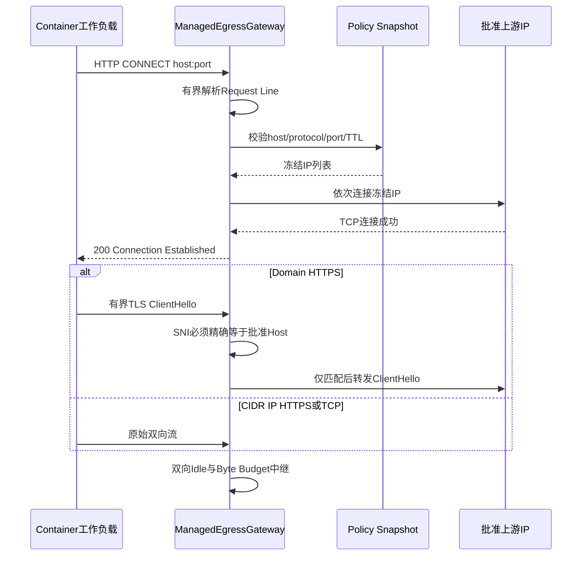

**图示说明：** 网关只接受HTTP/1.1 CONNECT，不实现普通HTTP Forward Proxy。Domain只允许HTTPS，并在
转发首个TLS字节前校验规范SNI；无SNI、SNI不匹配、ECH导致身份不可见或ClientHello超限均关闭。直接
CIDR IP可按Policy声明HTTPS或TCP，不做Domain SNI检查。

**源码映射：** [`egress.py`](../../src/harnessix/sandbox/egress.py)的`ManagedEgressGateway.handle`、
`parse_tls_server_name`、`read_tls_client_hello`、`_open`和`_relay`；测试见
[`test_egress.py`](../../tests/sandbox/test_egress.py)。

### 12.2 网关限制

| 限制 | 默认值 | 校验/行为 |
|---|---:|---|
| Proxy Header | 16 KiB | 超限或不完整拒绝 |
| TLS ClientHello | 64 KiB | 可跨TLS Record读取；边界不完整拒绝 |
| Header/SNI Timeout | 10秒 | `asyncio.wait_for` |
| 单地址Connect Timeout | 10秒 | 按冻结地址顺序尝试 |
| Idle Timeout | 300秒 | 每次Read等待上限 |
| 每方向Bytes | 1 GiB | 超限关闭；可配置1字节～16 GiB |

Connect Timeout按**每个地址**计算，最多16个冻结地址时没有统一总Deadline，最坏连接时间可累加。网关
也没有连接数、并发、每租户速率或目标请求频率限制；内部工作负载可对已批准目标建立大量连接。

### 12.3 身份与转发边界

- 网关在SNI校验前已对批准IP建立TCP连接并向客户端返回200，但不会把ClientHello发送给上游；
- 它不终止TLS、不验证服务端证书，证书验证仍由Container内客户端完成；
- Header中的其他字段不用于授权，Proxy身份依靠隔离Network而不是应用Token；
- Relay以任一方向结束为关闭信号，取消另一方向并吞掉内部异常后关闭两端；
- 拒绝路径通常返回403，若200后SNI失败，客户端只会看到隧道关闭或非TLS拒绝字节；
- 当前没有为连接允许/拒绝、流量、超时或目标建立审计Event、Metric和Trace。

## 13. Internal Network证明

### 13.1 Attestation合同

`attest_internal_network`严格解析单个Docker Network Inspect JSON：

1. 输入必须是1～64 KiB的Bytes，Proxy Port有效；
2. JSON拒绝Duplicate Key和非有限常量；
3. 顶层必须是仅含一个Network对象的列表；
4. `Name`精确等于计划Network Name；
5. `Internal is True`且`Driver == "bridge"`；
6. Network Labels绑定Policy Digest和Gateway Digest；
7. 已连接Container名称列表必须恰好为`["harnessix-egress"]`；
8. 对完整Network对象计算Attestation Digest并构造`ManagedEgressBinding`。

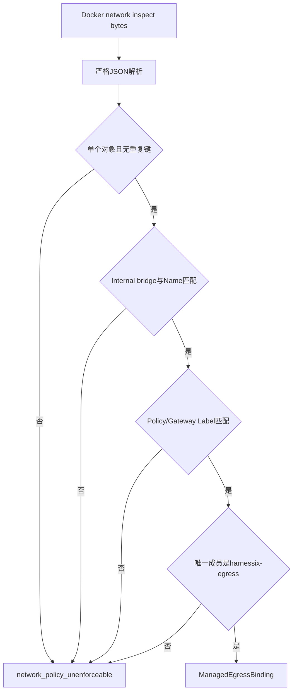

**图示说明：** Builder在`ContainerProcessRuntime.prepare`路径以`reattest_network=True`即时重新Inspect并
要求新Binding与规划Binding完全相等。网络任何已观察字段、成员或摘要变化都会阻止Spawn。

**源码映射：** [`network_isolation.py`](../../src/harnessix/sandbox/network_isolation.py)的
`attest_internal_network`和[`container.py`](../../src/harnessix/sandbox/container.py)的`_reattest_network`。

### 13.2 当前生命周期缺口

Sandbox包没有创建/删除Internal Network、启动/监督`harnessix-egress` Container或把
`ManagedEgressGateway.handle`发布为受管服务的Lifecycle Manager。Attestation只验证调用方提供的Inspect
结果。Gateway实际Container身份也只通过Network成员名称和Network Label间接绑定，没有单独Inspect其
镜像、Execution Digest或进程Lease。

要求“证明时唯一成员是Gateway”还意味着共享同一Internal Network的并发工作负载会使下一次Reattest
失败；当前没有每Execution Network分配、并发策略或清理Soak测试。选择性网络现状应视为可组合原语，
不是已完成的默认产品Egress子系统。

## 14. Profile、Command与Execution规划

### 14.1 Profile

`ContainerSandboxProfile`绑定：

- 镜像字符串必须以`sha256:<64 lowercase hex>`结尾，可使用裸Digest或`name@digest`；
- Workspace Mount只能`read_only`或`read_write`；
- 默认UID:GID为`65532:65532`且必须是非零数字；
- CPU、Memory、PID、Tmpfs使用严格上下限；
- Network必须是完整自摘要Snapshot；
- `limited/restricted`必须携带Egress Gateway Digest，`none/full`必须不携带；
- Profile Digest覆盖全部字段。

固定Digest防止运行时拉取同Tag新内容，但当前不验证镜像签名、来源Registry、Manifest Platform、SBOM、
漏洞状态或本地Daemon中该Digest内容的供应链授权。`--pull never`只保证运行时不自动下载。

### 14.2 Command

`ContainerCommandSpec`包含1～128个argv元素，总UTF-8加终止符不超过64 KiB；每项非空、无NUL，并绑定
Profile Digest和自身Digest。它支持显式`/bin/sh -c <source>`作为argv，但Shell选择必须已经存在于不可变
Command和Execution Intent中，Builder不会拼接字符串。

### 14.3 Execution

`ContainerExecutionSpec`把Command、Process Spec和Owner Capability Digest冻结为一个Digest，并要求：

- Process Invocation必须为`argv`；
- Process argv必须与Command argv完全相同；
- Terminal必须为`pipe`，当前Container路径不支持PTY；
- Process ID、Lifecycle、Timeout、stdin和输入/输出预算由Process Spec承载；
- Owner Digest必须在`ContainerProcessRuntime.prepare`时等于当前Supervisor Capability。

### 14.4 规划数据流

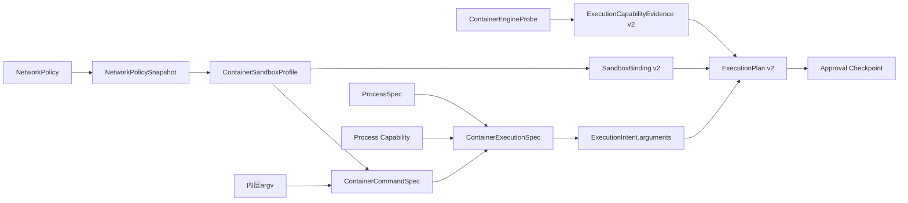

**图示说明：** Intent Arguments必须完整等于Command或Execution JSON；Plan Fingerprint继续覆盖Workspace、
环境摘要、Secret版本、Policy和Capabilities。Approval只绑定Plan Fingerprint，不能跨Profile、命令、网络
或Owner复用。

**源码映射：** Sandbox Planner位于[`planner.py`](../../src/harnessix/sandbox/planner.py)；Execution Plan
构建与核验位于[`execution/planner.py`](../../src/harnessix/execution/planner.py)。

## 15. ContainerCommandBuilder执行前复核

### 15.1 Prepare时序

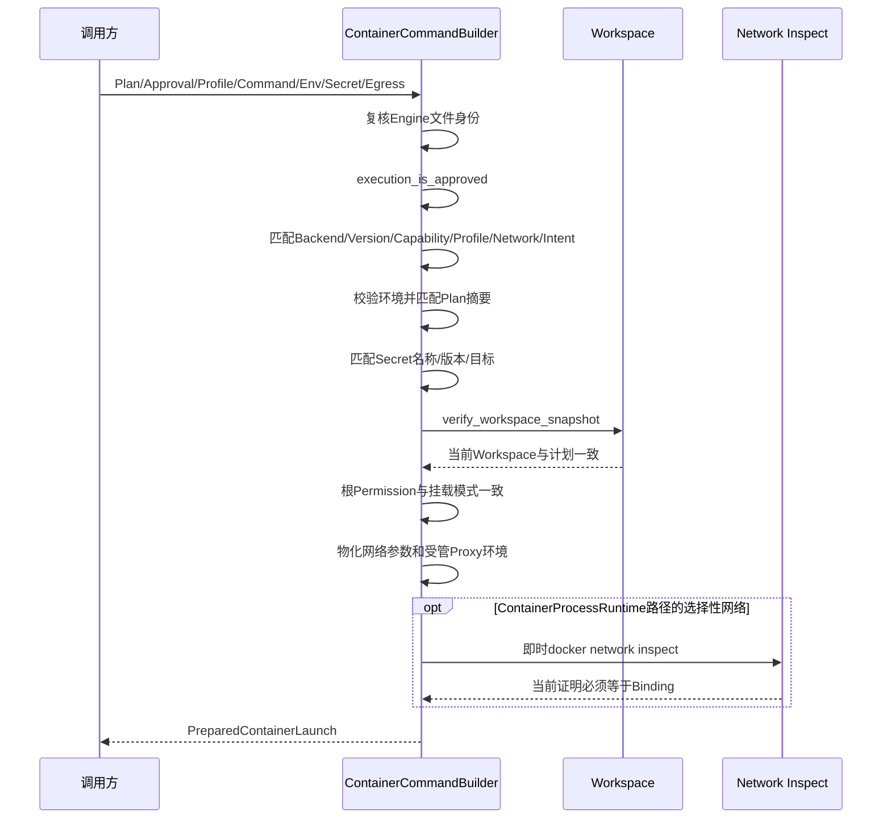

**图示说明：** 任一批准、后端、环境、Secret、Workspace、Permission或Network事实变化均在Spawn前拒绝。
`external_roots`即使能由Workspace Snapshot表达，Container后端当前也明确拒绝，因为尚无外部根挂载合同。

**源码映射：** [`container.py`](../../src/harnessix/sandbox/container.py)的
`ContainerCommandBuilder.prepare`、`_verify_binding`、`_network`与`_reattest_network`。

### 15.2 Environment与Secret

普通Environment最多128项、总计64 KiB，Key/Value必须是字符串、无NUL且Key不含`=`。重新调用
`bind_environment`后必须与Plan中Value Digest完全相等。Secret只比较`target/name/version`，值来自
`ResolvedSecretEnvironment`短生命周期对象；Windows Target按Casefold比较。

选择性网络由Builder独占写入`HTTP_PROXY`、`HTTPS_PROXY`、空`ALL_PROXY`和空`NO_PROXY`，调用方环境或
Secret不得覆盖这些Key。Prepared对象：

- `argv`只含`--env NAME`，不含Value；
- `base_environment`通过`MappingProxyType`冻结且Dataclass `repr=False`；
- `secrets`字段`repr=False`；
- `materialize_environment`只在Secret Scope未关闭时返回合并副本；
- `redaction_values`把原始Bytes交给Process输出脱敏；
- Python字符串和子进程Environment副本仍不能保证物理内存彻底擦除。

### 15.3 Workspace与Permission

Builder调用`verify_workspace_snapshot`，要求Workspace绝对路径并拒绝当前外部根。Profile只读/读写挂载
必须在Snapshot资源中存在`location=workspace,path=.,kind=directory`且Access分别为Read/Write。这里只
验证计划快照和根Permission；Container Mount是最终强制边界，Workspace Lease与提交期CAS仍由其他模块
负责。

## 16. 固定Container argv

### 16.1 固定参数

Builder按固定顺序生成：

| 参数 | 当前值/来源 | 作用 |
|---|---|---|
| Engine | 探测并绑定的绝对路径 | 避免依赖运行时PATH |
| Lifecycle | `run --rm --init --pull never` | Attached运行、Init回收、退出自动删、不自动拉取 |
| Identity | Name、Process ID Label、Execution Digest Label | 支持残留查询和防错删 |
| stdin | Process Spec为Pipe时`--interactive` | 允许Supervisor传入有界stdin |
| Root FS | `--read-only` | 容器根只读 |
| Linux Capability | `--cap-drop ALL` | 去除显式Capability |
| Privilege | `--security-opt no-new-privileges` | 禁止exec提权 |
| IPC | `--ipc none` | 隔离共享IPC |
| PID数量 | `--pids-limit` | 限制进程数量 |
| Memory/CPU | Profile Limits | Cgroup资源约束 |
| 用户 | Profile `run_as` | 数字非Root UID:GID |
| CWD | `/workspace`或其计划子路径 | 固定Container内工作目录 |
| Workspace | 单个显式Bind；可只读 | 不自动挂载宿主其他路径 |
| Tmpfs | `/tmp:rw,noexec,nosuid,nodev,size=...` | 唯一显式可写临时区与容量 |
| File Limit | `nofile=1024:1024` | 限制打开文件数 |
| Stop Timeout | 5秒 | Daemon停止宽限 |
| Network | none/bridge/Internal Network | 按Profile落实 |
| Environment | 重复`--env NAME` | 值只经Container CLI进程环境传递 |
| Entrypoint/Image | Command argv[0]、固定Digest Image | 不依赖镜像默认Entrypoint |

Builder不挂载Docker Socket，也不生成`--privileged`、`--device`或额外Host Mount。它没有显式固定Seccomp、
AppArmor/SELinux Profile或Rootless要求；这些安全属性目前依赖Daemon默认或Probe观察，未进入Profile与Plan
强制合同。

### 16.2 Mount和路径

Workspace源路径通过Docker `--mount` CSV字段生成，目标固定`/workspace`。Plan CWD为`.`时使用根，否则
拼接`/workspace/<cwd>`；CWD合法性依赖已验证Workspace Snapshot合同。当前不支持第二个External Root、
Named Volume、Socket或设备挂载。

### 16.3 资源限制边界

CPU、Memory、PIDs和Tmpfs具备类型与上下限，argv单测验证精确值。真实Linux测试在Cgroup文件存在时验证
Memory/PID，并尝试超过Tmpfs；CPU只验证参数，不执行可量化Throttle测试。Workspace读写挂载没有磁盘
Quota，工作负载在Read-Write Profile下可耗尽宿主Workspace所在文件系统。

## 17. Container Process监督

### 17.1 装配时序

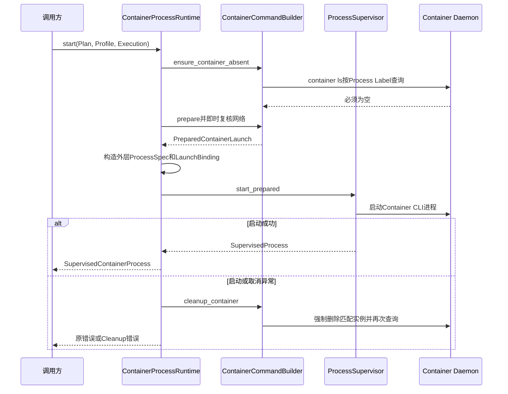

**图示说明：** 内层Execution Process Spec描述工作负载语义；Runtime重新构造外层Process Spec，其argv是
完整Container CLI命令，但保留Process ID、Lifecycle、Timeout、stdin和预算。`ProcessLaunchBinding.kind`
固定为`container`并绑定Plan、环境和Supervisor Capability。

**源码映射：** [`process_runtime.py`](../../src/harnessix/sandbox/process_runtime.py)的
`ContainerProcessRuntime.prepare/start`；Supervisor合同见
[`processes`](../../src/harnessix/processes/)。

### 17.2 Handle行为

`SupervisedContainerProcess`委托`refresh/send_stdin/close_stdin/stop/output`给底层`SupervisedProcess`：

- `wait(cancel)`正常结束后清理Container；Python Task取消时以`asyncio.shield`保护清理后重抛；
- `aclose()`先关闭底层Process，再清理Container；
- 清理受实例级`asyncio.Lock`保护并且成功后幂等；
- `stop()`只停止底层Process，不立即调用Container清理，调用方仍需`wait`或`aclose`；
- `run()`等价于`start + wait`；
- `reconcile(execution)`先由Supervisor对账Process Lease，再清理Container。

当前Wrapper只显式捕获`asyncio.CancelledError`执行Shield Cleanup；其他`_process.wait`异常不在本层
`finally`中保证清理。`aclose`若底层关闭先失败也不会进入后续Cleanup。启动失败路径若Cleanup同时失败，
Cleanup错误可能覆盖原始启动错误。这些属于1.0前需故障注入固定的失败优先级。

### 17.3 Container CLI与工作负载差异

Process Supervisor直接拥有的是Container CLI进程，不是Daemon内工作负载。`--rm`通常在退出后删除实例，
但CLI断连、Daemon延迟或宿主崩溃仍可能留下Container。因此终态返回前必须按稳定Container身份查询和
清理，不能只信CLI Return Code。

## 18. Container身份、清理与恢复

### 18.1 稳定身份

| 事实 | 生成方式 | 用途 |
|---|---|---|
| Container Name | `harnessix-process-<process_id.hex>` | 可预测的唯一名称 |
| Process Label | `com.harnessix.process-id=<uuid>` | 查询候选 |
| Execution Label | `com.harnessix.execution-spec=<digest>` | 防止同Process ID错绑其他执行 |
| Container ID | Engine查询返回12～64位小写Hex | 删除时使用实际ID |

`_container_rows`使用Process Label过滤后，要求最多一行，并严格校验ID、Name、Process Label和Execution
Label。多个候选、格式变化、身份不匹配、查询失败或超限都返回`process_cleanup_failed`，不会猜测并删除。

### 18.2 清理流程

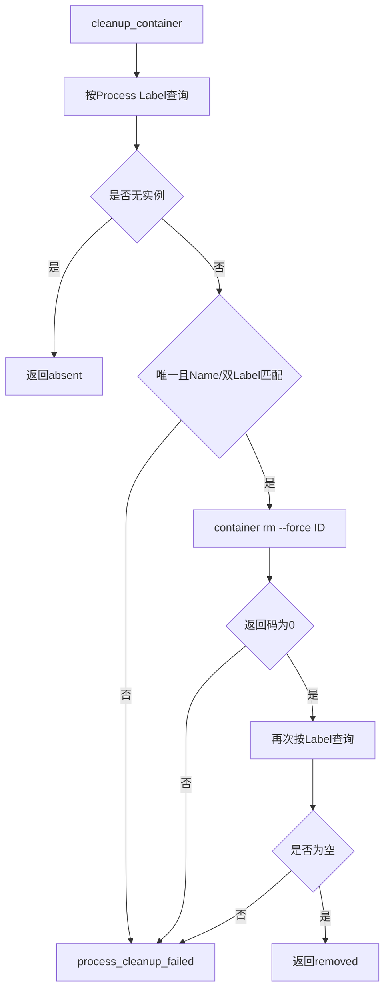

**图示说明：** 清理前后都会复核Engine二进制身份，控制命令使用5秒查询和10秒删除Timeout，stdout/stderr
各限制64 KiB。防错删优先于尽力删除不明实例。

**源码映射：** [`container.py`](../../src/harnessix/sandbox/container.py)的`ensure_container_absent`、
`cleanup_container`、`_container_rows`、`_run_control`和`container_name`。

### 18.3 恢复边界

调用方必须持有原`ContainerExecutionSpec`和可重建Builder，才能按双标签对账。Profile Store只保存Profile，
Execution Plan Store和Process Lease Store分别保存其他事实；当前没有Sandbox聚合恢复Service自动扫描所有
Container。若Daemon不可达、身份冲突或Supervisor无法证明Owner，系统应保持Cleanup Failed/Unknown，
不得用历史PID或Name盲删。

## 19. MCP Container路径

[`McpContainerStdioTarget`](../../src/harnessix/mcp/runtime.py)要求Prepared Launch、Execution、Profile和Builder
Digest/Name全部一致，并把Sandbox Profile/Network投影到MCP持久状态。连接通过MCP SDK `stdio_client`
直接启动Prepared Container CLI；Async Exit Stack拥有stdio客户端，Target `cleanup()`调用Builder按身份
清理。

该路径与`ContainerProcessRuntime`不同：

- 它消费相同强Container启动对象和清理证明；
- 它不通过`ContainerProcessRuntime.start`建立Sandbox包的`SupervisedContainerProcess`；
- `ContainerExecutionSpec.owner_capability_digest`在准备时已绑定，但实际MCP stdio启动不写Process Lease；
- 连接生命周期由MCP Store/SDK维护，不等价于Process Supervisor的崩溃恢复账本；
- 当前Linux真实测试证明MCP调用和正常关闭，不证明宿主硬崩溃后的Process Lease恢复。

在1.0前应统一确认MCP Container是否必须使用Process Supervisor，或为SDK stdio路径建立等价Owner/恢复合同，
避免出现两套Container生命周期保证。

## 20. Profile持久化

### 20.1 关系模型

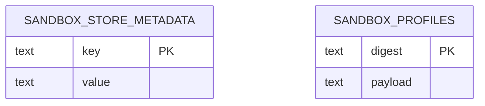

**图示说明：** Store Schema Version固定为字符串`1`，Profile以Digest为Key、完整严格JSON为Payload。两个表
没有外键、时间、状态、来源或审计列。

**源码映射：** [`store.py`](../../src/harnessix/sandbox/store.py)的`SQLiteSandboxProfileStore._initialize`。

### 20.2 生命周期和安全设置

- 构造时创建父目录；POSIX把父目录Chmod为`0700`；
- SQLite连接使用5秒Timeout、WAL、`synchronous=FULL`；
- POSIX把数据库文件Chmod为`0600`；
- Schema使用SQLite `STRICT`表；
- 未知Schema Version立即`sandbox_store_version`；
- 初始化任意异常关闭连接；
- Context Manager和幂等`close`可释放连接。

修改现有父目录Mode可能影响与其他组件共享该目录的权限；Store也没有拒绝Symlink、Hardlink、非本用户
文件或不安全父目录替换。安全路径应由产品状态目录Owner统一创建，而不是依赖单个Store事后Chmod。

### 20.3 Save/Load

`save`先通过JSON往返重新验证Profile，在`BEGIN IMMEDIATE`中按Digest查找：

- 无记录则插入；
- 同Digest同Payload幂等；
- 同Digest不同Payload为`sandbox_profile_conflict`；
- 任意异常在仍处于事务时Rollback。

`load`按Key读取并严格验证Payload，缺失为`sandbox_profile_not_found`，无效JSON或合同为
`sandbox_store_corrupt`。当前没有验证**查询Key等于Payload内部Digest**：若数据库行Key被篡改而Payload
仍是另一份自洽Profile，`load(new_key)`会返回内部Digest不同的Profile。该完整性缺口已由源码级探针确认，
但尚无回归测试。

### 20.4 Store限制

- Schema只有Exact Version拒绝，无Migration、Checksum或Schema Shape核验；
- 建表使用`IF NOT EXISTS`，同名错误Schema可能在后续操作泄漏原生SQLite错误；
- 无List、Delete、GC、来源、创建时间或引用计数；
- 同步SQLite API若在Event Loop线程直接调用会阻塞；
- 默认SQLite `check_same_thread=True`，Store实例不能跨线程任意复用；
- 关闭后调用Save/Load泄漏驱动`ProgrammingError`而非稳定Kernel Error；
- Profile Store未被默认产品或Builder强制使用，持久恢复完整性取决于宿主装配。

## 21. 失败、取消、超时与Unknown

### 21.1 错误类别

| 类别/代码 | 触发条件 | 当前恢复语义 |
|---|---|---|
| `sandbox_unavailable` | Engine/Daemon/Probe启动、超时、响应失败 | 修复后端并重新Probe、Plan和Approval |
| `sandbox_binding_invalid/changed` | 初始Engine路径无效或后续文件身份变化 | 停止启动，重新绑定受信二进制 |
| `sandbox_command_invalid` | Command argv/摘要无效 | 修正Intent并新建Command/Plan |
| `sandbox_execution_invalid` | Command/Process/Owner组合无效 | 重建Execution和Plan |
| `sandbox_profile_invalid` | 镜像、Limits、Network或摘要无效 | 重建Profile并重新批准 |
| `sandbox_capability_mismatch` | Plan、Profile、Command、Backend、Network不匹配 | 丢弃旧批准，重新规划 |
| `approval_required` | Policy不是无审批Allow且Checkpoint无效 | 获取绑定当前Plan的Approval |
| `execution_plan_stale` | Environment或Workspace变化 | 重抓Snapshot并重新规划 |
| `secret_binding_mismatch` | Secret名称/版本/Target与Plan不同 | 重新解析正确版本或重新审批 |
| `network_policy_unenforceable` | Internal Network/Gateway/Binding无法证明 | 不启动；修复Egress生命周期 |
| `network_destination_denied` | Host/IP/Protocol/Port/TTL/Private不批准 | 拒绝连接；需要新Policy Snapshot |
| `network_tls_identity_denied` | ClientHello/SNI无效或不匹配 | 关闭连接，不转发TLS应用字节 |
| `network_connect_failed` | 冻结地址均不可连接 | 可由上层按明确预算重试；不刷新DNS |
| `network_transfer_limit` | 单方向字节超限 | 关闭隧道；工作负载结果按Process语义处理 |
| `process_already_exists` | 启动前发现同Execution Container | 对账/清理，不能重复启动 |
| `process_cleanup_failed` | 查询、身份、删除或再次证明失败 | 保持非成功/需人工，禁止把CLI退出当产品终态 |
| `sandbox_store_*` | Profile缺失、版本、损坏、冲突 | 阻止执行并保留数据库诊断 |

### 21.2 取消时序

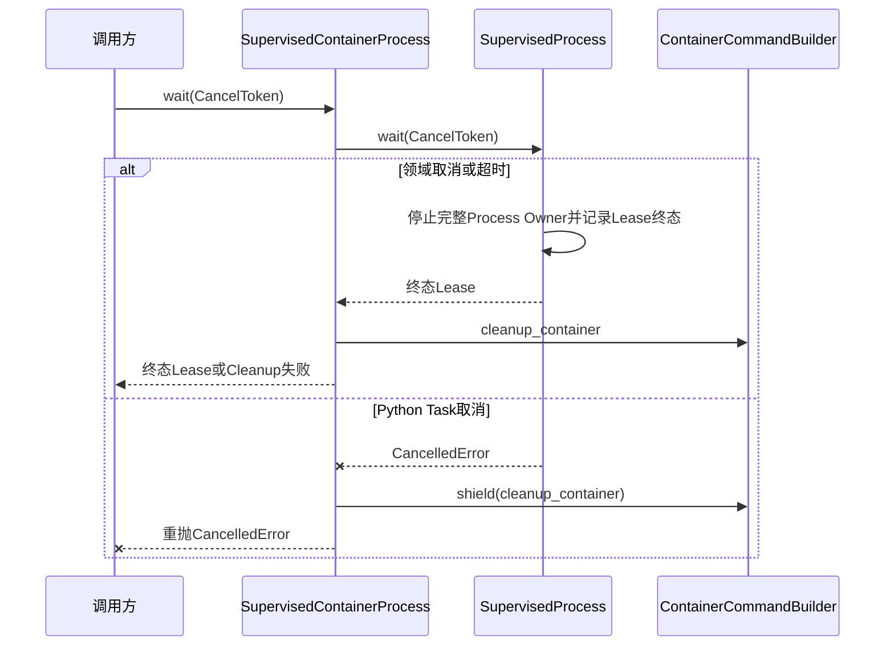

**图示说明：** Process停止与Container删除是两个步骤。即使底层Owner已经终止，Cleanup无法证明时也不能
发布成功终态。启动阶段任意`BaseException`同样触发Cleanup。

**源码映射：** `SupervisedContainerProcess.wait/_cleanup`、`ContainerProcessRuntime.start/run`；底层
停止细节见[Process Runtime模块设计](processes.md)。

### 21.3 Timeout边界

| 操作 | 当前Timeout | 总Deadline问题 |
|---|---:|---|
| Engine version/info | 各15秒 | 两次顺序执行，合计可超过15秒 |
| Host Sandbox预检 | 5秒 | 单次 |
| Network Inspect | 5秒 | 调用前后还有其他同步检查 |
| Container List | 5秒 | Cleanup可能查询两次 |
| Container Remove | 10秒 | 加两次List后总清理可约20秒以上 |
| Proxy Header/ClientHello | 各Header Timeout，默认10秒 | CONNECT后SNI再使用一次预算 |
| Upstream Connect | 每地址10秒 | 最多16地址，无统一总Connect Deadline |
| Relay Idle | 每次Read 300秒 | 双方向独立 |
| Process | Process Spec字段 | 终止宽限、输出排水和Container Cleanup会增加总耗时 |

Probe和Container控制是同步`subprocess.run`；Builder在Async路径通过`asyncio.to_thread`调用，但直接同步
调用者仍会阻塞当前线程。

### 21.4 Unknown语义

Sandbox合同自身没有独立状态机。Unknown由Process Lease或Trusted Action结果表达：

- Engine CLI启动后、Lease提交前崩溃可能已创建Container；
- CLI退出或连接断开不能证明工作负载未执行；
- Cleanup无法查询或身份不匹配时保持Cleanup Failed/Unknown；
- 不得自动重发同一非幂等Command；
- 恢复必须使用Execution Spec、Process Owner和Container双标签查询；
- Managed Egress拒绝只说明网络请求被阻断，不证明工作负载其他副作用未发生。

## 22. 安全与隐私边界

### 22.1 当前强制控制

- 固定镜像SHA-256和`--pull never`；
- 数字非Root UID:GID、只读Root FS、Capability Drop和No New Privileges；
- 显式Workspace Mount、Permission匹配和Snapshot重检；
- PID/Memory/CPU/Tmpfs/Nofile预算；
- None网络或Internal Network + Managed Proxy；
- 精确Domain/CIDR/Protocol/Port、DNS固定、TTL和Private Address规则；
- Domain HTTPS的CONNECT + SNI双重身份；
- Secret只经Environment传值、不进argv/repr，输出交给统一Redactor；
- Engine文件身份、Plan/Profile/Execution Digest和Container双标签绑定；
- 后端或证明变化失败关闭，无Host Fallback。

### 22.2 信任与攻击面图

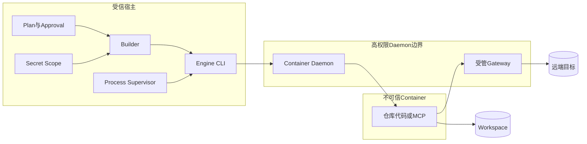

**图示说明：** Container隔离不把Daemon降为不可信组件。获得Daemon Socket通常等价于宿主高权限，本实现
不挂载该Socket，但宿主的CLI和Daemon仍必须受保护。Workspace按Profile可能可写，不能把Container Strong
误解为“不会修改仓库”。

**源码映射：** 固定argv见`ContainerCommandBuilder.prepare`；Egress见`ManagedEgressGateway`；Secret值
边界见`PreparedContainerLaunch`并由Secrets模块继续保证输出脱敏。

### 22.3 当前剩余风险

1. 无镜像签名、来源Allowlist、SBOM、漏洞门禁和可复现构建证明；
2. Rootless只记录不强制，Seccomp/AppArmor/SELinux依赖Daemon默认且未进入Digest；
3. Engine路径身份存在Stat-to-Exec竞态；
4. Host Sandbox只有Probe，没有实际策略执行器；
5. Egress Service/Network/Gateway生命周期不完整，实际Gateway Container身份未独立证明；
6. Egress无客户端认证、并发/速率上限和审计；
7. `full`模式使用普通Bridge，必须由上层Policy明确批准；
8. Read-Write Workspace无磁盘Quota，Process可写批准根内任何可访问路径；
9. Secret Environment和Python字符串无法物理保证擦除，Redactor不能检测哈希/压缩/语义外传；
10. Profile Store路径Symlink/Hardlink/Owner、Key/Payload Digest一致性未验证；
11. MCP stdio与ContainerProcessRuntime形成不同Process Owner/恢复证据；
12. 默认Agent Server未装配Sandbox，高风险Tool是否隔离取决于具体显式宿主。

## 23. 可观测性与审计

Sandbox包当前没有直接依赖Observability端口，也不创建Span、Metric或结构化Log。它通过稳定Kernel Error
Code、Digest和Process Lease向上层提供可观察事实。Profile Store没有审计表；Egress Gateway拒绝原因在
`handle`中被消费并对客户端返回403，但不发布内部原因事件。

### 23.1 可安全记录的字段

| 字段 | 建议 | 原因 |
|---|---|---|
| Sandbox Level/Backend | 低基数Metric/Span | 诊断后端选择 |
| Network Mode | 低基数Metric/Span | 诊断None/Selective/Full |
| Error Code | 低基数Metric/Log | 稳定失败分类 |
| Profile/Execution Digest | 受控Trace/审计，可截断显示 | 关联不可变事实；不作Metric Label |
| Engine Version/Rootless | 启动诊断 | 支撑能力漂移分析 |
| Container Name/Process ID | 受控运维日志 | 高基数，不进入Metric |
| Domain/IP/Port | 受限安全审计 | 可能泄露业务目标，不进入普通日志/Metric |
| argv/Environment/Secret | 禁止普通日志 | 可能含源码、路径和凭据 |

### 23.2 1.0前所需信号

- Probe成功/失败、耗时和Evidence变化；
- Prepare各Fail-Closed阶段与Plan/Profile关联；
- Container Start、CLI Exit、Cleanup Attempt/Result和残留Gauge；
- Egress Allow/Deny原因、Connect/Idle/Byte Limit和有界目标审计；
- Active Container、Cleanup Failed和Unknown恢复积压；
- Profile Store版本、损坏、Busy和容量；
- Telemetry Export失败不得改变Sandbox执行和清理结果。

## 24. 平台与部署

### 24.1 平台支持矩阵

| 场景 | macOS | Linux | Windows |
|---|---|---|---|
| 合同/Planner/Network单测 | CI覆盖 | CI覆盖 | CI覆盖 |
| Host Probe | Seatbelt预检 | Bubblewrap预检 | 返回Native Strong不可用 |
| Host Sandboxed执行器 | 未实现 | 未实现 | 未实现 |
| Container Builder | 代码可运行 | 代码可运行 | 代码可运行 |
| Process Runtime确定性测试 | POSIX路径 | POSIX路径 | Sandbox测试运行，但专用用例因POSIX Owner跳过 |
| 真实Container隔离 | 未验证 | Docker CI固定BusyBox Digest通过 | 未验证 |
| 真实MCP Container | 未验证 | Docker CI通过 | 未验证 |
| Podman真实运行 | 未验证 | 未验证 | 未验证 |

Windows的强隔离目标可以采用Docker Desktop或受管WSL2，但“合同在Windows CI通过”不能替代实际Daemon、
路径映射、文件权限、Job Object、取消和残留清理验收。macOS同样需要Docker Desktop或其他受支持Engine的
真实矩阵。

### 24.2 部署前置条件

- 宿主显式选择并固定Container Engine绝对路径；
- Daemon可达且版本/安全响应可解析；
- 固定摘要镜像已预拉取，运行时不自动拉取；
- Product状态目录受保护，Profile/Execution/Process Store可恢复；
- Workspace Snapshot与批准资源完整；
- 选择性网络必须先建立Internal Network、Gateway和Attestation；
- Process Supervisor必须适合当前平台；
- Secret Provider和Streaming Redactor必须在Spawn/Output边界装配；
- 启动时探测失败应阻止对应能力广告，不阻止纯只读不需要该能力的产品功能；
- 关闭时等待Process终止和Container清理，保留无法证明的诊断事实。

### 24.3 当前缺少的产品装配

`bootstrap.py`、`product_config`和默认`AgentApplicationService`没有Container Engine、Profile Store、
Egress Lifecycle或`ContainerProcessRuntime`构造。当前默认CLI/TUI也没有让用户选择、诊断和审批Sandbox
Profile的完整交互。实际产品启用必须进入0.9.1/0.9.5正式设计，不能由调用者在业务代码中临时实例化后
宣称默认安全。

## 25. 重点类、函数与生命周期

### 25.1 核心类

| 符号 | 生命周期/状态 | 直接依赖 | 并发/取消 | 不变量 | 禁止职责 |
|---|---|---|---|---|---|
| `ContainerEngineProbe` | 不可变一次探测证据 | Platform、Engine CLI | 同步；每命令15秒 | Digest匹配，Available恒True | 不代表持续健康 |
| `HostSandboxProbe` | 不可变一次预检证据 | Seatbelt/Bwrap | 同步；5秒 | Backend/Available/Identity成对 | 不执行真实工作负载 |
| `NetworkPolicySnapshot` | TTL内不可变授权快照 | DNS Resolver | 同步 | Domain Resolution完整唯一、Digest匹配 | 不自动刷新DNS |
| `ManagedEgressGateway` | 长生命周期asyncio连接处理器 | Snapshot、Connector | 每连接异步；内部双流Task | 只接收Selective Policy | 不创建Network或Gateway Container |
| `ContainerSandboxProfile` | 不可变内容配置 | Network Snapshot、Limits | 无I/O | 固定镜像、Selective Gateway配对、Digest | 不保存Secret值或宿主Path |
| `ContainerCommandBuilder` | 长生命周期绑定一个Engine文件身份 | Plan/Workspace/Secret/Inspect | 同步；Async宿主应`to_thread` | 无Fallback、全事实匹配后才返回argv | 不Spawn通用Process |
| `PreparedContainerLaunch` | 从Prepare到Spawn的短生命周期对象 | Base Env、Secret Scope | 冻结Dataclass；Secret Scope可关闭 | argv无Secret值 | 不持久化明文Secret |
| `ContainerProcessRuntime` | 长生命周期Builder + Supervisor组合 | Process Supervisor | Async Start/Run/Reconcile | Owner Capability和Plan绑定 | 不拥有Policy或Profile Store |
| `SupervisedContainerProcess` | 单个活动Container Handle | SupervisedProcess、Builder | Cleanup Lock；取消Shield | Cleanup成功后幂等 | 不把CLI退出直接当最终清理证明 |
| `SQLiteSandboxProfileStore` | 单线程同步Connection | SQLite文件 | `BEGIN IMMEDIATE`写；无Async取消 | 同Digest同Payload幂等 | 不保存Execution/Lease/Secret |

### 25.2 关键函数

| 函数 | 输入/输出 | 核心约束 | 当前错误边界 |
|---|---|---|---|
| `canonical_domain` | String →规范Domain | 输入本身必须已规范，拒绝IP/通配符/单Label | `ValueError` |
| `resolve_network_policy` | Policy → Snapshot | DNS去重、排序、Global、TTL、自摘要 | `network_*` Kernel Error |
| `authorized_addresses` | Snapshot/目标 →冻结IP | Mode、Digest、Host、Protocol、Port、TTL、CIDR | Naive now可泄漏`TypeError` |
| `parse_tls_server_name` | ClientHello →SNI | 单一HostName、ASCII、精确规范 | `network_tls_identity_denied` |
| `attest_internal_network` | Inspect Bytes →Egress Binding | Internal Bridge、Labels、唯一Gateway、严格JSON | `network_policy_unenforceable` |
| `build_container_sandbox_profile` | 配置 →Profile | 统一Validation Error为稳定Code | `sandbox_profile_invalid` |
| `build_container_command` | argv/Profile →Command | 统一Validation Error | `sandbox_command_invalid` |
| `build_container_execution` | Command/Process/Owner →Execution | Process必须与Command一致 | `sandbox_execution_invalid` |

## 26. 重点字段设计

### 26.1 Network字段

| 结构/字段 | 类型/必填 | 来源 | 语义/约束 | 持久化 | 敏感级别 | 兼容性 |
|---|---|---|---|---|---|---|
| `NetworkPolicy.mode` | Enum/是 | Policy | none/limited/restricted/full | Profile JSON | 低 | v1固定 |
| `destinations` | 最多64项 | Policy | 唯一有序Domain/CIDR | Profile JSON | 中 | 顺序参与Digest |
| `allow_private_addresses` | Bool | Policy | 仅Restricted可True | Profile JSON | 中 | 改变需新Digest/Approval |
| `resolution_ttl_seconds` | 1～300 | Policy | DNS授权时限 | Profile JSON | 低 | Snapshot冻结 |
| `NetworkResolution.addresses` | 1～16 IP | DNS | 规范去重排序 | Profile JSON | 中 | 不动态刷新 |
| `resolved_at/expires_at` | Aware Datetime | Planner墙钟 | Expiry必须更晚 | Profile JSON | 低 | Offset进入Digest |
| `NetworkPolicySnapshot.digest` | Revision | Planner | 覆盖Policy/Resolution | Profile/Plan | 低 | 变化使批准失效 |
| `ManagedEgressBinding.proxy_url` | 固定Host:Port | Gateway生命周期 | 只允许`harnessix-egress` | 调用方事实 | 中 | 无显式Spec字段 |
| `internal_network_attestation` | Revision | Inspect | 完整Network对象摘要 | Binding | 低 | 动态变化失败关闭 |

### 26.2 Profile与Execution字段

| 结构/字段 | 类型/必填 | 来源 | 语义/约束 | 持久化 | 敏感级别 | 兼容性 |
|---|---|---|---|---|---|---|
| `image` | String/是 | 受信配置 | 必须固定SHA-256 | Profile Store | 中供应链 | Digest变化需新Plan |
| `workspace_mode` | Read Only/Write | Permission | 必须与根资源Access一致 | Profile Store | 低 | 变化需新Approval |
| `run_as` | UID:GID | 配置 | 两者均非零数字 | Profile Store | 低 | 变化进入Digest |
| `limits.cpus` | Float | 配置 | >0且≤32 | Profile Store | 低 | 变化进入Digest |
| `limits.memory_bytes` | Int | 配置 | 64 MiB～64 GiB | Profile Store | 低 | 同左 |
| `limits.pids` | Int | 配置 | 16～4096 | Profile Store | 低 | 同左 |
| `limits.tmpfs_bytes` | Int | 配置 | 16 MiB～4 GiB | Profile Store | 低 | 同左 |
| `egress_gateway_digest` | Optional Revision | Gateway实现 | 仅Selective必须存在 | Profile Store | 低 | 变化需新Plan |
| `ContainerCommandSpec.argv` | 1～128 String | Intent | 无空/NUL，总≤64 KiB | Execution Plan | 高内容 | 全量参与Digest |
| `profile_digest` | Revision | Profile | 命令与Profile绑定 | Command/Plan | 低 | 必须精确相等 |
| `ContainerExecutionSpec.process` | `ProcessSpec` | Process Planner | argv相同、Pipe Terminal | Execution Plan | 中 | Process Digest间接绑定 |
| `owner_capability_digest` | Revision | Supervisor | 当前Owner实现证据 | Execution Plan | 低 | 运行前复核 |
| `execution.digest` | Revision | Sandbox Planner | 覆盖Command/Process/Owner | Plan/Container Label | 低 | 稳定恢复身份 |

### 26.3 Prepared Launch字段

| 字段 | 是否持久化 | 语义 | 安全要求 |
|---|---|---|---|
| `argv` | 可由Execution重建，不单独存储 | 外层Engine CLI固定参数 | 不含Secret值 |
| `base_environment` | 不由Sandbox Store保存 | 普通环境与Proxy值 | `repr=False`，调用方不得日志展开 |
| `secrets` | 不持久化 | 短生命周期可清零Bytes对象 | Scope关闭后读取失败 |
| `plan_fingerprint` | Plan Store保存 | 当前批准绑定 | 必须等于Plan |
| `profile_digest` | Profile/Plan保存 | Sandbox配置身份 | 必须一致 |
| `execution_digest` | Plan保存 | Container工作负载身份 | 普通Command路径可空 |
| `container_name` | 可重建 | Process恢复查询 | 只在Execution路径存在 |

## 27. 核心业务逻辑伪代码

### 27.1 构建网络快照

```text
resolve_policy(policy, now):
    require now has timezone
    for each domain destination in canonical order:
        resolve system DNS once
        canonicalize, deduplicate, and sort IPv4/IPv6
        reject empty, over-limit, invalid, or disallowed non-global addresses
        freeze resolved_at and expires_at
    require exactly one resolution for every domain rule
    compute snapshot digest over policy and resolutions
    return immutable snapshot
```

### 27.2 Prepare Container

```text
prepare(plan, checkpoint, profile, command, workspace, environment, secrets, egress):
    verify bound engine file identity
    require plan is approved
    require container_strong and exact backend/version/capability
    require plan profile/network and intent arguments equal current objects
    validate ordinary environment and compare value digests with plan
    compare secret name/version/target bindings without persisting values
    recapture and verify workspace snapshot
    require absolute workspace, no external roots, and matching root access
    materialize none/full/selective network arguments
    reject caller override of managed proxy environment
    build fixed engine argv with immutable image and resource controls
    when supervised selective execution, re-inspect network immediately
    return prepared launch with secret values outside argv and repr
```

### 27.3 Start、等待与清理

```text
start(execution):
    prove no existing container with this process identity
    prepare launch and bind it to current process supervisor capability
    try start prepared engine CLI under process owner
    on any start exception:
        query, remove, and re-query matching container
        rethrow only after cleanup proof, otherwise report cleanup failure
    return supervised container handle

wait(handle, cancellation):
    delegate timeout/cancel/process-tree stop to process supervisor
    after normal terminal lease, cleanup container and prove absence
    on task cancellation, shield cleanup and rethrow cancellation
    never report product success when cleanup proof fails
```

### 27.4 Egress授权

```text
handle_connect(request):
    read bounded CONNECT header before deadline
    parse exact authority without credentials, path, query, or fragment
    select protocol and authorize host, port, ttl, and frozen addresses
    connect only to a frozen approved address
    acknowledge tunnel
    if target is an HTTPS domain:
        read bounded complete TLS ClientHello
        require exact canonical SNI before forwarding first TLS bytes
    relay both directions with idle and byte budgets
    on any parse, authorization, timeout, connect, or transfer failure:
        close both sides and do not expand the approved destination
```

## 28. 源码与测试映射

| 设计元素 | 源码 | 关键符号 | 测试 | 测试符号/证明 |
|---|---|---|---|---|
| 严格合同与Digest | [`contracts.py`](../../src/harnessix/sandbox/contracts.py) | `SandboxContract`及四个Digest函数 | [`test_network.py`](../../tests/sandbox/test_network.py)、[`test_container.py`](../../tests/sandbox/test_container.py) | 构造和漂移负例 |
| Host Probe | [`capabilities.py`](../../src/harnessix/sandbox/capabilities.py) | `probe_host_sandbox` | [`test_capabilities.py`](../../tests/sandbox/test_capabilities.py) | `test_host_sandbox_probe_only_advertises_backend_after_preflight` |
| Container Probe | 同上 | `probe_container_engine` | [`test_capabilities.py`](../../tests/sandbox/test_capabilities.py) | Security Evidence、非法响应、Timeout不重试 |
| Domain规范 | [`contracts.py`](../../src/harnessix/sandbox/contracts.py) | `canonical_domain`、`NetworkDestination` | [`test_network.py`](../../tests/sandbox/test_network.py) | `test_domain_rules_require_canonical_exact_hostname` |
| DNS固定/TTL | [`network.py`](../../src/harnessix/sandbox/network.py) | `resolve_network_policy`、`authorized_addresses` | [`test_network.py`](../../tests/sandbox/test_network.py) | `test_resolution_is_pinned_sorted_and_expires` |
| 私网拒绝 | 同上 | `_allowed_address` | 同上 | `test_private_dns_answer_requires_explicit_restricted_policy` |
| CIDR授权 | 同上 | `authorized_addresses` | 同上 | `test_cidr_authorizes_only_matching_ip_protocol_and_port` |
| TLS SNI解析 | [`egress.py`](../../src/harnessix/sandbox/egress.py) | `parse_tls_server_name`、`read_tls_client_hello` | [`test_egress.py`](../../tests/sandbox/test_egress.py) | `test_tls_client_hello_requires_exact_canonical_sni` |
| Egress中继 | 同上 | `ManagedEgressGateway.handle` | 同上 | `test_gateway_relays_only_after_connect_target_and_tls_sni_match` |
| SNI不匹配不转发 | 同上 | `ManagedEgressGateway.handle` | 同上 | `test_gateway_does_not_forward_mismatched_sni` |
| Internal Network证明 | [`network_isolation.py`](../../src/harnessix/sandbox/network_isolation.py) | `attest_internal_network` | [`test_network_isolation.py`](../../tests/sandbox/test_network_isolation.py) | Label/Driver/唯一Gateway和四类漂移负例 |
| Profile Store | [`store.py`](../../src/harnessix/sandbox/store.py) | `SQLiteSandboxProfileStore` | [`test_profile_store.py`](../../tests/sandbox/test_profile_store.py) | 幂等重开、未知版本和损坏JSON |
| 固定argv与Secret | [`container.py`](../../src/harnessix/sandbox/container.py) | `ContainerCommandBuilder.prepare`、`PreparedContainerLaunch` | [`test_container.py`](../../tests/sandbox/test_container.py) | `test_container_argv_is_fixed_and_never_contains_secret_value` |
| 计划/Workspace漂移 | 同上 | `prepare` | 同上 | `test_container_rechecks_workspace_environment_profile_and_approval` |
| Selective Binding | 同上 | `_network` | 同上 | `test_selective_network_fails_without_matching_internal_gateway` |
| Execution Plan持久重开 | [`execution/store.py`](../../src/harnessix/execution/store.py) | `SQLiteExecutionPlanStore` | 同上 | `test_execution_plan_v2_round_trips_through_durable_store` |
| Process物化 | [`process_runtime.py`](../../src/harnessix/sandbox/process_runtime.py) | `ContainerProcessRuntime.prepare` | [`test_process_runtime.py`](../../tests/sandbox/test_process_runtime.py) | `test_container_execution_materializes_exact_supervised_process` |
| Owner/Plan漂移 | 同上 | `prepare` | 同上 | `test_container_execution_rejects_owner_or_plan_drift` |
| Spawn前网络复核 | [`container.py`](../../src/harnessix/sandbox/container.py) | `_reattest_network` | 同上 | `test_container_selective_network_is_reattested_immediately` |
| Container清理 | 同上 | `cleanup_container` | 同上 | `test_container_cleanup_uses_bound_labels_and_verifies_absence` |
| 防错删 | 同上 | `_container_rows` | 同上 | `test_container_cleanup_rejects_spoofed_identity` |
| 启动失败清理 | [`process_runtime.py`](../../src/harnessix/sandbox/process_runtime.py) | `ContainerProcessRuntime.start` | 同上 | `test_container_start_failure_still_verifies_cleanup` |
| 真实Linux隔离 | Container/Process/Secret组合 | `ContainerProcessRuntime.start` | [`test_container_sandbox.py`](../../tests/integration/test_container_sandbox.py) | `test_real_container_enforces_read_only_no_network_limits_and_secret_boundary` |
| 真实MCP Container | [`mcp/runtime.py`](../../src/harnessix/mcp/runtime.py) | `McpContainerStdioTarget` | 同上 | `test_real_container_runs_mcp_stdio_with_frozen_sandbox_binding` |

## 29. 测试设计与验证证据

### 29.1 当前本地回归

```text
uv run pytest -o addopts='' -q \
  tests/sandbox \
  tests/integration/test_container_sandbox.py
```

在当前macOS工作树未配置固定Container测试镜像时，结果为`36 passed, 2 skipped`。两个Skip是需要
`HARNESSIX_TEST_CONTAINER_IMAGE`和Docker的真实Container用例。Linux CI的`container-sandbox` Job固定
BusyBox SHA-256、预拉镜像并执行这两个用例；跨平台普通CI还运行`tests/sandbox`确定性合同。

### 29.2 当前证明内容

- Engine版本和Security Evidence探测、15秒Timeout、不自动重试；
- Host Backend只有预检通过才广告；
- Domain/CIDR规范、DNS固定、TTL、Private Address和Port/Protocol；
- TLS ClientHello/SNI精确匹配和不匹配不转发；
- Internal Network的Internal/Driver/Label/唯一Gateway及Duplicate Key拒绝；
- Profile Store幂等重开、未知版本和损坏Payload失败关闭；
- 固定Container argv、Secret不进入argv/repr、Scope关闭拒绝；
- Environment、Workspace、Profile、Command、Owner和Plan漂移拒绝；
- Selective Network缺证明拒绝并在Spawn前即时Reattest；
- Container双标签清理、防错删和启动失败清理；
- Linux真实非Root、零Capability、None网络、只读根/Workspace、Tmpfs和Secret输出脱敏；
- Linux真实MCP Container启动、调用和正常关闭。

### 29.3 尚缺测试

1. macOS Docker Desktop和Windows Docker Desktop/WSL2真实Container矩阵；
2. Podman真实Rootless/Rootful执行、清理和网络测试；
3. Seatbelt/Bubblewrap实际Execution Adapter及Escape负例；
4. 镜像签名、错误架构、缺失镜像、Daemon升级/重启和Rootless强制；
5. Seccomp/AppArmor/SELinux、Device、Proc/Sysfs、Unix Socket和Docker Socket逃逸测试；
6. Read-Write Workspace磁盘耗尽、CPU Throttle、OOM、PID超限和并发压力；
7. 真实Docker Internal Network + Gateway + DNS/SNI的端到端Selective Egress；
8. Gateway 16地址总Connect Deadline、连接洪泛、速率限制、Half-Close和异常审计；
9. DNS CNAME、IPv6、Clock Skew、Naive `authorized_addresses(now)`和TTL边界组合；
10. Profile Store Key/Payload Digest错绑、Symlink/Hardlink、Busy、Full、Readonly和Crash Cut Point；
11. Engine Stat-to-Exec替换竞态与Container Name抢占；
12. `wait/aclose/reconcile`每个Cleanup失败优先级和非Cancelled异常；
13. 宿主硬退出后Process Lease + Container残留的跨进程恢复；
14. MCP stdio启动中断、硬崩溃和Process Owner等价性；
15. 默认产品冷启动、能力广告、用户审批、诊断和关闭接线；
16. Schema生成与`spec/*.schema.json`漂移门禁；
17. Sandbox/Egress低基数Telemetry及导出故障隔离。

## 30. 已知限制、风险与后续工作

| 优先级 | 当前限制/风险 | 影响 | 后续归属 |
|---|---|---|---|
| P0 | 默认Product Runtime未装配Container Sandbox | 当前Coding Agent高风险执行不能统一宣称强隔离 | 0.9.1产品闭环 |
| P0 | Host Sandboxed只有Probe无执行Adapter | Seatbelt/Bwrap可用也不能执行正式Host Sandbox计划 | 0.9.1/0.9.4 |
| P0 | Selective Egress无Network/Gateway生命周期管理和真实Docker端到端验收 | Limited/Restricted仍是组合原语，不是可发布默认能力 | 0.9.3/0.9.4 |
| P0 | Windows/macOS无真实Container矩阵 | 三平台1.0强隔离声明无证据 | 0.9.5 |
| P0 | 镜像只有Digest，无签名/SBOM/来源/漏洞门禁 | 固定恶意镜像仍然是恶意镜像 | 0.9.4供应链 |
| P1 | MCP Stdio绕过`ContainerProcessRuntime`的Process Lease路径 | 两套Container Owner/崩溃恢复保证 | 0.9.3可靠性 |
| P1 | Cleanup非Cancelled异常与AClose失败无统一Finally | Container可能残留且错误优先级不稳定 | 0.9.3故障注入 |
| P1 | Rootless/Seccomp/MAC策略未强制进入Profile | `container_strong`的后端安全证据仍受Daemon默认影响 | 0.9.4安全审查 |
| P1 | Engine身份是Stat摘要而非原子执行句柄 | 存在路径替换TOCTOU | 0.9.4 |
| P1 | Gateway无总Connect Deadline、并发/速率限制和审计 | 延迟、资源滥用和事件调查能力不足 | 0.9.3/0.9.4 |
| P1 | Profile Store不核对Row Key与Payload Digest | 数据库错绑可返回错误身份Profile | 0.9.3持久化完整性 |
| P1 | Profile Store未被Runtime强制采用 | 重启恢复可能缺Profile事实 | 0.9.1/0.9.5 |
| P1 | `authorized_addresses`显式Naive时间泄漏TypeError | 错误合同不稳定 | 0.9.0维护性后续 |
| P1 | Read-Write Workspace无Quota | 恶意任务可耗尽宿主磁盘 | 0.9.3/0.9.4 |
| P1 | Sandbox无直接Telemetry | 无法量化拒绝、清理失败和残留 | 0.9.2/0.9.3 |
| P2 | `sandbox/__init__.py`无公开导出 | 调用方耦合具体文件，公共API边界不明确 | 0.9.0结构治理后续 |
| P2 | Probe Capture Output先完整缓存后检查大小 | 15秒内异常输出可能占用过多内存 | 0.9.3 |
| P2 | Schema生成门禁未覆盖Windows | Windows发布前可能遗漏平台相关生成差异 | 0.9.6关闭Evals POSIX依赖后纳入Windows |

## 31. 验收标准

### 31.1 本文档切片验收

- [x] 区分已实现库能力、默认产品接线和1.0目标；
- [x] 说明三个Sandbox等级并明确Host Adapter缺失；
- [x] 覆盖能力探测、网络/DNS、Egress、Attestation、Profile、Command和Execution合同；
- [x] 给出Prepare、Start、Cancel、Cleanup和恢复流程及源码映射；
- [x] 说明Secret、Workspace、Engine、Daemon、镜像和网络信任边界；
- [x] 说明Profile Store Schema、事务、权限和完整性缺口；
- [x] 映射全部Sandbox生产文件、关键符号和现有测试；
- [x] 用真实本地回归和CI范围区分确定性证据与Linux Container证据；
- [x] 把未实现平台、生命周期、Telemetry和供应链能力列入风险，不标记生产完成。

### 31.2 1.0生产完成门槛

- [ ] 默认Agent/MCP高风险执行统一经过可诊断Sandbox装配，无旁路；
- [ ] Host Sandboxed实现或从产品能力中明确移除，不保留“探测即支持”的歧义；
- [ ] Selective Egress具备完整生命周期、隔离身份、并发、审计和真实端到端测试；
- [ ] macOS/Linux/Windows各自通过真实Container启动、取消、超时、崩溃、恢复和清理矩阵；
- [ ] Docker与所有声明支持的Podman/WSL2组合具备固定兼容矩阵；
- [ ] 镜像来源、签名、SBOM、漏洞与可复现发布门禁闭环；
- [ ] Rootless、Seccomp/MAC、Mount、Device、Socket和Daemon最小权限经过安全审查；
- [ ] Profile/Execution/Lease持久事实可在重启后完整恢复并验证引用一致性；
- [ ] Egress/Container/Store的Timeout、取消、资源耗尽、Cleanup失败和Unknown均有稳定错误与故障测试；
- [ ] Sandbox关键行为有低基数Metric、Trace、审计和诊断包，Telemetry失败不影响清理；
- [ ] Schema、文档、部署、威胁模型和测试证据与最终实现同步。

## 32. 推荐源码阅读路线

1. 先读[`contracts.py`](../../src/harnessix/sandbox/contracts.py)，画出Network → Profile → Command →
   Execution摘要链；
2. 对照[Execution Plan模块设计](execution.md)理解Plan v2与Approval为什么包住Sandbox对象；
3. 阅读[`capabilities.py`](../../src/harnessix/sandbox/capabilities.py)，区分一次Probe与持续能力；
4. 按`canonical_domain → resolve_network_policy → authorized_addresses`阅读Network；
5. 按`parse_tls_server_name → handle → _open → _relay`阅读Egress；
6. 阅读`attest_internal_network`，明确它验证Inspect但不创建Network；
7. 逐段阅读`ContainerCommandBuilder.prepare`，对每个Fail-Closed条件定位对应Plan字段；
8. 阅读固定argv后，再读Container Name/Label查询与Cleanup，避免把`--rm`当充分保证；
9. 阅读`ContainerProcessRuntime`和[Process Runtime模块设计](processes.md)，区分CLI Owner与Daemon Workload；
10. 阅读`McpContainerStdioTarget`，比较它与Process Runtime的生命周期差异；
11. 阅读Profile Store并复现Key/Payload错绑风险；
12. 最后从`tests/sandbox`到Linux真实Container测试逐项核对，并以第29.3节识别未覆盖门槛。

## 33. 维护规则

以下变化必须在同一重大提交中更新本文：

- Sandbox Level、Network Mode、公共Schema或Digest字段变化；
- Probe命令、Timeout、Evidence或Backend支持矩阵变化；
- Container固定argv、Mount、User、Capability、Resource或Network参数变化；
- Egress CONNECT、DNS、SNI、TTL、Private Address或Attestation语义变化；
- Secret Environment、Redaction或Workspace Permission边界变化；
- Container Process Owner、Name/Label、Cleanup、Cancel、Timeout或Recovery变化；
- Profile Store Schema、Migration、权限、完整性或生命周期变化；
- 默认产品、MCP、Trusted Action或扩展的Sandbox装配变化；
- 新增真实平台、Engine、镜像供应链或安全验证证据。

长期不可逆的Backend、安全和平台取舍必须进入ADR。实现与文档冲突时，以源码、固定测试和真实运行证据
作为缺陷调查输入，在同一提交修正事实源；不得仅修改表述来掩盖失败关闭、恢复或平台缺口。

## 34. 变更记录

| 文档版本 | 代码版本 | 日期 | 变更摘要 |
|---|---|---|---|
| 2 | `991b6f267671f5a86870672e9c97a5fbb3991a39` | 2026-09-13 | 同步DOC-1.6公共合同漂移门禁及Windows限制；Sandbox运行合同不变 |
| 1 | `49c798bb6a9b18052f298258ef28bc3e4ef73104` | 2026-09-12 | 建立Sandbox现行模块设计，覆盖合同、能力、Container、网络/Egress、Process监督、持久化、平台证据和产品装配缺口 |
