# SDK模块设计

## 1. 模块摘要

| 项目 | 内容 |
|---|---|
| 源码包 | [`src/harnessix/sdk`](../../src/harnessix/sdk/) |
| 当前职责 | 提供Agent Protocol v1异步客户端及进程内/子进程Transport |
| 非职责 | 不实现Agent状态机、协议Server、Action状态迁移、自动重连、游标持久化、认证、重试策略、CLI呈现或跨语言代码生成 |
| 兼容边界 | `client.py`中的`HarnessixClient/HarnessixAsyncClient`只为旧Action调用方迁移保留，不从包级入口导出，也不属于1.0 SDK合同 |
| 上游调用者 | 薄Agent CLI、Product UI、Python宿主和测试 |
| 下游依赖 | Agent分支依赖Protocol公共合同；进程内Transport仅在类型检查时引用App Server |
| 持久化 | SDK不持久化任何状态；Client Instance ID、Command Request ID、Replay Cursor和Action ID均由调用方保存 |
| 连接 | Agent子进程Transport惰性启动一个stdio子进程，Response Reader具有构造期字节上限 |
| 平台 | Python逻辑未设平台分支；子进程与HTTP机制可跨平台，但默认Agent产品Windows入口及三平台关闭证据尚未完成 |
| 公共导出 | `harnessix.sdk`导出`AgentClient`、两种Transport和`AgentSDKError`；根包不导出协议客户端 |
| 代码版本 | `608c548feb909aa5ae572bab7db35859283d3d01` |
| 当前完成度 | Agent主链、严格Response/Result、有界Frame、半握手失败关闭、广告方法及协商消息/Replay上限前置门禁已实现；可恢复状态和连接代际由Product UI客户端内核提供；协商并发/出站队列和发布级平台证据仍缺失 |

本文是[`agent_client.py`](../../src/harnessix/sdk/agent_client.py)、
[`client.py`](../../src/harnessix/sdk/client.py)和[`__init__.py`](../../src/harnessix/sdk/__init__.py)
的当前事实源。公共JSON字段与兼容规则见[Protocol模块设计](protocol.md)，服务端连接与stdio行为见
[App Server模块设计](app-server.md)。旧HTTP客户端的迁移范围见
[ADR 0081](../adr/0081-single-coding-agent-product-boundary.md)。

## 2. 需求背景

Coding Agent客户端必须在不打开Session数据库、不调用Runtime内部方法的前提下完成Thread创建、Turn驱动、
审批、提问、事件消费和断线恢复。stdio允许本地产品以独立进程运行，但一旦多个请求并发，输入顺序不再
等于Response顺序；客户端必须按JSON-RPC ID归并，且调用取消不能让迟到Response错误结算另一个请求。

Harnessix早期Action Plane曾提供独立HTTP客户端。ADR 0081已撤销该客户端的产品地位：源码在迁移窗口内
暂时保留，包级公共入口不再导出，新增调用必须使用Agent Protocol或进程内Trusted Action合同。这样可以避免
把JSON-RPC Request ID、Turn状态与旧HTTP Action ID混为一谈，并确保产品只有一条恢复主链。

## 3. 设计目标、非目标与术语

### 3.1 当前设计目标

1. Agent调用只依赖公共Protocol Params/Result，不读取Server或Session私有对象；
2. Request和Notification使用不同Transport方法；
3. 子进程只通过argv启动，不经过Shell字符串解释；
4. 一个Response Reader按ID结算多个并发Future，允许乱序返回；
5. 一个Write Lock保证stdin JSONL帧不交错；
6. 调用协程取消后保留迟到Response身份，避免污染其他请求；
7. 初始化调用串行化并在同一Client实例中幂等返回结果；
8. 写命令的领域`requestId`由调用方显式提供，不从连接序号推导；
9. Replay恢复只推进`scannedThrough`，Live Delta不充当恢复游标；
10. Context Manager负责释放Transport；
11. 包级公共导出不得重新暴露旧Action HTTP客户端。

### 3.2 明确非目标

- 不自动发现、安装或升级App Server可执行文件；
- 不自动重启崩溃的子进程或迁移未决Request；
- 不持久保存`clientInstanceId`、Command `requestId`、Thread Cursor或Action ID；
- 不提供同步版Agent Protocol客户端；
- 不提供TypeScript、Java、Go或生成式OpenAPI/Protocol SDK；
- 不自动终止`watch_thread`，不根据Turn终态结束迭代；
- 不负责TUI布局、Diff渲染、Question选择或Approval交互；
- 不实现HTTP认证、Token刷新、代理策略、TLS Pinning或业务重试；
- 不保证自定义Transport与官方两个Transport具有相同取消语义；
- 不允许SDK绕过Server直接修改Session或Action Journal。

### 3.3 关键术语

| 术语 | 含义 |
|---|---|
| JSON-RPC ID | 单个AgentClient实例递增的连接级Response关联整数；不持久、不表示业务幂等 |
| Command Request ID | 调用方提供的领域命令身份；由Protocol Request Ledger跨重连持久化 |
| Client Instance ID | Protocol命令幂等命名空间；默认随机生成，调用方可注入并负责跨进程保存 |
| pending | 已写出或待写出且仍等待Response的`id → Future`映射 |
| abandoned | 调用协程已取消、但Server可能仍返回Response的ID集合 |
| sticky reader error | Reader首次协议/流错误；后续启动、写入和请求均失败，当前Transport不自恢复 |
| durable cursor | `EventsReplayResult.scannedThrough`；唯一可跨进程保存的事件消费进度 |
| 旧Action client | `client.py`中等待删除的迁移兼容实现，不属于包级公共API |

## 4. 当前能力与产品装配边界

| 能力 | 当前实现 | 默认产品使用 | 尚未实现 |
|---|---|---|---|
| Agent进程内Transport | 直接调用完整`AgentProtocolServer.process_frame` | 测试和嵌入使用 | 与子进程完全一致的取消隔离 |
| Agent子进程Transport | 惰性启动、并发归并、stderr尾部、有界退出等待 | 薄CLI使用 | 自动重启、进程树Owner、客户端队列上限 |
| Agent Client | 19个公开异步生命周期/资源方法，写入前校验广告方法、消息字节和Replay数量 | 薄CLI及Product UI内核使用 | 同步封装、并发/出站队列协商上限 |
| Replay与Delta | Replay/Next和无限`watch_thread` | CLI自行解释终态与交互 | 自动Gap修复、终态停止、重连续传 |
| Artifact | 显式`read_artifact`；广告方法缺失时本地失败 | 仅Server广告能力时可用 | 自动分页与摘要汇总 |
| 旧Action HTTP同步 | 6个资源方法 | 不进入默认产品，仅供既有调用方迁移 | 在0.9.1f3物理删除 |
| 旧Action HTTP异步 | 与同步端同样6个方法 | 不进入默认产品，仅供既有调用方迁移 | 在0.9.1f3物理删除 |
| 公共包导出 | `harnessix.sdk`导出全部；根包只导出HTTP三项 | Action Plane保持旧入口 | 统一且版本化的公共API策略 |

## 5. 模块上下文、依赖方向与信任边界

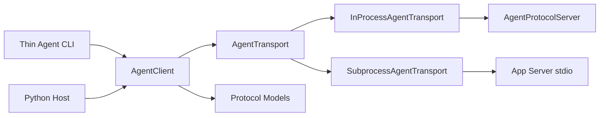

**图示说明：** Agent SDK以Protocol为唯一公共合同，可选择进程内或stdio边界。旧Action HTTP客户端不再进入
产品结构图；其源码只在0.9.1f迁移窗口内保留。

### 5.1 允许依赖

| 方向 | 规则 |
|---|---|
| CLI/宿主 → SDK | 允许；负责保存业务身份、呈现交互并决定重连 |
| AgentClient → Protocol | 允许；必须复用Params、Result和兼容校验，不复制Schema |
| SubprocessTransport → OS Process | 允许；仅argv，无Shell |
| InProcessTransport → App Server | 允许；只能调用Frame入口和Close，不旁路Service |
| 旧HTTP Client → Domain + httpx | 仅允许既有白名单调用方迁移，不允许新增生产依赖 |

### 5.2 禁止旁路

- SDK不得直接打开Session、Protocol Request或Effect Journal数据库；
- Agent Client不得把JSON-RPC序号用作Command `requestId`；
- Live Delta不得写入调用方持久游标；
- 旧HTTP Client不得重新进入公共导出或默认产品装配；
- 子进程stdout不得混入诊断文本；
- 自定义Transport不得用Notification的Response补偿Request；
- Client Instance ID不得作为远程认证身份；
- SDK不得把stderr、Prompt、Tool参数或HTTP错误正文默认写日志。

## 6. 包结构与推荐阅读顺序

| 顺序 | 文件 | 规模 | 阅读目标 |
|---:|---|---:|---|
| 1 | [`errors.py`](../../src/harnessix/sdk/errors.py) | 22行 | Agent SDK跨Transport共享的稳定错误合同 |
| 2 | [`response.py`](../../src/harnessix/sdk/response.py) | 119行 | 严格Response Envelope/JSON预算和Result错误归一 |
| 3 | [`request.py`](../../src/harnessix/sdk/request.py) | 82行 | 出站Frame、广告方法、协商消息/Replay上限和唯一Response关联 |
| 4 | [`agent_client.py`](../../src/harnessix/sdk/agent_client.py) | 611行 | Transport端口、子进程并发、握手、Thread/Turn/Event客户端 |
| 5 | [Protocol模块设计](protocol.md) | 现行设计 | 理解Params、Result、Cursor、兼容与错误合同 |
| 6 | [App Server模块设计](app-server.md) | 现行设计 | 对照Server握手、乱序响应、关闭和恢复 |
| 7 | [`test_server_sdk.py`](../../tests/app_server/test_server_sdk.py) | 1058行 | 35项Client、Transport、Server与Runtime纵向场景，含恶意Response、半握手和协商前置门禁 |
| 8 | [`test_agent_cli.py`](../../tests/app_server/test_agent_cli.py) | 190行 | 验证SDK如何被薄交互层消费 |
| 9 | [`__init__.py`](../../src/harnessix/sdk/__init__.py)与[根包导出](../../src/harnessix/__init__.py) | 公共面 | 验证只公开Agent SDK |
| 10 | [`client.py`](../../src/harnessix/sdk/client.py) | 迁移兼容 | 理解待删除HTTP客户端，不作为新增集成样例 |
| 11 | [`test_sdk.py`](../../tests/unit/test_sdk.py) | 兼容回归 | 在迁移期防止旧客户端行为意外破坏 |

## 7. Agent SDK内部架构

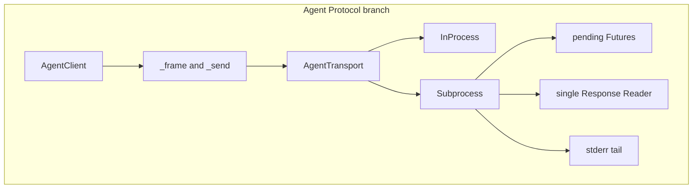

`agent_client.py`拥有连接级内存状态。`client.py`只包装`httpx`连接池，是等待调用方迁移完成后删除的旧实现；
不得围绕它新增公共Base Client、统一Error或重试抽象。

## 8. 公共API与导出边界

### 8.1 `harnessix.sdk`导出

| 导出 | 类型 | 用途 |
|---|---|---|
| `AgentClient` | 异步类 | Agent Protocol资源与事件 |
| `AgentSDKError` | 异常 | Agent协议、服务和Transport稳定错误 |
| `AgentTransport` | Protocol | 自定义Agent传输端口 |
| `InProcessAgentTransport` | 类 | 嵌入Server和确定性测试 |
| `SubprocessAgentTransport` | 类 | 本地stdio子进程 |

### 8.2 根包导出边界

[`harnessix.__init__`](../../src/harnessix/__init__.py)只导出共享Action领域模型，不导出协议Client。
Agent调用方必须从`harnessix.sdk`导入Agent SDK；旧HTTP Client只能直接从兼容模块导入，且不构成稳定合同。

## 9. AgentTransport合同

```python
class AgentTransport(Protocol):
    async def exchange(self, frame: bytes) -> tuple[bytes, ...]: ...
    async def notify(self, frame: bytes) -> None: ...
    async def close(self) -> None: ...
```

### 9.1 语义

| 方法 | 调用方预期 | 官方实现 |
|---|---|---|
| `exchange` | 发送一个Request，返回Response帧集合 | InProcess可返回Server元组；Subprocess固定返回单元素元组 |
| `notify` | 发送Notification且不等待Response | InProcess同步检查无Response；Subprocess只写stdin |
| `close` | 有界结束Transport拥有资源 | InProcess关闭Server；Subprocess关闭stdin并逐级等待/终止 |

`AgentClient._send`在Transport返回后再次要求恰好一个Response，因此自定义Transport返回0或多个帧会得到
`invalid_response`。Transport端口没有声明每次调用Timeout、并发上限、取消隔离、重连或所有权转移，
自定义实现需要自行与Client语义对齐。

## 10. InProcessAgentTransport

进程内Transport不绕过Protocol：`exchange`和`notify`都调用同一个
[`AgentProtocolServer.process_frame`](../../src/harnessix/app_server/server.py)。它不做序列化之外的快捷访问，
因此Params、连接状态、方法和公共投影仍会执行。

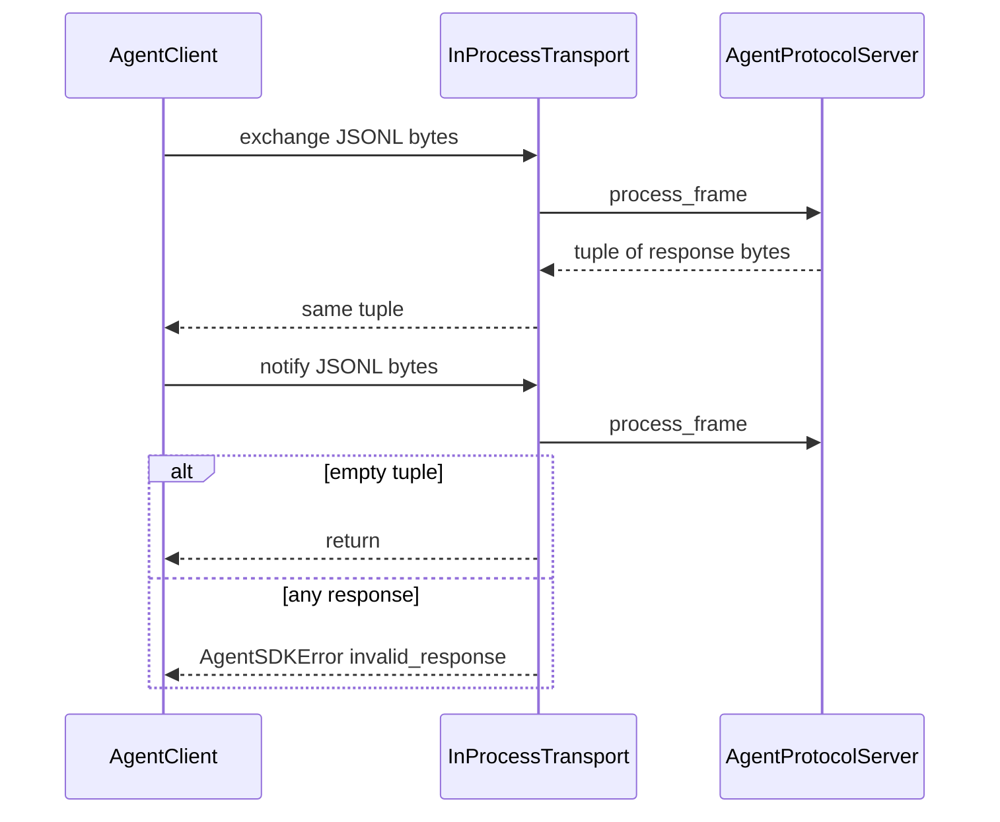

### 10.1 与子进程不等价的边界

调用协程取消会直接取消`process_frame`协程；子进程Transport则用`asyncio.shield`保留服务端请求并把ID记入
`_abandoned`。因此进程内Transport适合协议集成测试和嵌入，但当前不能证明其在所有提交切点具有与跨进程
完全相同的取消语义。Closing状态的Server会对Notification返回错误帧，进程内`notify`会立即报错；
子进程实现通常在Reader中异步把连接标记为失败。

## 11. SubprocessAgentTransport生命周期

Transport没有显式枚举，但字段组合形成以下实际状态：

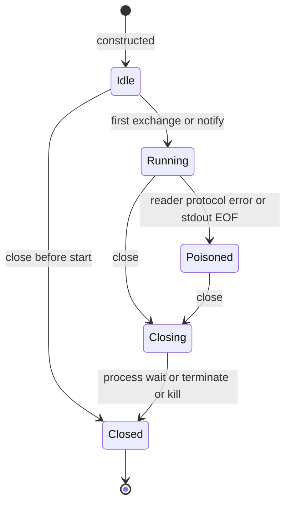

| 状态 | `_process` | `_reader_error` | `_closed` | 行为 |
|---|---|---|---:|---|
| Idle | `None` | `None` | `false` | 首次操作惰性启动 |
| Running | Process | `None` | `false` | 可并发Exchange，写入串行 |
| Poisoned | Process | `(code,message)` | `false` | 后续`_start`或写入失败，不自动重启 |
| Closing | Process或None | 任意 | `true` | 拒绝新请求，关闭stdin并等待进程 |
| Closed | 已退出或从未启动 | 通常`server_closed` | `true` | Close幂等，操作失败 |

`_reader_error`采用首次错误优先；后续`_fail_pending`不会覆盖原因。进程退出后`_process`不会清空，当前实例
不存在重新启动路径。调用方必须创建新Transport和Client，并复用持久业务身份完成恢复。

## 12. 子进程启动与标准流

`_start`由`_start_lock`保护，只创建一次`asyncio.create_subprocess_exec`。命令被保存为不可变Tuple，空命令
在构造时失败。启动参数不经过Shell，避免Shell元字符解释；当前未设置`cwd`、`env`、`start_new_session`、
Windows Creation Flags或文件描述符白名单，因此子进程继承父进程工作目录和默认环境。

构造函数使用`ProtocolLimits`校验`max_message_bytes`，当前允许4 KiB～8 MiB，默认1 MiB；非法值在启动
子进程前以`ValueError`失败。启动成功后同时创建：

- `harnessix-sdk-reader`：在`max_message_bytes + 1`的`StreamReader`预算内按行读取stdout并归并Response；
- `harnessix-sdk-stderr`：每次读取4096字节，保留最后65,536字节；
- PIPE stdin：所有写入通过`_write_lock`；
- PIPE stdout/stderr：分别由唯一Task读取，避免子进程因缓冲区填满阻塞。

启动`OSError`被转换为`server_start_failed`，不公开底层路径或系统异常。其他创建阶段异常不在该稳定映射
中。当前没有启动Deadline，也没有验证可执行文件来源、签名或目录权限。

## 13. 并发Request与Response归并

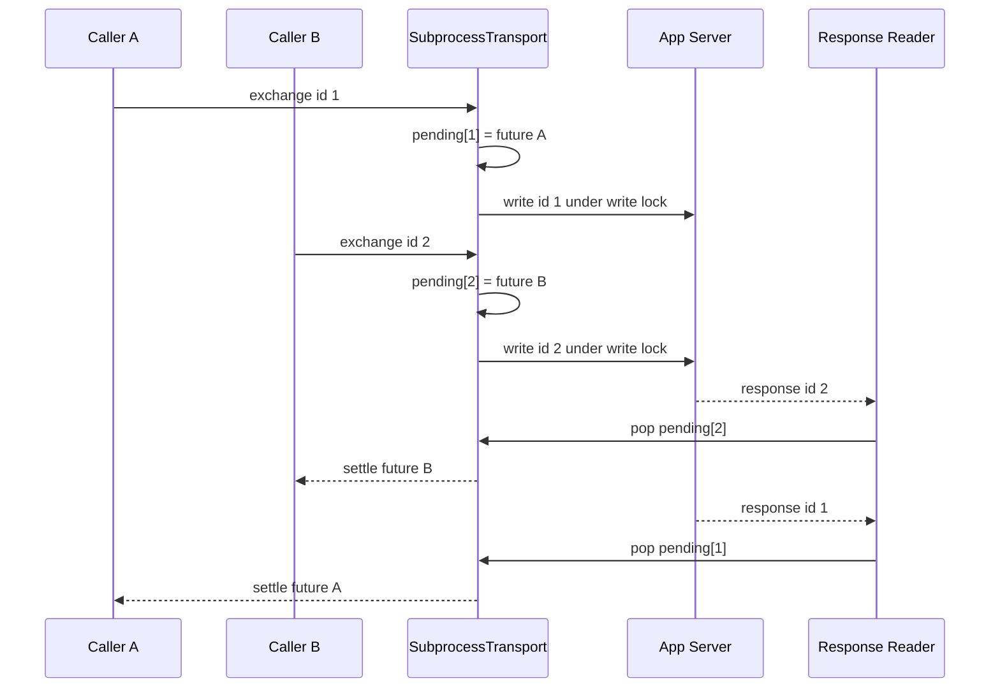

### 13.1 写侧

1. `_frame_id`先用标准`json.loads`取得Request ID；
2. ID必须是字符串或非布尔整数；
3. 在任何写入前建立Future并写入`_pending`；
4. 活跃或Abandoned ID重复时返回`duplicate_request_id`；
5. `_write_lock`串行执行`stdin.write + drain`；
6. `asyncio.shield(future)`只保护Response Future不被调用方取消传播。

检查和插入`_pending`之间没有`await`，在单事件循环协作调度中不会被另一协程插入；该字段不是线程安全
容器，Transport也没有承诺跨事件循环或跨线程调用。

### 13.2 读侧

Reader每次`stdout.readline()`取得一帧，并在路由前调用`_decode_response`校验UTF-8、单对象、重复键、非有限数、
深度、集合预算、标准JSON-RPC版本、Response联合类型和安全ID。Abandoned ID只被丢弃一次；普通ID从
`_pending`取出并结算Future。无效Envelope、未知ID、超限帧、EOF或读取错误会调用
`_fail_pending`，把所有Pending统一失败并固定Sticky Reader Error。

这种Fail-closed策略避免错配Response，但一个未知、畸形或超限帧会终止整条连接上所有并发调用。流Reader在
换行前阻止超限缓冲继续增长，`_decode_response`再次检查实际帧长，避免自定义Transport绕过相同边界。

## 14. 取消与迟到Response

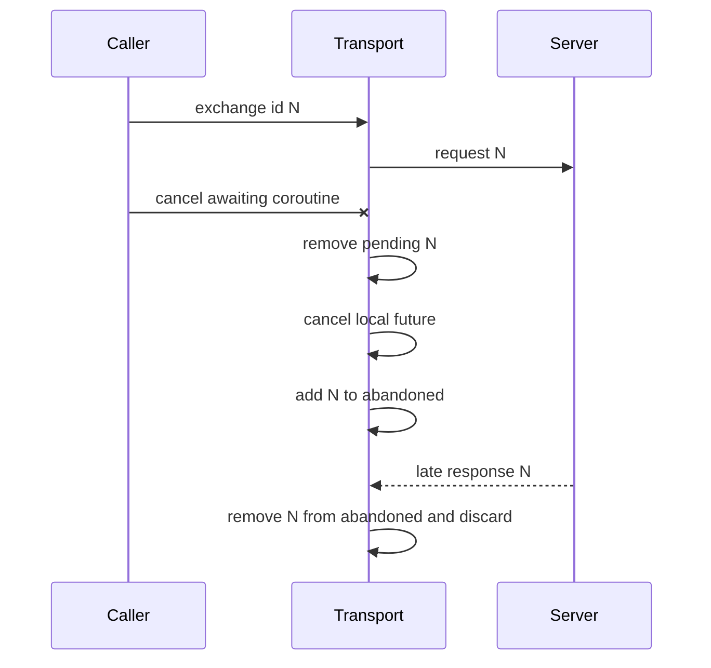

子进程请求写出后，取消等待不等于取消Server业务。`exchange`捕获`CancelledError`，仅移除本地Pending并
登记Abandoned ID；Server继续执行，调用方必须通过相同Command Request ID、Thread Snapshot和Replay确认
结果。若迟到Response永不返回，Abandoned集合会保留到Transport Close；高频取消可导致内存增长。

非取消异常会移除Pending但不登记Abandoned。若写入在异常前已部分成功且Server后来返回Response，Reader会把
该ID视为未知并使整条连接失败。这是保守处理，不是Exactly-once证明。

## 15. Notification只写路径

`notify`惰性启动进程并在`_write_lock`内写入帧，不创建Pending Future，也不等待Response。该路径用于
`notifications/initialized`，避免把协议明确无响应的Notification当作同步交换。

两个官方Transport检测违规Response的时机不同：

| Transport | Server错误回复Notification时 |
|---|---|
| InProcess | `notify`当次立即发现非空元组并抛`invalid_response` |
| Subprocess | `notify`可能已经返回；Reader随后把无效/未知ID当作连接级`invalid_response`，使后续操作失败 |

Subprocess Reader Error不会自动关闭子进程，资源仍需显式`close`。当前Closing App Server会在解码前回复
Notification，因此关闭竞态可能触发该差异；详见[App Server模块设计](app-server.md)。

## 16. stderr诊断尾部

`_drain_stderr`持续读取stderr，保留最近64 KiB到公开可读`bytearray stderr_tail`。旧字节从头部删除，
因此空间上限固定，但可能从任意UTF-8字符中间截断。SDK不解析、不解码、不分类也不输出该数据。

该缓冲的作用是防止stderr Pipe填满并给宿主保留有限诊断上下文，不是安全诊断包：

- 没有Secret Redactor或结构化字段白名单；
- 没有行数、事件级别或来源边界；
- 不持久化，进程结束后只存在于Transport对象；
- 调用方若直接打印可能泄漏路径、配置或下游异常；
- `_drain_stderr`自身异常会在Close等待时向上传播，当前没有专门错误映射。

正式诊断功能必须在消费前执行脱敏，并明确stderr仅用于本地故障辅助，不能作为Session恢复事实。

## 17. 子进程关闭与强制终止

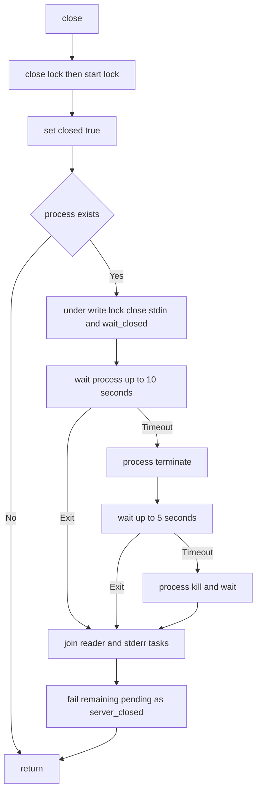

### 17.1 当前保证

- Close由`_close_lock`串行，重复调用返回；
- Close先标记`_closed`，后续Start/Write失败；
- stdin正常关闭给App Server一次EOF优雅退出机会；
- 10秒后Terminate，追加5秒后Kill；
- Reader和stderr Task在返回前被等待；
- 剩余Pending最终统一得到`server_closed`。

### 17.2 边界

- 10秒与5秒为硬编码，不能按产品关闭预算配置；
- 只终止直接子进程，没有进程组/Job Object或后代进程树所有权；
- `close`本身被取消时没有Shield/Finally保证继续清理；
- `process.kill()`后的Wait无额外Timeout；
- stderr Task异常可能中断最终`_fail_pending`调用；
- 当前没有Terminate、Kill、关闭取消、Windows进程语义或后代残留专项测试。

## 18. AgentClient状态与初始化

`AgentClient`持有Transport、Client身份、连接序号、初始化锁、失败标志和最近一次`InitializeResult`。它没有
完整连接状态枚举，也不自动创建替代Transport。

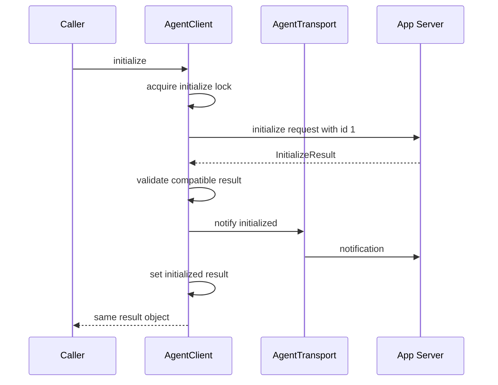

### 18.1 初始化合同

| 字段 | 当前来源 | 真实行为 |
|---|---|---|
| `protocolVersion` | 固定`AGENT_PROTOCOL_VERSION` | 只发送1.0，无版本范围协商 |
| `clientInfo.name` | 构造参数，默认`harnessix-python-sdk` | 由Protocol模型校验 |
| `clientInfo.version` | 构造参数，默认`0.8.0` | 当前与包版本`0.1.0`不一致，不自动读取安装版本 |
| `clientInstanceId` | 注入或`uuid4()` | SDK不持久；调用方负责重连复用 |
| `capabilities.itemDeltas` | 硬编码`true` | 调用方不能关闭；其他能力使用模型默认值 |
| `limits` | `InitializeParams`默认 | 构造接口不允许调用方自定义 |

`_initialize_lock`使同一Client上的并发初始化只发送一次握手，后续调用返回同一个Result对象。SDK不会在其他
公开方法前自动初始化；未使用异步Context Manager或显式`initialize`时，Server会返回`not_initialized`。

### 18.2 部分握手失败

`initialized`只在Initialize Response验证成功且`notifications/initialized`写入返回后设置。Initialize任一步骤
失败或调用被取消时，Client设置`_initialize_failed`并关闭当前Transport；关闭错误不覆盖原始握手错误。后续
`initialize()`不再发送第二个Initialize，而是返回可重试`handshake_failed`。调用方必须创建新Transport和Client，
复用同一Client Instance ID完成完整握手；自动重建由0.9.1a的`RecoverableAgentSession`承担。

## 19. JSON-RPC序号与业务幂等身份

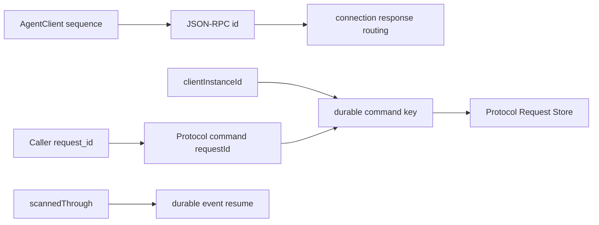

| 身份 | 生成者 | 生命周期 | 可否复用 |
|---|---|---|---|
| JSON-RPC ID | Client `_sequence += 1` | 当前Client/连接 | 不应在未决或Abandoned时复用 |
| Client Instance ID | 默认SDK或调用方 | 应跨Transport重建持久 | 同一逻辑客户端复用 |
| Command Request ID | 调用方 | 业务命令持久 | 相同意图重试复用；新意图必须新ID |
| Thread/Turn ID | Server/Runtime | Session持久 | 查询和恢复复用 |
| Replay Cursor | Server返回、调用方保存 | Thread事件历史 | 从最后`scannedThrough`继续 |
| Action ID | ActionRequest/Service | Action Journal持久 | HTTP查询和恢复复用 |

SDK有意要求所有写命令显式传入`request_id`，防止网络重试自动生成新业务身份。JSON-RPC ID只是当前
Response Future的路由键，即使相同Command跨重连，其JSON-RPC ID也可以不同。

## 20. Agent Response解析与错误映射

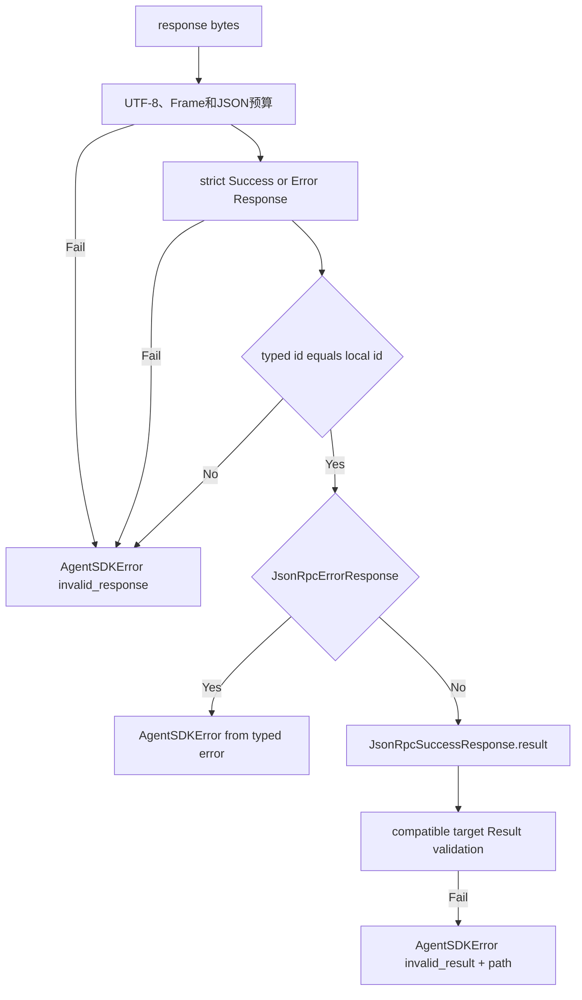

### 20.1 已实现映射

- 非UTF-8、非单对象、重复键、非有限数、深度/集合/帧超限返回`invalid_response`；
- Envelope严格解析为`JsonRpcSuccessResponse`或`JsonRpcErrorResponse`，拒绝错误版本、额外字段、布尔ID和
  `result/error`共存或同时缺失；
- `code/message/retryable/path`由严格Error合同校验，不使用松散默认值；
- 公开方法通过`_validate_result`复用`validate_server_output`，继续忽略Result中新加可选字段；
- 已知Result字段非法时统一返回`invalid_result`，首个Pydantic错误位置进入有界`path`；
- Server返回的业务错误转换为`AgentSDKError(code,message,retryable,path)`。

### 20.2 兼容与剩余边界

Response Envelope属于JSON-RPC固定结构，因此拒绝未知顶层字段；Result内部继续按Protocol向前兼容规则忽略新增
可选字段，已知字段仍严格。自定义Transport返回的帧也经过相同解析。Initialize Response使用默认1 MiB校验；握手完成后`AgentClient`按服务端协商的更小`maxMessageBytes`校验后续
Request与Response，并在写Transport前拒绝未广告方法。`SubprocessAgentTransport`的StreamReader仍按构造期上限
分配，不能在握手后缩小底层缓冲；Pending并发与出站消息数量也尚未按协商值建立客户端容量门禁。

## 21. AgentSDKError合同

| 字段 | 来源 | 语义 |
|---|---|---|
| `code` | 本地Transport/解析或Server `error.data.code` | 稳定机器分类 |
| `message` | 本地固定中文或Server Error消息 | 人类诊断；当前未统一脱敏 |
| `retryable` | Server严格true或本地默认false | 仅提示，不自动重试 |
| `path` | Server字段路径的宽松过滤结果 | 追加到异常字符串，如`[field/0]` |

本地常见码包括`invalid_request`、`invalid_response`、`duplicate_request_id`、`server_start_failed`和
`server_closed`。Service/Kernel稳定码由Server透传。SDK不附加HTTP状态、子进程退出码、stderr摘要、
Request ID或Thread ID，也没有异常Cause链用于安全诊断。

## 22. Agent资源方法

### 22.1 Thread与Turn

| Client方法 | Protocol方法 | 输入重点 | 输出 |
|---|---|---|---|
| `create_thread` | `thread/create` | Workspace、Command Request ID | `ThreadView` |
| `get_thread` | `thread/get` | Thread ID | `ThreadView` |
| `list_threads` | `thread/list` | Cursor、Limit、Archived | `ThreadListResult` |
| `resume_thread` | `thread/resume` | Thread ID，无Command Request ID | `ThreadView` |
| `fork_thread` | `thread/fork` | Source、可选Through Turn、Request ID | `ThreadView` |
| `archive_thread` | `thread/archive` | Thread、Request ID、Reason | `ThreadView` |
| `start_turn` | `turn/start` | Thread、Prompt、Request ID、可选Budget | `TurnView` |
| `retry_turn` | `turn/retry` | Thread、Source Turn、Request ID、Budget | `TurnView` |
| `resume_turn` | `turn/resume` | Thread、Turn、Request ID | `TurnView` |
| `cancel_turn` | `turn/cancel` | Thread、Turn、Request ID | `TurnView` |
| `steer_turn` | `turn/steer` | Thread、Turn、Text、Request ID | `TurnView` |

### 22.2 交互、事件与Artifact

| Client方法 | Protocol方法 | 语义 |
|---|---|---|
| `respond_approval` | `approval/respond` | 调用方直接提供完整严格Params，绑定Approval指纹和决定 |
| `respond_question` | `question/respond` | 调用方提供Question身份和答案 |
| `replay_events` | `events/replay` | 单次持久事件页 |
| `next_events` | `events/next` | 持久进展优先，附带可选Live Delta与Timeout |
| `read_artifact` | `artifact/read` | Thread授权下分页读取；调用前统一检查广告方法 |
| `watch_thread` | 循环`events/next` | 无限异步迭代，不自动判断终态 |

所有方法先由本地Pydantic Params模型校验。该校验失败直接抛Pydantic异常，不转换为`AgentSDKError`；调用方
若需要统一错误呈现必须当前同时处理本地合同异常和SDK错误。

## 23. 能力协商与调用门禁

Initialize Result被保存到`client.initialized`，包含Methods、Artifact、Replay、Delta和Limits。握手完成后：

- `_send`在构造Frame后、调用Transport前检查方法是否位于`capabilities.methods`；
- 未广告方法返回`method_not_negotiated`，不会占用Transport写入；
- Frame超过协商`maxMessageBytes`时返回`negotiated_limit_exceeded`；
- Response也按协商`maxMessageBytes`再次验证；
- Replay/Next的请求`limit`超过`maxReplayEvents`时在写入前失败；
- `itemDeltas`仍以Server Result为准，Product UI投影只把实际收到的Delta作为临时显示。

当前未实现`maxPendingRequests`和`maxOutboundMessages`客户端Semaphore/队列，也不根据布尔`replay`或
`artifactPages`单独判断；对应方法是否存在以`capabilities.methods`为最终调用门禁。

## 24. Replay、Delta与watch_thread

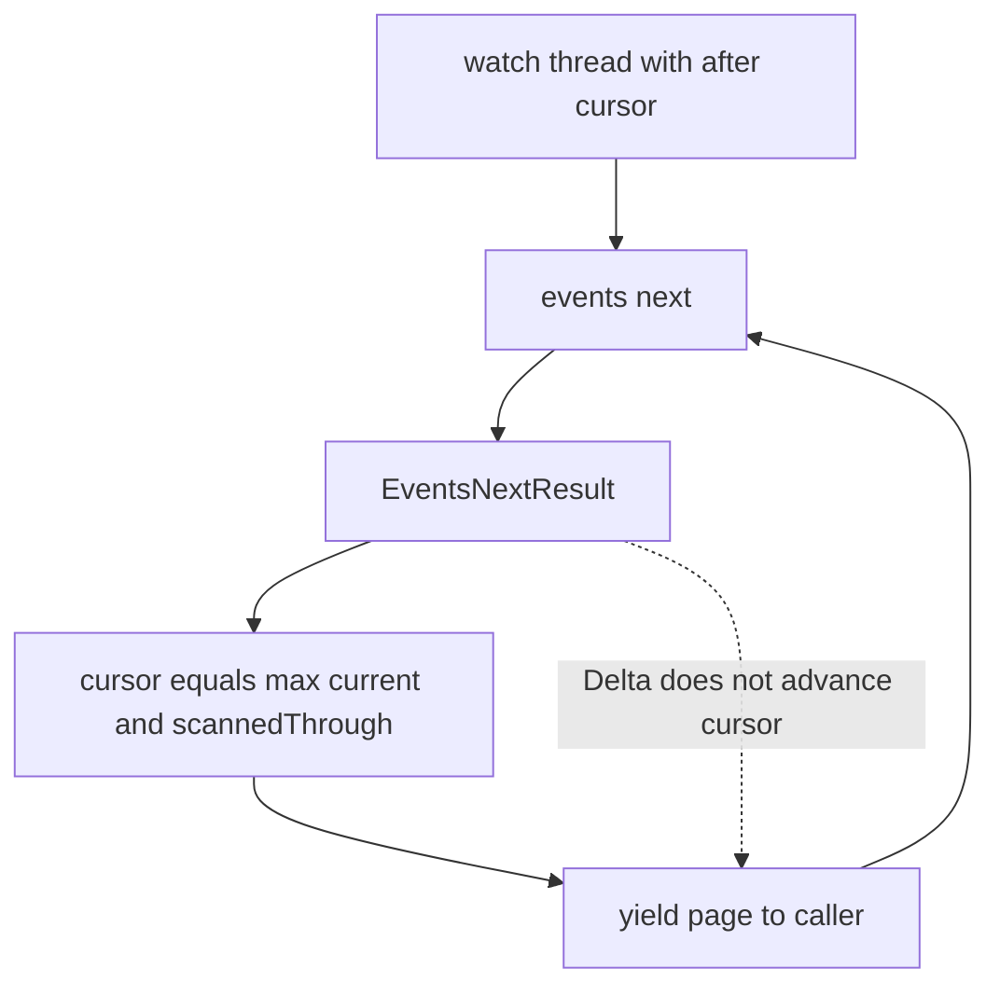

`watch_thread`每轮调用`next_events`，只使用`page.replay.scanned_through`推进局部Cursor，然后无条件Yield页面。
这保留以下服务端语义：

- 被隐藏内部事件造成Cursor跳跃时不会反复扫描；
- Live Delta不改变持久恢复点；
- `timedOut=true`页面也会交给调用方；
- `liveGap`由调用方决定停止拼接并等待持久Item；
- `liveHasMore`不会触发SDK内部批量排空策略。

迭代器没有终止条件、退避、Cursor持久化、自动重连或Turn筛选。调用方Break只停止下一次循环，不关闭Client；
在Yield点没有隐藏的进行中Request。薄CLI在SDK之上读取Thread终态并处理Question、Approval和Artifact。
薄CLI的Replay与Next请求页大小取`min(256, initialized.limits.maxReplayEvents)`；因此小于默认值的服务端协商
结果也会在调用SDK前生效，不会依赖服务端二次拒绝。

## 25. 断线恢复责任

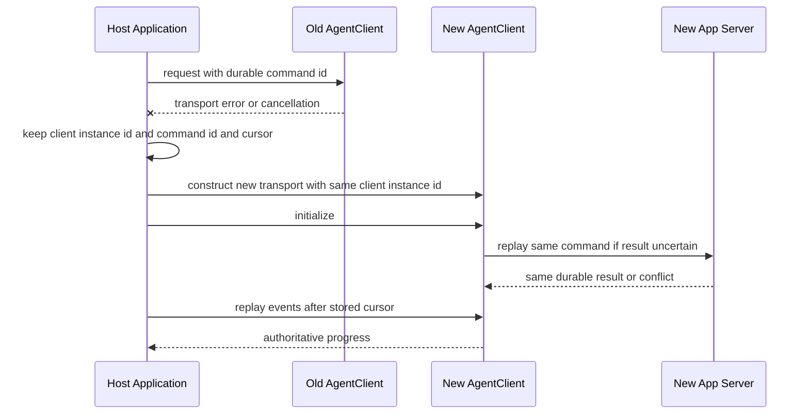

SDK不会自动执行图中恢复动作。宿主必须持久或可靠保存：

1. 稳定Client Instance ID；
2. 每个写命令的Request ID及其业务意图；
3. Thread/Turn ID；
4. 每个Thread最后已消费的`scannedThrough`；
5. 需要迁移旧Action数据时，兼容调用方自行保存Action ID和Idempotency Key。

若宿主使用默认随机Client Instance ID并在崩溃后重新构造Client，相同Command Request ID进入新的幂等命名
空间，不能依赖Protocol Request Ledger返回旧结果。领域层部分操作仍有确定性身份，但SDK合同要求显式复用。

## 26. 迁移兼容：Action Plane HTTP客户端

本节只记录尚未物理删除的兼容实现，不代表当前产品接口。`HarnessixClient`和`HarnessixAsyncClient`是手写的轻量HTTP包装，分别拥有`httpx.Client`和
`httpx.AsyncClient`。构造参数只开放Base URL、Timeout和可选Transport；Base URL会移除尾部斜杠，默认
`http://127.0.0.1:8787`。异步Context Enter不会发健康检查或初始化请求，只返回自身。

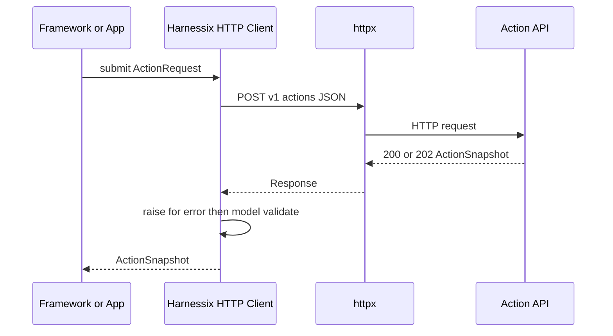

HTTP Client不拥有Action执行生命周期。Inline模式可能直接返回终态；Queued或等待状态可能返回202和非终态
Snapshot，调用方需要用`get`继续查询、处理审批或触发Reconcile。当前
[Adapter模块](adapters.md)只调用Submit并把完整Snapshot序列化为Tool内容，不会自动调用这些恢复方法。

## 27. HTTP资源方法与线路

| 同步/异步方法 | HTTP | 请求 | 成功输出 | 当前分页 |
|---|---|---|---|---|
| `submit` | `POST /v1/actions` | `ActionRequest`去除None后的JSON | `ActionSnapshot` | 不适用 |
| `get` | `GET /v1/actions/{action_id}` | Path ID | `ActionSnapshot` | 不适用 |
| `decide_approval` | `POST /v1/actions/{id}/approval` | `ApprovalDecision` JSON | `ActionSnapshot` | 不适用 |
| `reconcile` | `POST /v1/actions/{id}/reconcile` | 无Body | `ActionSnapshot` | 不适用 |
| `events` | `GET /v1/actions/{id}/events` | Path ID | `list[ActionEvent]` | 无，读取完整列表 |
| `tools` | `GET /v1/tools` | 无 | `list[ToolDescriptor]` | 无，读取完整列表 |

Client没有封装`/healthz`、`/readyz`、OpenAPI或服务版本。`action_id`类型允许UUID或任意字符串，SDK不先
执行UUID规范化；服务端路由负责最终校验。同步与异步方法当前手工重复，变更任一端点时必须成对维护。

## 28. HTTP成功与错误解析

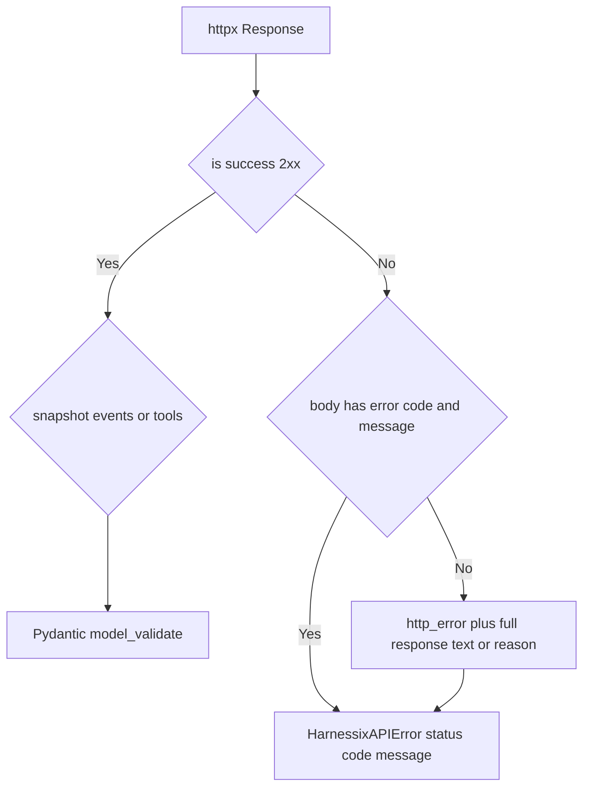

### 28.1 成功

`_snapshot`先调用`_raise_for_error`，再把完整JSON解析为`ActionSnapshot`。Events和Tools方法先检查HTTP状态，
再读取顶层`events/tools`数组并逐项验证。HTTP 202属于成功，因此不会抛错；Snapshot状态保留服务端事实。

### 28.2 非成功

若响应满足`{"error":{"code":...,"message":...}}`，SDK保存HTTP状态、字符串化Code和Message；否则使用
`code=http_error`以及完整`response.text`或Reason Phrase。当前：

- 不解析`retryable`、字段Path、Trace ID、Retry-After或错误Schema版本；
- Fallback正文无长度上限和脱敏，受控探针可形成10万字符Error Message；
- 结构化Error的Code/Message也没有客户端长度复验；
- 网络、TLS、Timeout和连接池异常直接保留为`httpx`异常；
- 成功Body缺失/损坏时直接抛JSON、KeyError或Pydantic异常；
- 不自动重试任何方法，也不区分幂等GET与可能提交副作用的POST。

## 29. HarnessixAPIError合同

| 字段 | 语义 | 限制 |
|---|---|---|
| `status_code` | HTTP状态 | 网络失败没有该异常类型 |
| `code` | 服务端错误码或`http_error` | 任意值转字符串，无长度检查 |
| `message` | 服务端Message或Fallback Body | 可能很大，未脱敏 |
| 异常字符串 | `code: message` | 不含Action ID、Trace ID或Retry提示 |

该异常与`AgentSDKError`没有共同基类，调用方不能用一个SDK异常捕获两套协议。对于Action提交响应丢失，
调用方应使用原Action ID或Idempotency Key查询，不应因只看到`httpx`异常就生成全新身份盲目重试。

## 30. 持久状态、内存状态与所有权

| 状态/资源 | 所有者 | 是否持久 | 释放/恢复 |
|---|---|---:|---|
| Agent Client Instance ID | AgentClient/调用方 | SDK不持久 | 调用方保存并注入新Client |
| JSON-RPC Sequence | AgentClient | 否 | 新Client从0开始，不影响业务幂等 |
| Initialize Result | AgentClient | 否 | 新连接重新握手 |
| Subprocess Handle | SubprocessTransport | 否 | `close`或进程退出 |
| Pending Future | SubprocessTransport | 否 | Response、Reader失败、取消或Close |
| Abandoned ID | SubprocessTransport | 否 | 迟到Response或Close |
| Reader Error | SubprocessTransport | 否 | Sticky到实例结束 |
| stderr Tail | SubprocessTransport | 否 | 对象释放；不自动清空 |
| Replay Cursor | `watch_thread`局部/调用方 | SDK不持久 | 调用方保存`scannedThrough` |
| HTTP连接池 | HTTP Client | 否 | Context Exit或Close |
| Action/Session事实 | Server Store | 是 | SDK只按ID查询，不拥有 |

SDK Close不删除Server数据库、Thread、Action或Artifact。AgentClient Close会关闭其Transport；InProcess
Transport因此也关闭注入的Server/Service，说明该适配器把Server生命周期所有权转交给Client。HTTP Client
只关闭自身连接池，不关闭远程Action Service。

## 31. 并发、线性化点与资源预算

### 31.1 Agent分支

| 操作 | 线性化/排序点 | 当前边界 |
|---|---|---|
| JSON-RPC ID分配 | `_sequence += 1`后构造Request | 同事件循环内无Await；非线程安全 |
| 进程创建 | `_start_lock`内设置`_process` | 仅一次，不自动重启 |
| Pending注册 | `_pending[id] = future` | 写帧前完成 |
| 帧写入 | `_write_lock`内`write + drain` | 无SDK级写Timeout |
| Response结算 | Reader `pop(_pending[id])` | 可乱序；未知ID全局失败 |
| 取消登记 | Exchange异常分支移除Pending并加Abandoned | 仅CancelledError添加 |
| 关闭开始 | `_closed = true` | 拒绝后续Start/Write |

客户端已有构造期Response字节与Reader行长上限，但没有Semaphore、Pending数量上限或Abandoned上限；Server协商
Limit不会调整这些结构。大量并发会先在客户端创建无界Future并写入Server；大量取消但无响应会增长集合。

### 31.2 HTTP分支

并发、连接池、DNS和每阶段Timeout由`httpx`默认与传入总Timeout控制。SDK不暴露Limits、连接池配置、
重试或并发Semaphore，也没有Events/Tools页大小。同步Client不得从异步事件循环阻塞调用，异步Client由
调用方负责在单一生命周期内复用。

## 32. 失败与恢复矩阵

| 场景 | 当前结果 | Server事实 | 恢复动作 |
|---|---|---|---|
| 子进程启动失败 | `server_start_failed` | 未启动 | 修正命令后新建Transport |
| Request本地JSON/ID无效 | `invalid_request` | 未写入 | 修正自定义Frame |
| Pending ID重复 | `duplicate_request_id` | 原请求可能在执行 | 等待原请求；不要换业务身份盲重试 |
| stdin写入失败 | `server_closed` | 未知是否部分写入 | 新连接，以原Command ID查询/重放 |
| stdout非法/超限Envelope | 全部Pending `invalid_response`，Reader Sticky | 各请求未知 | 关闭进程；按业务ID逐项恢复 |
| stdout EOF | 全部Pending `server_closed` | Session可能已提交 | 新建Client，Snapshot+Replay |
| 未知Response ID | 整连接失败 | 其他Request可能正常 | 关闭并按每个业务身份恢复 |
| 调用取消 | Subprocess记Abandoned；InProcess向Server协程传播取消 | 取决于Transport与提交切点 | 查询Thread/Action，不把取消当作回滚 |
| Initialize Response后Notify失败 | 原错误；当前Client后续固定`handshake_failed` | 无领域命令 | Transport已关闭；新建Client并复用同Client ID |
| Server返回Error | `AgentSDKError` | 取决于错误 | 依据Code/Retryable及Snapshot |
| Result结构损坏 | `invalid_result`及首个安全字段路径 | 未知 | 不盲重提；关闭不可信连接并保留业务身份 |
| `watch_thread`超时页 | 正常Yield | 无新增事实 | 调用方退避或继续 |
| Live Gap | 正常Yield `liveGap` | 持久Item仍权威 | 放弃Delta拼接，等Replay终态 |
| SDK崩溃 | 全部内存状态丢失 | Server持久事实保留 | 从外部保存ID/Cursor重建 |
| HTTP 202 | 返回非终态Snapshot | Action已受理 | `get`轮询或等待外部Worker |
| HTTP非2xx结构化错误 | `HarnessixAPIError` | 按状态码/Code | 使用稳定Action身份判断 |
| HTTP响应丢失/Timeout | 原始`httpx`异常 | 提交是否成功未知 | 用原Action ID/Idempotency Key查询 |
| HTTP成功Body损坏 | JSON/Key/Pydantic异常 | 服务端可能已成功 | 不盲重提；按Action ID查询并诊断版本 |

## 33. 安全与隐私边界

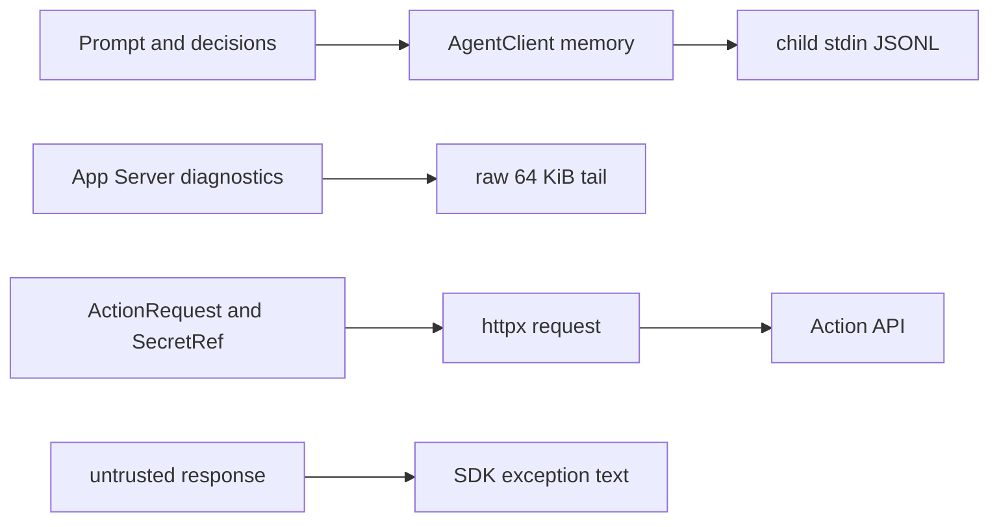

### 33.1 已有控制

- 子进程使用argv，不使用Shell；
- 启动OSError不公开原始系统异常；
- Agent领域字段先通过Protocol Params模型；
- 未预期Server异常正常应由App Server清洗；
- HTTP请求使用Domain模型序列化，Secret应以`SecretRef`表达；
- SDK本身没有默认Logger，不主动把请求/响应写盘；
- stderr只保留固定64 KiB，避免无限累积。

### 33.2 信任假设与缺口

- 子进程继承父进程默认环境和当前目录；任意自定义Command可看到父进程凭据；
- 不验证App Server可执行文件签名、Owner或路径；
- stdout Response没有完整严格合同和字节/深度上限；
- stderr Tail、Server稳定Message和HTTP Fallback Body未脱敏；
- 默认HTTP是明文Loopback，不包含身份认证；自定义远程Base URL没有强制HTTPS；
- Client Instance ID只是幂等命名空间，不是认证凭据；
- SDK不提供多租户Thread/Action授权；
- 调用方可能把异常字符串直接写日志，带出Server或HTTP正文。

任何远程Agent Protocol或Action API产品化都必须在SDK之外先建立认证、授权、TLS、凭据生命周期、租户隔离
和速率限制，再为Client增加显式安全配置；不能把本地默认值当作公网安全基线。

## 34. 平台、安装与部署

AgentClient、InProcess和HTTP包装没有显式OS分支。`asyncio.create_subprocess_exec`、PIPE和`httpx`可在
Python支持的平台运行，但当前不能据此宣称产品级三平台完成：

| 平台方面 | 当前事实 | 缺口 |
|---|---|---|
| macOS/Linux | 开发与CI覆盖大量Python路径 | 无安装器、升级和长连接发布证据 |
| Windows | SDK源码无主动拒绝 | 默认Coding Tool Runtime仍在产品启动前失败；Transport关闭无Windows专项证据 |
| Python | 要求3.12+ | 仅Python SDK，无跨语言客户端 |
| Package Version | `pyproject`为0.1.0 | Agent Client默认报告0.8.0，身份元数据漂移 |
| Agent可执行入口 | 薄CLI传入Server Program与参数 | SDK不自动解析项目配置或验证可执行文件 |
| HTTP地址 | 默认Loopback 8787 | SDK不做Health/Ready探测或服务发现 |

三平台正式结论需要真实子进程启动、并发、取消、EOF、Terminate/Kill、Unicode argv/path和安装产物测试，
并与0.9.1 Windows产品入口及0.9.5发行验收共同关闭。

## 35. 可观测性与诊断

SDK当前没有注入Observability端口，不创建Span、Metric或结构化日志。可见诊断只有：

- `AgentSDKError`的Code、Message、Retryable和Path；
- `HarnessixAPIError`的HTTP Status、Code和Message；
- `SubprocessAgentTransport.stderr_tail`原始字节；
- 调用方可访问的Initialize Result、Thread/Turn/Event和Action Snapshot；
- 原始`httpx`传输异常。

### 35.1 建议但尚未实现的低基数信号

| 类型 | 信号 | 安全属性 |
|---|---|---|
| Counter | `sdk.agent.requests` | method、result class，不含ID |
| Histogram | `sdk.agent.request.duration` | method、transport kind |
| Gauge | `sdk.agent.pending` | transport kind |
| Gauge | `sdk.agent.abandoned` | transport kind |
| Counter | `sdk.agent.connection.failure` | start/read/write/eof/protocol/close |
| Histogram | `sdk.agent.stderr.bytes` | 只记录长度，不记录正文 |
| Counter | `sdk.http.requests` | method template、status class |
| Histogram | `sdk.http.duration` | route template，不放Action ID |
| Counter | `sdk.recovery.attempts` | command/replay，不放Thread ID |

Trace或日志不得记录Prompt、Question Answer、Approval Reason、Tool参数/结果、Workspace、Artifact正文、
Action Arguments、SecretRef解析值、stderr正文或HTTP Fallback Body。观测失败不能改变SDK请求结果。

## 36. 重点类、函数与接口

### 36.1 Agent分支

| 符号 | 职责 | 关键状态 | 失败/取消 |
|---|---|---|---|
| `AgentSDKError` | Agent客户端稳定错误 | code/message/retryable/path | 不自动重试 |
| `AgentTransport` | Request/Notification/Close端口 | 实现定义 | 端口未固定Timeout和取消隔离 |
| `InProcessAgentTransport` | 复用完整Server Frame入口 | Server引用 | 取消直达Server协程；Notification Response立即失败 |
| `SubprocessAgentTransport` | stdio进程、并发和关闭 | Process、Locks、Pending、Abandoned、Reader Error、stderr | Sticky失败；Close逐级终止 |
| `response._decode_response` | 严格解析服务端Envelope | Frame/JSON预算 | 任一非法结构映射`invalid_response` |
| `response._validate_result` | 兼容读取具体Result | 首个错误路径 | 映射`invalid_result` |
| `_start` | 惰性且唯一地创建子进程和Reader | `_start_lock` | OSError映射启动失败 |
| `_frame_id` | 写前提取ID | 无 | 只做浅层JSON/ID检查 |
| `_fail_pending` | 连接级失败广播 | Reader Error、Pending、Abandoned | 首错误优先 |
| `_read_responses` | 有界单Reader按严格ID结算 | Pending/Abandoned | 畸形/超限/未知/EOF使全连接失败 |
| `_drain_stderr` | 避免Pipe阻塞并保留尾部 | 64 KiB Bytearray | 无脱敏；异常可传播到Close |
| `exchange` | 登记、串行写、等待或取消 | Future Map | Cancel登记迟到ID |
| `notify` | 只写Notification | Write Lock | 不同步等待违规Response |
| `SubprocessAgentTransport.close` | EOF、Wait、Terminate、Kill | Closed Flag、Tasks | 硬编码15秒分层等待 |
| `_frame` | Protocol Model到JSONL | 无 | UTF-8、紧凑JSON、禁止NaN |
| `AgentClient` | 握手、方法、结果和事件 | Sequence、Initialize Lock/Result、Client ID | Transport/Server/模型错误 |
| `AgentClient._send` | Request总模板 | Sequence | 严格Envelope、ID和类型化Error |
| `AgentClient.initialize` | 两步握手 | Initialize Lock/Result/Failed | 任一步失败关闭并禁止复用连接 |
| `AgentClient.watch_thread` | Pull-Live无限迭代 | 局部Cursor | 调用取消停止；无自动恢复 |

### 36.2 HTTP分支

| 符号 | 职责 | 所有状态 | 失败 |
|---|---|---|---|
| `HarnessixAPIError` | 非2xx稳定错误 | status/code/message | Fallback可能大且敏感 |
| `HarnessixClient` | 同步Action资源包装 | `httpx.Client` | 网络和成功Body异常透传 |
| `HarnessixAsyncClient` | 异步Action资源包装 | `httpx.AsyncClient` | 同上 |
| `_snapshot` | 状态检查和Snapshot校验 | 无 | Pydantic/JSON异常未包装 |
| `_raise_for_error` | 非2xx结构化/回退映射 | 无 | 完整Body进入Message |

## 37. 重点字段与不变量

### 37.1 Subprocess字段

| 字段 | 类型 | 不变量/生命周期 |
|---|---|---|
| `command` | `tuple[str,...]` | 非空；不经Shell；内容不再变 |
| `max_message_bytes` | `int` | 4 KiB～8 MiB；构造后固定；约束stdout Reader与Response复核 |
| `_process` | optional Process | 最多赋值一次，不重启、不清空 |
| `_start_lock` | Async Lock | 串行Create与Close标记 |
| `_write_lock` | Async Lock | stdin帧完整顺序和Close stdin互斥 |
| `_close_lock` | Async Lock | Close幂等和单次终止序列 |
| `_pending` | ID→Future | ID唯一；无数量上限 |
| `_abandoned` | ID Set | 取消后等待最多一次迟到Response；无期限上限 |
| `_reader_error` | optional Pair | 首次错误Sticky，后续不覆盖 |
| `_reader_task` | optional Task | Process创建时同步创建 |
| `_stderr_task` | optional Task | 持续排空stderr |
| `_closed` | bool | 一旦true不回退 |
| `stderr_tail` | Bytearray | 最多65,536字节；原始未脱敏 |

### 37.2 AgentClient字段

| 字段 | 语义 | 不变量/限制 |
|---|---|---|
| `transport` | Frame边界所有者 | Close由Client转发 |
| `client_instance_id` | 命令命名空间 | UUID；默认随机；SDK不持久 |
| `client_name` | 握手信息 | Protocol模型最终校验 |
| `client_version` | 握手信息 | 默认0.8.0，与包版本漂移 |
| `_sequence` | JSON-RPC ID源 | 每Send递增；非线程安全 |
| `_initialize_lock` | 握手串行 | 只保护Initialize，不保护Close竞态 |
| `_initialize_failed` | 半握手失败标志 | 一旦true不回退；后续Initialize不再写当前Transport |
| `initialized` | 最近Result或None | Notify成功后才赋值；Close后不清空 |

### 37.3 HTTP字段

同步/异步客户端都只拥有`_client`。Base URL、Timeout、Transport进入`httpx`对象后不另存，SDK没有公开
配置快照、运行时能力或关闭标志；调用方可通过内部字段观察，但这不是公共合同。

## 38. 核心业务逻辑伪代码

### 38.1 子进程Exchange

```text
exchange(frame):
    request_id := shallow_json_frame_id(frame)
    process := start_once()
    future := new future
    require request_id not in pending or abandoned
    pending[request_id] := future

    try:
        under write_lock:
            require not closed, no reader_error, process alive
            write frame to stdin
            await stdin drain
        response := await shield(future)
        return one-element tuple(response)
    on caller cancellation:
        if pending still owns request_id:
            remove pending
            cancel local future
            add request_id to abandoned
        rethrow cancellation
    on other failure:
        remove and cancel local future if still pending
        rethrow
```

### 38.2 Response Reader

```text
while line := stdout.readline():
    reject line over configured byte budget before unbounded buffering
    strictly parse JSON-RPC success-or-error response and safe id
    if id in abandoned:
        remove id and discard response
    else if id in pending:
        pop future and set raw response bytes
    else:
        fail every pending request with invalid_response
        store sticky reader error
        return

on EOF or read failure:
    fail every pending request with server_closed
```

### 38.3 Agent Send

```text
sequence += 1
request := strict JsonRpcRequest(sequence, method, params)
responses := transport.exchange(frame(request))
require exactly one response
response := strict bounded JSON-RPC response parse
require typed response.id equals sequence
if response is typed error:
    use validated code, message, retryable and path
    raise AgentSDKError
return typed success result

public method:
    build strict Params
    raw := send(protocol method, params)
    validate target Result while ignoring added optional output fields
    map validation failure to invalid_result and safe field path
    return projected resource
```

### 38.4 HTTP Client

```text
call endpoint with Domain model JSON
if response is not 2xx:
    if body has error.code and error.message:
        raise HarnessixAPIError(status, code, message)
    raise HarnessixAPIError(status, http_error, full body or reason)
validate response JSON as ActionSnapshot, ActionEvent list or ToolDescriptor list
return value
```

## 39. 源码、测试与决策映射

### 39.1 Agent SDK源码与测试

| 设计元素 | 源码符号 | 测试 | 测试符号 |
|---|---|---|---|
| 并发初始化 | `AgentClient.initialize` | [`test_server_sdk.py`](../../tests/app_server/test_server_sdk.py) | `test_sdk_serializes_concurrent_initialize_calls` |
| Agent主链与命令重放 | `create_thread/start_turn/get_thread/replay_events` | 同上 | `test_agent_sdk_drives_turn_replay_and_duplicate_command` |
| 幂等冲突 | `AgentClient._send`错误映射 | 同上 | `test_same_command_key_with_different_prompt_returns_conflict` |
| 完成后未调度恢复 | 相同Client Instance与Command ID | 同上 | `test_completed_ledger_recovers_accepted_turn_after_restart` |
| Thread分页 | `list_threads` | 同上 | `test_thread_list_filters_before_pagination` |
| Service Close时Client读取终态 | `get_thread/close` | 同上 | `test_service_shutdown_is_bounded_and_persists_cancel` |
| Notification只写 | `SubprocessAgentTransport.notify` | 同上 | `test_subprocess_notification_does_not_wait_for_response` |
| Response乱序归并 | `_pending/_read_responses` | 同上 | `test_subprocess_transport_routes_out_of_order_responses` |
| Malformed Response全局失败 | `_fail_pending/_read_responses` | 同上 | `test_subprocess_transport_fails_all_pending_on_malformed_response` |
| 严格Response Envelope | `response._decode_response/AgentClient._send` | 同上 | `test_sdk_rejects_invalid_response_envelopes`六类攻击输入、`test_sdk_rejects_response_over_json_depth_budget` |
| Response字节上限 | `SubprocessAgentTransport(max_message_bytes=...)` | 同上 | `test_subprocess_transport_rejects_oversized_response_frame` |
| Result错误归一 | `_validate_result` | 同上 | `test_sdk_normalizes_invalid_result_contract` |
| 半握手失败关闭 | `AgentClient.initialize/_initialize_failed` | 同上 | `test_initialize_notification_failure_makes_connection_unusable` |
| Question恢复 | `respond_question` | 同上 | `test_sdk_question_response_resumes_background_turn`、`test_completed_question_command_recovers_before_background_spawn` |
| Replay/Delta | `next_events/replay_events` | 同上 | `test_events_next_delivers_live_delta_then_durable_replay`、`test_events_next_marks_bounded_delta_buffer_gap` |
| Approval | `respond_approval` | 同上 | `test_sdk_approval_response_drives_decided_turn` |
| Artifact能力 | `read_artifact/initialize` | 同上 | `test_artifact_read_is_advertised_only_with_scoped_reader` |

### 39.2 SDK消费者

| 行为 | 测试 |
|---|---|
| CLI跨页列Thread且拒绝停滞Cursor | [`test_agent_cli.py`](../../tests/app_server/test_agent_cli.py) `test_thin_cli_lists_all_pages_and_rejects_stalled_cursor` |
| Question选择与Transcript保持 | 同文件`test_thin_cli_drives_question_and_preserves_model_transcript` |
| 快速完成后仍Replay最终文本 | 同文件`test_thin_cli_replays_final_text_when_turn_completed_before_follow` |
| 审批前分页读取Diff Artifact | 同文件`test_thin_cli_reads_diff_before_batch_approval` |
| 固定Workspace产品装配 | [`test_server_and_cli.py`](../../tests/product_config/test_server_and_cli.py) `test_fixed_workspace_rejects_other_thread_roots` |

### 39.3 迁移兼容HTTP SDK与对端

| 行为 | 源码 | 测试 |
|---|---|---|
| Async Submit保留Action合同 | `HarnessixAsyncClient.submit` | [`test_sdk.py`](../../tests/unit/test_sdk.py) `test_async_sdk_preserves_action_contract` |
| API正常/冲突/202/Readiness | [`api/app.py`](../../src/harnessix/api/app.py) | [`test_api.py`](../../tests/integration/test_api.py)四个服务端用例；不是Client专项覆盖 |
| LangChain Tool消费HTTP Client端口 | [`adapters/langgraph.py`](../../src/harnessix/adapters/langgraph.py)及[Adapter模块设计](adapters.md) | [`test_langgraph_adapter.py`](../../tests/unit/test_langgraph_adapter.py)只使用Fake Async Client，不证明真实HTTP或LangGraph ToolNode |

### 39.4 决策与研究

| 资料 | 与本模块关系 |
|---|---|
| [ADR 0001](../adr/0001-python-first-runtime.md) | Python 3.12、asyncio、Pydantic、FastAPI与生态集成基础 |
| [ADR 0070](../adr/0070-agent-protocol-v1-boundaries.md) | JSON-RPC ID、Command身份、公共投影与兼容 |
| [ADR 0071](../adr/0071-headless-app-server-and-sdk-lifecycle.md) | 双Transport、Notification只写、恢复责任和stdio生命周期 |
| [ADR 0072](../adr/0072-durable-interaction-and-pull-live-stream.md) | Next/Delta、Question、Approval和薄CLI消费 |
| [ADR 0081](../adr/0081-single-coding-agent-product-boundary.md) | 撤销旧HTTP客户端公共产品地位并约束迁移删除顺序 |
| [Agent Protocol与产品运行时研究](../research/agent-protocol-product-runtime.md) | Codex/OpenCode/Claude Code固定证据及Harnessix独立结论 |
| [0.8产品运行时设计](../m08-product-runtime-and-extensions.md) | App Server、SDK、交互与产品装配历史切片 |
| [Action Plane子系统设计](../subsystems/action-plane.md) | HTTP客户端对应的Action状态、错误和恢复事实 |

## 40. 测试设计与证据边界

### 40.1 已证明范围

- 同一AgentClient并发Initialize只执行一次并返回同一对象；
- 进程内Client完成Thread、Turn、幂等重放、冲突、恢复、Question、Approval和Artifact闭环；
- 子进程Notification不等待Response；
- 两个并发Request的逆序Response能按ID正确归并；
- 一个Malformed stdout帧会使全部Pending得到`invalid_response`；
- 布尔ID、错误版本、Envelope额外字段、Result/Error共存和重复字段均被拒绝；
- 超过构造预算的子进程Response在Reader边界失败，不交给业务Result解析；
- 非法Result统一映射`invalid_result`并携带首个字段路径；
- Initialize Notification失败后当前Transport被关闭，第二次Initialize不再重复请求；
- 持久Replay、Live Delta、Gap和Deadline由纵向测试消费；
- 薄CLI仅依赖AgentClient实现协商上限内分页、交互、最终文本和Diff后审批；
- 迁移兼容HTTP Async Client Submit保留旧Action Spec和状态；
- HTTP API对端正常、冲突、202和Readiness有独立集成测试。

### 40.2 尚未证明范围

- Initialize Response成功而Notification失败后的新Transport自动重建；
- Subprocess Exchange取消、迟到Response、永不返回导致Abandoned增长；
- 客户端Pending并发与出站队列上限和Server协商Limit一致；
- 子进程启动Timeout、写入Timeout和stderr Reader故障；
- Close被取消、Terminate/Kill升级、子进程后代清理和复合错误优先级；
- Windows原生、macOS/Linux安装产物和长时间真实Pipe测试；
- HTTP同步Client任何方法；
- HTTP异步Get/Approval/Reconcile/Events/Tools和所有错误路径；
- HTTP超时、连接失败、Malformed Success、超大Fallback Body、认证和远端TLS；
- 大规模并发、长会话、连接池、内存和泄漏Soak；
- SDK级Telemetry、Secret Redaction与诊断包。

## 41. 已知限制、风险与后续工作

| 优先级 | 限制/风险 | 影响 | 后续归属 |
|---|---|---|---|
| P2 | SDK本身不自动重建Transport | 直接SDK调用者需自行重连；Product UI的`RecoverableAgentSession`已经管理连接代际 | 保持分层，不下沉产品重试策略 |
| P2 | SDK不直接保存Client Instance、Command ID和Cursor | 直接调用者仍自行持久化；Product UI Store与Session已提供正式上层实现 | 保持SDK无状态边界 |
| P1 | Pending、Abandoned和并发无客户端上限，协商Pending/Outbound Limit尚未执行 | 高并发/高取消导致内存与服务压力 | 0.9.3容量、背压和Soak |
| P1 | Close不可配置、可被取消，且只终止直接进程 | 退出可能残留子进程后代或未结算Future | 0.9.3可靠性、0.9.5平台发行 |
| P1 | 子进程继承默认环境和cwd，自定义Command不校验来源 | 第三方程序可读取父进程凭据和仓库上下文 | 0.9.4供应链与Secret边界 |
| P1 | stderr Tail、Server Message与HTTP Error Body无统一Redactor | 调用方记录异常时可能泄漏敏感信息 | 0.9.4错误清洗和诊断包 |
| P1 | HTTP Fallback保存完整无界Body，成功Body错误泄漏底层异常 | 内存、日志和公共异常不稳定 | API/SDK 0.9.1与0.9.4加固 |
| P1 | HTTP SDK只有Async Submit一个专项测试，Sync和其余方法无覆盖 | 手工同步/异步重复易漂移 | DOC后续API切片和0.9回归补齐 |
| P2 | 默认Agent Client Version为0.8.0而包版本为0.1.0 | 诊断身份不可信 | 从包元数据读取或统一版本源 |
| P2 | Notification违规Response在两个Transport的失败时机不同 | 嵌入与子进程错误呈现不一致 | Transport合同测试与统一状态 |
| P2 | `_abandoned`只靠迟到Response或Close清理 | 永不响应的取消请求长期占内存 | 有界Tombstone/连接代际策略 |
| P2 | `watch_thread`无限Yield Timeout且不识别终态 | 消费者容易忘记退出或退避 | 提供独立高层Follow Helper，不改变底层流 |
| P2 | 根包不导出Agent SDK但包级导出 | 公共API发现与版本承诺不统一 | 发布API清单决策 |
| P2 | HTTP Client未封装Health/Ready或服务版本 | 启动诊断由每个宿主重复实现 | Product Config/API设计评估 |
| P2 | SDK无Telemetry | 连接故障、Pending和恢复无法形成产品SLO | 0.9.3可观测性 |

## 42. 验收标准

- [x] Agent SDK公共边界与旧HTTP客户端迁移边界已明确分离；
- [x] Agent Transport端口、InProcess与Subprocess差异对应实际源码；
- [x] 子进程启动、单Reader/Write Lock、Pending、Abandoned和Sticky失败完整；
- [x] 取消、迟到Response、Notification、stderr与关闭升级语义完整；
- [x] Agent握手、半握手失败、三类身份和能力Limit差距完整；
- [x] Thread、Turn、交互、Replay/Delta、Artifact与Watch方法完整；
- [x] 旧HTTP同步/异步资源、202、错误回退和Action恢复责任仅作为迁移资料保留；
- [x] 持久/内存事实、并发、资源、安全、平台和观测边界未被夸大；
- [x] 重点类、字段、伪代码、源码、测试、ADR和研究双向映射；
- [x] 链接、Mermaid、专项测试、全仓检查和文档索引同步均已通过。

## 43. 维护规则

以下变化必须在同一提交更新本文及对应Protocol/App Server文档；涉及兼容删除时同时更新API/Adapter迁移文档：

1. `harnessix.sdk`或根包公共导出变化；
2. `AgentTransport`方法、并发、取消或所有权合同变化；
3. 子进程Start、argv/env/cwd、Reader、Writer、stderr或Close顺序变化；
4. Pending、Abandoned、Reader Error、队列、Timeout或资源Limit变化；
5. Agent Response Envelope、错误映射和Result兼容读取变化；
6. 初始化字段、Capability、Limit、默认Client Version或半握手恢复变化；
7. Thread/Turn/Question/Approval/Event/Artifact方法签名和返回变化；
8. Cursor推进、Gap、Timeout、Watch终止或自动重连变化；
9. 旧HTTP客户端调用方、删除进度或兼容行为变化；
10. Secret清洗、诊断、Telemetry、平台和发行边界变化。

重大SDK语义变化使用[重大变更设计模板](../governance/templates/change-design-template.md)评审。协议生成物更新不
自动证明手写Client兼容；必须同时执行恶意Response、取消、断线恢复和三平台子进程测试。

## 44. Workspace Patch客户端使用边界（0.9.1e3）

Python `AgentClient`不增加Patch专用传输API。客户端从事件流观察`patch_batch`审批，使用既有`read_artifact`按连续offset读取完整Review JSONL，核对记录数、UTF-8字节与SHA后，再使用`respond_approval`提交精确`request_fingerprint`。断线后通过Replay恢复同一审批，不重新发送模型工具调用。

SDK不能根据预览、工具名称或平台自行推断写权限；初始化和模型目录中没有Patch即表示该能力未安装。真实子进程/SDK回归[`test_server_and_cli.py`](../../tests/product_config/test_server_and_cli.py)证明读取、批准、文件效果和最终回答链，协议基础回归仍由[`test_server_sdk.py`](../../tests/app_server/test_server_sdk.py)覆盖。

## 45. 变更记录

| 文档版本 | 代码版本 | 日期 | 变更摘要 |
|---:|---|---|---|
| 6 | `pending` | 2026-09-19 | 按ADR 0081收敛SDK公共边界，撤销Action HTTP Client包级导出并把遗留实现标记为迁移兼容 |
| 5 | `71a479439edcdd29b863ec3a9bad7a52586dd1bf` | 2026-09-13 | 记录默认Patch通过既有SDK Replay、Artifact分页和审批方法完成，不新增客户端权限接口 |
| 4 | `608c548feb909aa5ae572bab7db35859283d3d01` | 2026-09-13 | 增加广告方法、协商消息字节和Replay数量的Transport写入前门禁，并登记Product UI连接恢复分层 |
| 3 | `4f7c009869a46f70169a8e34a40c1df8227a8651` | 2026-09-13 | 严格校验Response Envelope与JSON预算，限制子进程Response Frame，统一Result错误并在半握手失败后关闭且禁止复用当前连接 |
| 2 | `12f49ce60cbba09726f27ec2e9039c7c9159d67c` | 2026-09-12 | 接入Adapter现行设计，明确其只调用Submit、完整Snapshot返回及真实HTTP/LangGraph测试边界 |
| 1 | `658e04d216d7d7efb01cd2e6a9db9788917552b9` | 2026-09-12 | 建立SDK现行模块设计，覆盖双客户端边界、Transport并发取消、stdio进程、握手恢复、事件消费、HTTP资源、安全与真实测试差距 |
