# Secrets模块设计

## 1. 模块摘要

| 项目 | 内容 |
|---|---|
| 源码包 | [`src/harnessix/secrets`](../../src/harnessix/secrets/) |
| 当前职责 | 从受信宿主环境按白名单名称解析版本化Secret；建立可显式关闭的短生命周期明文作用域；生成常见编码的精确脱敏模式；在流式字节和结构化JSON发布边界阻断已知Secret值 |
| 非职责 | 不实现Secret数据库、系统Keychain、Vault/KMS、凭据签发、OAuth刷新、租户ACL、轮换控制面、网络认证、通用DLP、进程隔离或全局日志拦截 |
| 上游调用者 | Product Config、Execution Plan构建方、Process/Sandbox装配方，以及显式配置Canary的MCP、Skill和Hook宿主 |
| 下游依赖 | `agent.errors.KernelError`、`execution.SecretVersionBinding`、`workspace.PlatformKind`、宿主环境变量和调用方生命周期 |
| 持久化 | 包自身不持久化；其他模块只保存Secret名称、版本、目标或宿主环境变量定位，不应保存明文值 |
| 平台 | 解析和脱敏合同平台中立；Windows注入目标按大小写不敏感去重；真实进程输出在POSIX和Windows Supervisor验证 |
| 代码版本 | `d655c60f54f94823f671d18080573e1b56c433d9` |
| 当前完成度 | 默认Product Config已使用环境Provider构造模型Provider；Process、Container、MCP、Skill和Hook可显式复用；尚未形成统一Secret Service或所有输出边界的强制装配 |

本文描述[`provider.py`](../../src/harnessix/secrets/provider.py)、
[`redaction.py`](../../src/harnessix/secrets/redaction.py)和
[`guard.py`](../../src/harnessix/secrets/guard.py)的当前实现，并追踪它们在Process、Sandbox、MCP、Skill、
Hook和Product Config中的真实消费路径。Secret名称/版本/目标如何进入不可变Execution Plan，以
[Execution Plan模块设计](execution.md)为事实源；Container注入与清理边界以
[Sandbox模块设计](sandbox.md)为事实源；跨模块授权以[0.7可信执行设计](../m07-trusted-execution-and-delivery.md)
和后续Trusted Action模块设计为事实源。

## 2. 需求背景

Coding Agent需要向模型Provider、受监督命令和受控扩展提供凭据。若把明文直接放入Prompt、Tool参数、
Execution Plan、argv、Session事件或日志，持久化、模型传输、错误回显和调试工具都会扩大泄漏面；若只
在执行结束后做字符串替换，Secret可能已经穿过不可逆边界。

当前模块把问题拆成四个阶段：

1. **引用**：持久合同只携带名称、声明版本和注入目标；
2. **解析**：受信Provider在最靠近使用边界的位置读取明文；
3. **作用域**：可变字节副本由`ResolvedSecretEnvironment`持有并由调用方显式关闭；
4. **发布控制**：流输出先脱敏再计量/持久化，结构化输出在模型、审计或扩展边界前扫描。

这套机制缩小已知Secret的暴露面，但不是密码学Secret管理系统。环境变量本身仍由宿主进程持有，Python
和第三方SDK会产生不可变字符串副本，精确模式扫描也无法识别未知凭据、部分值、加密或任意变换。

## 3. 设计目标、非目标与关键术语

### 3.1 当前设计目标

1. 配置、Plan、Action、日志和对象`repr`不主动携带Secret明文；
2. Provider只解析预注册名称，不允许调用者指定任意宿主环境变量名；
3. 解析结果同时携带实际名称和声明版本，使用方必须与批准绑定精确比较；
4. 单项Secret非空、无NUL且不超过64 KiB；一次环境作用域最多32项且总计不超过64 KiB；
5. Windows环境目标按`casefold`去重，阻止`Token`与`TOKEN`双重注入；
6. 解析中任一引用失败时，已经取得的可变明文副本尽力清零；
7. 流式脱敏跨任意Chunk边界识别原文及常见编码表示；
8. 结构化Guard限制节点数、深度和输出字节，并在键命中或无法安全序列化时失败关闭；
9. Process stdout/stderr在落盘和预算计量前脱敏；
10. Container argv只出现Secret环境变量名称，不出现值；
11. MCP结构化结果可替换Secret值，Skill/Hook命中Canary时阻断发布；
12. 所有模块内公开错误使用固定错误码和固定消息，不拼接Secret值或第三方异常正文。

### 3.2 明确非目标

- 不保存、加密、复制或备份Secret值；
- 不实现macOS Keychain、Windows Credential Manager、Linux Secret Service或云端Vault；
- 不自动获取、续期或吊销OAuth Token、SSH证书、短期云凭据；
- 不从明文内容计算Secret版本，也不验证声明版本是否真实对应当前值；
- 不提供主体、租户、用途、Tool或目标级Secret访问控制；
- 不审计谁在何时解析了哪个Secret；
- 不保证Secret从宿主环境、进程内存、交换空间、崩溃转储或第三方SDK内存中消失；
- 不检测不在已知值集合中的凭据或源码内硬编码敏感数据；
- 不识别任意编码、分片、截断、大小写变化、哈希、加密或压缩后的Secret；
- 不自动拦截Python日志、Trace、Session、Artifact或异常；调用方必须显式接入Guard/Redactor；
- 不负责终止已经产生副作用但输出脱敏失败的外部操作；该失败必须由上层效果语义处理。

### 3.3 关键术语

| 术语 | 定义 |
|---|---|
| Secret Reference | 只含逻辑名称和可选/必填版本的持久身份，不含值 |
| Secret Source | 逻辑名称、声明版本到宿主环境变量名的白名单映射 |
| Secret Material | Provider返回的名称、版本和可变`bytearray`值 |
| Resolved Scope | 目标环境变量名到Material的短生命周期集合 |
| Target | Secret最终注入到工作负载环境时使用的变量名 |
| Declared Version | 配置或上游Provider给出的版本文本；当前不是值Hash或不可伪造版本 |
| Redaction Pattern | 从明文值派生的原文或常见编码字节序列 |
| Streaming Redactor | 保留最长候选窗口、避免跨Chunk明文提前发布的状态机 |
| Leak Guard | 在结构化或持久化边界扫描已知模式的最终Canary防线 |
| Canary | 用于验证输出边界不会传播受保护值的测试Secret；不是通用凭据检测器 |

## 4. 当前能力边界

| 能力 | 包内状态 | 产品/调用状态 | 证据边界 |
|---|---|---|---|
| 环境变量白名单Provider | 已实现 | 默认Product Config使用 | 包单元测试与Product Config测试 |
| 名称/版本/目标核对 | 已实现 | Execution Plan与Process/Sandbox显式使用 | Secrets、Execution、Process和Sandbox测试 |
| 短生命周期清零 | 已实现为尽力清零 | 调用方必须使用`close`或上下文管理器 | 仅证明包持有的`bytearray`被覆盖和作用域关闭 |
| 流式字节脱敏 | 已实现 | Process Owner强制使用；其他字节流需显式装配 | 所有双Chunk分界确定性测试 |
| JSON Guard | 已实现 | MCP替换；Skill/Hook阻断 | 对应模块集成测试 |
| Provider API Key注入 | 已实现于Product Config | 默认`agent-server`路径使用 | OpenAI/Anthropic Mock Transport测试 |
| Domain `ActionRequest.secret_refs`执行 | 合同存在 | 兼容Process Action当前明确拒绝 | `process_secret_refs_unsupported`测试 |
| Trusted Action Secret绑定 | 计划与Policy已实现 | 没有通用解析/注入Service | Route只冻结`SecretVersionBinding` |
| 外部Vault/Keychain | 未实现 | 不可配置 | 无发布证据 |
| 自动轮换/撤销 | 未实现 | 不可配置 | 版本由配置方声明 |
| 全局DLP/日志拦截 | 未实现 | 不可宣称 | Guard完全依赖显式接线 |
| Secret访问审计/指标 | 未实现 | 不可观测 | 仅上层固定错误与Action状态可见 |

`secrets/__init__.py`只包含包说明，不导出公共符号。根包`harnessix.__init__`导出的是Action领域
`SecretRef`，并不导出Provider、Material、Scope、Redactor或Guard。宿主集成当前从具体子模块导入，
说明这些能力仍是内部装配面，不是稳定的独立Secret SDK。

## 5. 模块上下文与信任边界

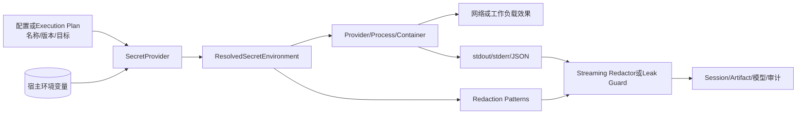

**图示说明：** 持久合同在解析前只持有引用。明文从宿主环境进入Provider，再进入短生命周期Scope和实际
消费者。输出必须经过以同一明文派生的模式集合后才能发布。当前没有中央Service强制所有箭头经过同一个
入口，因此每个消费者的装配事实必须单独验证。

### 5.1 受信组件

- Harnessix宿主进程及其配置、Execution Plan和Secret Source映射；
- `SecretProvider`实现及其返回的Material身份、版本和值；
- 调用方对Scope的关闭时机和异常清理；
- Process Owner、Container Builder、模型Provider Factory和扩展宿主；
- 传入`protected_secret_values`的宿主装配代码；
- 宿主操作系统环境、进程权限、内存和崩溃转储配置。

### 5.2 不可信输入

- 模型和扩展提交的Tool参数；
- 用户仓库内容和子进程stdout/stderr；
- MCP Server、Skill资源和Hook Action输出；
- Provider HTTP错误正文和第三方异常；
- 可能伪造名称、版本或目标的外部配置文件；
- 未经严格合同入口构造的Python对象。

### 5.3 边界外攻击者

当前实现不抵御能够读取宿主进程环境/内存、注入Python代码、调试同UID进程、修改受信配置、替换
Provider实现或控制操作系统的主体。它也不对Secret Source和值建立密码学来源证明。

## 6. 包结构与源码阅读顺序

| 顺序 | 文件 | 关键符号 | 阅读目的 |
|---:|---|---|---|
| 1 | [`provider.py`](../../src/harnessix/secrets/provider.py) | `SecretMaterial`、`SecretProvider`、`EnvironmentSecretProvider` | 理解来源白名单、解析限制和版本比较责任 |
| 2 | 同上 | `ResolvedSecretEnvironment`、`resolve_secret_environment` | 理解短生命周期、目标去重、总预算和失败清理 |
| 3 | [`redaction.py`](../../src/harnessix/secrets/redaction.py) | `secret_patterns`、`StreamingSecretRedactor` | 理解精确模式集合与跨Chunk状态机 |
| 4 | [`guard.py`](../../src/harnessix/secrets/guard.py) | `SecretLeakGuard` | 理解结构化值替换、键拒绝、节点/深度/字节限制 |
| 5 | [`execution/contracts.py`](../../src/harnessix/execution/contracts.py) | `SecretVersionBinding`、`ExecutionPlan` | 理解持久计划如何绑定目标和批准 |
| 6 | [`product_config/runtime.py`](../../src/harnessix/product_config/runtime.py) | `environment_secret_provider`、`_resolve_provider` | 理解默认模型Provider凭据路径 |
| 7 | [`processes/supervisor.py`](../../src/harnessix/processes/supervisor.py) | `PosixProcessSupervisor._start_bound` | 理解明文如何通过内存控制管道到独立Owner |
| 8 | [`processes/owner_output.py`](../../src/harnessix/processes/owner_output.py) | `CapturedProcessOutput` | 理解先脱敏、再计量、摘要和落盘 |
| 9 | [`sandbox/container.py`](../../src/harnessix/sandbox/container.py) | `PreparedContainerLaunch`、`ContainerCommandBuilder.prepare` | 理解值不进argv和Container CLI环境边界 |
| 10 | [`mcp/runtime.py`](../../src/harnessix/mcp/runtime.py) | `_normalize_call_result` | 理解MCP结果的有界JSON替换 |
| 11 | [`skills/actions.py`](../../src/harnessix/skills/actions.py)、[`hooks/runtime.py`](../../src/harnessix/hooks/runtime.py) | `SecretLeakGuard`消费点 | 理解扩展输出为何选择阻断而非替换 |
| 12 | [`tests/secrets/test_provider.py`](../../tests/secrets/test_provider.py)及跨模块测试 | 稳定测试函数 | 对照当前保证与未覆盖边界 |

## 7. 三套Secret引用合同

当前代码存在三套服务于不同边界的引用结构，不能互相替代：

| 合同 | 位置 | 字段 | 版本要求 | 目标字段 | 当前消费者 |
|---|---|---|---|---|---|
| `SecretRef` | [`domain/models.py`](../../src/harnessix/domain/models.py) | `name`、可选`version` | 可缺省 | 无 | Action v1请求和公共SDK |
| `SecretVersionBinding` | [`execution/contracts.py`](../../src/harnessix/execution/contracts.py) | `name`、必填`version`、`target` | 必填 | 有 | Execution Plan、Trusted Action、Process、Sandbox |
| `SecretReference` | [`product_config/contracts.py`](../../src/harnessix/product_config/contracts.py) | `name`、必填`version` | 必填且单行 | 无 | Product Config与模型Provider |

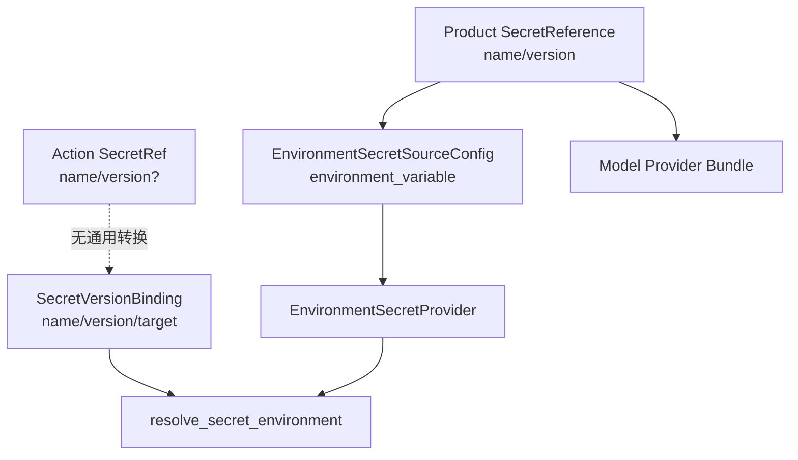

**当前事实：**

- Action v1的`SecretRef`没有注入目标，兼容Process Action在发现任何`secret_refs`后返回
  `process_secret_refs_unsupported`，不会自动升级为Execution绑定；
- Trusted Action Router可以把`ActionPlanningContext.secrets`写入Execution Plan并让Policy要求批准，
  但Router不解析值，也不把Scope传给Executor；
- Product Config直接按`SecretReference`解析模型API Key，不经过`ResolvedSecretEnvironment`；
- 代码中没有统一的`SecretRef → SecretVersionBinding → Resolved Scope`转换与授权Service。

因此，“合同支持Secret”不等于“该执行路径已经能安全注入Secret”。每条路径必须同时具备引用转换、
Policy、版本复核、目标限制、解析、作用域关闭和输出控制。

## 8. EnvironmentSecretProvider

### 8.1 配置模型

`EnvironmentSecretSource`是冻结Dataclass，包含：

| 字段 | 语义 | Provider构造校验 |
|---|---|---|
| `name` | Harnessix逻辑Secret名称 | `[A-Za-z][A-Za-z0-9_.-]{0,127}`，Source间唯一 |
| `version` | 外部声明版本 | 去除空白后非空，总长度不超过128 |
| `environment_variable` | 宿主环境定位名称 | `[A-Za-z_][A-Za-z0-9_]{0,127}` |

Provider要求Source集合非空，并将其按逻辑名称构造成字典。它保存调用方传入的`Mapping`引用；未传入时
直接保存`os.environ`。每次`resolve`都重新读取当前Mapping，不在Provider构造时冻结值。

### 8.2 解析流程

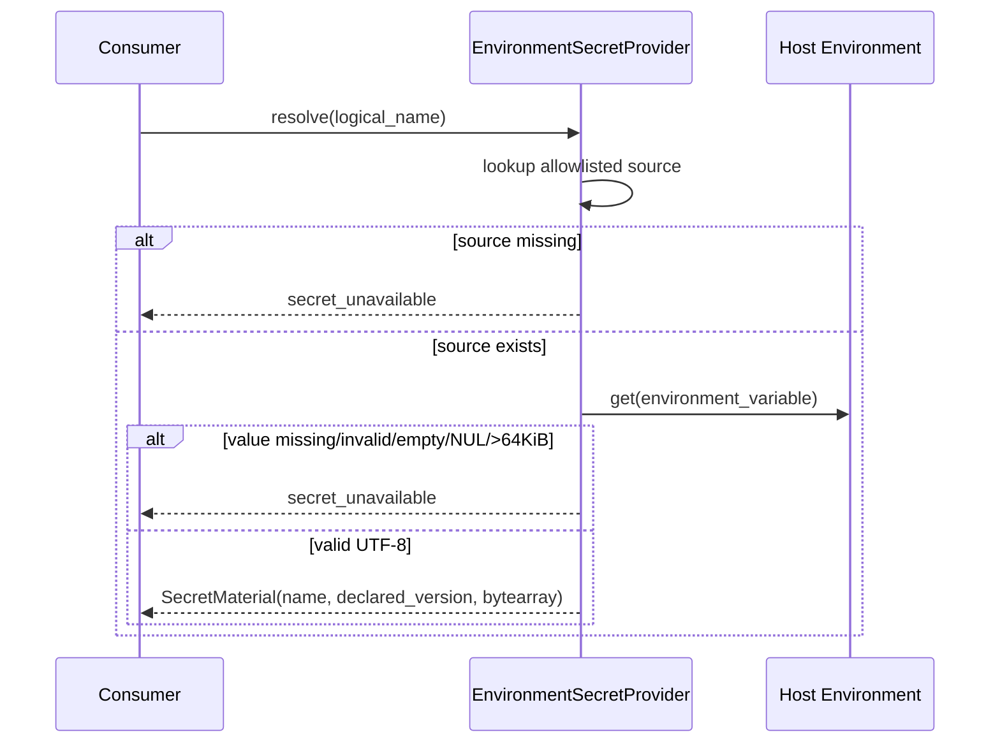

环境值必须能够编码为UTF-8、非空、不包含NUL，且单项最多`MAX_SECRET_BYTES = 64 KiB`。返回值复制到
`bytearray`并从Dataclass `repr`排除。

### 8.3 当前弱约束

- 通用Provider不限制Source数量；32项限制只在Scope解析和Product Config中落实；
- 通用Provider不拒绝多个逻辑名称指向同一个环境变量；Product Config v2单独拒绝该配置；
- 通用Provider只检查`version.strip()`非空，仍接受含换行、NUL或首尾空白的版本；Product Config
  `SecretReference`单独要求非空单行；
- `version`不由值摘要、Secret Manager版本或时间戳计算。环境值变化而版本文本不变时，旧Plan仍会把
  新值视为同一版本；
- 自定义`SecretProvider`属于受信代码，Protocol本身不验证超时、来源、ACL或返回Material类型；
- 环境Source没有文件权限、进程来源或宿主身份证明，继承当前进程环境的信任边界。

## 9. SecretMaterial与清零语义

`SecretMaterial`是可变Dataclass：`name`和`version`是普通字符串，`value`是`repr=False`的
`bytearray`。`clear()`使用等长零字节覆盖现有数组。

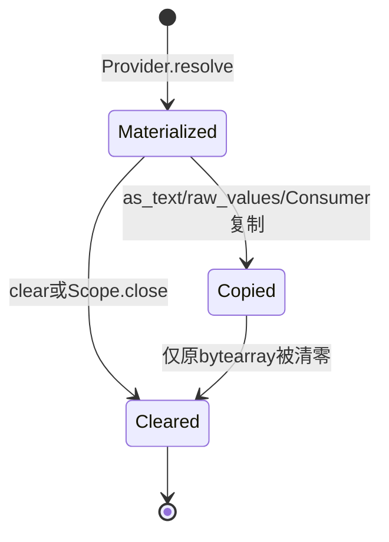

清零保证只覆盖当前`bytearray`对象；以下副本不受覆盖：

- 从宿主`str`执行UTF-8编码产生的临时`bytes`；
- `as_text()`返回的新`str`；
- `raw_values()`返回的新`bytes`；
- Process Owner启动帧的Pydantic字符串和序列化JSON `bytes`；
- 子进程环境、Container CLI环境、HTTP SDK认证对象及操作系统内部副本；
- Python解释器、分配器、交换空间、崩溃转储或调试器保存的历史内存。

因此当前语义是**尽力缩短包内可变副本寿命**，不是安全内存或可证明擦除。Material没有`__del__`、
上下文管理器或自动过期；若调用方直接解析后忘记清理，模块不会自动回收。

## 10. ResolvedSecretEnvironment

### 10.1 解析与失败清理

`resolve_secret_environment`按输入顺序逐项解析：

1. 最多接受32个`SecretVersionBinding`；
2. POSIX按Target原文去重，Windows按`casefold`去重；
3. 调用Provider并核对返回的逻辑名称；
4. 核对返回声明版本与Plan版本；
5. 累计Material字节，合计不得超过64 KiB；
6. 任一步失败时，清零当前显式识别的异常Material和此前已收集Material；
7. 成功后返回Target到Material的作用域。

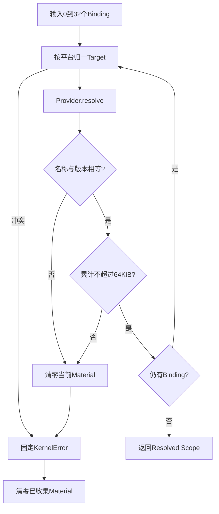

### 10.2 作用域API

| 方法 | 输出 | 关闭后 | 副本语义 |
|---|---|---|---|
| `as_text()` | `dict[target, str]` | `secret_scope_closed` | 新建不可变字符串，用于进程/SDK环境 |
| `raw_values()` | `tuple[bytes, ...]` | `secret_scope_closed` | 新建不可变字节，用于Redactor/Guard |
| `bindings()` | 排序后的`(target,name,version)` | `secret_scope_closed` | 不含明文，用于Plan复核 |
| `close()` | 无 | 幂等 | 清零Material并清空内部字典 |
| `__enter__/__exit__` | 上下文管理 | 离开时关闭 | 推荐调用方式 |

作用域不冻结墙钟、TTL、调用主体或用途。它也不是线程/任务隔离容器：获取的字典和字节副本可以在Scope
关闭后继续存在。

## 11. 版本、Target与批准绑定

Execution Plan把每项Secret冻结为`name + version + target`。Plan构造还要求：

- Secret绑定最多32项；
- 按`(name, platform-normalized-target)`规范排序；
- Target在目标平台语义下全局唯一；
- 普通Environment名称不得与Secret Target冲突；
- 完整Secret绑定参与Plan Fingerprint和Approval Checkpoint。

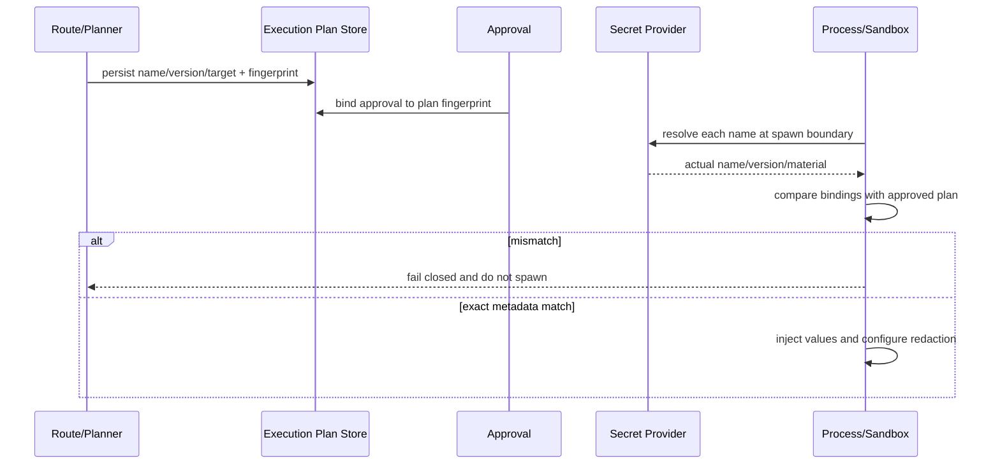

该绑定能发现名称、声明版本和Target变化，但不能发现“环境值已变化而声明版本未变化”。生产轮换流程必须
确保值更新与版本更新原子关联，并使旧Approval失效；当前Environment Provider没有这一控制面。

## 12. Redaction Pattern集合

### 12.1 支持的表示

`secret_patterns`为每个Secret构造去重集合，并按“长度降序、字节字典序”排序：

| 表示 | 示例语义 | 备注 |
|---|---|---|
| 原始字节 | 直接stdout/JSON文本 | 最基本模式 |
| 标准Base64 | 有Padding与去Padding | 二进制或HTTP常见 |
| URL-safe Base64 | 有Padding与去Padding | `-`/`_`字母表 |
| Hex | 小写与大写 | 每字节两字符 |
| URL百分号编码 | 原形式与整体小写形式 | `safe=""`；小写形式可能扩大误报 |
| JSON字符串正文 | 去除外围引号 | `ensure_ascii=False` |
| Shell引用 | `shlex.quote`结果 | 仅UTF-8可解码值 |

Secret原始值少于4字节时返回`secret_redaction_unsafe`。模式总数超过256也返回同一错误。32项解析预算
并不保证模式预算一定可满足；包含空格、Unicode和特殊字符的32个不同值可产生超过256个唯一表示，
因此**解析成功不等于输出Redactor一定能够构造**。

### 12.2 检测边界

当前模式集合不覆盖：

- 只输出前缀、后缀、中间片段或逐字符分隔；
- 任意大小写转换、字符集转码、Unicode转义、压缩、加密或哈希；
- 应用自定义编码、多层编码或带盐变换；
- 不在已知值集合中的凭据、仓库硬编码Secret和用户粘贴内容；
- 运行时新取得但未重新构造Redactor的Secret。

它是精确Canary防线，不是语义DLP。

## 13. StreamingSecretRedactor状态机

Redactor保存所有Pattern和一个内部`bytearray`缓冲区。`feed(bytes)`追加输入并只发布不可能再与后续Chunk
组成完整模式的前缀；`finish()`把尾部按同一规则处理并关闭状态机。

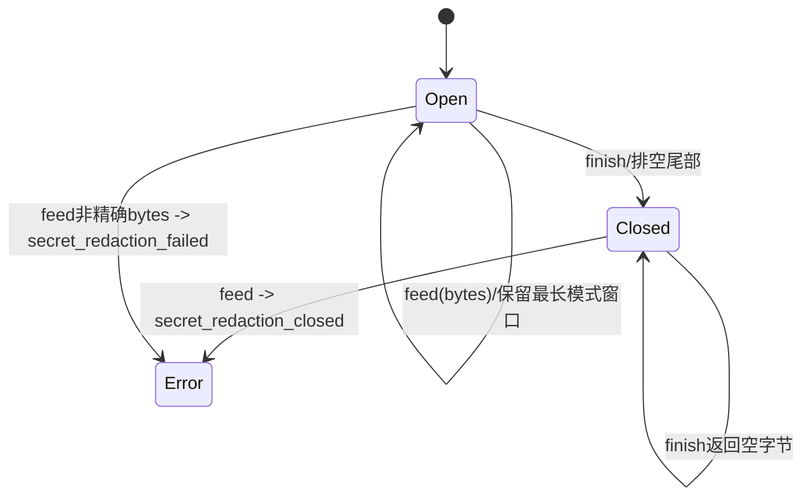

### 13.1 排空算法

当缓冲区长度达到最长Pattern长度或正在最终排空时：

1. 依照已排序Pattern查找当前前缀的第一个完整匹配；
2. 命中则删除完整Pattern并输出固定`[REDACTED]`；
3. 未命中则只发布首字节；
4. 非最终调用在缓冲区短于最长Pattern时停止，等待后续Chunk。

最长优先避免短Pattern先替换较长重叠值。代价是输出最多延迟`maximum_pattern_length - 1`字节；当前
单Secret最大64 KiB，而Base64表示更长。算法对每个待发布字节遍历最多256个Pattern，尚无正式CPU、
吞吐或最坏情况基准。

### 13.2 调用方义务

- 必须把每个输出Chunk按原顺序交给同一实例；
- 必须发布`feed`返回值而不是原Chunk；
- EOF、取消和错误关闭时都必须调用`finish`或明确丢弃尾部；
- 构造或处理失败时停止发布，不能回退到原始输出；
- Redactor本身不终止外部进程，也不决定副作用是失败还是`UNKNOWN`。

## 14. SecretLeakGuard

### 14.1 两种操作

`assert_safe(value)`把对象编码为有序紧凑JSON或直接使用`bytes`，只要任一已知Pattern出现就拒绝发布。
`redact_json(value)`递归访问JSON值：字符串值进行替换；列表和字典递归；数值、布尔和`null`保持不变；
字典键命中时直接失败，不尝试重命名。

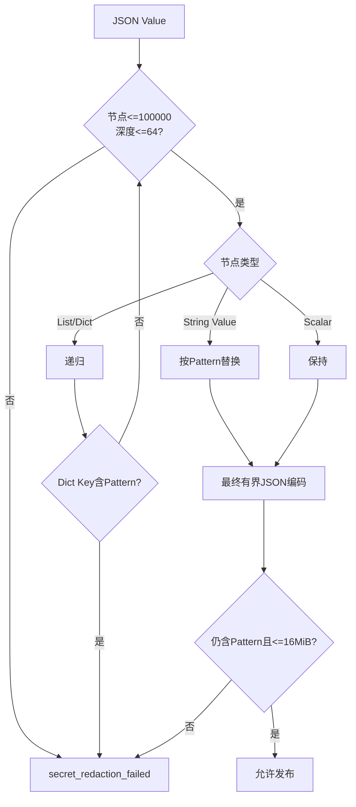

### 14.2 有界性

| 限制 | 值 | 执行点 |
|---|---:|---|
| 最大节点 | 100,000 | 每次递归访问前累加 |
| 最大深度 | 64 | 递归访问时 |
| 最大编码字节 | 16 MiB | `assert_safe`编码后 |
| 单字符串替换后最大字节 | 16 MiB | `_redact`后 |

### 14.3 当前弱约束

- `redact_json`的类型标注要求`JsonValue`，但运行时未先执行严格类型校验；非字符串字典键会在
  `key.encode`处泄漏原生`AttributeError`；
- 单字符串是在替换完成后检查大小，超大输入可能先消耗CPU/内存后才被拒绝，若替换显著缩短还可能
  通过单项前置边界；最终输出仍受16 MiB限制；
- `BaseModel.model_dump`自身的非标准序列化异常不保证都被当前异常白名单归一；
- 构造时空Secret集合意味着完全不扫描，Guard不会自动发现环境或Provider中的值；
- 替换可能造成Schema语义变化，MCP在替换后重新执行输出模型校验，其他消费者需要自行决定。

## 15. 默认Product Config凭据路径

默认`agent-server`通过[`run_product_stdio`](../../src/harnessix/product_config/server.py)执行以下流程：

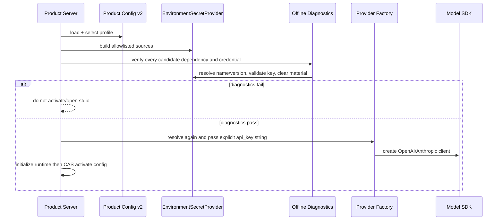

Product Config v2加强了通用Provider配置：Source必须按名称排序且唯一，同一个宿主环境变量只能定位一个
Secret，Provider引用必须命中完全相同的名称和版本，版本必须是非空单行。诊断只输出固定状态和主体
标识，不输出值；Provider构造在`finally`清零Material。

### 15.1 边界说明

- 诊断和实际构造分别解析一次；两次之间宿主环境可变化，当前没有值快照或CAS；
- `_provider_api_key`会把`bytearray`复制为ASCII `str`，再传入第三方SDK；Material清零不清除该字符串；
- Provider API Key限制为1～8192个可打印ASCII字符，并拒绝自定义Header环境变量，避免跨端点认证污染；
- SDK Client拥有凭据直至关闭，当前无法证明第三方对象完成内存擦除；
- 直接构造`OpenAIChatProvider`/`AnthropicProvider`且不传`api_key`时，模型模块仍可自行读取配置指定的
  环境变量；该低层路径不经过Secrets包的版本和Source合同；
- Smoke Runtime也使用自己的`api_key_env`合同，不等同默认Product Config Secret路径。

## 16. Process与Sandbox注入路径

### 16.1 Host Process Supervisor

Process Supervisor在启动前把普通环境与Plan绑定比较，再读取Scope：

1. `as_text()`取得Target到值；
2. `bindings()`与Plan中排序后的三元组精确比较；
3. 普通环境和Secret Target有交集时返回`secret_binding_mismatch`；
4. 明文合并到`ProcessOwnerStart.environment`；
5. Target名写入`secret_names`；
6. 整个启动帧序列化为JSON，通过匿名控制管道交给独立Owner；
7. Owner从环境按`secret_names`重建脱敏值，再创建stdout/stderr Redactor；
8. 目标进程只收到精确环境，输出先脱敏再摘要和写盘。

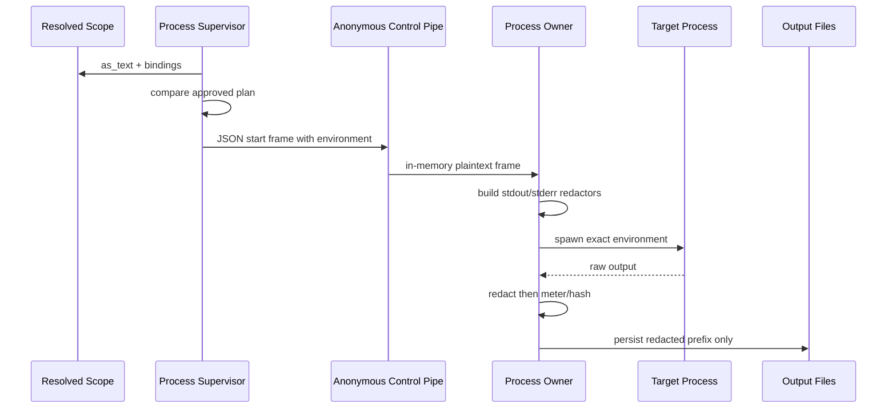

Scope可以在`await supervisor.start`返回后关闭，因为Owner已经取得自己的值副本并完成目标启动。启动帧
不写入Lease、Receipt或run目录，但Pydantic模型、JSON字节、管道缓冲和子进程环境仍含明文。

短于4字节或模式过多的Secret可通过Provider/Scope解析，但Owner创建Redactor时才失败。POSIX/Windows
Owner顶层只显式归一`OSError`、`ValueError`和`ValidationError`，不直接归一`KernelError`；宿主最终会
观察为启动失败或缺失Receipt，而不是精确保留`secret_redaction_unsafe`。这是当前错误传播缺口。

### 16.2 Container Builder

`ContainerCommandBuilder.prepare`同样核对Scope绑定与Plan，并生成：

- Engine argv只包含重复的`--env TARGET`，不包含值；
- `PreparedContainerLaunch.base_environment`和`secrets`均`repr=False`；
- `materialize_environment()`在启动边界把普通值、受管Proxy和Secret值合并为Container CLI进程环境；
- `redaction_values()`把值复制给Process Owner或MCP Guard。

Container CLI自身和Container内工作负载都会接触选定值。当前没有Secret Target保留名策略；若Target为
`DOCKER_HOST`、`DOCKER_CONFIG`或其他Container CLI控制变量，它可能影响Launcher而不只是容器内应用。
Profile/Plan/Approval会记录Target，但能力探测与运行时Daemon之间仍缺“控制面环境不可覆盖”的强约束。

详细Container信任边界见[Sandbox模块设计](sandbox.md)。

## 17. MCP、Skill与Hook输出边界

| 消费者 | Secret值来源 | 输出处理 | 命中行为 | 当前限制 |
|---|---|---|---|---|
| MCP Container | `PreparedContainerLaunch.redaction_values()` | `bounded_mcp_output`后`redact_json`，再重新验证输出合同 | 字符串值替换；键/超限/非法结构失败 | Guard发生在远端调用返回后，写Tool效果可能已发生 |
| MCP In-Process | 固定空集合 | 不进行Secret扫描 | 不命中 | 受信内嵌实现仍可能泄漏其他来源Secret |
| Skill Action | 宿主显式`protected_secret_values` | `assert_safe` | 整个Action失败为`secret_redaction_failed` | 默认空集合；不自动读取当前Provider |
| Hook Runtime | 宿主显式`protected_secret_values` | `assert_safe`后解析Hook输出 | Run失败为`hook_output_invalid` | 默认空集合；Guard发生在Hook Action执行后 |

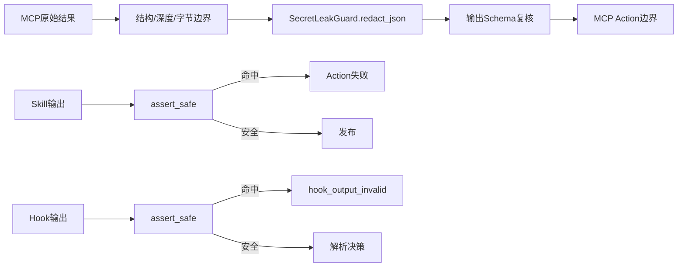

Guard只能覆盖宿主传入的值集合。当前没有进程级Secret Registry自动向MCP、Skill、Hook、Session、Trace和
Artifact分发同一Canary集合，也没有证明所有新增输出路径都强制注册Guard。

## 18. 数据流与持久化边界

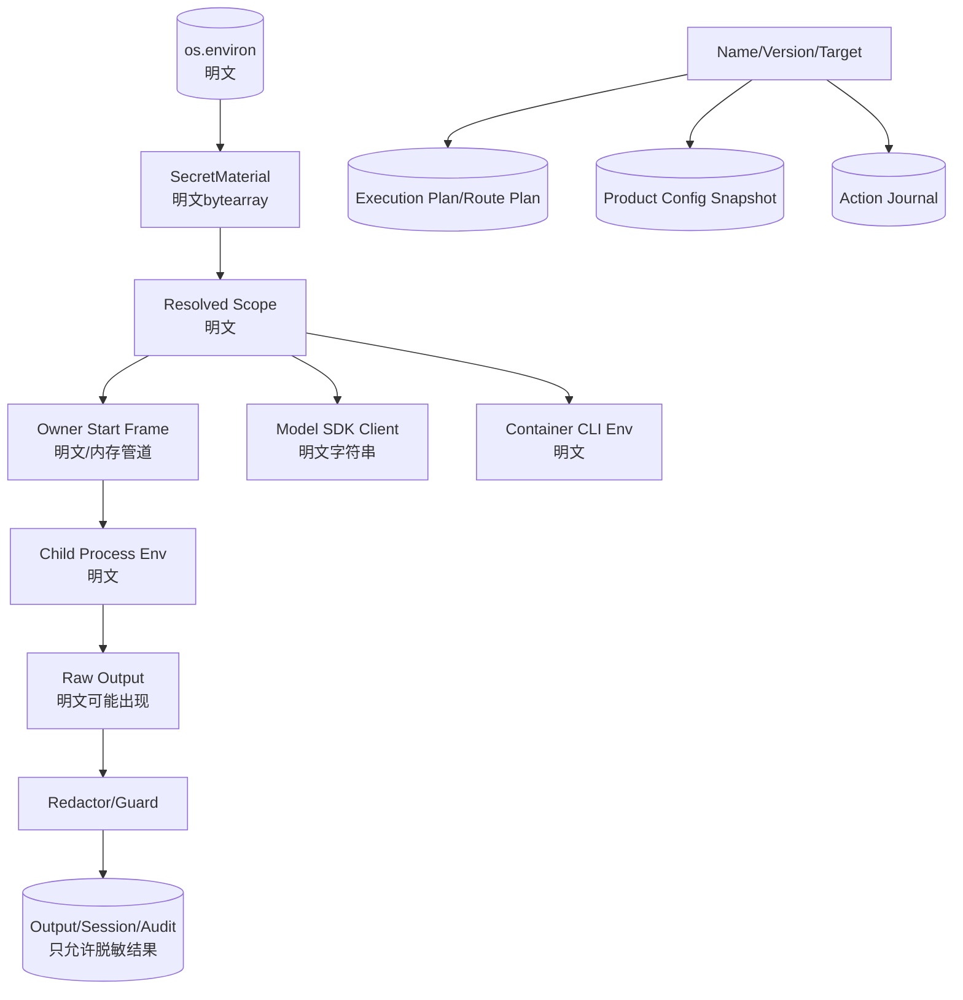

### 18.1 应持久化的数据

- Product Config中的逻辑名称、声明版本和宿主环境变量名；
- Execution Plan中的名称、版本和Target；
- Action请求中的`SecretRef`；
- 资源/审计中的Secret绑定摘要、固定错误码和发布结果；
- 已脱敏的Process输出、MCP输出或上层摘要。

### 18.2 不应持久化的数据

- `SecretMaterial.value`和`ResolvedSecretEnvironment.as_text()`结果；
- Process Owner完整启动帧；
- Container CLI物化环境；
- Redactor内部缓冲区和Pattern集合；
- Provider API Key、Authorization Header或第三方原始认证异常。

包自身没有数据库、迁移、备份或恢复逻辑。是否违反“不持久化明文”取决于所有消费方；模块无法阻止受信
Python调用方把`as_text()`结果写入任意位置。

## 19. 失败语义

| 错误码 | 触发条件 | 是否已取得明文 | 上层处理 |
|---|---|---:|---|
| `secret_provider_invalid` | Source为空、名称重复或字段格式不满足通用Provider约束；Provider返回错误名称 | 可能 | 不启动；修复受信配置/Provider |
| `secret_unavailable` | 引用不存在、环境值缺失/空/NUL/过大/编码无效；文本注入解码失败 | 可能 | 不重试外部效果；重新配置来源 |
| `secret_version_changed` | Provider返回声明版本与Binding不同 | 是，随后清零包内副本 | 旧批准失效，重新规划/批准 |
| `secret_target_conflict` | Target按平台语义重复 | 已解析项可能存在，随后清零 | 修正Plan，不启动 |
| `secret_limit_exceeded` | 引用超过32项或合计明文超过64 KiB | 合计超限时已解析，随后清零 | 缩小Secret集合 |
| `secret_scope_closed` | 关闭后读取文本、值或绑定 | 否 | 编程错误，不重新打开旧Scope |
| `secret_redaction_unsafe` | Secret短于4字节或模式超过256 | 是 | 不允许未脱敏输出发布；应在效果前预检 |
| `secret_redaction_closed` | 关闭后的流Redactor继续接收数据 | 否 | 编程错误，禁止回退原输出 |
| `secret_redaction_failed` | 非bytes输入、命中Canary、JSON键命中、超限或无法序列化 | 可能 | 阻断发布；效果状态由调用方按真实执行阶段记录 |
| `secret_binding_mismatch` | Scope三元组或Target与Execution Plan/普通环境不一致 | 是 | Process/Sandbox不启动 |

所有包内错误消息均为固定中文文本，不包含名称对应的值。错误码尚未在独立Secret公共Schema中版本化；
它们通过`KernelError`和各消费者结果传播。

## 20. 取消、超时、恢复与轮换

### 20.1 取消和超时

- Environment Provider解析是同步内存操作，没有Cancel Token或Timeout；
- `SecretProvider` Protocol也是同步接口，直接实现网络Vault会阻塞事件循环且没有统一超时语义；
- Redactor和Guard同步执行，没有CPU时间预算；大输出和大量Pattern可能占用调用线程；
- Process、MCP和Provider调用的取消由各自Runtime负责，Secrets包只控制值和输出边界；
- 取消发生时，调用方仍需关闭Scope并完成Redactor尾部处理或安全丢弃。

### 20.2 崩溃恢复

Secrets包没有持久状态可恢复。恢复执行必须：

1. 从持久Plan读取名称、版本和Target；
2. 重新调用Provider解析；
3. 比较实际声明版本；
4. 重新建立输出Redactor；
5. 在外部效果可能已经发生时遵循Process/Action的`UNKNOWN`或Reconcile规则。

流Redactor缓冲区不会持久化。宿主或Owner崩溃时，已经发布的输出应当是脱敏前缀，未排空尾部可能丢失；
不能从原始未脱敏输出文件重放，因为当前设计不允许该文件存在。

### 20.3 轮换

当前轮换完全由配置管理者维护声明版本。若先改值、后改版本，期间新解析可能在旧Approval下使用新值；
若只改版本，现有Plan会失败关闭。系统尚无以下能力：

- 值与版本原子快照；
- 轮换事件、撤销时间和Grace Window；
- 活动Scope/SDK Client枚举与主动失效；
- 多版本并存、租约或刷新；
- 轮换后的自动重规划和用户提示。

## 21. 安全与隐私边界

### 21.1 已落实控制

- Source白名单阻止调用者把任意环境变量名直接当作Secret名称读取；
- Material值不进入Dataclass `repr`，Scope对象默认表示也不展开内部字典；
- Plan、Profile和Container argv只绑定名称/版本/Target；
- Windows目标大小写冲突失败关闭；
- 解析失败清零此前Material；
- Process输出在写盘前流式脱敏；
- MCP输出在Action边界前有界替换并重新验证；
- Skill/Hook输出Canary命中时不持久成功正文；
- Provider构造错误和诊断报告不传播API Key；
- 固定错误消息不拼接第三方异常或值。

### 21.2 当前攻击面

| 攻击面 | 当前风险 | 现有缓解 | 剩余缺口 |
|---|---|---|---|
| 宿主环境 | 同UID进程、Shell历史或父进程可见 | 只读取白名单变量 | 无Keychain/Vault和来源证明 |
| 声明版本 | 值变更可不更新版本 | Plan比较文本版本 | 无值摘要/Provider revision证明 |
| Target | 特殊变量可改变Loader、SDK或Container CLI | Plan和Approval显式记录 | 无跨Consumer保留名/用途策略 |
| 进程内存 | 多个不可变副本无法擦除 | 可变Material尽力清零、短作用域 | 无Locked Memory/zeroizing类型 |
| 输出编码 | 变换后值绕过精确Pattern | 常见编码集合、跨Chunk窗口 | 非通用DLP，可被任意变换绕过 |
| 扩展输出 | Guard默认空集合或执行后才扫描 | 显式Canary、失败关闭 | 无中央强制装配，副作用可能已发生 |
| 大输入 | Pattern扫描和替换消耗CPU/内存 | 节点/深度/输出字节上限 | 缺少输入前置字节和CPU基准 |
| 错误传播 | 第三方Provider或非法Python类型泄漏异常 | 包内固定KernelError | 非字符串JSON Key等路径仍泄漏原生异常 |
| 持久化 | 受信调用方可绕过Guard | 既有消费者在关键路径接线 | 无全局Sink Gate或静态门禁 |

### 21.3 保留Target风险

普通Process Runtime对部分宿主环境变量存在拒绝列表，但`SecretVersionBinding.target`本身只验证变量名
语法。对Host进程，`LD_PRELOAD`、`DYLD_INSERT_LIBRARIES`、`PYTHONPATH`等可能改变加载行为；对
Container CLI，`DOCKER_HOST`、`DOCKER_CONFIG`等可能改变控制面。当前Policy会因Secret使用要求批准，
但用户批准不等于目标语义安全。生产完成前需要在每个执行Sink建立保留名和用途白名单，并补跨平台测试。

## 22. 可观测性与审计

### 22.1 当前可观察事实

- Consumer可捕获稳定`KernelError.code`；
- Process Lease和Action结果可记录固定失败码、终止原因和脱敏输出摘要；
- Product Config诊断记录Secret版本是否可用和认证格式是否可用，但不记录值；
- MCP、Skill和Hook通过各自状态/审计记录输出边界失败；
- Execution Plan和Action Route Audit保存Secret绑定或资源摘要。

### 22.2 当前缺失

- 无“Secret解析成功/失败、Consumer、用途、持续时间”审计事件；
- 无解析、清理、Redactor命中、Guard阻断、模式数量或延迟指标；
- 无活动Scope数量和未关闭Scope泄漏检测；
- 无轮换、撤销和旧版本使用告警；
- 无全局Trace属性白名单证明Guard覆盖所有导出器；
- 无安全事件与用户可读诊断的分级关联。

观测设计必须只记录逻辑名称的必要摘要或受控标识，不得把值、编码Pattern、环境变量值或第三方认证异常
写入日志、Metric Label、Trace Attribute和诊断包。

## 23. 平台与部署

| 平台/场景 | 当前证据 | 可宣称能力 | 不可宣称能力 |
|---|---|---|---|
| Linux | 通用测试、POSIX Process测试、Linux真实Container CI | Environment Provider、Scope、流脱敏及固定Container注入可运行 | 系统Keyring、Vault、集中轮换 |
| macOS | 通用测试和POSIX Process测试 | 同上，不含真实Container发布证据 | Keychain集成、Locked Memory |
| Windows | 通用Secrets测试和原生Windows Supervisor测试 | Target大小写冲突防护、Unicode进程输入和输出脱敏 | Credential Manager、Windows Container发行验收 |
| 默认Product Server | Product Config诊断与Provider Mock Transport | 版本化环境Source和显式API Key构造 | 所有Coding Tool/扩展统一Secret注入 |
| MCP/Skill/Hook | 显式集成测试 | 已传入Canary值的输出可替换或阻断 | 自动继承全局Secret集合 |

### 23.1 部署要求

- Product Config不得保存值，只保存受控环境变量定位；
- 启动脚本不得把值写入命令行参数、配置文件、Shell调试输出或服务定义明文；
- 宿主环境的继承范围和进程权限必须由部署层最小化；
- 崩溃转储、调试日志和诊断包必须单独限制；
- 轮换操作必须同时更新声明版本并使旧Plan/Approval失效；
- Container和Process Sink必须评审Target是否会影响Launcher控制面；
- 第三方SDK关闭不能被解释为内存擦除完成。

## 24. 重点类、接口与生命周期

### 24.1 核心符号

| 符号 | 类型/生命周期 | 直接依赖 | 不变量 | 禁止职责 |
|---|---|---|---|---|
| `SecretMaterial` | 可变短生命周期Dataclass | Provider | `value`为可清零字节副本，`repr=False` | 不提供安全内存保证 |
| `SecretProvider` | 同步Protocol | 受信Source | 按逻辑名称返回Material | 不定义Timeout、ACL、审计或轮换 |
| `EnvironmentSecretSource` | 冻结配置Dataclass | 宿主配置 | 名称/版本/环境定位 | 不保存值 |
| `EnvironmentSecretProvider` | 长生命周期适配器 | `os.environ`或Mapping | 只解析白名单名称 | 不冻结值或验证值版本关系 |
| `ResolvedSecretEnvironment` | 显式关闭的短Scope | 多个Material | 关闭后不可读取，关闭幂等 | 不自动过期或追踪副本 |
| `StreamingSecretRedactor` | 单流、单次生命周期状态机 | Pattern集合 | 顺序feed，finish后不可feed | 不并发共享，不停止外部效果 |
| `SecretLeakGuard` | 可复用同步Scanner | Pattern集合 | 已知Pattern不得越过发布边界 | 不发现未知Secret，不自动接线 |

### 24.2 线程、任务与并发

- Provider和Scope没有锁；共享可变环境Mapping时，调用结果取决于解析瞬间；
- Scope内部字典和Material不声明线程安全，不应跨并发任务共享并关闭；
- Streaming Redactor具有可变Buffer，只能由单一有序输出流拥有；stdout/stderr分别使用独立实例；
- Leak Guard除构造后只读Pattern外没有共享状态，可重复调用，但CPU工作同步执行；
- Product Provider Bundle在构造时逐个解析并清零，各SDK Client分别持有自己的认证副本。

## 25. 重点字段设计

### 25.1 Provider与Scope字段

| 结构/字段 | 类型/必填 | 来源 | 语义/约束 | 持久化 | 敏感级别 |
|---|---|---|---|---|---|
| `EnvironmentSecretSource.name` | String/是 | 受信配置 | 逻辑引用名，最多128字符 | Product Config可保存 | 中等元数据 |
| `version` | String/是 | 配置/Provider | 声明版本，通用Provider约束弱 | Plan/Config保存 | 中等元数据 |
| `environment_variable` | String/是 | 部署配置 | 宿主环境定位，不是Target | Product Config保存 | 中等元数据 |
| `SecretMaterial.value` | `bytearray`/是 | 宿主环境 | 非空、无NUL、单项≤64 KiB | 禁止 | 高敏明文 |
| `Resolved._values` | Target到Material | Scope构建 | 最多32项、合计≤64 KiB | 禁止 | 高敏明文 |
| `_closed` | Bool | 生命周期 | 关闭后所有读取失败 | 否 | 低 |

### 25.2 Execution绑定字段

| 字段 | 约束 | 安全作用 | 当前缺口 |
|---|---|---|---|
| `SecretVersionBinding.name` | 逻辑名称正则 | 选择白名单Source | 不含用途/主体 |
| `version` | 1～128字符 | 使显式版本变化让Plan失效 | 不绑定实际值 |
| `target` | 环境变量名正则 | 冻结注入名称 | 无保留名/Consumer类型 |
| `ExecutionPlan.secrets` | ≤32、规范排序、Target唯一 | 参与Fingerprint与Approval | 没有独立Secret Snapshot摘要 |

### 25.3 Redactor与Guard字段

| 字段/常量 | 值 | 语义 |
|---|---:|---|
| `REDACTION_MARKER` | `[REDACTED]` | 固定替换字节 |
| `MIN_REDACTABLE_SECRET_BYTES` | 4 | 更短值误报面过大，拒绝建立防线 |
| `MAX_REDACTION_PATTERNS` | 256 | 限制每次前缀扫描集合 |
| `_maximum` | 最长Pattern字节数 | 决定跨Chunk保留窗口和输出延迟 |
| `_buffer` | 可变字节数组 | 保存尚不能安全发布的尾部 |
| `MAX_GUARD_NODES` | 100,000 | 结构化递归节点预算 |
| `MAX_GUARD_BYTES` | 16 MiB | 最终编码和替换后单值边界 |

## 26. 核心业务逻辑伪代码

### 26.1 解析作用域

```text
resolve_scope(bindings, provider, platform):
    reject more than 32 bindings
    resolved = empty map
    comparison_targets = empty set
    total = 0
    try:
        for binding in declared order:
            normalized_target = casefold on Windows else exact target
            reject duplicate normalized target
            material = provider.resolve(binding.name)
            require material.name equals binding.name
            require material.version equals binding.version
            total += material byte length
            reject total over 64 KiB
            resolved[binding.target] = material
        return closable scope(resolved)
    on any base exception:
        clear every collected material
        rethrow
```

### 26.2 构造模式

```text
patterns(values):
    for each value:
        require at least 4 bytes
        add raw
        add standard and URL-safe base64, with and without padding
        add lower and upper hex
        add percent form and lowercase percent form
        if UTF-8: add JSON-body and shell-quoted form
    remove empty and duplicates
    reject more than 256 unique patterns
    sort longest first, then bytewise
```

### 26.3 流式脱敏

```text
feed(chunk):
    require state open and exact bytes
    append chunk to buffer
    while final or buffer length >= longest pattern:
        if buffer begins with any longest-first pattern:
            consume pattern and emit marker
        else:
            emit one byte
    retain possible cross-chunk suffix
```

### 26.4 结构化发布守卫

```text
redact_json(value):
    recursively visit at most 100000 nodes and depth 64
    replace known patterns in string values
    reject a dictionary key containing any pattern
    preserve JSON scalars
    serialize final result deterministically within 16 MiB
    assert no known pattern remains
    return redacted JSON value
```

### 26.5 Product Provider构造

```text
for each selected provider profile:
    material = provider.resolve(credential.name)
    try:
        require returned name/version matches config
        decode strict ASCII and validate API-key limits
        construct SDK provider with explicit key
    finally:
        clear mutable material
on later construction failure:
    close every already-created SDK provider in reverse order
```

## 27. 源码与测试映射

| 设计元素 | 源码 | 关键符号 | 测试 | 测试符号/证明 |
|---|---|---|---|---|
| 环境Source校验 | [`provider.py`](../../src/harnessix/secrets/provider.py) | `EnvironmentSecretSource`、`EnvironmentSecretProvider.__init__` | [`test_provider.py`](../../tests/secrets/test_provider.py) | 版本、目标与作用域主路径间接覆盖 |
| 单项解析 | 同上 | `EnvironmentSecretProvider.resolve` | 同上 | `test_versioned_secret_scope_injects_only_declared_target_and_closes` |
| 版本漂移/Windows冲突 | 同上 | `resolve_secret_environment` | 同上 | `test_secret_version_drift_and_windows_target_collision_fail_closed` |
| 作用域关闭 | 同上 | `ResolvedSecretEnvironment.close`、`as_text` | 同上 | 关闭后`secret_scope_closed` |
| Pattern表示 | [`redaction.py`](../../src/harnessix/secrets/redaction.py) | `secret_patterns` | 同上 | 原文、Base64、URL、JSON及所有Chunk边界 |
| 流式状态机 | 同上 | `StreamingSecretRedactor.feed`、`finish` | 同上 | `test_streaming_redactor_covers_every_chunk_boundary_and_common_encodings` |
| 不安全模式拒绝 | 同上 | `redact_bytes` | 同上 | `test_redactor_fails_closed_for_too_short_secret_and_after_finish` |
| JSON替换/键拒绝 | [`guard.py`](../../src/harnessix/secrets/guard.py) | `SecretLeakGuard.redact_json`、`assert_safe` | 同上 | `test_secret_leak_guard_redacts_values_and_rejects_keys_or_unserializable_data` |
| POSIX输出先脱敏后落盘 | [`owner_output.py`](../../src/harnessix/processes/owner_output.py) | `CapturedProcessOutput` | [`test_supervisor.py`](../../tests/processes/test_supervisor.py) | `test_pipe_process_uses_exact_environment_and_redacts_secret` |
| Windows输出脱敏 | [`windows_owner.py`](../../src/harnessix/processes/windows_owner.py) | `_Owner` | [`test_windows_supervisor.py`](../../tests/processes/test_windows_supervisor.py) | `test_windows_job_owner_pipe_unicode_secret_and_exact_environment` |
| Container argv无明文 | [`container.py`](../../src/harnessix/sandbox/container.py) | `ContainerCommandBuilder.prepare` | [`test_container.py`](../../tests/sandbox/test_container.py) | `test_container_argv_is_fixed_and_never_contains_secret_value` |
| 真实Container注入与输出 | Container/Process组合 | `PreparedContainerLaunch` | [`test_container_sandbox.py`](../../tests/integration/test_container_sandbox.py) | `test_real_container_enforces_read_only_no_network_limits_and_secret_boundary` |
| MCP结果替换 | [`mcp/runtime.py`](../../src/harnessix/mcp/runtime.py) | `_normalize_call_result` | [`test_runtime_actions.py`](../../tests/mcp/test_runtime_actions.py) | `test_tool_result_is_redacted_before_crossing_action_boundary` |
| Skill输出阻断 | [`skills/actions.py`](../../src/harnessix/skills/actions.py) | `_SkillExecutor.execute` | [`skills/test_runtime.py`](../../tests/skills/test_runtime.py) | `test_secret_canary_in_skill_output_is_blocked_by_action_boundary` |
| Hook输出阻断 | [`hooks/runtime.py`](../../src/harnessix/hooks/runtime.py) | `HookRuntime._run` | [`hooks/test_runtime.py`](../../tests/hooks/test_runtime.py) | `test_hook_receives_only_digests_and_secret_output_is_fail_closed` |
| Hook不获得Secret能力 | Trusted Action Policy/Hook组合 | `TrustedCodingPolicy.evaluate` | 同上 | `test_hook_action_requiring_secret_or_approval_fails_closed` |
| Product API Key显式注入 | [`product_config/runtime.py`](../../src/harnessix/product_config/runtime.py) | `_resolve_provider`、`default_provider_factory` | [`test_provider_credentials.py`](../../tests/product_config/test_provider_credentials.py) | OpenAI/Anthropic显式凭据且事件无Canary |
| 离线诊断不暴露值 | 同上 | `diagnose_configuration` | [`product_config/test_runtime.py`](../../tests/product_config/test_runtime.py) | `test_diagnostics_are_offline_bounded_and_do_not_expose_secret` |
| 配置Source唯一性 | [`product_config/contracts.py`](../../src/harnessix/product_config/contracts.py) | `ProductConfigV2.valid_graph` | [`test_contracts_and_codec.py`](../../tests/product_config/test_contracts_and_codec.py) | `test_rejects_multiple_secret_references_for_same_environment_variable` |
| Action v1未接线 | [`processes/action_executor.py`](../../src/harnessix/processes/action_executor.py) | `ProcessActionExecutor.execute` | [`test_action_executor.py`](../../tests/processes/test_action_executor.py) | `test_secret_refs_fail_after_approval_without_launch` |

## 28. 测试设计与验证证据

### 28.1 当前定向回归

```text
uv run pytest -o addopts='' -q \
  tests/secrets \
  tests/processes/test_supervisor.py \
  tests/processes/test_action_executor.py \
  tests/sandbox/test_container.py \
  tests/integration/test_container_sandbox.py \
  tests/mcp/test_runtime_actions.py \
  tests/skills/test_runtime.py \
  tests/hooks/test_runtime.py \
  tests/product_config/test_provider_credentials.py \
  tests/product_config/test_runtime.py \
  tests/product_config/test_contracts_and_codec.py
```

在本文代码版本的macOS工作树中结果为`99 passed, 2 skipped`。两个Skip来自需要固定镜像和Docker的
真实Container用例；Linux CI的`container-sandbox` Job单独运行它们。

### 28.2 CI矩阵

| Job | Secret相关范围 | 证明 |
|---|---|---|
| Python 3.12/3.13 | 全量测试 | 包合同和所有消费者在Linux解释器矩阵回归 |
| `coding-tools-macos` | Secrets、Process、Sandbox、MCP、Skill、Hook、Product Config | POSIX宿主与macOS依赖兼容 |
| `windows-trusted-execution` | Secrets及Windows Supervisor | Windows大小写目标、原生Process环境和输出脱敏 |
| `container-sandbox` | 真实固定摘要镜像 | Linux Container环境、argv与输出边界 |

测试通过只能证明固定输入和当前装配。它不证明未知编码DLP、内存擦除、环境版本原子性、外部Vault、
保留Target安全或所有日志/Trace Sink覆盖。

### 28.3 当前测试缺口

- Provider重复宿主环境变量、含控制字符版本和动态环境值变化没有包级拒绝测试；
- `redact_json`非字符串Key会泄漏原生`AttributeError`，没有错误归一测试；
- 32项Secret产生超过256个Pattern的跨边界失败路径没有Consumer集成测试；
- 短Secret在Process Owner启动阶段的稳定错误码和清理没有测试；
- Redactor最坏Pattern/大Chunk CPU、延迟和内存没有基准；
- 取消、Owner崩溃、MCP写效果后Guard失败的`UNKNOWN`语义没有端到端测试；
- 没有验证所有Session、Artifact、Log、Trace和Diagnostic Sink强制经过同一Guard的门禁；
- 没有Keychain/Vault、轮换、撤销、过期、并发Scope或访问审计测试；
- Container Launcher控制变量Target没有拒绝测试。

## 29. 已知限制、风险与后续工作

| 优先级 | 缺口 | 当前影响 | 建议归属 |
|---|---|---|---|
| P0 | Secret值与声明版本没有不可分割的Provider revision证明 | 环境值静默变化可复用旧Plan/Approval | 0.9.4安全加固 |
| P0 | Process/Container Target无Consumer保留名策略 | Secret可影响Loader或Container控制面 | 0.9.4安全加固 |
| P0 | Redaction可行性晚于Scope解析，部分消费者在效果后才构造Guard | 输出失败时外部效果状态可能不明确 | 0.9.4与MCP详细设计 |
| P0 | Guard不是所有持久/模型/日志Sink的统一强制门 | 新调用路径可能遗漏Canary扫描 | 0.9.4安全加固 |
| P1 | 无系统Keychain/Vault和最小主体授权 | 长期环境变量不满足正式凭据治理 | 0.9.4～0.9.5 |
| P1 | 无轮换、撤销、TTL和活动Client失效 | 长会话可能持续使用旧凭据 | 0.9.3～0.9.6 |
| P1 | 非字符串JSON Key和部分序列化异常未统一清洗 | 受信Python误用可泄漏内部异常类型 | 0.9.4公开错误清洗 |
| P1 | Pattern算法缺少最坏情况基准 | 高吞吐输出可能阻塞Owner/事件循环 | 0.9.3可靠性性能 |
| P1 | Domain SecretRef没有统一转换/执行能力 | Action Plane的Secret合同不可直接用于Coding Tool | 0.9.1产品装配 |
| P1 | Trusted Action只绑定Secret元数据，不向Executor提供受控Scope | 扩展Secret使用仍需临时宿主接线 | 0.9.1/0.9.4 |
| P2 | 通用Provider配置弱于Product Config | 独立库调用更容易接受歧义Source/版本 | 合同收敛切片 |
| P2 | 无独立公共Secret Schema/API版本 | 兼容窗口和第三方实现边界不清晰 | DOC-1.4/API治理 |
| P2 | Pattern替换存在误报 | 合法输出可能被替换或阻断 | Eval与诊断策略 |

## 30. 生产化演进约束

后续增强不得破坏以下边界：

1. 明文不得进入Plan、Approval、argv、Session、Action Audit或公开错误；
2. Secret值变化必须产生可验证的新Revision，并使旧批准失效；
3. 新Provider必须有有界异步解析、取消、Timeout、来源身份、版本和访问审计；
4. Secret用途必须绑定Consumer、Target和最小权限，不能只按逻辑名称授权；
5. Redaction Pattern必须在任何外部效果前预检可构造；
6. 所有模型、Artifact、日志、Trace、MCP和扩展输出必须经过统一发布门；
7. 发布门失败不能篡改真实效果状态，必要时进入`UNKNOWN`和Reconcile；
8. 跨平台保留环境变量必须按实际Launcher/Loader语义维护并测试；
9. Keychain/Vault适配不得把网络故障隐藏成“Secret不存在”，必须有稳定错误分类；
10. 安全内存若引入原生组件，必须以基准和威胁模型证明收益，不以语言替换代替完整边界。

## 31. 验收标准

### 31.1 当前文档切片

- [x] 三个包文件、公共/内部符号和真实消费点全部定位；
- [x] 三套Secret引用合同及不存在的转换路径明确；
- [x] Provider、Scope、Pattern、Streaming和Guard算法有完整文字与图示；
- [x] Process、Container、Product Config、MCP、Skill和Hook数据流与失败语义追踪到源码；
- [x] 明文、引用、摘要和持久化边界分开描述；
- [x] 取消、崩溃、轮换、安全、观测、平台和部署限制明确；
- [x] 关键设计结论映射到测试函数；
- [x] 当前缺口不被写成已实现能力。

### 31.2 1.0 Secret生产门槛

- [ ] 值Revision与实际Material不可分割，轮换使旧Plan和Approval确定失效；
- [ ] 默认产品为模型、Process、Container、MCP和公网Git建立独立用途Scope；
- [ ] macOS Keychain、Windows Credential Manager和Linux受支持Secret后端完成选择与三平台验收；
- [ ] Target保留名、Launcher控制面和Loader变量失败关闭；
- [ ] Redaction在效果前完成可行性预检，所有发布Sink由统一门禁覆盖；
- [ ] Guard错误全部归一，不传播值、第三方异常、非法对象正文或敏感路径；
- [ ] 解析、取消、Timeout、轮换、撤销、崩溃恢复和`UNKNOWN`具有故障注入测试；
- [ ] 长输出、最大Pattern和并发Scope有明确资源阈值；
- [ ] 访问审计和诊断不包含值，且可回答Consumer、用途、版本和结果；
- [ ] 威胁模型、部署、Schema、文档和发布证据与最终实现同步。

## 32. 推荐源码阅读路线

1. 从[`provider.py`](../../src/harnessix/secrets/provider.py)的三个类开始，区分Source、Material和Scope；
2. 对照[`SecretVersionBinding`](../../src/harnessix/execution/contracts.py)理解名称/版本/Target如何进入Plan；
3. 阅读`resolve_secret_environment`的每个失败清理分支；
4. 阅读[`redaction.py`](../../src/harnessix/secrets/redaction.py)，手工推演跨两个Chunk的最长窗口；
5. 阅读[`guard.py`](../../src/harnessix/secrets/guard.py)，区分值替换和键拒绝；
6. 进入[Process Runtime模块设计](processes.md)和`owner_output.py`，确认脱敏发生在落盘前；
7. 进入[Sandbox模块设计](sandbox.md)和`container.py`，确认argv只有Target名；
8. 阅读Product Config的诊断、再次解析、Factory构造和逆序关闭路径；
9. 比较MCP的“替换”、Skill/Hook的“阻断”以及默认空Canary集合；
10. 阅读兼容Process Action对`SecretRef`的明确拒绝，避免误认为公共Action已具备注入；
11. 按第27节逐项对照测试，再以第28.3节识别未覆盖生产门槛。

## 33. 维护规则

以下变化必须在同一重大提交更新本文：

- Secret引用、版本、Target、Source或Provider Protocol变化；
- 单项/总字节、数量、Pattern、节点、深度或输出限制变化；
- 新增Keychain、Vault、KMS、OAuth、SSH或云凭据适配；
- Material清零、Scope所有权、TTL、轮换、撤销或访问审计变化；
- 新增编码模式、Redactor算法、Marker或Guard发布语义变化；
- Process Owner启动帧、输出落盘顺序或Container环境物化变化；
- Product Config、Model Provider、MCP、Skill、Hook、Git或Trusted Action的Secret接线变化；
- 错误码、取消、Timeout、崩溃恢复或`UNKNOWN`边界变化；
- 平台保留变量、内存保护、日志/Trace/Artifact Sink和发布门变化；
- 新增真实平台、安全攻击或性能验证证据。

长期Provider、版本、内存、轮换和发布门取舍必须进入ADR。若实现与本文冲突，应以源码、固定测试和真实
运行证据作为缺陷调查输入，在同一提交修正事实源；不得把精确Canary扫描描述成通用DLP，也不得把
Material清零描述成所有副本的安全擦除。

## 34. 变更记录

| 文档版本 | 代码版本 | 日期 | 变更摘要 |
|---|---|---|---|
| 2 | `991b6f267671f5a86870672e9c97a5fbb3991a39` | 2026-09-13 | DOC-1.6完成后修正统一Secret Guard缺口的路线图归属；运行合同不变 |
| 1 | `d655c60f54f94823f671d18080573e1b56c433d9` | 2026-09-12 | 建立Secrets现行模块设计，覆盖引用合同、环境Provider、作用域、流式脱敏、结构化Guard、跨模块消费路径及生产缺口 |
