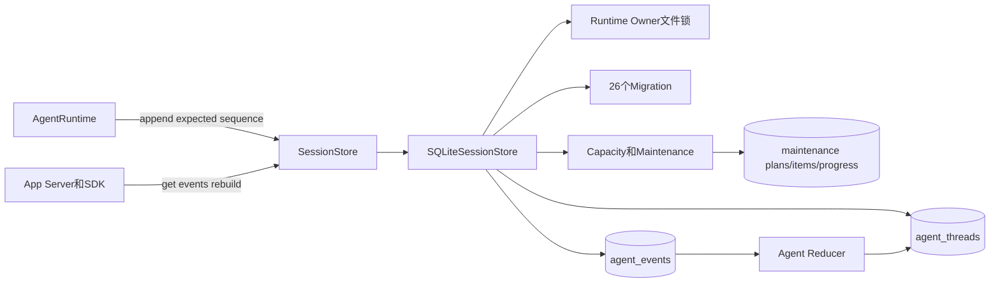
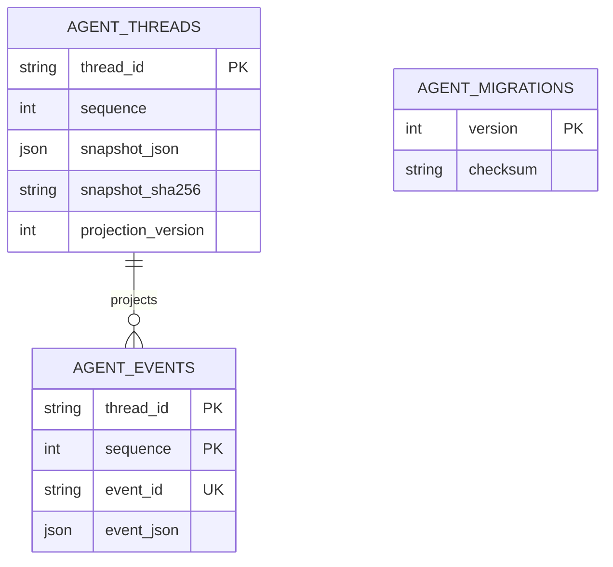
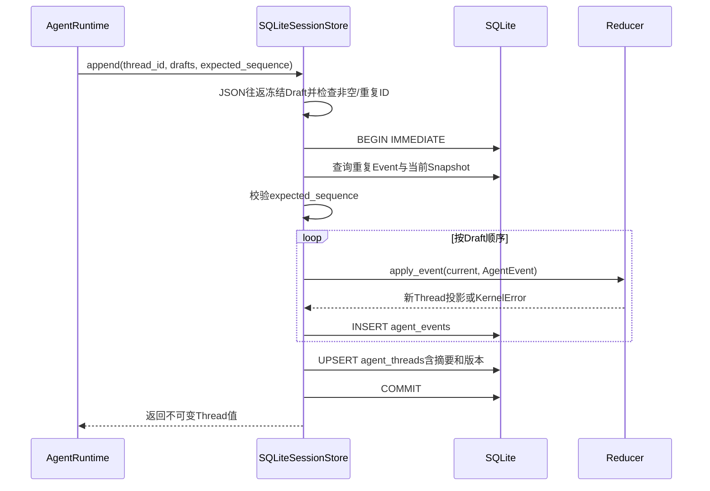
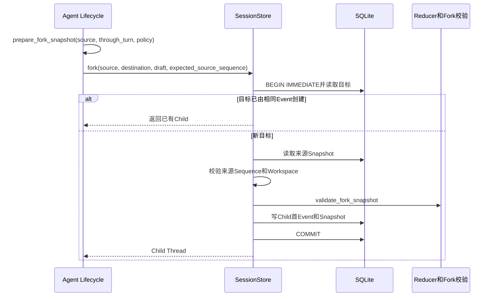
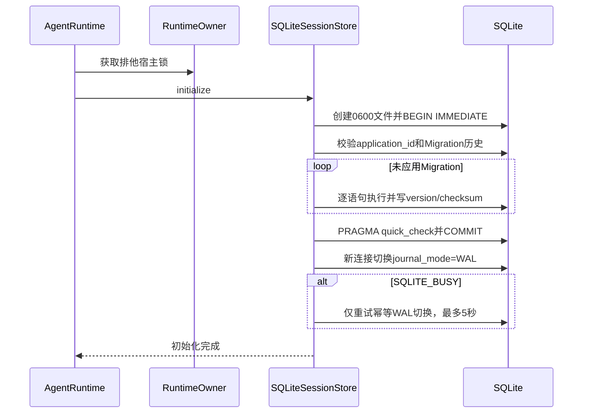
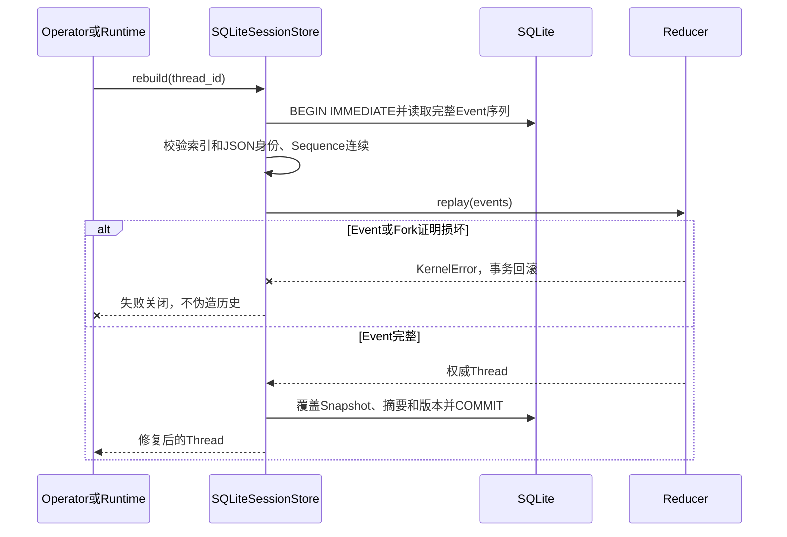
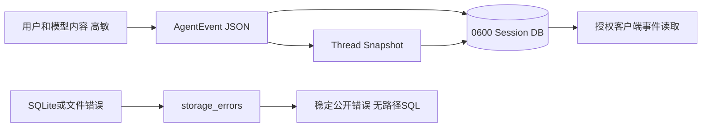
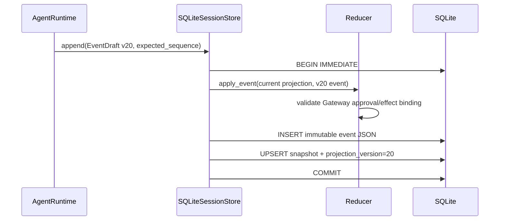
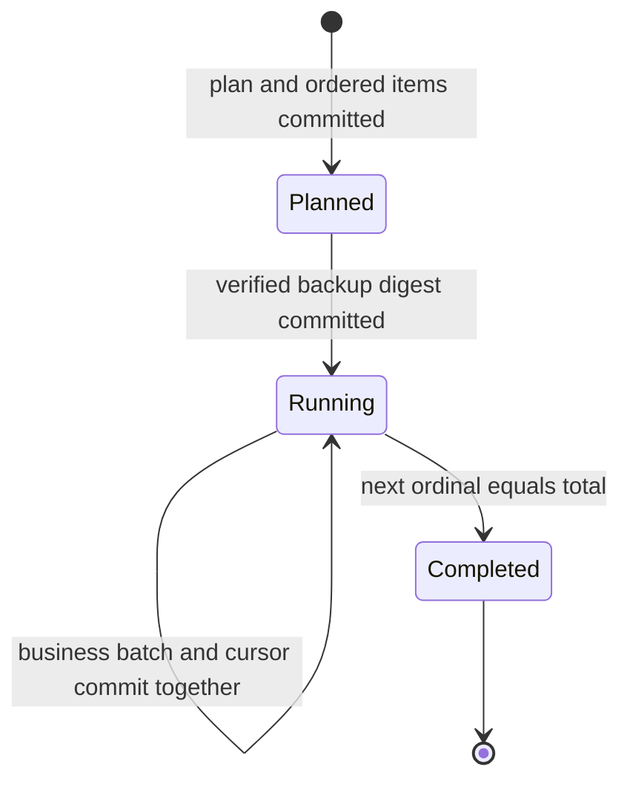

# Session模块设计

## 1. 文档摘要

| 项目 | 内容 |
|---|---|
| 当前能力 | Agent Event Log、Thread快照、批次原子追加、Sequence CAS、幂等Event、Fork、重放、投影修复、单Runtime Owner、SQLite迁移/WAL，以及共库容量、Plan-first保留和备份恢复 |
| 本文状态 | 当前实现；`session`包现行实现的事实源 |
| 代码版本 | `cb3f3ea834624d5a8f84396952eba212650065d1` |
| 当前实现 | `SQLiteSessionStore`；`SessionStore`端口允许后续实现，但当前没有生产级远端Session Store |
| 兼容边界 | 新投影版本20；Agent Event可读1～20；数据库迁移1～26连续且校验和不可变 |
| 上游 | `AgentRuntime`、App Server恢复与Protocol事件查询 |
| 核心保证 | 同一事件批次的Event与Snapshot同事务提交；在线与重放使用同一Reducer |

Session与Trusted Action的Execution Plan、Action Audit及各能力专用效果账本是职责分离的持久事实。
Session保存Agent Thread/Turn语义事实，不承担执行计划、外部副作用终态或对账；Action Audit也不能替代Agent历史。
已删除Action Plane的Effect Journal仅允许离线归档，不参与当前产品启动、恢复或执行。

## 2. 需求背景

Coding Agent必须跨进程重启保留用户输入、模型输出、Tool Call/Result、审批、问题、用量、Compaction
和错误。只保存最后一份Thread JSON会丢失审计和恢复依据；只保存Event而不保存投影又会使每次读取成本
随会话无限增长。并发连接、批次部分写、数据库损坏和迁移中断还可能产生“事件存在但快照不存在”或
“两个Runtime同时继续一个Turn”的状态分叉。

Session模块采用“Event Log为权威事实、Thread Snapshot为可校验投影”的模型，用事务、CAS、摘要和
Runtime Owner关闭上述风险，同时保留从事件重建投影的能力。

## 3. 设计目标与非目标

### 3.1 目标

1. Event与Thread投影在同一SQLite事务中提交或回滚；
2. `expected_sequence`阻止两个调用方静默覆盖同一Thread；
3. 相同Event批次重放返回已有投影，不产生重复事实；部分重复或变体必须冲突；
4. 在线追加与离线重放共享`apply_event/replay`领域校验；
5. Snapshot损坏可被检测并从完整Event Log重建；Event损坏失败关闭；
6. Fork同时校验来源Sequence和Snapshot证明，不继承执行权限；
7. Migration连续、幂等、可校验，未来Schema和未知投影版本失败关闭；
8. SQLite驱动、文件和损坏错误映射为不泄露路径/SQL的稳定`KernelError`；
9. WAL初始化在真实锁竞争下有界，不重放非幂等Migration。
10. Session、Protocol Request和Artifact容量可低敏重算，删除前必须Plan-first、备份并可崩溃续跑。

### 3.2 非目标

1. 当前不提供PostgreSQL、云数据库或跨主机Session Store实现；
2. Runtime Owner不提供故障转移、分布式选主或高可用SLO；
3. 本模块不决定Turn状态转换、Retry资格或Fork内容，这些由Agent领域与Lifecycle生成并验证；
4. 本模块不加密Session正文；0.9.3b只提供内部离线保留，不等于最终用户数据导出、选择性删除或安全擦除；
5. 本模块不保存实时`ItemDelta`，断线恢复使用持久Event；
6. 迁移只有向前执行，没有自动Downgrade或跨版本回滚Schema。

## 4. 约束、假设与术语

| 术语/约束 | 定义 | 影响 |
|---|---|---|
| Event Log | `agent_events`中的有序`AgentEvent` | 领域权威事实，不允许原地改写 |
| Snapshot | `agent_threads.snapshot_json`中的`Thread`投影 | 可重建缓存，必须校验摘要和Sequence |
| Sequence | 每Thread从1连续递增的整数 | CAS、游标和事件顺序依据 |
| Event ID | 全数据库唯一UUID | 相同批次幂等、跨Thread冲突检测 |
| Projection Version | 当前为20 | 未知未来版本拒绝读取 |
| Migration | 文件名版本连续的SQL资源 | 已应用文件摘要变化即失败 |
| Runtime Owner | 数据库旁路文件锁 | 同一数据库最多一个Agent Runtime宿主 |
| Fork Snapshot | 来源Thread前缀、历史摘要和Artifact Owner的只读证明 | `authority="none"`，不复制执行权限 |
| Cursor | `events(after=sequence)`的排他游标 | 必须非负；返回严格连续后缀 |

SQLite数据库文件会收紧到`0600`，由Store新建的父目录使用`0700`；既有父目录权限由部署边界负责
审计。Session所有时间由Agent Event携带有时区墙钟；数据库
Sequence才是顺序权威，不能以墙钟先后替代事件顺序。

## 5. 模块上下文



### 5.1 图示说明与源码映射

- 上游只依赖[`SessionStore`](../../src/harnessix/session/ports.py)，不拼接SQL；
- [`SQLiteSessionStore`](../../src/harnessix/session/sqlite.py)拥有物理事务、Migration和文件锁；
- [`apply_event/replay`](../../src/harnessix/agent/reducer.py)拥有领域合法性，Store不能放宽状态机；
- Runtime先获取Owner，再执行`initialize`和活动Thread恢复，避免第二宿主边迁移边驱动；
- Event表是重建输入，Snapshot表是带摘要的读取加速层。
- [`SQLiteStoreMaintenance`](../../src/harnessix/session/maintenance.py)只在静默维护窗口组合共库容量、Plan、Backup和批次执行，不成为第二产品服务。

## 6. 组件职责与禁止边界

| 组件 | 职责 | 状态所有权 | 直接依赖 | 禁止事项 | 并发/生命周期 |
|---|---|---|---|---|---|
| `SessionStore` | 定义初始化、Owner、读、追加、Fork、事件和重建端口 | 无实现状态 | Agent合同 | 暴露SQLite对象或具体锁 | Runtime生命周期内使用 |
| `SQLiteSessionStore` | 实现事务、Schema、CAS、摘要、游标、重建 | SQLite文件和Owner Token | aiosqlite、Reducer、文件锁 | 决定业务状态或调用副作用 | 每操作独立连接；写事务串行 |
| `storage_errors` | 归一化SQLite/OSError | 无 | SQLite错误码 | 包围应用回调或上抛原始路径、SQL和驱动消息 | 仅包围明确I/O边界 |
| `agent_migrations` | 保存已应用版本和校验和 | 数据库Schema历史 | 内置SQL资源 | 修改已发布Migration | 初始化事务 |
| `agent_events` | 保存不可变Agent Event | Thread事件序列 | Event v1～20 | 部分批次可见、跳号、跨Thread复用ID | PK约束和单事务 |
| `agent_threads` | 保存Thread投影、摘要、版本 | 最新可重建Snapshot | Thread模型 | 被当成唯一事实源 | 与Event批次原子更新 |
| `SQLiteStoreMaintenance` | 容量快照、不可变Plan、备份、批次执行与Restore | 三类共库维护进度 | Session内部表合同 | 执行Tool、在线GC、自动Vacuum | Runtime Owner下的静默维护窗口 |
| `store_maintenance_*` | 保存Plan、按序Item和Progress | 维护审计与恢复游标 | Migration 26 | 保存公开正文或被业务Runtime当作权威 | Plan不可变；Progress与业务变更同事务 |

Session不得导入Provider Adapter、Tool Runtime、Policy或API。Reducer可验证事件语义，但必须保持纯函数，
不能回调Store或执行外部效果。

## 7. 公共接口设计

| 方法 | 调用者 | 输入/输出 | 前置/后置 | 错误/重试 | 取消/超时 | 幂等/顺序 | 权限 |
|---|---|---|---|---|---|---|---|
| `initialize` | Runtime/测试 | 无 → 无 | 创建/识别Harnessix数据库，完成迁移、quick check和WAL | Busy仅WAL切换有界重试；Migration不重放 | 可取消；连接关闭并回滚 | 已应用同摘要Migration跳过 | 需状态目录写权限 |
| `runtime_owner` | `AgentRuntime.__aenter__` | Context Manager | 先获得跨平台旁路排他锁，退出释放 | 已占用为`runtime_busy`；锁I/O失败归一化 | 进程退出由OS释放；应用异常原样传播 | 单数据库单Owner | 不是用户权限，只是宿主所有权 |
| `get_thread` | Runtime/App Service | UUID → Thread | Snapshot存在、摘要/版本/Sequence均正确 | 不存在/损坏稳定失败；不自动修复 | SQLite busy受驱动边界 | 只读一致事务 | 可读完整高敏会话 |
| `thread_ids` | Runtime恢复 | 无 → UUID列表 | 合并Event和Snapshot索引 | 无效ID视为Event损坏 | 同上 | 排序稳定；不丢孤立事实 | 仅宿主内部 |
| `append` | Runtime | Thread、Draft批次、期望Sequence → Thread | 非空冻结批次；不能包含Fork创建 | 冲突应重新读取，不盲目复用新Event ID | 取消前后由事务判定；调用方按原Event ID查询/重试 | 整批幂等、原子、Sequence连续 | 不替代领域授权 |
| `fork` | Runtime Lifecycle | 来源/目标、Fork Draft、来源Sequence → Child Thread | 单个Fork Event、同Workspace、来源证明有效 | 来源更新为`sequence_conflict` | 单写事务 | 相同目标和Event幂等；变体冲突 | Fork权威为none |
| `events` | Protocol/重放 | Thread、after → Event后缀 | after非负 | Event结构/索引/跳号失败关闭 | 只读操作 | 严格Sequence顺序，游标排他 | 可能包含高敏正文 |
| `rebuild` | 运维/恢复 | Thread → 重建Snapshot | Event链完整，Fork祖先无环且可验证 | Event坏不可修；Snapshot坏可覆盖 | 写事务 | 同一Event链结果确定 | 不恢复外部副作用 |

## 8. 数据结构、持久化与关系模型



真实DDL以[`session/migrations`](../../src/harnessix/session/migrations/)为准。`agent_events`使用
`(thread_id, sequence)`复合主键和全局唯一`event_id`；`agent_threads`保存相同Sequence、序列化
Thread、SHA-256和Projection Version；`agent_migrations`在初始化时建立。

| 字段 | 来源 | 约束/语义 | 敏感级别 | 兼容规则 |
|---|---|---|---|---|
| `agent_events.thread_id` | append参数 | 与Event JSON中的Thread一致 | 低 | UUID文本格式 |
| `sequence` | Store分配 | 从1连续；无缺口且与Snapshot一致 | 低 | 永不重排 |
| `event_id` | EventDraft | 全数据库唯一；相同ID必须同载荷同Thread | 低 | 幂等身份不可复用 |
| `event_json` | AgentEvent | 版本化完整事实，可含用户/模型/工具内容 | 高 | Event 1～19由模型和Upcast读取 |
| `snapshot_json` | Reducer投影 | 可重建，不可独立修改 | 高 | Thread当前模型格式 |
| `snapshot_sha256` | Store | 检测篡改、截断和非原子修改 | 低 | 对精确JSON字节计算 |
| `projection_version` | Store常量 | 当前19，未知版本失败关闭 | 低 | 不猜测未来Schema |
| `migration.checksum` | SQL文件 | 已应用内容不可变化 | 低 | 新变更只追加新版本 |

## 9. 正常追加与读取流程



Draft先通过JSON往返复制，防止调用方在await期间修改嵌套Arguments。Reducer在Event INSERT之前执行；
任何一个Event非法时连接Context回滚整批。Commit成功后Fault Injection可以模拟“调用方未收到响应”，
调用方用原Event ID重试将返回已提交Snapshot，而不是追加第二份事实。

## 10. 批次幂等、CAS与冲突

| 场景 | 结果 | 理由 |
|---|---|---|
| 新批次、期望Sequence匹配 | 追加并提交 | 唯一正常写路径 |
| 全批Event ID已存在、载荷/Thread/位置相同 | 返回当前Snapshot，`changed=False` | 处理提交后响应丢失 |
| 只有部分Event已存在 | `event_conflict` | 不能猜测批次边界 |
| Event ID相同但载荷或Thread不同 | `event_conflict` | 防止身份重绑定 |
| 批次内重复Event ID或空批次 | `invalid_batch` | 不创建无意义/歧义事务 |
| 当前Sequence不等于`expected_sequence` | `sequence_conflict` | 调用方必须重读并重新决策 |
| 普通`append`包含`ThreadForked` | `thread_fork_requires_cas` | Fork必须同时验证来源 |

CAS只证明Thread没有在读取后变化，不授权状态转换；事件合法性仍由Reducer负责。遇到
`sequence_conflict`时不能简单换Event ID重试，因为上游请求可能已不再满足活动Turn等前置条件。

## 11. Fork流程与权限边界



Fork Snapshot固定来源Thread、来源Sequence、截止Turn、历史摘要、Tool Result View Policy、Artifact
Owner和只读Items。`authority="none"`表示子Thread只继承历史上下文，不继承待执行Tool、审批、Lease、
Process Owner或其他执行权限。重建Child时递归验证来源前缀并拒绝Fork环。

## 12. 初始化、Migration与WAL



数据库`application_id`固定为Harnessix Session标识；空文件可初始化，其他应用的非空库和Action
数据库均拒绝。Migration必须从1连续到26，已应用摘要必须匹配当前资源，数据库含未知更高版本或缺口
均失败关闭。SQL按分号拆为普通DDL执行，不使用会隐式提交的`executescript`。只有迁移事务提交后才用
新连接启用WAL；锁竞争仅重试WAL模式切换，绝不重放Migration。

### 12.1 迁移能力索引

| 版本范围 | 主要能力 |
|---|---|
| 1～3 | Event/Snapshot基础表、Projection Version、语义合同 |
| 4～5 | Model Attempt和Billing |
| 6～11 | Artifact、Managed Patch/Batch、Batch Diff、Process投影与输出Artifact |
| 12～15 | Context检查、Source一致性和Tool Result模型视图 |
| 16～17 | Compaction Attempt Ledger与活动窗口 |
| 18～19 | Thread Lifecycle/Fork与Turn Retry |
| 20～22 | Protocol Request、Deferred Turn与Interactive Turn |
| 23 | Trusted Action审批与有界效果的Agent Event/Thread v20读取边界 |
| 24～25 | Action Review和Action Output Artifact用途 |
| 26 | Artifact发布时间、不可变维护Plan/Item与可恢复Progress |

这些迁移多数通过版本标记推进最低Reader，不代表每个版本都修改物理列。发布后禁止修改旧SQL文件，
否则校验和会阻断启动。

## 13. 损坏检测、失败与恢复



| 故障 | 可观测事实 | 稳定错误 | 自动重试 | 恢复动作 | 数据安全证明 |
|---|---|---|---|---|---|
| SQLite Busy/Locked | 事务未获得锁 | `storage_busy`、retriable | 上层按原请求/Event ID决定 | 有界等待或稍后重试 | Event幂等与事务原子 |
| 磁盘满 | Commit失败/回滚 | `storage_full` | 否，先释放空间 | 运维处理后按原身份重试 | 未提交批次不可见 |
| 文件/驱动其他失败 | 操作回滚 | `storage_unavailable` | 默认否 | 诊断文件权限/设备 | 不暴露原始路径/SQL |
| 非数据库或物理损坏 | quick check/驱动错误 | `database_corrupt`或`wrong_database` | 否 | 从备份恢复；Event完整时仅修Snapshot | 不覆盖未知文件 |
| Snapshot摘要/结构损坏 | Event仍完整 | `projection_corrupt` | 不在读取中自动修 | 显式`rebuild` | 重放同一Reducer |
| Event JSON/索引/跳号损坏 | 权威历史不可信 | `event_corrupt` | 否 | 从备份恢复，不能仅重建 | 不猜测缺失事实 |
| Projection未来版本 | Reader不理解 | `projection_too_new` | 否 | 使用匹配/更新程序 | 不降级解释 |
| Migration未来/缺口/摘要变化 | Schema历史不可信 | `schema_too_new`、`invalid_migration`、`migration_changed` | 否 | 使用正确发行物/备份 | 不修改已发布历史 |
| Runtime Owner已占用 | 另一个宿主持锁 | `runtime_busy` | 不在内部重试 | 连接现有宿主或等待退出 | 防止双驱动活动Turn |

Session恢复只重建领域投影，不自动重放Provider、Tool、Patch或Process；副作用恢复由`AgentRuntime._recover`
根据重建后的持久事实决定。

## 14. 并发、一致性、取消与超时

- 读操作使用独立连接和`BEGIN`，写操作使用`BEGIN IMMEDIATE`；SQLite负责跨连接串行写；
- `busy_timeout=5000`应用于普通连接，WAL切换使用显式5秒Deadline；
- Runtime Owner是进程级跨平台文件锁，进程异常退出由OS释放；对象Token只保护同实例退出清理；
- Runtime Owner中的`storage_errors`只包围锁目录、打开、获取和关闭I/O，不跨越`yield`包围Runtime应用生命周期；
  该作用域内应用产生的`OSError`或`TimeoutError`保持原类型，不伪装成Session存储故障。Session连接作用域
  另对SQLite驱动及文件系统操作执行稳定错误归一化；
- `append/fork/rebuild`在异常或`CancelledError`下由连接Context回滚；Commit已成功但响应丢失时靠Event ID幂等；
- `_session_connection`把`aiosqlite`连接建立和关闭作为受保护资源任务：调用方在打开期间取消，先等待连接任务结算并关闭；
  在回滚或关闭期间再次取消，先等待资源任务结算再传播取消。`_connection`只委托该资源作用域，不能把
  `async with aiosqlite.connect(...)`的入口取消留给驱动线程异步收尾，否则Windows临时数据库可能仍被占用。
  该保证是连接句柄生命周期，不改变已提交事务的结果，也不把取消后的写入自动重试；
- Store不实现无限内部重试，避免在调用方取消或超时后继续写入；
- `PRAGMA synchronous=FULL`强化本地提交持久性，但不替代文件系统备份或灾难恢复；
- Event顺序是强一致的Thread内序列，不声明不同Thread间的全局时间顺序。

连接资源取消回归位于[`test_store.py`](../../tests/agent/test_store.py)：分别在真实连接已打开但入口尚未
返回、以及真实关闭任务尚未结束时取消调用方，确认取消仍向上传播、连接已经关闭且状态文件可立即删除。
Artifact Soak的Turn超时回归随后通过真实Agent/Store链验证失败Attempt及Windows临时目录清理；
单平台本地通过不等于Windows发布验收，仍以对应Revision的原生CI为准。

## 15. 安全与隐私



Session数据库可包含源码、用户Prompt、模型文本、Tool参数/结果和Artifact引用，应按高敏用户数据保护。
当前依赖本地文件权限和产品工作区边界，没有字段级加密；备份同样必须受保护。`storage_errors`丢弃
原始SQLite/OSError文本，防止路径、SQL或驱动细节进入Protocol。Event合同不应保存Secret值，但Store
不重新扫描语义Payload；Secret零暴露必须由上游合同和执行边界共同保证。

Runtime Owner锁文件使用`O_NOFOLLOW`（平台支持时）和跨平台排他锁；Windows分支复用CRT文件锁并由CI验证互斥。
这只证明Session宿主所有权边界可跨平台，不代表Windows默认完整Coding Tool产品链已经完成。

## 16. 可观测性与运维

Session模块本身不直接发OTel Span/Metric；调用方在Runtime操作中记录Thread/Turn、状态和公开错误码。
持久Event是审计事实，不应被复制成包含正文的日志。可用于诊断的低敏信号包括Migration版本、公开
错误码、重建成功/失败、Sequence和操作耗时；不得记录`event_json`、`snapshot_json`、绝对路径或SQL。

`SQLiteStoreMaintenance`已经提供低敏逻辑/物理水位、Plan-first保留、强制备份、崩溃续跑和显式Restore；它是宿主内部
离线端口，不是`SessionStore`公共业务方法。当前仍没有自动Checkpoint、Vacuum、维护调度、用户导出或安全删除，物理空间
回收与产品化运维入口仍需0.9.3d/0.9.5补齐。

## 17. 核心业务逻辑伪代码

```text
initialize_under_runtime_owner():
    create private directory and database file
    begin immediate transaction
    require application_id is empty or Harnessix Session
    require applied migration versions are continuous and not newer
    for each bundled migration in order:
        if applied: require checksum unchanged
        else: execute ordinary statements and record checksum
    require quick_check == ok
    commit migration transaction
    on a new connection, retry only WAL transition while busy and before deadline

append(thread_id, drafts, expected_sequence):
    frozen = JSON_roundtrip_copy(drafts)
    require nonempty and unique event IDs
    begin immediate transaction
    if every event ID already exists at expected positions with identical payload:
        return current snapshot without changes
    require no partial duplicate or identity mutation
    current = validate_snapshot_and_event_tail(thread_id)
    require current.sequence == expected_sequence
    for draft in frozen order:
        event = add_thread_and_next_sequence(draft)
        current = reducer.apply_event(current, event)
        insert immutable event
    save snapshot plus sha256 and projection version
    commit
    return current

fork(source, destination, event, source_sequence):
    require one authority-free Fork event and same workspace
    begin immediate transaction
    if identical destination event exists: return existing child
    require source snapshot exists and sequence still matches
    validate fork snapshot against source prefix
    create child event and projection atomically

rebuild(thread):
    begin immediate transaction
    load and validate complete event sequence
    recursively validate fork ancestors and reject cycles
    projection = reducer.replay(events)
    overwrite only the derived snapshot
    commit
```

## 18. 源码与测试双向映射

| 设计元素 | 源码文件 | 关键符号 | 测试文件 | 测试函数/合同 | 证明内容 |
|---|---|---|---|---|---|
| 存储端口 | [`ports.py`](../../src/harnessix/session/ports.py) | `SessionStore` | [`session.py`](../../tests/contracts/session.py) | `SessionStoreContract`全部方法 | 实现中立行为合同 |
| SQLite初始化 | [`sqlite.py`](../../src/harnessix/session/sqlite.py) | `initialize`、`_initialize` | [`test_store.py`](../../tests/agent/test_store.py) | `test_migration_idempotent_future_and_checksum`、`test_refuses_action_or_foreign_database` | Schema身份和迁移 |
| WAL并发 | [`sqlite.py`](../../src/harnessix/session/sqlite.py) | `_enable_wal` | [`test_wal_initialization.py`](../../tests/agent/test_wal_initialization.py) | `test_concurrent_first_initialization_converges`、`test_only_wal_transition_is_retried_not_migrations` | 有界且不重放迁移 |
| Runtime Owner | [`sqlite.py`](../../src/harnessix/session/sqlite.py) | `runtime_owner` | [`test_session_upgrade.py`](../../tests/agent/test_session_upgrade.py)、[`test_storage_failures.py`](../../tests/agent/test_storage_failures.py) | `test_second_host_cannot_migrate_before_obtaining_owner_lock`、`test_runtime_owner_does_not_remap_application_oserror` | 先Owner后迁移；应用异常不被I/O归一化器误捕获 |
| 批次原子性 | [`sqlite.py`](../../src/harnessix/session/sqlite.py) | `_freeze_batch`、`_append_in_transaction` | [`test_store.py`](../../tests/agent/test_store.py) | `test_event_projection_transaction_rolls_back`、`test_invalid_result_and_partial_batch_are_atomic` | Event/投影同事务 |
| CAS与Event幂等 | [`sqlite.py`](../../src/harnessix/session/sqlite.py) | `append` | [`session.py`](../../tests/contracts/session.py) | `test_identity_idempotency_and_cursor`、`test_cas_across_connections`、`test_batch_atomicity_and_cross_thread_event_id` | 并发与重复请求 |
| Snapshot校验 | [`sqlite.py`](../../src/harnessix/session/sqlite.py) | `_snapshot`、`_save` | [`test_store.py`](../../tests/agent/test_store.py) | `test_snapshot_tamper_detected_and_repaired` | 摘要检测和修复 |
| Event读取 | [`sqlite.py`](../../src/harnessix/session/sqlite.py) | `_parse_event`、`_events`、`events` | [`session.py`](../../tests/contracts/session.py) | `test_identity_idempotency_and_cursor` | 游标、身份和顺序 |
| 重放重建 | [`sqlite.py`](../../src/harnessix/session/sqlite.py) | `rebuild`、`_validated_replay` | [`test_store.py`](../../tests/agent/test_store.py) | `test_replay_and_projection_rebuild` | Event权威与投影确定性 |
| Fork CAS | [`sqlite.py`](../../src/harnessix/session/sqlite.py) | `fork` | [`session.py`](../../tests/contracts/session.py) | `test_fork_requires_source_cas_and_is_idempotent` | 来源更新和重复Fork |
| Fork权限 | [`lifecycle.py`](../../src/harnessix/agent/lifecycle.py) | `prepare_fork_snapshot`、`validate_fork_snapshot` | [`test_thread_lifecycle.py`](../../tests/context/test_thread_lifecycle.py) | `test_fork_inherits_history_without_replaying_completed_tool_effects`、`test_nested_fork_keeps_original_artifact_owner_and_inherited_history` | 历史继承无执行权 |
| 版本读取 | [`sqlite.py`](../../src/harnessix/session/sqlite.py) | `_parse_event`、`_snapshot` | [`test_session_upgrade.py`](../../tests/agent/test_session_upgrade.py) | `test_old_transcript_migrates_without_rewriting_history`、`test_unknown_projection_version_fails_closed` | Event/投影兼容 |
| 错误归一化 | [`errors.py`](../../src/harnessix/session/errors.py) | `storage_errors` | [`test_storage_failures.py`](../../tests/agent/test_storage_failures.py) | `test_actual_sqlite_readonly_and_full_errors_are_normalized`、`test_driver_error_mapping_never_exposes_raw_message` | 错误稳定与脱敏 |
| 物理损坏 | [`sqlite.py`](../../src/harnessix/session/sqlite.py) | `_snapshot`、`_parse_event` | [`test_storage_failures.py`](../../tests/agent/test_storage_failures.py) | `test_physical_corruption_fails_closed`、`test_invalid_database_file_is_structured_error` | 不猜测损坏历史 |
| 共库容量 | [`capacity.py`](../../src/harnessix/session/capacity.py) | `capacity_report`、`load_thread_facts` | [`test_store_maintenance.py`](../../tests/agent/test_store_maintenance.py) | `test_capacity_report_is_complete_and_low_sensitive` | 三类Store完整、低敏、读取损坏失败关闭 |
| Plan与禁删集合 | [`maintenance_planning.py`](../../src/harnessix/session/maintenance_planning.py)、[`maintenance_records.py`](../../src/harnessix/session/maintenance_records.py) | `build_candidates`、`save_plan`、`load_plan_items` | 同上 | Owner/篡改、accepted保护、Plan后新增未决请求 | 不可变候选和保守保护 |
| 批次与备份恢复 | [`maintenance_execution.py`](../../src/harnessix/session/maintenance_execution.py)、[`maintenance_backup.py`](../../src/harnessix/session/maintenance_backup.py) | `run_batches`、`create_or_reuse_backup`、`restore_database` | 同上 | Backup发布故障、批次提交故障、Changed Candidate Skip、Restore | 业务变更与游标同事务；完整回滚 |

### 18.1 推荐源码阅读路线

1. 先读[`ports.py`](../../src/harnessix/session/ports.py)和
   [`tests/contracts/session.py`](../../tests/contracts/session.py)，理解实现必须满足的合同；
2. 读[`migrations/0001_initial.sql`](../../src/harnessix/session/migrations/0001_initial.sql)及迁移目录，建立物理模型；
3. 按`initialize` → `_enable_wal` → `runtime_owner`阅读初始化和所有权；
4. 按`append` → `_freeze_batch` → `_append_in_transaction` → `_save`阅读写链；
5. 按`_snapshot` → `_parse_event` → `events` → `rebuild`阅读损坏与恢复；
6. 最后读`fork`、`_validated_replay`和Thread Lifecycle测试，理解Fork不继承执行权。
7. 再读[`maintenance.py`](../../src/harnessix/session/maintenance.py)及其四个职责模块，结合
   [`test_store_maintenance.py`](../../tests/agent/test_store_maintenance.py)理解Plan-first、禁删、批次和恢复。

## 19. 测试设计与验收标准

| 层级 | 必测内容 | 证据 |
|---|---|---|
| 合同 | 身份幂等、Cursor、CAS、批次、Thread隔离和Fork | `SessionStoreContract`由SQLite实现复用 |
| 事务故障 | Event后/Projection后/Commit后Fault、非法批次 | `tests/agent/test_store.py` |
| 迁移兼容 | 1～26历史、Event 1～20、未来版本和摘要变化 | `test_session_upgrade.py`、`test_store.py`、真进程升级测试 |
| WAL竞争 | 首次并发、Busy Deadline、取消、真实Writer竞争 | `test_wal_initialization.py` |
| 损坏与I/O | Event/Snapshot/索引损坏、只读、磁盘满、错误脱敏 | `test_storage_failures.py` |
| 生命周期 | Resume、Archive、Fork截止点、嵌套Fork和Artifact Owner | `test_thread_lifecycle.py` |
| Runtime集成 | 接受后崩溃、审批/Process/Patch恢复 | Agent各崩溃测试 |
| Store维护 | 低敏容量、Plan篡改、accepted保护、Backup故障、批次恢复、候选漂移和Restore | `test_store_maintenance.py` |

验收命令至少包含上述合同和故障测试；新增`SessionStore`实现必须继承合同套件，并补充该数据库特有的
事务、迁移、锁和真实故障测试。仅通过内存Fake不构成生产存储验收。

## 20. 兼容性、风险与后续工作

| 项目 | 当前影响 | 后续归属 |
|---|---|---|
| 只有SQLite Session实现 | 不支持远端协作、跨主机接管或云HA | 1.x按真实云需求评估 |
| Windows默认产品未验收 | Session宿主锁可跨平台不等于Windows Coding Tool链完整可用 | 0.9.1/0.9.5 |
| 无字段级加密 | 本地文件泄漏会暴露会话和源码 | 0.9.4安全审查及OS存储策略 |
| 内部离线保留已实现，但无用户导出、安全删除和自动Vacuum | 逻辑正文/终态可回收，物理空间和用户生命周期仍不完整 | 0.9.3d/0.9.5/1.0门禁 |
| 有Plan绑定备份与内部Restore，但无产品维护命令 | 宿主可恢复；最终用户仍缺确认、空间Preflight和诊断UX | 0.9.5 |
| Migration无Downgrade | 版本回滚需兼容旧Schema的旧Reader或备份恢复 | 发布升级设计 |
| Snapshot读取不自动重建 | 可用性让位于明确损坏诊断 | 运维命令应显式执行并留证据 |

本文沿用DOC-1.2黄金样例结构。Session状态和字段属于本文，Agent Turn状态属于
[Agent Runtime模块设计](agent.md)；后续聚合文档只链接这两个事实源，不复制维护状态机。

## 21. Trusted Action投影升级（0.9.1e2）

migration23不新增业务表或列，只声明当前Reader能够验证Agent Event/Thread v20并阻止旧Reader接管新语义。SQLite写入仍在`_save`中把Event批次和Projection v20放入同一事务；旧v1～v19 Event JSON保持原字节。



升级和读取不变量：

1. migration资源序号必须连续到26，旧25数据库只追加新的Migration记录；
2. `_snapshot`接受Projection 1～20，未知21及以上失败关闭；
3. `_parse_event`接受Event 1～20，v19及更早若出现统一Action字段由模型版本守卫拒绝；
4. 新写入统一使用v20，旧事件序列和摘要不重写；
5. Snapshot重建继续复用同一Reducer，因此在线追加与离线重放对统一Action具有相同校验。

专项证据位于[`test_session_upgrade.py`](../../tests/agent/test_session_upgrade.py)、[`test_schemas.py`](../../tests/agent/test_schemas.py)和[`test_trusted_action_runtime.py`](../../tests/agent/test_trusted_action_runtime.py)。

## 22. Action Review用途与migration24（0.9.1e3）

[`0024_trusted_action_review_artifacts.sql`](../../src/harnessix/session/migrations/0024_trusted_action_review_artifacts.sql)重建Artifact用途约束以加入`action_review`，逐列复制旧数据并保持Agent Event/Thread v20。迁移不改写历史JSON，也不改变Session投影版本。

Review Artifact可先于Session审批引用提交。只有当前pending Call经CAS追加审批事件后，公共Reader和模型历史才能通过Session反向引用取得正文；提交前崩溃留下的孤儿对外不可见。Router批准已提交而Session事件未提交时，e2的双账本恢复继续用原Checkpoint时间戳补投影，不生成第二个批准事实。

升级、旧库重开和Artifact用途回归位于[`test_session_upgrade.py`](../../tests/agent/test_session_upgrade.py)及[`tests/artifacts`](../../tests/artifacts/)，完整Patch崩溃窗口位于[`test_trusted_action_patch.py`](../../tests/delivery/test_trusted_action_patch.py)。

## 23. Trusted Action输出用途与migration25（0.9.1e4）

[`0025_trusted_action_output_artifacts.sql`](../../src/harnessix/session/migrations/0025_trusted_action_output_artifacts.sql)
重建Artifact用途约束并加入`action_output`，逐列复制既有行，不改写Agent Event、Thread投影或已有Artifact正文。
该用途保存已批准Trusted Process Action的有界终态输出：发布前核对pending Call、Process审批与Plan身份；发布后只有
Session中唯一终态Tool Result反向引用同一Artifact和Route效果摘要时，公共Reader与模型历史才可读取正文。

确认丢失时发布器只查询并精确匹配原Artifact ID、Call、Workspace Scope、正文摘要、记录数和原始TTL，不创建第二份输出。
旧库升级、WAL并发升级和输出用途回归由[`test_session_upgrade.py`](../../tests/agent/test_session_upgrade.py)、
[`test_wal_initialization.py`](../../tests/agent/test_wal_initialization.py)与[`tests/artifacts`](../../tests/artifacts/)覆盖。

## 24. 共库容量与Maintenance（0.9.3b）

### 24.1 模块边界

[`SQLiteStoreMaintenance`](../../src/harnessix/session/maintenance.py)在Session包内组合三类共库事实：Session Event/Thread、
Protocol Request和Artifact。它不扩展`SessionStore`业务端口，也不被Agent Runtime在Turn热路径自动调用。宿主必须先排空同进程
业务操作并持有`runtime_owner()`；Snapshot只读例外。



### 24.2 正式数据合同

| 合同 | 用途 | 关键不变量 |
|---|---|---|
| `StoreCapacityReport` | 三类逻辑水位及DB/WAL字节 | Store顺序固定；不含业务ID、路径和正文 |
| `RetentionPolicy` | Cutoff、最大Item和三类动作开关 | 1≤`max_items`≤10000 |
| `MaintenancePlan` | 公开Dry Run | 候选计数不超过上限；集合摘要绑定全部Item |
| `MaintenanceProgress` | 可恢复游标 | `applied+skipped=next_ordinal`；running必有Backup摘要 |
| `MaintenanceExecutionReport` | 执行结果 | 返回原Plan、最终Progress和After容量 |
| `StoreRestoreReport` | 完整回滚结果 | 备份摘要与恢复后容量可复核 |

内部`PlanItem`保存`kind/key/precondition_sha256`。Key只进入`store_maintenance_items`，不进入公开报告；Plan Payload、Key、候选
顺序和Progress均在加载时重新校验。

### 24.3 禁删与执行顺序

- 未归档、活动、不确定效果、Fork来源或保留期内Thread禁止删除；
- 任意`accepted` Protocol Request存在时，Session与Artifact全局保护；
- Artifact只在Published、到期、Owner非活动且无不确定效果时清空正文；
- Thread候选必须先包含其全部Published Artifact Body Item；容量不足时整组不选；
- Protocol只删除满足Cutoff的completed/failed行；
- 执行时事实变化不重选候选，只将原Item计为Skip。

### 24.4 原子恢复伪代码

```text
execute(plan_id, backup):
    require runtime owner and quiet window
    validate immutable plan/items/progress
    if planned:
        create or reuse plan-bound verified backup
        atomically mark running with backup sha256
    for batch from next_ordinal:
        begin immediate
        reload and validate plan/items/progress
        apply or skip each item after current protection checks
        CAS advance ordinal and counts in the same transaction
        commit
    return after capacity

restore(backup):
    verify application id, quick_check and sha256
    checkpoint current WAL
    copy backup to same-directory temporary file and fsync
    atomically replace database and remove stale WAL/SHM
    initialize and rescan capacity
```

完整字段、序列图、故障窗口和运维限制见
[0.9.3b详细设计](../changes/m09-3b-persistent-capacity-and-retention.md)与
[ADR 0090](../adr/0090-plan-first-store-maintenance-and-backup.md)。逻辑删除不保证文件缩小；自动Checkpoint/Vacuum仍不属于本模块
当前热路径。

## 25. 变更记录

| 文档版本 | 代码版本 | 日期 | 变更摘要 |
|---|---|---|---|
| 7 | `cb3f3ea834624d5a8f84396952eba212650065d1` | 2026-09-20 | 增加Migration 26、三类共库容量、不可变Plan、保守禁删、批次崩溃恢复及Plan绑定备份/Restore |
| 5 | `809ed2b1a10f5cb462989a12dddf44f83a9d01ab` | 2026-09-19 | 增加migration25与`action_output`用途，记录Trusted Process终态输出发布、授权与确认丢失边界 |
| 4 | `71a479439edcdd29b863ec3a9bad7a52586dd1bf` | 2026-09-13 | 增加migration24与`action_review`用途，记录Artifact先行、Session授权和双账本恢复边界 |
| 3 | `328aa2d6c8ee85a75ab2baef51b80869dc4089a8` | 2026-09-13 | 增加migration23、Projection v20、统一Action审批/效果读取与旧v19数据库向前升级证据；历史Event不重写 |
| 2 | `e717a87e21d7d03b46a44a59ab203f3a8c80f9e9` | 2026-09-13 | 收窄`storage_errors`作用域，明确Runtime Owner跨平台锁边界，并增加应用`OSError/TimeoutError`不得误归类的回归合同 |
| 1 | `8321ef383f2cbb3ab76191a1cc3db361a52e92ef` | 2026-09-12 | DOC-1.3 Wave A Session模块设计初版 |
